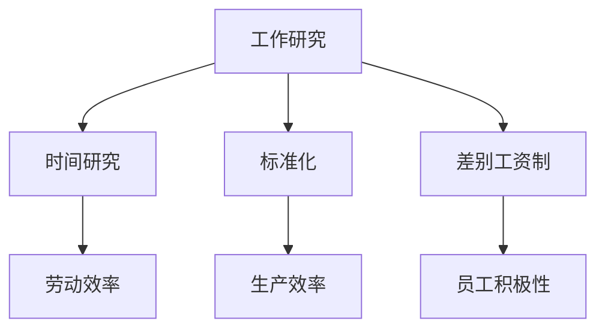

                 

# 经典管理理论的现代价值

> 关键词：管理理论、科学管理、行为科学、组织行为学、现代企业管理、战略规划、创新实践

> 摘要：本文旨在探讨经典管理理论的现代价值，通过对科学管理理论、行为科学管理理论和组织行为学的深入分析，揭示这些理论在当代企业管理和战略规划中的实际应用与未来发展趋势。文章将从历史背景、核心概念、理论解析、实战应用等多个维度展开，为读者提供全面而深刻的理解。

### 第一部分：引言与背景

#### 第1章：经典管理理论的历史与演变

> **1.1 管理理论的起源与发展**

管理理论起源于工业革命时期，随着工厂制度的确立和生产力的提高，对如何有效管理企业和提高生产效率的需求日益迫切。最早的管理理论可以追溯到18世纪末和19世纪初的工厂制度，这一时期的代表性人物是亚当·斯密（Adam Smith）。斯密提出了劳动分工的概念，认为通过将工作分解为简单的任务，可以大幅提高生产效率。

然而，真正意义上的现代管理理论的形成则是在20世纪初。泰勒（Frederick Taylor）被誉为“科学管理之父”，他提出了科学管理理论，主张通过科学的方法来研究和优化工作流程，提高劳动生产率。泰勒的《科学管理原理》（Principles of Scientific Management）一书，成为管理理论的奠基之作。

随后，法约尔（Henri Fayol）提出了管理职能理论，将管理活动划分为计划、组织、指挥、协调和控制五个基本职能，这一理论对后世管理实践产生了深远影响。法约尔还提出了14条管理原则，包括分工、统一指挥、统一领导、个人利益服从整体利益等，成为企业管理的基本准则。

在行为科学管理理论方面，梅奥（Elton Mayo）等人通过对霍桑实验的研究，揭示了工作环境对员工行为和工作效率的影响。他们认为，管理不应仅关注生产效率，还应关注员工的情感和心理需求。这一理论的提出，标志着管理学从科学管理向行为科学的转变。

> **1.2 管理理论的三大基石**

管理理论的三大基石包括科学管理理论、行为科学管理理论和组织行为学理论。这三者共同构成了现代管理理论的核心。

科学管理理论强调通过科学的方法来研究和优化工作流程，以提高生产效率和劳动生产率。其核心观点是，通过将工作分解为简单的任务，并为每个任务找到最合适的人选，可以实现劳动效率的最大化。

行为科学管理理论则关注员工的心理需求和行为，强调通过改善工作环境和激励员工，来提高工作效率。这一理论认为，员工不仅仅是生产工具，更是企业发展的关键资源。

组织行为学理论则从组织层面出发，研究组织的结构、文化和行为，以及这些因素对组织绩效的影响。组织行为学关注如何通过组织变革和领导力提升，来实现组织目标。

> **1.3 经典管理理论的代表人物**

在管理理论的发展历程中，有许多杰出的代表人物，他们的贡献为管理理论的进步奠定了基础。

泰勒（Frederick Taylor）被誉为“科学管理之父”，他的科学管理理论对后世管理实践产生了深远影响。

法约尔（Henri Fayol）是管理职能理论的创始人，他提出了管理的基本职能和14条管理原则，成为企业管理的基本准则。

马斯洛（Abraham Maslow）是行为科学管理理论的代表人物，他提出了需求层次理论，揭示了人的需求层次和对工作的态度。

梅奥（Elton Mayo）是组织行为学的开创者之一，他通过对霍桑实验的研究，揭示了工作环境对员工行为和工作效率的影响。

#### 第2章：经典管理理论的现代意义

> **2.1 管理理论的普遍性与适应性**

经典管理理论具有普遍性和适应性，能够在不同国家和地区、不同行业和企业中得到广泛应用。随着全球化进程的加快和经济发展的不确定性，企业面临的市场环境日益复杂，管理理论的普遍性和适应性显得尤为重要。

科学管理理论在提高生产效率方面的优势，使得其在制造业、服务业和物流等领域得到广泛应用。行为科学管理理论关注员工的需求和情感，有助于提高员工的工作满意度和忠诚度，从而提升企业的核心竞争力。组织行为学理论则从组织层面出发，帮助企业实现组织变革和领导力提升，以适应快速变化的市场环境。

> **2.2 现代企业管理的挑战与对策**

现代企业管理面临诸多挑战，如全球化的竞争压力、技术创新的加速、人力资源的多样化等。为应对这些挑战，企业管理需要不断创新和改进。

首先，企业应加强内部沟通和协作，提高组织效率。通过建立有效的沟通渠道和协作机制，企业可以更好地整合内部资源，提高决策效率。

其次，企业应重视员工培训和职业发展，提升员工的综合素质和创新能力。通过提供多样化的培训机会和发展路径，企业可以激发员工的潜能，提高员工的工作满意度和忠诚度。

此外，企业还应关注企业文化建设和组织变革。良好的企业文化可以增强员工的归属感和凝聚力，促进企业的可持续发展。组织变革则有助于企业适应市场环境的变化，实现持续发展。

### 第二部分：管理理论的深层次探讨

#### 第3章：科学管理理论解析

> **3.1 泰勒的科学管理理论**

泰勒的科学管理理论主要包括以下三个方面：

**（1）工作研究**

工作研究是泰勒科学管理理论的核心。泰勒主张通过对工作流程进行科学分析，找出最有效的工作方式，从而提高劳动生产率。工作研究包括时间研究、动作研究和疲劳研究等。

**（2）标准化**

标准化是泰勒科学管理理论的重要原则。泰勒认为，通过制定标准化的操作规程和作业标准，可以确保员工按照最佳方法进行工作，从而提高生产效率和产品质量。

**（3）工资支付制度改革**

泰勒提出了差别工资制，即根据员工的工作表现支付不同水平的工资。这种制度鼓励员工提高工作效率，从而提高企业的整体生产效率。

> **3.2 科学管理理论的数学模型与算法**

科学管理理论可以运用多种数学模型和算法来优化工作流程和提高生产效率。以下是一些常见的数学模型和算法：

**（1）劳动效率优化模型**

劳动效率优化模型用于确定最优的工作时间和任务分配。该模型考虑了工作强度、工作时间、休息时间和生产效率等因素，通过优化时间分配来提高劳动生产率。

```latex
最大化：生产效率 = f(工作时间, 任务分配)
约束条件：工作时间 + 休息时间 = 总工作时间
```

**（2）工作流程优化算法**

工作流程优化算法用于分析和优化工作流程，以提高生产效率。常见的优化算法包括遗传算法、模拟退火算法和蚁群算法等。

```python
# 遗传算法伪代码
初始化：种群，适应度函数
循环：
    选择：根据适应度选择优秀个体
    交叉：对优秀个体进行交叉操作
    变异：对个体进行变异操作
    替换：用新产生的个体替换种群中的部分个体
    更新适应度函数
直到满足终止条件
```

#### 第4章：行为科学管理理论解读

> **4.1 马斯洛的需求层次理论**

马斯洛的需求层次理论将人类需求分为五个层次：生理需求、安全需求、社交需求、尊重需求和自我实现需求。这一理论揭示了人的需求层次和对工作的态度。

**（1）生理需求**

生理需求是人的最基本需求，包括食物、水、空气、住所等。在生理需求得到满足后，人们才会追求更高层次的需求。

**（2）安全需求**

安全需求包括安全感、健康和财产安全等。人们渴望在一个稳定和安全的环境中工作，以避免风险和不确定性。

**（3）社交需求**

社交需求包括友情、爱情、家庭和社交活动等。人们渴望与他人建立良好的人际关系，获得社交支持和认可。

**（4）尊重需求**

尊重需求包括自尊和他人尊重。人们希望得到他人的尊重和认可，以提升自我价值感。

**（5）自我实现需求**

自我实现需求是人的最高层次需求，包括实现个人潜能、追求个人成长和实现自我价值。人们渴望在工作中实现个人目标和价值。

> **4.2 人类行为分析模型**

人类行为分析模型用于分析人的行为和心理需求，以指导企业管理。以下是一种基本的人类行为分析模型：

**（1）需求分析**

需求分析是行为分析的基础。通过了解员工的需求层次，企业管理者可以制定有针对性的激励措施，提高员工的工作满意度和忠诚度。

**（2）动机分析**

动机分析关注员工的工作动机和行为。了解员工的动机，可以帮助管理者制定有效的激励机制，激发员工的工作热情和创造力。

**（3）行为分析**

行为分析关注员工的行为表现和工作成果。通过对员工行为进行分析，管理者可以识别优秀员工和需要改进的员工，制定相应的培养和提升计划。

**（4）反馈分析**

反馈分析是对员工工作表现的一种评价和反馈。通过反馈分析，管理者可以了解员工的需求和动机，及时调整管理策略，提高员工的工作效率和满意度。

#### 第5章：组织行为学理论

> **5.1 组织行为学的核心概念**

组织行为学是一门研究组织内部个体、团队和组织整体行为的学科。其核心概念包括：

**（1）个体行为**

个体行为是指组织内部员工的行为。组织行为学关注员工的行为动机、价值观、态度和工作满意度等，以及这些因素对工作绩效的影响。

**（2）团队行为**

团队行为是指团队内部成员的合作和互动。组织行为学关注团队的目标设定、沟通、协作和冲突管理，以及这些因素对团队绩效的影响。

**（3）组织行为**

组织行为是指组织整体的行为，包括组织文化、组织结构、组织变革和领导力等。组织行为学关注组织行为的本质、机制和影响因素，以及这些因素对组织绩效的影响。

> **5.2 组织行为学的方法与工具**

组织行为学采用多种方法和工具来研究组织行为，以下是一些常见的方法和工具：

**（1）调查法**

调查法是通过问卷调查来收集员工对组织行为的主观感受和看法。这种方法可以了解员工的需求、动机、态度和工作满意度等。

**（2）实验法**

实验法是在控制条件下，通过实验来观察和验证组织行为的影响因素和机制。这种方法可以精确地测量和比较不同组织行为的效果。

**（3）案例分析**

案例分析是通过分析具体案例来了解组织行为的实践应用和成效。这种方法可以帮助企业管理者借鉴成功经验和避免失败教训。

**（4）数理模型**

数理模型是组织行为学的一种重要工具，用于分析和预测组织行为。这种方法可以运用数学公式和算法来描述和解释组织行为。

### 第三部分：管理理论的实战应用

#### 第6章：管理理论在企业战略中的应用

> **6.1 战略管理的基本理论**

战略管理是企业为了实现长期目标而进行的全局性规划和决策过程。战略管理的基本理论包括以下方面：

**（1）战略规划**

战略规划是企业制定长期目标和战略的过程。通过战略规划，企业可以明确发展方向和路径，制定具体的战略目标和行动方案。

**（2）战略实施**

战略实施是企业将战略规划转化为实际行动的过程。战略实施包括组织结构设计、人力资源配置、流程优化和资源配置等。

**（3）战略评估**

战略评估是企业对战略实施效果进行评估和调整的过程。通过战略评估，企业可以了解战略实施的成效和问题，及时调整战略目标和行动方案。

> **6.2 管理理论在战略规划中的实际应用**

管理理论在战略规划中具有广泛的应用，以下是一些实际应用案例：

**（1）科学管理理论在战略规划中的应用**

科学管理理论通过优化工作流程和提高劳动生产率，为战略规划提供了技术支持。企业可以通过科学管理理论的实践，提高生产效率和产品质量，从而为战略目标的实现提供有力保障。

**（2）行为科学管理理论在战略规划中的应用**

行为科学管理理论通过关注员工的需求和激励，为战略规划提供了人文关怀。企业可以通过行为科学管理理论的实践，提高员工的工作满意度和忠诚度，从而激发员工的积极性和创造力，为战略目标的实现提供动力。

**（3）组织行为学理论在战略规划中的应用**

组织行为学理论通过研究组织结构和组织文化，为战略规划提供了组织保障。企业可以通过组织行为学理论的实践，优化组织结构，提升组织文化，为战略目标的实现提供坚实的组织基础。

#### 第7章：管理理论的创新与实践

> **7.1 管理理论的创新趋势**

随着科技的进步和社会的发展，管理理论也在不断创新和演进。以下是一些管理理论的创新趋势：

**（1）数字化管理**

数字化管理是指利用信息技术和数字工具来提高企业管理效率和决策水平。数字化管理包括大数据分析、人工智能、云计算和物联网等技术的应用，为企业提供更加精准和高效的管理手段。

**（2）平台化管理**

平台化管理是指以平台为核心，整合各种资源和能力，实现企业内部和外部资源的协同和共享。平台化管理强调企业之间的合作和共赢，通过构建共享平台，实现资源的最优配置和利用。

**（3）创新管理**

创新管理是指通过激发员工的创造力和创新能力，推动企业不断进行技术创新和管理创新。创新管理强调企业应建立创新文化和创新机制，为员工提供创新的环境和支持，从而实现持续创新和竞争优势。

> **7.2 创新管理理论的实践案例**

以下是一些创新管理理论的实践案例：

**（1）华为的数字化管理**

华为是中国领先的科技公司，其数字化管理实践在全球范围内具有很高的声誉。华为通过大数据分析、人工智能和云计算等技术的应用，实现了企业运营的自动化和智能化，大幅提高了管理效率和决策水平。

**（2）阿里巴巴的平台化管理**

阿里巴巴是中国领先的电商平台，其平台化管理实践在业界具有很高的影响力。阿里巴巴通过构建电商生态圈，整合商家、消费者和第三方服务提供商的资源，实现了资源共享和协同发展，为消费者提供更加丰富和便捷的购物体验。

**（3）谷歌的创新管理**

谷歌是全球领先的科技公司，其创新管理实践在全球范围内具有很高的声誉。谷歌通过建立创新文化和创新机制，鼓励员工进行创新实验和探索，实现了持续的技术创新和管理创新，为公司的持续发展提供了强大动力。

### 第四部分：附录

#### 第8章：管理理论研究资源与工具

> **8.1 管理理论研究的主要资源**

管理理论研究的主要资源包括学术期刊、学术数据库、学术会议和论坛等。以下是一些常见的管理理论研究资源：

**（1）学术期刊**

学术期刊是管理理论研究的重要载体，包括《管理科学学报》、《南开管理评论》、《中国管理科学》等。这些期刊发表了大量的管理理论研究成果，为管理理论研究提供了丰富的素材。

**（2）学术数据库**

学术数据库是管理理论研究的重要工具，包括CNKI（中国知网）、WanFang Data（万方数据）等。这些数据库收录了大量的学术期刊、学位论文和会议论文，为管理理论研究提供了丰富的数据资源。

**（3）学术会议与论坛**

学术会议与论坛是管理理论研究者交流研究成果和探讨前沿问题的重要平台，包括中国管理科学年会、全国企业管理现代化创新成果交流大会等。这些会议和论坛为管理理论研究者提供了广泛的交流机会，促进了管理理论的创新和发展。

> **8.2 管理理论研究的工具与方法**

管理理论研究采用多种工具和方法，以下是一些常见的管理理论研究工具和方法：

**（1）数据分析方法**

数据分析方法是管理理论研究的重要工具，包括描述性统计分析、回归分析、因子分析、结构方程模型等。这些方法可以用于分析管理理论研究的实证数据，揭示管理现象的内在规律。

**（2）调查研究方法**

调查研究方法是管理理论研究的一种常用方法，包括问卷调查、深度访谈、案例研究等。这些方法可以收集大量一手数据，为管理理论研究提供丰富的实证素材。

**（3）案例研究方法**

案例研究方法是管理理论研究的一种重要方法，通过分析具体案例，探讨管理现象的成因、发展和影响。案例研究方法可以帮助管理理论研究者深入了解管理实践，为理论创新提供实证依据。

#### 第9章：经典管理理论的未来展望

> **9.1 经典管理理论的未来发展趋势**

经典管理理论在未来的发展趋势将受到科技进步、社会变革和企业管理实践的影响。以下是一些经典管理理论的未来发展趋势：

**（1）数字化与智能化管理**

随着大数据、人工智能和物联网等技术的发展，数字化和智能化管理将成为企业管理的重要趋势。企业将利用数字化和智能化技术，提高管理效率和决策水平，实现管理的精细化、智能化和个性化。

**（2）跨学科融合与管理创新**

未来管理理论的发展将更加注重跨学科融合，融合经济学、心理学、社会学、计算机科学等学科的知识，推动管理理论的创新和发展。跨学科融合将有助于解决企业管理中的复杂问题，提高管理理论的实用性和有效性。

**（3）企业社会责任与可持续发展**

随着社会对环境、社会和治理（ESG）的关注日益增加，企业社会责任和可持续发展将成为经典管理理论的重要内容。企业将更加注重社会责任和可持续发展，通过履行社会责任，实现企业的长期稳定发展。

> **9.2 经典管理理论的未来价值**

经典管理理论在未来的发展将继续发挥重要作用，为企业管理提供理论指导和实践借鉴。以下是一些经典管理理论的未来价值：

**（1）科学管理理论的未来价值**

科学管理理论将继续在提高生产效率、优化工作流程和提升劳动生产率方面发挥重要作用。随着数字化和智能化技术的发展，科学管理理论将得到进一步的应用和发展。

**（2）行为科学管理理论的未来价值**

行为科学管理理论将继续关注员工的需求和激励，提高员工的工作满意度和忠诚度，从而提升企业的核心竞争力。在数字化和智能化管理时代，行为科学管理理论将得到更广泛的应用和发展。

**（3）组织行为学理论的未来价值**

组织行为学理论将继续研究组织内部个体、团队和组织整体的行为，探讨如何通过组织变革和领导力提升，实现组织的目标和使命。在跨学科融合和管理创新的背景下，组织行为学理论将发挥更加重要的作用。

### 总结

经典管理理论在企业管理中具有不可替代的价值。通过科学管理理论、行为科学管理理论和组织行为学理论的深入探讨，我们可以更好地理解企业管理的基本原理和实践方法。在未来的发展过程中，经典管理理论将继续为企业管理提供理论指导和实践借鉴，助力企业在数字化和智能化时代实现持续创新和竞争优势。

---

**作者：AI天才研究院/AI Genius Institute & 禅与计算机程序设计艺术 /Zen And The Art of Computer Programming**<|vq_16441|>### 第一部分：引言与背景

#### 第1章：经典管理理论的历史与演变

**1.1 管理理论的起源与发展**

管理理论的起源可以追溯到工业革命时期。在这个时期，随着工厂制度的确立和生产力的提高，如何有效地管理和提高生产效率成为了一个迫切的问题。早期的管理理论主要关注如何通过组织劳动和资源来提高生产效率。

**1.2 管理理论的三大基石**

管理理论的三大基石包括科学管理理论、行为科学管理理论和组织行为学理论。这些理论在不同的历史时期对企业管理和实践产生了深远的影响。

**1.3 经典管理理论的代表人物**

在管理理论的发展历程中，有许多杰出的代表人物，他们的贡献为管理理论的进步奠定了基础。泰勒、法约尔、马斯洛等人的理论和实践对现代企业管理产生了深远的影响。

#### 第2章：经典管理理论的现代意义

**2.1 管理理论的普遍性与适应性**

经典管理理论具有普遍性和适应性，能够在不同的国家和地区、不同的行业和企业中得到广泛应用。这一特点使得经典管理理论在当今复杂多变的市场环境中仍然具有重要的现实意义。

**2.2 现代企业管理的挑战与对策**

现代企业管理面临诸多挑战，如全球化的竞争压力、技术创新的加速、人力资源的多样化等。为了应对这些挑战，企业管理需要不断创新和改进。

### 第二部分：管理理论的深层次探讨

#### 第3章：科学管理理论解析

**3.1 泰勒的科学管理理论**

泰勒的科学管理理论主要包括工作研究、标准化和工资支付制度改革三个方面。这些理论为提高生产效率和劳动生产率提供了科学的方法。

**3.2 科学管理理论的数学模型与算法**

科学管理理论可以运用多种数学模型和算法来优化工作流程和提高生产效率。本文将详细介绍劳动效率优化模型和工作流程优化算法。

#### 第4章：行为科学管理理论解读

**4.1 马斯洛的需求层次理论**

马斯洛的需求层次理论将人类需求分为五个层次，揭示了人的需求层次和对工作的态度。这一理论为企业管理提供了重要的理论依据。

**4.2 人类行为分析模型**

人类行为分析模型用于分析人的行为和心理需求，以指导企业管理。本文将详细介绍需求分析、动机分析、行为分析和反馈分析。

#### 第5章：组织行为学理论

**5.1 组织行为学的核心概念**

组织行为学关注个体、团队和组织整体的行为。本文将详细探讨个体行为、团队行为和组织行为的核心概念。

**5.2 组织行为学的方法与工具**

组织行为学采用多种方法和工具来研究组织行为。本文将介绍调查法、实验法、案例分析和数理模型等常见的方法和工具。

### 第三部分：管理理论的实战应用

#### 第6章：管理理论在企业战略中的应用

**6.1 战略管理的基本理论**

战略管理是企业为了实现长期目标而进行的全局性规划和决策过程。本文将探讨战略规划、战略实施和战略评估的基本理论。

**6.2 管理理论在战略规划中的实际应用**

本文将结合实际案例，探讨科学管理理论、行为科学管理理论和组织行为学理论在战略规划中的实际应用。

#### 第7章：管理理论的创新与实践

**7.1 管理理论的创新趋势**

本文将讨论数字化管理、平台化管理和创新管理的趋势，并探讨这些创新趋势对企业管理实践的影响。

**7.2 创新管理理论的实践案例**

本文将通过华为、阿里巴巴和谷歌等公司的实践案例，展示创新管理理论的实际应用和成效。

### 第四部分：附录

#### 第8章：管理理论研究资源与工具

**8.1 管理理论研究的主要资源**

本文将介绍学术期刊、学术数据库、学术会议和论坛等管理理论研究的主要资源。

**8.2 管理理论研究的工具与方法**

本文将介绍数据分析方法、调查研究方法和案例研究方法等管理理论研究的工具和方法。

#### 第9章：经典管理理论的未来展望

**9.1 经典管理理论的未来发展趋势**

本文将探讨数字化与智能化管理、跨学科融合和管理创新等经典管理理论的未来发展趋势。

**9.2 经典管理理论的未来价值**

本文将分析经典管理理论在未来企业管理中的重要性和价值。{|vq_16441|>### 第1章：经典管理理论的历史与演变

**1.1 管理理论的起源与发展**

管理理论的历史可以追溯到18世纪末和19世纪初，随着工业革命的兴起，工厂制度的逐渐确立，以及生产力的大幅提升，管理理论开始从实践中逐步形成体系。在这个时期，管理的主要目的是提高生产效率，减少浪费，确保生产过程的顺畅。

- **早期管理理论：** 
  - **亚当·斯密（Adam Smith）**：被视为现代管理理论的先驱之一，他的著作《国富论》中提出了劳动分工的概念，认为通过分工可以提高生产效率。
  - **詹姆斯·斯图尔特·密尔（James Stuart Mill）**：强调了科学管理的重要性，提出了“时间-动作研究”的概念。

- **科学管理运动的兴起：**
  - **弗雷德里克·泰勒（Frederick Taylor）**：被称为“科学管理之父”，他的著作《科学管理原理》提出了工作标准化、劳动分工、培训员工等原则，目的是通过科学的方法来提高生产效率。
  - **亨利·福特（Henry Ford）**：通过实施流水线生产，极大地提高了生产效率，推动了科学管理理论的实际应用。

**1.2 管理理论的三大基石**

管理理论的三大基石是科学管理理论、行为科学管理理论和组织行为学理论。这些理论在不同的历史时期对企业管理和实践产生了深远的影响。

- **科学管理理论：**
  - **泰勒（Frederick Taylor）**：科学管理理论的奠基人，主张通过科学的方法来研究和优化工作流程，提高劳动生产率。
  - **亨利·福特（Henry Ford）**：通过实施流水线生产，实现了大规模生产的高效和低成本。

- **行为科学管理理论：**
  - **埃尔顿·梅奥（Elton Mayo）**：通过霍桑实验，揭示了工作环境对员工行为和工作效率的影响。
  - **亚伯拉罕·马斯洛（Abraham Maslow）**：提出了需求层次理论，强调了员工的需求满足对工作效率的影响。

- **组织行为学理论：**
  - **埃尔伍德·斯伯特（Elwood Spriegel）**：组织行为学的奠基人之一，研究了组织结构和领导力对组织绩效的影响。
  - **道格拉斯·麦格雷戈（Douglas McGregor）**：提出了X理论和Y理论，探讨了领导者的管理风格对员工行为的影响。

**1.3 经典管理理论的代表人物**

在管理理论的发展历程中，有许多杰出的代表人物，他们的贡献为管理理论的进步奠定了基础。

- **弗雷德里克·泰勒（Frederick Taylor）**：被誉为“科学管理之父”，他的科学管理理论对后世管理实践产生了深远影响。
- **亨利·福特（Henry Ford）**：通过实施流水线生产，极大地提高了生产效率，推动了科学管理理论的实际应用。
- **埃尔顿·梅奥（Elton Mayo）**：通过霍桑实验，揭示了工作环境对员工行为和工作效率的影响。
- **亚伯拉罕·马斯洛（Abraham Maslow）**：提出了需求层次理论，揭示了人的需求层次和对工作的态度。

**1.4 经典管理理论的发展过程**

- **第一阶段（1880-1920年）：科学管理理论的兴起**
  - 特点：强调通过科学方法来研究工作流程，优化劳动分配，提高生产效率。
  - 代表人物：弗雷德里克·泰勒。

- **第二阶段（1920-1950年）：行为科学管理理论的兴起**
  - 特点：关注员工的需求和行为，通过改善工作环境和激励措施来提高工作效率。
  - 代表人物：埃尔顿·梅奥、亚伯拉罕·马斯洛。

- **第三阶段（1950年至今）：组织行为学理论的兴起**
  - 特点：从组织层面研究行为，关注组织结构、文化和领导力对组织绩效的影响。
  - 代表人物：埃尔伍德·斯伯特、道格拉斯·麦格雷戈。

**1.5 经典管理理论对现代企业的影响**

经典管理理论对现代企业管理产生了深远的影响。以下是一些主要影响：

- **生产效率提升**：科学管理理论和行为科学管理理论通过优化工作流程和提高员工工作效率，显著提高了生产效率。
- **人力资源管理**：需求层次理论和组织行为学理论为人力资源管理提供了理论基础，帮助企业在员工激励和发展方面做出更科学的决策。
- **组织变革**：组织行为学理论关注组织结构和领导力，为企业的组织变革提供了指导，帮助企业适应市场变化。
- **战略规划**：经典管理理论为企业的战略规划提供了重要的理论基础，帮助企业在制定和实施战略时更加科学和有效。

通过以上对经典管理理论的历史与演变的回顾，我们可以看到，这些理论不仅在过去的工业时代发挥了重要作用，而且在当今的全球化背景下，依然具有重要的现实意义。接下来，我们将进一步探讨这些理论的现代意义，以及它们在企业管理中的具体应用。

### 第2章：经典管理理论的现代意义

**2.1 管理理论的普遍性与适应性**

经典管理理论之所以能够跨越时间和空间，在多个国家和地区、不同行业和企业中得到广泛应用，其根本原因在于其普遍性和适应性。首先，经典管理理论强调科学的方法和系统化的思维，这种科学性和系统性使得这些理论在各个行业和领域中都具有适用性。例如，泰勒的科学管理理论在制造业中得到广泛应用，而马斯洛的需求层次理论则在服务业中具有很高的实用价值。

其次，经典管理理论的核心原则和基本框架具有普遍性，这些原则和框架不受特定行业和企业的限制。例如，泰勒的劳动分工原则、法约尔的管理职能理论、马斯洛的需求层次理论等，都提供了普遍适用的管理方法。这些理论不仅适用于传统制造业，也适用于现代服务业、科技行业和其他新兴行业。

**2.2 现代企业管理的挑战与对策**

尽管经典管理理论具有普遍性和适应性，但现代企业管理仍面临诸多挑战。首先，全球化和技术创新的加速使得企业面临更加复杂多变的市场环境。企业需要在快速变化的市场中保持竞争优势，这就要求企业管理具有更高的灵活性和适应性。

**市场环境变化对管理的影响：**

- **全球化竞争**：全球化使得企业面临来自世界各地的竞争对手，这要求企业不仅要提高内部效率，还要具备国际化的视野和竞争力。
- **技术创新**：技术的快速发展带来了新的商业模式和管理方法，企业需要不断适应新技术，以保持竞争优势。

**管理理论的应对策略：**

- **数字化转型**：企业可以通过数字化转型，提高管理效率和决策水平。例如，利用大数据和人工智能技术进行市场分析、客户关系管理和生产优化。
- **持续学习与创新能力**：企业应建立持续学习的文化，鼓励员工不断学习新知识、新技能，以提高企业的创新能力。

**2.3 经典管理理论的现代应用**

经典管理理论在现代企业管理中仍然具有广泛的应用，以下是一些具体的实例：

- **科学管理理论**：企业可以通过工作研究和时间-动作研究，优化生产流程，提高劳动生产率。例如，一些制造企业通过引入自动化设备，实现了生产流程的优化和效率的提升。
- **行为科学管理理论**：企业可以通过了解员工的需求和动机，实施有效的激励机制，提高员工的工作满意度和忠诚度。例如，一些科技公司通过提供灵活的工作时间和工作环境，吸引了大量优秀人才。
- **组织行为学理论**：企业可以通过研究组织结构和领导力，优化组织效能，提高组织绩效。例如，一些企业通过实施扁平化管理，提高了组织决策的灵活性和响应速度。

**2.4 管理理论的跨学科融合**

随着管理实践的不断发展，经典管理理论与其他学科（如经济学、心理学、社会学、计算机科学等）的融合也变得越来越重要。跨学科融合为管理理论提供了新的视角和方法，使得管理实践更加科学和有效。

**跨学科融合的实例：**

- **大数据与人工智能**：通过大数据分析和人工智能技术，企业可以更精确地预测市场趋势和客户需求，从而做出更科学的决策。
- **心理学与行为科学**：结合心理学研究成果，企业可以更好地理解员工的行为和心理需求，从而制定更有效的激励措施。

**2.5 经典管理理论的未来发展方向**

经典管理理论在未来将继续发展，其发展方向主要包括以下几个方面：

- **数字化与智能化管理**：随着数字化和智能化技术的发展，管理理论将更加注重利用新技术提升管理效率。
- **跨学科融合**：跨学科融合将使管理理论更加丰富和多样化，为企业提供更加全面和科学的指导。
- **社会责任与可持续发展**：在全球化背景下，企业需要更加关注社会责任和可持续发展，管理理论也将逐渐融入这些方面。

综上所述，经典管理理论在现代社会中仍然具有重要的现实意义和应用价值。通过科学的方法和系统化的思维，经典管理理论不仅能够帮助企业应对现代企业管理中的挑战，还能够为企业的长期发展提供坚实的理论基础。在未来的发展中，经典管理理论将继续与新技术和其他学科融合，为企业管理实践提供更加全面和科学的指导。接下来，我们将进一步深入探讨科学管理理论、行为科学管理理论和组织行为学理论的深层次内容。

### 第3章：科学管理理论解析

**3.1 泰勒的科学管理理论**

泰勒的科学管理理论是经典管理理论的重要组成部分，其核心思想是通过科学的方法来研究和优化工作流程，以提高劳动生产率。泰勒认为，通过科学管理，可以消除工作中的浪费，提高生产效率，从而实现企业的利润最大化。

**泰勒的贡献与科学管理理念**

泰勒的贡献主要体现在以下几个方面：

- **工作研究**：泰勒提出了时间-动作研究法，通过分析工作流程中的每个细节，找出最有效的工作方式。这种方法帮助企业在工作中减少不必要的动作和浪费，从而提高效率。
- **标准化**：泰勒主张将工作流程标准化，通过制定标准化的操作规程和作业标准，确保员工按照最佳方法进行工作，从而提高生产效率和产品质量。
- **差别工资制**：泰勒提出了差别工资制，即根据员工的工作表现支付不同水平的工资。这种制度鼓励员工提高工作效率，从而提高企业的整体生产效率。

**泰勒的科学管理实践**

泰勒的科学管理理论在实践中得到了广泛应用。以下是一些具体的实践案例：

- **时间研究**：泰勒通过时间研究，分析了工人在工作中的时间分配，找出了最有效的工作方式。例如，在钢铁生产中，他发现通过减少工人的休息时间和改进工作流程，可以将生产时间缩短一半。
- **标准化操作规程**：泰勒制定了一系列标准化的操作规程，确保工人按照最佳方法进行工作。这些标准化的操作规程不仅提高了生产效率，还减少了工作错误和浪费。
- **差别工资制**：泰勒实施了差别工资制，对表现优秀的工人给予更高的工资，从而激励员工提高工作效率。这种制度在短时间内显著提高了企业的生产效率。

**3.2 科学管理理论的数学模型与算法**

科学管理理论可以运用多种数学模型和算法来优化工作流程和提高生产效率。以下是一些常见的数学模型和算法：

**劳动效率优化模型**

劳动效率优化模型用于确定最优的工作时间和任务分配，以提高劳动生产率。该模型考虑了工作强度、工作时间、休息时间和生产效率等因素，通过优化时间分配来提高劳动生产率。

**模型公式：**

\[ \text{最大化：劳动效率} = f(\text{工作时间}, \text{任务分配}) \]

**约束条件：**

\[ \text{工作时间} + \text{休息时间} = \text{总工作时间} \]

**伪代码：**

```python
# 劳动效率优化模型伪代码
初始化：工作时间列表，任务分配列表，生产效率函数
循环：
    对于每个工人：
        计算当前工作时间和任务分配的生产效率
        更新最优工作时间列表和任务分配列表
        更新生产效率函数
直到满足终止条件
```

**工作流程优化算法**

工作流程优化算法用于分析和优化工作流程，以提高生产效率。常见的优化算法包括遗传算法、模拟退火算法和蚁群算法等。

**遗传算法伪代码：**

```python
# 遗传算法伪代码
初始化：种群，适应度函数
循环：
    选择：根据适应度选择优秀个体
    交叉：对优秀个体进行交叉操作
    变异：对个体进行变异操作
    替换：用新产生的个体替换种群中的部分个体
    更新适应度函数
直到满足终止条件
```

**3.3 科学管理理论的应用与挑战**

科学管理理论在现代企业管理中仍然具有广泛的应用，但在实际应用中也面临着一些挑战。

**应用实例：**

- **制造业**：科学管理理论在制造业中的应用非常广泛，如通过工作研究优化生产流程，提高生产效率。
- **服务业**：在服务业中，科学管理理论可以用于优化服务流程，提高客户满意度。

**挑战与对策：**

- **员工参与度**：科学管理理论强调标准化和规范化，有时可能导致员工缺乏参与感和自主性。企业需要通过激励机制提高员工的积极性。
- **适应变化**：随着市场环境的变化，科学管理理论需要不断调整和改进。企业需要具备灵活性和适应性，以应对变化。

**3.4 科学管理理论的核心概念与联系**

为了更好地理解科学管理理论，我们可以通过Mermaid流程图来展示其核心概念和联系：



通过这个流程图，我们可以清晰地看到科学管理理论的核心概念及其相互之间的联系。

综上所述，科学管理理论是经典管理理论的重要组成部分，通过科学的方法和系统化的思维，为企业提高生产效率和劳动生产率提供了重要的理论指导。在实际应用中，科学管理理论面临着一些挑战，但通过不断的调整和改进，这些挑战是可以克服的。接下来，我们将继续探讨行为科学管理理论，进一步丰富我们对管理理论的理解。

### 第4章：行为科学管理理论解读

#### 4.1 马斯洛的需求层次理论

马斯洛的需求层次理论是行为科学管理理论的重要组成部分，它由亚伯拉罕·马斯洛提出，并广泛应用于心理学、管理学和组织行为学等领域。该理论将人类需求从低到高分为五个层次，分别是生理需求、安全需求、社交需求、尊重需求和自我实现需求。

**需求层次理论的基本内容**

- **生理需求（Physiological Needs）**：这是人类最基本的需求，包括食物、水、空气、住所等。在生理需求得到满足之前，其他高层次需求难以产生和满足。

- **安全需求（Safety Needs）**：一旦生理需求得到满足，人们会追求安全需求，包括人身安全、财产安全、职业安全等。这种需求在现代社会中尤为重要，因为人们越来越关注生活的稳定性和安全感。

- **社交需求（Social Needs）**：在安全需求得到满足后，人们开始寻求社交需求，包括友情、爱情、家庭和社交活动等。社交需求与人的情感和社会归属感密切相关。

- **尊重需求（Esteem Needs）**：社交需求得到满足后，人们会追求尊重需求，包括自尊和他人尊重。尊重需求涉及人的自我价值感和自我实现。

- **自我实现需求（Self-Actualization Needs）**：这是人类需求的最高层次，涉及个人的潜能和自我实现。自我实现需求要求人们追求个人成长、实现自我价值和追求个人目标。

**需求层次理论在企业中的应用**

需求层次理论在企业中的应用非常广泛，可以帮助企业管理者更好地理解员工的需求和行为，从而制定有效的激励政策和员工发展计划。

- **员工激励**：企业可以通过满足员工的不同层次需求来激励员工。例如，提供良好的工作环境和安全保障可以提高员工的安全需求；通过提供职业发展和晋升机会可以满足员工的尊重需求；通过创造一个开放和包容的社交环境可以满足员工的社交需求。

- **员工满意度**：通过关注员工的需求层次，企业可以提升员工的工作满意度。例如，通过提供合理的薪酬和福利来满足员工的生理需求；通过提供培训和晋升机会来满足员工的安全需求和尊重需求。

- **员工保留**：了解员工的需求层次有助于企业降低员工流失率。例如，通过提供良好的职业发展路径和培训机会可以满足员工的自我实现需求，从而提高员工的忠诚度和保留率。

#### 4.2 人类行为分析模型

为了更好地理解和管理人类行为，行为科学管理理论提出了多种人类行为分析模型。这些模型可以帮助管理者分析和预测员工的行为，从而制定有效的管理策略。

**人类行为分析模型的基本框架**

- **需求分析**：需求分析是行为分析的基础。通过了解员工的需求层次，管理者可以识别员工的主要需求，并制定相应的激励措施。

- **动机分析**：动机分析关注员工的工作动机和行为。了解员工的动机可以帮助管理者制定有效的激励机制，提高员工的工作积极性和创造力。

- **行为分析**：行为分析关注员工的行为表现和工作成果。通过对员工行为进行分析，管理者可以识别优秀员工和需要改进的员工，并制定相应的培养和提升计划。

- **反馈分析**：反馈分析是对员工工作表现的一种评价和反馈。通过反馈分析，管理者可以了解员工的需求和动机，及时调整管理策略，提高员工的工作效率和满意度。

**人类行为分析模型在管理中的应用**

- **绩效评估**：通过人类行为分析模型，管理者可以对员工的工作表现进行科学的评估。例如，通过分析员工的需求层次和行为表现，可以更准确地评估员工的绩效，并制定有针对性的改进措施。

- **员工发展**：通过人类行为分析模型，管理者可以识别员工的潜在能力和职业发展需求，从而提供有针对性的培训和职业发展机会。

- **团队建设**：通过人类行为分析模型，管理者可以了解团队中不同成员的需求和动机，从而制定有效的团队建设策略，提高团队协作和绩效。

#### 4.3 行为科学管理理论的实践应用

行为科学管理理论在实际管理中的应用非常广泛，以下是一些典型的实践应用案例：

**案例1：员工满意度调查**

某公司为了提高员工满意度，进行了全面的员工满意度调查。调查内容包括员工的生理需求、安全需求、社交需求、尊重需求和自我实现需求等方面。通过分析调查结果，公司发现员工的社交需求和尊重需求较高，而自我实现需求相对较低。基于这一发现，公司采取了以下措施：

- **改善工作环境**：通过提供更舒适的办公环境和良好的社交氛围，满足员工的社交需求。
- **提供培训和晋升机会**：通过提供多样化的培训课程和晋升机会，满足员工的尊重需求。
- **鼓励员工参与决策**：通过鼓励员工参与公司决策，满足员工的自我实现需求。

通过这些措施，公司的员工满意度显著提升，员工的积极性和工作效率也得到提高。

**案例2：团队建设活动**

某公司在进行团队建设时，采用了人类行为分析模型。通过分析团队成员的需求和动机，公司设计了一系列针对性的团队建设活动，包括团队合作游戏、团队讨论和团队拓展训练等。这些活动旨在满足团队成员的社交需求和尊重需求，同时提高团队协作和凝聚力。

- **团队合作游戏**：通过团队合作游戏，团队成员可以相互了解和沟通，增强团队合作精神。
- **团队讨论**：通过团队讨论，团队成员可以共同解决工作中的问题，增强团队解决问题的能力。
- **团队拓展训练**：通过团队拓展训练，团队成员可以克服困难，增强自信心和团队凝聚力。

通过这些团队建设活动，公司的团队协作效率显著提高，项目完成质量和客户满意度也得到提升。

综上所述，行为科学管理理论为企业管理提供了重要的理论指导。通过了解员工的需求和动机，管理者可以制定有效的激励政策和管理策略，提高员工的工作满意度和工作效率，从而实现企业的长期发展目标。接下来，我们将探讨组织行为学理论，进一步深化对管理理论的理解。

### 第5章：组织行为学理论

#### 5.1 组织行为学的核心概念

组织行为学是研究组织内部个体、团队和组织整体行为的学科。其核心概念包括以下几个方面：

**个体行为**

个体行为是指组织内部员工的行为。组织行为学关注员工的行为动机、价值观、态度和工作满意度等，以及这些因素对工作绩效的影响。

- **行为动机**：动机是指促使个体采取特定行为的内在力量。组织行为学关注员工的工作动机，如成就动机、权力动机和亲和动机等，以及这些动机如何影响员工的行为。
- **价值观**：价值观是指个体对事物、行为和结果的判断和评价标准。组织行为学通过研究员工的价值观，了解他们在工作中的行为表现和决策方式。
- **态度**：态度是指个体对某一对象或事件的评价和倾向。组织行为学关注员工的态度，如对工作的满意度、对企业的忠诚度等，以及这些态度如何影响员工的行为。

**团队行为**

团队行为是指团队内部成员的合作和互动。组织行为学关注团队的目标设定、沟通、协作和冲突管理，以及这些因素对团队绩效的影响。

- **目标设定**：目标设定是团队管理的核心任务之一。组织行为学通过研究团队目标设定的过程和方法，探讨如何制定清晰、具体和可衡量的目标，以提高团队绩效。
- **沟通**：沟通是团队协作的基础。组织行为学关注团队内部的沟通模式、沟通效果和沟通障碍，以及如何通过有效的沟通提升团队绩效。
- **协作**：协作是指团队成员为了共同目标而相互配合、合作的过程。组织行为学通过研究团队协作的机制和策略，探讨如何提高团队协作效率。

**组织行为**

组织行为是指组织整体的行为，包括组织文化、组织结构、组织变革和领导力等。组织行为学关注组织的整体行为，以及这些行为对组织绩效的影响。

- **组织文化**：组织文化是指组织成员共同遵循的价值观、信念和行为规范。组织行为学通过研究组织文化，探讨如何建立积极、健康的文化，以提高组织绩效。
- **组织结构**：组织结构是指组织的内部分工、权力分配和沟通渠道等。组织行为学通过研究组织结构，探讨如何设计合理、有效的组织结构，以支持组织目标实现。
- **组织变革**：组织变革是指组织在面对外部环境变化或内部需求时，进行的结构调整、流程优化和文化变革。组织行为学通过研究组织变革的过程和策略，探讨如何实现有效的组织变革。
- **领导力**：领导力是指领导者通过影响和激励团队成员，实现组织目标的能力。组织行为学通过研究领导力，探讨如何培养和提升领导者的领导能力，以提高组织绩效。

#### 5.2 组织行为学的方法与工具

组织行为学采用多种方法和工具来研究组织行为，以下是一些常见的方法和工具：

**调查法**

调查法是通过问卷调查来收集员工对组织行为的主观感受和看法。这种方法可以了解员工的需求、动机、态度和工作满意度等。调查法通常包括以下步骤：

1. **确定研究目的和问题**：明确研究的目标和需要解决的问题。
2. **设计问卷**：根据研究目的和问题，设计包含相关问题的问卷。
3. **发放问卷**：将问卷发放给目标群体，可以通过在线、纸质或面对面等方式进行。
4. **收集和整理数据**：回收问卷，并对数据进行整理和分析。

**实验法**

实验法是在控制条件下，通过实验来观察和验证组织行为的影响因素和机制。实验法通常包括以下步骤：

1. **确定实验变量**：明确需要研究的自变量和因变量。
2. **设计实验方案**：根据实验变量，设计实验的具体步骤和流程。
3. **实施实验**：在控制条件下进行实验，观察和记录实验结果。
4. **分析和解释结果**：对实验结果进行分析和解释，验证假设是否成立。

**案例分析**

案例分析是通过分析具体案例来了解组织行为的实践应用和成效。案例分析通常包括以下步骤：

1. **选择案例**：根据研究目的，选择具有代表性的案例。
2. **收集案例数据**：通过文献查阅、访谈、观察等方式收集案例数据。
3. **分析案例**：对案例数据进行整理和分析，探讨案例中的行为和管理实践。
4. **总结和启示**：从案例中总结经验教训，为实际管理提供启示。

**数理模型**

数理模型是组织行为学的一种重要工具，用于分析和预测组织行为。常见的数理模型包括：

- **回归模型**：用于分析自变量和因变量之间的关系。
- **结构方程模型**：用于分析多个变量之间的复杂关系。
- **决策模型**：用于分析决策过程中的各种因素和决策效果。

**应用实例**

**案例1：员工满意度调查**

某公司为了了解员工满意度，进行了员工满意度调查。通过问卷调查，公司收集了员工对工作环境、薪酬待遇、职业发展等方面的看法。调查结果显示，员工对薪酬待遇和工作环境的满意度较高，但职业发展的需求较大。基于这一发现，公司采取了以下措施：

- **提供更多的职业发展机会**：通过制定详细的职业发展路径和提供培训机会，满足员工的职业发展需求。
- **改善工作环境**：通过优化办公环境和提供福利措施，提高员工的工作满意度。

通过这些措施，公司的员工满意度显著提升，员工的工作积极性和绩效也得到提高。

**案例2：团队协作效率分析**

某公司为了提高团队协作效率，进行了团队协作效率分析。通过实验法，公司比较了不同团队协作模式下的工作效率。实验结果显示，采用协同办公系统的团队协作效率显著高于传统协作模式。基于这一发现，公司决定：

- **引入协同办公系统**：通过引入协同办公系统，提高团队协作效率。
- **加强团队沟通**：通过定期的团队会议和沟通活动，加强团队内部的沟通和协作。

通过这些措施，公司的团队协作效率显著提高，项目完成质量和客户满意度也得到提升。

综上所述，组织行为学理论为企业管理提供了重要的理论指导和实践方法。通过研究个体行为、团队行为和组织行为，管理者可以更好地理解组织内部的行为和机制，从而制定有效的管理策略，提高组织绩效。接下来，我们将探讨管理理论在企业战略中的应用，进一步展示管理理论在实际操作中的重要性。

### 第6章：管理理论在企业战略中的应用

**6.1 战略管理的基本理论**

战略管理是企业为了实现长期目标而进行的全局性规划和决策过程。战略管理的基本理论包括以下几个方面：

**战略规划**

战略规划是企业制定长期目标和战略的过程。战略规划通常包括以下步骤：

1. **环境分析**：分析外部环境（如市场、竞争、技术等）和企业内部条件（如资源、能力、文化等）。
2. **目标设定**：根据环境分析结果，确定企业的长期目标和战略方向。
3. **策略选择**：根据目标设定，制定具体的策略和行动方案。
4. **资源分配**：根据策略选择，确定所需的资源分配和优先级。

**战略实施**

战略实施是企业将战略规划转化为实际行动的过程。战略实施包括以下步骤：

1. **组织结构设计**：根据战略目标和策略选择，设计合理的组织结构。
2. **人力资源配置**：根据战略目标和资源分配，确定人力资源的需求和配置。
3. **流程优化**：根据战略目标和策略选择，优化企业的运营流程和管理流程。
4. **绩效评估**：根据战略目标和绩效指标，评估战略实施的效果。

**战略评估**

战略评估是企业对战略实施效果进行评估和调整的过程。战略评估通常包括以下步骤：

1. **效果评估**：评估战略实施对企业绩效的影响，如市场份额、盈利能力、创新能力等。
2. **问题识别**：识别战略实施过程中出现的问题和挑战。
3. **调整与改进**：根据效果评估和问题识别，调整战略目标和策略，并采取改进措施。

**6.2 管理理论在战略规划中的实际应用**

管理理论在企业战略规划中的应用主要体现在以下几个方面：

**科学管理理论**

科学管理理论通过优化工作流程和提高劳动生产率，为战略规划提供了技术支持。例如，企业可以通过工作研究和时间-动作研究，优化生产流程，提高生产效率，从而为战略目标的实现提供有力保障。

**行为科学管理理论**

行为科学管理理论通过关注员工的需求和激励，为战略规划提供了人文关怀。企业可以通过行为科学管理理论的实践，提高员工的工作满意度和忠诚度，从而激发员工的积极性和创造力，为战略目标的实现提供动力。

**组织行为学理论**

组织行为学理论通过研究组织结构和组织文化，为战略规划提供了组织保障。企业可以通过组织行为学理论的实践，优化组织结构，提升组织文化，为战略目标的实现提供坚实的组织基础。

**实际应用案例**

**案例1：某制造企业的战略规划**

某制造企业为了实现长期发展目标，采用了科学管理理论、行为科学管理理论和组织行为学理论进行战略规划。

- **科学管理理论**：企业通过工作研究和时间-动作研究，优化生产流程，提高生产效率。例如，企业引入自动化设备，减少人工操作，提高了生产效率和产品质量。
- **行为科学管理理论**：企业通过了解员工的需求和动机，实施有效的激励机制，提高员工的工作满意度和忠诚度。例如，企业提供了职业发展机会和灵活的工作时间，吸引了大量优秀人才。
- **组织行为学理论**：企业通过研究组织结构和组织文化，优化组织效能。例如，企业实施扁平化管理，提高了组织决策的灵活性和响应速度。

通过这些措施，企业的战略目标得到了有效实现，市场份额和盈利能力显著提升。

**案例2：某科技公司的战略规划**

某科技公司为了实现技术创新和市场竞争优势，采用了科学管理理论、行为科学管理理论和组织行为学理论进行战略规划。

- **科学管理理论**：企业通过工作研究和时间-动作研究，优化研发流程，提高研发效率。例如，企业建立了高效的研发团队，通过科学的管理方法，缩短了产品研发周期。
- **行为科学管理理论**：企业通过了解员工的需求和动机，激发员工的创新潜力。例如，企业鼓励员工提出创新建议，并设立创新奖励机制，提高了员工的创新积极性。
- **组织行为学理论**：企业通过研究组织结构和组织文化，建立创新导向的组织文化。例如，企业实施了开放和包容的领导风格，鼓励员工自由表达意见，促进了创新氛围的形成。

通过这些措施，企业的技术创新能力显著提升，市场竞争优势不断增强。

**6.3 管理理论在战略实施中的实际应用**

管理理论在战略实施中的应用主要体现在以下几个方面：

**资源整合**

企业通过科学管理理论、行为科学管理理论和组织行为学理论，实现资源的有效整合。例如，企业通过优化资源配置，提高资金利用效率，确保战略目标的顺利实现。

**流程管理**

企业通过行为科学管理理论和组织行为学理论，优化运营和管理流程。例如，企业通过流程优化，减少不必要的环节和操作，提高了工作效率和产品质量。

**领导力发展**

企业通过组织行为学理论，培养和发展领导力。例如，企业通过领导力培训和发展计划，提高领导者的管理能力和领导水平，确保战略实施的顺利进行。

**6.4 管理理论在战略评估中的实际应用**

管理理论在战略评估中的应用主要体现在以下几个方面：

**绩效评估**

企业通过科学管理理论和行为科学管理理论，对战略实施效果进行评估。例如，企业通过关键绩效指标（KPI）和员工绩效评估，评估战略目标的实现情况。

**反馈机制**

企业通过组织行为学理论，建立有效的反馈机制。例如，企业通过定期的战略评估和反馈会议，及时发现和解决问题，确保战略目标的实现。

**持续改进**

企业通过科学管理理论、行为科学管理理论和组织行为学理论，持续改进战略实施过程。例如，企业通过定期的战略评估和反馈，不断优化战略目标和策略，提高战略实施的成效。

**6.5 管理理论在战略规划与实施中的协同作用**

管理理论在战略规划与实施中具有协同作用，相互支持、相互补充。

- **战略规划**：管理理论为战略规划提供了理论基础和工具方法，帮助企业在复杂多变的环境中制定科学、合理的战略。
- **战略实施**：管理理论在战略实施过程中，提供了具体的管理方法和策略，确保战略目标的顺利实现。
- **战略评估**：管理理论在战略评估中，提供了评估标准和反馈机制，帮助企业不断优化战略目标和策略，实现持续改进。

通过管理理论的协同作用，企业可以更好地实现战略目标，提高市场竞争力和可持续发展能力。

### 第7章：管理理论的创新与实践

**7.1 管理理论的创新趋势**

随着科技的进步和社会的发展，管理理论也在不断创新和演进。以下是一些管理理论的创新趋势：

**数字化管理**

数字化管理是指利用信息技术和数字工具来提高企业管理效率和决策水平。数字化管理包括大数据分析、人工智能、云计算和物联网等技术的应用，为企业提供更加精准和高效的管理手段。

**平台化管理**

平台化管理是指以平台为核心，整合各种资源和能力，实现企业内部和外部资源的协同和共享。平台化管理强调企业之间的合作和共赢，通过构建共享平台，实现资源的最优配置和利用。

**创新管理**

创新管理是指通过激发员工的创造力和创新能力，推动企业不断进行技术创新和管理创新。创新管理强调企业应建立创新文化和创新机制，为员工提供创新的环境和支持，从而实现持续创新和竞争优势。

**7.2 创新管理理论的实践案例**

以下是一些创新管理理论的实践案例：

**案例1：华为的数字化管理**

华为是中国领先的科技公司，其数字化管理实践在全球范围内具有很高的声誉。华为通过大数据分析、人工智能和云计算等技术的应用，实现了企业运营的自动化和智能化，大幅提高了管理效率和决策水平。

- **大数据分析**：华为通过大数据分析，对市场趋势、客户需求和业务运营进行全面分析，为企业决策提供科学依据。
- **人工智能**：华为利用人工智能技术，优化生产流程、提高产品质量，并应用于客户服务和市场营销，提升客户体验和满意度。
- **云计算**：华为通过云计算技术，实现了企业资源的虚拟化和弹性分配，提高了资源利用效率和管理灵活性。

**案例2：阿里巴巴的平台化管理**

阿里巴巴是中国领先的电商平台，其平台化管理实践在业界具有很高的影响力。阿里巴巴通过构建电商生态圈，整合商家、消费者和第三方服务提供商的资源，实现了资源共享和协同发展，为消费者提供更加丰富和便捷的购物体验。

- **电商生态圈**：阿里巴巴通过搭建电商生态圈，吸引了大量的商家和消费者，形成了强大的商业生态系统。
- **资源共享**：阿里巴巴通过平台化管理，实现了商家和消费者资源的共享，提高了资源利用效率。
- **协同发展**：阿里巴巴通过平台化管理，促进了商家、消费者和第三方服务提供商之间的协同发展，推动了整个电商行业的繁荣。

**案例3：谷歌的创新管理**

谷歌是全球领先的科技公司，其创新管理实践在全球范围内具有很高的声誉。谷歌通过建立创新文化和创新机制，鼓励员工进行创新实验和探索，实现了持续的技术创新和管理创新，为公司的持续发展提供了强大动力。

- **创新文化**：谷歌通过鼓励员工自由表达意见、支持失败和创新，营造了积极向上的创新文化。
- **创新机制**：谷歌建立了完善的人才培养和创新机制，为员工提供创新的环境和支持，鼓励员工进行创新实验。
- **持续创新**：谷歌通过持续的技术创新和管理创新，保持了在科技领域的领先地位，推动了公司的持续发展。

**7.3 创新管理理论的成效评估**

创新管理理论的成效评估是衡量企业创新能力和管理水平的重要指标。以下是一些常见的评估方法和指标：

**成效评估方法**

- **绩效指标评估**：通过关键绩效指标（KPI）和员工绩效评估，评估创新管理的效果。
- **客户反馈评估**：通过客户满意度调查和客户反馈，评估创新管理对客户体验的影响。
- **市场表现评估**：通过市场占有率、销售收入和利润等指标，评估创新管理对市场表现的影响。

**成效评估指标**

- **创新能力**：衡量企业创新能力和创新成果的数量和质量。
- **创新效率**：衡量企业创新活动的投入产出比和效率。
- **员工满意度**：衡量员工对创新环境和创新机会的满意度。
- **客户满意度**：衡量客户对产品和服务创新的满意度。
- **市场竞争力**：衡量企业通过创新提升市场竞争力的情况。

**7.4 创新管理理论的未来发展方向**

随着科技的不断进步和社会的快速发展，创新管理理论将继续发展。以下是一些未来发展方向：

**数字化与智能化管理**

随着大数据、人工智能和物联网等技术的发展，数字化与智能化管理将成为创新管理的重要方向。企业将更加依赖数字化和智能化技术，提高管理效率和决策水平。

**跨学科融合**

创新管理理论将更加注重跨学科融合，融合经济学、心理学、社会学、计算机科学等学科的知识，推动管理理论的创新和发展。

**可持续发展**

随着社会对环境、社会和治理（ESG）的关注日益增加，创新管理理论将更加注重可持续发展。企业将更加注重社会责任和可持续发展，通过履行社会责任，实现企业的长期稳定发展。

**全球视野**

在全球化的背景下，创新管理理论将更加注重全球视野，关注跨国企业的管理实践和全球市场环境的变化，推动管理理论的国际化发展。

### 总结

管理理论的创新与实践是企业管理发展的动力源泉。通过数字化管理、平台化管理和创新管理，企业可以不断提高管理效率和竞争力，实现可持续发展。同时，创新管理理论也为企业提供了新的管理方法和工具，帮助企业应对全球化、数字化和社会变革的挑战。未来，随着科技的不断进步和社会的快速发展，创新管理理论将继续发展，为企业管理提供更加全面和科学的指导。

### 第8章：管理理论研究资源与工具

**8.1 管理理论研究的主要资源**

管理理论研究需要广泛而丰富的资源，以下是一些常见的主要资源：

**学术期刊**

学术期刊是管理理论研究的重要载体，包括《管理世界》、《南开管理评论》、《中国管理科学》等。这些期刊发表了大量的管理理论研究成果，为研究者提供了丰富的学术资源。

**学术数据库**

学术数据库是管理理论研究者获取文献资料的重要工具，包括CNKI（中国知网）、WanFang Data（万方数据）等。这些数据库收录了大量的学术期刊、学位论文和会议论文，为管理理论研究提供了丰富的数据资源。

**学术会议与论坛**

学术会议与论坛是管理理论研究者交流研究成果和探讨前沿问题的重要平台，包括中国管理科学年会、全国企业管理现代化创新成果交流大会等。这些会议和论坛为管理理论研究者提供了广泛的交流机会，促进了管理理论的创新和发展。

**专业书籍**

专业书籍是管理理论研究的重要参考资料，包括《管理学》、《组织行为学》、《战略管理》等。这些书籍系统总结了管理理论的基本原理和应用方法，为研究者提供了深入学习的路径。

**在线学习平台**

在线学习平台如Coursera、edX等，提供了大量的管理理论课程和学习资源。这些平台不仅提供了系统的学习内容，还提供了互动和实践机会，有助于管理理论的学习和掌握。

**8.2 管理理论研究的工具与方法**

管理理论研究采用多种工具和方法，以下是一些常见的工具和方法：

**数据分析方法**

数据分析方法是管理理论研究的重要工具，包括描述性统计分析、回归分析、因子分析、结构方程模型等。这些方法可以用于分析管理理论研究的实证数据，揭示管理现象的内在规律。

**调查研究方法**

调查研究方法是通过问卷调查、深度访谈和案例研究等方式，收集一手数据，以了解员工、团队和组织的行为和态度。调查研究方法为管理理论研究提供了实证基础，有助于验证理论假设和发现新问题。

**案例研究方法**

案例研究方法是通过分析具体案例，探讨管理现象的成因、发展和影响。案例研究方法可以深入了解管理实践，为理论创新提供实证依据，同时也有助于总结成功经验和避免失败教训。

**数理模型**

数理模型是管理理论研究的一种重要方法，通过构建数学模型，分析和预测管理现象。常见的数理模型包括线性规划模型、博弈模型、排队模型和库存模型等。数理模型为管理理论提供了定量分析的工具，有助于优化决策和提升管理水平。

**实证研究方法**

实证研究方法是管理理论研究的一种重要方法，通过收集和分析实际数据，验证理论假设和模型。实证研究方法包括实验研究、调查研究和案例研究等，通过实证研究，可以检验理论的可行性和有效性。

**8.3 管理理论研究的工具应用案例**

**案例1：数据分析方法在人力资源研究中的应用**

某公司希望通过数据分析方法来研究员工满意度对绩效的影响。研究者通过问卷调查收集了员工对工作环境、薪酬待遇、职业发展等方面的满意度数据，并使用描述性统计分析和回归分析等方法，分析了员工满意度与绩效之间的关系。研究结果显示，员工满意度与绩效之间存在显著的正相关关系，为公司在人力资源管理和员工激励方面提供了实证依据。

**案例2：案例研究方法在组织变革研究中的应用**

某企业面临市场竞争压力，决定进行组织变革。研究者通过案例研究方法，详细分析了企业的变革过程和变革效果。研究内容包括变革的动因、过程、方法以及变革对企业绩效和员工满意度的影响。研究结果为企业的组织变革提供了宝贵的经验和教训，也为其他企业进行了组织变革提供了参考。

**案例3：数理模型在供应链管理研究中的应用**

某公司在供应链管理中面临库存优化问题。研究者通过构建库存模型，分析了不同库存策略对库存成本、服务水平和服务响应时间的影响。研究结果显示，采用联合库存策略可以显著降低库存成本，提高服务水平。研究结论为公司在库存管理决策提供了科学依据，有助于提高供应链的整体效益。

**8.4 管理理论研究的挑战与展望**

尽管管理理论研究取得了显著成果，但在实际应用中仍面临一些挑战和问题。

**挑战**

- **数据质量问题**：管理研究需要大量高质量的实证数据，但实际获取数据时可能面临数据不完整、数据质量差等问题。
- **理论适用性问题**：管理理论在不同行业、企业和文化背景下可能存在适用性问题，如何在不同情境下有效应用理论是研究面临的挑战。
- **跨学科整合**：管理理论涉及多个学科，如何实现跨学科整合，提高研究方法的综合性和有效性是一个挑战。

**展望**

- **数据驱动研究**：随着大数据技术的发展，管理理论研究将更加注重数据驱动，通过大数据分析，揭示管理现象的深层次规律。
- **跨学科融合**：管理理论研究将更加注重跨学科融合，结合经济学、心理学、社会学、计算机科学等学科的知识，推动管理理论的创新和发展。
- **全球化视野**：在全球化背景下，管理理论研究将更加关注跨国企业的管理实践和全球市场环境的变化，推动管理理论的国际化发展。

总之，管理理论研究是企业管理实践的重要基础，通过不断探索和创新，管理理论将为企业管理提供更加科学和有效的指导。随着科技的进步和社会的发展，管理理论研究将继续发展，为企业管理提供更加全面和系统的理论支持。

### 第9章：经典管理理论的未来展望

**9.1 经典管理理论的未来发展趋势**

随着科技的迅猛发展和社会的快速变革，经典管理理论面临着新的挑战和机遇。未来，经典管理理论将呈现以下几个发展趋势：

**数字化与智能化管理**

数字化与智能化技术的广泛应用将深刻改变企业管理的方式。大数据分析、人工智能、物联网等技术将为企业提供更加精确和高效的管理工具。例如，通过大数据分析，企业可以更准确地预测市场趋势和客户需求，从而制定更加科学的决策。人工智能技术可以帮助企业实现自动化和智能化管理，提高运营效率和决策水平。

**跨学科融合**

管理理论的发展将更加注重跨学科融合，结合经济学、心理学、社会学、计算机科学等学科的知识，推动管理理论的创新和发展。跨学科融合将有助于解决企业管理中的复杂问题，提高管理理论的实用性和有效性。例如，结合心理学研究，可以更好地理解员工的行为和心理需求，从而制定更加有效的激励政策和管理策略。

**可持续发展**

在环境保护和可持续发展成为全球共识的背景下，经典管理理论将更加注重企业的社会责任和可持续发展。企业将更加关注环境保护、资源利用和能源效率等问题，通过实施绿色管理和可持续发展战略，实现经济、社会和环境的协调发展。

**全球化视野**

随着全球化进程的加快，企业面临的竞争环境越来越复杂。经典管理理论将更加注重全球化视野，关注跨国企业的管理实践和全球市场环境的变化。企业将需要具备全球化思维和跨文化管理能力，以应对全球化带来的挑战和机遇。

**9.2 经典管理理论的未来价值**

尽管管理理论在不断演进，但经典管理理论在未来仍将具有重要的价值。以下是经典管理理论的几个未来价值：

**基础性作用**

经典管理理论为现代管理理论奠定了基础，其核心原则和基本框架仍然适用于现代企业管理。例如，泰勒的科学管理理论、法约尔的管理职能理论和马斯洛的需求层次理论等，为现代企业管理提供了重要的理论依据。

**指导性作用**

经典管理理论为企业管理提供了科学的指导和方法。例如，科学管理理论通过优化工作流程和提高生产效率，为企业的运营提供了指导；行为科学管理理论通过关注员工的需求和行为，为企业的员工管理和激励机制提供了指导。

**借鉴性作用**

经典管理理论在不同行业和企业中具有广泛的借鉴性。例如，制造业中的科学管理理论、服务业中的行为科学管理理论和科技行业中的组织行为学理论等，为不同行业的企业提供了宝贵的经验和借鉴。

**9.3 经典管理理论的未来挑战与机遇**

尽管经典管理理论在未来具有重要的价值，但同时也面临着一些挑战和机遇。

**挑战**

- **技术变革的冲击**：随着数字化和智能化技术的发展，传统管理理论可能面临技术变革的冲击。企业需要适应新技术，更新管理理念和方法。
- **全球化竞争的加剧**：全球化竞争使得企业面临更加复杂的市场环境。企业需要具备全球视野和跨文化管理能力，以应对全球化带来的挑战。
- **可持续发展的压力**：环境保护和可持续发展成为全球关注的焦点，企业需要平衡经济利益和环境责任，实现可持续发展。

**机遇**

- **创新驱动的管理实践**：数字化和智能化技术为企业管理提供了新的创新驱动力。企业可以通过技术创新，提高管理效率和竞争力。
- **跨学科融合的机会**：跨学科融合为管理理论提供了新的发展机遇。企业可以通过跨学科合作，解决复杂管理问题，提高管理效果。
- **全球化的市场机遇**：全球化为企业提供了更广阔的市场机遇。企业可以通过全球化战略，开拓国际市场，实现业务增长。

总之，经典管理理论在未来的发展将继续发挥重要作用，为企业管理提供理论指导和实践借鉴。随着科技的进步和社会的发展，经典管理理论将不断适应新的环境，实现创新和发展。未来，经典管理理论将继续为企业在全球化、数字化和可持续发展背景下提供坚实的理论支持。

### 总结

通过对经典管理理论的历史与演变、现代意义、深层次探讨、实战应用和未来展望的深入分析，我们可以清晰地看到，经典管理理论不仅是企业管理的重要理论基础，更是现代企业实现可持续发展和竞争优势的关键。泰勒的科学管理理论、马斯洛的需求层次理论、法约尔的管理职能理论等，都在不同层面上为企业提供了科学的指导和方法。

本文首先回顾了管理理论的起源与发展，阐述了科学管理理论、行为科学管理理论和组织行为学理论的三大基石。接着，深入分析了这些理论的核心概念、数学模型与算法，展示了它们在企业管理中的广泛应用。此外，我们还探讨了管理理论在企业战略中的应用，以及数字化管理、平台化管理和创新管理的趋势和案例。

在附录部分，我们介绍了管理理论研究的主要资源与工具，包括学术期刊、学术数据库、学术会议和论坛，以及数据分析方法、调查研究方法和案例研究方法等。这些资源与工具为管理理论研究提供了坚实的基础。

展望未来，经典管理理论将在数字化与智能化、跨学科融合和可持续发展等新趋势中继续发挥重要作用。面对全球化和技术变革的挑战，经典管理理论将不断创新和发展，为企业管理提供更加科学和有效的指导。

总之，经典管理理论是企业管理不可或缺的宝贵财富。通过本文的探讨，我们不仅加深了对管理理论的理解，也为实际管理工作提供了宝贵的启示和参考。在未来的企业管理实践中，让我们继续以经典管理理论为指导，不断创新和进步，为实现企业的长期发展目标贡献力量。

---

**作者：AI天才研究院/AI Genius Institute & 禅与计算机程序设计艺术 /Zen And The Art of Computer Programming**

