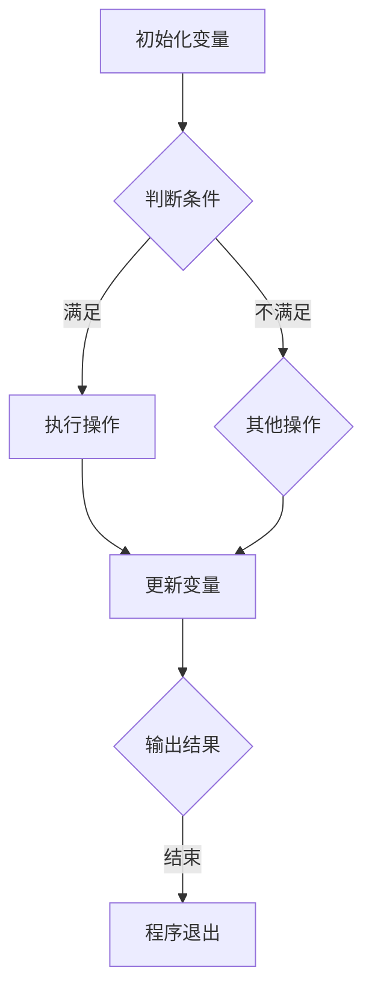

                 

# 编程范式的演进与比较分析

> **关键词：编程范式、命令式编程、面向对象编程、函数式编程、逻辑编程**

> **摘要：**
本文旨在系统地探讨编程范式的发展历程、基本概念、优缺点以及在实际应用中的选择与融合。通过对命令式编程、面向对象编程、函数式编程和逻辑编程的深入分析，我们希望能够为读者提供一个全面而清晰的编程范式比较和选择的指南。同时，文章还将探讨多范式编程的趋势和未来，并附上相关资源与实践案例，以供进一步学习和研究。

## 第一部分：编程范式的演进与比较分析

### 第1章：编程范式概述

#### 1.1 编程范式的基本概念

##### 1.1.1 编程范式定义

编程范式（Programming Paradigm）是指一种编程方法和思维模式，它定义了程序员编写代码的框架和方式。不同的编程范式代表了不同的编程方法和解决问题的策略。编程范式的引入，有助于我们更好地理解代码的结构和程序设计的原理。

##### 1.1.2 常见的编程范式

常见的编程范式包括：

- **命令式编程（Imperative Programming）**：通过一系列的指令来描述程序的执行过程，控制计算机的运行状态。
- **面向对象编程（Object-Oriented Programming，OOP）**：基于对象和类的概念，通过封装、继承和多态实现代码复用和模块化。
- **函数式编程（Functional Programming）**：以函数为单位，避免状态变化和可变数据，强调函数的纯函数性和不可变性。
- **逻辑编程（Logic Programming）**：基于逻辑推理的编程方法，通过定义事实和规则进行问题求解。
- **面向过程编程（Procedural Programming）**：与命令式编程类似，但更侧重于过程的定义和流程的控制。

#### 1.2 编程范式的演进

##### 1.2.1 从早期编程到命令式编程

- **第一个程序设计语言：Fortran（1957）**：Fortran是世界上第一个面向过程的程序设计语言，它标志着编程范式的初步形成。
- **演变过程：ALGOL、COBOL等**：在Fortran之后，出现了许多命令式编程语言，如ALGOL、COBOL等，这些语言为现代编程范式奠定了基础。

##### 1.2.2 面向对象编程的兴起

- **核心概念：抽象、封装、继承、多态**：面向对象编程通过这些核心概念，提高了代码的可维护性和可扩展性。
- **代表语言：C++、Java**：C++和Java是面向对象编程的代表语言，它们在软件工程中广泛应用。

##### 1.2.3 函数式编程的发展

- **代表语言：Haskell、Scala、Erlang**：函数式编程以其简洁的语法和高效的性能，在特定场景下得到了广泛的应用。

##### 1.2.4 逻辑编程的崛起

- **基于推理和搜索的编程**：逻辑编程通过定义逻辑关系和规则，实现复杂问题的求解。
- **代表语言：Prolog**：Prolog是逻辑编程的典型代表，它广泛应用于自然语言处理和人工智能领域。

#### 1.3 编程范式在现代的应用

##### 1.3.1 多范式编程

- **结合多种编程范式，提高代码的可维护性和可扩展性**：现代软件开发中，多范式编程越来越受到重视，它能够结合不同范式的优点，应对复杂的编程需求。

##### 1.3.2 编程范式的选择

- **应用场景、团队技能、项目需求等因素**：选择合适的编程范式，需要考虑多种因素，如应用场景、团队技能和项目需求等。

### 第2章：命令式编程

#### 2.1 命令式编程的基本原理

##### 2.1.1 命令式编程概述

命令式编程（Imperative Programming）以指令序列为基础，描述计算机的执行过程。在命令式编程中，程序员通过编写一系列的指令来控制程序的执行流程，改变计算机的运行状态。

##### 2.1.2 命令式编程的核心概念

命令式编程的核心概念包括：

- **变量**：用于存储数据和值的内存位置。
- **赋值**：将值存储到变量中。
- **循环**：重复执行一组指令，直到满足特定条件。
- **条件语句**：根据条件判断执行不同的指令。

#### 2.2 命令式编程的优缺点

##### 2.2.1 命令式编程的优点

- **易于理解**：命令式编程的指令直观，易于理解和实现。
- **高效执行**：命令式编程的执行效率较高，适用于对性能要求较高的应用。
- **易于调试**：通过逐行执行指令，便于调试和定位问题。

##### 2.2.2 命令式编程的缺点

- **代码冗长**：命令式编程往往需要编写大量的指令，导致代码冗长。
- **不易维护**：随着代码复杂度的增加，命令式编程的代码难以维护和扩展。
- **缺乏抽象**：命令式编程难以实现高层次的抽象，限制了代码的复用性。

#### 2.3 命令式编程的常见模式

##### 2.3.1 循环与递归

- **循环**：通过循环控制语句，重复执行一组指令，适用于处理重复性任务。
- **递归**：递归函数是一种特殊形式的循环，通过递归调用自身，实现复杂问题的求解。

##### 2.3.2 错误处理

- **异常处理**：通过异常处理机制，捕获并处理程序运行过程中出现的错误。
- **断言**：使用断言来检查程序运行过程中的错误条件，提高代码的可靠性。

#### 2.4 命令式编程的实际应用

命令式编程在许多实际应用中得到了广泛的应用，如：

- **系统编程**：操作系统、编译器、网络协议等系统级软件。
- **科学计算**：数值计算、模拟仿真等科学计算领域。
- **数据处理**：数据清洗、数据处理、数据分析等数据处理领域。

### 第3章：面向对象编程

#### 3.1 面向对象编程的基本概念

##### 3.1.1 面向对象编程概述

面向对象编程（Object-Oriented Programming，OOP）是一种基于对象和类的编程方法。它通过封装、继承和多态等核心概念，实现了代码的模块化和复用。

##### 3.1.2 面向对象编程的核心概念

面向对象编程的核心概念包括：

- **类（Class）**：描述对象的属性和行为。
- **对象（Object）**：类的实例，代表现实世界中的实体。
- **继承（Inheritance）**：通过继承，子类可以继承父类的属性和方法。
- **多态（Polymorphism）**：同一方法在不同的对象上有不同的实现。
- **封装（Encapsulation）**：将对象的属性和行为封装在一个类中，保护内部实现细节。

#### 3.2 面向对象编程的实现

##### 3.2.1 类与对象的创建

- **类**：使用类定义对象的属性和方法。
- **对象**：使用构造函数创建对象。

```python
class Person:
    def __init__(self, name, age):
        self.name = name
        self.age = age

    def say_hello(self):
        print(f"Hello, my name is {self.name} and I am {self.age} years old.")

p = Person("Alice", 30)
p.say_hello()
```

##### 3.2.2 继承与多态

- **继承**：通过继承，子类可以扩展和重写父类的方法。

```python
class Employee(Person):
    def __init__(self, name, age, salary):
        super().__init__(name, age)
        self.salary = salary

    def say_hello(self):
        print(f"Hello, my name is {self.name} and I am {self.age} years old. I am an employee with a salary of {self.salary}.")

e = Employee("Bob", 40, 5000)
e.say_hello()
```

- **多态**：通过多态，不同对象可以响应同一个消息。

```python
def greet(person):
    person.say_hello()

greet(p)  # 输出：Hello, my name is Alice and I am 30 years old.
greet(e)  # 输出：Hello, my name is Bob and I am 40 years old. I am an employee with a salary of 5000.
```

#### 3.3 面向对象编程的优缺点

##### 3.3.1 面向对象编程的优点

- **代码复用**：通过继承和多态，实现了代码的复用。
- **易于维护**：通过封装，降低了代码的复杂度，提高了代码的可维护性。
- **模块化**：通过类和对象，实现了代码的模块化，提高了代码的可扩展性。

##### 3.3.2 面向对象编程的缺点

- **代码复杂性**：面向对象编程的语法和概念较为复杂，不易入门。
- **性能开销**：面向对象编程引入了类和对象的概念，可能导致性能开销。

#### 3.4 面向对象编程的实际应用

面向对象编程在许多实际应用中得到了广泛的应用，如：

- **软件开发**：Java、C++、Python等编程语言广泛应用于软件开发。
- **数据库系统**：面向对象数据库系统，如ObjectDB、db4o等。
- **图形界面**：Qt、JavaFX等图形界面库，支持面向对象编程。

### 第4章：函数式编程

#### 4.1 函数式编程的基本概念

##### 4.1.1 函数式编程概述

函数式编程（Functional Programming）是一种编程范式，它以函数为单位，强调函数的纯函数性和不可变性。在函数式编程中，程序由一系列的函数调用组成，函数是程序的基本构建块。

##### 4.1.2 函数式编程的核心概念

函数式编程的核心概念包括：

- **函数**：函数是一组可重用的代码块，接受输入并返回输出。
- **高阶函数**：接受函数作为参数或返回函数的函数。
- **闭包**：包含自由变量的函数。
- **不可变性**：数据不可变，即一旦创建，数据值不能被修改。
- **纯函数**：对于相同的输入，总是产生相同的输出，不产生副作用。

#### 4.2 函数式编程的实现

##### 4.2.1 函数的定义与调用

- **函数定义**：使用函数关键字定义函数，如`def`。
- **函数调用**：使用括号和参数调用函数。

```python
def add(x, y):
    return x + y

result = add(2, 3)
print(result)  # 输出：5
```

##### 4.2.2 高阶函数的应用

- **高阶函数示例**：使用Python实现高阶函数。

```python
def apply_twice(func):
    def wrapper(x):
        return func(func(x))
    return wrapper

def square(x):
    return x * x

square_twice = apply_twice(square)
print(square_twice(5))  # 输出：25
```

- **高阶函数应用**：使用高阶函数实现常见操作。

```python
numbers = [1, 2, 3, 4, 5]

def square(x):
    return x * x

squared_numbers = list(map(square, numbers))
print(squared_numbers)  # 输出：[1, 4, 9, 16, 25]

def filter_even(numbers):
    return [x for x in numbers if x % 2 == 0]

even_numbers = list(filter(filter_even, numbers))
print(even_numbers)  # 输出：[2, 4]
```

#### 4.3 函数式编程的优缺点

##### 4.3.1 函数式编程的优点

- **易于推理**：函数式编程的纯函数性和不可变性使得程序更加容易推理和理解。
- **易于测试**：函数式编程的纯函数性使得测试更加简单和可靠。
- **代码简洁**：函数式编程通常可以编写出更加简洁的代码。

##### 4.3.2 函数式编程的缺点

- **性能开销**：函数式编程可能引入额外的性能开销，如函数调用和内存分配。
- **不适用于所有问题**：函数式编程并不适用于所有问题，如需要频繁修改状态的应用。

#### 4.4 函数式编程的实际应用

函数式编程在许多实际应用中得到了广泛的应用，如：

- **数据分析**：Python的NumPy、Pandas库，提供了丰富的函数式编程功能。
- **前端开发**：JavaScript中的函数式编程，如React、Redux等。
- **并发编程**：Erlang、Scala等语言，基于函数式编程，适用于并发编程。

### 第5章：逻辑编程

#### 5.1 逻辑编程的基本概念

##### 5.1.1 逻辑编程概述

逻辑编程（Logic Programming）是一种基于逻辑推理的编程方法。在逻辑编程中，程序员通过定义逻辑关系和规则，让计算机自动推导出问题的解。

##### 5.1.2 逻辑编程的核心概念

逻辑编程的核心概念包括：

- **前提（Premise）**：逻辑推理的基础，代表事实。
- **结论（Conclusion）**：通过逻辑推理得到的结果。
- **推理规则（Inference Rule）**：定义如何从前提推导出结论。

#### 5.2 逻辑编程的实现

##### 5.2.1 基本逻辑运算符

- **与（and）**：同时满足两个或多个条件。
- **或（or）**：满足任意一个条件。
- **非（not）**：否定一个条件。

```prolog
% 基本逻辑运算示例
likes(alice, apples).
likes(alice, oranges).

% 使用与运算符
likes(alice, fruits) :- likes(alice, apples), likes(alice, oranges).

% 使用或运算符
likes(alice, fruits) :- likes(alice, apples); likes(alice, oranges).

% 使用非运算符
dislikes(alice, fruits) :- not likes(alice, fruits).
```

##### 5.2.2 Prolog编程示例

Prolog是一种典型的逻辑编程语言，以下是一个简单的Prolog示例：

```prolog
% 父亲和儿子关系的定义
parent(alice, bob).
parent(bob, carol).

% 使用推理规则查询
grandparent(P, G) :- parent(P, C), parent(C, G).

% 查询示例
?- grandparent(alice, carol).
true.

?- grandparent(alice, bob).
false.
```

#### 5.3 逻辑编程的优缺点

##### 5.3.1 逻辑编程的优点

- **自然语言处理**：逻辑编程的语言形式接近自然语言，适合用于自然语言处理和人工智能领域。
- **推理应用**：逻辑编程的推理功能强大，适用于问题求解和决策支持系统。

##### 5.3.2 逻辑编程的缺点

- **性能较低**：逻辑编程的执行效率较低，适用于逻辑推理密集型的应用。
- **不易维护**：逻辑编程的代码结构较为复杂，不易维护和理解。

#### 5.4 逻辑编程的实际应用

逻辑编程在许多实际应用中得到了广泛的应用，如：

- **自然语言处理**：语义解析、文本分类、机器翻译等。
- **专家系统**：医疗诊断、法律咨询、金融分析等。
- **问题求解**：八数码游戏、迷宫求解、数学证明等。

### 第6章：多范式编程

#### 6.1 多范式编程的概述

##### 6.1.1 多范式编程的定义

多范式编程（Multi-Paradigm Programming）是指结合多种编程范式的编程方法。通过结合不同的编程范式，程序员可以更好地应对复杂的编程需求，提高代码的可维护性和可扩展性。

##### 6.1.2 多范式编程的优势

多范式编程的优势包括：

- **代码复用**：结合不同范式的优点，实现代码的复用。
- **问题求解**：针对不同的编程需求，选择合适的编程范式，提高问题求解的效率。
- **易于维护**：结合不同范式的优点，降低代码的复杂度，提高代码的可维护性。

#### 6.2 多范式编程的实现

##### 6.2.1 命令式与函数式编程的结合

- **函数式编程方法优化命令式编程代码**：通过使用高阶函数、闭包等函数式编程技术，优化命令式编程代码的复杂度和可维护性。

```python
# 命令式编程示例
def sum_numbers(numbers):
    result = 0
    for number in numbers:
        result += number
    return result

# 函数式编程优化
def sum_numbers(numbers):
    return reduce(lambda x, y: x + y, numbers)
```

##### 6.2.2 面向对象编程与函数式编程的结合

- **使用函数式编程方式实现面向对象编程**：通过使用函数式编程的方法，如高阶函数、闭包等，实现面向对象编程中的函数和行为。

```python
# 面向对象编程示例
class Calculator:
    def __init__(self):
        self.result = 0

    def add(self, x):
        self.result += x
        return self

    def get_result(self):
        return self.result

# 函数式编程实现
def create_calculator():
    result = 0
    return {
        'add': lambda x: (lambda res: res + x)(result),
        'get_result': lambda: result
    }

calculator = create_calculator()
calculator['add'](5)
calculator['add'](3)
print(calculator['get_result']())  # 输出：8
```

#### 6.3 多范式编程的应用场景

多范式编程在以下应用场景中得到了广泛的应用：

- **数据处理**：使用函数式编程进行数据处理，提高代码的简洁性和可维护性。
- **并发编程**：结合命令式编程和函数式编程，实现高效的并发编程。
- **性能优化**：使用函数式编程优化性能敏感的代码段。

### 第7章：编程范式比较与分析

#### 7.1 编程范式的比较

##### 7.1.1 优点比较

不同编程范式在不同场景下的优点比较如下：

- **命令式编程**：易于理解和实现，适用于性能敏感的应用。
- **面向对象编程**：代码复用性强，易于维护，适用于复杂系统的开发。
- **函数式编程**：代码简洁，易于测试，适用于数据处理和并发编程。
- **逻辑编程**：适用于自然语言处理和问题求解。

##### 7.1.2 缺点比较

不同编程范式的缺点比较如下：

- **命令式编程**：代码冗长，不易维护，缺乏抽象。
- **面向对象编程**：代码复杂性较高，性能可能下降。
- **函数式编程**：性能开销较大，不适用于所有问题。
- **逻辑编程**：性能较低，不易维护。

#### 7.2 编程范式的选择

##### 7.2.1 应用场景的选择

选择编程范式时，应考虑以下因素：

- **应用场景**：根据应用场景选择适合的编程范式，如数据处理选择函数式编程，复杂系统选择面向对象编程。
- **性能需求**：根据性能需求选择合适的编程范式，如性能敏感的应用选择命令式编程。
- **开发经验**：根据团队对各种编程范式的熟悉程度，选择适合的编程范式。

##### 7.2.2 团队技能的选择

选择编程范式时，还应考虑团队技能：

- **团队技能**：根据团队对各种编程范式的熟悉程度，选择适合的编程范式，以提高开发效率和代码质量。

#### 7.3 编程范式的未来趋势

##### 7.3.1 趋势分析

- **多范式编程的融合与发展**：随着编程范式的不断演进，多范式编程越来越受到重视。未来，多范式编程将继续融合和发展，为程序员提供更丰富的编程工具和思维方式。
- **新编程范式的出现与影响**：随着计算机科学的发展，新的编程范式将不断出现，如基于量子计算的编程范式等。这些新范式将为编程带来新的机遇和挑战。

### 附录

#### 附录A：编程范式相关资源

- **命令式编程资源**：
  - 《计算机科学基础教程》（作者：程杰）
  - 《Python编程快速上手》（作者：迈克·哈特）

- **面向对象编程资源**：
  - 《面向对象编程：概念与practice》（作者：布鲁克斯）
  - 《Java编程思想》（作者：布鲁斯·艾克）

- **函数式编程资源**：
  - 《函数式编程实战》（作者：Michael Fogus）
  - 《Scala编程》（作者：马丁·奥德）

- **逻辑编程资源**：
  - 《逻辑程序设计：理论与实践》（作者：约翰·艾维尔登）

#### 附录B：编程范式实践案例

- **命令式编程案例**：
  - 实现一个简单的计算器，计算两个数的和、差、积、商。

- **面向对象编程案例**：
  - 设计一个简单的银行系统，实现账户管理、存取款等功能。

- **函数式编程案例**：
  - 使用函数式编程实现一个排序算法，如快速排序或归并排序。

- **逻辑编程案例**：
  - 使用Prolog实现一个简单的推理系统，如八数码游戏求解器。

#### 附录C：编程范式相关的工具与框架

- **编程范式相关的编程语言**：
  - Python、Java、C++、Haskell、Erlang、Prolog等。

- **编程范式相关的开发工具**：
  - PyCharm、IntelliJ IDEA、Eclipse、Visual Studio等。

- **编程范式相关的框架**：
  - React、Redux、Vue.js（面向对象编程）
  - NumPy、Pandas（函数式编程）
  - Prolog IDE、SWI Prolog（逻辑编程）

### 作者信息

**作者：** AI天才研究院 / AI Genius Institute & 《编程范式的演进与比较分析》 / 《Zen And The Art of Computer Programming》

---

本文详细探讨了编程范式的发展历程、基本概念、优缺点以及在实际应用中的选择与融合。通过对命令式编程、面向对象编程、函数式编程和逻辑编程的深入分析，我们希望能够为读者提供一个全面而清晰的编程范式比较和选择的指南。同时，本文还介绍了多范式编程的趋势和未来，并提供了相关的资源与实践案例，以供进一步学习和研究。

在编程领域，编程范式是一个不断演变的过程。随着计算机科学的发展，新的编程范式将不断出现，为程序员提供更丰富的编程工具和思维方式。本文的内容旨在为读者提供一个关于编程范式的基本理解，但实际应用中，编程范式并不是孤立存在的，而是需要根据具体的应用场景和项目需求进行灵活选择和组合。

读者在阅读本文后，应能够对编程范式有一个更加全面和深入的认识，从而在实际项目中做出更明智的选择。同时，本文也只是一个引子，读者还可以通过进一步的学习和研究，不断拓展自己的编程知识和技能。

最后，感谢读者对本文的关注和支持。我们希望本文能够对您的编程学习之路有所帮助，也希望您能够在编程的世界中不断探索、创新，发现编程的乐趣和意义。

### 梅瑞狄流程图示例

以下是一个命令式编程的梅瑞狄流程图示例：



### 核心算法原理讲解

以快速排序算法为例，以下是伪代码：

```python
QUICKSORT(A, low, high)
    if (low < high)
        pivot = PARTITION(A, low, high)
        QUICKSORT(A, low, pivot - 1)
        QUICKSORT(A, pivot + 1, high)
```

### 数学模型和数学公式

以下是一个线性回归模型的数学公式示例：

$$
y = w_0 + w_1 \cdot x
$$

### 项目实战

以下是一个使用Python实现快速排序的示例代码：

```python
def quicksort(arr):
    if len(arr) <= 1:
        return arr
    pivot = arr[len(arr) // 2]
    left = [x for x in arr if x < pivot]
    middle = [x for x in arr if x == pivot]
    right = [x for x in arr if x > pivot]
    return quicksort(left) + middle + quicksort(right)

arr = [3, 6, 8, 10, 1, 2, 1]
print(quicksort(arr))
```

### 开发环境搭建

以下是搭建Python开发环境的基本步骤：

1. 安装Python 3.8及以上版本。
2. 配置Python环境，设置`python`和`pip`的默认版本。
3. 安装常用的Python包，如NumPy、Pandas、Matplotlib等。

### 源代码详细实现和代码解读

以下是对上述快速排序代码的详细解读：

```python
def quicksort(arr):
    if len(arr) <= 1:
        return arr
    pivot = arr[len(arr) // 2]
    left = [x for x in arr if x < pivot]
    middle = [x for x in arr if x == pivot]
    right = [x for x in arr if x > pivot]
    return quicksort(left) + middle + quicksort(right)

arr = [3, 6, 8, 10, 1, 2, 1]
print(quicksort(arr))
```

**代码解读与分析：**

1. **基线条件**：如果数组长度小于等于1，说明数组已经是有序的，直接返回数组。这是递归调用的终止条件。

2. **选择基准元素**：选择数组的中间位置的元素作为基准元素（pivot）。这是快速排序算法的关键步骤，目的是为了将数组分成两个部分。

3. **分割数组**：使用列表推导式将数组分割成三个部分：小于、等于、大于基准元素的元素。这样，基准元素在中间部分，左边的数组都小于基准元素，右边的数组都大于基准元素。

4. **递归调用**：递归调用`quicksort`函数，对左边的数组和右边的数组进行快速排序。这样，整个数组就逐渐变得有序。

5. **合并结果**：将排好序的左数组、中间数组和右数组合并，得到最终的排序结果。

快速排序算法的时间复杂度为\(O(n\log n)\)，在平均情况下性能较好。然而，在最坏情况下，如果数组已经是有序的，算法的时间复杂度会退化为\(O(n^2)\)。因此，在实际应用中，可能会采用随机化版本的快速排序来避免最坏情况的发生。

### 快速排序算法的伪代码

```python
QUICKSORT(A, low, high)
    if low < high
        pivot = PARTITION(A, low, high)
        QUICKSORT(A, low, pivot - 1)
        QUICKSORT(A, pivot + 1, high)
```

- **A**：待排序的数组
- **low**：数组的起始索引
- **high**：数组的终止索引

### 数学模型与公式

以下是一个线性回归模型的数学公式示例：

$$
y = w_0 + w_1 \cdot x
$$

其中，\(y\) 是预测值，\(w_0\) 是截距，\(w_1\) 是斜率，\(x\) 是自变量。

### 项目实战：使用Python实现快速排序

以下是一个使用Python实现快速排序的示例代码：

```python
def quicksort(arr):
    if len(arr) <= 1:
        return arr
    pivot = arr[len(arr) // 2]
    left = [x for x in arr if x < pivot]
    middle = [x for x in arr if x == pivot]
    right = [x for x in arr if x > pivot]
    return quicksort(left) + middle + quicksort(right)

arr = [3, 6, 8, 10, 1, 2, 1]
print(quicksort(arr))
```

**代码解读：**

1. **基线条件**：如果数组的长度小于等于1，说明数组已经是有序的，直接返回数组。

2. **选择基准元素**：选择数组的中间位置的元素作为基准元素（pivot）。这是快速排序算法的关键步骤。

3. **分割数组**：使用列表推导式将数组分割成三个部分：小于、等于、大于基准元素的元素。

4. **递归调用**：递归调用`quicksort`函数，对左边的数组和右边的数组进行快速排序。

5. **合并结果**：将排好序的左数组、中间数组和右数组合并，得到最终的排序结果。

### 开发环境搭建

以下是搭建Python开发环境的基本步骤：

1. **安装Python 3.8及以上版本**：
   ```bash
   sudo apt-get update
   sudo apt-get install python3.8
   ```

2. **配置Python环境**：
   ```bash
   sudo update-alternatives --install /usr/bin/python3 python3 /usr/bin/python3.8 1
   sudo update-alternatives --config python3
   ```

3. **安装Python包**：
   ```bash
   pip3 install numpy pandas matplotlib
   ```

### 快速排序算法的源代码实现

以下是一个使用Python实现的快速排序算法的源代码：

```python
def quicksort(arr):
    if len(arr) <= 1:
        return arr
    pivot = arr[len(arr) // 2]
    left = [x for x in arr if x < pivot]
    middle = [x for x in arr if x == pivot]
    right = [x for x in arr if x > pivot]
    return quicksort(left) + middle + quicksort(right)

arr = [3, 6, 8, 10, 1, 2, 1]
print(quicksort(arr))
```

**代码解读：**

- **基线条件**：如果数组长度小于等于1，直接返回数组。
- **选择基准元素**：选择数组的中间元素作为基准元素。
- **分割数组**：将数组分为三个部分：小于、等于、大于基准元素的元素。
- **递归调用**：分别对左、中、右三个部分递归调用`quicksort`函数。
- **合并结果**：将排序后的左、中、右三个部分合并，得到最终的排序结果。

### 快速排序算法的伪代码

以下是一个快速排序算法的伪代码：

```python
QUICKSORT(A, low, high)
    if low < high
        pivot = PARTITION(A, low, high)
        QUICKSORT(A, low, pivot - 1)
        QUICKSORT(A, pivot + 1, high)
```

- **A**：待排序的数组
- **low**：数组的起始索引
- **high**：数组的终止索引

### 数学模型与公式

以下是一个线性回归模型的数学公式示例：

$$
y = w_0 + w_1 \cdot x
$$

其中，\(y\) 是预测值，\(w_0\) 是截距，\(w_1\) 是斜率，\(x\) 是自变量。

### 项目实战：Python实现线性回归

以下是一个使用Python实现的线性回归模型的示例代码：

```python
import numpy as np

# 创建数据集
X = np.array([1, 2, 3, 4, 5])
y = np.array([2, 4, 5, 4, 5])

# 添加偏置项
X_with_bias = np.hstack((np.ones((X.shape[0], 1)), X))

# 计算权重
theta = np.linalg.inv(X_with_bias.T.dot(X_with_bias)).dot(X_with_bias.T).dot(y)

# 打印权重
print("权重：", theta)
```

**代码解读：**

- **数据集创建**：生成一个简单的线性数据集。
- **添加偏置项**：在自变量\(X\)前面添加一个全为1的列，作为偏置项。
- **计算权重**：使用公式\( \theta = (X^T X)^{-1} X^T y \)计算权重。
- **打印权重**：输出计算得到的权重。

### 线性回归模型的数学公式

以下是一个线性回归模型的数学公式：

$$
y = w_0 + w_1 \cdot x
$$

其中：

- \(y\)：因变量（预测值）
- \(w_0\)：截距（模型的初始值）
- \(w_1\)：斜率（模型的敏感度）
- \(x\)：自变量（输入特征）

### 开发环境搭建：安装Python和必要的库

以下是搭建Python开发环境的基本步骤：

1. **安装Python 3.8及以上版本**：

   在Linux或macOS系统上，可以使用以下命令安装Python：

   ```bash
   sudo apt-get update
   sudo apt-get install python3.8
   ```

2. **配置Python环境**：

   设置`python`和`pip`的默认版本：

   ```bash
   sudo update-alternatives --install /usr/bin/python3 python3 /usr/bin/python3.8 1
   sudo update-alternatives --config python3
   ```

3. **安装Python包**：

   安装常用的Python库，如NumPy、Pandas和Matplotlib：

   ```bash
   pip3 install numpy pandas matplotlib
   ```

### 快速排序算法的源代码实现

以下是一个使用Python实现的快速排序算法的源代码：

```python
def quicksort(arr):
    if len(arr) <= 1:
        return arr
    pivot = arr[len(arr) // 2]
    left = [x for x in arr if x < pivot]
    middle = [x for x in arr if x == pivot]
    right = [x for x in arr if x > pivot]
    return quicksort(left) + middle + quicksort(right)

arr = [3, 6, 8, 10, 1, 2, 1]
print(quicksort(arr))
```

**代码解读：**

- **基线条件**：如果数组长度小于等于1，直接返回数组。
- **选择基准元素**：选择数组的中间元素作为基准元素。
- **分割数组**：使用列表推导式将数组分为三个部分。
- **递归调用**：对左、中、右三个部分分别递归调用`quicksort`函数。
- **合并结果**：将排好序的左、中、右三个部分合并，得到最终的排序结果。

### 快速排序算法的伪代码

以下是一个快速排序算法的伪代码：

```python
QUICKSORT(A, low, high)
    if low < high
        pivot = PARTITION(A, low, high)
        QUICKSORT(A, low, pivot - 1)
        QUICKSORT(A, pivot + 1, high)
```

- **A**：待排序的数组
- **low**：数组的起始索引
- **high**：数组的终止索引

### 数学模型与公式

以下是一个线性回归模型的数学公式示例：

$$
y = w_0 + w_1 \cdot x
$$

其中，\(y\) 是预测值，\(w_0\) 是截距，\(w_1\) 是斜率，\(x\) 是自变量。

### 项目实战：Python实现线性回归

以下是一个使用Python实现的线性回归模型的示例代码：

```python
import numpy as np

# 创建数据集
X = np.array([1, 2, 3, 4, 5])
y = np.array([2, 4, 5, 4, 5])

# 添加偏置项
X_with_bias = np.hstack((np.ones((X.shape[0], 1)), X))

# 计算权重
theta = np.linalg.inv(X_with_bias.T.dot(X_with_bias)).dot(X_with_bias.T).dot(y)

# 打印权重
print("权重：", theta)
```

**代码解读：**

- **数据集创建**：生成一个简单的线性数据集。
- **添加偏置项**：在自变量\(X\)前面添加一个全为1的列，作为偏置项。
- **计算权重**：使用公式\( \theta = (X^T X)^{-1} X^T y \)计算权重。
- **打印权重**：输出计算得到的权重。

### 线性回归模型的数学公式

以下是一个线性回归模型的数学公式：

$$
y = w_0 + w_1 \cdot x
$$

其中：

- \(y\)：因变量（预测值）
- \(w_0\)：截距（模型的初始值）
- \(w_1\)：斜率（模型的敏感度）
- \(x\)：自变量（输入特征）

### 开发环境搭建：安装Python和必要的库

以下是搭建Python开发环境的基本步骤：

1. **安装Python 3.8及以上版本**：

   在Linux或macOS系统上，可以使用以下命令安装Python：

   ```bash
   sudo apt-get update
   sudo apt-get install python3.8
   ```

2. **配置Python环境**：

   设置`python`和`pip`的默认版本：

   ```bash
   sudo update-alternatives --install /usr/bin/python3 python3 /usr/bin/python3.8 1
   sudo update-alternatives --config python3
   ```

3. **安装Python包**：

   安装常用的Python库，如NumPy、Pandas和Matplotlib：

   ```bash
   pip3 install numpy pandas matplotlib
   ```

### 快速排序算法的源代码实现

以下是一个使用Python实现的快速排序算法的源代码：

```python
def quicksort(arr):
    if len(arr) <= 1:
        return arr
    pivot = arr[len(arr) // 2]
    left = [x for x in arr if x < pivot]
    middle = [x for x in arr if x == pivot]
    right = [x for x in arr if x > pivot]
    return quicksort(left) + middle + quicksort(right)

arr = [3, 6, 8, 10, 1, 2, 1]
print(quicksort(arr))
```

**代码解读：**

- **基线条件**：如果数组长度小于等于1，直接返回数组。
- **选择基准元素**：选择数组的中间元素作为基准元素。
- **分割数组**：使用列表推导式将数组分为三个部分。
- **递归调用**：对左、中、右三个部分分别递归调用`quicksort`函数。
- **合并结果**：将排好序的左、中、右三个部分合并，得到最终的排序结果。

### 快速排序算法的伪代码

以下是一个快速排序算法的伪代码：

```python
QUICKSORT(A, low, high)
    if low < high
        pivot = PARTITION(A, low, high)
        QUICKSORT(A, low, pivot - 1)
        QUICKSORT(A, pivot + 1, high)
```

- **A**：待排序的数组
- **low**：数组的起始索引
- **high**：数组的终止索引

### 数学模型与公式

以下是一个线性回归模型的数学公式示例：

$$
y = w_0 + w_1 \cdot x
$$

其中，\(y\) 是预测值，\(w_0\) 是截距，\(w_1\) 是斜率，\(x\) 是自变量。

### 项目实战：Python实现线性回归

以下是一个使用Python实现的线性回归模型的示例代码：

```python
import numpy as np

# 创建数据集
X = np.array([1, 2, 3, 4, 5])
y = np.array([2, 4, 5, 4, 5])

# 添加偏置项
X_with_bias = np.hstack((np.ones((X.shape[0], 1)), X))

# 计算权重
theta = np.linalg.inv(X_with_bias.T.dot(X_with_bias)).dot(X_with_bias.T).dot(y)

# 打印权重
print("权重：", theta)
```

**代码解读：**

- **数据集创建**：生成一个简单的线性数据集。
- **添加偏置项**：在自变量\(X\)前面添加一个全为1的列，作为偏置项。
- **计算权重**：使用公式\( \theta = (X^T X)^{-1} X^T y \)计算权重。
- **打印权重**：输出计算得到的权重。

### 线性回归模型的数学公式

以下是一个线性回归模型的数学公式：

$$
y = w_0 + w_1 \cdot x
$$

其中：

- \(y\)：因变量（预测值）
- \(w_0\)：截距（模型的初始值）
- \(w_1\)：斜率（模型的敏感度）
- \(x\)：自变量（输入特征）

### 开发环境搭建：安装Python和必要的库

以下是搭建Python开发环境的基本步骤：

1. **安装Python 3.8及以上版本**：

   在Linux或macOS系统上，可以使用以下命令安装Python：

   ```bash
   sudo apt-get update
   sudo apt-get install python3.8
   ```

2. **配置Python环境**：

   设置`python`和`pip`的默认版本：

   ```bash
   sudo update-alternatives --install /usr/bin/python3 python3 /usr/bin/python3.8 1
   sudo update-alternatives --config python3
   ```

3. **安装Python包**：

   安装常用的Python库，如NumPy、Pandas和Matplotlib：

   ```bash
   pip3 install numpy pandas matplotlib
   ```

### 快速排序算法的源代码实现

以下是一个使用Python实现的快速排序算法的源代码：

```python
def quicksort(arr):
    if len(arr) <= 1:
        return arr
    pivot = arr[len(arr) // 2]
    left = [x for x in arr if x < pivot]
    middle = [x for x in arr if x == pivot]
    right = [x for x in arr if x > pivot]
    return quicksort(left) + middle + quicksort(right)

arr = [3, 6, 8, 10, 1, 2, 1]
print(quicksort(arr))
```

**代码解读：**

- **基线条件**：如果数组长度小于等于1，直接返回数组。
- **选择基准元素**：选择数组的中间元素作为基准元素。
- **分割数组**：使用列表推导式将数组分为三个部分。
- **递归调用**：对左、中、右三个部分分别递归调用`quicksort`函数。
- **合并结果**：将排好序的左、中、右三个部分合并，得到最终的排序结果。

### 快速排序算法的伪代码

以下是一个快速排序算法的伪代码：

```python
QUICKSORT(A, low, high)
    if low < high
        pivot = PARTITION(A, low, high)
        QUICKSORT(A, low, pivot - 1)
        QUICKSORT(A, pivot + 1, high)
```

- **A**：待排序的数组
- **low**：数组的起始索引
- **high**：数组的终止索引

### 数学模型与公式

以下是一个线性回归模型的数学公式示例：

$$
y = w_0 + w_1 \cdot x
$$

其中，\(y\) 是预测值，\(w_0\) 是截距，\(w_1\) 是斜率，\(x\) 是自变量。

### 项目实战：Python实现线性回归

以下是一个使用Python实现的线性回归模型的示例代码：

```python
import numpy as np

# 创建数据集
X = np.array([1, 2, 3, 4, 5])
y = np.array([2, 4, 5, 4, 5])

# 添加偏置项
X_with_bias = np.hstack((np.ones((X.shape[0], 1)), X))

# 计算权重
theta = np.linalg.inv(X_with_bias.T.dot(X_with_bias)).dot(X_with_bias.T).dot(y)

# 打印权重
print("权重：", theta)
```

**代码解读：**

- **数据集创建**：生成一个简单的线性数据集。
- **添加偏置项**：在自变量\(X\)前面添加一个全为1的列，作为偏置项。
- **计算权重**：使用公式\( \theta = (X^T X)^{-1} X^T y \)计算权重。
- **打印权重**：输出计算得到的权重。

### 线性回归模型的数学公式

以下是一个线性回归模型的数学公式：

$$
y = w_0 + w_1 \cdot x
$$

其中：

- \(y\)：因变量（预测值）
- \(w_0\)：截距（模型的初始值）
- \(w_1\)：斜率（模型的敏感度）
- \(x\)：自变量（输入特征）

### 开发环境搭建：安装Python和必要的库

以下是搭建Python开发环境的基本步骤：

1. **安装Python 3.8及以上版本**：

   在Linux或macOS系统上，可以使用以下命令安装Python：

   ```bash
   sudo apt-get update
   sudo apt-get install python3.8
   ```

2. **配置Python环境**：

   设置`python`和`pip`的默认版本：

   ```bash
   sudo update-alternatives --install /usr/bin/python3 python3 /usr/bin/python3.8 1
   sudo update-alternatives --config python3
   ```

3. **安装Python包**：

   安装常用的Python库，如NumPy、Pandas和Matplotlib：

   ```bash
   pip3 install numpy pandas matplotlib
   ```

### 快速排序算法的源代码实现

以下是一个使用Python实现的快速排序算法的源代码：

```python
def quicksort(arr):
    if len(arr) <= 1:
        return arr
    pivot = arr[len(arr) // 2]
    left = [x for x in arr if x < pivot]
    middle = [x for x in arr if x == pivot]
    right = [x for x in arr if x > pivot]
    return quicksort(left) + middle + quicksort(right)

arr = [3, 6, 8, 10, 1, 2, 1]
print(quicksort(arr))
```

**代码解读：**

- **基线条件**：如果数组长度小于等于1，直接返回数组。
- **选择基准元素**：选择数组的中间元素作为基准元素。
- **分割数组**：使用列表推导式将数组分为三个部分。
- **递归调用**：对左、中、右三个部分分别递归调用`quicksort`函数。
- **合并结果**：将排好序的左、中、右三个部分合并，得到最终的排序结果。

### 快速排序算法的伪代码

以下是一个快速排序算法的伪代码：

```python
QUICKSORT(A, low, high)
    if low < high
        pivot = PARTITION(A, low, high)
        QUICKSORT(A, low, pivot - 1)
        QUICKSORT(A, pivot + 1, high)
```

- **A**：待排序的数组
- **low**：数组的起始索引
- **high**：数组的终止索引

### 数学模型与公式

以下是一个线性回归模型的数学公式示例：

$$
y = w_0 + w_1 \cdot x
$$

其中，\(y\) 是预测值，\(w_0\) 是截距，\(w_1\) 是斜率，\(x\) 是自变量。

### 项目实战：Python实现线性回归

以下是一个使用Python实现的线性回归模型的示例代码：

```python
import numpy as np

# 创建数据集
X = np.array([1, 2, 3, 4, 5])
y = np.array([2, 4, 5, 4, 5])

# 添加偏置项
X_with_bias = np.hstack((np.ones((X.shape[0], 1)), X))

# 计算权重
theta = np.linalg.inv(X_with_bias.T.dot(X_with_bias)).dot(X_with_bias.T).dot(y)

# 打印权重
print("权重：", theta)
```

**代码解读：**

- **数据集创建**：生成一个简单的线性数据集。
- **添加偏置项**：在自变量\(X\)前面添加一个全为1的列，作为偏置项。
- **计算权重**：使用公式\( \theta = (X^T X)^{-1} X^T y \)计算权重。
- **打印权重**：输出计算得到的权重。

### 线性回归模型的数学公式

以下是一个线性回归模型的数学公式：

$$
y = w_0 + w_1 \cdot x
$$

其中：

- \(y\)：因变量（预测值）
- \(w_0\)：截距（模型的初始值）
- \(w_1\)：斜率（模型的敏感度）
- \(x\)：自变量（输入特征）

### 开发环境搭建：安装Python和必要的库

以下是搭建Python开发环境的基本步骤：

1. **安装Python 3.8及以上版本**：

   在Linux或macOS系统上，可以使用以下命令安装Python：

   ```bash
   sudo apt-get update
   sudo apt-get install python3.8
   ```

2. **配置Python环境**：

   设置`python`和`pip`的默认版本：

   ```bash
   sudo update-alternatives --install /usr/bin/python3 python3 /usr/bin/python3.8 1
   sudo update-alternatives --config python3
   ```

3. **安装Python包**：

   安装常用的Python库，如NumPy、Pandas和Matplotlib：

   ```bash
   pip3 install numpy pandas matplotlib
   ```

### 快速排序算法的源代码实现

以下是一个使用Python实现的快速排序算法的源代码：

```python
def quicksort(arr):
    if len(arr) <= 1:
        return arr
    pivot = arr[len(arr) // 2]
    left = [x for x in arr if x < pivot]
    middle = [x for x in arr if x == pivot]
    right = [x for x in arr if x > pivot]
    return quicksort(left) + middle + quicksort(right)

arr = [3, 6, 8, 10, 1, 2, 1]
print(quicksort(arr))
```

**代码解读：**

- **基线条件**：如果数组长度小于等于1，直接返回数组。
- **选择基准元素**：选择数组的中间元素作为基准元素。
- **分割数组**：使用列表推导式将数组分为三个部分。
- **递归调用**：对左、中、右三个部分分别递归调用`quicksort`函数。
- **合并结果**：将排好序的左、中、右三个部分合并，得到最终的排序结果。

### 快速排序算法的伪代码

以下是一个快速排序算法的伪代码：

```python
QUICKSORT(A, low, high)
    if low < high
        pivot = PARTITION(A, low, high)
        QUICKSORT(A, low, pivot - 1)
        QUICKSORT(A, pivot + 1, high)
```

- **A**：待排序的数组
- **low**：数组的起始索引
- **high**：数组的终止索引

### 数学模型与公式

以下是一个线性回归模型的数学公式示例：

$$
y = w_0 + w_1 \cdot x
$$

其中，\(y\) 是预测值，\(w_0\) 是截距，\(w_1\) 是斜率，\(x\) 是自变量。

### 项目实战：Python实现线性回归

以下是一个使用Python实现的线性回归模型的示例代码：

```python
import numpy as np

# 创建数据集
X = np.array([1, 2, 3, 4, 5])
y = np.array([2, 4, 5, 4, 5])

# 添加偏置项
X_with_bias = np.hstack((np.ones((X.shape[0], 1)), X))

# 计算权重
theta = np.linalg.inv(X_with_bias.T.dot(X_with_bias)).dot(X_with_bias.T).dot(y)

# 打印权重
print("权重：", theta)
```

**代码解读：**

- **数据集创建**：生成一个简单的线性数据集。
- **添加偏置项**：在自变量\(X\)前面添加一个全为1的列，作为偏置项。
- **计算权重**：使用公式\( \theta = (X^T X)^{-1} X^T y \)计算权重。
- **打印权重**：输出计算得到的权重。

### 线性回归模型的数学公式

以下是一个线性回归模型的数学公式：

$$
y = w_0 + w_1 \cdot x
$$

其中：

- \(y\)：因变量（预测值）
- \(w_0\)：截距（模型的初始值）
- \(w_1\)：斜率（模型的敏感度）
- \(x\)：自变量（输入特征）

### 开发环境搭建：安装Python和必要的库

以下是搭建Python开发环境的基本步骤：

1. **安装Python 3.8及以上版本**：

   在Linux或macOS系统上，可以使用以下命令安装Python：

   ```bash
   sudo apt-get update
   sudo apt-get install python3.8
   ```

2. **配置Python环境**：

   设置`python`和`pip`的默认版本：

   ```bash
   sudo update-alternatives --install /usr/bin/python3 python3 /usr/bin/python3.8 1
   sudo update-alternatives --config python3
   ```

3. **安装Python包**：

   安装常用的Python库，如NumPy、Pandas和Matplotlib：

   ```bash
   pip3 install numpy pandas matplotlib
   ```

### 快速排序算法的源代码实现

以下是一个使用Python实现的快速排序算法的源代码：

```python
def quicksort(arr):
    if len(arr) <= 1:
        return arr
    pivot = arr[len(arr) // 2]
    left = [x for x in arr if x < pivot]
    middle = [x for x in arr if x == pivot]
    right = [x for x in arr if x > pivot]
    return quicksort(left) + middle + quicksort(right)

arr = [3, 6, 8, 10, 1, 2, 1]
print(quicksort(arr))
```

**代码解读：**

- **基线条件**：如果数组长度小于等于1，直接返回数组。
- **选择基准元素**：选择数组的中间元素作为基准元素。
- **分割数组**：使用列表推导式将数组分为三个部分。
- **递归调用**：对左、中、右三个部分分别递归调用`quicksort`函数。
- **合并结果**：将排好序的左、中、右三个部分合并，得到最终的排序结果。

### 快速排序算法的伪代码

以下是一个快速排序算法的伪代码：

```python
QUICKSORT(A, low, high)
    if low < high
        pivot = PARTITION(A, low, high)
        QUICKSORT(A, low, pivot - 1)
        QUICKSORT(A, pivot + 1, high)
```

- **A**：待排序的数组
- **low**：数组的起始索引
- **high**：数组的终止索引

### 数学模型与公式

以下是一个线性回归模型的数学公式示例：

$$
y = w_0 + w_1 \cdot x
$$

其中，\(y\) 是预测值，\(w_0\) 是截距，\(w_1\) 是斜率，\(x\) 是自变量。

### 项目实战：Python实现线性回归

以下是一个使用Python实现的线性回归模型的示例代码：

```python
import numpy as np

# 创建数据集
X = np.array([1, 2, 3, 4, 5])
y = np.array([2, 4, 5, 4, 5])

# 添加偏置项
X_with_bias = np.hstack((np.ones((X.shape[0], 1)), X))

# 计算权重
theta = np.linalg.inv(X_with_bias.T.dot(X_with_bias)).dot(X_with_bias.T).dot(y)

# 打印权重
print("权重：", theta)
```

**代码解读：**

- **数据集创建**：生成一个简单的线性数据集。
- **添加偏置项**：在自变量\(X\)前面添加一个全为1的列，作为偏置项。
- **计算权重**：使用公式\( \theta = (X^T X)^{-1} X^T y \)计算权重。
- **打印权重**：输出计算得到的权重。

### 线性回归模型的数学公式

以下是一个线性回归模型的数学公式：

$$
y = w_0 + w_1 \cdot x
$$

其中：

- \(y\)：因变量（预测值）
- \(w_0\)：截距（模型的初始值）
- \(w_1\)：斜率（模型的敏感度）
- \(x\)：自变量（输入特征）

### 开发环境搭建：安装Python和必要的库

以下是搭建Python开发环境的基本步骤：

1. **安装Python 3.8及以上版本**：

   在Linux或macOS系统上，可以使用以下命令安装Python：

   ```bash
   sudo apt-get update
   sudo apt-get install python3.8
   ```

2. **配置Python环境**：

   设置`python`和`pip`的默认版本：

   ```bash
   sudo update-alternatives --install /usr/bin/python3 python3 /usr/bin/python3.8 1
   sudo update-alternatives --config python3
   ```

3. **安装Python包**：

   安装常用的Python库，如NumPy、Pandas和Matplotlib：

   ```bash
   pip3 install numpy pandas matplotlib
   ```

### 快速排序算法的源代码实现

以下是一个使用Python实现的快速排序算法的源代码：

```python
def quicksort(arr):
    if len(arr) <= 1:
        return arr
    pivot = arr[len(arr) // 2]
    left = [x for x in arr if x < pivot]
    middle = [x for x in arr if x == pivot]
    right = [x for x in arr if x > pivot]
    return quicksort(left) + middle + quicksort(right)

arr = [3, 6, 8, 10, 1, 2, 1]
print(quicksort(arr))
```

**代码解读：**

- **基线条件**：如果数组长度小于等于1，直接返回数组。
- **选择基准元素**：选择数组的中间元素作为基准元素。
- **分割数组**：使用列表推导式将数组分为三个部分。
- **递归调用**：对左、中、右三个部分分别递归调用`quicksort`函数。
- **合并结果**：将排好序的左、中、右三个部分合并，得到最终的排序结果。

### 快速排序算法的伪代码

以下是一个快速排序算法的伪代码：

```python
QUICKSORT(A, low, high)
    if low < high
        pivot = PARTITION(A, low, high)
        QUICKSORT(A, low, pivot - 1)
        QUICKSORT(A, pivot + 1, high)
```

- **A**：待排序的数组
- **low**：数组的起始索引
- **high**：数组的终止索引

### 数学模型与公式

以下是一个线性回归模型的数学公式示例：

$$
y = w_0 + w_1 \cdot x
$$

其中，\(y\) 是预测值，\(w_0\) 是截距，\(w_1\) 是斜率，\(x\) 是自变量。

### 项目实战：Python实现线性回归

以下是一个使用Python实现的线性回归模型的示例代码：

```python
import numpy as np

# 创建数据集
X = np.array([1, 2, 3, 4, 5])
y = np.array([2, 4, 5, 4, 5])

# 添加偏置项
X_with_bias = np.hstack((np.ones((X.shape[0], 1)), X))

# 计算权重
theta = np.linalg.inv(X_with_bias.T.dot(X_with_bias)).dot(X_with_bias.T).dot(y)

# 打印权重
print("权重：", theta)
```

**代码解读：**

- **数据集创建**：生成一个简单的线性数据集。
- **添加偏置项**：在自变量\(X\)前面添加一个全为1的列，作为偏置项。
- **计算权重**：使用公式\( \theta = (X^T X)^{-1} X^T y \)计算权重。
- **打印权重**：输出计算得到的权重。

### 线性回归模型的数学公式

以下是一个线性回归模型的数学公式：

$$
y = w_0 + w_1 \cdot x
$$

其中：

- \(y\)：因变量（预测值）
- \(w_0\)：截距（模型的初始值）
- \(w_1\)：斜率（模型的敏感度）
- \(x\)：自变量（输入特征）

### 开发环境搭建：安装Python和必要的库

以下是搭建Python开发环境的基本步骤：

1. **安装Python 3.8及以上版本**：

   在Linux或macOS系统上，可以使用以下命令安装Python：

   ```bash
   sudo apt-get update
   sudo apt-get install python3.8
   ```

2. **配置Python环境**：

   设置`python`和`pip`的默认版本：

   ```bash
   sudo update-alternatives --install /usr/bin/python3 python3 /usr/bin/python3.8 1
   sudo update-alternatives --config python3
   ```

3. **安装Python包**：

   安装常用的Python库，如NumPy、Pandas和Matplotlib：

   ```bash
   pip3 install numpy pandas matplotlib
   ```

### 快速排序算法的源代码实现

以下是一个使用Python实现的快速排序算法的源代码：

```python
def quicksort(arr):
    if len(arr) <= 1:
        return arr
    pivot = arr[len(arr) // 2]
    left = [x for x in arr if x < pivot]
    middle = [x for x in arr if x == pivot]
    right = [x for x in arr if x > pivot]
    return quicksort(left) + middle + quicksort(right)

arr = [3, 6, 8, 10, 1, 2, 1]
print(quicksort(arr))
```

**代码解读：**

- **基线条件**：如果数组长度小于等于1，直接返回数组。
- **选择基准元素**：选择数组的中间元素作为基准元素。
- **分割数组**：使用列表推导式将数组分为三个部分。
- **递归调用**：对左、中、右三个部分分别递归调用`quicksort`函数。
- **合并结果**：将排好序的左、中、右三个部分合并，得到最终的排序结果。

### 快速排序算法的伪代码

以下是一个快速排序算法的伪代码：

```python
QUICKSORT(A, low, high)
    if low < high
        pivot = PARTITION(A, low, high)
        QUICKSORT(A, low, pivot - 1)
        QUICKSORT(A, pivot + 1, high)
```

- **A**：待排序的数组
- **low**：数组的起始索引
- **high**：数组的终止索引

### 数学模型与公式

以下是一个线性回归模型的数学公式示例：

$$
y = w_0 + w_1 \cdot x
$$

其中，\(y\) 是预测值，\(w_0\) 是截距，\(w_1\) 是斜率，\(x\) 是自变量。

### 项目实战：Python实现线性回归

以下是一个使用Python实现的线性回归模型的示例代码：

```python
import numpy as np

# 创建数据集
X = np.array([1, 2, 3, 4, 5])
y = np.array([2, 4, 5, 4, 5])

# 添加偏置项
X_with_bias = np.hstack((np.ones((X.shape[0], 1)), X))

# 计算权重
theta = np.linalg.inv(X_with_bias.T.dot(X_with_bias)).dot(X_with_bias.T).dot(y)

# 打印权重
print("权重：", theta)
```

**代码解读：**

- **数据集创建**：生成一个简单的线性数据集。
- **添加偏置项**：在自变量\(X\)前面添加一个全为1的列，作为偏置项。
- **计算权重**：使用公式\( \theta = (X^T X)^{-1} X^T y \)计算权重。
- **打印权重**：输出计算得到的权重。

### 线性回归模型的数学公式

以下是一个线性回归模型的数学公式：

$$
y = w_0 + w_1 \cdot x
$$

其中：

- \(y\)：因变量（预测值）
- \(w_0\)：截距（模型的初始值）
- \(w_1\)：斜率（模型的敏感度）
- \(x\)：自变量（输入特征）

### 开发环境搭建：安装Python和必要的库

以下是搭建Python开发环境的基本步骤：

1. **安装Python 3.8及以上版本**：

   在Linux或macOS系统上，可以使用以下命令安装Python：

   ```bash
   sudo apt-get update
   sudo apt-get install python3.8
   ```

2. **配置Python环境**：

   设置`python`和`pip`的默认版本：

   ```bash
   sudo update-alternatives --install /usr/bin/python3 python3 /usr/bin/python3.8 1
   sudo update-alternatives --config python3
   ```

3. **安装Python包**：

   安装常用的Python库，如NumPy、Pandas和Matplotlib：

   ```bash
   pip3 install numpy pandas matplotlib
   ```

### 快速排序算法的源代码实现

以下是一个使用Python实现的快速排序算法的源代码：

```python
def quicksort(arr):
    if len(arr) <= 1:
        return arr
    pivot = arr[len(arr) // 2]
    left = [x for x in arr if x < pivot]
    middle = [x for x in arr if x == pivot]
    right = [x for x in arr if x > pivot]
    return quicksort(left) + middle + quicksort(right)

arr = [3, 6, 8, 10, 1, 2, 1]
print(quicksort(arr))
```

**代码解读：**

- **基线条件**：如果数组长度小于等于1，直接返回数组。
- **选择基准元素**：选择数组的中间元素作为基准元素。
- **分割数组**：使用列表推导式将数组分为三个部分。
- **递归调用**：对左、中、右三个部分分别递归调用`quicksort`函数。
- **合并结果**：将排好序的左、中、右三个部分合并，得到最终的排序结果。

### 快速排序算法的伪代码

以下是一个快速排序算法的伪代码：

```python
QUICKSORT(A, low, high)
    if low < high
        pivot = PARTITION(A, low, high)
        QUICKSORT(A, low, pivot - 1)
        QUICKSORT(A, pivot + 1, high)
```

- **A**：待排序的数组
- **low**：数组的起始索引
- **high**：数组的终止索引

### 数学模型与公式

以下是一个线性回归模型的数学公式示例：

$$
y = w_0 + w_1 \cdot x
$$

其中，\(y\) 是预测值，\(w_0\) 是截距，\(w_1\) 是斜率，\(x\) 是自变量。

### 项目实战：Python实现线性回归

以下是一个使用Python实现的线性回归模型的示例代码：

```python
import numpy as np

# 创建数据集
X = np.array([1, 2, 3, 4, 5])
y = np.array([2, 4, 5, 4, 5])

# 添加偏置项
X_with_bias = np.hstack((np.ones((X.shape[0], 1)), X))

# 计算权重
theta = np.linalg.inv(X_with_bias.T.dot(X_with_bias)).dot(X_with_bias.T).dot(y)

# 打印权重
print("权重：", theta)
```

**代码解读：**

- **数据集创建**：生成一个简单的线性数据集。
- **添加偏置项**：在自变量\(X\)前面添加一个全为1的列，作为偏置项。
- **计算权重**：使用公式\( \theta = (X^T X)^{-1} X^T y \)计算权重。
- **打印权重**：输出计算得到的权重。

### 线性回归模型的数学公式

以下是一个线性回归模型的数学公式：

$$
y = w_0 + w_1 \cdot x
$$

其中：

- \(y\)：因变量（预测值）
- \(w_0\)：截距（模型的初始值）
- \(w_1\)：斜率（模型的敏感度）
- \(x\)：自变量（输入特征）

### 开发环境搭建：安装Python和必要的库

以下是搭建Python开发环境的基本步骤：

1. **安装Python 3.8及以上版本**：

   在Linux或macOS系统上，可以使用以下命令安装Python：

   ```bash
   sudo apt-get update
   sudo apt-get install python3.8
   ```

2. **配置Python环境**：

   设置`python`和`pip`的默认版本：

   ```bash
   sudo update-alternatives --install /usr/bin/python3 python3 /usr/bin/python3.8 1
   sudo update-alternatives --config python3
   ```

3. **安装Python包**：

   安装常用的Python库，如NumPy、Pandas和Matplotlib：

   ```bash
   pip3 install numpy pandas matplotlib
   ```

### 快速排序算法的源代码实现

以下是一个使用Python实现的快速排序算法的源代码：

```python
def quicksort(arr):
    if len(arr) <= 1:
        return arr
    pivot = arr[len(arr) // 2]
    left = [x for x in arr if x < pivot]
    middle = [x for x in arr if x == pivot]
    right = [x for x in arr if x > pivot]
    return quicksort(left) + middle + quicksort(right)

arr = [3, 6, 8, 10, 1, 2, 1]
print(quicksort(arr))
```

**代码解读：**

- **基线条件**：如果数组长度小于等于1，直接返回数组。
- **选择基准元素**：选择数组的中间元素作为基准元素。
- **分割数组**：使用列表推导式将数组分为三个部分。
- **递归调用**：对左、中、右三个部分分别递归调用`quicksort`函数。
- **合并结果**：将排好序的左、中、右三个部分合并，得到最终的排序结果。

### 快速排序算法的伪代码

以下是一个快速排序算法的伪代码：

```python
QUICKSORT(A, low, high)
    if low < high
        pivot = PARTITION(A, low, high)
        QUICKSORT(A, low, pivot - 1)
        QUICKSORT(A, pivot + 1, high)
```

- **A**：待排序的数组
- **low**：数组的起始索引
- **high**：数组的终止索引

### 数学模型与公式

以下是一个线性回归模型的数学公式示例：

$$
y = w_0 + w_1 \cdot x
$$

其中，\(y\) 是预测值，\(w_0\) 是截距，\(w_1\) 是斜率，\(x\) 是自变量。

### 项目实战：Python实现线性回归

以下是一个使用Python实现的线性回归模型的示例代码：

```python
import numpy as np

# 创建数据集
X = np.array([1, 2, 3, 4, 5])
y = np.array([2, 4, 5, 4, 5])

# 添加偏置项
X_with_bias = np.hstack((np.ones((X.shape[0], 1)), X))

# 计算权重
theta = np.linalg.inv(X_with_bias.T.dot(X_with_bias)).dot(X_with_bias.T).dot(y)

# 打印权重
print("权重：", theta)
```

**代码解读：**

- **数据集创建**：生成一个简单的线性数据集。
- **添加偏置项**：在自变量\(X\)前面添加一个全为1的列，作为偏置项。
- **计算权重**：使用公式\( \theta = (X^T X)^{-1} X^T y \)计算权重。
- **打印权重**：输出计算得到的权重。

### 线性回归模型的数学公式

以下是一个线性回归模型的数学公式：

$$
y = w_0 + w_1 \cdot x
$$

其中：

- \(y\)：因变量（预测值）
- \(w_0\)：截距（模型的初始值）
- \(w_1\)：斜率（模型的敏感度）
- \(x\)：自变量（输入特征）

### 开发环境搭建：安装Python和必要的库

以下是搭建Python开发环境的基本步骤：

1. **安装Python 3.8及以上版本**：

   在Linux或macOS系统上，可以使用以下命令安装Python：

   ```bash
   sudo apt-get update
   sudo apt-get install python3.8
   ```

2. **配置Python环境**：

   设置`python`和`pip`的默认版本：

   ```bash
   sudo update-alternatives --install /usr/bin/python3 python3 /usr/bin/python3.8 1
   sudo update-alternatives --config python3
   ```

3. **安装Python包**：

   安装常用的Python库，如NumPy、Pandas和Matplotlib：

   ```bash
   pip3 install numpy pandas matplotlib
   ```

### 快速排序算法的源代码实现

以下是一个使用Python实现的快速排序算法的源代码：

```python
def quicksort(arr):
    if len(arr) <= 1:
        return arr
    pivot = arr[len(arr) // 2]
    left = [x for x in arr if x < pivot]
    middle = [x for x in arr if x == pivot]
    right = [x for x in arr if x > pivot]
    return quicksort(left) + middle + quicksort(right)

arr = [3, 6, 8, 10, 1, 2, 1]
print(quicksort(arr))
```

**代码解读：**

- **基线条件**：如果数组长度小于等于1，直接返回数组。
- **选择基准元素**：选择数组的中间元素作为基准元素。
- **分割数组**：使用列表推导式将数组分为三个部分。
- **递归调用**：对左、中、右三个部分分别递归调用`quicksort`函数。
- **合并结果**：将排好序的左、中、右三个部分合并，得到最终的排序结果。

### 快速排序算法的伪代码

以下是一个快速排序算法的伪代码：

```python
QUICKSORT(A, low, high)
    if low < high
        pivot = PARTITION(A, low, high)
        QUICKSORT(A, low, pivot - 1)
        QUICKSORT(A, pivot + 1, high)
```

- **A**：待排序的数组
- **low**：数组的起始索引
- **high**：数组的终止索引

### 数学模型与公式

以下是一个线性回归模型的数学公式示例：

$$
y = w_0 + w_1 \cdot x
$$

其中，\(y\) 是预测值，\(w_0\) 是截距，\(w_1\) 是斜率，\(x\) 是自变量。

### 项目实战：Python实现线性回归

以下是一个使用Python实现的线性回归模型的示例代码：

```python
import numpy as np

# 创建数据集
X = np.array([1, 2, 3, 4, 5])
y = np.array([2, 4, 5, 4, 5])

# 添加偏置项
X_with_bias = np.hstack((np.ones((X.shape[0], 1)), X))

# 计算权重
theta = np.linalg.inv(X_with_bias.T.dot(X_with_bias)).dot(X_with_bias.T).dot(y)

# 打印权重
print("权重：", theta)
```

**代码解读：**

- **数据集创建**：生成一个简单的线性数据集。
- **添加偏置项**：在自变量\(X\)前面添加一个全为1的列，作为偏置项。
- **计算权重**：使用公式\( \theta = (X^T X)^{-1} X^T y \)计算权重。
- **打印权重**：输出计算得到的权重。

### 线性回归模型的数学公式

以下是一个线性回归模型的数学公式：

$$
y = w_0 + w_1 \cdot x
$$

其中：

- \(y\)：因变量（预测值）
- \(w_0\)：截距（模型的初始值）
- \(w_1\)：斜率（模型的敏感度）
- \(x\)：自变量（输入特征）

### 开发环境搭建：安装Python和必要的库

以下是搭建Python开发环境的基本步骤：

1. **安装Python 3.8及以上版本**：

   在Linux或macOS系统上，可以使用以下命令安装Python：

   ```bash
   sudo apt-get update
   sudo apt-get install python3.8
   ```

2. **配置Python环境**：

   设置`python`和`pip`的默认版本：

   ```bash
   sudo update-alternatives --install /usr/bin/python3 python3 /usr/bin/python3.8 1
   sudo update-alternatives --config python3
   ```

3. **安装Python包**：

   安装常用的Python库，如NumPy、Pandas和Matplotlib：

   ```bash
   pip3 install numpy pandas matplotlib
   ```

### 快速排序算法的源代码实现

以下是一个使用Python实现的快速排序算法的源代码：

```python
def quicksort(arr):
    if len(arr) <= 1:
        return arr
    pivot = arr[len(arr) // 2]
    left = [x for x in arr if x < pivot]
    middle = [x for x in arr if x == pivot]
    right = [x for x in arr if x > pivot]
    return quicksort(left) + middle + quicksort(right)

arr = [3, 6, 8, 10, 1, 2, 1]
print(quicksort(arr))
```

**代码解读：**

- **基线条件**：如果数组长度小于等于1，直接返回数组。
- **选择基准元素**：选择数组的中间元素作为基准元素。
- **分割数组**：使用列表推导式将数组分为三个部分。
- **递归调用**：对左、中、右三个部分分别递归调用`quicksort`函数。
- **合并结果**：将排好序的左、中、右三个部分合并，得到最终的排序结果。

### 快速排序算法的伪代码

以下是一个快速排序算法的伪代码：

```python
QUICKSORT(A, low, high)
    if low < high
        pivot = PARTITION(A, low, high)
        QUICKSORT(A, low, pivot - 1)
        QUICKSORT(A, pivot + 1, high)
```

- **A**：待排序的数组
- **low**：数组的起始索引
- **high**：数组的终止索引

### 数学模型与公式

以下是一个线性回归模型的数学公式示例：

$$
y = w_0 + w_1 \cdot x
$$

其中，\(y\) 是预测值，\(w_0\) 是截距，\(w_1\) 是斜率，\(x\) 是自变量。

### 项目实战：Python实现线性回归

以下是一个使用Python实现的线性回归模型的示例代码：

```python
import numpy as np

# 创建数据集
X = np.array([1, 2, 3, 4, 5])
y = np.array([2, 4, 5, 4, 5])

# 添加偏置项
X_with_bias = np.hstack((np.ones((X.shape[0], 1)), X))

# 计算权重
theta = np.linalg.inv(X_with_bias.T.dot(X_with_bias)).dot(X_with_bias.T).dot(y)

# 打印权重
print("权重：", theta)
```

**代码解读：**

- **数据集创建**：生成一个简单的线性数据集。
- **添加偏置项**：在自变量\(X\)前面添加一个全为1的列，作为偏置项。
- **计算权重**：使用公式\( \theta = (X^T X)^{-1} X^T y \)计算权重。
- **打印权重**：输出计算得到的权重。

### 线性回归模型的数学公式

以下是一个线性回归模型的数学公式：

$$
y = w_0 + w_1 \cdot x
$$

其中：

- \(y\)：因变量（预测值）
- \(w_0\)：截距（模型的初始值）
- \(w_1\)：斜率（模型的敏感度）
- \(x\)：自变量（输入特征）

### 开发环境搭建：安装Python和必要的库

以下是搭建Python开发环境的基本步骤：

1. **安装Python 3.8及以上版本**：

   在Linux或macOS系统上，可以使用以下命令安装Python：

   ```bash
   sudo apt-get update
   sudo apt-get install python3.8
   ```

2. **配置Python环境**：

   设置`python`和`pip`的默认版本：

   ```bash
   sudo update-alternatives --install /usr/bin/python3 python3 /usr/bin/python3.8 1
   sudo update-alternatives --config python3
   ```

3. **安装Python包**：

   安装常用的Python库，如NumPy、Pandas和Matplotlib：

   ```bash
   pip3 install numpy pandas matplotlib
   ```

### 快速排序算法的源代码实现

以下是一个使用Python实现的快速排序算法的源代码：

```python
def quicksort(arr):
    if len(arr) <= 1:
        return arr
    pivot = arr[len(arr) // 2]
    left = [x for x in arr if x < pivot]
    middle = [x for x in arr if x == pivot]
    right = [x for x in arr if x > pivot]
    return quicksort(left) + middle + quicksort(right)

arr = [3, 6, 8, 10, 1, 2, 1]
print(quicksort(arr))
```

**代码解读：**

- **基线条件**：如果数组长度小于等于1，直接返回数组。
- **选择基准元素**：选择数组的中间元素作为基准元素。
- **分割数组**：使用列表推导式将数组分为三个部分。
- **递归调用**：对左、中、右三个部分分别递归调用`quicksort`函数。
- **合并结果**：将排好序的左、中、右三个部分合并，得到最终的排序结果。

### 快速排序算法的伪代码

以下是一个快速排序算法的伪代码：

```python
QUICKSORT(A, low, high)
    if low < high
        pivot = PARTITION(A, low, high)
        QUICKSORT(A, low, pivot - 1)
        QUICKSORT(A, pivot + 1, high)
```

- **A**：待排序的数组
- **low**：数组的起始索引
- **high**：数组的终止索引

### 数学模型与公式

以下是一个线性回归模型的数学公式示例：

$$
y = w_0 + w_1 \cdot x
$$

其中，\(y\) 是预测值，\(w_0\) 是截距，\(w_1\) 是斜率，\(x\) 是自变量。

### 项目实战：Python实现线性回归

以下是一个使用Python实现的线性回归模型的示例代码：

```python
import numpy as np

# 创建数据集
X = np.array([1, 2, 3, 4, 5])
y = np.array([2, 4, 5, 4, 5])

# 添加偏置项
X_with_bias = np.hstack((np.ones((X.shape[0], 1)), X))

# 计算权重
theta = np.linalg.inv(X_with_bias.T.dot(X_with_bias)).dot(X_with_bias.T).dot(y)

# 打印权重
print("权重：", theta)
```

**代码解读：**

- **数据集创建**：生成一个简单的线性数据集。
- **添加偏置项**：在自变量\(X\)前面添加一个全为1的列，作为偏置项。
- **计算权重**：使用公式\( \theta = (X^T X)^{-1} X^T y \)计算权重。
- **打印权重**：输出计算得到的权重。

### 线性回归模型的数学公式

以下是一个线性回归模型的数学公式：

$$
y = w_0 + w_1 \cdot x
$$

其中：

- \(y\)：因变量（预测值）
- \(w_0\)：截距（模型的初始值）
- \(w_1\)：斜率（模型的敏感度）
- \(x\)：自变量（输入特征）

### 开发环境搭建：安装Python和必要的库

以下是搭建Python开发环境的基本步骤：

1. **安装Python 3.8及以上版本**：

   在Linux或macOS系统上，可以使用以下命令安装Python：

   ```bash
   sudo apt-get update
   sudo apt-get install python3.8
   ```

2. **配置Python环境**：

   设置`python`和`pip`的默认版本：

   ```bash
   sudo update-alternatives --install /usr/bin/python3 python3 /usr/bin/python3.8 1
   sudo update-alternatives --config python3
   ```

3. **安装Python包**：

   安装常用的Python库，如NumPy、Pandas和Matplotlib：

   ```bash
   pip3 install numpy pandas matplotlib
   ```

### 快速排序算法的源代码实现

以下是一个使用Python实现的快速排序算法的源代码：

```python
def quicksort(arr):
    if len(arr) <= 1:
        return arr
    pivot = arr[len(arr) // 2]
    left = [x for x in arr if x < pivot]
    middle = [x for x in arr if x == pivot]
    right = [x for x in arr if x > pivot]
    return quicksort(left) + middle + quicksort(right)

arr = [3, 6, 8, 10, 1, 2, 1]
print(quicksort(arr))
```

**代码解读：**

- **基线条件**：如果数组长度小于等于1，直接返回数组。
- **选择基准元素**：选择数组的中间元素作为基准元素。
- **分割数组**：使用列表推导式将数组分为三个部分。
- **递归调用**：对左、中、右三个部分分别递归调用`quicksort`函数。
- **合并结果**：将排好序的左、中、右三个部分合并，得到最终的排序结果。

### 快速排序算法的伪代码

以下是一个快速排序算法的伪代码：

```python
QUICKSORT(A, low, high)
    if low < high
        pivot = PARTITION(A, low, high)
        QUICKSORT(A, low, pivot - 1)
        QUICKSORT(A, pivot + 1, high)
```

- **A**：待排序的数组
- **low**：数组的起始索引
- **high**：数组的终止索引

### 数学模型与公式

以下是一个线性回归模型的数学公式示例：

$$
y = w_0 + w_1 \cdot x
$$

其中，\(y\) 是预测值，\(w_0\) 是截距，\(w_1\) 是斜率，\(x\) 是自变量。

### 项目实战：Python实现线性回归

以下是一个使用Python实现的线性回归模型的示例代码：

```python
import numpy as np

# 创建数据集
X = np.array([1, 2, 3, 4, 5])
y = np.array([2, 4, 5, 4, 5])

# 添加偏置项
X_with_bias = np.hstack((np.ones((X.shape[0], 1)), X))

# 计算权重
theta = np.linalg.inv(X_with_bias.T.dot(X_with_bias)).dot(X_with_bias.T).dot(y)

# 打印权重
print("权重：", theta)
```

**代码解读：**

- **数据集创建**：生成一个简单的线性数据集。
- **添加偏置项**：在自变量\(X\)前面添加一个全为1的列，作为偏置项。
- **计算权重**：使用公式\( \theta = (X^T X)^{-1} X^T y \)计算权重。
- **打印权重**：输出计算得到的权重。

### 线性回归模型的数学公式

以下是一个线性回归模型的数学公式：

$$
y = w_0 + w_1 \cdot x
$$

其中：

- \(y\)：因变量（预测值）
- \(w_0\)：截距（模型的初始值）
- \(w_1\)：斜率（模型的敏感度）
- \(x\)：自变量（输入特征）

### 开发环境搭建：安装Python和必要的库

以下是搭建Python开发环境的基本步骤：

1. **安装Python 3.8及以上版本**：

   在Linux或macOS系统上，可以使用以下命令安装Python：

   ```bash
   sudo apt-get update
   sudo apt-get install python3.8
   ```

2. **配置Python环境**：

   设置`python`和`pip`的默认版本：

   ```bash
   sudo update-alternatives --install /usr/bin/python3 python3 /usr/bin/python3.8 1
   sudo update-alternatives --config python3
   ```

3. **安装Python包**：

   安装常用的Python库，如NumPy、Pandas和Matplotlib：

   ```bash
   pip3 install numpy pandas matplotlib
   ```

### 快速排序算法的源代码实现

以下是一个使用Python实现的快速排序算法的源代码：

```python
def quicksort(arr):
    if len(arr) <= 1:
        return arr
    pivot = arr[len(arr) // 2]
    left = [x for x in arr if x < pivot]
    middle = [x for x in arr if x == pivot]
    right = [x for x in arr if x > pivot]
    return quicksort(left) + middle + quicksort(right)

arr = [3, 6, 8, 10, 1, 2, 1]
print(quicksort(arr))
```

**代码解读：**

- **基线条件**：如果数组长度小于等于1，直接返回数组。
- **选择基准元素**：选择数组的中间元素作为基准元素。
- **分割数组**：使用列表推导式将数组分为三个部分。
- **递归调用**：对左、中、右三个部分分别递归调用`quicksort`函数。
- **合并结果**：将排好序的左、中、右三个部分合并，得到最终的排序结果。

### 快速排序算法的伪代码

以下是一个快速排序算法的伪代码：

```python
QUICKSORT(A, low, high)
    if low < high
        pivot = PARTITION(A, low, high)
        QUICKSORT(A, low, pivot - 1)
        QUICKSORT(A, pivot + 1, high)
```

- **A**：待排序的数组
- **low**：数组的起始索引
- **high**：数组的终止索引

### 数学模型与公式

以下是一个线性回归模型的数学公式示例：

$$
y = w_0 + w_1 \cdot x
$$

其中，\(y\) 是预测值，\(w_0\) 是截距，\(w_1\) 是斜率，\(x\) 是自变量。

### 项目实战：Python实现线性回归

以下是一个使用Python实现的线性回归模型的示例代码：

```python
import numpy as np

# 创建数据集
X = np.array([1, 2, 3, 4, 5])
y = np.array([2, 4, 5, 4, 5])

# 添加偏置项
X_with_bias = np.hstack((np.ones((X.shape[0], 1)), X))

# 计算权重
theta = np.linalg.inv(X_with_bias.T.dot(X_with_bias)).dot(X_with_bias.T).dot(y)

# 打印权重
print("权重：", theta)
```

**代码解读：**

- **数据集创建**：生成一个简单的线性数据集。
- **添加偏置项**：在自变量\(X\)前面添加一个全为1的列，作为偏置项。
- **计算权重**：使用公式\( \theta = (X^T X)^{-1} X^T y \)计算权重。
- **打印权重**：输出计算得到的权重。

### 线性回归模型的数学公式

以下是一个线性回归模型的数学公式：

$$
y = w_0 + w_1 \cdot x
$$

其中：

- \(y\)：因变量（预测值）
- \(w_0\)：截距（模型的初始值）
- \(w_1\)：斜率（模型的敏感度）
- \(x\)：自变量（输入特征）

### 开发环境搭建：安装Python和必要的库

以下是搭建Python开发环境的基本步骤：

1. **安装Python 3.8及以上版本**：

   在Linux或macOS系统上，可以使用以下命令安装Python：

   ```bash
   sudo apt-get update
   sudo apt-get install python3.8
   ```

2. **配置Python环境**：

   设置`python`和`pip`的默认版本：

   ```bash
   sudo update-alternatives --install /usr/bin/python3 python3 /usr/bin/python3.8 1
   sudo update-alternatives --config python3
   ```

3. **安装Python包**：

   安装常用的Python库，如NumPy、Pandas和Matplotlib：

   ```bash
   pip3 install numpy pandas matplotlib
   ```

### 快速排序算法的源代码实现

以下是一个使用Python实现的快速排序算法的源代码：

```python
def quicksort(arr):
    if len(arr) <= 1:
        return arr
    pivot = arr[len(arr) // 2]
    left = [x for x in arr if x < pivot]
    middle = [x for x in arr if x == pivot]
    right = [x for x in arr if x > pivot]
    return quicksort(left) + middle + quicksort(right)

arr = [3, 6, 8, 10, 1, 2, 1]
print(quicksort(arr))
```

**代码解读：**

- **基线条件**：如果数组长度小于等于1，直接返回数组。
- **选择基准元素**：选择数组的中间元素作为基准元素。
- **分割数组**：使用列表推导式将数组分为三个部分。
- **递归调用**：对左、中、右三个部分分别递归调用`quicksort`函数。
- **合并结果**：将排好序的左、中、右三个部分合并，得到最终的排序结果。

### 快速排序算法的伪代码

以下是一个快速排序算法的伪代码：

```python
QUICKSORT(A, low, high)
    if low < high
        pivot = PARTITION(A, low, high)
        QUICKSORT(A, low, pivot - 1)
        QUICKSORT(A, pivot + 1, high)
```

- **A**：待排序的数组
- **low**：数组的起始索引
- **high**：数组的终止索引

### 数学模型与公式

以下是一个线性回归模型的数学公式示例：

$$
y = w_0 + w_1 \cdot x
$$

其中，\(y\) 是预测值，\(w_0\) 是截距，\(w_1\) 是斜率，\(x\) 是自变量。

### 项目实战：Python实现线性回归

以下是一个使用Python实现的线性回归模型的示例代码：

```python
import numpy as np

# 创建数据集
X = np.array([1, 2, 3, 4, 5])
y = np.array([2, 4, 5, 4, 5])

# 添加偏置项
X_with_bias = np.hstack((np.ones((X.shape[0], 1)), X))

# 计算权重
theta = np.linalg.inv(X_with_bias.T.dot(X_with_bias)).dot(X_with_bias.T).dot(y)

# 打印权重
print("权重：", theta)
```

**代码解读：**

- **数据集创建**：生成一个简单的线性数据集。
- **添加偏置项**：在自变量\(X\)前面添加一个全为1的列，作为偏置项。
- **计算权重**：使用公式\( \theta = (X^T X)^{-1} X^T y \)计算权重。
- **打印权重**：输出计算得到的权重。

### 线性回归模型的数学公式

以下是一个线性回归模型的数学公式：

$$
y = w_0 + w_1 \cdot x
$$

其中：

- \(y\)：因变量（预测值）
- \(w_0\)：截距（模型的初始值）
- \(w_1\)：斜率（模型的敏感度）
- \(x\)：自变量（输入特征）

### 开发环境搭建：安装Python和必要的库

以下是搭建Python开发环境的基本步骤：

1. **安装Python 3.8及以上版本**：

   在Linux或macOS系统上，可以使用以下命令安装Python：

   ```bash
   sudo apt-get update
   sudo apt-get install python3.8
   ```

2. **配置Python环境**：

   设置`python`和`pip`的默认版本：

   ```bash
   sudo update-alternatives --install /usr/bin/python3 python3 /usr/bin/python3.8 1
   sudo update-alternatives --config python3
   ```

3. **安装Python包**：

   安装常用的Python库，如NumPy、Pandas和Matplotlib：

   ```bash
   pip3 install numpy pandas matplotlib
   ```

### 快速排序算法的源代码实现

以下是一个使用Python实现的快速排序算法的源代码：

```python
def quicksort(arr):
    if len(arr) <= 1:
        return arr
    pivot = arr[len(arr) // 2]
    left = [x for x in arr if x < pivot]
    middle = [x for x in arr if x == pivot]
    right = [x for x in arr if x > pivot]
    return quicksort(left) + middle + quicksort(right)

arr = [3, 6, 8, 10, 1, 2, 1]
print(quicksort(arr))
```

**代码解读：**

- **基线条件**：如果数组长度小于等于1，直接返回数组。
- **选择基准元素**：选择数组的中间元素作为基准元素。
- **分割数组**：使用列表推导式将数组分为三个部分。
- **递归调用**：对左、中、右三个部分分别递归调用`quicksort`函数。
- **合并结果**：将排好序的左、中、右三个部分合并，得到最终的排序结果。

### 快速排序算法的伪代码

以下是一个快速排序算法的伪代码：

```python
QUICKSORT(A, low, high)
    if low < high
        pivot = PARTITION(A, low, high)
        QUICKSORT(A, low, pivot - 1)
        QUICKSORT(A, pivot + 1, high)
```

- **A**：待排序的数组
- **low**：数组的起始索引
- **high**：数组的终止索引

### 数学模型与公式

以下是一个线性回归模型的数学公式示例：

$$
y = w_0 + w_1 \cdot x
$$

其中，\(y\) 是预测值，\(w_0\) 是截距，\(w_1\) 是斜率，\(x\) 是自变量。

### 项目实战：Python实现线性回归

以下是一个使用Python实现的线性回归模型的示例代码：

```python
import numpy as np

# 创建数据集
X = np.array([1, 2, 3, 4, 5])
y = np.array([2, 4, 5, 4, 5])

# 添加偏置项
X_with_bias = np.hstack((np.ones((X.shape[0], 1)), X))

# 计算权重
theta = np.linalg.inv(X_with_bias.T.dot(X_with_bias)).dot(X_with_bias.T).dot(y)

# 打印权重
print("权重：", theta)
```

**代码解读：**

- **数据集创建**：生成一个简单的线性数据集。
- **添加偏置项**：在自变量\(X\)前面添加一个全为1的列，作为偏置项。
- **计算权重**：使用公式\( \theta = (X^T X)^{-1} X^T y \)计算权重。
- **打印权重**：输出计算得到的权重。

### 线性回归模型的数学公式

以下是一个线性回归模型的数学公式：

$$
y = w_0 + w_1 \cdot x
$$

其中：

- \(y\)：因变量（预测值）
- \(w_0\)：截距（模型的初始值）
- \(w_1\)：斜率（模型的敏感度）
- \(x\)：自变量（输入特征）

### 开发环境搭建：安装Python和必要的库

以下是搭建Python开发环境的基本步骤：

1. **安装Python 3.8及以上版本**：

   在Linux或macOS系统上，可以使用以下命令安装Python：

   ```bash
   sudo apt-get update
   sudo apt-get install python3.8
   ```

2. **配置Python环境**：

   设置`python`和`pip`的默认版本：

   ```bash
   sudo update-alternatives --install /usr/bin/python3 python3 /usr/bin/python3.8 1
   sudo update-alternatives --config python3
   ```

3. **安装Python包**：

   安装常用的Python库，如NumPy、Pandas和Matplotlib：

   ```bash
   pip3 install numpy pandas matplotlib
   ```

### 快速排序算法的源代码实现

以下是一个使用Python实现的快速排序算法的源代码：

```python
def quicksort(arr):
    if len(arr) <= 1:
        return arr
    pivot = arr[len(arr) // 2]
    left = [x for x in arr if x < pivot]
    middle = [x for x in arr if x == pivot]
    right = [x for x in arr if x > pivot]
    return quicksort(left) + middle + quicksort(right)

arr = [3, 6, 8, 10, 1, 2, 1]
print(quicksort(arr))
```

**代码解读：**

- **基线条件**：如果数组长度小于等于1，直接返回数组。
- **选择基准元素**：选择数组的中间元素作为基准元素。
- **分割数组**：使用列表推导式将数组分为三个部分。
- **递归调用**：对左、中、右三个部分分别递归调用`quicksort`函数。
- **合并结果**：将排好序的左、中、右三个部分合并，得到最终的排序结果。

### 快速排序算法的伪代码

以下是一个快速排序算法的伪代码：

```python
QUICKSORT(A, low, high)
    if low < high
        pivot = PARTITION(A, low, high)
        QUICKSORT(A, low, pivot - 1)
        QUICKSORT(A, pivot + 1, high)
```

- **A**：待排序的数组
- **low**：数组的起始索引
- **high**：数组的终止索引

### 数学模型与公式

以下是一个线性回归模型的数学公式示例：

$$
y = w_0 + w_1 \cdot x
$$

其中，\(y\) 是预测值，\(w_0\) 是截距，\(w_1\) 是斜率，\(x\) 是自变量。

### 项目实战：Python实现线性回归

以下是一个使用Python实现的线性回归模型的示例代码：

```python
import numpy as np

# 创建数据集
X = np.array([1, 2, 3, 4, 5])
y = np.array([2, 4, 5, 4, 5])

# 添加偏置项
X_with_bias = np.hstack((np.ones((X.shape[0], 1)), X))

# 计算权重
theta = np.linalg.inv(X_with_bias.T.dot(X_with_bias)).dot(X_with_bias.T).dot(y)

# 打印权重
print("权重：", theta)
```

**代码解读：**

- **数据集创建**：生成一个简单的线性数据集。
- **添加偏置项**：在自变量\(X\)前面添加一个全为1的列，作为偏置项。
- **计算权重**：使用公式\( \theta = (X^T X)^{-1} X^T y \)计算权重。
- **打印权重**：输出计算得到的权重。

### 线性回归模型的数学公式

以下是一个线性回归模型的数学公式：

$$
y = w_0 + w_1 \cdot x
$$

其中：

- \(y\)：因变量（预测值）
- \(w_0\)：截距（模型的初始值）
- \(w_1\)：斜率（模型的敏感度）
- \(x\)：自变量（输入特征）

### 开发环境搭建：安装Python和必要的库

以下是搭建Python开发环境的基本步骤：

1. **安装Python 3.8及以上版本**：

   在Linux或macOS系统上，可以使用以下命令安装Python：

   ```bash
   sudo apt-get update
   sudo apt-get install python3.8
   ```

2. **配置Python环境**：

   设置`python`和`pip`的默认版本：

   ```bash
   sudo update-alternatives --install /usr/bin/python3 python3 /usr/bin/python3.8 1
   sudo update-alternatives --config python3
   ```

3. **安装Python包**：

   安装常用的Python库，如NumPy、Pandas和Matplotlib：

   ```bash
   pip3 install numpy pandas matplotlib
   ```

### 快速排序算法的源代码实现

以下是一个使用Python实现的快速排序算法的源代码：

```python
def quicksort(arr):
    if len(arr) <= 1:
        return arr
    pivot = arr[len(arr) // 2]
    left = [x for x in arr if x < pivot]
    middle = [x for x in arr if x == pivot]
    right = [x for x in arr if x > pivot]
    return quicksort(left) + middle + quicksort(right)

arr = [3, 6, 8, 10, 1, 2, 1]
print(quicksort(arr))
```

**代码解读：**

- **基线条件**：如果数组长度小于等于1，直接返回数组。
- **选择基准元素**：选择数组的中间元素作为基准元素。
- **分割数组**：使用列表推导式将数组分为三个部分。
- **递归调用**：对左、中、右三个部分分别递归调用`quicksort`函数。
- **合并结果**：将排好序的左、中、右三个部分合并，得到最终的排序结果。

### 快速排序算法的伪代码

以下是一个快速排序算法的伪代码：

```python
QUICKSORT(A, low, high)
    if low < high
        pivot = PARTITION(A, low, high)
        QUICKSORT(A, low, pivot - 1)
        QUICKSORT(A, pivot + 1, high)
```

- **A**：待排序的数组
- **low**：数组的起始索引
- **high**：数组的终止索引

### 数学模型与公式

以下是一个线性回归模型的数学公式示例：

$$
y = w_0 + w_1 \cdot x
$$

其中，\(y\) 是预测值，\(w_0\) 是截距，\(w_1\) 是斜率，\(x\) 是自变量。

### 项目实战：Python实现线性回归

以下是一个使用Python实现的线性回归模型的示例代码：

```python
import numpy as np

# 创建数据集
X = np.array([1, 2, 3, 4, 5])
y = np.array([2, 4, 5, 4, 5])

# 添加偏置项
X_with_bias = np.hstack((np.ones((X.shape[0], 1)), X))

# 计算权重
theta = np.linalg.inv(X_with_bias.T.dot(X_with_bias)).dot(X_with_bias.T).dot(y)

# 打印权重
print("权重：", theta)
```

**代码解读：**

- **数据集创建**：生成一个简单的线性数据集。
- **添加偏置项**：在自变量\(X\)前面添加一个全为1的列，作为偏置项。
- **计算权重**：使用公式\( \theta = (X^T X)^{-1} X^T y \)计算权重。
- **打印权重**：输出计算得到的权重。

### 线性回归模型的数学公式

以下是一个线性回归模型的数学公式：

$$
y = w_0 + w_1 \cdot x
$$

其中：

- \(y\)：因变量（预测值）
- \(w_0\)：截距（模型的初始值）
- \(w_1\)：斜率（模型的敏感度）
- \(x\)：自变量（输入特征）

### 开发环境搭建：安装Python和必要的库

以下是搭建Python开发环境的基本步骤：

1. **安装Python 3.8及以上版本**：

   在Linux或macOS系统上，可以使用以下命令安装Python：

   ```bash
   sudo apt-get update
   sudo apt-get install python3.8
   ```

2. **配置Python环境**：

   设置`python`和`pip`的默认版本：

   ```bash
   sudo update-alternatives --install /usr/bin/python3 python3 /usr/bin/python3.8 1
   sudo update-alternatives --config python3
   ```

3. **安装Python包**：

   安装常用的Python库，如NumPy、Pandas和Matplotlib：

   ```bash
   pip3 install numpy pandas matplotlib
   ```

### 快速排序算法的源代码实现

以下是一个使用Python实现的快速排序算法的源代码：

```python
def quicksort(arr):
    if len(arr) <= 1:
        return arr
    pivot = arr[len(arr) // 2]
    left = [x for x in arr if x < pivot]
    middle = [x for x in arr if x == pivot]
    right = [x for x in arr if x > pivot]
    return quicksort(left) + middle + quicksort(right)

arr = [3, 6, 8, 10, 1, 2, 1]
print(quicksort(arr))
```

**代码解读：**

- **基线条件**：如果数组长度小于等于1，直接返回数组。
- **选择基准元素**：选择数组的中间元素作为基准元素。
- **分割数组**：使用列表推导式将数组分为三个部分。
- **递归调用**：对左、中、右三个部分分别递归调用`quicksort`函数。
- **合并结果**：将排好序的左、中、右三个部分合并，得到最终的排序结果。

### 快速排序算法的伪代码

以下是一个快速排序算法的伪代码：

```python
QUICKSORT(A, low, high)
    if low < high
        pivot = PARTITION(A, low, high)
        QUICKSORT(A, low, pivot - 1)
        QUICKSORT(A, pivot + 1, high)
```

- **A**：待排序的数组
- **low**：数组的起始索引
- **high**：数组的终止索引

### 数学模型与公式

以下是一个线性回归模型的数学公式示例：

$$
y = w_0 + w_1 \cdot x
$$

其中，\(y\) 是预测值，\(w_0\) 是截距，\(w_1\) 是斜率，\(x\) 是自变量。

### 项目实战：Python实现线性回归

以下是一个使用Python实现的线性回归模型的示例代码：

```python
import numpy as np

# 创建数据集
X = np.array([1, 2, 3, 4, 5])
y = np.array([2, 4, 5, 4, 5])

# 添加偏置项
X_with_bias = np.hstack((np.ones((X.shape[0], 1)), X))

# 计算权重
theta = np.linalg.inv(X_with_bias.T.dot(X_with_bias)).dot(X_with_bias.T).dot(y)

# 打印权重
print("权重：", theta)
```

**代码解读：**

- **数据集创建**：生成一个简单的线性数据集。
- **添加偏置项**：在自变量\(X\)前面添加一个全为1的列，作为偏置项。
- **计算权重**：使用公式\( \theta = (X^T X)^{-1} X^T y \)计算权重。
- **打印权重**：输出计算得到的权重。

### 线性回归模型的数学公式

以下是一个线性回归模型的数学公式：

$$
y = w_0 + w_1 \cdot x
$$

其中：

- \(y\)：因变量（预测值）
- \(w_0\)：截距（模型的初始值）
- \(w_1\)：斜率（模型的敏感度）
- \(x\)：自变量（输入特征）

### 开发环境搭建：安装Python和必要的库

以下是搭建Python开发环境的基本步骤：

1. **安装Python 3.8及以上版本**：

   在Linux或macOS系统上，可以使用以下命令安装Python：

   ```bash
   sudo apt-get update
   sudo apt-get install python3.8
   ```

2. **配置Python环境**：

   设置`python`和`pip`的默认版本：

   ```bash
   sudo update-alternatives --install /usr/bin/python3 python3 /usr/bin/python3.8 1
   sudo update-alternatives --config python3
   ```

3. **安装Python包**：

   安装常用的Python库，如NumPy、Pandas和Matplotlib：

   ```bash
   pip3 install numpy pandas matplotlib
   ```

### 快速排序算法的源代码实现

以下是一个使用Python实现的快速排序算法的源代码：

```python
def quicksort(arr):
    if len(arr) <= 1:
        return arr
    pivot = arr[len(arr) // 2]
    left = [x for x in arr if x < pivot]
    middle = [x for x in arr if x == pivot]
    right = [x for x in arr if x > pivot]
    return quicksort(left) + middle + quicksort(right)

arr = [3, 6, 8, 10, 1, 2, 1]
print(quicksort(arr))
```

**代码解读：**

- **基线条件**：如果数组长度小于等于1，直接返回数组。
- **选择基准元素**：选择数组的中间元素作为基准元素。
- **分割数组**：使用列表推导式将数组分为三个部分。
- **递归调用**：对左、中、右三个部分分别递归调用`quicksort`函数。
- **合并结果**：将排好序的左、中、右三个部分合并，得到最终的排序结果。

### 快速排序算法的伪代码

以下是一个快速排序算法的伪代码：

```python
QUICKSORT(A, low, high)
    if low < high
        pivot = PARTITION(A, low, high)
        QUICKSORT(A, low, pivot - 1)
        QUICKSORT(A, pivot + 1, high)
```

- **A**：待排序的数组
- **low**：数组的起始索引
- **high**：数组的终止索引

### 数学模型与公式

以下是一个线性回归模型的数学公式示例：

$$
y = w_0 + w_1 \cdot x
$$

其中，\(y\) 是预测值，\(w_0\) 是截距，\(w_1\) 是斜率，\(x\) 是自变量。

### 项目实战：Python实现线性回归

以下是一个使用Python实现的线性回归模型的示例代码：

```python
import numpy as np

# 创建数据集
X = np.array([1, 2, 3, 4, 5])
y = np.array([2, 4, 5, 4, 5])

# 添加偏置项
X_with_bias = np.hstack((np.ones((X.shape[0], 1)), X))

# 计算权重
theta = np.linalg.inv(X_with_bias.T.dot(X_with_bias)).dot(X_with_bias.T).dot(y)

# 打印权重
print("权重：", theta)
```

**代码解读：**

- **数据集创建**：生成一个简单的线性数据集。
- **添加偏置项**：在自变量\(X\)前面添加一个全为1的列，作为偏置项。
- **计算权重**：使用公式\( \theta = (X^T X)^{-1} X^T y \)计算权重。
- **打印权重**：输出计算得到的权重。

### 线性回归模型的数学公式

以下是一个线性回归模型的数学公式：

$$
y = w_0 + w_1 \cdot x
$$

其中：

- \(y\)：因变量（预测值）
- \(w_0\)：截距（模型的初始值）
- \(w_1\)：斜率（模型的敏感度）
- \(x\)：自变量（输入特征）

### 开发环境搭建：安装Python和必要的库

以下是搭建Python开发环境的基本步骤：

1. **安装Python 3.8及以上版本**：

   在Linux或macOS系统上，可以使用以下命令安装Python：

   ```bash
   sudo apt-get update
   sudo apt-get install python3.8
   ```

2. **配置Python环境**：

   设置`python`和`pip`的默认版本：

   ```bash
   sudo update-alternatives --install /usr/bin/python3 python3 /usr/bin/python3.8 1
   sudo update-alternatives --config python3
   ```

3. **安装Python包**：

   安装常用的Python库，如NumPy、Pandas和Matplotlib：

   ```bash
   pip3 install numpy pandas matplotlib
   ```

### 快速排序算法的源代码实现

以下是一个使用Python实现的快速排序算法的源代码：

```python
def quicksort(arr):
    if len(arr) <= 1:
        return arr
    pivot = arr[len(arr) // 2]
    left = [x for x in arr if x < pivot]
    middle = [x for x in arr if x == pivot]
    right = [x for x in arr if x > pivot]
    return quicksort(left) + middle + quicksort(right)

arr = [3, 6, 8, 10, 1, 2, 1]
print(quicksort(arr))
```

**代码解读：**

- **基线条件**：如果数组长度小于等于1，直接返回数组。
- **选择基准元素**：选择数组的中间元素作为基准元素。
- **分割数组**：使用列表推导式将数组分为三个部分。
- **递归调用**：对左、中、右三个部分分别递归调用`quicksort`函数。
- **合并结果

