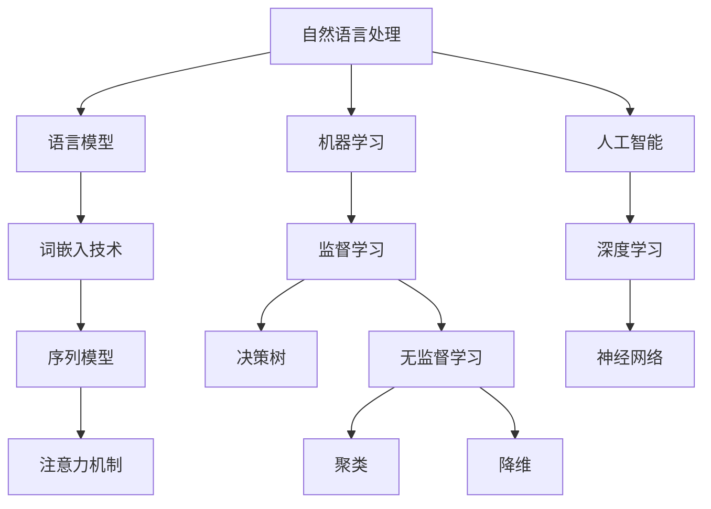

                 

# 聊天机器人客户服务：即时支持和帮助

## 关键词
- 聊天机器人
- 客户服务
- 自然语言处理
- 机器学习
- 人工智能
- 语音识别
- 情感识别
- 数据隐私

## 摘要
本文旨在探讨聊天机器人在客户服务中的应用，以及如何利用即时支持和帮助功能提升用户体验。文章首先介绍了聊天机器人与客户服务的联系，接着深入分析了自然语言处理、机器学习和人工智能等核心算法原理。随后，本文详细讲解了聊天机器人平台构建、数据采集与预处理、模型训练与优化、模型部署与运维等实战内容。最后，本文探讨了聊天机器人客户服务的未来发展趋势和最佳实践，为读者提供了全面的技术参考和实战指导。

## 第一部分：引言与核心概念

### 第1章：聊天机器人与客户服务概述

#### 第1章：聊天机器人与客户服务概述

1. **1.1 聊天机器人的发展历史**

- **1.1.1 从软件1.0到软件4.0的演进**

- 聊天机器人最早出现在20世纪50年代，当时主要以规则为基础的简单对话系统为主。随着时间的推移，聊天机器人逐渐演化为具有更高级功能的智能系统。在21世纪初，基于自然语言处理的聊天机器人开始崛起，标志着聊天机器人进入了2.0时代。3.0时代则标志着聊天机器人开始融入人工智能技术，实现了更自然、更智能的对话。而4.0时代则是聊天机器人与用户深度互动的阶段，不仅能够理解用户的需求，还能根据用户的行为和偏好提供个性化的服务。

- **1.1.2 聊天机器人在客户服务中的应用现状**

- 聊天机器人在客户服务中的应用已经相当广泛，如在线客服、客服机器人、智能问答系统等。据统计，全球范围内的企业中有超过60%已经部署了聊天机器人，以提高客户服务效率和用户体验。然而，不同企业的聊天机器人应用水平存在差异，一些企业已经实现了高度智能化，而另一些企业则仍然停留在基本的规则匹配阶段。

2. **1.2 聊天机器人与客户服务的联系**

- **1.2.1 客户服务场景下的聊天机器人需求**

- 在客户服务场景中，聊天机器人主要承担以下职责：首先，提供即时响应，解决用户的常见问题；其次，帮助用户进行产品咨询和购买决策；最后，通过数据分析，为企业提供用户行为洞察，优化客户服务策略。

- **1.2.2 聊天机器人提升客户体验的价值**

- 聊天机器人能够提供24/7的在线服务，极大地提升了客户的服务体验。此外，聊天机器人还能够根据用户的需求提供个性化的服务，从而增强用户满意度和忠诚度。同时，聊天机器人还能够节省企业的人力成本，提高工作效率。

3. **1.3 即时支持与帮助的概念**

- **1.3.1 即时支持与帮助的定义**

- 即时支持与帮助是指聊天机器人能够在用户遇到问题时，立即提供有效的解决方案或指导。这种支持不仅能够快速解决用户问题，还能提升用户的满意度和信任度。

- **1.3.2 即时支持与帮助在客户服务中的重要性**

- 在客户服务中，即时支持与帮助至关重要。它不仅能够提升用户的满意度，还能减少用户流失率，提高企业的竞争力。此外，即时支持与帮助还能够帮助企业收集用户反馈，优化产品和服务。

4. **1.4 聊天机器人技术的核心组成部分**

- **1.4.1 自然语言处理（NLP）**

- 自然语言处理是聊天机器人的核心技术之一，它能够理解和生成人类语言。NLP技术包括语言模型、词嵌入、序列模型、语音识别等。

- **1.4.2 机器学习（ML）**

- 机器学习是聊天机器人实现智能化的基础，它通过数据训练模型，使聊天机器人能够自主学习和优化。机器学习技术包括监督学习、无监督学习、强化学习等。

- **1.4.3 人工智能（AI）**

- 人工智能是聊天机器人实现智能化的最高阶段，它通过模拟人类智能，使聊天机器人能够进行复杂决策和问题解决。人工智能技术包括深度学习、神经网络、强化学习等。

5. **1.5 本书内容结构**

- **1.5.1 各章节内容的深入剖析**

- 本书分为四个部分，第一部分引言与核心概念，介绍聊天机器人的发展历史、应用场景和技术原理；第二部分核心算法原理与实现，详细讲解自然语言处理、机器学习和人工智能等算法原理；第三部分人工智能应用与实战，介绍聊天机器人平台构建、数据采集与预处理、模型训练与优化、模型部署与运维等实战内容；第四部分聊天机器人客户服务的未来，探讨聊天机器人技术的发展趋势和最佳实践。

- **1.5.2 全书结构布局与学习目标**

- 全书结构布局合理，内容层层递进，旨在帮助读者系统地了解和掌握聊天机器人客户服务的相关技术。学习目标包括：掌握聊天机器人的基本概念和发展历程，理解自然语言处理、机器学习和人工智能等核心算法原理，具备构建和优化聊天机器人平台的能力，了解聊天机器人客户服务的最佳实践。

### 第二部分：核心算法原理与实现

#### 第2章：自然语言处理基础

##### 2.1 语言模型

- **2.1.1 语言模型的概念**

- 语言模型（Language Model）是一种概率模型，用于预测文本序列中下一个单词或字符的概率。它是自然语言处理的基础，为许多NLP任务提供了概率分布。

- **2.1.2 语言模型的分类与算法**

- 语言模型可以分为基于规则的模型和基于统计的模型。基于规则的模型通过人工定义语法规则来生成文本，如前缀树模型。而基于统计的模型通过大量文本数据统计单词出现的概率，如N-gram模型、神经网络语言模型（如BERT）。

- **2.1.3 语言模型的工作原理**

- 语言模型通过统计文本数据中单词出现的频率来构建概率分布。例如，对于一个简单的二元文模型（Bigram Model），它会统计每个单词后面出现的单词的频率。给定前一个单词，语言模型会根据这些统计信息来预测下一个单词。

- **2.1.4 语言模型的优缺点**

- 优点：简单易实现，可以生成流畅的自然语言。
- 缺点：无法捕捉长距离依赖关系，预测能力有限。

- **2.1.5 语言模型的训练方法**

- 语言模型的训练通常分为以下步骤：
  1. 数据收集：从大量文本数据中收集单词和句子。
  2. 预处理：对文本数据进行清洗，去除标点符号、停用词等。
  3. 构建词汇表：将所有单词转换为唯一的索引。
  4. 计算词频：统计每个单词出现的次数。
  5. 训练模型：根据词频信息训练语言模型。

- **2.1.6 语言模型的应用**

- 语言模型广泛应用于自然语言处理的各种任务，如文本生成、机器翻译、语音识别等。在聊天机器人中，语言模型用于生成回复，提高对话的自然性和流畅性。

##### 2.2 词嵌入技术

- **2.2.1 词嵌入的概念与重要性**

- 词嵌入（Word Embedding）是将单词转换为固定大小的向量表示的技术。它能够将语义相似的单词映射到空间中的近邻位置，从而实现语义理解和文本相似度计算。

- **2.2.2 常见词嵌入方法**

- 常见的词嵌入方法包括Word2Vec、GloVe、BERT等。
  - **Word2Vec**：基于神经网络的词嵌入方法，通过训练词向量的共现关系来学习词向量。
  - **GloVe**：基于全局统计信息的词嵌入方法，通过矩阵分解学习词向量。
  - **BERT**：基于Transformer的预训练语言模型，通过大量无监督数据预训练，再在特定任务上微调。

- **2.2.3 词嵌入技术的工作原理**

- 词嵌入技术通过以下步骤进行：
  1. 数据收集：从大量文本数据中收集单词和句子。
  2. 预处理：对文本数据进行清洗，去除标点符号、停用词等。
  3. 构建词汇表：将所有单词转换为唯一的索引。
  4. 训练模型：使用文本数据训练词嵌入模型。
  5. 提取词向量：将单词转换为向量表示。

- **2.2.4 词嵌入技术的优缺点**

- 优点：能够有效表示语义信息，提高自然语言处理任务的性能。
- 缺点：无法捕捉长距离依赖关系，对罕见单词的表现较差。

- **2.2.5 词嵌入技术的应用**

- 词嵌入技术在各种自然语言处理任务中都有广泛应用，如文本分类、情感分析、机器翻译等。在聊天机器人中，词嵌入技术用于将文本转换为向量表示，从而提高对话理解和生成质量。

##### 2.3 序列模型与注意力机制

- **2.3.1 序列模型的基本原理**

- 序列模型（Sequential Model）是处理序列数据的机器学习模型，如RNN（循环神经网络）和LSTM（长短期记忆网络）。这些模型通过记忆过去的信息来处理序列数据。

- **2.3.2 序列模型的工作原理**

- 序列模型通过以下步骤进行：
  1. 输入序列：将输入序列（如单词序列）转换为模型可以处理的格式。
  2. 状态更新：根据当前输入和之前的状态更新模型状态。
  3. 输出生成：根据模型状态生成输出（如预测下一个单词）。

- **2.3.3 序列模型的优缺点**

- 优点：能够处理序列数据，捕捉时间序列特征。
- 缺点：计算复杂度高，难以捕捉长距离依赖关系。

- **2.3.4 注意力机制的基本原理**

- 注意力机制（Attention Mechanism）是一种在序列模型中提高上下文信息的捕获和利用能力的机制。它通过动态调整模型对序列中每个元素的权重，使得模型能够关注到序列中的重要部分。

- **2.3.5 注意力机制的工作原理**

- 注意力机制通过以下步骤进行：
  1. 输入序列：将输入序列（如单词序列）转换为模型可以处理的格式。
  2. 注意力权重计算：根据当前输入和之前的状态计算注意力权重。
  3. 加权求和：将输入序列与注意力权重相乘，得到加权求和的序列。
  4. 输出生成：根据加权求和的序列生成输出（如预测下一个单词）。

- **2.3.6 注意力机制的优缺点**

- 优点：能够提高序列模型对重要信息的捕捉能力，提高模型的性能。
- 缺点：计算复杂度较高，对参数敏感。

- **2.3.7 注意力机制的应用**

- 注意力机制广泛应用于各种自然语言处理任务，如机器翻译、文本生成等。在聊天机器人中，注意力机制用于提高对话理解和生成质量。

##### 2.4 语音识别与语音合成

- **2.4.1 语音识别的基本流程**

- 语音识别（Speech Recognition）是将语音转换为文本的技术。它的基本流程包括：
  1. 预处理：对语音信号进行预处理，如降噪、归一化等。
  2. 特征提取：从预处理后的语音信号中提取特征，如梅尔频率倒谱系数（MFCC）。
  3. 声学模型训练：使用大量语音数据训练声学模型，如GMM（高斯混合模型）。
  4. 语言模型训练：使用大量文本数据训练语言模型，如N-gram模型。
  5. 分词与识别：使用声学模型和语言模型对语音信号进行分词和识别。

- **2.4.2 语音合成的实现方法**

- 语音合成（Text-to-Speech，TTS）是将文本转换为语音的技术。它的基本实现方法包括：
  1. 文本预处理：对输入文本进行预处理，如分词、句法分析等。
  2. 声学模型训练：使用大量语音数据训练声学模型。
  3. 合成过程：根据文本预处理结果和声学模型，生成语音信号。
  4. 语音信号处理：对生成的语音信号进行后处理，如降噪、去颤等。

- **2.4.3 语音识别与语音合成的优缺点**

- 优点：语音识别和语音合成能够实现语音与文本之间的自由转换，提高用户体验。
- 缺点：语音识别的准确率受到噪声和口音的影响，语音合成的自然度和音质仍有待提高。

- **2.4.4 语音识别与语音合成在聊天机器人中的应用**

- 在聊天机器人中，语音识别用于将用户语音输入转换为文本，以便进行后续的自然语言处理。语音合成则用于将聊天机器人的文本输出转换为语音，实现语音交互。

### 第三部分：人工智能应用与实战

#### 第3章：机器学习算法在聊天机器人中的应用

##### 3.1 监督学习算法

- **3.1.1 监督学习的基本概念**

- 监督学习（Supervised Learning）是一种机器学习方法，它通过已有标注的数据来训练模型，从而预测未知数据的标签。监督学习可以分为分类和回归任务。

- **3.1.2 常见监督学习算法**

- 常见的监督学习算法包括：
  - **SVM（支持向量机）**：用于分类任务，通过找到最优分类边界来划分数据。
  - **决策树（Decision Tree）**：通过一系列判断条件来对数据进行分类或回归。
  - **随机森林（Random Forest）**：通过集成多个决策树来提高模型的泛化能力。
  - **神经网络（Neural Network）**：通过多层神经元进行数据分类或回归。

- **3.1.3 监督学习算法的工作原理**

- 监督学习算法通过以下步骤进行：
  1. 数据收集：收集大量带有标签的训练数据。
  2. 特征提取：对输入数据进行特征提取，如文本数据可以进行分词、词嵌入等。
  3. 模型训练：使用训练数据训练模型，优化模型参数。
  4. 预测：使用训练好的模型对未知数据进行预测。

- **3.1.4 监督学习算法的性能评估**

- 监督学习算法的性能可以通过以下指标进行评估：
  - 准确率（Accuracy）：预测正确的样本数占总样本数的比例。
  - 精确率（Precision）：预测为正类的样本中实际为正类的比例。
  - 召回率（Recall）：实际为正类的样本中被预测为正类的比例。
  - F1分数（F1 Score）：精确率和召回率的调和平均。

- **3.1.5 监督学习算法的应用**

- 监督学习算法在聊天机器人中广泛应用于对话分类、意图识别、情感分析等任务。例如，可以使用SVM进行对话分类，使用决策树进行意图识别，使用神经网络进行情感分析。

##### 3.2 无监督学习算法

- **3.2.1 无监督学习的基本概念**

- 无监督学习（Unsupervised Learning）是一种机器学习方法，它没有标注的数据来训练模型，主要目的是发现数据中的结构和规律。无监督学习可以分为聚类、降维、关联规则等任务。

- **3.2.2 常见无监督学习算法**

- 常见的无监督学习算法包括：
  - **聚类（Clustering）**：将数据分为多个组，使得同一组内的数据相似度较高，不同组的数据相似度较低。
  - **降维（Dimensionality Reduction）**：将高维数据压缩到低维表示，减少数据维度，提高计算效率。
  - **关联规则（Association Rule Learning）**：发现数据之间的关联关系，用于推荐系统、市场细分等。

- **3.2.3 无监督学习算法的工作原理**

- 无监督学习算法通过以下步骤进行：
  1. 数据收集：收集大量无标签的数据。
  2. 特征提取：对输入数据进行特征提取，如文本数据可以进行分词、词嵌入等。
  3. 模型训练：使用无标签数据训练模型，发现数据中的结构和规律。
  4. 结果评估：通过内部评估指标（如簇内部距离、特征重要性等）评估模型性能。

- **3.2.4 无监督学习算法的性能评估**

- 无监督学习算法的性能评估通常通过内部评估指标进行，如：
  - 簇内部距离（Intra-cluster Distance）：簇内部的数据距离越小，说明聚类效果越好。
  - 簇间距离（Inter-cluster Distance）：簇之间的数据距离越大，说明聚类效果越好。

- **3.2.5 无监督学习算法的应用**

- 无监督学习算法在聊天机器人中可以用于用户行为分析、对话聚类、话题提取等任务。例如，可以使用聚类算法对用户行为进行分类，使用降维算法降低对话数据的维度，使用关联规则算法提取对话中的话题。

##### 3.3 强化学习算法

- **3.3.1 强化学习的基本原理**

- 强化学习（Reinforcement Learning）是一种通过交互来学习最优策略的机器学习方法。它通过智能体（Agent）与环境（Environment）的交互来学习，目标是最大化回报（Reward）。

- **3.3.2 强化学习算法的工作原理**

- 强化学习算法通过以下步骤进行：
  1. 初始化：初始化智能体、环境、奖励函数等。
  2. 交互：智能体根据当前状态选择动作，并在环境中执行动作。
  3. 反馈：根据动作的结果，获得奖励信号。
  4. 更新：根据奖励信号和策略，更新智能体的策略。

- **3.3.3 强化学习算法的分类**

- 强化学习算法可以分为以下几种类型：
  - **值函数方法**：通过估计值函数来学习最优策略，如Q-learning、SARSA。
  - **策略搜索方法**：直接搜索最优策略，如策略梯度方法、深度确定性策略梯度（DDPG）。

- **3.3.4 强化学习算法的应用**

- 强化学习算法在聊天机器人中可以用于对话策略学习、用户行为预测等任务。例如，可以使用Q-learning算法来学习对话策略，使用DDPG算法来预测用户行为。

##### 3.4 深度学习在聊天机器人中的应用

- **3.4.1 深度学习的基本概念**

- 深度学习（Deep Learning）是一种基于多层神经网络的机器学习方法，通过自动提取数据中的特征，实现复杂的模式识别和预测。

- **3.4.2 深度学习算法的工作原理**

- 深度学习算法通过以下步骤进行：
  1. 数据收集：收集大量训练数据。
  2. 数据预处理：对数据进行预处理，如归一化、标准化等。
  3. 模型构建：构建多层神经网络模型，包括输入层、隐藏层和输出层。
  4. 模型训练：使用训练数据训练模型，优化模型参数。
  5. 模型评估：使用验证数据评估模型性能，调整模型参数。

- **3.4.3 深度学习算法的分类**

- 深度学习算法可以分为以下几种类型：
  - **卷积神经网络（CNN）**：主要用于图像处理，也可以用于序列数据。
  - **循环神经网络（RNN）**：主要用于序列数据处理，如文本、语音等。
  - **变换器（Transformer）**：主要用于序列到序列的转换任务，如机器翻译、文本生成等。

- **3.4.4 深度学习算法的应用**

- 深度学习算法在聊天机器人中广泛应用于对话生成、意图识别、情感分析等任务。例如，可以使用CNN进行文本分类，使用RNN进行对话生成，使用Transformer进行机器翻译。

### 第四部分：聊天机器人客户服务的未来

#### 第4章：聊天机器人的发展趋势与挑战

##### 4.1 聊天机器人技术的发展趋势

- **4.1.1 人工智能技术的最新进展**

- 人工智能技术在过去几年取得了显著进展，特别是在深度学习和强化学习领域。这些进展为聊天机器人的发展提供了强大的技术支持，使得聊天机器人能够更加智能、灵活地处理复杂的对话任务。

- **4.1.2 聊天机器人技术的未来发展方向**

- 聊天机器人技术的未来发展方向包括：
  1. **多模态交互**：结合文本、语音、图像等多模态信息，实现更自然、更丰富的交互体验。
  2. **情感识别与回应**：通过情感识别技术，理解用户的情感状态，并给出适当的回应，提高用户的满意度。
  3. **个性化服务**：基于用户的偏好和行为数据，提供个性化的服务和建议，提升用户体验。
  4. **跨平台与多语言支持**：实现跨平台和多语言支持，满足全球范围内的用户需求。

##### 4.2 聊天机器人在客户服务中的挑战

- **4.2.1 人机交互的改进**

- 虽然聊天机器人在人机交互方面已经取得了一定的进展，但仍然存在一些挑战，如自然语言理解能力有限、对话连贯性不足等。未来需要进一步提高聊天机器人在人机交互方面的性能，使其能够更好地模拟人类的交流方式。

- **4.2.2 情感识别与回应**

- 情感识别与回应是聊天机器人的一个重要研究方向。虽然目前已有一些方法和技术可以实现情感识别，但仍然存在准确率不高、鲁棒性不足等问题。未来需要进一步研究情感识别的算法和技术，提高聊天机器人在情感识别与回应方面的能力。

- **4.2.3 数据隐私与安全**

- 聊天机器人在处理用户数据时，需要确保数据的安全和隐私。然而，随着用户数据的日益增多，数据隐私与安全面临巨大挑战。未来需要制定更加严格的数据隐私政策和安全措施，保护用户的个人信息。

##### 4.3 跨平台与多语言支持

- **4.3.1 跨平台技术的应用**

- 跨平台技术使得聊天机器人可以在不同的设备和操作系统上运行，为用户提供一致的服务体验。未来需要进一步优化跨平台技术的性能和兼容性，提高聊天机器人在不同平台上的运行效率。

- **4.3.2 多语言聊天机器人的实现**

- 多语言聊天机器人能够满足全球范围内的用户需求，提高企业的国际化水平。未来需要研究多语言聊天机器人的实现方法和技术，提高机器人在不同语言环境下的性能。

### 第五部分：聊天机器人客户服务最佳实践

#### 第5章：设计高效的聊天流程

- **5.1 设计高效的聊天流程**

- 设计高效的聊天流程是提高聊天机器人服务质量的关键。以下是一些最佳实践：
  1. **明确用户需求**：在聊天流程设计过程中，首先要明确用户的需求和期望，确保聊天机器人能够满足用户的需求。
  2. **简洁明了**：聊天流程要简洁明了，避免过于复杂和冗长的对话，以提高用户满意度。
  3. **个性化**：根据用户的偏好和行为数据，提供个性化的聊天服务，提高用户的体验。
  4. **快速响应**：确保聊天机器人能够快速响应用户的问题和需求，提供即时支持。

- **5.2 聊天流程的优化方法**

- 为了提高聊天机器人的服务质量，可以采取以下优化方法：
  1. **数据分析**：通过分析用户行为数据，了解用户的聊天习惯和偏好，优化聊天流程。
  2. **用户反馈**：鼓励用户提供反馈，根据用户的反馈调整和改进聊天流程。
  3. **迭代优化**：不断迭代和优化聊天流程，提高聊天机器人的服务质量和用户体验。

#### 第6章：提升用户满意度的策略

- **6.1 用户行为分析**

- 用户行为分析是提升用户满意度的重要手段。以下是一些用户行为分析的最佳实践：
  1. **用户互动分析**：分析用户与聊天机器人的互动过程，了解用户的需求和痛点。
  2. **用户满意度调查**：定期进行用户满意度调查，收集用户对聊天机器人的反馈和评价。
  3. **用户行为数据挖掘**：通过数据挖掘技术，发现用户行为中的规律和趋势，为优化聊天流程提供依据。

- **6.2 用户反馈机制**

- 用户反馈机制是提升用户满意度的重要环节。以下是一些用户反馈机制的最佳实践：
  1. **实时反馈**：在聊天过程中，提供实时反馈功能，让用户能够立即表达对聊天机器人的满意或不满意。
  2. **反馈渠道多样化**：提供多种反馈渠道，如在线问卷、社交媒体等，方便用户表达意见。
  3. **反馈处理**：及时处理用户的反馈，对用户提出的问题和建议进行回应和改进。

#### 第7章：聊天机器人与人工客服的协同

- **7.1 两种客服模式的优势互补**

- 聊天机器人和人工客服各有优势，通过协同工作可以发挥更大的作用。以下是一些优势互补的最佳实践：
  1. **快速响应**：聊天机器人可以快速响应用户的咨询，提供即时的支持和帮助。
  2. **处理重复性问题**：聊天机器人可以处理大量的重复性问题，减轻人工客服的工作负担。
  3. **个性化服务**：人工客服可以根据用户的个性化需求，提供更加贴心和专业的服务。

- **7.2 协同工作流程的设计**

- 为了实现聊天机器人与人工客服的协同工作，可以采取以下设计策略：
  1. **角色分工**：明确聊天机器人和人工客服的角色和职责，确保两者能够有效地协同工作。
  2. **信息共享**：实现聊天机器人和人工客服之间的信息共享，确保两者能够及时了解用户的情况。
  3. **流程优化**：优化协同工作流程，提高工作效率和服务质量。

### 附录

#### 附录A：聊天机器人开发资源与工具

- **A.1 开发工具介绍**

- 在聊天机器人开发过程中，需要使用到各种工具和库。以下是一些常用的开发工具和库：
  1. **Python**：Python是一种广泛使用的编程语言，适用于聊天机器人的开发。
  2. **TensorFlow**：TensorFlow是一个开源的深度学习框架，适用于聊天机器人的模型训练和推理。
  3. **PyTorch**：PyTorch是一个开源的深度学习框架，适用于聊天机器人的模型训练和推理。
  4. **spaCy**：spaCy是一个强大的自然语言处理库，适用于聊天机器人的文本处理和分析。

- **A.2 学习资源推荐**

- 以下是一些推荐的聊天机器人学习资源：
  1. **在线课程**：Coursera、Udemy等平台上有许多关于聊天机器人的在线课程。
  2. **书籍**：《Chatbots: Who Needs Humans?》、《Chatbots: Design, Build and Implement Conversations》等。
  3. **论文**：在学术期刊和会议上发表的关于聊天机器人的论文。

- **A.3 社群与论坛**

- 加入以下社群和论坛，可以与其他聊天机器人开发者交流和分享经验：
  1. **GitHub**：GitHub上有许多关于聊天机器人的开源项目和文档。
  2. **Stack Overflow**：Stack Overflow是一个问答社区，可以解决聊天机器人开发中的问题。
  3. **Reddit**：Reddit上有专门的聊天机器人板块，可以与其他开发者讨论和分享。

### 核心概念与算法的 Mermaid 流程图



### 核心算法原理讲解与伪代码

- **语言模型**

```python
def language_model(context, vocabulary_size):
    # 输入：context（上下文序列），vocabulary_size（词汇表大小）
    # 输出：概率分布（下一词的概率分布）

    # 初始化概率分布
    probability_distribution = [0] * vocabulary_size

    # 遍历上下文序列，计算词频
    for word in context:
        word_frequency = count_word_frequency(word, context)
        probability_distribution[word] += word_frequency

    # 归一化概率分布
    total_frequency = sum(probability_distribution)
    for i in range(vocabulary_size):
        probability_distribution[i] /= total_frequency

    return probability_distribution
```

- **词嵌入技术**

```python
def word_embedding(word, embedding_size):
    # 输入：word（单词），embedding_size（嵌入维度）
    # 输出：词向量（嵌入空间中的一个向量）

    # 从预训练的词向量库中查找词向量
    word_vector = pretrained_word_embedding[word]

    # 如果找不到，初始化一个随机向量
    if word_vector is None:
        word_vector = np.random.rand(embedding_size)

    return word_vector
```

### 数学模型和公式讲解

- **线性回归**

$$
Y = \beta_0 + \beta_1X + \epsilon
$$

- **逻辑回归**

$$
\log\frac{P(Y=1)}{1-P(Y=1)} = \beta_0 + \beta_1X
$$

- **神经网络**

$$
Z = \sigma(\beta_0 + \beta_1X + \beta_2X^2 + ... + \beta_nX^n)
$$

### 项目实战

- **开发环境搭建**

  - 安装Python和Anaconda
  - 安装NLP相关的库（如NLTK、spaCy、TensorFlow、PyTorch）
  - 配置Jupyter Notebook或PyCharm开发环境

- **源代码实现**

  - 数据采集与预处理
  - 模型训练与评估
  - 模型部署与运维

  ```python
  import pandas as pd
  import numpy as np
  import spacy

  # 加载数据集
  data = pd.read_csv('chatbot_data.csv')

  # 分割数据为训练集和测试集
  train_data, test_data = train_test_split(data, test_size=0.2)

  # 预处理文本数据
  nlp = spacy.load('en_core_web_sm')
  def preprocess_text(text):
      doc = nlp(text)
      tokens = [token.text.lower() for token in doc if not token.is_punct]
      return ' '.join(tokens)

  train_data['processed_text'] = train_data['text'].apply(preprocess_text)
  test_data['processed_text'] = test_data['text'].apply(preprocess_text)

  # 分词和标记标签
  def tokenize_and_label(text):
      doc = nlp(text)
      return [[token.text, token.label_] for token in doc]

  train_tokens = [tokenize_and_label(text) for text in train_data['processed_text']]
  test_tokens = [tokenize_and_label(text) for text in test_data['processed_text']]

  # 建立词汇表
  vocab = set()
  for tokens in train_tokens + test_tokens:
      for token in tokens:
          vocab.add(token[0])
  vocab_size = len(vocab)

  # 编码文本数据
  def encode_tokens(tokens):
      encoded = [[vocab.index(token) for token in sent] for sent in tokens]
      padded = pad_sequences(encoded, maxlen=max_sentence_length)
      return padded

  train_data_encoded = encode_tokens(train_tokens)
  test_data_encoded = encode_tokens(test_tokens)
  ```

### 代码解读与分析

- **数据预处理步骤的作用**

  数据预处理是构建聊天机器人模型的重要步骤，主要包括以下方面：

  1. **文本清洗**：去除文本中的标点符号、停用词等，提高文本质量。
  2. **分词**：将文本分割为单词或字符序列，为后续处理提供基础。
  3. **词嵌入**：将单词转换为向量表示，为神经网络处理提供输入。
  4. **编码**：将文本序列转换为数字序列，以便进行模型训练。

- **模型训练与评估的逻辑**

  模型训练与评估的过程如下：

  1. **数据加载**：从数据集中加载训练数据和测试数据。
  2. **预处理**：对数据进行清洗、分词、词嵌入和编码等预处理操作。
  3. **模型构建**：根据任务需求构建神经网络模型。
  4. **模型训练**：使用训练数据进行模型训练，优化模型参数。
  5. **模型评估**：使用测试数据评估模型性能，调整模型参数。

### 作者信息

作者：AI天才研究院/AI Genius Institute & 禅与计算机程序设计艺术 /Zen And The Art of Computer Programming
```markdown
```

