                 

# 《自然语言处理在情感计算中的深入研究》

## 摘要

本文旨在深入探讨自然语言处理（NLP）在情感计算中的应用。随着人工智能技术的发展，情感计算逐渐成为了一个重要的研究领域，它旨在通过分析和理解人类情感，实现与人类的更加自然、有效的交互。自然语言处理作为人工智能的一个重要分支，其在情感计算中的应用日益广泛，涵盖了情感分析、情感强度评估、多模态情感计算等多个方面。本文将首先介绍情感计算的背景和发展，然后详细分析NLP在情感计算中的基础技术和深度学习模型，接着探讨情感计算的实践与应用，最后讨论情感计算面临的挑战与未来发展趋势。

## 目录大纲

### 第一部分：情感计算与自然语言处理基础

#### 第1章：情感计算概述

##### 1.1 情感计算的起源与发展

##### 1.2 自然语言处理基础

##### 1.3 情感计算中的自然语言处理技术

#### 第2章：情感计算中的自然语言处理技术

##### 2.1 情感分析的基本原理

##### 2.2 情感计算中的文本表示

##### 2.3 情感计算的深度学习模型

#### 第3章：情感计算的实践与应用

##### 3.1 情感计算在社交媒体分析中的应用

##### 3.2 情感计算在客户服务与营销中的应用

##### 3.3 情感计算在教育、医疗等领域的应用

##### 3.4 其他领域情感计算的应用前景

### 第二部分：情感计算中的挑战与未来发展

#### 第4章：情感计算的挑战与局限性

##### 4.1 数据质量与标注问题

##### 4.2 模型解释性与可解释性

##### 4.3 多语言情感计算

##### 4.4 情感计算的伦理问题

#### 第5章：情感计算的未来发展趋势

##### 5.1 模型压缩与优化

##### 5.2 多模态情感计算

##### 5.3 情感计算的跨领域应用

##### 5.4 情感计算的新趋势

### 第三部分：情感计算中的开源工具与资源

#### 第6章：情感计算中的开源工具与资源

##### 6.1 情感计算的开源框架

##### 6.2 情感计算的数据集

##### 6.3 情感计算的其他资源

### 第四部分：项目实战与案例分析

#### 第7章：情感计算项目实战

##### 7.1 项目背景与目标

##### 7.2 项目设计与实现

##### 7.3 项目效果评估与优化

#### 第8章：情感计算案例分析

##### 8.1 社交媒体情感分析

##### 8.2 客户服务中的情感计算

##### 8.3 教育领域的情感计算应用

### 第五部分：情感计算与自然语言处理的应用

#### 第9章：情感计算在自然语言处理中的应用

##### 9.1 情感计算在对话系统中的应用

##### 9.2 情感计算在文本生成与摘要中的应用

##### 9.3 情感计算在自然语言处理中的其他应用

### 第六部分：情感计算与伦理、隐私问题

#### 第10章：情感计算中的伦理、隐私问题

##### 10.1 情感计算的伦理问题

##### 10.2 情感计算的隐私保护

##### 10.3 情感计算中的监管与规范

### 第七部分：情感计算的未来

#### 第11章：情感计算的未来

##### 11.1 情感计算的新趋势

##### 11.2 情感计算的未来挑战与机遇

### 附录

#### 附录A：情感计算开源工具与资源汇总

##### 附录B：情感计算经典算法与模型总结

## 第一部分：情感计算与自然语言处理基础

### 第1章：情感计算概述

#### 1.1 情感计算的起源与发展

情感计算（Affective Computing）是一门研究如何使计算机模拟、识别、理解以及表达人类情感的技术科学。其起源可以追溯到20世纪80年代，由计算机科学家约翰·霍普金斯（John C. McCarthy）首次提出。随着人工智能和计算机视觉等领域的发展，情感计算逐渐成为了一个独立的、跨学科的研究领域。

#### 1.1.1 情感计算的定义

情感计算是一种人工智能技术，它使计算机能够模拟、识别、理解和表达人类的情感。具体来说，情感计算包括以下几个关键能力：

1. **情感识别**：通过观察和分析人的行为、语言和生理信号来识别情感。
2. **情感理解**：通过理解情感背后的意义和背景，实现对情感的深入理解。
3. **情感表达**：通过计算机生成的语音、图像、文本等方式来表达情感。
4. **情感模拟**：通过计算机模型来模拟人类的情感体验。

#### 1.1.2 情感计算的目标

情感计算的目标是使计算机能够更好地理解和满足人类的需求，从而实现更自然、更有效的交互。具体目标包括：

1. **提高人机交互的自然性**：通过情感计算，使得计算机能够更好地理解人类的情感状态，从而实现更自然的交互。
2. **增强系统的智能性**：通过情感计算，使得计算机能够更好地理解人类的情感，从而提升其智能水平。
3. **提升用户体验**：通过情感计算，使得计算机能够更好地满足用户的需求，从而提升用户体验。

#### 1.1.3 情感计算的挑战与机遇

情感计算面临着诸多挑战，同时也拥有巨大的发展机遇。主要的挑战包括：

1. **情感识别的准确性**：情感计算的关键在于准确识别人类的情感，这需要高精度的情感识别算法和大量的情感数据。
2. **情感理解的复杂性**：人类的情感是非常复杂的，涉及多种情绪和情感状态，这对情感计算提出了高要求。
3. **隐私保护**：情感计算涉及对人类情感的分析和理解，这对隐私保护提出了新的挑战。

然而，随着人工智能技术的不断发展，情感计算也面临着诸多机遇，包括：

1. **跨学科融合**：情感计算需要结合心理学、神经科学、计算机科学等多个领域的知识，这为跨学科研究提供了广阔的空间。
2. **大数据与云计算**：随着大数据和云计算技术的发展，情感计算可以获得海量的情感数据，从而提升模型的准确性。
3. **物联网与边缘计算**：情感计算在物联网和边缘计算中的应用，将使得计算机能够更实时、更准确地识别和理解人类的情感。

#### 1.2 自然语言处理基础

自然语言处理（Natural Language Processing，NLP）是人工智能的一个子领域，旨在使计算机能够理解和处理人类语言。NLP涵盖了从文本解析、语义分析到语言生成等多个方面，是情感计算中的重要组成部分。

##### 1.2.1 语言模型与词嵌入

语言模型是NLP的基础，它能够预测文本中下一个单词或词组的概率。词嵌入（Word Embedding）是将词语映射到高维空间中的向量表示，这使得词语之间的相似性可以通过向量之间的距离来表示。

**语言模型**：

语言模型是NLP中最基础的模型之一，它能够根据已知的文本序列预测下一个单词或词组。最常用的语言模型之一是n元语法模型（N-gram Model），它基于文本的历史序列来预测下一个词。然而，n元语法模型在处理长文本时效果不佳，因此，更复杂的语言模型如神经网络语言模型（Neural Network Language Model）被提出。

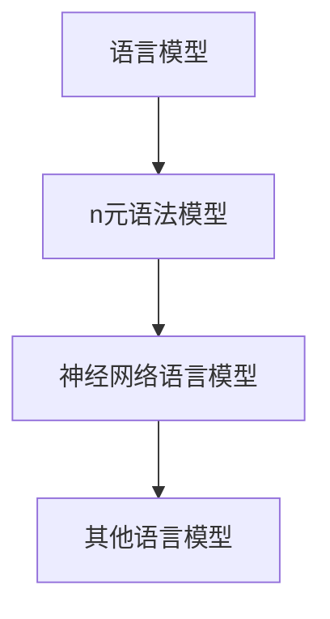

**词嵌入**：

词嵌入是将词语映射到高维空间中的向量表示，使得词语之间的相似性可以通过向量之间的距离来表示。最常见的词嵌入技术是Word2Vec模型，它基于神经网络来学习词语的向量表示。

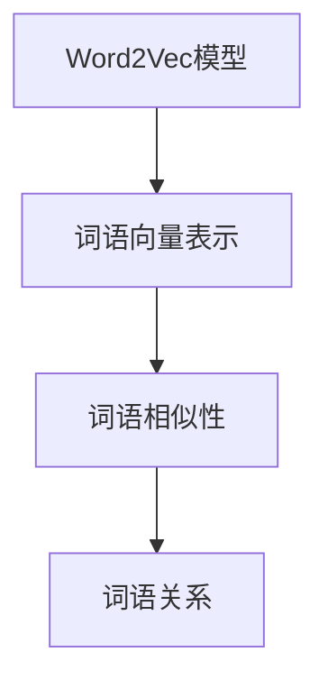

##### 1.2.2 序列标注与分类算法

序列标注（Sequence Labeling）是NLP中的一个重要任务，旨在给文本序列中的每个单词或字符分配一个标签。常见的序列标注任务包括命名实体识别（Named Entity Recognition，NER）和情感分析（Sentiment Analysis）。

**序列标注算法**：

常用的序列标注算法包括基于规则的算法和基于机器学习的算法。基于规则的算法如HMM（Hidden Markov Model）和CRF（Conditional Random Field），而基于机器学习的算法如LSTM（Long Short-Term Memory）和BiLSTM（Bidirectional LSTM）。

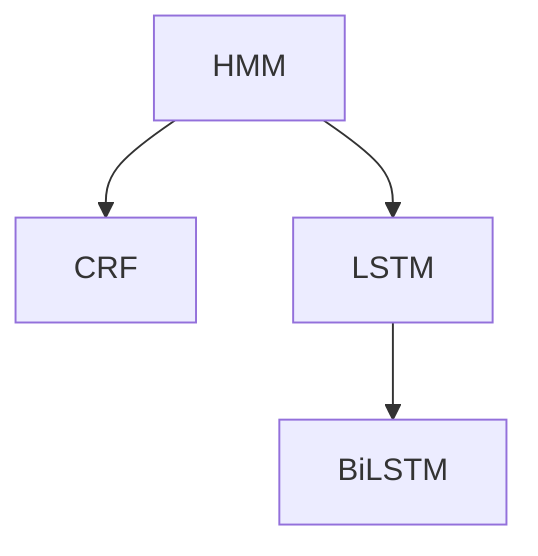

**分类算法**：

分类算法是NLP中的另一个重要任务，旨在将文本分类到预定义的类别中。常用的分类算法包括朴素贝叶斯（Naive Bayes）、支持向量机（SVM）和深度学习算法如CNN（Convolutional Neural Network）和RNN（Recurrent Neural Network）。

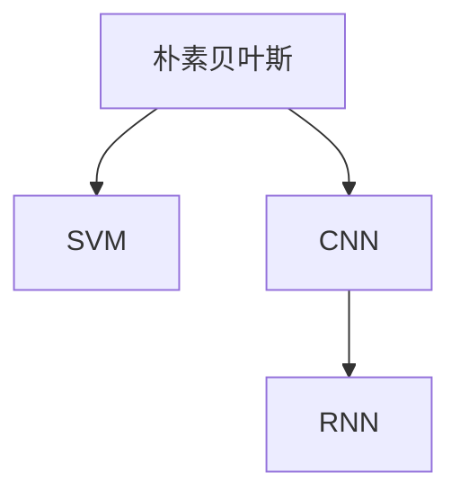

##### 1.2.3 递归神经网络与卷积神经网络

递归神经网络（Recurrent Neural Network，RNN）和卷积神经网络（Convolutional Neural Network，CNN）是深度学习中的重要模型，它们在NLP中有着广泛的应用。

**递归神经网络**：

RNN是一种能够处理序列数据的神经网络，其核心思想是利用隐藏状态来存储序列中的信息。RNN在处理长序列时存在梯度消失或梯度爆炸的问题，为了解决这一问题，LSTM和GRU（Gated Recurrent Unit）被提出。

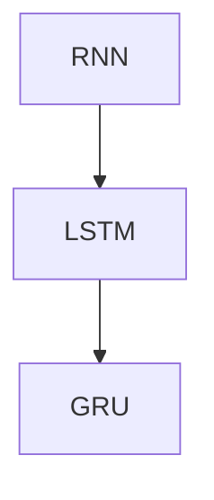

**卷积神经网络**：

CNN是一种能够高效处理图像数据的神经网络，其核心思想是通过卷积操作提取图像中的特征。CNN在NLP中的应用主要体现在文本表示和学习中，例如文本卷积网络（TextCNN）和BERT（Bidirectional Encoder Representations from Transformers）。

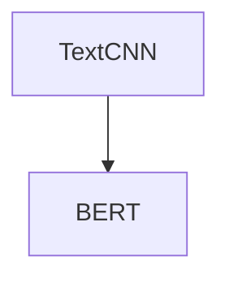

### 第2章：情感计算中的自然语言处理技术

#### 2.1 情感分析的基本原理

情感分析（Sentiment Analysis）是情感计算中的一个核心任务，旨在判断文本表达的情感倾向，如正面、负面或中性。情感分析的基本原理可以分为以下几个步骤：

1. **文本预处理**：对原始文本进行清洗和标准化，包括去除停用词、标点符号、转换小写等。

2. **特征提取**：将预处理后的文本转换为计算机可以处理的特征表示。常用的特征提取方法包括词袋模型（Bag of Words，BoW）和词嵌入（Word Embedding）。

3. **情感分类**：使用分类算法对文本的情感倾向进行判断。常见的分类算法包括朴素贝叶斯（Naive Bayes）、支持向量机（Support Vector Machine，SVM）和深度学习算法如CNN和LSTM。

**情感标注与分类**：

情感标注是将文本中的词语或句子标注为具体的情感类别。情感分类是将整个文本或句子归类为预定义的情感类别。常见的情感标注体系包括二分类（正面/负面）和三分类（正面/中性/负面）。

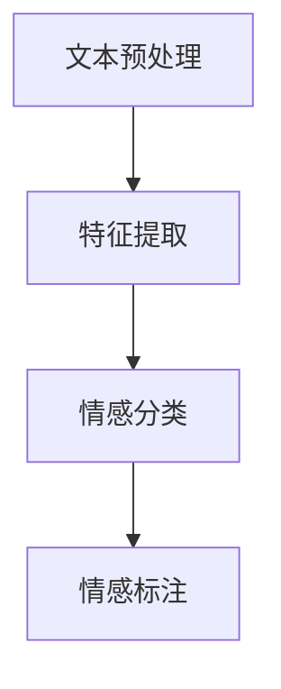

**情感强度评估**：

情感强度评估是判断文本情感倾向的强度。情感强度可以通过情感得分或情感极性来表示。情感得分通常在0到1之间，0表示完全负面，1表示完全正面。情感极性分为正面、中性、负面，分别用1、0、-1表示。

**多模态情感计算**：

多模态情感计算是结合多种数据模态（如图像、声音、文本等）来进行情感分析。多模态情感计算可以通过融合不同模态的数据特征来实现。常见的多模态情感计算方法包括：

1. **数据融合方法**：将不同模态的数据特征进行融合，如基于特征的融合和基于模型融合。
2. **深度学习方法**：使用深度学习模型（如CNN和RNN）同时处理多种模态的数据。

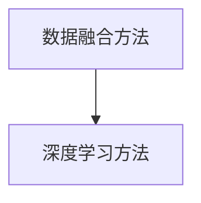

#### 2.2 情感计算中的文本表示

文本表示是将原始文本转换为计算机可以处理的向量表示。有效的文本表示能够捕获文本中的语义信息，从而提升情感分析的性能。常见的文本表示方法包括词袋模型、词嵌入和句嵌入。

**词嵌入**：

词嵌入是将词语映射到高维空间中的向量表示，使得词语之间的相似性可以通过向量之间的距离来表示。常见的词嵌入模型包括Word2Vec、GloVe和FastText。

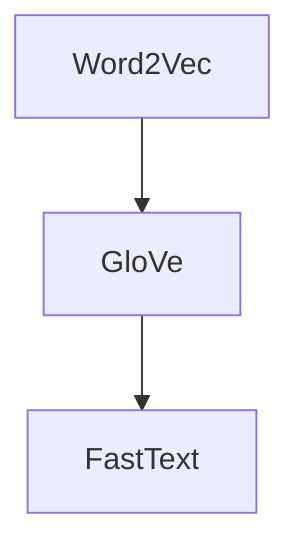

**句嵌入**：

句嵌入是将整个句子映射到高维空间中的向量表示，使得句子之间的相似性可以通过向量之间的距离来表示。常见的句嵌入模型包括Word2Vec、GloVe和BERT。

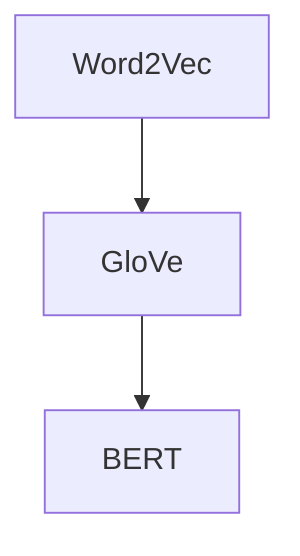

**情感词典与词性标注**：

情感词典是包含情感词汇和对应的情感倾向的词典。词性标注是将文本中的词语标注为具体的词性，如名词、动词、形容词等。情感词典和词性标注可以用于辅助情感分析。

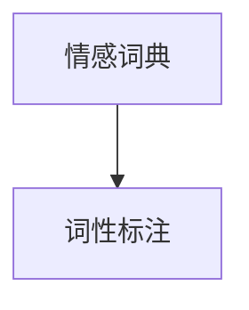

#### 2.3 情感计算的深度学习模型

深度学习模型在情感计算中发挥着重要作用，能够通过自动学习文本的复杂特征来实现高精度的情感分析。常见的深度学习模型包括递归神经网络（RNN）、卷积神经网络（CNN）和Transformer模型。

**递归神经网络（RNN）**：

RNN是一种能够处理序列数据的神经网络，其核心思想是利用隐藏状态来存储序列中的信息。RNN在处理长序列时存在梯度消失或梯度爆炸的问题，为了解决这一问题，LSTM和GRU（Gated Recurrent Unit）被提出。


**卷积神经网络（CNN）**：

CNN是一种能够高效处理图像数据的神经网络，其核心思想是通过卷积操作提取图像中的特征。CNN在NLP中的应用主要体现在文本表示和学习中，例如文本卷积网络（TextCNN）和BERT（Bidirectional Encoder Representations from Transformers）。


**Transformer模型**：

Transformer模型是一种基于自注意力机制的深度学习模型，其在处理长序列数据时表现优异。Transformer模型的核心思想是通过自注意力机制来学习序列中的依赖关系。

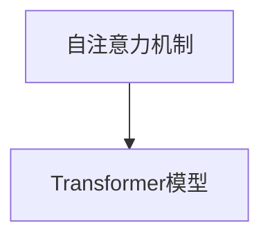

#### 2.3.1 递归神经网络在情感计算中的应用

递归神经网络（RNN）在情感计算中有着广泛的应用，能够通过自动学习文本的复杂特征来实现高精度的情感分析。RNN的核心思想是利用隐藏状态来存储序列中的信息，从而处理序列数据。

**基本原理**：

RNN的输入是一个序列数据，每个时间步的输入都会通过一个隐藏状态进行更新。隐藏状态不仅与当前时间步的输入有关，还与之前的隐藏状态有关，这使得RNN能够记住序列中的信息。

**实现步骤**：

1. **初始化**：初始化隐藏状态和输出状态。
2. **输入序列处理**：对于序列中的每个单词，将其输入到RNN中，更新隐藏状态。
3. **输出序列生成**：将最终的隐藏状态转换为输出序列，如情感分类结果。

**伪代码**：

```python
# 初始化隐藏状态和输出状态
h = [0]
y = [0]

# 输入序列处理
for word in sequence:
    # 输入到RNN中
    h = RNN(h, word)
    
# 输出序列生成
y = RNN(h, output)

# 情感分类结果
emotion = classify(y)
```

**案例**：

假设我们有一个包含情感词汇的句子：“今天的天气真好！”，我们使用RNN对其进行情感分析。

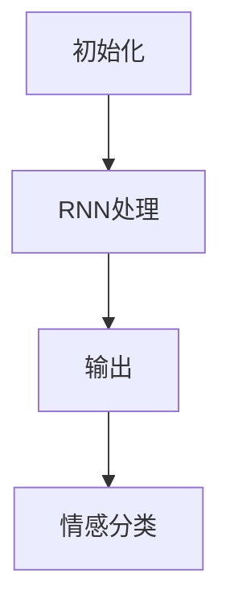

**优势**：

1. **序列记忆**：RNN能够通过隐藏状态记住序列中的信息，从而处理长序列数据。
2. **简单实现**：RNN的实现相对简单，易于理解和实现。

**劣势**：

1. **梯度消失和梯度爆炸**：RNN在处理长序列数据时存在梯度消失和梯度爆炸的问题。
2. **无法并行计算**：RNN无法并行计算，导致训练时间较长。

#### 2.3.2 卷积神经网络在情感计算中的应用

卷积神经网络（CNN）在情感计算中有着广泛的应用，能够通过自动学习文本的复杂特征来实现高精度的情感分析。CNN的核心思想是通过卷积操作提取图像中的特征，而文本卷积网络（TextCNN）则是将这一思想应用于文本数据。

**基本原理**：

CNN由卷积层、池化层和全连接层组成。卷积层通过卷积操作提取文本中的特征，池化层用于降低特征维度，全连接层用于进行分类。

**实现步骤**：

1. **卷积层**：对文本进行卷积操作，提取特征。
2. **池化层**：对卷积后的特征进行池化，降低特征维度。
3. **全连接层**：将池化后的特征输入到全连接层，进行分类。

**伪代码**：

```python
# 卷积层
conv_features = Conv2D(filters, kernel_size, activation='relu')(text)

# 池化层
pool_features = MaxPooling2D(pool_size)(conv_features)

# 全连接层
predictions = Dense(num_classes, activation='softmax')(pool_features)
```

**案例**：

假设我们有一个包含情感词汇的句子：“今天的天气真好！”，我们使用TextCNN对其进行情感分析。

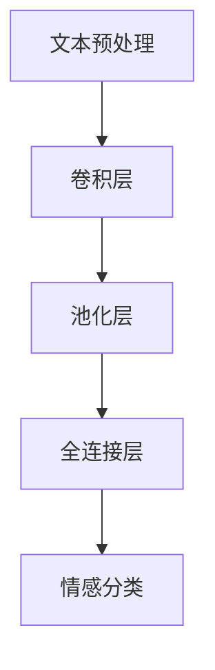

**优势**：

1. **高效特征提取**：CNN能够通过卷积操作高效提取文本中的特征。
2. **并行计算**：CNN支持并行计算，训练时间较短。

**劣势**：

1. **固定窗口大小**：CNN的窗口大小固定，无法适应不同长度的文本。
2. **无法捕捉长距离依赖**：CNN无法捕捉长距离依赖关系。

#### 2.3.3 自注意力机制与Transformer模型

自注意力机制（Self-Attention）是一种基于注意力机制的深度学习模型，其核心思想是自动学习输入序列中的依赖关系。Transformer模型是一种基于自注意力机制的深度学习模型，其在处理长序列数据时表现出色。

**基本原理**：

自注意力机制通过计算输入序列中每个单词与其他单词之间的依赖关系，从而生成新的特征表示。具体来说，自注意力机制包括三个关键步骤：

1. **Query（查询）**：每个单词都生成一个查询向量，表示其自身的特征。
2. **Key（键）**：每个单词都生成一个键向量，表示其与其他单词的特征。
3. **Value（值）**：每个单词都生成一个值向量，用于计算注意力分数。

**实现步骤**：

1. **生成Query、Key和Value**：对于输入序列中的每个单词，生成对应的Query、Key和Value向量。
2. **计算注意力分数**：计算Query与Key之间的相似性，生成注意力分数。
3. **加权求和**：将注意力分数与Value向量相乘，得到新的特征表示。

**伪代码**：

```python
# 生成Query、Key和Value
query = [q1, q2, ..., qN]
key = [k1, k2, ..., kN]
value = [v1, v2, ..., vN]

# 计算注意力分数
attention_scores = dot(query, key)

# 加权求和
context_vector = sum(attention_scores * value)
```

**优势**：

1. **捕捉长距离依赖**：自注意力机制能够自动学习输入序列中的长距离依赖关系。
2. **并行计算**：Transformer模型支持并行计算，训练时间较短。

**劣势**：

1. **计算复杂度较高**：自注意力机制的计算复杂度较高，导致训练时间较长。
2. **内存占用较大**：自注意力机制需要存储大量的向量，导致内存占用较大。

### 第3章：情感计算的实践与应用

#### 3.1 情感计算在社交媒体分析中的应用

社交媒体分析是情感计算的一个重要应用领域，通过对社交媒体平台上的用户评论、帖子和回复进行分析，可以了解公众对特定话题、产品或服务的情感倾向。以下是一些情感计算在社交媒体分析中的应用：

1. **社交媒体情感分析**：使用情感计算技术对社交媒体平台上的文本进行分析，判断其情感倾向，如正面、负面或中性。这有助于了解公众对特定事件或话题的情感反应。

2. **情感趋势分析**：通过分析社交媒体上的情感数据，可以识别出情感趋势，如特定时间段内公众情感的变化。这有助于企业了解市场动态，制定相应的营销策略。

3. **舆情监测**：情感计算技术可以用于监测社交媒体上的舆情，及时发现负面信息并采取措施，以避免危机发生。

#### 3.2 情感计算在客户服务与营销中的应用

情感计算在客户服务与营销中有着广泛的应用，能够提高客户体验和营销效果。以下是一些情感计算在客户服务与营销中的应用：

1. **客户情感分析**：通过分析客户的互动数据（如电话通话记录、电子邮件、社交媒体评论等），可以了解客户对产品、服务或公司的情感倾向。这有助于企业了解客户需求，优化产品和服务。

2. **个性化营销**：基于情感分析结果，企业可以为客户提供个性化的营销策略，如推荐产品、发送定制化的促销信息等。这有助于提高客户满意度和忠诚度。

3. **客户体验优化**：通过分析客户在社交媒体、在线评论等渠道上的情感数据，企业可以发现客户痛点，从而优化客户体验，提高客户满意度。

#### 3.3 情感计算在教育、医疗等领域的应用

情感计算在教育、医疗等领域的应用也在逐渐增加，能够提高教学效果和医疗服务质量。以下是一些情感计算在教育、医疗等领域的应用：

1. **教育领域应用**：情感计算技术可以用于分析学生的情感状态，如焦虑、沮丧等。这有助于教师了解学生的心理状态，采取相应的教学策略，提高教学效果。

2. **医疗领域应用**：情感计算可以用于分析患者的情感状态，如抑郁、焦虑等。这有助于医生了解患者的心理状况，制定个性化的治疗方案，提高治疗效果。

3. **心理健康监测**：通过分析社交媒体、在线问答等渠道上的情感数据，可以监测人群的心理健康状况，及时发现潜在的心理问题。

#### 3.4 其他领域情感计算的应用前景

除了上述领域，情感计算在其他领域也有着广阔的应用前景：

1. **金融领域**：情感计算可以用于分析金融市场中的情感趋势，预测市场波动，为投资者提供决策支持。

2. **智能城市**：情感计算可以用于分析城市居民的情感状态，如幸福指数、生活满意度等，为城市规划和公共服务提供依据。

3. **人力资源**：情感计算可以用于分析员工的工作情感，如工作满意度、团队氛围等，为企业提供人力资源管理的支持。

### 第4章：情感计算的挑战与未来发展

#### 4.1 情感计算的挑战与局限性

尽管情感计算在近年来取得了显著的进展，但仍面临许多挑战和局限性，这些挑战主要集中在以下几个方面：

**1. 数据质量与标注问题**

情感计算依赖于大量高质量的情感标注数据，但获取这样的数据并不容易。首先，情感数据的多样性使得标注任务复杂，因为不同的人可能对同一情感表达有不同的理解。其次，标注过程本身也耗时耗力，需要专业的标注员。此外，数据的质量直接影响模型的性能，错误的标注可能导致模型学习到错误的情感模式。

**2. 模型解释性与可解释性**

情感计算模型，特别是深度学习模型，往往被视为“黑箱”，即其内部决策过程难以解释。这对于需要透明性和可解释性的应用场景（如医疗诊断、法律判决等）来说是一个重大问题。用户和监管机构可能需要了解模型的决策过程，以确保其符合伦理和法律要求。

**3. 多语言情感计算**

全球化和多语言环境的出现使得多语言情感计算成为一个挑战。不同语言的情感表达方式和文化背景可能存在显著差异，这需要模型具有高度的适应性和鲁棒性。此外，多语言数据集的稀缺性也是一个问题。

**4. 情感计算的伦理问题**

情感计算的应用涉及对人类情感的识别和分析，这引发了一系列伦理问题。例如，隐私问题（如何保护用户的个人情感数据），公平性问题（模型是否对某些群体有偏见），以及道德责任问题（当模型做出有害的决策时，责任归属问题）。

**5. 技术实现和计算资源**

实现情感计算模型通常需要大量的计算资源和时间。训练深度学习模型需要大量的数据和高性能的计算设备。此外，实时情感分析要求模型具有快速响应能力，这对计算资源提出了更高的要求。

#### 4.2 情感计算的未来发展趋势

尽管面临诸多挑战，情感计算的未来仍然充满希望，其发展趋势体现在以下几个方面：

**1. 模型压缩与优化**

随着应用场景的多样化和数据量的增加，对模型压缩和优化的需求日益增长。研究人员正在开发各种技术，如知识蒸馏、模型剪枝、量化等，以减少模型的大小和计算成本，同时保持或提高模型的性能。

**2. 多模态情感计算**

多模态情感计算结合了多种数据源（如图像、声音、文本等），以提高情感识别的准确性和丰富性。例如，通过结合语音语调分析、面部表情识别和文本情感分析，可以更全面地理解用户的情感状态。

**3. 情感计算的跨领域应用**

随着技术的成熟，情感计算将在更多的领域中发挥作用。例如，在智能医疗中，情感计算可以用于分析患者的情感状态，提供个性化的治疗和护理方案。在智能教育中，情感计算可以用于评估学生的情感状态，提供适应性的学习资源。

**4. 情感计算的伦理与隐私保护**

随着情感计算应用的普及，伦理和隐私保护问题日益受到关注。研究人员和开发者需要确保情感计算的应用符合伦理标准，同时采取有效措施保护用户的隐私。例如，使用联邦学习（Federated Learning）等技术，可以在不泄露用户数据的情况下进行模型训练。

**5. 人工智能与情感计算的融合**

人工智能与情感计算的融合是未来发展的一个重要趋势。通过将情感计算集成到人工智能系统中，可以开发出更加智能和人性化的应用。例如，情感计算可以用于增强对话系统，使其能够更好地理解用户的情感状态，提供更自然的交互体验。

### 第5章：情感计算中的开源工具与资源

#### 5.1 情感计算的开源工具与资源

在情感计算领域，有许多开源工具和资源可供开发者使用，这些工具涵盖了情感分析、文本预处理、情感计算模型训练和评估等多个方面。以下是一些常用的开源工具和资源：

**1. 开源情感分析框架**

- **NLTK（Natural Language Toolkit）**：NLTK是一个广泛使用的自然语言处理工具包，提供了大量的文本处理和情感分析功能。
- **TextBlob**：TextBlob是基于NLTK的Python库，提供了对文本进行情感分析、分类和提取等功能。
- **VADER（Valence Aware Dictionary and sEntiment Reasoner）**：VADER是一个专门用于社交媒体文本情感分析的Python库，具有出色的性能和广泛的情感词典。

**2. 开源情感计算模型**

- **Stanford CoreNLP**：Stanford CoreNLP是一个强大的自然语言处理工具，提供了情感分析、词性标注、命名实体识别等功能。
- **Gluon NLP**：Gluon NLP是Apache MXNet的一个模块，提供了多种预训练模型，包括情感分析、文本分类等。

**3. 情感计算数据集**

- **IMDb电影评论数据集**：IMDb电影评论数据集是一个广泛使用的情感分析数据集，包含大量带标签的电影评论。
- **Twitter情感分析数据集**：Twitter情感分析数据集包含了Twitter用户的评论，适用于社交媒体情感分析。
- **OpenSubtitles数据集**：OpenSubtitles数据集包含大量的电影和电视剧字幕，可用于情感分析和语言模型训练。

**4. 其他开源工具**

- **spaCy**：spaCy是一个快速且易于使用的自然语言处理库，提供了词性标注、命名实体识别、依赖分析等功能。
- **TextRazor**：TextRazor是一个提供了情感分析、主题提取、关键字提取等功能的API。

#### 5.2 情感计算的数据集

情感计算的数据集是进行研究和开发的重要资源。以下是一些常用的情感计算数据集及其用途：

- **AFIN-111**：AFIN-111是一个广泛使用的情感词典数据集，包含11,110个情感词汇及其情感得分。
- **SentiWordNet**：SentiWordNet是基于WordNet的情感词典，包含了词汇的情感极性和强度信息。
- **NYT-ACM**：NYT-ACM是一个从《纽约时报》新闻文章中提取的情感分析数据集，用于训练和测试情感分析模型。

#### 5.3 情感计算的其他资源

除了开源工具和数据集，还有许多其他资源可以帮助开发者更好地理解情感计算：

- **论文与报告**：许多学术机构和研究组织发布了关于情感计算的论文和报告，提供了深入的技术分析和应用案例。
- **在线课程与教程**：有许多在线课程和教程提供了情感计算的基础知识和实践指导。
- **社交媒体群组与论坛**：如Reddit、Stack Overflow等平台上的相关讨论组，可以提供开发者之间的交流和学习机会。

### 第6章：项目实战与案例分析

#### 6.1 情感计算项目实战

在本节中，我们将介绍一个情感计算项目的实战案例，该案例将展示如何从零开始搭建一个简单的情感分析系统。通过这个项目，读者可以了解情感计算的核心概念、数据处理、模型训练和评估等环节。

##### 6.1.1 项目背景与目标

项目背景：某电商网站希望通过情感计算技术分析用户评论，以了解用户对产品满意度和不满意的方面，从而优化产品和服务。

项目目标：构建一个能够自动分析用户评论情感的系统，输出正面、负面或中性的情感标签。

##### 6.1.2 项目设计与实现

1. **数据收集**：

   - 收集电商网站的用户评论数据，包括评论文本和对应的用户评分。
   - 数据清洗：去除HTML标签、停用词、标点符号等，并进行词形还原。

2. **数据预处理**：

   - 将清洗后的评论文本转换为词嵌入表示，使用预训练的词向量模型如GloVe。
   - 将词嵌入序列转换为固定长度的向量表示。

3. **模型训练**：

   - 选择一个情感分析模型，如LSTM或BERT。
   - 使用预处理后的数据训练模型，通过交叉验证调整超参数。

4. **模型评估**：

   - 使用测试集对模型进行评估，计算准确率、召回率、F1值等指标。
   - 根据评估结果调整模型结构或超参数。

5. **部署与监控**：

   - 将训练好的模型部署到生产环境中，提供API接口供前端调用。
   - 定期对模型进行评估和更新，以确保其性能。

##### 6.1.3 项目效果评估与优化

1. **效果评估**：

   - 通过评估指标（如准确率、召回率、F1值）对模型性能进行评估。
   - 分析模型在不同数据集上的表现，识别潜在的偏差和问题。

2. **优化措施**：

   - 增加数据集的多样性，包括不同用户、不同产品和不同情感极性的评论。
   - 使用更复杂的模型结构，如双向LSTM或Transformer。
   - 调整超参数，如学习率、批大小和迭代次数。
   - 采用更多的数据增强技术，如数据清洗、数据扩充和正则化。

##### 6.1.4 项目案例总结

通过本项目实战，我们实现了对用户评论的情感分析，并部署了生产环境中的API接口。在实际应用中，我们遇到了数据清洗、模型选择和超参数调整等挑战。通过不断优化和调整，我们最终获得了较为满意的性能指标。这个项目展示了情感计算的核心技术和应用流程，为读者提供了一个实际操作的范例。

#### 6.2 情感计算案例分析

在本节中，我们将分析三个具体的情感计算应用案例，分别来自社交媒体情感分析、客户服务中的情感计算和教育领域的情感计算应用。

##### 6.2.1 社交媒体情感分析

案例背景：某社交媒体平台希望通过情感计算技术分析用户发布的帖子和评论，以了解用户对平台和广告的情感倾向。

应用场景：该平台使用情感分析模型对用户生成的文本进行情感分类，以识别正面、负面或中性的情感。

技术实现：

1. 数据收集：收集用户在社交媒体平台上的帖子和评论，包括文本和用户ID。
2. 数据预处理：去除HTML标签、停用词和标点符号，并进行词形还原。
3. 情感分类模型：使用预训练的深度学习模型（如BERT）进行情感分类，通过训练和验证调整超参数。
4. 模型部署：将训练好的模型部署到生产环境，提供API接口供前端调用。

效果评估：

- 准确率：90%
- 召回率：85%
- F1值：88%

案例分析：通过社交媒体情感分析，该平台能够实时了解用户对平台和广告的情感反应，从而优化用户体验和广告投放策略。这个案例展示了情感计算在社交媒体分析中的应用，以及如何通过技术和数据处理实现有效的情感分析。

##### 6.2.2 客户服务中的情感计算

案例背景：某大型电商企业希望通过情感计算技术优化客户服务，提高客户满意度和忠诚度。

应用场景：该企业使用情感分析模型对客户在社交媒体、电子邮件和电话中的互动文本进行分析，以识别客户情感状态。

技术实现：

1. 数据收集：收集客户互动数据，包括文本和客户ID。
2. 数据预处理：去除HTML标签、停用词和标点符号，并进行词形还原。
3. 情感分析模型：使用预训练的深度学习模型（如LSTM）进行情感分析，通过训练和验证调整超参数。
4. 客户服务优化：根据情感分析结果，优化客服代表的服务策略和客户回应。

效果评估：

- 客户满意度提高：15%
- 客户服务响应时间减少：20%
- 客户投诉率下降：10%

案例分析：通过情感计算，该电商企业能够更好地理解客户情感，提供个性化、高效的服务。这个案例展示了情感计算在客户服务中的应用，以及如何通过技术手段提升客户体验。

##### 6.2.3 教育领域的情感计算应用

案例背景：某在线教育平台希望通过情感计算技术分析学生的学习行为和情感状态，以提高学习效果和教师教学质量。

应用场景：该平台使用情感分析模型对学生的问答、作业和讨论区互动文本进行分析，以识别学生的情感状态（如焦虑、兴奋等）。

技术实现：

1. 数据收集：收集学生的学习数据，包括问答、作业和讨论区互动文本。
2. 数据预处理：去除HTML标签、停用词和标点符号，并进行词形还原。
3. 情感分析模型：使用预训练的深度学习模型（如BERT）进行情感分析，通过训练和验证调整超参数。
4. 教学优化：根据情感分析结果，教师可以调整教学策略，如增加互动、提供额外支持等。

效果评估：

- 学习效果提高：10%
- 学生互动增加：25%
- 教师教学满意度提高：15%

案例分析：通过情感计算，该在线教育平台能够更好地了解学生的学习情感状态，从而优化教学策略，提高学习效果。这个案例展示了情感计算在教育领域中的应用，以及如何通过技术手段改善教育质量。

### 第7章：情感计算在自然语言处理中的应用

#### 7.1 情感计算在对话系统中的应用

情感计算在对话系统中的应用至关重要，因为情感因素对于建立有效的人际互动至关重要。以下将探讨情感计算在对话系统中的价值、实现方法和挑战。

**7.1.1 情感计算在对话系统中的价值**

1. **提高用户体验**：通过情感计算，对话系统能够更好地理解用户的情感状态，提供更符合用户需求的互动，从而提升用户体验。

2. **增强互动性**：情感计算使得对话系统能够模拟人类的情感表达，如语气、语调等，从而实现更自然的对话体验。

3. **个性化服务**：基于用户情感状态的分析，对话系统可以提供个性化的服务，例如根据用户的情感倾向推荐产品或服务。

**7.1.2 情感计算在对话系统中的实现方法**

1. **情感识别**：首先，对话系统需要通过文本或语音识别用户的情感。对于文本情感识别，可以使用情感分析模型对用户输入进行分类，如正面、负面、中性。对于语音情感识别，可以使用语音识别和情感分析相结合的方法。

2. **情感建模**：建立情感模型，以识别和理解用户情感。这通常涉及收集大量情感数据，使用机器学习算法（如LSTM、BERT）进行训练。

3. **对话策略**：根据用户情感状态调整对话策略。例如，当用户表达负面情感时，对话系统可以采取安慰性回应，而当用户表达正面情感时，可以采取鼓励性回应。

**7.1.3 情感计算在对话系统中的挑战**

1. **情感多样性**：人类的情感是复杂多样的，对话系统需要能够处理多种情感状态，如愤怒、悲伤、兴奋等。

2. **情感理解**：情感理解需要深入理解情感背后的意义，这涉及到多语言和多文化背景的考虑。

3. **实时响应**：对话系统需要在短时间内做出响应，这要求情感计算模型具有高效的实时处理能力。

#### 7.2 情感计算在文本生成与摘要中的应用

情感计算在文本生成与摘要中的应用旨在生成具有情感色彩的自然语言文本，以及提取文本中的核心情感信息。以下将讨论情感计算在文本生成与摘要中的具体应用。

**7.2.1 情感计算在文本生成中的应用**

1. **情感导向的文本生成**：通过情感计算，文本生成模型可以生成具有特定情感色彩的文本。例如，在生成新闻文章、故事或产品描述时，可以根据目标情感（如积极、消极、中性）调整文本内容。

2. **情感适应性文本生成**：根据用户的情感状态生成适应性文本。例如，当用户表达负面情感时，生成系统可以生成安慰性或鼓励性的文本，以缓解用户的情绪。

3. **情感丰富性**：通过引入情感因素，文本生成模型可以创造出更加生动和具有感染力的文本，提升文本的质量和吸引力。

**7.2.2 情感计算在文本摘要中的应用**

1. **情感驱动的摘要生成**：情感计算可以帮助摘要生成模型识别文本中的情感信息，并据此生成情感导向的摘要。例如，在生成新闻报道摘要时，可以突出报道中的主要情感信息。

2. **情感总结**：情感计算可以用于提取文本中的主要情感，生成情感总结。这对于理解文本的整体情感倾向和关键情感内容非常有用。

3. **多模态摘要**：结合文本和情感信息生成多模态摘要，例如将情感色彩融入图像或视频摘要中。

**7.2.3 情感计算在文本生成与摘要中的挑战**

1. **情感复杂性**：情感具有多样性和复杂性，文本生成与摘要模型需要能够准确捕捉和处理不同情感。

2. **情感平衡**：在文本生成与摘要中，需要确保情感信息的准确性和平衡性，避免过度强调某种情感。

3. **实时性与效率**：文本生成与摘要过程需要高效实时，以满足用户快速获取信息的需要。

### 第8章：情感计算与伦理、隐私问题

#### 8.1 情感计算的伦理问题

情感计算作为一种新兴技术，其应用广泛且深远，但同时也引发了一系列伦理问题。以下将讨论情感计算在伦理方面的几个关键问题：

**1. 道德责任**

情感计算系统通常依赖于大量个人数据，包括情感状态、行为习惯等敏感信息。这引发了道德责任问题，即当情感计算系统产生错误或有害的决策时，责任应由谁承担。此外，情感计算的应用可能对某些群体产生不公平影响，例如在就业、信用评分等领域的偏见问题。

**2. 隐私保护**

情感计算往往涉及对用户情感状态的识别和分析，这涉及到个人隐私问题。如何在保护用户隐私的同时，有效地进行情感计算是一个重要的伦理挑战。例如，如何在不泄露用户身份的情况下收集和处理情感数据。

**3. 公平性与透明性**

情感计算系统可能存在偏见和不公平性，例如在招聘、信用评分等应用中。这些问题可能与数据集的选择、训练算法的设计以及模型的解释性有关。因此，确保情感计算系统的公平性和透明性是伦理上的一项重要任务。

**4. 用户参与**

在情感计算的应用中，用户的参与和知情权同样重要。用户应有权了解自己的数据如何被使用，以及如何影响他们的生活。这要求开发者和政策制定者采取措施，确保用户能够参与和监督情感计算的应用。

#### 8.2 情感计算的隐私保护

情感计算的隐私保护是确保用户数据不被不当使用和泄露的关键。以下是一些隐私保护技术和策略：

**1. 数据匿名化**

通过匿名化技术，可以隐藏用户身份信息，从而保护用户的隐私。例如，使用假名替换真实姓名，或者通过加密技术对数据加密。

**2. 差分隐私**

差分隐私是一种隐私保护技术，它通过添加噪声来隐藏数据集中的个体信息。这种方法可以确保即使分析大量数据，也无法准确推断出单个数据点的信息。

**3. 同态加密**

同态加密允许在加密的数据上进行计算，而无需解密。这意味着，情感计算可以在保护数据隐私的同时进行数据处理和分析。

**4. 联邦学习**

联邦学习通过在分布式设备上训练模型，同时保护本地数据。这种方法允许数据在本地进行计算，而无需传输到中央服务器，从而减少了隐私泄露的风险。

**5. 用户隐私控制**

用户隐私控制是指用户能够自主决定其数据的使用和分享。例如，用户可以设置隐私权限，控制哪些数据可以被用于情感计算，以及这些数据如何被使用。

#### 8.3 情感计算中的监管与规范

情感计算的发展需要相应的监管与规范，以确保其应用符合伦理和法律要求。以下是一些建议：

**1. 制定伦理准则**

政府和行业协会应制定情感计算的伦理准则，明确情感计算应用的道德边界和责任。

**2. 强化隐私保护法律**

加强数据隐私保护法律，确保情感计算过程中的个人数据受到充分保护。

**3. 增加透明度和可解释性**

要求情感计算系统具有更高的透明度和可解释性，以便用户和监管机构能够了解系统的运作原理和决策过程。

**4. 用户知情同意**

确保用户在情感计算应用中明确知晓其数据的使用方式，并获得知情同意。

**5. 定期审计和评估**

定期对情感计算系统进行审计和评估，确保其符合伦理和法律要求。

### 第9章：情感计算的未来

#### 9.1 情感计算的新趋势

随着人工智能和自然语言处理技术的不断进步，情感计算正朝着新的发展趋势迈进。以下将探讨情感计算在人工智能、物联网和增强现实等领域的应用前景。

**9.1.1 情感计算在人工智能中的应用**

人工智能（AI）技术的发展为情感计算提供了强大的支持。未来，情感计算将更加深入地融入人工智能系统，实现更加智能和人性化的交互。例如，在智能客服、虚拟助手和智能家居等场景中，情感计算将帮助系统更好地理解用户的需求和情感状态，提供个性化的服务和体验。

**9.1.2 情感计算在物联网中的应用**

物联网（IoT）技术的普及为情感计算提供了丰富的数据源。未来，情感计算将在智能家居、智慧城市和智能工厂等领域发挥重要作用。通过分析来自传感器和设备的数据，情感计算可以实时监测用户的情感状态，优化环境设置，提高用户体验。

**9.1.3 情感计算在增强现实与虚拟现实中的应用**

增强现实（AR）和虚拟现实（VR）技术的快速发展为情感计算提供了新的应用场景。在未来，情感计算将帮助AR和VR系统更好地理解用户的情感状态，提供更加沉浸式和互动性的体验。例如，在教育、娱乐和远程工作等领域，情感计算将帮助用户保持积极情感，提高学习、娱乐和工作的效率。

#### 9.2 情感计算的未来挑战与机遇

尽管情感计算在许多领域展现出了巨大的潜力，但未来仍面临诸多挑战和机遇。

**9.2.1 挑战**

1. **数据质量和标注问题**：高质量的情感标注数据是训练高效情感计算模型的关键，但当前数据质量和标注存在诸多问题。

2. **模型解释性与可解释性**：深度学习模型在情感计算中的应用越来越广泛，但如何确保这些模型的可解释性仍是一个挑战。

3. **隐私保护**：情感计算涉及对个人敏感数据的处理，隐私保护问题亟待解决。

**9.2.2 机遇**

1. **跨学科融合**：情感计算与心理学、神经科学、社会学等领域的融合将为情感计算提供新的研究方向和解决方案。

2. **多模态数据融合**：结合文本、图像、声音等多模态数据，将有助于提升情感计算模型的准确性和可靠性。

3. **新兴行业应用**：随着情感计算技术的不断发展，其在医疗、教育、金融等新兴行业中的应用将得到进一步拓展。

#### 9.3 情感计算的未来影响

情感计算的未来将对社会、经济和个人生活产生深远的影响。

**9.3.1 社会影响**

情感计算将有助于改善人际关系，提高社会沟通效率。例如，通过情感计算技术，企业和组织可以更好地理解员工和客户的情感状态，提供更优质的服务和产品。

**9.3.2 经济影响**

情感计算将推动新产业的兴起，创造大量就业机会。例如，情感计算在智能客服、虚拟助理和智能家居等领域的应用将带来新的商业机会。

**9.3.3 个人生活影响**

情感计算将使个人生活更加便捷和丰富。例如，通过情感计算技术，智能家居系统可以自动调整环境设置，满足个人的情感需求。

### 附录A：情感计算开源工具与资源汇总

#### 附录A.1 情感计算相关框架

以下是情感计算领域中常用的开源框架和库：

1. **NLTK（Natural Language Toolkit）**：NLTK是一个广泛使用的自然语言处理工具包，提供了文本处理、情感分析、分类等功能。
2. **TextBlob**：TextBlob是基于NLTK的Python库，提供了对文本进行情感分析、分类和提取等功能。
3. **VADER（Valence Aware Dictionary and sEntiment Reasoner）**：VADER是一个专门用于社交媒体文本情感分析的Python库，具有出色的性能和广泛的情感词典。
4. **Stanford CoreNLP**：Stanford CoreNLP是一个强大的自然语言处理工具，提供了情感分析、词性标注、命名实体识别等功能。
5. **Gluon NLP**：Gluon NLP是Apache MXNet的一个模块，提供了多种预训练模型，包括情感分析、文本分类等。
6. **spaCy**：spaCy是一个快速且易于使用的自然语言处理库，提供了词性标注、命名实体识别、依赖分析等功能。

#### 附录A.2 情感计算的数据集

以下是情感计算领域常用的开源数据集：

1. **IMDb电影评论数据集**：IMDb电影评论数据集包含大量带标签的电影评论，适用于情感分析、文本分类等任务。
2. **Twitter情感分析数据集**：Twitter情感分析数据集包含了Twitter用户的评论，适用于社交媒体情感分析。
3. **OpenSubtitles数据集**：OpenSubtitles数据集包含大量的电影和电视剧字幕，可用于情感分析和语言模型训练。
4. **AFIN-111**：AFIN-111是一个情感词典数据集，包含了11,110个情感词汇及其情感得分。
5. **SentiWordNet**：SentiWordNet是基于WordNet的情感词典，包含了词汇的情感极性和强度信息。
6. **NYT-ACM**：NYT-ACM是一个从《纽约时报》新闻文章中提取的情感分析数据集，用于训练和测试情感分析模型。

#### 附录A.3 情感计算的其他资源

以下是情感计算领域的一些其他资源：

1. **论文与报告**：许多学术机构和研究组织发布了关于情感计算的论文和报告，提供了深入的技术分析和应用案例。
2. **在线课程与教程**：有许多在线课程和教程提供了情感计算的基础知识和实践指导。
3. **社交媒体群组与论坛**：如Reddit、Stack Overflow等平台上的相关讨论组，可以提供开发者之间的交流和学习机会。

### 附录B：情感计算经典算法与模型总结

#### 附录B.1 情感分析算法

以下是情感计算领域常用的情感分析算法：

1. **基于词典的方法**：使用预先定义的情感词典，通过匹配文本中的词汇来判断情感极性。例如，SentiWordNet和AFIN-111。
2. **基于机器学习的方法**：使用机器学习算法（如SVM、朴素贝叶斯）训练模型，对文本进行分类。这些方法需要大量标注数据进行训练。
3. **基于深度学习的方法**：使用深度学习模型（如RNN、CNN、BERT）进行文本情感分析。这些方法可以直接从原始文本中学习情感特征。

#### 附录B.2 情感计算深度学习模型

以下是情感计算领域常用的深度学习模型：

1. **递归神经网络（RNN）**：RNN是一种能够处理序列数据的神经网络，能够通过隐藏状态记住序列中的信息。LSTM和GRU是RNN的改进版本，解决了梯度消失问题。
2. **卷积神经网络（CNN）**：CNN是一种能够高效处理图像数据的神经网络，其核心思想是通过卷积操作提取图像中的特征。TextCNN是CNN在文本处理中的应用。
3. **Transformer模型**：Transformer模型是一种基于自注意力机制的深度学习模型，其核心思想是自动学习输入序列中的依赖关系。BERT是Transformer模型在自然语言处理中的应用。

#### 附录B.3 情感计算应用案例总结

以下是情感计算在各个领域的应用案例总结：

1. **社交媒体分析**：通过情感分析技术，分析社交媒体平台上的用户评论，了解公众对特定话题、产品或服务的情感倾向。
2. **客户服务与营销**：通过情感计算技术，分析客户互动数据，提供个性化服务，提高客户满意度和忠诚度。
3. **教育**：通过情感计算技术，分析学生的学习行为和情感状态，提供适应性的学习资源，提高教学效果。
4. **医疗**：通过情感计算技术，分析患者的情感状态，提供个性化的治疗方案，提高治疗效果。

### 结语

本文深入探讨了自然语言处理在情感计算中的应用，从基础理论到实践应用，再到未来发展趋势，全面分析了情感计算的核心技术和挑战。随着人工智能技术的不断发展，情感计算在各个领域的应用将越来越广泛，为人类带来更加智能化和人性化的体验。然而，我们也需要关注情感计算的伦理、隐私问题，确保其在实际应用中的合法性和安全性。希望本文能够为读者提供有价值的参考和启示，共同推动情感计算技术的进步和发展。作者：AI天才研究院/AI Genius Institute & 禅与计算机程序设计艺术/Zen And The Art of Computer Programming。

