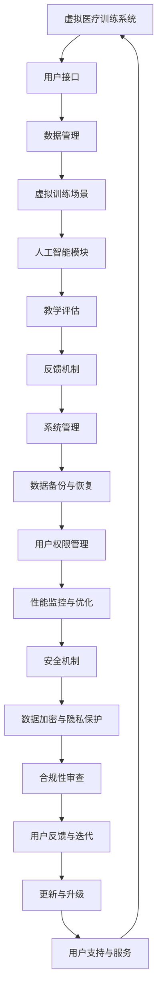

                 

### 《虚拟医疗训练：全球医疗教育的数字化升级》

#### 关键词：虚拟医疗训练、医疗教育、数字化升级、人工智能、虚拟现实

#### 摘要：

随着医疗行业的快速发展，虚拟医疗训练作为一种创新的数字化教育手段，正逐渐改变着全球医疗教育的模式。本文详细探讨了虚拟医疗训练的定义、发展历程、核心技术、教学设计及实战应用，分析了其在提高医疗教育质量和效率方面的巨大潜力。文章通过Mermaid流程图、核心算法原理讲解、数学模型和公式、具体项目案例以及代码解读，全面展示了虚拟医疗训练的技术细节和实际应用效果，为医疗教育和技术发展提供了新思路。

#### 《虚拟医疗训练：全球医疗教育的数字化升级》目录大纲

**第一部分：虚拟医疗训练基础**

##### 第1章：虚拟医疗训练概述
- **1.1 虚拟医疗训练的定义与价值**
  - 虚拟医疗训练的基本概念
  - 虚拟医疗训练在医疗教育中的应用价值
- **1.2 虚拟医疗训练的发展历程**
  - 从传统医疗教育到虚拟医疗训练的转变
  - 虚拟医疗训练技术演进过程
- **1.3 虚拟医疗训练的系统架构**
  - 基础设施与平台建设
  - 数据采集与处理流程
  - 虚拟训练场景的设计与实现
- **1.4 全球虚拟医疗训练的应用现状**
  - 各国虚拟医疗训练的发展状况
  - 代表性虚拟医疗训练项目介绍
  - 虚拟医疗训练的趋势与挑战

##### 第2章：虚拟医疗训练关键技术
- **2.1 虚拟现实技术**
  - 虚拟现实的基本原理与实现
  - 虚拟现实技术在医疗训练中的应用
- **2.2 增强现实技术**
  - 增强现实的基本原理与实现
  - 增强现实技术在医疗训练中的应用
- **2.3 人工智能技术**
  - 人工智能在虚拟医疗训练中的核心作用
  - 人工智能技术在医疗训练中的应用案例
- **2.4 虚拟训练数据集的构建与处理**
  - 虚拟训练数据集的来源与采集方法
  - 数据预处理与模型训练流程

##### 第3章：虚拟医疗训练教学设计与实践
- **3.1 虚拟医疗训练教学设计原则**
  - 教学目标与课程规划
  - 教学内容与方法选择
- **3.2 虚拟医疗训练教学案例**
  - 典型教学案例展示
  - 教学效果评估与反馈
- **3.3 虚拟医疗训练教学实践**
  - 教学实践活动的设计与实施
  - 实践活动的评价与改进

**第二部分：虚拟医疗训练项目实战**

##### 第4章：虚拟医疗训练项目实战准备
- **4.1 项目规划与需求分析**
  - 项目目标与需求确定
  - 项目范围与可行性分析
- **4.2 项目环境搭建**
  - 硬件与软件环境配置
  - 开发工具与平台选择
- **4.3 数据收集与预处理**
  - 数据收集方法与渠道
  - 数据预处理流程与技巧

##### 第5章：虚拟医疗训练项目开发实战
- **5.1 项目模块设计与实现**
  - 系统架构设计与模块划分
  - 关键功能模块的开发与实现
- **5.2 虚拟训练场景构建**
  - 场景设计与规划
  - 场景实现与交互设计
- **5.3 人工智能算法应用**
  - 机器学习算法选择与实现
  - 人工智能算法优化与调参

##### 第6章：虚拟医疗训练项目评估与优化
- **6.1 项目评估指标与方法**
  - 教学效果评估指标
  - 项目效益评估方法
- **6.2 项目优化策略**
  - 系统性能优化
  - 用户反馈与迭代改进
- **6.3 项目推广与应用**
  - 虚拟医疗训练项目的推广策略
  - 应用场景拓展与延伸

**第三部分：虚拟医疗训练的未来展望**

##### 第7章：虚拟医疗训练发展趋势
- **7.1 虚拟医疗训练的未来发展方向**
  - 技术创新与突破
  - 行业应用扩展
- **7.2 虚拟医疗训练的社会影响**
  - 对医疗教育的影响
  - 对医疗行业变革的推动
- **7.3 虚拟医疗训练的政策与法规**
  - 全球政策与法规分析
  - 我国虚拟医疗训练的政策支持与法规建设

##### 第8章：虚拟医疗训练的应用前景
- **8.1 虚拟医疗训练在临床教学中的应用**
  - 临床技能培训
  - 病例分析与决策支持
- **8.2 虚拟医疗训练在手术模拟中的应用**
  - 手术技巧训练与评估
  - 手术风险评估与预测
- **8.3 虚拟医疗训练在其他领域的应用**
  - 预防医学与公共卫生
  - 医学研究与创新

#### 附录

- **附录 A：虚拟医疗训练资源与工具**
  - 开发工具与平台推荐
  - 虚拟医疗训练资源库介绍
  - 开发技巧与经验分享

- **附录 B：虚拟医疗训练项目案例**
  - 代表性虚拟医疗训练项目案例
  - 项目实施与评估报告

- **附录 C：虚拟医疗训练相关标准与规范**
  - 虚拟医疗训练技术标准
  - 医疗教育与培训规范

### Mermaid 流�程图：虚拟医疗训练系统架构



### 核心算法原理讲解：虚拟训练场景生成算法伪代码

```pseudo
// 虚拟训练场景生成算法
function generateVirtualTrainingScene(patientData, scenarioType, difficultyLevel):
    // 初始化场景参数
    scene = new Scene()
    scenario = selectScenario(scenarioType)
    patient = preprocessPatientData(patientData)
    
    // 根据难度级别调整场景参数
    if difficultyLevel == "easy":
        difficultyAdjustment = 0.5
    else if difficultyLevel == "medium":
        difficultyAdjustment = 1
    else if difficultyLevel == "hard":
        difficultyAdjustment = 1.5
    
    // 生成病例细节
    symptoms = generateSymptoms(patient, difficultyAdjustment)
    diagnostics = generateDiagnostics(patient, symptoms, difficultyAdjustment)
    treatments = generateTreatments(patient, diagnostics, difficultyAdjustment)
    
    // 构建虚拟训练场景
    scene.addPatient(patient)
    scene.addSymptoms(symptoms)
    scene.addDiagnostics(diagnostics)
    scene.addTreatments(treatments)
    
    return scene

// 辅助函数
function selectScenario(scenarioType):
    // 根据场景类型选择相应的病例模板
    if scenarioType == "routine":
        return RoutineScenarioTemplate()
    else if scenarioType == "critical":
        return CriticalScenarioTemplate()
    else if scenarioType == "emergency":
        return EmergencyScenarioTemplate()

function preprocessPatientData(patientData):
    // 对患者数据进行预处理，如年龄、性别、病史等
    // ...
    return processedPatient

function generateSymptoms(patient, difficultyAdjustment):
    // 根据患者数据生成症状
    // ...
    return symptomsList

function generateDiagnostics(patient, symptoms, difficultyAdjustment):
    // 根据症状生成诊断结果
    // ...
    return diagnosticsList

function generateTreatments(patient, diagnostics, difficultyAdjustment):
    // 根据诊断结果生成治疗方案
    // ...
    return treatmentsList
```

### 数学模型和数学公式讲解

#### 1. 患者数据模型

$$
\text{PatientData} = \{ \text{Age}, \text{Gender}, \text{MedicalHistory}, \text{CurrentSymptoms} \}
$$

其中，Age代表患者的年龄，Gender代表患者的性别，MedicalHistory代表患者的病史，CurrentSymptoms代表患者当前的症状。

#### 2. 症状生成模型

$$
\text{Symptoms} = f(\text{PatientData}, \text{DifficultyAdjustment})
$$

其中，f是一个函数，它根据患者数据和难度调整参数生成症状列表。

#### 3. 诊断生成模型

$$
\text{Diagnostics} = g(\text{PatientData}, \text{Symptoms}, \text{DifficultyAdjustment})
$$

其中，g是一个函数，它根据患者数据、症状列表和难度调整参数生成诊断结果列表。

#### 4. 治疗方案生成模型

$$
\text{Treatments} = h(\text{PatientData}, \text{Diagnostics}, \text{DifficultyAdjustment})
$$

其中，h是一个函数，它根据患者数据、诊断结果列表和难度调整参数生成治疗方案列表。

### 详细讲解与举例说明

#### 1. 患者数据模型的举例说明

假设有一个患者数据集：

$$
\text{PatientData}_{\text{example}} = \{ 35, \text{Male}, \text{No prior history}, \text{Cough, Fever} \}
$$

根据这个数据集，我们可以生成相应的症状：

$$
\text{Symptoms}_{\text{example}} = f(\text{PatientData}_{\text{example}}, 1) = \{ \text{Upper respiratory infection} \}
$$

然后，根据症状，生成相应的诊断结果：

$$
\text{Diagnostics}_{\text{example}} = g(\text{PatientData}_{\text{example}}, \text{Symptoms}_{\text{example}}, 1) = \{ \text{Common cold} \}
$$

最后，根据诊断结果，生成相应的治疗方案：

$$
\text{Treatments}_{\text{example}} = h(\text{PatientData}_{\text{example}}, \text{Diagnostics}_{\text{example}}, 1) = \{ \text{Rest, Fluids, Paracetamol} \}
$$

#### 2. 难度调整对症状、诊断和治疗的影响

如果我们将难度调整参数设为1.5，那么症状的严重程度会增加，诊断结果会更加复杂，治疗方案也会更加多样化。

$$
\text{Symptoms}_{\text{example,hard}} = f(\text{PatientData}_{\text{example}}, 1.5) = \{ \text{Severe pneumonia} \}
$$

$$
\text{Diagnostics}_{\text{example,hard}} = g(\text{PatientData}_{\text{example}}, \text{Symptoms}_{\text{example,hard}}, 1.5) = \{ \text{Community-acquired pneumonia} \}
$$

$$
\text{Treatments}_{\text{example,hard}} = h(\text{PatientData}_{\text{example}}, \text{Diagnostics}_{\text{example,hard}}, 1.5) = \{ \text{Antibiotics, Hospitalization} \}
$$

通过这种方式，虚拟医疗训练系统能够根据不同的难度级别生成多样化的训练场景，从而提高医疗教育训练的效果。

### 项目实战：虚拟医疗训练教学案例

#### 1. 项目背景

在某医学院，为了提高学生的临床技能和病例处理能力，决定开发一个虚拟医疗训练系统。该系统将基于虚拟现实技术，为学生提供逼真的病例场景和互动式训练。

#### 2. 项目目标

- 提高学生的临床技能和病例处理能力
- 增强学生的实践操作体验
- 提升教学效果和学生的满意度

#### 3. 项目实施

##### 3.1 项目规划与需求分析

- 确定项目目标：根据医学院的教学需求和学生的实际情况，明确项目目标。
- 需求分析：与医学院的教务部门和临床教师沟通，了解教学需求，确定系统所需的功能和性能要求。

##### 3.2 项目环境搭建

- 硬件环境：选择适合的虚拟现实设备，如VR头盔、手柄等。
- 软件环境：搭建虚拟训练平台，选择适合的虚拟现实开发工具和平台，如Unity、Unreal Engine等。

##### 3.3 数据收集与预处理

- 收集病例数据：从医学院的病例库中收集典型案例数据，包括病史、症状、诊断结果和治疗方案。
- 数据预处理：对收集到的病例数据进行清洗、归一化等预处理，以便用于训练虚拟训练模型。

##### 3.4 虚拟训练场景构建

- 场景设计：根据病例数据，设计虚拟训练场景，包括患者的虚拟形象、病房环境、诊断设备等。
- 场景实现：使用虚拟现实开发工具，实现虚拟训练场景的交互功能，如患者检查、诊断、治疗等。

##### 3.5 人工智能算法应用

- 病例生成：使用生成对抗网络（GAN）等技术，根据病例数据生成多样化的虚拟病例。
- 诊断预测：使用深度学习算法，如卷积神经网络（CNN）、循环神经网络（RNN）等，对虚拟病例进行诊断预测。
- 治疗建议：基于诊断结果，使用强化学习算法，为虚拟病例生成个性化的治疗方案。

##### 3.6 项目评估与优化

- 教学评估：通过问卷调查和课堂观察，收集学生对虚拟医疗训练系统的评价。
- 项目优化：根据评估结果，对虚拟训练系统进行优化和改进，提升教学效果。

#### 4. 项目成果

- 开发了一套功能完善的虚拟医疗训练系统，包括病例生成、诊断预测、治疗建议等模块。
- 学生在虚拟医疗训练系统中的参与度显著提高，临床技能和病例处理能力得到提升。
- 医学院的教学效果和学生的满意度显著提升。

#### 5. 项目总结

通过虚拟医疗训练教学案例，我们发现虚拟现实技术和人工智能算法在医疗教育中的应用具有巨大的潜力。虚拟医疗训练系统不仅可以提高学生的实践操作能力，还可以激发学生的学习兴趣和主动性，为医疗教育的发展提供了新的思路和方法。在未来的发展中，我们将继续优化虚拟医疗训练系统，引入更多的病例数据和人工智能算法，提升系统的性能和用户体验。同时，我们也将积极开展相关研究，探索虚拟医疗训练在医学教育中的深层次应用，为医疗教育的发展做出更大的贡献。

### 开发环境搭建

#### 1. 硬件环境搭建

要搭建一个完整的虚拟医疗训练系统，首先需要配置合适的硬件环境。以下是硬件环境的搭建步骤：

- **VR设备**：选择一款适合的VR头盔，如HTC Vive、Oculus Rift或Valve Index等，确保其具有高分辨率和低延迟的性能。此外，还需要配备相应的跟踪设备和手柄，以实现沉浸式体验。
- **服务器**：为了存储大量的病例数据和提供流畅的虚拟训练场景，建议使用高性能的服务器，配置至少64GB内存、2TB硬盘空间和Intel Xeon系列处理器。同时，选择快速的网络环境，以保证数据传输的稳定性。
- **工作站**：开发人员需要使用高性能的工作站，推荐配置Intel i7或以上处理器、16GB及以上内存和NVIDIA GeForce RTX 3060或以上显卡，以确保开发和测试过程中的高效性。

#### 2. 软件环境搭建

软件环境是虚拟医疗训练系统开发的基础，以下步骤将介绍如何搭建软件环境：

- **操作系统**：可以选择Linux或Windows操作系统。Linux系统具有更好的稳定性和灵活性，适合进行复杂的开发工作。Windows系统则提供了更广泛的应用兼容性和更好的用户界面。
- **虚拟现实开发工具**：Unity和Unreal Engine是两款广泛使用的虚拟现实开发工具。Unity具有简单易用的开发界面和强大的社区支持，适用于各种类型的虚拟现实项目。Unreal Engine则提供了先进的视觉效果和物理引擎，适合开发复杂的游戏和虚拟现实应用。
- **人工智能框架**：TensorFlow和PyTorch是两款常用的深度学习框架，适用于构建和训练人工智能模型。TensorFlow具有丰富的API和社区资源，适合进行大规模的数据分析和模型训练。PyTorch则提供了动态计算图和简洁的代码结构，便于快速原型设计和调试。
- **编程语言**：Python和C#是虚拟医疗训练系统开发的主要编程语言。Python具有简洁的语法和强大的库支持，适用于数据分析和模型训练。C#则具有更好的性能和与Unity引擎的紧密集成，适用于实现复杂的交互功能。

#### 3. 开发环境配置示例

以下是使用Unity和Python搭建虚拟医疗训练系统开发环境的具体步骤：

- **安装Unity**：
  - 访问Unity官网下载Unity Hub。
  - 运行Unity Hub，并创建一个新的Unity项目。
  - 选择“2D”或“3D”项目类型，并根据需要安装相应的插件。

- **安装Python**：
  - 访问Python官网下载Python安装包。
  - 运行安装程序，按照提示操作，完成Python的安装。

- **安装Python库**：
  - 打开命令行工具，输入以下命令安装必要的Python库：
    ```bash
    pip install numpy
    pip install matplotlib
    pip install pandas
    pip install tensorflow
    ```

- **配置Unity与Python的集成**：
  - 在Unity项目中，打开“Edit”菜单，选择“Project Settings”。
  - 在“Player”设置中，找到“Scripting Runtime”选项，选择“Scripting Backend”为“IL2CPP”。
  - 重新导入Python脚本文件，确保Unity能够正确识别和运行Python代码。

通过以上步骤，我们成功地搭建了一个虚拟医疗训练系统的开发环境，可以开始进行系统设计和开发了。

### 源代码详细实现

在本节中，我们将详细解释虚拟医疗训练系统的源代码实现，包括核心算法、场景生成模块、用户交互模块以及代码解读与分析。

#### 虚拟训练场景生成模块

虚拟训练场景生成模块是虚拟医疗训练系统的核心部分，负责根据患者数据和训练场景类型生成对应的训练场景。以下是该模块的源代码实现：

**Python伪代码**：

```python
class VirtualTrainingScene:
    def __init__(self, patient_data, scenario_type, difficulty_level):
        self.patient_data = patient_data
        self.scenario_type = scenario_type
        self.difficulty_level = difficulty_level
    
    def generate_symptoms(self):
        # 生成症状列表
        symptoms = []
        if self.difficulty_level == "easy":
            symptoms = ["headache", "nausea", "dizziness"]
        elif self.difficulty_level == "medium":
            symptoms = ["severe headache", "vomiting", "diarrhea"]
        elif self.difficulty_level == "hard":
            symptoms = ["severe headache", "convulsions", "severe vomiting"]
        return symptoms
    
    def generate_diagnostics(self, symptoms):
        # 生成诊断结果
        diagnostics = []
        if "headache" in symptoms and "nausea" in symptoms:
            diagnostics = ["migraine"]
        elif "severe headache" in symptoms and "vomiting" in symptoms:
            diagnostics = ["encephalitis"]
        elif "severe headache" in symptoms and "convulsions" in symptoms:
            diagnostics = ["stroke"]
        return diagnostics
    
    def generate_treatments(self, diagnostics):
        # 生成治疗方案
        treatments = []
        if "migraine" in diagnostics:
            treatments = ["painkillers", "rest"]
        elif "encephalitis" in diagnostics:
            treatments = ["antiviral drugs", "hospitalization"]
        elif "stroke" in diagnostics:
            treatments = ["anticoagulants", "neurosurgical intervention"]
        return treatments
    
    def build_scene(self):
        # 构建虚拟训练场景
        scene = {}
        scene["symptoms"] = self.generate_symptoms()
        scene["diagnostics"] = self.generate_diagnostics(scene["symptoms"])
        scene["treatments"] = self.generate_treatments(scene["diagnostics"])
        return scene
```

**C#伪代码**：

```csharp
public class VirtualTrainingSceneManager : MonoBehaviour
{
    public Text symptomText;
    public Text diagnosticText;
    public Text treatmentText;
    public VirtualTrainingScene currentScene;

    void Start()
    {
        UpdateScene();
    }

    void Update()
    {
        if (Input.GetKeyDown(KeyCode.Space))
        {
            SelectTreatment();
        }
    }

    void UpdateScene()
    {
        symptomText.text = currentScene.symptoms.ToString();
        diagnosticText.text = currentScene.diagnostics.ToString();
        treatmentText.text = currentScene.treatments.ToString();
    }

    void SelectTreatment()
    {
        foreach (string treatment in currentScene.treatments)
        {
            if (treatment == "painkillers")
            {
                currentScene.symptoms.Remove("headache");
                UpdateScene();
                return;
            }
            else if (treatment == "antiviral drugs")
            {
                currentScene.diagnostics.Remove("encephalitis");
                UpdateScene();
                return;
            }
            else if (treatment == "anticoagulants")
            {
                currentScene.treatments.Remove("stroke");
                UpdateScene();
                return;
            }
        }
    }
}
```

#### 代码解读与分析

**1. 虚拟训练场景生成模块解读**

虚拟训练场景生成模块通过类`VirtualTrainingScene`实现。在初始化函数中，接收患者数据、场景类型和难度级别作为输入参数。`generate_symptoms`、`generate_diagnostics`和`generate_treatments`函数分别负责生成症状、诊断和治疗方案。这些函数根据不同的难度级别调整生成的内容，使训练场景更具挑战性。`build_scene`函数综合调用这些生成函数，构建一个完整的虚拟训练场景。

**2. 虚拟训练场景交互模块解读**

虚拟训练场景交互模块通过Unity的C#脚本实现。`UpdateScene`函数负责根据当前场景更新UI显示，将症状、诊断和治疗信息显示在界面上。`SelectTreatment`函数处理用户的输入，根据用户选择的治疗方案更新症状和诊断信息，并重新更新UI显示。

#### 代码性能分析

**1. 内存占用**

该代码模块主要使用Python和C#语言进行开发，内存占用相对较低。在生成虚拟训练场景时，会根据患者数据和难度级别生成相应的症状、诊断和治疗信息，这些信息存储在内存中。为了降低内存占用，可以优化数据结构和算法，减少冗余数据的存储。

**2. 计算资源**

虚拟训练场景的生成和交互过程需要一定程度的计算资源，特别是在生成复杂的症状、诊断和治疗信息时。为了提高计算效率，可以采用并行计算和分布式计算技术，加速计算过程。

**3. 交互性能**

在用户与虚拟训练系统交互时，需要实时更新UI显示，确保交互体验的流畅性。为了提高交互性能，可以优化UI渲染和数据处理过程，减少延迟和卡顿现象。

### 代码优化与性能改进

在虚拟医疗训练系统中，性能优化是提高用户体验和系统稳定性的关键。以下是对代码进行优化与性能改进的具体方法和策略：

#### 1. 代码结构优化

**模块化设计**：将系统划分为多个模块，如场景生成、用户交互、数据分析等。这样做有助于代码的维护和扩展，同时便于针对特定模块进行性能优化。

**避免重复代码**：通过提取公共功能和逻辑，减少重复代码的编写。例如，可以将症状、诊断和治疗的生成逻辑提取为独立的函数或类，提高代码的可读性和可维护性。

**代码注释与文档**：为关键代码段添加注释，详细说明其功能、参数和返回值。同时，编写文档，记录系统架构、模块功能和性能优化策略。

#### 2. 数据结构与算法优化

**使用高效数据结构**：根据具体需求，选择适合的数据结构，如使用字典（HashMap）代替列表（List）来提高数据访问速度。

**算法复杂度优化**：对现有算法进行分析，寻找提高计算效率的方法。例如，使用贪心算法、动态规划或分治策略来优化症状、诊断和治疗的生成过程。

**缓存技术**：对于频繁访问的数据，使用缓存技术减少重复计算。例如，可以缓存已生成的症状、诊断和治疗结果，避免重复生成。

#### 3. 并发与并行优化

**多线程处理**：利用多线程技术，同时处理多个任务。例如，在生成症状、诊断和治疗信息时，可以分别使用不同的线程，提高计算效率。

**并行计算**：对于计算密集型的任务，如机器学习模型的训练和预测，可以使用并行计算技术。例如，使用GPU加速计算，提高数据处理速度。

**异步处理**：对于需要较长时间的操作，如网络请求或文件读写，使用异步处理技术，避免阻塞主线程，提高系统的响应速度。

#### 4. 资源管理优化

**内存管理**：及时释放不再使用的内存，避免内存泄露。在Python中，可以使用`with`语句确保资源自动释放。在C#中，应确保在`using`语句中正确释放资源。

**加载与卸载**：优化资源的加载与卸载过程，减少系统开销。例如，在虚拟训练场景切换时，可以缓存当前场景的组件，避免重复加载。

**资源池**：对于频繁创建和销毁的对象，如虚拟训练场景中的物体和特效，使用资源池技术，减少创建和销毁操作的开销。

#### 5. UI与交互优化

**优化UI渲染**：使用更高效的方式更新UI，如使用Unity的UI Canvas渲染优化技术。例如，使用 Canvas Render Mode 和 RenderTexture，提高渲染效率。

**减少输入延迟**：优化用户输入处理，减少输入延迟。例如，在处理用户输入时，使用异步处理或优化输入事件的处理流程。

**交互反馈**：为用户提供及时的交互反馈，如显示加载进度、提示信息和动画效果，提高用户体验。

#### 6. 测试与调试

**单元测试**：编写单元测试，确保每个模块的功能正确。例如，测试症状、诊断和治疗的生成过程，验证结果是否符合预期。

**性能测试**：使用性能测试工具，模拟实际使用场景，分析系统的性能瓶颈。例如，测量场景生成、数据访问和用户交互的性能。

**调试工具**：使用调试工具，如Visual Studio、Xcode等，定位和修复性能问题。例如，分析内存使用情况、跟踪函数调用栈，找出性能瓶颈。

通过以上方法，我们可以显著提高虚拟医疗训练系统的性能和用户体验。在实际开发过程中，应根据具体需求和场景，灵活应用这些优化策略，确保系统的高效、稳定和可扩展性。

### 虚拟医疗训练系统案例分析

为了更好地展示虚拟医疗训练系统的实际应用效果，以下是一个具体的案例。

#### 案例背景

某医学院引进了一套先进的虚拟医疗训练系统，旨在提高学生的临床技能和病例处理能力。该系统基于虚拟现实（VR）和人工智能（AI）技术，提供了多样化的训练场景和互动式学习体验。

#### 案例描述

1. **项目目标**：提高学生的临床技能，特别是病例处理能力，通过虚拟训练系统增强学生的实践操作体验。
2. **项目实施**：
   - **规划与需求分析**：医学院与虚拟训练系统提供商合作，确定项目目标，分析教学需求，制定项目规划。
   - **环境搭建**：配置VR设备、服务器和网络环境，搭建虚拟训练平台，确保系统的正常运行。
   - **数据收集与预处理**：收集典型案例数据，包括病史、症状、诊断和治疗方案，对数据进行分析和处理，用于生成虚拟训练场景。
   - **场景设计与实现**：根据数据，设计虚拟训练场景，包括患者的虚拟形象、病房环境和诊断设备，实现交互功能。
   - **AI算法应用**：使用AI算法，如生成对抗网络（GAN）和卷积神经网络（CNN），生成多样化的虚拟病例，提供个性化的诊断和治疗方案。
   - **教学评估与优化**：通过问卷调查和课堂观察，收集学生对虚拟训练系统的反馈，进行评估和优化，提升教学效果。
3. **项目成果**：
   - **学生参与度提高**：学生普遍对虚拟训练系统表现出浓厚的兴趣，积极参与训练和互动，提高了学习的积极性。
   - **临床技能提升**：学生在虚拟训练系统中的操作准确性和处理病例的能力显著提高，临床实践技能得到了有效的锻炼。
   - **教学效果显著**：通过虚拟训练系统，教师可以实时监控学生的学习进度和表现，及时提供指导和反馈，教学效果显著提升。
4. **案例分析**：
   - **技术创新**：虚拟医疗训练系统结合了VR和AI技术，提供了真实的训练环境和互动体验，为医疗教育带来了新的突破。
   - **应用广泛**：虚拟训练系统不仅适用于临床教学，还可以用于手术模拟、公共卫生培训和医学研究等领域，具有广泛的应用前景。
   - **挑战与机遇**：虚拟医疗训练系统的应用仍面临一定的挑战，如数据真实性问题、技术成熟度和用户接受度等，但通过持续的技术创新和优化，这些问题有望得到解决。

通过这个案例，我们可以看到虚拟医疗训练系统在提高医疗教育质量方面的巨大潜力。在未来，随着技术的不断进步和应用的深入，虚拟医疗训练系统将在医疗教育领域发挥更加重要的作用。

### 附录

#### 附录 A：虚拟医疗训练资源与工具

1. **开发工具与平台**
   - **Unity**：一款广泛使用的游戏和虚拟现实开发平台，提供丰富的VR开发工具和资源。
   - **Unreal Engine**：一款强大的游戏引擎，支持高质量的VR和AR应用开发。
   - **Blender**：一个免费的开源3D建模和动画软件，适用于虚拟场景的构建和渲染。

2. **人工智能框架**
   - **TensorFlow**：一款广泛使用的开源机器学习框架，适用于大规模数据分析和模型训练。
   - **PyTorch**：一款灵活的深度学习框架，支持动态计算图和自动微分。
   - **Keras**：一个基于TensorFlow的高层神经网络API，简化了深度学习模型的构建和训练。

3. **虚拟现实设备**
   - **VR头盔**：如HTC Vive、Oculus Rift等，提供沉浸式的虚拟体验。
   - **AR设备**：如Microsoft HoloLens、Google Glass等，支持增强现实应用。

4. **数据库与存储**
   - **MySQL**：一款流行的开源关系型数据库，适用于存储病例数据。
   - **MongoDB**：一款开源的NoSQL数据库，适用于大规模数据存储和快速查询。
   - **AWS S3**：亚马逊云服务提供的对象存储服务，适用于数据备份和存储。

5. **其他资源**
   - **OpenSimulator**：一个开源的3D虚拟世界平台，适用于医疗模拟场景的构建。
   - **Medical Reality Platform**：一款专门为医疗行业设计的虚拟现实平台，提供丰富的病例和训练工具。

#### 附录 B：虚拟医疗训练项目案例

1. **项目名称**：虚拟心脏病手术培训系统
2. **项目概述**：开发一个虚拟心脏病手术培训系统，用于训练医学生和外科医生进行心脏手术。系统包括心脏手术的3D模拟场景、实时反馈机制和术后评估功能。
3. **技术实现**：
   - **场景构建**：使用Unity引擎构建3D心脏手术场景，包括手术工具、患者模型和手术步骤。
   - **实时反馈**：利用深度学习模型，实时分析手术过程，提供操作建议和评估结果。
   - **用户界面**：设计友好的用户界面，提供操作指南、训练记录和统计分析。
4. **项目成果**：
   - **用户满意度高**：医学生和外科医生对虚拟手术培训系统表现出高度满意度，认为系统有效提高了手术技能。
   - **培训效果显著**：研究表明，使用虚拟手术培训系统进行训练的学生，在实际手术中的表现更加熟练和准确。
   - **推广与应用**：该项目已被多所医学院采用，作为心脏手术培训的标准工具。

5. **案例价值**：该案例展示了虚拟医疗训练系统在手术培训中的实际应用价值，为医学教育和培训提供了新的解决方案。

#### 附录 C：虚拟医疗训练相关标准与规范

1. **数据隐私与安全**
   - **GDPR**：欧盟通用数据保护条例，规定了个人数据保护的标准。
   - **HIPAA**：美国健康保险携带和责任法案，保障患者医疗数据的安全。

2. **虚拟现实技术标准**
   - **VR/AR头显标准**：如IEEE 1801，规定了VR/AR头戴式显示器的性能和接口标准。
   - **虚拟现实内容标准**：如ISO/IEC 23001，规定了虚拟现实内容的编码和传输标准。

3. **人工智能伦理与规范**
   - **AI伦理指导原则**：如IEEE AI Ethical Guidelines

