                 

### 虚拟教育：全球脑时代下的学习新方式

#### 关键词：
- 虚拟教育
- 全球脑时代
- 脑机接口
- 认知科学
- 虚拟现实
- 增强现实
- 人工智能

#### 摘要：
本文探讨了虚拟教育在当今全球脑时代中的发展与应用。通过分析虚拟教育的定义、特点、理论基础以及技术应用，本文展示了虚拟教育如何改变传统教育模式，提高学习效果。同时，本文还探讨了虚拟教育与脑科学、认知科学的关系，以及虚拟教育面临的挑战和未来发展趋势。最后，本文提出了虚拟教育与全球脑时代融合的展望，为教育领域的创新提供了新的视角。

---

# 《虚拟教育：全球脑时代下的学习新方式》目录大纲

## 第一部分：引言与背景

### 1.1 虚拟教育的定义与特点

### 1.2 全球脑时代的背景与影响

### 1.3 虚拟教育的重要性和发展前景

## 第二部分：虚拟教育的基础理论

### 2.1 脑科学与认知科学原理

### 2.2 虚拟现实技术与教育应用

### 2.3 虚拟教育的学习心理学基础

## 第三部分：虚拟教育技术实践

### 3.1 虚拟教育平台与工具

### 3.2 虚拟教室的设计与构建

### 3.3 虚拟学习环境的互动与协作

## 第四部分：虚拟教育的应用案例

### 4.1 虚拟教育在基础教育中的应用

### 4.2 虚拟教育在高等教育中的应用

### 4.3 职业教育与虚拟教育的结合

## 第五部分：虚拟教育的挑战与未来发展

### 5.1 虚拟教育面临的挑战

### 5.2 虚拟教育的发展趋势

### 5.3 虚拟教育与未来学习方式

## 第六部分：虚拟教育与全球脑时代的融合

### 6.1 脑机接口技术在虚拟教育中的应用

### 6.2 跨学科教育与虚拟教育的结合

### 6.3 虚拟教育与全球脑时代的未来展望

## 附录

### 附录 A：虚拟教育相关资源与工具

### 附录 B：虚拟教育项目案例汇总

### 附录 C：虚拟教育术语解释

## 第七部分：结论

### 7.1 本书总结

### 7.2 对未来虚拟教育发展的展望

---

### 第一部分：引言与背景

#### 1.1 虚拟教育的定义与特点

虚拟教育，也称为在线教育或远程教育，是一种通过互联网和其他数字技术进行的学习模式。它允许学生和教师在不同地理位置之间进行互动和交流，实现知识的传递和学习目标的达成。虚拟教育具有以下几个显著特点：

- **灵活性**：虚拟教育打破了时间和空间的限制，学生可以随时随地访问学习资源和进行学习，这种灵活性特别适合忙碌的工作者或居住在偏远地区的学生。

- **个性化**：虚拟教育系统能够根据学生的学习进度、能力和兴趣，提供个性化的学习路径和资源，从而满足不同学生的需求。

- **互动性**：通过论坛、视频会议、即时消息等工具，虚拟教育促进了师生之间以及学生之间的互动和协作，增强了学习的参与度和效果。

- **资源共享**：虚拟教育平台提供了大量的教育资源，如电子书籍、视频讲座、在线课程等，这些资源可以随时供学生使用，实现了资源的共享和最大化利用。

- **可追溯性**：虚拟教育系统能够记录学生的学习行为和成绩，为教师提供详细的反馈和指导，同时也有助于学生进行自我反思和评估。

#### **核心概念与联系**

为了更好地理解虚拟教育，我们可以使用Mermaid流程图来展示其核心概念和联系：

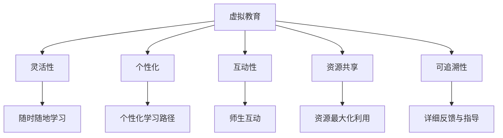

#### **虚拟现实技术的核心概念**

虚拟现实（VR）技术在虚拟教育中的应用是其重要组成部分。VR技术通过创建虚拟的三维环境，使用户能够沉浸其中，感受到与真实世界相似的体验。以下是VR技术的核心概念：

- **沉浸感**：用户在虚拟环境中感觉仿佛置身其中，能够忘记现实世界的存在。

- **交互性**：用户可以通过特殊设备与虚拟环境进行互动，如使用控制器、手势识别等。

- **想象力**：虚拟现实能够创造出现实中不存在的事物，激发用户的创造力和想象力。

以下是一个Mermaid流程图，展示VR技术的核心概念：

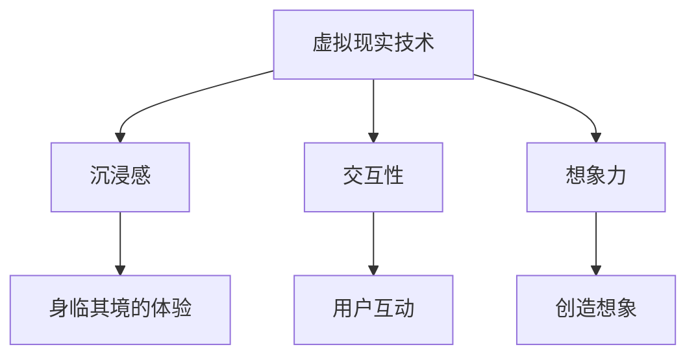

#### **虚拟现实技术在教育中的应用**

虚拟现实技术在教育中的应用非常广泛，可以提供丰富的学习体验，增强学生的学习兴趣和参与度。以下是一些具体的应用场景：

- **历史学习**：通过虚拟现实，学生可以“参观”历史遗迹，如古埃及金字塔或罗马斗兽场，了解历史事件。

- **科学教育**：虚拟实验室可以模拟各种科学实验，学生可以在虚拟环境中进行实验，不受现实条件的限制。

- **语言学习**：虚拟现实技术可以创建真实的语言环境，学生可以在模拟的情境中练习口语和听力。

以下是虚拟现实技术在教育中应用的一个Mermaid流程图：

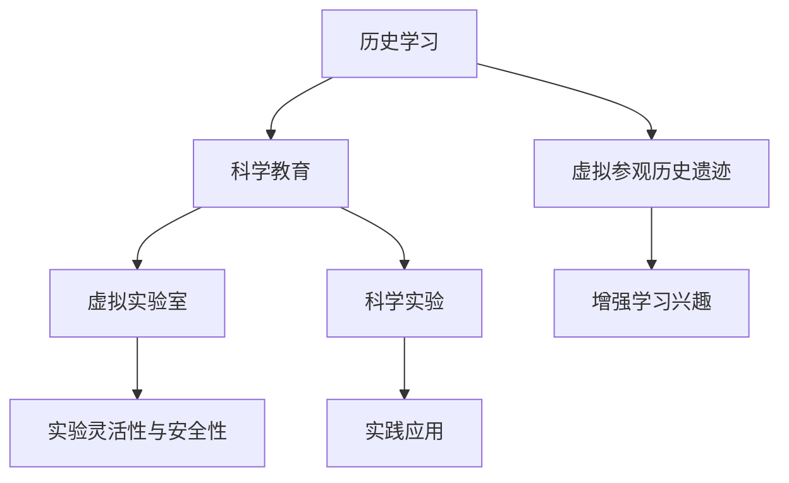

#### **应用案例**

**案例一：虚拟历史课堂**

某小学利用虚拟现实技术创建了一个虚拟历史课堂，学生通过VR设备“参观”历史遗址，如古埃及金字塔。这种体验不仅增强了学生对历史知识的兴趣，还提高了他们的记忆效果。

**案例二：虚拟实验室**

某中学引入了虚拟实验室平台，学生可以在虚拟环境中进行化学实验，避免了实验室中可能出现的危险，同时提高了实验操作的技能。

**案例三：虚拟语言学习**

某语言培训机构使用虚拟现实技术，为学生提供了一个沉浸式的语言学习环境。学生可以在虚拟商店购物，练习外语对话，提高了学习效果。

#### **应用效果**

- **提高学习兴趣**：虚拟教育技术提供了丰富多样的学习体验，能够吸引学生的注意力，提高学习兴趣。

- **增强记忆**：虚拟现实技术提供的沉浸式体验有助于加深学生对知识的记忆。

- **促进互动**：虚拟教育技术促进了师生之间以及学生之间的互动和协作，提高了学习效果。

---

#### 1.2 全球脑时代的背景与影响

全球脑时代（Global Brain Era）是指随着互联网、物联网、大数据和人工智能等技术的快速发展，人类社会进入了一个高度智能化和信息化的时代。这个时代的特点是信息处理和知识共享的能力大幅提升，人类社会逐渐形成了一个全球性的“大脑网络”。

- **技术进步**：互联网和人工智能技术的飞速发展，使得信息的获取和处理变得更加高效和便捷。

- **知识共享**：随着信息技术的普及，全球范围内的知识共享和协作变得更加容易，知识的传播速度和范围得到了极大扩展。

- **智能网络**：全球脑时代的一个显著特征是智能网络的建立，通过互联网连接的计算机和设备形成了一个庞大的智能网络，能够进行自主学习和协同工作。

全球脑时代对教育产生了深远的影响：

- **教育模式变革**：全球脑时代推动了教育模式的变革，传统教育模式受到挑战，在线教育、混合式教育和远程教育等新兴教育模式逐渐普及。

- **个性化学习**：全球脑时代提供了丰富的学习资源和智能化学习工具，使得个性化学习成为可能，学生可以根据自己的需求和兴趣进行学习。

- **全球教育资源共享**：全球脑时代促进了全球教育资源的共享，优质教育资源可以跨越地域限制，为全球学生提供学习机会。

- **教育公平**：全球脑时代有助于缩小教育差距，使更多学生能够享受到优质教育资源，提高教育公平。

#### **脑科学与认知科学原理**

脑科学与认知科学是虚拟教育的重要理论基础。脑科学主要研究大脑的结构和功能，而认知科学则研究人的认知过程和思维方式。以下是对这两个领域的基本原理的简要介绍：

- **脑科学原理**：
  - **神经可塑性**：神经可塑性是指大脑神经元和神经网络在学习和经验的作用下发生的结构和功能的变化。这一原理表明，学习是通过改变大脑连接和神经活动实现的。
  - **突触可塑性**：突触可塑性是指突触强度和连接性的变化，它是学习记忆形成的基础。
  - **神经网络**：神经网络是指由大量神经元连接组成的复杂网络，它是大脑处理信息的基础。

- **认知科学原理**：
  - **注意力**：注意力是指大脑处理信息的能力，它决定了哪些信息会被优先处理。
  - **记忆**：记忆是指大脑对信息的储存和提取能力，它是学习和知识积累的关键。
  - **认知过程**：认知过程包括感知、注意、记忆、思考、判断等多个环节，它是人类智能活动的基础。

#### **虚拟教育与脑科学、认知科学的联系**

虚拟教育与脑科学、认知科学的联系主要体现在以下几个方面：

- **个性化学习**：虚拟教育通过脑科学和认知科学的理论，可以设计出个性化的学习路径和资源，满足不同学生的认知需求。

- **学习效果评估**：脑科学和认知科学提供了评估学习效果的科学方法，如脑电图（EEG）、功能性磁共振成像（fMRI）等，这些方法可以帮助教师更好地了解学生的学习状态和效果。

- **教育干预**：基于脑科学和认知科学的理论，虚拟教育可以设计出有效的教育干预策略，如通过特定的脑机接口技术，提高学生的学习专注度和记忆效果。

#### **Mermaid流程图**

以下是虚拟教育与脑科学、认知科学的联系的一个Mermaid流程图：

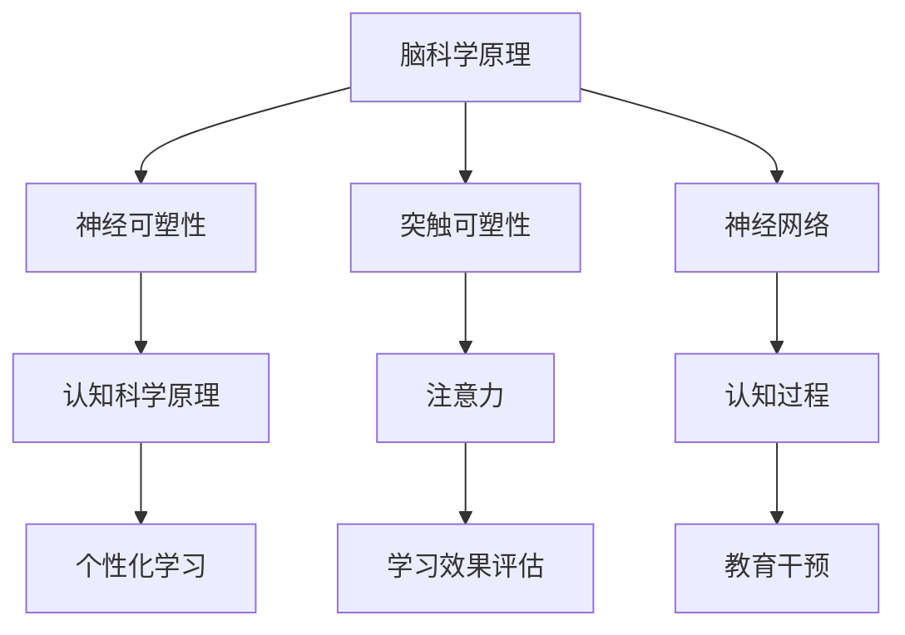

#### **虚拟教育的重要性和发展前景**

虚拟教育在全球脑时代的背景下，具有极其重要的地位和广阔的发展前景：

- **教育普及**：虚拟教育打破了地理和时间的限制，使得优质教育资源能够普及到全球各地，尤其是偏远和经济欠发达地区。

- **教育个性化**：虚拟教育通过智能化和个性化学习，能够满足不同学生的学习需求，提高学习效果。

- **教育创新**：虚拟教育推动了教育模式的创新，如混合式教育、远程教育等，为教育改革提供了新的思路和方法。

- **教育公平**：虚拟教育有助于缩小教育差距，提高教育公平，使更多学生能够享受到优质教育资源。

- **可持续发展**：虚拟教育通过高效利用教育资源，减少了对物质资源的依赖，实现了教育的可持续发展。

总之，虚拟教育在全球脑时代中具有不可替代的地位，它将引领未来教育的发展方向，为全球教育的发展做出重要贡献。

---

### 第一部分：引言与背景

#### 1.3 虚拟教育的重要性和发展前景

虚拟教育作为全球脑时代的重要产物，正在逐步改变传统教育的格局，并在教育领域展现出其独特的优势和巨大的潜力。以下将详细探讨虚拟教育的重要性以及其未来发展的前景。

#### **重要性**

1. **教育资源普及**：虚拟教育打破了地理和时间的限制，使得优质教育资源能够更广泛地传播。无论是在城市还是农村，无论是在发达地区还是欠发达地区，学生都能够通过网络获取到相同的教育资源。

2. **个性化学习**：虚拟教育系统能够根据学生的学习进度、能力和兴趣，提供个性化的学习方案，使每个学生都能在自己的节奏下学习，提高学习效果。

3. **学习效率提升**：虚拟教育提供了丰富的学习资源和工具，如在线课程、虚拟实验室、电子书籍等，学生可以根据自己的需求灵活选择学习内容和方式，提高了学习效率。

4. **教育公平**：虚拟教育有助于缩小教育差距，使得更多的学生，尤其是那些无法上学或教育资源匮乏的学生，能够获得接受教育的机会。

5. **教育创新**：虚拟教育推动了教育模式的创新，如混合式教育、远程教育等，为教育改革提供了新的思路和方法。

#### **发展前景**

1. **技术进步**：随着虚拟现实（VR）、增强现实（AR）、人工智能（AI）等技术的不断发展和普及，虚拟教育将提供更加丰富和生动的学习体验，进一步提升教育质量。

2. **全球教育合作**：虚拟教育将促进全球教育资源的共享和合作，实现教育资源的全球化配置，推动全球教育的共同发展。

3. **跨学科教育**：虚拟教育有助于实现跨学科教育，通过虚拟现实和增强现实技术，学生可以在虚拟环境中进行跨学科的实验和研究，培养综合素质和创新能力。

4. **智能化教学**：人工智能技术将被广泛应用于虚拟教育，如智能教学系统、个性化学习路径推荐、自动评分等，提高教学效率和效果。

5. **教育公平**：虚拟教育将继续推动教育公平，缩小不同地区和群体之间的教育差距，使更多学生能够享受到优质教育资源。

总之，虚拟教育在全球脑时代的背景下，具有广阔的发展前景和重要的战略意义。它不仅将推动教育模式的变革，还将为全球教育的可持续发展做出重要贡献。

---

### 第二部分：虚拟教育的基础理论

#### 2.1 脑科学与认知科学原理

脑科学和认知科学是虚拟教育的重要理论基础，它们提供了理解学习过程和设计有效教育策略的深刻见解。以下是脑科学与认知科学的基本原理及其对虚拟教育的启示。

#### **脑科学原理**

**神经可塑性**：神经可塑性是指大脑结构和功能的适应性变化，它允许大脑在学习和经验的作用下进行自我调整。这一原理表明，学习是通过改变大脑连接和神经活动实现的。在虚拟教育中，理解神经可塑性有助于设计出能够促进学习过程的教育干预策略，如利用虚拟现实技术模拟复杂的学习情境，以增强学生的认知能力。

**突触可塑性**：突触可塑性是指突触强度和连接性的变化，它是学习记忆形成的基础。在虚拟教育中，利用这一原理可以设计出能够有效增强记忆和知识保留的学习活动，如通过反复练习和强化关键概念，提高学生的学习效果。

**神经网络**：神经网络是指由大量神经元连接组成的复杂网络，它是大脑处理信息的基础。虚拟教育可以通过模拟神经网络的工作机制，设计出能够模拟复杂认知过程的虚拟环境，帮助学生更好地理解和掌握复杂概念。

#### **认知科学原理**

**注意力**：注意力是指大脑处理信息的能力，它决定了哪些信息会被优先处理。在虚拟教育中，设计能够吸引学生注意力的学习材料和学习活动至关重要。例如，通过使用动画、视频和其他多媒体元素，可以提高学生的学习兴趣和注意力。

**记忆**：记忆是指大脑对信息的储存和提取能力，它是学习和知识积累的关键。在虚拟教育中，利用认知科学原理设计记忆练习和复习策略，如通过间隔重复和记忆游戏，可以提高学生的记忆效果。

**认知过程**：认知过程包括感知、注意、记忆、思考、判断等多个环节，它是人类智能活动的基础。在虚拟教育中，通过模拟这些认知过程，可以设计出更加真实和有效的学习体验，如通过虚拟实验室进行科学实验，使学生能够更好地理解和应用所学知识。

#### **虚拟教育应用**

**个性化学习**：脑科学和认知科学原理可以帮助虚拟教育系统设计出个性化的学习路径和资源，根据学生的学习进度、能力和兴趣，提供个性化的学习方案。例如，通过分析学生的学习数据，系统可以推荐适合的学习内容和练习，以提高学习效果。

**学习效果评估**：脑科学和认知科学提供了评估学习效果的科学方法，如脑电图（EEG）、功能性磁共振成像（fMRI）等，这些方法可以帮助教师更好地了解学生的学习状态和效果，从而进行有效的教学干预。

**教育干预**：基于脑科学和认知科学的理论，虚拟教育可以设计出有效的教育干预策略，如通过特定的脑机接口技术，提高学生的学习专注度和记忆效果。

#### **Mermaid流程图**

以下是脑科学与认知科学原理在虚拟教育中的应用的一个Mermaid流程图：

#### **虚拟现实技术与教育应用**

虚拟现实（VR）技术通过创建高度沉浸式的虚拟环境，为教育提供了全新的学习体验。以下是虚拟现实技术在教育中的应用及其优势：

**历史学习**：通过VR技术，学生可以“参观”历史遗迹，如古埃及金字塔或罗马斗兽场，了解历史事件。这种体验不仅增强了学生对历史知识的兴趣，还提高了他们的记忆效果。

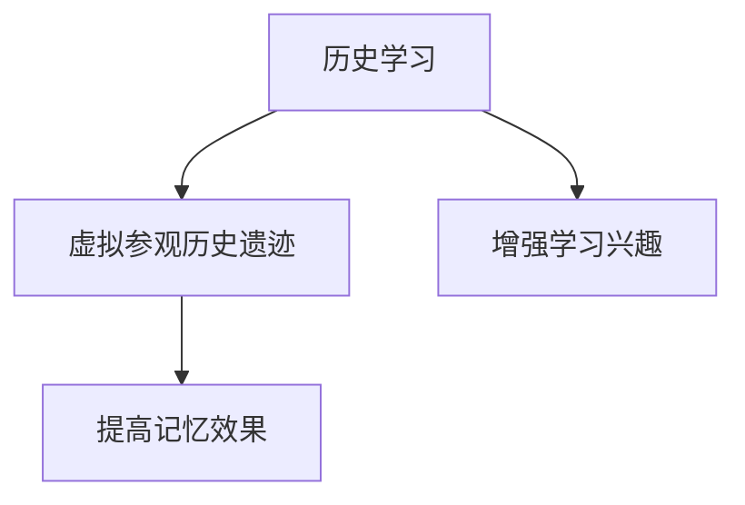

**科学教育**：虚拟实验室可以模拟各种科学实验，学生可以在虚拟环境中进行实验，不受现实条件的限制。例如，学生可以在虚拟环境中进行化学反应实验，了解实验原理，而无需担心实验的安全性和成本。

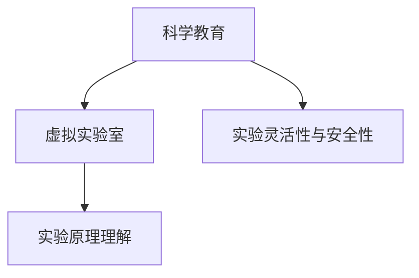

**语言学习**：VR技术可以创建真实的语言环境，学生可以在模拟的情境中练习口语和听力。例如，学生可以在虚拟商店购物，练习外语对话，提高语言技能。

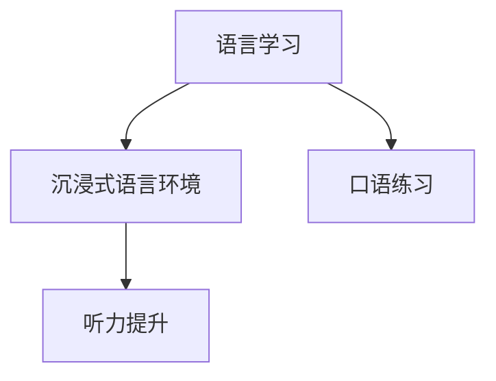

**医学教育**：通过VR技术，学生可以模拟手术过程，学习医学知识。例如，医学院的学生可以在虚拟环境中进行心脏手术模拟，了解手术步骤和技巧。

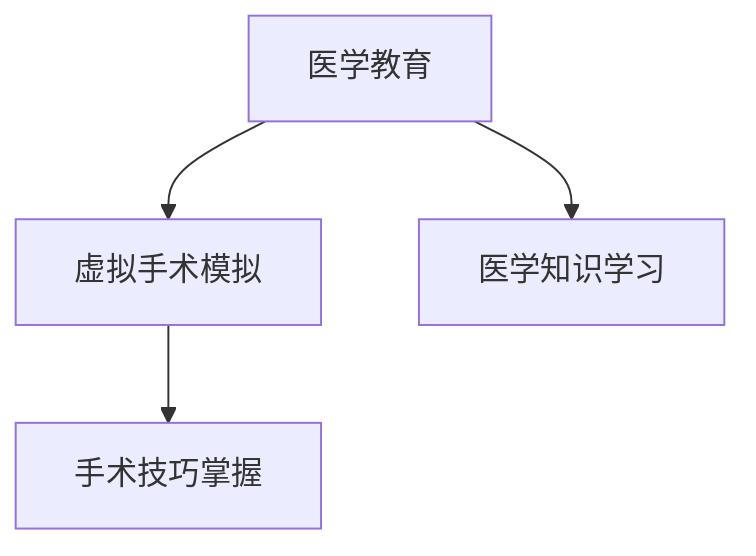

**军事训练**：通过VR技术，士兵可以进行模拟战斗训练，提高战术和战略能力。这种训练方式不仅安全，还可以在虚拟环境中反复练习，提高训练效果。

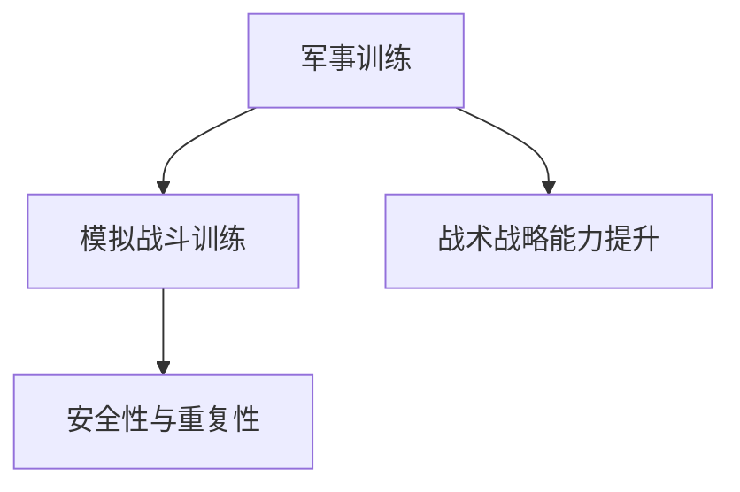

**设计教育**：通过VR技术，学生可以进行虚拟建筑设计，了解设计原理和流程。例如，建筑学院的学生可以在虚拟环境中进行建筑设计，体验设计的全过程。

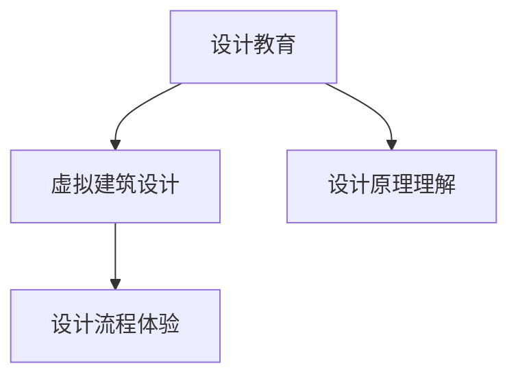

**艺术教育**：通过VR技术，学生可以体验虚拟艺术展览，了解艺术作品和艺术流派。例如，艺术院的学生可以在虚拟艺术馆中参观名画，提高艺术鉴赏能力。

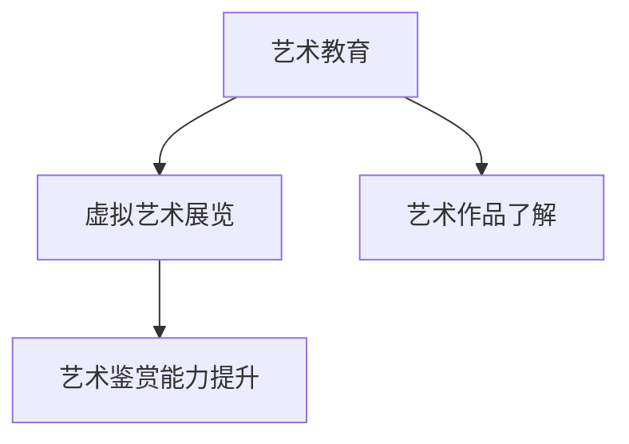

#### **应用案例**

**案例一：虚拟历史课堂**

某小学利用VR技术创建了一个虚拟历史课堂，学生通过VR设备“参观”历史遗迹，如古埃及金字塔。这种体验不仅增强了学生对历史知识的兴趣，还提高了他们的记忆效果。

**案例二：虚拟实验室**

某中学引入了VR技术，创建了虚拟实验室，学生可以在虚拟环境中进行化学实验，避免了实验室中可能出现的危险，同时提高了实验操作的技能。

**案例三：虚拟语言学习**

某语言培训机构使用VR技术，为学生提供了一个沉浸式的语言学习环境。学生可以在虚拟商店购物，练习外语对话，提高了学习效果。

#### **应用效果**

- **提高学习兴趣**：VR技术提供了丰富多样的学习体验，能够吸引学生的注意力，提高学习兴趣。
- **增强记忆**：VR技术提供的沉浸式体验有助于加深学生对知识的记忆。
- **促进互动**：VR技术促进了师生之间以及学生之间的互动和协作，提高了学习效果。
- **提高实践能力**：通过VR技术，学生可以在虚拟环境中进行实践操作，提高实践能力。

---

### 第二部分：虚拟教育的基础理论

#### 2.3 虚拟教育的学习心理学基础

虚拟教育的成功不仅依赖于技术，还依赖于对学习心理学理论的深刻理解。学习心理学为虚拟教育的设计和实践提供了重要的理论基础，包括学习动机、认知负荷、学习风格和自我调节等关键概念。

#### **学习动机**

学习动机是指驱动个体参与学习活动的内在力量。在虚拟教育中，学习动机的重要性尤为突出，因为它直接影响到学生的学习参与度和学习效果。以下是一些提升学习动机的策略：

- **目标设定**：通过设定明确的学习目标，可以帮助学生明确学习方向和动力。例如，在虚拟课堂上，教师可以引导学生设定短期和长期的学习目标，并通过奖励机制激励学生达成目标。

- **任务挑战性**：适当的任务挑战性可以提高学生的学习动机。虚拟教育可以通过设置不同难度级别的任务，让学生在克服挑战中感受到成就感。

- **自主性**：给予学生一定的自主权，让他们自主选择学习内容和方式，可以提高学习动机。虚拟教育平台可以提供多种学习路径和资源，让学生根据自己的兴趣和需求进行选择。

以下是一个关于学习动机的Mermaid流程图：

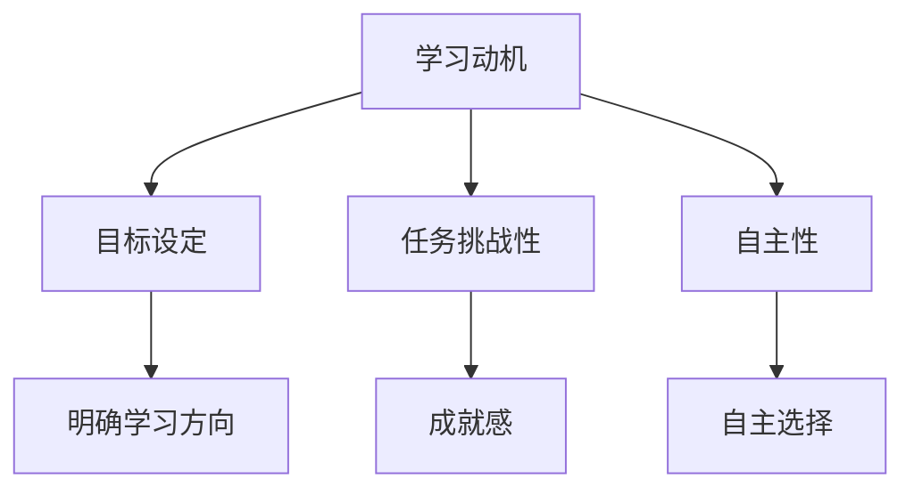

#### **认知负荷**

认知负荷是指个体在处理信息时所面临的认知压力。虚拟教育设计时需要考虑到认知负荷，避免学生过度负担。以下是一些减少认知负荷的策略：

- **简化学习内容**：通过简化学习内容，去除不必要的细节和冗余信息，可以降低学生的认知负荷。例如，在虚拟实验室中，可以简化实验步骤，使学生能够集中精力理解核心概念。

- **提供清晰的指导**：提供详细的操作指导和学习步骤，可以帮助学生更好地理解和应用知识，减少认知负荷。例如，在虚拟课堂中，教师可以通过视频讲解、动画演示等方式，提供直观的学习指导。

- **利用多媒体资源**：利用多媒体资源，如视频、图片、音频等，可以减少学生对文字的依赖，降低认知负荷。例如，在虚拟历史课堂中，可以通过动画和场景再现，帮助学生更好地理解历史事件。

以下是一个关于认知负荷的Mermaid流程图：

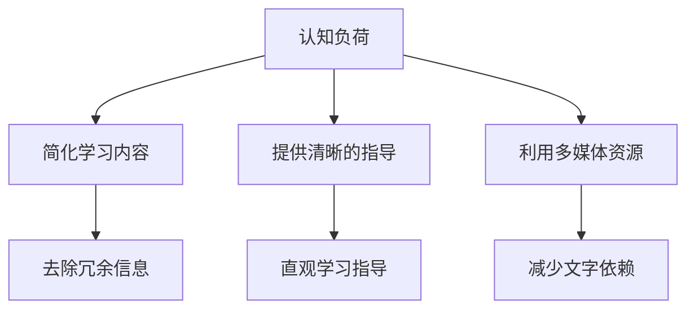

#### **学习风格**

学习风格是指个体在学习和处理信息时的偏好和习惯。了解学生的学习风格有助于设计出更加有效的虚拟教育课程。以下是一些常见的学习风格及其特点：

- **视觉学习风格**：偏好使用视觉信息进行学习，如图表、图片、视频等。

- **听觉学习风格**：偏好使用听觉信息进行学习，如讲座、音频、音乐等。

- **动觉学习风格**：偏好通过动手操作和身体活动进行学习，如实验、实践、运动等。

在设计虚拟教育课程时，可以考虑以下策略：

- **多样化教学资源**：提供多种类型的教学资源，以满足不同学习风格的需求。

- **个性化学习路径**：根据学生的学习风格，提供个性化的学习路径和资源，以提高学习效果。

以下是一个关于学习风格的Mermaid流程图：

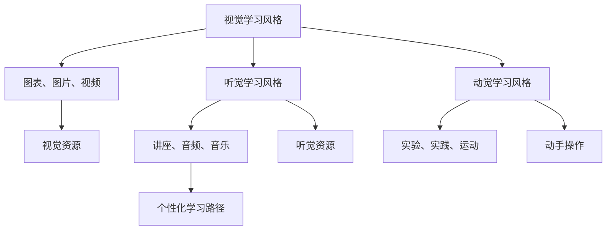

#### **自我调节**

自我调节是指个体在学习和完成任务时，自我管理和调整行为的能力。在虚拟教育中，培养学生的自我调节能力对于提高学习效果至关重要。以下是一些培养自我调节能力的策略：

- **设定学习计划**：鼓励学生制定详细的学习计划，包括学习目标、时间安排和学习方法，以帮助学生更好地管理学习时间。

- **自我反思**：通过定期进行自我反思，学生可以了解自己的学习状况和进展，调整学习策略，提高学习效果。

- **学习反馈**：通过及时的学习反馈，学生可以了解自己的学习成果和不足，从而进行有效的学习调整。

以下是一个关于自我调节的Mermaid流程图：

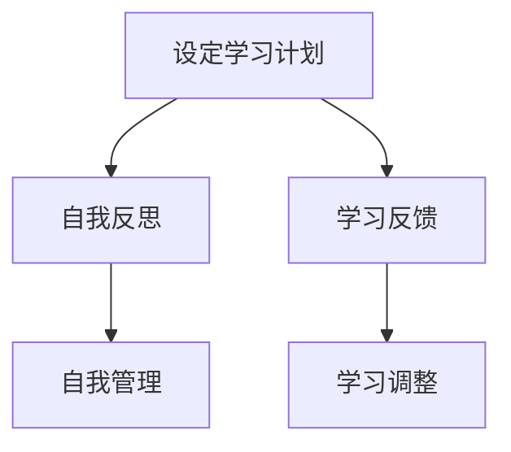

通过深入理解学习心理学的基础理论，并在虚拟教育实践中灵活应用，教育工作者可以设计出更加有效和有针对性的教学策略，从而提高学生的学习效果和满意度。

---

### 第三部分：虚拟教育技术实践

#### 3.1 虚拟教育平台与工具

虚拟教育平台与工具是实施虚拟教育的重要基础设施，它们为学生和教师提供了丰富的学习资源和技术支持。以下将介绍几种主流的虚拟教育平台和工具，并分析它们的优势和特点。

**1. Edmodo**

Edmodo是一个面向K-12教育的社交学习平台，提供了在线课程、作业提交、互动讨论等功能。其优势在于：

- **社交互动**：Edmodo支持学生和教师之间的社交互动，提高了学习参与度。
- **资源丰富**：平台上有大量的教学资源和互动练习，有助于学生巩固知识。
- **个性化学习**：Edmodo可以根据学生的学习进度和需求，提供个性化的学习建议和资源。

**2. Moodle**

Moodle是一个开源的学习管理系统（LMS），广泛应用于各种教育机构和在线教育平台。其优势包括：

- **高度定制化**：Moodle提供了丰富的插件和模块，教师可以根据具体需求进行高度定制化。
- **灵活性**：Moodle支持多种学习活动，如论坛、测验、工作坊等，提供了丰富的教学互动方式。
- **扩展性强**：Moodle社区提供了大量的开源资源和插件，使得平台的功能可以不断扩展。

**3. Canvas**

Canvas是一个现代化的学习管理平台，以其用户友好的界面和强大的功能而著称。其优势包括：

- **用户体验**：Canvas提供了简洁直观的用户界面，学生和教师可以轻松地进行操作和使用。
- **协作工具**：Canvas内置了多种协作工具，如讨论板、群组作业等，支持学生之间的合作学习。
- **数据分析**：Canvas提供了强大的数据分析工具，教师可以通过数据了解学生的学习情况和进度，进行有效的教学调整。

**4. Blackboard**

Blackboard是一个综合性的教育技术平台，提供了从课程管理到学生评估的全方位解决方案。其优势包括：

- **全面功能**：Blackboard集成了多种教育功能，如在线课程、作业提交、考试管理、学习分析等，适用于各种教育场景。
- **个性化学习**：Blackboard可以根据学生的学习行为和成绩，提供个性化的学习资源和反馈。
- **移动学习**：Blackboard支持移动设备访问，学生可以随时随地进行学习。

**5. Zoom**

Zoom是一个流行的视频会议和协作工具，广泛应用于虚拟课堂和远程教育。其优势包括：

- **高清晰度视频**：Zoom提供了高质量的视频会议体验，支持1080p视频流。
- **互动功能**：Zoom支持实时聊天、屏幕共享、投票等功能，增强了课堂互动性。
- **安全性**：Zoom提供了多种安全功能，如加密传输、隐私保护等，确保数据安全和用户隐私。

**总结**

虚拟教育平台和工具的选择应基于具体的教育需求和目标。不同的平台和工具具有各自的优势和特点，教育工作者可以根据实际情况进行选择和整合，以提供最佳的学习体验。

---

### 3.2 虚拟教室的设计与构建

虚拟教室是虚拟教育的重要组成部分，它通过数字技术为学生提供了一个虚拟的学习环境，使得学习不再受限于物理空间和时间。以下是虚拟教室的设计与构建过程，包括其关键要素和注意事项。

#### **关键要素**

1. **学习内容**：虚拟教室的核心是学习内容。这些内容可以是视频讲座、电子书籍、交互式学习模块等，应根据课程目标和学生的学习需求进行设计和组织。

2. **互动工具**：虚拟教室需要配备多种互动工具，如讨论板、实时聊天、视频会议等，以促进师生和生生之间的交流和合作。

3. **虚拟环境**：通过虚拟现实（VR）和增强现实（AR）技术，虚拟教室可以创建一个沉浸式的学习环境，使学生能够身临其境地体验和学习。

4. **评估系统**：虚拟教室应具备评估系统，用于监测学生的学习进度和效果，提供及时的反馈和指导。

5. **支持服务**：包括技术支持、课程辅导、心理咨询等，以保障虚拟教室的顺利运行和学生学习的顺利进行。

#### **设计与构建过程**

1. **需求分析**：首先，需要明确虚拟教室的目标和学习内容，分析学生的需求和学习习惯，确定虚拟教室的功能和架构。

2. **技术选型**：根据需求分析，选择适合的虚拟教育平台和工具，如学习管理系统（LMS）、VR/AR设备、视频会议软件等。

3. **内容设计**：设计虚拟教室的学习内容，包括课程视频、学习模块、互动练习等，确保内容符合教学目标和学生的学习需求。

4. **环境搭建**：搭建虚拟教室的虚拟环境，包括虚拟实验室、虚拟课堂等，通过VR/AR技术提供沉浸式学习体验。

5. **系统集成**：将学习内容、互动工具、虚拟环境等集成到虚拟教室中，确保各个模块之间的协同工作。

6. **测试与优化**：在虚拟教室搭建完成后，进行测试和优化，确保系统的稳定性和用户体验。

7. **培训与支持**：对教师和学生进行虚拟教室的使用培训，提供技术支持和心理辅导，确保他们能够熟练使用虚拟教室并适应新的学习方式。

#### **注意事项**

1. **用户体验**：虚拟教室的设计应注重用户体验，确保界面友好、操作简便，使教师和学生能够轻松使用。

2. **安全性**：虚拟教室需要确保数据安全和用户隐私，采用加密传输、用户认证等安全措施。

3. **灵活性与可扩展性**：虚拟教室的设计应具有灵活性和可扩展性，能够适应不同的教学需求和课程变化。

4. **互动与协作**：虚拟教室应提供丰富的互动和协作工具，促进师生和生生之间的交流和合作。

5. **技术支持**：提供充足的技术支持，确保虚拟教室的稳定运行和教师、学生的顺畅使用。

通过合理设计和构建虚拟教室，可以有效提高教学质量，增强学生的学习体验，推动教育现代化和全球化的发展。

---

### 3.3 虚拟学习环境的互动与协作

虚拟学习环境是虚拟教育中至关重要的一部分，它通过数字技术为学生和教师提供了一个沉浸式、互动性和协作性的学习空间。以下是关于虚拟学习环境的互动与协作的详细探讨，包括互动机制、协作方式、案例以及协作工具的使用。

#### **互动机制**

在虚拟学习环境中，互动机制是实现有效学习的关键。以下是一些常见的互动机制：

1. **实时聊天**：实时聊天工具如Slack、Microsoft Teams等，允许师生之间以及学生之间进行实时沟通和讨论。这种即时交流方式有助于解决学习中的疑问和分享学习心得。

2. **讨论板**：讨论板是一个在线论坛，学生可以在上面发布问题和观点，其他学生和教师可以回应和讨论。讨论板为学习提供了持续的交流平台，有助于知识的积累和共享。

3. **虚拟现实会议**：通过虚拟现实（VR）技术，学生和教师可以进行面对面的虚拟会议。这种会议形式提供了身临其境的互动体验，增强了参与感和真实感。

4. **即时反馈**：通过即时反馈工具，教师可以迅速对学生的作业和提问进行反馈，帮助学生及时纠正错误和理解难点。

#### **协作方式**

虚拟学习环境中的协作方式多种多样，以下是一些常见的协作方式：

1. **小组合作**：学生被分成小组，共同完成任务和项目。小组合作有助于培养学生的团队合作能力和沟通技巧。

2. **协作学习**：学生之间互相帮助，共同学习和解决问题。协作学习可以提高学生的知识掌握程度和学习兴趣。

3. **竞争学习**：通过小组之间的竞争，激发学生的学习动力和参与度。例如，在在线平台上进行知识竞赛或模拟商业竞赛。

4. **角色扮演**：学生可以扮演不同的角色，进行模拟练习，如模拟法庭、模拟公司会议等。这种角色扮演有助于学生理解不同角色的职责和思维模式。

#### **案例**

**案例一：科学实验协作**

在虚拟学习环境中，学生可以通过虚拟实验室进行科学实验。例如，在化学实验中，学生可以模拟进行化学反应，观察实验结果。他们可以在实验过程中进行讨论，分享观察结果和心得体会。教师可以通过实时聊天和讨论板监控学生的实验进度，提供实时指导。

**案例二：在线研讨会**

教师可以组织在线研讨会，通过虚拟现实会议系统邀请专家进行讲座或讨论。学生可以通过虚拟现实设备参与会议，与专家和同学进行实时交流。这种研讨会形式不仅提供了丰富的学习资源，还增强了学生的参与感和互动性。

**案例三：虚拟协作平台**

学生可以使用虚拟协作平台进行项目开发和协作。例如，他们可以共同编写代码、设计产品或制作视频。虚拟协作平台提供了共享文档、任务分配、进度跟踪等功能，有助于团队成员之间的协作和沟通。

#### **协作工具**

以下是一些常用的虚拟学习协作工具：

1. **Miro**：Miro是一个在线协作白板，支持多人实时编辑和讨论。教师和学生可以在白板上绘制思维导图、创建工作流程和进行头脑风暴。

2. **Trello**：Trello是一个项目管理工具，可以用来规划任务和跟踪进度。学生可以在Trello中创建任务卡片，分配任务给团队成员，并监控任务的完成情况。

3. **Zoom**：Zoom是一个视频会议工具，支持虚拟现实会议。教师和学生可以通过Zoom进行面对面的交流，分享屏幕、进行实时问答。

4. **Google Workspace**：Google Workspace包括Google Docs、Sheets、Slides等工具，支持多人实时协作。学生可以在Google Docs中共同编辑文档，进行实时讨论和修改。

通过合理利用互动机制和协作工具，虚拟学习环境可以提供一个高效、互动和协作的学习空间，促进学生和教师之间的交流和合作，提高学习效果。

---

### 第四部分：虚拟教育的应用案例

#### 4.1 虚拟教育在基础教育中的应用

虚拟教育在基础教育中的应用越来越广泛，它通过提供灵活、互动和个性化的学习体验，极大地提高了教学效果和学习兴趣。以下将详细介绍虚拟教育在基础教育中的应用案例，包括虚拟实验室、在线课程和虚拟课堂等。

**案例一：虚拟实验室**

虚拟实验室是一种通过计算机模拟实验室环境的在线平台，学生可以在虚拟环境中进行各种实验，无需实际操作化学、物理等实验设备。这种应用不仅提高了实验的安全性，还降低了实验成本。

- **应用场景**：在化学实验中，学生可以通过虚拟实验室进行酸碱中和、氧化还原等化学反应的模拟，观察实验现象和结果。在物理实验中，学生可以进行力学、电学、光学等实验，通过虚拟环境了解实验原理。

- **实施过程**：学生通过计算机或平板电脑访问虚拟实验室平台，接收实验任务，然后按照实验步骤进行虚拟操作。教师通过平台监控学生的实验进度，提供实时指导和反馈。

- **效果评估**：虚拟实验室的应用显著提高了学生的实验技能和科学素养，同时减少了实验资源的浪费和安全隐患。

**案例二：在线课程**

在线课程是通过互联网提供的学习资源，学生可以随时随地在线学习。在线课程通常包括视频讲座、电子书籍、互动练习等多种学习材料，为学生提供了丰富的学习资源和灵活的学习方式。

- **应用场景**：在线课程适用于各学科的学习，如数学、语文、英语、科学等。学生可以通过在线课程学习新知识、巩固旧知识，进行自我提升。

- **实施过程**：学生通过学校的在线学习平台或第三方在线教育平台，选择合适的在线课程进行学习。课程内容包括视频讲座、电子书籍、在线测验等。学生可以按照自己的学习节奏进行学习，并在学习过程中进行自我评估。

- **效果评估**：在线课程的应用提高了学生的学习自主性和积极性，学生可以根据自己的需求和兴趣进行学习，提高了学习效果和兴趣。

**案例三：虚拟课堂**

虚拟课堂是通过视频会议和在线协作工具实现的在线教学环境，教师和学生可以在虚拟课堂中进行实时互动和学习。虚拟课堂提供了类似于传统课堂的教学体验，但不受时间和地点的限制。

- **应用场景**：虚拟课堂适用于各种学科的教学，如语文课、数学课、外语课等。教师可以通过虚拟课堂进行直播授课，学生可以通过摄像头和麦克风参与课堂互动。

- **实施过程**：教师通过视频会议软件（如Zoom、Microsoft Teams等）创建虚拟课堂，学生通过电脑或手机加入课堂。教师可以在虚拟课堂上进行讲解、演示、互动等教学活动，学生可以提问、讨论、分享学习心得。

- **效果评估**：虚拟课堂的应用提高了教学的灵活性和互动性，学生可以随时随地进行学习，教师可以更好地监控学生的学习进度和效果，提高了教学质量。

**总结**

虚拟教育在基础教育中的应用案例表明，它能够为教育带来许多积极的变化。通过虚拟实验室，学生可以安全地进行实验操作，提高科学素养；通过在线课程，学生可以灵活地进行学习，提高自主学习能力；通过虚拟课堂，师生可以实时互动，提高教学效果。虚拟教育的广泛应用不仅提高了学生的学习兴趣和效果，还为教育创新提供了新的思路和路径。

---

### 4.2 虚拟教育在高等教育中的应用

虚拟教育在高等教育中的应用日益广泛，它通过提供灵活、互动和个性化的学习体验，极大地改变了教学方式和学习模式。以下将详细介绍虚拟教育在高等教育中的应用案例，包括虚拟实验室、在线课程和虚拟课堂等。

#### **虚拟实验室**

虚拟实验室是高等教育中应用虚拟教育的重要领域，它通过模拟真实实验室环境，为学生提供了一个安全、灵活和经济的实验平台。以下是一些具体的案例：

- **案例一：医学教育中的虚拟手术训练**  
  某医学院引入了虚拟手术训练系统，学生可以在虚拟环境中进行手术模拟，熟悉手术步骤和技巧。通过这种模拟训练，学生可以在没有实际操作风险的情况下，反复练习手术操作，提高手术技能。

  - **实施过程**：学生通过虚拟手术训练系统接收手术任务，在虚拟环境中进行模拟手术。教师通过系统监控学生的手术操作过程，提供实时指导和建议。

  - **效果评估**：研究表明，虚拟手术训练显著提高了学生的手术技能和临床决策能力，同时也降低了手术模拟的成本和安全风险。

- **案例二：工程教育中的虚拟实验**  
  某工程学院利用虚拟实验室平台，学生可以在虚拟环境中进行各种工程实验，如结构力学实验、流体力学实验等。这种虚拟实验不仅提高了实验的灵活性和安全性，还减少了实验设备和材料的成本。

  - **实施过程**：学生通过计算机或移动设备访问虚拟实验室平台，选择实验项目和操作步骤。教师通过平台监控学生的实验进度，提供必要的指导和反馈。

  - **效果评估**：虚拟实验的应用提高了学生的实验技能和工程素养，学生能够在虚拟环境中更好地理解实验原理和应用。

#### **在线课程**

在线课程是高等教育中另一种重要的虚拟教育形式，它通过互联网为学生提供丰富的学习资源和灵活的学习方式。以下是一些具体的案例：

- **案例一：计算机科学在线课程**  
  某大学计算机科学专业通过在线课程平台，为学生提供了多种编程课程和项目实战。学生可以通过在线课程学习最新的编程技术和算法，进行项目开发和实战训练。

  - **实施过程**：学生通过大学的在线学习平台访问计算机科学在线课程，观看视频讲座、阅读教材、完成在线练习和项目。教师通过在线讨论区和作业反馈，提供实时指导和支持。

  - **效果评估**：研究表明，在线课程的应用提高了学生的学习自主性和编程能力，学生能够在实际项目中应用所学知识，提高了就业竞争力。

- **案例二：法律教育在线课程**  
  某法学院开设了在线法律课程，包括法律理论、案例分析和实践操作等。学生可以通过在线课程学习法律知识，进行法律分析和模拟审判。

  - **实施过程**：学生通过在线课程平台访问法律课程，观看视频讲座、阅读案例、进行在线测试和模拟审判。教师通过在线讨论区和作业反馈，提供实时指导和支持。

  - **效果评估**：在线课程的应用提高了学生的学习效果和法律素养，学生能够更好地理解和应用法律知识。

#### **虚拟课堂**

虚拟课堂是高等教育中实现在线教学的重要工具，它通过视频会议和在线协作工具，为学生提供了一个实时互动的学习环境。以下是一些具体的案例：

- **案例一：医学院的虚拟课堂**  
  某医学院通过虚拟课堂，教师可以进行在线授课、视频演示和实时互动。学生可以通过虚拟课堂参与课堂讨论、提问和交流。

  - **实施过程**：教师通过视频会议软件（如Zoom、Microsoft Teams等）创建虚拟课堂，学生通过电脑或移动设备加入课堂。教师进行授课和演示，学生通过摄像头和麦克风参与课堂互动。

  - **效果评估**：虚拟课堂的应用提高了教学的灵活性和互动性，学生能够随时随地进行学习，教师可以更好地监控学生的学习进度和效果。

- **案例二：商学院的虚拟课堂**  
  某商学院通过虚拟课堂，教师可以进行在线讲座、案例分析和团队讨论。学生可以通过虚拟课堂参与课堂讨论、团队合作和案例分析。

  - **实施过程**：教师通过在线课程平台创建虚拟课堂，学生通过电脑或移动设备加入课堂。教师进行授课和案例分析，学生通过讨论板和实时聊天参与课堂互动。

  - **效果评估**：虚拟课堂的应用提高了学生的学习效果和参与度，学生能够在团队合作和案例分析中提高实践能力和创新思维。

#### **总结**

虚拟教育在高等教育中的应用案例表明，它能够为高等教育带来许多积极的变化。通过虚拟实验室，学生可以安全、灵活地进行实验操作，提高实践技能；通过在线课程，学生可以灵活地进行学习，提高自主学习能力；通过虚拟课堂，师生可以实时互动，提高教学效果。虚拟教育的广泛应用不仅提高了学生的学习兴趣和效果，还为教育创新提供了新的思路和路径。

---

### 4.3 职业教育与虚拟教育的结合

虚拟教育在职业教育中发挥着重要作用，它通过提供灵活、互动和个性化的学习体验，满足了职业教育的特定需求。以下将详细探讨虚拟教育与职业教育的结合，包括虚拟实训、在线职业技能培训和虚拟职业规划等。

#### **虚拟实训**

虚拟实训是职业教育中应用虚拟教育的重要形式，它通过模拟真实的工作环境，为学生提供了一个实践操作的平台。虚拟实训不仅提高了学生的实际操作技能，还减少了实际操作中的风险和成本。

- **案例一：机械工程中的虚拟实训**  
  某职业技术学院引入了虚拟机械加工实训平台，学生可以在虚拟环境中进行机械加工操作。通过虚拟实训，学生可以熟悉机械加工的各个环节，提高操作技能和应对复杂问题的能力。

  - **实施过程**：学生通过计算机或平板电脑访问虚拟实训平台，接收实训任务，按照操作步骤进行虚拟操作。教师通过平台监控学生的实训进度，提供实时指导。

  - **效果评估**：研究表明，虚拟实训显著提高了学生的机械加工技能和问题解决能力，同时降低了实训成本和安全风险。

- **案例二：航空服务中的虚拟实训**  
  某航空学院使用了虚拟航空服务实训平台，学生可以在虚拟环境中进行航空服务操作，如航班准备、乘客服务等。通过虚拟实训，学生可以熟悉航空服务的各个环节，提高服务质量和应急处理能力。

  - **实施过程**：学生通过虚拟实训平台接收实训任务，在虚拟环境中进行操作。教师通过平台监控学生的实训进度，提供实时反馈和指导。

  - **效果评估**：虚拟实训的应用提高了学生的航空服务技能和应急处理能力，学生能够在真实环境中更加自信和从容地进行工作。

#### **在线职业技能培训**

在线职业技能培训是职业教育中的重要组成部分，它通过互联网为学生提供了丰富的职业技能培训资源。在线职业技能培训不仅提高了学生的职业技能，还为他们提供了就业机会。

- **案例一：IT技能在线培训**  
  某IT培训机构开设了在线编程课程、数据分析课程和云计算课程等，学生可以通过在线学习平台选择适合自己的课程进行学习。通过在线职业技能培训，学生能够掌握最新的IT技能，提高就业竞争力。

  - **实施过程**：学生通过在线学习平台访问职业技能培训课程，观看视频讲座、阅读教材、完成在线练习和项目。教师通过在线讨论区和作业反馈，提供实时指导和支持。

  - **效果评估**：研究表明，

