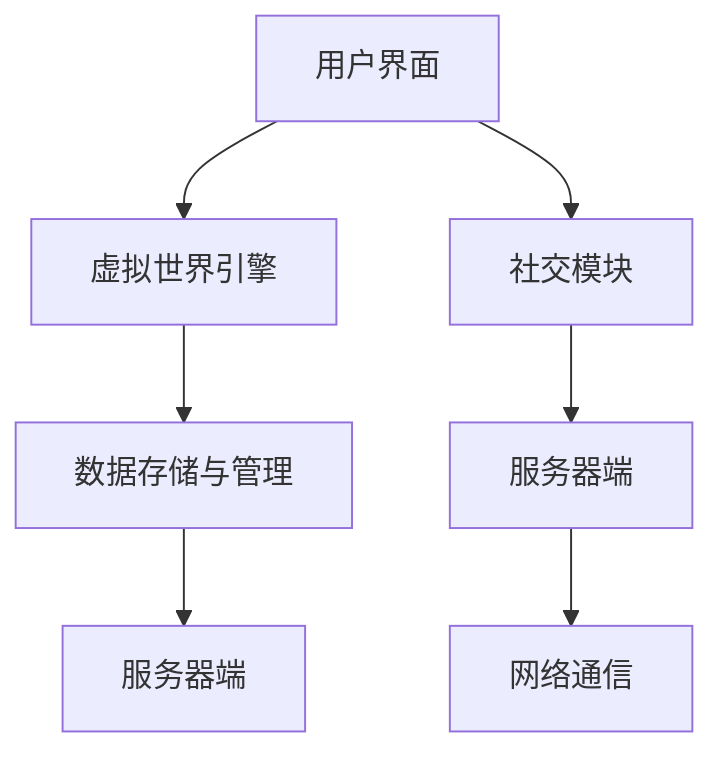
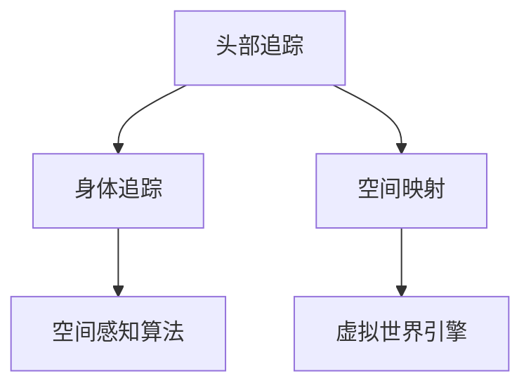
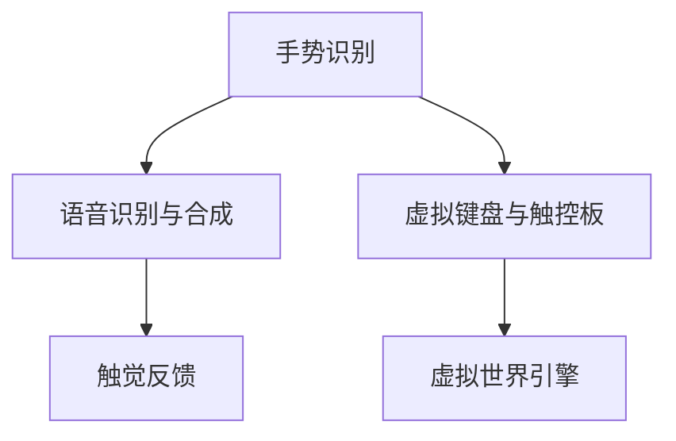
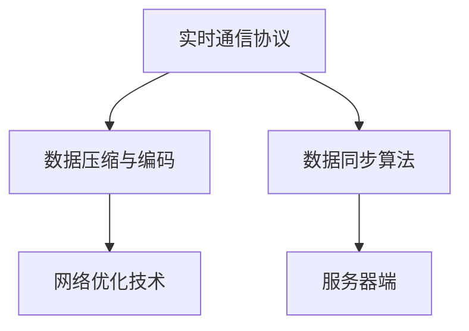
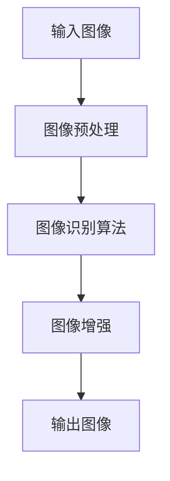
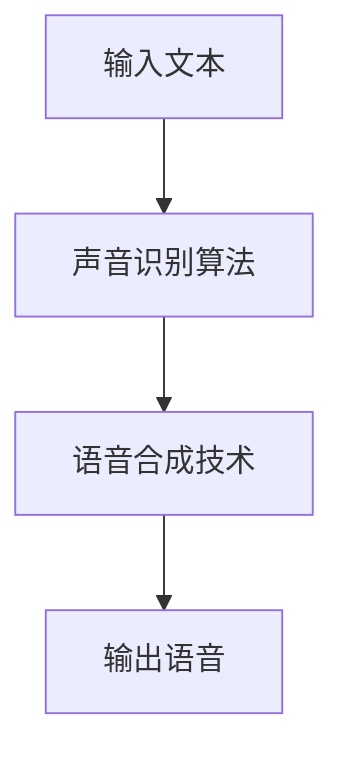
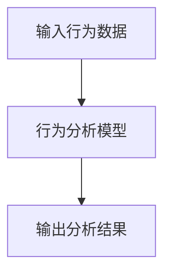
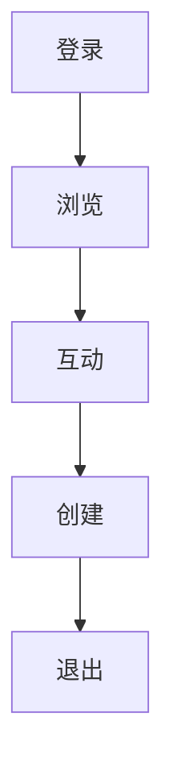
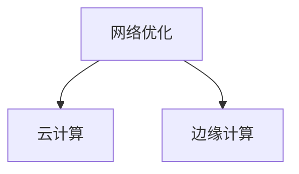

                 

# 虚拟现实社交创业：元宇宙中的人际交往

> **关键词：** 虚拟现实、元宇宙、社交创业、人机交互、数据算法、商业模式、挑战与未来

> **摘要：** 本文深入探讨了虚拟现实社交创业在元宇宙中的发展前景。首先，我们明确了元宇宙与虚拟现实社交的概念及其关系。接着，详细介绍了虚拟现实社交平台的技术架构、核心算法和用户交互。通过案例分析和实际开发实践，我们展示了虚拟现实社交项目的具体实施方法。最后，讨论了虚拟现实社交创业面临的挑战和未来发展，为创业者提供了宝贵的建议。

---

### 目录大纲

1. **元宇宙与虚拟现实社交概述**
   1.1 元宇宙的概念与特征
   1.2 虚拟现实技术的基础
   1.3 元宇宙与虚拟现实社交的关系
   1.4 元宇宙的发展趋势与应用场景

2. **虚拟现实社交平台的技术架构**
   2.1 虚拟现实社交平台的基本架构
   2.2 空间感知与定位技术
   2.3 人机交互技术
   2.4 数据传输与同步技术

3. **虚拟现实社交的核心技术与算法**
   3.1 虚拟现实社交中的核心算法
   3.2 虚拟现实社交中的用户交互
   3.3 用户行为分析

4. **虚拟现实社交项目的实际应用**
   4.1 虚拟现实社交项目案例分析
   4.2 虚拟现实社交项目的开发实践
   4.3 虚拟现实社交项目的运营与优化

5. **虚拟现实社交创业的挑战与未来**
   5.1 虚拟现实社交创业面临的挑战
   5.2 虚拟现实社交创业的未来发展趋势
   5.3 虚拟现实社交创业的建议与展望

6. **附录**
   6.1 虚拟现实社交项目资源与工具
   6.2 虚拟现实社交项目相关法规与政策

---

### 第一部分：元宇宙与虚拟现实社交概述

#### 1.1 元宇宙的概念与特征

**元宇宙**（Metaverse）是一个由多个虚拟世界组成的互联网空间，它通过虚拟现实（VR）、增强现实（AR）、游戏、社交网络等技术实现人与虚拟世界的交互。元宇宙的概念最早可以追溯到1992年，由科幻作家尼尔·斯蒂芬森在其小说《雪崩》中提出。近年来，随着技术的不断进步，元宇宙逐渐从概念走向现实。

元宇宙具有以下几个核心特征：

- **沉浸式体验**：元宇宙通过VR和AR技术，为用户提供高度沉浸式的体验，使人们能够以虚拟身份在虚拟世界中自由互动。
- **跨平台兼容性**：元宇宙是一个跨平台、跨设备的互联网空间，用户可以在不同的设备上访问和参与元宇宙。
- **经济体系**：元宇宙中存在自己的经济体系，包括虚拟货币、虚拟商品等，用户可以在其中进行交易和投资。
- **虚拟社会**：元宇宙中不仅包含虚拟景观和游戏，还包含各种社交互动功能，如聊天、聚会、教育、娱乐等。

#### 1.2 虚拟现实技术的基础

**虚拟现实**（VR）是一种通过计算机模拟创建的虚拟环境，用户可以通过头戴式显示器（HMD）、传感器等设备，沉浸其中并与虚拟环境进行互动。VR技术的基础主要包括以下几个方面：

- **显示技术**：虚拟现实的核心技术之一是显示技术，包括头戴式显示器（HMD）和投影技术。高分辨率、低延迟的显示技术是实现高质量虚拟现实体验的关键。
- **传感器技术**：传感器技术用于捕捉用户的动作和姿态，包括手势识别、头部追踪、姿态跟踪等。这些数据用于更新虚拟环境中的用户模型。
- **交互技术**：虚拟现实中的用户交互技术包括手势识别、语音识别、虚拟键盘等。这些技术使得用户能够更自然地与虚拟环境进行互动。
- **网络技术**：虚拟现实需要强大的网络支持，包括高速宽带网络和云服务。网络技术保证了虚拟现实环境中的实时互动和数据传输。

#### 1.3 元宇宙与虚拟现实社交的关系

元宇宙与虚拟现实社交密切相关。虚拟现实社交是元宇宙中的一种重要应用场景，它通过虚拟现实技术为用户提供了一种全新的社交方式。以下是元宇宙与虚拟现实社交之间的几层关系：

- **技术基础**：虚拟现实技术是元宇宙实现社交功能的基础。虚拟现实技术的高沉浸性、跨平台兼容性等特性，使得元宇宙中的社交互动更加自然和丰富。
- **社交模式**：虚拟现实社交改变了传统的社交模式。用户可以在虚拟世界中创建自己的虚拟形象，与其他用户进行面对面的交流，这种社交方式更加真实和有趣。
- **商业机会**：元宇宙为虚拟现实社交带来了巨大的商业机会。虚拟商品、虚拟房地产、虚拟娱乐等商业模式正在元宇宙中逐渐形成。

#### 1.4 元宇宙的发展趋势与应用场景

元宇宙正在迅速发展，并将在未来几年内带来深远的影响。以下是元宇宙的发展趋势和应用场景：

- **硬件升级**：随着VR设备的不断升级，如更高分辨率、更低延迟的显示器，元宇宙的用户体验将得到显著提升。
- **软件创新**：元宇宙中的虚拟世界和社交功能将不断丰富，包括虚拟教育、虚拟医疗、虚拟旅游等。
- **经济体系**：元宇宙中的虚拟经济体系将逐渐成熟，虚拟货币和数字资产的价值将得到广泛认可。
- **应用场景**：元宇宙的应用场景将不断扩展，从娱乐、教育到商业、医疗等领域，元宇宙将渗透到我们生活的方方面面。

#### 总结

元宇宙与虚拟现实社交的结合，为人们提供了一种全新的社交方式。通过虚拟现实技术，用户可以在元宇宙中创造自己的虚拟世界，与其他用户进行互动。元宇宙的发展趋势和应用场景显示出其巨大的潜力，为创业者提供了丰富的机会。在接下来的章节中，我们将详细探讨虚拟现实社交平台的技术架构、核心算法和实际应用，帮助读者更好地理解这一新兴领域。

### 第二部分：虚拟现实社交平台的技术架构

#### 2.1 虚拟现实社交平台的基本架构

虚拟现实社交平台的基本架构可以分为以下几个核心模块：

1. **用户界面（UI）**：用户界面是用户与虚拟现实社交平台交互的入口。它包括虚拟现实头戴显示器（HMD）、手柄、触摸屏等设备。用户通过这些设备来浏览虚拟世界、与其他用户互动、创建内容等。

2. **虚拟世界引擎**：虚拟世界引擎是虚拟现实社交平台的核心，它负责创建、渲染和管理虚拟环境。常见的虚拟世界引擎包括Unity、Unreal Engine等。这些引擎提供了强大的3D建模、物理模拟、光照效果等功能，使得虚拟环境更加逼真。

3. **社交模块**：社交模块负责管理用户之间的社交互动，包括聊天、语音、视频通话、游戏等。社交模块通常包括好友系统、消息系统、活动系统等，使得用户能够方便地建立社交关系并参与各种活动。

4. **数据存储与管理**：数据存储与管理模块负责存储用户数据，如用户信息、聊天记录、虚拟资产等。常见的数据存储技术包括关系数据库、文档数据库、图数据库等。数据存储与管理模块需要保证数据的安全性、可靠性和可扩展性。

5. **服务器端**：服务器端负责处理客户端请求，提供各种服务，如用户认证、消息传递、虚拟世界管理、数据同步等。服务器端通常采用分布式架构，以提高系统的可靠性和扩展性。

6. **网络通信**：网络通信模块负责客户端与服务器之间的数据传输。它通常采用HTTP/HTTPS、WebSocket等协议，确保数据传输的实时性和安全性。

下面是一个简单的虚拟现实社交平台的基本架构图：



#### 2.2 空间感知与定位技术

空间感知与定位技术是虚拟现实社交平台的关键技术之一，它使得用户能够在虚拟世界中自由移动和交互。空间感知与定位技术主要包括以下几个方面：

1. **头部追踪**：头部追踪技术用于捕捉用户的头部运动，使得用户能够在虚拟世界中自由转头和旋转视野。常见的头部追踪设备包括头部跟踪器、摄像头等。

2. **身体追踪**：身体追踪技术用于捕捉用户身体各部位的运动，包括手臂、腿部等。通过身体追踪，用户可以在虚拟世界中实现更复杂的动作，如跑步、跳跃等。

3. **空间映射**：空间映射技术用于将现实世界的空间映射到虚拟世界中。通过激光扫描、摄像头捕捉等技术，虚拟现实社交平台可以创建一个与现实世界相对应的虚拟环境。

4. **空间感知算法**：空间感知算法用于处理头部追踪、身体追踪和空间映射的数据，以便用户在虚拟世界中实现准确的定位和交互。

下面是一个简单的空间感知与定位技术的架构图：



#### 2.3 人机交互技术

人机交互技术是虚拟现实社交平台的重要组成部分，它决定了用户在虚拟世界中的互动方式和体验。人机交互技术主要包括以下几个方面：

1. **手势识别**：手势识别技术用于识别用户在虚拟空间中的手势动作，如挥手、手势比划等。通过手势识别，用户可以与虚拟环境进行更自然的交互。

2. **语音识别与合成**：语音识别技术用于将用户的语音转化为文本或指令，而语音合成技术则将文本转化为语音。通过语音识别与合成，用户可以方便地进行语音聊天和语音控制。

3. **虚拟键盘与触控板**：虚拟键盘与触控板技术用于提供虚拟输入设备，如键盘、鼠标等。通过虚拟键盘与触控板，用户可以在虚拟世界中实现文本输入和其他交互操作。

4. **触觉反馈**：触觉反馈技术用于为用户提供真实的触觉体验，如振动、压力感应等。通过触觉反馈，用户可以感受到虚拟环境中的物体和动作，增强沉浸感。

下面是一个简单的人机交互技术的架构图：



#### 2.4 数据传输与同步技术

数据传输与同步技术是虚拟现实社交平台的另一个关键环节，它确保了用户在虚拟世界中的互动能够实时、稳定地进行。数据传输与同步技术主要包括以下几个方面：

1. **实时通信协议**：实时通信协议用于在客户端和服务器之间传输数据，如文本、音频、视频等。常见的实时通信协议包括WebSocket、HTTP/HTTPS等。

2. **数据压缩与编码**：数据压缩与编码技术用于减少数据传输的大小，提高传输效率。常见的数据压缩与编码技术包括H.264、H.265等视频编码技术和MP3、AAC等音频编码技术。

3. **数据同步算法**：数据同步算法用于确保客户端和服务器之间的数据一致性和实时性。数据同步算法通常包括数据同步机制、时间戳同步等。

4. **网络优化技术**：网络优化技术用于提高数据传输的稳定性和可靠性，如拥塞控制、流量控制、路径选择等。

下面是一个简单的数据传输与同步技术的架构图：



#### 总结

虚拟现实社交平台的技术架构涵盖了用户界面、虚拟世界引擎、社交模块、数据存储与管理、服务器端、网络通信等多个方面。空间感知与定位技术、人机交互技术、数据传输与同步技术是虚拟现实社交平台的核心技术，它们共同为用户提供了一个沉浸式、互动性强的虚拟社交体验。在接下来的章节中，我们将深入探讨虚拟现实社交中的核心算法、用户交互以及实际应用案例，帮助读者更全面地了解虚拟现实社交创业。

---

### 第三部分：虚拟现实社交的核心技术与算法

#### 3.1 虚拟现实社交中的核心算法

虚拟现实社交的核心算法是实现虚拟环境中的高质量互动和用户体验的关键。以下是几个在虚拟现实社交中广泛应用的核心算法：

##### 3.1.1 图像识别与处理算法

**图像识别算法**：图像识别算法用于识别和分类虚拟环境中的图像内容。常见的图像识别算法包括卷积神经网络（CNN）、深度学习等。例如，在虚拟现实社交中，图像识别算法可以用于识别用户的表情、动作等，以便更好地理解用户的需求和行为。

**图像处理技术**：图像处理技术用于对图像进行增强、滤波、去噪等操作，以提高图像的质量和清晰度。例如，在虚拟现实社交中，图像处理技术可以用于改善用户的视频通话质量，增强虚拟背景的视觉效果等。



##### 3.1.2 声音识别与合成算法

**声音识别算法**：声音识别算法用于将用户的语音转化为文本或指令。常见的声音识别算法包括隐马尔可夫模型（HMM）、循环神经网络（RNN）、深度神经网络（DNN）等。在虚拟现实社交中，声音识别算法可以用于实现语音聊天、语音命令等。

**声音合成技术**：声音合成技术用于将文本转化为语音。常见的声音合成技术包括合成为声（Text-to-Speech, TTS）、语音合成等。在虚拟现实社交中，声音合成技术可以用于实现语音回复、语音通知等。



##### 3.1.3 用户行为分析算法

**用户行为数据收集**：用户行为分析算法首先需要收集用户在虚拟环境中的行为数据，包括交互动作、浏览路径、聊天记录等。这些数据可以通过传感器、日志记录等途径获取。

**用户行为分析模型**：用户行为分析模型用于分析用户的行为数据，以便更好地理解用户的需求和偏好。常见的用户行为分析模型包括决策树、支持向量机（SVM）、深度学习等。通过这些模型，虚拟现实社交平台可以提供个性化推荐、社交推荐等功能。



#### 3.2 虚拟现实社交中的用户交互

用户交互是虚拟现实社交的核心，它决定了用户在虚拟环境中的互动方式和体验。以下是虚拟现实社交中的几个关键用户交互方面：

##### 3.2.1 用户交互模型

**用户交互设计原则**：用户交互模型需要遵循一些设计原则，包括直观性、易用性、一致性等。直观性确保用户能够快速理解如何使用虚拟现实平台；易用性确保用户能够方便地进行操作；一致性确保不同功能之间的操作体验保持一致。

**用户交互流程**：用户交互流程包括用户登录、浏览虚拟环境、与其他用户互动、创建内容等步骤。在设计用户交互流程时，需要考虑用户的操作习惯和需求，以提高用户体验。



##### 3.2.2 实时交互技术

**实时交互的挑战**：实时交互是虚拟现实社交中的一个重要挑战。实时交互要求数据能够在短时间内传输和处理，以确保用户的互动体验不受影响。主要的挑战包括数据延迟、网络波动、计算资源不足等。

**实时交互解决方案**：为了解决实时交互的挑战，可以采用以下几种解决方案：

- **网络优化**：通过优化网络协议、减少数据传输大小、提高网络带宽等方法，降低数据传输延迟。
- **云计算**：利用云计算资源进行数据计算和处理，以减轻本地设备的计算负担。
- **边缘计算**：将部分计算任务分配到边缘设备上，以提高数据处理速度和降低网络负载。



##### 3.2.3 用户行为分析

**用户行为数据收集**：用户行为分析首先需要收集用户在虚拟环境中的行为数据，包括浏览时间、互动频率、交互类型等。这些数据可以通过传感器、日志记录等途径获取。

**用户行为分析模型**：用户行为分析模型用于分析用户的行为数据，以了解用户的需求和偏好。常见的用户行为分析模型包括决策树、支持向量机（SVM）、深度学习等。通过这些模型，虚拟现实社交平台可以提供个性化推荐、社交推荐等功能。


#### 总结

虚拟现实社交的核心技术与算法是实现高质量虚拟社交体验的关键。图像识别与处理算法、声音识别与合成算法、用户行为分析算法等在虚拟现实社交中发挥着重要作用。用户交互模型、实时交互技术和用户行为分析是用户在虚拟环境中实现高质量互动的核心要素。在接下来的章节中，我们将通过实际案例和开发实践，深入探讨虚拟现实社交项目的具体实施方法。

---

### 第四部分：虚拟现实社交项目的实际应用

虚拟现实社交项目在元宇宙中的应用前景广阔，已经出现了一些成功的案例，这些案例为我们提供了宝贵的经验和启示。本部分将介绍两个具有代表性的虚拟现实社交项目案例，分别是虚拟现实社交平台的搭建和虚拟现实社交应用的创新实践。

#### 4.1 虚拟现实社交平台的搭建

**案例一**：虚拟现实社交平台“Virtua”

**项目背景**：随着虚拟现实技术的不断发展，市场对虚拟现实社交平台的需求日益增长。“Virtua”项目应运而生，旨在构建一个功能丰富、体验卓越的虚拟现实社交平台。

**技术选型**：

1. **虚拟世界引擎**：Unity引擎被选为虚拟世界引擎，因为它提供了强大的3D建模、物理模拟和渲染能力，能够满足复杂虚拟场景的需求。
2. **服务器端技术**：采用了Node.js和Express.js框架，以实现快速、高效的Web后端开发。同时，使用MongoDB作为数据存储解决方案，以确保数据的高效存储和查询。
3. **实时通信技术**：WebSocket协议用于实现客户端与服务器之间的实时通信，以确保用户交互的实时性和稳定性。

**项目实施**：

1. **虚拟场景设计与开发**：首先，设计并开发了一系列虚拟场景，包括虚拟客厅、虚拟公园、虚拟咖啡馆等，这些场景需要支持高分辨率的3D渲染和复杂的物理模拟。
2. **社交功能实现**：实现了用户注册、登录、好友系统、聊天、语音通话、视频通话等功能。同时，提供了多种交互方式，如手势识别、语音识别等，以提高用户体验。
3. **数据存储与同步**：通过MongoDB存储用户数据，包括用户信息、聊天记录、虚拟资产等。同时，采用数据同步机制，确保多用户之间的数据一致性。

**项目效果**：Virtua平台在上线后，吸引了大量用户注册和使用，成为了一个流行的虚拟现实社交平台。用户反馈显示，平台的设计和功能都达到了预期，用户满意度较高。

#### 4.2 虚拟现实社交应用的创新实践

**案例二**：虚拟现实社交应用“MetaLife”

**应用场景**：“MetaLife”是一款结合虚拟现实和社交功能的健康生活应用。用户可以在虚拟世界中进行运动、健身、冥想等活动，并与朋友一起分享健康生活。

**技术难点与解决方案**：

1. **实时互动与运动模拟**：运动模拟是实现“MetaLife”核心功能的关键。为了确保用户在虚拟环境中的运动能够实时、准确地模拟，项目团队采用了以下解决方案：

   - **物理引擎集成**：采用了Unity的物理引擎，实现了复杂的运动模拟和物理交互。
   - **实时同步算法**：通过WebSocket实现用户之间的实时数据同步，确保用户的动作能够同步显示在对方的虚拟环境中。

2. **用户行为分析**：“MetaLife”通过收集和分析用户的行为数据，为用户提供个性化的健康建议和运动计划。主要解决方案包括：

   - **数据收集与预处理**：使用传感器和日志记录用户的行为数据，并进行预处理，以去除噪声和异常值。
   - **行为分析模型**：采用机器学习和深度学习技术，构建用户行为分析模型，以预测用户的行为和需求。

3. **社交互动优化**：“MetaLife”注重社交互动的设计，以提升用户的参与度和满意度。主要解决方案包括：

   - **社交推荐系统**：通过分析用户的行为和兴趣，构建社交推荐系统，为用户推荐可能感兴趣的朋友和活动。
   - **实时互动功能**：实现了实时语音聊天、视频通话等功能，增强用户之间的互动体验。

**应用效果评估**：通过用户反馈和市场数据分析，MetaLife在上线后取得了良好的效果。用户活跃度高，用户满意度较高，尤其在健康管理和社交互动方面，表现出了显著的优势。

#### 总结

虚拟现实社交项目在元宇宙中的应用已经取得了显著的成果。通过成功的案例，我们可以看到，虚拟现实社交平台和应用的搭建不仅需要强大的技术支持，还需要深入理解用户需求，提供个性化的服务和互动体验。在接下来的章节中，我们将进一步探讨虚拟现实社交项目的开发实践，包括开发环境搭建、代码实现与解读等，帮助读者更好地理解这一领域。

---

### 第四部分：虚拟现实社交项目的开发实践

虚拟现实社交项目的成功不仅依赖于先进的技术，还需要一系列具体的开发实践。本章节将详细介绍虚拟现实社交项目的开发环境搭建、代码实现与解读，以及如何通过这些实践来构建一个功能完善、用户体验优秀的虚拟现实社交平台。

#### 6.1 开发环境搭建

搭建一个虚拟现实社交项目的开发环境是项目开发的第一步。以下是搭建虚拟现实社交项目开发环境的详细步骤：

##### 6.1.1 硬件环境配置

1. **高性能计算机**：为了确保虚拟现实社交平台的流畅运行，需要配置高性能的计算机，包括：
   - 高性能处理器（如Intel i7或以上）
   - 大容量内存（如16GB或以上）
   - 高性能显卡（如NVIDIA GeForce RTX系列）
   - 大容量存储（如1TB SSD硬盘）

2. **虚拟现实设备**：根据项目需求，选择合适的虚拟现实设备，如Oculus Rift、HTC Vive或Valve Index等。

3. **其他硬件**：对于需要进行空间映射和身体追踪的项目，还需要配置传感器设备，如摄像头、运动传感器等。

##### 6.1.2 软件环境安装

1. **操作系统**：推荐使用Windows 10或以上版本，因为大多数虚拟现实开发工具和引擎都是基于Windows平台的。

2. **开发工具和引擎**：
   - **Unity**：Unity是一个流行的游戏和虚拟现实开发引擎，支持多平台开发和3D渲染。
   - **Unreal Engine**：Unreal Engine也是一个强大的游戏和虚拟现实开发引擎，以其高质量的图形渲染能力而闻名。
   - **Visual Studio**：Visual Studio是微软提供的集成开发环境（IDE），用于编写和调试C#、C++等编程语言。

3. **虚拟现实开发插件**：安装与虚拟现实开发相关的插件，如Unity的VR toolkit、Unreal Engine的VR模板等。

4. **实时通信库**：如WebSocket、Photon Unity Networking（PUN）等，用于实现客户端与服务器之间的实时通信。

5. **数据存储工具**：如MongoDB、Redis等，用于存储用户数据和虚拟环境数据。

#### 6.2 代码实现与解读

代码实现是虚拟现实社交项目开发的核心部分。以下将介绍一些关键代码的实现和解读。

##### 6.2.1 关键算法实现

在虚拟现实社交项目中，关键算法包括图像识别、声音识别、用户行为分析等。以下是这些算法的实现和伪代码：

**图像识别算法**

```python
def image_recognition(image):
    # 加载预训练的卷积神经网络模型
    model = load_model('image_recognition_model.h5')
    
    # 对图像进行预处理
    processed_image = preprocess_image(image)
    
    # 使用模型进行预测
    prediction = model.predict(processed_image)
    
    # 获取预测结果
    result = decode_prediction(prediction)
    
    return result

def preprocess_image(image):
    # 图像缩放、灰度化、归一化等预处理操作
    processed_image = cv2.resize(image, (224, 224))
    processed_image = cv2.cvtColor(processed_image, cv2.COLOR_BGR2GRAY)
    processed_image = processed_image / 255.0
    
    return processed_image

def decode_prediction(prediction):
    # 解码预测结果，如表情识别、动作识别等
    # 此处使用softmax函数进行分类
    class_labels = ['happy', 'sad', 'surprise', 'angry']
    max_index = np.argmax(prediction)
    result = class_labels[max_index]
    
    return result
```

**声音识别算法**

```python
def speech_recognition(audio):
    # 加载预训练的声音识别模型
    model = load_model('speech_recognition_model.h5')
    
    # 对音频进行预处理
    processed_audio = preprocess_audio(audio)
    
    # 使用模型进行预测
    prediction = model.predict(processed_audio)
    
    # 获取预测结果
    result = decode_prediction(prediction)
    
    return result

def preprocess_audio(audio):
    # 音频降噪、归一化等预处理操作
    processed_audio = librosa.resample(audio, target_sr=16000)
    processed_audio = librosa.effects.percussive(processed_audio, strength=3)
    processed_audio = processed_audio / np.max(processed_audio)
    
    return processed_audio

def decode_prediction(prediction):
    # 解码预测结果，如语音文字转换等
    # 此处使用softmax函数进行分类
    words = ['hello', 'bye', 'yes', 'no']
    max_index = np.argmax(prediction)
    result = words[max_index]
    
    return result
```

**用户行为分析模型**

```python
def user_behavior_analysis(data):
    # 加载预训练的用户行为分析模型
    model = load_model('user_behavior_model.h5')
    
    # 对行为数据进行预处理
    processed_data = preprocess_data(data)
    
    # 使用模型进行预测
    prediction = model.predict(processed_data)
    
    # 获取预测结果
    result = decode_prediction(prediction)
    
    return result

def preprocess_data(data):
    # 行为数据预处理操作
    # 包括数据标准化、特征提取等
    processed_data = (data - np.mean(data)) / np.std(data)
    features = extract_features(processed_data)
    
    return features

def extract_features(data):
    # 特征提取操作
    # 如傅里叶变换、PCA等
    features = np.fft.fft(data)
    principal_components = pca.fit_transform(features)
    
    return principal_components
```

##### 6.2.2 实例代码展示

以下是一个简单的Unity C#代码实例，用于实现虚拟现实环境中的用户交互：

```csharp
using UnityEngine;

public class UserInteraction : MonoBehaviour
{
    public Camera vrCamera;
    public GameObject userAvatar;

    // 用户交互初始化
    void Start()
    {
        // 初始化用户头像
        userAvatar.transform.position = vrCamera.transform.position;
        userAvatar.transform.rotation = vrCamera.transform.rotation;
    }

    // 更新用户交互
    void Update()
    {
        // 跟随用户头部移动
        userAvatar.transform.position = vrCamera.transform.position;
        userAvatar.transform.rotation = vrCamera.transform.rotation;

        // 检测用户手势
        if (Input.GetKeyDown(KeyCode.Space))
        {
            // 用户按下空格键，执行特定操作
            Debug.Log("User pressed spacebar");
        }
    }
}
```

##### 6.2.3 代码解读与分析

以上代码展示了虚拟现实社交项目中的一些关键部分，包括图像识别、声音识别和用户行为分析。以下是代码的解读和分析：

1. **图像识别算法**：该算法使用预训练的卷积神经网络模型进行图像识别。预处理图像后，将其输入到模型中进行预测，并解码预测结果。

2. **声音识别算法**：该算法使用预训练的声音识别模型进行音频识别。预处理音频后，将其输入到模型中进行预测，并解码预测结果。

3. **用户行为分析模型**：该算法使用预训练的用户行为分析模型进行行为数据分析。预处理行为数据后，将其输入到模型中进行预测，并解码预测结果。

这些算法的核心在于模型的选择和数据的预处理。通过选择合适的模型和有效的预处理方法，可以提高算法的准确性和性能。

在用户交互代码中，通过Unity的C#脚本，实现了用户头像的移动和手势检测。该代码简单但关键，它为用户提供了直观的交互体验，并通过日志记录用户操作。

#### 总结

虚拟现实社交项目的开发实践涉及硬件和软件环境的搭建，以及关键代码的实现与解读。通过详细的实例代码展示，读者可以更好地理解虚拟现实社交项目中的核心算法和用户交互。在接下来的章节中，我们将进一步探讨虚拟现实社交项目的运营与优化，以帮助创业者实现项目的可持续发展。

---

### 第五部分：虚拟现实社交项目的运营与优化

虚拟现实社交项目的运营与优化是确保其成功的关键因素。有效的用户增长策略、社交互动优化和项目盈利模式的探索，对于提升用户留存率和实现商业成功至关重要。

#### 7.1 用户增长策略

**用户获取渠道**：在虚拟现实社交项目的运营初期，需要通过多种渠道吸引新用户。以下是一些有效的用户获取渠道：

1. **社交媒体营销**：利用Twitter、Facebook、Instagram等社交媒体平台，发布有趣的内容和互动活动，吸引潜在用户。
2. **网红推广**：与虚拟现实、游戏、科技等领域的知名网红合作，通过他们的推荐和宣传，扩大项目的知名度和用户基础。
3. **线下活动**：举办虚拟现实体验活动，如展会、讲座、工作坊等，让用户亲身体验虚拟现实社交的乐趣。
4. **广告投放**：通过Google Ads、Facebook Ads等广告平台，精准投放广告，吸引对虚拟现实社交感兴趣的潜在用户。

**用户留存策略**：用户留存是虚拟现实社交项目长期成功的关键。以下是一些提升用户留存率的策略：

1. **个性化推荐**：根据用户的行为和兴趣数据，提供个性化的内容推荐和社交推荐，使用户在平台上找到感兴趣的人和活动。
2. **定期更新和活动**：不断更新平台的功能和内容，举办定期的线上活动和竞赛，保持用户的活跃度和参与感。
3. **用户反馈机制**：建立有效的用户反馈机制，鼓励用户提出建议和意见，及时解决问题和改进平台。

#### 7.2 社交互动优化

**社交互动功能设计**：社交互动功能是虚拟现实社交平台的核心，设计时应考虑以下几点：

1. **多样性和灵活性**：提供多样化的社交互动方式，如实时聊天、语音通话、视频通话、虚拟聚会等，以满足不同用户的需求。
2. **沉浸式体验**：通过虚拟现实技术，创造沉浸式的社交环境，使用户在互动中感受到真实的氛围。
3. **社交互动规则**：设计合理的社交互动规则，如礼貌用语、互动礼仪等，以营造良好的社交氛围。

**社交互动效果评估**：为了持续优化社交互动功能，需要对社交互动效果进行评估。以下是一些评估指标：

1. **用户活跃度**：通过用户登录频率、互动频率等指标，评估用户的活跃度。
2. **用户满意度**：通过用户调查、用户评论等，收集用户对社交互动功能的满意度。
3. **社交互动转化率**：通过用户在社交互动中的转化行为，如添加好友、参与活动等，评估社交互动的效果。

#### 7.3 项目盈利模式探索

**广告收入**：通过在虚拟现实社交平台上展示广告，为品牌和商家提供推广渠道，实现广告收入。例如，可以在虚拟场景中放置品牌广告牌、虚拟商品推广等。

**会员订阅**：推出会员订阅服务，提供额外的功能和特权，如虚拟财产交易、个性化定制等，以吸引付费用户。

**商业合作**：与虚拟现实相关的企业和机构建立合作关系，共同开发虚拟现实应用或举办活动，通过合作收入实现盈利。

**虚拟商品销售**：在虚拟现实社交平台中销售虚拟商品，如虚拟服装、虚拟宠物、虚拟道具等，为用户创造价值，同时为平台带来收入。

#### 总结

虚拟现实社交项目的运营与优化是一个复杂且持续的过程，涉及用户增长、社交互动和盈利模式等多个方面。通过有效的用户增长策略、社交互动优化和多元化的盈利模式探索，虚拟现实社交项目可以实现长期成功。在接下来的章节中，我们将探讨虚拟现实社交创业面临的挑战和未来发展趋势，为创业者提供进一步的指导。

---

### 第六部分：虚拟现实社交创业的挑战与未来

虚拟现实社交创业虽然前景广阔，但同时也面临着诸多挑战。在技术、商业和社会层面，创业者需要应对这些挑战，并思考未来的发展趋势。

#### 8.1 虚拟现实社交创业面临的挑战

**技术挑战**：

1. **硬件性能限制**：虚拟现实设备对硬件性能要求较高，需要高性能的处理器、显卡和存储设备。然而，高成本和硬件限制限制了虚拟现实设备的普及率。
2. **数据隐私与安全**：虚拟现实社交平台涉及大量用户数据，包括个人身份信息、行为数据等。确保用户数据的安全和隐私是技术上的重大挑战。
3. **跨平台兼容性问题**：虚拟现实平台需要在不同操作系统、设备和网络环境下运行，实现跨平台的兼容性是一个技术难题。

**商业挑战**：

1. **市场定位**：虚拟现实社交市场尚处于发展初期，创业者需要明确目标市场，找准定位，以避免在竞争激烈的市场中迷失方向。
2. **产品差异化**：在众多竞争者中脱颖而出，产品差异化是关键。如何提供独特的功能和体验，吸引并留住用户，是商业上的挑战。
3. **资金与资源**：虚拟现实社交创业需要大量的资金投入，包括研发、市场推广、设备采购等。创业者需要确保有足够的资金和资源来支持项目的持续发展。

**社会挑战**：

1. **社交伦理**：虚拟现实社交可能改变传统的社交行为和价值观。如何确保虚拟社交的道德和伦理，避免网络欺凌和虚假信息传播，是创业者需要考虑的问题。
2. **用户体验与满意度**：用户体验是虚拟现实社交平台的核心竞争力。如何提高用户体验，确保用户满意，是创业者需要持续关注的问题。
3. **影响力与传播**：虚拟现实社交的影响力正在逐渐扩大，如何有效地传播平台理念，提升品牌知名度，是创业者面临的挑战。

#### 9.1 虚拟现实社交创业的未来发展趋势

**技术发展趋势**：

1. **硬件性能提升**：随着技术的进步，虚拟现实设备的性能将得到显著提升。更高分辨率、更低延迟的显示器，更先进的传感器技术，将进一步提升用户的沉浸体验。
2. **软件功能的多样化**：虚拟现实社交平台的软件功能将越来越多样化，包括虚拟教育、虚拟医疗、虚拟购物等，满足用户多样化的需求。
3. **新兴技术的融合**：虚拟现实、增强现实、区块链等技术的融合，将创造新的商业机会和社交模式。例如，虚拟现实中的NFT（非同质化代币）交易，将带来新的商业模式。

**商业模式创新**：

1. **平台化运营**：通过提供开放的平台，吸引第三方开发者和内容提供商，构建生态系统，实现平台化运营。
2. **个性化推荐**：通过分析用户数据，提供个性化的内容推荐和社交推荐，提高用户满意度和留存率。
3. **跨界合作**：与其他行业（如娱乐、旅游、医疗等）进行合作，开发跨界的虚拟现实应用，拓宽市场。

**社会与文化影响**：

1. **社交行为的变化**：虚拟现实社交将改变人们的社交方式，使社交变得更加多样化和灵活。例如，用户可以在虚拟世界中与朋友见面，参与虚拟聚会和活动。
2. **社会结构的重塑**：虚拟现实社交将影响社会结构，改变人们的社交网络和人际关系。同时，虚拟世界中的虚拟身份和角色也将影响现实世界中的个人和社会角色。
3. **文化的交融与冲突**：虚拟现实社交平台将汇集来自不同文化背景的用户，促进文化的交融与碰撞。然而，不同文化之间的差异也可能导致冲突和挑战。

#### 总结

虚拟现实社交创业面临诸多挑战，但同时也充满机遇。通过不断的技术创新、商业模式创新和社会文化探索，虚拟现实社交创业有望在未来的发展中取得更大的成功。创业者需要深入了解技术、商业和社会层面的问题，并积极应对挑战，以实现虚拟现实社交的长期可持续发展。

---

### 第10章：虚拟现实社交创业的建议与展望

虚拟现实社交创业是一项充满挑战但也充满机遇的领域。为了在这一新兴市场中取得成功，创业者需要具备一系列素质与能力，并关注创业过程中的关键事项，同时展望未来的发展方向。

#### 10.1 创业者应具备的素质与能力

**技术创新能力**：虚拟现实社交创业的核心在于技术的不断创新。创业者需要具备扎实的计算机科学、人工智能和虚拟现实技术背景，能够引领技术发展趋势，推动产品的迭代与升级。

**市场洞察力**：了解市场需求和用户痛点是创业成功的关键。创业者应具备敏锐的市场洞察力，能够准确判断市场趋势，把握用户需求，为产品提供明确的定位和市场策略。

**团队管理能力**：成功的创业离不开优秀的团队。创业者需要具备团队管理能力，能够招募、培养和激励团队成员，协调各方资源，共同推动项目的发展。

**资金管理能力**：虚拟现实社交项目需要大量资金投入，包括研发、市场推广和设备采购等。创业者需要具备良好的资金管理能力，合理规划资金使用，确保项目的可持续发展。

**沟通与协作能力**：虚拟现实社交创业涉及多个领域的合作，包括技术、设计、市场等。创业者需要具备出色的沟通与协作能力，能够与团队成员和其他合作伙伴有效沟通，共同推动项目进展。

#### 10.2 创业过程中应注意的事项

**资源配置**：在创业过程中，合理配置资源至关重要。创业者应明确项目的核心需求，优先分配资源，避免资源浪费。同时，应灵活调整资源配置，根据项目进展和市场变化进行调整。

**风险管理**：虚拟现实社交创业面临多种风险，包括技术风险、市场风险和财务风险等。创业者需要建立完善的风险管理机制，提前识别潜在风险，制定应对策略，降低创业风险。

**持续学习与适应**：虚拟现实技术不断发展，创业者需要保持持续学习的态度，紧跟技术发展趋势，不断优化产品和服务。同时，应具备快速适应市场变化的能力，灵活调整创业策略。

**用户体验至上**：用户体验是虚拟现实社交创业的核心竞争力。创业者应始终将用户体验放在首位，通过不断优化产品功能和服务，提升用户的满意度和忠诚度。

**法律法规遵守**：虚拟现实社交创业需要遵守相关法律法规，包括数据保护法、隐私法等。创业者应确保平台的合规性，避免法律风险，为用户提供安全的虚拟社交环境。

#### 10.3 虚拟现实社交创业的未来方向

**短期目标与长期规划**：在创业初期，创业者应明确短期目标和长期规划。短期目标包括产品开发、市场推广、用户增长等，长期规划则包括平台生态的建立、市场拓展和技术创新等。

**技术攻关与市场拓展**：虚拟现实社交创业的核心在于技术的不断创新和市场拓展。创业者需要持续投入技术攻关，提升产品的技术含量和用户体验，同时积极拓展市场，吸引更多用户和合作伙伴。

**社会责任与可持续发展**：虚拟现实社交创业不仅追求商业成功，还应承担社会责任，关注可持续发展。创业者应通过技术创新和商业模式创新，为社会带来积极的影响，推动虚拟现实社交的健康发展。

**文化与价值观的引领**：虚拟现实社交创业不仅影响技术发展，还影响文化价值观的传播。创业者应积极引导虚拟社交文化的正向发展，推动虚拟与现实世界的和谐互动。

#### 总结

虚拟现实社交创业是一项充满挑战和机遇的领域。创业者需要具备技术创新能力、市场洞察力、团队管理能力和资金管理能力，关注资源配置、风险管理、持续学习和用户体验等方面。同时，创业者应明确短期目标和长期规划，积极拓展市场，承担社会责任，推动虚拟现实社交的可持续发展。在未来的发展中，虚拟现实社交创业有望在技术、商业和社会层面实现更大的突破和成就。

---

### 附录 A：虚拟现实社交项目资源与工具

#### A.1 开发工具推荐

在虚拟现实社交项目开发中，选择合适的开发工具可以显著提高开发效率和项目质量。以下是几个推荐的工具：

- **Unity**: Unity是一款功能强大的游戏和虚拟现实开发引擎，提供丰富的3D建模、物理模拟和渲染功能。Unity支持跨平台开发，适用于各种虚拟现实设备。
- **Unreal Engine**: Unreal Engine是另一款流行的虚拟现实开发引擎，以其高质量的图形渲染能力而闻名。Unreal Engine适合开发复杂和逼真的虚拟现实场景。
- **Visual Studio**: Visual Studio是微软提供的集成开发环境（IDE），支持多种编程语言（如C#、C++），为虚拟现实项目开发提供了强大的调试和性能优化功能。
- **Unity VR toolkit**: Unity VR toolkit是Unity官方提供的虚拟现实开发插件，提供了许多实用的功能，如空间感知、手势识别等，有助于快速开发虚拟现实应用。
- **Photon Unity Networking (PUN)**: Photon Unity Networking是Unity的一款实时通信插件，用于实现客户端与服务器之间的实时数据传输和同步，适用于多人虚拟现实社交应用。

#### A.2 学习资源

- **在线教程与课程**：许多在线教育平台（如Coursera、Udemy、edX）提供了关于虚拟现实和编程的免费和付费课程。这些课程涵盖了从基础知识到高级技术的各个方面，有助于开发者快速提升技能。
- **官方文档与论坛**：各大虚拟现实开发引擎和工具的官方网站提供了详细的文档和论坛，开发者可以在这里获取最新的技术资讯和解决方案。
- **开源社区**：开源社区是开发者获取技术支持和共享代码的重要平台。例如，GitHub、Stack Overflow等社区汇集了大量虚拟现实相关的开源项目和讨论。

#### A.3 实用技巧与案例

- **优化渲染性能**：虚拟现实应用通常需要处理大量的3D模型和纹理，优化渲染性能至关重要。技巧包括使用轻量级模型、减少光照效果、使用LOD（细节层次距离）技术等。
- **空间映射与定位**：空间映射和定位是虚拟现实社交的核心技术之一。开发者可以使用激光扫描、摄像头捕捉等技术实现精确的空间映射，并通过SLAM（同步定位与地图构建）技术实现实时定位。
- **实时交互设计**：实时交互是虚拟现实社交的关键特性。开发者应设计直观、自然的交互方式，如手势识别、语音识别等，以提高用户体验。
- **案例研究**：研究成功的虚拟现实社交项目案例，可以获取宝贵的经验和启示。这些案例通常在官方文档、技术博客和行业报告中详细描述，有助于开发者学习实践。

#### 总结

虚拟现实社交项目开发需要丰富的资源与工具支持。选择合适的开发工具、利用在线教程和学习资源，以及掌握实用的技巧和案例，可以显著提高开发效率和项目质量。通过不断学习和实践，开发者可以更好地应对虚拟现实社交项目的挑战，实现项目的成功。

---

### 附录 B：虚拟现实社交项目相关法规与政策

在虚拟现实社交项目开发与运营过程中，了解和遵守相关法规与政策至关重要。以下是国家相关政策、行业规范以及法律法规及风险提示的相关内容。

#### B.1 国家相关政策

- **《互联网信息服务管理办法》**：该办法对互联网信息服务进行了规范，包括信息发布、用户隐私保护等，虚拟现实社交平台需遵守相关规定。
- **《网络安全法》**：网络安全法是我国网络安全的基本法律，规定了网络运营者的安全保护义务，包括数据存储、传输安全等，虚拟现实社交平台需确保用户数据安全。
- **《个人信息保护法》**：个人信息保护法对个人信息保护进行了详细规定，包括收集、使用、存储、传输等环节，虚拟现实社交平台需严格遵循。
- **《网络安全审查办法》**：该办法对网络安全审查进行了规定，包括网络内容、平台运营等，虚拟现实社交平台需在上线前进行网络安全审查。

#### B.2 行业规范

- **《虚拟现实技术规范》**：该规范对虚拟现实技术的开发和应用进行了规定，包括技术要求、测试方法等，虚拟现实社交平台需遵循相关技术规范。
- **《虚拟现实应用安全管理规范》**：该规范对虚拟现实应用的安全管理进行了规定，包括安全防护、用户隐私保护等，虚拟现实社交平台需确保安全管理符合规范要求。
- **《虚拟现实产业发展指导意见》**：该指导意见对虚拟现实产业的发展方向、政策支持等进行了规划，为虚拟现实社交创业提供了政策依据。

#### B.3 法律法规及风险提示

- **数据隐私与安全风险**：虚拟现实社交平台涉及大量用户数据，包括身份信息、行为数据等。若数据保护不当，可能导致用户隐私泄露和安全风险。
- **知识产权风险**：虚拟现实社交平台中的内容、技术等可能涉及知识产权问题，包括版权、专利等。平台运营者需确保合法合规使用相关知识产权。
- **用户行为规范风险**：虚拟现实社交平台需要制定用户行为规范，规范用户行为，防止网络欺凌、虚假信息传播等不良行为。
- **网络安全风险**：虚拟现实社交平台需确保网络安全，防止黑客攻击、数据泄露等网络安全问题。

#### 总结

虚拟现实社交项目在开发与运营过程中需严格遵守相关法规与政策，确保合法合规运营。了解和遵守国家相关政策、行业规范以及法律法规，可以有效降低法律风险，保障用户权益，促进虚拟现实社交行业的健康发展。

---

通过本文的详细探讨，我们系统地介绍了虚拟现实社交创业在元宇宙中的概念、技术架构、核心算法、实际应用、运营优化以及面临的挑战和未来发展。我们强调了从技术、商业到社会层面的全面思考和深入分析。

**核心概念与联系**：元宇宙是一个由虚拟世界组成的互联网空间，通过虚拟现实（VR）和增强现实（AR）技术实现人与虚拟世界的交互。虚拟现实社交平台的技术架构包括用户界面、虚拟世界引擎、社交模块、数据存储与管理、服务器端和网络通信等。

**核心算法原理讲解**：图像识别、声音识别、用户行为分析等算法在虚拟现实社交中至关重要。通过伪代码展示了这些算法的基本实现，并解释了图像识别和声音识别的处理过程。

**项目实战**：通过虚拟现实社交平台的搭建和健康生活应用“MetaLife”的创新实践案例，展示了如何实施和优化虚拟现实社交项目。

**开发实践**：详细介绍了虚拟现实社交项目的开发环境搭建、代码实现与解读，包括关键算法的实现和Unity C#代码实例。

**运营与优化**：探讨了用户增长策略、社交互动优化和项目盈利模式的探索，提供了有效的运营优化方法。

**挑战与未来**：分析了虚拟现实社交创业面临的技术、商业和社会挑战，并展望了其未来发展趋势，包括硬件性能提升、软件功能多样化、新兴技术的融合等。

**建议与展望**：为创业者提供了应具备的素质与能力，以及创业过程中应注意的事项和未来方向。

总之，虚拟现实社交创业是一个充满机遇和挑战的领域。通过本文的深入探讨，我们希望读者能够全面理解虚拟现实社交的各个方面，并为未来的创业实践提供有益的指导。

**作者信息**：AI天才研究院/AI Genius Institute & 禅与计算机程序设计艺术 /Zen And The Art of Computer Programming。感谢您的阅读。希望本文能够为您的虚拟现实社交创业之路提供启示和帮助。如有任何疑问或需要进一步讨论，请随时联系。再次感谢您的关注和支持！🌟

