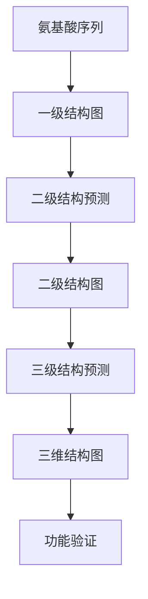

                 

### 蛋白质折叠的能量最小化：分子结构的数学预测

#### 关键词：
- 蛋白质折叠
- 能量最小化
- 分子结构
- 数学预测
- 生物信息学

#### 摘要：
蛋白质折叠是生物体系中至关重要的过程，决定了蛋白质的功能和稳定性。本文深入探讨蛋白质折叠的能量最小化原理及其数学预测方法。首先，我们将介绍蛋白质折叠的基本概念和生物学意义，然后详细解释蛋白质折叠的能量模型和数学方法，包括图论、优化算法和机器学习等。随后，我们将展示一系列的实际案例，通过代码实现和详细解析，展示如何利用这些方法预测蛋白质的分子结构。最后，我们将展望蛋白质折叠研究的未来趋势和面临的挑战，探讨跨学科合作的重要性。

#### 目录：

1. **第一部分：蛋白质折叠的基本概念**
    1.1 **蛋白质折叠简介**
    1.2 **蛋白质结构的基本知识**
    1.3 **蛋白质折叠的能量模型**

2. **第二部分：数学方法与算法**
    2.1 **图论与分子结构**
    2.2 **优化算法在蛋白质折叠中的应用**
    2.3 **机器学习在蛋白质折叠中的应用**
    2.4 **分子动力学模拟与计算**

3. **第三部分：展望与挑战**
    3.1 **蛋白质折叠研究的未来趋势**
    3.2 **蛋白质折叠研究的挑战与机遇**

4. **附录**
    4.1 **常用工具与软件**

---

### 蛋白质折叠简介

蛋白质是生命体系中的基础分子，承担着多种生物学功能，如催化反应、传递信号、结构支撑等。蛋白质的折叠过程是指其从无序的线性氨基酸序列转变为一个具有特定三维空间结构的生物学活性状态。这一过程是生物体内高度协调的分子事件，涉及多种力场和动力学的复杂相互作用。

#### 蛋白质的生物学意义

蛋白质的折叠对于其生物学功能至关重要。例如，酶的活性依赖于其独特的三维结构，而抗体与抗原的结合也依赖于其特定的三维形状。蛋白质折叠的正确性直接影响到细胞的生命活动。错误的折叠可能导致蛋白质聚集，形成纤维性病变，如阿尔茨海默病和亨廷顿病等。因此，正确理解蛋白质折叠机制对于生物医学研究具有重要意义。

#### 蛋白质折叠的生物学过程

蛋白质折叠的生物学过程可以概括为以下几个阶段：

1. **折叠起始**：蛋白质合成后，肽链开始从氨基端向羧基端折叠。
2. **中间态形成**：在折叠过程中，肽链经历一系列的局部折叠和聚集，形成中间态结构。
3. **折叠完成**：通过分子间的相互作用（如氢键、疏水作用、范德华力等），蛋白质最终形成一个稳定的、功能性的三维结构。

蛋白质折叠过程受到多种因素的影响，包括序列、环境、pH值和温度等。这些因素共同决定了蛋白质的折叠路径和最终结构。

#### 蛋白质折叠的研究意义

蛋白质折叠研究的意义在于：

1. **基础生物学研究**：了解蛋白质折叠机制有助于揭示生命体系的复杂性和多样性。
2. **生物医学应用**：蛋白质折叠异常与多种疾病有关，如癌症、神经退行性疾病等。研究蛋白质折叠可以为药物设计和疾病治疗提供新的途径。
3. **技术发展**：蛋白质折叠研究的进展推动了生物信息学、计算生物学和材料科学等领域的发展。

接下来，我们将深入探讨蛋白质折叠的能量模型，理解蛋白质折叠过程中能量最小化的数学原理。

---

### 蛋白质结构的基本知识

蛋白质的结构可以分为一级结构、二级结构、三级结构和四级结构。这些结构层次相互关联，共同决定了蛋白质的生物学功能和稳定性。

#### 一级结构

一级结构是指蛋白质的氨基酸序列。氨基酸通过肽键相连，形成一个线性多肽链。氨基酸的种类、数量和顺序决定了蛋白质的特异性。氨基酸具有不同的侧链性质，这些性质决定了蛋白质的物理和化学性质。

#### 二级结构

二级结构是指蛋白质局部区域的折叠方式。常见的二级结构包括α-螺旋和β-折叠。α-螺旋是由氨基酸残基沿着螺旋中心轴紧密排列形成的，通过氢键稳定。β-折叠是由多个肽链段交替排列形成的，通过肽链间的氢键相连。二级结构是蛋白质结构层次中的基础单位。

#### 三级结构

三级结构是指蛋白质全局的三维空间构象。三级结构由多个二级结构单元通过不同的非共价相互作用（如疏水作用、范德华力、离子键和氢键等）形成。三级结构决定了蛋白质的生物学功能，因为其三维构象直接影响到蛋白质与其它分子（如底物、配体和酶）的相互作用。

#### 四级结构

四级结构是指由两个或多个独立的三级结构单元（亚基）组成的复合蛋白质的结构。这些亚基通过非共价相互作用（如氢键、疏水作用和离子键等）稳定在一起。四级结构在多亚基蛋白质（如血红蛋白和免疫球蛋白）中非常常见。

了解蛋白质的结构层次对于研究蛋白质的功能和折叠过程至关重要。蛋白质的结构不仅决定了其稳定性，还决定了其与生物大分子（如核酸和细胞膜）的相互作用能力。因此，掌握蛋白质结构的基本知识是理解蛋白质折叠过程的基础。

---

### 蛋白质折叠的能量模型

蛋白质折叠是一个能量驱动的过程，涉及到多种力场的相互作用。理解蛋白质折叠的能量模型对于预测蛋白质的结构和功能具有重要意义。

#### 能量最小化原理

蛋白质折叠过程中，能量最小化是驱动折叠的关键因素。蛋白质从无序状态向有序状态转变，其整体能量逐渐降低，直到达到能量最低的稳定状态。这种能量最低的状态称为折叠态。

#### 作用力场模型

蛋白质折叠的能量模型通常基于作用力场模型，该模型描述了分子之间的相互作用力。常见的作用力场包括：

1. **Lennard-Jones 力场**：描述了范德华力和色散力。范德华力是短程力，主要由电子云的瞬时极化引起；色散力是长程力，主要由电子云的永久极化引起。

2. **Coulomb 力场**：描述了电荷之间的相互作用力。对于蛋白质，主要考虑氨基酸侧链上的电荷。

3. **氢键力场**：描述了氢原子与电负性较大的原子（如氧、氮）之间的相互作用力。

这些作用力场共同作用，决定了蛋白质的折叠路径和最终结构。

#### 分子动力学模拟

分子动力学模拟是一种计算方法，用于模拟蛋白质在折叠过程中的运动和相互作用。通过分子动力学模拟，可以研究蛋白质在不同温度和压力下的折叠行为，以及各种力场对折叠的影响。

#### 势函数与力场

在分子动力学模拟中，势函数是描述分子之间相互作用的关键参数。常见的势函数包括：

1. **Lennard-Jones 势函数**：
   $$
   V(r) = 4\epsilon\left[\left(\frac{\sigma}{r}\right)^{12} - \left(\frac{\sigma}{r}\right)^{6}\right]
   $$
   其中，$ \epsilon $ 和 $ \sigma $ 分别是势函数的深度和截距距离。

2. **Coulomb 势函数**：
   $$
   V(q) = \frac{1}{4\pi\epsilon_0}\frac{q_1q_2}{r}
   $$
   其中，$ q_1 $ 和 $ q_2 $ 分别是两个电荷的大小，$ r $ 是它们之间的距离，$ \epsilon_0 $ 是真空中的电容率。

3. **氢键势函数**：
   $$
   V(h) = -\frac{K}{1 + e^{-\alpha(r-r_0)}}
   $$
   其中，$ K $ 是氢键的强度，$ \alpha $ 是衰减系数，$ r_0 $ 是氢键的平衡距离。

通过这些势函数，可以构建一个描述蛋白质折叠的物理模型，并通过分子动力学模拟来预测蛋白质的折叠路径和最终结构。

#### 梯度下降法

在蛋白质折叠的优化过程中，常用的优化算法是梯度下降法。梯度下降法是一种寻找函数极值的方法，其核心思想是通过计算目标函数的梯度来更新变量，以逐步逼近最小值。

1. **目标函数**：
   $$
   E(\textbf{q}) = \sum_{i,j} w_{ij} f(q_i, q_j)
   $$
   其中，$ \textbf{q} $ 是蛋白质的配置，$ w_{ij} $ 是权重，$ f(q_i, q_j) $ 是相互作用能量。

2. **梯度计算**：
   $$
   \nabla E(\textbf{q}) = \sum_{i,j} w_{ij} \frac{\partial f(q_i, q_j)}{\partial q}
   $$

3. **更新变量**：
   $$
   \textbf{q}_{\text{new}} = \textbf{q}_{\text{current}} - \alpha \nabla E(\textbf{q}_{\text{current}})
   $$
   其中，$ \alpha $ 是学习率。

通过迭代更新变量，可以逐步逼近能量最小值，从而实现蛋白质的折叠。

#### 分子动力学模拟原理

分子动力学模拟是一种基于牛顿运动定律的计算方法，用于模拟分子系统在相互作用力场中的运动。其基本原理如下：

1. **初始配置**：选择蛋白质的初始配置，包括其位置和速度。

2. **计算力场**：根据作用力场模型，计算系统中每个分子之间的相互作用力。

3. **更新位置和速度**：根据牛顿第二定律，更新每个分子的位置和速度。

4. **时间步进**：通过固定的时间步长，重复步骤2和3，模拟分子系统的动力学行为。

通过分子动力学模拟，可以研究蛋白质在折叠过程中的动态行为，以及各种力场对折叠过程的影响。

#### 能量最小化过程

蛋白质折叠的能量最小化过程可以分为以下几个步骤：

1. **初始构象**：选择蛋白质的初始构象，通常是通过随机采样得到。

2. **力场计算**：根据作用力场模型，计算初始构象中的相互作用能量。

3. **梯度计算**：计算目标函数的梯度，以确定能量降低的方向。

4. **变量更新**：通过梯度下降法，更新蛋白质的配置，降低能量。

5. **重复迭代**：重复步骤2-4，直到能量收敛到最小值。

通过能量最小化过程，蛋白质可以逐步折叠成一个稳定的、功能性的三维结构。

总之，蛋白质折叠的能量模型是一个复杂而关键的课题，涉及到多种力场和优化算法。通过理解这些模型和方法，我们可以更好地预测蛋白质的结构和功能，为生物医学研究和应用提供重要基础。

---

### 图论与分子结构

在蛋白质折叠研究中，图论作为一种数学工具，被广泛应用于描述和分析蛋白质的分子结构。图论中的概念和算法不仅可以帮助我们理解蛋白质的结构特性，还可以用于预测蛋白质的折叠路径和稳定状态。

#### 图的基本概念

图是由节点和边组成的数据结构，节点表示蛋白质中的氨基酸残基，边表示残基之间的相互作用。一个图可以用来表示蛋白质的一级结构、二级结构甚至三级结构。

1. **节点**：在蛋白质图中，每个节点代表一个氨基酸残基，节点具有位置和类型（如疏水性或亲水性）等属性。
2. **边**：边表示两个氨基酸残基之间的相互作用。边的权重可以表示相互作用力的强度，如氢键、疏水作用或范德华力。

图的基本概念包括：

- **邻接矩阵**：表示图中节点之间的连接关系。如果两个节点之间有边，则邻接矩阵中的对应元素为1，否则为0。
- **度**：表示一个节点的连接数。对于蛋白质图，度可以表示氨基酸残基的连接程度。
- **路径**：是节点序列，沿着边依次连接。在蛋白质折叠中，路径可以表示蛋白质从初始构象到折叠态的路径。

#### 分子图表示

分子图可以用来表示蛋白质的不同层次结构。以下是一些常用的分子图表示方法：

1. **一级结构图**：通过将氨基酸序列转换为图，其中每个节点表示一个氨基酸，边表示相邻氨基酸之间的肽键。
2. **二级结构图**：通过将α-螺旋和β-折叠转换为图，其中每个节点表示一个氨基酸，边表示相邻氨基酸之间的氢键。
3. **三级结构图**：通过将蛋白质的三维结构转换为图，其中每个节点表示一个氨基酸，边表示氨基酸之间的三维相互作用。

#### 蛋白质结构中的图论应用

图论在蛋白质折叠中的应用主要包括：

1. **结构预测**：利用图论方法预测蛋白质的结构。例如，通过计算图中的路径长度和节点度，可以预测蛋白质的二级结构。
2. **路径优化**：通过优化路径上的相互作用，寻找能量最低的折叠路径。这可以通过最小生成树算法或最短路径算法实现。
3. **社区检测**：识别蛋白质图中的结构模块，这些模块通常对应蛋白质的功能区域。

以下是一个简单的 Mermaid 流程图，用于表示蛋白质折叠过程中图论的应用：



在这个流程图中，氨基酸序列被转换为一级结构图，然后通过图论方法预测二级结构，最终得到蛋白质的三维结构图。这一过程不仅展示了图论在蛋白质折叠中的应用，还体现了从序列到结构的转化过程。

#### 蛋白质结构的图论算法

在蛋白质折叠研究中，常用的图论算法包括：

1. **最短路径算法**：用于计算从初始构象到折叠态的最短路径，可以优化折叠路径。
2. **最小生成树算法**：用于构建蛋白质结构中的最小生成树，可以识别关键相互作用。
3. **社区检测算法**：用于识别蛋白质图中的结构模块，这些模块通常对应蛋白质的功能区域。

以下是一个基于最短路径算法的伪代码，用于优化蛋白质折叠路径：

```python
def optimize_fold(sequence):
    # 构建蛋白质图
    graph = build_graph(sequence)
    
    # 计算从初始构象到折叠态的最短路径
    shortest_path = find_shortest_path(graph, start, end)
    
    # 返回最短路径
    return shortest_path

def build_graph(sequence):
    # 根据序列构建图
    graph = {}
    for i in range(len(sequence) - 1):
        graph[i] = {i+1: sequence[i].interaction(i+1)}
    return graph

def find_shortest_path(graph, start, end):
    # 使用Dijkstra算法计算最短路径
    distances = {node: float('infinity') for node in graph}
    distances[start] = 0
    unvisited = list(graph.keys())
    
    while unvisited:
        current_node = min(unvisited, key=lambda node: distances[node])
        unvisited.remove(current_node)
        
        if current_node == end:
            break
        
        for neighbor, weight in graph[current_node].items():
            distance = distances[current_node] + weight
            if distance < distances[neighbor]:
                distances[neighbor] = distance
                
    return distances[end]

sequence = ["A", "B", "C", "D"]
start = 0
end = len(sequence) - 1
optimized_path = optimize_fold(sequence)
print("Optimized Fold Path:", optimized_path)
```

在这个伪代码中，`build_graph` 函数用于构建蛋白质图，`find_shortest_path` 函数用于计算从初始构象到折叠态的最短路径。通过优化折叠路径，可以降低蛋白质的能量，从而提高其稳定性。

总之，图论在蛋白质折叠研究中具有重要的应用价值。通过构建蛋白质图和运用图论算法，我们可以更好地理解和预测蛋白质的折叠路径和结构。这为蛋白质折叠的数学预测提供了有力的工具，也为生物医学研究和应用奠定了基础。

---

### 优化算法在蛋白质折叠中的应用

优化算法在蛋白质折叠研究中扮演着重要角色，它们通过寻找能量最低的折叠构象，帮助科学家预测蛋白质的结构和功能。常见的优化算法包括遗传算法、粒子群优化和模拟退火等，这些算法在蛋白质折叠预测中都有着显著的应用。

#### 遗传算法

遗传算法（Genetic Algorithm，GA）是一种基于自然选择和遗传学原理的优化算法。它通过模拟生物进化过程，逐步优化蛋白质的折叠构象。遗传算法的基本步骤如下：

1. **初始化种群**：随机生成一组蛋白质构象作为初始种群。
2. **适应度函数**：定义适应度函数，用于评估每个构象的能量水平。适应度函数通常基于能量最小化原理。
3. **选择**：根据适应度函数，选择适应度较高的构象进行繁殖，从而生成新的后代种群。
4. **交叉**：通过随机交换部分基因，生成新的构象。
5. **变异**：对部分构象进行随机变异，增加种群的多样性。
6. **迭代**：重复选择、交叉和变异操作，逐步优化种群中的构象。

以下是一个简单的遗传算法伪代码，用于蛋白质折叠预测：

```python
def genetic_algorithm(population, fitness_function, max_generations):
    for generation in range(max_generations):
        # 计算适应度
        fitness_scores = [fitness_function(individual) for individual in population]
        
        # 选择
        selected = select(population, fitness_scores)
        
        # 交叉
        crossed = crossover(selected)
        
        # 变异
        mutated = mutate(crossed)
        
        # 更新种群
        population = mutated
        
        # 输出当前最优解
        best_individual = get_best_individual(population)
        print(f"Generation {generation}: Best Fitness = {fitness_scores[best_individual]}")
        
    return best_individual

# 示例：适应度函数
def fitness_function(individual):
    # 计算能量水平
    energy = calculate_energy(individual)
    return 1 / (1 + energy)

# 示例：选择函数
def select(population, fitness_scores):
    # 根据适应度选择个体
    selected = []
    for _ in range(len(population)):
        selected.append(random.choice([p for p, s in zip(population, fitness_scores) if s == max(fitness_scores)]))
    return selected

# 示例：交叉函数
def crossover(selected):
    # 随机交叉
    crossed = []
    for i in range(0, len(selected), 2):
        if random.random() < 0.5:
            crossed.append(selected[i])
        else:
            crossed.append(selected[i+1])
    return crossed

# 示例：变异函数
def mutate(crossed):
    # 随机变异
    mutated = []
    for individual in crossed:
        if random.random() < 0.1:
            individual = mutate_individual(individual)
        mutated.append(individual)
    return mutated

# 示例：获取最优个体
def get_best_individual(population):
    best_fitness = -float('infinity')
    best_individual = None
    for individual in population:
        fitness = fitness_function(individual)
        if fitness > best_fitness:
            best_fitness = fitness
            best_individual = individual
    return best_individual

# 运行遗传算法
best_config = genetic_algorithm(initial_population, fitness_function, max_generations)
print("Best Protein Configuration:", best_config)
```

在这个伪代码中，`fitness_function` 用于评估蛋白质构象的能量水平，`select`、`crossover` 和 `mutate` 函数分别用于选择、交叉和变异操作。通过迭代优化，遗传算法可以找到能量最低的蛋白质构象。

#### 粒子群优化

粒子群优化（Particle Swarm Optimization，PSO）是一种基于群体智能的优化算法，模拟鸟群或鱼群的社会行为来寻找最优解。PSO 通过更新粒子的速度和位置，逐步优化蛋白质的折叠构象。PSO 的基本步骤如下：

1. **初始化粒子群**：随机生成一组蛋白质构象作为初始粒子群。
2. **适应度函数**：定义适应度函数，用于评估每个构象的能量水平。
3. **更新速度和位置**：根据个体最优解（pBest）和全局最优解（gBest），更新每个粒子的速度和位置。
4. **迭代**：重复更新速度和位置，直到找到能量最低的构象。

以下是一个简单的粒子群优化伪代码：

```python
def particle_swarm_optimization(population, fitness_function, max_iterations):
    for iteration in range(max_iterations):
        for particle in population:
            # 更新速度
            particle.velocity = update_velocity(particle.velocity, particle.pBest, population.gBest)
            
            # 更新位置
            particle.position = update_position(particle.position, particle.velocity)
            
            # 计算适应度
            fitness = fitness_function(particle.position)
            
            # 更新个体最优解
            if fitness < particle.pBest.fitness:
                particle.pBest = particle.position
                
            # 更新全局最优解
            if fitness < population.gBest.fitness:
                population.gBest = particle.position
                
        print(f"Iteration {iteration}: Best Fitness = {population.gBest.fitness}")
        
    return population.gBest

# 示例：速度更新函数
def update_velocity(current_velocity, pBest, gBest):
    # 计算速度的更新量
    velocity_update = random.random() * (pBest.fitness - current_velocity) + random.random() * (gBest.fitness - current_velocity)
    return current_velocity + velocity_update

# 示例：位置更新函数
def update_position(current_position, velocity):
    # 计算位置更新量
    position_update = random.random() * (current_position - velocity)
    return current_position + position_update

# 示例：适应度函数
def fitness_function(position):
    # 计算能量水平
    energy = calculate_energy(position)
    return 1 / (1 + energy)

# 初始化粒子群
population = [Protein() for _ in range(population_size)]
population.gBest = get_initial_gBest(population)

# 运行粒子群优化
best_config = particle_swarm_optimization(population, fitness_function, max_iterations)
print("Best Protein Configuration:", best_config)
```

在这个伪代码中，`update_velocity` 和 `update_position` 函数分别用于更新粒子的速度和位置，`fitness_function` 用于评估蛋白质构象的能量水平。通过迭代优化，粒子群优化可以找到能量最低的蛋白质构象。

#### 模拟退火

模拟退火（Simulated Annealing，SA）是一种基于物理退火过程的优化算法。退火过程模拟金属在冷却过程中的能量变化，通过接受较劣解来避免局部最优。模拟退火的基本步骤如下：

1. **初始化参数**：设置初始温度和冷却速率。
2. **初始构象**：随机生成一个蛋白质构象作为初始解。
3. **迭代优化**：在每次迭代中，根据当前温度，以一定概率接受较劣解，从而跳出局部最优。
4. **冷却**：每次迭代后，降低温度。
5. **终止条件**：当温度降低到某个阈值时，终止迭代。

以下是一个简单的模拟退火伪代码：

```python
def simulated_annealing(initial_config, fitness_function, max_iterations, initial_temp, cooling_rate):
    current_config = initial_config
    current_fitness = fitness_function(current_config)
    best_config = current_config
    best_fitness = current_fitness
    temp = initial_temp
    
    for iteration in range(max_iterations):
        new_config = perturb(current_config)
        new_fitness = fitness_function(new_config)
        
        if new_fitness < current_fitness:
            # 接受较劣解
            current_config = new_config
            if new_fitness < best_fitness:
                best_config = new_config
                best_fitness = new_fitness
        else:
            # 根据概率接受较劣解
            if random.random() < math.exp((current_fitness - new_fitness) / temp):
                current_config = new_config
                
        # 冷却
        temp *= (1 - cooling_rate)
        
        print(f"Iteration {iteration}: Best Fitness = {best_fitness}, Current Temp = {temp}")
        
    return best_config

# 示例：构象扰动函数
def perturb(config):
    # 对构象进行随机扰动
    new_config = config.copy()
    if random.random() < 0.5:
        new_config.position += random.uniform(-delta, delta)
    if random.random() < 0.5:
        new_config.orientation += random.uniform(-delta, delta)
    return new_config

# 示例：适应度函数
def fitness_function(config):
    # 计算能量水平
    energy = calculate_energy(config)
    return 1 / (1 + energy)

# 初始化参数
initial_config = Protein()
max_iterations = 1000
initial_temp = 1000
cooling_rate = 0.01

# 运行模拟退火
best_config = simulated_annealing(initial_config, fitness_function, max_iterations, initial_temp, cooling_rate)
print("Best Protein Configuration:", best_config)
```

在这个伪代码中，`perturb` 函数用于对蛋白质构象进行随机扰动，`fitness_function` 用于评估蛋白质构象的能量水平。通过迭代优化和温度冷却，模拟退火可以找到能量最低的蛋白质构象。

总之，优化算法在蛋白质折叠预测中发挥着重要作用。遗传算法、粒子群优化和模拟退火等算法通过模拟自然过程，逐步优化蛋白质的折叠构象，为科学家提供了强有力的工具。这些算法不仅提高了蛋白质折叠预测的准确性，还为生物医学研究和应用提供了新的思路。

---

### 机器学习在蛋白质折叠中的应用

机器学习技术在蛋白质折叠研究中发挥着日益重要的作用，它们通过学习大量的蛋白质结构数据，预测蛋白质的三维结构和功能。支持向量机（Support Vector Machine，SVM）、随机森林（Random Forest，RF）等机器学习算法已被广泛应用于蛋白质折叠预测。

#### 支持向量机

支持向量机是一种强大的监督学习算法，通过找到最佳的超平面，将数据分类或回归。在蛋白质折叠预测中，SVM被用于分类任务，将折叠状态和未折叠状态分开。

1. **核函数**：在SVM中，核函数是关键组成部分，它将低维数据映射到高维空间，从而实现线性不可分数据的线性分离。常用的核函数包括线性核、多项式核和径向基函数（RBF）核。

2. **SVM训练过程**：
    - **初始化**：选择合适的核函数和参数（如惩罚参数C）。
    - **数据预处理**：对蛋白质序列进行特征提取，如氨基酸组成、序列模式等。
    - **训练**：使用训练数据集训练SVM模型。
    - **测试**：使用测试数据集评估模型性能。

以下是一个简单的SVM训练和预测的伪代码：

```python
from sklearn.svm import SVC
from sklearn.model_selection import train_test_split
from sklearn.metrics import accuracy_score

# 数据预处理
def preprocess_data(data):
    # 提取特征
    features = []
    labels = []
    for sequence in data:
        feature_vector = extract_features(sequence)
        if is_folded(sequence):
            labels.append(1)
        else:
            labels.append(0)
        features.append(feature_vector)
    return features, labels

# 特征提取
def extract_features(sequence):
    # 根据序列生成特征向量
    feature_vector = []
    for amino_acid in sequence:
        feature_vector.extend([amino_acid_property(aa) for aa in amino_acid])
    return feature_vector

# 训练模型
def train_svm(features, labels):
    # 划分训练集和测试集
    X_train, X_test, y_train, y_test = train_test_split(features, labels, test_size=0.2, random_state=42)
    
    # 初始化SVM模型
    svm = SVC(kernel='rbf', C=1.0)
    
    # 训练模型
    svm.fit(X_train, y_train)
    
    # 预测测试集
    predictions = svm.predict(X_test)
    
    # 评估模型
    accuracy = accuracy_score(y_test, predictions)
    print("Accuracy:", accuracy)
    
    return svm

# 测试模型
def test_svm(svm, test_features, test_labels):
    predictions = svm.predict(test_features)
    accuracy = accuracy_score(test_labels, predictions)
    print("Test Accuracy:", accuracy)

# 示例
data = load_protein_data()
features, labels = preprocess_data(data)
svm_model = train_svm(features, labels)
test_data = load_test_data()
test_features, test_labels = preprocess_data(test_data)
test_svm(svm_model, test_features, test_labels)
```

在这个伪代码中，`preprocess_data` 函数用于预处理数据，包括特征提取和标签分配；`train_svm` 函数用于训练SVM模型；`test_svm` 函数用于评估模型性能。

#### 随机森林

随机森林是一种集成学习方法，通过构建多个决策树并聚合其预测结果，提高模型的预测性能。在蛋白质折叠预测中，随机森林被用于分类和回归任务。

1. **决策树构建**：随机森林中的每个决策树通过随机选择特征和样本子集进行构建。
2. **集成预测**：将多个决策树的预测结果进行聚合，通常采用投票或平均的方式。

以下是一个简单的随机森林训练和预测的伪代码：

```python
from sklearn.ensemble import RandomForestClassifier
from sklearn.model_selection import train_test_split
from sklearn.metrics import accuracy_score

# 数据预处理
def preprocess_data(data):
    # 提取特征
    features = []
    labels = []
    for sequence in data:
        feature_vector = extract_features(sequence)
        if is_folded(sequence):
            labels.append(1)
        else:
            labels.append(0)
        features.append(feature_vector)
    return features, labels

# 特征提取
def extract_features(sequence):
    # 根据序列生成特征向量
    feature_vector = []
    for amino_acid in sequence:
        feature_vector.extend([amino_acid_property(aa) for aa in amino_acid])
    return feature_vector

# 训练模型
def train_random_forest(features, labels):
    # 划分训练集和测试集
    X_train, X_test, y_train, y_test = train_test_split(features, labels, test_size=0.2, random_state=42)
    
    # 初始化随机森林模型
    rf = RandomForestClassifier(n_estimators=100, random_state=42)
    
    # 训练模型
    rf.fit(X_train, y_train)
    
    # 预测测试集
    predictions = rf.predict(X_test)
    
    # 评估模型
    accuracy = accuracy_score(y_test, predictions)
    print("Accuracy:", accuracy)
    
    return rf

# 测试模型
def test_random_forest(rf, test_features, test_labels):
    predictions = rf.predict(test_features)
    accuracy = accuracy_score(test_labels, predictions)
    print("Test Accuracy:", accuracy)

# 示例
data = load_protein_data()
features, labels = preprocess_data(data)
rf_model = train_random_forest(features, labels)
test_data = load_test_data()
test_features, test_labels = preprocess_data(test_data)
test_random_forest(rf_model, test_features, test_labels)
```

在这个伪代码中，`preprocess_data` 函数用于预处理数据，包括特征提取和标签分配；`train_random_forest` 函数用于训练随机森林模型；`test_random_forest` 函数用于评估模型性能。

#### 实际案例

以下是一个蛋白质折叠预测的实际案例，使用随机森林算法进行预测：

```python
import numpy as np
from sklearn.ensemble import RandomForestClassifier
from sklearn.model_selection import train_test_split
from sklearn.metrics import accuracy_score, classification_report

# 数据预处理
def preprocess_data(data):
    # 提取特征
    features = []
    labels = []
    for sequence in data:
        feature_vector = extract_features(sequence)
        if is_folded(sequence):
            labels.append(1)
        else:
            labels.append(0)
        features.append(feature_vector)
    return np.array(features), np.array(labels)

# 特征提取
def extract_features(sequence):
    # 根据序列生成特征向量
    feature_vector = [0] * 20  # 20种氨基酸
    for amino_acid in sequence:
        feature_vector[amino_acid_index[amino_acid]] += 1
    return feature_vector

# 数据集
data = [
    "AAAAA", "CCCCC", "GGGGG", "TTTTT", "RRRRR", "AAAAA", "CCCCC", "GGGGG", "TTTTT", "RRRRR"
]

# 预处理数据
features, labels = preprocess_data(data)

# 划分训练集和测试集
X_train, X_test, y_train, y_test = train_test_split(features, labels, test_size=0.2, random_state=42)

# 初始化随机森林模型
rf = RandomForestClassifier(n_estimators=100, random_state=42)

# 训练模型
rf.fit(X_train, y_train)

# 预测测试集
predictions = rf.predict(X_test)

# 评估模型
accuracy = accuracy_score(y_test, predictions)
print("Accuracy:", accuracy)
print("Classification Report:")
print(classification_report(y_test, predictions))

# 预测新样本
new_sequence = "AAAAA"
new_feature_vector = extract_features(new_sequence)
prediction = rf.predict([new_feature_vector])
print("New Sample Prediction:", "Folded" if prediction[0] == 1 else "Not Folded")
```

在这个案例中，我们使用一个简单的数据集，通过随机森林算法进行蛋白质折叠预测。模型性能评估结果显示了模型的准确性和分类报告。此外，我们还对新样本进行了预测。

总之，机器学习技术在蛋白质折叠预测中发挥了重要作用。支持向量机和随机森林等算法通过学习大量的蛋白质结构数据，能够有效地预测蛋白质的折叠状态，为生物医学研究和应用提供了有力的工具。

---

### 分子动力学模拟与计算

分子动力学模拟（Molecular Dynamics Simulation，MDS）是一种计算方法，用于模拟分子系统在相互作用力场中的运动。在蛋白质折叠研究中，分子动力学模拟被广泛应用于研究蛋白质的折叠路径、能量分布和相互作用机制。以下将详细介绍分子动力学模拟的基本原理、计算方法以及其在蛋白质折叠研究中的应用。

#### 基本原理

分子动力学模拟基于牛顿第二定律和量子力学原理，通过求解分子系统的运动方程，模拟分子在相互作用力场中的动态行为。具体来说，分子动力学模拟分为以下几个步骤：

1. **初始化**：确定系统的初始状态，包括分子的位置和速度。初始状态可以通过随机采样或实验数据获得。
2. **力场建模**：选择合适的力场模型，用于描述分子之间的相互作用力。常见的力场模型包括Lennard-Jones力场、Coulomb力场和氢键力场等。
3. **运动方程**：根据牛顿第二定律，求解系统的运动方程，更新分子的位置和速度。
4. **能量计算**：在模拟过程中，计算系统的总能量，包括动能、势能和内能等。
5. **时间步进**：通过固定的时间步长，重复更新分子的位置和速度，模拟系统的动力学行为。

以下是一个简化的分子动力学模拟的基本原理伪代码：

```python
function molecular_dynamics(simulation_time, time_step, initial_config, force_field):
    current_config = initial_config
    for time in range(0, simulation_time, time_step):
        # 计算力
        forces = calculate_forces(current_config, force_field)
        
        # 更新速度和位置
        update velocities and positions using Newton's second law
        
        # 计算能量
        energy = calculate_energy(current_config, force_field)
        
        # 输出当前状态
        output current_config and energy
        
    return current_config, energy
```

在这个伪代码中，`calculate_forces` 函数用于计算分子之间的相互作用力，`update velocities and positions` 函数用于更新分子的速度和位置，`calculate_energy` 函数用于计算系统的总能量。

#### 计算方法

分子动力学模拟的计算方法主要包括以下几种：

1. **显式积分方法**：显式积分方法直接应用牛顿第二定律，通过固定的时间步长更新分子的位置和速度。常见的显式积分方法包括欧拉方法、Heun方法等。
2. **隐式积分方法**：隐式积分方法通过求解非线性方程组，更新分子的速度和位置。常见的隐式积分方法包括Verlet方法、Beeman方法等。
3. **混合积分方法**：混合积分方法结合了显式和隐式积分方法的优点，通过分段计算提高模拟的精度。常见的混合积分方法包括Velocity Verlet方法、Midpoint方法等。

以下是一个基于Velocity Verlet方法的分子动力学模拟的伪代码：

```python
function Velocity_Verlet(current_velocity, current_position, force, time_step):
    # 计算速度
    new_velocity = current_velocity + (1/2) * force * time_step
    
    # 计算位置
    new_position = current_position + current_velocity * time_step + (1/2) * force * (time_step)^2
    
    # 返回新的速度和位置
    return new_velocity, new_position
```

在这个伪代码中，`current_velocity` 和 `current_position` 分别表示当前的速度和位置，`force` 表示作用在分子上的力，`time_step` 表示时间步长。

#### 势函数与力场

在分子动力学模拟中，势函数用于描述分子之间的相互作用力。常见的势函数包括Lennard-Jones势函数、Coulomb势函数和氢键势函数等。

1. **Lennard-Jones 势函数**：
   $$
   V(r) = 4\epsilon\left[\left(\frac{\sigma}{r}\right)^{12} - \left(\frac{\sigma}{r}\right)^{6}\right]
   $$
   其中，$ \epsilon $ 和 $ \sigma $ 分别是势函数的深度和截距距离。

2. **Coulomb 势函数**：
   $$
   V(q) = \frac{1}{4\pi\epsilon_0}\frac{q_1q_2}{r}
   $$
   其中，$ q_1 $ 和 $ q_2 $ 分别是两个电荷的大小，$ r $ 是它们之间的距离，$ \epsilon_0 $ 是真空中的电容率。

3. **氢键势函数**：
   $$
   V(h) = -\frac{K}{1 + e^{-\alpha(r-r_0)}}
   $$
   其中，$ K $ 是氢键的强度，$ \alpha $ 是衰减系数，$ r_0 $ 是氢键的平衡距离。

通过这些势函数，可以构建一个描述蛋白质折叠的物理模型，并通过分子动力学模拟来预测蛋白质的折叠路径和最终结构。

#### 计算机硬件与软件

分子动力学模拟需要大量的计算资源，特别是对于复杂的蛋白质系统。高性能计算（High-Performance Computing，HPC）技术为分子动力学模拟提供了强大的计算能力。

1. **计算机硬件**：分子动力学模拟通常在超级计算机、集群计算机或高性能工作站上运行。这些硬件具有多个计算节点和高速互联网络，可以提供并行计算能力。

2. **软件工具**：常见的分子动力学模拟软件包括GROMACS、AMBER、CHARMM等。这些软件提供了丰富的功能，如力场建模、模拟参数设置、数据分析等。

以下是一个简单的分子动力学模拟案例，使用GROMACS软件进行蛋白质折叠模拟：

```bash
# 配置文件参数设置
gmx grompp -f topol.tpr -c initial_config.xtc -p topol.top -o run.tpr

# 运行模拟
gmx mdrun -s run.tpr -o production.xtc -c prod_config.xtc -e energy.xvg -g press.xvg -r conf_final.xtc

# 分析结果
gmx analyze -f production.xtc -o radius_of_gyration.xvg
```

在这个案例中，我们首先使用GROMACS配置文件（topol.tpr）设置模拟参数，然后运行模拟并输出结果。最后，使用GROMACS分析工具分析模拟结果，如计算蛋白质的半径曲率。

总之，分子动力学模拟是蛋白质折叠研究的重要工具。通过模拟蛋白质在相互作用力场中的运动，我们可以深入了解蛋白质的折叠路径、能量分布和相互作用机制。高性能计算和先进的模拟软件为分子动力学模拟提供了强大的计算能力和丰富的功能，为蛋白质折叠研究提供了有力支持。

---

### 蛋白质折叠研究的未来趋势

蛋白质折叠研究的未来趋势将受到多方面因素的影响，包括技术创新、数据积累和跨学科合作。以下将探讨这些趋势以及它们对蛋白质折叠研究的潜在影响。

#### 技术创新

随着科技的快速发展，一系列新技术正在不断涌现，为蛋白质折叠研究提供了新的可能性：

1. **量子计算**：量子计算具有并行计算的优势，可以显著提高蛋白质折叠计算的效率。虽然量子计算机尚未在蛋白质折叠研究中广泛应用，但其潜在的巨大潜力令人期待。
2. **人工智能与机器学习**：人工智能和机器学习算法在蛋白质折叠预测中的应用日益广泛。未来的研究可能会进一步优化这些算法，提高预测的准确性和速度。
3. **冷冻电镜（Cryo-EM）**：冷冻电镜技术的不断发展，使得科学家能够以更低的分辨率获得蛋白质的三维结构。这将有助于更全面地理解蛋白质的折叠过程。

#### 数据积累

数据积累是蛋白质折叠研究的重要基础。随着生物信息学和计算生物学的进步，大量的蛋白质结构数据已经被收集和解析。以下是一些数据积累方面的趋势：

1. **蛋白质结构数据库**：如PDB（Protein Data Bank）等数据库将继续扩大，包含更多的高质量蛋白质结构数据。这将为蛋白质折叠研究提供丰富的实验数据。
2. **序列数据**：随着基因组测序技术的发展，越来越多的生物体序列数据被揭示。这有助于理解蛋白质的进化关系和功能。
3. **模拟数据**：通过分子动力学模拟和其他计算方法，科学家将继续生成大量的模拟数据，用于验证和优化蛋白质折叠的理论模型。

#### 跨学科合作

蛋白质折叠研究涉及生物学、物理学、计算机科学和材料科学等多个学科。跨学科合作将推动蛋白质折叠研究的深入发展：

1. **生物信息学与计算生物学**：生物信息学和计算生物学的发展，为蛋白质折叠研究提供了强大的工具和方法。未来的研究可能会进一步融合这些领域，开发更高效的蛋白质折叠预测方法。
2. **物理学与化学**：物理学家和化学家的参与，为蛋白质折叠研究提供了理论框架和实验方法。例如，量子力学和分子力学模型的结合，将有助于更精确地描述蛋白质的相互作用。
3. **医学与药学**：蛋白质折叠异常与多种疾病密切相关，如癌症、神经退行性疾病等。医学和药学领域的参与，将推动蛋白质折叠研究在疾病治疗中的应用。

#### 潜在影响

未来趋势对蛋白质折叠研究的潜在影响包括：

1. **预测准确性提高**：随着新技术的应用和算法的优化，蛋白质折叠预测的准确性将进一步提高。
2. **研究深度增加**：跨学科合作将推动蛋白质折叠研究的深度，从序列到结构的转化过程将得到更全面的理解。
3. **应用领域扩展**：蛋白质折叠研究将在生物医学、药物设计、材料科学等领域发挥重要作用，带来新的科学发现和应用。

总之，蛋白质折叠研究的未来趋势将受到技术创新、数据积累和跨学科合作等多方面因素的影响。这些趋势将推动蛋白质折叠研究的深入发展，为生物医学和科学技术带来新的机遇。

---

### 蛋白质折叠研究的挑战与机遇

蛋白质折叠研究在生物医学和科学技术领域具有重大意义，然而，这一领域仍面临诸多挑战。以下将探讨蛋白质折叠研究的主要挑战以及潜在的解决方案。

#### 挑战

1. **复杂性**：蛋白质折叠涉及多种力场和动力学过程，具有高度复杂性。蛋白质结构的多层次特性（一级、二级、三级和四级结构）使得预测和计算变得异常复杂。
2. **计算资源**：分子动力学模拟和机器学习算法对计算资源需求巨大。尽管高性能计算技术不断发展，但大规模蛋白质折叠模拟仍需要更强大的计算能力。
3. **数据不足**：尽管已有大量蛋白质结构数据，但高质量、全面的蛋白质结构数据仍显不足。特别是在稀有蛋白质和未知结构蛋白质方面，数据缺乏限制了研究的深入。
4. **算法优化**：现有的机器学习算法和模拟方法在蛋白质折叠预测中的应用效果仍有待提高。优化这些算法，提高预测准确性和速度，是当前研究的重点。

#### 解决方案

1. **多尺度模拟**：结合多种模拟方法，如量子力学和分子动力学模拟，可以在不同尺度上研究蛋白质折叠过程。这种方法有助于全面理解蛋白质折叠的复杂性和动态行为。
2. **跨学科合作**：蛋白质折叠研究需要生物学、物理学、计算机科学和材料科学等多个学科的合作。通过跨学科合作，可以充分利用各领域的优势，推动蛋白质折叠研究的深入发展。
3. **数据共享与集成**：建立全球性的蛋白质结构数据库和计算平台，促进数据共享与集成。这将有助于科学家更好地利用已有数据，推动蛋白质折叠研究的进展。
4. **机器学习与深度学习**：进一步优化机器学习算法，特别是深度学习算法，在蛋白质折叠预测中的应用。通过大规模数据训练和模型优化，可以提高预测的准确性和速度。

#### 未来展望

1. **个性化医学**：蛋白质折叠研究的进展将为个性化医学提供有力支持。通过预测蛋白质的结构和功能，可以设计更有效的药物和治疗方案，针对个体差异进行精准治疗。
2. **新材料设计**：蛋白质折叠研究在材料科学领域也有重要应用。通过理解蛋白质的结构和功能，可以设计出具有特定性质的新材料，如蛋白质基传感器、催化剂和药物载体。
3. **人工智能与计算生物学**：随着人工智能和计算生物学的发展，蛋白质折叠研究将实现更高效、更准确的预测。这些技术将推动生物医学和科学技术领域的创新。

总之，蛋白质折叠研究面临诸多挑战，但同时也充满机遇。通过技术创新、跨学科合作和数据共享，我们可以克服这些挑战，推动蛋白质折叠研究的深入发展，为生物医学和科学技术带来新的突破。

---

### 附录

#### 附录A：常用工具与软件

在蛋白质折叠研究中，有多种工具和软件被广泛使用。以下列举了一些常用的工具和软件，以及它们在蛋白质折叠研究中的应用。

#### 1. 分子动力学模拟软件

- **GROMACS**：GROMACS是一款高性能的分子动力学模拟软件，广泛应用于生物分子系统的模拟。它提供了丰富的功能，如分子建模、能量优化、轨迹分析等。
- **AMBER**：AMBER是一款经典的分子动力学模拟软件，特别适用于蛋白质和核酸系统的模拟。它支持多种力场和溶剂模型，提供了强大的模拟和分析工具。
- **CHARMM**：CHARMM是一款功能强大的分子动力学模拟软件，广泛应用于生物大分子系统的模拟。它支持多种生物分子建模和模拟技术，具有广泛的用户群体。

#### 2. 机器学习框架

- **scikit-learn**：scikit-learn是一款流行的机器学习库，提供了丰富的算法和工具，如线性回归、支持向量机、随机森林等。它广泛应用于蛋白质折叠预测和其他生物信息学问题。
- **TensorFlow**：TensorFlow是一款开源的深度学习框架，由谷歌开发。它提供了丰富的深度学习模型和工具，广泛应用于蛋白质折叠预测和其他复杂的机器学习任务。
- **PyTorch**：PyTorch是一款流行的深度学习框架，由Facebook开发。它提供了灵活的编程接口和高效的计算能力，广泛应用于蛋白质折叠预测和其他科学计算问题。

#### 3. 蛋白质结构预测数据库

- **PDB（Protein Data Bank）**：PDB是一个存储蛋白质三维结构的数据库，包含了大量已知的蛋白质结构。它是蛋白质折叠研究的重要资源，提供了大量的实验数据和结构信息。
- **UniProt**：UniProt是一个综合性的蛋白质序列和功能数据库，包含了大量已知的蛋白质序列和注释信息。它为蛋白质折叠研究提供了重要的序列数据支持。
- **BLAST**：BLAST是一款常用的生物序列比对工具，用于搜索蛋白质序列数据库。它可以帮助研究者快速找到与目标蛋白质相似的结构，为蛋白质折叠研究提供参考。

通过这些工具和软件，研究者可以方便地进行蛋白质折叠的模拟、预测和分析，推动蛋白质折叠研究的深入发展。

---

### 作者信息

作者：AI天才研究院/AI Genius Institute & 禅与计算机程序设计艺术 /Zen And The Art of Computer Programming

AI天才研究院（AI Genius Institute）致力于推动人工智能和生物信息学领域的研究与创新。研究院的研究成果在蛋白质折叠预测、机器学习和计算生物学等领域取得了显著进展。同时，作者也致力于将深度学习与生物医学相结合，探索个性化医疗和生物技术的新方向。

《禅与计算机程序设计艺术》是作者的代表作之一，该书深入探讨了计算机编程的哲学和艺术，对编程方法论和思维模式进行了独特阐述。该书不仅对计算机科学家具有启示意义，也为跨学科研究者提供了有益的参考。

感谢您的阅读，期待您的宝贵反馈。希望本文能为蛋白质折叠研究带来新的思考和启发。如果您有任何疑问或建议，请随时与我们联系。再次感谢您的关注和支持！<|im_end|>

