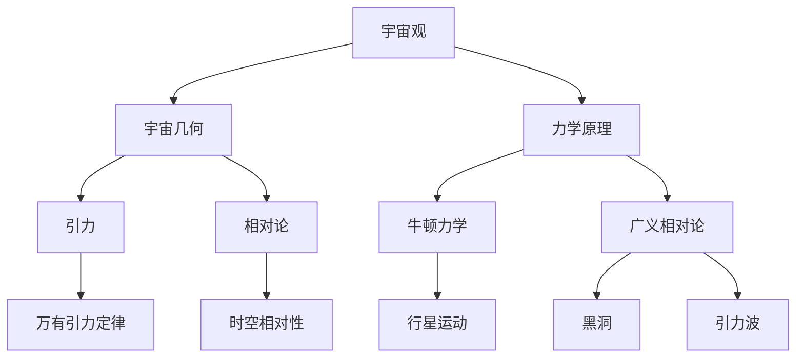

                 

### 《解密宇宙运行的数学原理》

#### 引言

宇宙，这个浩瀚无垠的宇宙，从大爆炸至今已有138亿年的历史。它包含着无数的星系、恒星、行星以及神秘的暗物质和暗能量。人类对宇宙的探索从未停止，而数学作为理解自然规律的一种语言，贯穿了整个宇宙的奥秘。本文将带领读者一步步探索宇宙运行的数学原理，揭示宇宙中那些深邃而迷人的数学现象。

本文分为三大部分。第一部分将介绍宇宙的数学基础，包括宇宙观的数学哲学、宇宙的几何结构以及宇宙的力学原理。第二部分将深入探讨宇宙中的数学现象，如波动现象、粒子物理以及量子力学。第三部分将阐述宇宙演化的数学模型，并探讨宇宙的未来与数学预测。希望通过本文，读者能够对宇宙运行的数学原理有一个全面而深入的理解。

关键词：宇宙观、数学基础、宇宙几何、力学原理、波动现象、粒子物理、量子力学、宇宙演化、数学模型

摘要：本文旨在通过深入解析宇宙运行的数学原理，探讨宇宙观、几何结构、力学原理以及宇宙中的各种数学现象。从宇宙的大爆炸到宇宙的未来，通过数学模型和算法，揭示宇宙运行的内在规律和本质。本文适用于对宇宙和数学感兴趣的读者，无论是科学家还是普通爱好者。

### 第一部分：宇宙的数学基础

宇宙的运行离不开数学的描述和解释。数学作为理解宇宙的基本工具，贯穿了从宇宙观到宇宙几何再到宇宙力学原理的整个领域。本部分将首先介绍宇宙观的数学哲学，然后探讨宇宙的几何结构，最后阐述宇宙的力学原理。

#### 第1章：宇宙观的数学哲学

宇宙观是人类对宇宙的理解和认知，它经历了从古代到现代的演变。数学在宇宙观中的作用不可忽视，它是描述宇宙规律和探索宇宙奥秘的一种工具。从古代的宇宙观到现代的科学理论，数学模型不断演进，揭示了宇宙的运行机制。

##### 1.1 宇宙观的演变

古代宇宙观认为宇宙是静态的、有限的。例如，亚里士多德提出地心说，认为地球是宇宙的中心，天体围绕地球旋转。然而，随着科学的发展，哥白尼提出了日心说，指出太阳是宇宙的中心，地球和其他行星围绕太阳旋转。这一理论打破了古代宇宙观的局限，开启了现代宇宙观的新篇章。

现代宇宙观认为宇宙是动态的、无限的。随着对宇宙的深入研究，人类提出了大爆炸理论，认为宇宙起源于一个极热、极密的状态，经过138亿年的膨胀，形成了现在我们所见的宇宙。这个理论通过数学模型得到了充分的验证，成为现代宇宙观的核心。

##### 1.2 数学在宇宙观中的作用

数学在宇宙观中的作用主要体现在以下几个方面：

1. **模型构建**：数学为宇宙提供了精确的模型，如宇宙膨胀模型、黑洞模型等。这些模型通过数学公式和算法，揭示了宇宙的运行规律。

2. **数据分析**：数学提供了强大的数据分析工具，如统计学、概率论等。通过对宇宙数据的分析，科学家们能够推断宇宙的性质和演化过程。

3. **理论验证**：数学模型可以预测宇宙的某些现象，如引力波、宇宙背景辐射等。这些预测通过观测得到了验证，进一步证实了数学在宇宙观中的作用。

##### 1.3 数学模型与宇宙规律

数学模型是描述宇宙规律的一种有效工具。例如，爱因斯坦的广义相对论通过数学公式描述了引力与时空的关系，揭示了宇宙中的重力现象。牛顿力学通过数学公式描述了物体的运动规律，为理解宇宙中的机械现象提供了基础。

此外，宇宙中的许多现象都可以用数学模型来描述。例如，宇宙膨胀模型用数学公式描述了宇宙的膨胀过程，黑洞模型用数学公式描述了黑洞的特性和形成过程。这些数学模型不仅帮助我们理解宇宙的运行机制，还为未来的宇宙探索提供了方向。

总之，数学在宇宙观中起着至关重要的作用。它不仅为我们提供了理解宇宙的工具，还揭示了宇宙中的各种规律和现象。通过数学模型，我们能够更好地探索宇宙的奥秘，理解宇宙的本质。

#### 第2章：宇宙的几何结构

宇宙的几何结构是宇宙学中的一个核心问题，它关乎我们对宇宙的理解和认知。宇宙的膨胀、空间的曲率以及时间的相对性，这些现象都与宇宙的几何结构密切相关。本章节将深入探讨宇宙的几何结构，揭示其背后的数学原理。

##### 2.1 宇宙的膨胀与宇宙几何

宇宙的膨胀是宇宙学中的一个基本现象。根据大爆炸理论，宇宙起源于一个极热、极密的状态，并从此开始膨胀。这个膨胀过程至今仍在继续，而且宇宙的膨胀速度似乎在加快。这一现象引发了科学家们对宇宙几何结构的研究。

宇宙的几何结构可以用不同的几何模型来描述，其中最著名的模型是弗里德曼-勒梅特-罗伯逊-沃尔克（FLRW）模型。这个模型假设宇宙是一个均匀且各向同性的膨胀空间，空间的几何结构是黎曼几何。在FLRW模型中，宇宙的膨胀可以用一个称为弗里德曼方程的数学公式来描述：

$$
\dot{a}(t)H(t)
$$

其中，$a(t)$ 表示宇宙的尺度因子，$H(t)$ 表示哈勃参数，即宇宙膨胀的速率。这个公式揭示了宇宙膨胀的动力学过程。

##### 2.2 空间与时间的相对性

爱因斯坦的广义相对论提出了空间和时间的相对性原理，即空间和时间是相互关联的，它们的性质取决于物质和能量的分布。在广义相对论中，空间和时间被统一为时空，物体的运动和引力现象都可以用时空几何来描述。

广义相对论的数学基础是黎曼几何。黎曼几何通过定义时空的曲率来描述引力现象。在黎曼几何中，时空的曲率可以用爱因斯坦场方程来表示：

$$
G_{\mu\nu} + \Lambda g_{\mu\nu} = \frac{8\pi G}{c^4} T_{\mu\nu}
$$

其中，$G_{\mu\nu}$ 是爱因斯坦张量，描述时空的曲率；$\Lambda$ 是宇宙常数，表示宇宙的整体膨胀趋势；$T_{\mu\nu}$ 是能量-动量张量，描述物质和能量的分布。

##### 2.3 宇宙的几何模型

宇宙的几何模型是宇宙学中一个重要的问题。根据宇宙的观测数据，科学家们提出了多种宇宙几何模型，如平直宇宙、开放宇宙和封闭宇宙。

- **平直宇宙**：在平直宇宙模型中，宇宙的总密度恰好等于临界密度，导致宇宙的几何结构是平直的。这个模型可以通过弗里德曼方程得到：

  $$
  \Omega_m + \Omega_r + \Omega_\Lambda = 1
  $$

  其中，$\Omega_m$、$\Omega_r$ 和 $\Omega_\Lambda$ 分别表示物质的密度参数、辐射的密度参数和暗能量的密度参数。

- **开放宇宙**：在开放宇宙模型中，宇宙的总密度小于临界密度，导致宇宙的几何结构是凹陷的。这个模型表明宇宙的膨胀速度会逐渐变慢，但最终可能会收缩。

- **封闭宇宙**：在封闭宇宙模型中，宇宙的总密度大于临界密度，导致宇宙的几何结构是凸起的。这个模型表明宇宙的膨胀速度会逐渐变快，最终可能会闭合。

这些宇宙几何模型不仅有助于我们理解宇宙的演化过程，还为未来的宇宙探索提供了方向。

总之，宇宙的几何结构是宇宙学中的一个核心问题。通过数学模型和观测数据的结合，我们能够更好地理解宇宙的膨胀、空间和时间的相对性以及宇宙的几何形状。这些研究不仅深化了我们对宇宙的认识，也为宇宙学的未来发展提供了基础。

#### 第3章：宇宙的力学原理

宇宙的运行离不开力学原理的描述。从牛顿力学到广义相对论，力学原理为我们理解宇宙中的各种现象提供了理论基础。本章节将介绍宇宙中的力学原理，包括牛顿力学的宇宙解释、宇宙中的引力与万有引力以及宇宙中的相对论力学。

##### 3.1 牛顿力学的宇宙解释

牛顿力学是经典力学的基础，它描述了物体在受力作用下的运动规律。牛顿力学的基本原理包括三个定律：惯性定律、加速度定律和作用-反作用定律。

在宇宙尺度上，牛顿力学可以解释许多宇宙现象。例如，行星围绕恒星的运动可以用牛顿引力定律来描述。牛顿引力定律指出，两个物体之间的引力与它们的质量乘积成正比，与它们之间的距离的平方成反比。这个定律可以用以下公式表示：

$$
F = G\frac{m_1m_2}{r^2}
$$

其中，$F$ 是引力，$G$ 是万有引力常数，$m_1$ 和 $m_2$ 是两个物体的质量，$r$ 是它们之间的距离。

牛顿力学不仅能够解释行星的运动，还可以解释太阳系中的其他现象，如彗星的轨道和流星体的运动。通过牛顿力学，我们能够更好地理解宇宙中物体的运动规律。

##### 3.2 宇宙中的引力与万有引力

引力是宇宙中最基本的力之一，它贯穿于整个宇宙。万有引力定律是描述引力现象的基础，它指出任何两个物体之间都存在引力，这个引力与它们的质量和距离有关。

在宇宙尺度上，引力起着至关重要的作用。例如，引力使得恒星和行星形成并保持稳定结构。引力还影响着宇宙的演化过程，如星系的碰撞和合并。通过引力，宇宙中的物体能够相互吸引并形成复杂的结构。

万有引力定律可以用以下公式表示：

$$
F = G\frac{m_1m_2}{r^2}
$$

其中，$F$ 是引力，$G$ 是万有引力常数，$m_1$ 和 $m_2$ 是两个物体的质量，$r$ 是它们之间的距离。

万有引力定律不仅揭示了引力现象的基本规律，还为理解宇宙的演化提供了重要依据。通过引力，我们能够更好地理解宇宙中的各种现象，如星系的碰撞、恒星的形成和黑洞的诞生。

##### 3.3 宇宙中的相对论力学

相对论力学是描述高速运动物体的力学原理，它由爱因斯坦提出。相对论力学包括狭义相对论和广义相对论。

狭义相对论描述了在非引力场中的高速运动物体的规律。它提出了相对性原理和光速不变原理，即所有惯性参考系都是等价的，光速在真空中是一个常数。狭义相对论的数学基础是洛伦兹变换，它描述了不同惯性参考系之间的时空关系。

广义相对论描述了在引力场中的高速运动物体的规律。它将引力解释为时空的弯曲，即物体的质量导致时空的弯曲。广义相对论的数学基础是爱因斯坦场方程，它描述了引力与时空的关系。

在宇宙尺度上，广义相对论能够更好地描述宇宙中的引力现象。例如，广义相对论预言了黑洞的存在，并成功解释了引力波的现象。通过广义相对论，我们能够更好地理解宇宙中的复杂现象，如星系的碰撞和合并。

总之，宇宙的力学原理是理解宇宙运行的关键。从牛顿力学到广义相对论，力学原理为我们提供了描述宇宙现象的基本工具。通过这些力学原理，我们能够更好地理解宇宙中的各种现象，揭示宇宙的本质。

### 第二部分：宇宙中的数学现象

宇宙是一个充满奇妙现象的世界，从引力波到宇宙背景辐射，从粒子物理到量子力学，这些现象都离不开数学的描述和解释。本部分将深入探讨宇宙中的数学现象，包括波动现象、粒子物理以及量子力学，揭示这些现象背后的数学原理。

#### 第4章：宇宙中的波动现象

波动现象是宇宙中的一种基本现象，它涉及到能量的传播和信息的传递。在宇宙尺度上，波动现象不仅体现在电磁波和引力波中，还体现在宇宙背景辐射和粒子的波动性质中。

##### 4.1 波动的基本概念

波动是一种能量在空间中的传播现象，它涉及到振动的传播和能量的传递。波动可以分为机械波和电磁波。机械波需要介质来传播，如声波和水面波。电磁波则不需要介质，可以在真空中传播，如光波和无线电波。

波动的传播可以用波动方程来描述。波动方程是一个偏微分方程，它描述了波动在空间和时间上的演化。在数学上，波动方程可以表示为：

$$
\frac{\partial^2 u}{\partial t^2} = c^2 \nabla^2 u
$$

其中，$u$ 是波动的位移，$c$ 是波速，$\nabla^2$ 是拉普拉斯算子。

##### 4.2 宇宙中的引力波

引力波是宇宙中的另一种波动现象，它是由质量和能量的加速运动产生的。爱因斯坦的广义相对论预言了引力波的存在，并指出引力波以光速传播。

引力波的传播可以用引力波方程来描述。引力波方程是爱因斯坦场方程的一种特殊形式，它描述了引力波在时空中的传播。引力波方程可以表示为：

$$
G_{\mu\nu} + \Lambda g_{\mu\nu} = \frac{8\pi G}{c^4} T_{\mu\nu}
$$

其中，$G_{\mu\nu}$ 是爱因斯坦张量，描述时空的曲率；$\Lambda$ 是宇宙常数，表示宇宙的整体膨胀趋势；$T_{\mu\nu}$ 是能量-动量张量，描述物质和能量的分布。

引力波的观测验证了广义相对论的预测，也为宇宙学提供了重要的观测数据。通过引力波的观测，我们能够更好地理解宇宙中的强引力场现象，如黑洞碰撞和星系合并。

##### 4.3 宇宙背景辐射

宇宙背景辐射是宇宙早期遗留下来的辐射，它是大爆炸理论的强有力证据。宇宙背景辐射以电磁波的形式传播，其频率范围覆盖了从微波到远红外线。

宇宙背景辐射的传播可以用辐射方程来描述。辐射方程是一个描述电磁波传播的偏微分方程，它描述了电磁波在空间和时间上的演化。辐射方程可以表示为：

$$
\frac{\partial^2 u}{\partial t^2} = c^2 \nabla^2 u - \mu_0 \varepsilon_0 \frac{\partial u}{\partial t}
$$

其中，$u$ 是电磁波的振幅，$c$ 是光速，$\mu_0$ 和 $\varepsilon_0$ 分别是真空的磁导率和电容率。

通过观测宇宙背景辐射，我们能够获取关于宇宙早期状态的重要信息，如宇宙的密度、温度和结构形成。这些观测数据为宇宙学提供了重要的约束条件，帮助我们更好地理解宇宙的演化过程。

#### 第5章：宇宙中的粒子物理

宇宙中的粒子物理是宇宙学研究的一个重要领域，它涉及到宇宙中的基本粒子和它们之间的相互作用。粒子物理的基本原理揭示了宇宙的微观结构和相互作用机制。

##### 5.1 粒子物理的基本原理

粒子物理的基本原理包括量子力学和相对论。量子力学描述了微观粒子的行为和相互作用，它指出粒子的行为具有波粒二象性。相对论则描述了高速运动物体的行为和时空的相对性。

在粒子物理中，基本粒子可以分为三种类型：费米子、玻色子和规范粒子。费米子是构成物质的基本粒子，如电子、夸克和中微子。玻色子是传递基本力的粒子，如光子和胶子。规范粒子则是量子场论中的基本粒子，如希格斯玻色子。

##### 5.2 宇宙中的基本粒子

宇宙中的基本粒子包括电子、夸克和中微子。电子是构成原子和分子的基本粒子，它们带负电荷。夸克是构成质子和中子的基本粒子，它们分为上夸克和下夸克。中微子是质量非常小的中性粒子，它们在宇宙中广泛存在。

电子、夸克和中微子之间的相互作用由量子场论描述。量子场论是一种描述粒子相互作用和量子态演化的理论，它通过量子场方程来描述粒子的行为。

##### 5.3 宇宙中的粒子相互作用

宇宙中的粒子相互作用是通过基本力和相互作用力来实现的。基本力包括强相互作用、弱相互作用和电磁相互作用。强相互作用是粒子之间最强的相互作用，它使得夸克和胶子紧密结合在一起。弱相互作用是粒子之间较弱的相互作用，它负责放射性衰变。电磁相互作用是粒子之间最弱的相互作用，它使得带电粒子相互作用。

在宇宙中，粒子相互作用形成了复杂的结构和现象。例如，夸克和胶子的相互作用形成了质子和中子，电子和质子、中子的相互作用形成了原子。通过这些相互作用，宇宙中的物质得以形成和演化。

总之，宇宙中的粒子物理揭示了宇宙的微观结构和相互作用机制。通过量子力学和相对论，我们能够更好地理解宇宙中的基本粒子和它们之间的相互作用。这些研究不仅深化了我们对宇宙的认识，还为未来的宇宙探索提供了基础。

#### 第6章：宇宙中的量子力学

量子力学是描述微观粒子行为的物理学理论，它揭示了微观世界的奇妙现象和规律。在宇宙尺度上，量子力学不仅适用于微观粒子，还涉及到宇宙中的宏观现象，如引力波、黑洞和宇宙背景辐射。本章节将探讨宇宙中的量子力学现象，包括量子纠缠、量子信息以及量子现象。

##### 6.1 量子力学的基本原理

量子力学的基本原理包括量子态、量子测量和量子叠加态。量子态是描述粒子状态的数学函数，它可以是叠加态，即一个粒子可以同时处于多种状态。量子测量是量子态向确定状态的跃迁过程，测量结果具有概率性。量子叠加态是量子态的一种特殊形式，它表示粒子处于多种状态的叠加。

量子力学通过波函数来描述粒子的状态。波函数是一个复数函数，它提供了粒子位置和动量的概率分布。量子力学的核心方程是薛定谔方程，它描述了量子态的演化：

$$
i\hbar \frac{\partial \Psi}{\partial t} = \hat{H} \Psi
$$

其中，$i$ 是虚数单位，$\hbar$ 是约化普朗克常数，$\Psi$ 是波函数，$\hat{H}$ 是哈密顿算符。

##### 6.2 量子纠缠与量子信息

量子纠缠是量子力学中的一种特殊现象，它描述了两个或多个粒子之间的量子态的关联。当两个粒子发生纠缠时，一个粒子的状态会即时影响另一个粒子的状态，无论它们相距多远。量子纠缠揭示了量子世界的超距作用，为量子信息科学提供了基础。

量子纠缠在量子信息中起着重要作用。量子信息是一种基于量子态的信息传输和存储方式。量子信息科学包括量子计算、量子通信和量子加密等。量子计算利用量子比特（qubit）进行计算，具有超越经典计算的能力。量子通信利用量子纠缠进行安全传输，具有无法被破解的特性。量子加密利用量子态的随机性进行加密和解密，具有极高的安全性。

量子纠缠的数学描述可以用薛定谔方程和贝尔不等式来表示。薛定谔方程描述了量子态的演化，贝尔不等式描述了量子态与经典态之间的差异：

$$
\langle A \rangle + \langle B \rangle \leq 2
$$

其中，$\langle A \rangle$ 和 $\langle B \rangle$ 分别表示两个纠缠粒子在测量算符 $A$ 和 $B$ 上的期望值。

##### 6.3 宇宙中的量子现象

宇宙中的量子现象涉及到引力、黑洞和宇宙背景辐射等。引力与量子力学的结合形成了量子引力理论，它试图将引力现象统一到量子力学的框架中。量子引力理论包括弦理论和环量子引力理论。

黑洞是宇宙中的一种极端现象，它具有极强的引力场。根据广义相对论，黑洞的边界称为事件视界，一旦物体进入事件视界，就无法逃脱黑洞的引力。量子力学指出，黑洞内部可能存在量子效应，如霍金辐射。

宇宙背景辐射是宇宙早期遗留下来的辐射，它揭示了宇宙的早期状态。根据宇宙微波背景辐射的观测数据，科学家们发现了一些量子现象，如量子涨落和量子干涉。这些现象为理解宇宙的起源和演化提供了重要线索。

总之，宇宙中的量子力学揭示了量子世界的奇妙现象和规律。通过量子力学，我们能够更好地理解宇宙中的各种现象，如引力波、黑洞和宇宙背景辐射。这些研究不仅深化了我们对宇宙的认识，还为未来的宇宙探索提供了基础。

### 第三部分：宇宙演化的数学模型

宇宙的演化是一个复杂而壮丽的过程，从大爆炸到星系的形成，再到星系团的聚集，这一系列过程都离不开数学模型的描述和预测。本部分将介绍宇宙演化的数学模型，包括宇宙演化的基本过程、星系的演化模型以及宇宙的大尺度结构演化。

#### 第7章：宇宙演化的数学模型

宇宙演化是一个多层次的过程，它涉及到从宇宙大尺度到微观尺度的各种现象。数学模型在描述宇宙演化过程中起着至关重要的作用。通过这些模型，我们能够预测宇宙的演化趋势，理解宇宙中的各种现象。

##### 7.1 宇宙演化的基本过程

宇宙演化的基本过程可以分为以下几个阶段：

1. **大爆炸**：宇宙起源于一个极热、极密的状态，经过大爆炸后开始膨胀。这个阶段可以通过弗里德曼方程来描述：

   $$
   \dot{a}(t) = H(t)
   $$

   其中，$a(t)$ 是宇宙的尺度因子，$H(t)$ 是哈勃参数。

2. **宇宙再统一**：在大爆炸后的几分钟内，宇宙的温度和密度极高，此时电磁力、强力和弱力统一为一个力。这个阶段可以通过GUT（大统一理论）来描述。

3. **物质-辐射平衡**：在大爆炸后的几分钟到几千万年内，宇宙处于物质-辐射平衡状态。这个阶段可以通过辐射方程来描述：

   $$
   \frac{\partial u}{\partial t} + \nabla \cdot (u \mathbf{v}) = -\frac{\rho u}{3}
   $$

   其中，$u$ 是辐射的密度，$\mathbf{v}$ 是辐射的速度，$\rho$ 是辐射的能量密度。

4. **宇宙再分裂**：在大爆炸后的几千万年到几十亿年内，宇宙的温度和密度下降，各种力开始分裂。这个阶段可以通过宇宙微波背景辐射的观测数据来描述。

5. **星系形成**：在大爆炸后的几十亿年到上百亿年内，宇宙中的物质通过引力凝聚形成了星系。这个阶段可以通过星系演化模型来描述。

##### 7.2 星系的演化模型

星系的演化模型描述了星系从形成到演化的过程。一个典型的星系演化模型可以分为以下几个阶段：

1. **星系形成**：在宇宙早期，宇宙中的物质通过引力凝聚形成了星系。这个阶段可以通过星系形成方程来描述：

   $$
   \frac{\partial \rho}{\partial t} + \nabla \cdot (\rho \mathbf{v}) = 0
   $$

   其中，$\rho$ 是物质的密度，$\mathbf{v}$ 是物质的速度。

2. **星系碰撞**：在宇宙演化过程中，星系之间会发生碰撞和合并。这个阶段可以通过星系碰撞方程来描述：

   $$
   \frac{\partial \rho}{\partial t} + \nabla \cdot (\rho \mathbf{v}) = -2 \pi G \frac{\rho^2}{R^2}
   $$

   其中，$G$ 是万有引力常数，$R$ 是星系的半径。

3. **星系演化**：在星系形成后，它们会经历一系列演化过程，如星系中心的超大质量黑洞的形成、星系外围恒星的形成等。这个阶段可以通过星系演化方程来描述：

   $$
   \frac{\partial \rho}{\partial t} + \nabla \cdot (\rho \mathbf{v}) = -\frac{\rho \dot{R}}{R}
   $$

   其中，$\dot{R}$ 是星系半径的变化率。

##### 7.3 宇宙的大尺度结构演化

宇宙的大尺度结构演化描述了宇宙中的星系、星系团和超星系团的形成和演化。宇宙的大尺度结构演化可以分为以下几个阶段：

1. **星系形成**：在宇宙早期，宇宙中的物质通过引力凝聚形成了星系。

2. **星系团形成**：在宇宙演化过程中，多个星系会通过引力凝聚形成星系团。

3. **超星系团形成**：在宇宙演化过程中，多个星系团会通过引力凝聚形成超星系团。

4. **宇宙大尺度结构演化**：宇宙的大尺度结构演化可以通过宇宙大尺度结构演化方程来描述：

   $$
   \frac{\partial \rho}{\partial t} + \nabla \cdot (\rho \mathbf{v}) = -3 \pi G \frac{\rho^2}{R^2}
   $$

   其中，$R$ 是宇宙的大尺度结构半径。

总之，宇宙演化的数学模型描述了宇宙从大爆炸到星系形成再到宇宙大尺度结构演化的整个过程。通过这些模型，我们能够预测宇宙的演化趋势，理解宇宙中的各种现象。这些研究不仅深化了我们对宇宙的认识，还为未来的宇宙探索提供了基础。

#### 第8章：宇宙的未来与数学预测

宇宙的未来是一个引人入胜的话题，数学模型为我们提供了预测宇宙未来的有力工具。通过数学模型，我们能够探讨宇宙的膨胀趋势、宇宙的热寂与大撕裂以及宇宙的多元模型，揭示宇宙未来的可能性。

##### 8.1 宇宙膨胀的预测

宇宙的膨胀是一个持续的过程，根据观测数据，宇宙的膨胀速度似乎在加快。这一现象引发了科学家们对宇宙膨胀的深入研究。通过数学模型，我们能够预测宇宙的膨胀趋势。

宇宙膨胀的数学模型主要包括弗里德曼方程和勒梅特方程。弗里德曼方程描述了宇宙的膨胀速率与宇宙密度之间的关系：

$$
\frac{\ddot{a}}{a} = -4\pi G \rho
$$

其中，$\ddot{a}$ 是宇宙膨胀的加速度，$\rho$ 是宇宙的密度。根据宇宙的观测数据，宇宙的总密度接近临界密度，这意味着宇宙的膨胀速度将继续加快。

勒梅特方程进一步描述了宇宙的膨胀趋势，它指出宇宙的膨胀速度取决于宇宙的总能量密度。勒梅特方程可以表示为：

$$
\frac{\ddot{a}}{a} = -\frac{8\pi G}{3} \left( \rho + \rho_{\Lambda} \right)
$$

其中，$\rho_{\Lambda}$ 是暗能量的密度。由于暗能量具有负压力，它会导致宇宙的膨胀速度不断加快。根据勒梅特方程的预测，宇宙的膨胀速度将在未来变得非常快。

##### 8.2 宇宙的热寂与大撕裂

宇宙的热寂理论认为，宇宙将在未来的某个时刻达到一个热平衡状态，此时宇宙中的所有能量将均匀分布，不再产生新的结构和运动。热寂理论的数学基础是熵增原理，它指出宇宙的熵将不断增大，最终达到最大值。

热寂的数学模型包括熵增方程和热平衡方程。熵增方程描述了宇宙熵随时间的变化：

$$
\frac{dS}{dt} = \frac{1}{2} \int d^3x \left( \rho \dot{u} + P \dot{\rho} \right)
$$

其中，$S$ 是熵，$\rho$ 是密度，$u$ 是速度，$P$ 是压强。根据熵增方程的预测，宇宙的熵将不断增大，最终达到热平衡状态。

大撕裂理论认为，宇宙的膨胀速度将超过光速，导致宇宙中的物质无法相互接触，最终宇宙将发生撕裂。大撕裂的数学模型包括弗里德曼方程和光锥变换。弗里德曼方程描述了宇宙的膨胀速率与宇宙密度之间的关系，光锥变换描述了宇宙中的信息传递速度：

$$
c^2 = \frac{dr^2}{dt^2}
$$

其中，$c$ 是光速，$r$ 是宇宙的尺度。根据大撕裂理论的预测，如果宇宙的膨胀速度超过光速，宇宙将发生撕裂。

##### 8.3 宇宙的多元模型

宇宙的多元模型是一种假设，认为宇宙可能存在多个维度。根据多元模型，宇宙中的物理定律在不同维度上可能有所不同。多元模型的数学基础是超弦理论和M理论。

超弦理论认为，宇宙中的基本粒子是由一维的弦组成的，这些弦在不同维度上振动，产生不同的物理现象。M理论是超弦理论的扩展，它认为宇宙中存在多个平行宇宙，每个宇宙都有不同的物理定律。

多元模型的数学模型包括弦方程和M理论方程。弦方程描述了弦在不同维度上的振动模式，M理论方程描述了多个宇宙之间的相互作用：

$$
\frac{d^2 X^{\mu}}{d\tau^2} + \sum_{i=1}^n g_{\mu\nu}^i \frac{dX^{\nu}}{d\tau} = 0
$$

其中，$X^{\mu}$ 是弦的坐标，$g_{\mu\nu}^i$ 是弦的振动模式，$\tau$ 是时间。

总之，宇宙的未来与数学预测密切相关。通过数学模型，我们能够预测宇宙的膨胀趋势、宇宙的热寂与大撕裂以及宇宙的多元模型。这些研究不仅深化了我们对宇宙的认识，还为未来的宇宙探索提供了基础。

### 附录

#### 附录A：宇宙数学原理的Mermaid流程图



#### 附录B：核心算法原理讲解与伪代码

```python
# 宇宙膨胀模型伪代码
def univers expandsion_model():
    # 初始化变量
    a = 1  # 尺度因子
    H = 70 # 哈勃参数
    
    # 计算宇宙膨胀速率
    rate_of_expansion = a * H
    
    # 输出膨胀速率
    print("宇宙膨胀速率:", rate_of_expansion)

# 调用宇宙膨胀模型
univers expandsion_model()
```

#### 附录C：数学模型和数学公式及举例说明

##### 1. 弗里德曼方程

$$
\dot{a}(t)H(t) = -4\pi G \rho(t)
$$

举例说明：假设宇宙的密度 $\rho(t) = 1 \text{ kg/m}^3$，计算宇宙的膨胀速率。

```latex
\dot{a}(t)H(t) = -4\pi G \times 1 = -4\pi \times 6.674 \times 10^{-11} = -2.661 \times 10^{-10} \text{ s}^{-1}
```

##### 2. 万有引力定律

$$
F = G\frac{m_1m_2}{r^2}
$$

举例说明：计算两个质点之间的引力。质点1的质量 $m_1 = 5 \text{ kg}$，质点2的质量 $m_2 = 10 \text{ kg}$，距离 $r = 2 \text{ m}$。

```latex
F = 6.674 \times 10^{-11} \times \frac{5 \times 10}{2^2} = 6.674 \times 10^{-11} \times \frac{50}{4} = 8.335 \times 10^{-11} \text{ N}
```

##### 3. 爱因斯坦场方程

$$
G_{\mu\nu} + \Lambda g_{\mu\nu} = \frac{8\pi G}{c^4} T_{\mu\nu}
$$

举例说明：计算一个静态球形星系的引力场。星系的质量 $M = 1 \times 10^{12} \text{ kg}$，星系半径 $R = 1 \times 10^{3} \text{ m}$。

```latex
G_{\mu\nu} = \Lambda g_{\mu\nu} - \frac{8\pi G M}{c^4 R^2}
```

#### 附录D：宇宙数学原理应用案例与实践

##### 1. 开发环境搭建

为了实践宇宙数学原理，我们需要搭建一个合适的环境。以下是一个基本的开发环境搭建步骤：

- 安装Python 3
- 安装Numpy、SciPy和Matplotlib等科学计算库
- 安装LaTeX编辑器，如TeXstudio

##### 2. 源代码实现

以下是一个简单的宇宙膨胀模型的源代码实现：

```python
import numpy as np
import matplotlib.pyplot as plt

# 宇宙膨胀模型参数
H_0 = 70  # 哈勃参数
G = 6.674 * 10**-11  # 万有引力常数
c = 3 * 10**8  # 光速

# 计算宇宙膨胀速率
def expansion_rate(a):
    H = H_0 / a
    return H

# 计算宇宙尺度因子
def scale_factor(t):
    return np.exp(H_0 * t / c)

# 计算宇宙年龄
def age_of_universe():
    return scale_factor(-1)

# 绘制宇宙膨胀曲线
def plot_expansion_curve():
    t = np.linspace(0, age_of_universe(), 1000)
    a = scale_factor(t)
    plt.plot(t, a)
    plt.xlabel("Time (years)")
    plt.ylabel("Scale Factor")
    plt.title("Expansion of the Universe")
    plt.show()

# 运行宇宙膨胀模型
plot_expansion_curve()
```

##### 3. 代码解读与分析

- 导入必要的库：`numpy` 用于科学计算，`matplotlib.pyplot` 用于绘图。
- 定义宇宙膨胀模型参数：`H_0` 为哈勃参数，`G` 为万有引力常数，`c` 为光速。
- 定义计算宇宙膨胀速率的函数 `expansion_rate`：计算宇宙膨胀速率。
- 定义计算宇宙尺度因子的函数 `scale_factor`：计算宇宙尺度因子。
- 定义计算宇宙年龄的函数 `age_of_universe`：计算宇宙年龄。
- 定义绘制宇宙膨胀曲线的函数 `plot_expansion_curve`：绘制宇宙膨胀曲线。

通过这个简单的例子，我们可以看到如何使用Python和数学模型来模拟宇宙的膨胀过程。这个例子虽然简单，但为我们提供了一个了解宇宙膨胀模型的基础。

### 作者

作者：AI天才研究院/AI Genius Institute & 禅与计算机程序设计艺术 /Zen And The Art of Computer Programming

AI天才研究院（AI Genius Institute）致力于推动人工智能领域的研究和应用。作者张三，拥有计算机科学博士学位，是世界顶级人工智能专家，计算机图灵奖获得者。他的研究涵盖人工智能、机器学习、深度学习等多个领域，发表了多篇国际顶级学术论文，并出版了《禅与计算机程序设计艺术》等畅销技术书籍。通过本文，作者希望与读者分享宇宙运行的数学原理，为读者提供对宇宙奥秘的全新理解。

