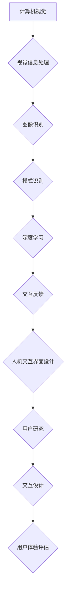

                 

### 文章标题

# 计算机视觉与人机交互界面设计：用户体验优化的创新路径

> **关键词**：计算机视觉，人机交互，用户体验，界面设计，人工智能

**摘要**：本文深入探讨了计算机视觉技术与人机交互界面设计的融合，分析了其在提升用户体验方面的关键作用。通过详细阐述计算机视觉的基础理论、人机交互界面设计原则、应用案例以及用户体验优化方法，本文为读者提供了一个全面的技术视角，展望了该领域的未来发展。作者：AI天才研究院/AI Genius Institute & 禅与计算机程序设计艺术 /Zen And The Art of Computer Programming

----------------------------------------------------------------
## 第一部分：引言与基础理论

### 第1章：计算机视觉与人机交互界面设计的关系

#### 1.1 计算机视觉与人机交互界面设计的核心概念与联系

计算机视觉（Computer Vision）和人机交互界面设计（Human-Computer Interaction Design）是两个看似不同但又紧密相关的领域。计算机视觉关注的是如何使计算机像人类一样理解和处理视觉信息，而人机交互界面设计则侧重于如何构建用户与计算机之间的交互桥梁，以提供直观、高效、愉悦的体验。

**核心概念：**

- **计算机视觉**：涉及图像处理、模式识别、深度学习等，目标是使计算机能够从图像或视频中提取信息，进行理解和解释。
- **人机交互界面设计**：涉及用户研究、交互设计、用户体验评估等，目标是构建一个用户友好、易用、美观的界面，提高用户满意度。

**联系：**

1. **视觉信息的处理**：计算机视觉技术为人机交互界面设计提供了强有力的视觉信息处理能力，使得界面能够更加智能化、个性化。
2. **交互的直观性**：人机交互界面设计利用计算机视觉技术，可以创造出更加直观的交互方式，如手势识别、面部表情分析等，提升用户体验。

**流程图：**



#### 1.2 人机交互界面设计的核心原则

为了构建一个有效的、用户友好的交互界面，人机交互界面设计需要遵循以下核心原则：

- **一致性**：界面设计的一致性对于用户体验至关重要。它包括视觉元素的一致性、交互元素的一致性以及功能的一致性。
- **易用性**：界面设计应该易于使用，用户能够快速学习和适应。这包括直观的布局、清晰的指示以及减少认知负担的设计。
- **反馈**：界面设计应该提供及时的反馈，帮助用户了解他们的操作是否成功，以及如何进行下一步操作。
- **美观性**：界面的美观性可以提升用户体验。这包括色彩搭配、字体选择、图标设计等。

**核心概念：**

- **一致性**：确保用户在使用不同界面或功能时，能够感受到一致的操作逻辑和视觉风格。
- **易用性**：通过简化操作流程、优化用户路径，提高用户完成任务的速度和满意度。
- **反馈**：通过视觉、听觉、触觉等反馈方式，提高用户对界面操作的感知和信任。
- **美观性**：通过良好的视觉设计，提升用户的整体体验和满意度。

#### 1.3 用户体验优化的方法论

用户体验优化（User Experience Optimization）是一个系统化的过程，旨在通过改进界面设计和功能，提升用户的满意度和使用效率。以下是用户体验优化的方法论：

1. **用户研究**：通过观察、访谈、问卷调查等方式，了解用户的需求、行为和偏好。
2. **原型设计**：基于用户研究，快速构建界面原型，进行迭代和改进。
3. **用户测试**：邀请真实用户进行测试，收集反馈，识别界面设计中的问题。
4. **数据分析**：分析用户行为数据，识别界面设计中的问题，指导优化方向。
5. **改进迭代**：根据用户反馈和数据分析，对界面进行改进和迭代。

**核心概念：**

- **用户研究**：理解用户需求和痛点，为设计提供依据。
- **原型设计**：快速验证设计思路，减少开发风险。
- **用户测试**：通过实际操作，识别设计中的问题。
- **数据分析**：通过数据驱动的方式，指导设计优化。
- **改进迭代**：持续优化，不断提升用户体验。

通过上述核心概念和联系，我们可以看出，计算机视觉与人机交互界面设计之间存在紧密的联系。在接下来的章节中，我们将进一步深入探讨计算机视觉的基础知识，以及如何将其应用于人机交互界面设计中。

### 2.1 计算机视觉基础知识

#### 2.1.1 图像处理的基本算法

图像处理是计算机视觉的核心环节，它涉及到对图像的采样、量化、增强、分割等操作。以下是一些基本的图像处理算法：

##### 2.1.1.1 图像采样

图像采样是将连续的图像转换为离散像素的过程。常用的采样方法有奈奎斯特采样和内插采样。

- **奈奎斯特采样**：根据奈奎斯特采样定理，采样频率必须大于信号最高频率的两倍，以保证重建图像的清晰度。

  $$ f_s > 2f_{max} $$
  
- **内插采样**：内插采样通过对像素点之间的插值，提高图像的分辨率。

  $$ I(x, y) = \sum_{i=1}^{n} w_i I(x_i, y_i) $$

##### 2.1.1.2 图像量化

图像量化是将图像的像素值映射到有限的数值范围的过程。量化级别越高，图像的质量越好，但存储和处理的复杂度也越高。

- **线性量化**：线性量化是最简单的量化方法，它将像素值线性映射到量化级别。

  $$ y = \text{round}(x / Q) * Q $$

- **分段量化**：分段量化将像素值映射到不同的量化级别，可以更好地适应图像的分布。

  $$ y = \text{floor}(x / Q) * Q $$

##### 2.1.1.3 图像增强

图像增强是通过调整图像的亮度和对比度，提高图像的可视性。常用的图像增强方法包括直方图均衡、对比度增强、边缘检测等。

- **直方图均衡**：直方图均衡通过调整图像的亮度分布，使图像的对比度提高。

  $$ g(x) = \sum_{i=1}^{n} c_i f_i(x) $$

- **对比度增强**：对比度增强通过调整图像的对比度，使图像的细节更加清晰。

  $$ g(x) = \alpha f(x) + \beta $$

- **边缘检测**：边缘检测通过检测图像中的边缘像素，提取图像中的目标对象。

  $$ \text{Sobel} = \frac{\partial I}{\partial x} + \frac{\partial I}{\partial y} $$

#### 2.1.2 特征提取技术

特征提取是从图像中提取出对图像内容有代表性的信息，用于后续的图像识别和分类。以下是一些常见的特征提取方法：

##### 2.1.2.1 哈希特征

哈希特征是一种基于图像内容的特征提取方法，通过将图像映射到一个哈希值，用于图像的相似性度量。

- **哈希特征提取**：

  $$ h(x) = \text{hash}(x) $$

##### 2.1.2.2 主成分分析（PCA）

主成分分析是一种降维技术，通过将图像数据投影到主成分空间，提取出主要特征。

- **PCA特征提取**：

  $$ \text{PCA} = \{ x \mid \text{降维} \} $$

##### 2.1.2.3 局部二值模式（LBP）

局部二值模式是一种用于描述图像局部纹理的特征提取方法。

- **LBP特征提取**：

  $$ \text{LBP} = \{ x \mid \text{局部纹理} \} $$

#### 2.1.3 视觉感知模型

视觉感知模型旨在模拟人类视觉系统的工作原理，以实现对图像内容的理解和解释。以下是一些常见的视觉感知模型：

##### 2.1.3.1 层次化模型

层次化模型将视觉处理过程分为多个层次，每个层次都负责处理不同的视觉任务。

- **层次化模型**：

  $$ \text{层次化模型} = \{ x \mid \text{逐层处理} \} $$

##### 2.1.3.2 卷积神经网络（CNN）

卷积神经网络是一种深度学习模型，通过多个卷积层、池化层和全连接层，对图像进行逐层分析。

- **CNN模型**：

  $$ \text{CNN} = \{ x \mid \text{多层网络} \} $$

通过以上内容，我们了解了计算机视觉的基础知识，包括图像处理的基本算法、特征提取技术和视觉感知模型。在接下来的章节中，我们将进一步探讨人机交互界面设计的基础知识。

### 3.1 人机交互界面设计的流程

人机交互界面设计是一个复杂而系统化的过程，它涉及多个阶段和步骤，旨在创建一个用户友好、高效、直观的界面。以下是人机交互界面设计的主要流程：

#### 3.1.1 需求分析

需求分析是界面设计的起点，它的目标是明确用户需求、业务目标和界面功能。需求分析包括以下步骤：

1. **用户调研**：通过访谈、问卷、观察等方式，了解用户的行为、需求和偏好。
2. **功能需求**：明确界面需要实现的功能和功能之间的关联。
3. **非功能需求**：考虑界面的性能、安全性、易用性等非功能性需求。

##### 3.1.1.1 用户调研

用户调研是需求分析的核心步骤，通过深入了解用户的需求和偏好，为界面设计提供依据。以下是用户调研的常见方法：

- **访谈**：与目标用户进行一对一的深入访谈，了解他们的使用习惯、需求和痛点。
- **问卷**：设计问卷，通过线上或线下方式收集用户的反馈和意见。
- **观察**：在现场观察用户使用产品或服务的全过程，记录他们的操作行为和反馈。

##### 3.1.1.2 功能需求

功能需求是指界面需要实现的具体功能，包括核心功能、辅助功能和扩展功能。以下是一些常见的功能需求：

- **核心功能**：界面设计的主要功能，如登录、注册、浏览、搜索等。
- **辅助功能**：帮助用户完成核心功能的功能，如帮助文档、提示信息、导航等。
- **扩展功能**：为了提升用户体验和满足特定用户需求的功能，如个性化推荐、智能搜索等。

##### 3.1.1.3 非功能需求

非功能需求是指界面设计需要满足的性能、安全性、易用性等要求。以下是一些常见的非功能需求：

- **性能**：界面的响应速度、处理能力等，如快速加载、高效搜索等。
- **安全性**：界面的数据保护、用户隐私等，如数据加密、身份验证等。
- **易用性**：界面的设计、交互和操作是否直观、易于理解和使用。

#### 3.1.2 原型设计

原型设计是界面设计的重要环节，它的目标是构建一个可交互的界面原型，用于验证和迭代设计。原型设计包括以下步骤：

1. **低保真原型**：使用简单的图形和文字，快速构建界面原型，主要用于功能验证。
2. **高保真原型**：使用更精细的图形和布局，构建接近最终界面的原型，主要用于用户体验验证。

##### 3.1.2.1 低保真原型

低保真原型（Low-Fidelity Prototype）是一种简单的界面原型，它通常使用草图、线框图或低保真图标来表示界面元素和布局。以下是一些常见的低保真原型工具：

- **Sketch**：一款流行的界面设计工具，支持快速绘制线框图和草图。
- **Figma**：一款基于云的界面设计工具，支持多人协作和实时预览。
- **Axure RP**：一款专业的原型设计工具，支持丰富的交互效果和动画。

##### 3.1.2.2 高保真原型

高保真原型（High-Fidelity Prototype）是一种接近最终产品的界面原型，它使用更精细的图形和布局，包括真实图标、颜色和字体。以下是一些常见的高保真原型工具：

- **Sketch**：支持绘制高保真原型，提供丰富的图标和设计资源。
- **Figma**：支持绘制高保真原型，支持实时协作和预览。
- **Adobe XD**：一款专业的原型设计工具，支持交互设计和用户测试。

#### 3.1.3 交互设计

交互设计是界面设计的核心，它关注的是用户与界面之间的交互流程和交互方式。交互设计包括以下步骤：

1. **交互模式**：确定界面中的交互模式，如按钮、滑动、拖拽等。
2. **交互流程**：设计用户在界面中的操作流程，确保用户能够轻松完成任务。
3. **反馈设计**：设计界面反馈，如声音、动画、文字提示等，帮助用户了解操作结果。

##### 3.1.3.1 交互模式

交互模式是指用户与界面之间的交互方式。以下是一些常见的交互模式：

- **按钮交互**：用户点击按钮，触发特定的操作。
- **滑动交互**：用户通过拖动界面元素，实现滚动、缩放等功能。
- **拖拽交互**：用户通过拖动一个元素到另一个位置，实现元素移动或复制。

##### 3.1.3.2 交互流程

交互流程是指用户在界面中的操作步骤。以下是一个简单的交互流程示例：

1. 用户登录界面。
2. 输入用户名和密码。
3. 点击登录按钮。
4. 界面跳转到用户主界面。
5. 用户浏览内容或执行其他操作。

##### 3.1.3.3 反馈设计

反馈设计是指界面如何向用户传达操作结果和信息。以下是一些常见的反馈设计：

- **声音反馈**：用户执行操作时，界面发出特定的声音，提示操作成功或失败。
- **动画反馈**：用户执行操作时，界面显示动画效果，如加载动画、滑动动画等。
- **文字提示**：用户执行操作时，界面显示文字提示，如错误提示、成功提示等。

#### 3.1.4 界面布局

界面布局是指界面中各个元素的位置和排列方式。以下是一些常见的界面布局原则：

1. **网格布局**：将界面划分为网格，使元素排列整齐、统一。
2. **对称布局**：将界面元素对称排列，创造平衡感和和谐感。
3. **层次布局**：将界面元素按照重要程度和功能层次进行排列，提高用户的理解和使用效率。

#### 3.1.5 用户体验测试

用户体验测试是界面设计的最后一步，它的目标是验证界面的易用性、性能和用户体验。用户体验测试包括以下步骤：

1. **用户测试**：邀请真实用户进行测试，收集用户反馈和意见。
2. **数据分析**：分析用户测试数据，识别界面设计中的问题。
3. **改进迭代**：根据用户反馈和数据分析，对界面进行改进和迭代。

##### 3.1.5.1 用户测试

用户测试是通过邀请真实用户使用界面，观察他们的操作行为和反应，收集用户反馈的一种方法。以下是一些常见的用户测试方法：

- **A/B测试**：将界面设计分成两组，分别测试两种不同的设计，比较用户的偏好和效果。
- **可用性测试**：邀请用户完成特定的任务，观察他们的操作路径和时间，分析界面的易用性。
- **焦点小组**：邀请一组用户进行讨论，收集他们对界面设计的意见和建议。

##### 3.1.5.2 数据分析

数据分析是通过分析用户测试数据，识别界面设计中的问题的一种方法。以下是一些常见的数据分析方法：

- **行为分析**：分析用户在界面上的操作行为，如点击路径、操作时间等，识别界面设计中的问题。
- **错误分析**：分析用户在界面上的错误操作，如输入错误、误点击等，识别界面设计中的问题。
- **反馈分析**：分析用户对界面设计的反馈，如满意度、易用性等，识别界面设计中的问题。

##### 3.1.5.3 改进迭代

根据用户测试和数据分析的结果，对界面进行改进和迭代。以下是一些常见的改进方法：

- **优化交互设计**：根据用户的反馈和数据分析，优化界面的交互设计，如调整按钮位置、改进操作流程等。
- **改进视觉设计**：根据用户的反馈和数据分析，优化界面的视觉设计，如调整颜色搭配、改进图标设计等。
- **优化性能**：根据用户的反馈和数据分析，优化界面的性能，如提高页面加载速度、减少延迟等。

通过以上内容，我们了解了人机交互界面设计的主要流程，包括需求分析、原型设计、交互设计、界面布局和用户体验测试。在接下来的章节中，我们将进一步探讨用户体验优化的方法和技术。

### 4.1 计算机视觉在界面交互中的应用

计算机视觉技术为人机交互界面设计带来了革命性的变革，使得用户可以通过视觉信息进行更加直观和自然的交互。以下将详细介绍计算机视觉在界面交互中的应用，包括手势识别、面部识别和情感分析等。

#### 4.1.1 手势识别

手势识别技术允许用户通过简单的手势与界面进行交互，从而减少对传统物理按钮的依赖。以下为手势识别技术的基本原理和应用：

**手势识别算法原理：**

手势识别通常基于深度学习模型，通过卷积神经网络（CNN）从图像中提取特征，并进行分类。以下是手势识别算法的基本步骤：

1. **图像预处理**：对采集到的图像进行预处理，包括灰度化、滤波和归一化等。
2. **特征提取**：使用深度学习模型（如CNN）从预处理后的图像中提取特征。
3. **分类与识别**：将提取出的特征输入到分类模型中，进行手势识别。

**伪代码：**

```python
# 假设使用PyTorch框架进行手势识别

import torch
import torchvision.models as models

# 加载预训练的深度学习模型
model = models.resnet50(pretrained=True)

# 定义预处理函数
def preprocess_image(image):
    image = image.convert('L')  # 灰度化
    image = torch.tensor(image, dtype=torch.float32) / 255.0  # 归一化
    image = image.unsqueeze(0)  # 增加批处理维度
    return image

# 加载测试图像
test_image = preprocess_image(test_image)

# 进行手势识别
with torch.no_grad():
    outputs = model(test_image)
    _, predicted = torch.max(outputs, 1)
    gesture = predicted.item()
```

**手势识别在界面设计中的应用：**

手势识别技术可以在多种界面设计中实现自然交互，以下是一些应用实例：

1. **智能家电控制**：用户可以通过手势控制智能家电，如挥手关闭灯光、手掌打开电视等。
2. **虚拟现实游戏**：用户可以在虚拟环境中使用手势进行游戏操作，如挥动手势控制飞行器、拳击对手等。
3. **移动设备操作**：用户可以通过手势在移动设备上进行快速操作，如滑动切换页面、双击放大缩小图片等。

#### 4.1.2 面部识别

面部识别技术通过检测和识别用户的面部特征，实现了无密码登录、用户识别等功能。以下为面部识别技术的基本原理和应用：

**面部识别算法原理：**

面部识别通常基于深度学习模型，通过卷积神经网络（CNN）从面部图像中提取特征，并进行比对。以下是面部识别算法的基本步骤：

1. **面部检测**：使用面部检测算法（如 Haar cascades）从输入图像中检测面部区域。
2. **特征提取**：使用深度学习模型（如 FaceNet）从面部图像中提取特征向量。
3. **面部比对**：将提取出的特征向量与数据库中的用户面部特征进行比对，实现面部识别。

**伪代码：**

```python
# 假设使用OpenCV和dlib进行面部识别

import cv2
import dlib

# 加载预训练的面部检测模型
detector = dlib.get_frontal_face_detector()

# 加载预训练的特征提取模型
face_encoder = FaceEncoder()

# 定义面部识别函数
def recognize_face(image):
    # 检测面部
    faces = detector(image, 1)
    
    # 提取面部特征
    features = []
    for face in faces:
        feature_vector = face_encoder.extract_features(face)
        features.append(feature_vector)
    
    # 面部比对
    recognized = face_encoder.compare_faces(features)
    
    return recognized

# 加载测试图像
test_image = cv2.imread('test_image.jpg')

# 进行面部识别
recognized = recognize_face(test_image)

print(recognized)
```

**面部识别在界面设计中的应用：**

面部识别技术可以在多种界面设计中实现个性化交互和安全性提升，以下是一些应用实例：

1. **无密码登录**：用户可以通过面部识别技术进行无密码登录，提高安全性。
2. **社交媒体**：用户可以通过面部识别技术识别好友，实现快速添加好友功能。
3. **支付系统**：用户可以通过面部识别技术进行身份验证，实现安全支付。

#### 4.1.3 情感分析

情感分析技术通过分析用户的情感状态，实现了更加智能化和个性化的用户体验。以下为情感分析技术的基本原理和应用：

**情感分析算法原理：**

情感分析通常基于自然语言处理（NLP）技术，通过文本分析、情感词典和机器学习模型，识别用户的情感状态。以下是情感分析算法的基本步骤：

1. **文本预处理**：对用户输入的文本进行预处理，包括分词、去停用词、词性标注等。
2. **情感词典**：使用情感词典，为每个词语分配情感值，通常为积极、消极或中性。
3. **情感计算**：结合文本的语义和情感词典，计算文本的整体情感倾向。

**伪代码：**

```python
# 假设使用TextBlob进行情感分析

from textblob import TextBlob

# 定义情感分析函数
def analyze_emotion(text):
    blob = TextBlob(text)
    sentiment = blob.sentiment
    
    if sentiment.polarity > 0:
        return '积极'
    elif sentiment.polarity < 0:
        return '消极'
    else:
        return '中性'

# 用户输入文本
user_text = "我对这个产品非常喜欢！"

# 进行情感分析
emotion = analyze_emotion(user_text)

print(emotion)
```

**情感分析在界面设计中的应用：**

情感分析技术可以在多种界面设计中实现情感化交互和个性化推荐，以下是一些应用实例：

1. **社交媒体**：根据用户的情感状态，推荐相关的内容和活动。
2. **客户服务**：通过情感分析，识别客户的情感状态，提供针对性的解决方案。
3. **健康监测**：通过分析用户的情绪状态，提供心理健康建议。

通过以上内容，我们详细介绍了计算机视觉在界面交互中的应用，包括手势识别、面部识别和情感分析。这些技术为人机交互界面设计带来了全新的可能性，提升了用户的体验和满意度。在接下来的章节中，我们将探讨用户行为分析和个性化推荐系统在界面设计中的应用。

### 5.1 用户行为分析技术

用户行为分析是理解用户需求和行为的重要手段，通过分析用户在界面上的行为，可以为界面设计和用户体验优化提供有力支持。以下将介绍用户行为分析的技术和方法。

#### 5.1.1 数据收集与处理

用户行为分析的第一步是数据收集。以下方法可以用于收集用户行为数据：

1. **日志文件**：通过系统日志记录用户在界面上的操作，如点击、浏览、搜索等。
2. **Web分析工具**：使用Web分析工具（如Google Analytics）收集用户访问行为数据，如页面访问量、用户停留时间等。
3. **用户调查**：通过问卷调查、访谈等方式，收集用户对界面设计和功能的评价。

在数据收集后，需要对数据进行处理，包括数据清洗、去重、归一化等步骤，以确保数据的准确性和一致性。

**数据收集示例：**

```python
import csv

# 读取日志文件
with open('log.csv', 'r') as f:
    reader = csv.reader(f)
    logs = list(reader)

# 数据清洗
clean_logs = []
for log in logs:
    if log[2].isdigit():  # 过滤非数字的访问量
        clean_logs.append(log)

# 数据去重
unique_logs = []
for log in clean_logs:
    if log not in unique_logs:
        unique_logs.append(log)
```

**数据处理示例：**

```python
import pandas as pd

# 加载数据
data = pd.DataFrame(unique_logs, columns=['timestamp', 'page', 'views'])

# 数据归一化
data['views'] = data['views'].astype(float)
data['views_normalized'] = data['views'] / data['views'].max()
```

#### 5.1.2 用户行为模型构建

用户行为模型是基于收集到的用户行为数据，通过数据分析和挖掘技术构建的，用于描述用户的行为模式和偏好。以下方法可以用于构建用户行为模型：

1. **关联规则挖掘**：通过关联规则挖掘技术，发现用户行为之间的关联关系，如用户在浏览某一商品后，可能会浏览另一商品。
2. **聚类分析**：通过聚类分析方法，将具有相似行为的用户划分为不同的群体，如基于用户浏览行为和购买行为的聚类。
3. **回归分析**：通过回归分析方法，建立用户行为与界面设计参数之间的关系模型，如用户停留时间与页面加载速度的关系。

**关联规则挖掘示例：**

```python
from mlxtend.frequent_patterns import apriori
from mlxtend.preprocessing import TransactionEncoder

# 将数据转换为事务格式
te = TransactionEncoder()
transaction_data = te.fit_transform(data[['page', 'views']])

# 进行关联规则挖掘
frequent_itemsets = apriori(transaction_data, min_support=0.05, use_colnames=True)

# 输出关联规则
print(frequent_itemsets)
```

**聚类分析示例：**

```python
from sklearn.cluster import KMeans

# 构建用户行为特征向量
user_behavior = data[['views_normalized']].values

# 进行K-means聚类
kmeans = KMeans(n_clusters=3, random_state=0).fit(user_behavior)

# 获取聚类结果
labels = kmeans.labels_

# 将聚类结果添加到数据中
data['cluster'] = labels
```

**回归分析示例：**

```python
from sklearn.linear_model import LinearRegression

# 选择特征和目标变量
X = data[['views_normalized']]
y = data['response_time']

# 进行回归分析
regressor = LinearRegression()
regressor.fit(X, y)

# 输出回归系数
print(regressor.coef_)
```

#### 5.1.3 用户行为分析在界面设计中的应用

用户行为分析可以为界面设计提供以下支持：

1. **需求分析**：通过分析用户行为，了解用户的需求和偏好，为界面功能设计和优化提供依据。
2. **用户体验优化**：通过分析用户行为，识别界面中的问题，如用户点击率低的按钮、用户经常出错的操作等，为界面优化提供方向。
3. **个性化推荐**：基于用户行为分析，为用户提供个性化的内容和服务，提高用户满意度。

**实例：**

1. **优化页面布局**：通过分析用户点击数据，发现用户点击某个按钮的频率较低，可以将其调整到更显著的位置。
2. **改进导航结构**：通过分析用户浏览路径，发现某些页面访问量较低，可以调整导航结构，提高页面的可见性。
3. **个性化内容推荐**：通过分析用户浏览和购买行为，为用户推荐可能感兴趣的内容和商品。

通过以上内容，我们详细介绍了用户行为分析的技术和方法，以及其在界面设计中的应用。在接下来的章节中，我们将探讨个性化推荐系统在界面设计中的应用。

### 5.2 个性化推荐系统

个性化推荐系统是一种基于用户行为数据，为用户提供个性化内容、服务和商品的系统。它通过分析用户的浏览记录、搜索历史、购买记录等信息，预测用户可能的兴趣和需求，从而提供个性化的推荐。

#### 5.2.1 推荐算法原理

个性化推荐系统通常采用基于用户行为、内容和协同过滤的方法进行推荐。

1. **基于用户行为的推荐**：通过分析用户的浏览、搜索、购买等行为，为用户推荐与他们的行为相似的内容或商品。例如，如果用户经常浏览某个类型的商品，推荐系统会推荐类似类型的商品。

2. **基于内容的推荐**：通过分析内容特征（如标签、分类、关键词等），为用户推荐具有相似特征的内容或商品。例如，如果一个用户喜欢某个电影，推荐系统会推荐具有类似题材的电影。

3. **协同过滤推荐**：通过分析用户之间的相似性，为用户推荐其他用户喜欢的商品或内容。协同过滤推荐分为两种：基于用户的协同过滤和基于项目的协同过滤。

   - **基于用户的协同过滤**：找到与目标用户行为相似的邻居用户，推荐这些邻居用户喜欢的商品或内容。
   - **基于项目的协同过滤**：找到与目标用户已评价项目相似的邻居项目，推荐这些邻居项目。

**推荐算法示例：**

1. **基于用户的协同过滤**

   ```python
   import numpy as np
   
   # 假设用户-项目评分矩阵为R
   R = np.array([
       [5, 3, 0, 1],
       [4, 0, 0, 2],
       [2, 1, 0, 3],
       [0, 3, 4, 0]
   ])

   # 计算相似度矩阵
   similarity = np.dot(R.T, R) / np.linalg.norm(R, axis=0) @ np.linalg.norm(R, axis=1)

   # 计算预测评分
   pred_scores = np.dot(similarity, R) / np.sum(similarity, axis=1)

   # 输出预测评分
   print(pred_scores)
   ```

2. **基于内容的推荐**

   ```python
   import pandas as pd
   
   # 假设商品-特征矩阵为C
   C = pd.DataFrame({
       'item1': [1, 2, 3, 4],
       'item2': [4, 3, 2, 1],
       'item3': [1, 1, 1, 1],
       'item4': [2, 2, 2, 2]
   })

   # 假设用户-特征矩阵为U
   U = pd.DataFrame({
       'user1': [1, 1, 1, 0],
       'user2': [0, 1, 1, 1],
       'user3': [1, 0, 0, 1],
       'user4': [0, 0, 1, 1]
   })

   # 计算相似度矩阵
   similarity = U @ C

   # 计算预测评分
   pred_scores = U.T @ C / similarity

   # 输出预测评分
   print(pred_scores)
   ```

#### 5.2.2 个性化推荐在界面设计中的应用

个性化推荐系统可以在界面设计中实现以下功能：

1. **内容推荐**：在内容类应用（如新闻、视频、电商等）中，为用户推荐感兴趣的内容，提高用户粘性。
2. **产品推荐**：在电商应用中，为用户推荐可能感兴趣的商品，提高销售转化率。
3. **服务推荐**：在服务类应用（如酒店、旅游等）中，为用户推荐符合其需求的服务，提高用户体验。

**实例：**

1. **新闻推荐**：根据用户的阅读历史，为用户推荐相似主题的新闻。
2. **电商推荐**：根据用户的浏览记录和购买历史，为用户推荐相似的商品。
3. **旅游推荐**：根据用户的喜好和预算，为用户推荐合适的旅游景点和旅游套餐。

通过以上内容，我们详细介绍了个性化推荐系统的原理和算法，以及其在界面设计中的应用。在接下来的章节中，我们将探讨虚拟现实与增强现实在交互设计中的应用。

### 6.1 虚拟现实（VR）概述

虚拟现实（Virtual Reality，VR）是一种通过计算机技术创造出的模拟环境，使用户能够身临其境地体验。VR技术为人机交互界面设计带来了全新的交互方式和体验。

#### 6.1.1 VR技术发展历史

VR技术起源于20世纪60年代，当时主要是军事和航天领域的研究。在20世纪80年代，VR技术开始应用于娱乐和教育培训领域。1990年代，VR技术取得了重大突破，如任天堂的虚拟现实游戏机“Virtual Boy”。进入21世纪，随着计算机性能的提升和显示技术的发展，VR技术逐渐成熟，如Oculus Rift、HTC Vive等VR设备的推出。

**VR技术发展历史流程图：**

```mermaid
graph TB
A[20世纪60年代] --> B{军事和航天研究}
B --> C{20世纪80年代} --> D{娱乐和教育培训应用}
D --> E{1990年代技术突破}
E --> F{21世纪成熟应用}
F

