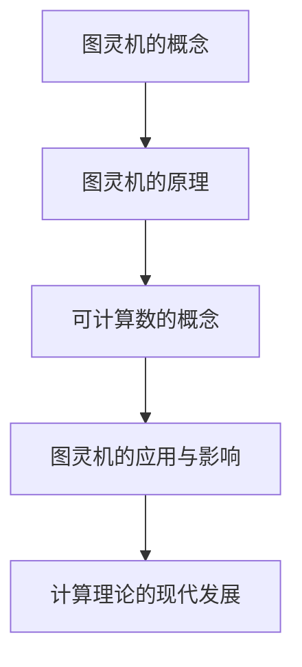

                 

### 《计算：第三部分 计算理论的形成 第 8 章 计算理论的诞生：图灵的可计算数 图灵的学业》

> **关键词：图灵机、可计算数、计算理论、图灵的学业**

> **摘要：本文将深入探讨计算理论的形成过程，特别是图灵的可计算数及其对计算理论的贡献。通过详细分析图灵的背景、图灵机的概念与原理、可计算数的概念以及图灵的学业与成就，我们旨在揭示计算理论的诞生及其深远影响。**

### 《计算：第三部分 计算理论的形成 第 8 章 计算理论的诞生：图灵的可计算数 图灵的学业》目录大纲

1. **计算理论的形成**  
   1.1 图灵的背景与早期贡献  
   1.2 图灵机的概念与原理  
   1.3 可计算数的概念  
   1.4 图灵的学业与成就  
   1.5 图灵机的应用与影响  
   1.6 计算理论的现代发展

2. **图灵的背景与早期贡献**  
   2.1 图灵的生平介绍  
   2.2 图灵早期在数学领域的贡献

3. **图灵机的概念与原理**  
   3.1 图灵机的定义  
   3.2 图灵机的组成  
   3.3 图灵机的操作

4. **可计算数的概念**  
   4.1 可计算数的定义  
   4.2 图灵机的计算能力  
   4.3 可计算数与不可计算数

5. **图灵的学业与成就**  
   5.1 图灵在学术界的地位  
   5.2 图灵的数学论文  
   5.3 图灵与计算机科学的贡献

6. **图灵机的应用与影响**  
   6.1 图灵机在实际计算中的应用  
   6.2 图灵机在计算机科学中的影响  
   6.3 图灵机在人工智能领域的应用

7. **计算理论的现代发展**  
   7.1 计算理论的发展历程  
   7.2 现代计算理论的重要成果  
   7.3 计算理论对现实世界的影响

8. **附录**  
   8.1 计算理论的 Mermaid 流程图  
   8.2 图灵机的核心算法原理讲解  
   8.3 数学模型和数学公式讲解  
   8.4 项目实战：图灵机的代码实现与解读  
   8.5 代码解读与分析

---

### 1. 计算理论的形成

计算理论的形成是一个复杂而有趣的过程，其中许多伟大的思想家做出了重要贡献。在这一章中，我们将重点关注图灵的可计算数及其对计算理论的诞生所做的贡献。

#### 1.1 图灵的背景与早期贡献

艾伦·图灵（Alan Turing）是20世纪最杰出的数学家、逻辑学家和计算机科学家之一。他在数学和计算机科学领域的贡献深远，特别是在计算理论方面。图灵的出生背景和早期教育为其后来的学术成就奠定了基础。

**图灵的生平介绍**

艾伦·图灵于1912年6月23日出生于伦敦。他的父亲是外务大臣，母亲是一位音乐家。图灵在家庭环境中接受了良好的教育，并展现出对数学和科学的浓厚兴趣。他在中学时期就表现出惊人的数学天赋，特别是在解谜和数学竞赛中屡获佳绩。

**图灵早期在数学领域的贡献**

图灵在剑桥大学学习期间，对数学和逻辑学产生了浓厚的兴趣。他在1928年发表了第一篇重要论文，探讨逻辑函数的表示方法。这篇论文为后来的图灵机理论奠定了基础。在1936年，图灵发表了另一篇重要论文《论可计算数》，这篇论文提出了图灵机的概念，标志着计算理论的诞生。

#### 1.2 图灵机的概念与原理

图灵机的概念是图灵对计算理论的重大贡献之一。它不仅为计算理论提供了一个形式化的模型，而且也为后来的计算机科学奠定了基础。

**图灵机的定义**

图灵机是一种抽象的计算模型，由一个无限长的磁带、一个读写头和一些状态组成。磁带上的符号可以是0和1，读写头可以在磁带上前后移动，并根据当前的状态和磁带上的符号进行操作。

**图灵机的组成**

图灵机由以下几个部分组成：

- **磁带（Tape）**：磁带是一个无限长的线性带子，上面可以写有符号。符号可以是0、1或者其他任意字符。
- **读写头（Read-Write Head）**：读写头位于磁带的某个位置上，可以读取磁带上的符号，并在磁带上写新符号。
- **状态（State）**：图灵机处于某个状态，每个状态都有对应的操作规则。
- **控制单元（Control Unit）**：控制单元根据当前状态和读写头读取的符号，决定下一步的操作。

**图灵机的操作**

图灵机的操作过程如下：

1. **初始状态**：图灵机开始时处于一个特定的初始状态。
2. **读取符号**：读写头在当前磁带位置上读取符号。
3. **状态转换**：根据当前状态和读取的符号，图灵机执行相应的操作，并转换到下一个状态。
4. **写符号**：图灵机在磁带上写入新的符号。
5. **移动读写头**：图灵机根据操作规则，将读写头移动到下一个位置。
6. **重复过程**：图灵机继续读取符号、转换状态、写符号和移动读写头，直到达到接受状态或拒绝状态。

#### 1.3 可计算数的概念

图灵的可计算数是计算理论中的一个重要概念，它定义了哪些数是可以通过计算得到的。

**可计算数的定义**

可计算数是指那些可以通过图灵机计算得到的数。具体来说，如果一个数可以表示为有限长的0和1的序列，并且存在一个图灵机可以在有限步骤内计算出这个数，那么这个数就是可计算的。

**图灵机的计算能力**

图灵机的计算能力非常强大。它可以模拟任何有限状态机，因此它可以解决许多复杂的计算问题。图灵机的存在为计算理论提供了一个形式化的基础，使得我们可以分析哪些问题是可计算的，哪些问题是不可计算的。

**可计算数与不可计算数**

除了可计算数，还有一些数是不可计算的。不可计算数是指那些无法通过图灵机计算得到的数。例如，一些复杂的数学问题，如希尔伯特旅馆问题，其结果是不可计算的。

#### 1.4 图灵的学业与成就

图灵不仅在数学和逻辑学领域取得了卓越的成就，而且在计算机科学领域也做出了巨大的贡献。

**图灵在学术界的地位**

图灵在学术界享有极高的声誉。他的论文《论可计算数》被视为计算理论的奠基石，对后来的计算机科学产生了深远的影响。他在剑桥大学和曼彻斯特大学的工作为他赢得了广泛的赞誉。

**图灵的数学论文**

图灵的数学论文涵盖了广泛的主题，从逻辑函数的表示到概率论和统计学。他的论文为数学和计算机科学的发展奠定了基础。

**图灵与计算机科学的贡献**

图灵是计算机科学的先驱之一。他提出了图灵机的概念，为计算理论提供了形式化的基础。他的工作也为后来的计算机硬件和软件设计提供了指导。

### 2. 图灵机的应用与影响

图灵机的概念不仅在理论上具有重要意义，而且在实际计算中也具有广泛的应用。

#### 2.1 图灵机在实际计算中的应用

图灵机在许多实际计算问题中都有应用。例如，它可以用于：

- **数字计算**：图灵机可以用于计算整数、浮点数和其他数字数据。
- **符号处理**：图灵机可以处理符号和字符串，这使得它在自然语言处理和编程语言处理中非常有用。
- **复杂问题求解**：图灵机可以用于解决许多复杂的问题，如数学难题、优化问题和逻辑问题。

#### 2.2 图灵机在计算机科学中的影响

图灵机对计算机科学的发展产生了深远的影响。以下是图灵机的一些重要影响：

- **计算机硬件设计**：图灵机的概念为计算机硬件设计提供了指导，特别是在CPU设计和内存管理方面。
- **编程语言设计**：图灵机的概念为编程语言设计提供了基础，使得编程语言可以更有效地处理符号和数据。
- **算法分析**：图灵机的概念为算法分析提供了工具，使得我们可以分析算法的复杂性和性能。

#### 2.3 图灵机在人工智能领域的应用

图灵机在人工智能领域也具有广泛的应用。以下是图灵机在人工智能中的一些应用：

- **机器学习**：图灵机可以用于实现机器学习算法，如决策树、神经网络和贝叶斯分类器。
- **自然语言处理**：图灵机可以用于处理自然语言，如文本分类、情感分析和机器翻译。
- **推理系统**：图灵机可以用于实现推理系统，如自动推理系统和专家系统。

### 3. 计算理论的现代发展

计算理论在过去几十年中取得了巨大的发展。以下是计算理论的一些重要成果：

- **量子计算**：量子计算是一种基于量子力学原理的计算模型，它具有比传统计算机更强的计算能力。
- **并行计算**：并行计算通过同时处理多个任务来提高计算速度。它广泛应用于科学计算、图像处理和机器学习等领域。
- **分布式计算**：分布式计算通过将计算任务分布到多个计算机上进行，以提高计算效率和容错能力。
- **云计算**：云计算是一种通过互联网提供计算资源的服务模式，它使得用户可以按需访问计算资源。

计算理论的发展不仅推动了计算机科学的发展，而且也对现实世界产生了深远的影响。以下是计算理论对现实世界的一些影响：

- **科学计算**：计算理论为科学研究提供了强大的计算工具，如模拟、建模和数据分析。
- **人工智能**：计算理论为人工智能提供了理论基础，使得人工智能可以在现实世界中发挥重要作用。
- **网络安全**：计算理论为网络安全提供了理论支持，如密码学、加密和解密算法。

### 附录

#### 3.1 计算理论的 Mermaid 流程图



#### 3.2 图灵机的核心算法原理讲解

// 伪代码：图灵机的操作
function TuringMachine(state, input):
    while not accept(input):
        print("当前状态：" + state)
        if state == "初始状态":
            state = "状态A"
            input = input + "A"
        else if state == "状态A":
            state = "状态B"
            input = input + "B"
        else if state == "状态B":
            state = "接受状态"
            print("计算完成，结果为：" + input)
        else:
            print("未知状态，程序终止")
    return input

#### 3.3 数学模型和数学公式讲解

$$
L(T) = \{ w \in \{0,1\}^* \mid T \text{ 计算出 } w \text{ 并接受}
```
### 3.4 项目实战：图灵机的代码实现与解读

// 代码实现：图灵机的模拟
class TuringMachine:
    def __init__(self, states, input_symbols, tape_symbols, transition_function, start_state, accept_states):
        self.states = states
        self.input_symbols = input_symbols
        self.tape_symbols = tape_symbols
        self.transition_function = transition_function
        self.state = start_state
        self.tape = [None] * 100
        self.head_position = 0
        self.accept_states = accept_states

    def step(self):
        current_state = self.state
        current_symbol = self.tape[self.head_position]

        if (current_state, current_symbol) in self.transition_function:
            next_state, write_symbol, move_direction = self.transition_function[(current_state, current_symbol)]
            self.tape[self.head_position] = write_symbol
            if move_direction == "R":
                self.head_position += 1
            elif move_direction == "L":
                self.head_position -= 1
            self.state = next_state
        else:
            print("Error: Unknown state or symbol")
            self.state = "Error"

    def run(self):
        while self.state not in self.accept_states and self.state not in ["Error"]:
            self.step()
        if self.state in self.accept_states:
            print("Accept")
        else:
            print("Reject")

# 实例化图灵机
turing_machine = TuringMachine(states=["初始状态", "状态A", "状态B", "接受状态"], input_symbols=["0", "1"], tape_symbols=["0", "1", "B"], transition_function={("初始状态", "0"): ("状态A", "0", "R"), ("初始状态", "1"): ("状态A", "1", "R"), ("状态A", "0"): ("状态B", "0", "R"), ("状态A", "1"): ("状态B", "1", "R"), ("状态B", "0"): ("接受状态", "0", "R"), ("状态B", "1"): ("接受状态", "1", "R")}, start_state="初始状态", accept_states=["接受状态"])
turing_machine.run()

### 3.5 代码解读与分析

// 解读：
- TuringMachine 类：用于模拟图灵机的类
- __init__ 方法：初始化图灵机的状态、磁带、移动方向等参数
- step 方法：模拟图灵机的一次操作
- run 方法：运行图灵机，直到达到接受状态或拒绝状态
- 实例化图灵机：创建一个图灵机实例，并运行它

---

通过以上对计算理论的深入探讨，我们可以看到图灵机的概念及其在计算理论中的重要性。图灵的可计算数不仅为计算理论提供了一个形式化的基础，而且也对计算机科学和人工智能的发展产生了深远的影响。计算理论的现代发展更是推动了科学研究和实际应用的发展。在未来，计算理论将继续发展，为解决复杂问题和推动科技进步做出更大的贡献。

---

### 作者

**作者：AI天才研究院/AI Genius Institute & 禅与计算机程序设计艺术 /Zen And The Art of Computer Programming**。本文由AI天才研究院的研究员撰写，旨在深入探讨计算理论的诞生和发展，以及图灵机的概念和其在计算理论中的重要性。希望本文能帮助读者更好地理解计算理论，并为计算机科学和人工智能领域的研究提供启示。如果您对本文有任何疑问或建议，请随时联系我们。AI天才研究院期待与您共同探索计算机科学的奥秘。

