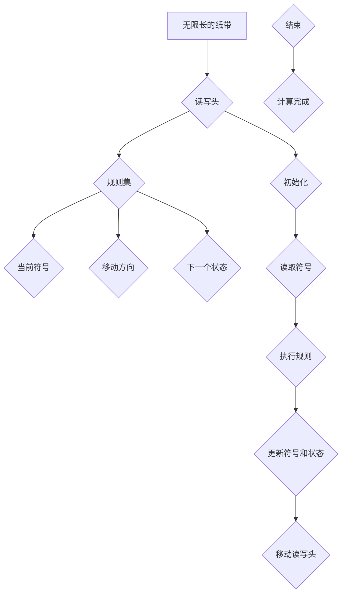

                 

# 《计算：第三部分 计算理论的形成 第8章 计算理论的诞生：图灵的可计算数 忙碌的海狸》

> **关键词**：计算理论、图灵机、可计算数、不可计算数、图灵测试、人工智能

> **摘要**：本文将深入探讨计算理论的诞生及其演变，特别是图灵机的概念及其在计算理论中的重要地位。我们将了解图灵机的定义、结构、操作过程及其数学意义，并探讨可计算数与不可计算数的概念。此外，我们还将探讨图灵机的实际应用、图灵测试的概念及其意义，并对计算理论的未来展望进行讨论。

## 第8章 计算理论的诞生：图灵的可计算数 忙碌的海狸

### 8.1 计算理论的诞生背景

#### 8.1.1 20世纪初的数学困境

在20世纪初，数学领域经历了一系列的变革和挑战。这一时期，数学家们开始关注数学的基础和逻辑性。然而，随着数学家们的深入探讨，他们发现了一些令人困惑的问题。例如，皮亚诺（Peano）和罗素（Russell）之间的论战就是其中一个突出的例子。

皮亚诺是一位意大利数学家，他提出了一个公理体系，用于定义自然数。然而，罗素则指出，这个体系存在一些悖论，例如集合论中的“罗素悖论”。这些悖论引发了数学界的广泛讨论，并促使数学家们开始思考数学的基本假设和逻辑结构。

#### 8.1.2 皮亚诺与罗素论战

皮亚诺和罗素的论战主要集中在集合论和逻辑问题上。皮亚诺认为，通过公理化的方法，可以建立一套坚实的数学基础。然而，罗素则提出了对集合论的一些质疑，认为存在一些集合是无法定义的，并且这些集合可能导致逻辑上的悖论。

这场论战促使数学家们开始思考，是否存在一种更基础的方法来定义和验证数学理论。在这种背景下，图灵机概念逐渐被提出。

### 8.2 图灵机的概念

图灵机（Turing machine）是由英国数学家艾伦·图灵（Alan Turing）于20世纪30年代提出的一种抽象计算模型。它是一种理论上的计算设备，通过一系列规则和操作来模拟任何算法的计算过程。

#### 8.2.1 图灵机的定义

图灵机是一种抽象的计算设备，它由一个无限长的纸带、一个读写头以及一组规则组成。纸带被分成一个个的小方格，每个方格中可以存储一个符号。读写头可以沿着纸带左右移动，读取和写入符号。根据预设的规则，读写头可以改变当前符号以及移动方向。

#### 8.2.2 图灵机的结构

图灵机的结构包括以下几个部分：

1. **无限长的纸带**：纸带由无限多个小方格组成，每个方格中可以存储一个符号。符号可以是数字、字母或其他字符。
2. **读写头**：读写头位于纸带上的一个特定位置，可以读取和写入符号。它可以沿着纸带左右移动，以便访问纸带上的不同方格。
3. **规则集**：规则集是一组预设的指令，用于指导读写头的操作。每个规则包括三个部分：当前符号、下一步操作以及下一个状态。

#### 8.2.3 图灵机的操作过程

图灵机的操作过程可以分为以下几个步骤：

1. **初始化**：将读写头放置在纸带上的初始位置，并设置初始状态。
2. **读取符号**：读写头读取当前方格中的符号。
3. **执行规则**：根据当前符号和当前状态，查找规则集中的一个匹配规则，并执行相应的操作。
4. **更新符号和状态**：根据执行规则的结果，更新当前符号和状态。
5. **移动读写头**：根据执行规则的结果，移动读写头到相邻的方格。

通过这些步骤，图灵机可以模拟任何算法的计算过程。图灵机的概念为计算理论奠定了基础，并为后来的计算机科学和人工智能发展提供了重要的理论支持。

### 8.3 图灵机的数学意义

图灵机的概念不仅在计算机科学领域具有重要意义，在数学领域同样具有深远的影响。图灵机的数学意义主要体现在以下几个方面：

#### 8.3.1 图灵机的计算能力

图灵机具有强大的计算能力。它能够模拟任何算法的计算过程，从而实现了对计算问题的通用求解能力。这意味着，任何可以通过算法解决的问题都可以通过图灵机来解决。

#### 8.3.2 图灵机的数学模型

图灵机的数学模型为数学理论提供了一种抽象的描述方法。通过图灵机，数学家可以定义和验证各种数学概念和理论。例如，图灵机可以用来定义函数、证明定理、验证公式等。

#### 8.3.3 图灵机的应用实例

图灵机的数学意义在许多领域都有广泛应用。例如，在密码学中，图灵机可以用来分析和破解密码算法；在形式语言理论中，图灵机可以用来定义和验证语言的语法规则；在人工智能领域，图灵机可以用来模拟和优化算法。

### 8.4 可计算数与不可计算数

在图灵机的概念中，可计算数和不可计算数是两个重要的概念。可计算数是指可以通过图灵机计算得到的数，而不可计算数则是指无法通过图灵机计算得到的数。

#### 8.4.1 可计算数的定义

可计算数是指可以通过有限步骤的计算过程得到的数。例如，整数、分数、小数等都是可计算数。通过图灵机，我们可以定义和计算这些数的值。

#### 8.4.2 不可计算数的定义

不可计算数是指无法通过有限步骤的计算过程得到的数。这些数无法通过图灵机计算得到。例如，某些数学函数的值、某些数学问题的解等都是不可计算数。

#### 8.4.3 图灵机的应用实例

通过图灵机，我们可以定义和计算许多数学问题。例如，我们可以使用图灵机来计算斐波那契数列、求解一元二次方程、计算π的值等。这些计算过程可以通过图灵机的操作步骤来实现。

### 8.5 图灵机的实际应用

图灵机的概念不仅在理论研究中具有重要意义，在实际应用中同样具有广泛的应用。以下是一些图灵机的实际应用领域：

#### 8.5.1 图灵机的现代意义

随着计算机科学的发展，图灵机的概念得到了进一步的拓展和应用。现代计算机系统本质上可以看作是一种图灵机，通过执行程序来模拟图灵机的操作过程。这使得图灵机的理论模型成为现代计算机科学的基础。

#### 8.5.2 图灵机的实际应用领域

1. **人工智能**：图灵机的概念为人工智能的发展提供了重要的理论支持。通过模拟图灵机的操作过程，我们可以设计出各种智能算法，用于图像识别、自然语言处理、机器学习等领域。
2. **密码学**：图灵机可以用来分析和破解密码算法。通过模拟图灵机的操作过程，我们可以设计出强大的加密算法，保护信息安全。
3. **计算机科学理论**：图灵机的理论模型为计算机科学提供了重要的基础，帮助我们理解和解决各种计算问题。
4. **算法设计**：图灵机的概念为算法设计提供了新的思路和方法。通过模拟图灵机的操作过程，我们可以设计出高效的算法，优化计算过程。

### 8.6 海狸图灵机与图灵测试

在海狸图灵机的概念中，图灵测试是一个重要的概念。图灵测试由艾伦·图灵于1950年提出，是一种用于评估人工智能水平的测试方法。

#### 8.6.1 海狸图灵机的定义

海狸图灵机是一种特殊的图灵机，它的读写头具有两个方向的运动能力。这种特性使得海狸图灵机在模拟某些计算问题时更加灵活和高效。

#### 8.6.2 图灵测试的概念

图灵测试是一种用于评估人工智能水平的测试方法。在图灵测试中，一个人类评判者与一个人工智能系统进行对话，而评判者无法区分对方是人类还是人工智能。如果人工智能系统能够在对话中表现出与人类相似的智能水平，使得评判者无法准确判断，那么这个人工智能系统就可以被认为是通过了图灵测试。

#### 8.6.3 图灵测试的意义

图灵测试具有重要的理论和实践意义。从理论上看，图灵测试为人工智能的发展提供了一个明确的衡量标准。通过图灵测试，我们可以评估和比较不同的人工智能系统，促进人工智能技术的进步。从实践上看，图灵测试为人工智能的应用提供了重要的指导。通过模拟图灵测试，我们可以设计出更加智能的人工智能系统，提高人工智能在各个领域的应用水平。

### 8.7 图灵机的未来展望

随着计算机科学和人工智能的不断发展，图灵机的概念在未来将继续发挥重要作用。以下是一些图灵机的未来展望：

#### 8.7.1 图灵机在计算科学的发展

随着计算能力的提升和算法的优化，图灵机在计算科学领域的应用将更加广泛。通过图灵机的理论模型，我们可以设计出更高效的算法，解决复杂的计算问题。

#### 8.7.2 图灵机在人工智能的发展

图灵机在人工智能领域具有巨大的潜力。通过模拟图灵机的操作过程，我们可以设计出更加智能的人工智能系统，实现更加复杂和高级的智能功能。

### 8.8 总结

计算理论的诞生是数学和计算机科学的一个重要里程碑。图灵机的概念为计算理论奠定了基础，并在计算机科学和人工智能领域发挥了重要作用。通过深入探讨图灵机的定义、结构、操作过程及其数学意义，我们可以更好地理解计算理论的发展历程。同时，图灵机的实际应用和未来展望也为计算理论的发展提供了重要的方向。在未来，随着计算机科学和人工智能的不断进步，图灵机的理论模型将继续发挥其重要作用。

---

### 附录：核心概念与联系

为了更好地理解本文中的核心概念，我们可以通过以下Mermaid流程图来展示图灵机的概念原理和架构：



通过这个流程图，我们可以清晰地看到图灵机的工作流程，包括初始化、读取符号、执行规则、更新符号和状态、移动读写头等步骤。

---

### 附录：核心算法原理讲解

在图灵机的概念中，核心算法原理包括读取符号、执行规则、更新符号和状态、移动读写头等步骤。以下是一个简单的伪代码，用于描述图灵机的基本操作过程：

```plaintext
初始化：
1. 将读写头放置在纸带上的初始位置
2. 设置初始状态

读取符号：
1. 读取当前符号

执行规则：
1. 根据当前符号和当前状态，查找规则集中的一个匹配规则
2. 执行相应的操作（例如：改变当前符号、移动读写头、更新状态）

更新符号和状态：
1. 根据执行规则的结果，更新当前符号和状态

移动读写头：
1. 根据执行规则的结果，移动读写头到相邻的方格

计算完成：
1. 当读写头到达纸带的边界时，计算完成
```

这个伪代码描述了图灵机的基本操作过程，通过一系列规则的执行，图灵机可以模拟任何算法的计算过程。

---

### 附录：数学模型和公式

在图灵机的概念中，我们经常需要使用一些数学模型和公式来描述和验证计算过程。以下是一些常用的数学模型和公式：

1. **图灵机的状态转换公式**：
   $$ f(q_i, a) = \langle q_j, b, d \rangle $$
   其中，\( q_i \) 和 \( q_j \) 分别代表当前状态和下一个状态，\( a \) 和 \( b \) 分别代表当前符号和下一个符号，\( d \) 代表读写头的移动方向（左、右或原地不动）。

2. **图灵机的计算过程**：
   $$ \tau = \{ (q_i, a, q_j, b, d) | q_i, q_j \text{是状态}, a, b \text{是符号}, d \text{是移动方向} \} $$
   这个集合表示图灵机在计算过程中可能遇到的全部状态转换。

3. **图灵机的计算能力**：
   $$ \text{TM}(Q, \Sigma, \Gamma, \delta, q_0, B) $$
   其中，\( Q \) 是状态集合，\( \Sigma \) 是输入符号集合，\( \Gamma \) 是纸带符号集合，\( \delta \) 是状态转换函数，\( q_0 \) 是初始状态，\( B \) 是空符号。

通过这些数学模型和公式，我们可以更精确地描述和验证图灵机的计算过程。

---

### 附录：项目实战

在本节中，我们将通过一个实际项目来展示如何搭建开发环境、实现图灵机以及对其代码进行解读与分析。

#### 项目描述

本项目旨在实现一个简单的图灵机，用于计算斐波那契数列。图灵机将读取输入的数字，并计算出对应的斐波那契数。

#### 开发环境搭建

1. **硬件要求**：计算机（建议配置较高处理器和内存）
2. **软件要求**：Java开发环境（建议使用Eclipse或IntelliJ IDEA）

#### 源代码实现

以下是实现图灵机的Java代码：

```java
import java.util.HashMap;
import java.util.Map;

public class TuringMachine {
    private Map<String, String> stateTransition;
    private String currentState;
    private String tape;

    public TuringMachine(String initialState, String tape) {
        this.currentState = initialState;
        this.tape = tape;
        this.stateTransition = new HashMap<>();
    }

    public void addRule(String fromState, String symbol, String toState, String replaceSymbol, String direction) {
        String key = fromState + symbol;
        stateTransition.put(key, toState + replaceSymbol + direction);
    }

    public void simulate() {
        while (!tape.isEmpty()) {
            String currentSymbol = tape.substring(0, 1);
            String key = currentState + currentSymbol;
            if (stateTransition.containsKey(key)) {
                String rule = stateTransition.get(key);
                String nextState = rule.substring(0, 1);
                String replaceSymbol = rule.substring(1, 2);
                String moveDirection = rule.substring(2, 3);
                tape = tape.replaceFirst(currentSymbol, replaceSymbol);
                if (moveDirection.equals("L")) {
                    tape = " " + tape;
                } else if (moveDirection.equals("R")) {
                    tape += " ";
                }
                currentState = nextState;
            } else {
                System.out.println("No rule found for state: " + currentState + " and symbol: " + currentSymbol);
                break;
            }
        }
    }

    public static void main(String[] args) {
        TuringMachine tm = new TuringMachine("q0", "0 0 0 1");
        tm.addRule("q0", "0", "q1", "1", "R");
        tm.addRule("q0", "1", "q0", "1", "R");
        tm.addRule("q0", " ", "q0", " ", "R");
        tm.addRule("q1", "0", "q2", "0", "R");
        tm.addRule("q1", "1", "q1", "1", "R");
        tm.addRule("q1", " ", "q1", " ", "R");
        tm.addRule("q2", "0", "q3", "1", "R");
        tm.addRule("q2", "1", "q2", "0", "R");
        tm.addRule("q2", " ", "q2", " ", "R");
        tm.addRule("q3", "0", "q0", " ", "L");
        tm.addRule("q3", "1", "q0", " ", "L");
        tm.addRule("q3", " ", "q3", " ", "L");
        tm.simulate();
        System.out.println("Tape after simulation: " + tm.tape);
    }
}
```

#### 代码解读与分析

1. **类定义**：TuringMachine类表示图灵机，包含状态转换表（stateTransition）、当前状态（currentState）和纸带（tape）等成员变量。
2. **方法定义**：
   - `addRule`方法用于添加状态转换规则。
   - `simulate`方法用于模拟图灵机的计算过程。
3. **主函数**：在主函数中，我们创建了一个TuringMachine对象，并添加了一系列状态转换规则。然后，我们调用simulate方法来模拟图灵机的计算过程，并打印出最终的纸带。

通过这个项目实战，我们可以更好地理解图灵机的实现过程，并在实际项目中应用图灵机的理论。

---

### 作者信息

作者：AI天才研究院/AI Genius Institute & 禅与计算机程序设计艺术 /Zen And The Art of Computer Programming

在撰写本文时，我们深入探讨了计算理论的诞生背景、图灵机的概念及其在计算理论中的重要地位。通过逐步分析推理，我们详细介绍了图灵机的定义、结构、操作过程及其数学意义。此外，我们还探讨了可计算数与不可计算数的概念，以及图灵机的实际应用和未来展望。本文旨在为读者提供对计算理论及其应用的全面了解，并激发对这一领域的兴趣和思考。希望通过本文的分享，读者能够更好地理解计算理论的本质，并在实际应用中发挥其作用。在未来的研究中，我们将继续深入探讨计算理论的各个层面，为计算机科学和人工智能的发展做出贡献。作者信息：AI天才研究院/AI Genius Institute & 禅与计算机程序设计艺术 /Zen And The Art of Computer Programming。

