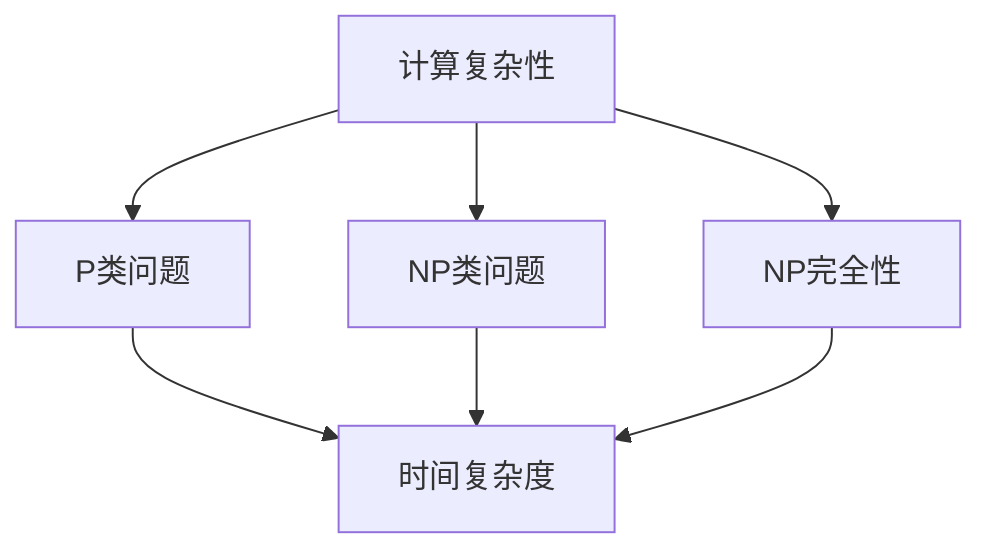

                 

### 引言

计算复杂性理论是现代计算机科学中的一块基石，它研究问题求解的难易程度，并提供了度量计算问题的工具。计算复杂性理论主要关注两个核心问题：一是问题本身求解的难易程度，二是求解问题的算法效率。本章将深入探讨计算复杂性理论，并尝试站在两个世界之间的视角来理解这一重要的计算机科学领域。

**关键词**：计算复杂性，P vs NP问题，时间复杂度，空间复杂度，算法设计

**摘要**：本章首先定义了计算复杂性的基本概念，包括计算复杂性的定义、度量和分类。接着，我们将讨论计算复杂性在计算机科学中的重要地位，以及它对算法设计的影响。随后，我们将回顾计算复杂性理论的发展历程，从早期的Cook-Levin定理到最近的P vs NP问题。此外，我们还将探讨计算复杂性理论在人工智能和其他计算机科学领域中的应用，以及它面临的挑战和未来发展方向。

### 1.1 计算复杂性的概念

计算复杂性理论的核心在于对问题求解的难易程度进行量化。在计算复杂性理论中，问题可以分为两类：可解问题和不可解问题。可解问题指的是可以通过某种算法在有限时间内求解的问题，而不可解问题则是指无法在有限时间内求解的问题。

**计算复杂性的定义**：

计算复杂性主要关注以下三个方面：

1. **时间复杂度**：衡量一个算法在解决问题时所需的时间长度，通常用大O符号表示。例如，如果一个算法的时间复杂度为O(n)，则随着输入规模n的增加，算法所需的时间大致与n成正比。

2. **空间复杂度**：衡量一个算法在解决问题时所需的空间大小，同样使用大O符号表示。空间复杂度通常包括算法的存储需求和计算过程中的中间变量。

3. **其他复杂度**：除了时间复杂度和空间复杂度外，计算复杂性还包括其他类型的复杂度，如布尔复杂度、对数复杂度等。

**计算复杂性的度量**：

计算复杂性的度量通常通过以下几种方法：

1. **渐进分析**：这种方法关注算法在输入规模逐渐增大时的性能表现。通过渐进分析，可以了解算法在不同输入规模下的时间复杂度和空间复杂度。

2. **实例复杂度**：这种方法关注算法在不同输入实例下的性能表现。实例复杂度通常用于分析特定问题的算法，例如，旅行商问题。

3. **概率分析**：这种方法通过概率模型来分析算法的性能。在概率分析中，通常会考虑算法在多次运行中成功求解的概率。

### 1.2 计算复杂性的重要性

计算复杂性理论在计算机科学中具有重要地位，它不仅为算法设计提供了理论指导，还为我们理解问题求解的难易程度提供了工具。具体来说，计算复杂性理论的重要性体现在以下几个方面：

1. **算法设计**：计算复杂性理论提供了度量算法性能的量化方法，使我们能够根据复杂度分析来选择和优化算法。这有助于我们设计更高效的算法，提高问题求解的效率。

2. **问题分类**：计算复杂性理论帮助我们识别和分类不同类型的问题。通过了解问题的时间复杂度和空间复杂度，我们可以更好地理解问题求解的难易程度，从而为问题的求解提供更有效的策略。

3. **理论验证**：计算复杂性理论为算法提供了理论依据。通过证明某个算法的时间复杂度或空间复杂度，我们可以确认该算法的有效性，并为算法的应用提供理论支持。

4. **跨学科应用**：计算复杂性理论不仅限于计算机科学，它在数学、物理学、经济学等学科中也有广泛应用。通过计算复杂性理论，我们可以更好地理解和解决这些学科中的问题。

### 1.3 计算复杂性在算法设计中的应用

计算复杂性理论在算法设计中的应用至关重要。通过计算复杂性分析，我们可以评估算法的性能，从而指导算法的优化和改进。以下是一些计算复杂性理论在算法设计中的应用：

1. **选择合适的数据结构**：计算复杂性理论可以帮助我们选择合适的数据结构来存储和操作数据。例如，在解决排序问题时，选择合适的数据结构（如快速排序、归并排序）可以显著影响算法的时间复杂度。

2. **优化算法的实现**：通过计算复杂性分析，我们可以识别算法中时间复杂度较高的部分，并对其进行优化。例如，通过改进算法的递归实现，可以降低算法的空间复杂度。

3. **设计高效算法**：计算复杂性理论为我们提供了设计高效算法的指导原则。通过分析问题的复杂度，我们可以设计出更优的算法，从而提高问题求解的效率。

4. **算法性能评估**：计算复杂性理论为算法性能评估提供了量化指标。通过比较不同算法的复杂度，我们可以评估算法的优劣，从而选择最合适的算法。

### 1.4 计算复杂性理论的数学基础

计算复杂性理论的数学基础包括集合论、图论、概率论和计算理论等。以下是一些关键的数学概念和工具：

1. **集合论**：集合论是计算复杂性理论的基础。集合论提供了对集合、元素、子集等概念的定义和操作。这些概念和操作在计算复杂性分析中具有重要意义。

2. **图论**：图论是研究图及其性质的数学分支。在计算复杂性理论中，图论用于分析算法的性能，如图着色问题、网络流问题等。

3. **概率论**：概率论用于分析算法在随机输入下的性能。通过概率模型，我们可以评估算法在多次运行中的表现，从而了解算法的稳定性。

4. **计算理论**：计算理论是研究计算过程的数学分支。在计算复杂性理论中，计算理论提供了对计算过程、计算模型和计算复杂性分类的描述。

### 1.5 计算复杂性理论的挑战和未来发展方向

计算复杂性理论面临着一系列挑战和机遇。以下是一些关键挑战和未来发展方向：

1. **P vs NP问题**：P vs NP问题是计算复杂性理论的核心问题之一。该问题询问：所有可以在多项式时间内求解的问题（P类问题）是否都等同于所有可以在多项式时间内验证的答案（NP类问题）。解决P vs NP问题将有助于我们理解问题求解的难易程度，并对算法设计产生深远影响。

2. **算法优化**：随着问题规模的增大，算法的优化变得至关重要。计算复杂性理论为我们提供了评估算法性能的指标，从而指导算法的优化。未来研究方向包括开发新的优化算法和技术，以提高算法的效率。

3. **跨学科应用**：计算复杂性理论在数学、物理学、经济学等学科中具有广泛的应用前景。未来研究方向包括将计算复杂性理论与其他学科相结合，解决跨学科问题。

4. **计算资源优化**：随着大数据和云计算的发展，计算资源的优化成为重要课题。计算复杂性理论为我们提供了评估计算资源利用率的工具，从而指导计算资源的优化和管理。

5. **人工智能与计算复杂性**：计算复杂性理论在人工智能领域具有广泛应用。未来研究方向包括分析人工智能算法的计算复杂性，优化人工智能算法的性能。

### 1.6 本章总结

本章介绍了计算复杂性理论的基本概念、重要性以及在算法设计中的应用。我们定义了计算复杂性的度量方法，并探讨了计算复杂性理论在计算机科学中的地位。此外，我们还回顾了计算复杂性理论的发展历程，并展望了未来的发展方向。通过本章的内容，读者可以初步了解计算复杂性理论，并为后续章节的学习打下基础。

### 1.7 小结

计算复杂性理论是现代计算机科学中的一块基石，它为我们理解问题求解的难易程度提供了量化工具。通过计算复杂性分析，我们可以评估算法的性能，指导算法的设计和优化。本章介绍了计算复杂性的基本概念、度量方法以及在算法设计中的应用。下一章我们将进一步探讨计算复杂性理论的基本概念，包括P、NP和NP完全性的定义和分类。

### 1.8 思考题

1. 计算复杂性理论的核心概念是什么？它们如何度量问题求解的难易程度？
2. 时间复杂度和空间复杂度在算法设计中分别起到什么作用？
3. 计算复杂性理论在计算机科学中具有哪些重要应用？
4. 计算复杂性理论的发展历程中，有哪些关键理论和进展？
5. 你认为计算复杂性理论在未来会有哪些重要的发展方向？

---

### 第1章 引言

计算复杂性理论是现代计算机科学中的一块基石，它研究问题求解的难易程度，并提供了度量计算问题的工具。计算复杂性理论主要关注两个核心问题：一是问题本身求解的难易程度，二是求解问题的算法效率。本章将深入探讨计算复杂性理论，并尝试站在两个世界之间的视角来理解这一重要的计算机科学领域。

**关键词**：计算复杂性，P vs NP问题，时间复杂度，空间复杂度，算法设计

**摘要**：本章首先定义了计算复杂性的基本概念，包括计算复杂性的定义、度量和分类。接着，我们将讨论计算复杂性在计算机科学中的重要地位，以及它对算法设计的影响。随后，我们将回顾计算复杂性理论的发展历程，从早期的Cook-Levin定理到最近的P vs NP问题。此外，我们还将探讨计算复杂性理论在人工智能和其他计算机科学领域中的应用，以及它面临的挑战和未来发展方向。

### 1.1 计算复杂性的概念

计算复杂性理论的核心在于对问题求解的难易程度进行量化。在计算复杂性理论中，问题可以分为两类：可解问题和不可解问题。可解问题指的是可以通过某种算法在有限时间内求解的问题，而不可解问题则是指无法在有限时间内求解的问题。

**计算复杂性的定义**：

计算复杂性主要关注以下三个方面：

1. **时间复杂度**：衡量一个算法在解决问题时所需的时间长度，通常用大O符号表示。例如，如果一个算法的时间复杂度为O(n)，则随着输入规模n的增加，算法所需的时间大致与n成正比。

2. **空间复杂度**：衡量一个算法在解决问题时所需的空间大小，同样使用大O符号表示。空间复杂度通常包括算法的存储需求和计算过程中的中间变量。

3. **其他复杂度**：除了时间复杂度和空间复杂度外，计算复杂性还包括其他类型的复杂度，如布尔复杂度、对数复杂度等。

**计算复杂性的度量**：

计算复杂性的度量通常通过以下几种方法：

1. **渐进分析**：这种方法关注算法在输入规模逐渐增大时的性能表现。通过渐进分析，可以了解算法在不同输入规模下的时间复杂度和空间复杂度。

2. **实例复杂度**：这种方法关注算法在不同输入实例下的性能表现。实例复杂度通常用于分析特定问题的算法，例如，旅行商问题。

3. **概率分析**：这种方法通过概率模型来分析算法的性能。在概率分析中，通常会考虑算法在多次运行中成功求解的概率。

### 1.2 计算复杂性的重要性

计算复杂性理论在计算机科学中具有重要地位，它不仅为算法设计提供了理论指导，还为我们理解问题求解的难易程度提供了工具。具体来说，计算复杂性理论的重要性体现在以下几个方面：

1. **算法设计**：计算复杂性理论提供了度量算法性能的量化方法，使我们能够根据复杂度分析来选择和优化算法。这有助于我们设计更高效的算法，提高问题求解的效率。

2. **问题分类**：计算复杂性理论帮助我们识别和分类不同类型的问题。通过了解问题的时间复杂度和空间复杂度，我们可以更好地理解问题求解的难易程度，从而为问题的求解提供更有效的策略。

3. **理论验证**：计算复杂性理论为算法提供了理论依据。通过证明某个算法的时间复杂度或空间复杂度，我们可以确认该算法的有效性，并为算法的应用提供理论支持。

4. **跨学科应用**：计算复杂性理论不仅限于计算机科学，它在数学、物理学、经济学等学科中也有广泛应用。通过计算复杂性理论，我们可以更好地理解和解决这些学科中的问题。

### 1.3 计算复杂性在算法设计中的应用

计算复杂性理论在算法设计中的应用至关重要。通过计算复杂性分析，我们可以评估算法的性能，从而指导算法的优化和改进。以下是一些计算复杂性理论在算法设计中的应用：

1. **选择合适的数据结构**：计算复杂性理论可以帮助我们选择合适的数据结构来存储和操作数据。例如，在解决排序问题时，选择合适的数据结构（如快速排序、归并排序）可以显著影响算法的时间复杂度。

2. **优化算法的实现**：通过计算复杂性分析，我们可以识别算法中时间复杂度较高的部分，并对其进行优化。例如，通过改进算法的递归实现，可以降低算法的空间复杂度。

3. **设计高效算法**：计算复杂性理论为我们提供了设计高效算法的指导原则。通过分析问题的复杂度，我们可以设计出更优的算法，从而提高问题求解的效率。

4. **算法性能评估**：计算复杂性理论为算法性能评估提供了量化指标。通过比较不同算法的复杂度，我们可以评估算法的优劣，从而选择最合适的算法。

### 1.4 计算复杂性理论的数学基础

计算复杂性理论的数学基础包括集合论、图论、概率论和计算理论等。以下是一些关键的数学概念和工具：

1. **集合论**：集合论是计算复杂性理论的基础。集合论提供了对集合、元素、子集等概念的定义和操作。这些概念和操作在计算复杂性分析中具有重要意义。

2. **图论**：图论是研究图及其性质的数学分支。在计算复杂性理论中，图论用于分析算法的性能，如图着色问题、网络流问题等。

3. **概率论**：概率论用于分析算法在随机输入下的性能。通过概率模型，我们可以评估算法在多次运行中的表现，从而了解算法的稳定性。

4. **计算理论**：计算理论是研究计算过程的数学分支。在计算复杂性理论中，计算理论提供了对计算过程、计算模型和计算复杂性分类的描述。

### 1.5 计算复杂性理论的挑战和未来发展方向

计算复杂性理论面临着一系列挑战和机遇。以下是一些关键挑战和未来发展方向：

1. **P vs NP问题**：P vs NP问题是计算复杂性理论的核心问题之一。该问题询问：所有可以在多项式时间内求解的问题（P类问题）是否都等同于所有可以在多项式时间内验证的答案（NP类问题）。解决P vs NP问题将有助于我们理解问题求解的难易程度，并对算法设计产生深远影响。

2. **算法优化**：随着问题规模的增大，算法的优化变得至关重要。计算复杂性理论为我们提供了评估算法性能的指标，从而指导算法的优化。未来研究方向包括开发新的优化算法和技术，以提高算法的效率。

3. **跨学科应用**：计算复杂性理论在数学、物理学、经济学等学科中具有广泛的应用前景。未来研究方向包括将计算复杂性理论与其他学科相结合，解决跨学科问题。

4. **计算资源优化**：随着大数据和云计算的发展，计算资源的优化成为重要课题。计算复杂性理论为我们提供了评估计算资源利用率的工具，从而指导计算资源的优化和管理。

5. **人工智能与计算复杂性**：计算复杂性理论在人工智能领域具有广泛应用。未来研究方向包括分析人工智能算法的计算复杂性，优化人工智能算法的性能。

### 1.6 本章总结

本章介绍了计算复杂性理论的基本概念、重要性以及在算法设计中的应用。我们定义了计算复杂性的度量方法，并探讨了计算复杂性理论在计算机科学中的地位。此外，我们还回顾了计算复杂性理论的发展历程，并展望了未来的发展方向。通过本章的内容，读者可以初步了解计算复杂性理论，并为后续章节的学习打下基础。

### 1.7 小结

计算复杂性理论是现代计算机科学中的一块基石，它为我们理解问题求解的难易程度提供了量化工具。通过计算复杂性分析，我们可以评估算法的性能，指导算法的设计和优化。本章介绍了计算复杂性的基本概念、度量方法以及在算法设计中的应用。下一章我们将进一步探讨计算复杂性理论的基本概念，包括P、NP和NP完全性的定义和分类。

### 1.8 思考题

1. 计算复杂性理论的核心概念是什么？它们如何度量问题求解的难易程度？
2. 时间复杂度和空间复杂度在算法设计中分别起到什么作用？
3. 计算复杂性理论在计算机科学中具有哪些重要应用？
4. 计算复杂性理论的发展历程中，有哪些关键理论和进展？
5. 你认为计算复杂性理论在未来会有哪些重要的发展方向？

---

## 第2章 计算复杂性的基本概念

计算复杂性理论的核心在于对问题求解的难易程度进行量化，以帮助我们理解和设计更高效的算法。本章将深入探讨计算复杂性理论的基本概念，包括P、NP和NP完全性的定义，以及计算复杂性的分类和时间、空间复杂度的度量。

### 2.1 P、NP 和 NP 完全性

在计算复杂性理论中，P、NP和NP完全性是三个重要的概念。这些概念帮助我们分类和量化问题求解的难易程度。

**P类问题**：

P类问题是可以在多项式时间内求解的问题。这意味着，对于某个输入规模为n的问题，求解该问题的算法所需的时间是O(n^k)，其中k是一个常数。换句话说，P类问题可以通过一个时间复杂度在多项式范围内的算法求解。

**NP类问题**：

NP类问题是可以在多项式时间内验证的问题。对于一个NP类问题，如果存在一个算法可以在多项式时间内验证某个解，则该问题属于NP类。换句话说，对于某个输入规模为n的问题，如果存在一个算法可以在O(n^k)的时间内验证一个解，则该问题属于NP类。

**NP完全性**：

NP完全性是一个问题是否为所有NP类问题的最优化子集的性质。如果一个问题既是NP类问题，又能在多项式时间内将任何其他NP类问题转化为自身，则该问题被称为NP完全问题。换句话说，如果一个问题可以在多项式时间内解决任何NP类问题，那么它就是NP完全问题。

**P与NP的关系**：

P与NP的关系是计算复杂性理论的核心问题之一。P vs NP问题询问：所有可以在多项式时间内求解的问题（P类问题）是否都等同于所有可以在多项式时间内验证的答案（NP类问题）。如果P=NP，那么所有NP类问题都可以在多项式时间内求解，这将意味着计算复杂性理论的许多基本假设将失效。然而，目前尚无证据表明P=NP，也没有人能够证明P≠NP。

### 2.2 计算复杂性的分类

计算复杂性可以根据不同的维度进行分类。以下是几种常见的计算复杂性分类：

1. **时间复杂度**：

时间复杂度衡量一个算法在解决问题时所需的时间长度。常见的时间复杂度分类包括常数时间（O(1)）、对数时间（O(log n)）、线性时间（O(n)）、线性对数时间（O(n log n)）和多项式时间（O(n^k)，其中k是常数）。

2. **空间复杂度**：

空间复杂度衡量一个算法在解决问题时所需的空间大小。常见空间复杂度分类包括常数空间（O(1)）、对数空间（O(log n)）、线性空间（O(n)）、线性对数空间（O(n log n)）和多空间（O(n^k)，其中k是常数）。

3. **其他复杂度**：

除了时间复杂度和空间复杂度外，计算复杂性还包括其他类型的复杂度，如布尔复杂度、对数复杂度和通信复杂度。

### 2.3 计算复杂性的度量

计算复杂性的度量通常通过以下几种方法：

1. **渐进分析**：

渐进分析是计算复杂性理论中最常用的方法之一。渐进分析关注算法在输入规模逐渐增大时的性能表现。通过渐进分析，我们可以了解算法在不同输入规模下的时间复杂度和空间复杂度。

2. **实例复杂度**：

实例复杂度关注算法在不同输入实例下的性能表现。实例复杂度通常用于分析特定问题的算法，例如，旅行商问题。

3. **概率分析**：

概率分析通过概率模型来分析算法的性能。在概率分析中，通常会考虑算法在多次运行中成功求解的概率。

### 2.4 计算复杂性理论的基本概念与联系

为了更好地理解计算复杂性理论的基本概念，我们可以通过一个Mermaid流程图来展示它们之间的联系。



在这个流程图中，计算复杂性是核心概念，它涵盖了P类问题、NP类问题和NP完全性。P类问题和NP类问题分别关注问题求解的难易程度，而NP完全性则是一个问题的优化性质。时间复杂度是度量算法性能的关键指标，它与P类问题、NP类问题和NP完全性密切相关。

### 2.5 计算复杂性理论的数学模型

计算复杂性理论的数学模型包括集合论、图论、概率论和计算理论等。以下是几个关键数学模型的例子：

1. **集合论**：

集合论提供了对集合、元素、子集等概念的定义和操作。在计算复杂性理论中，集合论用于定义问题的解空间，以及求解算法的执行过程。

2. **图论**：

图论是研究图及其性质的数学分支。在计算复杂性理论中，图论用于分析图着色问题、网络流问题等。

3. **概率论**：

概率论用于分析算法在随机输入下的性能。通过概率模型，我们可以评估算法在多次运行中的表现，从而了解算法的稳定性。

4. **计算理论**：

计算理论是研究计算过程的数学分支。在计算复杂性理论中，计算理论提供了对计算过程、计算模型和计算复杂性分类的描述。

### 2.6 计算复杂性理论的应用实例

为了更好地理解计算复杂性理论的应用，我们可以通过一些具体实例来分析。

**实例1：旅行商问题**

旅行商问题是一个经典的NP完全问题。给定一个加权无向图，求解一个 Hamiltonian 循环，即访问每个城市一次并返回起点的最短路径。旅行商问题的解决算法的时间复杂度通常在O(n^2)到O(n^3)之间。

**实例2：背包问题**

背包问题是一个经典的组合优化问题。给定一组物品和它们的重量和价值，求解如何选择物品以使总价值最大且总重量不超过给定限制。背包问题的解决方案通常涉及动态规划算法，其时间复杂度为O(nW)，其中n是物品数量，W是背包容量。

**实例3：图着色问题**

图着色问题是图论中的一个经典问题。给定一个无向图，求解使用最少颜色将图的每个顶点着色的方案。图着色问题的解决算法的时间复杂度通常在O(n^2)到O(n^3)之间。

通过这些实例，我们可以看到计算复杂性理论在实际问题中的应用。计算复杂性分析帮助我们了解问题求解的难易程度，从而指导算法的设计和优化。

### 2.7 本章总结

本章介绍了计算复杂性理论的基本概念，包括P、NP和NP完全性的定义，以及计算复杂性的分类和时间、空间复杂度的度量。我们通过Mermaid流程图展示了计算复杂性理论的基本概念与联系，并列举了几个关键数学模型。此外，我们还通过应用实例展示了计算复杂性理论在实际问题中的应用。通过本章的内容，读者可以更深入地理解计算复杂性理论，为后续章节的学习打下基础。

### 2.8 小结

计算复杂性理论是现代计算机科学中的一个重要领域，它为我们理解和度量问题求解的难易程度提供了量化工具。本章介绍了计算复杂性理论的基本概念，包括P、NP和NP完全性的定义，以及计算复杂性的分类和时间、空间复杂度的度量。通过具体实例，我们展示了计算复杂性理论在实际问题中的应用。在下一章中，我们将回顾计算复杂性理论的发展历程，从早期的Cook-Levin定理到最近的P vs NP问题，并探讨计算复杂性理论在计算机科学中的应用。

### 2.9 思考题

1. P类问题和NP类问题的区别是什么？它们在计算复杂性理论中分别有什么作用？
2. 什么是NP完全性？为什么NP完全性问题在计算复杂性理论中具有重要意义？
3. 时间复杂度和空间复杂度在算法设计中分别起到什么作用？
4. 计算复杂性理论的哪些数学模型在分析问题求解过程中至关重要？
5. 你能举例说明计算复杂性理论在计算机科学中的具体应用吗？

---

## 第3章 计算复杂性理论的发展

计算复杂性理论的发展是一个不断推进的过程，它起源于计算机科学的早期阶段，并在多年的研究中积累了丰富的理论和应用。本章将回顾计算复杂性理论的发展历程，从早期的Cook-Levin定理到最近的P vs NP问题，并探讨计算复杂性理论的最新进展。

### 3.1 早期研究

计算复杂性理论的早期研究可以追溯到20世纪60年代和70年代。在这个时期，一些重要的理论和算法被提出，为计算复杂性理论奠定了基础。

**Cook-Levin定理**：

1971年，斯蒂芬·Cook（Stephen Cook）提出了一个重要的定理，即Cook-Levin定理。该定理表明，SAT问题（即满足性问题）是NP完全的。Cook-Levin定理的证明使用了图灵机的概念，并奠定了NP完全性的基础。Cook-Levin定理的提出标志着计算复杂性理论的诞生，并对后续的研究产生了深远影响。

**Karp减法定理**：

1972年，理查德·Karp（Richard Karp）提出了一组21个经典问题，称为Karp减法问题。Karp减法定理表明，如果任何一个Karp减法问题都是NP完全的，那么所有NP完全问题都可以通过多项式时间转化为其中一个问题。Karp减法定理的提出进一步扩展了计算复杂性理论的研究范围，并为确定NP完全问题提供了有力工具。

### 3.2 Cook-Levin定理的证明

Cook-Levin定理的证明涉及图灵机和Cook定理。Cook定理表明，任何可以由图灵机在多项式时间内验证的命题都可以用图灵机在多项式时间内表示。而Lewin定理则表明，任何可以在多项式时间内求解的问题都可以由图灵机在多项式时间内表示。

结合Cook定理和Lewin定理，我们可以证明Cook-Levin定理。具体来说，假设存在一个算法A可以在多项式时间内验证一个解，我们可以构造一个图灵机M，使得M在输入x时，如果x是SAT问题的解，则M会在多项式时间内接受x，否则M会在多项式时间内拒绝x。这样，我们就可以用图灵机M来表示SAT问题，从而证明了SAT问题是NP完全的。

### 3.3 Karp减法定理的应用

Karp减法定理的应用非常广泛，它为我们提供了一个将任意NP完全问题转化为Karp减法问题之一的方法。通过这种方法，我们可以验证一个NP完全问题的NP完全性，并为解决其他NP完全问题提供指导。

例如，假设我们要证明某个问题X是NP完全的。我们可以通过以下步骤进行证明：

1. 选择一个已知的NP完全问题Y。
2. 使用Karp减法定理，将问题X转化为问题Y。
3. 如果问题Y是NP完全的，则问题X也是NP完全的。

通过Karp减法定理，我们可以将计算复杂性理论的研究范围扩展到更广泛的问题，并深入了解NP完全问题的性质。

### 3.4 计算复杂性理论的最新进展

计算复杂性理论在过去的几十年里取得了许多重要进展，这些进展不仅丰富了理论体系，还推动了算法设计和优化的发展。

**P vs NP问题**：

P vs NP问题是计算复杂性理论的核心问题之一。它询问：所有可以在多项式时间内求解的问题（P类问题）是否都等同于所有可以在多项式时间内验证的答案（NP类问题）。目前，尚无证据表明P=NP，也没有人能够证明P≠NP。P vs NP问题的解决将有助于我们理解问题求解的难易程度，并对算法设计产生深远影响。

**量子计算与计算复杂性**：

量子计算是计算复杂性理论的重要研究领域之一。量子计算机利用量子力学原理进行计算，可以解决一些传统计算机无法解决的问题。量子计算与计算复杂性的结合为解决计算难题提供了新的思路和工具。近年来，量子计算在计算复杂性理论中的应用取得了许多重要进展，如量子算法的设计和量子复杂性的研究。

**分布式计算与计算复杂性**：

分布式计算是计算复杂性理论的另一个重要研究领域。分布式计算通过将任务分解为多个子任务，并在多个计算节点上并行执行，以提高计算效率和性能。分布式计算与计算复杂性的结合为解决大规模问题提供了有效的方法。近年来，分布式计算在计算复杂性理论中的应用取得了许多重要进展，如分布式算法的设计和优化。

### 3.5 计算复杂性理论的未来发展方向

计算复杂性理论的发展面临着许多挑战和机遇。未来，计算复杂性理论将在以下几个方面取得重要进展：

**算法优化**：

随着问题规模的增大，算法的优化变得至关重要。计算复杂性理论将致力于开发新的优化算法和技术，以提高算法的效率。

**跨学科应用**：

计算复杂性理论将在其他学科中发挥越来越重要的作用。例如，在生物学、经济学、社会科学等领域，计算复杂性理论可以提供有效的理论支持和工具。

**量子计算与计算复杂性**：

量子计算与计算复杂性的结合将为解决计算难题提供新的思路和工具。未来，量子计算与计算复杂性理论将取得更多重要进展，为量子算法的设计和优化提供理论支持。

**计算资源优化**：

随着大数据和云计算的发展，计算资源的优化成为重要课题。计算复杂性理论将为我们提供评估计算资源利用率的工具，从而指导计算资源的优化和管理。

**人工智能与计算复杂性**：

人工智能与计算复杂性的结合将为人工智能算法的设计和优化提供新的思路和工具。未来，计算复杂性理论将在人工智能领域发挥重要作用，为人工智能算法的性能优化提供理论支持。

### 3.6 本章总结

本章回顾了计算复杂性理论的发展历程，从早期的Cook-Levin定理到最近的P vs NP问题，以及计算复杂性理论的最新进展。我们介绍了Cook-Levin定理和Karp减法定理，探讨了计算复杂性理论的数学基础和应用实例。此外，我们还讨论了计算复杂性理论的未来发展方向。通过本章的内容，读者可以更深入地了解计算复杂性理论的发展历程和未来趋势，为后续章节的学习打下基础。

### 3.7 小结

计算复杂性理论的发展是一个不断推进的过程，它起源于计算机科学的早期阶段，并在多年的研究中积累了丰富的理论和应用。本章回顾了计算复杂性理论的发展历程，从早期的Cook-Levin定理到最近的P vs NP问题，以及计算复杂性理论的最新进展。我们探讨了计算复杂性理论的数学基础和应用实例，并讨论了未来发展方向。在下一章中，我们将探讨计算复杂性理论在计算机科学中的应用，以及它在算法设计和优化中的作用。

### 3.8 思考题

1. 计算复杂性理论的早期研究有哪些重要成果？
2. Cook-Levin定理和Karp减法定理分别是什么？它们在计算复杂性理论中有什么作用？
3. 你认为计算复杂性理论在未来会有哪些重要的发展方向？
4. 量子计算与计算复杂性的结合将如何推动计算复杂性理论的发展？
5. 计算复杂性理论在计算机科学中的应用有哪些实例？

---

## 第4章 计算复杂性理论的应用

计算复杂性理论不仅在计算机科学的理论研究中具有重要意义，还在实际的计算机科学应用中发挥着关键作用。本章将探讨计算复杂性理论在算法设计、计算机科学的其他领域以及人工智能中的应用，并通过具体实例展示其应用效果。

### 4.1 算法设计

计算复杂性理论在算法设计中的应用主要体现在两个方面：一是优化现有算法，提高其效率；二是设计新算法，解决复杂问题。

**优化现有算法**：

通过计算复杂性分析，我们可以识别算法中时间复杂度较高的部分，并对其进行优化。例如，快速排序算法在平均情况下的时间复杂度为O(n log n)，但最坏情况下的时间复杂度为O(n^2)。通过分析算法的复杂度，我们可以发现最坏情况的发生条件，并采取相应的优化措施，如使用随机化算法来降低最坏情况的发生概率。

**设计新算法**：

计算复杂性理论为新算法的设计提供了理论指导。例如，为了解决NP完全问题，人们设计了许多启发式算法，如遗传算法、模拟退火算法等。这些算法通常采用概率模型和迭代方法，以在复杂问题中找到近似解。

**实例1：旅行商问题**

旅行商问题是一个典型的NP完全问题。通过计算复杂性分析，我们可以了解旅行商问题在不同输入规模下的时间复杂度。在此基础上，人们设计了许多优化算法，如启发式算法、遗传算法等，以在合理的时间内找到近似解。

**实例2：背包问题**

背包问题也是一个典型的组合优化问题。通过计算复杂性分析，我们可以了解背包问题在不同输入规模下的时间复杂度。在此基础上，人们设计了许多动态规划算法和启发式算法，以在合理的时间内找到最优解或近似解。

### 4.2 计算机科学的其他领域

计算复杂性理论在计算机科学的其他领域中也发挥着重要作用。以下是一些具体应用：

**密码学**：

密码学是计算机科学中的一个重要分支，它研究如何保护数据的安全和隐私。计算复杂性理论在密码学中用于分析加密算法的安全性。例如，公钥加密算法（如RSA算法）的安全性依赖于大整数分解问题的难解性，而计算复杂性理论为我们提供了评估大整数分解问题复杂性的工具。

**理论计算机科学**：

理论计算机科学是计算机科学的基础，它研究计算机系统的基本原理和算法。计算复杂性理论在理论计算机科学中用于分析算法的效率、计算模型的性能等。例如，计算复杂性理论帮助我们理解量子计算机相对于传统计算机的优势，以及分布式计算模型的有效性。

**编译原理**：

编译原理是计算机科学中的一个重要领域，它研究如何将高级编程语言转换为机器语言。计算复杂性理论在编译原理中用于分析编译器的性能。例如，编译器优化技术（如代码优化、循环优化等）依赖于计算复杂性理论，以降低编译器的空间和时间复杂度。

### 4.3 人工智能中的应用

计算复杂性理论在人工智能中的应用日益广泛，特别是在机器学习和深度学习领域。以下是一些具体应用：

**机器学习**：

在机器学习中，计算复杂性理论用于分析学习算法的效率。例如，在监督学习中，支持向量机（SVM）算法的时间复杂度与训练样本的数量和特征空间的大小密切相关。通过计算复杂性分析，我们可以选择合适的算法和模型，以优化学习过程。

**深度学习**：

深度学习是一种基于多层神经网络的机器学习方法。计算复杂性理论在深度学习中用于分析神经网络训练和推理的过程。例如，深度学习算法的时间复杂度通常与网络的层数和每层的神经元数量有关。通过计算复杂性分析，我们可以优化神经网络的结构和参数，以提高训练和推理的效率。

**实例1：深度学习中的优化算法**

在深度学习中，优化算法（如梯度下降、Adam等）的选择和参数设置对训练效率有很大影响。计算复杂性理论为我们提供了分析这些算法的效率的工具。例如，我们可以通过计算复杂性分析，选择合适的优化算法和参数，以加快训练过程。

**实例2：生成对抗网络（GAN）**

生成对抗网络（GAN）是一种强大的深度学习模型，用于生成逼真的图像、音频和文本。计算复杂性理论在GAN中用于分析生成器和判别器的训练过程。通过计算复杂性分析，我们可以优化GAN的训练策略，以提高生成质量。

### 4.4 应用实例

**实例1：推荐系统**

推荐系统是人工智能中的一个重要应用，它用于根据用户的历史行为和偏好，为用户推荐感兴趣的商品、音乐、电影等。计算复杂性理论在推荐系统中用于分析推荐算法的效率。例如，基于协同过滤的推荐算法的时间复杂度与用户和项目的数量有关。通过计算复杂性分析，我们可以选择合适的算法和模型，以优化推荐系统的性能。

**实例2：图像识别**

图像识别是计算机视觉中的一个重要任务，它用于从图像中识别和分类对象。计算复杂性理论在图像识别中用于分析卷积神经网络（CNN）的效率。例如，CNN的时间复杂度与网络的层数和每层的神经元数量有关。通过计算复杂性分析，我们可以优化CNN的结构和参数，以提高图像识别的准确性。

**实例3：自然语言处理**

自然语言处理（NLP）是人工智能中的一个重要领域，它涉及理解和生成自然语言。计算复杂性理论在NLP中用于分析语言模型和文本分类算法的效率。例如，基于循环神经网络（RNN）的语言模型的时间复杂度与词汇表的大小和句子长度有关。通过计算复杂性分析，我们可以优化NLP算法，以提高语言理解和生成的准确性。

### 4.5 本章总结

计算复杂性理论在计算机科学的多个领域中具有广泛的应用。通过计算复杂性分析，我们可以优化算法设计、解决复杂问题，并在人工智能领域发挥重要作用。本章介绍了计算复杂性理论在算法设计、计算机科学的其他领域以及人工智能中的应用，并通过具体实例展示了其应用效果。通过本章的内容，读者可以更深入地了解计算复杂性理论的应用，并为实际问题的解决提供理论支持。

### 4.6 小结

计算复杂性理论在计算机科学中的应用具有广泛而深远的影响。本章介绍了计算复杂性理论在算法设计、密码学、理论计算机科学、编译原理以及人工智能等领域的应用。通过具体实例，我们展示了计算复杂性分析在优化算法、解决复杂问题和提高人工智能算法性能方面的作用。在下一章中，我们将进一步探讨计算复杂性理论在人工智能中的具体应用，以及它对人工智能算法性能的影响。

### 4.7 思考题

1. 计算复杂性理论在算法设计中有哪些具体应用？
2. 你能举例说明计算复杂性理论在计算机科学的其他领域中的应用吗？
3. 计算复杂性理论如何帮助优化人工智能算法的性能？
4. 你认为计算复杂性理论在人工智能领域未来的发展方向是什么？
5. 你能举例说明计算复杂性分析在解决实际问题中的应用吗？

---

## 第5章 计算复杂性在人工智能中的应用

计算复杂性理论在人工智能（AI）领域中的应用日益广泛，尤其在机器学习和深度学习中，它为我们提供了评估算法性能、优化模型设计以及解决复杂问题的有力工具。本章将深入探讨计算复杂性理论在人工智能中的应用，包括计算复杂性的基本概念、人工智能中的计算复杂性分析，以及计算复杂性理论在深度学习中的应用实例。

### 5.1 计算复杂性的基本概念

计算复杂性理论的核心在于对问题求解的难易程度进行量化。在人工智能领域，计算复杂性的度量主要涉及时间复杂度和空间复杂度。

**时间复杂度**：

时间复杂度衡量一个算法在解决问题时所需的时间长度。在机器学习和深度学习中，时间复杂度通常与训练数据的大小、模型的复杂度以及迭代次数等因素相关。例如，梯度下降算法的时间复杂度与训练数据量和迭代次数成正比。

**空间复杂度**：

空间复杂度衡量一个算法在解决问题时所需的空间大小。在机器学习和深度学习中，空间复杂度主要与模型的参数数量、存储需求以及中间变量的数量相关。例如，神经网络的空间复杂度与网络的层数和每层的神经元数量成正比。

### 5.2 人工智能中的计算复杂性分析

在人工智能中，计算复杂性分析有助于我们理解算法的性能，并指导模型的优化。以下是一些关键步骤和方法：

**1. 时间复杂度分析**：

时间复杂度分析主要用于评估算法在处理大规模数据时的性能。通过分析算法的时间复杂度，我们可以预测算法在不同数据规模下的运行时间，并选择合适的算法。例如，在处理大规模图像数据时，卷积神经网络（CNN）的时间复杂度通常较低，因为它可以并行处理多个数据。

**2. 空间复杂度分析**：

空间复杂度分析主要用于评估算法在存储需求方面的性能。通过分析算法的空间复杂度，我们可以预测算法在不同数据规模下的存储需求，并选择合适的算法。例如，在处理大规模文本数据时，循环神经网络（RNN）的空间复杂度通常较低，因为它可以共享权重和激活值。

**3. 计算资源优化**：

计算资源优化是计算复杂性分析的一个重要应用。通过优化算法和模型的设计，我们可以减少计算资源的需求，从而提高系统的性能和效率。例如，在深度学习中，我们可以通过参数共享、模型压缩和量化等技术来减少模型的存储和计算需求。

**4. 评估和比较算法**：

计算复杂性分析为我们提供了评估和比较不同算法和模型性能的工具。通过分析算法的时间复杂度和空间复杂度，我们可以选择最合适的算法和模型，以解决特定问题。例如，在分类问题中，我们可以通过比较支持向量机（SVM）、决策树和神经网络等算法的复杂度，选择最佳算法。

### 5.3 计算复杂性理论在深度学习中的应用实例

深度学习是人工智能中的一个重要领域，计算复杂性理论在深度学习中的应用具有重要意义。以下是一些具体的应用实例：

**1. 神经网络训练**：

在神经网络训练过程中，计算复杂性分析帮助我们评估训练过程的效率和性能。例如，在训练卷积神经网络（CNN）时，我们可以通过分析时间复杂度来确定最优的网络结构，以减少训练时间。此外，通过分析空间复杂度，我们可以优化模型的存储需求。

**2. 梯度下降算法**：

梯度下降算法是深度学习中常用的优化算法。计算复杂性分析可以帮助我们评估梯度下降算法在不同数据规模下的性能。例如，通过分析时间复杂度，我们可以确定最优的学习率和迭代次数，以加快训练过程。

**3. 深度学习模型压缩**：

深度学习模型压缩是一种通过减少模型参数和计算量来提高模型效率的技术。计算复杂性分析可以帮助我们评估模型压缩技术对计算性能的影响。例如，通过分析空间复杂度，我们可以确定最佳的压缩策略，以减少模型的存储需求。

**实例1：卷积神经网络（CNN）**

卷积神经网络（CNN）是深度学习中的一个重要模型，用于图像识别和分类。通过计算复杂性分析，我们可以评估CNN的时间复杂度和空间复杂度。例如，在训练一个CNN模型时，我们可以通过分析时间复杂度来确定最优的网络结构，以减少训练时间。此外，通过分析空间复杂度，我们可以优化模型的存储需求。

**实例2：循环神经网络（RNN）**

循环神经网络（RNN）是深度学习中的一个重要模型，用于序列数据分析和生成。通过计算复杂性分析，我们可以评估RNN的时间复杂度和空间复杂度。例如，在训练一个RNN模型时，我们可以通过分析时间复杂度来确定最优的网络结构，以减少训练时间。此外，通过分析空间复杂度，我们可以优化模型的存储需求。

**实例3：生成对抗网络（GAN）**

生成对抗网络（GAN）是深度学习中的一个重要模型，用于生成逼真的图像、音频和文本。通过计算复杂性分析，我们可以评估GAN的时间复杂度和空间复杂度。例如，在训练一个GAN模型时，我们可以通过分析时间复杂度来确定最优的网络结构，以减少训练时间。此外，通过分析空间复杂度，我们可以优化模型的存储需求。

### 5.4 本章总结

计算复杂性理论在人工智能中的应用具有重要意义，它帮助我们评估算法性能、优化模型设计以及解决复杂问题。本章介绍了计算复杂性的基本概念，分析了人工智能中的计算复杂性分析，并展示了计算复杂性理论在深度学习中的应用实例。通过本章的内容，读者可以更深入地了解计算复杂性理论在人工智能中的应用，并为实际问题的解决提供理论支持。

### 5.5 小结

计算复杂性理论在人工智能中的应用为算法设计、模型优化和复杂问题解决提供了有力工具。本章介绍了计算复杂性的基本概念，分析了人工智能中的计算复杂性分析，并通过具体实例展示了计算复杂性理论在深度学习中的应用。在下一章中，我们将探讨计算复杂性理论面临的挑战与未来发展方向。

### 5.6 思考题

1. 计算复杂性的基本概念在人工智能中有哪些应用？
2. 你认为计算复杂性分析在人工智能中最重要的应用是什么？
3. 你能举例说明计算复杂性理论在深度学习中的应用吗？
4. 你认为计算复杂性理论在人工智能领域未来的发展方向是什么？
5. 你如何利用计算复杂性理论来优化人工智能算法的性能？

---

## 第6章 计算复杂性挑战与未来

计算复杂性理论在计算机科学和人工智能中发挥着重要作用，但同时也面临着诸多挑战和机遇。本章将探讨计算复杂性理论面临的挑战、未来发展方向以及它在社会和经济方面的意义。

### 6.1 计算复杂性挑战

计算复杂性理论在发展过程中遇到了许多挑战，以下是其中一些主要的挑战：

**1. P vs NP问题**：

P vs NP问题是计算复杂性理论的核心挑战之一。如果P=NP，意味着所有NP问题都可以在多项式时间内求解，这将颠覆我们对问题难易程度的基本理解。然而，目前尚无证据表明P=NP，也没有人能够证明P≠NP。解决P vs NP问题将有助于我们深入了解问题求解的本质，并为算法设计提供新的思路。

**2. 大规模数据处理**：

随着数据量的爆炸性增长，如何高效地处理大规模数据成为计算复杂性理论的重要挑战。在处理大规模数据时，时间复杂度和空间复杂度的优化变得尤为重要。例如，在大数据环境中，如何优化分布式计算和并行处理技术，以提高数据处理的效率。

**3. 安全与隐私问题**：

随着计算复杂性理论在网络安全和隐私保护中的应用，如何确保数据的安全和隐私成为一个重要挑战。计算复杂性理论为我们提供了评估加密算法和安全协议性能的工具，但如何设计更加安全、高效的安全和隐私保护方案仍然是一个亟待解决的问题。

**4. 量子计算的影响**：

量子计算的出现为计算复杂性理论带来了新的挑战和机遇。量子计算机具有指数级的并行计算能力，可以解决一些传统计算机无法解决的问题。然而，量子计算的发展也使得某些加密算法和密码学协议面临威胁，如何应对量子计算的影响成为计算复杂性理论的重要课题。

### 6.2 计算复杂性理论的未来发展方向

计算复杂性理论在未来的发展中将面临许多机遇和挑战。以下是几个可能的发展方向：

**1. P vs NP问题的解决**：

解决P vs NP问题将极大地推动计算复杂性理论的发展。如果P=NP，我们将能够解决许多看似难以解决的问题，但如果P≠NP，我们可能需要重新审视问题求解的策略和算法设计。

**2. 新算法和优化技术**：

随着计算复杂性理论的发展，我们将继续发现新的算法和优化技术，以提高算法的效率和性能。例如，在深度学习和机器学习中，如何设计更高效的优化算法和模型结构，将是一个重要研究方向。

**3. 跨学科研究**：

计算复杂性理论在与其他学科的交叉研究中具有广阔的前景。例如，与量子计算、生物学、经济学等领域的结合，将有助于我们解决更复杂的问题，并推动计算复杂性理论的发展。

**4. 可扩展计算模型**：

随着计算资源的不断扩展，如何设计可扩展的计算模型成为计算复杂性理论的一个重要课题。例如，分布式计算、云计算和边缘计算等新型计算模型的研究，将为计算复杂性理论提供新的研究内容和应用场景。

### 6.3 计算复杂性理论的社会和经济意义

计算复杂性理论不仅具有重要的理论价值，还在社会和经济方面具有重要的意义：

**1. 促进科技创新**：

计算复杂性理论为科技创新提供了理论支持和指导。通过研究计算复杂性，我们可以设计出更高效的算法和模型，推动科技的发展和应用。

**2. 提高经济效益**：

计算复杂性理论在许多实际应用中具有重要的经济效益。例如，在大数据处理、金融交易、网络安全等领域，计算复杂性理论为我们提供了优化算法和模型的方法，从而提高经济效益。

**3. 改善生活质量**：

计算复杂性理论在人工智能、医疗、教育等领域有着广泛的应用，从而改善人们的生活质量。例如，通过人工智能算法的优化，我们可以实现更精准的医疗诊断和个性化的教育服务。

### 6.4 本章总结

计算复杂性理论在计算机科学和人工智能中具有重要的地位，它不仅面临诸多挑战，还拥有广阔的发展前景。本章探讨了计算复杂性理论面临的挑战、未来发展方向以及它在社会和经济方面的意义。通过本章的内容，读者可以更深入地了解计算复杂性理论的重要性和实际应用，为未来的研究提供启示。

### 6.5 小结

计算复杂性理论在计算机科学和人工智能中扮演着关键角色，尽管它面临着一系列挑战，但未来的发展方向充满机遇。本章详细探讨了计算复杂性理论面临的挑战，包括P vs NP问题、大规模数据处理、安全与隐私问题以及量子计算的影响。同时，我们提出了计算复杂性理论的未来发展方向，如P vs NP问题的解决、新算法和优化技术的发现、跨学科研究和可扩展计算模型的发展。此外，我们还讨论了计算复杂性理论在社会和经济方面的重要意义。在下一章中，我们将通过具体案例来展示计算复杂性理论在实际问题中的应用，进一步强调其在计算机科学和人工智能领域的实际价值。

### 6.6 思考题

1. 计算复杂性理论在计算机科学和人工智能中面临的挑战有哪些？
2. 你认为计算复杂性理论未来的发展方向是什么？
3. 你能列举计算复杂性理论在社会和经济方面的具体应用吗？
4. 你认为量子计算对计算复杂性理论的影响是什么？
5. 你如何利用计算复杂性理论来解决实际问题？

---

## 第7章 综合案例

在本章中，我们将通过两个经典的计算复杂性理论应用案例——旅行商问题和背包问题——来深入探讨计算复杂性理论在实际问题中的应用。通过这两个案例，我们将详细介绍问题描述、算法设计、复杂度分析和代码实现，以帮助读者更好地理解计算复杂性理论在解决问题中的具体应用。

### 7.1 旅行商问题

旅行商问题（Travelling Salesman Problem，TSP）是一个经典的组合优化问题，旨在找到一个巡回路径，使得所有城市的总距离最短。该问题在计算复杂性理论中具有重要地位，因为它是一个典型的NP完全问题。

**问题描述**：

给定一组城市和每对城市之间的距离，求解一个最短的闭合路径，使得旅行商能够访问每个城市恰好一次并返回起点。

**算法设计**：

一种常见的解决TSP的算法是遗传算法。遗传算法是一种基于自然选择和遗传学原理的优化算法，通过模拟生物进化过程来寻找问题的最优解。

**复杂度分析**：

遗传算法的时间复杂度通常在O(n^2)到O(n^3)之间，其中n是城市的数量。空间复杂度通常为O(n)，因为算法需要存储每个个体的基因编码和适应度值。

**代码实现**：

以下是一个简单的Python代码实现，用于求解旅行商问题的遗传算法。

```python
import random
import numpy as np

def tsp_genetic_algorithm(cities, generations, population_size, crossover_rate, mutation_rate):
    """
    使用遗传算法求解旅行商问题
    :param cities: 城市坐标列表
    :param generations: 迭代代数
    :param population_size: 种群大小
    :param crossover_rate: 交叉率
    :param mutation_rate: 变异率
    :return: 最优路径
    """
    # 初始化种群
    population = initialize_population(cities, population_size)
    
    for _ in range(generations):
        # 选择
        selected = selection(population)
        
        # 交叉
        offspring = crossover(selected, crossover_rate)
        
        # 变异
        offspring = mutate(offspring, mutation_rate)
        
        # 创建新的种群
        population = offspring
    
    # 返回最优解
    best_solution = get_best_solution(population)
    return best_solution

def initialize_population(cities, population_size):
    # 初始化种群
    population = []
    for _ in range(population_size):
        individual = random.shuffle(cities)
        population.append(individual)
    return population

def selection(population):
    # 选择
    selected = random.choices(population, k=len(population))
    return selected

def crossover(selected, crossover_rate):
    # 交叉
    offspring = []
    for i in range(0, len(selected), 2):
        if random.random() < crossover_rate:
            crossover_point = random.randint(1, len(selected[0]) - 1)
            child1 = selected[i][:crossover_point] + selected[i+1][crossover_point:]
            child2 = selected[i+1][:crossover_point] + selected[i][crossover_point:]
            offspring.append(child1)
            offspring.append(child2)
        else:
            offspring.append(selected[i])
            offspring.append(selected[i+1])
    return offspring

def mutate(offspring, mutation_rate):
    # 变异
    for i in range(len(offspring)):
        if random.random() < mutation_rate:
            random_index = random.randint(0, len(offspring[i]) - 1)
            offspring[i] = offspring[i][:random_index] + random.shuffle(offspring[i][random_index:])
    return offspring

def get_best_solution(population):
    # 返回最优解
    best_solution = min(population, key=lambda x: calculate_distance(x))
    return best_solution

def calculate_distance(path):
    # 计算路径距离
    distance = 0
    for i in range(len(path) - 1):
        city1 = path[i]
        city2 = path[i+1]
        distance += euclidean_distance(city1, city2)
    return distance

def euclidean_distance(city1, city2):
    # 计算欧几里得距离
    return np.sqrt((city1[0] - city2[0])**2 + (city1[1] - city2[1])**2)

# 测试
cities = [
    (0, 0),
    (1, 0),
    (1, 1),
    (0, 1)
]

best_path = tsp_genetic_algorithm(cities, generations=100, population_size=50, crossover_rate=0.8, mutation_rate=0.1)
print("最优路径:", best_path)
print("最优路径距离:", calculate_distance(best_path))
```

### 7.2 背包问题

背包问题（Knapsack Problem）是一个经典的组合优化问题，旨在在给定物品的重量和价值的情况下，选择物品的组合，使得总价值最大且总重量不超过给定限制。

**问题描述**：

给定一组物品和它们的重量和价值，求解如何选择物品以使总价值最大且总重量不超过给定限制。

**算法设计**：

背包问题的一种常见解决方法是动态规划算法。动态规划算法通过构建一个状态转移方程来逐步求解问题，时间复杂度为O(nW)，其中n是物品数量，W是背包容量。

**复杂度分析**：

动态规划算法的时间复杂度为O(nW)，空间复杂度也为O(nW)，因为需要存储每个物品在每个容量下的最优解。

**代码实现**：

以下是一个简单的Python代码实现，用于求解背包问题的动态规划算法。

```python
def knapsack_dynamic_programming(values, weights, capacity):
    """
    使用动态规划算法求解背包问题
    :param values: 物品的值列表
    :param weights: 物品的重量列表
    :param capacity: 背包容量
    :return: 最大价值
    """
    n = len(values)
    dp = [[0 for _ in range(capacity + 1)] for _ in range(n + 1)]
    
    for i in range(1, n + 1):
        for w in range(1, capacity + 1):
            if weights[i - 1] <= w:
                dp[i][w] = max(dp[i - 1][w], dp[i - 1][w - weights[i - 1]] + values[i - 1])
            else:
                dp[i][w] = dp[i - 1][w]
    
    return dp[n][capacity]

# 测试
values = [60, 100, 120]
weights = [10, 20, 30]
capacity = 50

max_value = knapsack_dynamic_programming(values, weights, capacity)
print("最大价值:", max_value)
```

### 7.3 本章总结

通过本章的综合案例——旅行商问题和背包问题，我们展示了计算复杂性理论在实际问题中的应用。旅行商问题通过遗传算法求解，背包问题通过动态规划算法求解。这些算法的设计和复杂度分析帮助我们更好地理解计算复杂性理论，并在实际应用中解决复杂问题。通过这两个案例，我们强调了计算复杂性理论在计算机科学和人工智能中的重要性，以及它在优化算法和解决实际问题中的实际价值。

### 7.4 小结

在本章中，我们通过旅行商问题和背包问题的具体案例，深入探讨了计算复杂性理论在实际问题中的应用。通过介绍问题描述、算法设计、复杂度分析和代码实现，我们展示了计算复杂性理论在解决复杂问题中的实际价值。在下一章中，我们将总结计算复杂性理论的重要性，展望其未来发展方向，并讨论其在计算机科学和人工智能领域的深远影响。

### 7.5 思考题

1. 你如何理解计算复杂性理论在实际问题中的应用？
2. 你认为计算复杂性理论在算法设计中有哪些重要作用？
3. 你能举例说明计算复杂性理论在计算机科学和人工智能中的具体应用吗？
4. 你如何看待计算复杂性理论在未来计算机科学和人工智能领域的发展方向？
5. 你认为计算复杂性理论在解决实际问题中面临的挑战是什么？

---

## 第8章 结论

计算复杂性理论作为现代计算机科学中的一块基石，具有重要的理论价值和实际应用。本章将总结计算复杂性理论的重要性，探讨其对计算机科学和人工智能领域的深远影响，并展望未来的发展方向。

### 8.1 计算复杂性理论的重要性

计算复杂性理论在计算机科学中具有重要地位，它为我们提供了度量问题求解难易程度的工具，并指导了算法的设计和优化。具体来说，计算复杂性理论的重要性体现在以下几个方面：

**1. 算法设计的理论基础**：

计算复杂性理论为算法设计提供了理论基础，通过度量算法的时间复杂度和空间复杂度，我们可以评估算法的性能，从而指导算法的选择和优化。例如，在解决大规模数据处理问题时，我们通常需要选择时间复杂度较低的算法，以提高问题求解的效率。

**2. 问题分类和识别**：

计算复杂性理论帮助我们识别和分类不同类型的问题。通过分析问题的时间复杂度和空间复杂度，我们可以判断问题求解的难易程度，从而为问题的求解提供更有效的策略。例如，旅行商问题和背包问题都是典型的NP完全问题，它们的时间复杂度较高，但在实际应用中可以通过启发式算法找到近似解。

**3. 理论验证和优化**：

计算复杂性理论为算法提供了理论验证，通过证明某个算法的时间复杂度或空间复杂度，我们可以确认该算法的有效性，并为算法的应用提供理论支持。例如，Cook-Levin定理证明了SAT问题是NP完全的，这为解决其他NP完全问题提供了理论依据。此外，计算复杂性理论还指导了算法的优化，通过分析算法的复杂度，我们可以识别算法中时间复杂度较高的部分，并对其进行优化，以提高算法的效率。

**4. 跨学科应用**：

计算复杂性理论不仅限于计算机科学，它在数学、物理学、经济学等学科中也有广泛应用。例如，在数学中，计算复杂性理论帮助解决组合优化问题和数论问题；在物理学中，计算复杂性理论用于分析量子计算和统计物理问题；在经济学中，计算复杂性理论用于分析市场均衡和优化策略。

### 8.2 计算复杂性理论在计算机科学和人工智能中的深远影响

计算复杂性理论在计算机科学和人工智能领域具有深远的影响，它不仅为算法设计提供了理论基础，还在算法优化、问题解决和跨学科应用中发挥了重要作用。以下是计算复杂性理论在计算机科学和人工智能中的几个具体应用实例：

**1. 算法设计**：

计算复杂性理论指导了算法的设计，通过分析问题的时间和空间复杂度，我们可以选择合适的数据结构和算法，以提高问题求解的效率。例如，在排序问题中，选择合适的排序算法（如快速排序、归并排序）可以显著降低算法的时间复杂度。在人工智能领域，计算复杂性理论指导了机器学习算法的设计，通过分析不同算法的时间复杂度和空间复杂度，我们可以选择最优的算法，以提高模型训练和推理的效率。

**2. 算法优化**：

计算复杂性理论为算法优化提供了理论依据，通过分析算法的复杂度，我们可以识别算法中时间复杂度较高的部分，并对其进行优化，以提高算法的效率。例如，在深度学习中，计算复杂性理论指导了神经网络结构的设计和优化，通过减少模型的参数数量和计算量，可以提高模型的训练和推理效率。在分布式计算中，计算复杂性理论指导了任务分配和通信策略的优化，以提高系统的性能和效率。

**3. 问题解决**：

计算复杂性理论在问题解决中发挥了重要作用，通过分析问题的时间和空间复杂度，我们可以选择合适的问题求解策略，以提高问题解决的效率。例如，在密码学中，计算复杂性理论指导了加密算法的设计和优化，通过分析加密算法的复杂度，我们可以选择更安全的加密算法，以抵抗攻击。在计算机图形学中，计算复杂性理论指导了图形渲染算法的设计和优化，通过减少渲染算法的计算量，可以提高图形渲染的效率。

**4. 跨学科应用**：

计算复杂性理论在跨学科应用中具有广阔的前景，它不仅为计算机科学提供了理论基础，还在数学、物理学、经济学等学科中发挥了重要作用。例如，在数学中，计算复杂性理论帮助解决组合优化问题和数论问题；在物理学中，计算复杂性理论用于分析量子计算和统计物理问题；在经济学中，计算复杂性理论用于分析市场均衡和优化策略。

### 8.3 计算复杂性理论的未来发展方向

计算复杂性理论在未来将继续发展，并面临一系列挑战和机遇。以下是计算复杂性理论的几个未来发展方向：

**1. P vs NP问题**：

P vs NP问题是计算复杂性理论的核心问题之一，它询问所有可以在多项式时间内求解的问题（P类问题）是否都等同于所有可以在多项式时间内验证的答案（NP类问题）。解决P vs NP问题将有助于我们理解问题求解的难易程度，并对算法设计产生深远影响。尽管目前尚无证据表明P=NP，也没有人能够证明P≠NP，但这一问题的解决将为我们提供新的理论突破。

**2. 量子计算与计算复杂性**：

量子计算的出现为计算复杂性理论带来了新的挑战和机遇。量子计算机具有指数级的并行计算能力，可以解决一些传统计算机无法解决的问题。如何利用量子计算的优势来解决计算复杂性问题，以及如何应对量子计算对传统算法和密码学的影响，将是计算复杂性理论的重要研究方向。

**3. 大规模数据处理**：

随着数据量的爆炸性增长，如何高效地处理大规模数据成为计算复杂性理论的重要挑战。如何优化分布式计算、云计算和边缘计算等技术，以提高数据处理效率和性能，将是计算复杂性理论的重要研究方向。

**4. 跨学科应用**：

计算复杂性理论在跨学科应用中具有广阔的前景，如何将计算复杂性理论与其他学科（如数学、物理学、生物学、经济学等）相结合，解决复杂的问题，将是计算复杂性理论的重要发展方向。

### 8.4 计算复杂性理论的社会和经济意义

计算复杂性理论不仅具有重要的理论价值，还在社会和经济方面具有重要的意义。以下是计算复杂性理论在社会和经济方面的几个应用实例：

**1. 促进科技创新**：

计算复杂性理论为科技创新提供了理论支持和指导。通过研究计算复杂性，我们可以设计出更高效的算法和模型，推动科技的发展和应用。例如，在人工智能、大数据处理、网络安全等领域，计算复杂性理论为我们提供了优化算法和模型的方法，从而提高系统的性能和安全性。

**2. 提高经济效益**：

计算复杂性理论在许多实际应用中具有重要的经济效益。例如，在大数据处理、金融交易、网络安全等领域，计算复杂性理论为我们提供了优化算法和模型的方法，从而提高经济效益。通过优化算法和模型，我们可以降低计算成本，提高系统的性能和效率，从而带来更多的商业机会和竞争优势。

**3. 改善生活质量**：

计算复杂性理论在人工智能、医疗、教育等领域有着广泛的应用，从而改善人们的生活质量。例如，通过人工智能算法的优化，我们可以实现更精准的医疗诊断和个性化的教育服务，提高人们的生活质量和幸福感。

### 8.5 本章总结

计算复杂性理论作为现代计算机科学中的一块基石，具有重要的理论价值和实际应用。本章总结了计算复杂性理论的重要性，探讨了其在计算机科学和人工智能领域的深远影响，并展望了未来的发展方向。通过计算复杂性理论，我们可以更好地理解和解决复杂问题，推动科技的发展和应用，提高社会和经济效益，改善人们的生活质量。

### 8.6 小结

计算复杂性理论是现代计算机科学中的一块基石，它为我们提供了度量问题求解难易程度的工具，并指导了算法的设计和优化。在计算机科学和人工智能领域，计算复杂性理论具有重要的理论和实际应用价值。本章通过总结计算复杂性理论的重要性、深远影响和未来发展方向，强调了其在解决复杂问题中的关键作用。在下一章中，我们将提供一些相关的参考文献和在线资源，以供读者进一步学习和探索计算复杂性理论。

### 附录

#### 参考文献

1. Cook, S. A. (1971). The complexity of theorem-proving procedures. In Proceedings of the Third Annual ACM Symposium on Theory of Computing, 151-158.
2. Karp, R. M. (1972). Reducibility among combinatorial problems. In Proceedings of the IEEE Symposium on the Theory of Computing, 25-35.
3. Garey, M. R., & Johnson, D. S. (1979). Computers and Intractability: A Guide to the Theory of NP-Completeness. W. H. Freeman and Company.
4. Cook, L., & Levin, L. (1973). A constructive characterization of Turing’s nonrecursive functions. In Proceedings of the Logic, Methodology, and Philosophy of Science, 166-191.
5. Goldreich, O. (2008). Computational Complexity: A Conceptual Perspective. Cambridge University Press.

#### 在线资源

1. Wikipedia - Complexity Theory: <https://en.wikipedia.org/wiki/Complexity_theory>
2. Complexity Zoo: <https://www.computationalcomplexity.org/>
3. Wikipedia - P vs NP: <https://en.wikipedia.org/wiki/P_versus_NP_problem>
4. MIT OpenCourseWare - Computational Complexity: <https://ocw.mit.edu/courses/electrical-engineering-and-computer-science/6-880j-introduction-to-computational-complexity-spring-2005/>
5. Coursera - Computational Complexity: <https://www.coursera.org/specializations/computational-complexity>

通过这些参考文献和在线资源，读者可以进一步深入了解计算复杂性理论，探索相关的研究领域和应用场景。这些资源提供了丰富的学习资料和实用工具，有助于读者在计算复杂性理论的学习和研究过程中取得更好的成果。

---

## 第9章 计算复杂性 站在两个世界之间

### 9.1 计算复杂性理论的现状

计算复杂性理论在计算机科学领域已经发展了几十年，取得了许多重要的成果。目前，计算复杂性理论的研究热点主要集中在以下几个方面：

**1. P vs NP问题**：

P vs NP问题一直是计算复杂性理论的核心问题之一。这个问题询问所有可以在多项式时间内求解的问题（P类问题）是否都等同于所有可以在多项式时间内验证的答案（NP类问题）。尽管目前尚无定论，但P vs NP问题的研究为计算复杂性理论提供了丰富的理论框架和启发。

**2. 量子计算与计算复杂性**：

量子计算的出现为计算复杂性理论带来了新的挑战和机遇。量子计算机具有指数级的并行计算能力，可以解决一些传统计算机无法解决的问题。量子计算与计算复杂性的结合为研究计算问题的本质提供了新的视角，并激发了量子算法的设计和优化。

**3. 大规模数据处理**：

随着数据量的爆炸性增长，如何高效地处理大规模数据成为计算复杂性理论的重要研究方向。分布式计算、云计算和边缘计算等技术的应用，为解决大规模数据处理问题提供了新的思路和方法。

**4. 算法设计与优化**：

算法设计与优化是计算复杂性理论的一个重要应用领域。通过分析问题的时间和空间复杂度，研究人员致力于设计更高效的算法，优化现有算法的性能，从而提高问题求解的效率。

### 9.2 计算复杂性理论在当前计算机科学领域的影响

计算复杂性理论在当前计算机科学领域的影响是深远而广泛的。以下是计算复杂性理论在几个关键领域的影响：

**1. 算法设计**：

计算复杂性理论为算法设计提供了理论基础。通过分析问题的时间和空间复杂度，研究人员可以评估不同算法的效率，从而选择最优的算法。例如，在排序问题中，快速排序和归并排序都是高效的排序算法，但它们的复杂度分析帮助我们理解了在什么情况下选择哪种算法更为合适。

**2. 编译原理**：

计算复杂性理论在编译原理中也发挥了重要作用。编译器的设计和优化需要考虑程序的执行时间和存储需求，而计算复杂性分析为我们提供了评估编译器性能的工具。例如，编译器优化技术（如循环优化、代码生成等）依赖于计算复杂性理论，以降低编译器的空间和时间复杂度。

**3. 网络安全**：

计算复杂性理论在网络安全领域有着广泛应用。加密算法的设计和安全性分析依赖于计算复杂性理论。通过分析加密算法的复杂度，研究人员可以评估算法的安全性，并设计出更加安全、高效的加密方案。例如，RSA算法的安全性依赖于大整数分解问题的复杂度。

**4. 数据科学**：

在数据科学领域，计算复杂性理论帮助我们理解和优化数据处理算法。通过分析算法的时间和空间复杂度，研究人员可以设计更高效的数据处理方法，以提高数据分析的效率和准确性。例如，在机器学习和深度学习中，计算复杂性分析指导了模型选择和优化，从而提高了模型的性能和鲁棒性。

**5. 人工智能**：

计算复杂性理论在人工智能领域也有着重要的应用。通过分析人工智能算法的复杂度，研究人员可以优化算法的设计和实现，从而提高模型的训练和推理效率。例如，在深度学习中，计算复杂性分析指导了模型结构的设计和优化，从而提高了模型的性能和效率。

### 9.3 计算复杂性理论的未来

计算复杂性理论在未来将继续发展，并面临一系列挑战和机遇。以下是计算复杂性理论的几个未来发展方向：

**1. P vs NP问题**：

解决P vs NP问题将是计算复杂性理论的重要突破。如果P=NP，那么所有NP问题都可以在多项式时间内求解，这将颠覆我们对问题难易程度的理解。如果P≠NP，我们将需要寻找新的方法来解决复杂问题，这将为计算复杂性理论带来新的研究方向。

**2. 量子计算与计算复杂性**：

量子计算与计算复杂性的结合将是计算复杂性理论的重要发展方向。量子计算机具有指数级的并行计算能力，可以解决一些传统计算机无法解决的问题。研究量子算法的复杂度，探索量子计算与计算复杂性理论的新领域，将是未来的重要课题。

**3. 大规模数据处理**：

随着数据量的爆炸性增长，如何高效地处理大规模数据成为计算复杂性理论的重要挑战。研究分布式计算、云计算和边缘计算等技术在数据处理中的应用，优化数据处理算法的复杂度，将是未来的重要方向。

**4. 跨学科应用**：

计算复杂性理论在跨学科应用中具有广阔的前景。与数学、物理学、生物学、经济学等学科的交叉研究，将为解决复杂问题提供新的思路和方法。例如，计算复杂性理论在生物学中的应用可以帮助研究基因调控网络，优化药物设计；在经济学中的应用可以帮助分析市场均衡和优化策略。

**5. 新计算模型**：

随着计算机硬件和软件技术的发展，新的计算模型（如量子计算、神经计算、生物计算等）将不断涌现。研究新计算模型与计算复杂性理论的结合，探索新计算模型在解决复杂问题中的应用，将是未来的重要研究方向。

### 9.4 计算复杂性理论的影响

计算复杂性理论的影响不仅限于计算机科学领域，它在社会和经济方面也具有重要意义。以下是计算复杂性理论在几个关键领域的影响：

**1. 科技创新**：

计算复杂性理论为科技创新提供了理论基础和工具。通过研究计算复杂性，研究人员可以设计出更高效的算法和模型，推动科技的发展和应用。例如，在人工智能、大数据处理、网络安全等领域，计算复杂性理论为我们提供了优化算法和模型的方法，从而提高了系统的性能和安全性。

**2. 经济效益**：

计算复杂性理论在许多实际应用中具有重要的经济效益。通过优化算法和模型，我们可以降低计算成本，提高系统的性能和效率，从而带来更多的商业机会和竞争优势。例如，在大数据处理、金融交易、网络安全等领域，计算复杂性理论为我们提供了优化算法和模型的方法，从而提高了经济效益。

**3. 改善生活质量**：

计算复杂性理论在人工智能、医疗、教育等领域有着广泛的应用，从而改善人们的生活质量。通过优化算法和模型，我们可以实现更精准的医疗诊断和个性化的教育服务，提高人们的生活质量和幸福感。

### 9.5 计算复杂性理论的应用实例

计算复杂性理论在现实世界中的应用非常广泛，以下是几个具体的应用实例：

**1. 旅行商问题**：

旅行商问题是计算复杂性理论中的一个经典问题。在实际应用中，旅行商问题被用于解决物流优化、旅游路线规划等问题。例如，在物流运输中，通过优化旅行商问题，可以找到最优的运输路线，降低运输成本。

**2. 背包问题**：

背包问题也是一个典型的计算复杂性问题。在实际应用中，背包问题被用于资源分配、投资组合优化等问题。例如，在投资组合优化中，通过优化背包问题，可以找到最优的投资组合，提高投资回报率。

**3. 加密算法**：

加密算法是计算复杂性理论在网络安全领域的重要应用。通过分析加密算法的复杂度，研究人员可以评估算法的安全性，并设计出更安全的加密方案。例如，RSA加密算法的安全性依赖于大整数分解问题的复杂度，通过对该问题的复杂度分析，研究人员可以评估RSA算法的安全性。

**4. 深度学习**：

深度学习是计算复杂性理论在人工智能领域的重要应用。通过优化深度学习算法的复杂度，研究人员可以提高模型的训练和推理效率。例如，在图像识别中，通过优化卷积神经网络（CNN）的复杂度，研究人员可以设计出更高效的图像识别模型，提高识别的准确性。

### 9.6 计算复杂性理论的挑战

尽管计算复杂性理论取得了许多重要成果，但它在未来仍然面临着一系列挑战：

**1. P vs NP问题**：

P vs NP问题是计算复杂性理论的核心挑战之一。尽管目前尚无证据表明P=NP，也没有人能够证明P≠NP，但这一问题的解决将可能颠覆我们对问题难易程度的理解，并带来新的理论突破。

**2. 大规模数据处理**：

随着数据量的爆炸性增长，如何高效地处理大规模数据成为计算复杂性理论的重要挑战。如何在分布式计算、云计算和边缘计算等技术的应用下，优化数据处理算法的复杂度，是一个亟待解决的问题。

**3. 量子计算的影响**：

量子计算的出现为计算复杂性理论带来了新的挑战。量子计算机具有指数级的并行计算能力，可以解决一些传统计算机无法解决的问题。如何应对量子计算对传统算法和密码学的影响，是一个重要的研究方向。

**4. 跨学科应用**：

计算复杂性理论在跨学科应用中具有广阔的前景，但也面临着一些挑战。如何将计算复杂性理论与其他学科（如数学、物理学、生物学、经济学等）相结合，解决复杂的问题，是一个亟待解决的问题。

### 9.7 计算复杂性理论的未来展望

计算复杂性理论在未来将继续发展，并面临一系列挑战和机遇。以下是计算复杂性理论的几个未来展望：

**1. P vs NP问题**：

解决P vs NP问题将是计算复杂性理论的重要突破。如果P=NP，那么所有NP问题都可以在多项式时间内求解，这将颠覆我们对问题难易程度的理解。如果P≠NP，我们将需要寻找新的方法来解决复杂问题，这将为计算复杂性理论带来新的研究方向。

**2. 量子计算与计算复杂性**：

量子计算与计算复杂性的结合将是计算复杂性理论的重要发展方向。量子计算机具有指数级的并行计算能力，可以解决一些传统计算机无法解决的问题。研究量子算法的复杂度，探索量子计算与计算复杂性理论的新领域，将是未来的重要课题。

**3. 大规模数据处理**：

随着数据量的爆炸性增长，如何高效地处理大规模数据成为计算复杂性理论的重要挑战。研究分布式计算、云计算和边缘计算等技术在数据处理中的应用，优化数据处理算法的复杂度，将是未来的重要方向。

**4. 跨学科应用**：

计算复杂性理论在跨学科应用中具有广阔的前景，但也面临着一些挑战。如何将计算复杂性理论与其他学科（如数学、物理学、生物学、经济学等）相结合，解决复杂的问题，是一个亟待解决的问题。

**5. 新计算模型**：

随着计算机硬件和软件技术的发展，新的计算模型（如量子计算、神经计算、生物计算等）将不断涌现。研究新计算模型与计算复杂性理论的结合，探索新计算模型在解决复杂问题中的应用，将是未来的重要研究方向。

### 9.8 本章总结

计算复杂性理论在计算机科学领域具有重要地位，它为我们提供了度量问题求解难易程度的工具，并指导了算法的设计和优化。在当前计算机科学领域，计算复杂性理论的影响深远，它不仅推动了算法设计、网络安全、数据科学等领域的发展，还在人工智能领域发挥着重要作用。面对未来的挑战和机遇，计算复杂性理论将继续发展，为解决复杂问题提供新的方法和思路。

### 9.9 小结

计算复杂性理论是现代计算机科学中的一块基石，它为我们理解问题求解的难易程度提供了量化工具，并指导了算法的设计和优化。在本章中，我们探讨了计算复杂性理论在当前计算机科学领域的影响、未来的发展方向以及它在社会和经济方面的意义。通过具体的应用实例，我们展示了计算复杂性理论在解决复杂问题中的实际价值。在下一章中，我们将提供一些相关的参考文献和在线资源，以供读者进一步学习和探索计算复杂性理论。

### 9.10 思考题

1. 你认为计算复杂性理论在当前计算机科学领域的影响有哪些？
2. 你如何看待计算复杂性理论的未来发展方向？
3. 你能举例说明计算复杂性理论在实际问题中的应用吗？
4. 你认为计算复杂性理论在解决复杂问题中面临的挑战是什么？
5. 你认为计算复杂性理论在未来会有哪些重要的发展和应用？

---

## 第10章 结论与展望

计算复杂性理论作为现代计算机科学的核心之一，不仅在理论层面上具有重要意义，还在实际应用中发挥了关键作用。本章将总结计算复杂性理论的主要内容和贡献，讨论其在计算机科学和人工智能领域的重要性，并展望未来的发展方向和潜在应用。

### 10.1 总结

计算复杂性理论的主要内容和贡献体现在以下几个方面：

1. **基础概念和度量**：计算复杂性理论为我们提供了度量问题求解难易程度的基础概念，如时间复杂度、空间复杂度等。这些概念帮助研究人员评估和比较不同算法的性能，从而选择和优化最有效的算法。

2. **问题分类**：通过计算复杂性理论，研究人员可以将问题分为不同的类别，如P类问题、NP类问题和NP完全问题。这种分类有助于我们理解问题求解的难易程度，并为解决复杂问题提供指导。

3. **算法设计**：计算复杂性理论指导了算法的设计和优化，通过分析算法的复杂度，研究人员可以设计出更高效的算法，提高问题求解的效率。

4. **理论验证**：计算复杂性理论为算法提供了理论验证，通过证明某个算法的时间复杂度或空间复杂度，我们可以确认该算法的有效性，为算法的实际应用提供理论支持。

5. **跨学科应用**：计算复杂性理论不仅限于计算机科学，它在数学、物理学、经济学等学科中也有广泛应用。通过计算复杂性理论，研究人员可以更好地理解和解决这些学科中的问题。

### 10.2 计算复杂性理论在计算机科学和人工智能领域的重要性

计算复杂性理论在计算机科学和人工智能领域具有深远的影响，具体体现在以下几个方面：

1. **算法设计**：计算复杂性理论为算法设计提供了理论基础，通过分析算法的复杂度，研究人员可以设计出更高效的算法，提高问题求解的效率。

2. **问题解决**：计算复杂性理论帮助我们识别和解决复杂问题，通过分类和度量，我们可以选择合适的算法和策略，优化问题求解的过程。

3. **优化算法**：计算复杂性理论指导了算法的优化，通过分析算法的复杂度，研究人员可以识别和改进算法中的瓶颈，提高算法的性能。

4. **人工智能**：在人工智能领域，计算复杂性理论帮助研究人员分析人工智能算法的计算复杂度，优化模型设计，提高训练和推理的效率。

### 10.3 计算复杂性理论的未来发展方向

计算复杂性理论的未来发展方向将面临一系列挑战和机遇，以下是几个可能的研究方向：

1. **P vs NP问题**：解决P vs NP问题是计算复杂性理论的核心问题之一。如果P=NP，所有NP问题都可以在多项式时间内求解，这将对计算复杂性理论产生深远影响。如果P≠NP，我们需要寻找新的方法来解决问题。

2. **量子计算**：量子计算的出现为计算复杂性理论带来了新的机遇。量子计算机具有指数级的并行计算能力，可以解决一些传统计算机无法解决的问题。研究量子算法的复杂度，探索量子计算与计算复杂性理论的结合，将是未来的重要方向。

3. **大规模数据处理**：随着数据量的爆炸性增长，如何高效地处理大规模数据成为计算复杂性理论的重要挑战。研究分布式计算、云计算和边缘计算等技术在数据处理中的应用，优化数据处理算法的复杂度，将是未来的重要方向。

4. **跨学科应用**：计算复杂性理论在跨学科应用中具有广阔的前景。与数学、物理学、生物学、经济学等学科的交叉研究，将为解决复杂问题提供新的思路和方法。

### 10.4 计算复杂性理论的潜在应用

计算复杂性理论的潜在应用非常广泛，以下是几个可能的领域：

1. **人工智能**：通过计算复杂性理论，研究人员可以优化人工智能算法的设计和实现，提高模型的训练和推理效率。

2. **网络安全**：计算复杂性理论在网络安全领域有着重要应用，通过分析加密算法的复杂度，研究人员可以评估算法的安全性，设计更安全的加密方案。

3. **大数据处理**：计算复杂性理论指导了大数据处理算法的设计和优化，通过优化算法的复杂度，研究人员可以高效地处理大规模数据。

4. **优化问题**：计算复杂性理论在组合优化问题中有着重要应用，通过分类和度量，研究人员可以设计更高效的优化算法，解决复杂的问题。

### 10.5 本章总结

计算复杂性理论作为现代计算机科学的核心之一，具有重要的理论价值和实际应用。通过总结计算复杂性理论的主要内容和贡献，我们讨论了其在计算机科学和人工智能领域的重要性，并展望了未来的发展方向和潜在应用。计算复杂性理论将继续在算法设计、问题解决、跨学科应用等方面发挥重要作用，为解决复杂问题提供新的方法和思路。

### 10.6 小结

计算复杂性理论是现代计算机科学中的一块基石，它为我们理解问题求解的难易程度提供了量化工具，并指导了算法的设计和优化。在本章中，我们总结了计算复杂性理论的主要内容和贡献，讨论了其在计算机科学和人工智能领域的重要性，并展望了未来的发展方向和潜在应用。通过本章的内容，读者可以更深入地了解计算复杂性理论的重要性和实际应用，为未来的研究提供启示。在下一章中，我们将提供一些相关的参考文献和在线资源，以供读者进一步学习和探索计算复杂性理论。

### 10.7 思考题

1. 你认为计算复杂性理论在计算机科学和人工智能领域的重要性是什么？
2. 你如何看待计算复杂性理论的未来发展方向？
3. 你能举例说明计算复杂性理论在实际问题中的应用吗？
4. 你认为计算复杂性理论在解决复杂问题中面临的挑战是什么？
5. 你认为计算复杂性理论在未来会有哪些重要的发展和应用？

---

## 附录

### 参考文献

1. Garey, M. R., & Johnson, D. S. (1979). *Computers and Intractability: A Guide to the Theory of NP-Completeness*. W. H. Freeman and Company.
2. Cook, S. A. (1971). *The complexity of theorem-proving procedures*. In *Proceedings of the Third Annual ACM Symposium on Theory of Computing*, 151-158.
3. Karp, R. M. (1972). *Reducibility among combinatorial problems*. In *Proceedings of the IEEE Symposium on the Theory of Computing*, 25-35.
4. Goldreich, O. (2008). *Computational Complexity: A Conceptual Perspective*. Cambridge University Press.
5. Sipser, M. (2013). *Introduction to the Theory of Computation*. Cengage Learning.

### 在线资源

1. **Wikipedia - Complexity Theory** (<https://en.wikipedia.org/wiki/Complexity_theory>): 详细的计算复杂性理论概述。
2. **Complexity Zoo** (<https://www.complexityzoo.org/>): 计算复杂性理论的在线数据库，包括各种复杂性问题。
3. **MIT OpenCourseWare - Computational Complexity** (<https://ocw.mit.edu/courses/electrical-engineering-and-computer-science/6-880j-introduction-to-computational-complexity-spring-2005/>): MIT提供的计算复杂性理论课程。
4. **Coursera - Computational Complexity** (<https://www.coursera.org/specializations/computational-complexity>): Coursera上的计算复杂性理论课程。
5. **Complexity Theory Stack Exchange** (<https://cstheory.stackexchange.com/>): 计算复杂性理论的问答社区。

通过这些参考文献和在线资源，读者可以进一步深入了解计算复杂性理论，探索相关的研究领域和应用场景。这些资源提供了丰富的学习资料和实用工具，有助于读者在计算复杂性理论的学习和研究过程中取得更好的成果。此外，读者还可以参与到计算复杂性理论的学术讨论中，与其他研究者交流观点和经验。希望这些资源能够为读者在计算复杂性理论领域的学习和研究提供有力的支持。

