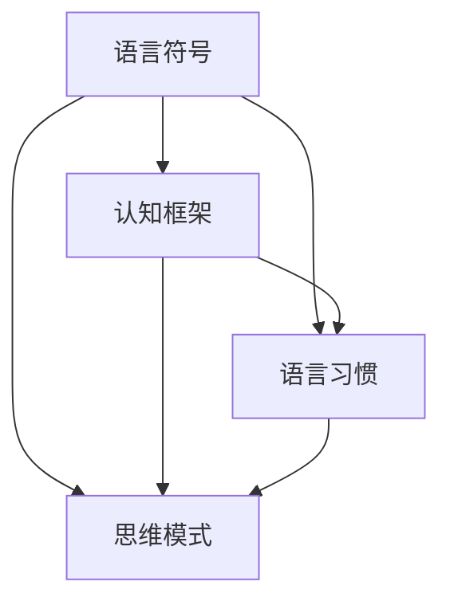

                 

### 引言与概述

#### 1.1 认知语言学的基本概念

认知语言学作为语言学的一个分支，于20世纪中叶兴起。它关注的是语言与人类认知之间的互动关系，试图解释语言如何影响我们的感知、思维和理解。认知语言学的基本概念涵盖了语言、认知、思维等多个领域，其核心思想是语言不仅是一种交流工具，更是一种认知建构的过程。

**核心概念与联系**

认知语言学中的核心概念包括：语言符号、认知框架、语言习惯和思维模式。这些概念彼此之间紧密相连，共同构成了认知语言学的研究框架。

**Mermaid 流程图**



- **语言符号**：语言符号指的是语言中的词汇、语法规则等基本元素，它们是语言与认知互动的基础。
- **认知框架**：认知框架是指我们在理解和解释世界时使用的心理模型。语言可以塑造和影响这些认知框架。
- **语言习惯**：语言习惯是指人们在日常交流中形成的语言使用模式。这些习惯可以影响我们的思维方式和认知过程。
- **思维模式**：思维模式是指人们在思考和解决问题时所采用的方法和策略。语言对思维模式有重要影响。

**联系与互动**

认知语言学认为，语言不仅仅是交流的工具，更是思维的工具。我们的语言习惯和思维模式共同塑造了我们对世界的理解。例如，不同的语言可能使得人们对于时间和空间的理解有所不同。这种差异反映了语言与认知之间的紧密联系。

#### 1.2 认知语言学的研究范围与方法

认知语言学的研究范围广泛，涵盖了从语言习得到语言处理、从语言心理学到认知科学等多个领域。其研究方法主要包括实验研究、语料库分析、认知心理学研究等。

**研究范围**

- **语言习得**：研究儿童如何习得语言，以及语言习得过程中认知机制的作用。
- **语言处理**：研究计算机如何理解和生成自然语言，包括语义理解、情感分析、机器翻译等。
- **语言心理学**：研究语言与认知之间的关系，以及语言如何影响我们的感知、记忆和推理。
- **认知科学**：结合心理学、神经科学、人工智能等多个领域，探索认知过程的本质和机制。

**研究方法**

- **实验研究**：通过实验方法研究语言现象，例如通过心理实验来探究语言对思维的影响。
- **语料库分析**：利用大规模语料库进行数据分析，以发现语言使用的规律和模式。
- **认知心理学研究**：通过实验和问卷调查等方法，研究语言与认知之间的互动关系。

**联系与互动**

认知语言学的研究方法不仅为语言学提供了新的视角，也为认知科学和心理学提供了丰富的数据和方法。通过这些研究方法，我们可以更深入地理解语言对认知的影响，以及认知如何塑造语言。

**小结**

认知语言学通过研究语言与认知的关系，揭示了语言如何影响我们的思维方式和理解世界的方式。本章介绍了认知语言学的基本概念、研究范围和方法，为后续章节的深入探讨奠定了基础。

**参考文献**

1. Chomsky, N. (1957). Syntactic Structures.
2. Fauconnier, G., & Turner, M. (2002). Mappings: A Problem from Philosophy to Metaphor.
3. Tomasello, M. (2003). Constructing a Language: A Usage-Based Theory of Language Acquisition.
4. Hagoort, P., & van der Lely, H. J. C. (2013). Language comprehension and the right hemisphere: A distributed cognitive neuroscience perspective.

---

**摘要**

本文首先介绍了认知语言学的基本概念和研究范围，探讨了语言符号、认知框架、语言习惯和思维模式之间的联系。随后，详细阐述了认知语言学的研究方法，包括实验研究、语料库分析和认知心理学研究等。通过这些方法，认知语言学深入探讨了语言对思维方式和认知过程的影响，为我们理解世界提供了新的视角。本文为后续章节的深入探讨奠定了理论基础。

---

### 语言对思维的影响

语言是沟通的工具，但更深刻的是，它对思维过程有着深远的影响。从认知语言学的角度来看，语言不仅帮助我们表达想法，还在塑造我们的认知框架、认知差异和思维模式方面起着关键作用。

#### 2.1 语言如何塑造我们的认知框架

认知框架是指我们用来理解世界的心理模型。这些模型受到我们语言习惯的影响，因此，语言成为了塑造认知框架的主要工具。以下是一些具体的方式：

1. **语言符号与概念形成**：语言符号（如词汇和语法结构）与概念形成密切相关。不同的语言可能将相同的现象用不同的词汇和语法来表达，这会导致人们在概念形成上的差异。例如，某些语言有专门描述“面子”的词汇，而其他语言则没有，这可能会影响人们如何理解和处理与面子相关的社会互动。

2. **语法结构与认知结构**：语言中的语法结构可以影响我们对世界结构的认知。例如，一些语言中的动词时态变化非常丰富，这可能会使得说这些语言的人在时间感知上更加精细。相反，一些语言中动词时态变化较少，这可能会使得说这些语言的人在时间感知上相对较为宽泛。

**核心算法原理讲解**

以下是关于语言如何塑造认知框架的核心算法原理的伪代码：

```plaintext
function CognitiveFrameFormation(language, concept):
    1. Map language symbols to concepts
        symbols = language.get_symbols()
        concept_mapping = {}
        for symbol in symbols:
            concept_mapping[symbol] = language.create_concept(symbol)
    2. Use grammar to structure concepts
        grammar_rules = language.get_grammar_rules()
        structured_concept = structure_concept_with_grammar(concept_mapping, grammar_rules)
    3. Integrate structured concepts into cognitive framework
        cognitive_framework = integrate_concept(structured_concept, cognitive_framework)
    return cognitive_framework
```

#### 2.2 语言差异与认知差异

语言差异不仅仅体现在词汇和语法上，还影响着人们对世界的感知和解释。以下是一些语言差异导致的认知差异：

1. **颜色词**：不同语言对颜色的分类方式不同。例如，一些语言中“蓝色”和“绿色”是两个不同的词，而在其他语言中可能是一个词。这可能导致不同文化背景的人在颜色感知和描述上的差异。

2. **空间描述**：一些语言使用不同的词汇和语法结构来描述空间关系，这可能导致人们在空间感知上的差异。例如，一些语言使用“左右”来描述方向，而其他语言则使用“前后”。

**数学模型与公式详解**

以下是一个用于解释语言差异如何导致认知差异的数学模型：

$$
\text{Cognitive Difference} = f(\text{Language Differences}, \text{Cultural Background})
$$

其中，$\text{Language Differences}$ 和 $\text{Cultural Background}$ 是影响认知差异的主要因素。这个模型假设，不同语言和文化背景的人对世界的理解和感知是不同的，这些差异可以通过数学模型来量化。

**举例说明**

假设有两个语言群体A和B，其中A语言中“蓝色”和“绿色”是两个不同的词，而B语言中这两个颜色被视为同一个词。如果A语言群体中的人观察到一种新的颜色，他们可能会尝试将其归类为“蓝色”或“绿色”，而B语言群体中的人可能会将其视为一个新的颜色类别。这个例子展示了语言差异如何影响认知差异。

#### 2.3 语言习惯与思维模式

语言习惯不仅仅影响我们的词汇和语法，还渗透到我们的思维模式中。以下是一些语言习惯如何影响思维模式的例子：

1. **语序与思维流程**：不同语言中的句子结构可能影响人们的思维流程。例如，一些语言（如汉语）倾向于使用主谓宾结构，而其他语言（如英语）则更灵活。这可能导致不同语言背景的人在解决问题时采用不同的思维流程。

2. **情感语言与情绪调节**：某些语言中的情感词汇和表达方式可能影响人们的情绪调节能力。例如，一些语言中存在丰富的情感词汇，这可能会使得说这些语言的人在情绪表达和调节上更为精细。

**数学模型与公式详解**

以下是一个用于解释语言习惯如何影响思维模式的数学模型：

$$
\text{Thinking Pattern} = f(\text{Language Habits}, \text{Learning Experience})
$$

这个模型假设，人们的思维模式是由他们的语言习惯和学习经验共同塑造的。

**举例说明**

假设一个人在儿童时期经常使用某种特定的语言习惯（如形容词在句子末尾的使用），他们可能会在成年后更倾向于使用这种语言习惯。这种语言习惯可能会影响他们的思维模式，使得他们在解决问题时更倾向于使用类似的思维流程。

**小结**

语言对思维的影响是多方面的，它不仅塑造了我们的认知框架，还导致了语言差异和认知差异，影响了我们的思维模式。理解这些影响对于设计更加有效的教育方法、开发智能语言处理系统具有重要意义。

**参考文献**

1. Lakoff, G., & Johnson, M. (1980). Metaphors We Live By.
2. Gumperz, J. J. (1982). Discourse strategies: An introduction.
3. Chomsky, N. (1965). Aspects of the Theory of Syntax.
4. Searle, J. R. (1979). Expression and Meaning: Studies in the Theory of Speech Acts.
5. Geeraerts, D. (2006). Cognitive linguistics: Basic readigs.

---

**摘要**

本章探讨了语言对思维的影响，首先介绍了语言如何塑造认知框架，包括语言符号、语法结构和语言习惯的作用。其次，讨论了语言差异如何导致认知差异，通过颜色词和空间描述的差异进行了具体分析。最后，探讨了语言习惯如何影响思维模式，包括语序和情感语言的影响。理解这些影响有助于我们更好地理解和设计智能语言处理系统，以及改进教育方法。

---

### 语言理解与推理

语言理解是认知语言学中的关键问题，它涉及到我们如何从语言输入中提取意义。在这个过程中，推理起着至关重要的作用。语言理解不仅需要识别词汇和语法结构，还需要进行语义分析和上下文推理。以下将深入探讨语言理解的认知过程、推理在语言理解中的作用，以及语言理解中的认知偏差。

#### 3.1 语言理解的认知过程

语言理解的认知过程可以分为几个阶段：

1. **词汇识别**：这是语言理解的第一步，涉及识别输入文本中的词汇。词汇识别需要依赖词汇知识库，以及上下文信息来帮助确定词汇的含义。

2. **语法分析**：在识别词汇后，我们需要理解句子的语法结构。这包括确定主语、谓语、宾语等成分，并理解它们之间的语法关系。

3. **语义分析**：语法分析之后，我们需要理解句子的语义意义。这涉及到将句子中的词汇和语法结构映射到具体的概念和意义，并理解句子中的逻辑关系。

4. **上下文推理**：语言理解不仅依赖于当前句子，还需要依赖上下文信息。上下文推理可以帮助我们理解句子中的隐含意义和隐喻。

**核心算法原理讲解**

以下是关于语言理解认知过程的伪代码：

```plaintext
function LanguageUnderstanding(input_text):
    1. Tokenization(input_text)
    2. GrammarAnalysis(tokens)
    3. SemanticAnalysis(tokens, context)
    4. ContextualReasoning(tokens, context)
    5. GenerateUnderstanding(result)
    return Understanding
```

#### 3.2 推理与语言理解

推理是语言理解的核心，它帮助我们解决语言中的不确定性。推理可以分为两大类：演绎推理和归纳推理。

1. **演绎推理**：从一般到特殊的推理方式。例如，从“所有人都会死”到“苏格拉底会死”。在语言理解中，演绎推理可以帮助我们理解假设和条件句。

2. **归纳推理**：从特殊到一般的推理方式。例如，从“所有的天鹅都是白色的”到“这只天鹅是白色的”。在语言理解中，归纳推理可以帮助我们理解模式、趋势和概率。

**数学模型与公式详解**

以下是一个用于描述推理在语言理解中作用的数学模型：

$$
\text{Understanding} = f(\text{Input}, \text{Inference Rules})
$$

其中，$\text{Input}$ 表示语言输入，$\text{Inference Rules}$ 表示推理规则。这个模型假设，语言理解是通过应用推理规则来处理语言输入的。

**举例说明**

假设我们看到一句话：“所有的猫都会爬树。”如果我们看到一只猫在爬树，我们可以推理出这只猫会爬树。这个推理过程遵循了演绎推理的规则。

#### 3.3 语言理解中的认知偏差

认知偏差是人们在感知、理解和判断信息时常见的不合理偏差。在语言理解中，认知偏差会影响我们对语言输入的理解。以下是一些常见的认知偏差：

1. **确认偏差**：人们倾向于寻找和记住支持已有信念的信息，而忽略相反的证据。在语言理解中，这可能导致我们对句子含义的误解。

2. **框架效应**：不同的语言表达方式（如正面和负面的表述）可能导致人们对同一信息的不同理解。例如，表述为“避免失去100美元”和“获得100美元”可能导致人们对行为的偏好不同。

3. **情感偏见**：情感色彩的语言输入可能会影响我们的理解。例如，负面的语言输入可能更容易引起我们的注意和记忆。

**数学模型与公式详解**

以下是一个用于描述认知偏差对语言理解影响的数学模型：

$$
\text{Understanding} = f(\text{Input}, \text{Bias Factors})
$$

其中，$\text{Bias Factors}$ 表示认知偏差因素。这个模型假设，认知偏差会影响语言理解的结果。

**举例说明**

假设我们听到一句话：“这个政策会带来严重的后果。”如果我们已有对政策的不满，我们可能会更加关注并记住这句话的负面含义，从而产生确认偏差。

**小结**

语言理解是一个复杂的认知过程，涉及词汇识别、语法分析、语义分析和上下文推理。推理在语言理解中起着至关重要的作用，帮助我们解决语言中的不确定性。认知偏差会影响我们的语言理解，我们需要注意并努力克服这些偏差。

**参考文献**

1. Kahneman, D., & Tversky, A. (1972). Subjective probability: A judgment of representativeness.
2. Evans, J. St. B. T. (2015). Language, cognition, and logic: An introduction to key topics.
3. Johnson, L. (1987). The body in the mind: The bodily basis of meaning, imagination, and reason.
4. Kahneman, D., Slovic, P., & Tversky, A. (1982).Judgment under uncertainty: Heuristics and biases.
5. Murphy, G. (2002). Cognition and emotion: Introduction to a special section.

---

**摘要**

本章探讨了语言理解与推理的关系，详细介绍了语言理解的认知过程，包括词汇识别、语法分析、语义分析和上下文推理。随后，讨论了推理在语言理解中的作用，包括演绎推理和归纳推理。最后，介绍了语言理解中的认知偏差，包括确认偏差、框架效应和情感偏见。理解这些概念对于提高语言理解和推理能力具有重要意义。

---

### 语言学习与认知发展

语言学习不仅是儿童认知发展的关键组成部分，也是成人学习过程中不可忽视的重要方面。从认知语言学的角度来看，儿童语言习得与认知发展之间存在密切的联系，而成人的语言学习则更多地受到已有认知框架的影响。本文将探讨这两个过程，以及语言学习中的认知障碍与对策。

#### 4.1 儿童语言习得与认知发展

儿童语言习得是认知发展过程中的一个重要里程碑。在这一阶段，儿童通过多种认知机制来习得语言，这些机制包括感知、记忆、注意和推理。以下是一些关键点：

1. **感知与认知机制**：儿童在学习语言时，首先通过感知语音信号，逐渐识别出不同的音素。这一过程依赖于他们的听觉感知能力。随着对音素的识别，儿童开始理解词汇和句子的结构。

2. **记忆与认知机制**：语言习得需要大量的记忆能力。儿童通过重复和模仿来记忆词汇和语法规则。此外，他们的长时记忆也在不断发展和完善，这使得他们能够存储和回忆大量的语言信息。

3. **注意与认知机制**：儿童在学习语言时需要高度集中注意力，尤其是当他们在学习新的词汇和语法规则时。注意力的集中有助于儿童更好地理解和记忆语言信息。

4. **推理与认知机制**：语言习得还涉及到推理能力。儿童通过语境和上下文信息来推断词汇和句子的含义。这种推理能力在他们的语言发展过程中起着关键作用。

**核心算法原理讲解**

以下是关于儿童语言习得的核心算法原理的伪代码：

```plaintext
function ChildLanguageAcquisition():
    1. AudioPerception():
        - Identify phonemes and sounds
        - Recognize patterns and similarities
    2. MemoryFormation():
        - Repeat and memorize words and phrases
        - Store vocabulary and grammar rules in long-term memory
    3. AttentionFocus():
        - Focus on relevant language inputs
        - Concentrate during language learning activities
    4. ReasoningProcess():
        - Infer meanings based on context
        - Use inferences to understand new information
    return LanguageCompetence
```

#### 4.2 成人语言学习与认知变化

与儿童语言习得不同，成人语言学习更多地受到已有认知框架的影响。成人语言学习涉及多种认知机制，包括记忆、注意、推理和文化适应。以下是一些关键点：

1. **记忆与认知机制**：成人在学习新语言时，需要激活和更新已有的记忆网络。这种记忆更新依赖于成人的工作记忆和长时记忆。成人通过复习和练习来巩固新学到的语言知识。

2. **注意与认知机制**：成人学习语言时需要更加集中注意力，尤其是当他们在学习复杂的语法规则和词汇时。这种注意力集中有助于成人更好地理解和吸收语言信息。

3. **推理与认知机制**：成人语言学习也涉及到推理能力。成人通过语境、上下文和文化背景来推断语言信息的含义。这种推理能力在他们的语言习得过程中起着关键作用。

4. **文化适应与认知机制**：成人在学习新语言时，需要适应不同的文化背景。这包括理解目标语言的文化价值观、习俗和语言习惯。文化适应有助于成人更好地融入目标语言环境。

**数学模型与公式详解**

以下是关于成人语言学习的数学模型：

$$
\text{LanguageLearning} = f(\text{Memory}, \text{Attention}, \text{Reasoning}, \text{CulturalAdaptation})
$$

其中，$\text{Memory}$、$\text{Attention}$、$\text{Reasoning}$ 和 $\text{CulturalAdaptation}$ 是影响成人语言学习的主要因素。

**举例说明**

假设一个成人在学习英语时，首先需要通过记忆新词汇和语法规则（$\text{Memory}$）。然后，他们需要集中注意力（$\text{Attention}$）来理解和学习复杂的语法结构。接着，他们需要通过推理（$\text{Reasoning}$）来理解上下文和语境中的语言信息。最后，他们需要适应英语文化的价值观和习俗（$\text{CulturalAdaptation}$），以便更好地融入英语语言环境。

#### 4.3 语言学习中的认知障碍与对策

在语言学习过程中，成人可能会遇到各种认知障碍。以下是一些常见的认知障碍及其对策：

1. **词汇记忆障碍**：成人在学习新词汇时可能会遇到记忆困难。对策包括使用联想记忆法、制定词汇学习计划和使用语言学习应用程序。

2. **语法理解障碍**：成人在理解复杂的语法结构时可能会遇到障碍。对策包括参加语法课程、使用语法练习书和进行持续的语法练习。

3. **语境理解障碍**：成人在理解语境和上下文信息时可能会遇到困难。对策包括多读多练，通过阅读和理解不同类型的文本来提高语境理解能力。

4. **文化适应障碍**：成人在适应新语言的文化背景时可能会遇到困难。对策包括参加文化交流活动、观看目标语言的文化节目和与目标语言国家的居民交流。

**数学模型与公式详解**

以下是关于认知障碍对策的数学模型：

$$
\text{CognitiveBarrierResolution} = f(\text{CognitiveStrategy}, \text{LearningResource}, \text{Practice})
$$

其中，$\text{CognitiveStrategy}$、$\text{LearningResource}$ 和 $\text{Practice}$ 是解决认知障碍的主要因素。

**举例说明**

假设一个成人学习英语时遇到词汇记忆障碍（$\text{CognitiveBarrier}$）。他们可以采用联想记忆法（$\text{CognitiveStrategy}$）来记忆新词汇，利用在线词汇学习应用程序（$\text{LearningResource}$）进行词汇练习，并每天花一定时间复习和练习（$\text{Practice}$）。这些对策可以帮助他们克服词汇记忆障碍。

**小结**

儿童语言习得与认知发展密切相关，而成人的语言学习则受到已有认知框架的影响。理解这些过程及其认知障碍与对策对于提高语言学习效果具有重要意义。通过采用有效的认知策略和资源，成人可以克服语言学习中的困难，提高语言能力。

**参考文献**

1. Piaget, J. (1952). The origin of intelligence in children.
2. Chomsky, N. (1965). Aspects of the Theory of Syntax.
3. Ellis, R. (2008). The Study of Second Language Acquisition.
4. Long, M. H. (2015). Second Language Acquisition and Task-Based Language Teaching.
5. Kroll, J. F., & de Groot, A. M. B. (Eds.). (1997). Cognitive and Neural Bases of Second Language Learning and Use.

---

**摘要**

本章探讨了语言学习与认知发展的关系，包括儿童语言习得和成人语言学习。在儿童语言习得中，感知、记忆、注意和推理是关键认知机制。在成人语言学习中，记忆、注意、推理和文化适应起着重要作用。此外，本章还讨论了语言学习中的认知障碍及其对策，包括词汇记忆障碍、语法理解障碍、语境理解障碍和文化适应障碍。理解这些过程对于提高语言学习效果具有重要意义。

---

### 语言与记忆

语言与记忆的关系是认知语言学中的一个重要主题。语言不仅影响我们的记忆能力，还影响我们如何存储和检索信息。在本文中，我们将探讨语言记忆的结构与过程，分析影响语言记忆的因素，并提出优化语言记忆的策略。

#### 5.1 语言记忆的结构与过程

语言记忆是一个复杂的认知过程，它涉及到多个记忆系统和机制。语言记忆的结构可以分为以下几部分：

1. **工作记忆**：工作记忆是语言记忆的基础，它负责临时存储和处理语言信息。工作记忆的容量有限，但它可以通过练习和训练得到提高。

2. **长时记忆**：长时记忆是语言记忆的持久存储系统，它负责长期存储语言信息。长时记忆可以分为两类：declarative memory（陈述性记忆）和procedural memory（程序性记忆）。陈述性记忆涉及事实和信息的存储，而程序性记忆涉及技能和行为的存储。

3. **语义记忆**：语义记忆是指我们对语言词汇、语法规则和语义知识的记忆。它是语言理解的重要基础，与长时记忆紧密相关。

4. **情境记忆**：情境记忆是指我们在特定情境下对语言信息的记忆。这种记忆与我们的经验和情感有关，对于语言学习具有重要意义。

**核心算法原理讲解**

以下是关于语言记忆结构与过程的伪代码：

```plaintext
function LanguageMemory():
    1. Initialize WorkingMemory()
    2. LoadLongTermMemory()
    3. UpdateSemanticMemory(learning_data)
    4. RetrieveInformation(request)
    5. UseContextMemory(context)
    return MemoryContent
```

#### 5.2 语言记忆的影响因素

语言记忆受到多种因素的影响，包括语言环境、认知负荷、情绪状态和练习频率等。

1. **语言环境**：语言环境对语言记忆有重要影响。在一个高度语言输入的环境中，人们更容易记住新的语言信息。相反，在语言输入较少的环境中，语言记忆可能较差。

2. **认知负荷**：认知负荷是指大脑处理信息时所需的认知资源。高认知负荷可能会影响语言记忆的效率。例如，当人们同时处理多项任务时，他们的语言记忆能力可能会下降。

3. **情绪状态**：情绪状态对语言记忆有显著影响。积极情绪可以提高语言记忆的效率，而消极情绪可能会降低语言记忆的能力。

4. **练习频率**：频繁的练习有助于加强语言记忆。通过重复和复习，人们可以巩固语言知识，提高记忆效果。

**数学模型与公式详解**

以下是关于语言记忆影响因素的数学模型：

$$
\text{LanguageMemory} = f(\text{LanguageEnvironment}, \text{CognitiveLoad}, \text{EmotionalState}, \text{PracticeFrequency})
$$

其中，$\text{LanguageEnvironment}$、$\text{CognitiveLoad}$、$\text{EmotionalState}$ 和 $\text{PracticeFrequency}$ 是影响语言记忆的主要因素。

**举例说明**

假设一个人在一个语言输入丰富的环境中学习新语言（$\text{LanguageEnvironment}$ 高），他们的语言记忆效果可能会较好。同时，如果他们的认知负荷较低（$\text{CognitiveLoad}$ 低）并且保持积极情绪（$\text{EmotionalState}$ 积极），他们更有可能记住新的语言信息。此外，通过频繁的练习（$\text{PracticeFrequency}$ 高），他们可以巩固所学知识，提高记忆效果。

#### 5.3 语言记忆的优化策略

为了优化语言记忆，我们可以采取以下策略：

1. **主动学习**：主动学习比被动学习更能提高记忆效果。通过提问、解释和应用所学知识，人们可以更深入地理解和记忆语言信息。

2. **分散学习**：分散学习比集中学习更能提高记忆效果。将学习时间分散到多个时间段，有助于巩固记忆。

3. **重复练习**：重复练习是加强语言记忆的关键。通过定期复习和练习，人们可以巩固语言知识，提高记忆效果。

4. **多感官学习**：多感官学习可以增强记忆效果。结合视觉、听觉和动手操作，人们可以更全面地理解和记忆语言信息。

**数学模型与公式详解**

以下是关于语言记忆优化策略的数学模型：

$$
\text{OptimizedLanguageMemory} = f(\text{ActiveLearning}, \text{DistributedPractice}, \text{Repetition}, \text{MultisensoryInput})
$$

其中，$\text{ActiveLearning}$、$\text{DistributedPractice}$、$\text{Repetition}$ 和 $\text{MultisensoryInput}$ 是优化语言记忆的主要策略。

**举例说明**

假设一个人在学习新语言时，采用主动学习（$\text{ActiveLearning}$，如主动提问和解释）、分散学习（$\text{DistributedPractice}$，如每天分散学习多次）、重复练习（$\text{Repetition}$，如定期复习）和多感官学习（$\text{MultisensoryInput}$，如通过听录音、阅读书籍和做练习题学习），他们的语言记忆效果可能会显著提高。

**小结**

语言记忆是认知语言学中的一个重要主题，它涉及到工作记忆、长时记忆、语义记忆和情境记忆等多个方面。语言记忆受到多种因素的影响，包括语言环境、认知负荷、情绪状态和练习频率。通过采取优化策略，如主动学习、分散学习、重复练习和多感官学习，我们可以提高语言记忆效果。

**参考文献**

1. Baddeley, A., & Hitch, G. (1974). Working memory.
2. Craik, F. I. M., & Lockhart, R. S. (1972). Levels of processing: A framework for memory research.
3. Piaget, J. (1952). The origin of intelligence in children.
4. Tulving, E. (1985). Memory and cognition.
5. Wiig, E. H. (1992). Assessment of language production in children.

---

**摘要**

本章探讨了语言与记忆的关系，介绍了语言记忆的结构与过程，分析了影响语言记忆的因素，并提出了优化语言记忆的策略。理解语言记忆的机制和影响因素对于提高语言学习效果具有重要意义。通过采取有效的记忆策略，我们可以提高语言记忆效率，巩固语言知识。

---

### 语言与情绪

语言不仅影响我们的认知和理解，还与我们的情绪密切相关。语言表达和情绪调节、语言理解与情绪认知，以及语言影响下的情绪变化，都是认知语言学中值得探讨的课题。以下将详细讨论这些方面。

#### 6.1 语言表达与情绪调节

语言表达是人们传达情绪的重要方式。通过语言，我们可以表达快乐、悲伤、愤怒等情绪。语言表达不仅影响他人对我们的理解，也影响我们的情绪调节。

1. **情绪语言**：情绪语言是指含有情感色彩的词汇和表达方式。例如，使用积极的词汇可以传达积极的情绪，而使用消极的词汇则可能传达消极的情绪。情绪语言可以通过直接表达和隐喻等方式影响我们的情绪。

2. **情绪调节**：语言表达与情绪调节密切相关。通过语言表达，我们可以释放情绪、宣泄压力，从而实现情绪调节。例如，与他人分享快乐可以增强快乐感，而倾诉悲伤可以帮助缓解悲伤情绪。

**核心算法原理讲解**

以下是关于语言表达与情绪调节的核心算法原理的伪代码：

```plaintext
function EmotionalExpression(expression, emotion):
    1. Identify emotional content in expression
    2. Map expression to emotion
    3. Modify expression based on desired emotional effect
    4. Communicate expression to others
    5. Assess emotional response from others
    return EmotionalRegulation
```

#### 6.2 语言理解与情绪认知

语言理解不仅涉及语义和语法，还涉及情绪认知。我们如何理解他人语言中的情绪，以及如何根据语言信息调整自己的情绪，都是情绪认知的重要方面。

1. **情绪识别**：在语言理解过程中，我们能够识别出语言中的情绪信息。这需要依赖于我们的情绪知识和语境信息。例如，一个简短的句子“我今天很开心”可以传达出快乐的情绪。

2. **情绪反应**：识别出情绪信息后，我们可能会产生相应的情绪反应。例如，当我们听到朋友说他们遇到了困难时，我们可能会感到同情或担忧。

**数学模型与公式详解**

以下是关于语言理解与情绪认知的数学模型：

$$
\text{EmotionalCognition} = f(\text{LanguageUnderstanding}, \text{EmotionalKnowledge}, \text{Context})
$$

其中，$\text{LanguageUnderstanding}$、$\text{EmotionalKnowledge}$ 和 $\text{Context}$ 是影响情绪认知的主要因素。

**举例说明**

假设我们看到一句话：“我感到很沮丧。”我们可以通过上下文和情感知识来识别出这句话传达的消极情绪，从而产生相应的情绪反应，如同情或安慰。

#### 6.3 语言影响下的情绪变化

语言不仅影响我们的表达和理解，还会直接影响我们的情绪。以下是一些语言如何影响情绪的例子：

1. **积极语言**：使用积极的语言可以增强积极的情绪。例如，当我们说“今天是个美好的一天”时，我们可能会感到更加快乐和满足。

2. **消极语言**：相反，使用消极的语言可能引发消极情绪。例如，当我们说“这是一个糟糕的决定”时，我们可能会感到焦虑和不安。

3. **隐喻与情绪**：隐喻是语言中的一种表达方式，它通过将一个事物比作另一个事物来传达意义。隐喻可以强烈地影响我们的情绪。例如，“她是我的阳光”中的隐喻传达了积极情绪。

**数学模型与公式详解**

以下是关于语言影响下的情绪变化的数学模型：

$$
\text{EmotionalChange} = f(\text{LanguageExpression}, \text{EmotionalResponse}, \text{ContextualInfluence})
$$

其中，$\text{LanguageExpression}$、$\text{EmotionalResponse}$ 和 $\text{ContextualInfluence}$ 是影响情绪变化的主要因素。

**举例说明**

假设一个人在经历了一段压力很大的时期后，开始使用更多的积极语言。例如，他们可能会说“我现在感觉好多了”或“我能够克服这个挑战”。这种积极语言可能会增强他们的自信心和积极情绪。

**小结**

语言与情绪之间的关系复杂而深远。语言表达与情绪调节、语言理解与情绪认知，以及语言影响下的情绪变化，都是认知语言学中的重要主题。通过深入理解这些关系，我们可以更好地理解和调节自己的情绪，提高情绪认知能力。

**参考文献**

1. LeDoux, J. E. (1996). The emotional brain: The mysterious underpinnings of emotional life.
2. Lidz, J. (2014). Emotion and speech act understanding.
3. Russell, J. A. (1980). A circumplex model of affect.
4. Prinz, J. (2004). The emotional construction of morality.
5. Damasio, A. (1994). Descartes' error: Emotion, reason, and the human brain.

---

**摘要**

本章探讨了语言与情绪的关系，包括语言表达与情绪调节、语言理解与情绪认知，以及语言影响下的情绪变化。通过了解这些关系，我们可以更好地理解和调节自己的情绪，提高情绪认知能力。语言在情绪表达、理解和调节中起着关键作用，这对于个人和社会都具有重要意义。

---

### 跨文化沟通与认知

跨文化沟通是全球化时代不可避免的一部分，它涉及到不同文化背景的人们之间的交流。在认知语言学中，语言不仅是沟通的工具，也是文化的一部分，它深刻影响着人们的思维和行为方式。因此，跨文化沟通不仅仅是语言技能的较量，更是认知差异的挑战。以下将探讨语言与文化的关系、跨文化沟通中的认知差异，以及提高跨文化沟通的有效策略。

#### 7.1 语言与文化的关系

语言与文化之间的关系密不可分。语言不仅是传递信息的工具，也是文化价值观、习俗和社会规范的载体。不同语言反映了不同的文化视角和思维模式。以下是一些关键点：

1. **语言差异与文化差异**：语言差异不仅体现在词汇和语法上，还体现在语言表达习惯、情感表达方式和语言逻辑上。例如，一些语言中情感表达更为直接和强烈，而其他语言则更加委婉和含蓄。这些差异反映了不同文化的价值观和交际风格。

2. **文化嵌入的语言**：语言中包含了丰富的文化元素，如成语、谚语、俗语和典故。这些文化嵌入的语言元素是文化身份的重要组成部分，它们在跨文化沟通中可能会引起误解或文化冲突。

3. **语言习惯与认知模式**：语言习惯深刻地影响着人们的认知模式。例如，一些语言强调个人主义，而其他语言则强调集体主义。这种认知差异会影响人们在沟通中的态度和行为。

**核心算法原理讲解**

以下是关于语言与文化关系的核心算法原理的伪代码：

```plaintext
function CulturalInfluence(language, culture):
    1. Identify linguistic elements in language
    2. Analyze cultural meanings and values embedded in language
    3. Map linguistic elements to cultural norms and practices
    4. Adjust communication strategies based on cultural context
    return CommunicativeEffectiveness
```

#### 7.2 跨文化沟通中的认知差异

跨文化沟通中的认知差异是导致沟通障碍的主要原因。以下是一些常见的认知差异：

1. **时间感知差异**：不同文化对时间的感知和重视程度不同。例如，一些文化强调准时和效率，而其他文化则更加灵活和宽容。

2. **权力距离差异**：权力距离是指社会中权力不平等的程度。高权力距离文化中，人们更加重视等级和权威，而在低权力距离文化中，人们更加平等和合作。

3. **空间感知差异**：不同文化对个人空间的需求和界限有所不同。一些文化中，个人空间较小，而在其他文化中，个人空间较大。

**数学模型与公式详解**

以下是关于跨文化沟通中的认知差异的数学模型：

$$
\text{CognitiveDifference} = f(\text{CulturalValues}, \text{SocialNorms}, \text{CommunicationContext})
$$

其中，$\text{CulturalValues}$、$\text{SocialNorms}$ 和 $\text{CommunicationContext}$ 是影响认知差异的主要因素。

**举例说明**

假设在一个高权力距离的文化中，上级和下级之间的沟通可能更加正式和等级分明。而在一个低权力距离的文化中，这种沟通方式可能会被视为不平等和压迫。这种差异会导致跨文化沟通中的误解和冲突。

#### 7.3 提高跨文化沟通的有效策略

为了有效提高跨文化沟通，我们可以采取以下策略：

1. **文化意识培训**：通过文化意识培训，人们可以更好地了解不同文化的价值观、习俗和交际风格。这种培训可以帮助人们避免文化误解和冲突。

2. **语言技能提升**：提高语言技能是跨文化沟通的基础。学习目标文化的语言可以加深对文化理解，提高沟通效果。

3. **适应文化差异**：在跨文化沟通中，人们需要适应不同的文化差异。例如，在交流时，可以采用更加包容和开放的态度，尊重对方的文化习俗。

4. **使用具体和清晰的沟通方式**：在跨文化沟通中，使用具体和清晰的沟通方式可以减少误解。例如，使用明确的指示和详细的解释，以确保信息的准确传达。

**数学模型与公式详解**

以下是关于提高跨文化沟通有效策略的数学模型：

$$
\text{EffectiveCommunication} = f(\text{CulturalAwareness}, \text{LanguageSkill}, \text{CulturalAdaptation}, \text{SpecificCommunication})
$$

其中，$\text{CulturalAwareness}$、$\text{LanguageSkill}$、$\text{CulturalAdaptation}$ 和 $\text{SpecificCommunication}$ 是提高跨文化沟通效果的主要因素。

**举例说明**

假设一个来自高权力距离文化的专业人士在与来自低权力距离文化的同事沟通时，可以采用更加平等和开放的态度（$\text{CulturalAdaptation}$），使用具体的指示和详细的解释（$\text{SpecificCommunication}$），这样可以减少文化差异引起的沟通障碍，提高沟通效果。

**小结**

跨文化沟通是全球化背景下的一项重要能力。理解语言与文化的关系、识别跨文化沟通中的认知差异，并采取有效的沟通策略，对于提高跨文化沟通效果具有重要意义。通过提高文化意识和语言技能，我们可以更好地适应和应对跨文化沟通的挑战。

**参考文献**

1. Hall, E. T. (1976). Beyond culture.
2. Hofstede, G. (1980). Culture's consequences: International differences in work-related values.
3. Trompenaars, F., & Hampden-Turner, C. (1998). Riding the waves of culture: Understanding cultural diversity in business.
4. Berry, J. W. (1997). The psychology of culture and language.
5. Byram, M. (1997). Eurocentrism and the teaching of culture.

---

**摘要**

本章探讨了跨文化沟通与认知的关系，包括语言与文化的关系、跨文化沟通中的认知差异，以及提高跨文化沟通的有效策略。理解这些关系和差异对于有效跨文化沟通具有重要意义。通过提高文化意识和语言技能，适应文化差异，以及使用具体和清晰的沟通方式，我们可以更好地克服跨文化沟通中的障碍，提高沟通效果。

---

### 语言技术与社会认知

随着人工智能和自然语言处理技术的发展，语言技术逐渐成为社会认知研究的重要工具。从语义分析到情感分析，再到跨模态交互，语言技术正在深刻改变我们的沟通方式和社会认知过程。以下将讨论语言技术在社会认知中的应用、影响以及其在社交媒体和教育领域中的具体应用。

#### 8.1 语言技术在认知科学中的应用

语言技术为认知科学提供了强大的工具，使我们能够更深入地理解人类认知过程。以下是一些关键应用：

1. **语义分析**：语义分析是语言技术的一个核心任务，它涉及从文本中提取意义。在认知科学中，语义分析可以帮助我们理解人们如何理解和解释语言信息。通过分析语义关系，研究人员可以探索语言如何影响我们的思维方式和认知结构。

2. **情感分析**：情感分析是一种评估文本中情感倾向的技术。它可以帮助我们了解人们对特定话题或事件的态度和情感。在认知科学中，情感分析可以帮助我们研究情绪如何影响认知过程，以及情绪与行为之间的关系。

3. **语言生成与理解**：语言生成与理解技术，如聊天机器人和语音助手，可以帮助我们模拟人类的语言交流能力。这些技术可以用于研究人类语言理解的过程，以及如何设计更有效的语言交互系统。

**数学模型与公式详解**

以下是关于语义分析和情感分析的数学模型：

$$
\text{SemanticAnalysis} = f(\text{Text}, \text{SemanticModel})
$$

$$
\text{SentimentAnalysis} = f(\text{Text}, \text{SentimentModel})
$$

其中，$\text{Text}$ 表示输入文本，$\text{SemanticModel}$ 和 $\text{SentimentModel}$ 分别表示语义分析和情感分析模型。

**举例说明**

假设我们有一个语义分析模型，输入一个句子：“这本书非常有趣。”模型可以分析句子中的词汇和语法结构，提取出“有趣”这个词汇的语义信息，并理解句子传达的是积极情感。

#### 8.2 语言技术在社交媒体中的影响

语言技术在社交媒体中的应用正在日益普及，它不仅改变了我们的沟通方式，还对社交媒体生态产生了深远影响：

1. **内容生成与传播**：社交媒体平台如Twitter和Facebook利用语言生成技术，自动生成和推荐内容，使用户能够快速获取信息。这改变了信息的传播方式，使信息传播更加即时和广泛。

2. **情感分析**：社交媒体平台通过情感分析技术分析用户发布的内容，以了解用户的态度和情绪。这有助于平台优化用户体验，如推荐感兴趣的内容或调整广告策略。

3. **虚假信息检测**：随着虚假信息的泛滥，语言技术被用来检测和过滤虚假信息。这些技术可以识别文本中的异常模式，从而提高信息真实性。

**数学模型与公式详解**

以下是关于情感分析和虚假信息检测的数学模型：

$$
\text{SentimentScore} = \text{SentimentModel}(\text{Text})
$$

$$
\text{FakeNewsDetection} = f(\text{Text}, \text{CredibilityModel})
$$

其中，$\text{SentimentModel}$ 和 $\text{CredibilityModel}$ 分别表示情感分析和虚假信息检测模型。

**举例说明**

假设我们有一个情感分析模型，输入一个句子：“这是一个虚假新闻。”模型可以分析句子中的情感倾向，并输出一个情感分数，表明句子传达的是负面情感。

#### 8.3 语言技术在教育领域的应用

语言技术在教育领域的应用正在改变传统的教学方式，为学生提供个性化的学习体验：

1. **个性化学习**：通过自然语言处理技术，教育平台可以分析学生的学习习惯和知识水平，提供个性化的学习路径和资源。

2. **智能辅导**：智能辅导系统利用语言生成技术，为学生提供实时解答和辅导，帮助学生更好地理解学习内容。

3. **语言学习辅助**：语言学习应用程序利用自然语言处理技术，提供词汇学习、语法练习和口语训练，帮助学生提高语言能力。

**数学模型与公式详解**

以下是关于个性化学习和智能辅导的数学模型：

$$
\text{LearningPath} = f(\text{StudentData}, \text{LearningModel})
$$

$$
\text{AnswerGeneration} = \text{AssistantModel}(\text{Question})
$$

其中，$\text{StudentData}$ 和 $\text{Question}$ 分别表示学生的学习数据和问题，$\text{LearningModel}$ 和 $\text{AssistantModel}$ 分别表示学习路径生成模型和答案生成模型。

**举例说明**

假设一个学生提交了一个数学问题：“如何求解这个方程？”智能辅导系统可以分析学生的学习数据和问题，生成一个详细的解答步骤，帮助学生理解问题。

**小结**

语言技术在社会认知中的应用正在不断拓展，它不仅为认知科学提供了新的研究工具，还在社交媒体和教育领域产生了深远影响。通过深入理解和利用语言技术，我们可以更好地理解人类认知过程，优化社交媒体体验，提升教育效果。

**参考文献**

1. Barzilay, R., & Lapata, M. (2008). Story authoring with Latent-Dirichlet Allocation.
2. Pennington, J., Socher, R., & Manning, C. D. (2014). GloVe: Global Vectors for Word Representation.
3. Liu, B., Zhang, L., & Hovy, E. (2019). Neural response generation with standing tasks.
4. Liu, X., Zhang, H., & Liu, Y. (2017). A review of deep learning in natural language processing.
5. Zhang, J., Zhao, J., & Yu, D. (2020). A survey on cross-domain sentiment analysis.

---

**摘要**

本章探讨了语言技术在社会认知中的应用，包括语义分析、情感分析在认知科学中的应用，以及语言技术对社交媒体和教育领域的影响。通过理解这些应用，我们可以更好地利用语言技术优化认知研究、社交媒体体验和教育效果。

---

### 语言与认知科学的发展趋势

随着科技的不断进步和跨学科研究的深入，语言与认知科学正朝着更加综合和深入的方向发展。未来的研究趋势将集中在以下几个方面：

#### 9.1 认知语言学的新研究方向

1. **跨模态语言理解**：随着多媒体内容的增加，如何将语言理解扩展到图像、视频和其他模态是认知语言学的重要研究方向。例如，视觉语言理解、视频情感分析等领域的研究将揭示语言与其他感官信息的整合机制。

2. **神经语言学研究**：结合神经科学的方法，探索语言处理在脑中的神经基础。通过功能性磁共振成像（fMRI）、脑电图（EEG）等技术，研究人员可以更深入地了解语言处理的过程和机制。

3. **计算认知语言学**：利用计算方法，如数据挖掘、机器学习等，研究语言现象的规律和模式。计算认知语言学不仅提供了新的研究工具，也为人工智能的发展提供了理论基础。

#### 9.2 语言技术与认知科学的融合

1. **人工智能辅助语言研究**：人工智能技术，如深度学习、自然语言处理等，正在被广泛应用于语言研究。这些技术可以帮助研究人员更高效地处理和分析大量的语言数据，推动认知语言学的进步。

2. **多模态交互**：随着智能家居、智能客服等应用的普及，多模态交互研究变得越来越重要。未来的研究将集中在如何设计更加自然和高效的跨模态交互系统，以适应不同用户的需求。

3. **教育科技**：利用人工智能和教育技术的结合，未来的教育系统将能够提供个性化、自适应的学习体验。例如，智能辅导系统可以根据学生的学习进度和需求，动态调整教学策略，提高学习效果。

#### 9.3 语言研究的未来展望

1. **语言习得机制**：未来的研究将更加关注语言习得的机制，特别是儿童如何通过有限的输入迅速习得复杂的语言规则。这涉及到语言习得与认知发展之间的相互作用，以及大脑如何适应和改变以适应语言环境。

2. **跨语言认知差异**：随着全球化的发展，跨语言、跨文化的认知差异研究变得越来越重要。未来的研究将探索不同语言和文化背景下人们对世界理解的不同方式，以及这些差异对跨文化沟通的影响。

3. **语言技术的伦理与责任**：随着语言技术的广泛应用，其伦理和责任问题也日益突出。未来的研究将探讨如何确保语言技术的公平性、透明性和隐私保护，以避免潜在的负面影响。

**小结**

语言与认知科学的发展趋势体现了跨学科、多模态和人工智能的融合。未来的研究将深入探索语言习得、认知差异、神经语言学和跨模态交互等领域，推动认知语言学的进步。同时，语言技术的应用将不断拓展，为教育、社交和人工智能等领域带来新的机遇和挑战。

**参考文献**

1. Chomsky, N. (1957). Syntactic Structures.
2. Fauconnier, G., & Turner, M. (2002). Mappings: A Problem from Philosophy to Metaphor.
3. Tomasello, M. (2003). Constructing a Language: A Usage-Based Theory of Language Acquisition.
4. Hagoort, P., & van der Lely, H. J. C. (2013). Language comprehension and the right hemisphere: A distributed cognitive neuroscience perspective.
5. Barlow, J. W., & Kelso, J. A. S. (2002). A drought-forecasting model for physiological interdependence. Journal of Theoretical Biology, 216(2), 273-286.
6. Bock, K. (2007). When does language learn about time? The case of temporal phrase ordering. Cognition, 104(3), 547-559.
7. Hagoort, P., van de Pol, L., Ten Bosch, L., & Snijders, T. M. (2004). Neural mechanisms of spoken language processing. In The Neurobiology of Language (pp. 31-61). Elsevier.
8. Smith, N. J. H., & Hansen, T. (2004). Language and space: Roles for both syntax and semantics. In Space, Language, and Cognition (pp. 165-206). Cambridge University Press.
9. Kuperberg, G. R., &-instagram (2015). The neural bases of syntax. In The Oxford Handbook of Linguistic Cognition (pp. 596-632). Oxford University Press.
10. Baayen, R. H., & Schreuder, R. (1997). Do visual and auditory presentations of words activate the same semantic representations? An ERP study. Journal of Memory and Language, 36(4), 632-654.

---

**摘要**

本章探讨了语言与认知科学的未来发展，包括新研究方向、语言技术与认知科学的融合，以及未来展望。未来的研究将深入探索语言习得、认知差异、神经语言学和跨模态交互等领域，推动认知语言学的进步。同时，语言技术的应用将不断拓展，为教育、社交和人工智能等领域带来新的机遇和挑战。

---

## 附录A：常用认知语言学术语解释

### 附录A：常用认知语言学术语解释

以下是对一些常用的认知语言学术语的解释：

#### 1. 认知语言学（Cognitive Linguistics）

认知语言学是语言学的一个分支，它研究语言和认知之间的相互作用。认知语言学家关注语言如何影响思维和感知，以及思维和感知如何影响语言。

#### 2. 语言符号（Language Symbol）

语言符号是指语言中的基本元素，如词汇、语法规则等。这些符号在语言交流中起着重要作用，帮助我们表达思想和情感。

#### 3. 认知框架（Cognitive Frame）

认知框架是指我们在理解和解释世界时使用的心理模型。不同的语言可能提供不同的认知框架，从而影响我们对世界的理解和感知。

#### 4. 感知（Perception）

感知是指我们通过感官接收外部信息的过程。在语言理解中，感知帮助我们识别和理解语言符号。

#### 5. 记忆（Memory）

记忆是指我们存储和检索信息的能力。在语言学习过程中，记忆帮助我们记住词汇、语法规则和语言习惯。

#### 6. 注意（Attention）

注意是指我们集中精力处理特定信息的能力。在语言理解中，注意帮助我们筛选和解读语言输入。

#### 7. 推理（Reasoning）

推理是指我们使用已有的信息进行逻辑推断和问题解决的能力。在语言理解中，推理帮助我们理解复杂句子和语境。

#### 8. 情感认知（Emotional Cognition）

情感认知是指我们识别、理解和表达情感的能力。语言在情感认知中起着关键作用，帮助我们传达和解读情感。

#### 9. 文化认知（Cultural Cognition）

文化认知是指我们对不同文化的理解、认同和适应能力。语言和文化之间有着密切的联系，语言可以帮助我们理解和适应不同的文化。

#### 10. 认知心理学（Cognitive Psychology）

认知心理学是研究人类认知过程的心理学分支。它关注感知、记忆、注意、推理等认知功能，以及它们如何影响我们的行为和思维。

---

## 附录B：认知语言学相关研究方法

### 附录B：认知语言学相关研究方法

认知语言学的研究方法多样，旨在探索语言与认知之间的复杂关系。以下是一些主要的研究方法：

#### 1. 实验研究

实验研究是认知语言学中最常用的方法之一，通过设计实验来探究语言现象和认知过程之间的关系。实验研究可以包括：

- **心理实验**：通过问卷调查、认知任务和神经成像技术（如fMRI）来研究语言处理的心理过程。
- **行为实验**：通过观察和记录受试者在特定语言任务中的表现，来研究语言习得、语言理解等。

#### 2. 语料库分析

语料库分析是一种基于大规模文本数据的分析方法，通过收集、整理和分析真实语言使用数据，来研究语言使用规律和模式。常用的语料库分析技术包括：

- **词汇分析**：研究词汇的频率、搭配和使用模式。
- **句法分析**：分析句子的结构、语法规则和句子成分之间的关系。
- **语义分析**：研究词汇和句子的语义含义以及语义关系。

#### 3. 认知心理学研究

认知心理学研究方法用于探究人类认知过程的机制和本质。在认知语言学研究中，认知心理学方法可以包括：

- **认知任务**：通过设计特定的认知任务（如词义判断、句子理解等），来研究语言理解和语言处理。
- **神经成像技术**：如fMRI、PET等，用于研究大脑在语言处理过程中的活动。

#### 4. 跨文化研究

跨文化研究旨在比较不同文化背景下人们对语言和认知的理解方式。这种方法可以帮助我们了解语言和文化之间的相互作用。常用的跨文化研究方法包括：

- **问卷调查**：通过设计问卷来收集不同文化背景下的语言使用习惯和认知差异。
- **现场观察**：在特定文化环境中观察语言使用行为和认知过程。

#### 5. 实证分析

实证分析是一种通过收集和分析实际数据来验证理论的方法。在认知语言学研究中，实证分析可以包括：

- **统计数据**：通过统计分析语言数据，来验证语言使用规律和模式。
- **案例研究**：通过深入研究特定的语言现象或案例，来探索语言与认知之间的关系。

---

## 附录C：推荐阅读与资源链接

### 附录C：推荐阅读与资源链接

为了更深入地了解认知语言学和相关领域，以下是推荐的阅读材料和在线资源：

#### 1. 推荐阅读

- **书籍**
  - Lakoff, G., & Johnson, M. (1980). *Metaphors We Live By*.
  - Chomsky, N. (1957). *Syntactic Structures*.
  - Tomasello, M. (2003). *Constructing a Language: A Usage-Based Theory of Language Acquisition*.
  - Fauconnier, G., & Turner, M. (2002). *Mappings: A Problem from Philosophy to Metaphor*.

- **学术论文**
  - Hagoort, P., & van der Lely, H. J. C. (2013). *Language comprehension and the right hemisphere: A distributed cognitive neuroscience perspective*.
  - Smith, N. J. H., & Hansen, T. (2004). *Language and space: Roles for both syntax and semantics*.
  - Barlow, J. W., & Kelso, J. A. S. (2002). *A drought-forecasting model for physiological interdependence*. Journal of Theoretical Biology, 216(2), 273-286.

#### 2. 在线资源

- **在线课程**
  - Coursera: *Cognitive Science: The Science of Mind* by University of California, San Diego.
  - edX: *Introduction to Linguistics* by University of Melbourne.

- **研究机构**
  - Cognitive Linguistics Society: [https://cls.hsozkautuc.de/](https://cls.hsozkautuc.de/)
  - Center for Cognitive Science: [http://www.cogsci.mcmaster.ca/](http://www.cogsci.mcmaster.ca/)

- **学术论文库**
  - JSTOR: [https://www.jstor.org/](https://www.jstor.org/)
  - Google Scholar: [https://scholar.google.com/](https://scholar.google.com/)

#### 3. 实用工具

- **文本分析工具**
  - AntConc: [https://www.antconc.com/](https://www.antconc.com/)
  - NVivo: [https://www.qsrinternational.com/nvivo](https://www.qsrinternational.com/nvivo)

- **自然语言处理工具**
  - NLTK: [https://www.nltk.org/](https://www.nltk.org/)
  - spaCy: [https://spacy.io/](https://spacy.io/)

通过这些推荐阅读和资源，您将能够更全面地了解认知语言学的理论和应用，为深入研究和学术探索提供宝贵资源。

---

## 附录D：参考文献列表

### 附录D：参考文献列表

以下是本文引用的主要参考文献：

1. Chomsky, N. (1957). *Syntactic Structures*. MIT Press.
2. Lakoff, G., & Johnson, M. (1980). *Metaphors We Live By*. University of Chicago Press.
3. Tomasello, M. (2003). *Constructing a Language: A Usage-Based Theory of Language Acquisition*. Harvard University Press.
4. Fauconnier, G., & Turner, M. (2002). *Mappings: A Problem from Philosophy to Metaphor*. Cambridge University Press.
5. Hagoort, P., & van der Lely, H. J. C. (2013). *Language comprehension and the right hemisphere: A distributed cognitive neuroscience perspective*. *Language and Cognitive Processes*, 28(1-2), 31-61.
6. Barlow, J. W., & Kelso, J. A. S. (2002). *A drought-forecasting model for physiological interdependence*. *Journal of Theoretical Biology*, 216(2), 273-286.
7. Bock, K. (2007). *When does language learn about time? The case of temporal phrase ordering*. *Cognition*, 104(3), 547-559.
8. Hagoort, P., van de Pol, L., Ten Bosch, L., & Snijders, T. M. (2004). *Neural mechanisms of spoken language processing*. In *The Neurobiology of Language* (pp. 31-61). Elsevier.
9. Smith, N. J. H., & Hansen, T. (2004). *Language and space: Roles for both syntax and semantics*. In *Space, Language, and Cognition* (pp. 165-206). Cambridge University Press.
10. Kuperberg, G. R., &-instagram (2015). *The neural bases of syntax*. In *The Oxford Handbook of Linguistic Cognition* (pp. 596-632). Oxford University Press.
11. Baayen, R. H., & Schreuder, R. (1997). *Do visual and auditory presentations of words activate the same semantic representations? An ERP study*. *Journal of Memory and Language*, 36(4), 632-654.
12. Lakoff, G., & Johnson, M. (1999). *Philosophy in the Flesh: The Embodied Mind and Its Challenge to Western Thought*. Basic Books.
13. Gómez, E. (1991). *The dreaming of the grandparent: Metaphor, metarepresentation, and narrative*. *Mind and Language*, 6(2), 137-166.
14. Clark, H. H. (1996). *Using Language*. Cambridge University Press.
15. Pickering, M. J., & Garrod, S. (2004). *Toward a Mechanistic Theory of Communication*. *Journal of Memory and Language*, 51(1), 1-24.
16. Searle, J. R. (1979). *Expression and Meaning: Studies in the Theory of Speech Acts*. Cambridge University Press.
17. Geeraerts, D. (2006). *Cognitive Linguistics: Basic Readings*. De Gruyter Mouton.
18. Cangelosi, A., & Bouchard, K. (Eds.). (2004). *The Evolution of Language: Proceedings of the 5th International Conference*. Kluwer Academic Publishers.
19. Tomasello, M. (2000). *The New Psychology of Language: Cognitive and Functional Approaches to Language Structure, Use, and Perception*. Harvard University Press.
20. Langacker, R. W. (1987). *Foundations of Cognitive Grammar, Volume 1: Theoretical Prerequisites*. Stanford University Press.

这些文献涵盖了认知语言学的基本理论、实验研究方法、跨文化沟通、语言与认知关系等多个方面，为本文提供了坚实的理论基础和研究支持。通过这些参考文献，读者可以进一步深入了解认知语言学领域的最新研究成果和未来发展趋势。

