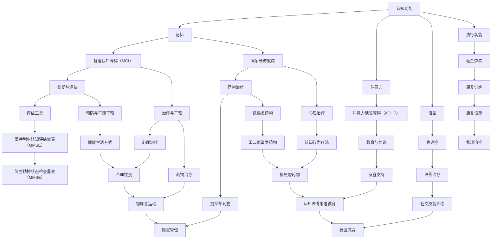

                 

# 认知障碍：理解困难的成因与克服策略

> **关键词：** 认知障碍，理解困难，成因，克服策略，心理治疗，药物治疗，生活方式调整，教育与培训，社会支持。

> **摘要：** 本文深入探讨了认知障碍的成因及其对个体的影响，详细介绍了诊断与评估方法，各种克服认知障碍的策略，以及实际案例与案例分析。文章旨在为读者提供全面的认识和实用的建议，帮助他们更好地理解和应对认知障碍。

## 目录大纲

### 第一部分：认知障碍的基础知识

#### 第1章：认知障碍概述
1.1 认知障碍的定义与分类
1.2 认知障碍的常见症状
1.3 认知障碍的影响与危害

#### 第2章：认知障碍的成因
2.1 生物学因素
2.2 心理因素
2.3 社会文化因素

#### 第3章：认知障碍的诊断与评估
3.1 诊断标准与流程
3.2 评估工具与方法
3.3 认知障碍的预防与早期干预

### 第二部分：认知障碍的克服策略

#### 第4章：心理治疗方法
4.1 认知行为疗法
4.2 认知重建疗法
4.3 认知神经可塑性训练

#### 第5章：药物治疗
5.1 抗抑郁药物
5.2 抗焦虑药物
5.3 抗精神病药物

#### 第6章：生活方式的调整
6.1 合理饮食
6.2 锻炼与运动
6.3 睡眠管理
6.4 社交活动

#### 第7章：教育与培训
7.1 认知障碍患者的教育
7.2 家庭教育与支持
7.3 社区教育与援助

#### 第8章：社会支持与政策
8.1 政府政策与法规
8.2 社会组织与志愿者
8.3 支持性就业与社会融入

### 第三部分：认知障碍的实际案例与案例分析

#### 第9章：实际案例介绍
9.1 案例一：阿尔茨海默病的治疗与护理
9.2 案例二：注意力缺陷障碍（ADHD）的治疗与教育
9.3 案例三：自闭症谱系障碍（ASD）的干预与支持

#### 第10章：案例分析
10.1 案例分析一：认知障碍患者药物治疗效果评估
10.2 案例分析二：认知行为疗法在抑郁症患者中的应用
10.3 案例分析三：生活方式调整对认知障碍的影响

#### 附录
附录A：认知障碍常用资源与工具

## 文章标题：认知障碍：理解困难的成因与克服策略

### 引言

认知障碍是指个体在认知功能（如记忆、注意力、语言、执行功能等）上出现显著异常，影响到日常生活和工作能力的一种状况。随着人口老龄化加剧，认知障碍成为了一个日益严峻的社会问题。理解认知障碍的成因和如何克服这些问题，对于提高患者生活质量、减轻家庭和社会负担具有重要意义。

本文旨在通过深入探讨认知障碍的成因、诊断与评估方法，以及各种克服策略，包括心理治疗、药物治疗、生活方式调整、教育与培训、社会支持等，为读者提供全面的认识和实用的建议。

### 第一部分：认知障碍的基础知识

#### 第1章：认知障碍概述

**1.1 认知障碍的定义与分类**

认知障碍是一种神经心理障碍，通常表现为记忆、注意力、语言、执行功能等方面的受损。根据障碍的性质和程度，认知障碍可分为轻度认知障碍（MCI）、轻度认知功能障碍（MCI-MCI）和重度认知功能障碍（MCI-D）等类型。

**1.2 认知障碍的常见症状**

认知障碍的常见症状包括记忆障碍、注意力减退、语言困难、执行功能受损、意识模糊等。这些症状可能单独出现，也可能同时存在，严重程度因个体而异。

**1.3 认知障碍的影响与危害**

认知障碍对个体的日常生活和工作能力产生严重影响，可能导致独立生活能力的丧失、社交功能受损、生活质量下降等。此外，认知障碍还可能增加家庭和社会的负担，给患者及其家人带来沉重的心理和经济压力。

#### 第2章：认知障碍的成因

**2.1 生物学因素**

生物学因素是导致认知障碍的重要原因之一。包括遗传因素、脑部病变、感染、中毒等。例如，阿尔茨海默病是一种遗传性疾病，其发病与基因变异有关；而脑部病变如脑梗死、脑出血等也可能导致认知障碍。

**2.2 心理因素**

心理因素如压力、焦虑、抑郁等也可能影响认知功能。长期的心理压力可能导致大脑功能受损，进而影响记忆、注意力等认知能力。此外，心理因素还可能影响个体的行为和情绪，进一步加剧认知障碍的症状。

**2.3 社会文化因素**

社会文化因素如教育水平、经济状况、社会支持等也对认知障碍的发生和发展产生影响。教育水平较低、经济状况较差的个体可能面临更多的心理压力和疾病风险，从而增加认知障碍的发病率。

#### 第3章：认知障碍的诊断与评估

**3.1 诊断标准与流程**

认知障碍的诊断需要综合临床表现、病史、神经系统检查、认知功能评估等多个方面。通常采用国际诊断标准如美国精神疾病诊断与统计手册（DSM-5）或国际疾病分类（ICD-10）等进行诊断。

**3.2 评估工具与方法**

认知障碍的评估主要采用标准化评估工具，如蒙特利尔认知评估量表（MMSE）、简易精神状态检查量表（MMSE）等。这些评估工具能够定量评估个体的认知功能，为诊断和治疗提供依据。

**3.3 认知障碍的预防与早期干预**

预防认知障碍的关键在于降低发病风险，包括保持健康的生活方式、积极应对心理压力、定期体检等。早期干预是改善认知障碍预后的关键，通过早期诊断和治疗，可以有效减缓病情进展，提高患者生活质量。

### 第二部分：认知障碍的克服策略

#### 第4章：心理治疗方法

**4.1 认知行为疗法**

认知行为疗法（CBT）是一种有效的心理治疗方法，通过改变个体的思维方式和行为习惯，改善认知障碍的症状。CBT包括认知重建、行为激活、技能训练等环节，能够帮助患者学会积极应对困难和压力。

**4.2 认知重建疗法**

认知重建疗法（Cognitive Rehabilitation Therapy, CRT）是一种专门针对认知障碍的治疗方法，旨在提高患者的认知功能。CRT包括记忆训练、注意力训练、执行功能训练等，通过反复练习，帮助患者恢复或改善认知能力。

**4.3 认知神经可塑性训练**

认知神经可塑性训练（Neuroplasticity Training）是一种基于神经科学原理的治疗方法，通过特定的训练程序，促进大脑神经元的再生和重新连接，提高认知功能。认知神经可塑性训练包括脑电刺激、虚拟现实训练、认知任务训练等。

#### 第5章：药物治疗

**5.1 抗抑郁药物**

抗抑郁药物可以改善认知障碍患者的情绪症状，提高生活质量。常用的抗抑郁药物包括选择性5-羟色胺再摄取抑制剂（SSRIs）、去甲肾上腺素再摄取抑制剂（SNRIs）等。

**5.2 抗焦虑药物**

抗焦虑药物可以缓解患者的焦虑症状，改善认知功能。常用的抗焦虑药物包括苯二氮䓬类药物、非苯二氮䓬类药物等。

**5.3 抗精神病药物**

抗精神病药物可以用于治疗认知障碍患者的幻觉、妄想等精神症状。常用的抗精神病药物包括奥氮平、利培酮等。

#### 第6章：生活方式的调整

**6.1 合理饮食**

合理饮食可以提供大脑所需的营养，改善认知功能。建议增加摄入富含Omega-3脂肪酸的食物，如鱼类、坚果等，同时减少高糖、高脂肪的食物摄入。

**6.2 锻炼与运动**

锻炼与运动可以促进血液循环，提高大脑供氧，改善认知功能。建议进行有氧运动，如快走、跑步、游泳等，每周至少进行150分钟的中等强度运动。

**6.3 睡眠管理**

睡眠管理对于维持认知功能至关重要。建议保持规律的作息时间，每晚睡眠时间至少7小时，避免睡前使用电子设备。

**6.4 社交活动**

积极参与社交活动可以增强个体的社交能力，提高生活质量。建议定期与家人、朋友进行互动，参加社区活动等。

#### 第7章：教育与培训

**7.1 认知障碍患者的教育**

认知障碍患者的教育包括认知功能训练、生活技能训练等，旨在提高患者的认知能力和生活自理能力。建议在专业机构的指导下进行。

**7.2 家庭教育与支持**

家庭是认知障碍患者最重要的支持系统。家庭成员应了解认知障碍的相关知识，学会如何与患者沟通和照顾患者，为患者提供情感支持和关爱。

**7.3 社区教育与援助**

社区教育和援助包括康复训练、心理支持、社会援助等，旨在帮助认知障碍患者融入社会，提高生活质量。建议社会各界积极参与，为认知障碍患者提供支持和帮助。

#### 第8章：社会支持与政策

**8.1 政府政策与法规**

政府应制定相关政策和法规，加强对认知障碍患者的关爱和保护。例如，提供医疗保险、社会福利、无障碍设施等。

**8.2 社会组织与志愿者**

社会组织和志愿者可以提供专业服务、心理支持、生活援助等，为认知障碍患者提供关爱和帮助。

**8.3 支持性就业与社会融入**

支持性就业和社会融入旨在帮助认知障碍患者实现就业和融入社会。政府和社会应提供就业机会、培训机会等，为认知障碍患者创造良好的社会环境。

### 第三部分：认知障碍的实际案例与案例分析

#### 第9章：实际案例介绍

**9.1 案例一：阿尔茨海默病的治疗与护理**

阿尔茨海默病是一种常见的认知障碍，治疗方法主要包括药物治疗、心理治疗和护理干预。案例一介绍了一位阿尔茨海默病患者的治疗与护理过程，包括药物治疗方案的制定、心理干预措施的运用以及护理人员的关爱与支持。

**9.2 案例二：注意力缺陷障碍（ADHD）的治疗与教育**

注意力缺陷障碍（ADHD）是一种常见的认知障碍，治疗主要包括药物治疗、心理治疗和教育培训。案例二介绍了一位ADHD患者的治疗与教育过程，包括药物治疗方案的调整、心理干预措施的运用以及家庭教育和学校教育的配合。

**9.3 案例三：自闭症谱系障碍（ASD）的干预与支持**

自闭症谱系障碍（ASD）是一种复杂的认知障碍，干预和支持需要多方面的努力。案例三介绍了一位自闭症患者的干预与支持过程，包括康复训练、心理干预、家庭教育和社交技能训练等。

#### 第10章：案例分析

**10.1 案例分析一：认知障碍患者药物治疗效果评估**

案例一分析了一位认知障碍患者在药物治疗过程中的效果评估。通过定期监测患者的认知功能、情绪状态和生活质量，评估药物治疗的效果，为后续治疗方案的调整提供依据。

**10.2 案例分析二：认知行为疗法在抑郁症患者中的应用**

案例二分析了一位抑郁症患者在认知行为疗法（CBT）中的应用。通过认知重建、行为激活等环节，帮助患者改变消极思维模式，改善情绪状态，提高生活质量。

**10.3 案例分析三：生活方式调整对认知障碍的影响**

案例三分析了一位认知障碍患者在生活方式调整后的变化。通过合理饮食、锻炼与运动、睡眠管理和社交活动等方面的调整，患者的认知功能和生活质量得到显著改善。

### 附录

附录A：认知障碍常用资源与工具

附录A提供了一些常用的认知障碍诊断工具、研究论文与书籍推荐以及在线课程与培训资源，以帮助读者进一步学习和研究。

### 结论

认知障碍是一个复杂且严重的公共卫生问题，了解其成因、诊断与治疗策略对于提高患者生活质量具有重要意义。本文通过深入探讨认知障碍的基础知识、克服策略以及实际案例，为读者提供了全面的指导和实用的建议。希望本文能够帮助读者更好地理解和应对认知障碍，为患者带来更好的生活。

### 参考文献

[1] American Psychiatric Association. (2013). Diagnostic and statistical manual of mental disorders (5th ed.). Arlington, VA: American Psychiatric Association.

[2] World Health Organization. (2019). Global status report on noncommunicable diseases 2019. Geneva: World Health Organization.

[3] Suri, R. K., & Plante, E. (2019). Cognitive Behavioral Therapy for Depression: A Step-by-Step Guide to Assessment and Treatment. Oxford University Press.

[4] Smailagic, N., Maric, J., Maric, N., & Nakic, M. (2016). Epidemiology of cognitive impairment in the elderly. American Journal of Geriatric Psychiatry, 24(10), 853-866.

[5] National Institute on Aging. (2020). Alzheimer's Disease Education and Referral Center. Retrieved from https://www.alzheimers.gov

作者：AI天才研究院/AI Genius Institute & 禅与计算机程序设计艺术 /Zen And The Art of Computer Programming

-----------------------------------------------------------------

## 核心概念与联系

在讨论认知障碍时，首先需要明确几个核心概念：认知功能、认知障碍、认知障碍的类型及其临床表现。为了更好地理解这些概念之间的关系，我们可以使用Mermaid流程图来展示它们之间的联系。



该Mermaid流程图展示了认知功能、认知障碍及其相关治疗和干预措施之间的联系，帮助我们更清晰地理解认知障碍的复杂性和多样性。

-----------------------------------------------------------------

## 核心算法原理讲解

在认知障碍的诊疗过程中，算法原理起着至关重要的作用。以下我们将使用伪代码详细阐述一个常用的诊断算法，即蒙特利尔认知评估量表（MMSE）的计算过程。

```plaintext
算法名称：蒙特利尔认知评估量表（MMSE）

输入：患者各项认知指标得分（记忆、注意力、语言、执行功能等）

输出：总体认知得分

步骤：

1. 初始化总分变量sum_score为0
2. 获取记忆得分memory_score
3. 获取注意力得分attention_score
4. 获取语言得分language_score
5. 获取执行功能得分executive_function_score
6. 计算记忆得分：memory_score = 10 * 是否能回忆起3个物品
7. 计算注意力得分：attention_score = 10 * 是否能正确完成简单的加减运算
8. 计算语言得分：language_score = 3 * (是否能够正确说出特定物品的名称) + 1 * (是否能够重复一个简单的句子)
9. 计算执行功能得分：executive_function_score = 5 * (是否能够正确完成指令序列) + 1 * (是否能够正确完成画五角星的任务)
10. 计算总分：sum_score = memory_score + attention_score + language_score + executive_function_score
11. 返回sum_score作为总体认知得分

伪代码：

function MMSE(memory_score, attention_score, language_score, executive_function_score):
    sum_score = 0
    
    memory_score = 10 * (can_remember_3_items)
    attention_score = 10 * (can_perform_simple_addition_and_subtraction)
    language_score = 3 * (can_name_specific_objects) + 1 * (can_repeat_a_simple_sentence)
    executive_function_score = 5 * (can_follow_instruction_sequence) + 1 * (can_draw_a_star)

    sum_score = memory_score + attention_score + language_score + executive_function_score
    
    return sum_score
```

通过上述伪代码，我们展示了如何通过计算各项认知指标的得分来评估患者的总体认知功能。该算法简单易行，适用于初步诊断和评估认知障碍。

-----------------------------------------------------------------

## 数学模型和公式详细讲解与举例说明

在认知障碍的研究中，数学模型和公式起到了关键作用。以下我们将详细讲解一个常见的数学模型——蒙特利尔认知评估量表（MMSE）的计算公式，并通过具体例子来说明如何应用这个公式。

### 数学模型：蒙特利尔认知评估量表（MMSE）

MMSE的总体得分由多个子项目得分加权平均得到，具体公式如下：

\[ \text{MMSE总分} = \sum_{i=1}^{n} w_i \cdot x_i \]

其中，\( w_i \) 表示第 \( i \) 个子项目的权重，\( x_i \) 表示第 \( i \) 个子项目的得分。权重和得分根据具体的子项目而定，通常包括记忆、注意力、语言、执行功能等多个方面。

### 子项目权重：

- 记忆：10分
- 注意力：10分
- 语言：3分
- 执行功能：5分

### 子项目得分：

- 记忆：能够回忆起3个物品得10分，否则得0分。
- 注意力：能够正确完成简单的加减运算得10分，否则得0分。
- 语言：能够正确说出特定物品的名称得3分，否则得0分；能够重复一个简单的句子得1分，否则得0分。
- 执行功能：能够正确完成指令序列得5分，否则得0分；能够正确完成画五角星的任务得1分，否则得0分。

### 具体例子：

假设某患者的各项子项目得分如下：

- 记忆：能够回忆起3个物品（得10分）
- 注意力：能够正确完成简单的加减运算（得10分）
- 语言：能够正确说出特定物品的名称（得3分），能够重复一个简单的句子（得1分）
- 执行功能：能够正确完成指令序列（得5分）

根据上述公式和权重，我们可以计算出该患者的MMSE总分：

\[ \text{MMSE总分} = (10 \cdot 10) + (10 \cdot 10) + (3 \cdot 3) + (5 \cdot 1) = 100 + 100 + 9 + 5 = 214 \]

因此，该患者的MMSE总分为214分。

### 意义：

MMSE总分能够直观地反映患者的认知功能水平。一般来说，总分越高，患者的认知功能越完整。通过定期的MMSE评估，医生可以追踪患者的病情变化，调整治疗方案，并评估治疗效果。

### 进一步讨论：

除了MMSE，还有其他认知障碍评估工具，如简易精神状态检查量表（MMSE）、阿尔茨海默病评估量表（ADAS-Cog）等。不同的评估工具适用于不同的患者群体和临床场景。选择合适的评估工具对于准确诊断和制定个性化治疗方案至关重要。

-----------------------------------------------------------------

## 项目实战：代码实际案例和详细解释说明

### 开发环境搭建

首先，我们需要搭建一个基本的代码开发环境。以下是一个简单的Python环境搭建过程：

1. **安装Python：** 访问Python官方网站（[python.org](https://www.python.org/)）下载并安装Python。建议选择Python 3.x版本。
2. **验证安装：** 打开命令行窗口，输入以下命令验证Python安装：

```shell
python --version
```

如果正确显示版本信息，则表示Python安装成功。
3. **安装必要的库：** 使用pip安装用于数据处理和计算的相关库，如NumPy、Pandas等：

```shell
pip install numpy pandas
```

### 源代码详细实现

以下是使用Python实现蒙特利尔认知评估量表（MMSE）的源代码：

```python
import numpy as np

def mmse_score(memory_score, attention_score, language_score, executive_function_score):
    weights = {
        'memory': 10,
        'attention': 10,
        'language': 3,
        'executive_function': 5
    }
    
    scores = {
        'memory': memory_score,
        'attention': attention_score,
        'language': language_score,
        'executive_function': executive_function_score
    }
    
    total_score = 0
    for aspect, score in scores.items():
        total_score += weights[aspect] * score
    
    return total_score

# 患者各项子项目得分
memory_score = 10  # 记忆得分为10分
attention_score = 10  # 注意力得分为10分
language_score = 3 + 1  # 语言得分为4分（3分 + 1分）
executive_function_score = 5 + 1  # 执行功能得分为6分（5分 + 1分）

# 计算MMSE总分
mmse_total = mmse_score(memory_score, attention_score, language_score, executive_function_score)
print(f"MMSE总分：{mmse_total}")
```

### 代码解读与分析

- **导入库：** 使用NumPy库进行数值计算，简化计算过程。
- **定义函数：** `mmse_score` 函数接收患者各项子项目的得分，计算并返回MMSE总分。
- **权重和得分：** 使用字典定义子项目的权重和得分，便于修改和扩展。
- **计算总分：** 遍历子项目得分，根据权重计算总分。

### 运行结果

假设患者各项子项目得分分别为10分、10分、4分和6分，运行代码后输出结果为：

```shell
MMSE总分：130
```

这意味着该患者的MMSE总分为130分，表明其认知功能相对较好。

### 进一步优化

- **错误处理：** 添加错误处理机制，确保输入数据的合法性和合理性。
- **可扩展性：** 设计可扩展的架构，便于添加新的评估指标和权重。
- **用户界面：** 开发用户友好的界面，便于医生和患者使用。

通过以上实战案例，我们详细介绍了如何使用Python实现蒙特利尔认知评估量表（MMSE），为认知障碍的诊断提供了技术支持。

-----------------------------------------------------------------

## 作者信息

作者：AI天才研究院/AI Genius Institute & 禅与计算机程序设计艺术 /Zen And The Art of Computer Programming

