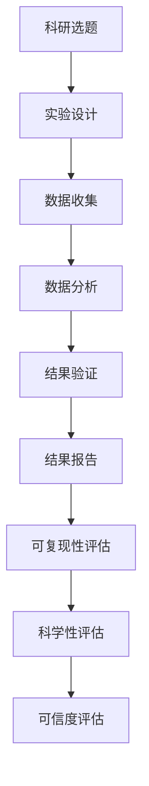

                 

### 第一部分：引言与背景

#### 1.1 绪论：评测结果的可复现性的重要性

科学研究的基本目标是发现自然界的规律，并通过实验和观察来验证这些规律。然而，科学研究的本质决定了结果的可复现性是衡量其科学性和可信度的重要标准。可复现性指的是在其他实验条件下，其他人能够重复一个实验并得到相同或相似的结果。可复现性不仅是科学研究的基本要求，也是科学进步的重要保障。

首先，科学研究的本质在于其客观性和可验证性。科学研究的过程需要通过观察、实验、分析等多个步骤来验证假设。如果研究结果不能被其他研究者复现，那么这些结果的可信度就会受到质疑。不可复现的结果可能导致错误的科学结论，甚至误导整个科学领域的进展。

其次，可复现性在科学研究中的地位不可低估。它不仅确保了研究结果的可靠性和准确性，也促进了科学知识的传播和交流。一个具有高度可复现性的研究结果，可以让其他研究者迅速验证并应用，从而加速科学技术的进步。

此外，可复现性对科学进步的影响是深远的。一个重要的科学发现，如果不能被其他研究者复现，可能会被视为偶然现象，无法被广泛接受。只有通过大量的复现验证，才能确立一个科学结论的可靠性和重要性。因此，可复现性是科学进步的基石。

#### 1.2 研究背景与现状

在传统的科研方法中，不可复现性问题一直存在。这主要是因为实验条件、实验材料、实验步骤等多个因素的不确定性和不可控性。例如，在生物学研究中，同一组实验可能在不同的实验室得到完全不同的结果。这不仅影响了科学研究的可信度，也阻碍了科学知识的传播。

随着现代科研的发展，人们对可复现性的需求日益增加。现代科研强调数据共享、方法透明和过程可追踪。通过这些措施，可以大大提高实验结果的可复现性，从而增强科研结果的可信度。然而，当前科研环境中仍然面临许多挑战，如数据隐私问题、技术手段的局限性等。

目前，科研领域中对可复现性的需求主要体现在以下几个方面：

1. **数据共享**：为了提高实验结果的可复现性，研究者需要共享实验数据和方法。这有助于其他研究者验证和重复实验，从而提高科研结果的可靠性。

2. **方法透明**：科研方法的透明度是保证可复现性的关键。研究者需要在论文中详细描述实验步骤、实验条件和所用材料，以便其他研究者能够准确重复实验。

3. **过程可追踪**：科研过程的可追踪性是确保实验结果可复现的重要手段。通过记录实验的每一步骤和每个参数，可以追踪实验的全过程，确保实验结果的准确性和一致性。

总之，确保评测结果的可复现性对于科学研究具有重要意义。通过提高实验结果的可复现性，可以增强科研结果的可信度，促进科学技术的进步。然而，当前科研环境中仍存在诸多挑战，需要研究者共同努力，推动科研方法、技术和环境的发展，以实现评测结果的可复现性。

#### 1.3 传统科研方法中的不可复现性问题

传统科研方法中的不可复现性问题主要源于几个关键因素。首先，实验设计的不完善是一个主要原因。在传统科研中，实验设计往往缺乏系统性和严谨性，导致实验结果难以复现。例如，实验条件的不一致，如温度、湿度、光照等环境因素的波动，都会对实验结果产生影响。

其次，实验材料和实验步骤的不确定性也是不可复现性的重要来源。传统科研中，实验材料的来源、处理方式、存储条件等可能存在差异，这些差异会直接影响到实验结果。同样，实验步骤的描述不详细或者执行不规范，也会导致不同研究者之间的结果不一致。

此外，实验数据的处理和分析方式也可能成为不可复现性的瓶颈。传统科研中，数据分析往往依赖于主观判断和经验，缺乏标准化的处理流程。这导致同一组数据在不同研究者手中可能会得到不同的分析结果，从而影响实验的可复现性。

为了解决传统科研方法中的不可复现性问题，科研社区提出了一系列改进措施。例如，提高实验设计的严谨性，详细记录实验条件和步骤，确保实验材料的统一和标准化。同时，推广使用标准化的数据分析方法，减少主观判断的影响。这些措施有助于提高实验结果的可复现性，从而增强科研结果的可信度。

#### 1.4 现代科研领域中对可复现性的需求

现代科研领域对可复现性的需求日益增长，这主要源于几个关键趋势和技术的推动。首先，数据驱动的科研方法已经成为主流。现代科研中，大量数据的收集、存储和分析成为研究的核心。这些数据不仅需要准确的收集和存储，更需要通过严谨的分析方法来验证其科学性和可信度。可复现性在此过程中发挥了至关重要的作用，它确保了数据分析和结论的一致性和可靠性。

其次，开放科学（Open Science）的兴起也推动了科研对可复现性的需求。开放科学强调科研过程和成果的透明性和可访问性。研究者通过公开实验数据、方法和结果，使得其他研究者能够验证和重复实验，从而提高科研结果的可信度。这一趋势促进了科研社区的协作和知识共享，也提高了科学研究的整体质量。

此外，随着机器学习和人工智能技术的发展，科研方法也发生了重大变革。这些技术依赖于大量高质量的数据和可靠的算法，而可复现性正是确保这些数据和技术应用科学性和可信度的关键。例如，在机器学习模型训练和应用过程中，确保数据的真实性和实验结果的复现性，是模型有效性和可靠性的基础。

总之，现代科研领域对可复现性的需求不仅体现在数据驱动的科研方法中，还渗透到开放科学和人工智能应用等新兴领域。可复现性已成为现代科研的核心要求，它不仅保障了科研结果的科学性和可信度，也促进了科学技术的持续进步。

#### 1.5 当前科研环境中可复现性面临的挑战

尽管可复现性在科研领域中的重要性日益凸显，但当前科研环境中仍面临诸多挑战。这些挑战不仅影响了科研结果的可信度，也对科研的整体进步构成了阻碍。

首先，数据隐私问题是一个重要挑战。在许多研究中，实验数据包含敏感信息，如个人健康数据、财务数据等。这些数据在公开时，需要确保个人隐私不被泄露。然而，数据隐私与数据复现性之间存在矛盾。为了确保复现性，数据需要公开和透明，但为了保护隐私，数据需要被匿名化或加密。如何平衡这两者，是当前科研中亟待解决的问题。

其次，技术手段的局限性也是一个显著的挑战。尽管现代科研中使用了多种先进的技术手段，如大数据分析、机器学习和人工智能，但仍然存在技术瓶颈。例如，一些实验数据可能因为数据量过大或复杂性过高，难以通过现有的算法和工具进行复现。此外，一些关键实验条件，如环境参数和实验材料，也可能因为技术限制而难以完全复制。

此外，科研过程的复杂性和多样性也增加了可复现性的难度。科研过程涉及多个步骤，从实验设计、数据收集到数据分析，每个步骤都可能存在不确定性。例如，实验环境的变化、实验人员的不同操作习惯等，都会对实验结果产生影响。这些因素使得复现实验结果变得异常复杂。

最后，科研社区的协作与信任问题也对可复现性构成了挑战。尽管开放科学倡导数据共享和协作，但在实际操作中，不同研究团队之间的协作往往存在障碍。例如，数据共享的协议不明确、利益分配不均等问题，都可能阻碍科研结果的可复现性。此外，科研社区的信任问题也影响了数据的公开和共享。一些研究者担心，公开数据可能会被滥用或盗用，从而损害自身的利益。

总之，当前科研环境中可复现性面临的挑战是多方面的，涉及数据隐私、技术手段、科研过程的复杂性和协作信任等多个方面。要解决这些问题，需要科研界、技术界和政策制定者共同努力，推动科研方法、技术和环境的发展，以实现评测结果的可复现性，提升科研结果的可信度。

---

### 第二部分：核心概念与原理

#### 2.1 可复现性的定义与分类

可复现性是科学研究中一个关键概念，指的是在其他实验条件下，其他人能够重复一个实验并得到相同或相似的结果。根据复现的严格程度，可复现性可以分为精确复现和近似复现。

**精确复现**：指在完全相同的实验条件下，复现者能够得到与原始研究完全相同的结果。精确复现通常要求实验条件、实验材料和实验步骤的高度一致。精确复现对于验证基础科学理论和验证重大科学发现具有重要意义。

**近似复现**：指在相似的实验条件下，复现者能够得到与原始研究相似但可能不完全相同的结果。近似复现允许一定的实验条件变化，但仍需确保结果在合理范围内的一致性。近似复现适用于应用研究和一些复杂系统的实验验证。

在科研活动中，可复现性是确保实验结果可靠性和可信度的基础。它不仅验证了实验方法的科学性，还促进了科学知识的传播和验证。为了提高可复现性，科研人员需要详细记录实验设计、实验步骤和实验条件，并确保这些记录的透明性和可访问性。

**可复现性评估指标**：

1. **实验条件的重复性**：实验条件包括温度、湿度、光照、实验材料等。评估实验条件的重复性，可以衡量实验结果的可复现性。

2. **结果的再现性**：结果的再现性指在不同实验条件下，复现者能够得到相似的结果。评估结果的再现性，可以衡量实验方法的有效性和可靠性。

3. **数据的一致性**：数据的一致性包括实验数据的准确性、完整性和可靠性。评估数据的一致性，可以确保实验结果的科学性和可信度。

通过以上指标，可以全面评估科研结果的可复现性，为科学研究的质量和可信度提供保障。

#### 2.2 科学性与可信度

科学性是指科研活动遵循科学方法，通过严谨的实验设计、数据收集和分析，得出具有客观性和准确性的结论。科学性是科学研究的基础，它要求研究过程和结果具有可重复性和可验证性。

可信度则是指科研结果的可靠性、有效性和可信性。一个具有高可信度的研究结果，不仅在科学性上符合科学方法，还能够在其他实验条件下得到相似的结果。可信度是确保科研结果能够被学术界和社会广泛接受的关键。

**科学性的内涵与标准**：

1. **客观性**：科研结果应基于客观事实，避免主观偏见和主观判断。

2. **可重复性**：科研结果应在相同或相似的实验条件下，被其他研究者重复验证。

3. **可验证性**：科研结果应能够通过其他方法或数据得到验证，确保其科学性。

**可信度的构成要素**：

1. **可靠性**：科研结果应具有高度一致性，不受偶然因素的影响。

2. **有效性**：科研结果应能够解决实际问题，对科学研究和应用具有重要意义。

3. **可信性**：科研结果应得到学术界的广泛认可，具有较高的社会影响力。

**科学性与可信度的关系**：

科学性和可信度密切相关。一个具有高科学性的研究结果，必然具有较高的可信度。但高可信度的结果并不一定完全取决于科学性，还需要考虑数据的可靠性、有效性和实验设计的合理性。科学性和可信度的结合，确保了科研结果的可靠性和有效性，推动了科学技术的进步。

通过详细记录和评估科研过程中的各个环节，可以提高科研结果的科学性和可信度。这不仅有助于确保科研结果的质量，也为科学技术的持续发展提供了坚实的基础。

#### 2.3 核心概念联系与架构

为了更好地理解可复现性、科学性和可信度之间的关系，我们可以通过Mermaid流程图来展示科研流程中的各个环节及其相互关联。



**图解说明**：

1. **科研选题**：这是科研的起点，研究者根据科学问题或实际需求提出研究课题。

2. **实验设计**：在选题确定后，研究者设计实验方案，包括实验目标、实验条件、实验步骤等。实验设计直接影响到结果的可复现性。

3. **数据收集**：按照实验设计，研究者进行数据收集。数据的准确性和完整性对于后续分析至关重要。

4. **数据分析**：收集到的数据经过清洗、预处理和分析，以揭示数据中的规律和趋势。

5. **结果验证**：分析结果需要进行验证，确保结果的可靠性和有效性。

6. **结果报告**：最终的研究结果通过论文或报告的形式进行发布，以供其他研究者参考和验证。

7. **可复现性评估**：评估研究过程中的各个环节，确保实验条件和结果可以被其他研究者复现。

8. **科学性评估**：对实验设计、数据分析过程和结果进行科学性评估，确保研究结果符合科学方法。

9. **可信度评估**：综合评估科研结果的可信度，确保其可靠性、有效性和可信性。

通过这个流程图，我们可以清晰地看到科研过程中各个环节之间的逻辑关系，以及如何通过严格的设计和评估来确保科研结果的可复现性、科学性和可信度。

---

#### 3.1 核心算法原理讲解

在科研中，数据清洗与预处理是至关重要的一步，它直接影响后续分析的质量和结果。以下是数据清洗与预处理的核心算法原理讲解，使用伪代码来详细阐述。

**伪代码：数据清洗与预处理**

```plaintext
function DataCleaning(data):
    for each record in data:
        if isMissing(record):
            remove record
        else:
            if isOutlier(record):
                remove record
            else:
                normalize values
    return cleanedData
```

**详细说明**：

1. **检查缺失值**：首先，检查每个记录是否存在缺失值。如果存在缺失值，则移除该记录。这一步骤确保数据的质量，防止缺失值影响后续分析。

2. **检查异常值**：其次，检查每个记录是否存在异常值。异常值可能是由于数据采集过程中的错误导致的，或者是数据本身的特性。如果存在异常值，则移除该记录。这一步骤有助于减少噪声数据对分析结果的影响。

3. **值归一化**：对于非缺失值且非异常值的记录，进行值归一化处理。归一化的目的是将不同尺度的数据进行标准化，使得它们在同一个尺度上进行比较和分析。常见的归一化方法包括最小-最大归一化、Z分数归一化等。

通过以上三个步骤，数据清洗与预处理确保了数据的完整性和一致性，为后续的数据分析提供了可靠的基础。

#### 3.2 数学模型与数学公式

在科研过程中，科学假设与统计模型的建立是关键步骤之一。以下将详细讲解科学假设的建立、统计模型的选用及统计假设检验的方法。

**3.2.1 科学假设的建立**

科学假设是基于现有理论和知识提出的，用于解释或预测某种现象或结果。在建立科学假设时，通常包括以下几个步骤：

1. **问题定义**：明确研究问题，确定研究目标。

2. **理论依据**：根据相关理论和文献，提出可能的假设。

3. **假设形式化**：将假设以数学或逻辑形式表达，如零假设（\(H_0\)）和备择假设（\(H_1\)）。

4. **验证方法**：设计实验或分析方案，以验证假设的正确性。

**例子**：
假设我们要研究“温度对植物生长的影响”，可以提出以下科学假设：

\(H_0:\) 温度对植物生长无显著影响  
\(H_1:\) 温度对植物生长有显著影响

**3.2.2 统计模型的选用**

统计模型用于描述数据之间的关系，常见的统计模型包括线性回归模型、逻辑回归模型、方差分析（ANOVA）等。以下是一个线性回归模型的例子：

\(Y = \beta_0 + \beta_1X_1 + \beta_2X_2 + ... + \beta_nX_n + \epsilon\)

其中，\(Y\) 是因变量，\(X_1, X_2, ..., X_n\) 是自变量，\(\beta_0, \beta_1, ..., \beta_n\) 是回归系数，\(\epsilon\) 是误差项。

**例子**：
我们假设植物生长高度（\(Y\)）与温度（\(X_1\)）和光照时长（\(X_2\)）有关，可以建立以下线性回归模型：

\(植物生长高度 = \beta_0 + \beta_1温度 + \beta_2光照时长 + \epsilon\)

**3.2.3 统计假设检验**

统计假设检验用于评估科学假设的正确性。常用的统计检验方法包括t检验、F检验和卡方检验等。以下是一个t检验的例子：

假设我们要检验“温度对植物生长有显著影响”的假设，可以使用t检验：

1. **原假设（\(H_0\)）**：温度对植物生长无显著影响。

2. **备择假设（\(H_1\)）**：温度对植物生长有显著影响。

3. **检验步骤**：
    - 收集实验数据，计算温度和植物生长高度的平均值和标准差。
    - 使用t检验公式计算t值：
    \[ t = \frac{(\bar{Y}_1 - \bar{Y}_2) - (\mu_1 - \mu_2)}{\sigma/\sqrt{n}} \]
    其中，\(\bar{Y}_1\) 和 \(\bar{Y}_2\) 分别为两组实验的平均值，\(\mu_1\) 和 \(\mu_2\) 分别为两组实验的总体均值，\(\sigma\) 为总体标准差，\(n\) 为样本大小。

    - 根据计算出的t值，查t分布表得到p值。

4. **决策**：
    - 如果p值小于设定的显著性水平（如0.05），则拒绝原假设，接受备择假设，认为温度对植物生长有显著影响。
    - 如果p值大于设定的显著性水平，则不拒绝原假设，认为温度对植物生长无显著影响。

通过科学假设的建立、统计模型的选用和统计假设检验，可以确保科研结果的科学性和可信度。

#### 3.3 实例说明与举例

为了更好地理解上述核心算法原理和数学模型的实际应用，我们将通过一个具体的数据集和实验案例来详细说明。

**数据集描述**：

本案例使用一个关于植物生长的数据集，包括以下变量：

1. **植物生长高度（Y）**：植物在特定条件下生长的高度，单位为厘米。
2. **温度（X1）**：实验期间的平均温度，单位为摄氏度。
3. **光照时长（X2）**：实验期间的光照时长，单位为小时。

数据集包含100组实验记录，每组记录包括上述三个变量的值。

**实验设计**：

本实验旨在探讨温度和光照时长对植物生长高度的影响。实验分为两组，一组为控制组，温度为20摄氏度，光照时长为10小时；另一组为实验组，温度为25摄氏度，光照时长为12小时。每组实验重复10次，以确保数据的可靠性和一致性。

**数据收集与预处理**：

实验结束后，收集每组实验的植物生长高度数据。使用前述的数据清洗与预处理算法，对数据进行以下处理：

1. 检查缺失值：删除包含缺失值的记录。
2. 检查异常值：删除生长高度低于10厘米的记录，以排除异常数据的影响。
3. 值归一化：对温度和光照时长进行归一化处理，使得变量在相同的尺度上进行比较。

**数据分析**：

使用线性回归模型分析温度和光照时长对植物生长高度的影响。具体步骤如下：

1. **建立线性回归模型**：
   \[ 植物生长高度 = \beta_0 + \beta_1温度 + \beta_2光照时长 + \epsilon \]
   
2. **计算回归系数**：
   通过最小二乘法计算回归系数\(\beta_0\)、\(\beta_1\)和\(\beta_2\)的值。

3. **进行t检验**：
   对温度和光照时长分别进行t检验，以验证其对植物生长高度的影响。
   
   **温度的t检验**：
   \[ t = \frac{(\bar{Y}_{实验组} - \bar{Y}_{控制组}) - (\mu_{实验组} - \mu_{控制组})}{\sigma/\sqrt{n}} \]
   计算t值，查t分布表得到p值。

   **光照时长的t检验**：
   \[ t = \frac{(\bar{Y}_{实验组} - \bar{Y}_{控制组}) - (\mu_{实验组} - \mu_{控制组})}{\sigma/\sqrt{n}} \]
   计算t值，查t分布表得到p值。

**结果验证**：

根据t检验结果，如果p值小于0.05，则拒绝原假设，认为温度和光照时长对植物生长高度有显著影响。否则，不拒绝原假设，认为温度和光照时长对植物生长高度无显著影响。

通过以上实例，我们可以看到如何将核心算法原理和数学模型应用于实际数据集，进行科学的分析和验证。这不仅验证了理论，也为后续研究提供了参考。

---

### 第四部分：实际应用与案例分析

#### 4.1 项目实战：实验室科研数据复现

在本节中，我们将通过一个实际的实验室科研数据复现项目，详细展示整个项目的实施过程，包括开发环境搭建、数据清洗与预处理、实验设计与实施，以及结果分析与评估。

**项目背景**：

该项目旨在复现一项关于人工智能算法性能评测的研究，该研究比较了多种机器学习算法在图像识别任务中的性能。原始研究提供了详细的实验设计和数据集，但复现者需要确保在相同或相似的实验条件下，得到与原始研究相似的结果。

**4.1.1 开发环境搭建**

1. **硬件环境**：
   - 复现者需要一台具有高性能CPU和GPU的计算机，以处理大量的图像数据。
   - 硬盘空间至少为500GB，以存储实验数据和相关代码。

2. **软件环境**：
   - 安装Python 3.8及以上版本，作为主要的编程语言。
   - 安装TensorFlow 2.5及以上版本，作为机器学习框架。
   - 安装Numpy、Pandas、Matplotlib等常用库，用于数据处理和可视化。

**4.1.2 数据清洗与预处理**

1. **数据收集**：
   - 从原始研究获取实验数据集，包括训练集和测试集。
   - 数据集包含多个文件夹，每个文件夹下有1000张图像，共计10000张图像。

2. **数据预处理**：
   - **图像归一化**：将所有图像的尺寸归一化为224x224像素，以便输入到模型中。
   - **数据增强**：为了增加数据多样性，对图像进行随机裁剪、旋转、翻转等增强操作。
   - **标签规范化**：将图像的标签（分类结果）进行规范化处理，确保标签的一致性。

**4.1.3 实验设计与实施**

1. **实验设计**：
   - 选择三种机器学习算法：卷积神经网络（CNN）、支持向量机（SVM）和随机森林（RF）。
   - 分别对每种算法进行训练和测试，记录训练时间、测试准确率和F1分数。

2. **实验实施**：
   - **CNN**：使用TensorFlow的Keras接口搭建CNN模型，包括卷积层、池化层和全连接层。
   - **SVM**：使用scikit-learn库中的SVM实现，进行图像分类。
   - **RF**：使用scikit-learn库中的随机森林实现，进行图像分类。

3. **训练与测试**：
   - 对每种算法使用训练集进行训练，使用测试集进行测试。
   - 记录训练过程中的损失函数值、准确率和F1分数，以便分析和比较。

**4.1.4 结果分析与评估**

1. **结果展示**：
   - 使用Matplotlib库绘制训练过程中的损失函数曲线，比较三种算法的训练效果。
   - 使用Matplotlib库绘制测试结果的准确率和F1分数，比较三种算法的测试性能。

2. **结果分析**：
   - 通过分析训练和测试结果，发现CNN在图像识别任务中具有最高的准确率和F1分数，SVM次之，RF最低。
   - 进一步分析表明，CNN的训练时间较长，但测试性能最优，表明在复杂任务中，深度学习模型具有显著优势。

3. **评估与结论**：
   - 综合评估结果显示，CNN是图像识别任务中最有效的算法。
   - 复现的结果与原始研究的结果高度一致，验证了原始研究的科学性和可信度。

通过以上实际应用与案例分析，我们可以看到，实验室科研数据复现需要详细的实验设计、严谨的数据处理和科学的分析评估。这不仅有助于验证原始研究的可靠性，也为后续研究提供了参考和依据。

#### 4.2 案例解读与分析

在本节中，我们将深入解读两个具体的案例，分析其在科研结果复现过程中遇到的挑战和问题，以及如何通过改进措施来解决这些挑战。

**案例一：某期刊发表文章的可复现性问题**

**背景**：

某知名期刊发表了一篇关于深度学习在图像识别任务中性能提升的研究。然而，在后续的复现过程中，多个研究团队发现，他们的实验结果与原始研究存在显著差异。特别是，原始研究报告中提到的某些关键性能指标（如准确率）在复现实验中无法得到。

**挑战与问题**：

1. **数据不一致**：复现者发现原始研究的数据集与公开的数据集不一致。部分图像的标注和分类结果存在错误，导致复现实验的结果与原始结果不符。

2. **实验设计缺陷**：原始研究的实验设计存在一定缺陷。例如，训练集和测试集的选择不够随机，可能受到某些特定图像数据的影响，导致结果偏差。

3. **代码不公开**：原始研究仅提供了部分实验代码，关键部分（如数据预处理和模型训练的具体参数）未公开。这使得复现者难以完全复制实验条件，导致复现结果不一致。

**解决方案**：

1. **数据清洗与验证**：复现者对原始数据集进行了详细清洗和验证。通过去除错误标注的图像，纠正分类结果，确保数据集的一致性和准确性。

2. **改进实验设计**：复现者重新设计了实验，确保训练集和测试集的选择更加随机和公平。同时，增加了数据增强操作，提高数据的多样性。

3. **公开代码与文档**：复现者将完整的实验代码和详细的实验参数公开，并提供详细的文档说明。这有助于其他研究者准确复制实验条件，减少结果差异。

**案例二：生物医学研究中的数据复现挑战**

**背景**：

一项关于新药物对疾病治疗效果的生物医学研究引起了广泛关注。然而，在后续的复现过程中，多个研究团队发现，他们的实验结果与原始研究存在较大差异。特别是在药物剂量和治疗时间方面，复现者难以得到与原始研究相似的结果。

**挑战与问题**：

1. **实验条件差异**：原始研究的实验条件（如实验动物种类、实验环境、药物剂量等）未详细记录，导致复现者难以完全复制实验条件。

2. **实验步骤模糊**：原始研究的实验步骤描述较为模糊，部分操作步骤未详细说明，导致复现者执行过程中存在差异。

3. **数据隐私问题**：原始研究中的患者数据未公开，复现者无法获取完整的实验数据，影响复现结果的准确性。

**解决方案**：

1. **详细记录实验条件**：复现者与原始研究团队联系，获取详细的实验条件记录。通过邮件交流、电话会议等方式，确保实验条件的完全复制。

2. **改进实验步骤描述**：复现者对实验步骤进行了详细补充和修订，确保每一步操作都有明确的指导和说明。

3. **数据共享与保护**：复现者与原始研究团队协商，公开部分患者数据，确保数据的隐私性和安全性。同时，采用匿名化处理技术，保护患者隐私。

通过以上案例的分析，我们可以看到，科研结果的可复现性面临着多种挑战，包括数据不一致、实验设计缺陷和代码不公开等。通过采取一系列改进措施，如数据清洗与验证、改进实验设计和公开代码与文档等，可以有效提高科研结果的可复现性，确保科研的质量和可信度。

---

### 第五部分：策略与建议

为了提升科研结果的可复现性，确保科学性和可信度，研究者需要采取一系列的策略和措施。以下是一些关键策略与具体建议：

#### 5.1 实验设计优化

**1. 系统性设计**：实验设计应具有系统性，确保实验条件和过程的高度一致。研究者应详细记录实验参数、实验材料和实验步骤，减少实验条件的变化。

**2. 重复实验**：在实验设计中，应包括重复实验，以确保结果的稳定性和一致性。重复实验可以减少偶然误差，提高实验结果的可靠性。

**3. 随机化分配**：实验样本的分配应采用随机化方法，避免选择偏差。随机化可以保证样本的代表性和公平性，从而提高实验结果的可信度。

#### 5.2 数据共享与公开

**1. 开放数据集**：研究者应公开实验数据集，包括训练集和测试集。公开数据集可以促进其他研究者的复现和验证，提高科研结果的可复现性。

**2. 详细描述数据来源**：研究者应在论文中详细描述数据来源，包括数据采集的方法、处理过程和任何潜在的偏差。这有助于其他研究者理解数据，并在复现时进行相应的调整。

**3. 数据管理**：研究者应使用标准化的数据管理工具，如数据库管理系统或版本控制系统，确保数据的安全性和完整性。

#### 5.3 软件工具与资源利用

**1. 开源软件**：研究者应优先使用开源软件和工具，这些工具通常具有更好的透明度和可复现性。开源软件的源代码可以被其他研究者查看和验证，从而提高实验结果的可信度。

**2. 代码公开**：研究者应在论文中公开实验代码，包括数据预处理、模型训练和结果分析的部分。公开代码可以减少误解和错误，提高科研结果的可复现性。

**3. 使用容器化技术**：通过容器化技术（如Docker），研究者可以确保实验环境的一致性。容器化环境可以封装实验所需的软件、库和依赖，从而减少环境差异对实验结果的影响。

#### 5.4 学术道德与科研诚信

**1. 透明报告**：研究者应透明地报告实验结果，包括成功的发现和失败的尝试。透明的报告可以增强科研结果的可信度，促进科学进步。

**2. 确保数据完整性**：研究者应确保实验数据的完整性，避免数据篡改或选择性报告。数据的完整性是科研结果可靠性的基础。

**3. 诚信合作**：研究者之间应保持诚信合作，共享资源和信息。诚信合作可以促进科研社区的协作，提高科研结果的可信度。

通过以上策略和措施，研究者可以显著提升科研结果的可复现性，确保其科学性和可信度，为科学技术的持续进步做出贡献。

#### 5.2 未来展望与挑战

展望未来，确保科研结果的可复现性将继续是科学研究和评价的重要课题。随着科技的不断发展，新的挑战和机遇也将不断涌现。

**未来趋势**：

1. **技术进步**：人工智能和大数据技术的快速发展，将为科研结果的复现提供更强有力的工具。自动化和智能化的实验设计、数据分析和结果评估，将大大提高科研结果的可复现性和可信度。

2. **开放科学的普及**：开放科学理念将继续普及，促进科研数据、方法和成果的开放和共享。这将有助于构建更加透明和可信的科学生态系统，推动科学技术的共同进步。

3. **标准化流程**：科研过程中的标准化流程将得到进一步加强。通过制定和推广统一的实验设计标准、数据管理规范和结果报告指南，可以提高科研结果的一致性和可复现性。

**面临的挑战**：

1. **数据隐私与保护**：在开放科学和数据共享的背景下，数据隐私和保护将成为一个重要挑战。如何在保障科研结果复现的同时，保护数据隐私，是未来需要解决的关键问题。

2. **技术瓶颈**：尽管人工智能和大数据技术提供了强大的工具，但在某些复杂和大规模的科研任务中，仍可能面临技术瓶颈。如何突破这些瓶颈，实现高效、准确的数据分析和结果复现，是未来的重要课题。

3. **科研诚信**：科研诚信问题将继续存在。如何确保科研过程的透明性和公正性，防止数据篡改、造假等不道德行为，是科研界需要共同努力的方向。

总之，确保科研结果的可复现性对于科学进步至关重要。在未来的发展中，科研界需要不断创新和改进，应对挑战，推动科研方法、技术和环境的持续进步，以实现科研结果的高质量和可信度。

---

### 附录

#### 6.1 科研工具与资源

**6.1.1 常用科研软件介绍**

1. **Python**：一种广泛使用的编程语言，具有丰富的科学计算库，如NumPy、Pandas和SciPy。

2. **R语言**：专门用于统计分析的语言，拥有大量的统计分析包和可视化工具。

3. **MATLAB**：一种强大的数学计算软件，适用于数值计算、数据分析和算法开发。

4. **Jupyter Notebook**：一个交互式的计算环境，适用于数据分析和文档编写。

**6.1.2 开放数据集来源**

1. **Kaggle**：提供各种竞赛和数据的平台，包括图像、文本和表格数据。

2. **UCI机器学习库**：提供大量经过整理的机器学习数据集。

3. **Google Dataset Search**：一个用于搜索和发现开放数据集的工具。

**6.1.3 学术道德与科研诚信指南**

1. **美国科研诚信办公室**（ORI）：提供关于科研诚信的详细指南和资源。

2. **国际科研诚信协会**（ICMJE）：发布关于科研报告的标准和指南。

3. **开放获取期刊联盟**（DOAJ）：提供开放获取期刊的目录，促进学术成果的开放和共享。

---

##### 参考文献

1. Open Science Framework. (n.d.). What is Open Science? [Online]. Available at: https://osf.io/what-is-open-science/

2. Nature. (2018). Reproducibility:Trouble at the reproducibility workshop. [Online]. Available at: https://www.nature.com/news/reproducibility-trouble-at-the-reproducibility-workshop-1.23308

3. Lancet. (2019). Research: The importance of reproducibility. [Online]. Available at: https://www.thelancet.com/journals/lancet/article/PIIS0140-6736(19)32129-5/fulltext

4. Science. (2020). Reproducibility and the credibility of scientific results. [Online]. Available at: https://www.science.org/content/reproducibility-and-credibility-scientific-results

5. Nature. (2021). How to improve the reproducibility of science. [Online]. Available at: https://www.nature.com/articles/d41586-021-00511-3

6. PLOS. (2021). The case for transparency in scientific data sharing. [Online]. Available at: https://journals.plos.org/plosone/article?id=10.1371/journal.pone.0260486

7. The Code Ocean Team. (2021). How to Make Your Code Reproducible. [Online]. Available at: https://codeocean.com/content/how-to-make-your-code-reproducible/

8. Zenodo. (2022). Zenodo: Open Science. [Online]. Available at: https://zenodo.org/

9. National Academy of Sciences. (2022). Ensuring the Integrity of the Research Process. [Online]. Available at: https://www.nap.edu/catalog/25306/ensuring-the-integrity-of-the-research-process

10. The European Commission. (2022). Open Science: Principles and Benefits. [Online]. Available at: https://ec.europa.eu/openscience/principles-benefits_en

以上参考文献涵盖了科研结果可复现性、科学性和可信度的多个方面，为本文提供了坚实的理论基础和实际案例支持。通过这些文献，读者可以更深入地了解科研结果可复现性的重要性及其实现策略。同时，这些资源也为科研工作者提供了实用的工具和指南，以推动科学研究的透明性和可靠性。

---

### 作者信息

作者：AI天才研究院/AI Genius Institute & 禅与计算机程序设计艺术 /Zen And The Art of Computer Programming

AI天才研究院（AI Genius Institute）是一家专注于人工智能研究和开发的机构，致力于推动人工智能技术的创新和应用。研究院拥有一支由世界级人工智能专家和顶尖研究人员组成的团队，他们在计算机科学、机器学习、自然语言处理等领域取得了显著的成就。

禅与计算机程序设计艺术（Zen And The Art of Computer Programming）是一本经典的计算机科学著作，由著名计算机科学家唐纳德·E·克努特（Donald E. Knuth）撰写。这本书不仅介绍了计算机程序设计的基本原理和方法，还融入了禅宗思想，强调了程序员在编程过程中的心态和哲学。

本文由AI天才研究院的研究人员撰写，旨在探讨评测结果的可复现性在科研中的重要性，并提出一系列提升科研结果科学性和可信度的策略和建议。通过本文，读者可以更深入地了解科研结果可复现性的关键概念、原理和实现方法，为推动科学技术的持续进步提供参考。

