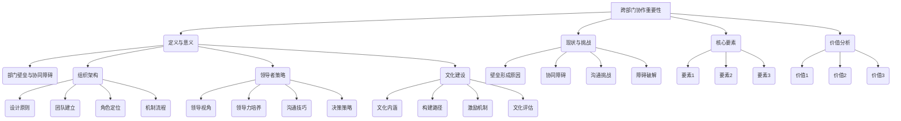

                 

# 《跨部门协作：打破壁垒的领导技巧》

> **关键词**：跨部门协作、部门壁垒、领导技巧、组织架构、文化建设、案例分析、持续优化

> **摘要**：本文深入探讨了跨部门协作的重要性、挑战、策略和实践，从领导者的角度提出了构建有效跨部门协作体系的方法，并通过成功案例分析了跨部门协作的最佳实践，旨在为IT领域领导者提供实用的指导，助力企业实现高效的跨部门协作。

## 目录大纲

### 第一部分：理解跨部门协作

##### 第1章：跨部门协作的重要性

- **1.1 跨部门协作的定义和意义**
- **1.2 跨部门协作的现状与挑战**
- **1.3 跨部门协作的核心要素**
- **1.4 跨部门协作的价值分析**

##### 第2章：部门壁垒与协同障碍

- **2.1 部门壁垒的形成原因**
- **2.2 常见的部门协同障碍**
- **2.3 跨部门沟通的挑战与对策**
- **2.4 跨部门协作的障碍破解**

### 第二部分：构建有效的跨部门协作体系

##### 第3章：跨部门协作的组织架构

- **3.1 跨部门协作的组织设计原则**
- **3.2 跨部门协作团队的建立与运营**
- **3.3 跨部门协作的角色定位与职责**
- **3.4 跨部门协作的机制与流程**

##### 第4章：领导者的跨部门协作策略

- **4.1 领导者视角下的跨部门协作**
- **4.2 跨部门领导力的培养**
- **4.3 跨部门领导者的沟通技巧**
- **4.4 跨部门领导者的决策策略**

##### 第5章：跨部门协作的文化建设

- **5.1 跨部门协作文化的内涵与特征**
- **5.2 跨部门协作文化的构建路径**
- **5.3 跨部门协作中的激励机制**
- **5.4 跨部门协作文化的评估与改进**

### 第三部分：跨部门协作实践与案例分析

##### 第6章：跨部门协作实战技巧

- **6.1 跨部门项目管理的核心要点**
- **6.2 跨部门协作中的冲突管理**
- **6.3 跨部门协作中的风险管理**
- **6.4 跨部门协作中的团队建设与激励**

##### 第7章：跨部门协作的成功案例分析

- **7.1 案例一：企业内部的跨部门协作实践**
- **7.2 案例二：跨国企业的跨部门协作经验**
- **7.3 案例三：初创企业的跨部门协作模式**
- **7.4 案例分析总结与启示**

### 第四部分：持续优化跨部门协作

##### 第8章：跨部门协作的持续优化

- **8.1 跨部门协作的反馈机制**
- **8.2 跨部门协作的改进策略**
- **8.3 跨部门协作的持续优化路径**
- **8.4 跨部门协作的未来趋势**

### 附录：跨部门协作工具与资源推荐

- **附录 A：跨部门协作工具推荐**
- **附录 B：跨部门协作相关书籍推荐**
- **附录 C：跨部门协作在线资源推荐**

### 核心概念与联系 Mermaid 流程图：



### 核心算法原理讲解伪代码：

```python
# 跨部门协作决策策略伪代码

def decision_strategy(critical_issues, team_skills, resource_availability):
    # 初始化决策结果
    decision = []
    
    # 对关键问题进行排序
    sorted_issues = sort_by_impact(critical_issues)
    
    # 循环遍历排序后的关键问题
    for issue in sorted_issues:
        # 检查团队技能与资源是否满足
        if check_team_skills(issue, team_skills) and check_resource(issue, resource_availability):
            # 执行解决方案
            execute_solution(issue)
            decision.append(issue)
            
    return decision

# 辅助函数定义
def sort_by_impact(issues):
    # 对关键问题按影响程度排序
    return sorted(issues, key=lambda x: x['impact'], reverse=True)

def check_team_skills(issue, team_skills):
    # 检查团队技能是否满足关键问题需求
    required_skills = issue['required_skills']
    return all(skill in team_skills for skill in required_skills)

def check_resource(issue, resource_availability):
    # 检查资源是否满足关键问题需求
    required_resources = issue['required_resources']
    return all(resource in resource_availability for resource in required_resources)

def execute_solution(issue):
    # 执行解决方案
    # 此处根据实际需求编写具体实现
    print(f"Executing solution for issue: {issue['description']}")
```

### 数学模型和数学公式详细讲解与举例说明：

**1. 跨部门协作效率评估模型**

$$
E = \alpha \times (P_1 + P_2 + \cdots + P_n) + \beta \times (C_1 + C_2 + \cdots + C_n)
$$

- \( E \): 跨部门协作效率
- \( \alpha \): 综合协调系数
- \( P_i \): 部门 \(i\) 的协作积极性
- \( C_i \): 部门 \(i\) 之间的协同成本

**举例：**

某企业有3个部门，协作积极性分别为 \(P_1 = 0.8\), \(P_2 = 0.9\), \(P_3 = 0.7\)，协同成本分别为 \(C_1 = 0.1\), \(C_2 = 0.2\), \(C_3 = 0.15\)。则跨部门协作效率 \(E\) 为：

$$
E = \alpha \times (0.8 + 0.9 + 0.7) + \beta \times (0.1 + 0.2 + 0.15)
$$

**2. 跨部门协作满意度模型**

$$
S = \frac{\sum_{i=1}^{n} P_i R_i}{n}
$$

- \( S \): 跨部门协作满意度
- \( P_i \): 部门 \(i\) 的满意度得分
- \( R_i \): 部门 \(i\) 的权重系数，满足 \( \sum_{i=1}^{n} R_i = 1 \)

**举例：**

某企业有3个部门，满意度得分分别为 \(P_1 = 8\), \(P_2 = 9\), \(P_3 = 7\)，权重系数分别为 \(R_1 = 0.3\), \(R_2 = 0.4\), \(R_3 = 0.3\)。则跨部门协作满意度 \(S\) 为：

$$
S = \frac{8 \times 0.3 + 9 \times 0.4 + 7 \times 0.3}{1} = 7.8
$$

### 项目实战：

**跨部门协作实战：企业级项目协作平台搭建**

**1. 开发环境搭建：**

- 操作系统：Linux
- 编程语言：Python
- 框架：Django
- 数据库：MySQL

**2. 源代码详细实现：**

```python
# 项目管理模块实现示例

class Project(models.Model):
    name = models.CharField(max_length=100)
    description = models.TextField()
    start_date = models.DateField()
    end_date = models.DateField()
    status = models.CharField(max_length=20, choices=PROJECT_STATUS)

class Task(models.Model):
    project = models.ForeignKey(Project, on_delete=models.CASCADE)
    name = models.CharField(max_length=100)
    description = models.TextField()
    start_date = models.DateField()
    end_date = models.DateField()
    status = models.CharField(max_length=20, choices=TASK_STATUS)
    assigned_to = models.ForeignKey(User, on_delete=models.CASCADE)

class Comment(models.Model):
    task = models.ForeignKey(Task, on_delete=models.CASCADE)
    content = models.TextField()
    created_at = models.DateTimeField(auto_now_add=True)
    created_by = models.ForeignKey(User, on_delete=models.CASCADE)
```

**3. 代码解读与分析：**

- **Project** 模型：定义了项目的基本信息，包括项目名称、描述、开始日期、结束日期和状态。
- **Task** 模型：定义了任务的基本信息，包括任务名称、描述、开始日期、结束日期、状态和指派给的用户。
- **Comment** 模型：定义了任务评论的信息，包括评论内容、创建时间和创建者。

**4. 实际案例与详细解释：**

某企业需要搭建一个跨部门协作平台，以便不同部门的团队成员可以实时了解项目进度、任务分配和任务评论。通过 Django 框架和 MySQL 数据库，实现了上述三个模型，并通过 Web 应用界面提供了项目管理、任务管理和评论管理功能。

- **项目管理**：管理员可以创建项目，设置项目名称、描述、开始日期和结束日期，并指定项目状态（如“进行中”、“已完成”）。
- **任务管理**：项目经理可以创建任务，指定任务名称、描述、开始日期和结束日期，并指派给特定的团队成员。团队成员可以查看任务详情，并在任务进行过程中添加评论。
- **评论管理**：每个任务都可以添加多个评论，评论内容可以是关于任务进展、问题讨论或其他相关内容。评论会实时显示在任务详情页面，方便团队成员查看和回复。

通过这个跨部门协作平台，企业能够提高项目管理的效率，减少信息传递的误差，增强部门间的沟通和协作。在实际应用中，管理员可以根据需求对平台进行扩展，如添加成员管理、权限设置等功能。同时，还可以集成其他工具和服务，如即时通讯工具、文档管理平台等，以进一步优化跨部门协作流程。

---

### 作者信息

**作者：AI天才研究院/AI Genius Institute & 禅与计算机程序设计艺术 /Zen And The Art of Computer Programming**

---

### 本文结构与内容概述

在本文中，我们将深入探讨跨部门协作的重要性和挑战，分析其核心要素和价值，并从领导者的角度提出构建有效跨部门协作体系的方法。具体来说，本文将分为四个主要部分。

**第一部分**主要介绍了跨部门协作的定义、现状与挑战，以及其核心要素和价值分析。这部分旨在帮助读者理解跨部门协作的重要性，并明确其在现代企业运营中的作用。

**第二部分**将详细探讨部门壁垒与协同障碍的形成原因、常见挑战和对策，以及如何破解这些障碍。这部分内容将提供实用的工具和策略，帮助领导者有效应对跨部门协作中的各种问题。

**第三部分**将介绍构建有效的跨部门协作体系的方法，包括组织架构的设计原则、跨部门协作团队的建立与运营、角色定位与职责、以及协作机制与流程。这部分内容将帮助读者构建一个高效、协作性强的跨部门协作体系。

**第四部分**将分享跨部门协作的成功实践和案例分析，通过实际案例分析和总结，提供跨部门协作的最佳实践和启示。这部分内容将帮助读者更好地理解和应用跨部门协作的方法和策略。

通过本文的阅读，读者将能够全面了解跨部门协作的各个方面，掌握构建有效跨部门协作体系的方法和技巧，从而提升企业的协作效率和竞争力。

### 第一部分：理解跨部门协作

在现代社会，企业运作日益复杂，各部门之间需要紧密协作才能实现整体目标。跨部门协作的重要性不容忽视，它不仅关系到企业内部资源的有效利用，还直接影响到项目的成功与否。本部分将深入探讨跨部门协作的定义、现状与挑战，以及其核心要素和价值分析，帮助读者全面理解跨部门协作的重要性。

#### 第1章：跨部门协作的重要性

##### 1.1 跨部门协作的定义和意义

跨部门协作是指企业内部不同部门之间在项目、任务或目标上进行的合作与沟通。它不仅仅是单一部门内部工作的延伸，更是一种跨领域的合作，涉及到资源整合、信息共享和协同创新。跨部门协作的意义主要体现在以下几个方面：

1. **提高资源利用率**：通过跨部门协作，企业可以更好地整合各部门的资源和能力，避免资源浪费和重复建设，从而提高整体运营效率。
   
2. **促进知识共享**：跨部门协作使得不同部门的专业知识和经验得以交流和共享，有助于提升团队整体的专业水平，推动创新。

3. **加速项目进度**：在跨部门协作的过程中，各成员可以实时沟通、协同工作，及时解决问题，从而加快项目进度，提高项目成功率。

4. **增强企业竞争力**：跨部门协作能够充分发挥企业的综合优势，提高企业的响应速度和市场适应能力，增强企业竞争力。

##### 1.2 跨部门协作的现状与挑战

尽管跨部门协作具有重要意义，但在实际操作中，许多企业仍面临着一系列挑战。以下是当前跨部门协作中常见的现状和问题：

1. **部门壁垒**：由于部门之间的职能分工和利益分配不同，往往导致部门之间的壁垒，影响协作效率。

2. **信息不对称**：部门之间缺乏有效的信息共享机制，导致信息不对称，影响决策和协作效果。

3. **沟通障碍**：跨部门沟通不畅、沟通渠道不畅、沟通频率不足等问题，使得协作难以顺利进行。

4. **协同成本**：跨部门协作往往需要付出额外的协同成本，如时间、人力和资源成本等，这些成本可能使得部门不愿意主动协作。

##### 1.3 跨部门协作的核心要素

为了实现高效的跨部门协作，企业需要关注以下几个核心要素：

1. **明确的协作目标**：协作目标的明确是跨部门协作成功的前提。企业需要确保各部门对协作目标有清晰的认识，并围绕共同的目标进行工作。

2. **有效的沟通机制**：建立有效的沟通机制是跨部门协作的关键。企业可以通过定期会议、工作群组、协同工具等方式，确保部门之间能够及时、顺畅地沟通。

3. **协作的组织架构**：合理的组织架构有助于促进跨部门协作。企业可以通过调整部门设置、设立跨部门项目组等方式，优化协作流程。

4. **激励机制**：建立有效的激励机制，可以激励员工积极参与跨部门协作，提高协作效率。企业可以通过奖励、晋升等方式，鼓励员工跨部门合作。

##### 1.4 跨部门协作的价值分析

跨部门协作不仅有助于提高企业的运营效率，还能带来一系列的潜在价值：

1. **提高项目成功率**：跨部门协作可以充分发挥各部门的专业优势，协同解决复杂问题，提高项目的成功率和质量。

2. **增强团队凝聚力**：跨部门协作可以促进部门之间的相互了解和信任，增强团队凝聚力，提升整体战斗力。

3. **促进企业创新**：跨部门协作能够激发创新思维，促进知识共享和经验交流，为企业带来新的发展机遇。

4. **降低运营成本**：通过跨部门协作，企业可以优化资源配置，降低运营成本，提高盈利能力。

通过本部分的探讨，我们可以看到，跨部门协作在现代企业中具有重要意义，但同时也面临着一系列挑战。理解跨部门协作的核心要素和价值，将有助于企业构建有效的协作体系，提高运营效率，实现持续发展。

### 第二部分：部门壁垒与协同障碍

跨部门协作的成功往往受到各种壁垒和协同障碍的制约。这些障碍包括部门壁垒、信息不对称、沟通障碍等，它们不仅影响了协作效率，还可能阻碍项目的顺利进行。本部分将深入分析部门壁垒的形成原因、常见协同障碍、跨部门沟通的挑战与对策，以及如何破解这些障碍，帮助领导者更好地应对跨部门协作中的实际问题。

#### 第2章：部门壁垒与协同障碍

##### 2.1 部门壁垒的形成原因

部门壁垒是指在组织内部，不同部门由于职能分工、利益分配、工作方式等差异而形成的障碍，导致部门之间难以高效协作。部门壁垒的形成原因主要包括以下几个方面：

1. **职能分工**：企业为了提高管理效率，通常会按照职能进行部门划分，每个部门负责特定的业务领域。这种分工虽然有利于专业化和效率提升，但也容易导致部门之间的隔阂。

2. **利益冲突**：不同部门在资源分配、绩效评估等方面可能存在利益冲突，导致部门之间互相竞争，缺乏合作意愿。

3. **文化差异**：各部门由于历史背景、工作方式、价值观念等不同，形成了各自独特的文化，这些差异可能导致部门之间的隔阂和冲突。

4. **缺乏共同目标**：如果各部门缺乏共同的愿景和目标，难以形成协作的动力，跨部门协作就容易流于形式。

##### 2.2 常见的部门协同障碍

跨部门协作中的协同障碍主要表现为信息不对称、沟通不畅、流程不优化等方面，以下是几种常见的障碍：

1. **信息不对称**：部门之间缺乏有效的信息共享机制，导致信息传递滞后、不准确，影响协作决策和执行。

2. **沟通不畅**：跨部门沟通渠道不畅、沟通频率不足，导致沟通成本增加、协作效率降低。

3. **流程不优化**：部门间的协作流程不够清晰、标准化，导致协作过程繁琐、冗余，影响协作效率。

4. **职责不明确**：各部门的职责界定不清晰，导致在协作过程中责任推诿、协作效率低下。

##### 2.3 跨部门沟通的挑战与对策

跨部门沟通是跨部门协作的核心环节，但往往面临诸多挑战。以下是一些常见的挑战及对应的对策：

1. **信息传递滞后**：对策：建立实时沟通机制，如使用即时通讯工具、邮件系统等，确保信息传递的及时性。

2. **沟通渠道不畅**：对策：优化沟通渠道，明确沟通路径，减少中间环节，确保信息传递的畅通。

3. **文化差异**：对策：加强部门间的文化融合，通过团队建设活动、文化培训等方式，增进相互了解和尊重。

4. **沟通技巧不足**：对策：提高员工的沟通技巧，开展沟通培训，帮助员工掌握有效的沟通方法和技巧。

##### 2.4 跨部门协作的障碍破解

为了破解跨部门协作中的障碍，领导者需要采取一系列措施，从组织架构、文化、流程等方面进行优化：

1. **调整组织架构**：通过设立跨部门项目组、调整部门设置等方式，优化组织架构，促进跨部门协作。

2. **建立共同目标**：明确跨部门协作的目标，确保各部门对目标有共同的认识和承诺，形成协作的动力。

3. **优化沟通机制**：建立有效的沟通机制，如定期会议、工作群组、协同工具等，确保信息传递的及时性和准确性。

4. **加强文化融合**：通过文化培训、团队建设活动等方式，增强部门间的文化融合，减少文化差异带来的冲突。

5. **优化协作流程**：简化协作流程，消除冗余环节，提高协作效率。

通过本部分的探讨，我们可以看到，部门壁垒和协同障碍是跨部门协作中普遍存在的问题。领导者需要从组织架构、文化、流程等方面进行优化，采取有效措施破解这些障碍，从而实现高效的跨部门协作。

### 第三部分：构建有效的跨部门协作体系

跨部门协作的成功离不开有效的体系构建。本部分将深入探讨跨部门协作的组织架构设计、跨部门协作团队的建立与运营、角色定位与职责分配、以及协作机制与流程优化，帮助领导者搭建一个高效、协同的跨部门协作体系。

#### 第3章：跨部门协作的组织架构

##### 3.1 跨部门协作的组织设计原则

跨部门协作的组织设计原则是构建有效协作体系的基础，以下是一些关键原则：

1. **目标一致性**：组织设计应确保跨部门协作的目标与企业的整体目标一致，避免部门利益冲突。

2. **灵活性**：组织架构应具有一定的灵活性，能够根据项目需求迅速调整和重组，以适应变化。

3. **责任明确**：各部门的职责应明确界定，确保在协作过程中责任清晰，避免责任推诿。

4. **信息共享**：组织设计应促进信息共享，确保各部门能够及时获取所需信息，提高协作效率。

5. **决策权分配**：决策权应合理分配，确保在跨部门协作中能够快速做出决策，提高响应速度。

##### 3.2 跨部门协作团队的建立与运营

跨部门协作团队的建立和运营是跨部门协作体系的重要组成部分，以下是一些关键步骤：

1. **确定团队目标**：明确跨部门协作团队的目标，确保团队成员对目标有共同的认识。

2. **团队组建**：根据项目需求和团队目标，选拔具备相关技能和经验的团队成员，确保团队多元化。

3. **角色分配**：明确团队成员的角色和职责，确保每个成员都有明确的任务和责任。

4. **沟通机制**：建立有效的沟通机制，如定期会议、工作群组、实时通讯工具等，确保团队成员之间的信息传递和协作。

5. **团队激励**：建立激励机制，如奖励、晋升等，激励团队成员积极参与跨部门协作。

##### 3.3 跨部门协作的角色定位与职责

在跨部门协作中，明确各角色的定位和职责是确保协作顺利进行的关键。以下是一些常见角色的定位和职责：

1. **项目经理**：负责整个项目的规划、执行和监控，确保项目按时完成并达到预期目标。

2. **部门主管**：代表各自部门参与跨部门协作，协调部门内部资源，确保部门目标与项目目标一致。

3. **团队成员**：根据项目需求，执行具体的任务，确保个人任务与团队目标的衔接。

4. **协调员**：负责协调各部门之间的工作，解决协作过程中出现的冲突和问题，确保协作顺利进行。

##### 3.4 跨部门协作的机制与流程

有效的跨部门协作机制和流程是确保协作高效、有序进行的重要保障。以下是一些关键机制和流程：

1. **项目启动会议**：在项目启动时，组织项目启动会议，明确项目目标、分工、进度计划等，确保团队成员对项目有清晰的认识。

2. **定期进度汇报**：建立定期进度汇报机制，如每周、每月等，确保团队成员能够及时了解项目进展，协调资源，解决问题。

3. **问题反馈与解决**：建立问题反馈与解决机制，确保在协作过程中出现的问题能够及时得到反馈和解决。

4. **风险评估与控制**：建立风险评估与控制机制，对项目风险进行识别、评估和控制，确保项目在可控范围内进行。

5. **协作工具与平台**：使用协作工具和平台，如项目管理软件、即时通讯工具、文档管理平台等，提高协作效率，确保信息共享和沟通顺畅。

通过本部分的探讨，我们可以看到，构建有效的跨部门协作体系需要从组织架构、团队建设、角色定位、协作机制等方面进行全面考虑和优化。领导者需要根据企业实际情况，制定合理的策略和措施，确保跨部门协作能够高效、有序地进行，从而推动企业的持续发展。

### 第四部分：领导者的跨部门协作策略

领导者在跨部门协作中扮演着至关重要的角色，他们的策略和决策直接影响到协作的效率和质量。本部分将从领导者的视角探讨跨部门协作的策略，包括跨部门领导力的培养、沟通技巧、决策策略以及文化建设。

#### 第4章：领导者的跨部门协作策略

##### 4.1 领导者视角下的跨部门协作

领导者需要从全局视角出发，理解跨部门协作的复杂性和重要性。以下是从领导者视角看跨部门协作的一些关键点：

1. **理解跨部门协作的重要性**：领导者需要认识到跨部门协作对企业发展的关键作用，将其作为战略重点之一。

2. **构建跨部门协作文化**：领导者应积极推动跨部门协作文化的建设，营造开放、共享、协作的工作氛围。

3. **明确跨部门协作的目标**：领导者应明确跨部门协作的目标，并将其与企业的整体战略目标相结合，确保协作的方向一致。

4. **协调资源**：领导者需要协调各部门的资源，确保在跨部门协作中有足够的支持，包括人力、资金、技术等。

##### 4.2 跨部门领导力的培养

跨部门领导力是领导者有效推动跨部门协作的核心能力。以下是一些培养跨部门领导力的方法：

1. **提升沟通能力**：有效的沟通是跨部门协作的关键，领导者需要具备出色的沟通能力，包括倾听、表达、说服等。

2. **增强团队协作能力**：领导者应培养团队协作的精神，鼓励团队成员相互支持、共同解决问题。

3. **培养跨文化理解**：在多元化的工作环境中，领导者需要具备跨文化理解能力，尊重不同部门的文化差异，促进文化融合。

4. **建立信任**：建立信任是跨部门协作的基础，领导者需要通过透明的决策过程、公平的待遇和积极的沟通，赢得员工的信任。

##### 4.3 跨部门领导者的沟通技巧

有效的沟通技巧对于跨部门领导者至关重要。以下是一些关键的沟通技巧：

1. **主动沟通**：领导者应主动与各部门建立联系，定期进行沟通，了解各部门的工作进展和需求。

2. **倾听与反馈**：领导者需要倾听各部门的意见和需求，给予及时的反馈，确保信息传递的准确性和及时性。

3. **建立沟通渠道**：领导者应建立多种沟通渠道，如定期会议、工作群组、邮件等，确保信息传递的畅通。

4. **明确沟通目标**：每次沟通前，领导者应明确沟通的目标和议程，确保沟通有重点、有效率。

##### 4.4 跨部门领导者的决策策略

跨部门领导者在面对复杂决策时，需要采取一些策略来确保决策的合理性和有效性：

1. **信息整合**：在做出决策前，领导者应收集和整合来自各部门的信息，确保决策有充分的数据支持。

2. **利益平衡**：领导者需要考虑各部门的利益，确保决策能够平衡不同部门的需求和利益。

3. **快速决策**：在紧急情况下，领导者需要快速做出决策，同时确保决策的合理性和可执行性。

4. **透明决策**：领导者应确保决策过程透明，让各部门了解决策的背景和理由，增加决策的公信力。

##### 4.5 跨部门协作的文化建设

跨部门协作文化的建设是领导者长期工作的重点。以下是一些关键步骤：

1. **文化认同**：领导者需要推动文化认同，确保各部门员工对企业文化和价值观有共同的认知。

2. **文化宣传**：通过内部刊物、培训、活动等方式，宣传跨部门协作文化，提高员工的文化认同度。

3. **激励机制**：建立激励机制，如奖励、晋升等，鼓励员工积极参与跨部门协作。

4. **文化评估**：定期对跨部门协作文化进行评估，识别问题，及时调整和改进。

通过本部分的探讨，我们可以看到，领导者需要具备跨部门领导力，掌握有效的沟通技巧和决策策略，同时推动跨部门协作文化的建设。只有这样，领导者才能在跨部门协作中发挥关键作用，推动企业实现高效、协同的发展。

### 第五部分：跨部门协作的文化建设

跨部门协作的成功不仅依赖于组织架构和领导策略，还需要构建一种支持协作的文化环境。这种文化不仅能够促进部门间的沟通与理解，还能激发员工的工作热情和创造力。本部分将探讨跨部门协作文化的内涵与特征、构建路径、激励机制以及评估与改进方法。

#### 第5章：跨部门协作的文化建设

##### 5.1 跨部门协作文化的内涵与特征

跨部门协作文化是指企业内部在跨部门协作过程中形成的共同价值观、行为准则和工作方式。它具有以下特征：

1. **开放性**：协作文化强调开放、透明和共享，鼓励员工在不同部门之间分享知识和资源。

2. **互信性**：协作文化强调互信和尊重，各部门之间相互依赖，共同追求企业目标。

3. **包容性**：协作文化尊重各部门的差异，包括工作方式、文化背景等，促进多元文化的融合。

4. **创新性**：协作文化鼓励创新思维和尝试，通过跨部门协作激发新的想法和解决方案。

5. **责任感**：协作文化强调责任感，各部门员工对协作项目负有共同的责任，确保项目成功。

##### 5.2 跨部门协作文化的构建路径

构建跨部门协作文化需要从以下几个方面入手：

1. **明确共同愿景**：企业应明确跨部门协作的共同愿景，确保各部门对协作目标有清晰的认识。

2. **领导带头**：企业领导应率先示范，积极参与跨部门协作，树立良好的协作榜样。

3. **强化培训**：通过培训提高员工对跨部门协作文化的认识和理解，包括跨文化沟通技巧、协作工具的使用等。

4. **制度保障**：建立和完善跨部门协作的制度和流程，确保协作有章可循，减少部门壁垒。

5. **激励机制**：建立激励机制，如奖励、晋升等，鼓励员工积极参与跨部门协作。

##### 5.3 跨部门协作中的激励机制

有效的激励机制能够激发员工参与跨部门协作的积极性，以下是一些激励机制的设计方法：

1. **奖励机制**：设立跨部门协作奖励，如年度最佳协作团队奖、个人绩效奖等，激励员工积极参与协作。

2. **晋升机制**：跨部门协作表现突出的员工，应有机会获得晋升机会，以激励其继续发挥积极性。

3. **认可机制**：通过内部表扬、荣誉证书等方式，对在跨部门协作中表现优异的员工进行认可和表彰。

4. **培训机会**：为跨部门协作中的优秀员工提供更多培训和发展机会，提升其专业能力和领导力。

##### 5.4 跨部门协作文化的评估与改进

评估和改进跨部门协作文化是确保其持续发展的重要环节。以下是一些评估和改进的方法：

1. **员工反馈**：定期收集员工对跨部门协作文化的反馈，了解其在协作中的感受和意见，及时发现问题并进行改进。

2. **绩效评估**：将跨部门协作文化纳入员工绩效评估体系，评估其在跨部门协作中的表现，作为晋升和奖励的依据。

3. **文化审计**：定期进行文化审计，评估跨部门协作文化的现状，识别存在的问题和改进机会。

4. **持续改进**：根据评估结果，制定改进计划，持续优化跨部门协作文化，确保其适应企业发展的需求。

通过本部分的探讨，我们可以看到，跨部门协作文化的建设是构建高效协作体系的重要环节。领导者需要明确协作文化的内涵和特征，制定有效的构建路径和激励机制，并通过评估与改进确保协作文化的持续发展。只有这样，企业才能在激烈的市场竞争中保持竞争力，实现持续发展。

### 第六部分：跨部门协作实战技巧

在跨部门协作的实际操作中，领导者需要掌握一系列实战技巧，以确保协作的顺利进行和目标的高效达成。本部分将介绍跨部门项目管理的核心要点、冲突管理策略、风险管理方法和团队建设与激励机制。

#### 第6章：跨部门协作实战技巧

##### 6.1 跨部门项目管理的核心要点

有效的跨部门项目管理是跨部门协作成功的关键。以下是跨部门项目管理的核心要点：

1. **明确项目目标**：确保所有部门对项目目标有清晰的认识，并围绕共同目标进行工作。

2. **制定详细的计划**：制定详细的跨部门项目计划，包括时间表、任务分配、资源需求等，确保项目的有序进行。

3. **建立沟通机制**：建立有效的跨部门沟通机制，如定期会议、工作群组、邮件等，确保信息的及时传递和问题的快速解决。

4. **明确责任和权限**：明确各部门在项目中的责任和权限，确保每个部门知道自己的任务和期望结果。

5. **监控项目进度**：定期监控项目进度，及时发现并解决潜在问题，确保项目按计划进行。

6. **绩效评估**：项目结束后，对各部门的协作效果进行评估，总结经验教训，持续改进跨部门协作流程。

##### 6.2 跨部门协作中的冲突管理

跨部门协作中难免会出现冲突，有效的冲突管理策略能够帮助团队克服障碍，达成共识。以下是几种冲突管理策略：

1. **预防冲突**：通过明确的沟通和协调，减少冲突的发生。例如，在项目开始前，明确各部门的职责和期望，避免误解和冲突。

2. **倾听和理解**：在冲突发生时，领导者需要耐心倾听双方的意见，理解各自的需求和立场，以找到共同点。

3. **协商和妥协**：在冲突中，领导者应促进双方进行协商和妥协，寻找双方都能接受的解决方案。

4. **冲突解决**：如果冲突无法通过协商解决，领导者可以采取正式的冲突解决机制，如调解、仲裁等。

##### 6.3 跨部门协作中的风险管理

跨部门协作中存在多种风险，有效的风险管理方法能够帮助企业降低风险，确保项目的成功。以下是几种风险管理方法：

1. **风险识别**：在项目开始前，识别可能出现的风险，包括技术风险、资源风险、时间风险等。

2. **风险评估**：对识别出的风险进行评估，确定风险的可能性和影响，制定相应的应对措施。

3. **风险监控**：在项目执行过程中，定期监控风险的发展，及时调整应对措施。

4. **应急计划**：制定应急计划，以应对可能出现的突发事件，确保项目的连续性。

##### 6.4 跨部门协作中的团队建设与激励机制

团队建设与激励机制是跨部门协作中不可或缺的部分，能够提升团队的凝聚力和协作效率。以下是几种团队建设与激励机制的方法：

1. **团队建设活动**：定期组织团队建设活动，如团建、培训、拓展等，增强团队凝聚力和合作精神。

2. **共同目标设定**：设定跨部门的共同目标，使团队成员有共同的奋斗方向，提高协作的积极性。

3. **绩效激励**：根据团队和个人的绩效，设立奖励机制，如奖金、晋升等，激励团队成员积极工作。

4. **培训与成长**：为团队成员提供培训和发展机会，提升其技能和职业素养，增强其对企业的归属感和忠诚度。

通过本部分的探讨，我们可以看到，跨部门协作实战技巧是确保协作成功的重要保障。领导者需要掌握项目管理、冲突管理、风险管理和团队建设与激励机制，以应对跨部门协作中的各种挑战，实现高效协作和项目成功。

### 第七部分：跨部门协作的成功案例分析

在跨部门协作的实践中，许多企业通过成功案例展示了跨部门协作的最佳实践和效果。本部分将分析几个具有代表性的案例，探讨不同类型企业在跨部门协作中的经验和方法，并总结其中的关键成功因素和启示。

#### 第7章：跨部门协作的成功案例分析

##### 7.1 案例一：企业内部的跨部门协作实践

**案例背景**：某大型科技公司，在研发新产品时，需要涉及市场部、研发部、销售部等多个部门的协同工作。为了提高新产品研发的成功率，公司决定开展跨部门协作。

**解决方案**：

1. **明确共同目标**：公司高层领导明确新产品研发的目标，确保各部门对该目标有清晰的认识。

2. **成立跨部门项目组**：公司成立了一个由市场部、研发部、销售部等部门人员组成的跨部门项目组，专门负责新产品的研发工作。

3. **建立沟通机制**：项目组定期召开会议，使用协同工具保持沟通，确保各部门能够及时分享信息、解决问题。

4. **职责明确**：明确各部门在项目组中的职责，市场部负责需求分析，研发部负责产品研发，销售部负责市场推广。

**关键成功因素**：

- **共同目标**：明确的共同目标使各部门能够协同工作，提高项目的成功率。
- **跨部门项目组**：跨部门项目组确保了各部门之间的紧密协作，提高了决策效率。
- **沟通机制**：有效的沟通机制确保了信息传递的及时性和准确性，减少了误解和冲突。

**启示**：

- 企业在跨部门协作中，应明确共同目标，确保各部门方向一致。
- 成立跨部门项目组是促进跨部门协作的有效方式。
- 建立有效的沟通机制，确保信息传递畅通，减少协作障碍。

##### 7.2 案例二：跨国企业的跨部门协作经验

**案例背景**：某跨国公司，由于业务遍布全球，需要在全球范围内进行跨部门协作。在处理全球供应链问题时，公司面临跨文化沟通和时区差异等挑战。

**解决方案**：

1. **文化培训**：公司为员工提供了跨文化培训，提高员工的跨文化沟通能力。

2. **时区协调**：公司制定了时区协调策略，确保全球各部门能够按时参加重要会议和沟通。

3. **协同工具**：公司采用了一系列协同工具，如视频会议系统、即时通讯工具等，确保全球团队的实时沟通和协作。

4. **流程标准化**：公司制定了全球供应链管理的标准化流程，确保各区域团队能够按照统一的标准操作。

**关键成功因素**：

- **文化培训**：提高了员工的跨文化沟通能力，减少了文化冲突。
- **时区协调**：确保全球团队在关键时刻能够及时沟通和协作。
- **协同工具**：提高了全球团队的协作效率，确保信息传递的及时性。
- **流程标准化**：确保各区域团队按照统一的标准操作，减少了误解和错误。

**启示**：

- 跨国企业应重视员工的跨文化培训，提高跨文化沟通能力。
- 制定时区协调策略，确保全球团队能够高效协作。
- 使用协同工具，提高全球团队的协作效率。
- 制定标准化的流程，确保跨部门协作的一致性和规范性。

##### 7.3 案例三：初创企业的跨部门协作模式

**案例背景**：某初创企业，由于资源有限，需要通过高效的跨部门协作来实现快速成长。在产品开发过程中，公司需要市场部、研发部、财务部等多个部门的紧密合作。

**解决方案**：

1. **敏捷开发**：公司采用敏捷开发模式，快速迭代产品，确保产品能够及时响应市场需求。

2. **跨部门会议**：公司定期召开跨部门会议，确保各部门能够及时分享信息、协调工作。

3. **灵活的人员调配**：公司根据项目需求，灵活调配各部门的人员，确保项目能够及时推进。

4. **激励机制**：公司建立了激励机制，鼓励员工积极参与跨部门协作，提高团队士气。

**关键成功因素**：

- **敏捷开发**：快速迭代产品，提高了市场响应速度，确保产品符合市场需求。
- **跨部门会议**：确保各部门能够及时沟通、协调工作，提高了协作效率。
- **灵活的人员调配**：根据项目需求调整人员，确保项目资源的最大化利用。
- **激励机制**：提高了员工的积极性，促进了跨部门协作。

**启示**：

- 初创企业应采用敏捷开发模式，提高产品开发速度和灵活性。
- 定期召开跨部门会议，确保信息传递和协作的顺畅。
- 灵活的人员调配，确保项目资源的最大化利用。
- 建立激励机制，提高员工参与跨部门协作的积极性。

##### 7.4 案例分析总结与启示

通过以上案例，我们可以总结出以下跨部门协作的最佳实践和启示：

1. **明确目标**：确保各部门对协作目标有清晰的认识，共同追求企业的整体目标。

2. **成立项目组**：通过成立跨部门项目组，确保各部门能够紧密协作，提高决策效率。

3. **沟通机制**：建立有效的沟通机制，确保信息传递的及时性和准确性。

4. **文化培训**：提高员工的跨文化沟通能力，减少文化冲突。

5. **标准化流程**：制定标准化的流程，确保跨部门协作的一致性和规范性。

6. **激励机制**：建立激励机制，提高员工参与跨部门协作的积极性。

7. **灵活调配资源**：根据项目需求，灵活调配各部门的资源，确保项目能够顺利推进。

通过本部分的案例分析和总结，我们可以看到，成功的跨部门协作需要明确的目标、有效的沟通机制、标准化的流程和激励机制。领导者应根据企业实际情况，灵活运用这些方法和策略，实现跨部门协作的高效和成功。

### 第八部分：持续优化跨部门协作

跨部门协作不仅是企业运营的一部分，更是企业持续发展和竞争力提升的关键因素。为了确保跨部门协作能够适应不断变化的外部环境和内部需求，企业需要建立一套持续优化的机制。本部分将讨论跨部门协作的反馈机制、改进策略、持续优化路径以及跨部门协作的未来趋势。

#### 第8章：跨部门协作的持续优化

##### 8.1 跨部门协作的反馈机制

有效的反馈机制是跨部门协作持续优化的重要保障。以下是一些关键的反馈机制：

1. **定期评估**：企业应定期对跨部门协作的效果进行评估，包括协作效率、项目成功率、员工满意度等指标。

2. **员工反馈**：通过问卷调查、面谈、意见箱等方式，收集员工对跨部门协作的意见和建议，及时了解协作中的问题和改进空间。

3. **改进方案**：根据评估和反馈，制定具体的改进方案，明确改进的目标、方法和时间表。

4. **实施与监控**：将改进方案实施到位，并对其进行监控，确保改进措施的有效性和持续性。

##### 8.2 跨部门协作的改进策略

为了实现跨部门协作的持续优化，企业可以采取以下改进策略：

1. **流程优化**：对跨部门协作的流程进行持续优化，消除冗余环节，提高协作效率。

2. **沟通机制完善**：不断改进沟通机制，确保信息传递的及时性和准确性，减少误解和冲突。

3. **团队建设**：加强跨部门团队的培训和建设，提升团队协作能力和凝聚力。

4. **激励机制创新**：根据协作效果和员工反馈，不断创新激励机制，提高员工参与跨部门协作的积极性。

##### 8.3 跨部门协作的持续优化路径

为了实现跨部门协作的持续优化，企业可以按照以下路径进行：

1. **阶段评估**：在项目启动时，制定阶段性的评估计划，确保每个阶段的目标和效果能够得到有效评估。

2. **定期回顾**：在项目结束后，进行定期的回顾和总结，识别成功经验和存在的问题，为下一阶段提供改进依据。

3. **持续改进**：根据评估和回顾的结果，持续改进跨部门协作的方法和策略，不断提高协作效率和质量。

4. **知识共享**：建立知识共享平台，鼓励员工分享协作中的经验和教训，促进跨部门间的知识交流。

##### 8.4 跨部门协作的未来趋势

随着技术的不断进步和企业运营环境的变迁，跨部门协作也将呈现出一些新的趋势：

1. **数字化协作**：数字化工具和平台将成为跨部门协作的主要手段，通过云计算、大数据、人工智能等技术，实现跨部门协作的智能化和高效化。

2. **敏捷协作**：敏捷开发模式将在跨部门协作中广泛应用，通过快速迭代和灵活响应，提高项目交付速度和市场适应能力。

3. **协同创新**：跨部门协作将不仅仅局限于执行任务，更将强调创新和协同，通过跨部门的协同创新，推动企业持续发展。

4. **全球化协作**：随着全球化进程的加快，跨国企业的跨部门协作将变得更加普遍和复杂，企业需要具备全球协作的能力和经验。

通过本部分的探讨，我们可以看到，持续优化跨部门协作是确保企业高效运作和持续发展的关键。企业需要建立有效的反馈机制，采取改进策略，按照优化路径不断优化协作流程，并关注未来趋势，以应对不断变化的外部环境和内部需求。

### 附录：跨部门协作工具与资源推荐

为了帮助企业在跨部门协作中更加高效，以下是一些建议的工具和资源，包括跨部门协作工具、相关书籍推荐以及在线资源推荐。

#### 附录 A：跨部门协作工具推荐

1. **Microsoft Teams**：集成了聊天、视频会议、文件共享等功能，适合大企业内部跨部门协作。

2. **Slack**：提供了丰富的集成插件和功能，可以方便地管理项目、团队沟通和任务分配。

3. **Asana**：一款任务管理和协作工具，支持项目规划、任务分配和进度跟踪。

4. **Trello**：通过看板和卡片，直观展示项目进展和任务状态，适合敏捷开发团队使用。

5. **Google Workspace**：包括Google Docs、Sheets、Slides等在线办公工具，支持多人实时协作。

#### 附录 B：跨部门协作相关书籍推荐

1. **《团队协作的艺术》（The Art of Collaboration）**：作者Jeanie Davis和Maury Cox，详细介绍了团队协作的最佳实践和技巧。

2. **《跨部门协同：高效协作的七项原则》（Cross-Functional Collaboration: Seven Principles for Winning Results）**：作者Richard Hackler，提供了跨部门协作的理论框架和实践方法。

3. **《协作式领导力》（Collaborative Leadership）**：作者Jim Highsmith，探讨了领导者在推动协作过程中的作用和策略。

4. **《敏捷协作：现代企业的团队协作指南》（Agile Collaboration: A Leader’s Guide to Collaboration in the Modern Enterprise）**：作者Karen Gatliff，介绍了敏捷开发模式下的协作方法。

#### 附录 C：跨部门协作在线资源推荐

1. **Harvard Business Review（HBR）**：HBR提供了大量关于跨部门协作的文章和案例研究，可以帮助企业了解跨部门协作的最新趋势和最佳实践。

2. **LinkedIn Learning**：LinkedIn Learning提供了丰富的在线课程，涵盖跨部门协作的各种主题，如沟通技巧、项目管理、领导力等。

3. **Team Collaboration Tools Guide**：这是一个免费的在线资源，提供了各种协作工具的详细比较和评价，帮助企业选择适合的工具。

4. **Collaborative Management Community**：这是一个专业的社区，汇聚了大量的跨部门协作专家和从业者，可以获取最新的协作技术和实践经验。

通过使用这些工具和资源，企业可以更好地构建和优化跨部门协作体系，提高协作效率和团队执行力。

### 总结与展望

跨部门协作是现代企业运营中不可或缺的一环，它不仅关系到企业资源的有效利用和项目成功，更是提升企业竞争力和创新能力的关键因素。本文从跨部门协作的重要性、挑战、策略、实战技巧以及文化建设等方面进行了全面探讨，提供了构建高效跨部门协作体系的实用方法和最佳实践。

首先，我们明确了跨部门协作的定义和意义，分析了其现状与挑战，强调了核心要素和价值。接着，我们深入探讨了部门壁垒的形成原因和常见协同障碍，提出了跨部门沟通的挑战与对策。在此基础上，我们详细介绍了跨部门协作的组织架构设计、团队建设、角色定位与职责、协作机制与流程优化。随后，我们从领导者的视角出发，提出了跨部门领导力的培养、沟通技巧、决策策略以及文化建设的方法。

通过成功案例的分析，我们总结了跨部门协作的最佳实践和启示，展示了不同类型企业在跨部门协作中的经验和策略。最后，我们探讨了跨部门协作的持续优化路径和未来趋势，强调了数字化协作、敏捷协作和协同创新的重要性。

展望未来，跨部门协作将更加智能化、数字化和全球化。企业需要不断优化协作工具和平台，提升协作效率，加强跨部门团队的培训和建设，培养跨文化沟通能力。同时，企业应密切关注行业趋势，积极采用新的协作方法和理念，以应对快速变化的市场环境。

在结束本文之际，我们希望读者能够深刻理解跨部门协作的重要性，掌握有效的跨部门协作策略和方法，推动企业实现高效、协同的发展。感谢您的阅读，希望本文对您的实践和思考有所帮助。让我们共同努力，构建更加紧密、高效的跨部门协作体系，助力企业在激烈的市场竞争中脱颖而出。**作者：AI天才研究院/AI Genius Institute & 禅与计算机程序设计艺术 /Zen And The Art of Computer Programming**。

