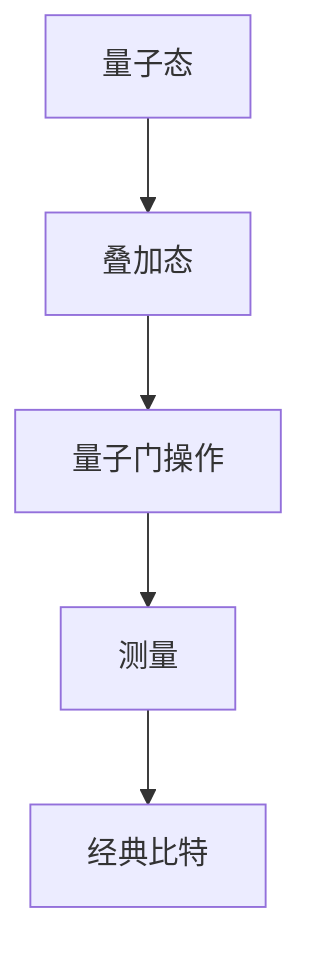

                 

# 《量子机器学习在密码学应用中的前景探索》

> **关键词：** 量子计算、量子机器学习、密码学、量子密码学、量子密钥分发、量子安全通信。

> **摘要：** 本文将深入探讨量子机器学习在密码学领域的应用前景。首先，我们将介绍量子计算与量子机器学习的基础知识，接着探讨量子密码学的原理及其在实际中的应用，最后分析量子机器学习与量子密码学的融合，并探讨这一前沿技术如何改变密码学的未来。

---

## 目录大纲

1. **量子计算与量子机器学习基础**
   1.1 量子计算的基本概念
   1.2 量子机器学习基础
2. **量子密码学原理与应用**
   3.1 量子密码学基础
   3.2 量子密钥分发
   3.3 量子密码学的实际应用
4. **量子机器学习在密码学中的实际应用**
   6.1 量子机器学习与量子密码学的融合
   6.2 量子机器学习在密码学中的项目实战
5. **附录：量子计算与量子机器学习资源**

---

## 第一部分：量子计算与量子机器学习基础

### 第1章：量子计算的基本概念

#### 1.1 量子力学基础

量子力学是描述微观世界物理现象的理论框架，其核心概念包括量子比特、量子态、叠加态和量子门等。

##### 1.1.1 量子比特与经典比特的对比

**量子比特**（qubit）是量子信息的基本单位，与经典比特（bit）不同。经典比特只能处于两种状态之一：0或1。而量子比特可以同时处于0和1的叠加态，这使其具有超强的计算能力。

$$
|\psi\rangle = a|0\rangle + b|1\rangle
$$

其中，$a$和$b$是复数系数，满足$|a|^2 + |b|^2 = 1$。

##### 1.1.2 量子态与叠加态

量子态描述了一个量子系统的状态。叠加态是指一个量子系统同时处于多个可能状态的组合。

##### 1.1.3 量子门与量子操作

量子门是量子计算的基本构建块，类似于经典计算机中的逻辑门。量子门对量子比特进行线性变换，可以实现量子态的旋转和变换。

Mermaid 流程图：

#### 1.2 量子计算模型

量子计算模型包括量子电路、量子计算与图灵机的比较以及量子算法的基本框架。

##### 1.2.1 量子电路

量子电路是量子比特和量子门组成的网络，用于执行量子计算任务。

##### 1.2.2 量子计算与图灵机的比较

量子计算机与图灵机在计算模型上有显著差异。图灵机是基于图灵图灵机的模型，而量子计算机是基于量子态叠加和量子门操作的模型。

##### 1.2.3 量子算法的基本框架

量子算法是基于量子计算模型设计的高效算法。常见的量子算法包括量子支持向量机、量子神经网络和量子遗传算法等。

### 第2章：量子机器学习基础

#### 2.1 量子机器学习概述

量子机器学习是结合量子计算和机器学习的一种新型计算模式。它利用量子计算的优势，提高机器学习的效率和性能。

##### 2.1.1 量子机器学习的定义

量子机器学习是一种利用量子计算的优势来提高机器学习算法效率和性能的计算模式。

##### 2.1.2 量子机器学习与传统机器学习的差异

与传统机器学习相比，量子机器学习具有并行计算、状态叠加和量子门操作等优势，能够处理更复杂的计算任务。

#### 2.2 量子算法在机器学习中的应用

量子算法在机器学习中的应用包括量子支持向量机、量子神经网络和量子遗传算法等。

##### 2.2.1 量子支持向量机

量子支持向量机是一种基于量子计算的分类算法，能够高效处理高维数据。

##### 2.2.2 量子神经网络

量子神经网络是一种基于量子计算的神经网络模型，能够实现高效的特征提取和分类。

##### 2.2.3 量子遗传算法

量子遗传算法是一种基于量子计算的遗传算法，能够高效优化复杂的搜索空间。

---

## 第二部分：量子密码学原理与应用

### 第3章：量子密码学基础

量子密码学是利用量子力学原理来实现安全通信的一种密码学分支。它利用量子纠缠和量子测量等特性，实现信息的加密和解密。

#### 3.1 量子密码学概述

##### 3.1.1 量子密码学的定义

量子密码学是一种利用量子力学原理来实现安全通信的密码学分支。

##### 3.1.2 量子密码学的基本原理

量子密码学的基本原理包括量子纠缠、量子隐形传态和量子密钥分发等。

##### 3.1.3 量子密码学与传统密码学的比较

量子密码学与传统密码学在安全性、实现难度和应用场景等方面存在显著差异。

### 第4章：量子密钥分发

量子密钥分发是量子密码学中最基本的应用之一，它利用量子纠缠和量子测量等特性，实现安全通信的关键技术。

#### 4.1 BB84协议

BB84协议是一种量子密钥分发协议，它利用量子纠缠和量子测量来实现安全的密钥分发。

##### 4.1.1 BB84协议的基本原理

BB84协议的基本原理是利用量子纠缠态来实现量子密钥的分发。

##### 4.1.2 BB84协议的安全性分析

BB84协议的安全性基于量子力学的不可克隆定理和测量干扰原理。

#### 4.2 E91协议

E91协议是一种基于量子纠缠态的量子密钥分发协议，它能够实现更高的密钥分发速率。

##### 4.2.1 E91协议的基本原理

E91协议的基本原理是利用量子纠缠态来实现量子密钥的分发。

##### 4.2.2 E91协议的安全性分析

E91协议的安全性同样基于量子力学的不可克隆定理和测量干扰原理。

### 第5章：量子密码学的实际应用

量子密码学在安全通信、网络安全和金融等领域具有广泛的应用前景。

#### 5.1 量子安全通信

量子安全通信是一种基于量子密码学的安全通信技术，它能够实现端到端的安全通信。

##### 5.1.1 量子密钥分发在网络通信中的应用

量子密钥分发可以应用于网络通信中的端到端加密，提高通信的安全性。

##### 5.1.2 量子密钥分发在其他通信系统中的应用

量子密钥分发还可以应用于卫星通信、光纤通信等不同通信系统。

#### 5.2 量子密码学的商业应用前景

量子密码学在金融、政府和企业安全等领域具有广阔的应用前景。

##### 5.2.1 量子密码学在金融领域的应用

量子密码学可以应用于金融交易、数据加密和网络安全等领域。

##### 5.2.2 量子密码学在政府和企业安全领域的应用

量子密码学可以应用于政府和企业的重要数据保护、网络防御和信息安全等领域。

---

## 第三部分：量子机器学习在密码学中的实际应用

### 第6章：量子机器学习与量子密码学的融合

量子机器学习与量子密码学的融合是当前密码学领域的一个重要研究方向。它将量子计算和量子机器学习的优势相结合，为密码学提供新的解决方案。

#### 6.1 量子机器学习在密码学中的应用

量子机器学习在密码学中的应用主要包括量子密码分析、量子密码生成和量子安全加密等。

##### 6.1.1 量子机器学习算法在密码分析中的应用

量子机器学习算法可以用于密码分析，提高密码破解的效率。

##### 6.1.2 量子机器学习算法在密码生成中的应用

量子机器学习算法可以用于生成更加复杂的密码，提高密码的安全性。

### 第7章：量子机器学习在密码学中的项目实战

#### 7.1 量子密钥分发系统的构建

量子密钥分发系统是量子密码学的一个重要应用。它利用量子计算和量子机器学习技术，实现安全可靠的密钥分发。

##### 7.1.1 开发环境搭建

搭建量子密钥分发系统需要使用量子计算编程工具和量子机器学习框架。

##### 7.1.2 量子密钥分发系统的实现与测试

实现量子密钥分发系统需要设计量子电路、实现量子算法和测试系统的性能。

#### 7.2 量子机器学习算法在密码学中的应用案例

量子机器学习算法在密码学中的应用案例包括量子支持向量机在密码破解中的应用和量子神经网络在密码生成中的应用。

##### 7.2.1 量子支持向量机在密码破解中的应用

量子支持向量机可以用于破解复杂的密码，提高破解效率。

##### 7.2.2 量子神经网络在密码生成中的应用

量子神经网络可以用于生成复杂的密码，提高密码的安全性。

---

## 附录：量子计算与量子机器学习资源

### 附录 A：量子计算与量子机器学习工具

量子计算与量子机器学习的发展离不开相应的工具和框架。以下是一些常用的量子计算编程工具和量子机器学习框架。

#### A.1 量子计算编程工具

- **Q#编程语言**：Q#是微软开发的量子计算编程语言，它提供了丰富的量子计算功能。
- **IBM Q Experience**：IBM Q Experience 是一个在线量子计算平台，提供量子计算资源和工具。
- **Google Quantum AI**：Google Quantum AI 是谷歌开发的量子计算工具包，提供量子计算和机器学习算法的实现。

#### A.2 量子机器学习框架

- **Quantum Machine Learning Framework**：Quantum Machine Learning Framework 是一个开源的量子机器学习框架，提供丰富的量子机器学习算法和工具。
- **OpenQASM for Machine Learning**：OpenQASM for Machine Learning 是一个基于量子汇编语言的机器学习框架，提供高效的量子机器学习算法实现。
- **TensorFlow Quantum**：TensorFlow Quantum 是谷歌开发的量子机器学习框架，与 TensorFlow 深度集成，提供强大的量子机器学习工具。

---

## 作者信息

作者：AI天才研究院/AI Genius Institute & 禅与计算机程序设计艺术 /Zen And The Art of Computer Programming

---

通过本文的探讨，我们看到了量子计算和量子机器学习在密码学领域的重要性和潜力。随着量子技术的不断发展，量子密码学和量子机器学习将有望推动密码学进入一个全新的时代。未来，我们将继续关注这一领域的研究进展，期待量子密码学和量子机器学习在密码学中的应用能够取得更加显著的成果。

