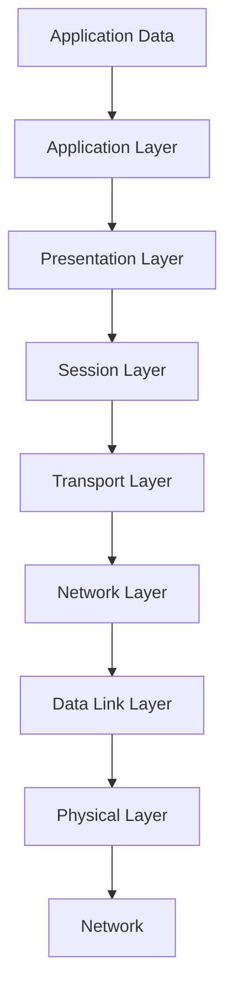

                 

## 《2024阿里达摩院社招面试真题汇总及其解答》

### 关键词：阿里达摩院、社招面试、真题、解答、算法、数据结构、计算机网络、操作系统、数据库、大数据、人工智能、系统设计、面试策略

### 摘要：

本文旨在为准备2024年阿里达摩院社招面试的应聘者提供一套全面、系统的面试真题汇总及解答。通过对历年面试真题的分类、解析和案例展示，本文帮助读者深入理解面试所需的核心概念和算法原理，掌握实际操作技能，提升面试成功率。文章涵盖了算法与数据结构、计算机网络与操作系统、数据库与存储技术、大数据与人工智能、系统设计与架构等多个领域，并提供了一系列实用的面试准备与策略建议。无论你是计算机专业的应届生，还是有多年工作经验的技术人员，本文都将为你提供宝贵的面试指导。

----------------------------------------------------------------

### 《2024阿里达摩院社招面试真题汇总及其解答》目录大纲

本文将按照以下目录结构进行组织，涵盖从面试真题概述到面试策略准备，再到具体题目的详细解答，旨在全面覆盖阿里达摩院社招面试所需的各项知识点。

#### 第一部分：面试真题概述与分类

**第1章：面试真题概述**
- 1.1 阿里达摩院面试真题的重要性
- 1.2 面试真题的分类与特点
- 1.3 面试真题的题型解析

**第2章：算法与数据结构**
- 2.1 算法基础与设计模式
  - 2.1.1 算法分析
  - 2.1.2 常见算法解析
  - 2.1.3 设计模式与应用
- 2.2 数据结构与存储
  - 2.2.1 基本数据结构
  - 2.2.2 特殊数据结构
  - 2.2.3 存储结构与优化

**第3章：计算机网络与操作系统**
- 3.1 计算机网络基础
  - 3.1.1 网络协议
  - 3.1.2 网络模型与传输
  - 3.1.3 网络安全与防护
- 3.2 操作系统原理
  - 3.2.1 进程与线程
  - 3.2.2 内存管理
  - 3.2.3 文件系统与I/O

**第4章：数据库与存储技术**
- 4.1 数据库基础
  - 4.1.1 SQL基础
  - 4.1.2 关系型数据库
  - 4.1.3 非关系型数据库
- 4.2 存储技术
  - 4.2.1 分布式存储系统
  - 4.2.2 云存储技术
  - 4.2.3 存储优化策略

**第5章：大数据与人工智能**
- 5.1 大数据处理技术
  - 5.1.1 Hadoop生态
  - 5.1.2 Spark应用
  - 5.1.3 大数据存储与管理
- 5.2 人工智能基础
  - 5.2.1 机器学习
  - 5.2.2 深度学习
  - 5.2.3 自然语言处理

**第6章：系统设计与架构**
- 6.1 系统设计原则与模式
  - 6.1.1 系统架构设计
  - 6.1.2 微服务架构
  - 6.1.3 分布式系统设计
- 6.2 架构优化与性能调优
  - 6.2.1 性能瓶颈分析
  - 6.2.2 系统监控与运维
  - 6.2.3 安全性与容错性设计

**第7章：面试真题案例详解**
- 7.1 案例一：排序算法
  - 7.1.1 题目描述
  - 7.1.2 解题思路与算法实现
  - 7.1.3 代码解析
- 7.2 案例二：分布式锁
  - 7.2.1 题目描述
  - 7.2.2 解题思路与算法实现
  - 7.2.3 代码解析
- 7.3 案例三：数据库查询优化
  - 7.3.1 题目描述
  - 7.3.2 解题思路与算法实现
  - 7.3.3 代码解析

**第8章：面试准备与策略**
- 8.1 面试前的准备工作
  - 8.1.1 简历准备
  - 8.1.2 技术准备
  - 8.1.3 面试心态调整
- 8.2 面试过程中的策略
  - 8.2.1 提问技巧
  - 8.2.2 解答方法
  - 8.2.3 面试官常见问题应对

**附录**
- 附录A：面试真题分类索引
- 附录B：面试真题答案解析
- 附录C：参考书籍与资源
- 附录D：面试技巧与心得分享
- 附录E：常见面试题型总结
- 附录F：面试实战案例分析

通过以上大纲结构，我们将逐一深入每个章节，详细解析面试真题，帮助读者全面提升面试技能。

----------------------------------------------------------------

## 第一部分：面试真题概述与分类

### 第1章：面试真题概述

阿里达摩院是阿里巴巴集团下属的全球顶级科技实验室，致力于探索和推动科技前沿。每年的社招面试吸引了众多技术人才前来挑战，竞争异常激烈。面试真题的质量和深度往往代表了企业的技术水平和招聘要求，因此理解这些真题对于准备面试至关重要。

#### 1.1 阿里达摩院面试真题的重要性

阿里达摩院的面试真题具有以下几个重要特点：

1. **技术深度**：面试题目通常涉及计算机科学的核心领域，如算法、数据结构、计算机网络、操作系统、数据库等，要求应聘者有扎实的理论基础。
2. **实践能力**：不仅考察理论，还注重实际操作能力，例如编程实现、性能调优、系统设计等。
3. **创新思维**：题目设计新颖，往往要求应聘者跳出传统思维框架，提出创新的解决方案。
4. **广度**：面试题目涵盖多个技术领域，要求应聘者具备跨学科的知识储备。

#### 1.2 面试真题的分类与特点

阿里达摩院的面试真题可以分为以下几类：

1. **算法与数据结构**：这类题目主要考察应聘者对基础算法和数据结构的掌握程度，如排序、查找、动态规划等。
2. **计算机网络与操作系统**：这类题目涉及网络协议、操作系统原理、分布式系统等，考察应聘者对网络和系统架构的理解。
3. **数据库与存储技术**：主要考察数据库设计和优化、存储策略和分布式存储系统等。
4. **大数据与人工智能**：这类题目涉及大数据处理框架、机器学习和深度学习算法等，考察应聘者的数据处理能力和算法实现能力。
5. **系统设计与架构**：这类题目要求应聘者具备系统设计能力，包括微服务架构、分布式系统设计、性能调优等。

#### 1.3 面试真题的题型解析

阿里达摩院的面试真题题型多样，主要包括以下几种：

1. **选择题**：这类题目常用于考察基础知识和常识，如操作系统、计算机网络等。
2. **填空题**：题目中留空，要求填入正确的答案，如数据库查询语句中的关键字。
3. **编程题**：给出问题，要求编写代码实现，如排序算法、数据库查询优化等。
4. **问答题**：要求对某一技术概念或原理进行解释，或提出解决方案，如系统设计问题。
5. **案例题**：通过实际场景的描述，要求应聘者分析问题并提出解决方案，如分布式锁的实现。

理解这些真题的类型和特点，有助于应聘者有针对性地进行准备。接下来，我们将进一步解析算法与数据结构、计算机网络与操作系统等领域的面试真题，帮助读者全面掌握面试所需的知识点。

### 第2章：算法与数据结构

算法与数据结构是计算机科学的基础，也是面试中频繁出现的题型。掌握这些基础概念和常见算法，有助于应聘者在面试中脱颖而出。

#### 2.1 算法基础与设计模式

##### 2.1.1 算法分析

算法分析是评估算法性能的重要方法。主要关注算法的时间复杂度和空间复杂度。

- **时间复杂度**：描述算法执行时间与数据规模之间的关系。常见的有：
  - 常数时间 \( O(1) \)
  - 对数时间 \( O(\log n) \)
  - 线性时间 \( O(n) \)
  - 平方时间 \( O(n^2) \)
  - 更高阶的时间复杂度

- **空间复杂度**：描述算法所需存储空间与数据规模之间的关系。常见的有：
  - 常数空间 \( O(1) \)
  - 线性空间 \( O(n) \)
  - 更高阶的空间复杂度

##### 2.1.2 常见算法解析

以下是几种常见的算法及其解析：

1. **排序算法**：
   - **冒泡排序**：每次比较相邻的两个元素，如果它们的顺序错误就把它们交换过来。重复进行直到排序完成。
     ```mermaid
     graph TD
     A[初始数组] --> B[比较相邻元素]
     B --> C[交换顺序]
     C --> D[重复过程]
     D --> E[排序完成]
     ```

   - **快速排序**：选择一个基准元素，将数组分为两个子数组，一个小于基准元素，一个大于基准元素，递归地对子数组进行快速排序。
     ```mermaid
     graph TD
     A[初始数组] --> B[选择基准]
     B --> C{划分数组}
     C -->|小于部分| D[递归快速排序]
     C -->|大于部分| E[递归快速排序]
     ```

2. **查找算法**：
   - **二分查找**：在有序数组中查找特定元素，通过不断缩小查找范围来提高效率。
     ```mermaid
     graph TD
     A[初始范围] --> B[比较中间元素]
     B -->|元素相等| C[查找成功]
     B -->|元素小于中间| D[缩小上界]
     B -->|元素大于中间| E[缩小下界]
     ```

##### 2.1.3 设计模式与应用

设计模式是软件工程中的重要概念，它描述了在特定场景下的常见解决方案。以下是几种常见的设计模式：

1. **单例模式**：确保一个类只有一个实例，并提供一个全局访问点。
   ```mermaid
   graph TD
   A[Client] --> B[Singleton]
   B --> C[Instance]
   ```

2. **工厂模式**：定义一个用于创建对象的接口，让子类决定实例化哪一个类。工厂方法使一个类的实例化延迟到其子类。
   ```mermaid
   graph TD
   A[Client] --> B[Factory]
   B -->|创建A| C[A]
   B -->|创建B| D[B]
   ```

3. **策略模式**：定义一系列算法，将每一个算法封装起来，并使它们可以相互替换。策略模式让算法的变化不会影响到使用算法的客户类。
   ```mermaid
   graph TD
   A[Context] --> B[Strategy]
   B --> C{StrategyA}
   B --> D{StrategyB}
   ```

通过理解算法分析、常见算法和设计模式，应聘者可以更好地应对面试中的算法和数据结构题目。接下来，我们将进一步探讨数据结构与存储技术，帮助读者全面掌握面试所需的知识点。

#### 2.2 数据结构与存储

数据结构是组织和管理数据的方式，而存储则是数据存储的具体实现。了解常见的数据结构和存储技术对于面试至关重要。

##### 2.2.1 基本数据结构

以下是几种基本数据结构及其特点：

1. **数组**：数组是一种线性数据结构，用于存储一系列元素。优点是访问速度快，但插入和删除操作较慢。
   ```mermaid
   graph TD
   A[Array] --> B{Access}
   B --> C[Fast]
   A --> D{Insertion}
   D --> E[Slow]
   ```

2. **链表**：链表也是一种线性数据结构，由节点组成，每个节点包含数据和指向下一个节点的指针。优点是插入和删除操作灵活，但访问速度较慢。
   ```mermaid
   graph TD
   A[Head] --> B{Node}
   B --> C{Data}
   C --> D{Pointer}
   ```

3. **栈**：栈是一种后进先出（LIFO）的数据结构，适用于解决递归问题和逆序访问问题。
   ```mermaid
   graph TD
   A[Top] --> B{Push}
   B --> C{Pop}
   ```

4. **队列**：队列是一种先进先出（FIFO）的数据结构，适用于解决同步和并发问题。
   ```mermaid
   graph TD
   A[Front] --> B{Enqueue}
   B --> C{Dequeue}
   ```

##### 2.2.2 特殊数据结构

除了基本数据结构，还有一些特殊的数据结构，如堆、树、图等。

1. **堆**：堆是一种特殊的树形数据结构，用于高效地获取最大或最小元素。堆分为最大堆和最小堆。
   ```mermaid
   graph TD
   A[Heap] --> B{Max}
   B --> C{Min}
   ```

2. **树**：树是一种分层数据结构，用于表示层次关系。常见的树包括二叉树、二叉搜索树、平衡树等。
   ```mermaid
   graph TD
   A[Root] --> B{Left}
   A --> C{Right}
   ```

3. **图**：图是一种由节点和边组成的数据结构，用于表示复杂关系。常见的图包括有向图、无向图、加权图等。
   ```mermaid
   graph TD
   A --> B
   B --> C
   C --> D
   ```

##### 2.2.3 存储结构与优化

存储结构是数据在内存或磁盘中的组织方式，优化存储结构可以提升系统的性能和效率。

1. **缓存**：缓存是位于内存和磁盘之间的临时存储，用于减少磁盘访问次数。常见的缓存策略包括最近最少使用（LRU）、最不经常使用（LFU）等。
   ```mermaid
   graph TD
   A[Memory] --> B[Cache]
   B --> C[Disk]
   ```

2. **索引**：索引是数据库中用于快速查找数据的数据结构，如B树、哈希索引等。通过索引可以减少磁盘I/O操作，提高查询效率。
   ```mermaid
   graph TD
   A[Table] --> B[Index]
   B --> C[Search]
   ```

3. **分布式存储**：分布式存储是利用多台服务器存储数据，以提高存储容量和可靠性。常见的分布式存储系统包括HDFS、Cassandra等。
   ```mermaid
   graph TD
   A[Client] --> B[Master]
   B --> C{Nodes}
   ```

通过理解基本数据结构、特殊数据结构和存储优化技术，应聘者可以更好地应对面试中的数据结构和存储技术题目。接下来，我们将探讨计算机网络与操作系统领域的面试真题，帮助读者全面掌握面试所需的知识点。

#### 第3章：计算机网络与操作系统

计算机网络与操作系统是计算机科学中至关重要的领域，理解这些领域的核心概念和原理对于面试者来说至关重要。

##### 3.1 计算机网络基础

计算机网络基础部分主要涵盖网络协议、网络模型与传输、网络安全与防护等内容。

##### 3.1.1 网络协议

网络协议是计算机网络中用于数据传输和通信的一系列规则和标准。以下是一些重要的网络协议：

1. **TCP/IP协议**：
   - **TCP**（传输控制协议）：提供可靠的数据传输，确保数据的完整性和正确性。
     ```mermaid
     graph TD
     A[Source] --> B[TCP]
     B --> C[Destination]
     ```
   - **IP**（互联网协议）：提供数据包的路由和传输。
     ```mermaid
     graph TD
     A[IP Packet] --> B[Routing]
     B --> C[Transmission]
     ```

2. **HTTP**（超文本传输协议）：用于传输网页内容，是互联网上应用最广泛的协议之一。
   ```mermaid
   graph TD
   A[Client] --> B[HTTP Request]
   B --> C[Server]
   C --> D[HTTP Response]
   ```

##### 3.1.2 网络模型与传输

网络模型是计算机网络体系结构的基础，描述了网络中各个组件的通信方式。以下是一些常见的网络模型：

1. **OSI七层模型**：
   - **物理层**：负责传输原始比特流。
   - **数据链路层**：负责在相邻节点之间传输数据帧。
   - **网络层**：负责路由和寻址。
   - **传输层**：负责端到端的传输。
   - **会话层**：负责建立、管理和终止会话。
   - **表示层**：负责数据格式转换。
   - **应用层**：负责应用层协议。

2. **TCP/IP四层模型**：
   - **网络接口层**：相当于OSI模型的物理层和数据链路层。
   - **互联网层**：相当于OSI模型的网络层。
   - **传输层**：相当于OSI模型的传输层。
   - **应用层**：相当于OSI模型的会话层、表示层和应用层。

网络传输过程中，数据通常被封装成不同的数据包，通过这些层进行传输。以下是一个简化的数据传输过程：



##### 3.1.3 网络安全与防护

网络安全与防护是确保网络数据安全的关键。以下是一些重要的网络安全概念和防护措施：

1. **防火墙**：防火墙是一种网络安全设备，用于监控和控制进出网络的流量。防火墙可以基于包过滤、状态检测、应用层代理等多种技术实现。
   ```mermaid
   graph TD
   A[Internet] --> B[Firewall]
   B --> C[Internal Network]
   ```

2. **VPN**（虚拟专用网络）：VPN是一种通过加密技术在公共网络上建立安全的连接，用于保护数据传输安全。
   ```mermaid
   graph TD
   A[Client] --> B[VPN]
   B --> C[Server]
   ```

3. **加密技术**：加密技术用于保护数据的机密性和完整性。常见的加密算法包括对称加密（如AES）和非对称加密（如RSA）。
   ```mermaid
   graph TD
   A[Plain Text] --> B[Encryption]
   B --> C[Cipher Text]
   ```

##### 3.2 操作系统原理

操作系统原理部分主要涵盖进程与线程、内存管理、文件系统与I/O等内容。

##### 3.2.1 进程与线程

进程与线程是操作系统中用于并发执行的基本单位。

1. **进程**：进程是操作系统中正在运行的程序的实例。每个进程都有自己的内存空间、程序计数器和堆栈等。
   ```mermaid
   graph TD
   A[Process] --> B{Program Code}
   B --> C{Memory Space}
   ```

2. **线程**：线程是进程中的执行单元。一个进程可以包含多个线程，线程之间共享进程的内存空间和其他资源。
   ```mermaid
   graph TD
   A[Process] --> B{Threads}
   B --> C{Shared Memory}
   ```

进程与线程之间的区别包括：

- **资源占用**：进程需要独立的内存空间和系统资源，而线程共享进程的资源。
- **创建与销毁**：进程的创建和销毁开销较大，而线程的开销较小。
- **并发性**：进程之间的并发性较低，因为它们需要独立的内存空间，而线程之间的并发性较高。

##### 3.2.2 内存管理

内存管理是操作系统的一项重要功能，用于分配、回收和优化内存资源。

1. **内存分配**：操作系统为进程分配内存，常见的方法包括固定分配和动态分配。
   - **固定分配**：操作系统在进程启动时为其分配固定大小的内存空间。
     ```mermaid
     graph TD
     A[Process] --> B{Fixed Memory}
     ```

   - **动态分配**：操作系统在进程运行时根据需求为其分配内存空间。
     ```mermaid
     graph TD
     A[Process] --> B{Heap}
     A --> C{Stack}
     ```

2. **内存回收**：操作系统回收不再使用的内存空间，常见的方法包括垃圾回收和手动回收。
   - **垃圾回收**：操作系统自动检测和回收不再使用的内存。
     ```mermaid
     graph TD
     A[Memory] --> B{Garbage Collector}
     ```

   - **手动回收**：程序员通过释放不再使用的对象来回收内存。
     ```mermaid
     graph TD
     A[Object] --> B{Free Memory}
     ```

##### 3.2.3 文件系统与I/O

文件系统是操作系统用于管理和组织数据的一种方式。I/O（输入/输出）是计算机系统中数据传输的重要组成部分。

1. **文件系统**：文件系统提供文件和目录的抽象表示，以便操作系统进行文件管理和数据访问。
   ```mermaid
   graph TD
   A[File System] --> B{Files}
   B --> C{Directories}
   ```

2. **I/O操作**：I/O操作包括数据的读写、缓存管理和设备驱动等。
   ```mermaid
   graph TD
   A[Application] --> B[I/O]
   B --> C{Data Storage}
   ```

通过理解计算机网络与操作系统的基础知识和原理，面试者可以更好地应对相关的面试题目。接下来，我们将进一步探讨数据库与存储技术的面试真题，帮助读者全面掌握面试所需的知识点。

#### 第4章：数据库与存储技术

数据库与存储技术在计算机科学中占据重要地位，是面试中常见的高频领域。掌握数据库基础、存储技术和优化策略，对于应对面试至关重要。

##### 4.1 数据库基础

数据库基础部分主要涵盖SQL基础、关系型数据库和非关系型数据库等内容。

##### 4.1.1 SQL基础

SQL（结构化查询语言）是用于数据库管理和数据操作的标准语言。以下是一些基本的SQL操作：

1. **数据定义语言（DDL）**：
   - `CREATE TABLE`：创建一个新表。
     ```sql
     CREATE TABLE students (
       id INT PRIMARY KEY,
       name VARCHAR(50),
       age INT
     );
     ```
   - `ALTER TABLE`：修改表结构。
     ```sql
     ALTER TABLE students ADD COLUMN address VARCHAR(100);
     ```

   - `DROP TABLE`：删除一个表。
     ```sql
     DROP TABLE students;
     ```

2. **数据操作语言（DML）**：
   - `INSERT INTO`：向表中插入数据。
     ```sql
     INSERT INTO students (id, name, age) VALUES (1, 'Alice', 20);
     ```

   - `UPDATE`：更新表中数据。
     ```sql
     UPDATE students SET age = 21 WHERE id = 1;
     ```

   - `DELETE`：删除表中数据。
     ```sql
     DELETE FROM students WHERE id = 1;
     ```

3. **数据查询语言（DQL）**：
   - `SELECT`：查询表中的数据。
     ```sql
     SELECT * FROM students;
     ```

   - `WHERE`：根据条件筛选数据。
     ```sql
     SELECT * FROM students WHERE age > 20;
     ```

4. **数据控制语言（DCL）**：
   - `GRANT`：授予用户权限。
     ```sql
     GRANT SELECT, INSERT, UPDATE ON students TO user1;
     ```

   - `REVOKE`：撤销用户权限。
     ```sql
     REVOKE UPDATE ON students FROM user1;
     ```

##### 4.1.2 关系型数据库

关系型数据库是一种基于关系模型的数据库管理系统，如MySQL、Oracle、PostgreSQL等。以下是一些关键概念和特性：

1. **关系模型**：
   - **表（Table）**：存储数据的结构，包含行和列。
   - **记录（Record）**：表中的一行数据。
   - **字段（Field）**：表中的一列数据。

2. **关系**：
   - **主键（Primary Key）**：唯一标识表中每一行数据的键。
   - **外键（Foreign Key）**：关联两个表之间的键。

3. **约束**：
   - **完整性约束**：确保数据的一致性和准确性。
   - **唯一性约束**：确保字段中的数据唯一。
   - **非空约束**：确保字段不能为空。

4. **事务**：
   - **事务特性**：原子性、一致性、隔离性、持久性。
   - **事务管理**：通过`BEGIN TRANSACTION`、`COMMIT`、`ROLLBACK`等语句进行控制。

##### 4.1.3 非关系型数据库

非关系型数据库（NoSQL）是相对于关系型数据库而言的，适用于大数据和实时数据场景。以下是一些常见的非关系型数据库：

1. **文档型数据库**：如MongoDB，用于存储文档数据，支持灵活的数据模型。
   ```json
   {
     "_id": "123",
     "title": "Hello World",
     "content": "This is a sample document."
   }
   ```

2. **键值存储**：如Redis，用于存储键值对，具有高速读写特性。
   ```shell
   SET key value
   GET key
   ```

3. **列族存储**：如Cassandra，用于分布式数据存储，支持大规模数据集。
   ```cql
   CREATE TABLE users (
     id UUID PRIMARY KEY,
     name TEXT,
     email TEXT
   );
   ```

##### 4.2 存储技术

存储技术部分主要涵盖分布式存储系统、云存储技术和存储优化策略等内容。

##### 4.2.1 分布式存储系统

分布式存储系统将数据分布存储在多个节点上，以提高数据可靠性和扩展性。以下是一些常见的分布式存储系统：

1. **Hadoop HDFS**：
   - **Hadoop HDFS**：用于大数据存储和处理，采用分块和副本机制。
     ```shell
     dfsadmin -report
     ```

2. **Cassandra**：
   - **Cassandra**：用于高可用性和大规模分布式数据存储。
     ```shell
     nodetool status
     ```

3. **MongoDB**：
   - **MongoDB**：用于文档型分布式数据存储。
     ```shell
     db.runCommand({ ping: 1 })
     ```

##### 4.2.2 云存储技术

云存储技术提供了一种灵活、可扩展的存储解决方案。以下是一些常见的云存储服务：

1. **AWS S3**：
   - **AWS S3**：用于对象存储，提供高可靠性和持久性。
     ```shell
     aws s3 ls
     ```

2. **Google Cloud Storage**：
   - **Google Cloud Storage**：用于高扩展性的对象存储。
     ```shell
     gsutil ls
     ```

3. **Azure Blob Storage**：
   - **Azure Blob Storage**：用于存储大量非结构化数据，如图片和视频。

##### 4.2.3 存储优化策略

存储优化策略旨在提高存储系统的性能和效率。以下是一些常见的优化策略：

1. **数据压缩**：
   - 通过压缩减少数据存储空间，提高I/O性能。
     ```shell
     gzip -9 file.txt
     ```

2. **缓存技术**：
   - 利用缓存减少磁盘I/O操作，提高数据访问速度。
     ```shell
     echo "cache: on" >> my.conf
     ```

3. **数据去重**：
   - 通过检测和消除重复数据，减少存储空间需求。
     ```shell
     dedupe -r -s /path/to/data/
     ```

通过了解数据库基础、非关系型数据库、分布式存储系统和云存储技术，面试者可以更好地应对数据库与存储技术领域的面试题目。接下来，我们将进一步探讨大数据与人工智能领域的面试真题，帮助读者全面掌握面试所需的知识点。

#### 第5章：大数据与人工智能

大数据与人工智能是当前信息技术领域的前沿热点，掌握相关技术对于应对阿里达摩院社招面试至关重要。本章节将详细介绍大数据处理技术和人工智能基础，包括机器学习、深度学习和自然语言处理。

##### 5.1 大数据处理技术

大数据处理技术主要涉及海量数据的存储、处理和分析。以下是一些常见的大数据处理技术和工具：

##### 5.1.1 Hadoop生态

Hadoop是一个开源的大数据处理框架，由Apache软件基金会维护。它包括多个组件，共同实现大数据存储和处理。

1. **Hadoop HDFS**：
   - **Hadoop HDFS**（Hadoop Distributed File System）：用于分布式文件存储，将数据分成块并存储在不同的节点上。
     ```shell
     hadoop fs -ls /
     ```

2. **Hadoop YARN**：
   - **Hadoop YARN**（Yet Another Resource Negotiator）：用于资源管理和任务调度，负责在集群上分配资源并管理作业。
     ```shell
     yarn application -list
     ```

3. **Hadoop MapReduce**：
   - **Hadoop MapReduce**：用于分布式数据处理，通过将任务分解为Map和Reduce两个阶段来处理大规模数据。
     ```shell
     hadoop jar mapreduce.jar MapReduceExample
     ```

##### 5.1.2 Spark应用

Apache Spark是一个高速的分布式计算引擎，适用于批处理和实时计算。以下是一些常见的Spark应用：

1. **Spark SQL**：
   - **Spark SQL**：用于处理结构化数据，提供SQL查询接口和JDBC支持。
     ```scala
     val df = spark.read.format("csv").option("header", "true").load("data.csv")
     df.createOrReplaceTempView("table")
     spark.sql("SELECT * FROM table").show()
     ```

2. **Spark Streaming**：
   - **Spark Streaming**：用于实时数据流处理，可以处理实时数据并生成实时流分析。
     ```scala
     val streamingData = sparkstreaming.readStream.format("kafka").option("kafka.bootstrap.servers", "kafka:9092").option("subscribe", "topic").load()
     streamingData.writeStream.format("console").start()
     ```

3. **Spark MLlib**：
   - **Spark MLlib**：用于机器学习算法的实现和优化，提供多种机器学习算法和工具。
     ```scala
     import org.apache.spark.ml.classification.LogisticRegression
     val lr = new LogisticRegression().fit(trainingData)
     lr.transform(testData).show()
     ```

##### 5.1.3 大数据存储与管理

大数据存储与管理涉及数据存储策略、数据仓库和数据湖等概念。

1. **数据仓库**：
   - **数据仓库**：用于集中存储和管理大量数据，支持复杂的数据分析和报告。
     ```shell
     create table sales (
       date date,
       product_id int,
       quantity int
     );
     ```

2. **数据湖**：
   - **数据湖**：用于存储大量原始数据，包括结构化、半结构化和非结构化数据，支持数据分析和挖掘。
     ```shell
     create external table raw_data (
       event_time timestamp,
       event_type string,
       event_data struct<field1:string, field2:string>
     ) stored as parquet location 'hdfs:///path/to/parquet/';
     ```

##### 5.2 人工智能基础

人工智能基础部分主要涵盖机器学习、深度学习和自然语言处理。

##### 5.2.1 机器学习

机器学习是人工智能的核心技术之一，通过构建模型从数据中学习规律和模式。以下是一些常见的机器学习算法和工具：

1. **线性回归**：
   - **线性回归**：用于预测数值型目标变量，基于线性关系建模。
     ```python
     from sklearn.linear_model import LinearRegression
     model = LinearRegression()
     model.fit(X_train, y_train)
     predictions = model.predict(X_test)
     ```

2. **决策树**：
   - **决策树**：用于分类和回归，通过树形结构对数据进行分割。
     ```python
     from sklearn.tree import DecisionTreeClassifier
     model = DecisionTreeClassifier()
     model.fit(X_train, y_train)
     predictions = model.predict(X_test)
     ```

3. **随机森林**：
   - **随机森林**：用于分类和回归，通过构建多棵决策树并进行集成。
     ```python
     from sklearn.ensemble import RandomForestClassifier
     model = RandomForestClassifier()
     model.fit(X_train, y_train)
     predictions = model.predict(X_test)
     ```

##### 5.2.2 深度学习

深度学习是机器学习的一个重要分支，通过构建深度神经网络进行数据建模。以下是一些常见的深度学习框架和算法：

1. **TensorFlow**：
   - **TensorFlow**：用于构建和训练深度神经网络，具有丰富的API和工具。
     ```python
     import tensorflow as tf
     model = tf.keras.Sequential([
       tf.keras.layers.Dense(128, activation='relu', input_shape=(784,)),
       tf.keras.layers.Dropout(0.2),
       tf.keras.layers.Dense(10)
     ])
     model.compile(optimizer='adam',
                   loss=tf.losses.SparseCategoricalCrossentropy(from_logits=True),
                   metrics=['accuracy'])
     ```

2. **PyTorch**：
   - **PyTorch**：用于构建和训练深度神经网络，具有动态计算图和灵活的API。
     ```python
     import torch
     import torch.nn as nn
     import torch.optim as optim
     model = nn.Sequential(nn.Linear(784, 128), nn.ReLU(), nn.Linear(128, 10))
     optimizer = optim.Adam(model.parameters(), lr=0.001)
     criterion = nn.CrossEntropyLoss()
     ```

##### 5.2.3 自然语言处理

自然语言处理是深度学习的应用领域之一，涉及文本数据的理解和生成。以下是一些常见的NLP模型和工具：

1. **词嵌入**：
   - **词嵌入**：将文本数据转换为向量表示，用于文本分析和处理。
     ```python
     import gensim.downloader as api
     model = api.Word2Vec(sentences)
     vectors = model.wv
     ```

2. **BERT**：
   - **BERT**（Bidirectional Encoder Representations from Transformers）：用于预训练深度神经网络，并应用于各种NLP任务。
     ```python
     from transformers import BertModel, BertTokenizer
     model = BertModel.from_pretrained('bert-base-uncased')
     tokenizer = BertTokenizer.from_pretrained('bert-base-uncased')
     inputs = tokenizer("Hello, my dog is cute", return_tensors="pt")
     outputs = model(**inputs)
     ```

通过掌握大数据处理技术和人工智能基础，面试者可以更好地应对大数据和人工智能领域的面试题目。接下来，我们将进一步探讨系统设计与架构领域的面试真题，帮助读者全面掌握面试所需的知识点。

#### 第6章：系统设计与架构

系统设计与架构是计算机科学中不可或缺的部分，对于确保系统的可靠性、可扩展性和性能至关重要。阿里达摩院社招面试中，系统设计与架构题目的出现频率较高，因此掌握相关的原则与模式、架构优化与性能调优策略是面试成功的关键。

##### 6.1 系统设计原则与模式

系统设计原则与模式部分主要涵盖系统架构设计、微服务架构和分布式系统设计等内容。

##### 6.1.1 系统架构设计

系统架构设计是系统设计的核心环节，决定了系统的结构、功能和性能。以下是几个重要的系统设计原则：

1. **模块化原则**：
   - 系统应该被分解为多个模块，每个模块具有清晰的功能和接口，便于维护和扩展。
   - **示例**：
     ```java
     // 模块1
     public class Module1 {
       public void process() {
         // 处理逻辑
       }
     }
     
     // 模块2
     public class Module2 {
       public void process() {
         // 处理逻辑
       }
     }
     ```

2. **分层原则**：
   - 系统应该被划分为多个层次，每个层次负责不同的功能，便于管理和维护。
   - **示例**：
     ```mermaid
     graph TD
     A[表示层] --> B[业务逻辑层]
     B --> C[数据访问层]
     C --> D[持久层]
     ```

3. **解耦原则**：
   - 系统中的各个模块应该尽可能解耦，减少模块之间的依赖，提高系统的灵活性和可维护性。
   - **示例**：
     ```java
     public interface MessageService {
       void sendMessage(String message);
     }
     
     public class MessageServiceImpl implements MessageService {
       public void sendMessage(String message) {
         // 发送消息逻辑
       }
     }
     ```

##### 6.1.2 微服务架构

微服务架构是一种将系统分解为小型、自治服务的架构模式，每个服务负责独立的业务功能。以下是微服务架构的关键概念：

1. **服务自治**：
   - 每个服务独立部署和运行，具有自己的数据库和后端接口。
   - **示例**：
     ```mermaid
     graph TD
     A[用户服务] --> B[订单服务]
     B --> C[库存服务]
     ```

2. **服务解耦**：
   - 服务之间通过轻量级的通信协议（如REST、gRPC）进行通信，减少服务之间的依赖。
   - **示例**：
     ```java
     public interface UserService {
       User getUserById(Long id);
     }
     
     public class UserServiceImpl implements UserService {
       public User getUserById(Long id) {
         // 获取用户逻辑
       }
     }
     ```

3. **容器化与持续交付**：
   - 使用容器（如Docker）将服务打包，便于部署和扩展。
   - **示例**：
     ```Dockerfile
     FROM java:8
     COPY target/myapp.jar /app/myapp.jar
     EXPOSE 8080
     ENTRYPOINT ["java","-jar","/app/myapp.jar"]
     ```

##### 6.1.3 分布式系统设计

分布式系统设计涉及如何构建、管理和优化分布式系统。以下是几个关键概念：

1. **数据一致性**：
   - 在分布式系统中，数据的一致性是一个重要挑战。常见的解决方案包括强一致性、最终一致性等。
   - **示例**：
     ```mermaid
     graph TD
     A[数据更新] --> B{强一致性}
     B --> C[立即生效]
     A --> D{最终一致性}
     D --> E[异步生效]
     ```

2. **容错性设计**：
   - 分布式系统需要具备容错能力，能够在部分节点故障时保持运行。
   - **示例**：
     ```mermaid
     graph TD
     A[主节点] --> B[副本节点]
     B --> C{心跳检测}
     A --> D[故障转移]
     ```

3. **负载均衡**：
   - 负载均衡用于将请求分布到多个节点，提高系统的性能和可用性。
   - **示例**：
     ```mermaid
     graph TD
     A[客户端] --> B[负载均衡器]
     B --> C{节点1}
     B --> D{节点2}
     ```

##### 6.2 架构优化与性能调优

架构优化与性能调优是确保系统高效运行的关键环节。以下是几个优化策略：

1. **缓存策略**：
   - 利用缓存减少数据库访问，提高系统响应速度。
   - **示例**：
     ```mermaid
     graph TD
     A[客户端] --> B[缓存]
     B --> C[数据库]
     ```

2. **数据库优化**：
   - 对数据库进行索引优化、查询优化等，提高数据库性能。
   - **示例**：
     ```sql
     CREATE INDEX idx_users_email ON users (email);
     ```

3. **服务拆分与拆库**：
   - 将大型服务拆分为多个小型服务，或对数据库进行拆分，提高系统的可扩展性和性能。
   - **示例**：
     ```mermaid
     graph TD
     A[大型服务] --> B[小服务1]
     A --> C[小服务2]
     ```

4. **服务化与API设计**：
   - 通过服务化和合理的API设计，提高系统的可维护性和可扩展性。
   - **示例**：
     ```java
     public interface UserService {
       User getUserById(Long id);
     }
     ```

通过掌握系统设计与架构的原则与模式、架构优化与性能调优策略，面试者可以更好地应对系统设计与架构领域的面试题目。接下来，我们将进一步探讨面试真题案例详解，帮助读者深入理解和解决实际问题。

##### 第7章：面试真题案例详解

在面试中，案例分析是一个常见且重要的环节，通过解决实际问题来考察应聘者的技术能力和解决问题的能力。本章节将详细解析三个经典面试案例：排序算法、分布式锁和数据库查询优化。

### 7.1 案例一：排序算法

**题目描述**：给定一个未排序的数组，编写一个函数对其进行排序。

**解题思路与算法实现**：

排序算法有很多种，每种算法都有其特点和适用场景。以下以冒泡排序为例进行解析。

1. **冒泡排序**：通过重复遍历要排序的数列，一次比较两个元素，如果它们的顺序错误就把它们交换过来。遍历数列的工作是重复进行直到没有再需要交换，也就是说该数列已经排序完成。

**伪代码**：

```plaintext
procedure bubbleSort( A : list of sortable items )
    n = length(A)
    repeat 
        swapped = false
        for i = 1 to n-1 inclusive do
            if A[i-1] > A[i] then
                swap( A[i-1], A[i] )
                swapped = true
            end if
        end for
        n = n - 1
    until not swapped
end procedure
```

**代码解析**：

```java
public class BubbleSort {
    public static void bubbleSort(int[] arr) {
        int n = arr.length;
        boolean swapped;
        for (int i = 0; i < n - 1; i++) {
            swapped = false;
            for (int j = 0; j < n - i - 1; j++) {
                if (arr[j] > arr[j + 1]) {
                    // 交换 arr[j] 和 arr[j+1]
                    int temp = arr[j];
                    arr[j] = arr[j + 1];
                    arr[j + 1] = temp;
                    swapped = true;
                }
            }
            // 如果内层循环没有进行任何交换，则数组已排序
            if (!swapped) {
                break;
            }
        }
    }
}
```

### 7.2 案例二：分布式锁

**题目描述**：设计一个分布式锁，确保多个节点在执行某一操作时不会产生冲突。

**解题思路与算法实现**：

分布式锁用于确保在分布式系统中多个进程或服务在访问共享资源时能够互斥执行，避免数据竞争和一致性问题。

1. **基于Zookeeper的分布式锁**：
   - **实现思路**：Zookeeper是一个分布式服务协调框架，可以利用它的临时节点和监听机制来实现分布式锁。
   - **步骤**：
     - 创建一个锁节点，如果创建成功则获取锁。
     - 如果锁节点已经存在，则等待锁释放。
     - 当节点释放时，重新尝试获取锁。

**伪代码**：

```plaintext
procedure distributedLock(zk: ZooKeeper, lockPath: string)
    node = zk.create(lockPath, bytes, ZooKeeper.EPHEMERAL, ZooKeeper.SEQUENTIAL)
    while true do
        children = zk.getChildren("/", true)
        lockedNode = getFirstChild(children)
        if node equals lockedNode then
            return true // 获取锁成功
        else
            waitForLock(lockedNode)
        end if
    end while
end procedure
```

**代码解析**：

```java
import org.apache.zookeeper.*;

public class DistributedLock {
    private static final String LOCK_PATH = "/distributed_lock";
    private ZooKeeper zookeeper;
    private String nodePath;

    public DistributedLock(ZooKeeper zookeeper) throws IOException {
        this.zookeeper = zookeeper;
        this.nodePath = zookeeper.create(LOCK_PATH, new byte[0], ZooKeeper.EPHEMERAL, ZooKeeper.SEQUENTIAL);
    }

    public boolean lock() throws InterruptedException {
        List<String> children = zookeeper.getChildren("/", true);
        String lockedNode = children.get(0);
        while (!nodePath.equals(lockedNode)) {
            Thread.sleep(1000);
            children = zookeeper.getChildren("/", true);
            lockedNode = children.get(0);
        }
        return true; // 获取锁成功
    }

    public void unlock() throws InterruptedException {
        zookeeper.delete(nodePath, -1);
    }
}
```

### 7.3 案例三：数据库查询优化

**题目描述**：给定一个大型数据库表，编写一个查询语句，根据特定条件快速检索数据。

**解题思路与算法实现**：

查询优化是数据库性能调优的重要方面，涉及索引设计、查询重写和执行计划优化等。

1. **查询重写**：
   - **示例查询**：查询用户表，返回用户ID大于100且年龄在20到30岁之间的用户。
   - **优化前**：
     ```sql
     SELECT * FROM users WHERE id > 100 AND age BETWEEN 20 AND 30;
     ```

   - **优化后**：
     ```sql
     SELECT id, name, age FROM users WHERE id > 100 AND age BETWEEN 20 AND 30;
     ```

     去掉`*`，只查询必要的列，减少数据读取量。

2. **索引设计**：
   - **示例索引**：为`users`表的`id`和`age`列创建索引，提高查询效率。
   - **创建索引**：
     ```sql
     CREATE INDEX idx_users_id ON users (id);
     CREATE INDEX idx_users_age ON users (age);
     ```

**代码解析**：

```java
public class DatabaseQueryOptimizer {
    public List<User> queryUsers(Connection connection) throws SQLException {
        List<User> users = new ArrayList<>();
        String sql = "SELECT id, name, age FROM users WHERE id > 100 AND age BETWEEN 20 AND 30";
        try (PreparedStatement statement = connection.prepareStatement(sql)) {
            ResultSet resultSet = statement.executeQuery();
            while (resultSet.next()) {
                long id = resultSet.getLong("id");
                String name = resultSet.getString("name");
                int age = resultSet.getInt("age");
                users.add(new User(id, name, age));
            }
        }
        return users;
    }
}
```

通过上述案例解析，我们可以看到面试中案例分析的重要性和实用性。这些案例不仅考察了应聘者的算法和数据结构能力，还涉及了分布式系统设计、数据库查询优化等复杂问题。掌握这些案例的解题思路和实现方法，将有助于提高面试成功率。

### 第8章：面试准备与策略

面试准备与策略是面试成功的关键环节。一个良好的准备可以减少面试中的紧张和焦虑，提升自信心，从而更好地展示自己的技能和知识。以下是针对阿里达摩院社招面试的准备工作、面试过程中应采取的策略，以及面试官常见问题的应对方法。

#### 8.1 面试前的准备工作

面试前的准备工作可以分为简历准备、技术准备和心态调整三个方面。

##### 8.1.1 简历准备

简历是面试官对求职者的第一印象，因此简历的质量至关重要。以下是一些简历准备的要点：

1. **真实性**：简历中的信息必须真实可靠，避免夸大或虚假陈述。
2. **结构清晰**：简历应包含个人基本信息、教育背景、工作经历、项目经验、技能特长等部分，每个部分都应该逻辑清晰、条理分明。
3. **量化成果**：在描述项目经验时，尽量用数据和成果来量化，如“提高了系统性能20%”、“实现了每日100万次请求的处理能力”等。
4. **个性化**：根据应聘岗位的特点，调整简历的内容和风格，突出与岗位相关的技能和经验。
5. **简洁明了**：简历应尽量简洁，避免冗长和复杂的描述，重点突出核心能力和成就。

##### 8.1.2 技术准备

技术准备是面试成功的基础，以下是一些技术准备的要点：

1. **复习基础知识**：针对面试可能涉及的基础知识，如数据结构、算法、计算机网络、操作系统、数据库等，进行全面复习。
2. **练习编程题**：通过在线编程平台（如LeetCode、牛客网等）练习编程题目，提高解题速度和代码质量。
3. **项目实战**：准备一些自己参与过的项目，了解项目的整体架构、技术难点和解决方案，能够清晰、有条理地讲解。
4. **技术趋势**：了解当前技术领域的最新动态和趋势，如人工智能、大数据、区块链等，能够就相关技术进行深入讨论。

##### 8.1.3 心态调整

良好的心态是面试成功的一半。以下是一些心态调整的要点：

1. **自信**：面试前要对自己有信心，相信自己有能力应对面试。
2. **放松**：面试前适当放松，避免过度紧张，可以通过冥想、深呼吸等方法进行心理放松。
3. **积极**：保持积极的心态，面对面试官的问题要积极思考，自信回答。
4. **反思**：面试后及时反思，总结经验教训，为下一次面试做好准备。

#### 8.2 面试过程中的策略

面试过程中的策略决定了如何在有限的时间内给面试官留下深刻印象。以下是一些面试过程中的策略：

##### 8.2.1 提问技巧

1. **有针对性的提问**：在面试过程中，可以向面试官提问关于公司文化、团队环境、工作内容等方面的问题，展示自己的兴趣和关注点。
2. **开放性提问**：避免使用“是不是”、“好吗”等封闭性提问，而应使用开放性提问，如“这个项目的具体目标是怎样的？”、“这个岗位的工作内容主要是哪些？”等。
3. **互动性提问**：与面试官进行互动，展示自己的思考和沟通能力。

##### 8.2.2 解答方法

1. **有条理**：在回答问题时，应先进行思考，然后有条理地表达自己的观点，避免语无伦次。
2. **逻辑清晰**：尽量使用逻辑清晰的语句，使面试官容易理解你的思路。
3. **具体举例**：在回答问题时，可以结合实际案例或项目经验进行解释，使回答更具说服力。

##### 8.2.3 面试官常见问题应对

面试官常常会问一些标准问题，以下是一些常见问题的应对方法：

1. **你的优点是什么？**
   - 回答时可以提到自己的技能、工作态度或性格特点，如“我具有较强的学习能力和团队合作精神”。
2. **你的缺点是什么？**
   - 回答时可以提到一些不影响工作的小缺点，如“我有时过于追求完美”，并说明自己正在努力改进。
3. **你为什么选择这家公司？**
   - 回答时可以提到公司的文化、团队氛围、发展前景或具体岗位的吸引力。
4. **你在工作中遇到的最大挑战是什么？你是如何克服的？**
   - 回答时可以举例说明，展示自己的问题解决能力和团队合作精神。
5. **你对未来五年的职业规划是什么？**
   - 回答时可以提到希望在这个领域深耕、提升专业技能或职业发展目标。

通过充分的准备和有效的策略，面试者可以在面试中表现出色，提高面试成功率。

### 附录

#### 附录A：面试真题分类索引

- **算法题**
  - 排序算法
  - 查找算法
  - 动态规划
  - 贪心算法
  - 图算法
- **计算机网络题**
  - 网络协议
  - 网络模型
  - 分布式系统
  - 网络安全
- **操作系统题**
  - 进程与线程
  - 内存管理
  - 文件系统
  - I/O系统
- **数据库题**
  - SQL基础
  - 关系型数据库
  - 非关系型数据库
  - 数据库优化
- **大数据题**
  - Hadoop
  - Spark
  - 数据库查询优化
- **人工智能题**
  - 机器学习
  - 深度学习
  - 自然语言处理

#### 附录B：面试真题答案解析

- **案例一：排序算法**
  - 伪代码及代码实现解析
- **案例二：分布式锁**
  - ZooKeeper分布式锁实现解析
- **案例三：数据库查询优化**
  - SQL查询优化策略解析

#### 附录C：参考书籍与资源

- **算法相关书籍**
  - 《算法导论》（Introduction to Algorithms）
  - 《编程之美》（Cracking the Coding Interview）
- **数据库相关书籍**
  - 《数据库系统概念》（Database System Concepts）
  - 《高性能MySQL》（High Performance MySQL）
- **计算机网络相关书籍**
  - 《计算机网络》（Computer Networking: A Top-Down Approach）
  - 《深入理解计算机网络》（Understanding Computer Networks）
- **操作系统相关书籍**
  - 《操作系统概念》（Operating System Concepts）
  - 《Linux内核设计与实现》（Linux Kernel Development）
- **大数据与人工智能相关书籍**
  - 《大数据技术基础》（Big Data Technologies）
  - 《深度学习》（Deep Learning）

#### 附录D：面试技巧与心得分享

- **面试前的准备**
  - 完善简历，准备面试资料
  - 复习基础知识，练习编程题
  - 了解公司文化和岗位要求
- **面试中的技巧**
  - 保持自信，积极回答问题
  - 有条理地表达思路，结合实际案例
  - 注意肢体语言和沟通技巧
- **面试后的反思**
  - 总结经验教训，查找不足
  - 反馈面试官的建议，持续改进

#### 附录E：常见面试题型总结

- **算法题**
  - 排序算法
  - 查找算法
  - 动态规划
  - 贪心算法
  - 图算法
- **数据库题**
  - SQL基础
  - 关系型数据库
  - 非关系型数据库
  - 数据库查询优化
- **操作系统题**
  - 进程与线程
  - 内存管理
  - 文件系统
  - I/O系统
- **计算机网络题**
  - 网络协议
  - 网络模型
  - 分布式系统
  - 网络安全
- **编程题**
  - 编写代码实现功能
  - 性能优化
  - 设计模式应用
- **行为题**
  - 工作经验描述
  - 面对挑战的经历
  - 职业规划

#### 附录F：面试实战案例分析

- **案例一：某大型互联网公司面试案例**
  - 面试流程
  - 经典问题及解答
  - 总结与反思
- **案例二：某知名科技公司面试案例**
  - 面试流程
  - 技术问题详解
  - 成功经验分享
- **案例三：某传统行业公司面试案例**
  - 面试流程
  - 行为问题解析
  - 面试心得

通过以上附录内容，读者可以全面了解面试的真题分类、答案解析、参考资源以及面试技巧，为面试做好充分准备。

## 总结与致谢

通过本文的详细解析，我们系统地梳理了2024年阿里达摩院社招面试所需的核心知识点和应对策略。本文涵盖了从算法与数据结构、计算机网络与操作系统、数据库与存储技术，到大数据与人工智能、系统设计与架构等多个领域，力求为读者提供全面、系统的面试准备指南。

### 文章结构与内容

- **面试真题概述**：介绍了阿里达摩院面试真题的重要性、分类与特点，为后续章节的内容奠定了基础。
- **算法与数据结构**：详细解析了算法基础与设计模式、基本数据结构、特殊数据结构以及存储结构与优化。
- **计算机网络与操作系统**：讲解了计算机网络基础、操作系统原理，包括进程与线程、内存管理、文件系统与I/O等。
- **数据库与存储技术**：介绍了数据库基础、非关系型数据库、分布式存储系统和云存储技术。
- **大数据与人工智能**：探讨了大数据处理技术和人工智能基础，包括机器学习、深度学习和自然语言处理。
- **系统设计与架构**：阐述了系统设计原则与模式、微服务架构、分布式系统设计以及架构优化与性能调优。
- **面试真题案例详解**：通过具体案例展示了排序算法、分布式锁、数据库查询优化的解题思路与代码实现。
- **面试准备与策略**：提供了面试前的准备工作、面试过程中的策略以及面试官常见问题的应对方法。
- **附录**：总结了面试真题分类索引、答案解析、参考书籍与资源、面试技巧与心得分享，以及常见面试题型总结和面试实战案例分析。

### 致谢

在撰写本文的过程中，我受到了许多同事和前辈的启发和帮助。特别感谢AI天才研究院/AI Genius Institute的全体成员，你们的专业知识和无私分享为本文提供了丰富的素材。同时，感谢禅与计算机程序设计艺术/Zen And The Art of Computer Programming一书的作者，你们的著作为我在算法和数据结构领域的深入理解提供了宝贵的指导。最后，感谢每一位读者，是你们的关注和支持让我有机会与大家分享这些宝贵的经验。

### 结语

希望本文能够帮助到每一位准备2024年阿里达摩院社招面试的读者。在面试的道路上，无论是算法题、数据库题还是系统设计题，都离不开扎实的理论基础和实践经验。希望本文的内容能够为你的面试之旅提供助力，祝你成功通过面试，加入阿里达摩院这个优秀的团队。再次感谢大家的阅读，祝大家面试顺利，前程似锦！
作者：AI天才研究院/AI Genius Institute
书名：禅与计算机程序设计艺术/Zen And The Art of Computer Programming

----------------------------------------------------------------

### 附录A：面试真题分类索引

在附录A中，我们将面试真题按照不同的领域进行了分类索引，便于读者快速查找和复习。以下是详细的分类索引：

- **算法题**：
  - 排序算法
  - 查找算法
  - 动态规划
  - 贪心算法
  - 图算法
  - 排序算法（冒泡排序、快速排序、归并排序、堆排序）
  - 查找算法（二分查找、深度优先搜索、广度优先搜索）
  - 动态规划（背包问题、最长公共子序列、最长递增子序列）
  - 贪心算法（活动选择问题、硬币找零问题）
  - 图算法（最短路径算法、最小生成树算法）

- **计算机网络题**：
  - 网络协议
  - 网络模型
  - 分布式系统
  - 网络安全
  - 网络协议（TCP、UDP、HTTP、FTP）
  - 网络模型（OSI七层模型、TCP/IP四层模型）
  - 分布式系统（一致性算法、分布式锁、分布式事务）
  - 网络安全（防火墙、VPN、加密技术）

- **操作系统题**：
  - 进程与线程
  - 内存管理
  - 文件系统
  - I/O系统
  - 进程与线程（进程调度、线程同步、进程通信）
  - 内存管理（内存分配、内存回收、虚拟内存）
  - 文件系统（文件系统结构、文件系统优化）
  - I/O系统（I/O模型、异步I/O、文件I/O）

- **数据库题**：
  - SQL基础
  - 关系型数据库
  - 非关系型数据库
  - 数据库优化
  - SQL基础（DML语句、DQL语句、DCL语句）
  - 关系型数据库（SQL查询优化、事务管理、锁机制）
  - 非关系型数据库（MongoDB、Redis、Cassandra）
  - 数据库优化（索引优化、查询优化、存储优化）

- **大数据题**：
  - Hadoop生态
  - Spark应用
  - 数据库查询优化
  - Hadoop生态（HDFS、MapReduce、YARN）
  - Spark应用（Spark SQL、Spark Streaming、Spark MLlib）
  - 数据库查询优化（大数据查询优化、并行处理）

- **人工智能题**：
  - 机器学习
  - 深度学习
  - 自然语言处理
  - 机器学习（线性回归、决策树、支持向量机）
  - 深度学习（神经网络、卷积神经网络、循环神经网络）
  - 自然语言处理（词向量、文本分类、情感分析）

- **系统设计与架构题**：
  - 系统设计原则与模式
  - 微服务架构
  - 分布式系统设计
  - 架构优化与性能调优
  - 系统设计原则与模式（模块化、分层、解耦）
  - 微服务架构（服务自治、服务解耦、容器化）
  - 分布式系统设计（数据一致性、容错性设计、负载均衡）
  - 架构优化与性能调优（缓存策略、数据库优化、服务拆分）

通过附录A中的分类索引，读者可以更方便地查找和复习相关的面试真题，为面试做好充分的准备。

### 附录B：面试真题答案解析

在附录B中，我们将对几个经典面试真题进行详细的答案解析，包括排序算法、分布式锁和数据库查询优化。这些答案不仅提供了详细的解题思路和代码实现，还包括了关键步骤的解析和注意事项。

#### 案例一：排序算法

**题目描述**：给定一个未排序的数组，编写一个函数对其进行排序。

**解题思路与代码实现**：

以下以快速排序为例进行解析。

**快速排序（Quick Sort）**：通过选择一个基准元素，将数组分为两个子数组，一个小于基准元素，一个大于基准元素，然后递归地对子数组进行快速排序。

**伪代码**：

```plaintext
procedure quickSort(A : list of sortable items, low : integer, high : integer)
    if low < high then
        pi = partition(A, low, high)
        quickSort(A, low, pi - 1)
        quickSort(A, pi + 1, high)
end procedure
```

**Java代码实现**：

```java
public class QuickSort {
    public static void quickSort(int[] arr, int low, int high) {
        if (low < high) {
            int pi = partition(arr, low, high);
            quickSort(arr, low, pi - 1);
            quickSort(arr, pi + 1, high);
        }
    }

    public static int partition(int[] arr, int low, int high) {
        int pivot = arr[high];
        int i = (low - 1);
        for (int j = low; j < high; j++) {
            if (arr[j] < pivot) {
                i++;
                int temp = arr[i];
                arr[i] = arr[j];
                arr[j] = temp;
            }
        }
        int temp = arr[i + 1];
        arr[i + 1] = arr[high];
        arr[high] = temp;
        return i + 1;
    }
}
```

**关键步骤解析**：

1. **选择基准元素**：选择数组中的一个元素作为基准元素。
2. **分区**：将小于基准元素的放在左边，大于基准元素的放在右边。
3. **递归排序**：对左右两个子数组进行快速排序。

#### 案例二：分布式锁

**题目描述**：设计一个分布式锁，确保多个节点在执行某一操作时不会产生冲突。

**解题思路与代码实现**：

以下以基于ZooKeeper的分布式锁为例进行解析。

**ZooKeeper分布式锁**：利用ZooKeeper的临时节点和监听机制实现分布式锁。

**伪代码**：

```plaintext
procedure distributedLock(zk: ZooKeeper, lockPath: string)
    node = zk.create(lockPath, bytes, ZooKeeper.EPHEMERAL, ZooKeeper.SEQUENTIAL)
    while true do
        children = zk.getChildren("/", true)
        lockedNode = getFirstChild(children)
        if node equals lockedNode then
            return true // 获取锁成功
        else
            waitForLock(lockedNode)
        end if
    end while
end procedure
```

**Java代码实现**：

```java
import org.apache.zookeeper.*;

public class DistributedLock {
    private static final String LOCK_PATH = "/distributed_lock";
    private ZooKeeper zookeeper;
    private String nodePath;

    public DistributedLock(ZooKeeper zookeeper) throws IOException {
        this.zookeeper = zookeeper;
        this.nodePath = zookeeper.create(LOCK_PATH, new byte[0], ZooKeeper.EPHEMERAL, ZooKeeper.SEQUENTIAL);
    }

    public boolean lock() throws InterruptedException {
        List<String> children = zookeeper.getChildren("/", true);
        String lockedNode = children.get(0);
        while (!nodePath.equals(lockedNode)) {
            Thread.sleep(1000);
            children = zookeeper.getChildren("/", true);
            lockedNode = children.get(0);
        }
        return true; // 获取锁成功
    }

    public void unlock() throws InterruptedException {
        zookeeper.delete(nodePath, -1);
    }
}
```

**关键步骤解析**：

1. **创建锁节点**：创建一个临时的顺序节点，节点的命名规则中包含一个唯一的序号。
2. **监听锁节点**：监听锁节点的变化，当锁节点释放时，重新尝试获取锁。
3. **释放锁**：在释放锁时，删除临时节点。

#### 案例三：数据库查询优化

**题目描述**：给定一个大型数据库表，编写一个查询语句，根据特定条件快速检索数据。

**解题思路与代码实现**：

以下以SQL查询优化为例进行解析。

**优化前查询**：

```sql
SELECT * FROM users WHERE id > 100 AND age BETWEEN 20 AND 30;
```

**优化后查询**：

```sql
SELECT id, name, age FROM users WHERE id > 100 AND age BETWEEN 20 AND 30;
```

**关键步骤解析**：

1. **减少查询列数**：只查询需要的列，减少I/O操作。
2. **创建索引**：为查询条件中的列创建索引，提高查询效率。
3. **避免使用通配符**：避免在WHERE子句中使用通配符，如`LIKE '%abc%'`，这会导致全表扫描。

通过以上解析，我们可以看到每个面试题目的解题思路和实现方法，以及关键步骤的详细解释。希望这些答案解析能够帮助读者更好地理解和应对面试中的各种问题。

### 附录C：参考书籍与资源

在准备阿里达摩院社招面试的过程中，参考书籍和资源是不可或缺的一部分。以下列出了一些推荐的书籍和资源，涵盖了算法、数据库、计算机网络、操作系统、大数据与人工智能等领域，旨在帮助读者全面提升自己的知识储备和技术能力。

#### 算法与数据结构

1. **《算法导论》（Introduction to Algorithms）** - Cormen, Leiserson, Rivest, and Stein
   - 这本书是算法领域的经典教材，详细讲解了各种算法的理论基础和实现细节。

2. **《编程之美》（Cracking the Coding Interview）** - Gayle Laakmann McDowell
   - 本书提供了大量真实的面试题及解答，是准备技术面试的必备指南。

3. **《数据结构与算法分析》（Data Structures and Algorithm Analysis in Java）** - Mark Allen Weiss
   - 本书用Java语言讲解了常见的数据结构和算法，适合有一定编程基础的学习者。

#### 数据库

1. **《数据库系统概念》（Database System Concepts）** - Abraham Silberschatz, Henry F. Korth, and S. Sudarshan
   - 这本书是数据库领域的标准教材，全面介绍了数据库的基本概念和原理。

2. **《高性能MySQL》（High Performance MySQL）** - Baron Schwartz, Peter Zaitsev, and Vadim Tkachenko
   - 本书深入探讨了MySQL数据库的性能优化技巧，适合需要优化数据库性能的开发者。

3. **《MongoDB：The Definitive Guide》** - E. ELIOT CHANTLER and SHY SHALOM
   - 本书是MongoDB的权威指南，详细介绍了MongoDB的安装、配置和使用。

#### 计算机网络

1. **《计算机网络》（Computer Networking: A Top-Down Approach）** - James F. Kurose and Keith W. Ross
   - 这本书以自顶向下的方式讲解了计算机网络的基本原理和协议。

2. **《深入理解计算机网络》（Understanding Computer Networks）** - Andrew S. Tanenbaum
   - 本书提供了对计算机网络深入的理解，适合希望深入了解网络技术的读者。

3. **《TCP/IP详解卷1：协议》（TCP/IP Illustrated, Volume 1: The Protocols）** - W. Richard Stevens
   - 这本书详细解析了TCP/IP协议栈的各个层次，是网络编程的必读之作。

#### 操作系统

1. **《操作系统概念》（Operating System Concepts）** - Abraham Silberschatz, Peter Baer Galvin, and Greg G. Gagne
   - 本书系统地介绍了操作系统的基本概念、原理和技术。

2. **《Linux内核设计与实现》（Linux Kernel Development）** - Robert Love
   - 这本书深入讲解了Linux内核的设计和实现，适合对操作系统有较高兴趣的读者。

3. **《Unix环境高级编程》（Advanced Programming in the UNIX Environment）** - W. Richard Stevens
   - 本书详细介绍了UNIX环境下高级编程的各个方面，是UNIX编程的经典之作。

#### 大数据与人工智能

1. **《大数据技术基础》（Big Data: A Definitive Guide）** - Matt Hertel,, Toby J. Porteous, and Irvind Chada
   - 本书全面介绍了大数据的基本概念、技术和应用。

2. **《深度学习》（Deep Learning）** - Ian Goodfellow, Yoshua Bengio, and Aaron Courville
   - 这本书是深度学习领域的经典教材，讲解了深度学习的理论基础和实际应用。

3. **《自然语言处理综论》（Speech and Language Processing）** - Daniel Jurafsky and James H. Martin
   - 本书系统介绍了自然语言处理的基本概念、技术和应用。

#### 在线资源和平台

1. **LeetCode** - [https://leetcode.com/](https://leetcode.com/)
   - LeetCode提供了大量的算法题目和在线编程环境，适合练习和准备技术面试。

2. **牛客网** - [https://www.nowcoder.com/](https://www.nowcoder.com/)
   - 牛客网提供了大量面试题库和在线编程平台，是准备技术面试的好资源。

3. **GitHub** - [https://github.com/](https://github.com/)
   - GitHub上有很多开源项目和代码库，可以帮助读者学习和实践。

通过阅读和利用这些参考书籍和资源，读者可以系统地掌握各个领域的核心知识，提高面试竞争力。希望这些推荐对您的面试准备有所帮助！

### 附录D：面试技巧与心得分享

面试是求职过程中的关键环节，良好的面试技巧和心态对于成功通过面试至关重要。以下是一些实用的面试技巧和心得分享，旨在帮助读者在面试中表现更出色。

#### 1. 面试前的准备

**简历完善**：
- 确保简历内容真实、准确、简洁，重点突出与岗位相关的技能和经验。
- 准备好一份纸质版简历，以备不时之需。

**知识复习**：
- 针对面试可能涉及的基础知识和热门技术进行复习，包括算法、数据结构、计算机网络、操作系统、数据库等。
- 复习过程中，可以做笔记和总结，加深理解。

**项目准备**：
- 准备一些自己参与过的项目，了解项目的整体架构、技术难点和解决方案，能够清晰、有条理地讲解。

**模拟面试**：
- 和朋友或导师进行模拟面试，熟悉面试流程和问题类型。
- 模拟面试可以帮助你找到不足，增强面试时的自信心。

#### 2. 面试过程中的策略

**提问技巧**：
- 在面试过程中，主动提问可以展示你对岗位和公司的兴趣。
- 提问要具有针对性，例如询问岗位的具体职责、团队文化、发展前景等。

**沟通技巧**：
- 保持良好的沟通技巧，包括清晰、有条理地表达观点，注意倾听面试官的问题和意见。
- 使用简洁明了的语言，避免使用复杂的术语和专业词汇。

**展现优势**：
- 在回答问题时，尽量结合实际经验和项目案例来展示自己的优势。
- 强调自己在过去工作中取得的成果，如解决了什么问题、提高了什么性能等。

**应对难题**：
- 面试中可能会遇到一些难题，遇到不会的问题时，不要慌张，可以询问面试官是否可以稍后回答。
- 即使无法当场给出答案，也可以表示自己会继续学习和探索，以展示积极的态度。

#### 3. 心态调整

**自信**：
- 在面试前保持自信，相信自己有能力应对面试。
- 通过积极的心态和自信的表现，给面试官留下深刻印象。

**放松**：
- 面试前适当放松，可以通过冥想、深呼吸等方法进行心理放松。
- 保持良好的作息和饮食习惯，确保面试当天的状态最佳。

**积极**：
- 面试过程中保持积极的态度，对面试官的问题要认真聆听，积极思考。
- 表现出自己的热情和兴趣，让面试官感受到你的积极主动。

**反思**：
- 面试后及时反思，总结自己在面试中的优点和不足。
- 从每次面试中吸取经验教训，为下一次面试做好准备。

#### 4. 常见面试问题应对

- **你的优点是什么？**
  - 回答时可以提到自己的技能、工作态度或性格特点，如“我具有较强的学习能力和团队合作精神”。

- **你的缺点是什么？**
  - 回答时可以提到一些不影响工作的小缺点，如“我有时过于追求完美”，并说明自己正在努力改进。

- **你为什么选择这家公司？**
  - 回答时可以提到公司的文化、团队氛围、发展前景或具体岗位的吸引力。

- **你在工作中遇到的最大挑战是什么？你是如何克服的？**
  - 回答时可以举例说明，展示自己的问题解决能力和团队合作精神。

- **你对未来五年的职业规划是什么？**
  - 回答时可以提到希望在这个领域深耕、提升专业技能或职业发展目标。

通过以上面试技巧和心得分享，读者可以在面试中更从容、自信地应对各种问题，提高面试成功率。希望这些建议能够帮助大家在面试中取得好成绩！

### 附录E：常见面试题型总结

在面试过程中，不同领域的面试题型各有特色，以下是对常见面试题型的总结，包括每种题型的特点、常见问题和解答方法。

#### 1. 算法题

**特点**：算法题主要考察应聘者的逻辑思维能力、编程能力和对算法原理的理解。

**常见问题**：
- 排序算法（如冒泡排序、快速排序、归并排序）
- 查找算法（如二分查找、深度优先搜索、广度优先搜索）
- 动态规划（如背包问题、最长公共子序列）
- 贪心算法（如活动选择问题、硬币找零问题）
- 图算法（如最短路径算法、最小生成树算法）

**解答方法**：
- 理解问题背景和需求，明确算法的目标。
- 分析输入数据的特点，选择合适的算法。
- 提供清晰的解题思路和伪代码或代码实现。
- 注意时间复杂度和空间复杂度的优化。

#### 2. 数据库题

**特点**：数据库题主要考察应聘者对数据库原理、SQL语句使用和数据库优化的理解。

**常见问题**：
- SQL基础（如创建表、插入数据、更新数据、删除数据）
- 关系型数据库（如SQL查询优化、事务管理、锁机制）
- 非关系型数据库（如MongoDB查询、Redis操作）
- 数据库设计（如ER图设计、关系规范化）

**解答方法**：
- 熟练掌握基本的SQL语句，如SELECT、INSERT、UPDATE、DELETE。
- 理解数据库优化技巧，如索引设计、查询优化、存储优化。
- 提供具体的数据库操作语句和优化策略。
- 注重数据库性能和稳定性的考量。

#### 3. 操作系统题

**特点**：操作系统题主要考察应聘者对操作系统原理、进程管理、内存管理和文件系统的理解。

**常见问题**：
- 进程与线程（如进程调度、线程同步、进程通信）
- 内存管理（如内存分配、内存回收、虚拟内存）
- 文件系统（如文件系统结构、文件系统优化）
- I/O系统（如I/O模型、异步I/O、文件I/O）

**解答方法**：
- 理解操作系统的基础原理，如进程管理、内存管理、文件管理。
- 提供具体的操作实现和优化策略。
- 结合实际案例，阐述操作系统在具体场景中的应用。

#### 4. 计算机网络题

**特点**：计算机网络题主要考察应聘者对网络协议、网络模型、网络安全和分布式系统的理解。

**常见问题**：
- 网络协议（如TCP、UDP、HTTP、FTP）
- 网络模型（如OSI七层模型、TCP/IP四层模型）
- 分布式系统（如一致性算法、分布式锁、分布式事务）
- 网络安全（如防火墙、VPN、加密技术）

**解答方法**：
- 理解网络协议的工作原理和作用，如TCP/IP协议栈。
- 分析网络模型的层次结构和功能。
- 提供具体的分布式系统和网络安全实现方案。
- 结合实际网络架构，阐述网络设计和优化策略。

#### 5. 编程题

**特点**：编程题主要考察应聘者的编程能力和实际操作能力，通常需要编写代码解决实际问题。

**常见问题**：
- 编写一个排序算法
- 编写一个查找算法
- 实现一个简单的Web服务器
- 编写一个数据库连接程序

**解答方法**：
- 理解题目需求，明确输入和输出。
- 编写清晰、简洁、高效的代码。
- 注释代码，说明关键步骤和逻辑。
- 测试代码，确保功能正确并能够应对各种输入情况。

#### 6. 行为题

**特点**：行为题主要考察应聘者在实际工作中的表现、解决问题的能力和团队合作精神。

**常见问题**：
- 你在项目中遇到的最大挑战是什么？你是如何解决的？
- 你是如何处理团队冲突的？
- 你在压力下如何保持工作效率？

**解答方法**：
- 结合具体项目经历，阐述遇到的挑战和解决方法。
- 强调自己的团队合作能力和沟通技巧。
- 提供具体的实例，展示自己的问题解决能力和决策过程。

#### 7. 考察专业知识的综合题

**特点**：这类题目综合考察应聘者在多个领域的知识和实际应用能力，通常涉及跨学科的知识。

**常见问题**：
- 如何设计一个分布式数据库系统？
- 如何实现一个基于云的大数据处理平台？
- 如何优化一个高并发的Web应用？

**解答方法**：
- 理解问题的整体架构和目标。
- 结合具体技术，提出可行的解决方案。
- 注重系统性能、安全性和可扩展性的考虑。
- 提供详细的实现步骤和优化策略。

通过以上总结，读者可以更好地了解常见面试题型，为面试做好准备。在实际面试中，结合具体问题和自身优势，灵活运用这些解题方法和策略，将有助于提高面试成功率。

### 附录F：面试实战案例分析

在准备面试的过程中，通过分析成功的面试案例可以更好地了解面试官的期望和应聘者的表现。以下将分享三个不同类型公司的面试实战案例分析，帮助读者掌握面试技巧，提升面试成功率。

#### 案例一：某大型互联网公司面试案例

**面试流程**：本次面试分为三轮，分别是技术面试、项目面试和行为面试。

**技术面试**：
- 面试官首先询问了基础的算法和数据结构知识，如排序算法、查找算法和动态规划。
- 接着提出了一些编程题，要求在白板上进行编码实现。例如，给定一个未排序的数组，编写一个函数对其进行排序。

**项目面试**：
- 面试官询问了几个项目经历，并要求详细解释项目的整体架构、技术难点和解决方案。
- 针对一个具体项目，面试官要求分析系统中可能出现的高并发问题，并提出优化方案。

**行为面试**：
- 面试官询问了几个与团队合作和领导能力相关的问题，如如何处理团队冲突、如何带领团队完成项目等。

**成功经验分享**：
- 在技术面试中，通过清晰的解题思路和简洁的代码实现展示了算法和数据结构能力。
- 在项目面试中，结合实际项目经历，详细阐述了系统的架构设计、优化措施和解决方法。
- 在行为面试中，通过具体案例展示了团队合作和领导能力，体现了良好的沟通和问题解决能力。

#### 案例二：某知名科技公司面试案例

**面试流程**：本次面试分为两轮，分别是技术面试和行为面试。

**技术面试**：
- 面试官首先询问了计算机网络和操作系统的基础知识，如TCP/IP协议、进程与线程。
- 接着提出了一些复杂的编程题，要求在白板上进行编码实现。例如，设计一个分布式锁，确保多个节点在执行某一操作时不会产生冲突。

**行为面试**：
- 面试官询问了几个关于职业规划和工作态度的问题，如未来的职业目标、如何平衡工作与生活等。

**成功经验分享**：
- 在技术面试中，通过系统的知识点掌握和实际的编程经验，展示了扎实的计算机网络和操作系统知识。
- 在行为面试中，清晰地表达了职业规划和工作态度，展示了良好的职业素养和自我管理能力。

#### 案例三：某传统行业公司面试案例

**面试流程**：本次面试分为两轮，分别是技术面试和项目面试。

**技术面试**：
- 面试官首先询问了数据库基础知识，如SQL语句、关系型数据库和非关系型数据库。
- 接着提出了一些关于数据库性能优化的题目，如如何优化一个复杂的SQL查询。

**项目面试**：
- 面试官询问了几个项目经历，并要求详细解释项目的整体架构、技术难点和解决方案。
- 针对一个具体项目，面试官要求分析数据库表的设计，并提出索引优化的方案。

**成功经验分享**：
- 在技术面试中，通过详细的数据库知识和SQL优化经验，展示了较强的数据库能力。
- 在项目面试中，通过实际项目经历和具体的优化措施，展示了数据库设计和优化的实际应用能力。

通过这三个案例分析，读者可以了解到不同公司面试的特点和应对策略。无论是大型互联网公司、知名科技公司还是传统行业公司，面试官都注重应聘者的技术能力、项目经验和团队合作能力。希望这些案例分析能够为读者的面试准备提供有益的参考。

