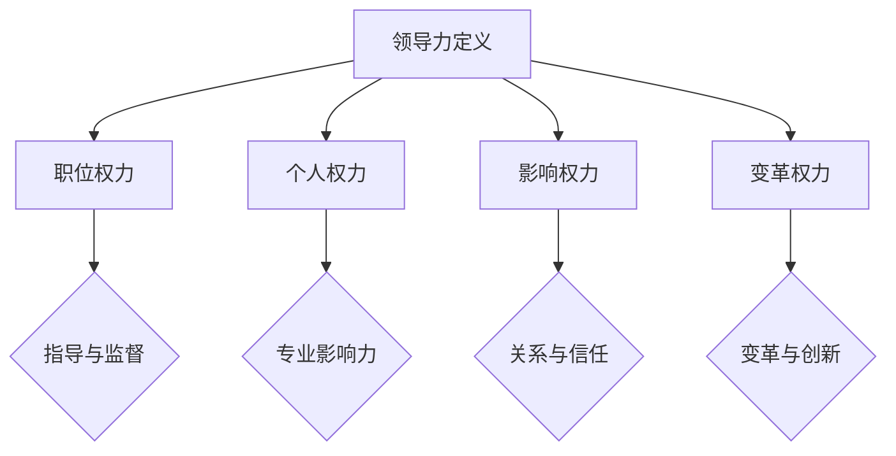
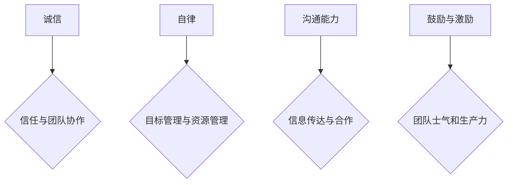
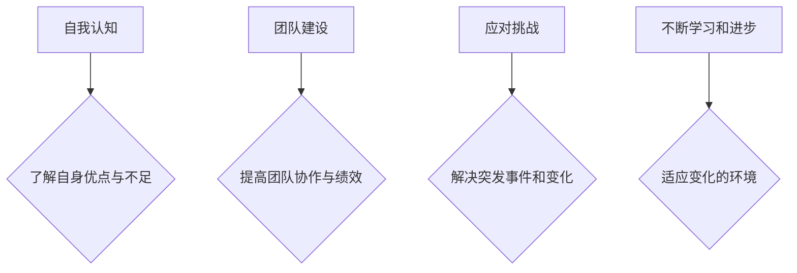

                 

# 领导力与决断力：果断决策的重要性

> **关键词**：领导力、决断力、果断决策、核心要素、实践应用

> **摘要**：本文将深入探讨领导力与决断力的本质，强调果断决策的重要性。通过分析领导力的基础要素、决断力的培养方法以及果断决策的实践策略，文章旨在帮助读者提升个人领导力和决断力，从而在职场和生活各领域中取得成功。

## 目录大纲

### 第一部分：领导力基础

1. **第1章：领导力的本质与意义**
    1.1 领导力的定义
    1.2 领导力的四个层次
    1.3 领导力的重要性

2. **第2章：领导力的核心要素**
    2.1 诚信
    2.2 自律
    2.3 沟通能力
    2.4 鼓励与激励

3. **第3章：领导力发展之路**
    3.1 自我认知
    3.2 团队建设
    3.3 应对挑战
    3.4 不断学习和进步

### 第二部分：决断力与决策

4. **第4章：决断力的培养**
    4.1 什么是决断力
    4.2 提高决断力的方法
    4.3 决策前的准备
    4.4 应对决策压力

5. **第5章：决策的核心要素**
    5.1 信息收集与分析
    5.2 决策的制定与执行
    5.3 风险评估与管理
    5.4 决策后的反思

6. **第6章：果断决策的实践**
    6.1 成功案例分享
    6.2 失败案例分析
    6.3 决策成功的秘诀
    6.4 个人决策力提升策略

### 第三部分：领导力与决断力的应用

7. **第7章：领导力与决断力在企业中的应用**
    7.1 企业战略决策
    7.2 项目管理
    7.3 团队领导
    7.4 个人成长

8. **第8章：领导力与决断力在职场中的应用**
    8.1 职场中的领导力
    8.2 职场中的决断力
    8.3 提升职场竞争力
    8.4 职业发展规划

9. **第9章：领导力与决断力在生活中的应用**
    9.1 家庭管理
    9.2 社交互动
    9.3 个人生活规划
    9.4 社会责任

10. **附录**
    10.1 领导力与决断力相关资源
    10.2 决策工具与方法
    10.3 领导力与决断力相关测试

---

接下来，我们将逐一深入分析每个章节的核心内容。让我们开始第一部分：领导力基础。

## 第一部分：领导力基础

### 第1章：领导力的本质与意义

**1.1 领导力的定义**

领导力，是一个复杂而广泛的概念，它涵盖了从个人影响力到组织变革的多个层面。简单来说，领导力是指一个人引导、激励和影响他人共同达成目标的能力。这种能力不仅涉及管理和协调团队成员，更包括在变革和创新中发挥关键作用。

**1.2 领导力的四个层次**

领导力可以划分为四个层次，分别是：

1. **职位权力**：这是基于职位和职位所赋予的权威。领导者通过职位权力来指导和监督团队成员。

2. **个人权力**：这种权力源于个人的专业知识、技能和声誉。一个有个人权力的领导者能够在不依赖职位的情况下影响他人。

3. **影响权力**：这是通过建立良好的关系和信任来影响他人。这种权力基于人际交往能力和个人魅力。

4. **变革权力**：这是最高层次的领导力，它涉及到推动组织进行重大变革和创新。这种领导者能够引领组织应对复杂和不确定的环境。

**1.3 领导力的重要性**

领导力在个人和组织层面都具有重要意义。对个人来说，领导力有助于建立自信、增强决策能力和提升职业发展。对组织来说，领导力是推动企业成长、创新和实现目标的关键。

**Mermaid 流程图**

### 第2章：领导力的核心要素

**2.1 诚信**

诚信是领导力的基石。一个诚信的领导者会建立信任，这是团队协作和成功的关键。诚信包括诚实、透明和守信三个核心要素。

**2.2 自律**

自律是领导者自我管理和控制的能力。自律的领导者能够设定目标、管理时间和资源，从而更好地实现个人和团队的目标。

**2.3 沟通能力**

沟通能力是领导者的一项重要技能。有效的沟通能够确保信息准确传达，促进团队合作，解决冲突和增强领导力。

**2.4 鼓励与激励**

鼓励与激励是领导者激发团队潜力和保持动力的关键。通过鼓励和激励，领导者能够提高团队的士气和生产力。

**Mermaid 流程图**

### 第3章：领导力发展之路

**3.1 自我认知**

自我认知是领导力发展的基础。领导者需要深入了解自己的优点和不足，从而更好地发挥自己的潜力。

**3.2 团队建设**

团队建设是领导者的一项重要任务。通过建立高效的团队，领导者能够提高团队协作和整体绩效。

**3.3 应对挑战**

领导者需要具备应对挑战的能力。这包括解决突发事件、应对市场变化和推动组织变革。

**3.4 不断学习和进步**

领导力是一个持续发展的过程。领导者需要不断学习新知识、新技能，以适应不断变化的环境。

**Mermaid 流程图**

在下一部分，我们将探讨决断力与决策的核心要素，继续深入分析领导力和决断力的重要性。敬请期待！

