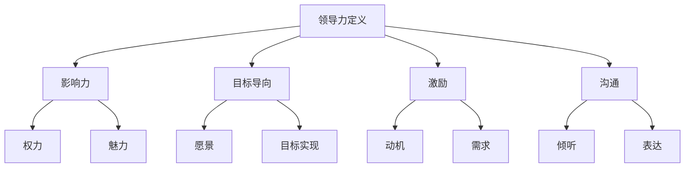
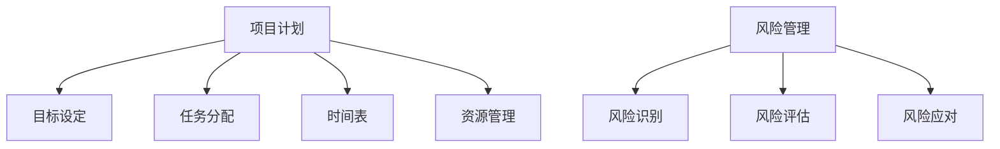
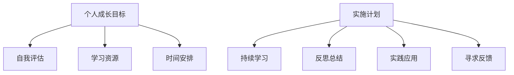

                 

### 《领导力修炼手册：从项目经理到管理者的蜕变宝典》

在IT行业的不断演进中，领导力的作用愈发凸显。从项目经理到管理者的角色转变，不仅需要专业技能的积累，更需要领导力的全面提升。本手册旨在为广大IT从业者提供一条清晰、实用的成长路径，帮助他们在项目管理中实现向管理者的蜕变。本文将围绕领导力的核心概念、实践指南、案例研究和未来展望，展开深入探讨。

### 关键词：
- 领导力
- 项目经理
- 管理者
- 项目管理
- 团队协作
- 沟通技巧
- 个人成长

### 摘要：
本文将系统阐述从项目经理到管理者的蜕变过程，探讨领导力的核心概念、类型和实践方法。通过详细的分析和实战案例，本文旨在帮助读者掌握领导力的关键要素，提升个人综合素质，成为一名优秀的IT领导者。

## 目录大纲

### 第一部分：领导力基础理论

#### 第1章：领导力的核心概念与类型

##### 1.1.1 领导力的定义
##### 1.1.2 领导力的类型

#### 第2章：项目经理的角色与责任

##### 2.1.1 项目经理的职责
##### 2.1.2 项目经理的技能要求

#### 第3章：管理者必备的领导力要素

##### 3.1.1 沟通与协作
##### 3.1.2 决策与执行

#### 第4章：团队管理与领导力

##### 4.1.1 团队建设的原则
##### 4.1.2 团队激励与反馈

#### 第5章：领导力与个人发展

##### 5.1.1 自我认知与成长
##### 5.1.2 情绪管理与压力应对

### 第二部分：领导力实践指南

#### 第6章：项目管理与领导力应用

##### 6.1.1 项目计划与目标设定
##### 6.1.2 风险管理与应对策略

#### 第7章：管理者沟通技巧提升

##### 7.1.1 有效沟通的原则
##### 7.1.2 沟通障碍与解决策略

#### 第8章：领导力在团队协作中的实践

##### 8.1.1 团队合作的重要性
##### 8.1.2 团队协作的案例分析

#### 第9章：领导力与个人成长计划

##### 9.1.1 个人成长目标的制定
##### 9.1.2 成长过程中的挑战与应对

#### 第10章：领导力评估与持续发展

##### 10.1.1 领导力评估工具与方法
##### 10.1.2 持续发展的策略与途径

### 第三部分：领导力案例研究

#### 第11章：成功领导力案例分析

##### 11.1.1 案例背景
##### 11.1.2 领导力实践与成果

#### 第12章：失败领导力案例分析

##### 12.1.1 案例背景
##### 12.1.2 领导力不足与改进方向

#### 第13章：领导力趋势与未来展望

##### 13.1.1 领导力发展的新趋势
##### 13.1.2 未来领导力的要求与挑战

## 补充说明

本手册的结构和内容旨在为读者提供一个全面、系统的领导力提升路径。每个章节都将通过深入分析、实践指南和案例分析，帮助读者逐步掌握领导力的核心要素和实践方法。在阅读过程中，读者可以结合自身实际情况，不断反思和提升，从而在项目管理中实现向管理者的蜕变。

### 第一部分：领导力基础理论

在探讨领导力之前，我们需要明确一些基本概念。领导力不仅仅是一种能力，更是一种艺术。它涉及到如何激发团队的潜能，如何有效地沟通和决策，以及如何应对各种挑战。本部分将围绕这些核心概念展开，帮助读者建立坚实的理论基础。

#### 第1章：领导力的核心概念与类型

##### 1.1.1 领导力的定义

领导力是一种影响和激励他人共同实现目标的能力。它不仅仅依赖于职位和权力，更依赖于个人的魅力、智慧和品格。一个优秀的领导者能够看到团队的长远目标，并能够通过有效的沟通和激励，使团队成员积极参与并共同努力。

定义领导力首先需要理解几个关键概念：

1. **影响力**：领导力本质上是一种影响力，领导者通过自己的言行和行动，影响和激励团队成员。
2. **目标导向**：领导者需要明确团队的共同目标，并引导团队成员为实现这一目标而努力。
3. **激励**：领导者需要了解团队成员的需求和动机，并采取适当的激励措施，激发团队成员的积极性。
4. **沟通**：有效的沟通是领导力的核心要素，领导者需要通过清晰、及时的沟通，确保团队成员对目标、计划和任务有明确的理解。

##### 1.1.2 领导力的类型

领导力并不是单一的，而是多种类型的。根据不同的情境和需求，领导力可以分为以下几种类型：

1. **权威型领导**：这种领导风格强调权力和控制，领导者通过职位赋予的权力来指导和影响团队成员。
2. **民主型领导**：领导者通过征求团队成员的意见和建议，共同制定决策，鼓励团队成员参与决策过程。
3. **变革型领导**：领导者通过激发团队成员的激情和使命感，推动团队实现变革和创新。
4. **导师型领导**：领导者不仅提供指导和建议，还关心团队成员的个人成长和发展。
5. **服务型领导**：领导者将团队成员的需求放在首位，致力于提供支持和帮助，以满足团队成员的需求。

在具体实践中，领导力的类型并不是固定不变的，领导者需要根据不同的情境和团队成员的特点，灵活运用不同的领导风格。

##### 1.1.3 领导力与项目管理的联系

在项目管理中，领导力起着至关重要的作用。项目经理不仅需要具备扎实的技术能力，还需要具备卓越的领导力，以确保项目的成功完成。

1. **项目目标设定**：项目经理需要明确项目的目标，并确保团队成员对目标有清晰的理解和认同。
2. **团队建设**：项目经理需要通过有效的领导力，建立一支高效、协作的团队，激发团队成员的潜能。
3. **沟通协调**：项目经理需要与团队成员、利益相关者和客户保持有效沟通，确保项目进展的透明和及时反馈。
4. **风险应对**：项目经理需要具备应变能力和决策力，及时识别和应对项目中的各种风险和挑战。
5. **激励与反馈**：项目经理需要通过激励措施和有效的反馈，提升团队成员的工作积极性和满意度。

通过领导力，项目经理可以更好地协调和管理团队，确保项目在规定的时间和预算内高质量地完成。

#### 第2章：项目经理的角色与责任

项目经理是项目成功的核心人物，他们需要具备丰富的技术和管理知识，以及卓越的领导力。在本章中，我们将详细探讨项目经理的角色与责任。

##### 2.1.1 项目经理的职责

项目经理的职责可以概括为以下几个方面：

1. **项目规划**：项目经理需要制定详细的项目计划，包括目标、范围、进度、预算和质量等方面的内容。
2. **团队建设**：项目经理需要招聘和培养合适的团队成员，确保团队具备完成项目的能力。
3. **沟通协调**：项目经理需要与团队成员、利益相关者和客户保持有效沟通，确保项目进展的透明和及时反馈。
4. **风险管理**：项目经理需要识别和评估项目中的各种风险，并制定相应的应对策略。
5. **质量控制**：项目经理需要确保项目交付的产品或服务符合预定的质量标准。
6. **项目执行**：项目经理需要监督项目的执行过程，确保项目按照计划进行。

##### 2.1.2 项目经理的技能要求

项目经理的技能要求包括以下几个方面：

1. **技术能力**：项目经理需要具备扎实的技术背景，对项目所涉及的技术领域有深入了解。
2. **管理能力**：项目经理需要具备项目管理的知识和技能，能够有效地管理项目资源、时间和进度。
3. **沟通能力**：项目经理需要具备良好的沟通技巧，能够清晰、准确地表达自己的想法，并有效地倾听他人的意见。
4. **决策能力**：项目经理需要在项目过程中做出正确的决策，确保项目能够顺利进行。
5. **领导力**：项目经理需要具备卓越的领导力，能够激发团队成员的积极性，带领团队共同实现项目目标。

##### 2.1.3 项目经理的角色转变

从项目经理到管理者的角色转变是一个复杂的过程，需要项目经理在多个方面进行提升和调整。

1. **战略思维**：管理者需要具备战略思维，能够从整体上规划和指导项目，而不仅仅是关注项目的细节。
2. **团队管理**：管理者需要更加关注团队的整体表现，培养团队成员的领导能力，激励团队实现共同目标。
3. **跨部门协作**：管理者需要与其他部门和团队进行有效的协作，推动项目在不同部门之间的顺利推进。
4. **决策能力**：管理者需要更加果断和有远见，能够在复杂和不确定的环境下做出正确的决策。

通过上述转变，项目经理可以逐步成长为一名优秀的IT管理者，为团队和组织创造更大的价值。

#### 第3章：管理者必备的领导力要素

作为管理者，领导力是不可或缺的核心能力。在本章中，我们将深入探讨管理者必备的领导力要素，包括沟通与协作、决策与执行等。

##### 3.1.1 沟通与协作

沟通是领导力的核心要素之一。有效的沟通可以确保团队成员对项目目标、计划和任务有清晰的理解，从而提高工作效率和项目成功率。

1. **沟通的重要性**：
   - **确保理解**：通过有效沟通，确保团队成员对项目目标、任务和期望有共同的理解。
   - **促进协作**：沟通可以促进团队成员之间的协作，共同解决问题和实现项目目标。
   - **降低误解**：清晰的沟通可以减少误解和冲突，提高团队的凝聚力和工作效率。

2. **沟通技巧**：
   - **倾听**：倾听是有效沟通的基础，领导者需要认真倾听团队成员的意见和反馈。
   - **清晰表达**：领导者需要用清晰、简洁的语言表达自己的想法，避免歧义和误解。
   - **及时反馈**：领导者需要及时给予团队成员反馈，包括表扬和改进建议。

3. **协作机制**：
   - **团队会议**：定期组织团队会议，讨论项目进展、问题和解决方案。
   - **任务分配**：明确任务分配，确保每个团队成员都清楚自己的职责和任务。
   - **信息共享**：建立信息共享平台，确保团队成员能够及时获取项目相关的信息和资源。

##### 3.1.2 决策与执行

决策是管理者的核心职责之一。有效的决策可以确保项目在正确方向上顺利推进，而错误的决策则可能导致项目失败。

1. **决策的重要性**：
   - **确保项目方向正确**：正确的决策可以确保项目按照预定的目标顺利推进，避免偏离方向。
   - **提高项目成功率**：合理的决策可以提高项目的成功率，降低风险和成本。
   - **应对不确定性**：在复杂和不确定的环境中，决策能力可以帮助管理者及时应对变化和挑战。

2. **决策技巧**：
   - **收集信息**：在做出决策前，领导者需要收集和分析相关数据和事实，确保决策有据可依。
   - **评估风险**：领导者需要对决策可能带来的风险进行评估，并制定相应的应对策略。
   - **权衡利弊**：领导者需要在多个方案中权衡利弊，选择最优的决策方案。
   - **果断决策**：在决策过程中，领导者需要果断做出决策，避免拖延和犹豫。

3. **执行策略**：
   - **明确执行计划**：领导者需要制定明确的执行计划，包括任务分配、时间表和资源需求。
   - **监督执行**：领导者需要监督执行过程，确保项目按照计划进行，及时纠正偏差。
   - **激励团队**：领导者需要通过激励措施，提高团队成员的执行积极性和工作效率。

通过有效的沟通和决策，管理者可以更好地协调和管理团队，确保项目的高效运行和成功完成。

##### 3.1.3 领导力与团队绩效的关系

领导力对团队绩效有着直接和深远的影响。一个优秀的领导者能够激发团队的潜能，提高团队的整体绩效。

1. **提高团队凝聚力**：通过有效的领导力，领导者可以增强团队的凝聚力，使团队成员相互信任和支持，共同为实现团队目标而努力。
2. **激发创新思维**：领导者鼓励团队成员提出新的想法和解决方案，激发创新思维，推动团队不断进步。
3. **提高工作效率**：通过有效的沟通和协调，领导者可以确保团队成员明确任务和目标，提高工作效率和项目成功率。
4. **提升团队士气**：领导者关心团队成员的需求和感受，通过激励和鼓励，提升团队的士气和积极性。

总之，领导力是团队绩效的关键因素。一个优秀的领导者不仅能够带领团队实现项目目标，还能够推动团队持续成长和进步。

### 第4章：团队管理与领导力

团队管理是管理者的重要职责之一。一个高效的团队可以极大地提高项目的成功率。在本章中，我们将深入探讨团队管理的原则、团队激励与反馈机制，以及领导力在团队管理中的应用。

#### 4.1.1 团队建设的原则

团队建设是一个持续的过程，需要管理者在多个方面进行努力。以下是一些关键的团队建设原则：

1. **明确目标**：团队需要明确共同的目标和愿景，确保团队成员对团队方向有清晰的认识。
2. **共同责任**：团队中的每个成员都应承担共同的责任，相互支持，共同面对挑战。
3. **信任与尊重**：建立信任和尊重的团队文化，鼓励团队成员之间开放沟通和互相学习。
4. **多样性**：鼓励团队成员的多样性，包括技能、背景和观点，这有助于团队从不同角度分析和解决问题。
5. **持续学习**：鼓励团队成员持续学习和成长，不断提升个人和团队的能力。

#### 4.1.2 团队激励与反馈机制

团队激励是提升团队绩效和员工满意度的关键。以下是一些有效的团队激励和反馈机制：

1. **明确奖励制度**：建立明确的奖励制度，奖励表现出色的团队成员，激励其他成员努力工作。
2. **及时反馈**：领导者需要及时给予团队成员反馈，包括表扬和改进建议，帮助团队成员认识到自己的优势和改进方向。
3. **激励计划**：设计多样化的激励计划，如团队建设活动、职业发展机会和晋升通道等，满足团队成员的不同需求。
4. **鼓励创新**：鼓励团队成员提出创新的想法和解决方案，并对创新成果进行表彰和奖励。
5. **职业发展支持**：为团队成员提供职业发展支持，包括培训、指导和建议，帮助他们实现个人和职业目标。

#### 4.1.3 领导力在团队管理中的应用

领导力在团队管理中起着至关重要的作用。以下是一些领导力在团队管理中的应用：

1. **愿景引导**：领导者需要明确团队的愿景和目标，并确保团队成员对愿景有共同的理解和认同。
2. **沟通协调**：领导者需要与团队成员保持有效沟通，了解他们的需求和问题，并协调资源解决问题。
3. **激励与支持**：领导者需要通过激励措施和支持，激发团队成员的积极性和创造力。
4. **决策与执行**：领导者需要做出明智的决策，并确保决策得到有效执行。
5. **个人发展**：领导者需要关注团队成员的个人发展，为他们提供成长和发展的机会。

通过有效的团队管理，领导者可以打造一个高效、协作的团队，推动项目的成功完成。

### 第5章：领导力与个人发展

个人发展是每个团队成员和领导者都需要关注的重要领域。在本章中，我们将探讨自我认知与成长、情绪管理与压力应对，以及如何通过个人发展提升领导力。

#### 5.1.1 自我认知与成长

自我认知是个人发展的基础。通过深入了解自己的优点和不足，我们可以更好地规划个人发展路径。

1. **自我评估**：定期进行自我评估，识别自己的优势和劣势，明确个人发展目标。
2. **持续学习**：不断学习新知识和技能，提升自己的综合素质，为个人发展打下坚实基础。
3. **反思与总结**：通过反思和总结工作中的经验和教训，不断提升自己的认知水平和能力。

#### 5.1.2 情绪管理与压力应对

情绪管理和压力应对是领导者必须掌握的重要技能。一个优秀的领导者需要能够保持冷静、积极的心态，面对各种挑战和压力。

1. **情绪识别**：了解自己的情绪，并学会识别和表达情绪。
2. **情绪调节**：学会调节情绪，保持心态平衡，避免负面情绪的影响。
3. **压力应对**：学会应对压力，通过合理安排时间、调整工作和生活节奏等方式，减轻压力。

#### 5.1.3 领导力与个人发展的关系

领导力与个人发展密切相关。一个优秀的领导者需要不断成长和进步，以应对不断变化的工作环境和挑战。

1. **个人成长推动领导力提升**：通过自我认知和成长，领导者可以不断提升自己的能力和影响力，成为更优秀的领导者。
2. **领导力促进个人发展**：有效的领导力可以帮助领导者更好地实现个人和团队的目标，为个人发展提供更好的平台和机会。
3. **个人发展与团队发展相互促进**：个人发展可以提升团队的整体绩效，而团队的成功又可以进一步推动个人成长。

通过个人发展，领导者可以不断提升自己的领导力，为团队和组织创造更大的价值。

### 第二部分：领导力实践指南

在掌握了领导力的基础理论之后，本部分将转向实践指南，帮助读者将理论知识应用于实际工作中。通过项目管理与领导力应用、管理者沟通技巧提升、领导力在团队协作中的实践等章节，读者将了解如何在实际工作中运用领导力，实现项目目标和个人成长。

#### 第6章：项目管理与领导力应用

项目经理在项目管理中扮演着关键角色，领导力在这一过程中起到了至关重要的作用。本章将探讨如何在项目管理中运用领导力，确保项目顺利进行。

##### 6.1.1 项目计划与目标设定

项目计划是项目管理的基础。一个良好的项目计划可以帮助团队明确目标，确保项目按时、按质、按量完成。

1. **项目目标设定**：明确项目的目标，并将其分解为具体、可衡量的任务和里程碑。
2. **项目计划制定**：制定详细的项目计划，包括任务分配、时间表、资源和风险等方面的内容。
3. **团队共识**：确保团队成员对项目目标和计划有共同的理解和认同，提高执行力。

##### 6.1.2 风险管理与应对策略

在项目管理中，风险是不可忽视的因素。有效的风险管理可以帮助团队提前识别和应对潜在的风险，降低项目失败的概率。

1. **风险识别**：通过评估项目中的各种风险因素，识别可能影响项目进展的风险。
2. **风险评估**：对识别出的风险进行评估，确定其发生的概率和可能带来的影响。
3. **应对策略**：制定相应的应对策略，包括风险回避、风险减轻、风险接受等。

##### 6.1.3 领导力在项目执行中的应用

项目执行是项目管理的核心阶段，领导力在这一阶段发挥了关键作用。以下是领导力在项目执行中的应用：

1. **沟通协调**：确保团队成员之间的沟通畅通，及时解决项目中的问题和冲突。
2. **监督与反馈**：监督项目进展，及时给予团队成员反馈，确保项目按照计划进行。
3. **激励与支持**：通过激励措施和支持，激发团队成员的积极性和创造力，确保项目顺利推进。

通过有效的项目管理和领导力应用，项目经理可以更好地协调和管理团队，确保项目的成功完成。

#### 第7章：管理者沟通技巧提升

沟通技巧是管理者必备的重要技能。有效的沟通可以确保团队成员对项目目标和计划有共同的理解，提高工作效率和团队凝聚力。本章将探讨管理者如何提升沟通技巧。

##### 7.1.1 有效沟通的原则

有效沟通需要遵循以下原则：

1. **清晰表达**：使用简洁、明了的语言表达自己的意思，避免歧义和误解。
2. **倾听**：认真倾听他人的意见和需求，理解对方的观点，建立信任和尊重。
3. **透明沟通**：确保信息传递的透明和及时，避免信息不对称和误解。
4. **积极反馈**：给予团队成员积极的反馈，鼓励他们表达自己的想法和建议。

##### 7.1.2 沟通障碍与解决策略

在沟通过程中，常常会遇到各种障碍。以下是一些常见的沟通障碍及其解决策略：

1. **文化差异**：解决策略：加强跨文化沟通培训，提高团队成员的文化敏感度和沟通能力。
2. **信息过载**：解决策略：合理规划沟通内容和频率，避免信息过载，确保团队成员能够有效吸收和处理信息。
3. **沟通渠道不畅**：解决策略：建立多元化的沟通渠道，如会议、邮件、即时通讯等，确保信息传递的畅通。
4. **个人偏见**：解决策略：提高自我认知，了解和克服个人偏见，以客观、公正的态度对待沟通和团队成员。

##### 7.1.3 沟通技巧提升实践

管理者可以通过以下实践提升沟通技巧：

1. **倾听训练**：定期进行倾听训练，提高自己的倾听能力和理解力。
2. **反馈练习**：与他人进行反馈练习，学会给予和接受建设性的反馈。
3. **沟通技巧培训**：参加沟通技巧培训课程，学习最新的沟通理论和技巧。
4. **实践应用**：将沟通技巧应用到实际工作中，通过不断的实践和反思，逐步提升沟通能力。

通过有效的沟通技巧提升，管理者可以更好地协调和管理团队，提高团队效率和项目成功率。

#### 第8章：领导力在团队协作中的实践

团队协作是实现项目目标的关键。领导力在团队协作中发挥着重要作用，可以帮助团队克服各种挑战，实现共同的目标。本章将探讨领导力在团队协作中的实践。

##### 8.1.1 团队合作的重要性

团队合作的重要性体现在以下几个方面：

1. **资源整合**：通过团队合作，可以整合团队成员的技能、经验和资源，提高工作效率和项目成功率。
2. **知识共享**：团队合作鼓励团队成员之间的知识共享和交流，促进个人和团队的能力提升。
3. **风险分担**：团队合作可以将项目风险分散到各个成员，降低单个成员的工作压力和风险。
4. **创新思维**：团队合作可以激发团队成员的创新思维，提出更多的解决方案和改进措施。

##### 8.1.2 团队协作的案例分析

以下是一个团队协作的案例分析：

**案例背景**：某科技公司正在开发一款新产品，项目团队由来自不同部门和背景的成员组成，包括产品经理、设计师、工程师和测试人员。

**问题**：项目进度缓慢，团队成员之间存在沟通障碍和协作问题。

**解决方案**：
1. **明确目标**：项目团队共同制定项目目标，确保每个成员对目标有清晰的理解和认同。
2. **建立沟通渠道**：建立多元化的沟通渠道，如每周团队会议、即时通讯工具和邮件列表，确保团队成员之间的沟通畅通。
3. **分工协作**：明确团队成员的职责和任务，确保每个成员知道自己的角色和责任，提高协作效率。
4. **定期反馈**：定期进行项目进度反馈，及时解决团队协作中的问题和挑战，确保项目顺利进行。

**效果**：通过有效的团队协作，项目团队成功克服了沟通障碍和协作问题，项目进度明显加快，最终按时完成了产品开发任务。

##### 8.1.3 领导力在团队协作中的应用

领导力在团队协作中的应用主要体现在以下几个方面：

1. **愿景引导**：领导者需要明确团队的愿景和目标，并确保团队成员对愿景有共同的理解和认同，激发团队成员的积极性和创造力。
2. **沟通协调**：领导者需要与团队成员保持有效沟通，了解他们的需求和问题，协调资源解决问题，确保团队协作的顺畅进行。
3. **激励与支持**：领导者需要通过激励措施和支持，激发团队成员的积极性和创造力，帮助团队成员克服困难和挑战。
4. **冲突解决**：领导者需要具备冲突解决能力，及时解决团队协作中的冲突和矛盾，维护团队的稳定和和谐。

通过有效的领导力在团队协作中的应用，领导者可以打造一个高效、协作的团队，推动项目的成功完成。

#### 第9章：领导力与个人成长计划

个人成长是每个团队成员和领导者都应该关注的重要领域。有效的领导力可以帮助团队成员和领导者实现个人和职业发展，提升团队整体绩效。本章将探讨如何通过个人成长计划实现领导力的提升。

##### 9.1.1 个人成长目标的制定

个人成长目标的制定是个人发展的第一步。以下是一些制定个人成长目标的建议：

1. **明确目标**：明确个人成长的目标，将其具体化、可衡量，并设定明确的实现时间。
2. **自我评估**：通过自我评估，了解自己的优势和不足，确定需要提升的方面。
3. **制定计划**：制定具体的计划，包括学习资源、时间安排和行动步骤，确保目标的实现。

##### 9.1.2 个人成长计划的实施

个人成长计划的实施需要坚定的决心和持续的努力。以下是一些实施个人成长计划的建议：

1. **持续学习**：利用各种学习资源，如在线课程、书籍、研讨会等，不断提升自己的知识和技能。
2. **定期反思**：定期进行反思，总结个人成长的过程和收获，调整计划，确保目标的实现。
3. **实践应用**：将所学知识和技能应用到实际工作中，通过实践不断提升自己的能力和水平。
4. **寻求反馈**：向同事、导师和上级寻求反馈，了解自己的优势和不足，不断完善个人成长计划。

##### 9.1.3 个人成长对领导力提升的影响

个人成长对领导力提升有着重要的影响。以下是一些个人成长对领导力提升的影响：

1. **增强自信心**：通过个人成长，领导者可以增强自信心，提高决策能力和执行力。
2. **提升沟通能力**：个人成长可以帮助领导者提升沟通能力，建立良好的人际关系，提高团队协作效率。
3. **拓宽视野**：个人成长可以拓宽领导者的视野，增强对行业趋势和未来发展的洞察力。
4. **提高创新能力**：个人成长可以激发领导者的创新能力，推动团队实现持续创新和进步。

通过个人成长，领导者可以不断提升自己的领导力，为团队和组织创造更大的价值。

### 第10章：领导力评估与持续发展

领导力的提升需要不断的评估和改进。本章将探讨领导力评估的方法、工具和策略，以及如何通过持续发展实现领导力的提升。

##### 10.1.1 领导力评估工具与方法

领导力评估是了解领导者能力的重要手段。以下是一些常见的领导力评估工具与方法：

1. **360度评估**：通过团队成员、上级和下属的反馈，全面评估领导者的能力和表现。
2. **领导力问卷**：使用标准化的问卷，评估领导者的各项能力，如沟通、决策、激励等。
3. **领导力模型评估**：根据特定的领导力模型，评估领导者的能力和符合度。
4. **行为事件访谈**：通过访谈的方式，了解领导者在实际工作中的表现和应对策略。

##### 10.1.2 领导力评估结果的反馈与改进

领导力评估结果的反馈与改进是提升领导力的关键。以下是一些反馈与改进的建议：

1. **反馈机制**：建立有效的反馈机制，确保评估结果能够及时、准确地反馈给领导者。
2. **制定改进计划**：根据评估结果，制定具体的改进计划，包括学习资源、行动步骤和时间安排。
3. **持续跟踪**：对改进计划的实施进行持续跟踪，确保领导者的能力不断提升。
4. **培训与发展**：为领导者提供培训和发展机会，帮助他们提高领导力和管理能力。

##### 10.1.3 领导力持续发展的策略

领导力持续发展是领导者终身学习的过程。以下是一些领导力持续发展的策略：

1. **学习与实践**：领导者需要不断学习和实践，通过经验积累和反思，提升自己的能力和水平。
2. **建立学习社区**：与其他领导者建立学习社区，分享经验和知识，相互学习和支持。
3. **寻求导师指导**：寻求有经验的导师指导，获得专业意见和建议，帮助自己更好地发展。
4. **参与行业交流**：参与行业交流活动，了解行业趋势和最新动态，拓宽视野，提升领导力。

通过领导力评估与持续发展，领导者可以不断提升自己的能力，为团队和组织创造更大的价值。

### 第11章：成功领导力案例分析

在IT行业中，成功的领导力案例层出不穷。本章将通过对成功领导力案例的分析，探讨这些领导者如何运用领导力实现项目目标，推动团队和组织的发展。

##### 11.1.1 案例背景

某知名互联网公司正在开发一款全新的社交应用，市场预期良好。公司CEO，李明，是一位拥有丰富经验的领导者。他深知领导力在项目成功中的关键作用，因此，他决定采取一系列措施，确保项目的顺利进行。

##### 11.1.2 领导力实践与成果

1. **愿景引导**：李明明确提出了项目的愿景，即打造一款具有创新性和用户友好性的社交应用，并确保团队成员对愿景有共同的理解和认同。

2. **沟通协调**：李明建立了高效的沟通机制，定期组织团队会议，确保团队成员之间的信息畅通，及时解决项目中的问题和挑战。

3. **激励与支持**：李明通过激励机制，如表彰和奖励，激发团队成员的积极性和创造力，确保项目进度和质量。

4. **创新思维**：李明鼓励团队成员提出创新的想法和解决方案，并在团队中推广创新思维，推动项目的持续创新和进步。

5. **团队建设**：李明注重团队建设，定期组织团队建设活动，增强团队成员之间的信任和合作，提高团队的凝聚力和工作效率。

通过以上措施，李明成功带领团队完成了项目，并在市场上取得了良好的口碑和业绩。

##### 11.1.3 领导力实践的经验总结

李明的成功经验表明，领导力在项目管理和团队建设中至关重要。以下是一些值得借鉴的经验：

1. **明确愿景**：领导者需要明确项目的愿景，并确保团队成员对愿景有共同的理解和认同。

2. **有效沟通**：建立高效的沟通机制，确保团队成员之间的信息畅通，及时解决项目中的问题和挑战。

3. **激励与支持**：通过激励机制和支持，激发团队成员的积极性和创造力，确保项目进度和质量。

4. **创新思维**：鼓励团队成员提出创新的想法和解决方案，推动项目的持续创新和进步。

5. **团队建设**：注重团队建设，增强团队成员之间的信任和合作，提高团队的凝聚力和工作效率。

通过学习和借鉴这些成功经验，读者可以在实际工作中运用领导力，实现项目目标和个人成长。

### 第12章：失败领导力案例分析

在IT行业中，失败的领导力案例同样不少。本章将通过对失败领导力案例的分析，探讨这些领导者如何因为领导力不足导致项目失败，并提供改进方向。

##### 12.1.1 案例背景

某初创公司正在开发一款智能智能家居系统，市场前景广阔。公司创始人王强，在技术方面有深厚的背景，但在领导力方面存在明显不足。在项目推进过程中，王强未能有效发挥领导力，导致项目进度严重滞后，最终以失败告终。

##### 12.1.2 领导力不足与改进方向

1. **愿景不明确**：王强未能明确项目的愿景和目标，导致团队成员对项目方向和目标缺乏清晰的认识，缺乏共同奋斗的动力。

2. **沟通不畅**：王强在团队沟通方面存在明显问题，未能及时解决团队中的问题和冲突，导致项目进展受阻。

3. **激励不足**：王强未能采取有效的激励机制，激发团队成员的积极性和创造力，导致团队成员工作积极性不高，项目进度缓慢。

4. **决策失误**：王强在项目决策过程中，未能充分评估风险和收益，导致项目在多个关键决策上出现失误，最终导致项目失败。

5. **团队管理不善**：王强在团队管理方面存在明显不足，未能建立有效的团队协作机制，导致团队成员之间沟通不畅，协作效率低下。

##### 12.1.3 改进方向

针对以上问题，以下是一些改进方向：

1. **明确愿景**：领导者需要明确项目的愿景和目标，并确保团队成员对愿景有共同的理解和认同。

2. **沟通协调**：领导者需要建立高效的沟通机制，确保团队成员之间的信息畅通，及时解决项目中的问题和冲突。

3. **激励与支持**：领导者需要采取有效的激励机制，激发团队成员的积极性和创造力，确保项目进度和质量。

4. **决策能力**：领导者需要提高决策能力，充分评估风险和收益，做出明智的决策。

5. **团队管理**：领导者需要加强团队管理，建立有效的团队协作机制，提高团队的协作效率和凝聚力。

通过借鉴这些失败案例的教训，领导者可以在实际工作中避免类似的问题，提升自己的领导力，推动项目成功完成。

### 第13章：领导力趋势与未来展望

随着信息技术的迅猛发展和商业环境的不断变化，领导力也在不断演变。本章将探讨领导力发展的新趋势，以及未来领导力的要求和挑战。

##### 13.1.1 领导力发展的新趋势

1. **数字化领导力**：随着数字化技术的普及，领导者需要具备数字思维和数字化管理能力，能够利用数字化工具和平台提升团队效率和项目成功率。

2. **全球化领导力**：全球化带来了文化多样性和跨国团队的管理挑战，领导者需要具备跨文化沟通和管理能力，适应全球化的工作环境。

3. **敏捷领导力**：敏捷管理方法在IT行业广泛应用，领导者需要具备敏捷思维，能够灵活应对变化，推动团队实现持续交付和快速迭代。

4. **变革型领导力**：在快速变化的市场环境中，领导者需要具备变革型领导力，能够引领团队应对变革，实现组织转型和创新。

5. **社会责任领导力**：随着社会责任意识的提升，领导者需要关注企业的社会责任，推动可持续发展，提升企业的社会形象和品牌价值。

##### 13.1.2 未来领导力的要求与挑战

1. **技术素养**：未来领导力要求领导者具备良好的技术素养，能够理解并应用新技术，推动团队的技术创新和进步。

2. **沟通能力**：领导力强调沟通和协作，未来领导者需要具备卓越的沟通能力，能够有效地与团队成员、利益相关者和客户进行沟通。

3. **创新思维**：未来领导力要求领导者具备创新思维，能够引领团队在不确定性和竞争激烈的环境中寻求创新和突破。

4. **变革能力**：未来领导力要求领导者具备变革能力，能够推动组织适应外部环境的变化，实现持续创新和进步。

5. **跨文化管理**：全球化背景下，领导者需要具备跨文化管理能力，能够理解和尊重不同文化的特点和差异，推动跨文化团队的协作。

未来领导力的要求和挑战预示着领导力的发展方向，领导者需要不断学习和提升自己的能力，以应对未来的挑战，为团队和组织创造更大的价值。

### 总结与展望

本文通过系统地阐述领导力的核心概念、类型和实践方法，帮助读者从理论到实践全面了解领导力。从项目经理到管理者的角色转变，不仅需要专业技能的提升，更需要领导力的全面发展。有效的领导力可以激发团队的潜能，提高项目成功率，推动组织的发展。

在未来的发展中，领导力将面临新的趋势和要求，领导者需要不断学习和提升自己的能力，以适应不断变化的市场环境和组织需求。我们期待读者能够将本文的理念和经验应用到实际工作中，不断提升自己的领导力，成为一名优秀的IT领导者。

### 附录：流程图与代码实现

为了更好地理解本章中的核心概念和实践方法，我们提供了相关的流程图和代码实现。读者可以通过这些流程图和代码，更直观地了解领导力的应用和实践。

#### 第1章：领导力的核心概念与类型

**流程图：领导力定义与类型**



#### 第6章：项目管理与领导力应用

**流程图：项目计划与风险管理**



**代码实现：项目计划与风险管理（Python伪代码）**

```python
# 项目计划
def project_plan():
    # 设定项目目标
    set_goals()
    # 分配任务
    assign_tasks()
    # 制定时间表
    create_timeline()
    # 管理资源
    manage_resources()

# 风险管理
def risk_management():
    # 风险识别
    identify_risks()
    # 风险评估
    assess_risks()
    # 风险应对
    respond_to_risks()
```

#### 第9章：领导力与个人成长计划

**流程图：个人成长目标与实施计划**



**代码实现：个人成长计划（Python伪代码）**

```python
# 个人成长目标
def personal_growth_goals():
    # 自我评估
    self_evaluation()
    # 制定学习资源
    create_learning_resources()
    # 制定时间安排
    set_time_scheduling()
    # 实施计划
    implement_plan()

# 持续学习
def continuous_learning():
    # 学习新知识
    learn_new_knowledge()
    # 学习新技能
    learn_new_skills()

# 反思总结
def reflection_and_summary():
    # 反思学习过程
    reflect_learning_process()
    # 总结收获
    summarize_gains()

# 实践应用
def practical_application():
    # 应用所学知识
    apply_learned_knowledge()
    # 应用所学技能
    apply_learned_skills()

# 寻求反馈
def seek_feedback():
    # 获取反馈
    get_feedback()
    # 调整计划
    adjust_plan()
```

通过流程图和代码实现，读者可以更直观地理解领导力的核心概念和实践方法，并将这些理念应用到实际工作中。希望这些工具能够帮助读者在领导力提升的道路上取得更好的成果。

### 作者信息

**作者：** AI天才研究院（AI Genius Institute） & 禅与计算机程序设计艺术（Zen And The Art of Computer Programming）

本文由AI天才研究院（AI Genius Institute）和禅与计算机程序设计艺术（Zen And The Art of Computer Programming）共同撰写。AI天才研究院致力于推动人工智能技术的研究与应用，禅与计算机程序设计艺术则专注于探讨计算机编程的哲学和艺术。两院联合撰写本文，旨在为广大IT从业者提供一条清晰、实用的领导力提升路径，助力他们在项目管理中实现向管理者的蜕变。希望本文能为读者带来启示和帮助。

