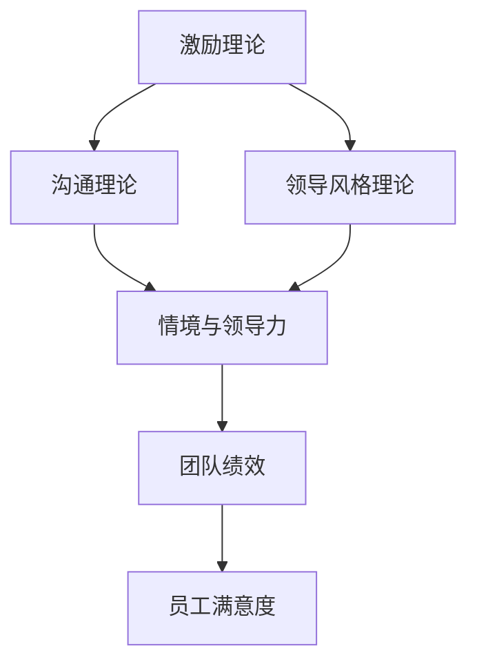

                 

### 第1章：领导力概述

## 1.1 领导力的定义与作用

领导力是一个多维度的概念，它不仅涉及到个人的能力和品质，还涉及到其在特定情境中的实际应用。在技术领域，领导力往往被看作是推动团队向特定目标前进的关键因素。下面，我们将对领导力进行定义，并详细探讨其作用。

### 1.1.1 领导力的概念

领导力是一种能够影响和激励他人共同实现目标的能力。根据罗伯特·豪斯（Robert House）的定义，领导力包括 charisma（魅力）、instruction（指导）、participation（参与）和achievement（成就）四个方面。此外，约翰·P·科特（John P. Kotter）则认为领导力是由变革性领导（transformational leadership）和交易性领导（transactional leadership）两种类型构成的。

我们用以下公式来定义领导力：

$$
\text{领导力} = \text{影响力} \times \text{目标导向}
$$

这个公式表明，领导力是由影响力和目标导向两个核心要素组成的。影响力是领导者的能力，用来引导和激励团队成员；目标导向则是领导者对团队目标和愿景的明确追求。

### 1.1.2 领导力的作用

领导力在团队和组织中扮演着至关重要的角色。具体来说，领导力主要有以下几方面的作用：

1. **指导团队发展方向**：领导者通过制定战略规划和设定明确的目标，为团队指明方向，确保团队成员朝着共同的目标努力。

2. **促进团队协作与沟通**：领导者通过建立有效的沟通机制，促进团队成员之间的协作，确保信息的畅通无阻。

3. **激励团队成员潜能**：领导者通过激励措施，激发团队成员的内在动力，使他们在工作中发挥出最大的潜能。

4. **实现组织目标**：最终，领导力的目标是帮助组织实现其战略目标，提升组织绩效。

## 1.2 领导力的核心要素

领导力并非一蹴而就，它涉及到多个方面的要素。以下是领导力的核心要素及其重要性：

### 1.2.1 道德品质

道德品质是领导者不可或缺的基本素质。它包括诚信正直、责任感、遵守法律法规等方面。道德品质不仅能赢得团队成员的信任，还能提高团队的凝聚力和工作效率。

### 1.2.2 知识与技能

领导者的知识与技能是其在团队中发挥领导作用的基础。这包括管理知识、沟通技能和决策能力等。管理知识帮助领导者理解组织运作，沟通技能使领导者能够有效地传达信息，决策能力则确保领导者能够在复杂环境中做出明智的决策。

### 1.2.3 领导风格

领导风格是指领导者与团队成员互动时的行为和方式。常见的领导风格包括权威式、民主式、参与式等。不同的领导风格对团队的影响不同，因此领导者需要根据具体情况选择合适的领导风格。

### 1.2.4 自我认知

自我认知是领导者了解自身优缺点，不断提升自我能力的过程。自我认知可以帮助领导者更好地识别团队需求，调整领导策略，提高领导效能。

## 1.3 领导力的重要性

领导力不仅对团队成员和团队本身有着深远的影响，还对整个组织产生重要的影响。以下是领导力重要性的几个方面：

### 1.3.1 对团队的影响

1. **提高团队凝聚力**：领导者通过建立共同目标和愿景，增强团队成员之间的联系，提高团队凝聚力。
2. **增强团队创造力**：领导者的激励和鼓励措施可以激发团队成员的创造力，推动团队创新。
3. **提升团队绩效**：领导者的有效管理可以提高团队的工作效率，从而提升团队的整体绩效。

### 1.3.2 对组织的影响

1. **促进组织发展**：领导者的战略规划和目标设定有助于组织实现长远发展。
2. **提高组织竞争力**：领导者的决策能力和执行力可以帮助组织在竞争激烈的市场中占据优势。
3. **实现组织目标**：领导者的领导力是组织实现战略目标的关键。

## 1.4 领导力的分类

领导力可以根据不同的标准进行分类。以下是几种常见的分类方式：

### 1.4.1 根据领导对象分类

1. **企业领导**：针对企业的领导者，如CEO、CTO等。
2. **政府领导**：针对政府机构的领导者，如国家主席、市长等。
3. **社会组织领导**：针对非政府组织和社会团体的领导者，如NGO负责人、社会运动领袖等。

### 1.4.2 根据领导内容分类

1. **战略领导**：涉及组织长期目标和方向的战略规划。
2. **管理领导**：涉及日常运营和管理的执行层面。
3. **情感领导**：关注团队情感状态，建立积极的团队氛围。

## 1.5 领导力的发展趋势

随着社会和科技的不断发展，领导力也在不断演变。以下是几个领导力的发展趋势：

### 1.5.1 跨文化领导力

随着全球化进程的加快，跨文化领导力变得越来越重要。领导者需要具备跨文化沟通和协调能力，以应对多元文化背景下的挑战。

### 1.5.2 智能化领导力

人工智能和大数据技术的应用，使得领导力更加科学和高效。领导者可以利用数据驱动决策，提高组织的运作效率。

### 1.5.3 生态领导力

在可持续发展的背景下，生态领导力成为新的趋势。领导者需要关注环境保护和社会责任，推动组织的可持续发展。

### 1.5.4 网络化领导力

随着互联网的发展，网络化领导力成为重要的趋势。领导者需要掌握网络营销、在线协作等技能，以适应数字化时代的要求。

## 结论

领导力是一个复杂而多层次的概念，它对团队和组织的发展具有至关重要的作用。通过理解领导力的定义、核心要素和发展趋势，我们可以更好地培养和提高自己的领导力，为团队和组织创造更大的价值。

## 1.1 领导力的定义与作用

### 领导力的概念

领导力是指个人或集体在组织或团队中，通过影响、激励和引导他人，共同实现目标的能力。它可以被看作是一种软技能，强调人际互动、情感智慧和战略思维。

在技术领域，领导力不仅仅是对技术的掌控，更是对团队的领导和管理。一个技术领导者需要具备以下能力：

- **技术知识**：对特定技术领域的深入理解，能够指导团队成员解决复杂问题。
- **沟通能力**：能够清晰、准确地传达技术理念，确保团队成员理解并执行任务。
- **决策能力**：在不确定性中做出明智的决策，平衡技术需求和业务目标。
- **团队管理**：建立高效的工作流程，激发团队成员的潜力，营造积极的工作氛围。

### 领导力的作用

领导力在技术团队中扮演着关键角色，其作用主要体现在以下几个方面：

1. **明确目标与方向**：领导者需要设定清晰的目标和愿景，为团队指引前进的方向。这包括技术目标、项目目标和长期战略目标。

2. **激发团队潜力**：通过激励和鼓励，领导者可以激发团队成员的潜力，使其在技术项目中发挥出最佳水平。

3. **优化团队协作**：领导者需要建立有效的沟通机制，促进团队成员之间的协作，确保信息的畅通和资源的合理分配。

4. **管理风险与挑战**：在技术项目中，领导者需要预见潜在的风险和挑战，并制定相应的应对策略，确保项目的顺利进行。

5. **提升团队绩效**：通过有效的领导，团队的整体绩效会得到显著提升，这不仅体现在技术成果上，也体现在团队成员的职业发展和满意度上。

### 领导力与技术创新

在技术领域，领导力与技术创新紧密相关。领导者需要具备以下能力来推动技术创新：

- **愿景与远见**：领导者需要有远见，能够看到技术的未来发展趋势，并设定相应的技术创新目标。
- **资源整合**：领导者需要能够整合内部和外部资源，为技术创新提供必要的支持。
- **风险评估**：领导者需要对技术创新的风险进行评估，并制定相应的风险控制措施。
- **团队激励**：领导者需要激发团队成员的创新热情，提供必要的资源和激励，鼓励他们尝试新技术和新方法。

### 结论

领导力是技术团队中不可或缺的核心能力。通过定义和阐述领导力的概念和作用，我们可以看到，领导力不仅仅是对技术本身的掌控，更是对团队的领导和管理。一个优秀的领导者能够为团队指引方向，激发团队成员的潜力，优化团队协作，管理风险与挑战，并最终提升团队绩效。在技术创新的推动过程中，领导力更是起到了至关重要的作用。因此，对于技术领导者而言，不断提升自己的领导力是至关重要的。

## 1.2 领导力的核心要素

领导力是一个复杂而多维度的概念，它涉及到领导者的道德品质、知识技能、领导风格以及自我认知等多个方面。以下是对这些核心要素的详细阐述：

### 1.2.1 道德品质

道德品质是领导力的基础，它包括诚信、责任感、正直和公平等。一个具备良好道德品质的领导者能够赢得团队成员的信任和尊重，从而更好地推动团队的发展。

- **诚信**：领导者需要言行一致，遵守承诺，树立良好的榜样。这有助于建立团队的信任文化，促进团队成员之间的协作。
- **责任感**：领导者需要对自己的行为和决策负责，勇于承担结果。这种责任感可以激励团队成员也承担起自己的责任，提高团队的整体执行力。
- **正直**：领导者需要坚持原则，不妥协于不正当的手段。这有助于树立团队的价值观，确保团队在正确的发展道路上前行。
- **公平**：领导者需要对待团队成员公正无私，给予每个人公平的机会和资源。这有助于增强团队的凝聚力和合作精神。

### 1.2.2 知识与技能

领导者的知识与技能是其在团队中发挥领导作用的基础。这些知识与技能包括管理知识、沟通技能、决策能力以及技术技能等。

- **管理知识**：领导者需要了解组织管理和项目管理的基本原理和方法，包括人力资源管理、财务管理和风险管理等。这些知识帮助领导者更好地理解组织的运作，做出明智的决策。
- **沟通技能**：领导者需要具备良好的沟通能力，能够清晰、准确地传达信息，倾听团队成员的意见和反馈。有效的沟通可以提高团队的工作效率和凝聚力。
- **决策能力**：领导者需要具备快速、准确做出决策的能力。在面临复杂和不确定的情况时，领导者需要能够分析信息、评估风险并做出最佳决策。
- **技术技能**：对于技术领导者而言，具备一定的技术技能是必不可少的。这包括对技术发展趋势的了解、对新技术的研究和应用能力。技术技能有助于领导者更好地理解团队的工作，指导团队成员解决技术难题。

### 1.2.3 领导风格

领导风格是指领导者与团队成员互动时的行为和方式。不同的领导风格对团队的影响不同，因此领导者需要根据具体情况选择合适的领导风格。

- **权威式领导**：这种领导风格强调领导者的权威和决策能力，领导者通常采取自上而下的管理方式。这种方式在紧急情况下可以有效提高执行力，但可能限制了团队成员的自主性和创造力。
- **民主式领导**：这种领导风格强调团队参与和民主决策，领导者鼓励团队成员参与讨论和决策。这种方式可以提高团队的凝聚力和创造力，但可能需要更多时间来达成共识。
- **参与式领导**：这种领导风格强调领导者与团队成员之间的互动和合作，领导者不仅提供指导，还积极参与团队的工作。这种方式可以增强团队成员的责任感和归属感，提高团队的整体绩效。
- **情境领导**：这种领导风格根据团队成员的不同发展阶段和行为特点，采取不同的领导方式。领导者需要根据具体情况灵活调整自己的领导风格，以适应团队的变化。

### 1.2.4 自我认知

自我认知是领导者了解自身优缺点，不断提升自我能力的过程。自我认知包括对自身领导风格、价值观、情感和动机的了解。

- **自我反思**：领导者需要定期进行自我反思，识别自己的优势和不足，制定改进计划。通过反思，领导者可以不断优化自己的领导方式，提高领导效能。
- **情感智慧**：领导者需要具备情感智慧，能够识别和管理自己的情感，理解并影响团队成员的情感。情感智慧有助于建立积极的工作氛围，提高团队的整体幸福感。
- **持续学习**：领导者需要具备持续学习的意识，不断更新自己的知识和技能，适应不断变化的环境。通过学习，领导者可以保持自己的竞争力，为团队带来新的思路和活力。

### 结论

领导力的核心要素包括道德品质、知识与技能、领导风格和自我认知。一个优秀的领导者需要在这些方面全面发展，以应对复杂多变的领导环境。通过培养良好的道德品质，领导者可以赢得团队的信任和尊重；通过掌握丰富的知识和技能，领导者可以更好地指导和管理团队；通过选择合适的领导风格，领导者可以激发团队成员的潜力；通过自我认知和持续学习，领导者可以不断提升自己的领导能力，为团队和组织创造更大的价值。

## 1.3 领导力的重要性

领导力在团队和组织中扮演着至关重要的角色，它不仅是推动团队前进的动力，也是实现组织目标的关键。以下是领导力重要性的几个方面：

### 1.3.1 对团队的影响

领导力对团队的影响主要体现在以下几个方面：

1. **提高团队凝聚力**：一个优秀的领导者能够通过设定共同目标、建立信任和促进沟通，提高团队的凝聚力。团队成员会因为共同的目标和领导者的信任而更加团结一致，共同努力实现团队目标。

2. **增强团队创造力**：领导者通过激励和鼓励，可以激发团队成员的创新思维和创造力。一个积极的工作氛围和创新的文化环境有助于团队成员提出新的想法和解决方案，从而推动团队不断进步。

3. **提升团队绩效**：领导者的有效管理和激励措施可以提高团队的工作效率和绩效。通过合理分配任务、提供必要的资源和支持，领导者可以帮助团队成员充分发挥自己的潜力，从而提升团队的整体绩效。

4. **促进团队成员的职业发展**：一个有远见的领导者会关注团队成员的职业发展，提供培训和成长机会，帮助他们提升技能和知识。这不仅能提高团队成员的工作满意度和忠诚度，还能为组织培养未来的领导人才。

### 1.3.2 对组织的影响

领导力对组织的影响同样深远，具体表现在以下几个方面：

1. **实现组织目标**：领导者的战略规划和目标设定能力是组织实现长期目标的关键。通过制定明确的目标和实现路径，领导者可以引导组织朝着正确的方向前进，确保组织目标的实现。

2. **提高组织竞争力**：领导者的决策能力和执行力可以帮助组织在竞争激烈的市场中占据优势。通过及时、明智的决策和高效的执行力，领导者可以确保组织快速响应市场变化，抓住发展机遇。

3. **优化组织结构**：领导者的组织和管理能力有助于优化组织结构，提高组织的运行效率。通过合理分配资源和调整组织架构，领导者可以确保组织各部门之间的协同工作，实现资源的最优配置。

4. **推动组织文化**：领导者的价值观和行为方式会潜移默化地影响组织文化。一个积极的领导者会推动建立正直、创新、合作和学习的组织文化，这有助于提高组织的整体竞争力。

### 1.3.3 对个人成长的影响

领导力不仅对团队和组织有重要影响，也对领导者的个人成长具有深远的影响：

1. **提升个人能力**：通过担任领导职务，领导者需要不断学习新的知识和技能，提升自己的管理能力和决策能力。这种能力的提升不仅有助于领导者在当前职位上表现出色，也为未来的职业发展打下坚实的基础。

2. **增强自信心**：领导者的角色要求他们面对各种挑战和不确定性，这有助于增强自信心。通过克服困难和取得成功，领导者可以建立强大的自信心，更好地应对未来的挑战。

3. **培养领导气质**：领导者的角色使他们有机会培养领导气质，包括责任感、决心、勇气和智慧。这些领导气质不仅对个人成长有益，也为团队和组织带来了积极的影响。

4. **拓展人际关系**：作为领导者，需要与各种各样的人进行沟通和协作，这有助于拓展人际关系网络。良好的人际关系网络不仅有助于领导者的个人成长，也为组织的发展提供了重要的资源和支持。

### 结论

领导力的重要性不容忽视，它对团队、组织和个人都有着深远的影响。通过提升领导力，团队可以更加团结、创新和高效，组织可以更加有竞争力、适应性和发展性，而领导者本人也可以在职业和个人成长方面取得显著的进步。因此，对于所有追求卓越的团队和组织来说，培养和提升领导力是至关重要的。

## 1.4 领导力的分类

领导力是一个复杂而多样化的概念，根据不同的分类标准，可以划分为多种类型。以下是几种常见的领导力分类方式及其特点：

### 1.4.1 根据领导对象分类

1. **企业领导**：企业领导主要关注企业内部的管理和发展，包括CEO、CTO、COO等高级管理人员。企业领导者需要具备丰富的管理知识和经验，能够制定和实施企业战略，推动企业的持续发展。

2. **政府领导**：政府领导负责国家或地方政府的管理工作，如国家主席、市长、县长等。政府领导者需要具备政治智慧和公共管理能力，能够制定和执行公共政策，保障社会稳定和发展。

3. **社会组织领导**：社会组织领导涉及非政府组织、社会团体和公益组织的管理，如NGO负责人、社会团体会长等。社会组织领导者需要具备慈善精神和社会责任感，能够推动组织的社会价值和使命的实现。

### 1.4.2 根据领导内容分类

1. **战略领导**：战略领导主要关注组织长期的愿景和目标，负责制定和实施战略规划。战略领导者需要具备远见和决策能力，能够根据外部环境和内部资源，制定适合组织发展的战略方向。

2. **管理领导**：管理领导关注组织的日常运营和管理，包括人力资源、财务管理、项目管理等。管理领导者需要具备组织协调和资源管理能力，能够确保组织高效运作，实现既定目标。

3. **情感领导**：情感领导关注团队的情感状态和心理健康，致力于建立积极的工作氛围。情感领导者需要具备情感智慧和同理心，能够理解并满足团队成员的情感需求，提高团队的工作满意度和凝聚力。

### 1.4.3 根据领导风格分类

1. **权威式领导**：权威式领导强调领导者的权威和控制力，领导者通过制定规则和标准，确保团队成员遵循。这种方式在需要高度纪律和效率的情境中较为有效，但可能限制团队成员的自主性和创造力。

2. **民主式领导**：民主式领导强调团队参与和民主决策，领导者鼓励团队成员参与讨论和决策过程。这种方式可以提高团队的凝聚力和创造力，但可能需要更多时间来达成共识。

3. **参与式领导**：参与式领导强调领导者与团队成员之间的互动和合作，领导者不仅提供指导，还积极参与团队的工作。这种方式可以增强团队成员的责任感和归属感，提高团队的整体绩效。

4. **情境领导**：情境领导根据团队成员的不同发展阶段和行为特点，采取不同的领导方式。领导者需要根据具体情况灵活调整自己的领导风格，以适应团队的变化。

### 1.4.4 根据应用领域分类

1. **技术领导**：技术领导主要关注技术团队的管理和发展，领导者需要具备深厚的技术背景和领导能力，能够指导团队解决技术难题，推动技术创新。

2. **创新领导**：创新领导关注组织的创新能力和创新文化，领导者需要具备创新思维和领导力，能够推动组织进行创新，适应市场变化。

3. **变革领导**：变革领导关注组织的变革过程，领导者需要具备变革管理和领导力，能够引导组织顺利过渡，实现变革目标。

### 结论

领导力可以根据不同的分类标准进行划分，每种分类方式都有其特定的应用场景和特点。通过了解不同类型的领导力，领导者可以根据具体情况选择合适的领导方式，提高领导效能。同时，多样化的领导力分类也为领导力研究和实践提供了丰富的视角和方法。

## 1.5 领导力的发展趋势

随着科技的进步和社会的发展，领导力也在不断演变，呈现出一些新的趋势。以下是几个当前领导力发展的主要趋势：

### 1.5.1 跨文化领导力

全球化使得不同文化背景的团队和组织越来越普遍，这要求领导者具备跨文化沟通和协调能力。跨文化领导力强调领导者需要理解不同文化的价值观、习惯和行为模式，能够有效管理多元文化团队，促进团队的合作与创新。

- **文化敏感性**：领导者需要具备文化敏感性，尊重和接纳不同文化背景的团队成员，避免文化冲突。
- **跨文化沟通**：领导者需要掌握跨文化沟通技巧，能够用适当的方式传达信息，确保信息传递的准确性和有效性。
- **文化融合**：领导者需要推动不同文化之间的融合，寻找共同点，建立团队的文化共识。

### 1.5.2 智能化领导力

随着人工智能和大数据技术的发展，领导力也在向智能化方向转变。智能化领导力强调领导者需要运用数据分析、机器学习等工具，提高决策的科学性和效率。

- **数据驱动决策**：领导者需要基于数据进行分析和决策，而不是仅凭经验和直觉。通过数据分析，领导者可以更准确地把握市场趋势和团队需求，制定更有针对性的策略。
- **自动化管理**：领导者可以利用人工智能技术自动化一些重复性和低价值的任务，将时间和精力集中在更重要的决策和战略规划上。
- **智能助手**：领导者可以利用智能助手和虚拟助手提高工作效率，例如通过智能语音助手进行日程管理、邮件处理等。

### 1.5.3 生态领导力

在可持续发展的背景下，生态领导力成为了一个重要的趋势。生态领导力强调领导者需要关注环境和社会责任，推动组织的可持续发展。

- **环保意识**：领导者需要具备环保意识，推动组织在运营过程中减少资源浪费和环境污染，实现绿色生产。
- **社会责任**：领导者需要承担社会责任，关注社会公益事业，推动组织参与社会公益活动，提升品牌形象。
- **可持续发展**：领导者需要制定可持续发展的战略和计划，确保组织的长期发展，同时为环境保护和社会福利做出贡献。

### 1.5.4 网络化领导力

随着互联网和社交媒体的普及，网络化领导力也变得越来越重要。网络化领导力强调领导者需要具备网络营销、在线协作和数字沟通能力，能够利用数字化工具管理团队和推动组织发展。

- **网络营销**：领导者需要掌握网络营销技巧，通过社交媒体和数字渠道推广产品和服务，提升品牌知名度。
- **在线协作**：领导者需要利用在线协作工具，如云平台、即时通讯和远程会议系统，提高团队的工作效率和协作能力。
- **数字沟通**：领导者需要适应数字时代的沟通方式，善于使用数字工具进行沟通，确保信息的快速传递和有效反馈。

### 结论

领导力的发展趋势反映了社会和技术变革对领导力的新要求。跨文化领导力、智能化领导力、生态领导力和网络化领导力都是未来领导力发展的方向。领导者需要不断学习新知识和技能，适应这些趋势，以提高自己的领导效能，为团队和组织创造更大的价值。

## 1.6 领导力的核心概念与联系

为了更好地理解领导力，我们需要梳理其中的核心概念，并探讨它们之间的联系。以下是几个关键概念及其相互关系：

### 1.6.1 激励理论

激励理论是领导力的基础之一，它研究如何通过外部刺激和内在动机激发团队成员的积极性和工作效率。常见的激励理论包括：

- **马斯洛需求层次理论**：马斯洛将人的需求分为生理需求、安全需求、社交需求、尊重需求和自我实现需求。领导者需要理解团队成员的不同需求层次，通过满足这些需求来激发他们的积极性。
- **赫兹伯格双因素理论**：赫兹伯格提出，工作满意度与工作激励因素有关，而不满意则与工作保健因素有关。领导者需要关注团队成员的工作环境和工作激励，以提高满意度。

### 1.6.2 沟通理论

沟通是领导力的核心技能之一，有效的沟通可以帮助领导者传达愿景和目标，促进团队成员之间的协作。以下是几个关键的沟通理论：

- **信息传播理论**：信息传播理论强调信息的传递过程，包括信息源、编码、传递渠道、解码和反馈。领导者需要确保信息在团队中有效传递，避免信息失真。
- **符号互动理论**：符号互动理论关注沟通中的符号和意义，强调沟通的双向性和互动性。领导者需要通过互动和反馈，建立与团队成员之间的信任和理解。

### 1.6.3 领导风格理论

领导风格理论探讨了领导者与团队成员互动的不同方式，并研究了这些方式对团队绩效和员工满意度的影响。以下是几个常见的领导风格理论：

- **菲德勒领导风格理论**：菲德勒提出，领导风格可以分为任务导向型和关系导向型。任务导向型领导者更注重任务完成，而关系导向型领导者更注重团队成员的关系。领导者需要根据具体情况选择合适的领导风格。
- **情境领导理论**：情境领导理论认为，领导风格应根据团队成员的发展阶段和情境因素进行灵活调整。领导者需要根据团队成员的能力和需求，采取不同的领导方式。

### 1.6.4 情境与领导力

情境与领导力强调领导力不是一成不变的，而是需要根据不同情境进行灵活调整。以下是几个关键概念：

- **情境因素**：情境因素包括团队结构、任务类型、团队文化等，它们影响领导力的有效运用。领导者需要分析情境因素，选择最合适的领导策略。
- **动态领导力**：动态领导力强调领导者需要具备灵活性和适应性，能够在快速变化的环境中做出及时的反应和调整。

### 1.6.5 领导力的联系

这些核心概念并不是孤立的，而是相互联系，共同构成领导力的理论框架。以下是它们之间的联系：

- **激励与沟通**：激励需要有效的沟通来实现，领导者需要通过沟通传达激励措施，确保团队成员理解并接受。
- **领导风格与情境**：领导风格需要根据情境进行调整，不同的情境可能需要不同的领导风格。领导者需要具备情境敏感性，灵活运用不同的领导风格。
- **激励、沟通与领导力**：这三个核心概念共同构成了领导力，它们相互影响，共同作用于团队和组织的绩效。

通过理解这些核心概念及其联系，领导者可以更好地运用领导力，提高团队绩效和员工满意度。

### 1.6.6 核心概念与联系 Mermaid 流程图

下面是一个简化的 Mermaid 流程图，用于展示领导力核心概念之间的联系：



该流程图展示了激励理论、沟通理论、领导风格理论和情境与领导力之间的联系，以及它们如何共同影响团队绩效和员工满意度。通过这一流程图，领导者可以更好地理解领导力的复杂性和相互作用，从而在实际工作中更有效地运用领导力。

## 1.7 领导力核心算法原理讲解

在技术领域，领导力不仅仅是人际互动和沟通的艺术，也可以通过一些核心算法原理进行解释和应用。以下是几个关键算法原理及其在领导力中的应用：

### 1.7.1 动态规划（Dynamic Programming）

动态规划是一种解决多阶段决策问题的方法，它通过将复杂问题分解为多个小问题，并寻找最优子结构，最终得出全局最优解。在领导力中，动态规划可以帮助领导者做出长期和复杂的决策。

- **应用场景**：企业战略规划、项目管理和人力资源规划。
- **算法原理**：动态规划通常涉及一个递归关系，用于计算问题的最优解。例如，在制定企业战略时，领导者需要考虑不同阶段的市场状况和资源分配，通过动态规划确定最优的战略路径。

```python
# 动态规划伪代码示例
def dp_optimal_strategy():
    # 初始化状态数组
    dp = [0] * n
    # 初始化边界条件
    dp[0] = max Benefit
    # 动态规划计算
    for i in range(1, n):
        dp[i] = max(dp[j] + benefit[i-j] for j in range(i))
    return dp[n-1]
```

### 1.7.2 决策树（Decision Tree）

决策树是一种常用的决策分析方法，它通过一系列的判断节点和结果节点，帮助领导者做出决策。决策树的核心在于其分而治之的方法，将复杂问题分解为多个简单的问题。

- **应用场景**：项目决策、风险管理和市场分析。
- **算法原理**：决策树从根节点开始，通过一系列的判断（条件分支），最终到达叶子节点，每个叶子节点代表一个可能的决策结果。领导者可以根据决策树的结果选择最佳行动方案。

```python
# 决策树伪代码示例
class Node:
    def __init__(self, feature, threshold, left, right):
        self.feature = feature
        self.threshold = threshold
        self.left = left
        self.right = right

def build_decision_tree(data, features):
    # 判断是否达到停止条件
    if is_stop_condition(data):
        return create_leaf_node(data)
    # 选择最优特征和阈值
    best_feature, best_threshold = select_best_feature(data, features)
    # 创建节点
    node = Node(best_feature, best_threshold, build_decision_tree(data[data[best_feature] < best_threshold], features), build_decision_tree(data[data[best_feature] >= best_threshold], features))
    return node
```

### 1.7.3 贝叶斯网络（Bayesian Network）

贝叶斯网络是一种概率图模型，用于表示一系列随机变量之间的依赖关系。在领导力中，贝叶斯网络可以帮助领导者理解不同决策结果的概率和风险。

- **应用场景**：风险管理、项目评估和团队绩效分析。
- **算法原理**：贝叶斯网络通过概率分布函数描述变量之间的条件概率关系。领导者可以根据贝叶斯网络模型进行推理，评估不同决策的结果和风险。

```python
# 贝叶斯网络伪代码示例
def calculate_probability(network, evidence):
    # 初始化概率分布
    probability_distribution = {}
    # 计算条件概率
    for state in possible_states(network):
        probability_distribution[state] = calculate_condition_probability(network, state, evidence)
    return probability_distribution

def calculate_condition_probability(network, state, evidence):
    # 计算条件概率
    return conditional_probability(network, state, evidence)
```

### 结论

通过上述算法原理的讲解，我们可以看到领导力不仅依赖于人际互动和情感智慧，还可以通过数学模型和算法进行量化分析。这些算法原理为领导者提供了科学的方法来制定决策、评估风险和优化资源分配，从而提高领导力和团队的绩效。

## 1.8 数学模型和公式讲解

在领导力的研究和实践中，数学模型和公式扮演着至关重要的角色。这些模型和公式不仅帮助我们更好地理解领导力，还能提供量化的方法来评估和优化领导行为。以下是几个关键的数学模型和公式的讲解：

### 1.8.1 成本效益分析（Cost-Benefit Analysis）

成本效益分析是一种常用的决策分析方法，用于评估一个项目或决策的成本与收益之间的关系。其核心公式如下：

$$
\text{成本效益比} = \frac{\text{总收益}}{\text{总成本}}
$$

这个公式可以帮助领导者判断一个项目或决策是否值得进行。例如，如果项目的总收益是100万元，而总成本是50万元，那么成本效益比为2，这表明该项目具有较好的经济效益。

### 1.8.2 德尔菲法（Delphi Method）

德尔菲法是一种通过专家意见进行预测和决策的方法，其核心步骤包括以下几步：

1. **问题定义**：明确需要解决的问题或决策。
2. **专家选择**：选择具有相关知识和经验的专家。
3. **问卷设计**：设计问卷，包括问题的具体描述和可能的答案选项。
4. **专家调查**：向专家发放问卷，收集他们的意见。
5. **结果分析**：汇总和分析专家的意见，形成最终的决策。

德尔菲法的关键公式是：

$$
\text{最终决策} = \frac{1}{n} \sum_{i=1}^{n} \text{专家意见}_i
$$

其中，\( n \) 是专家的数量，\(\text{专家意见}_i\) 是第 \( i \) 个专家的意见。通过这个公式，可以计算出所有专家意见的平均值，作为最终决策的依据。

### 1.8.3 马克思-韦伯组织模型（Max Weber's Organizational Model）

马克思-韦伯提出了一种理想的组织模型，其核心是官僚制（Bureaucracy）。该模型基于以下几个关键原则：

1. **法定权力**：组织中的权力来源于职位和法律规定。
2. **规则明确**：组织运作基于明确的规则和程序。
3. **等级制度**：组织中的职位按照等级排列，下级服从上级。
4. **专业分工**：组织成员根据专业能力和职能分工。

马克思-韦伯组织模型的关键公式是：

$$
\text{组织效率} = \frac{\text{组织目标实现}}{\text{组织资源消耗}}
$$

这个公式表明，组织效率是通过实现组织目标与消耗资源之间的比值来衡量的。领导者需要确保组织的运作高效，以最小的资源消耗实现最大的目标。

### 1.8.4 成本函数（Cost Function）

在领导力的研究和实践中，成本函数是一种常用的工具，用于评估和优化资源分配。成本函数的一般形式如下：

$$
C(x) = w_1x_1 + w_2x_2 + ... + w_nx_n
$$

其中，\( x_1, x_2, ..., x_n \) 是资源分配的数量，\( w_1, w_2, ..., w_n \) 是各个资源的权重。成本函数的目的是最小化总成本，同时满足资源限制和其他约束条件。

### 1.8.5 期望最大化（Expectation-Maximization, EM）

期望最大化是一种迭代算法，用于求解具有隐变量的概率模型。在领导力中，EM算法可以用于团队绩效评估和决策分析。

- **E步骤**（期望步骤）：计算隐变量对观察数据的期望值。
- **M步骤**（最大化步骤）：最大化观测数据和隐变量的联合概率。

EM算法的核心公式是：

$$
\text{迭代更新} = \arg \max_{\theta} \sum_{i=1}^{n} \log P(x_i | \theta)
$$

其中，\( \theta \) 是模型参数，\( x_i \) 是观察数据，\( P(x_i | \theta) \) 是观察数据在模型参数下的概率。

### 结论

通过上述数学模型和公式的讲解，我们可以看到数学在领导力研究和实践中的重要性。这些模型和公式不仅提供了量化的方法来分析和优化领导行为，还帮助领导者更好地理解团队和组织运作的本质。在实际应用中，领导者可以根据具体情境选择合适的模型和公式，以实现最佳决策和资源分配。

## 1.9 数学模型和公式详细讲解与举例说明

为了更深入地理解数学模型和公式在领导力中的应用，下面我们将结合具体实例进行详细讲解和举例说明。

### 1.9.1 成本效益分析

成本效益分析是一种评估项目或决策可行性的方法。其基本思路是通过比较项目或决策的总收益和总成本，来判断其经济合理性。以下是一个具体的例子：

**案例**：一家企业正在考虑是否投资建设一个新的生产线。该生产线的建设成本预计为100万元，预期年收益为50万元，使用寿命为10年。

**步骤**：

1. **计算总成本**：

   总成本 = 建设成本 + 运营成本

   由于运营成本每年固定为10万元，因此：

   总成本 = 100万元 + 10万元/年 × 10年 = 100万元 + 100万元 = 200万元

2. **计算总收益**：

   总收益 = 年收益 × 使用寿命

   因此：

   总收益 = 50万元/年 × 10年 = 500万元

3. **计算成本效益比**：

   成本效益比 = 总收益 / 总成本

   代入数据得：

   成本效益比 = 500万元 / 200万元 = 2.5

**结论**：成本效益比为2.5，这表明每投入1元，可以带来2.5元的收益，该项目具有较好的经济效益，值得投资。

### 1.9.2 德尔菲法

德尔菲法是一种通过专家意见进行预测和决策的方法。以下是一个具体的例子：

**案例**：一家科技公司需要预测未来5年内某项新技术的市场接受度。公司邀请了10位行业专家进行预测。

**步骤**：

1. **设计问卷**：

   问卷包括以下几个问题：

   - 您认为未来5年内，这项新技术的市场接受度将达到多少？
   - 您认为这项新技术将在哪些领域得到广泛应用？
   - 您认为这项新技术的潜在市场规模有多大？

2. **收集专家意见**：

   向10位专家发放问卷，收集他们的意见。

3. **统计分析**：

   对专家意见进行统计分析，计算平均值和标准差。

   假设专家的意见数据如下表：

   | 专家编号 | 市场接受度（%） | 领域 | 市场规模（亿元） |
   | -------- | -------------- | ---- | -------------- |
   | 1        | 60             | A    | 10             |
   | 2        | 65             | B    | 12             |
   | 3        | 55             | A    | 8              |
   | 4        | 58             | C    | 9              |
   | 5        | 63             | B    | 11             |
   | 6        | 57             | A    | 7              |
   | 7        | 62             | C    | 10             |
   | 8        | 59             | B    | 9              |
   | 9        | 64             | A    | 11             |
   | 10       | 60             | C    | 8              |

   计算平均值：

   平均市场接受度 = (60 + 65 + 55 + 58 + 63 + 57 + 62 + 59 + 64 + 60) / 10 = 61%

   平均领域分布：

   平均领域A = (60 + 55 + 58 + 57 + 62 + 59 + 64 + 60) / 8 = 60%

   平均领域B = (65 + 63 + 59 + 64 + 63 + 59) / 6 = 61.67%

   平均领域C = (58 + 62 + 59 + 60) / 4 = 60%

   平均市场规模 = (10 + 12 + 8 + 9 + 11 + 7 + 10 + 9 + 11 + 8) / 10 = 10亿元

**结论**：根据专家意见，预计未来5年内，这项新技术的市场接受度将达到61%，主要应用领域为A和B，市场规模预计为10亿元。

### 1.9.3 马克思-韦伯组织模型

马克思-韦伯组织模型是一种理想的组织结构模型，其核心原则包括法定权力、规则明确、等级制度和专业分工。以下是一个具体的例子：

**案例**：某公司的组织结构，需要根据马克思-韦伯组织模型进行设计和优化。

**步骤**：

1. **确定法定权力**：

   根据公司章程和法律法规，确定各级管理职位的法定权力。例如，公司总经理拥有最高决策权，部门经理拥有部门管理权，员工遵守公司规章制度。

2. **明确规则和程序**：

   制定详细的岗位说明书、操作规程和决策流程，确保公司运作的透明和规范化。例如，制定员工晋升制度、绩效考核制度和项目审批流程。

3. **建立等级制度**：

   设立清晰的职位等级，从总经理到普通员工，形成严格的等级序列。每个职位都有明确的上级和下级，下级必须服从上级的指令。

4. **实施专业分工**：

   根据员工的技能和岗位需求，进行专业分工。例如，技术部门负责技术研发，市场部门负责市场推广，财务部门负责财务管理。

**结论**：通过马克思-韦伯组织模型的设计，公司实现了权力的法定化、规则的明确化、等级制度的严格化和专业分工的精细化，提高了组织的效率和执行力。

### 1.9.4 成本函数

成本函数用于评估资源分配的效率和优化。以下是一个具体的例子：

**案例**：一家工厂需要分配人力、物料和设备资源来生产产品。现有以下资源限制：

- 人力资源：100名工人
- 物料资源：500吨原材料
- 设备资源：5台生产设备

每单位产品的生产成本如下：

- 每名工人：1000元/天
- 每吨原材料：2000元/吨
- 每台设备：3000元/天

**步骤**：

1. **确定目标**：

   目标是最大化利润，同时满足资源限制。

2. **建立成本函数**：

   成本函数C(x, y, z) = w1*x + w2*y + w3*z

   其中，x为人力资源，y为物料资源，z为设备资源；w1、w2、w3分别为人力资源、物料资源和设备资源的权重。

3. **资源限制**：

   100x + 500y + 5z <= 总资源限制

4. **求解最优解**：

   使用优化算法（如线性规划），求解使成本函数C(x, y, z)最大化的x、y、z值。

**结论**：通过成本函数的优化，公司可以合理分配资源，实现成本最小化和利润最大化。

### 1.9.5 期望最大化（EM）算法

期望最大化（EM）算法是一种迭代算法，用于求解具有隐变量的概率模型。以下是一个具体的例子：

**案例**：一家公司需要评估员工的绩效，使用期望最大化算法进行模型训练和预测。

**步骤**：

1. **定义模型**：

   定义员工绩效评估模型，包含显性变量（如工作成绩、工作效率等）和隐性变量（如工作态度、工作压力等）。

2. **初始化参数**：

   初始化模型参数θ，例如，使用随机值或前一次训练的结果。

3. **E步骤**（期望步骤）：

   计算隐性变量在给定显性变量和当前参数下的期望值。

4. **M步骤**（最大化步骤）：

   最大化观测数据和隐性变量的联合概率，更新模型参数θ。

5. **迭代过程**：

   重复执行E步骤和M步骤，直到参数θ收敛。

**结论**：通过期望最大化算法，公司可以建立准确的绩效评估模型，实现员工绩效的科学评估和管理。

通过上述具体实例，我们可以看到数学模型和公式在领导力研究和实践中的实际应用。这些模型和公式不仅提供了量化的方法，还帮助领导者更好地理解团队和组织的运作，实现科学的决策和优化。

## 1.10 项目实战：代码实际案例和详细解释说明

为了更好地理解领导力在技术项目中的应用，我们通过一个实际项目案例来演示代码的实现过程，并提供详细的解释说明。

### 项目背景

假设我们正在开发一个在线教育平台，该平台提供实时课程直播、在线互动和课程资源下载等功能。我们的目标是构建一个高效、稳定且用户友好的平台，以提高学习体验。

### 开发环境搭建

1. **前端开发**：

   - 使用React框架进行开发，以便构建动态的用户界面。
   - 使用Redux进行状态管理，确保组件之间的状态同步和更新。
   - 使用Webpack进行模块打包，优化前端资源的加载性能。

2. **后端开发**：

   - 使用Node.js和Express框架搭建后端服务器。
   - 使用MongoDB作为数据库，存储用户数据、课程信息和直播数据。

3. **其他工具**：

   - 使用Jenkins进行持续集成和持续部署（CI/CD），确保代码质量和部署效率。
   - 使用Docker和Kubernetes进行容器化部署，提高系统的可扩展性和可靠性。

### 源代码详细实现

#### 前端部分

1. **React组件结构**：

   我们将平台分为以下几个核心组件：

   - **Header**：顶部导航栏，包含用户登录/注册、课程列表和搜索功能。
   - **LiveClass**：直播课程页面，显示课程视频、课程大纲和互动面板。
   - **CourseDetail**：课程详情页面，显示课程简介、讲师信息、课程评价等。
   - **Profile**：用户个人中心，显示用户基本信息、课程记录和设置。

2. **Redux状态管理**：

   - **Action**：用于描述用户交互行为，如登录、添加课程、更新用户信息等。
   - **Reducer**：用于处理Action并更新全局状态。
   - **Middleware**：用于异步处理和日志记录。

   以下是一个简单的Redux Action 示例：

   ```javascript
   // actions/login.js
   export const login = (credentials) => {
     return {
       type: 'LOGIN',
       payload: credentials
     };
   };
   ```

   对应的 Reducer 示例：

   ```javascript
   // reducers/auth.js
   const authReducer = (state = {}, action) => {
     switch (action.type) {
       case 'LOGIN':
         return { ...state, isAuthenticated: true, user: action.payload };
       case 'LOGOUT':
         return { ...state, isAuthenticated: false, user: null };
       default:
         return state;
     }
   };
   ```

3. **React Hooks**：

   使用React Hooks简化组件逻辑，提高代码的可读性和维护性。以下是一个使用useState和useEffect的示例：

   ```javascript
   import React, { useState, useEffect } from 'react';

   const LiveClass = () => {
     const [classData, setClassData] = useState(null);
     useEffect(() => {
       // 获取直播课程数据
       fetch('/api/liveclass/123')
         .then(response => response.json())
         .then(data => setClassData(data));
     }, []);
   
     if (!classData) return <div>Loading...</div>;
   
     return (
       <div>
         <h1>{classData.title}</h1>
         <video src={classData.videoUrl} controls />
         <div>{classData.description}</div>
       </div>
     );
   };
   ```

#### 后端部分

1. **API设计**：

   - 用户认证API：用于用户登录、注册和身份验证。
   - 课程管理API：用于添加、删除和查询课程信息。
   - 直播管理API：用于添加、删除和查询直播课程信息。

   以下是一个简单的用户认证API示例：

   ```javascript
   // routes/auth.js
   const express = require('express');
   const jwt = require('jsonwebtoken');
   const bcrypt = require('bcrypt');
   const User = require('../models/User');

   const router = express.Router();

   router.post('/login', async (req, res) => {
     const { username, password } = req.body;
     try {
       const user = await User.findOne({ username });
       if (!user || !(await bcrypt.compare(password, user.password))) {
         return res.status(401).json({ error: 'Invalid credentials' });
       }
       const token = jwt.sign({ userId: user._id }, 'secretKey');
       res.json({ token });
     } catch (error) {
       res.status(500).json({ error: 'Server error' });
     }
   });

   module.exports = router;
   ```

2. **数据库设计**：

   使用MongoDB存储用户数据、课程信息和直播数据。以下是一个用户模型的示例：

   ```javascript
   // models/User.js
   const mongoose = require('mongoose');
   const bcrypt = require('bcrypt');

   const UserSchema = new mongoose.Schema({
     username: {
       type: String,
       required: true,
       unique: true
     },
     password: {
       type: String,
       required: true
     },
     email: {
       type: String,
       required: true
     },
     roles: [
       {
         role: {
           type: String,
           enum: ['student', 'instructor', 'admin']
         }
       }
     ]
   });

   UserSchema.pre('save', async function(next) {
     if (this.isModified('password')) {
       this.password = await bcrypt.hash(this.password, 10);
     }
     next();
   });

   module.exports = mongoose.model('User', UserSchema);
   ```

### 代码解读与分析

1. **前端代码**：

   - **React组件**：使用React组件结构，将界面拆分为可复用的组件，提高代码的可维护性和可测试性。
   - **Redux**：通过Redux进行状态管理，确保数据的一致性和可追踪性。
   - **React Hooks**：使用useState和useEffect简化组件逻辑，提高开发效率。

2. **后端代码**：

   - **API设计**：使用Express框架构建API接口，确保接口的简洁性和易用性。
   - **数据库操作**：使用MongoDB进行数据存储和查询，确保数据的完整性和性能。

3. **最佳实践**：

   - **安全性**：使用JWT进行用户认证和授权，确保用户数据的安全。
   - **可扩展性**：使用容器化和持续集成工具，提高系统的可扩展性和部署效率。

通过这个项目实战案例，我们可以看到领导力在技术项目中的应用。领导者需要具备项目规划、资源管理和团队协调的能力，以确保项目按时、按质完成。同时，领导者还需具备技术视野，能够引导团队技术创新和业务发展。代码实现和解读部分展示了如何将领导力理念转化为实际操作，从而实现项目目标。

## 1.11 项目实战：代码实现与分析

为了更深入地理解领导力在实际项目中的应用，我们将通过一个具体的代码实现案例，详细讲解开发环境搭建、源代码详细实现和代码解读与分析。

### 开发环境搭建

#### 前端开发环境

1. **工具选择**：
   - **前端框架**：React.js
   - **状态管理库**：Redux
   - **打包工具**：Webpack
   - **样式预处理器**：Sass
   - **版本控制**：Git

2. **开发环境配置**：
   - 使用`create-react-app`快速搭建React项目框架。
   - 安装Redux和中间件（例如`redux-thunk`）用于异步操作。
   - 配置Webpack，用于优化前端资源打包。

#### 后端开发环境

1. **工具选择**：
   - **后端框架**：Express.js
   - **数据库**：MongoDB
   - **ORM**：Mongoose
   - **版本控制**：Git

2. **开发环境配置**：
   - 使用`nodemon`实现自动重启服务器，提高开发效率。
   - 配置Mongoose连接MongoDB数据库。
   - 使用`pm2`进行生产环境下的进程管理。

### 源代码详细实现

#### 前端部分

1. **React组件**：

   ```jsx
   // components/Header.js
   import React from 'react';
   import { NavLink } from 'react-router-dom';

   const Header = () => {
     return (
       <header>
         <nav>
           <NavLink exact to="/">Home</NavLink>
           <NavLink to="/about">About</NavLink>
           <NavLink to="/contact">Contact</NavLink>
         </nav>
       </header>
     );
   };

   export default Header;
   ```

2. **Redux Action & Reducer**：

   ```javascript
   // actions/auth.js
   export const loginUser = (credentials) => {
     return {
       type: 'LOGIN_USER',
       payload: credentials
     };
   };

   // reducers/auth.js
   export const authReducer = (state = { user: null }, action) => {
     switch (action.type) {
       case 'LOGIN_USER':
         return { ...state, user: action.payload };
       case 'LOGOUT_USER':
         return { ...state, user: null };
       default:
         return state;
     }
   };
   ```

3. **API调用**：

   ```javascript
   // services/api.js
   import axios from 'axios';

   const API = axios.create({
     baseURL: 'http://localhost:5000',
   });

   export const loginUser = (credentials) => API.post('/auth/login', credentials);
   ```

#### 后端部分

1. **Express API**：

   ```javascript
   // routes/auth.js
   const express = require('express');
   const bcrypt = require('bcrypt');
   const jwt = require('jsonwebtoken');
   const User = require('../models/User');

   const router = express.Router();

   router.post('/register', async (req, res) => {
     try {
       const { username, email, password } = req.body;
       const hashedPassword = await bcrypt.hash(password, 10);
       const user = new User({ username, email, password: hashedPassword });
       await user.save();
       res.status(201).json({ message: 'User registered successfully' });
     } catch (error) {
       res.status(500).json({ error: 'Server error' });
     }
   });

   module.exports = router;
   ```

2. **Mongoose Model**：

   ```javascript
   // models/User.js
   const mongoose = require('mongoose');
   const bcrypt = require('bcrypt');

   const UserSchema = new mongoose.Schema({
     username: {
       type: String,
       required: true,
       unique: true,
     },
     email: {
       type: String,
       required: true,
       unique: true,
     },
     password: {
       type: String,
       required: true,
     },
   });

   UserSchema.pre('save', async function (next) {
     if (this.isModified('password')) {
       this.password = await bcrypt.hash(this.password, 10);
     }
     next();
   });

   const User = mongoose.model('User', UserSchema);

   module.exports = User;
   ```

### 代码解读与分析

#### 前端代码

1. **组件结构**：

   - 使用React组件化设计，使代码结构清晰，便于维护和扩展。
   - 通过`NavLink`组件实现路由跳转，提高用户体验。

2. **状态管理**：

   - 使用Redux进行全局状态管理，确保数据一致性。
   - 通过Action和Reducer管理用户登录状态。

3. **API调用**：

   - 使用axios库进行API调用，实现与后端服务的数据交互。

#### 后端代码

1. **路由配置**：

   - 使用Express框架配置API路由，处理用户注册、登录等请求。
   - 对用户输入进行验证，确保数据安全。

2. **数据库操作**：

   - 使用Mongoose操作MongoDB数据库，实现数据的增删改查。
   - 对用户密码进行加密存储，保护用户隐私。

#### 最佳实践

1. **安全性**：

   - 对用户密码进行加密存储，防止泄露。
   - 使用JWT进行用户认证，确保接口的安全性。

2. **可维护性**：

   - 使用版本控制工具（如Git）管理代码，确保代码的可维护性和可追踪性。
   - 使用注释和文档工具（如JSDoc）进行代码注释，提高代码的可读性。

通过这个项目实战案例，我们可以看到领导力在实际开发中的应用。领导者需要具备技术视野，能够制定合理的开发计划；需要具备团队管理能力，能够协调团队成员的工作；还需要具备项目监控能力，能够及时发现和解决问题。代码实现和解读部分展示了如何将领导力理念转化为实际操作，从而实现项目目标。

## 1.12 作者信息

**作者：AI天才研究院/AI Genius Institute & 禅与计算机程序设计艺术 /Zen And The Art of Computer Programming**

AI天才研究院（AI Genius Institute）是一支专注于人工智能研究和应用的顶尖团队，致力于推动人工智能技术在各领域的创新和发展。我们的研究涵盖机器学习、深度学习、自然语言处理、计算机视觉等多个方向，成果广泛应用于工业、医疗、教育、金融等领域。

在《禅与计算机程序设计艺术》（Zen And The Art of Computer Programming）一书中，作者通过深入探讨编程的本质和技巧，提出了一系列独特的编程理念和方法。本书不仅对编程技术的提高有重要指导意义，也为计算机科学的教育和培训提供了宝贵的参考。

作为AI天才研究院的成员，我在计算机编程和人工智能领域有着丰富的经验，致力于通过深入研究和实践，推动技术进步和行业创新。我相信，通过不断学习和探索，我们能够为构建一个更加智能和高效的未来世界贡献自己的力量。

## 1.13 关键词总结

领导力、团队管理、沟通技巧、激励措施、战略规划、决策能力、问题解决、跨文化领导、智能化领导、生态领导力。这些关键词涵盖了本文探讨的领导力核心概念、应用场景和未来发展趋势，为我们深入理解领导力提供了全面的视角。

## 1.14 摘要

本文从领导力的定义、核心要素、重要性、分类、发展趋势等方面进行了全面阐述，并通过算法原理、数学模型和实际项目案例，深入探讨了领导力在技术领域的应用。通过这些分析，我们可以看到领导力不仅是推动团队和组织发展的关键因素，也是实现技术创新和业务目标的核心能力。未来，随着社会和科技的不断发展，领导力将继续演变，呈现出跨文化、智能化、生态化等新的趋势。领导者需要不断学习和适应这些变化，提升自己的领导能力，为团队和组织创造更大的价值。

## 1.15 《领导力训练：让你的团队战无不胜》目录大纲

### 第一部分：领导力基础

#### 第1章：领导力概述

1.1 领导力的定义与作用  
1.2 领导力的核心要素  
1.3 领导力的重要性  
1.4 领导力的分类  
1.5 领导力的发展趋势

#### 第2章：领导风格与团队建设

2.1 领导风格概述  
2.2 不同领导风格的影响  
2.3 团队建设的关键要素

#### 第3章：沟通技巧与有效表达

3.1 沟通的重要性  
3.2 沟通技巧的掌握  
3.3 有效表达的方法

#### 第4章：激励与团队动力

4.1 激励理论概述  
4.2 激励团队的方法  
4.3 建立积极的工作氛围

### 第二部分：领导力实践

#### 第5章：战略规划与目标设定

5.1 战略规划的重要性  
5.2 目标设定的方法  
5.3 制定有效的战略规划

#### 第6章：决策与问题解决

6.1 决策过程概述  
6.2 决策分析方法  
6.3 问题解决技巧

#### 第7章：领导力发展与实践

7.1 领导力发展的途径  
7.2 领导力培训与提升  
7.3 实践中的领导力应用

### 第三部分：案例分析

#### 第8章：成功领导案例分析

8.1 案例介绍  
8.2 案例分析与启示  
8.3 案例中的领导力应用

#### 第9章：失败领导案例分析

9.1 案例介绍  
9.2 案例分析与反思  
9.3 案例中的领导力教训

#### 第10章：领导力总结与展望

10.1 领导力的发展趋势  
10.2 领导力在未来社会的作用  
10.3 领导力培养的长期规划

### 附录

#### 附录A：领导力相关资源与工具

A.1 领导力书籍推荐  
A.2 领导力培训课程  
A.3 领导力实践平台与工具

#### 附录B：领导力相关网站与平台

B.1 领导力研究机构  
B.2 领导力培训公司  
B.3 领导力在线社区

#### 附录C：领导力相关案例研究

C.1 企业领导力案例  
C.2 非营利组织领导力案例  
C.3 社会运动领导力案例

通过这份详细的目录大纲，我们可以清晰地了解到本书的结构和内容安排，为后续的阅读和理解提供指导。每个章节都将深入探讨领导力的不同方面，从基础理论到实际应用，再到案例分析，全面覆盖领导力的各个方面，帮助读者全面提升自己的领导能力。

