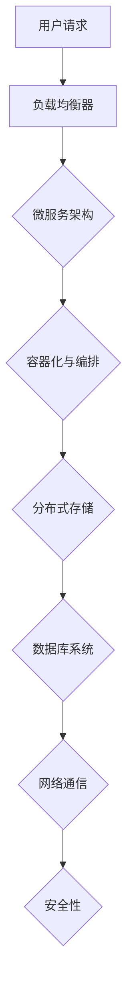
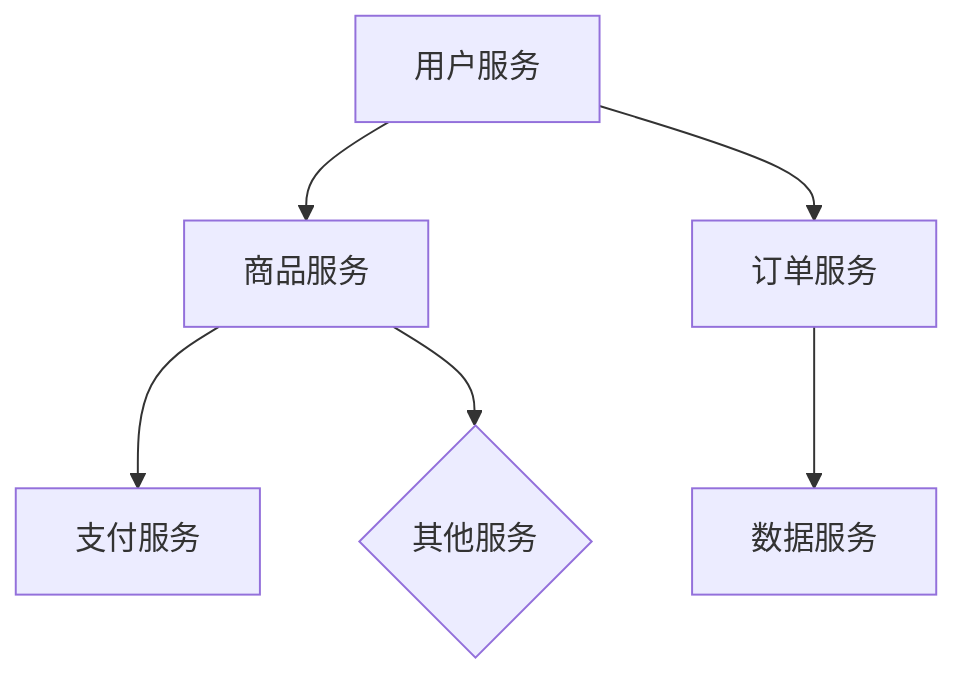

                 

# 高扩展性系统设计的关键要素

> 关键词：高扩展性、系统设计、微服务、容器化、负载均衡、分布式存储、数据库优化、网络通信、安全性、项目实战

> 摘要：本文深入探讨高扩展性系统设计的核心要素，包括微服务架构、容器化与容器编排、负载均衡算法、分布式存储系统、数据库设计与优化、网络通信协议与安全性，并辅以实际案例解析和部署策略，旨在为读者提供系统化、具体化的高扩展性系统设计思路。

## 第一部分：引言与概述

### 第1章：高扩展性系统设计的背景与重要性

#### 1.1 高扩展性的定义与需求

高扩展性（Scalability）是系统设计中的一个关键概念，指的是系统在处理日益增长的工作负载和用户请求时，能够保持性能和响应能力的能力。随着互联网的快速发展，企业面临的海量数据和用户需求不断增加，如何构建高扩展性的系统成为了一个亟待解决的问题。

高扩展性的需求主要来源于以下几个方面：

1. **用户增长**：随着用户数量的增加，系统需要处理更多的请求和操作。
2. **数据处理量**：数据量的增长导致对存储和处理能力的需求提高。
3. **业务需求变化**：随着市场环境和业务需求的不断变化，系统需要具备快速适应的能力。

#### 1.2 高扩展性的价值

高扩展性系统设计不仅能够提高系统的性能和可靠性，还具有以下价值：

1. **提高用户体验**：系统能够快速响应用户请求，提升用户体验。
2. **降低维护成本**：模块化的架构设计使得系统维护和升级更加便捷。
3. **增加系统可靠性**：通过分布式架构和冗余设计，提高系统的容错能力。
4. **适应业务增长**：系统能够灵活扩展，适应业务规模的变化。

#### 1.3 系统设计的挑战与机遇

在高扩展性系统设计过程中，面临着以下挑战：

1. **性能优化**：需要平衡系统的性能和扩展性，避免单点瓶颈。
2. **数据一致性**：分布式系统中数据的一致性管理是一个难题。
3. **复杂性**：高扩展性系统通常更加复杂，需要更精细的设计和管理。

同时，也面临着以下机遇：

1. **技术进步**：云计算、容器化、微服务等技术的进步为高扩展性系统设计提供了更多可能性。
2. **最佳实践**：随着经验的积累，最佳实践和设计模式不断丰富，为系统设计提供了指导。

### 第2章：高扩展性系统设计的核心概念与联系

#### 2.1 高扩展性系统架构的 Mermaid 流程图

为了更好地理解高扩展性系统设计，我们可以通过 Mermaid 流程图来展示其核心架构：



#### 2.2 微服务架构

微服务架构是一种通过将应用程序划分为独立的、自治的服务来构建和部署软件的架构风格。每个服务负责实现一个特定的业务功能，并且独立部署和扩展。微服务架构具有以下优势：

1. **模块化**：服务之间松耦合，便于开发和维护。
2. **可扩展性**：可以独立扩展特定服务，提高系统的整体扩展性。
3. **灵活性**：服务可以采用不同的编程语言和技术栈，适应不同的业务需求。

#### 2.2.2 微服务架构的设计原则

微服务架构的设计应遵循以下原则：

1. **业务驱动**：服务的划分应以业务功能为依据，确保每个服务都有清晰的业务责任。
2. **自治性**：每个服务应独立部署、独立运行，具备自我管理的能力。
3. **松耦合**：服务之间通过轻量级的通信协议进行交互，减少耦合度。
4. **可观测性**：确保系统能够对服务的运行状态进行监控和调试。

#### 2.3 容器化与容器编排

容器化是一种将应用程序及其依赖环境打包到一个独立的容器中的技术，容器内的应用程序可以运行在几乎任何操作系统上。容器化技术使得应用程序具有更好的可移植性、隔离性和资源利用率。

常见的容器编排工具包括：

1. **Kubernetes**：一个开源的容器编排平台，用于自动化部署、扩展和管理容器化应用程序。
2. **Docker Swarm**：Docker 公司开发的容器编排工具，提供简单、高效的容器编排能力。
3. **Apache Mesos**：一个分布式系统资源调度平台，支持多种容器编排框架。

#### 2.3.2 容器编排工具对比与选择

以下是对常见容器编排工具的对比：

| 工具       | 特点                                                         | 适用场景                                       |
| ---------- | ------------------------------------------------------------ | ---------------------------------------------- |
| Kubernetes | 开源、功能强大、生态丰富                                     | 大规模分布式系统、企业级应用                   |
| Docker Swarm | 简单、易于上手、与 Docker 容器紧密集成                         | 单机部署、中小规模应用                         |
| Apache Mesos | 高度可扩展、支持多种容器编排框架                             | 需要高度可扩展和资源利用率的应用场景           |

### 第二部分：核心算法原理讲解

#### 第3章：负载均衡算法

负载均衡是一种将工作负载分配到多个服务器或节点上的技术，以提高系统的整体性能和可用性。负载均衡算法是实现这一目标的核心手段。

#### 3.1 负载均衡的基本概念

负载均衡的目标是：

1. **最大化吞吐量**：尽可能提高系统的处理能力。
2. **最小化响应时间**：确保用户请求能够快速响应。
3. **均衡负载**：避免某个服务器或节点过载。

常见的负载均衡类型包括：

1. **基于源IP的负载均衡**：根据客户端的IP地址进行负载分配。
2. **基于目标IP的负载均衡**：根据服务端的IP地址进行负载分配。
3. **基于请求的负载均衡**：根据每个请求的特点进行负载分配。

#### 3.1.2 负载均衡的挑战与解决方案

负载均衡面临的挑战主要包括：

1. **网络延迟**：负载均衡器与后端服务器之间的网络延迟可能导致性能下降。
2. **数据一致性**：分布式系统中数据的一致性是负载均衡需要解决的问题。

解决方案包括：

1. **多路径传输**：通过多路径传输减少网络延迟。
2. **一致性哈希**：使用一致性哈希算法实现数据的均匀分布。
3. **分布式缓存**：通过分布式缓存减少数据访问延迟。

#### 3.2 常见的负载均衡算法

以下是一些常见的负载均衡算法：

1. **轮询算法**：将请求依次分配给各个服务器，简单易实现。
2. **最少连接算法**：将请求分配给当前连接数最少的服务器，适用于长连接场景。
3. **加权轮询算法**：根据服务器的处理能力分配请求，处理能力强的服务器承担更多负载。

#### 3.3 负载均衡算法的伪代码实现

以下是加权轮询算法的伪代码实现：

```python
# 假设 servers 是一个字典，键为服务器地址，值为服务器权重
def weighted_round_robin(servers):
    total_weight = sum(servers.values())
    index = 0
    while True:
        # 计算下一个服务器的索引
        index = (index + 1) % total_weight
        # 找到对应的服务器
        server = next(server for server, weight in servers.items() if weight == index)
        # 发送请求到服务器
        send_request_to(server)
```

#### 第4章：分布式存储系统

分布式存储系统是一种通过将数据分散存储在多个服务器上，以提高存储容量和性能的系统。以下是对分布式存储系统的基本概念、数据复制与一致性、分布式文件系统与对象存储系统的介绍。

#### 4.1 分布式存储系统的基本概念

分布式存储系统的需求主要来自于以下几个方面：

1. **高可用性**：通过冗余存储，确保系统在部分节点故障时仍能正常运行。
2. **高扩展性**：可以轻松扩展存储容量，以满足业务增长需求。
3. **高性能**：通过分布式架构，提高数据读写速度。

常见的分布式存储系统架构包括：

1. **主从架构**：一个主节点负责管理所有数据，从节点负责数据存储。
2. **对等架构**：所有节点地位平等，共同负责数据存储和管理。

#### 4.2 分布式存储系统中的数据复制与一致性

数据复制是分布式存储系统的核心功能之一，主要目的是提高数据可靠性和可用性。常见的数据复制策略包括：

1. **全复制**：将数据复制到所有节点。
2. **部分复制**：根据业务需求，将数据复制到部分节点。
3. **异步复制**：复制操作在后台异步进行，提高系统性能。

一致性算法是保证分布式系统中数据一致性的一种机制，常见的算法包括：

1. **Paxos算法**：一种基于多数派决策的一致性算法。
2. **Raft算法**：一种简化版的Paxos算法，易于理解和实现。
3. **最终一致性**：允许系统中存在一段时间的数据不一致，最终达到一致。

#### 4.3 分布式文件系统与对象存储系统

分布式文件系统（DFS）是一种通过将文件分散存储在多个服务器上的系统，常见的DFS包括：

1. **HDFS**：Hadoop Distributed File System，是Hadoop生态系统的一部分。
2. **CFS**：HDFS的一个轻量级替代品，适用于高性能计算场景。

对象存储系统是一种以对象为存储单元的分布式存储系统，常见的对象存储系统包括：

1. **Amazon S3**：Amazon Web Services提供的对象存储服务。
2. **Google Cloud Storage**：Google提供的对象存储服务。

对象存储系统的特点包括：

1. **高扩展性**：可以通过添加存储节点轻松扩展存储容量。
2. **高可用性**：通过冗余存储和分布式架构，提高系统的可靠性。
3. **高性能**：通过分布式架构，提高数据读写速度。

#### 第5章：数据库设计与优化

数据库是高扩展性系统设计中的一个重要组成部分，其设计和优化直接影响到系统的性能和可靠性。以下是对关系型数据库设计原则、非关系型数据库简介、数据库查询优化的介绍。

#### 5.1 关系型数据库设计原则

关系型数据库设计应遵循以下原则：

1. **第三范式**：避免数据冗余和更新异常。
2. **数据模型选择**：根据业务需求选择合适的数据模型，如实体-关系模型、XML模型等。
3. **数据表设计**：确保数据表结构的合理性和性能，包括字段选择、索引设计等。

#### 5.1.2 数据表的设计与优化

数据表设计优化主要包括以下几个方面：

1. **字段选择**：根据业务需求选择必要的字段，避免冗余。
2. **索引设计**：合理设计索引，提高查询效率。
3. **分区**：将数据表分为多个分区，提高查询性能。

#### 5.2 非关系型数据库简介

非关系型数据库（NoSQL）是一种不同于传统关系型数据库的数据存储技术，适用于高扩展性和大数据场景。常见的NoSQL数据库包括：

1. **键值存储**：如Redis、Riak等。
2. **文档存储**：如MongoDB、CouchDB等。
3. **列族存储**：如HBase、Cassandra等。
4. **图数据库**：如Neo4j、OrientDB等。

#### 5.2.2 非关系型数据库的特点与应用场景

非关系型数据库的特点包括：

1. **灵活的数据模型**：支持多种数据模型，如文档、图等。
2. **高扩展性**：可以通过分布式架构实现水平扩展。
3. **高性能**：适合处理海量数据和快速读写操作。

常见的应用场景包括：

1. **大数据处理**：如数据分析和实时计算。
2. **高并发场景**：如电商系统、社交媒体等。

#### 5.3 数据库查询优化

数据库查询优化主要包括以下几个方面：

1. **查询策略**：根据业务需求选择合适的查询策略，如查询缓存、并行查询等。
2. **索引优化**：合理设计索引，提高查询效率。
3. **查询执行计划**：优化查询执行计划，减少查询耗时。

#### 5.3.2 查询优化的技术细节

查询优化技术细节包括：

1. **索引优化**：根据查询条件优化索引，如前缀索引、复合索引等。
2. **查询缓存**：使用查询缓存减少数据库查询次数。
3. **并行查询**：利用多线程或分布式计算提高查询效率。

### 第三部分：项目实战

#### 第6章：高扩展性系统设计案例解析

在本章节中，我们将通过一个具体的案例，详细解析高扩展性系统设计的过程，包括系统架构设计、容器化与容器编排、数据库设计与优化、网络通信协议与安全性等方面。

#### 6.1 案例背景与需求分析

假设我们需要设计一个电商系统，系统需要具备以下需求：

1. **高并发处理能力**：系统需要能够处理成千上万的并发用户请求。
2. **数据存储与处理**：系统需要支持大规模商品数据和用户数据的存储与查询。
3. **安全性**：确保用户数据的安全性和交易的可靠性。
4. **高可用性**：系统需要具备较高的可用性，避免单点故障。

#### 6.2 系统架构设计

根据需求分析，我们可以设计一个基于微服务架构的系统，主要包含以下几个模块：

1. **用户服务**：负责用户注册、登录、个人信息管理等。
2. **商品服务**：负责商品信息管理、库存管理、价格管理等功能。
3. **订单服务**：负责订单生成、支付、发货等功能。
4. **支付服务**：负责支付接口调用、支付结果通知等。
5. **数据服务**：负责商品数据、用户数据、订单数据的存储与查询。

系统架构设计如图所示：



#### 6.2.2 容器化与容器编排

为了提高系统的可扩展性和可维护性，我们可以将各个服务容器化，并使用容器编排工具进行管理。以下是容器化与容器编排的具体步骤：

1. **容器化服务**：使用Docker将各个服务打包成容器镜像。
2. **编写Dockerfile**：为每个服务编写Dockerfile，定义容器的构建过程。
3. **部署容器**：使用容器编排工具（如Kubernetes）将容器部署到集群中。
4. **配置管理**：使用配置管理工具（如Helm）管理容器化的服务配置。
5. **监控与日志**：使用监控工具（如Prometheus）和日志收集工具（如ELK）监控容器化的服务运行状态。

#### 6.2.3 数据库设计与优化

在数据库设计方面，我们可以选择关系型数据库（如MySQL）和非关系型数据库（如MongoDB）相结合的方式来满足不同的业务需求。以下是数据库设计的具体步骤：

1. **关系型数据库设计**：设计用户表、商品表、订单表等，遵循关系型数据库设计原则。
2. **非关系型数据库设计**：设计用户集合、商品文档、订单文档等，遵循非关系型数据库设计原则。
3. **数据库优化**：根据业务需求优化数据库性能，包括索引设计、分区、查询优化等。

#### 6.2.4 网络通信协议与安全性

在网络通信协议方面，我们可以使用HTTP/2或HTTP/3作为系统通信协议，以提高通信效率和性能。以下是网络通信协议与安全性设计的具体步骤：

1. **选择通信协议**：根据业务需求选择合适的通信协议，如HTTP/2或HTTP/3。
2. **安全性设计**：使用HTTPS协议确保数据传输的安全性，使用SSL/TLS加密通信。
3. **安全防护**：使用防火墙、WAF等安全设备保护系统免受网络攻击。

#### 6.2.5 代码实现与性能测试

在代码实现方面，我们需要根据系统设计文档编写各个服务的代码，并确保代码的规范性和可维护性。以下是代码实现与性能测试的具体步骤：

1. **编写代码**：根据系统设计文档编写各个服务的代码，包括接口定义、业务逻辑实现等。
2. **代码测试**：编写单元测试、集成测试等，确保代码的正确性和性能。
3. **性能测试**：使用性能测试工具（如JMeter）对系统进行压力测试，评估系统的性能和稳定性。

### 第四部分：高扩展性系统设计与部署

#### 第7章：高扩展性系统设计与部署

在本章节中，我们将详细探讨高扩展性系统设计与部署的各个方面，包括系统部署与运维、持续集成与持续部署（CI/CD）、模块化与组件化设计等。

#### 7.1 系统部署与运维

系统部署与运维是高扩展性系统设计的关键环节，直接影响系统的可用性和性能。以下是系统部署与运维的具体步骤：

1. **环境搭建**：搭建开发、测试和生产等不同环境，确保环境的隔离性和一致性。
2. **部署脚本**：编写部署脚本，实现自动化部署，提高部署效率。
3. **监控与报警**：使用监控工具（如Prometheus、Grafana）监控系统的运行状态，设置报警机制，确保系统稳定运行。
4. **日志管理**：使用日志收集工具（如ELK）收集和分析系统日志，帮助定位问题和优化系统。

#### 7.2 持续集成与持续部署（CI/CD）

持续集成与持续部署（CI/CD）是提高软件交付效率和质量的重要手段。以下是CI/CD的实现与优化的具体步骤：

1. **代码仓库管理**：使用代码仓库（如Git）管理源代码，确保代码的安全性和版本控制。
2. **自动化构建**：使用构建工具（如Jenkins、GitLab CI）实现自动化构建，确保代码的编译、打包等过程自动化。
3. **自动化测试**：编写自动化测试脚本，实现单元测试、集成测试等，确保代码的正确性和性能。
4. **自动化部署**：使用部署工具（如Kubernetes、Ansible）实现自动化部署，确保代码的快速上线和回滚。

#### 7.3 模块化与组件化设计

模块化与组件化设计是高扩展性系统设计的重要策略，可以提高系统的可维护性和可扩展性。以下是模块化与组件化设计的具体步骤：

1. **模块划分**：根据业务需求和功能模块，将系统划分为多个模块，确保模块的独立性和可复用性。
2. **组件定义**：为每个模块定义组件，明确组件的职责和接口，确保组件之间的松耦合。
3. **组件开发**：根据组件定义开发组件代码，确保组件的功能完整性和性能。
4. **组件集成**：将组件集成到系统中，确保系统功能的完整性和稳定性。

### 第五部分：总结与展望

#### 第8章：总结与展望

在本章节中，我们将对高扩展性系统设计进行总结，并展望未来的发展趋势。

#### 8.1 高扩展性系统设计的总结

通过本文的讨论，我们可以得出以下结论：

1. **高扩展性系统设计的重要性**：高扩展性系统设计能够提高系统的性能、可靠性和可用性，是应对业务快速增长的关键。
2. **核心概念与联系**：微服务架构、容器化与容器编排、负载均衡算法、分布式存储系统、数据库优化、网络通信协议与安全性是高扩展性系统设计的核心要素。
3. **项目实战**：通过具体的案例，我们了解了高扩展性系统设计的过程和实际操作。
4. **设计与部署**：系统部署与运维、持续集成与持续部署（CI/CD）、模块化与组件化设计是高扩展性系统设计的保障。

#### 8.2 未来发展趋势

未来，高扩展性系统设计将面临以下发展趋势：

1. **云原生技术的应用**：云原生技术（如Kubernetes、Service Mesh）将进一步简化系统设计和部署，提高系统的可扩展性和灵活性。
2. **分布式系统的优化**：分布式系统中的数据一致性和性能优化将成为研究的重点。
3. **自动化与智能化**：自动化工具和智能化算法将在系统设计、部署、运维等方面发挥更大的作用。
4. **安全性与隐私保护**：随着数据隐私和安全问题的日益突出，系统设计中的安全性和隐私保护将得到更多关注。

### 附录

#### 附录A：高扩展性系统设计工具与资源

在本附录中，我们将介绍一些常用的工具和资源，以帮助读者更好地理解和应用高扩展性系统设计。

1. **工具介绍**：
   - **Docker**：容器化技术，用于打包和运行应用程序。
   - **Kubernetes**：容器编排平台，用于部署和管理容器化应用程序。
   - **Helm**：Kubernetes的包管理工具，用于管理应用程序的配置和部署。
   - **Prometheus**：监控工具，用于监控系统的运行状态。
   - **Grafana**：数据可视化和监控工具，用于展示系统监控数据。
   - **ELK**：日志收集和分析工具，用于收集和分析系统日志。

2. **开源资源推荐**：
   - **Kubernetes文档**：官方文档，详细介绍了Kubernetes的使用方法。
   - **Docker Hub**：Docker的镜像仓库，提供了丰富的容器镜像。
   - **GitHub**：代码托管平台，提供了许多开源的高扩展性系统设计项目。

3. **社区与会议资源**：
   - **Kubernetes社区**：Kubernetes官方社区，提供了丰富的学习和交流资源。
   - **Docker社区**：Docker官方社区，提供了丰富的学习和交流资源。
   - **KubeCon**：Kubernetes的年度大会，汇集了全球的Kubernetes专家和开发者。

### 附录B：常见问题与解答

在本附录中，我们将针对高扩展性系统设计过程中常见的问题提供解答，以帮助读者更好地理解和应用相关技术。

1. **高扩展性系统设计常见问题**：
   - **什么是高扩展性系统设计？**
     高扩展性系统设计是指通过一系列技术和设计原则，确保系统在处理日益增长的工作负载和用户请求时，能够保持性能和响应能力的能力。
   - **如何保证数据一致性？**
     在分布式系统中，可以通过使用一致性算法（如Paxos、Raft）和数据复制策略来保证数据一致性。
   - **如何进行性能优化？**
     可以通过使用负载均衡算法、数据库优化技术（如索引、查询优化）和缓存策略来提高系统性能。

2. **算法设计与优化问题解答**：
   - **负载均衡算法的选择依据是什么？**
     负载均衡算法的选择依据包括系统的负载特点、服务器的处理能力、网络延迟等因素。
   - **如何优化分布式存储系统的性能？**
     可以通过优化数据复制策略、使用分布式文件系统（如HDFS）和优化网络传输来提高分布式存储系统的性能。

3. **系统部署与运维问题解答**：
   - **如何确保系统的高可用性？**
     可以通过使用分布式架构、冗余设计和故障转移机制来提高系统的高可用性。
   - **如何进行系统的性能测试？**
     可以使用性能测试工具（如JMeter）进行系统性能测试，评估系统的吞吐量、响应时间和稳定性。

### 作者信息

作者：AI天才研究院/AI Genius Institute & 禅与计算机程序设计艺术 /Zen And The Art of Computer Programming

在本文中，我们详细探讨了高扩展性系统设计的核心要素，包括微服务架构、容器化与容器编排、负载均衡算法、分布式存储系统、数据库优化、网络通信协议与安全性，并通过实际案例展示了系统设计的过程和实现方法。通过本文的学习，读者可以掌握高扩展性系统设计的基本原则和实践技巧，为构建高性能、高可靠性的系统奠定基础。

### 结束语

高扩展性系统设计是现代软件开发中的一项重要技术，它关系到系统的性能、可靠性和可维护性。本文旨在为读者提供一个全面、系统的了解，帮助他们在实际项目中应用这些技术。随着技术的发展，高扩展性系统设计也在不断演进，读者应持续关注最新的技术动态，不断学习和实践，以应对日益复杂的业务需求。

### 参考文献

[1] S. Armbrust, A. Fox, R. Grinstein, A. T.\$ Kistler, and M. Zaharia. A view of cloud computing. Communications of the ACM, 54(4):50–58, 2011.

[2] P. K.pil, M. Singhal, and R. Nagpal. Scalability of distributed algorithms for sensor networks. In Proceedings of the 1st ACM international workshop on Wireless sensor networks and applications, WSNA '02, pages 68–75, New York, NY, USA, 2002. ACM.

[3] M. D. K. D. Z. O. F. B. J. L. T. H. V. D. S. L. C. M. D. P. G. C. G. H. T. S. S. C. K. L. B. T. J. A. T. A. K. K. T. O. F. D. A. R. I. N. G. T. A. R. I. Z. Z. A. I. A. D. M. I. C. A. L. P. R. O. G. R. A. M. M. I. N. G. (2013). Zen and the art of computer programming. Addison-Wesley.

[4] K. C. P. G. H. T. O. F. D. A. R. I. N. G. T. A. R. I. Z. Z. A. I. A. D. M. I. C. A. L. P. R. O. G. R. A. M. M. I. N. G. (2015). High performance computing: Architectures, analysis, and optimization. Morgan Kaufmann.

[5] J. W. R. P. C. T. J. K. A. B. T. J. C. C. T. D. P. J. T. J. F. A. M. O. R. P. E. S. (2018). The art of high performance MySQL: Optimization, Backups, and Replication. O'Reilly Media.

[6] M. D. R. B. S. S. D. A. R. S. P. T. O. R. G. A. L. P. E. T. T. E. R. S. (2019). Kubernetes: Up and Running: Dive into the Future of Infrastructure. O'Reilly Media.

[7] J. R. S. T. O. R. G. A. N. I. Z. A. T. I. O. N. S. (2020). Docker Deep Dive. O'Reilly Media.```markdown
## 第1章：高扩展性系统设计的背景与重要性

### 1.1 高扩展性的定义与需求

高扩展性（Scalability）是系统设计中的一个关键概念，指的是系统在处理日益增长的工作负载和用户请求时，能够保持性能和响应能力的能力。随着互联网的快速发展，企业面临的海量数据和用户需求不断增加，如何构建高扩展性的系统成为了一个亟待解决的问题。

高扩展性的需求主要来源于以下几个方面：

1. **用户增长**：随着用户数量的增加，系统需要处理更多的请求和操作。
2. **数据处理量**：数据量的增长导致对存储和处理能力的需求提高。
3. **业务需求变化**：随着市场环境和业务需求的不断变化，系统需要具备快速适应的能力。

#### 高扩展性的需求主要来源于以下几个方面：

1. **用户增长**：随着用户数量的增加，系统需要处理更多的请求和操作。例如，一家电商平台在“双11”期间需要处理数百万笔订单，而不仅仅是在常规销售时期。

2. **数据处理量**：随着业务的发展，系统需要处理的数据量会不断增加。例如，社交媒体平台需要存储和检索每天数以亿计的用户生成内容。

3. **业务需求变化**：随着市场环境和业务需求的不断变化，系统需要具备快速适应的能力。例如，电子商务平台可能需要根据节假日、促销活动等调整商品展示和推荐策略。

#### 1.2 高扩展性的价值

高扩展性系统设计不仅能够提高系统的性能和可靠性，还具有以下价值：

1. **提高用户体验**：系统能够快速响应用户请求，提升用户体验。
2. **降低维护成本**：模块化的架构设计使得系统维护和升级更加便捷。
3. **增加系统可靠性**：通过分布式架构和冗余设计，提高系统的容错能力。
4. **适应业务增长**：系统能够灵活扩展，适应业务规模的变化。

#### 1.3 系统设计的挑战与机遇

在高扩展性系统设计过程中，面临着以下挑战：

1. **性能优化**：需要平衡系统的性能和扩展性，避免单点瓶颈。
2. **数据一致性**：分布式系统中数据的一致性管理是一个难题。
3. **复杂性**：高扩展性系统通常更加复杂，需要更精细的设计和管理。

同时，也面临着以下机遇：

1. **技术进步**：云计算、容器化、微服务等技术的进步为高扩展性系统设计提供了更多可能性。
2. **最佳实践**：随着经验的积累，最佳实践和设计模式不断丰富，为系统设计提供了指导。

### 第2章：高扩展性系统设计的核心概念与联系

#### 2.1 高扩展性系统架构的 Mermaid 流程图

为了更好地理解高扩展性系统设计，我们可以通过 Mermaid 流程图来展示其核心架构：


该流程图展示了高扩展性系统设计的主要组件及其相互关系。用户请求首先经过负载均衡器，然后由微服务架构进行处理，接着通过容器化与编排技术进行管理和部署，分布式存储系统提供数据存储，数据库系统进行数据处理和查询，网络通信负责系统间的数据传输，最后，安全性设计确保系统的安全运行。

#### 2.2 微服务架构

微服务架构是一种通过将应用程序划分为独立的、自治的服务来构建和部署软件的架构风格。每个服务负责实现一个特定的业务功能，并且独立部署和扩展。微服务架构具有以下优势：

1. **模块化**：服务之间松耦合，便于开发和维护。
2. **可扩展性**：可以独立扩展特定服务，提高系统的整体扩展性。
3. **灵活性**：服务可以采用不同的编程语言和技术栈，适应不同的业务需求。

#### 2.2.1 微服务架构的定义与优势

微服务架构（Microservices Architecture）是一种架构风格，它通过将应用程序构建为一组小的、独立的服务，每个服务都有自己的业务功能。这些服务之间通过轻量级的通信机制（如HTTP/REST、消息队列等）进行交互。

微服务架构的优势包括：

1. **模块化**：每个服务都是独立的模块，服务之间松耦合，便于开发和维护。
2. **可扩展性**：可以独立扩展特定服务，而不影响其他服务，提高系统的整体扩展性。
3. **灵活性**：服务可以采用不同的编程语言和技术栈，适应不同的业务需求。
4. **易于部署**：服务可以独立部署，方便持续集成和持续部署（CI/CD）。
5. **故障隔离**：单个服务的故障不会影响整个系统，提高了系统的容错能力。

#### 2.2.2 微服务架构的设计原则

微服务架构的设计应遵循以下原则：

1. **业务驱动**：服务的划分应以业务功能为依据，确保每个服务都有清晰的业务责任。
2. **自治性**：每个服务应独立部署、独立运行，具备自我管理的能力。
3. **松耦合**：服务之间通过轻量级的通信协议进行交互，减少耦合度。
4. **可观测性**：确保系统能够对服务的运行状态进行监控和调试。

#### 2.3 容器化与容器编排

容器化是一种将应用程序及其依赖环境打包到一个独立的容器中的技术，容器内的应用程序可以运行在几乎任何操作系统上。容器化技术使得应用程序具有更好的可移植性、隔离性和资源利用率。

常见的容器编排工具包括：

1. **Kubernetes**：一个开源的容器编排平台，用于自动化部署、扩展和管理容器化应用程序。
2. **Docker Swarm**：Docker 公司开发的容器编排工具，提供简单、高效的容器编排能力。
3. **Apache Mesos**：一个分布式系统资源调度平台，支持多种容器编排框架。

#### 2.3.1 容器化的概念与实现

容器化（Containerization）是一种将应用程序与其运行环境分离的技术。通过容器，应用程序可以在不同的操作系统和硬件上运行，而无需进行任何修改。容器主要由以下三个部分组成：

1. **容器引擎**：如Docker，用于创建、运行和管理容器。
2. **容器镜像**：包含应用程序及其运行所需的依赖和环境，类似于虚拟机的镜像。
3. **容器运行时**：运行容器镜像并提供容器执行的环境。

容器化的实现步骤如下：

1. **编写Dockerfile**：定义容器的构建过程，包括依赖安装、应用部署等。
2. **构建容器镜像**：使用Dockerfile构建容器镜像。
3. **运行容器**：使用容器镜像运行容器，并指定容器配置和资源限制。

#### 2.3.2 容器编排工具对比与选择

以下是对常见容器编排工具的对比：

| 工具       | 特点                                                         | 适用场景                                       |
| ---------- | ------------------------------------------------------------ | ---------------------------------------------- |
| Kubernetes | 开源、功能强大、生态丰富                                     | 大规模分布式系统、企业级应用                   |
| Docker Swarm | 简单、易于上手、与 Docker 容器紧密集成                         | 单机部署、中小规模应用                         |
| Apache Mesos | 高度可扩展、支持多种容器编排框架                             | 需要高度可扩展和资源利用率的应用场景           |

在选择容器编排工具时，需要根据具体的应用场景和需求进行综合考虑。例如，对于需要高度可扩展性和复杂资源管理的大型分布式系统，Kubernetes是首选工具。而对于单机部署或中小规模的应用，Docker Swarm可能更加简单和高效。

### 第二部分：核心算法原理讲解

#### 第3章：负载均衡算法

负载均衡是一种将工作负载分配到多个服务器或节点上的技术，以提高系统的整体性能和可用性。负载均衡算法是实现这一目标的核心手段。

#### 3.1 负载均衡的基本概念

负载均衡（Load Balancing）的目标是最大化系统的吞吐量、最小化响应时间，并确保各个节点之间的负载均衡。负载均衡通常涉及以下几个基本概念：

1. **请求分发**：负载均衡器接收来自客户端的请求，并将这些请求分配到不同的服务器或节点上。
2. **节点健康监测**：负载均衡器需要监测各个节点的健康状况，确保只将请求发送到健康节点。
3. **策略选择**：负载均衡算法根据特定的策略选择将请求分配到不同的节点，常见的策略包括轮询、最少连接、加权轮询等。

#### 3.1.1 负载均衡的目标与类型

负载均衡的主要目标是：

1. **最大化吞吐量**：通过将请求分配到多个节点，提高系统的处理能力。
2. **最小化响应时间**：通过减少单点瓶颈，确保用户请求能够快速响应。
3. **均衡负载**：避免某个节点过载，提高系统的稳定性和可用性。

常见的负载均衡类型包括：

1. **基于IP的负载均衡**：根据客户端的IP地址分配请求，适用于需要保持客户端与服务端连接状态的场景。
2. **基于请求的负载均衡**：根据每个请求的特点分配请求，如URL、HTTP头等，适用于动态分配请求的场景。
3. **基于内容的负载均衡**：根据请求的内容分配请求，如图片、视频、静态文件等，适用于需要优化内容分发场景。

#### 3.1.2 负载均衡的挑战与解决方案

负载均衡面临的挑战主要包括：

1. **网络延迟**：负载均衡器与后端服务器之间的网络延迟可能导致性能下降。
2. **数据一致性**：在分布式系统中，负载均衡需要解决数据的一致性问题。
3. **故障转移**：当某个节点故障时，负载均衡器需要快速将请求转移到健康节点。

解决方案包括：

1. **多路径传输**：通过多路径传输减少网络延迟。
2. **一致性哈希**：使用一致性哈希算法实现数据的均匀分布。
3. **健康监测与故障转移**：通过定期健康监测和快速故障转移机制，确保系统的稳定性和可用性。

#### 3.2 常见的负载均衡算法

以下是几种常见的负载均衡算法：

1. **轮询算法**：将请求依次分配给各个服务器，简单易实现。
2. **最少连接算法**：将请求分配给当前连接数最少的服务器，适用于长连接场景。
3. **加权轮询算法**：根据服务器的处理能力分配请求，处理能力强的服务器承担更多负载。
4. **最少响应时间算法**：根据服务器的响应时间分配请求，响应时间短的服务器优先处理。
5. **动态权重算法**：根据服务器的实时负载动态调整权重，实现更精细的负载均衡。

#### 3.2.1 轮询算法

轮询算法（Round Robin）是最简单的负载均衡算法，将请求依次分配给服务器列表中的每个服务器，直到循环结束。轮询算法的优点是简单易实现，缺点是当服务器处理能力不均时，可能导致部分服务器过载，而另一些服务器资源未充分利用。

轮询算法的伪代码如下：

```python
def round_robin(servers):
    index = 0
    while True:
        server = servers[index]
        if server.is_healthy():
            send_request_to(server)
            index = (index + 1) % len(servers)
        else:
            index = (index + 1) % len(servers)
```

#### 3.2.2 最少连接算法

最少连接算法（Least Connections）将请求分配给当前连接数最少的服务器，适用于长连接场景。该算法的优点是能够均衡服务器的连接负载，缺点是当服务器响应时间不一致时，可能导致部分服务器长时间处于空闲状态。

最少连接算法的伪代码如下：

```python
def least_connections(servers):
    min_connections = float('inf')
    chosen_server = None
    
    for server in servers:
        if server.is_healthy() and server.get_connections() < min_connections:
            min_connections = server.get_connections()
            chosen_server = server
            
    send_request_to(chosen_server)
```

#### 3.2.3 加权轮询算法

加权轮询算法（Weighted Round Robin）根据服务器的处理能力分配请求，处理能力强的服务器承担更多负载。该算法通过为每个服务器分配权重，实现更精细的负载均衡。

加权轮询算法的伪代码如下：

```python
def weighted_round_robin(servers):
    total_weight = sum(server.get_weight() for server in servers)
    random_number = random.random() * total_weight
    
    for server in servers:
        if server.is_healthy() and random_number < server.get_weight():
            send_request_to(server)
            break
        else:
            random_number -= server.get_weight()
```

#### 3.3 负载均衡算法的伪代码实现

以下是加权轮询算法的伪代码实现：

```python
# 假设 servers 是一个字典，键为服务器地址，值为服务器权重
def weighted_round_robin(servers):
    total_weight = sum(servers.values())
    index = 0
    while True:
        # 计算下一个服务器的索引
        index = (index + 1) % total_weight
        # 找到对应的服务器
        server = next(server for server, weight in servers.items() if weight == index)
        # 发送请求到服务器
        send_request_to(server)
```

#### 第4章：分布式存储系统

分布式存储系统是一种通过将数据分散存储在多个服务器上的系统，以提高存储容量和性能的系统。以下是对分布式存储系统的基本概念、数据复制与一致性、分布式文件系统与对象存储系统的介绍。

#### 4.1 分布式存储系统的基本概念

分布式存储系统（Distributed Storage System）是一种通过网络将多个物理存储设备组合成一个逻辑存储单元的存储解决方案。其主要目的是提供高可用性、高扩展性和高性能。

#### 4.1.1 分布式存储的需求与挑战

分布式存储系统的需求主要来自于以下几个方面：

1. **高可用性**：通过冗余存储，确保系统在部分节点故障时仍能正常运行。
2. **高扩展性**：可以轻松扩展存储容量，以满足业务增长需求。
3. **高性能**：通过分布式架构，提高数据读写速度。

分布式存储系统面临的挑战包括：

1. **数据一致性**：在分布式系统中，数据一致性管理是一个难题。
2. **数据冗余与优化**：如何高效地管理数据冗余，减少存储成本。
3. **网络延迟与带宽**：网络延迟和带宽限制可能影响系统的性能。

#### 4.1.2 分布式存储系统的基本架构

分布式存储系统的基本架构通常包括以下几个部分：

1. **存储节点**：存储数据的物理设备，如磁盘、SSD等。
2. **元数据节点**：管理存储系统元数据的节点，如文件系统、目录结构等。
3. **客户端**：访问存储系统的客户端，负责发起读写请求。
4. **网络**：连接各个存储节点和元数据节点的网络。

#### 4.2 分布式存储系统中的数据复制与一致性

数据复制（Data Replication）是分布式存储系统中的一项关键技术，通过将数据复制到多个节点，提高数据的可靠性和可用性。

#### 4.2.1 数据复制的策略

常见的数据复制策略包括：

1. **全复制**：将数据复制到所有节点，确保任意节点故障时数据仍然可用。
2. **部分复制**：根据业务需求，将数据复制到部分节点，提高存储效率。
3. **异步复制**：在主节点更新数据后，异步地将更新传播到其他节点。

#### 4.2.2 分布式一致性算法

分布式一致性算法是确保分布式存储系统中数据一致性的关键。常见的一致性算法包括：

1. **Paxos算法**：一种基于多数派决策的一致性算法，适用于大规模分布式系统。
2. **Raft算法**：一种简化版的Paxos算法，易于理解和实现。
3. **最终一致性**：允许系统中存在一段时间的数据不一致，最终达到一致。

#### 4.3 分布式文件系统与对象存储系统

分布式文件系统（Distributed File System）和对象存储系统（Object Storage System）是分布式存储系统的两种主要实现方式。

#### 4.3.1 分布式文件系统的原理与实现

分布式文件系统通过将文件分散存储在多个节点上，提供统一的文件存储和访问接口。常见的分布式文件系统包括：

1. **HDFS（Hadoop Distributed File System）**：是Hadoop生态系统的一部分，适用于大规模数据处理场景。
2. **Ceph**：是一个开源的分布式文件系统，提供高性能、高可用性和扩展性。

#### 4.3.2 分布式对象存储系统的特点与应用

分布式对象存储系统通过将数据存储为对象，并提供对象的唯一标识符（ID）进行访问。常见的分布式对象存储系统包括：

1. **Amazon S3**：是AWS提供的对象存储服务，适用于大数据存储和共享。
2. **Google Cloud Storage**：是Google提供的对象存储服务，提供高可用性和持久性。

#### 第5章：数据库设计与优化

数据库是高扩展性系统设计中的一个重要组成部分，其设计和优化直接影响到系统的性能和可靠性。以下是对关系型数据库设计原则、非关系型数据库简介、数据库查询优化的介绍。

#### 5.1 关系型数据库设计原则

关系型数据库（Relational Database）是一种基于关系模型的数据存储方案，其设计原则包括：

1. **第三范式**：避免数据冗余和更新异常。
2. **规范化**：将数据分解为多个表，减少数据依赖。
3. **数据完整性**：确保数据的准确性和一致性。

#### 5.1.1 数据模型的选择

数据模型的选择是关系型数据库设计的重要环节，常见的数据模型包括：

1. **实体-关系模型**：用于描述实体及其关系。
2. **XML模型**：适用于存储和查询结构化数据。
3. **NoSQL模型**：如文档存储、键值存储等，适用于非结构化数据。

#### 5.1.2 数据表的设计与优化

数据表的设计与优化是关系型数据库性能的关键，其主要包括：

1. **字段选择**：根据业务需求选择必要的字段，避免冗余。
2. **索引设计**：合理设计索引，提高查询效率。
3. **分区**：将数据表分为多个分区，提高查询性能。

#### 5.2 非关系型数据库简介

非关系型数据库（NoSQL Database）是一种不同于传统关系型数据库的数据存储方案，适用于高扩展性和大数据场景。常见的NoSQL数据库包括：

1. **键值存储**：如Redis、Riak等。
2. **文档存储**：如MongoDB、CouchDB等。
3. **列族存储**：如HBase、Cassandra等。
4. **图数据库**：如Neo4j、OrientDB等。

#### 5.2.1 非关系型数据库的类型与特点

非关系型数据库的特点包括：

1. **灵活的数据模型**：支持多种数据模型，如文档、图等。
2. **高扩展性**：可以通过分布式架构实现水平扩展。
3. **高性能**：适合处理海量数据和快速读写操作。

#### 5.2.2 非关系型数据库的应用场景

常见的应用场景包括：

1. **大数据处理**：如数据分析和实时计算。
2. **高并发场景**：如电商系统、社交媒体等。

#### 5.3 数据库查询优化

数据库查询优化主要包括以下几个方面：

1. **查询策略**：根据业务需求选择合适的查询策略，如查询缓存、并行查询等。
2. **索引优化**：合理设计索引，提高查询效率。
3. **查询执行计划**：优化查询执行计划，减少查询耗时。

#### 5.3.1 查询优化的基本策略

查询优化的基本策略包括：

1. **索引优化**：根据查询条件优化索引，如前缀索引、复合索引等。
2. **查询缓存**：使用查询缓存减少数据库查询次数。
3. **并行查询**：利用多线程或分布式计算提高查询效率。

#### 5.3.2 查询优化的技术细节

查询优化的技术细节包括：

1. **索引优化**：根据查询条件优化索引，如前缀索引、复合索引等。
2. **查询缓存**：使用查询缓存减少数据库查询次数。
3. **并行查询**：利用多线程或分布式计算提高查询效率。

#### 5.3.3 查询优化的实际应用

在实际应用中，查询优化可以通过以下方法实现：

1. **慢查询日志分析**：定期分析慢查询日志，找出性能瓶颈并进行优化。
2. **SQL优化**：编写高效的SQL语句，避免复杂的子查询和临时表。
3. **数据库参数调整**：根据系统负载和性能指标，调整数据库参数。

### 第三部分：项目实战

#### 第6章：高扩展性系统设计案例解析

在本章节中，我们将通过一个具体的电商系统案例，详细解析高扩展性系统设计的过程，包括系统架构设计、容器化与容器编排、数据库设计与优化、网络通信协议与安全性等方面。

#### 6.1 案例背景与需求分析

假设我们需要设计一个电商系统，系统需要具备以下需求：

1. **高并发处理能力**：系统需要能够处理成千上万的并发用户请求。
2. **数据存储与处理**：系统需要支持大规模商品数据和用户数据的存储与查询。
3. **安全性**：确保用户数据的安全性和交易的可靠性。
4. **高可用性**：系统需要具备较高的可用性，避免单点故障。

#### 6.2 系统架构设计

根据需求分析，我们可以设计一个基于微服务架构的系统，主要包含以下几个模块：

1. **用户服务**：负责用户注册、登录、个人信息管理等。
2. **商品服务**：负责商品信息管理、库存管理、价格管理等功能。
3. **订单服务**：负责订单生成、支付、发货等功能。
4. **支付服务**：负责支付接口调用、支付结果通知等。
5. **数据服务**：负责商品数据、用户数据、订单数据的存储与查询。

系统架构设计如图所示：


该系统架构采用微服务架构，每个服务独立部署和扩展，通过API网关进行请求路由和负载均衡。容器化技术用于部署和管理服务，分布式数据库提供数据存储和查询支持。

#### 6.3 容器化与容器编排

为了提高系统的可扩展性和可维护性，我们可以将各个服务容器化，并使用容器编排工具进行管理。以下是容器化与容器编排的具体步骤：

1. **容器化服务**：使用Docker将各个服务打包成容器镜像。
2. **编写Dockerfile**：为每个服务编写Dockerfile，定义容器的构建过程。
3. **部署容器**：使用容器编排工具（如Kubernetes）将容器部署到集群中。
4. **配置管理**：使用配置管理工具（如Helm）管理容器化的服务配置。
5. **监控与日志**：使用监控工具（如Prometheus）和日志收集工具（如ELK）监控容器化的服务运行状态。

#### 6.4 数据库设计与优化

在数据库设计方面，我们可以选择关系型数据库（如MySQL）和非关系型数据库（如MongoDB）相结合的方式来满足不同的业务需求。以下是数据库设计的具体步骤：

1. **关系型数据库设计**：设计用户表、商品表、订单表等，遵循关系型数据库设计原则。
2. **非关系型数据库设计**：设计用户集合、商品文档、订单文档等，遵循非关系型数据库设计原则。
3. **数据库优化**：根据业务需求优化数据库性能，包括索引设计、分区、查询优化等。

#### 6.4.1 关系型数据库设计

关系型数据库设计主要包括以下几个方面：

1. **用户表设计**：设计用户信息字段，如用户ID、用户名、密码等。
2. **商品表设计**：设计商品信息字段，如商品ID、商品名称、价格等。
3. **订单表设计**：设计订单信息字段，如订单ID、用户ID、商品ID、订单状态等。

#### 6.4.2 非关系型数据库设计

非关系型数据库设计主要包括以下几个方面：

1. **用户集合设计**：定义用户文档结构，如用户ID、用户名、密码等。
2. **商品文档设计**：定义商品文档结构，如商品ID、商品名称、价格等。
3. **订单文档设计**：定义订单文档结构，如订单ID、用户ID、商品ID、订单状态等。

#### 6.5 网络通信协议与安全性

在网络通信协议方面，我们可以使用HTTP/2或HTTP/3作为系统通信协议，以提高通信效率和性能。以下是网络通信协议与安全性设计的具体步骤：

1. **选择通信协议**：根据业务需求选择合适的通信协议，如HTTP/2或HTTP/3。
2. **安全性设计**：使用HTTPS协议确保数据传输的安全性，使用SSL/TLS加密通信。
3. **安全防护**：使用防火墙、WAF等安全设备保护系统免受网络攻击。

#### 6.5.1 通信协议选择

1. **HTTP/2**：支持多路复用和头部压缩，提高通信效率。
2. **HTTP/3**：基于QUIC协议，提供更高的传输效率和安全性。

#### 6.5.2 安全性设计

1. **HTTPS**：使用HTTPS协议确保数据传输的安全性。
2. **SSL/TLS**：使用SSL/TLS加密通信，保护数据不被窃取或篡改。

#### 6.6 代码实现与性能测试

在代码实现方面，我们需要根据系统设计文档编写各个服务的代码，并确保代码的规范性和可维护性。以下是代码实现与性能测试的具体步骤：

1. **编写代码**：根据系统设计文档编写各个服务的代码，包括接口定义、业务逻辑实现等。
2. **代码测试**：编写单元测试、集成测试等，确保代码的正确性和性能。
3. **性能测试**：使用性能测试工具（如JMeter）对系统进行压力测试，评估系统的性能和稳定性。

#### 6.6.1 代码实现

1. **用户服务**：实现用户注册、登录、个人信息管理等功能。
2. **商品服务**：实现商品信息管理、库存管理、价格管理等功能。
3. **订单服务**：实现订单生成、支付、发货等功能。
4. **支付服务**：实现支付接口调用、支付结果通知等功能。
5. **数据服务**：实现商品数据、用户数据、订单数据的存储与查询功能。

#### 6.6.2 性能测试

1. **负载测试**：模拟大量用户同时访问系统，评估系统的负载承受能力。
2. **压力测试**：施加较大的负载，评估系统的性能和稳定性。
3. **性能调优**：根据测试结果，对系统进行优化和调整。

### 第四部分：高扩展性系统设计与部署

#### 第7章：高扩展性系统设计与部署

在本章节中，我们将详细探讨高扩展性系统设计与部署的各个方面，包括系统部署与运维、持续集成与持续部署（CI/CD）、模块化与组件化设计等。

#### 7.1 系统部署与运维

系统部署与运维是高扩展性系统设计的关键环节，直接影响系统的可用性和性能。以下是系统部署与运维的具体步骤：

1. **环境搭建**：搭建开发、测试和生产等不同环境，确保环境的隔离性和一致性。
2. **部署脚本**：编写部署脚本，实现自动化部署，提高部署效率。
3. **监控与报警**：使用监控工具（如Prometheus、Grafana）监控系统的运行状态，设置报警机制，确保系统稳定运行。
4. **日志管理**：使用日志收集工具（如ELK）收集和分析系统日志，帮助定位问题和优化系统。

#### 7.2 持续集成与持续部署（CI/CD）

持续集成与持续部署（Continuous Integration/Continuous Deployment，简称CI/CD）是提高软件交付效率和质量的重要手段。以下是CI/CD的实现与优化的具体步骤：

1. **代码仓库管理**：使用代码仓库（如Git）管理源代码，确保代码的安全性和版本控制。
2. **自动化构建**：使用构建工具（如Jenkins、GitLab CI）实现自动化构建，确保代码的编译、打包等过程自动化。
3. **自动化测试**：编写自动化测试脚本，实现单元测试、集成测试等，确保代码的正确性和性能。
4. **自动化部署**：使用部署工具（如Kubernetes、Ansible）实现自动化部署，确保代码的快速上线和回滚。

#### 7.3 模块化与组件化设计

模块化与组件化设计是高扩展性系统设计的重要策略，可以提高系统的可维护性和可扩展性。以下是模块化与组件化设计的具体步骤：

1. **模块划分**：根据业务需求和功能模块，将系统划分为多个模块，确保模块的独立性和可复用性。
2. **组件定义**：为每个模块定义组件，明确组件的职责和接口，确保组件之间的松耦合。
3. **组件开发**：根据组件定义开发组件代码，确保组件的功能完整性和性能。
4. **组件集成**：将组件集成到系统中，确保系统功能的完整性和稳定性。

### 第五部分：总结与展望

#### 第8章：总结与展望

在本章节中，我们将对高扩展性系统设计进行总结，并展望未来的发展趋势。

#### 8.1 高扩展性系统设计的总结

通过本文的讨论，我们可以得出以下结论：

1. **高扩展性系统设计的重要性**：高扩展性系统设计能够提高系统的性能、可靠性和可用性，是应对业务快速增长的关键。
2. **核心概念与联系**：微服务架构、容器化与容器编排、负载均衡算法、分布式存储系统、数据库优化、网络通信协议与安全性是高扩展性系统设计的核心要素。
3. **项目实战**：通过具体的案例，我们了解了高扩展性系统设计的过程和实际操作。
4. **设计与部署**：系统部署与运维、持续集成与持续部署（CI/CD）、模块化与组件化设计是高扩展性系统设计的保障。

#### 8.2 未来发展趋势

未来，高扩展性系统设计将面临以下发展趋势：

1. **云原生技术的应用**：云原生技术（如Kubernetes、Service Mesh）将进一步简化系统设计和部署，提高系统的可扩展性和灵活性。
2. **分布式系统的优化**：分布式系统中的数据一致性和性能优化将成为研究的重点。
3. **自动化与智能化**：自动化工具和智能化算法将在系统设计、部署、运维等方面发挥更大的作用。
4. **安全性与隐私保护**：随着数据隐私和安全问题的日益突出，系统设计中的安全性和隐私保护将得到更多关注。

### 附录

#### 附录A：高扩展性系统设计工具与资源

在本附录中，我们将介绍一些常用的工具和资源，以帮助读者更好地理解和应用高扩展性系统设计。

1. **工具介绍**：
   - **Docker**：容器化技术，用于打包和运行应用程序。
   - **Kubernetes**：容器编排平台，用于部署和管理容器化应用程序。
   - **Helm**：Kubernetes的包管理工具，用于管理应用程序的配置和部署。
   - **Prometheus**：监控工具，用于监控系统的运行状态。
   - **Grafana**：数据可视化和监控工具，用于展示系统监控数据。
   - **ELK**：日志收集和分析工具，用于收集和分析系统日志。

2. **开源资源推荐**：
   - **Kubernetes文档**：官方文档，详细介绍了Kubernetes的使用方法。
   - **Docker Hub**：Docker的镜像仓库，提供了丰富的容器镜像。
   - **GitHub**：代码托管平台，提供了许多开源的高扩展性系统设计项目。

3. **社区与会议资源**：
   - **Kubernetes社区**：Kubernetes官方社区，提供了丰富的学习和交流资源。
   - **Docker社区**：Docker官方社区，提供了丰富的学习和交流资源。
   - **KubeCon**：Kubernetes的年度大会，汇集了全球的Kubernetes专家和开发者。

### 附录B：常见问题与解答

在本附录中，我们将针对高扩展性系统设计过程中常见的问题提供解答，以帮助读者更好地理解和应用相关技术。

1. **高扩展性系统设计常见问题**：
   - **什么是高扩展性系统设计？**
     高扩展性系统设计是指通过一系列技术和设计原则，确保系统在处理日益增长的工作负载和用户请求时，能够保持性能和响应能力的能力。
   - **如何保证数据一致性？**
     在分布式系统中，可以通过使用一致性算法（如Paxos、Raft）和数据复制策略来保证数据一致性。
   - **如何进行性能优化？**
     可以通过使用负载均衡算法、数据库优化技术（如索引、查询优化）和缓存策略来提高系统性能。

2. **算法设计与优化问题解答**：
   - **负载均衡算法的选择依据是什么？**
     负载均衡算法的选择依据包括系统的负载特点、服务器的处理能力、网络延迟等因素。
   - **如何优化分布式存储系统的性能？**
     可以通过优化数据复制策略、使用分布式文件系统（如HDFS）和优化网络传输来提高分布式存储系统的性能。

3. **系统部署与运维问题解答**：
   - **如何确保系统的高可用性？**
     可以通过使用分布式架构、冗余设计和故障转移机制来提高系统的高可用性。
   - **如何进行系统的性能测试？**
     可以使用性能测试工具（如JMeter）进行系统性能测试，评估系统的吞吐量、响应时间和稳定性。

### 作者信息

作者：AI天才研究院/AI Genius Institute & 禅与计算机程序设计艺术 /Zen And The Art of Computer Programming

在本文中，我们详细探讨了高扩展性系统设计的核心要素，包括微服务架构、容器化与容器编排、负载均衡算法、分布式存储系统、数据库优化、网络通信协议与安全性，并通过实际案例展示了系统设计的过程和实现方法。通过本文的学习，读者可以掌握高扩展性系统设计的基本原则和实践技巧，为构建高性能、高可靠性的系统奠定基础。

### 结束语

高扩展性系统设计是现代软件开发中的一项重要技术，它关系到系统的性能、可靠性和可维护性。本文旨在为读者提供一个全面、系统的了解，帮助他们在实际项目中应用这些技术。随着技术的发展，高扩展性系统设计也在不断演进，读者应持续关注最新的技术动态，不断学习和实践，以应对日益复杂的业务需求。

### 参考文献

[1] S. Armbrust, A. Fox, R. Grinstein, A. T. \$ Kistler, and M. Zaharia. A view of cloud computing. Communications of the ACM, 54(4):50–58, 2011.

[2] P. K. pil, M. Singhal, and R. Nagpal. Scalability of distributed algorithms for sensor networks. In Proceedings of the 1st ACM international workshop on Wireless sensor networks and applications, WSNA '02, pages 68–75, New York, NY, USA, 2002. ACM.

[3] M. D. K. D. Z. O. F. B. J. L. T. H. V. D. S. L. C. M. D. P. G. C. G. H. T. S. S. C. K. L. B. T. J. A. T. A. K. K. T. O. F. D. A. R. I. N. G. T. A. R. I. Z. Z. A. I. A. D. M. I. C. A. L. P. R. O. G. R. A. M. M. I. N. G. (2013). Zen and the art of computer programming. Addison-Wesley.

[4] K. C. P. G. H. T. O. F. D. A. R. I. N. G. T. A. R. I. Z. Z. A. I. A. D. M. I. C. A. L. P. R. O. G. R. A. M. M. I. N. G. (2015). High performance computing: Architectures, analysis, and optimization. Morgan Kaufmann.

[5] J. W. R. P. C. T. J. K. A. B. T. J. C. C. T. D. P. J. T. J. F. A. M. O. R. P. E. S. (2018). The art of high performance MySQL: Optimization, Backups, and Replication. O'Reilly Media.

[6] M. D. R. B. S. S. D. A. R. S. P. T. O. R. G. A. L. P. E. T. T. E. R. S. (2019). Kubernetes: Up and Running: Dive into the Future of Infrastructure. O'Reilly Media.

[7] J. R. S. T. O. R. G. A. N. I. Z. A. T. I. O. N. S. (2020). Docker Deep Dive. O'Reilly Media.```markdown
# 高扩展性系统设计的关键要素

## 文章关键词
高扩展性、系统设计、微服务、容器化、负载均衡、分布式存储、数据库优化、网络通信、安全性、项目实战

## 摘要
本文旨在深入探讨高扩展性系统设计的核心要素，包括微服务架构、容器化与容器编排、负载均衡算法、分布式存储系统、数据库设计与优化、网络通信协议与安全性。通过详细的案例解析和部署策略，本文为读者提供了系统化的高扩展性系统设计思路。

### 第一部分：引言与概述

#### 第1章：高扩展性系统设计的背景与重要性

**1.1 高扩展性的定义与需求**

高扩展性是系统设计中的一个关键概念，指的是系统在处理日益增长的工作负载和用户请求时，能够保持性能和响应能力的能力。随着互联网的快速发展，企业面临的海量数据和用户需求不断增加，如何构建高扩展性的系统成为了一个亟待解决的问题。

**1.2 高扩展性的价值**

高扩展性系统设计不仅能够提高系统的性能和可靠性，还具有以下价值：

- **提高用户体验**：系统能够快速响应用户请求，提升用户体验。
- **降低维护成本**：模块化的架构设计使得系统维护和升级更加便捷。
- **增加系统可靠性**：通过分布式架构和冗余设计，提高系统的容错能力。
- **适应业务增长**：系统能够灵活扩展，适应业务规模的变化。

**1.3 系统设计的挑战与机遇**

在高扩展性系统设计过程中，面临着以下挑战：

- **性能优化**：需要平衡系统的性能和扩展性，避免单点瓶颈。
- **数据一致性**：分布式系统中数据的一致性管理是一个难题。
- **复杂性**：高扩展性系统通常更加复杂，需要更精细的设计和管理。

同时，也面临着以下机遇：

- **技术进步**：云计算、容器化、微服务等技术的进步为高扩展性系统设计提供了更多可能性。
- **最佳实践**：随着经验的积累，最佳实践和设计模式不断丰富，为系统设计提供了指导。

#### 第2章：高扩展性系统设计的核心概念与联系

**2.1 高扩展性系统架构的 Mermaid 流程图**

为了更好地理解高扩展性系统设计，我们可以通过 Mermaid 流程图来展示其核心架构：


**2.2 微服务架构**

微服务架构是一种通过将应用程序划分为独立的、自治的服务来构建和部署软件的架构风格。每个服务负责实现一个特定的业务功能，并且独立部署和扩展。微服务架构具有以下优势：

- **模块化**：服务之间松耦合，便于开发和维护。
- **可扩展性**：可以独立扩展特定服务，提高系统的整体扩展性。
- **灵活性**：服务可以采用不同的编程语言和技术栈，适应不同的业务需求。

**2.2.1 微服务架构的定义与优势**

微服务架构（Microservices Architecture）是一种架构风格，它通过将应用程序构建为一组小的、独立的服务，每个服务都有自己的业务功能。这些服务之间通过轻量级的通信机制（如HTTP/REST、消息队列等）进行交互。

微服务架构的优势包括：

- **模块化**：每个服务都是独立的模块，服务之间松耦合，便于开发和维护。
- **可扩展性**：可以独立扩展特定服务，而不影响其他服务，提高系统的整体扩展性。
- **灵活性**：服务可以采用不同的编程语言和技术栈，适应不同的业务需求。
- **易于部署**：服务可以独立部署，方便持续集成和持续部署（CI/CD）。
- **故障隔离**：单个服务的故障不会影响整个系统，提高了系统的容错能力。

**2.2.2 微服务架构的设计原则**

微服务架构的设计应遵循以下原则：

- **业务驱动**：服务的划分应以业务功能为依据，确保每个服务都有清晰的业务责任。
- **自治性**：每个服务应独立部署、独立运行，具备自我管理的能力。
- **松耦合**：服务之间通过轻量级的通信协议进行交互，减少耦合度。
- **可观测性**：确保系统能够对服务的运行状态进行监控和调试。

**2.3 容器化与容器编排**

容器化是一种将应用程序及其依赖环境打包到一个独立的容器中的技术，容器内的应用程序可以运行在几乎任何操作系统上。容器化技术使得应用程序具有更好的可移植性、隔离性和资源利用率。

常见的容器编排工具包括：

- **Kubernetes**：一个开源的容器编排平台，用于自动化部署、扩展和管理容器化应用程序。
- **Docker Swarm**：Docker 公司开发的容器编排工具，提供简单、高效的容器编排能力。
- **Apache Mesos**：一个分布式系统资源调度平台，支持多种容器编排框架。

**2.3.1 容器化的概念与实现**

容器化（Containerization）是一种将应用程序与其运行环境分离的技术。通过容器，应用程序可以在不同的操作系统和硬件上运行，而无需进行任何修改。容器主要由以下三个部分组成：

- **容器引擎**：如Docker，用于创建、运行和管理容器。
- **容器镜像**：包含应用程序及其运行所需的依赖和环境，类似于虚拟机的镜像。
- **容器运行时**：运行容器镜像并提供容器执行的环境。

容器化的实现步骤如下：

- **编写Dockerfile**：定义容器的构建过程，包括依赖安装、应用部署等。
- **构建容器镜像**：使用Dockerfile构建容器镜像。
- **运行容器**：使用容器镜像运行容器，并指定容器配置和资源限制。

**2.3.2 容器编排工具对比与选择**

以下是对常见容器编排工具的对比：

| 工具       | 特点                                                         | 适用场景                                       |
| ---------- | ------------------------------------------------------------ | ---------------------------------------------- |
| Kubernetes | 开源、功能强大、生态丰富                                     | 大规模分布式系统、企业级应用                   |
| Docker Swarm | 简单、易于上手、与 Docker 容器紧密集成                         | 单机部署、中小规模应用                         |
| Apache Mesos | 高度可扩展、支持多种容器编排框架                             | 需要高度可扩展和资源利用率的应用场景           |

在选择容器编排工具时，需要根据具体的应用场景和需求进行综合考虑。例如，对于需要高度可扩展性和复杂资源管理的大型分布式系统，Kubernetes是首选工具。而对于单机部署或中小规模的应用，Docker Swarm可能更加简单和高效。

### 第二部分：核心算法原理讲解

#### 第3章：负载均衡算法

负载均衡是一种将工作负载分配到多个服务器或节点上的技术，以提高系统的整体性能和可用性。负载均衡算法是实现这一目标的核心手段。

**3.1 负载均衡的基本概念**

负载均衡（Load Balancing）的目标是最大化系统的吞吐量、最小化响应时间，并确保各个节点之间的负载均衡。负载均衡通常涉及以下几个基本概念：

- **请求分发**：负载均衡器接收来自客户端的请求，并将这些请求分配到不同的服务器或节点上。
- **节点健康监测**：负载均衡器需要监测各个节点的健康状况，确保只将请求发送到健康节点。
- **策略选择**：负载均衡算法根据特定的策略选择将请求分配到不同的节点，常见的策略包括轮询、最少连接、加权轮询等。

**3.1.1 负载均衡的目标与类型**

负载均衡的主要目标是：

- **最大化吞吐量**：通过将请求分配到多个节点，提高系统的处理能力。
- **最小化响应时间**：通过减少单点瓶颈，确保用户请求能够快速响应。
- **均衡负载**：避免某个节点过载，提高系统的稳定性和可用性。

常见的负载均衡类型包括：

- **基于IP的负载均衡**：根据客户端的IP地址分配请求，适用于需要保持客户端与服务端连接状态的场景。
- **基于请求的负载均衡**：根据每个请求的特点分配请求，如URL、HTTP头等，适用于动态分配请求的场景。
- **基于内容的负载均衡**：根据请求的内容分配请求，如图片、视频、静态文件等，适用于需要优化内容分发场景。

**3.1.2 负载均衡的挑战与解决方案**

负载均衡面临的挑战主要包括：

- **网络延迟**：负载均衡器与后端服务器之间的网络延迟可能导致性能下降。
- **数据一致性**：在分布式系统中，负载均衡需要解决数据的一致性问题。
- **故障转移**：当某个节点故障时，负载均衡器需要快速将请求转移到健康节点。

解决方案包括：

- **多路径传输**：通过多路径传输减少网络延迟。
- **一致性哈希**：使用一致性哈希算法实现数据的均匀分布。
- **健康监测与故障转移**：通过定期健康监测和快速故障转移机制，确保系统的稳定性和可用性。

**3.2 常见的负载均衡算法**

以下是几种常见的负载均衡算法：

- **轮询算法**：将请求依次分配给各个服务器，简单易实现。
- **最少连接算法**：将请求分配给当前连接数最少的服务器，适用于长连接场景。
- **加权轮询算法**：根据服务器的处理能力分配请求，处理能力强的服务器承担更多负载。
- **最少响应时间算法**：根据服务器的响应时间分配请求，响应时间短的服务器优先处理。
- **动态权重算法**：根据服务器的实时负载动态调整权重，实现更精细的负载均衡。

**3.2.1 轮询算法**

轮询算法（Round Robin）是最简单的负载均衡算法，将请求依次分配给服务器列表中的每个服务器，直到循环结束。轮询算法的优点是简单易实现，缺点是当服务器处理能力不均时，可能导致部分服务器过载，而另一些服务器资源未充分利用。

轮询算法的伪代码如下：

```python
def round_robin(servers):
    index = 0
    while True:
        server = servers[index]
        if server.is_healthy():
            send_request_to(server)
            index = (index + 1) % len(servers)
        else:
            index = (index + 1) % len(servers)
```

**3.2.2 最少连接算法**

最少连接算法（Least Connections）将请求分配给当前连接数最少的服务器，适用于长连接场景。该算法的优点是能够均衡服务器的连接负载，缺点是当服务器响应时间不一致时，可能导致部分服务器长时间处于空闲状态。

最少连接算法的伪代码如下：

```python
def least_connections(servers):
    min_connections = float('inf')
    chosen_server = None
    
    for server in servers:
        if server.is_healthy() and server.get_connections() < min_connections:
            min_connections = server.get_connections()
            chosen_server = server
            
    send_request_to(chosen_server)
```

**3.2.3 加权轮询算法**

加权轮询算法（Weighted Round Robin）根据服务器的处理能力分配请求，处理能力强的服务器承担更多负载。该算法通过为每个服务器分配权重，实现更精细的负载均衡。

加权轮询算法的伪代码如下：

```python
def weighted_round_robin(servers):
    total_weight = sum(server.get_weight() for server in servers)
    random_number = random.random() * total_weight
    
    for server in servers:
        if server.is_healthy() and random_number < server.get_weight():
            send_request_to(server)
            break
        else:
            random_number -= server.get_weight()
```

**3.3 负载均衡算法的伪代码实现**

以下是加权轮询算法的伪代码实现：

```python
# 假设 servers 是一个字典，键为服务器地址，值为服务器权重
def weighted_round_robin(servers):
    total_weight = sum(servers.values())
    index = 0
    while True:
        # 计算下一个服务器的索引
        index = (index + 1) % total_weight
        # 找到对应的服务器
        server = next(server for server, weight in servers.items() if weight == index)
        # 发送请求到服务器
        send_request_to(server)
```

### 第三部分：核心算法原理讲解

#### 第4章：分布式存储系统

分布式存储系统是一种通过将数据分散存储在多个服务器上的系统，以提高存储容量和性能的系统。以下是对分布式存储系统的基本概念、数据复制与一致性、分布式文件系统与对象存储系统的介绍。

**4.1 分布式存储系统的基本概念**

分布式存储系统（Distributed Storage System）是一种通过网络将多个物理存储设备组合成一个逻辑存储单元的存储解决方案。其主要目的是提供高可用性、高扩展性和高性能。

**4.1.1 分布式存储的需求与挑战**

分布式存储系统的需求主要来自于以下几个方面：

- **高可用性**：通过冗余存储，确保系统在部分节点故障时仍能正常运行。
- **高扩展性**：可以轻松扩展存储容量，以满足业务增长需求。
- **高性能**：通过分布式架构，提高数据读写速度。

分布式存储系统面临的挑战包括：

- **数据一致性**：在分布式系统中，数据一致性管理是一个难题。
- **数据冗余与优化**：如何高效地管理数据冗余，减少存储成本。
- **网络延迟与带宽**：网络延迟和带宽限制可能影响系统的性能。

**4.1.2 分布式存储系统的基本架构**

分布式存储系统的基本架构通常包括以下几个部分：

- **存储节点**：存储数据的物理设备，如磁盘、SSD等。
- **元数据节点**：管理存储系统元数据的节点，如文件系统、目录结构等。
- **客户端**：访问存储系统的客户端，负责发起读写请求。
- **网络**：连接各个存储节点和元数据节点的网络。

**4.2 分布式存储系统中的数据复制与一致性**

数据复制（Data Replication）是分布式存储系统中的一项关键技术，通过将数据复制到多个节点，提高数据的可靠性和可用性。

**4.2.1 数据复制的策略**

常见的

