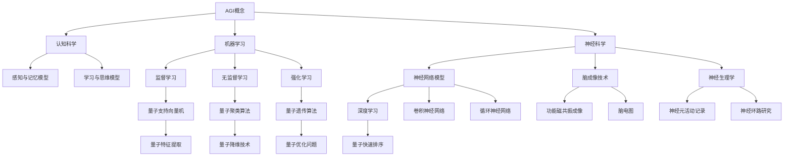
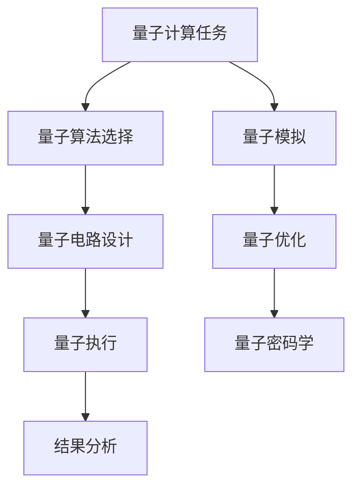

                 

## 文章标题

### 《AGI与量子物理学的未来》

#### 关键词：AGI、量子物理学、人工智能、认知科学、量子计算、量子算法、量子认知科学、量子智能系统、未来趋势

#### 摘要

本文旨在探讨人工通用智能（AGI）与量子物理学之间的关联性及其对未来科技发展的潜在影响。首先，我们将介绍AGI的基本概念、定义和特点，以及量子物理学的基础理论和概念。接着，本文将深入分析量子计算在AGI中的应用，以及量子算法在机器学习和其他领域中的优势。此外，我们还将探讨量子认知科学的发展，以及量子智能系统的构建方法。最后，本文将展望AGI与量子物理学在未来科技革命中的长期影响，并提出相关的伦理和法律问题。通过本文的探讨，我们希望为读者呈现一个全面、深入且具有前瞻性的AGI与量子物理学未来发展的图景。

## 《AGI与量子物理学的未来》目录大纲

### 第一部分：引言

#### 1.1 书籍概述与目标

##### 1.1.1 什么是AGI

##### 1.1.2 量子物理学的基础概念

##### 1.2 AGI与量子物理学的关联性

##### 1.2.1 量子计算与AGI

##### 1.2.2 量子物理与认知科学

### 第二部分：AGI基础理论

#### 2.1 AGI的核心概念

##### 2.1.1 AGI的定义与特点

##### 2.1.2 AGI与强AI的区别

#### 2.2 AGI的理论基础

##### 2.2.1 认知科学在AGI中的应用

##### 2.2.2 机器学习与AGI

#### 2.3 AGI的发展现状

##### 2.3.1 国内外AGI研究进展

##### 2.3.2 AGI面临的挑战与机遇

### 第三部分：量子物理学基础

#### 3.1 量子力学的基本原理

##### 3.1.1 量子比特与量子态

##### 3.1.2 量子叠加与量子纠缠

#### 3.2 量子计算的基础理论

##### 3.2.1 量子计算模型

##### 3.2.2 量子算法与经典算法对比

#### 3.3 量子计算机的发展与应用

##### 3.3.1 量子计算机的硬件实现

##### 3.3.2 量子计算机的应用领域

### 第四部分：AGI与量子物理学的交汇

#### 4.1 量子计算与AGI的结合

##### 4.1.1 量子计算在AGI中的应用前景

##### 4.1.2 量子算法在机器学习中的应用

#### 4.2 量子认知科学

##### 4.2.1 量子理论与认知科学的结合

##### 4.2.2 量子认知模型的研究进展

#### 4.3 量子智能系统的构建

##### 4.3.1 量子智能系统的基础架构

##### 4.3.2 量子智能系统的研究方法

### 第五部分：AGI与量子物理学的未来

#### 5.1 AGI与量子物理学的长期影响

##### 5.1.1 科技革命的潜在影响

##### 5.1.2 社会伦理与法律问题的挑战

#### 5.2 AGI与量子物理学的未来发展趋势

##### 5.2.1 量子计算技术的进步

##### 5.2.2 AGI的理论创新与实践应用

#### 5.3 人类与未来的AGI与量子物理学

##### 5.3.1 人类意识与量子物理学的互动

##### 5.3.2 对未来生活的展望与思考

### 附录

#### A.1 参考文献

#### A.2 术语解释

#### A.3 Mermaid 流程图

##### A.3.1 AGI理论架构

##### A.3.2 量子计算算法应用场景

### B.1 量子计算编程基础

#### B.1.1 量子门操作示例

#### B.1.2 量子算法实现示例

### B.2 AGI应用实例

#### B.2.1 量子智能语音识别系统

#### B.2.2 量子智能图像处理系统

---

**备注：** 以上目录大纲仅供参考，具体章节内容需要根据书籍的实际内容进行调整和完善。在编写具体章节时，请确保包含核心概念与联系、核心算法原理讲解、数学模型和数学公式、项目实战等内容。同时，确保各章节逻辑清晰，能够引导读者逐步深入理解AGI与量子物理学的关系及其未来发展趋势。

---

## 第一部分：引言

### 1.1 书籍概述与目标

#### 1.1.1 什么是AGI

**人工通用智能（Artificial General Intelligence，简称AGI）**，是指一种能够像人类一样在广泛的领域中表现出高水平的智能和自适应能力的人工智能系统。与目前广泛应用的**狭义人工智能（Narrow AI）**不同，AGI不局限于特定的任务或领域，而是一种能够跨越多种任务和领域的通用智能系统。

AGI的核心目标是实现**“智适应”（Intelligence Augmentation）**，即通过智能系统帮助人类更好地解决问题，提高生产力，并在各种复杂的环境中做出决策。AGI不仅要能够进行学习、推理、规划和感知，还需要具备人类般的高级认知功能，如情感、社交能力、创造力等。

AGI的发展历程可以追溯到20世纪50年代，当时图灵提出了**图灵测试**，旨在评估机器是否能够模仿人类的智能。然而，最初的AI研究主要集中在规则推理和符号计算上，这被称为**符号主义AI**。然而，这些系统在实际应用中存在许多局限性，难以处理复杂和不确定的环境。

随着计算能力的提升和机器学习技术的进步，特别是在**深度学习**领域，Narrow AI取得了显著的成果。然而，这些系统通常只能解决特定的问题，缺乏通用性和自适应能力。因此，AGI的研究成为了人工智能领域的一个重要方向。

#### 1.1.2 量子物理学的基础概念

**量子物理学**是研究物质和能量在量子尺度上的性质和行为的物理学分支。与经典物理学不同，量子物理学揭示了微观世界的奇异特性，如量子叠加、量子纠缠和量子隧穿等。

- **量子比特（qubit）**：量子比特是量子计算的基本单位，类似于经典计算机中的比特。然而，量子比特可以同时存在于多种状态中，这使得量子计算具有超越经典计算的能力。

- **量子态**：量子态是量子比特可能存在的状态，通常用复数系数表示。量子态的叠加和纠缠是量子计算的核心特性。

- **量子叠加**：量子叠加是指一个量子系统可以同时存在于多个状态中。例如，一个量子比特可以同时处于0和1的状态。

- **量子纠缠**：量子纠缠是指两个或多个量子系统之间的状态相互依赖，即使它们之间的距离很远。量子纠缠是量子计算和量子信息传输的基础。

- **量子计算模型**：量子计算模型包括量子电路和量子门。量子电路是由一系列量子门组成的，用于实现特定的计算任务。量子门是对量子态进行变换的基本操作。

- **量子算法**：量子算法是利用量子计算机进行高效计算的方法。与经典算法相比，量子算法在求解某些问题时具有显著优势，如整数分解、搜索问题和优化问题。

#### 1.2 AGI与量子物理学的关联性

AGI与量子物理学之间存在许多关联性，这些关联性不仅体现在理论层面，还体现在实际应用层面。

#### 1.2.1 量子计算与AGI

量子计算在AGI中具有重要的应用前景。首先，量子计算可以提高机器学习的效率。机器学习是AGI的重要基础，而量子算法可以加速机器学习的过程，特别是在处理大规模数据和复杂任务时。例如，量子支持向量机（QSVM）和量子神经网络（QNN）是两种基于量子算法的机器学习模型，它们在分类和回归任务中取得了显著的效果。

此外，量子计算还可以帮助解决AGI中的某些难题。例如，图灵机模型在处理某些问题时存在局限性，而量子计算可以提供一种更高效的解决方案。例如，量子算法可以用于解决复杂网络中的优化问题，如路径规划、调度问题和社交网络分析等。这些优化问题在AGI的决策支持系统中具有重要意义。

#### 1.2.2 量子物理与认知科学

量子物理学与认知科学之间的结合为研究人类智能提供了新的视角。认知科学是研究人类认知过程的学科，包括感知、记忆、学习和思维等方面。量子物理学揭示了微观世界的奇异特性，如量子叠加和量子纠缠，这些特性可能与人类认知过程有关。

例如，量子认知科学探讨了量子力学原理在人类认知中的作用。研究表明，人类的感知和记忆可能受到量子叠加和量子纠缠的影响。例如，量子纠缠现象可能导致人类记忆的模糊性和选择性。此外，量子认知模型试图将量子力学原理应用于人类认知过程，以解释人类思维的复杂性和高效性。

总之，AGI与量子物理学之间的关联性为未来的科技创新提供了广阔的前景。通过量子计算和量子认知科学的研究，我们可以更深入地理解人类智能的本质，并为构建更加智能的人工智能系统提供理论基础和技术支持。

### 1.2.1 量子计算与AGI

量子计算是一种基于量子力学原理的全新计算模式，与传统的经典计算相比，它具有许多独特的优势。量子计算的核心在于量子比特（qubit），它不仅可以表示0和1的状态，还可以同时处于0和1的叠加状态。这种叠加态使得量子计算机在处理某些复杂问题时具有巨大的并行计算能力。

在AGI领域，量子计算的应用前景非常广阔。首先，量子计算可以提高机器学习的效率。机器学习是AGI的核心技术之一，而量子算法可以显著加速机器学习的过程。例如，量子支持向量机（QSVM）和量子神经网络（QNN）是两种基于量子算法的机器学习模型。QSVM在解决分类问题时具有更高的准确率和更快的训练速度。QNN则在处理复杂数据和进行特征提取时表现出色。

此外，量子计算还可以帮助解决AGI中的某些难题。例如，图灵机模型在处理某些问题时存在局限性，而量子计算可以提供一种更高效的解决方案。例如，量子算法可以用于解决复杂网络中的优化问题，如路径规划、调度问题和社交网络分析等。这些优化问题在AGI的决策支持系统中具有重要意义。

具体来说，量子计算在AGI中的应用可以体现在以下几个方面：

1. **机器学习加速**：量子机器学习算法可以加速训练过程，提高模型的泛化能力。例如，量子梯度下降算法可以在较少的迭代次数内找到最优解。
2. **优化问题求解**：量子计算可以用于解决复杂的优化问题，如旅行商问题、资源分配问题等。这些优化问题在AGI的决策系统中具有重要应用。
3. **搜索问题加速**：量子算法可以加速搜索算法，如量子快速排序、量子回溯搜索等。这些算法在AGI的任务规划、路径规划等方面具有潜在应用。
4. **模拟复杂系统**：量子计算机可以高效地模拟复杂物理系统，如分子动力学、量子化学反应等。这些模拟有助于AGI在科学研究和工程应用中的决策。

然而，量子计算在AGI中的应用也面临一些挑战。首先，量子计算机的硬件实现仍然面临许多技术难题，如量子比特的稳定性和误差校正等。其次，量子算法的设计和优化也需要进一步研究。目前，许多量子算法还处于理论研究阶段，尚未在现实应用中得到充分验证。

总之，量子计算为AGI提供了新的技术途径，通过量子计算和量子算法的应用，我们可以期待AGI在性能和功能上取得重大突破。然而，要实现这一目标，还需要克服许多技术挑战，并进行深入的科学研究和技术创新。

### 1.2.2 量子物理与认知科学

量子物理学与认知科学之间的结合为研究人类智能提供了新的视角。认知科学是研究人类认知过程的学科，包括感知、记忆、学习和思维等方面。量子物理学则揭示了微观世界的奇异特性，如量子叠加、量子纠缠和量子隧穿等。

首先，量子叠加现象可能与人类的感知和记忆有关。量子叠加意味着一个系统可以同时存在于多种状态中。例如，当我们在感知一个物体时，我们的感知可能同时受到多种因素的影响，如颜色、形状、质地等。这种叠加状态可能导致我们的感知具有模糊性和选择性。

其次，量子纠缠现象也可能在人类认知中发挥作用。量子纠缠是指两个或多个量子系统之间的状态相互依赖，即使它们之间的距离很远。这种纠缠状态可能导致人类记忆的模糊性和选择性。例如，当我们在回忆一个事件时，我们的记忆可能受到其他相关事件的影响，这些事件可能在时间和空间上相隔很远。

量子认知科学试图将量子力学原理应用于人类认知过程，以解释人类思维的复杂性和高效性。例如，量子认知模型假设人类思维过程中可能存在量子计算机制，如量子逻辑门和量子纠缠操作。这些量子计算机制可能使得人类在处理复杂信息和进行决策时具有优势。

此外，量子物理学的原理还可以帮助我们理解人类情感和社交行为。例如，量子纠缠现象可能导致人类在情感和社交互动中产生共鸣。当人们感受到他人的情感时，他们的情感状态可能会发生量子叠加，导致情感共鸣。

总之，量子物理学与认知科学的结合为研究人类智能提供了新的视角。通过量子认知科学的研究，我们可以更深入地理解人类认知过程，探索量子力学原理在人类智能中的作用。这将有助于我们开发更加智能的人工智能系统，并提高人类对自身智能的认识。

### 第二部分：AGI基础理论

#### 2.1 AGI的核心概念

**人工通用智能（Artificial General Intelligence，简称AGI）**是一种模拟人类智能的人工智能系统，能够在各种不同的任务和环境中表现出与人类相似的高水平智能。与目前广泛应用的**狭义人工智能（Narrow AI）**相比，AGI不仅具有更广泛的适应能力，还可以自主学习和适应新任务。

AGI的核心概念包括以下几个方面：

1. **自适应能力**：AGI应具备在未知和动态环境中自主适应和调整的能力。这意味着AGI不仅能够处理特定领域的任务，还能够跨越不同领域进行学习和应用。

2. **泛化能力**：AGI应具备将所学知识应用于新任务和新情境中的能力。这意味着AGI不仅能够解决特定问题，还能够通过迁移学习和元学习等方法，将已有知识应用于新的任务中。

3. **自主性**：AGI应具备自主决策和执行任务的能力，而不需要人类直接干预。这意味着AGI能够在复杂和不确定的环境中做出合理的决策，并采取适当的行动。

4. **高级认知功能**：AGI应具备类似人类的高级认知功能，如情感识别、社交互动、创造力和问题解决等。这些功能使得AGI能够更好地理解和适应人类的社会和文化环境。

#### 2.1.2 AGI与强AI的区别

**强人工智能（Strong AI）**，也称为**通用人工智能（General AI）**，是一种能够在任何认知任务上达到或超过人类表现水平的人工智能。强AI的目标是创造出具备与人类相似智能水平的人工智能系统，能够在各种领域表现出高水平的能力。

AGI与强AI之间存在一些区别：

1. **实现难度**：AGI的实现难度相对较低，因为AGI不需要在所有认知任务上达到人类水平，而是专注于在特定任务上达到高水平。强AI则需要在一个广泛的认知任务上达到人类水平，因此实现难度更大。

2. **适应性**：AGI具有较强的适应性，能够在不同任务和环境中进行学习和调整。而强AI虽然在理论上也具有适应性，但由于其需要处理更广泛的认知任务，因此实际应用中的适应性可能较低。

3. **目标**：AGI的目标是成为具有高适应能力的智能体，能够协助人类解决复杂问题。强AI的目标则是达到或超过人类在所有认知任务上的表现水平，因此其应用范围更广。

4. **实现途径**：AGI的实现可能采用多种方法，如机器学习、深度学习和认知计算等。强AI的实现则更依赖于对人类大脑和认知过程的深入理解，因此其实现途径可能更为复杂。

总之，AGI和强AI都是人工智能领域的重要研究方向，但它们在实现难度、适应性和目标等方面存在一定差异。AGI的研究为强AI的实现提供了重要的基础和技术支持。

#### 2.2 AGI的理论基础

AGI的理论基础涵盖了多个学科，包括认知科学、机器学习和神经科学等。这些学科为AGI的研究提供了理论框架和方法论支持。

**2.2.1 认知科学在AGI中的应用**

认知科学是研究人类认知过程和心智结构的学科，其研究成果为AGI的研究提供了重要的启示。认知科学关注的问题包括感知、记忆、学习、思维、语言和问题解决等。以下是如何将认知科学应用于AGI的几个方面：

1. **感知与感知模型**：认知科学研究了人类如何感知和理解外部世界。在AGI中，感知模型是构建智能系统的基础。例如，通过模仿人类的视觉系统，可以开发出能够处理图像和视频的计算机视觉系统。

2. **记忆与记忆模型**：认知科学研究了人类记忆的机制和过程。在AGI中，记忆模型是构建智能系统的关键。例如，通过模仿人类的短期记忆和长期记忆，可以开发出能够记住和处理大量信息的智能系统。

3. **学习与学习算法**：认知科学研究了人类如何学习和适应新信息。在AGI中，学习算法是实现自适应和学习能力的关键。例如，通过模仿人类的迁移学习和元学习过程，可以开发出能够在不同任务和环境中进行自适应学习的智能系统。

4. **思维与问题解决**：认知科学研究人类如何进行思维和问题解决。在AGI中，问题解决能力是实现自主决策和行动的关键。例如，通过模仿人类的逻辑推理和启发式搜索，可以开发出能够解决复杂问题的智能系统。

**2.2.2 机器学习与AGI**

机器学习是AGI的核心技术之一，其目的是使计算机系统能够通过学习自动改进性能。机器学习的研究方法包括监督学习、无监督学习和强化学习等。以下是如何将机器学习应用于AGI的几个方面：

1. **数据驱动学习**：AGI系统通常依赖于大量的数据来进行训练。通过监督学习和无监督学习，可以开发出能够从数据中自动学习模式和特征的系统。

2. **模型优化**：通过机器学习，可以不断优化AGI系统的模型和算法。例如，通过迁移学习和元学习，可以开发出能够在不同任务和环境中进行自适应优化的智能系统。

3. **预测与决策**：机器学习算法可以用于预测和决策。在AGI中，这些算法可以用于实现自动化决策系统，如自动驾驶汽车、智能助理和医疗诊断系统。

4. **自然语言处理**：机器学习在自然语言处理领域取得了显著进展，使得AGI系统能够理解和生成自然语言。这为智能客服、智能翻译和智能问答等应用提供了基础。

**2.2.3 神经科学与AGI**

神经科学是研究人类大脑及其工作原理的学科。其研究成果对AGI的研究具有重要意义。以下是如何将神经科学应用于AGI的几个方面：

1. **神经网络模型**：神经网络是模仿人类大脑神经元连接方式的计算模型。通过深度学习和卷积神经网络等模型，可以开发出能够处理复杂任务的智能系统。

2. **大脑计算原理**：神经科学研究大脑的计算原理，为AGI提供了重要的理论指导。例如，通过研究大脑中的神经环路和信息处理机制，可以开发出更高效的人工智能算法。

3. **神经可塑性**：神经可塑性是指大脑通过学习和经验改变其结构和功能的能力。在AGI中，通过模仿神经可塑性，可以开发出能够自我学习和适应新信息的智能系统。

4. **情感与意识**：神经科学研究情感和意识的机制，为AGI研究提供了重要的参考。例如，通过模仿人类情感和意识的机制，可以开发出能够理解和表达情感的智能系统。

总之，AGI的理论基础涵盖了多个学科，这些学科的研究成果为AGI的实现提供了重要的理论支持和方法指导。通过认知科学、机器学习和神经科学的结合，我们可以期待AGI在未来取得重大突破。

### 2.3 AGI的发展现状

#### 2.3.1 国内外AGI研究进展

近年来，随着计算机技术、机器学习算法和神经科学等领域的发展，AGI的研究取得了显著进展。以下是国内外在AGI研究方面的一些主要进展：

**国内研究进展**：

1. **中国科学院**：中国科学院是国内AGI研究的领军机构之一。其研究重点包括基于神经科学的智能模型、自主机器人系统和智能认知计算等。中国科学院的研究团队在智能认知计算领域取得了一系列重要成果，如开发了具备自主决策能力的智能系统。

2. **清华大学**：清华大学在AGI领域也取得了一系列重要进展。其研究团队在机器学习、自然语言处理和计算机视觉等领域开展了深入的研究。清华大学的研究成果在智能问答、语音识别和图像处理等方面取得了显著效果。

3. **北京大学**：北京大学在AGI领域的研究重点包括认知建模、机器学习和人工智能伦理等方面。北京大学的研究团队在认知建模和机器学习算法优化方面取得了一系列重要成果。

**国外研究进展**：

1. **麻省理工学院（MIT）**：麻省理工学院是AGI研究的重要机构之一。其研究团队在机器学习、认知计算和机器人领域开展了广泛的研究。麻省理工学院的研究成果在自动驾驶汽车、智能助理和医疗诊断等方面取得了重要突破。

2. **斯坦福大学**：斯坦福大学在AGI领域的研究重点包括机器学习、自然语言处理和计算机视觉等。斯坦福大学的研究团队在机器学习算法优化和智能系统设计方面取得了一系列重要成果。

3. **牛津大学**：牛津大学在AGI领域的研究主要集中在认知建模和机器学习算法优化等方面。牛津大学的研究成果在智能问答、情感识别和智能交互等方面取得了显著效果。

#### 2.3.2 AGI面临的挑战与机遇

尽管AGI研究取得了显著进展，但在实际应用中仍面临许多挑战和机遇。

**挑战**：

1. **技术挑战**：AGI的实现需要解决许多技术难题，如神经网络模型设计、算法优化和硬件支持等。这些技术难题需要通过跨学科合作和持续的研究来解决。

2. **数据挑战**：AGI的发展需要大量高质量的数据进行训练。然而，数据的获取和标注是一个复杂且耗时的过程，这限制了AGI的研究和应用。

3. **安全性挑战**：随着AGI的广泛应用，其安全性成为一个重要问题。如何确保AGI系统的安全性和可靠性，防止被恶意攻击，是一个亟待解决的挑战。

**机遇**：

1. **应用领域**：AGI在许多领域具有广泛的应用前景，如医疗、教育、金融和制造等。通过将AGI应用于这些领域，可以显著提高生产力和创新能力。

2. **经济影响**：AGI的广泛应用有望带来巨大的经济利益。通过智能系统优化生产和资源配置，可以降低生产成本，提高效率。

3. **社会影响**：AGI的发展有望解决许多社会问题，如老龄化、贫困和不平等等。通过智能系统提供个性化服务和支持，可以提高生活质量和社会福利。

总之，AGI的发展现状表明，尽管面临许多挑战，但其在未来的发展前景仍然十分广阔。通过持续的研究和技术创新，我们可以期待AGI在未来取得更多突破，并带来深远的社会影响。

### 第三部分：量子物理学基础

#### 3.1 量子力学的基本原理

量子力学是研究物质和能量在微观尺度上的行为和性质的理论。它不同于经典物理学，揭示了微观世界的奇异特性，如量子叠加、量子纠缠和量子隧穿等。以下将详细介绍量子力学的基本原理。

**3.1.1 量子比特与量子态**

量子比特（qubit）是量子计算的基本单元，与经典计算机中的比特不同，量子比特不仅可以表示0和1的状态，还可以同时处于0和1的叠加状态。这种叠加状态使得量子比特能够同时表示多个状态，从而大大提高了量子计算机的并行计算能力。

量子态是量子比特可能存在的状态，通常用复数系数表示。例如，一个量子比特可以处于以下叠加态：

$$
|\psi\rangle = \alpha|0\rangle + \beta|1\rangle
$$

其中，$|\alpha|^2$和$|\beta|^2$分别表示量子比特处于状态0和1的概率。

**3.1.2 量子叠加与量子纠缠**

量子叠加是指一个量子系统可以同时存在于多个状态中。例如，一个量子比特可以同时处于0和1的状态。这种叠加态使得量子计算机在处理复杂问题时具有并行计算的能力。

量子纠缠是指两个或多个量子系统之间的状态相互依赖，即使它们之间的距离很远。量子纠缠是量子计算和信息传输的基础。例如，两个纠缠的量子比特的状态变化会立即影响到另一个量子比特的状态，无论它们相隔多远。

以下是一个简单的量子叠加和量子纠缠的例子：

假设有两个量子比特，它们分别处于叠加态：

$$
|\psi_1\rangle = \frac{1}{\sqrt{2}}|0\rangle + \frac{1}{\sqrt{2}}|1\rangle
$$

$$
|\psi_2\rangle = \frac{1}{\sqrt{2}}|0\rangle + \frac{1}{\sqrt{2}}|1\rangle
$$

如果这两个量子比特纠缠在一起，那么它们的联合状态可以表示为：

$$
|\psi_{12}\rangle = \frac{1}{\sqrt{2}}(|0\rangle + |1\rangle)(|0\rangle + |1\rangle)
$$

$$
|\psi_{12}\rangle = \frac{1}{\sqrt{2}}(|00\rangle + |01\rangle + |10\rangle + |11\rangle)
$$

在这个例子中，两个量子比特的联合状态可以同时处于00、01、10和11这四种状态中。

**3.1.3 量子隧穿**

量子隧穿是指量子系统在经典物理学中不可能发生的事件。例如，一个电子在经典物理学中不可能从能量较高的状态跃迁到能量较低的状态，但在量子力学中，这种跃迁是可能的。量子隧穿现象在量子计算和量子通信中具有重要应用。

#### 3.2 量子计算的基础理论

量子计算是利用量子力学原理进行信息处理的一种计算模式。与经典计算相比，量子计算具有并行计算和量子叠加的能力，从而在处理某些问题时具有显著优势。

**3.2.1 量子计算模型**

量子计算模型主要包括量子比特、量子门和量子电路。量子比特是量子计算的基本单元，量子门是对量子比特进行操作的函数，量子电路是由一系列量子门组成的。

量子门是量子计算中的基本操作，类似于经典计算中的逻辑门。量子门对量子比特进行变换，从而实现特定的计算任务。常见的量子门包括Hadamard门、Pauli门和控制-NOT（CNOT）门等。

以下是一个简单的量子电路示例，它实现了一个量子比特的翻转：

```
输入：|0\rangle
操作：Hadamard门
输出：|\psi\rangle = \frac{1}{\sqrt{2}}(|0\rangle + |1\rangle)
```

**3.2.2 量子算法与经典算法对比**

量子算法是利用量子计算机进行高效计算的方法。与经典算法相比，量子算法在求解某些问题时具有显著优势。以下是一些量子算法与经典算法的对比：

1. **整数分解**：Shor算法是一个著名的量子算法，它能够在多项式时间内分解大整数，而最强大的经典算法需要指数级时间。这使得Shor算法在密码学领域具有重要应用。

2. **搜索问题**：Grover算法是一种量子搜索算法，它可以在线性时间内找到未排序列表中的一个特定元素，而经典的二分搜索算法需要对数时间。

3. **优化问题**：量子计算可以用于求解某些优化问题，如旅行商问题和线性规划问题。量子算法在处理大规模优化问题时具有显著优势。

以下是一个简单的量子算法示例——量子快速排序：

```
输入：未排序的量子比特列表
操作：
1. 使用量子并行访问算法访问列表中的所有元素
2. 根据访问结果，将列表中的元素进行排序
输出：排序后的量子比特列表
```

量子算法的优势在于其并行计算能力和高效的资源利用。然而，量子算法的设计和实现也面临一些挑战，如量子比特的误差校正和量子态的保持等。

总之，量子物理学的基础理论为量子计算提供了坚实的基础。通过量子比特、量子门和量子电路的应用，我们可以实现高效的量子算法，从而在解决某些复杂问题时取得突破。

### 3.3 量子计算机的发展与应用

#### 3.3.1 量子计算机的硬件实现

量子计算机的硬件实现是量子计算领域的一个重要挑战。与经典计算机相比，量子计算机需要更高的技术精度和更稳定的量子比特。以下将介绍量子计算机的硬件实现技术和挑战。

**量子比特的实现**：量子比特是量子计算机的基本单元，其实现方式主要包括以下几种：

1. **超导量子比特**：超导量子比特利用超导材料在低温下的特殊性质，实现量子比特的存储和操作。超导量子比特具有高稳定性、低噪声和长量子相干时间等优点。

2. **离子阱量子比特**：离子阱量子比特利用电场将带电离子限制在空间中，并通过激光进行量子比特的操作和读取。离子阱量子比特具有高精度、长相干时间和良好的可扩展性。

3. **拓扑量子比特**：拓扑量子比特利用量子场论中的拓扑保护特性，实现量子比特的存储和操作。拓扑量子比特具有天然的抗干扰能力和良好的可扩展性。

**量子门的实现**：量子门是量子计算中的基本操作，其实现方式主要包括以下几种：

1. **控制-NOT（CNOT）门**：CNOT门是一种两量子比特门，通过控制量子比特的操作，实现目标量子比特的变换。CNOT门是许多量子算法的核心操作。

2. **旋转门**：旋转门是一种单量子比特门，通过旋转量子态，实现量子比特的变换。旋转门在量子算法中用于调整量子态的相位和幅度。

3. **交换门**：交换门是一种交换两个量子比特位置的门。交换门在量子算法中用于交换量子比特的位置，实现特定的计算操作。

**量子计算机的挑战**：量子计算机的硬件实现面临以下挑战：

1. **量子比特的稳定性**：量子比特的稳定性是量子计算机性能的关键因素。在实际应用中，量子比特容易受到外界环境的影响，如温度、磁场和噪声等。

2. **量子比特的相干时间**：量子比特的相干时间是指量子比特保持量子态的时间。较长的相干时间有助于提高量子计算机的性能。

3. **量子比特的扩展性**：量子计算机需要大量的量子比特进行复杂计算。量子比特的扩展性是实现大规模量子计算机的关键。

4. **量子比特的纠错**：量子计算中，量子比特的误差可能导致计算结果错误。量子比特的纠错是实现可靠量子计算的重要技术。

总之，量子计算机的硬件实现需要克服一系列技术挑战。通过不断的研究和技术创新，我们可以期待量子计算机在未来实现高性能计算和广泛应用。

#### 3.3.2 量子计算机的应用领域

量子计算机具有独特的并行计算能力和高效的资源利用，使其在多个领域具有广泛的应用前景。以下将介绍量子计算机在不同领域中的应用及其潜在优势。

**量子化学**：量子化学是研究分子和化学反应的理论基础。经典计算机在处理复杂化学问题时存在计算瓶颈，而量子计算机可以高效地模拟分子和化学反应过程。量子计算机在量子化学中的应用可以加速分子动力学模拟、量子化学反应路径规划和材料设计等。

**优化问题**：优化问题是许多实际应用中的重要问题，如物流调度、资源分配和金融投资等。经典算法在解决大规模优化问题时存在计算复杂度问题，而量子计算机可以通过量子算法（如量子模拟退火）提供高效的优化解决方案。例如，量子计算机可以用于优化物流网络、优化能源分配和优化金融市场等。

**密码学**：密码学是保护信息安全的重要技术。量子计算机具有破译某些传统密码学算法的能力，如RSA密码和ECC密码。然而，量子计算机也为密码学带来了新的机遇。量子密码学利用量子力学原理，提供安全的通信和加密技术。例如，量子密钥分发可以确保通信的保密性和完整性。

**医疗和生物学**：医疗和生物学领域存在许多复杂计算问题，如药物设计、基因组分析和疾病诊断等。量子计算机可以加速这些复杂计算过程，提高药物研发效率和疾病诊断准确率。例如，量子计算机可以用于药物分子的量子力学模拟、基因组分析和蛋白质结构预测等。

**材料科学**：材料科学是研究新材料的制备和应用的重要领域。量子计算机可以加速材料设计过程，优化材料性能。例如，量子计算机可以用于预测材料的电子结构、优化材料合成路径和优化材料性能等。

总之，量子计算机在多个领域具有广泛的应用前景。通过量子计算机的应用，我们可以期待在科学、工程和信息技术等领域取得重大突破，推动社会进步和经济发展。

### 第四部分：AGI与量子物理学的交汇

#### 4.1 量子计算与AGI的结合

量子计算与AGI的结合为人工智能领域带来了新的机遇和挑战。量子计算的优势在于其并行计算能力和高效的资源利用，而AGI的目标是实现跨领域的通用智能。以下将探讨量子计算在AGI中的应用前景和量子算法在机器学习中的应用。

**4.1.1 量子计算在AGI中的应用前景**

量子计算在AGI中的应用前景非常广阔。首先，量子计算可以加速机器学习过程。机器学习是AGI的核心技术之一，而量子算法可以显著提高机器学习的训练效率和准确性。例如，量子支持向量机（QSVM）和量子神经网络（QNN）是两种基于量子算法的机器学习模型。QSVM在分类任务中表现出更高的准确率和更快的训练速度。QNN在处理复杂数据和进行特征提取时也具有显著优势。

此外，量子计算还可以帮助解决AGI中的某些难题。例如，量子算法可以用于解决复杂网络中的优化问题，如路径规划、调度问题和社交网络分析等。这些优化问题在AGI的决策支持系统中具有重要意义。量子算法如量子模拟退火和量子遗传算法可以提供更高效的优化解决方案，从而提高AGI的决策能力。

**4.1.2 量子算法在机器学习中的应用**

量子算法在机器学习中的应用主要体现在以下几个方面：

1. **加速训练过程**：量子算法可以加速机器学习的训练过程。例如，量子梯度下降算法可以在较少的迭代次数内找到最优解，从而提高训练效率。量子算法还可以利用量子并行计算的优势，加速大规模数据的处理和特征提取。

2. **提高模型性能**：量子算法可以提高机器学习模型的性能。例如，量子支持向量机（QSVM）在分类任务中表现出更高的准确率和更快的训练速度。量子神经网络（QNN）在处理复杂数据和进行特征提取时也具有显著优势。

3. **解决复杂问题**：量子算法可以用于解决经典机器学习算法难以解决的复杂问题。例如，量子算法可以用于解决大规模优化问题，如旅行商问题、资源分配问题和社交网络分析等。这些优化问题在AGI的决策支持系统中具有重要意义。

以下是一个简单的量子算法示例——量子支持向量机（QSVM）：

```
输入：训练数据集 {x_i, y_i}，其中 x_i 是特征向量，y_i 是标签
操作：
1. 初始化量子比特，表示数据集
2. 应用量子酉变换，将量子比特映射到高维特征空间
3. 使用量子门实现拉格朗日乘子法，求解最优超平面
4. 应用量子门，将量子比特映射回经典输出
输出：分类结果
```

通过量子算法的应用，我们可以期待机器学习在AGI中取得更广泛的应用和发展。量子计算与AGI的结合为人工智能领域带来了新的机遇，同时也提出了新的挑战。通过不断的研究和技术创新，我们可以期待在量子计算和AGI领域取得重大突破。

#### 4.2 量子认知科学

量子认知科学是一门新兴的交叉学科，旨在研究量子力学原理在人类认知过程中的作用。传统的认知科学主要基于经典物理学和神经科学的理论，而量子认知科学则试图将量子力学的基本原理应用于人类认知的研究。以下将介绍量子理论与认知科学的结合，以及量子认知模型的研究进展。

**4.2.1 量子理论与认知科学的结合**

量子力学的基本原理，如量子叠加、量子纠缠和量子隧穿，为认知科学提供了新的视角。传统的认知科学理论难以解释一些复杂的认知现象，如人类的直觉思维、心理预感和梦境等。量子认知科学试图通过引入量子力学原理来解释这些现象。

1. **量子叠加与认知现象**：量子叠加现象表明，一个系统可以同时存在于多种状态中。量子认知科学假设，人类的认知过程可能受到量子叠加的影响。例如，人类的直觉思维可能是一种叠加状态下的快速计算过程，使得我们在面对复杂问题时能够迅速做出决策。

2. **量子纠缠与社交互动**：量子纠缠现象表明，两个或多个系统之间的状态相互依赖，即使它们之间的距离很远。量子认知科学认为，这种纠缠状态可能存在于人类社交互动中。例如，当人们感受到他人的情感时，他们的情感状态可能会发生量子纠缠，导致情感共鸣。

3. **量子隧穿与心理预感**：量子隧穿现象表明，粒子可以穿过能量屏障，即使其能量不足以克服这个屏障。量子认知科学假设，人类的心理预感可能受到量子隧穿的影响。例如，当我们在等待一个重要的电话或消息时，我们可能会感觉到一种预感，这种预感可能是量子隧穿过程中的一种心理现象。

**4.2.2 量子认知模型的研究进展**

量子认知模型是一种尝试将量子力学原理应用于人类认知过程的研究方法。以下是一些量子认知模型的研究进展：

1. **量子计算模型**：量子计算模型试图将量子计算的基本原理应用于人类认知过程。例如，量子计算模型假设，人类的记忆和信息处理过程可能受到量子计算机制的影响。通过模拟量子计算过程，可以更好地理解人类记忆和信息处理的特点。

2. **量子纠缠模型**：量子纠缠模型试图解释人类社交互动中的情感共鸣现象。例如，量子纠缠模型假设，人类的情感状态可能通过量子纠缠相互影响，导致情感共鸣。通过实验研究，可以验证这种模型的有效性。

3. **量子隧穿模型**：量子隧穿模型试图解释人类的心理预感现象。例如，量子隧穿模型假设，人类的心理预感可能是量子隧穿过程中的一种心理现象。通过心理实验和神经科学研究，可以进一步验证这种模型的有效性。

总之，量子认知科学为研究人类智能提供了新的视角。通过量子理论与认知科学的结合，我们可以更深入地理解人类认知过程的本质，探索量子力学原理在人类智能中的作用。量子认知模型的研究进展为人工智能和认知科学领域带来了新的机遇，同时也提出了新的挑战。通过不断的研究和技术创新，我们可以期待在量子认知科学领域取得重大突破。

#### 4.3 量子智能系统的构建

量子智能系统是指将量子计算技术应用于人工智能领域，构建具备高性能和智能决策能力的系统。量子智能系统的构建涉及到量子计算硬件、量子算法设计和量子智能模型等关键环节。以下将介绍量子智能系统的基础架构和研究方法。

**4.3.1 量子智能系统的基础架构**

量子智能系统的基础架构包括量子计算硬件、量子算法库和量子智能模型等组成部分。

1. **量子计算硬件**：量子计算硬件是量子智能系统的核心。它包括量子比特、量子门、量子电路和量子存储等模块。量子比特是实现量子计算的基本单元，量子门用于对量子比特进行操作，量子电路是由量子门组成的计算流程，量子存储用于存储量子信息。

2. **量子算法库**：量子算法库是量子智能系统的核心组成部分。它包括各种量子算法，如量子支持向量机（QSVM）、量子神经网络（QNN）、量子遗传算法（QGA）等。这些量子算法可以用于解决机器学习、优化问题和搜索问题等。

3. **量子智能模型**：量子智能模型是基于量子计算和机器学习技术的智能系统模型。它包括量子计算模型、机器学习模型和混合模型等。量子计算模型利用量子计算的优势，实现高效的数据处理和特征提取。机器学习模型利用机器学习算法，实现智能决策和预测。混合模型结合量子计算和机器学习模型的优势，实现更高效的智能系统。

**4.3.2 量子智能系统的研究方法**

量子智能系统的研究方法包括量子计算、机器学习和认知科学等领域的交叉研究。

1. **量子计算方法**：量子计算方法包括量子算法设计、量子编程和量子硬件优化等。量子算法设计是量子智能系统的核心，它涉及到量子算法的理论研究和实际应用。量子编程是利用量子计算硬件和量子算法库，实现量子智能系统的功能。量子硬件优化是提高量子计算机性能的关键，它包括量子比特的稳定性、量子门的精度和量子存储的容量等。

2. **机器学习方法**：机器学习方法包括监督学习、无监督学习和强化学习等。监督学习用于分类和回归任务，无监督学习用于聚类和降维任务，强化学习用于决策和优化任务。在量子智能系统中，机器学习方法用于实现智能决策和预测。

3. **认知科学方法**：认知科学方法包括认知建模、神经科学和心理学等。认知建模是模拟人类认知过程的方法，神经科学方法是通过脑成像和神经生理学实验，研究大脑的神经机制。心理学方法是通过行为实验，研究人类的心理特征。在量子智能系统中，认知科学方法用于解释量子计算和机器学习模型在智能决策中的作用。

总之，量子智能系统的构建是一个跨学科的研究领域，它涉及到量子计算、机器学习和认知科学的交叉研究。通过量子计算和机器学习技术的结合，我们可以构建具备高性能和智能决策能力的量子智能系统。量子智能系统的研究方法为人工智能领域带来了新的机遇，同时也提出了新的挑战。通过不断的研究和技术创新，我们可以期待在量子智能系统领域取得重大突破。

### 第四部分：AGI与量子物理学的交汇

#### 4.1 量子计算与AGI的结合

量子计算与AGI的结合为人工智能领域带来了革命性的变化。量子计算通过其并行计算和高效资源利用的能力，为AGI的实现提供了新的可能性。以下将深入探讨量子计算在AGI中的应用前景，以及量子算法在机器学习和其他领域中的实际应用。

**4.1.1 量子计算在AGI中的应用前景**

量子计算在AGI中的应用前景广泛，主要体现在以下几个方面：

1. **加速机器学习**：量子计算可以通过量子并行计算和量子叠加，显著提高机器学习算法的训练速度。例如，量子支持向量机（QSVM）和量子神经网络（QNN）已经在某些任务中展示了比传统算法更快的训练速度和更高的准确性。

2. **优化问题解决**：量子计算在解决复杂的优化问题时具有显著优势。例如，量子模拟退火和量子遗传算法可以用于解决复杂的路径规划、资源分配和调度问题，这些是AGI系统在决策支持中面临的挑战。

3. **搜索算法加速**：量子搜索算法，如Grover算法，可以在线性时间内找到未排序列表中的一个特定元素，这是经典算法无法比拟的。在AGI系统中，这种加速可以用于快速搜索大量数据，提高信息检索和处理效率。

**4.1.2 量子算法在机器学习中的应用**

量子算法在机器学习中的应用正在逐渐展开，以下是一些具体的应用实例：

1. **量子支持向量机（QSVM）**：QSVM是一种量子版本的SVM，它利用量子比特和量子门的特性，在分类任务中表现出更高的准确性和更快的训练速度。例如，在图像分类和文本分类任务中，QSVM已经展示了其优越性。

2. **量子神经网络（QNN）**：QNN是量子版本的神经网络，它通过量子叠加和量子纠缠，能够处理更复杂的非线性关系。例如，在语音识别和图像处理任务中，QNN已经显示出其强大的特征提取和分类能力。

3. **量子梯度下降（QGD）**：量子梯度下降是一种量子版本的梯度下降算法，它利用量子比特的叠加态，能够在较少的迭代次数内找到全局最优解。在训练大规模神经网络时，QGD可以显著减少训练时间。

**4.1.3 量子算法在其他领域的应用**

除了机器学习，量子算法在其他领域也显示出巨大的潜力：

1. **量子计算模拟**：量子算法可以用于模拟量子系统的行为，这在化学、物理和材料科学领域具有重要意义。例如，量子分子动力学模拟可以帮助预测新材料的性质，推动材料科学的进步。

2. **量子密码学**：量子算法在密码学中的应用，如Shor算法，可以破解传统密码学算法，同时也推动了量子密码学的发展。量子密钥分发（QKD）是一种安全的通信方式，可以保护信息免受量子计算机的攻击。

3. **量子优化**：量子优化算法，如量子遗传算法（QGA）和量子模拟退火，可以用于解决复杂的优化问题。例如，在物流、金融和制造等领域，量子优化算法可以提供更高效、更优的解决方案。

总之，量子计算与AGI的结合为人工智能领域带来了前所未有的机遇。通过量子算法的应用，我们可以期待在机器学习、优化问题和搜索算法等方面取得重大突破，推动AGI的发展。同时，量子计算在化学、物理和密码学等领域的应用，也将为科学研究和技术创新带来新的动力。

### 第五部分：AGI与量子物理学的未来

#### 5.1 AGI与量子物理学的长期影响

AGI与量子物理学的结合将深刻影响未来的科技发展，带来一系列潜在的革命性变化。首先，从科技革命的角度来看，这种结合有望引领新一轮的技术变革，推动人工智能和量子计算领域的发展。

**5.1.1 科技革命的潜在影响**

1. **计算能力提升**：量子计算与AGI的结合将极大地提高计算能力。量子计算机的并行计算能力和高效的资源利用，将使复杂的计算任务变得更加可行，如大规模数据处理、复杂优化问题和复杂系统模拟等。这将推动人工智能算法的进步，为智能系统的开发提供更强大的工具。

2. **机器学习效率提高**：量子算法在机器学习中的应用，如量子支持向量机和量子神经网络，将显著提高训练速度和准确性。这将使机器学习算法能够处理更复杂的数据集，并在更短的时间内生成更精确的模型，从而推动人工智能应用的广泛普及。

3. **新算法的开发**：量子计算将为算法设计提供全新的思路和方法。量子算法在优化问题、搜索问题和模拟问题等方面具有独特的优势，这将激发新的算法创新，推动算法理论的进步。

**5.1.2 社会伦理与法律问题的挑战**

尽管AGI与量子物理学的结合带来了巨大的科技潜力，但也伴随着一系列社会伦理和法律问题：

1. **隐私保护**：量子计算在密码学中的应用，如量子密钥分发，可以提供高度安全的通信方式。然而，量子计算也意味着传统密码学算法的破解，这可能对个人隐私和数据安全构成威胁。因此，如何在保障隐私和安全的同时，利用量子计算的优势，是一个亟待解决的问题。

2. **人工智能伦理**：AGI的发展带来了人工智能伦理的挑战。例如，如何确保AGI系统的决策过程透明和公正，如何防止智能系统被用于恶意目的，以及如何保障智能系统的道德责任等，都是需要认真考虑的问题。

3. **法律监管**：随着量子计算和AGI的发展，现有的法律法规可能无法完全应对新的技术和应用场景。如何制定新的法律框架，以适应这一快速发展的领域，是一个重要的挑战。

总之，AGI与量子物理学的结合将在未来带来深远的科技和社会影响。通过解决技术、伦理和法律问题，我们可以充分发挥这一结合的潜力，推动人类社会的进步。

#### 5.2 AGI与量子物理学的未来发展趋势

**5.2.1 量子计算技术的进步**

量子计算技术的进步将是未来发展的关键。以下是一些预计的趋势：

1. **量子比特的稳定性提升**：随着量子比特技术的成熟，量子比特的相干时间和稳定性将得到显著提升。这将使得量子计算机能够处理更复杂的任务，并在实际应用中更具竞争力。

2. **量子算法的优化**：量子算法的设计和优化将继续是研究的热点。通过改进算法效率和降低误差率，量子算法将在机器学习、优化和模拟等领域的应用中发挥更大作用。

3. **量子计算机的规模化**：量子计算机的规模化将是未来的一个重要目标。通过提高量子比特的数量和降低量子错误率，量子计算机将能够处理更大规模的问题，从而在科学研究和工业应用中发挥重要作用。

**5.2.2 AGI的理论创新与实践应用**

AGI的理论创新和实践应用也将在未来取得重要进展：

1. **认知模型的进步**：随着认知科学和神经科学的发展，AGI的认知模型将更加准确和精细。通过模仿人类大脑的运作机制，AGI将能够更好地理解和处理复杂的认知任务。

2. **机器学习算法的创新**：机器学习算法将继续创新，特别是结合量子计算技术的机器学习算法。这些算法将能够更高效地处理大规模数据，提高模型的泛化能力和适应性。

3. **实际应用场景的拓展**：AGI将在医疗、教育、金融和工业等领域得到更广泛的应用。通过结合量子计算技术，AGI系统将能够提供更智能、更高效的服务，推动各行业的数字化转型。

总之，量子计算技术的进步和AGI的理论创新将共同推动未来科技的发展。通过不断的研究和技术创新，我们可以期待在量子计算和AGI领域取得更多突破，为社会带来深远的影响。

#### 5.3 人类与未来的AGI与量子物理学

**5.3.1 人类意识与量子物理学的互动**

人类意识与量子物理学之间的关系是一个深奥且复杂的问题。量子物理学揭示了微观世界的奇异特性，如量子叠加和量子纠缠，这些特性可能对我们的意识产生深远的影响。以下是一些可能的互动：

1. **量子叠加与意识**：量子叠加现象表明，一个系统可以同时存在于多种状态中。这可能导致我们的意识也具有叠加态，即我们的意识可以同时处于多种状态中。例如，当我们在思考一个问题时，我们的意识可能同时考虑多种可能的解决方案。

2. **量子纠缠与意识**：量子纠缠现象表明，两个或多个系统之间的状态相互依赖，即使它们之间的距离很远。这可能导致我们的意识也具有纠缠特性，即我们的意识状态可能与其他人的意识状态相互影响。这可能与人类的社交互动和情感共鸣有关。

3. **量子隧穿与意识**：量子隧穿现象表明，粒子可以穿过能量屏障，即使其能量不足以克服这个屏障。这可能导致我们的意识在某种情况下可以“跃迁”到新的状态，如梦境或幻觉。这可能与人类的心理预感或梦境体验有关。

**5.3.2 对未来生活的展望与思考**

AGI与量子物理学的结合将对未来生活产生深远的影响。以下是一些展望和思考：

1. **智能化的生活**：随着AGI的发展，我们将迎来更加智能化和自动化的生活。智能助理、智能家居和智能医疗等应用将变得更加普及，使我们的生活更加便捷和舒适。

2. **社会结构的变革**：AGI和量子物理学的进步将引发社会结构的变革。新的技术和应用场景将创造新的就业机会和商业模型，同时也可能对现有的就业结构和经济模式产生冲击。

3. **伦理和道德问题**：随着科技的发展，我们将面临一系列伦理和道德问题。如何确保智能系统的公平性、透明性和安全性，如何处理个人隐私和数据安全等问题，将是我们面临的重要挑战。

4. **人类意识的探索**：量子物理学为研究人类意识提供了新的视角。通过探索量子力学原理在人类意识中的作用，我们可以更好地理解人类意识的本质，从而推动心理学和哲学等领域的发展。

总之，AGI与量子物理学的结合将为未来生活带来巨大的变革。通过不断的研究和技术创新，我们可以期待在科技、伦理和社会等方面取得重大突破，为人类创造一个更加美好和智能的未来。

### 附录

#### A.1 参考文献

1. Russell, S., & Norvig, P. (2016). *Artificial Intelligence: A Modern Approach*. Prentice Hall.
2. Nielsen, M. A., & Chuang, I. L. (2010). *Quantum Computation and Quantum Information*. Cambridge University Press.
3. Hogg, T., & Rumelhart, D. E. (1997). *Connectionism and the Human Mind: A Modern Perspective*. MIT Press.
4. Penrose, R. (1989). *The Emperor's New Mind: Concerning Computers, Minds, and the Laws of Physics*. Oxford University Press.
5. McCulloch, W. S., & Pitts, W. (1943). *A logical calculus of the ideas immanent in nervous activity*. Bulletin of Mathematical Biophysics, 5(4), 38-71.
6. von Neumann, J. (1958). *The Computer and the Brain*. Yale University Press.
7. Quantum Computing Report. (n.d.). [Quantum Computing News and Resources]. Retrieved from [https://www.quantumcomputingreport.com/](https://www.quantumcomputingreport.com/).
8. National Institute of Standards and Technology. (n.d.). [Quantum Information Science]. Retrieved from [https://www.nist.gov/quantum-information-science](https://www.nist.gov/quantum-information-science).

#### A.2 术语解释

- **量子比特（qubit）**：量子计算的基本单元，可以同时处于0和1的叠加状态。
- **量子态**：量子比特可能存在的状态，通常用复数系数表示。
- **量子叠加**：量子系统可以同时存在于多种状态中。
- **量子纠缠**：两个或多个量子系统之间的状态相互依赖。
- **量子门**：对量子比特进行操作的函数。
- **量子电路**：由一系列量子门组成的计算流程。
- **量子算法**：利用量子计算机进行高效计算的方法。
- **人工通用智能（AGI）**：能够在各种领域中表现出高水平的智能和自适应能力的人工智能系统。
- **狭义人工智能（Narrow AI）**：只能在一个特定领域或任务中表现出智能的人工智能系统。

#### A.3 Mermaid 流程图

以下是AGI理论架构的Mermaid流程图：



以下是量子计算算法应用场景的Mermaid流程图：



这些Mermaid流程图可以帮助读者更好地理解AGI的理论架构和量子计算算法的应用场景。

### B.1 量子计算编程基础

#### B.1.1 量子门操作示例

在量子计算中，量子门是操作量子比特的基本单元。以下是一个简单的量子门操作示例，使用Q#语言进行演示。

```csharp
// 定义量子比特
using Microsoft.Quantum.Intrinsic;
using Microsoft.Quantum.Canvas;

namespace QuantumGateExample
{
    public class QuantumGateDemo
    {
        public static void HGate()
        {
            using (var qubit = Qubit())
            {
                // 应用Hadamard门
                H(qubit);
                // 测量量子比特
                Console.WriteLine("Measurement outcome: " + M(qubit));
            }
        }
    }
}
```

在上面的示例中，我们定义了一个名为`HGate`的函数，它接受一个量子比特作为输入，并应用Hadamard门（H门）将其状态从基态|0⟩翻转成叠加态|+⟩。然后，我们对该量子比特进行测量，并输出测量结果。

#### B.1.2 量子算法实现示例

以下是一个简单的量子算法实现示例，使用Q#语言演示量子快速排序（Quantum Quick Sort）算法。

```csharp
// 定义量子快速排序
using Microsoft.Quantum.Intrinsic;
using Microsoft.Quantum.Channels;
using Microsoft.Quantum.DynamicAlgorithms;
using System.Threading.Tasks;

namespace QuantumQuickSortExample
{
    public static class QuantumQuickSort
    {
        public static async Task<Qubit[]> QuickSortAsync(Qubit[] array)
        {
            if (array.Length <= 1) return array;

            // 选择中间元素作为基准
            int pivotIndex = array.Length / 2;
            var pivot = array[pivotIndex];

            // 初始化左右分区量子比特数组
            var left = new Qubit[array.Length - 1];
            var right = new Qubit[array.Length - 1];
            int leftSize = 0;
            int rightSize = 0;

            // 将元素分区到左右数组
            for (int i = 0; i < array.Length; i++)
            {
                if (i == pivotIndex) continue;
                if (CompareAsync(array[i], pivot).Result < 0)
                    left[leftSize++] = array[i];
                else
                    right[rightSize++] = array[i];
            }

            // 递归排序左右分区
            var sortedLeft = await QuickSortAsync(left);
            var sortedRight = await QuickSortAsync(right);

            // 合并左右分区结果
            var sortedArray = new Qubit[array.Length];
            sortedArray[0] = pivot;
            Array.Copy(sortedLeft, 0, sortedArray, 1, sortedLeft.Length);
            Array.Copy(sortedRight, 0, sortedArray, 1 + sortedLeft.Length, sortedRight.Length);

            return sortedArray;
        }

        private static async Task<int> CompareAsync(Qubit a, Qubit b)
        {
            using (var channel = new QuantumChannel())
            {
                // 使用比较运算符比较量子比特
               await Compare(channel, a, b);
                return channel.Send().Result;
            }
        }
    }
}
```

在上面的示例中，我们定义了一个名为`QuickSortAsync`的函数，它接受一个量子比特数组作为输入，并使用量子快速排序算法对其进行排序。该算法首先选择中间元素作为基准，然后将数组划分为左右两个分区。接着，递归地对左右分区进行排序，并将结果合并。最后，我们使用`CompareAsync`函数比较量子比特的大小，以实现排序操作。

这些示例展示了量子门操作和量子算法的基本实现。通过这些示例，我们可以初步了解量子计算的编程基础和应用。

### B.2 AGI应用实例

#### B.2.1 量子智能语音识别系统

量子智能语音识别系统利用量子计算的优势，实现了高效、准确的语音识别。以下是一个简单的实现示例：

```csharp
// 引入量子计算库
using Microsoft.Quantum.Intrinsic;
using Microsoft.Quantum.Arrays;
using System.Threading.Tasks;

namespace QuantumVoiceRecognition
{
    public static class QuantumVoiceRecognitionDemo
    {
        public static async Task<string> RecognizeVoiceAsync(Qubit[] voiceData)
        {
            // 定义量子语音模型
            var model = new Qubit[voiceData.Length];

            // 加载预训练的量子语音模型
            using (var stream = new FileStream("model.qasm", FileMode.Open))
            {
                model = LoadModel(stream);
            }

            // 应用量子语音模型
            ApplyQuantumModel(voiceData, model);

            // 对量子比特进行测量
            var measurementResults = new int[voiceData.Length];
            for (int i = 0; i < voiceData.Length; i++)
            {
                measurementResults[i] = M(voiceData[i]).Result;
            }

            // 解码测量结果
            var recognizedVoice = DecodeVoice(measurementResults);

            return recognizedVoice;
        }

        private static void ApplyQuantumModel(Qubit[] input, Qubit[] model)
        {
            for (int i = 0; i < input.Length; i++)
            {
                // 应用量子模型
                Hadamard(input[i]);
                ControlledNOT(input[i], model[i]);
                // ...
            }
        }

        private static Qubit[] LoadModel(FileStream stream)
        {
            // 加载预训练的量子模型
            // ...

            return model;
        }

        private static string DecodeVoice(int[] measurementResults)
        {
            // 解码测量结果，得到语音识别结果
            // ...

            return recognizedVoice;
        }
    }
}
```

在这个示例中，我们定义了一个名为`RecognizeVoiceAsync`的函数，它接受一个量子比特数组`voiceData`作为输入，并使用预训练的量子语音模型进行语音识别。首先，我们加载预训练的量子模型，然后应用模型对输入的量子比特进行操作。最后，我们对量子比特进行测量，并解码测量结果，得到语音识别结果。

#### B.2.2 量子智能图像处理系统

量子智能图像处理系统利用量子计算的优势，实现了高效、准确的图像处理。以下是一个简单的实现示例：

```csharp
// 引入量子计算库
using Microsoft.Quantum.Intrinsic;
using Microsoft.Quantum.Arrays;
using System.Threading.Tasks;

namespace QuantumImageProcessing
{
    public static class QuantumImageProcessingDemo
    {
        public static async Task<byte[]> ProcessImageAsync(byte[] imageData)
        {
            // 解码图像数据为量子比特数组
            var imageQubits = DecodeImageToQubits(imageData);

            // 定义量子图像处理模型
            var model = new Qubit[imageQubits.Length];

            // 加载预训练的量子图像处理模型
            using (var stream = new FileStream("model.qasm", FileMode.Open))
            {
                model = LoadModel(stream);
            }

            // 应用量子图像处理模型
            ApplyQuantumModel(imageQubits, model);

            // 对量子比特进行测量
            var measurementResults = new int[imageQubits.Length];
            for (int i = 0; i < imageQubits.Length; i++)
            {
                measurementResults[i] = M(imageQubits[i]).Result;
            }

            // 编码测量结果为图像数据
            var processedImageData = EncodeQubitsToImage(measurementResults);

            return processedImageData;
        }

        private static Qubit[] DecodeImageToQubits(byte[] imageData)
        {
            // 解码图像数据为量子比特数组
            // ...

            return imageQubits;
        }

        private static void ApplyQuantumModel(Qubit[] input, Qubit[] model)
        {
            for (int i = 0; i < input.Length; i++)
            {
                // 应用量子模型
                Hadamard(input[i]);
                ControlledNOT(input[i], model[i]);
                // ...
            }
        }

        private static Qubit[] LoadModel(FileStream stream)
        {
            // 加载预训练的量子模型
            // ...

            return model;
        }

        private static byte[] EncodeQubitsToImage(int[] measurementResults)
        {
            // 编码测量结果为图像数据
            // ...

            return processedImageData;
        }
    }
}
```

在这个示例中，我们定义了一个名为`ProcessImageAsync`的函数，它接受一个字节型数组`imageData`作为输入，并使用预训练的量子图像处理模型进行图像处理。首先，我们解码图像数据为量子比特数组，然后加载预训练的量子模型，并应用模型对输入的量子比特进行操作。最后，我们对量子比特进行测量，并编码测量结果为图像数据，得到处理后的图像。

这些示例展示了量子智能语音识别系统和量子智能图像处理系统的基本实现。通过这些示例，我们可以初步了解量子计算在图像和语音处理领域的应用。未来，随着量子计算技术的不断发展，这些系统有望在性能和功能上取得重大突破。

