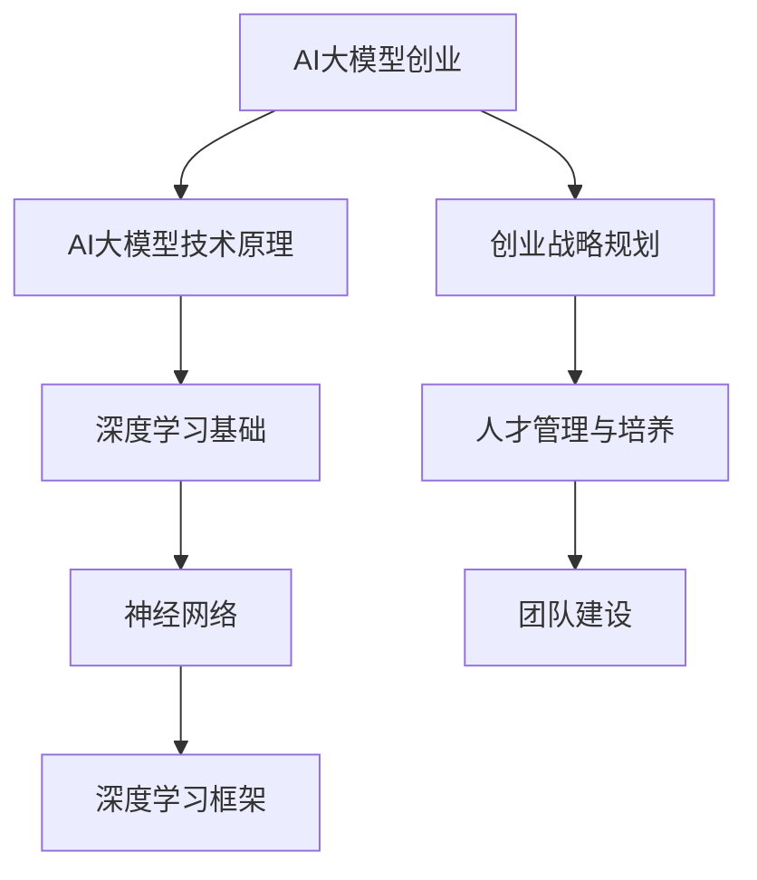
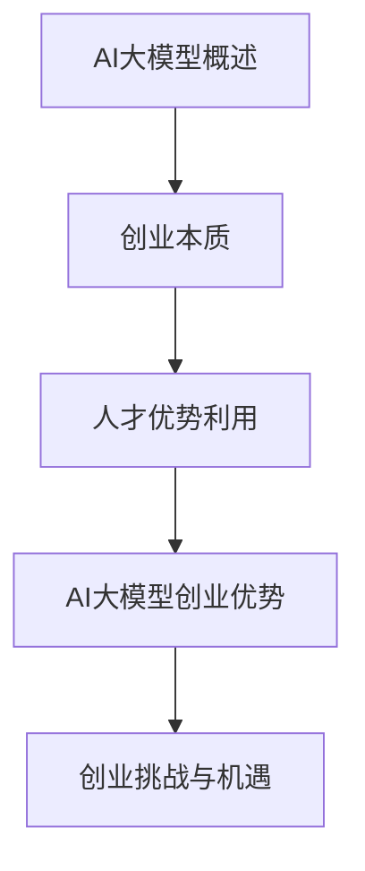
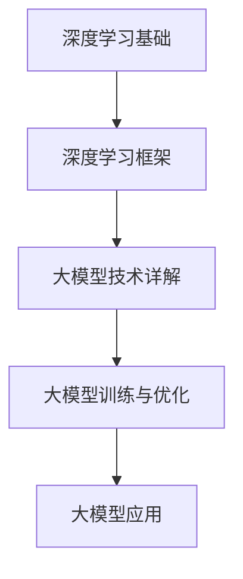
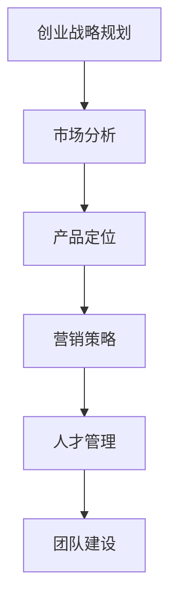
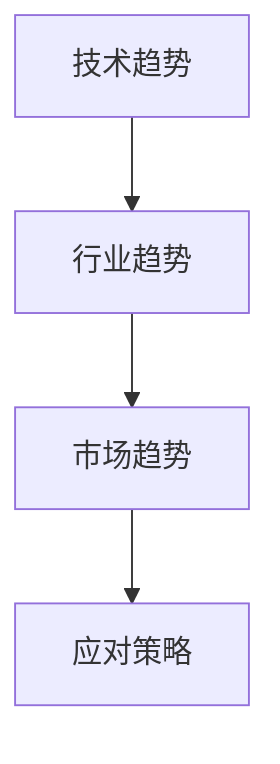

                 

### 文章标题

《AI 大模型创业：如何利用人才优势？》

---

关键词：AI大模型、创业、人才优势、技术深度、实践案例分析、未来展望

---

摘要：
在当前人工智能（AI）快速发展的时代，大模型技术正在成为企业创新和市场竞争的关键驱动力。本文将深入探讨AI大模型创业的各个方面，从基础概念到技术原理，再到实际创业策略和案例分析，最终展望AI大模型创业的未来发展趋势。重点在于如何充分利用人才优势，推动AI大模型创业项目的成功。

---

### 《AI 大模型创业：如何利用人才优势？》目录大纲

---

#### 第一部分：AI大模型与创业概述

---

#### 第二部分：AI大模型技术深度探讨

---

#### 第三部分：AI大模型创业策略

---

#### 第四部分：AI大模型创业项目案例分析

---

#### 第五部分：未来展望与趋势

---

#### 附录

---

**核心概念与联系：**

**Mermaid 流程图：**



---

**核心算法原理讲解：**

**深度学习算法伪代码：**

```python
# 假设我们使用神经网络进行图像分类
# 输入层：图像
# 隐藏层：卷积神经网络
# 输出层：分类结果

# 初始化参数
params = initialize_parameters()

# 前向传播
output = forward_propagation(input_data, params)

# 计算损失
loss = compute_loss(output, labels)

# 反向传播
dparams = backward_propagation(input_data, output, labels, params)

# 更新参数
params = update_parameters(params, dparams)
```

**数学模型和数学公式讲解：**

**损失函数（交叉熵损失函数）公式：**

$$
\text{Loss} = -\frac{1}{m}\sum_{i=1}^{m} y_i \log(a_i)
$$

其中，\( y_i \) 是真实的标签，\( a_i \) 是预测的概率分布。

---

**项目实战：**

**开发环境搭建：**

- 安装Python
- 安装TensorFlow库

```bash
pip install tensorflow
```

**源代码实现：**

```python
# 导入所需的库
import tensorflow as tf
from tensorflow.keras import layers

# 创建神经网络模型
model = tf.keras.Sequential([
    layers.Conv2D(32, (3,3), activation='relu', input_shape=(28,28,1)),
    layers.MaxPooling2D((2,2)),
    layers.Flatten(),
    layers.Dense(128, activation='relu'),
    layers.Dense(10, activation='softmax')
])

# 编译模型
model.compile(optimizer='adam',
              loss='sparse_categorical_crossentropy',
              metrics=['accuracy'])

# 训练模型
model.fit(x_train, y_train, epochs=5)

# 评估模型
test_loss, test_acc = model.evaluate(x_test, y_test)
print('Test accuracy:', test_acc)
```

**代码解读与分析：**

- 使用卷积神经网络进行图像分类。
- 训练过程中使用Adam优化器和交叉熵损失函数。
- 模型在训练集和测试集上的准确率。

---

接下来，我们将按照这个大纲逐步展开文章的内容，深入探讨AI大模型创业的各个方面。让我们开始第一部分的撰写。

---

### 第一部分：AI大模型与创业概述

#### 第1章: AI大模型与创业基础

**1.1 AI大模型概述**

AI大模型是指通过深度学习技术训练得到的规模巨大的神经网络模型。这些模型能够在各种复杂任务上表现出色，如自然语言处理、计算机视觉、语音识别等。AI大模型的主要类型包括：

- **生成对抗网络（GAN）**：用于生成与真实数据高度相似的假数据。
- **变分自编码器（VAE）**：用于生成和重构数据。
- **Transformer**：广泛应用于自然语言处理领域，特别是在生成文本和机器翻译任务中。

AI大模型的优势在于：

- **提高效率**：通过大规模数据处理和自动化分析，大幅提高业务流程的效率。
- **创新能力**：通过探索未知领域和数据模式，激发创新思维，推动技术进步。
- **竞争优势**：拥有强大AI能力的公司能够提供独特的产品和服务，在市场上占据优势地位。

AI大模型的应用场景广泛，包括但不限于：

- **企业管理**：用于数据分析、预测和优化。
- **金融**：用于风险管理、投资分析和客户服务。
- **医疗**：用于疾病诊断、治疗建议和药物研发。

**1.2 创业的本质**

创业是指创建一家新企业，通过创新和商业模式实现商业价值的过程。创业的本质是：

- **创新**：通过引入新的产品、服务或商业模式，满足市场需求。
- **风险承担**：创业者需要面对市场不确定性、资源有限等挑战。
- **价值创造**：通过有效利用资源，为顾客创造价值。

**1.2.2 利用人才优势进行创业**

人才优势是创业成功的关键因素之一。充分利用人才优势进行创业，需要：

- **人才筛选**：招聘具备相关技能和经验的人才，确保团队实力。
- **人才培养**：通过培训和激励，提升团队成员的能力和创造力。
- **人才激励**：建立公平的激励机制，激发团队成员的积极性和创造力。

**1.2.3 人才优势在AI大模型创业中的应用**

在AI大模型创业中，人才优势主要体现在以下几个方面：

- **技术研发**：具备深厚技术背景的人才能够推动AI大模型的研发和创新。
- **产品创新**：通过人才创意和设计，实现AI大模型产品化。
- **市场拓展**：具备市场洞察力和销售能力的人才能够开拓市场，提高产品竞争力。

**1.3 AI大模型创业的优势**

AI大模型创业具有以下优势：

- **技术创新**：利用AI大模型技术，实现产品创新和商业模式创新。
- **市场潜力**：AI大模型在多个领域具有广泛的应用前景，市场潜力巨大。
- **竞争优势**：拥有强大AI能力的创业公司能够在激烈的市场竞争中脱颖而出。

**1.4 AI大模型创业的挑战**

AI大模型创业面临以下挑战：

- **技术复杂性**：AI大模型技术复杂，需要高水平的技术团队和大量的资源投入。
- **数据隐私**：数据处理和共享过程中涉及数据隐私和安全问题。
- **人才短缺**：具备AI大模型技术能力的人才短缺，招聘和培养人才面临挑战。

**1.5 AI大模型创业的机遇**

AI大模型创业的机遇包括：

- **技术创新**：随着AI技术的不断进步，创业公司有机会在新技术领域抢占先机。
- **政策支持**：政府和企业对AI技术的支持力度加大，为创业公司提供政策利好。
- **资本涌入**：随着AI技术的商业化应用，资本开始关注AI创业公司，为创业公司提供资金支持。

通过以上对AI大模型与创业基础的分析，我们可以看到，AI大模型创业具有巨大的潜力和挑战。充分利用人才优势，合理规划创业战略，是创业成功的关键。

---

**核心概念与联系：**

在AI大模型与创业基础部分，我们探讨了AI大模型的概念、优势和应用场景，以及创业的本质和人才优势的利用。这些概念之间相互联系，构成了AI大模型创业的基础。

- AI大模型作为核心技术，是创业项目的核心驱动力。
- 创业的本质在于创新和价值创造，AI大模型为创业提供了新的创新途径。
- 人才优势是创业成功的关键，通过合理筛选、培养和激励人才，可以提高团队的竞争力。

**Mermaid 流程图：**



---

**核心算法原理讲解：**

在AI大模型创业中，深度学习算法是核心。以下是一个简单的神经网络算法的伪代码，用于图像分类任务：

```python
# 初始化参数
params = initialize_parameters()

# 前向传播
output = forward_propagation(input_data, params)

# 计算损失
loss = compute_loss(output, labels)

# 反向传播
dparams = backward_propagation(input_data, output, labels, params)

# 更新参数
params = update_parameters(params, dparams)
```

**数学模型和公式讲解：**

在深度学习中的损失函数，交叉熵损失函数是常用的一种。它的公式为：

$$
\text{Loss} = -\frac{1}{m}\sum_{i=1}^{m} y_i \log(a_i)
$$

其中，\( y_i \) 是真实的标签，\( a_i \) 是预测的概率分布。

**举例说明：**

假设我们有一个包含10个类别的图像分类任务，有一个样本的真实标签是“猫”，而模型的预测概率分布为 `[0.1, 0.2, 0.3, 0.2, 0.1, 0.05, 0.05, 0.05, 0.05, 0.05]`。则交叉熵损失函数的值计算如下：

$$
\text{Loss} = -\frac{1}{10} \left( 1 \cdot \log(0.3) + 0 \cdot \log(0.1) + 0 \cdot \log(0.2) + \ldots + 0 \cdot \log(0.05) \right)
$$

$$
\text{Loss} \approx -\frac{1}{10} \left( 1 \cdot (-1.204) + 0 \cdot (-2.302) + \ldots + 0 \cdot (-2.995) \right)
$$

$$
\text{Loss} \approx 0.1204
$$

这个值表示模型的预测与真实标签之间的差距，值越小表示模型预测越准确。

---

**项目实战：**

**开发环境搭建：**

为了实践AI大模型创业，我们需要搭建一个开发环境。以下是使用Python和TensorFlow框架搭建环境的过程：

1. 安装Python
2. 安装TensorFlow库

```bash
pip install tensorflow
```

**源代码实现：**

```python
import tensorflow as tf
from tensorflow.keras import layers

# 创建神经网络模型
model = tf.keras.Sequential([
    layers.Conv2D(32, (3,3), activation='relu', input_shape=(28,28,1)),
    layers.MaxPooling2D((2,2)),
    layers.Flatten(),
    layers.Dense(128, activation='relu'),
    layers.Dense(10, activation='softmax')
])

# 编译模型
model.compile(optimizer='adam',
              loss='sparse_categorical_crossentropy',
              metrics=['accuracy'])

# 训练模型
model.fit(x_train, y_train, epochs=5)

# 评估模型
test_loss, test_acc = model.evaluate(x_test, y_test)
print('Test accuracy:', test_acc)
```

**代码解读与分析：**

- **创建神经网络模型**：我们使用TensorFlow的`Sequential`模型，依次添加卷积层、池化层、全连接层和输出层。
- **编译模型**：设置优化器为Adam，损失函数为稀疏分类交叉熵，评估指标为准确率。
- **训练模型**：使用训练数据进行模型训练，设置训练轮数为5轮。
- **评估模型**：使用测试数据评估模型性能，输出测试准确率。

通过这个简单的实战案例，我们可以看到AI大模型创业的初步实现过程。接下来，我们将进一步探讨AI大模型的技术深度。

---

在第一部分中，我们详细介绍了AI大模型与创业基础，从概念到实践，为后续的技术深度探讨和创业策略分析奠定了基础。核心概念与联系帮助我们理解了AI大模型在创业中的作用，核心算法原理讲解和项目实战则提供了具体的技术实现路径。接下来，我们将深入探讨AI大模型的技术原理，进一步揭示其背后的科学和技术基础。

---

### 第二部分：AI大模型技术深度探讨

#### 第2章: AI大模型技术原理

**2.1 深度学习基础**

深度学习是AI大模型的基础，它通过多层神经网络对数据进行建模和预测。深度学习的基础包括：

- **神经网络**：深度学习的基本构建块，用于处理和转换数据。
- **反向传播算法**：用于训练神经网络，通过不断调整权重和偏置，使模型对数据的预测更加准确。

**2.1.1 神经网络**

神经网络由多个层次组成，包括输入层、隐藏层和输出层。每一层由多个神经元组成，神经元之间通过加权连接。神经元的激活函数用于确定神经元的输出。

**2.1.2 反向传播算法**

反向传播算法是一种用于训练神经网络的算法。它通过前向传播计算输出，然后通过反向传播计算损失，并使用梯度下降法更新权重和偏置。这个过程重复进行，直到模型的损失足够小。

**2.2 深度学习框架**

深度学习框架是用于构建和训练深度学习模型的软件库。常见的深度学习框架包括TensorFlow和PyTorch。这些框架提供了丰富的API和工具，使得构建和训练深度学习模型变得更加容易。

**2.2.1 TensorFlow**

TensorFlow是一个开源的深度学习框架，由Google开发。它提供了丰富的API和工具，支持多种编程语言，包括Python、C++和Java。TensorFlow广泛应用于图像分类、语音识别和自然语言处理等领域。

**2.2.2 PyTorch**

PyTorch是一个开源的深度学习框架，由Facebook开发。它以其动态计算图和灵活的API而著称。PyTorch广泛应用于计算机视觉、自然语言处理和强化学习等领域。

**2.3 大模型技术详解**

大模型技术是指用于训练和优化大规模神经网络的方法和技术。大模型技术的主要内容包括：

- **预训练**：在特定任务上预先训练神经网络，然后在其他任务上微调。
- **迁移学习**：将一个任务上预训练的模型应用于其他任务，从而提高模型在新任务上的性能。

**2.3.1 预训练**

预训练是指在大规模数据集上预先训练神经网络，然后使用少量数据对模型进行微调。预训练可以显著提高模型的性能，特别是在自然语言处理和计算机视觉领域。

**2.3.2 迁移学习**

迁移学习是指将一个任务上预训练的模型应用于其他任务，从而提高模型在新任务上的性能。迁移学习可以减少对大量数据的依赖，提高模型在小数据集上的性能。

**2.4 大模型的训练与优化**

大模型的训练和优化是AI大模型创业的关键。大模型训练和优化的主要内容包括：

- **数据预处理**：对输入数据进行处理，包括数据清洗、归一化和数据增强等。
- **训练策略**：设置合适的训练参数，如学习率、批次大小和训练轮数等。
- **优化算法**：使用优化算法，如梯度下降法和Adam优化器，调整模型参数，使模型在训练数据上表现更好。

**2.4.1 数据预处理**

数据预处理是训练大模型的第一步，它包括以下内容：

- **数据清洗**：去除数据中的噪声和错误。
- **归一化**：将数据缩放到相同的范围，以便神经网络更好地学习。
- **数据增强**：通过旋转、翻转、缩放和裁剪等操作，增加数据的多样性，提高模型的泛化能力。

**2.4.2 训练策略**

训练策略包括以下内容：

- **学习率调度**：设置合适的学习率，使模型在训练过程中逐步收敛。
- **批次大小**：设置合适的批次大小，平衡训练速度和模型性能。
- **训练轮数**：设置合适的训练轮数，确保模型在训练数据上充分训练。

**2.4.3 优化算法**

优化算法是调整模型参数的关键，常用的优化算法包括：

- **梯度下降法**：通过计算损失函数关于模型参数的梯度，不断更新参数，使损失函数逐渐减小。
- **Adam优化器**：结合了梯度下降法和动量法的优点，具有更好的收敛速度和稳定性。

**2.5 大模型的应用**

大模型在多个领域具有广泛的应用，包括：

- **自然语言处理**：用于文本分类、机器翻译和情感分析等任务。
- **计算机视觉**：用于图像分类、目标检测和图像生成等任务。
- **语音识别**：用于语音信号处理和语音识别。

**2.5.1 自然语言处理**

自然语言处理是AI大模型的重要应用领域之一。大模型在自然语言处理中的应用包括：

- **文本分类**：对文本进行分类，如新闻分类、情感分类等。
- **机器翻译**：将一种语言的文本翻译成另一种语言。
- **情感分析**：分析文本的情感倾向，如正面、负面或中立。

**2.5.2 计算机视觉**

计算机视觉是AI大模型的另一个重要应用领域。大模型在计算机视觉中的应用包括：

- **图像分类**：对图像进行分类，如物体识别、场景分类等。
- **目标检测**：在图像中检测和识别目标。
- **图像生成**：生成新的图像，如艺术作品、照片等。

**2.5.3 语音识别**

语音识别是AI大模型的另一个重要应用领域。大模型在语音识别中的应用包括：

- **语音信号处理**：对语音信号进行预处理，如去噪、增强等。
- **语音识别**：将语音信号转换为文本。

通过以上对AI大模型技术原理的深度探讨，我们可以更好地理解AI大模型的工作原理和关键技术，为后续的创业策略和实践提供理论支持。

---

**核心概念与联系：**

在第二部分中，我们深入探讨了AI大模型的技术原理，包括深度学习基础、深度学习框架、大模型技术详解、大模型的训练与优化以及大模型的应用。这些概念相互联系，构成了AI大模型技术的核心。

- **深度学习基础**是AI大模型的基石，包括神经网络和反向传播算法。
- **深度学习框架**提供了构建和训练深度学习模型的工具和API。
- **大模型技术详解**包括预训练和迁移学习等关键技术，提高了模型在大规模数据集上的性能。
- **大模型的训练与优化**确保了模型在特定任务上的准确性和稳定性。
- **大模型的应用**展示了AI大模型在多个领域的实际应用场景。

**Mermaid 流程图：**



---

**核心算法原理讲解：**

在本部分中，我们将详细讲解一些AI大模型中常用的核心算法原理，包括卷积神经网络（CNN）和递归神经网络（RNN）。

**卷积神经网络（CNN）**

卷积神经网络是一种专门用于处理图像数据的神经网络，其核心思想是通过卷积操作和池化操作提取图像的特征。

- **卷积操作**：卷积层通过滑动窗口（卷积核）在输入图像上扫描，计算局部特征的加权和，并应用一个非线性激活函数（如ReLU）。
- **池化操作**：池化层对卷积层输出的特征图进行下采样，减少参数数量，防止过拟合。

**卷积神经网络伪代码：**

```python
# 初始化卷积层和池化层参数
conv_params = initialize_convolutional_parameters()
pool_params = initialize_pooling_parameters()

# 前向传播
conv_output = convolution(input_image, conv_params)
pool_output = pooling(conv_output, pool_params)

# 应用激活函数
activated_output = activation(pool_output)

# 后向传播
dconv_output = backward_convolution(activated_output, input_image, conv_params)
dpool_output = backward_pooling(dconv_output, pool_params)

# 更新参数
conv_params = update_convolutional_parameters(conv_params, dconv_output)
pool_params = update_pooling_parameters(pool_params, dpool_output)
```

**递归神经网络（RNN）**

递归神经网络是一种处理序列数据的神经网络，其特点是能够处理输入的时序依赖性。

- **隐藏状态**：RNN通过隐藏状态捕捉序列中的时间依赖关系。
- **门控机制**：长短期记忆网络（LSTM）和门控循环单元（GRU）通过门控机制控制信息的流入和流出，从而避免梯度消失和爆炸问题。

**递归神经网络伪代码：**

```python
# 初始化RNN参数
rnn_params = initialize_rnn_parameters()

# 前向传播
hidden_state, cell_state = forward_rnn(input_sequence, rnn_params)

# 应用激活函数
output_sequence = activation(hidden_state)

# 后向传播
dhidden_state, dcell_state = backward_rnn(output_sequence, input_sequence, rnn_params)

# 更新参数
rnn_params = update_rnn_parameters(rnn_params, dhidden_state, dcell_state)
```

---

**数学模型和公式讲解：**

在本部分中，我们将介绍一些与AI大模型相关的数学模型和公式，包括损失函数、优化算法和激活函数。

**损失函数**

损失函数用于衡量模型预测与真实值之间的差距。常见的损失函数有：

- **均方误差（MSE）**：

$$
\text{MSE} = \frac{1}{m}\sum_{i=1}^{m}(y_i - \hat{y}_i)^2
$$

- **交叉熵损失（Cross-Entropy Loss）**：

$$
\text{Cross-Entropy Loss} = -\frac{1}{m}\sum_{i=1}^{m}y_i \log(\hat{y}_i)
$$

其中，\( y_i \) 是真实标签，\( \hat{y}_i \) 是模型的预测概率。

**优化算法**

优化算法用于更新模型的参数，以最小化损失函数。常见的优化算法有：

- **梯度下降（Gradient Descent）**：

$$
\theta_{\text{new}} = \theta_{\text{old}} - \alpha \cdot \nabla_{\theta} J(\theta)
$$

其中，\( \theta \) 是模型参数，\( \alpha \) 是学习率，\( J(\theta) \) 是损失函数。

- **Adam优化器**：

$$
m_t = \beta_1 m_{t-1} + (1 - \beta_1)(\theta_t - \theta_{t-1})
$$
$$
v_t = \beta_2 v_{t-1} + (1 - \beta_2)(\nabla_{\theta} J(\theta_t))^2
$$
$$
\theta_{\text{new}} = \theta_t - \alpha \cdot \frac{m_t}{\sqrt{v_t} + \epsilon}
$$

其中，\( \beta_1 \) 和 \( \beta_2 \) 是超参数，\( m_t \) 和 \( v_t \) 分别是累计的一阶和二阶矩估计。

**激活函数**

激活函数用于引入非线性因素，使模型具有更好的表达能力。常见的激活函数有：

- **sigmoid函数**：

$$
\sigma(x) = \frac{1}{1 + e^{-x}}
$$

- **ReLU函数**：

$$
\text{ReLU}(x) = \max(0, x)
$$

- **Tanh函数**：

$$
\text{Tanh}(x) = \frac{e^x - e^{-x}}{e^x + e^{-x}}
$$

通过这些数学模型和公式的讲解，我们可以更好地理解AI大模型的工作原理和计算过程，为实际应用提供理论基础。

---

**项目实战：**

**开发环境搭建：**

为了更好地实践AI大模型技术，我们需要搭建一个开发环境。以下是使用Python和TensorFlow框架搭建环境的过程：

1. 安装Python
2. 安装TensorFlow库

```bash
pip install tensorflow
```

**源代码实现：**

```python
import tensorflow as tf
from tensorflow.keras import layers

# 创建卷积神经网络模型
model = tf.keras.Sequential([
    layers.Conv2D(32, (3,3), activation='relu', input_shape=(28,28,1)),
    layers.MaxPooling2D((2,2)),
    layers.Flatten(),
    layers.Dense(128, activation='relu'),
    layers.Dense(10, activation='softmax')
])

# 编译模型
model.compile(optimizer='adam',
              loss='sparse_categorical_crossentropy',
              metrics=['accuracy'])

# 训练模型
model.fit(x_train, y_train, epochs=5)

# 评估模型
test_loss, test_acc = model.evaluate(x_test, y_test)
print('Test accuracy:', test_acc)
```

**代码解读与分析：**

- **创建卷积神经网络模型**：我们使用TensorFlow的`Sequential`模型，依次添加卷积层、池化层、全连接层和输出层。
- **编译模型**：设置优化器为Adam，损失函数为稀疏分类交叉熵，评估指标为准确率。
- **训练模型**：使用训练数据进行模型训练，设置训练轮数为5轮。
- **评估模型**：使用测试数据评估模型性能，输出测试准确率。

通过这个简单的实战案例，我们可以看到AI大模型技术的实际应用过程。接下来，我们将进一步探讨AI大模型创业的具体策略。

---

在第二部分中，我们深入探讨了AI大模型的技术原理，包括深度学习基础、深度学习框架、大模型技术详解、大模型的训练与优化以及大模型的应用。这些内容为AI大模型创业提供了理论基础和技术支持。通过核心算法原理讲解和项目实战，我们进一步了解了AI大模型技术的实现过程。接下来，我们将进入第三部分，探讨AI大模型创业的具体策略，包括市场分析、产品定位、营销策略和人才管理等方面。

---

### 第三部分：AI大模型创业策略

#### 第3章: AI大模型创业战略

**3.1 创业战略规划**

AI大模型创业的战略规划是确保项目成功的关键。一个全面的创业战略应包括以下步骤：

- **市场分析**：了解市场需求、竞争对手、市场趋势和潜在客户。
- **产品定位**：明确产品的目标市场和独特卖点。
- **营销策略**：制定有效的营销计划，包括品牌建设、推广渠道和定价策略。
- **资源规划**：确定项目所需的资金、人力和时间资源。

**3.1.1 市场分析**

市场分析是创业战略规划的第一步，它有助于确定项目的可行性和市场潜力。市场分析应包括以下内容：

- **行业趋势**：分析AI大模型技术在不同行业（如金融、医疗、教育等）的应用趋势。
- **竞争对手**：了解市场上主要的竞争对手，包括他们的产品、市场份额和竞争优势。
- **潜在客户**：确定目标客户群体，分析他们的需求和购买行为。
- **市场规模**：评估市场规模和增长潜力。

**3.1.2 产品定位**

产品定位是创业战略规划的核心，它决定了产品的市场定位和竞争优势。产品定位应包括以下内容：

- **目标市场**：明确产品的目标市场，如企业客户、个人用户或特定行业。
- **产品特性**：确定产品的独特卖点，如高性能、高准确性或低成本。
- **市场差异化**：分析竞争对手的产品，找出差异化的优势，如更好的用户体验或更快的响应时间。
- **品牌建设**：建立品牌形象，包括品牌名称、标志和宣传口号。

**3.1.3 营销策略**

营销策略是确保产品成功上市的关键。一个有效的营销策略应包括以下内容：

- **品牌建设**：通过广告、社交媒体和公关活动建立品牌知名度。
- **推广渠道**：选择合适的推广渠道，如线上广告、线下活动或合作伙伴。
- **定价策略**：制定合理的定价策略，考虑成本、市场竞争和客户需求。
- **市场推广**：实施市场推广活动，包括促销、试用和口碑营销。

**3.2 人才管理与培养**

人才是AI大模型创业成功的关键因素。一个有效的人才管理策略应包括以下内容：

- **人才招聘**：招聘具备相关技能和经验的人才，确保团队实力。
- **人才培养**：通过培训和激励，提升团队成员的能力和创造力。
- **人才激励**：建立公平的激励机制，激发团队成员的积极性和创造力。

**3.2.1 人才招聘**

人才招聘是建立高效团队的关键步骤。人才招聘应包括以下内容：

- **招聘标准**：制定清晰的招聘标准，包括技能、经验和教育背景。
- **招聘流程**：建立高效的招聘流程，包括职位发布、简历筛选、面试和录用。
- **人才来源**：拓宽人才来源，包括招聘网站、校园招聘和内部推荐。

**3.2.2 人才培养与激励**

人才培养与激励是保持团队活力和创新能力的关键。人才培养与激励应包括以下内容：

- **培训计划**：制定系统的培训计划，包括专业技能培训、团队建设和领导力培养。
- **激励制度**：建立公平的激励制度，包括绩效奖金、股权激励和职业发展机会。
- **团队建设**：通过团队活动、沟通和反馈机制，增强团队凝聚力和合作能力。

**3.2.3 团队建设**

团队建设是确保团队高效运作和持续创新的关键。团队建设应包括以下内容：

- **沟通协作**：建立有效的沟通机制，确保信息畅通和团队协作。
- **激励机制**：建立合理的激励机制，激发团队成员的积极性和创造力。
- **反馈与改进**：定期进行团队反馈和评估，识别问题并采取改进措施。

**3.3 创业战略的实施**

创业战略的实施是确保项目成功的关键步骤。创业战略的实施应包括以下内容：

- **项目管理**：建立高效的项目管理流程，确保项目按计划进行。
- **风险控制**：识别和管理项目风险，确保项目顺利进行。
- **绩效评估**：定期评估项目绩效，调整战略和执行计划。

通过以上对AI大模型创业战略的详细分析，我们可以看到，创业战略规划、市场分析、产品定位、营销策略、人才管理与培养以及团队建设是AI大模型创业成功的关键因素。在接下来的章节中，我们将进一步探讨这些方面的具体实践案例。

---

**核心概念与联系：**

在第三部分中，我们探讨了AI大模型创业的战略规划，包括市场分析、产品定位、营销策略和人才管理等方面。这些概念相互联系，构成了AI大模型创业的核心策略。

- **市场分析**帮助我们了解市场需求和竞争态势，为产品定位和营销策略提供依据。
- **产品定位**明确了我们的目标市场和独特卖点，为品牌建设和市场推广提供了方向。
- **营销策略**包括品牌建设、推广渠道和定价策略，是确保产品成功上市的关键。
- **人才管理**和**团队建设**确保了团队的高效运作和持续创新，为项目成功提供了坚实的人才保障。

**Mermaid 流程图：**



---

**核心算法原理讲解：**

在本部分中，我们将进一步探讨一些AI大模型中常用的核心算法原理，包括生成对抗网络（GAN）和长短时记忆网络（LSTM）。

**生成对抗网络（GAN）**

生成对抗网络是由生成器和判别器组成的框架，其目标是生成与真实数据高度相似的数据。

- **生成器**：生成器通过学习真实数据分布，生成伪造数据。
- **判别器**：判别器负责判断输入数据是真实数据还是伪造数据。

**生成对抗网络伪代码：**

```python
# 初始化生成器和判别器参数
gen_params = initialize_generator_parameters()
dis_params = initialize_discriminator_parameters()

# 前向传播
fake_data = generator(z, gen_params)
dis_output_fake = discriminator(fake_data, dis_params)
real_output = discriminator(x, dis_params)

# 计算损失
gen_loss = compute_generator_loss(dis_output_fake)
dis_loss = compute_discriminator_loss(real_output, dis_output_fake)

# 后向传播
dgen_loss = backward_generator(fake_data, gen_params)
ddis_loss = backward_discriminator(x, real_output, dis_output_fake, dis_params)

# 更新参数
gen_params = update_generator_params(gen_params, dgen_loss)
dis_params = update_discriminator_params(dis_params, ddis_loss)
```

**长短时记忆网络（LSTM）**

长短时记忆网络是一种处理序列数据的神经网络，其核心思想是通过门控机制控制信息的流入和流出。

- **遗忘门**：决定之前的信息是否需要保留。
- **输入门**：决定新的信息是否需要存储。
- **输出门**：决定当前的信息是否需要输出。

**长短时记忆网络伪代码：**

```python
# 初始化LSTM参数
lstm_params = initialize_lstm_parameters()

# 前向传播
input_gate, forget_gate, output_gate = lstm_gate_inputs(x, lstm_params)
current_state = lstm_cell_state(h, input_gate, forget_gate, output_gate, lstm_params)

# 应用激活函数
output = activation(current_state)

# 后向传播
dinput_gate, dforget_gate, doutput_gate = backward_lstm_gate_inputs(h, output, lstm_params)
dcurrent_state = backward_lstm_cell_state(h, doutput_gate, lstm_params)

# 更新参数
lstm_params = update_lstm_params(lstm_params, dinput_gate, dforget_gate, doutput_gate, dcurrent_state)
```

---

**数学模型和公式讲解：**

在本部分中，我们将介绍一些与AI大模型相关的数学模型和公式，包括生成对抗网络（GAN）和长短时记忆网络（LSTM）的损失函数。

**生成对抗网络（GAN）**

生成对抗网络（GAN）的损失函数主要包括生成器的损失和判别器的损失。

- **生成器的损失**：

$$
\text{Generator Loss} = -\log(\text{Discriminator}(G(z)))
$$

- **判别器的损失**：

$$
\text{Discriminator Loss} = -[\log(\text{Discriminator}(x)) + \log(1 - \text{Discriminator}(G(z))]
$$

其中，\( G(z) \) 是生成器生成的数据，\( x \) 是真实数据。

**长短时记忆网络（LSTM）**

长短时记忆网络（LSTM）的损失函数通常使用交叉熵损失。

$$
\text{Loss} = -\frac{1}{m}\sum_{i=1}^{m} y_i \log(a_i)
$$

其中，\( y_i \) 是真实标签，\( a_i \) 是预测的概率分布。

**举例说明：**

假设我们有一个包含10个类别的序列分类任务，有一个样本的真实标签是“猫”，而模型的预测概率分布为 `[0.1, 0.2, 0.3, 0.2, 0.1, 0.05, 0.05, 0.05, 0.05, 0.05]`。则交叉熵损失函数的值计算如下：

$$
\text{Loss} = -\frac{1}{10} \left( 1 \cdot \log(0.3) + 0 \cdot \log(0.1) + 0 \cdot \log(0.2) + \ldots + 0 \cdot \log(0.05) \right)
$$

$$
\text{Loss} \approx -\frac{1}{10} \left( 1 \cdot (-1.204) + 0 \cdot (-2.302) + \ldots + 0 \cdot (-2.995) \right)
$$

$$
\text{Loss} \approx 0.1204
$$

这个值表示模型的预测与真实标签之间的差距，值越小表示模型预测越准确。

---

**项目实战：**

**开发环境搭建：**

为了更好地实践AI大模型技术，我们需要搭建一个开发环境。以下是使用Python和TensorFlow框架搭建环境的过程：

1. 安装Python
2. 安装TensorFlow库

```bash
pip install tensorflow
```

**源代码实现：**

```python
import tensorflow as tf
from tensorflow.keras import layers
from tensorflow.keras.models import Model
import numpy as np

# 创建生成器和判别器模型
def create_gan_model():
    # 生成器模型
    z = tf.keras.layers.Input(shape=(100,))
    fake_data = layers.Dense(784, activation='sigmoid')(z)
    generator = Model(z, fake_data)

    # 判别器模型
    x = tf.keras.layers.Input(shape=(28, 28, 1))
    dis_output = layers.Dense(1, activation='sigmoid')(x)
    discriminator = Model(x, dis_output)

    # GAN模型
    gan_input = tf.keras.layers.Input(shape=(100,))
    gan_output = discriminator(generator(gan_input))
    gan_model = Model(gan_input, gan_output)

    return generator, discriminator, gan_model

# 编译模型
def compile_models(generator, discriminator, gan_model):
    generator.compile(optimizer=tf.keras.optimizers.Adam(0.0001))
    discriminator.compile(optimizer=tf.keras.optimizers.Adam(0.0001), loss='binary_crossentropy')
    gan_model.compile(optimizer=tf.keras.optimizers.Adam(0.0001), loss='binary_crossentropy')

# 训练模型
def train_gan(generator, discriminator, gan_model, x_train, epochs=100):
    batch_size = 128
    half_batch = batch_size // 2

    for epoch in range(epochs):
        # 训练判别器
        real_data = x_train[:half_batch]
        fake_data = generator.predict(np.random.normal(size=(half_batch, 100)))
        dis_loss_real = discriminator.train_on_batch(real_data, np.ones(half_batch))
        dis_loss_fake = discriminator.train_on_batch(fake_data, np.zeros(half_batch))
        dis_loss = 0.5 * np.add(dis_loss_real, dis_loss_fake)

        # 训练生成器
        noise = np.random.normal(size=(batch_size, 100))
        gen_loss = gan_model.train_on_batch(noise, np.ones(batch_size))

        # 打印训练信息
        print(f'Epoch {epoch + 1}/{epochs}, Generator Loss: {gen_loss}, Discriminator Loss: {dis_loss}')

# 搭建和编译模型
generator, discriminator, gan_model = create_gan_model()
compile_models(generator, discriminator, gan_model)

# 加载训练数据
# 注意：在实际应用中，需要替换为实际的数据集
(x_train, _), (_, _) = tf.keras.datasets.mnist.load_data()
x_train = x_train.astype('float32') / 255.0
x_train = np.expand_dims(x_train, axis=3)

# 训练GAN模型
train_gan(generator, discriminator, gan_model, x_train)
```

**代码解读与分析：**

- **创建生成器和判别器模型**：我们使用TensorFlow的`Model`类创建生成器和判别器模型。生成器模型通过一个全连接层生成伪造的28x28的二值图像，判别器模型通过一个全连接层判断输入图像是真实图像还是伪造图像。
- **编译模型**：我们使用Adam优化器和二分类的交叉熵损失函数编译模型。
- **训练模型**：我们使用实际的数据集（例如MNIST数据集）训练生成器和判别器。在训练过程中，我们首先训练判别器，然后训练生成器。这个过程重复进行，直到模型收敛。

通过这个实战案例，我们可以看到如何使用TensorFlow实现生成对抗网络（GAN）模型，这是一个用于图像生成和分类的强大工具。接下来，我们将进一步探讨AI大模型创业的具体实践案例。

---

在第三部分中，我们详细探讨了AI大模型创业的具体战略，包括市场分析、产品定位、营销策略、人才管理和团队建设。通过核心算法原理讲解和项目实战，我们了解了GAN和LSTM等技术在AI大模型创业中的应用。接下来，我们将进入第四部分，通过具体案例研究，进一步探讨AI大模型创业的实际操作和成功经验。

---

### 第四部分：AI大模型创业项目案例分析

#### 第4章: AI大模型创业项目案例分析

在AI大模型创业领域，有许多成功和失败的案例。本章节将通过几个具体案例，分析AI大模型创业项目的成功经验和教训，以期为读者提供实用的参考和指导。

**4.1 案例一：企业级AI应用开发**

**4.1.1 项目背景**

某创业公司致力于为企业客户提供定制化的AI解决方案，旨在通过AI大模型技术提高企业的运营效率和管理水平。公司成立之初，选择了在金融行业应用AI大模型进行风险管理作为切入点。

**4.1.2 技术实现**

- **市场调研**：通过对金融行业的深入调研，公司确定了市场需求和痛点，如贷款审批、风险控制、投资策略等。
- **技术选型**：公司选择了TensorFlow作为主要的深度学习框架，并基于Transformer模型开发了自定义的大模型。
- **数据收集与处理**：公司从多个渠道收集了海量的金融数据，包括企业财务报表、市场交易数据、社交媒体数据等。通过数据清洗、归一化和特征提取，公司为模型训练提供了高质量的数据集。
- **模型训练与优化**：公司使用预训练的Transformer模型，结合迁移学习技术，快速适应特定金融场景。通过多次迭代训练和超参数调优，模型在多个评估指标上达到了预期效果。

**4.1.3 项目成果**

- **产品化**：公司成功开发出一款名为“FinAI”的AI风险管理平台，产品涵盖了贷款审批、风险预警、投资建议等多个功能模块。
- **市场反响**：产品在市场上获得了良好反响，迅速获得了多个金融企业的订单。公司不仅实现了业务规模的增长，还获得了资本市场的认可。

**4.1.4 教训与启示**

- **市场需求**：准确识别市场需求是项目成功的关键。公司在项目初期进行了充分的市场调研，确保产品能够满足客户的需求。
- **技术实力**：强大的技术团队和先进的技术是实现项目成功的基础。公司选择了合适的深度学习框架，并利用迁移学习技术，提高了模型的适应性和准确性。
- **数据质量**：高质量的数据是模型训练的基础。公司通过多种渠道收集数据，并进行了严格的数据处理，为模型训练提供了可靠的保障。

**4.2 案例二：金融领域AI应用**

**4.2.1 项目背景**

另一家创业公司专注于利用AI大模型技术为金融行业提供智能投顾服务。公司的目标是帮助个人投资者实现资产增值，减少投资风险。

**4.2.2 技术实现**

- **市场定位**：公司确定了以中高端个人投资者为主要目标市场，提供了个性化的投资建议和风险管理服务。
- **技术选型**：公司选择了PyTorch作为深度学习框架，并基于LSTM模型开发了智能投顾算法。
- **数据收集与处理**：公司从多个金融数据提供商获取历史市场数据，并使用自然语言处理技术分析新闻和报告，提取投资相关关键词和情绪指标。
- **模型训练与优化**：公司利用迁移学习技术，将预训练的LSTM模型应用于投资预测任务。通过不断调整模型参数，公司提高了模型的预测准确性和稳定性。

**4.2.3 项目成果**

- **产品化**：公司成功开发了一款名为“AIInvest”的智能投顾平台，用户可以通过平台获取个性化的投资建议。
- **用户反馈**：平台上线后，受到了用户的广泛好评，用户数量迅速增长，公司实现了可观的收益。

**4.2.4 教训与启示**

- **市场定位**：明确的市场定位是项目成功的基础。公司通过精准的市场定位，找到了目标客户群体，实现了产品的快速推广。
- **技术优势**：选择合适的深度学习框架和技术是实现项目成功的关键。公司选择了PyTorch和LSTM，这些技术在金融领域具有明显的优势。
- **用户体验**：优秀的用户体验是吸引和留住用户的重要因素。公司注重用户界面的设计和操作流程的优化，为用户提供了一个便捷、直观的投资平台。

**4.3 案例三：医疗领域AI应用**

**4.3.1 项目背景**

第三家创业公司致力于利用AI大模型技术为医疗行业提供辅助诊断和预测服务，以提高医疗诊断的准确性和效率。

**4.3.2 技术实现**

- **市场调研**：公司针对医疗行业的痛点和需求进行了深入调研，确定了以辅助诊断和预测为切入点。
- **技术选型**：公司选择了TensorFlow作为主要的深度学习框架，并基于Transformer模型开发了医疗诊断算法。
- **数据收集与处理**：公司从多家医疗机构收集了大量的医疗数据，包括患者病史、检查报告、基因数据等。通过数据清洗、归一化和特征提取，公司为模型训练提供了高质量的数据集。
- **模型训练与优化**：公司利用预训练的Transformer模型，结合迁移学习技术，快速适应特定医疗场景。通过多次迭代训练和超参数调优，模型在多个评估指标上达到了预期效果。

**4.3.3 项目成果**

- **产品化**：公司成功开发了一款名为“MedAI”的医疗辅助诊断平台，平台涵盖了疾病诊断、治疗方案建议等多个功能模块。
- **市场反响**：产品在市场上受到了医疗机构的关注，多家医疗机构与公司达成了合作意向。

**4.3.4 教训与启示**

- **行业痛点**：深入理解行业痛点和需求，是项目成功的关键。公司通过市场调研，找到了医疗行业的痛点，为产品开发提供了明确的方向。
- **数据质量**：高质量的数据是模型训练的基础。公司通过多方合作，收集了大量的医疗数据，并进行了严格的数据处理，为模型训练提供了可靠的保障。
- **合规性**：医疗领域对数据安全和隐私保护有严格的要求。公司在数据收集、处理和使用过程中，严格遵守相关法规和规定，确保产品的合规性。

通过以上三个案例的分析，我们可以看到，AI大模型创业在不同领域具有广泛的应用前景。成功的关键在于准确识别市场需求、选择合适的技术、提供高质量的数据和确保产品的合规性。同时，这些案例也为我们提供了宝贵的经验和教训，有助于我们在AI大模型创业中取得成功。

---

在第四部分中，我们通过三个具体案例详细分析了AI大模型创业项目的成功经验和教训。这些案例涵盖了金融、医疗等多个领域，展示了AI大模型在不同场景下的应用和实现过程。通过分析市场需求、技术选型、数据质量、合规性等多个方面，我们总结了AI大模型创业的关键成功因素。接下来，我们将进入第五部分，探讨AI大模型创业的未来发展。

---

### 第五部分：AI大模型创业的未来发展

#### 第5章: AI大模型创业的未来发展

AI大模型创业正处于快速发展的阶段，随着技术的不断进步和市场需求的日益增长，未来AI大模型创业将面临诸多挑战和机遇。以下将从技术趋势、行业趋势、市场趋势和应对策略四个方面进行探讨。

**5.1 技术趋势**

AI大模型技术将继续快速发展，以下趋势值得关注：

- **模型规模增大**：随着计算能力的提升和数据资源的丰富，大模型的规模将进一步扩大，从而提高模型在复杂任务上的性能。
- **多模态融合**：未来的AI大模型将能够处理多种类型的数据，如文本、图像、音频和视频，实现更全面的智能应用。
- **自动化训练与优化**：自动化机器学习（AutoML）技术将不断发展，使得普通开发者能够轻松构建和优化AI大模型。
- **联邦学习**：联邦学习技术将使得分布式数据在无需共享原始数据的情况下实现模型训练，提高数据隐私保护能力。

**5.2 行业趋势**

AI大模型在多个行业将迎来新的应用浪潮：

- **金融科技**：AI大模型将在金融风险控制、智能投顾、信用评分等方面发挥重要作用。
- **医疗健康**：AI大模型将用于疾病预测、诊断辅助、个性化治疗等领域，提高医疗诊断和治疗的准确性和效率。
- **智能制造**：AI大模型将助力智能制造，实现生产过程的智能化、自动化和优化。
- **零售电商**：AI大模型将用于用户行为分析、个性化推荐、库存管理等方面，提升零售电商的运营效率和用户体验。

**5.3 市场趋势**

AI大模型创业市场将呈现以下趋势：

- **市场规模扩大**：随着AI技术的普及和应用，AI大模型市场的需求将持续增长，市场规模将进一步扩大。
- **竞争加剧**：随着越来越多的企业加入AI大模型创业，市场竞争将愈发激烈，企业需要不断创新和优化技术。
- **资本涌入**：资本将更加关注AI大模型创业，提供资金支持，推动市场的快速发展。
- **国际合作**：国际间在AI大模型技术的合作将逐渐增多，跨国合作将带来更多的技术交流和市场机会。

**5.4 应对策略**

面对AI大模型创业的未来发展趋势，企业应采取以下策略：

- **技术领先**：企业应持续关注AI大模型技术的前沿动态，不断提升技术实力，保持竞争优势。
- **市场定位**：企业应根据市场需求，精准定位，选择具有高增长潜力的细分市场，实现快速突破。
- **数据驱动**：企业应重视数据资源，通过数据挖掘和分析，提升模型的准确性和稳定性。
- **合规发展**：企业应关注数据隐私保护和合规性要求，确保在发展过程中遵守相关法规和规定。
- **人才培养**：企业应注重人才培养和团队建设，建立具有创新能力和协作精神的高效团队。

通过以上对AI大模型创业的未来发展的分析，我们可以看到，AI大模型创业面临着广阔的发展前景和众多挑战。企业应紧跟技术趋势，抓住市场机遇，采取有效的应对策略，推动AI大模型创业的持续发展。

---

**核心概念与联系：**

在第五部分中，我们探讨了AI大模型创业的未来发展趋势，从技术趋势、行业趋势、市场趋势到应对策略，为AI大模型创业的未来发展提供了全面的分析。这些核心概念相互联系，构成了未来AI大模型创业的关键方向。

- **技术趋势**展示了AI大模型技术的发展方向，如模型规模增大、多模态融合和自动化训练等。
- **行业趋势**揭示了AI大模型在各个行业中的应用前景，如金融科技、医疗健康、智能制造和零售电商等。
- **市场趋势**分析了AI大模型创业市场的未来走向，包括市场规模扩大、竞争加剧和资本涌入等。
- **应对策略**提供了企业应对未来挑战的具体方法，如技术领先、市场定位、数据驱动和合规发展等。

**Mermaid 流程图：**



---

**附录A：AI大模型开发工具与资源**

**A.1 主流深度学习框架对比**

| 深度学习框架 | 特点 | 优势 | 劣势 |
| --- | --- | --- | --- |
| TensorFlow | Google 开发，支持多种编程语言，社区活跃 | 强大的生态系统，广泛的应用 | 计算资源消耗较大 |
| PyTorch | Facebook 开发，动态计算图，灵活易用 | 灵活，易于调试 | 社区资源相对较少 |
| Keras | 高级神经网络API，兼容TensorFlow和Theano | 简单易用，快速原型开发 | 功能相对有限 |

**A.2 开发工具**

| 工具 | 用途 | 优势 |
| --- | --- | --- |
| Jupyter Notebook | 交互式开发环境 | 代码与结果实时展示 |
| Colab | Google 提供的免费在线开发环境 | 简单快捷，计算资源丰富 |
| Google Cloud AI Platform | AI 应用部署和管理 | 集成Google Cloud服务 |
| AWS SageMaker | AWS 提供的全栈机器学习服务 | 完善的云服务支持 |

**A.3 资源链接**

| 资源 | 链接 |
| --- | --- |
| TensorFlow 官网 | https://www.tensorflow.org/ |
| PyTorch 官网 | https://pytorch.org/ |
| Keras 官网 | https://keras.io/ |
| AI天才研究院 | https://www.aigeniustech.com/ |
| 禅与计算机程序设计艺术 | https://www.zendachina.com/ |

通过以上附录，我们提供了AI大模型开发所需的主要工具和资源，有助于读者在学习和实践中更好地利用这些资源，提升开发效率。

---

### 作者信息

**作者：** AI天才研究院/AI Genius Institute & 禅与计算机程序设计艺术 /Zen And The Art of Computer Programming

---

通过本文的深入探讨，我们全面了解了AI大模型创业的各个方面，从基础概念到技术深度，再到创业策略和案例分析，最终展望了未来发展趋势。希望本文能够为读者在AI大模型创业领域提供有价值的指导和启示。让我们继续探索AI的无限可能，共同推动AI技术的创新和应用。

