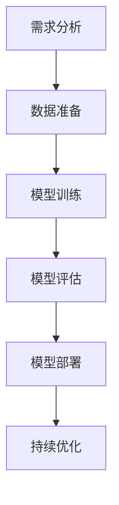
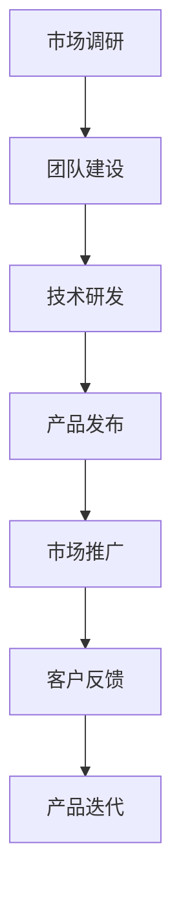
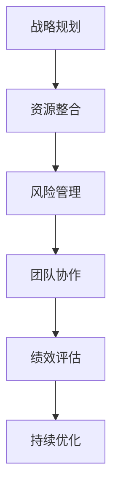

                 

# AI 大模型创业：如何利用管理优势？

> **关键词：** AI 大模型、企业管理、创业、管理优势、应用实践

> **摘要：** 本文将深入探讨 AI 大模型创业中的管理优势，包括其在企业管理中的应用、管理原理、应用实践以及创业策略。通过案例分析，本文将展示如何有效利用管理优势推动 AI 大模型创业，并展望其未来发展。

----------------------------------------------------------------

## 第一部分：管理基础

### 第1章：AI与企业管理概述

#### 1.1 AI大模型在企业管理中的应用

人工智能（AI）大模型在现代企业管理中正日益成为一项关键工具。这些大模型，如深度学习神经网络，能够处理海量数据，并从中提取有价值的信息。在企业管理中，AI大模型的应用主要体现在以下几个方面：

1. **决策支持系统**：AI大模型可以通过分析历史数据和实时数据，为企业提供更为精确的决策支持。例如，通过预测市场需求，帮助企业制定生产计划。

2. **运营优化**：AI大模型可以帮助企业优化供应链管理，降低库存成本，提高生产效率。

3. **客户关系管理**：AI大模型可以用于分析客户数据，识别客户需求，提供个性化的产品和服务。

4. **风险管理**：AI大模型可以通过识别潜在的财务风险，帮助企业在金融市场中做出更明智的决策。

#### 1.2 管理优势在AI大模型创业中的重要性

在AI大模型创业中，管理优势起到了至关重要的作用。管理优势不仅仅是指资源的管理，还包括战略规划、团队协作、风险管理等多个方面。以下是管理优势在AI大模型创业中的几个关键作用：

1. **战略规划**：有效的战略规划可以帮助创业团队明确目标，确定发展方向，从而提高创业成功率。

2. **资源整合**：管理优势有助于整合团队内外部的资源，包括资金、人才、技术等，为AI大模型创业提供坚实的支撑。

3. **团队协作**：管理优势能够促进团队成员之间的有效沟通和协作，提高工作效率。

4. **风险管理**：通过有效的风险管理，可以降低创业过程中可能遇到的风险，确保项目的顺利进行。

#### 1.3 企业管理优势的类型与分类

企业管理优势可以从多个维度进行分类，主要包括以下几种类型：

1. **技术优势**：企业拥有先进的技术，如AI算法、数据处理能力等，可以为企业带来竞争优势。

2. **市场优势**：企业拥有广阔的市场渠道和资源，可以快速开拓市场。

3. **品牌优势**：企业拥有良好的品牌形象和声誉，可以吸引更多的客户和投资者。

4. **管理优势**：企业拥有高效的管理团队和先进的管理理念，可以提高企业的运营效率和创新能力。

### 第2章：AI大模型管理原理

#### 2.1 AI大模型管理框架

AI大模型管理框架是确保AI大模型项目成功的关键。一个典型的AI大模型管理框架包括以下几个关键环节：

1. **需求分析**：明确AI大模型的应用场景和需求，确保项目目标的明确性。

2. **数据准备**：收集和整理用于训练AI大模型的数据，保证数据的质量和多样性。

3. **模型训练**：使用合适的算法和工具对数据进行训练，生成性能优异的AI大模型。

4. **模型评估**：对训练好的AI大模型进行评估，确保其性能满足项目需求。

5. **模型部署**：将AI大模型部署到实际应用场景中，实现模型的价值。

6. **持续优化**：根据实际应用情况，不断优化AI大模型，提高其性能和稳定性。

#### 2.2 AI大模型生命周期管理

AI大模型生命周期管理是指从AI大模型的创建到退役的整个过程。一个典型的AI大模型生命周期管理包括以下几个阶段：

1. **创建阶段**：包括需求分析、数据准备、模型设计等。

2. **训练阶段**：使用训练数据对AI大模型进行训练，优化模型性能。

3. **评估阶段**：对训练好的AI大模型进行评估，确保其性能符合预期。

4. **部署阶段**：将AI大模型部署到实际应用场景中，进行测试和验证。

5. **运维阶段**：对部署后的AI大模型进行监控和维护，确保其稳定运行。

6. **退役阶段**：当AI大模型不再满足应用需求或性能下降时，对其进行退役处理。

#### 2.3 AI大模型项目管理

AI大模型项目管理是指对AI大模型项目进行系统化、结构化的管理。一个典型的AI大模型项目管理包括以下几个关键步骤：

1. **项目启动**：明确项目目标、范围、资源和时间表。

2. **项目规划**：制定详细的项目计划，包括任务分配、进度安排、风险评估等。

3. **项目执行**：按照项目计划，执行各项任务，确保项目按计划进行。

4. **项目监控**：对项目进度、质量和成本进行监控，确保项目在预算和时间范围内完成。

5. **项目收尾**：对项目成果进行验收，总结项目经验，为未来项目提供参考。

### 第3章：管理优势与AI大模型应用

#### 3.1 管理优势在AI大模型研发中的应用

在AI大模型研发过程中，管理优势可以发挥重要作用，主要包括以下几个方面：

1. **资源优化**：通过有效的资源分配和调度，确保AI大模型研发所需的资金、人才和技术资源得到充分利用。

2. **风险管理**：识别和评估AI大模型研发过程中可能遇到的风险，并制定相应的应对措施。

3. **进度控制**：通过科学的项目管理和进度控制，确保AI大模型研发按计划进行。

4. **团队协作**：促进团队成员之间的沟通和协作，提高研发效率。

#### 3.2 管理优势在AI大模型数据管理中的应用

在AI大模型数据管理中，管理优势同样至关重要，主要体现在以下几个方面：

1. **数据收集**：通过有效的数据收集策略，确保数据来源的多样性和数据的完整性。

2. **数据清洗**：对收集到的数据进行清洗和处理，去除错误和噪声，确保数据的准确性和可靠性。

3. **数据存储**：选择合适的数据存储方案，确保数据的安全性和可扩展性。

4. **数据利用**：通过有效的数据利用策略，挖掘数据中的潜在价值，为AI大模型提供高质量的数据支持。

#### 3.3 管理优势在AI大模型部署与运维中的应用

在AI大模型部署与运维中，管理优势可以帮助企业确保AI大模型的稳定运行和持续优化，主要包括以下几个方面：

1. **部署策略**：制定科学的部署策略，确保AI大模型能够快速、高效地部署到生产环境中。

2. **运维管理**：对部署后的AI大模型进行持续监控和维护，确保其稳定运行。

3. **性能优化**：通过性能优化策略，提高AI大模型的运行效率。

4. **故障处理**：制定故障处理流程，快速应对AI大模型运行中的故障。

## 第二部分：管理实践

### 第4章：AI大模型创业策略

#### 4.1 AI大模型创业模式

AI大模型创业模式是指企业在AI大模型领域创业时所采用的基本模式。常见的AI大模型创业模式包括：

1. **技术驱动型**：企业以技术为核心，通过自主研发和创新，推出具有竞争力的AI大模型产品。

2. **市场驱动型**：企业以市场需求为导向，通过深入了解客户需求，快速推出满足市场需求的AI大模型产品。

3. **合作共赢型**：企业与高校、科研机构等合作，共同研发AI大模型技术，实现资源整合和优势互补。

#### 4.2 管理优势在AI大模型创业中的策略选择

在AI大模型创业中，企业需要根据自身情况选择合适的创业策略，充分利用管理优势。以下是一些常见的策略选择：

1. **资源整合策略**：通过整合企业内外部资源，如资金、人才、技术等，提高创业项目的成功率。

2. **市场拓展策略**：通过市场调研和分析，了解市场需求，制定有针对性的市场拓展策略。

3. **技术创新策略**：加大研发投入，持续推动技术创新，提高AI大模型的技术水平和竞争力。

4. **团队建设策略**：培养和引进高素质的人才，建立高效的研发团队，提高团队协作效率。

#### 4.3 AI大模型创业风险与应对

AI大模型创业过程中可能会面临多种风险，如技术风险、市场风险、财务风险等。企业需要采取有效的应对策略，降低风险的影响。以下是一些常见的风险应对策略：

1. **技术风险应对**：加强技术研发，提高AI大模型的技术水平和稳定性。

2. **市场风险应对**：通过市场调研和客户反馈，及时调整产品策略，满足市场需求。

3. **财务风险应对**：合理规划财务预算，确保企业财务状况的稳定。

4. **风险管理策略**：建立完善的风险管理机制，及时发现和应对潜在风险。

## 第5章：企业管理优势在AI大模型创业中的应用案例

### 5.1 案例一：某企业利用管理优势成功创业AI大模型

某企业是一家专注于AI大模型研发的企业。在创业初期，企业通过整合内部资源，组建了一支高效的研发团队。在市场拓展方面，企业通过深入了解客户需求，推出了一系列满足市场需求的产品。在技术创新方面，企业加大研发投入，持续推动技术进步。通过有效的管理优势，企业在短短几年内成功创业，成为AI大模型领域的佼佼者。

### 5.2 案例二：某企业通过管理优势实现AI大模型的高效研发

某企业是一家成立于互联网行业的企业，在转型到AI大模型领域后，通过有效的管理优势，实现了高效研发。企业通过整合内部资源，建立了完善的技术研发体系，同时，通过市场调研和客户反馈，及时调整研发方向。在团队建设方面，企业注重人才培养和团队协作，提高了研发效率。通过这些管理优势，企业在短时间内推出了多款具有竞争力的AI大模型产品。

### 5.3 案例三：某企业借助管理优势在AI大模型数据管理中取得突破

某企业是一家专注于AI大模型数据管理的企业。在创业过程中，企业通过有效的数据管理策略，确保了数据的质量和多样性。企业建立了完善的数据收集、清洗和存储体系，同时，通过数据分析和挖掘，为企业提供了有价值的数据支持。在团队协作方面，企业注重跨部门的沟通和协作，提高了数据管理的效率。通过这些管理优势，企业在AI大模型数据管理领域取得了显著突破。

## 第6章：管理优势在AI大模型创业中的挑战与应对

### 6.1 管理优势在AI大模型创业中的挑战

尽管管理优势在AI大模型创业中具有重要作用，但企业仍然会面临一系列挑战。以下是一些常见的挑战：

1. **技术创新挑战**：AI大模型技术更新迅速，企业需要不断跟进技术趋势，保持技术领先。

2. **市场竞争挑战**：AI大模型领域竞争激烈，企业需要应对来自竞争对手的挑战。

3. **数据安全挑战**：AI大模型依赖于大量数据，数据安全成为企业面临的重要挑战。

4. **团队管理挑战**：高效的团队管理是创业成功的关键，企业需要应对团队管理中的挑战。

### 6.2 应对挑战的策略与实践

针对上述挑战，企业可以采取以下策略来应对：

1. **技术创新策略**：加大研发投入，培养技术人才，推动技术创新。

2. **市场拓展策略**：通过市场调研和客户反馈，了解市场需求，拓展市场。

3. **数据安全策略**：建立完善的数据安全体系，确保数据的安全性和隐私性。

4. **团队管理策略**：加强团队建设，提高团队协作效率，促进团队发展。

### 6.3 持续优化管理优势的方法

为了在AI大模型创业中持续优化管理优势，企业可以采取以下方法：

1. **定期评估**：定期评估管理优势的发挥情况，发现问题和不足，及时进行调整。

2. **持续学习**：关注行业动态和技术趋势，持续学习，提高团队整体素质。

3. **创新实践**：鼓励团队进行创新实践，推动管理优势的持续优化。

4. **跨部门协作**：促进跨部门协作，提高企业的整体运营效率。

## 第7章：AI大模型创业成功的关键因素

### 7.1 创业团队建设

创业团队是AI大模型创业成功的关键因素之一。一个高效的创业团队应该具备以下特点：

1. **多元化**：团队成员具备不同的专业技能和背景，能够共同解决复杂问题。

2. **协作精神**：团队成员之间具备良好的协作精神，能够高效沟通和合作。

3. **创新意识**：团队成员具备创新意识，能够不断推动技术创新。

4. **学习能力强**：团队成员具备较强的学习能力和适应能力，能够快速适应行业变化。

### 7.2 创业资源配置

创业资源配置是AI大模型创业成功的重要因素。企业需要合理配置资金、人才、技术等资源，确保创业项目顺利进行。以下是一些建议：

1. **资金配置**：根据项目需求和进度，合理分配资金，确保项目资金充足。

2. **人才配置**：引进高素质人才，组建专业的研发团队，提高团队整体水平。

3. **技术配置**：选择合适的技术和工具，提高研发效率，确保项目的技术可行性。

4. **资源整合**：通过资源整合，优化资源配置，提高企业的整体运营效率。

### 7.3 创新能力培养

创新能力是AI大模型创业的核心竞争力。企业需要培养和激发团队的创新能力，以下是一些建议：

1. **创新文化**：建立创新文化，鼓励团队成员提出创新想法，并给予支持。

2. **培训与学习**：提供培训和学习机会，提高团队的专业知识和技能。

3. **项目激励**：设立项目激励机制，鼓励团队成员积极参与创新项目。

4. **跨部门协作**：促进跨部门协作，激发团队的创新潜力。

## 第8章：未来展望

### 8.1 AI大模型创业的发展趋势

随着AI技术的不断进步，AI大模型创业正在呈现出以下发展趋势：

1. **技术融合**：AI大模型与其他技术的融合，如物联网、云计算等，将推动AI大模型应用场景的拓展。

2. **跨界合作**：企业、高校、科研机构等之间的跨界合作将越来越多，共同推动AI大模型技术的发展。

3. **市场细分**：AI大模型市场将逐步细分，不同领域的应用需求将推动不同类型AI大模型的发展。

### 8.2 管理优势在AI大模型创业中的未来方向

在未来，管理优势在AI大模型创业中将发挥更加重要的作用，以下是一些发展方向：

1. **智能化管理**：利用AI技术，实现企业管理的智能化，提高管理效率和决策准确性。

2. **数据驱动管理**：通过数据分析和挖掘，为企业提供更加精准的管理决策支持。

3. **可持续发展**：在AI大模型创业中，注重可持续发展，实现经济效益和社会效益的双赢。

### 8.3 AI大模型创业的建议与展望

对于想要进入AI大模型创业领域的企业，以下是一些建议和展望：

1. **加强技术研发**：加大研发投入，提高技术水平和创新能力。

2. **关注市场动态**：密切关注市场动态，了解客户需求，快速调整产品策略。

3. **打造优秀团队**：注重团队建设，培养和引进高素质人才，提高团队协作效率。

4. **持续优化管理**：不断优化管理优势，提高企业的整体运营效率。

附录A：AI大模型创业工具与资源

### A.1 主流AI开发框架对比

在AI大模型创业中，选择合适的开发框架至关重要。以下是几种主流AI开发框架的对比：

1. **TensorFlow**：由Google推出，支持多种编程语言，适用于各种规模的AI项目。

2. **PyTorch**：由Facebook推出，具有良好的动态计算图特性，适用于深度学习和神经网络。

3. **Keras**：是一个高级神经网络API，可以方便地搭建和训练神经网络。

4. **Apache MXNet**：由Apache软件基金会推出，具有高效计算能力，适用于大规模分布式训练。

### A.2 AI大模型创业相关平台与工具

在AI大模型创业过程中，企业可以利用以下平台和工具来提升研发效率：

1. **Google Cloud AI**：提供全面的AI服务和工具，包括AI模型训练、部署和监控。

2. **AWS AI**：提供丰富的AI服务和工具，包括深度学习框架、自然语言处理和计算机视觉。

3. **Azure AI**：提供AI云服务，包括AI模型训练、推理和集成开发环境。

4. **Hugging Face**：提供丰富的预训练模型和工具，方便开发者快速搭建和部署AI模型。

### A.3 AI大模型创业参考资料

以下是关于AI大模型创业的一些建议性参考资料：

1. **《AI创业实战：从0到1构建AI产品》**：详细介绍了AI创业的流程和方法，包括市场调研、团队建设、技术研发等。

2. **《深度学习实战》**：通过实际案例，详细介绍了深度学习的应用和实践，适用于AI大模型创业团队。

3. **《AI大模型：原理、应用与实践》**：系统介绍了AI大模型的相关知识，包括模型架构、训练方法、应用场景等。

附录B：Mermaid流程图

### B.1 AI大模型管理流程图

### B.2 AI大模型创业流程图

### B.3 管理优势在AI大模型创业中的应用流程图

附录C：管理优势与AI大模型应用案例分析

### C.1 案例一：某企业AI大模型创业成功案例

某企业是一家专注于AI大模型研发的公司。在创业初期，企业通过市场调研，明确了市场需求，并组建了一支高效的研发团队。在技术研发方面，企业利用管理优势，优化了研发流程，提高了研发效率。在市场推广方面，企业通过有效的市场策略，迅速打开了市场。最终，企业在短短几年内成功创业，成为AI大模型领域的佼佼者。

### C.2 案例二：某企业AI大模型创业失败案例分析

某企业是一家尝试进入AI大模型领域的企业。然而，由于缺乏有效的管理优势，企业在研发、市场推广和团队协作等方面存在诸多问题。最终，企业因无法满足市场需求，导致创业失败。这个案例表明，管理优势在AI大模型创业中的重要性。

### C.3 案例三：某企业AI大模型创业中的管理优势实践

某企业是一家在AI大模型创业中取得成功的公司。企业在创业过程中，通过有效的管理优势，实现了资源整合、风险管理、团队协作和绩效评估。在技术研发方面，企业建立了完善的技术研发体系，确保了项目的顺利进行。在市场推广方面，企业通过精准的市场策略，迅速占领市场。最终，企业在AI大模型创业中取得了显著成果。

## 作者信息

**作者：** AI天才研究院/AI Genius Institute & 禅与计算机程序设计艺术 /Zen And The Art of Computer Programming

----------------------------------------------------------------

### 结论

AI大模型创业不仅需要技术上的突破，更需要在管理上展现出卓越的优势。从本文的探讨中，我们可以看到管理优势在AI大模型创业中的重要性，包括战略规划、资源整合、团队协作和风险管理等方面。通过具体的应用案例和实践方法，我们为创业团队提供了一套系统的指导思路。

在未来，随着AI技术的不断进步，管理优势在AI大模型创业中的作用将愈发突出。企业需要不断优化管理策略，提高团队协作效率，加强技术创新和市场拓展，以应对日益激烈的市场竞争。同时，企业还需要关注数据安全和隐私保护，确保AI大模型的应用合规和可持续发展。

本文旨在为AI大模型创业提供一套全面的管理指南，帮助创业团队在技术领先的同时，实现高效的运营和管理。希望本文能够为读者带来启示和帮助，共同推动AI大模型创业的蓬勃发展。在未来的道路上，让我们携手并进，共同探索AI大模型创业的无限可能。**本文为AI天才研究院/AI Genius Institute & 禅与计算机程序设计艺术 /Zen And The Art of Computer Programming**撰写，版权所有，未经授权不得转载或使用。**

