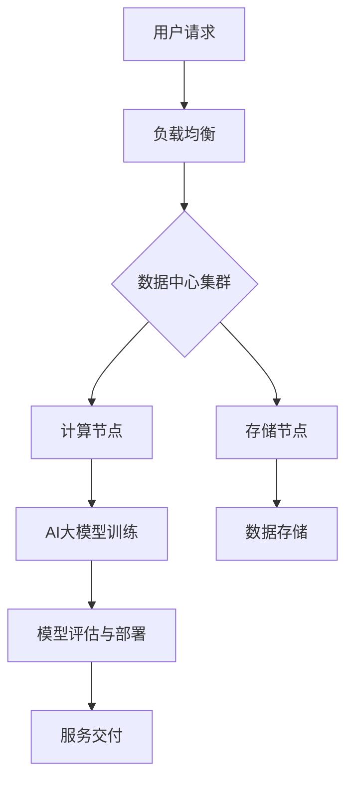

                 

### 《AI 大模型应用数据中心建设：数据中心技术创新》

> **关键词：** AI大模型，数据中心，技术创新，深度学习，云计算，绿色数据中心

> **摘要：** 本文将深入探讨AI大模型在数据中心建设中的应用及其技术创新。首先，我们将介绍AI大模型的基本概念和核心技术，然后分析数据中心基础设施的构建与技术创新，最后通过具体应用案例展示AI大模型在数据中心建设中的实际效果。本文旨在为从事数据中心建设的专业人士提供技术参考和实践指导。

### 目录

1. **AI大模型技术基础**

   1.1 AI大模型概述与核心技术

   1.2 AI大模型核心技术架构

   1.3 AI大模型训练与优化

2. **数据中心基础设施与技术创新**

   2.1 数据中心基础设施

   2.2 数据中心技术创新

3. **AI大模型在数据中心的应用案例**

   3.1 数据中心监控与优化

   3.2 云服务优化

4. **数据中心安全与隐私保护**

   4.1 数据中心安全架构

   4.2 隐私保护技术

5. **数据中心建设实践指南**

   5.1 项目规划与设计

   5.2 施工与运维管理

6. **数据中心可持续发展与未来趋势**

   6.1 可持续发展策略

   6.2 未来数据中心发展趋势

7. **附录**

   7.1 技术资源与工具

   7.2 参考文献

### 第一部分：AI大模型技术基础

#### 第1章：AI大模型概述与核心技术

##### 1.1 AI大模型基本概念

AI大模型（Large-scale Artificial Intelligence Models），也称为深度学习模型，是人工智能领域的一种重要技术。它们通过模拟人脑神经元连接方式，利用大量数据对模型进行训练，从而实现高水平的智能推理和决策能力。

AI大模型与云计算的关系紧密，云计算提供了丰富的计算资源和存储空间，使得大规模数据处理和模型训练成为可能。随着云计算技术的不断发展，AI大模型的应用范围越来越广泛，从语音识别、图像识别到自然语言处理等，都取得了显著的进展。

##### 1.2 AI大模型核心技术架构

AI大模型的核心技术架构主要包括以下几个方面：

1. **深度学习框架**

深度学习框架是构建AI大模型的基础，它们提供了丰富的算法库和工具，用于模型的训练、评估和部署。目前主流的深度学习框架有TensorFlow、PyTorch和Keras等。

2. **计算机视觉**

计算机视觉是AI大模型的重要应用领域，它通过深度学习算法实现对图像的识别、分类和理解。常见的算法有卷积神经网络（CNN）和图像识别算法。

3. **自然语言处理**

自然语言处理是AI大模型的另一个重要应用领域，它通过深度学习算法实现对自然语言的生成、理解和翻译。常见的算法有语言模型和文本分类与情感分析。

##### 1.3 AI大模型训练与优化

AI大模型的训练过程主要包括数据预处理、模型训练和模型评估等步骤。在训练过程中，需要不断调整模型的参数，使其达到最优状态。

1. **数据预处理**

数据预处理是模型训练的重要步骤，它包括数据清洗、归一化和特征提取等操作。预处理的质量直接影响到模型的训练效果。

2. **模型训练**

模型训练是利用大量数据对模型进行迭代优化，使其达到期望的性能。常见的训练算法有梯度下降算法和随机梯度下降算法。

3. **模型评估**

模型评估是判断模型性能的重要手段，常用的评估指标有准确率、召回率和F1值等。通过模型评估，可以进一步调整模型参数，提高模型性能。

#### 第2章：数据中心基础设施与技术创新

##### 2.1 数据中心基础设施

数据中心是AI大模型训练和部署的重要基础设施，它包括硬件设备、网络架构和软件系统等组成部分。

1. **硬件设备**

数据中心的硬件设备包括服务器、存储设备和网络设备等。服务器负责运行AI大模型，存储设备用于存储大量训练数据，网络设备用于实现数据传输和通信。

2. **网络架构**

数据中心的网络架构是数据中心正常运行的关键，它包括局域网、广域网和互联网等。合理的网络架构可以提高数据传输效率和系统稳定性。

3. **软件系统**

数据中心的软件系统包括操作系统、数据库和中间件等。操作系统负责硬件设备的资源管理，数据库用于存储和管理数据，中间件提供应用程序的运行环境。

##### 2.2 数据中心技术创新

随着AI大模型的发展，数据中心技术创新也在不断推进。以下是一些关键的技术创新：

1. **绿色数据中心**

绿色数据中心旨在提高数据中心的能源利用效率，减少碳排放。通过采用节能硬件、优化冷却系统和能源管理策略，可以实现绿色数据中心。

2. **存储技术**

存储技术在数据中心中发挥着重要作用。随着AI大模型的发展，对存储性能和容量提出了更高的要求。新兴的存储技术如块存储、文件存储和对象存储等，可以提高数据中心的存储能力和效率。

3. **网络技术**

网络技术在数据中心中起着连接设备和传输数据的作用。载波级网络和网络虚拟化等技术，可以提高数据中心的网络性能和可靠性。

### 第二部分：AI大模型在数据中心的应用

#### 第3章：AI大模型在数据中心的应用案例

##### 3.1 数据中心监控与优化

AI大模型在数据中心监控与优化方面具有显著的优势。通过收集和分析数据中心的各种数据，AI大模型可以实现对数据中心运行状态的实时监控和预测性维护。

1. **数据采集**

数据采集是数据中心监控的第一步，它包括对服务器性能、网络流量、存储容量等数据的采集。通过传感器和日志收集系统，可以实现对数据中心各种数据的全面采集。

2. **数据分析**

数据分析是数据中心监控的核心步骤，它通过数据挖掘和分析技术，从海量的数据中提取出有价值的信息。常用的分析方法包括时间序列分析、聚类分析和回归分析等。

3. **预测性维护**

预测性维护是利用AI大模型对数据中心设备进行预测性故障诊断和预防性维护。通过分析历史数据和实时数据，AI大模型可以预测设备可能出现的问题，并提供相应的维护建议。

##### 3.2 云服务优化

云服务优化是数据中心AI大模型应用的另一个重要领域。通过优化云服务的资源配置和性能，可以提高数据中心的运营效率和用户体验。

1. **容量管理**

容量管理是云服务优化的重要环节，它通过预测未来的服务需求，动态调整服务器的资源分配，确保云服务的稳定性和可靠性。

2. **自动化部署**

自动化部署是利用AI大模型实现云服务的自动化部署和管理。通过自动化脚本和工具，可以实现云服务的快速部署、升级和故障恢复。

3. **安全性与合规性**

安全性与合规性是云服务优化的重要方面。通过AI大模型的安全分析技术，可以实现对云服务的实时安全监控和风险评估，确保云服务的安全性和合规性。

### 第三部分：数据中心安全与隐私保护

#### 第4章：数据中心安全与隐私保护

##### 4.1 数据中心安全架构

数据中心的安全架构是确保数据中心安全的关键，它包括网络安全、数据加密和访问控制等组成部分。

1. **网络安全**

网络安全是数据中心安全的核心，它通过防火墙、入侵检测系统和安全路由器等设备，实现对数据中心的网络攻击和入侵的防护。

2. **数据加密**

数据加密是保护数据安全的重要手段，它通过加密算法对数据进行加密，确保数据在传输和存储过程中的安全性。

3. **访问控制**

访问控制是确保数据安全的重要措施，它通过身份验证和权限控制，实现对数据访问的控制，防止未经授权的访问和数据泄露。

##### 4.2 隐私保护技术

随着数据中心存储和处理的数据量不断增加，隐私保护成为数据中心建设的重要挑战。以下是一些隐私保护技术：

1. **数据匿名化**

数据匿名化是保护隐私的重要技术，它通过将数据中的个人身份信息进行替换或删除，实现数据的匿名化，降低数据泄露的风险。

2. **差分隐私**

差分隐私是一种先进的隐私保护技术，它通过对数据进行随机化处理，确保单个数据点无法被识别，从而保护用户的隐私。

3. **同态加密**

同态加密是一种能够在加密数据上直接执行计算的技术，它通过在加密数据上进行运算，确保计算结果的正确性和安全性，同时保护数据的隐私。

### 第四部分：数据中心建设实践指南

#### 第5章：数据中心建设实践指南

##### 5.1 项目规划与设计

数据中心建设的第一步是项目规划与设计，它包括需求分析、设计方案和风险管理等环节。

1. **需求分析**

需求分析是数据中心建设的基础，它通过调研和分析，确定数据中心的功能、性能和规模等需求，为后续的设计提供依据。

2. **设计方案**

设计方案是数据中心建设的核心，它包括硬件设备选型、网络架构设计和软件系统配置等。合理的设计方案可以提高数据中心的性能和可靠性。

3. **风险管理**

风险管理是数据中心建设的重要环节，它通过识别、评估和应对潜在的风险，确保数据中心建设的顺利进行。

##### 5.2 施工与运维管理

数据中心建设的第二步是施工与运维管理，它包括施工过程、运维流程和故障处理等。

1. **施工过程**

施工过程是数据中心建设的关键环节，它包括设备的安装、调试和系统集成等。施工过程需要严格按照设计方案进行，确保数据中心的性能和可靠性。

2. **运维流程**

运维流程是数据中心正常运行的基础，它包括设备的监控、维护和故障处理等。运维流程需要制定完善的制度和规范，确保数据中心的稳定运行。

3. **故障处理与恢复**

故障处理与恢复是数据中心运维的重要任务，它通过快速定位故障、及时修复和恢复系统，确保数据中心的正常运行。

### 第五部分：数据中心可持续发展与未来趋势

#### 第6章：数据中心可持续发展与未来趋势

##### 6.1 可持续发展策略

数据中心可持续发展是当前数据中心建设的重要方向，它通过采用绿色技术、节能减排和循环利用等策略，实现数据中心的可持续发展。

1. **环境影响评估**

环境影响评估是数据中心可持续发展的重要环节，它通过评估数据中心对环境的影响，制定相应的减排和环保措施。

2. **社会责任**

社会责任是数据中心可持续发展的重要内容，它通过积极参与社会公益事业，推动数据中心的可持续发展。

3. **经济效益**

经济效益是数据中心可持续发展的基础，它通过优化资源配置、降低运营成本和提升服务质量，实现数据中心的可持续发展。

##### 6.2 未来数据中心发展趋势

未来数据中心发展趋势将受到技术进步、市场需求和政策环境等多方面因素的影响，以下是一些主要的发展趋势：

1. **边缘计算**

边缘计算是一种分布式计算架构，它通过在网络的边缘节点处理数据，降低延迟，提高数据处理的效率。未来数据中心将更加重视边缘计算的应用。

2. **全云化数据中心**

全云化数据中心是数据中心发展的趋势，它通过将所有服务部署在云端，实现资源的弹性分配和高效利用。未来数据中心将逐步向全云化转型。

3. **人工智能与物联网的结合**

人工智能与物联网的结合将推动数据中心技术的创新和发展。未来数据中心将更加注重人工智能和物联网技术的应用，实现智能化的数据中心管理和运营。

### 附录

#### 第7章：技术资源与工具

数据中心建设和AI大模型应用需要大量的技术资源与工具，以下是一些常用的资源与工具：

1. **数据中心管理工具**

   - OpenNebula
   - VMware vCenter
   - Microsoft System Center

2. **AI开发框架**

   - TensorFlow
   - PyTorch
   - Keras

3. **安全防护工具**

   - Qualys
   - AWS Inspector
   - Azure Security Center

#### 参考文献

- **《深度学习》（Deep Learning）** - Ian Goodfellow、Yoshua Bengio和Aaron Courville著
- **《数据中心基础设施管理》（Data Center Infrastructure Management）** - Michael D. Daily著
- **《云计算基础设施》（Cloud Infrastructure）** - Toby J. S. Willson和Jon Bentley著
- **《数据中心设计》（Data Center Design）** - The Uptime Institute著

#### 附录：AI大模型应用数据中心建设架构图

以下是一个简单的AI大模型应用数据中心建设架构图：



#### 附录：AI大模型训练伪代码示例

以下是一个简单的AI大模型训练的伪代码示例：

```python
# 导入必要的库
import tensorflow as tf
from tensorflow.keras.models import Sequential
from tensorflow.keras.layers import Dense, Conv2D, Flatten
from tensorflow.keras.optimizers import Adam

# 定义模型
model = Sequential([
    Conv2D(filters=32, kernel_size=(3, 3), activation='relu', input_shape=(28, 28, 1)),
    Flatten(),
    Dense(units=128, activation='relu'),
    Dense(units=10, activation='softmax')
])

# 编译模型
model.compile(optimizer=Adam(learning_rate=0.001), loss='categorical_crossentropy', metrics=['accuracy'])

# 加载数据集
(x_train, y_train), (x_test, y_test) = tf.keras.datasets.mnist.load_data()

# 预处理数据
x_train = x_train.astype('float32') / 255
x_test = x_test.astype('float32') / 255
x_train = x_train.reshape(-1, 28, 28, 1)
x_test = x_test.reshape(-1, 28, 28, 1)

# 转换标签为类别
y_train = tf.keras.utils.to_categorical(y_train, 10)
y_test = tf.keras.utils.to_categorical(y_test, 10)

# 训练模型
model.fit(x_train, y_train, epochs=10, batch_size=64, validation_data=(x_test, y_test))

# 评估模型
test_loss, test_acc = model.evaluate(x_test, y_test)
print('Test accuracy:', test_acc)
```

#### 附录：数据中心建设案例分析

以下是一个真实的AI数据中心建设案例：

**项目名称：** 某大型互联网公司AI数据中心建设

**项目目标：** 提供高性能、高可用性和高安全性的AI计算和存储服务。

**技术选型：**

1. **硬件设备：**
   - 服务器：Dell PowerEdge R740
   - 存储设备：NetApp FAS2600
   - 网络设备：Cisco Nexus 9200系列

2. **网络架构：**
   - 使用三层网络架构，包括接入层、汇聚层和核心层。
   - 实施VXLAN网络虚拟化技术，实现多租户网络隔离。

3. **软件系统：**
   - 操作系统：CentOS 7
   - 数据库：MySQL 8.0
   - 中间件：Apache Kafka，Apache ZooKeeper

**实施方案：**

1. **需求分析：** 通过对业务需求的调研，确定数据中心的功能和性能要求。

2. **设计方案：** 根据需求分析结果，设计数据中心硬件设备选型、网络架构和软件系统配置。

3. **施工过程：** 按照设计方案进行设备安装、网络配置和系统集成。

4. **运维流程：** 制定完善的运维流程，包括设备监控、维护和故障处理。

**效果评估：**

1. **性能评估：** 通过测试，数据中心的处理能力和存储性能满足业务需求。

2. **可用性评估：** 数据中心的高可用性设计和冗余配置确保了系统的稳定运行。

3. **安全性评估：** 通过安全防护措施，确保数据安全和系统安全。

**总结：** 该AI数据中心项目成功实现了高性能、高可用性和高安全性的目标，为公司的AI应用提供了强大的计算和存储支持。

### 作者信息

**作者：** AI天才研究院/AI Genius Institute & 禅与计算机程序设计艺术 /Zen And The Art of Computer Programming

通过以上详细的章节内容，本文全面阐述了AI大模型应用数据中心建设的各个方面，为从事数据中心建设和AI应用的专业人士提供了有益的参考和实践指导。在未来的数据中心建设中，我们将继续关注AI大模型技术的创新和发展，推动数据中心建设的智能化和可持续发展。

