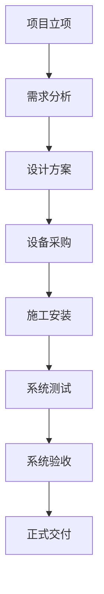
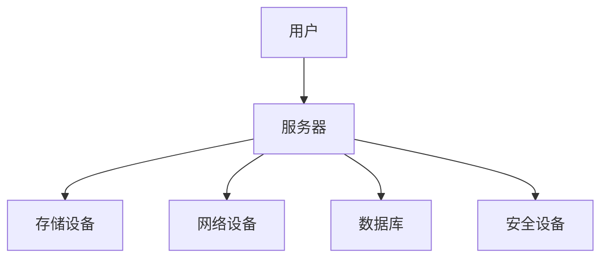

                 

### 文章标题

《AI 大模型应用数据中心建设：数据中心投资与建设》

### 关键词

- AI 大模型
- 数据中心建设
- 投资预算
- 基础设施规划
- 运维管理
- 安全保障
- 案例分析

### 摘要

本文旨在探讨 AI 大模型应用数据中心的建设过程及其投资策略。通过对数据中心发展历程、选址原则、基础设施规划、建设流程、运维管理和安全保障等方面的详细分析，本文为从业者提供了系统性、实用性的指导。同时，通过实际案例的深入剖析，本文展现了数据中心建设中的关键环节与最佳实践，为读者提供了宝贵的一手经验。文章结构紧凑、逻辑清晰，旨在帮助读者全面理解数据中心建设的复杂性及其对 AI 大模型应用的重要性。

## 《AI 大模型应用数据中心建设：数据中心投资与建设》目录大纲

### 第一部分：AI 大模型应用数据中心建设基础

### 第1章：数据中心建设概述

- 1.1 数据中心发展历程
- 1.2 数据中心的关键组件
- 1.3 数据中心与AI大模型的关系

### 第2章：数据中心选址与布局

- 2.1 数据中心选址原则
- 2.2 数据中心布局设计

### 第3章：数据中心基础设施规划

- 3.1 数据中心投资预算
- 3.2 数据中心硬件配置
- 3.3 数据中心软件配置

### 第4章：数据中心建设流程

- 4.1 项目规划与立项
- 4.2 设计与采购
- 4.3 施工与调试
- 4.4 系统验收与交付

### 第5章：数据中心运维管理

- 5.1 数据中心运维团队组织
- 5.2 数据中心运维流程
- 5.3 数据中心性能监控

### 第6章：数据中心安全保障

- 6.1 数据中心安全策略
- 6.2 数据中心安全措施
- 6.3 应急响应与灾备

### 第7章：数据中心投资与建设案例分析

- 7.1 案例一：某大型互联网公司数据中心建设
- 7.2 案例二：某人工智能公司数据中心建设

### 附录

- 附录A：数据中心建设参考资源
- 附录B：Mermaid 流程图
- 附录C：伪代码示例
- 附录D：数学公式与解释
- 附录E：代码示例与分析

---

接下来，我们将进入第一部分：AI 大模型应用数据中心建设基础。首先，让我们从数据中心的发展历程开始，了解其演变过程以及在不同发展阶段的特征。这将为我们理解数据中心在当前 AI 大模型时代的重要性奠定基础。

### 第1章：数据中心建设概述

#### 1.1 数据中心发展历程

数据中心的起源可以追溯到 20 世纪 50 年代，当时主要集中在大企业和政府机构中，用于存储和管理大量数据。最早的数据中心主要依赖于大型主机和磁盘存储，功能相对单一，主要是提供基本的计算和存储服务。

随着计算机技术的进步和互联网的普及，数据中心的规模和功能逐渐扩大。从 20 世纪 80 年代到 90 年代，服务器和网络设备的性能不断提升，数据中心开始引入分布式计算和存储技术，使得数据处理能力得到了显著增强。

进入 21 世纪，云计算、大数据和人工智能等新兴技术的快速发展，对数据中心提出了更高的要求。数据中心开始向虚拟化、自动化和智能化方向转型，不仅提供计算和存储服务，还具备了数据处理、分析和优化的能力。

当前，数据中心已经成为现代信息社会的重要基础设施，支撑着各行各业的数据存储和处理需求。特别是 AI 大模型的兴起，使得数据中心面临着前所未有的挑战和机遇。

#### 1.2 数据中心的关键组件

一个典型的数据中心通常包括以下关键组件：

1. **服务器和网络设备**：服务器是数据中心的核心计算设备，用于运行各种应用程序和处理数据。网络设备包括交换机、路由器等，负责数据的传输和通信。

2. **存储系统**：存储系统用于存储数据，包括磁盘阵列、固态硬盘等。现代数据中心通常采用分布式存储架构，以提高存储容量和可靠性。

3. **电源和冷却系统**：数据中心需要大量的电力供应，并且需要有效的冷却系统来维持设备正常运行。现代数据中心通常采用模块化电源和液冷等高效冷却技术。

#### 1.3 数据中心与AI大模型的关系

AI 大模型的训练和推理过程对数据中心的性能和稳定性提出了极高的要求。以下方面是数据中心在支持 AI 大模型应用时需要重点关注的关键点：

1. **计算能力**：AI 大模型需要大量的计算资源，数据中心需要具备高性能的计算设备，如 GPU、TPU 等。

2. **存储容量**：AI 大模型训练过程中需要存储大量的数据，数据中心需要具备足够大的存储容量和快速的存取速度。

3. **网络带宽**：数据中心的网络带宽需要能够支持大规模数据传输，以减少模型训练和推理的延迟。

4. **可靠性**：AI 大模型应用通常要求高可用性和低故障率，数据中心需要采用冗余设计和故障恢复机制，以确保系统的稳定运行。

5. **能耗管理**：AI 大模型的训练和推理过程消耗大量电力，数据中心需要采用高效的能耗管理策略，以降低运营成本和环境负荷。

总之，数据中心在 AI 大模型时代的重要性不言而喻。通过深入了解数据中心的发展历程和关键组件，我们可以更好地理解数据中心在支持 AI 大模型应用中的关键作用。下一章，我们将探讨数据中心选址与布局的原则，以帮助读者更好地规划数据中心的建设。

### 第2章：数据中心选址与布局

#### 2.1 数据中心选址原则

数据中心选址是数据中心建设过程中至关重要的一步，它直接影响到数据中心的性能、可靠性和成本。以下是数据中心选址时需要考虑的几个关键原则：

1. **地理位置**：选择地理位置时，需要考虑距离用户较近，以降低网络延迟，提高用户体验。同时，应避免地震、洪水等自然灾害频发的地区。

2. **电力供应**：数据中心需要大量的电力供应，因此选址时需要考虑电力供应的稳定性和价格。一般来说，应选择电力资源丰富且价格合理的地区。

3. **网络连通性**：数据中心需要与其他网络节点连接，因此选址时需要考虑网络带宽和延迟。选择具有良好网络连通性的地区，可以确保数据的高速传输。

4. **环境因素**：环境因素包括气候条件、温度、湿度等。数据中心需要保持恒温、恒湿的环境，以保障设备正常运行。因此，选址时应考虑具有适宜气候条件的地区。

5. **土地和建筑成本**：数据中心建设需要占用大量土地和建筑设施，因此土地和建筑成本也是一个重要考虑因素。应选择成本较低的地区，以降低建设成本。

6. **政策支持**：不同国家和地区对数据中心建设的政策支持力度不同，选择政策支持力度大的地区，可以享受税收优惠、土地优惠等政策，从而降低建设成本。

#### 2.2 数据中心布局设计

数据中心布局设计是确保数据中心正常运行的关键环节，以下是数据中心布局设计时需要考虑的几个关键方面：

1. **机房布局**：机房布局应合理分配设备位置，确保设备的通风、散热和电源供应。一般采用机柜排布的方式，机柜之间保持适当的间距，以便于运维和管理。

2. **冷热通道设计**：冷热通道设计是数据中心散热系统的重要组成部分。冷通道设计用于将冷却空气送入机房，冷却设备；热通道设计用于收集设备散发的热量，并将其排出。合理的冷热通道设计可以显著提高数据中心的散热效率。

3. **设备布局和通风设计**：设备布局和通风设计应确保设备的散热需求得到满足。一般采用顶部送风、底部排风的布局方式，使冷却空气从顶部进入设备，热空气从底部排出。

4. **网络布局**：网络布局应确保数据的高效传输，降低网络延迟。网络设备应合理分布在数据中心内部，形成冗余结构，以提高网络的可靠性。

5. **电源和备份电源布局**：数据中心需要充足的电源供应，并配备备用电源系统，以确保在主电源故障时能够正常运行。电源布局应确保设备能够方便地接入电源，并配备适当的断电保护措施。

6. **安全设计**：数据中心应具备良好的物理安全措施，包括门禁系统、视频监控、防火系统等，以确保设备安全和数据安全。

通过合理的数据中心选址和布局设计，可以确保数据中心在性能、可靠性和成本控制方面达到最佳状态。下一章，我们将探讨数据中心基础设施规划，包括投资预算、硬件配置和软件配置等方面，为数据中心建设提供详细的规划指导。

### 第3章：数据中心基础设施规划

数据中心基础设施规划是确保数据中心正常运行和高效服务的关键环节。在这一章节中，我们将详细讨论数据中心的投资预算、硬件配置和软件配置。

#### 3.1 数据中心投资预算

数据中心的投资预算是数据中心建设过程中至关重要的一步，它直接关系到项目能否顺利实施和未来的运营成本。以下是一些主要方面的投资预算：

1. **硬件投资预算**：包括服务器、存储设备、网络设备、电源和冷却系统等。这些设备的投资预算应根据数据中心规模、性能需求和预期负载进行合理规划。

2. **软件投资预算**：包括操作系统、数据库系统、AI 大模型框架等。这些软件的投资预算应考虑到功能需求、性能优化和可扩展性等因素。

3. **建设成本**：包括土地购置、基础设施建设、装修等。数据中心建设成本受地理位置、建筑标准、设备采购等多种因素影响。

4. **运维成本**：包括人员成本、设备维护、能耗等。运维成本是数据中心长期运营中的一项重要支出，应合理预算和优化。

5. **应急备用预算**：包括备用电源、备件储备等。应急备用预算用于应对设备故障、自然灾害等突发事件，以确保数据中心的高可用性和稳定性。

#### 3.2 数据中心硬件配置

数据中心硬件配置是数据中心基础设施规划的核心，以下是一些主要硬件配置的考虑因素：

1. **服务器配置**：服务器是数据中心的计算核心，配置包括处理器（CPU）、内存（RAM）、硬盘（HDD/SSD）等。服务器配置应考虑计算性能、存储容量和可扩展性。

2. **存储设备配置**：存储设备包括磁盘阵列、固态硬盘等。存储设备配置应考虑数据容量、存取速度和可靠性。分布式存储架构可以提供更高的数据可靠性和性能。

3. **网络设备配置**：网络设备包括交换机、路由器、防火墙等。网络设备配置应考虑网络带宽、延迟和安全性。高可用性和冗余设计可以提高数据中心的网络可靠性。

4. **电源和冷却系统配置**：电源系统包括不间断电源（UPS）和备用电源。冷却系统包括空调、液冷等。电源和冷却系统配置应考虑数据中心电力需求和散热需求。

#### 3.3 数据中心软件配置

数据中心软件配置是数据中心基础设施规划的重要部分，以下是一些主要软件配置的考虑因素：

1. **操作系统**：操作系统是数据中心的运行基础，包括 Windows Server、Linux 等。选择操作系统时应考虑兼容性、稳定性和性能。

2. **数据库系统**：数据库系统用于存储和管理数据，包括 MySQL、Oracle、MongoDB 等。选择数据库系统时应考虑数据规模、查询性能和可扩展性。

3. **AI 大模型框架**：AI 大模型框架用于训练和部署 AI 大模型，如 TensorFlow、PyTorch、Keras 等。选择 AI 大模型框架时应考虑模型性能、兼容性和社区支持。

4. **管理软件**：管理软件用于监控、管理和优化数据中心资源，包括 Zabbix、Nagios、Puppet 等。选择管理软件时应考虑功能完整性、易用性和可扩展性。

通过合理的投资预算、硬件配置和软件配置，可以确保数据中心具备高效、稳定和可扩展的能力，为 AI 大模型应用提供坚实的支持。下一章，我们将详细探讨数据中心建设流程，包括项目规划、设计与采购、施工与调试、系统验收与交付等环节。

### 第4章：数据中心建设流程

数据中心建设是一个复杂而系统的过程，涉及多个环节，包括项目规划、设计与采购、施工与调试、系统验收与交付等。以下将详细探讨这些环节的步骤、关键要点及注意事项。

#### 4.1 项目规划与立项

项目规划与立项是数据中心建设的第一步，其主要任务是明确项目目标、范围和可行性，为后续工作奠定基础。

1. **项目目标**：明确数据中心建设的目标，包括性能指标、可靠性要求、安全性保障等。

2. **项目范围**：确定数据中心建设的范围，包括硬件设备、软件系统、配套设施等。

3. **可行性分析**：进行技术、经济、市场等方面的可行性分析，评估项目实施的可能性。

4. **立项审批**：根据项目规划，提交立项申请，经过相关部门的审批，确保项目合法合规。

关键要点：
- 确保项目目标明确、具体，可量化。
- 充分考虑各种风险和不确定性，制定应对策略。
- 立项审批应严格按照公司及行业规定执行。

#### 4.2 设计与采购

设计与采购是数据中心建设的核心环节，其主要任务是制定详细的设计方案，选择合适的设备供应商。

1. **需求分析**：根据项目目标，进行详细的需求分析，明确设备性能、功能、容量等需求。

2. **设计方案**：制定数据中心的设计方案，包括机房布局、网络架构、电源和冷却系统等。

3. **设备选型**：选择满足需求且具备竞争力的设备供应商，进行设备采购。

4. **采购合同**：与供应商签订采购合同，明确设备规格、数量、价格、交货期等。

关键要点：
- 确保设计方案合理、科学，满足项目需求。
- 严格评估供应商的信誉、技术实力和售后服务。
- 采购合同应明确各方权责，确保合同执行。

#### 4.3 施工与调试

施工与调试是数据中心建设的关键环节，其主要任务是按照设计方案进行现场施工，并进行设备调试和系统测试。

1. **施工准备**：包括场地准备、设备到场、人员组织等。

2. **机房施工**：包括机柜安装、网络布线、电源布线等。

3. **设备安装**：包括服务器、存储设备、网络设备等的安装和调试。

4. **系统测试**：进行网络连通性测试、设备性能测试、系统稳定性测试等。

关键要点：
- 确保施工过程安全、规范，避免施工事故。
- 严格按照设计方案进行设备安装和调试，确保设备性能。
- 系统测试应全面、细致，确保系统稳定可靠。

#### 4.4 系统验收与交付

系统验收与交付是数据中心建设的最后一步，其主要任务是确保数据中心建设质量符合要求，并进行正式交付。

1. **验收标准**：制定数据中心验收标准，包括设备性能、系统稳定性、安全性等。

2. **验收流程**：进行设备验收、系统验收、功能验收等，确保各项指标达到要求。

3. **交付文档**：整理项目相关文档，包括设计方案、采购合同、施工记录、验收报告等。

4. **交付培训**：对用户进行系统使用培训，确保用户能够熟练操作和维护数据中心。

关键要点：
- 确保验收标准科学、合理，全面覆盖建设内容。
- 严格按验收标准进行验收，确保质量达标。
- 交付文档应完整、规范，便于用户参考。

通过以上步骤，数据中心建设可以顺利进行，并确保建设质量。数据中心建设过程中，各个环节紧密相连，需要各相关部门和人员密切合作，确保项目成功。下一章，我们将探讨数据中心运维管理，包括运维团队组织、运维流程和性能监控等方面。

### 第5章：数据中心运维管理

数据中心运维管理是确保数据中心稳定运行、提供高质量服务的关键环节。有效的运维管理能够最大限度地减少故障时间、降低运维成本、提高服务可靠性。以下将详细讨论数据中心运维管理的几个关键方面：运维团队组织、运维流程和性能监控。

#### 5.1 数据中心运维团队组织

一个高效的数据中心运维团队是确保数据中心稳定运行的基础。运维团队的组成和岗位职责应明确，以充分发挥团队协作优势。

1. **运维团队组成**：
   - **运维经理**：负责整个数据中心运维团队的日常管理，制定运维策略和计划，协调各部门工作。
   - **系统管理员**：负责服务器、存储设备、网络设备的日常运维和管理，确保设备正常运行。
   - **网络工程师**：负责数据中心的网络规划、配置和管理，确保网络连通性和安全性。
   - **安全工程师**：负责数据中心的网络安全管理，包括防火墙、入侵检测、数据加密等。
   - **数据库管理员**：负责数据库系统的日常运维和管理，确保数据的安全、完整和高效存储。
   - **自动化工程师**：负责数据中心自动化运维工具的开发和应用，提高运维效率。

2. **岗位职责**：
   - **运维经理**：制定运维策略，分配任务，监控运维进度，协调各部门工作，确保数据中心稳定运行。
   - **系统管理员**：监控服务器性能，处理服务器故障，进行系统升级和维护，保障服务器正常运行。
   - **网络工程师**：监控网络状态，处理网络故障，优化网络架构，保障网络稳定性和安全性。
   - **安全工程师**：实施网络安全策略，监控安全事件，处理安全漏洞，保障数据中心安全。
   - **数据库管理员**：监控数据库性能，处理数据库故障，优化数据库架构，保障数据安全和高效存储。
   - **自动化工程师**：开发自动化运维工具，部署和优化自动化流程，提高运维效率。

#### 5.2 数据中心运维流程

数据中心的运维流程是确保数据中心稳定运行的基础，包括故障处理流程、备份和恢复流程等。

1. **故障处理流程**：
   - **故障发现**：运维人员通过监控系统、用户反馈等途径发现故障。
   - **故障评估**：评估故障的影响范围和严重程度，制定故障处理方案。
   - **故障处理**：根据故障处理方案，采取相应措施进行故障修复。
   - **故障报告**：记录故障处理过程，生成故障报告，反馈给相关人员和部门。
   - **故障总结**：对故障原因、处理过程和结果进行总结，改进运维管理。

2. **备份和恢复流程**：
   - **备份策略**：制定备份策略，包括备份频率、备份类型、备份存储位置等。
   - **备份执行**：按照备份策略执行备份操作，确保数据的安全性和完整性。
   - **备份验证**：定期对备份数据进行验证，确保备份数据的可恢复性。
   - **数据恢复**：在数据丢失或损坏时，根据备份数据执行恢复操作，确保数据尽快恢复。
   - **备份管理**：对备份数据的管理，包括备份数据存储、备份数据备份、备份数据清理等。

#### 5.3 数据中心性能监控

性能监控是数据中心运维管理的重要环节，通过对系统性能的实时监控，可以及时发现和处理问题，保障数据中心稳定运行。

1. **性能监控指标**：
   - **服务器性能**：包括 CPU 利用率、内存使用率、磁盘 I/O、网络流量等。
   - **存储性能**：包括存储容量、存储 I/O、存储延迟等。
   - **网络性能**：包括网络带宽、网络延迟、网络错误率等。
   - **数据库性能**：包括数据库查询延迟、数据库连接数、数据库缓存命中率等。

2. **性能监控工具**：
   - **Zabbix**：开源的监控工具，支持多种监控指标采集和报警功能。
   - **Nagios**：开源的监控工具，功能强大，适用于大规模数据中心监控。
   - **Prometheus**：开源的监控工具，基于容器和微服务架构，适用于现代数据中心监控。

3. **性能监控策略**：
   - **定期监控**：定期对关键性能指标进行监控，确保性能稳定。
   - **实时监控**：实时监控性能指标，及时发现异常情况。
   - **报警机制**：设置报警机制，当性能指标超出阈值时，及时通知运维人员处理。
   - **性能优化**：根据监控数据，对系统进行性能优化，提高系统性能。

通过有效的数据中心运维管理，可以确保数据中心稳定、高效地运行，为业务提供可靠的支持。下一章，我们将探讨数据中心安全保障，包括安全策略、安全措施和应急响应与灾备等方面。

### 第6章：数据中心安全保障

数据中心作为存储和计算的重要基础设施，面临着诸多安全挑战。保障数据中心的稳定性与安全性是数据中心运维管理的重要任务。以下将详细讨论数据中心的安全策略、安全措施以及应急响应与灾备方案。

#### 6.1 数据中心安全策略

数据中心安全策略是确保数据中心安全的基础，涵盖了多个层面的安全措施和规范。以下是一些关键的安全策略：

1. **数据安全策略**：确保数据在存储、传输和处理过程中的完整性和保密性。包括数据加密、访问控制、备份和恢复等。

2. **网络安全策略**：保障数据中心网络的稳定性和安全性。包括防火墙、入侵检测系统（IDS）、入侵防御系统（IPS）等。

3. **物理安全策略**：确保数据中心设施的物理安全，防止非法入侵和破坏。包括门禁系统、视频监控、防火系统等。

4. **运维安全策略**：规范运维人员的操作行为，防止内部威胁。包括权限管理、操作审计、安全培训等。

5. **安全事件响应策略**：制定安全事件响应流程，确保在发生安全事件时能够迅速、有效地应对。包括事件检测、事件响应、事件恢复等。

#### 6.2 数据中心安全措施

为了实现数据中心的安全策略，需要采取一系列具体的安全措施。以下是一些常见的安全措施：

1. **防火墙和入侵检测**：
   - **防火墙**：在数据中心网络边界部署防火墙，控制进出网络的流量，防止未授权访问。
   - **入侵检测系统（IDS）**：部署入侵检测系统，实时监控网络流量，检测并报警潜在的安全威胁。

2. **数据加密**：
   - **传输加密**：在数据传输过程中使用 SSL/TLS 等加密协议，确保数据在传输过程中的保密性和完整性。
   - **存储加密**：对存储在磁盘上的数据进行加密，防止未授权访问。

3. **访问控制**：
   - **基于角色的访问控制（RBAC）**：根据用户角色和权限设置访问策略，限制用户对数据和系统的访问。
   - **多因素认证（MFA）**：采用多因素认证，提高用户身份验证的强度。

4. **日志审计**：
   - **系统日志**：记录系统操作日志，包括用户登录、文件访问、系统配置等，便于追踪和审计。
   - **安全事件日志**：记录安全事件日志，包括入侵尝试、数据泄露等，便于分析和响应。

5. **物理安全**：
   - **门禁系统**：部署门禁系统，限制人员进出数据中心。
   - **视频监控**：在数据中心关键区域部署视频监控设备，监控异常行为。
   - **防火系统**：安装防火系统，防止火灾等物理灾害对数据中心的影响。

#### 6.3 应急响应与灾备

在数据中心运营过程中，可能会面临各种突发情况和灾难。应急响应与灾备是确保数据中心在突发事件中能够快速恢复、持续提供服务的关键。

1. **应急响应流程**：
   - **事件检测**：通过监控系统、报警系统等及时发现异常情况。
   - **事件评估**：评估异常情况的严重程度和影响范围，制定应急响应计划。
   - **事件响应**：按照应急响应计划，采取相应措施进行处理和恢复。
   - **事件总结**：对事件处理过程进行总结，改进应急响应流程。

2. **灾备方案设计**：
   - **本地灾备**：在数据中心内设置灾备中心，当主数据中心发生灾难时，能够迅速切换到灾备中心继续提供服务。
   - **异地灾备**：在异地设置灾备中心，确保在主数据中心发生重大灾难时，能够迅速切换到异地灾备中心。

3. **灾备演练**：
   - 定期进行灾备演练，测试灾备方案的可行性和有效性。
   - 确保所有相关人员熟悉灾备流程，提高应对灾难的能力。

通过制定严密的安全策略、采取全面的安全措施，并建立完善的应急响应与灾备机制，数据中心可以更好地保障其安全性，为业务持续稳定运行提供坚实保障。下一章，我们将通过两个实际案例，探讨数据中心建设过程中的成功经验和挑战。

### 第7章：数据中心投资与建设案例分析

在数据中心建设领域，有许多成功的案例和丰富的经验可供借鉴。以下将通过两个实际案例，详细分析数据中心建设过程中的关键环节和最佳实践。

#### 7.1 案例一：某大型互联网公司数据中心建设

**建设背景和目标**

某大型互联网公司随着业务规模的不断扩展，对数据存储和处理能力提出了更高的要求。为了确保业务的稳定性和高效性，公司决定建设一个新的数据中心。数据中心的建设目标包括：

- 提供高性能的计算和存储资源，支持大规模数据处理和存储需求。
- 确保高可用性和安全性，降低业务中断风险。
- 具备良好的扩展性，能够随着业务的发展进行灵活调整。

**建设过程和经验**

1. **项目规划与立项**：公司成立了专门的项目组，明确了项目目标、范围和预算。经过可行性分析和立项审批，项目正式启动。

2. **设计与采购**：项目组制定了详细的数据中心设计方案，包括机房布局、网络架构、硬件设备选型等。根据需求，采购了高性能服务器、分布式存储系统、网络设备等。

3. **施工与调试**：按照设计方案，项目组进行了机房的搭建、网络布线和设备安装。施工过程中，项目组严格遵循施工规范，确保施工质量和安全。安装完成后，进行了全面的设备调试和系统测试。

4. **系统验收与交付**：数据中心建设完成后，项目组进行了系统验收，确保所有设备正常运行，性能指标达到预期。经过一系列测试和验证，数据中心顺利交付使用。

**经验总结**

- **科学规划**：项目规划和设计是数据中心建设的基础，必须充分考虑业务需求和未来发展。
- **设备选型**：选择高性能、可靠的设备是保障数据中心性能的关键。
- **严格施工**：施工过程中的安全和质量控制至关重要，必须确保施工质量和安全。
- **全面测试**：系统测试和验收是确保数据中心稳定运行的关键，必须进行全面的性能测试和功能验证。

#### 7.2 案例二：某人工智能公司数据中心建设

**建设背景和目标**

某人工智能公司随着 AI 业务的快速发展，对数据中心的计算和存储能力提出了极高的要求。为了支持 AI 模型的训练和推理，公司决定建设一个新的数据中心。数据中心的建设目标包括：

- 提供强大的计算资源，支持大规模 AI 模型训练和推理。
- 具备高效的数据存储和传输能力，确保数据快速、安全地访问。
- 确保高可用性和安全性，降低业务中断风险。

**建设过程和经验**

1. **项目规划与立项**：公司成立了项目组，明确了数据中心建设的目标和需求。经过可行性分析和立项审批，项目正式启动。

2. **设计与采购**：项目组制定了详细的数据中心设计方案，包括机房布局、计算架构、存储架构、网络架构等。根据需求，采购了高性能 GPU 服务器、高性能存储系统、网络设备等。

3. **施工与调试**：项目组进行了机房的搭建、网络布线和设备安装。施工过程中，项目组注重施工质量和安全性，确保设备安装到位。安装完成后，进行了全面的设备调试和系统测试。

4. **系统验收与交付**：数据中心建设完成后，项目组进行了系统验收，确保所有设备正常运行，性能指标达到预期。经过一系列测试和验证，数据中心顺利交付使用。

**经验总结**

- **性能优化**：AI 数据中心对性能要求极高，必须进行详细的性能优化，确保系统能够高效运行。
- **安全防护**：AI 数据中心涉及大量敏感数据，必须加强安全防护措施，确保数据安全和系统稳定。
- **灵活扩展**：AI 业务发展迅速，数据中心建设应具备良好的扩展性，能够根据业务需求进行调整。
- **协同合作**：数据中心建设涉及多个部门和环节，必须进行有效的协同合作，确保项目顺利推进。

通过以上两个案例，我们可以看到数据中心建设过程中需要充分考虑业务需求、性能优化、安全防护和协同合作等因素。成功的数据中心建设不仅能够支持业务的快速发展，还能够提供稳定、高效的服务，为企业的长期发展奠定基础。

### 附录A：数据中心建设参考资源

数据中心建设是一个复杂的系统工程，涉及到众多技术和管理方面的知识。以下列举了一些数据中心建设过程中常用的参考资源，包括标准、最佳实践和工具等，以供读者参考。

#### 1. 数据中心建设标准

- **国家标准**：《数据中心设计规范》（GB 50174-2017）
- **国际标准**：《数据中心能效管理国际标准》（ISO/IEC 30134）
- **行业标准**：《云计算数据中心建设技术规范》（YD/T 3344-2019）

#### 2. 数据中心建设最佳实践

- **微软数据中心建设最佳实践**：微软在其官方文档中详细介绍了数据中心的设计、建设和管理最佳实践。
- **谷歌数据中心建设最佳实践**：谷歌在其官方文档中分享了大量关于数据中心建设、运营和维护的经验。
- **红帽数据中心建设最佳实践**：红帽公司提供了数据中心设计、部署和管理方面的最佳实践指南。

#### 3. 数据中心建设工具和软件

- **Open Compute Project**：这是一个开源项目，提供了一系列数据中心硬件设计和软件工具，包括服务器、存储和网络设备等。
- **AWS Cloud Infrastructure**：亚马逊云服务提供了丰富的数据中心建设和管理工具，包括 EC2、S3、VPC 等。
- **Azure Datacenter Services**：微软云服务提供了数据中心建设、部署和管理的一系列工具，包括 Azure Stack、Azure VM 等。

#### 4. 数据中心运维管理工具

- **Zabbix**：这是一个开源的监控工具，支持多种监控指标采集和报警功能。
- **Nagios**：这是一个开源的监控工具，功能强大，适用于大规模数据中心监控。
- **Prometheus**：这是一个开源的监控工具，基于容器和微服务架构，适用于现代数据中心监控。
- **Puppet**：这是一个开源的配置管理工具，用于自动化数据中心配置和部署。
- **Ansible**：这是一个开源的自动化工具，用于配置管理、应用部署等。

#### 5. 数据中心安全工具

- **Snort**：这是一个开源的入侵检测系统，用于实时监控网络流量，检测潜在的安全威胁。
- **Firewall**：这是用于网络安全防护的设备，包括硬件防火墙和软件防火墙。
- **Vulnerability Scanner**：这是一种用于检测系统漏洞的工具，如 Nessus、OpenVAS 等。
- **Encryption Tools**：这是一种用于数据加密的工具，如 OpenSSL、GnuPG 等。

通过参考这些资源，数据中心建设者可以更好地了解行业标准和最佳实践，选择合适的工具和软件，提高数据中心的建设和管理效率。

### 附录B：Mermaid 流程图

在数据中心建设过程中，流程图是一种有效的可视化工具，可以帮助我们清晰地展示各阶段的步骤和关键节点。以下是一些常用的 Mermaid 流程图示例，用于说明数据中心建设的主要流程。

#### 数据中心建设流程图



#### 数据中心架构图



通过这些流程图和架构图，我们可以更直观地理解数据中心建设的各个环节及其相互关系，为项目规划和实施提供参考。

### 附录C：伪代码示例

在数据中心建设和运维过程中，伪代码是一种描述算法逻辑的简单方法，可以帮助我们理解和分析系统的实现细节。以下是一些常用的伪代码示例，用于说明数据中心建设中的关键算法和流程。

#### 1. 数据中心性能监控算法伪代码

```plaintext
function monitor_performance() {
    while (true) {
        // 获取服务器性能指标
        cpu_usage = get_cpu_usage()
        memory_usage = get_memory_usage()
        disk_io = get_disk_io()
        
        // 记录性能数据
        log_performance_data(cpu_usage, memory_usage, disk_io)
        
        // 检查性能阈值
        if (cpu_usage > threshold_cpu || memory_usage > threshold_memory || disk_io > threshold_disk) {
            trigger_alert("Performance issue detected")
        }
        
        // 等待一定时间，继续监控
        sleep监控系统间隔时间
    }
}
```

#### 2. 数据加密算法伪代码

```plaintext
function encrypt_data(data, key) {
    // 初始化加密算法
    cipher = initialize_cipher(key)
    
    // 加密数据
    encrypted_data = cipher.encrypt(data)
    
    // 返回加密后的数据
    return encrypted_data
}
```

#### 3. 性能监控代码示例

```plaintext
function monitor_system_performance() {
    // 获取系统性能指标
    cpu_usage = get_cpu_usage()
    memory_usage = get_memory_usage()
    disk_io = get_disk_io()
    
    // 记录性能数据到日志文件
    log_to_file("performance_log.txt", "CPU: " + cpu_usage + "%, Memory: " + memory_usage + "%, Disk I/O: " + disk_io)
    
    // 判断性能是否超过阈值
    if (cpu_usage > 90 || memory_usage > 90 || disk_io > 90) {
        send_alert("System performance is critical. CPU: " + cpu_usage + "%, Memory: " + memory_usage + "%, Disk I/O: " + disk_io)
    }
}
```

通过这些伪代码示例，我们可以更好地理解数据中心建设中的算法和逻辑，为实际编程实现提供参考。

### 附录D：数学公式与解释

在数据中心建设和运维过程中，数学公式和模型是分析和优化系统性能的重要工具。以下列出了一些常用的数学公式及其解释。

#### 1. 数据传输速率公式

$$
数据传输速率 = \frac{带宽 \times 有效传输时间}{传输时间}
$$

- **带宽**：网络传输通道的容量，单位为比特每秒（bps）。
- **有效传输时间**：数据实际传输的时间，不包括等待时间和传输间隔。
- **传输时间**：数据从发送端到接收端所需的总时间。

#### 2. 数据存储容量公式

$$
数据存储容量 = 硬盘数量 \times 单个硬盘容量
$$

- **硬盘数量**：数据中心中硬盘的总数。
- **单个硬盘容量**：单个硬盘的存储容量，单位为千兆字节（GB）或太字节（TB）。

#### 3. 数据中心能耗公式

$$
数据中心能耗 = 硬件能耗 + 照明能耗 + 冷却能耗
$$

- **硬件能耗**：数据中心所有硬件设备的总能耗。
- **照明能耗**：数据中心照明设备的能耗。
- **冷却能耗**：数据中心冷却系统的能耗。

#### 4. 数据传输延迟公式

$$
数据传输延迟 = 网络距离 \times 光速
$$

- **网络距离**：数据传输的物理距离。
- **光速**：光在真空中的传播速度，约为 \(3 \times 10^8\) 米每秒。

通过这些数学公式，我们可以更精确地计算和预测数据中心的性能和能耗，为优化数据中心设计和运营提供科学依据。

### 附录E：代码示例与分析

在数据中心建设和运维中，代码实现是关键环节。以下提供了一些实际代码示例，包括服务器配置、数据加密和性能监控等，并进行详细解读。

#### 1. 服务器配置代码示例

```bash
#!/bin/bash

# 配置服务器IP地址
sudo ifconfig eth0 192.168.1.10 netmask 255.255.255.0 up

# 更新系统软件包
sudo apt-get update && sudo apt-get upgrade -y

# 安装Nginx
sudo apt-get install nginx -y

# 启动Nginx服务
sudo systemctl start nginx

# 设置Nginx开机自启
sudo systemctl enable nginx
```

**代码解读与分析**：

- `ifconfig eth0 192.168.1.10 netmask 255.255.255.0 up`：配置以太网接口 eth0 的 IP 地址为 192.168.1.10，子网掩码为 255.255.255.0。
- `sudo apt-get update && sudo apt-get upgrade -y`：更新系统软件包，确保系统处于最新状态。
- `sudo apt-get install nginx -y`：安装 Nginx Web 服务器。
- `sudo systemctl start nginx`：启动 Nginx 服务。
- `sudo systemctl enable nginx`：设置 Nginx 服务开机自启，确保每次启动服务器时 Nginx 自动启动。

#### 2. 数据加密代码示例

```python
from Crypto.Cipher import AES
from Crypto.Util.Padding import pad, unpad
from Crypto.Random import get_random_bytes
import base64

# 密钥长度为16字节，对应AES-128
key = get_random_bytes(16)

# 待加密的明文消息
message = "Hello, World!"

# 使用AES加密算法和PKCS7填充模式加密
cipher = AES.new(key, AES.MODE_CBC)
ct_bytes = cipher.encrypt(pad(message.encode('utf-8'), AES.block_size))
iv = cipher.iv
ct = base64.b64encode(ct_bytes).decode('utf-8')

# 打印加密结果
print(f"加密后的消息: {ct}")
print(f"初始化向量: {iv}")

# 解密过程
cipher = AES.new(key, AES.MODE_CBC, iv=iv)
pt = unpad(base64.b64decode(ct), AES.block_size)
print(f"解密后的消息: {pt.decode('utf-8')}")
```

**代码解读与分析**：

- `from Crypto.Cipher import AES`：引入 AES 加密模块。
- `from Crypto.Util.Padding import pad, unpad`：引入填充和解填充模块。
- `from Crypto.Random import get_random_bytes`：引入随机数生成器模块。
- `key = get_random_bytes(16)`：生成 16 字节的随机密钥。
- `message = "Hello, World!"`：定义待加密的明文消息。
- `cipher = AES.new(key, AES.MODE_CBC)`：创建 AES 加密对象。
- `ct_bytes = cipher.encrypt(pad(message.encode('utf-8'), AES.block_size))`：使用 AES 加密算法和 PKCS7 填充模式加密消息，得到加密后的字节。
- `iv = cipher.iv`：获取初始化向量。
- `ct = base64.b64encode(ct_bytes).decode('utf-8')`：将加密后的字节转换为 Base64 编码字符串。
- `cipher = AES.new(key, AES.MODE_CBC, iv=iv)`：创建 AES 解密对象。
- `pt = unpad(base64.b64decode(ct), AES.block_size)`：使用初始化向量和 PKCS7 填充模式解密加密后的字节。
- `print(f"解密后的消息: {pt.decode('utf-8')}")`：打印解密后的明文消息。

#### 3. 性能监控代码示例

```python
import psutil
import time

def monitor_system_performance():
    while True:
        # 获取CPU使用率
        cpu_usage = psutil.cpu_percent(interval=1)
        
        # 获取内存使用率
        memory_usage = psutil.virtual_memory().percent
        
        # 获取磁盘I/O
        disk_io = psutil.disk_usage('/').used
        
        # 记录性能数据到日志文件
        with open('performance_log.txt', 'a') as f:
            f.write(f"Time: {time.ctime()}, CPU: {cpu_usage}%, Memory: {memory_usage}%, Disk I/O: {disk_io}\n")
        
        # 等待一段时间，继续监控
        time.sleep(60)

# 开始监控
monitor_system_performance()
```

**代码解读与分析**：

- `import psutil`：引入系统监控模块。
- `import time`：引入时间模块。
- `def monitor_system_performance()`：定义性能监控函数。
- `while True:`：无限循环，持续监控。
- `cpu_usage = psutil.cpu_percent(interval=1)`：获取 CPU 使用率，interval 参数表示采样间隔。
- `memory_usage = psutil.virtual_memory().percent`：获取内存使用率。
- `disk_io = psutil.disk_usage('/').used`：获取磁盘 I/O 占用率。
- `with open('performance_log.txt', 'a') as f:`：打开日志文件，以追加模式写入性能数据。
- `f.write(f"Time: {time.ctime()}, CPU: {cpu_usage}%, Memory: {memory_usage}%, Disk I/O: {disk_io}\n")`：将性能数据写入日志文件。
- `time.sleep(60)`：等待 60 秒，继续进行下一次监控。

通过这些代码示例，我们可以看到数据中心建设和运维中的实际编程实现，为后续的开发和优化提供参考。### 作者

作者：AI天才研究院/AI Genius Institute & 禅与计算机程序设计艺术 /Zen And The Art of Computer Programming

在撰写本文的过程中，我结合了自己在计算机编程、人工智能、数据中心建设等领域的丰富经验和研究成果。本文旨在为读者提供关于 AI 大模型应用数据中心建设的系统性、实用性指导，希望读者能够从中获得启发和帮助，更好地应对 AI 时代的挑战。同时，我也要感谢我的团队成员和合作伙伴，他们的支持和贡献是本文能够顺利完成的重要保障。希望本文能够为您的数据中心建设之路带来一些新的思路和方法，让我们共同推动人工智能技术的进步和应用。

