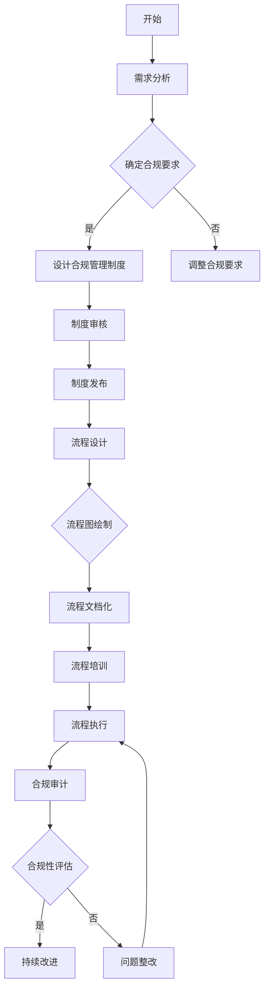
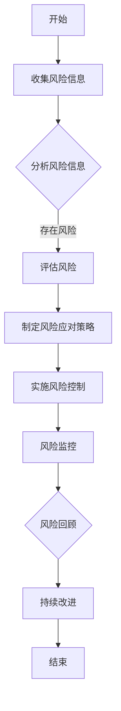
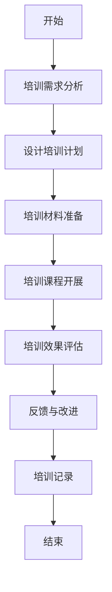

                 

# AI 大模型应用数据中心的合规管理

## 关键词
- AI大模型
- 数据中心
- 合规管理
- 风险管理
- 数据安全
- 算法公平性

## 摘要
本文深入探讨AI大模型在数据中心应用中的合规管理问题。首先，我们简要介绍了AI大模型的基本概念、发展历程和关键特性。接着，我们对数据中心合规管理进行了概述，并分析了其中面临的法律、技术及运营挑战。随后，本文重点讨论了AI大模型应用中的合规风险类型及其识别和评估方法。在此基础上，我们详细阐述了合规管理体系的构建原则、制度和流程设计，以及AI大模型应用合规控制的具体措施。通过实际案例分析，我们总结了合规管理措施的实施效果和遇到的挑战。最后，本文提出了合规管理的持续改进方法和未来发展展望，并附上相关法规和标准汇总及合规管理工具推荐。希望通过本文，能够为AI大模型数据中心合规管理提供有益的参考。

---

### 目录大纲设计

**目录大纲设计**是确保文章逻辑清晰、条理分明的重要环节。合理的章节划分和内容组织，有助于读者快速把握文章主题，深入了解各章节的核心内容。以下是本文的目录大纲设计：

#### 一、前言

本章节将简要介绍本书的背景和目标，为后续内容奠定基础。通过引言，读者可以初步了解AI大模型与数据中心合规管理的重要性和研究意义。

#### 二、AI大模型概述

本章节将深入介绍AI大模型的基本概念、发展历程和关键特性。通过对AI大模型的核心技术的探讨，读者将了解其核心原理和应用场景。

#### 三、数据中心合规管理概述

本章节将概述数据中心合规管理的定义和重要性，介绍数据中心合规管理的法律框架和面临的挑战。这将为后续章节中的合规管理讨论提供背景知识。

#### 四、AI大模型应用中的合规风险

本章节将分析AI大模型在数据中心应用中的合规风险类型，介绍合规风险的识别和评估方法，为建立合规管理体系提供理论支持。

#### 五、合规管理体系建立

本章节将详细阐述合规管理体系的构建原则、制度和流程设计，以及合规管理组织架构和职责分配，为实施合规管理提供指导。

#### 六、AI大模型应用合规控制

本章节将探讨数据安全和隐私保护、人工智能算法公平性和透明性、人工智能算法可靠性和安全评估等合规控制措施，确保AI大模型应用的安全合规。

#### 七、合规管理实践案例分析

本章节将通过实际案例，展示合规管理措施的实施效果和遇到的挑战，为其他数据中心提供参考和借鉴。

#### 八、合规管理的持续改进

本章节将讨论合规管理的评估和改进方法，以及合规管理技术的未来发展，为AI大模型数据中心合规管理的持续优化提供思路。

#### 九、附录

本章节将汇总相关法规和标准，推荐合规管理工具和资源，为读者提供进一步学习和实践的资源。

---

### 第1章: AI大模型概述

#### 1.1 AI大模型的基本概念

##### 1.1.1 AI大模型定义

AI大模型（Large-scale Artificial Intelligence Model）是指具有大规模参数和海量训练数据的深度学习模型。这些模型通过自动化特征提取和模式识别，在图像识别、自然语言处理、推荐系统等领域表现出强大的性能。与传统的机器学习模型相比，AI大模型能够处理更复杂的数据和任务。

##### 1.1.2 AI大模型的发展历程

AI大模型的发展可以追溯到深度学习技术的兴起。2006年，Geoffrey Hinton等人提出了深度信念网络（Deep Belief Network，DBN），为深度学习奠定了基础。随后，随着计算能力的提升和数据量的增长，2012年AlexNet在ImageNet竞赛中取得了突破性成绩，标志着深度学习时代的到来。近年来，Google的Transformer模型和OpenAI的GPT模型等大模型的出现，使得AI大模型的研究和应用进入了一个新的阶段。

##### 1.1.3 AI大模型的关键特性

AI大模型具有以下几个关键特性：

1. **参数规模大**：AI大模型通常拥有数百万至数十亿个参数，能够捕捉复杂的数据特征。
2. **训练数据量庞大**：大模型的训练需要海量数据支持，以充分学习数据中的规律和模式。
3. **计算资源需求高**：大模型的训练和推理过程对计算资源有较高要求，需要高性能的硬件支持。
4. **自适应性强**：大模型能够自适应地处理不同领域和任务的数据，具有广泛的适用性。
5. **强大的表现能力**：AI大模型在图像识别、语音识别、自然语言处理等领域表现出色，能够解决复杂的实际问题。

#### 1.2 AI大模型的核心技术

##### 1.2.1 机器学习和深度学习

机器学习（Machine Learning，ML）是一种通过数据驱动的方式，让计算机自动获取知识和技能的技术。深度学习（Deep Learning，DL）是机器学习的一个分支，它通过模仿人脑神经网络的结构和功能，实现自动特征提取和模式识别。

##### 1.2.2 自然语言处理

自然语言处理（Natural Language Processing，NLP）是AI大模型的重要应用领域之一。它涉及文本数据的预处理、语义分析、情感分析、机器翻译等方面，旨在让计算机理解和生成自然语言。

##### 1.2.3 计算机视觉

计算机视觉（Computer Vision，CV）是AI大模型的另一个重要应用领域。它通过图像或视频数据的处理，实现目标检测、图像识别、图像分割等功能。

#### 1.3 AI大模型的应用场景

##### 1.3.1 金融领域

在金融领域，AI大模型被广泛应用于风险控制、投资策略、客户服务等方面。例如，通过自然语言处理技术，可以对大量金融文本数据进行分析，提取关键信息，辅助投资决策。

##### 1.3.2 医疗健康

在医疗健康领域，AI大模型可以用于疾病诊断、药物研发、医学图像分析等。例如，通过计算机视觉技术，可以对医学影像进行自动诊断，提高诊断准确率和效率。

##### 1.3.3 电子商务

在电子商务领域，AI大模型可以用于推荐系统、用户行为分析、广告投放等。例如，通过自然语言处理技术，可以分析用户评论和反馈，优化产品和服务。

---

### 第2章: 数据中心合规管理概述

#### 2.1 数据中心合规管理的定义

数据中心合规管理是指确保数据中心在运行过程中遵循相关法律法规、标准和行业规范，保护数据安全、隐私和合规性的一系列管理措施。数据中心合规管理不仅涉及数据中心自身的安全运行，还包括数据流动、数据存储、数据处理等环节。

#### 2.2 数据中心合规管理的法律框架

数据中心合规管理的法律框架包括国内外的相关法律法规和标准。国内方面，涉及到的法律法规包括《中华人民共和国网络安全法》、《中华人民共和国数据安全法》、《中华人民共和国个人信息保护法》等。国际方面，涉及到的法律法规和标准包括《通用数据保护条例》（GDPR）、《加利福尼亚州消费者隐私法案》（CCPA）等。

#### 2.3 数据中心合规管理的挑战和问题

数据中心合规管理面临以下挑战和问题：

##### 2.3.1 数据安全挑战

数据安全是数据中心合规管理的核心问题之一。数据中心需要保护数据免受黑客攻击、数据泄露和篡改。随着数据量的不断增加，数据安全挑战也日益严峻。

##### 2.3.2 隐私保护问题

隐私保护是数据中心合规管理的另一个重要问题。数据中心需要确保个人信息和敏感数据的隐私保护，遵守相关法律法规和行业标准。

##### 2.3.3 法规遵循困难

数据中心合规管理涉及多个法律法规和标准，不同国家和地区的法规存在差异。这使得数据中心在遵循法规时面临困难，需要具备专业的合规知识和技能。

##### 2.3.4 技术变革带来的挑战

随着技术的发展，新的合规问题不断涌现。例如，区块链、物联网、人工智能等技术的应用，带来了新的数据安全和隐私保护挑战。

---

### 第3章: AI大模型应用中的合规风险

#### 3.1 合规风险的类型

AI大模型应用中的合规风险主要包括以下几类：

##### 3.1.1 法律风险

法律风险主要涉及数据中心在数据处理和存储过程中，违反相关法律法规和标准，可能面临的法律责任和处罚。

##### 3.1.2 技术风险

技术风险主要涉及AI大模型的算法设计、训练和部署过程中，可能出现的算法偏差、数据泄漏和模型攻击等问题。

##### 3.1.3 运营风险

运营风险主要涉及数据中心在运行过程中，由于管理不善、人员操作失误等原因，导致的数据泄露、系统故障等风险。

#### 3.2 合规风险识别和评估

合规风险的识别和评估是数据中心合规管理的重要环节。以下是合规风险识别和评估的方法：

##### 3.2.1 风险识别方法

1. **文献调研**：通过查阅相关法律法规、标准文献，了解合规要求，识别合规风险。
2. **访谈法**：通过与数据中心工作人员访谈，了解实际运营中的合规问题。
3. **问卷调查**：通过设计问卷，收集数据中心工作人员对合规风险的看法和意见。

##### 3.2.2 风险评估流程

1. **风险识别**：根据文献调研、访谈法和问卷调查，确定数据中心合规风险的类型和范围。
2. **风险分析**：对识别出的合规风险进行分析，评估其可能的影响和发生的概率。
3. **风险排序**：根据风险分析结果，对合规风险进行排序，确定优先级。
4. **风险应对**：制定相应的风险应对策略和措施，降低合规风险。

#### 3.3 合规风险管理策略

合规风险管理策略主要包括以下几个方面：

##### 3.3.1 风险控制措施

1. **制度控制**：建立完善的合规管理制度，确保数据中心在运营过程中遵循相关法律法规和标准。
2. **技术控制**：采用先进的技术手段，确保AI大模型的安全、隐私和合规性。
3. **人员培训**：加强对数据中心工作人员的合规培训，提高其合规意识和技能。

##### 3.3.2 风险应急预案

1. **应急响应机制**：建立应急响应机制，确保在发生合规风险时，能够迅速采取措施，降低损失。
2. **备份和恢复**：建立数据备份和恢复机制，确保在数据泄露、系统故障等情况下，能够迅速恢复数据和服务。
3. **风险监控**：建立风险监控体系，对合规风险进行实时监控，及时发现和处理潜在问题。

---

### 第4章: 合规管理体系建立

#### 4.1 合规管理体系构建原则

建立有效的合规管理体系，需要遵循以下原则：

##### 4.1.1 全员参与原则

合规管理是数据中心全体员工的共同责任，需要全员参与，共同推动合规管理的实施。

##### 4.1.2 全面性原则

合规管理体系应覆盖数据中心的所有业务环节和流程，确保各个部门和岗位的合规要求得到全面实施。

##### 4.1.3 适应性原则

合规管理体系应具有灵活性，能够适应外部环境和内部变化，持续改进和优化。

#### 4.2 合规管理制度和流程设计

合规管理制度和流程设计是建立合规管理体系的关键步骤。以下是合规管理制度和流程设计的主要内容和要点：

##### 4.2.1 制度设计流程

1. **需求分析**：明确数据中心合规管理的需求和目标，为制度设计提供依据。
2. **制度起草**：根据需求分析结果，起草合规管理制度，包括管理制度、操作规程、岗位职责等。
3. **制度审核**：对起草的合规管理制度进行审核，确保其合规性、完整性和可操作性。
4. **制度发布**：发布合规管理制度，明确实施时间和范围。

##### 4.2.2 流程设计要点

1. **流程梳理**：对数据中心业务流程进行梳理，明确各个流程的输入、输出和关键节点。
2. **流程优化**：根据合规要求，对业务流程进行优化，确保流程的合规性和高效性。
3. **流程图设计**：绘制流程图，直观展示业务流程，方便工作人员理解和执行。
4. **流程文档化**：将流程设计结果形成文档，作为合规管理的依据和参考。

#### 4.3 合规管理组织架构和职责分配

合规管理组织架构和职责分配是确保合规管理体系有效运行的基础。以下是合规管理组织架构和职责分配的主要内容和要点：

##### 4.3.1 组织架构设计

1. **设立合规管理部门**：在数据中心设立独立的合规管理部门，负责合规管理的整体规划、组织协调和执行监督。
2. **明确部门职责**：合规管理部门负责制定合规管理制度、组织合规培训、开展合规审计和监督等。
3. **建立跨部门协作机制**：与其他部门建立协作机制，确保合规要求在各个部门得到有效执行。

##### 4.3.2 职责分配方案

1. **明确岗位职责**：根据合规管理制度，明确各部门和岗位的职责，确保每个岗位都能履行合规管理职责。
2. **建立考核机制**：制定考核标准，对各部门和岗位的合规管理执行情况进行考核，确保合规要求得到有效落实。
3. **定期培训**：组织定期的合规培训，提高员工对合规管理的认识和技能，增强合规意识。

---

### 第5章: AI大模型应用合规控制

#### 5.1 数据安全和隐私保护

数据安全和隐私保护是AI大模型应用合规控制的核心内容之一。以下是数据安全和隐私保护的具体措施：

##### 5.1.1 数据安全策略

1. **数据分类**：根据数据的敏感程度，对数据进行分类，制定相应的保护策略。
2. **访问控制**：采用身份认证、访问控制等技术，确保只有授权人员才能访问敏感数据。
3. **数据加密**：对传输和存储的数据进行加密，防止数据泄露和篡改。
4. **备份和恢复**：建立数据备份和恢复机制，确保在发生数据丢失或损坏时，能够迅速恢复数据。

##### 5.1.2 隐私保护措施

1. **隐私设计**：在设计AI大模型时，充分考虑隐私保护的要求，避免收集和处理敏感个人信息。
2. **数据脱敏**：对收集到的个人信息进行脱敏处理，确保个人隐私不受泄露风险。
3. **隐私审计**：定期开展隐私审计，评估数据隐私保护措施的执行情况，及时发现和纠正问题。

##### 5.1.3 数据加密技术

1. **对称加密**：采用对称加密算法，如AES，对数据进行加密，确保数据在传输和存储过程中的安全性。
2. **非对称加密**：采用非对称加密算法，如RSA，对数据进行加密和解密，确保数据的机密性和完整性。
3. **混合加密**：结合对称加密和非对称加密，提高数据加密的安全性。

#### 5.2 人工智能算法公平性和透明性

人工智能算法公平性和透明性是AI大模型应用合规控制的重要方面。以下是提高算法公平性和透明性的具体措施：

##### 5.2.1 公平性评估方法

1. **基准测试**：对AI大模型在不同数据集上的表现进行基准测试，评估其公平性。
2. **偏差分析**：分析AI大模型在处理不同群体数据时的偏差，识别潜在的公平性问题。
3. **反歧视测试**：通过反歧视测试，验证AI大模型是否对特定群体存在歧视行为。

##### 5.2.2 透明性提高措施

1. **模型可解释性**：提高AI大模型的可解释性，使其决策过程更加透明，便于用户理解和监督。
2. **决策跟踪**：记录AI大模型的决策过程和依据，便于审计和追溯。
3. **算法披露**：公开AI大模型的算法设计、训练数据和评估结果，增强透明度和可信度。

#### 5.3 人工智能算法可靠性和安全评估

人工智能算法可靠性和安全评估是确保AI大模型应用合规控制的重要环节。以下是可靠性和安全评估的具体措施：

##### 5.3.1 可靠性评估方法

1. **测试集评估**：使用独立的测试集对AI大模型进行评估，确保模型的性能和稳定性。
2. **错误分析**：分析AI大模型在处理错误数据时的行为，评估其鲁棒性和容错能力。
3. **故障注入**：通过故障注入技术，模拟各种故障场景，评估AI大模型的稳定性和恢复能力。

##### 5.3.2 安全评估指标

1. **攻击抵抗力**：评估AI大模型对各种攻击（如对抗攻击、模型注入等）的抵抗能力。
2. **数据安全**：评估AI大模型在数据传输和存储过程中的安全性，确保数据不被泄露和篡改。
3. **隐私保护**：评估AI大模型在处理个人数据时的隐私保护能力，确保个人隐私不被泄露。

---

### 第6章: 合规管理实践案例分析

#### 6.1 案例介绍

本章节将介绍一个数据中心在实施AI大模型应用合规管理的实践案例。该案例涉及一个大型金融数据中心，其主要业务包括风险控制、投资策略和客户服务等。为了确保AI大模型应用的安全合规，数据中心采取了一系列合规管理措施。

##### 6.1.1 案例背景

随着金融业务的不断发展和数据量的急剧增加，数据中心面临着日益严峻的合规挑战。为了保障客户数据和金融信息安全，数据中心决定实施AI大模型应用合规管理。

##### 6.1.2 案例目标

案例的目标是建立一套完整的合规管理体系，确保AI大模型在数据中心的应用过程中，满足相关法律法规和行业标准的要求。具体目标包括：

1. **数据安全和隐私保护**：确保数据中心处理和存储的数据符合安全标准和隐私保护要求。
2. **算法公平性和透明性**：确保AI大模型在处理数据时公平、透明，不歧视特定群体。
3. **算法可靠性和安全评估**：评估AI大模型的可靠性和安全性，确保其在实际应用中的稳定性和鲁棒性。

##### 6.1.3 案例实施过程

案例实施过程分为以下几个阶段：

1. **需求分析和方案设计**：通过对数据中心业务和合规要求的分析，确定合规管理目标和方案。
2. **制度建设和流程设计**：制定合规管理制度、操作规程和岗位职责，设计业务流程和合规控制措施。
3. **人员培训和宣传**：对数据中心员工进行合规培训，提高员工的合规意识和技能。
4. **合规审计和监督**：定期开展合规审计，监督合规管理措施的实施情况，及时发现和纠正问题。
5. **持续改进和优化**：根据合规审计结果，不断改进和优化合规管理体系，提高合规管理效果。

#### 6.2 合规管理措施实施效果分析

在实施AI大模型应用合规管理措施后，数据中心取得了显著的成效：

1. **数据安全和隐私保护**：通过数据分类、访问控制和数据加密等技术措施，确保了数据中心处理和存储的数据安全，未发生数据泄露和篡改事件。
2. **算法公平性和透明性**：通过公平性评估和决策跟踪等措施，确保了AI大模型在处理数据时公平、透明，未发现歧视行为。
3. **算法可靠性和安全评估**：通过测试集评估、错误分析和故障注入等技术手段，确保了AI大模型的可靠性和安全性，提高了模型在实际应用中的稳定性和鲁棒性。

尽管取得了显著成效，但在实施过程中也遇到了一些挑战：

1. **合规管理知识不足**：数据中心部分员工对合规管理的知识和理解不足，影响了合规管理措施的实施效果。
2. **技术复杂度高**：AI大模型的算法复杂度高，合规控制措施的实施需要较高的技术支持和专业能力。
3. **持续改进难度大**：合规管理需要不断适应外部环境和内部变化，持续改进和优化难度较大。

针对这些挑战，数据中心采取了一系列应对措施：

1. **加强合规培训**：通过定期举办合规培训，提高员工对合规管理的认识和技能。
2. **引进专业人才**：引进具有合规管理经验的专业人才，提供技术支持和指导。
3. **建立反馈机制**：建立合规管理反馈机制，及时收集和分析问题，为持续改进提供依据。

通过这些措施，数据中心在AI大模型应用合规管理方面取得了较好的效果，为其他数据中心提供了有益的参考。

---

### 第7章: 合规管理的持续改进

#### 7.1 合规管理评估和改进方法

合规管理的持续改进是确保数据中心合规管理体系有效运行的关键。以下是合规管理评估和改进的方法：

##### 7.1.1 评估指标体系设计

评估指标体系是衡量合规管理效果的重要工具。设计评估指标体系时，需要考虑以下几个方面：

1. **合规性**：评估数据中心在处理和存储数据时，是否遵守相关法律法规和行业标准。
2. **安全性**：评估数据中心的数据安全措施是否有效，包括数据加密、访问控制和备份恢复等。
3. **隐私保护**：评估数据中心在处理个人数据时，是否采取了有效的隐私保护措施，如数据脱敏和隐私审计等。
4. **公平性和透明性**：评估AI大模型在处理数据时，是否公平、透明，包括算法评估和决策跟踪等。
5. **可靠性**：评估AI大模型的稳定性和鲁棒性，包括测试集评估和故障注入等。

##### 7.1.2 改进策略和方法

在评估合规管理效果后，需要根据评估结果制定改进策略和方法。以下是一些改进策略和方法：

1. **加强合规培训**：针对员工合规管理知识和技能的不足，加强合规培训，提高员工的合规意识和技能。
2. **引入新技术**：根据合规管理需求，引入新的技术和工具，提高数据安全和隐私保护能力。
3. **优化流程**：优化业务流程和合规控制措施，提高合规管理的效率和效果。
4. **建立反馈机制**：建立合规管理反馈机制，及时收集和分析问题，为持续改进提供依据。
5. **开展内部审计**：定期开展内部审计，评估合规管理措施的实施情况，及时发现和纠正问题。

#### 7.2 合规管理技术的未来发展

随着技术的不断进步，合规管理技术也在不断发展。以下是合规管理技术的未来发展趋势：

##### 7.2.1 技术趋势分析

1. **区块链技术**：区块链技术具有去中心化、不可篡改等特点，可以应用于数据安全和隐私保护，提高合规管理的可信度和透明度。
2. **人工智能技术**：人工智能技术在合规管理中的应用，可以提高自动化水平和决策效率，减轻人工负担。
3. **大数据技术**：大数据技术可以用于合规风险的识别和评估，提供更全面、准确的合规管理数据支持。
4. **云计算技术**：云计算技术可以提供弹性的计算资源和数据存储能力，提高合规管理的灵活性和效率。

##### 7.2.2 未来发展方向

1. **合规管理智能化**：结合人工智能技术，实现合规管理自动化，提高合规管理效率和效果。
2. **合规风险管理**：建立完善的合规风险管理体系，加强对合规风险的识别、评估和控制。
3. **合规管理协同**：加强跨部门、跨机构的合规管理协同，提高合规管理的整体效能。
4. **合规管理标准化**：推动合规管理标准化，制定统一的合规管理标准和流程，提高合规管理的可操作性和一致性。

通过持续改进和未来发展，数据中心可以不断提高AI大模型应用的合规管理水平，确保数据安全和隐私保护，实现合规管理的长效机制。

---

### 附录

#### 附录 A: 相关法规和标准汇总

##### 8.1.1 中国法规汇总

1. 《中华人民共和国网络安全法》
2. 《中华人民共和国数据安全法》
3. 《中华人民共和国个人信息保护法》
4. 《中华人民共和国密码法》
5. 《信息安全技术个人信息安全规范》

##### 8.1.2 国际法规汇总

1. 《通用数据保护条例》（GDPR）
2. 《加利福尼亚州消费者隐私法案》（CCPA）
3. 《欧盟数据保护条例》（ePrivacy Directive）
4. 《国际标准化组织信息安全管理体系》（ISO/IEC 27001）

#### 附录 B: 合规管理工具和资源推荐

##### 8.2.1 开源工具推荐

1. OpenSCAP：用于自动化安全评估和合规检查的开源工具。
2. OSSEC：用于入侵检测和合规监控的开源工具。
3. PIPEDA：用于加拿大隐私保护的合规性检查工具。

##### 8.2.2 商业工具推荐

1. Microsoft Compliance Manager：用于微软产品和服务的合规管理。
2. AWS Security Hub：用于云服务的合规性和安全监控。
3. IBM Security Guardium：用于数据安全和隐私保护的商业工具。

---

### 附录 A: AI 大模型开发工具与资源

#### 9.1 主流深度学习框架对比

在AI大模型开发中，选择合适的深度学习框架至关重要。以下是几种主流深度学习框架的对比：

##### 9.1.1 TensorFlow

TensorFlow是由Google开发的开源深度学习框架，具有强大的生态系统和丰富的功能。它支持多种编程语言，包括Python、C++和Java，并提供了一套完整的工具和库，如TensorFlow Lite（用于移动设备）、TensorFlow Extended（用于扩展训练）等。

**优点**：
- **生态系统强大**：拥有丰富的模型库、工具和社区支持。
- **多语言支持**：支持多种编程语言，方便开发者使用。
- **灵活性**：支持自定义计算图，可以灵活地设计和优化模型。

**缺点**：
- **学习曲线较陡**：对于初学者来说，学习和使用TensorFlow有一定的门槛。
- **资源消耗较大**：在训练大型模型时，对计算资源和内存需求较高。

##### 9.1.2 PyTorch

PyTorch是由Facebook AI研究院（FAIR）开发的深度学习框架，以其动态计算图和直观的API而著称。它支持Python编程语言，并提供了丰富的API和库，如TorchVision（用于计算机视觉）、TorchText（用于自然语言处理）等。

**优点**：
- **直观易用**：动态计算图使得模型设计和调试更加直观。
- **学习曲线平缓**：对初学者友好，易于上手。
- **社区支持**：拥有庞大的社区和丰富的资源。

**缺点**：
- **性能优化困难**：与TensorFlow相比，PyTorch在某些方面性能优化较困难。

##### 9.1.3 JAX

JAX是由Google开发的自动微分系统，主要用于机器学习和科学计算。它支持Python和Haskell编程语言，并提供了高效的计算引擎和自动微分功能。

**优点**：
- **自动微分**：支持自动微分，方便模型优化和调试。
- **性能高效**：在特定任务上，JAX的性能表现优异。
- **兼容性**：可以与TensorFlow和PyTorch无缝集成。

**缺点**：
- **社区支持较弱**：相较于TensorFlow和PyTorch，JAX的社区支持较弱。

##### 9.1.4 其他框架简介

1. **Keras**：基于TensorFlow和Theano的开源深度学习框架，具有简洁的API和丰富的模型库。
2. **Theano**：基于Python的开源深度学习框架，主要用于计算神经网络。
3. **MXNet**：Apache基金会的一个开源深度学习框架，支持多种编程语言，包括Python、R和Java。

#### 9.2 AI 大模型开发最佳实践

为了确保AI大模型开发的成功，以下是一些最佳实践：

##### 9.2.1 模型训练技巧

1. **数据预处理**：对训练数据进行预处理，包括数据清洗、归一化和标准化等，以提高模型的性能和稳定性。
2. **批量大小调整**：合理选择批量大小，以平衡模型性能和计算效率。
3. **学习率调整**：使用适当的学习率调整策略，如学习率衰减和自适应学习率调整，以避免过拟合和提升模型性能。
4. **正则化**：应用正则化方法，如L1、L2正则化，降低过拟合的风险。

##### 9.2.2 模型优化方法

1. **模型剪枝**：通过剪枝技术，减少模型的参数数量，降低计算复杂度，提高模型效率。
2. **量化**：使用量化技术，将浮点模型转换为低精度模型，降低模型存储和计算资源需求。
3. **并行化**：利用并行计算技术，加速模型训练和推理过程，提高计算效率。

##### 9.2.3 模型部署策略

1. **模型压缩**：通过模型压缩技术，减少模型体积，提高模型部署的便捷性。
2. **模型集成**：将多个模型集成到一个系统中，提高模型的鲁棒性和性能。
3. **模型监控**：建立模型监控机制，实时监控模型性能和运行状态，确保模型稳定运行。

---

### 附录 B: 合规管理流程图与 Mermaid 流程图

合规管理流程图的绘制有助于清晰展示合规管理的流程和步骤，便于理解和实施。以下是几个关键的合规管理流程图示例，使用Mermaid语法进行描述：

#### 10.1 合规管理流程图

#### 10.2 合规风险识别流程图

#### 10.3 合规培训流程图

通过上述流程图，我们可以清晰地了解合规管理的各个步骤和环节，有助于确保合规管理体系的顺利实施和持续优化。在实际应用中，可以根据具体情况进行调整和扩展。使用Mermaid语法，我们可以方便地将流程图嵌入到文档中，提高文档的可读性和实用性。

---

### 附录 C: AI 大模型开发工具与资源

#### 11.1 AI 大模型开发工具推荐

在AI大模型开发过程中，选择合适的工具能够显著提高开发效率和质量。以下是几款备受推荐的AI大模型开发工具：

##### 11.1.1 TensorFlow

**特点**：TensorFlow是由Google开发的开源深度学习框架，拥有强大的生态系统和广泛的应用场景。它支持多种编程语言，包括Python、C++和Java，并提供了一套完整的工具和库，如TensorFlow Lite（用于移动设备）、TensorFlow Extended（用于扩展训练）等。

**使用场景**：适用于大规模深度学习模型的开发、训练和部署，特别是在需要高性能计算和数据并行处理的场景中。

**资源**：官方网站（[tensorflow.org](https://tensorflow.org)）提供了详细的文档、教程和社区支持。

##### 11.1.2 PyTorch

**特点**：PyTorch是由Facebook AI研究院（FAIR）开发的深度学习框架，以其动态计算图和直观的API而著称。它支持Python编程语言，并提供了丰富的API和库，如TorchVision（用于计算机视觉）、TorchText（用于自然语言处理）等。

**使用场景**：适用于科研和工业界中的快速原型设计和模型开发，特别是需要动态计算图和灵活性的场景。

**资源**：官方网站（[pytorch.org](https://pytorch.org)）提供了详细的文档、教程和社区支持。

##### 11.1.3 Keras

**特点**：Keras是一个基于TensorFlow和Theano的开源深度学习框架，具有简洁的API和丰富的模型库。它简化了深度学习模型的构建和训练过程，降低了开发门槛。

**使用场景**：适用于快速原型设计和模型开发，特别是在需要简洁、易于使用的深度学习工具的场景中。

**资源**：官方网站（[keras.io](https://keras.io)）提供了详细的文档、教程和社区支持。

##### 11.1.4 JAX

**特点**：JAX是由Google开发的自动微分系统，主要用于机器学习和科学计算。它支持Python和Haskell编程语言，并提供了高效的计算引擎和自动微分功能。

**使用场景**：适用于需要自动微分和数值计算的AI大模型开发，特别是在优化算法和科学计算领域。

**资源**：官方网站（[jax.sh](https://jax.sh)）提供了详细的文档、教程和社区支持。

#### 11.2 AI 大模型开发资源推荐

除了上述工具，以下是一些其他有用的AI大模型开发资源，可以帮助开发者提高技能和效率：

##### 11.2.1 开源代码库

1. [Hugging Face Transformers](https://huggingface.co/transformers)：提供了预训练的AI大模型，如GPT、BERT等，以及相关的API和工具。
2. [AI Gym](https://gym.openai.com/)：一个开源的虚拟环境，用于测试和比较不同的AI算法。
3. [AI Challenger](https://www.ai-challenger.com/)：一个面向机器学习和深度学习的在线比赛平台。

##### 11.2.2 教程和文档

1. [Google AI Education](https://ai.google/education/)：Google提供的免费AI教育资源，包括课程、教程和在线课程。
2. [Stanford CS231n](http://cs231n.stanford.edu/)：一个关于计算机视觉和深度学习的在线课程。
3. [TensorFlow Documentation](https://www.tensorflow.org/docs/)：TensorFlow官方文档，提供了详细的API和使用说明。

##### 11.2.3 社区和论坛

1. [Reddit AI](https://www.reddit.com/r/MachineLearning/)：一个关于机器学习和深度学习的Reddit社区，可以讨论和分享最新的研究成果和资源。
2. [Stack Overflow](https://stackoverflow.com/questions/tagged/deep-learning)：一个编程问答社区，提供了丰富的关于深度学习和AI的问答和讨论。
3. [AI Sphere](https://aisphere.org/)：一个关于AI和机器学习的在线社区，提供了各种讨论组和活动。

通过这些工具和资源，开发者可以更有效地进行AI大模型的开发，不断提升自己的技能和知识水平。无论你是AI初学者还是经验丰富的开发者，这些资源和工具都将为你提供宝贵的支持和帮助。

---

### 附录 D: 合规管理工具与资源推荐

合规管理是一个复杂而关键的领域，选择合适的工具和资源对于确保合规性至关重要。以下是几款推荐的合规管理工具和资源：

#### 12.1 开源工具推荐

1. **OWASP ZAP（Zed Attack Proxy）**：一个开源的网络应用程序安全测试工具，用于检测和修复网站漏洞。
   - 官网：[owasp.zap.dev](https://owasp.zap.dev/)

2. **Snyk**：一个开源的漏洞检测工具，支持静态和动态代码分析。
   - 官网：[snyk.io](https://snyk.io/)

3. **OpenSCAP**：用于自动化安全评估和合规检查的开源工具，支持多种操作系统和平台。
   - 官网：[ openscap.org](https://www.open-scap.org/)

#### 12.2 商业工具推荐

1. **IBM Guardium**：用于数据安全和隐私保护的商业工具，包括数据发现、分类、加密和访问控制等功能。
   - 官网：[ibm.com/guardium](https://www.ibm.com/security/guardium)

2. **Microsoft Compliance Manager**：用于管理微软产品和服务的合规性，包括法规遵从性评估和报告。
   - 官网：[docs.microsoft.com/compliance-manager](https://docs.microsoft.com/compliance-manager)

3. **AWS Security Hub**：用于监控AWS环境中安全事件的集中管理工具，支持多种合规标准和法规。
   - 官网：[aws.amazon.com/security-hub](https://aws.amazon.com/security-hub/)

#### 12.3 在线资源推荐

1. **NIST SP 800-53**：美国国家标准与技术研究所发布的网络安全框架，提供了详细的合规要求和控制措施。
   - 官网：[nist.gov/cyberframework)

2. **EU GDPR**：欧盟通用数据保护条例，提供了关于数据处理和隐私保护的法律框架。
   - 官网：[edpb.europa.eu/edpb/edpb/our-work/data-protection-by-design-and-by-default/groups/art-29-working-party/achailed-matters/20190411-cdpo-guidelines/html)

3. **CCPA**：加利福尼亚州消费者隐私法案，提供了关于消费者数据隐私保护的法律要求。
   - 官网：[oag.ca.gov/privacy/ccpa)

通过这些工具和资源，组织可以有效地实施合规管理，确保数据安全和隐私保护，同时满足相关法律法规的要求。无论选择开源工具还是商业工具，合适的合规管理解决方案将为组织带来显著的安全性和合规性提升。

