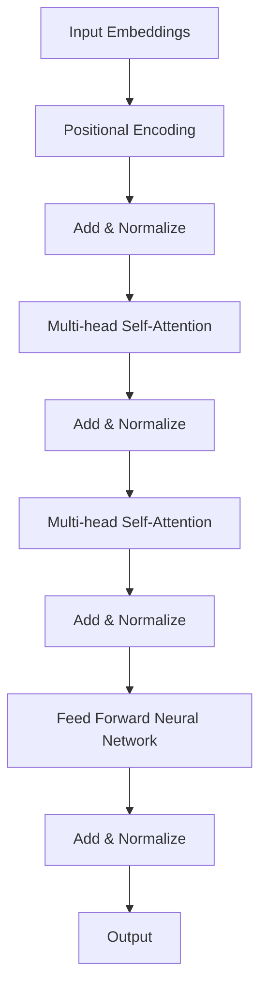

                 

### 引言

在人工智能（AI）迅猛发展的时代，大模型成为了推动技术进步的关键驱动力。Transformer架构作为自然语言处理（NLP）领域的一项革命性突破，已经深刻地改变了计算机科学的研究范式。在众多贡献者中，Ashish Vaswani以其在Transformer架构发明方面的卓越贡献，成为了AI大模型领域的杰出科学家。

本文旨在深入探讨Transformer架构及其发明者Ashish Vaswani的学术生涯与贡献。通过系统地分析Transformer架构的背景、原理、组成部分、应用以及未来的发展趋势，我们希望能够为广大读者提供一个全面、深入的理解。

首先，我们将介绍Transformer架构的背景和动机，解释为什么它能够取代传统的循环神经网络（RNN）和长短期记忆网络（LSTM）。接着，我们将详细解析Transformer架构的核心组成部分，包括自注意力机制、多头注意力机制、位置编码和前馈神经网络。此外，我们还将探讨Transformer架构的扩展与应用，介绍一些变种架构以及它们在不同领域的应用案例。

在第二部分，我们将重点介绍Ashish Vaswani的背景与职业发展，探讨他是如何参与到Transformer架构的研究中，并最终取得重大突破的。我们将详细解读Transformer架构的发明过程，以及其设计思路和实现细节。随后，我们将分析Transformer架构的影响与未来趋势，讨论其在自然语言处理领域的影响，以及其他领域的潜在应用。

接下来，我们将探讨Ashish Vaswani的研究方法与创新思维，分析他是如何运用这些方法来实现Transformer架构的突破。此外，我们还将探讨Transformer架构的优化与改进方向，以及在实际应用中的案例分析。

最后，我们将总结Transformer架构的主要贡献与影响，评价Ashish Vaswani在计算机科学界的地位与影响，并对Transformer架构的未来发展前景进行展望。通过本文的深入探讨，我们希望读者能够对Transformer架构及其发明者Ashish Vaswani有更全面、深入的理解。

### Transformer架构简介

Transformer架构，作为一种基于注意力机制的深度神经网络模型，自其提出以来，便迅速在自然语言处理（NLP）领域崭露头角。Transformer架构的出现，源于研究人员对传统循环神经网络（RNN）和长短期记忆网络（LSTM）在处理长序列任务时的不足的认识。传统RNN和LSTM虽然在一定程度上能够处理序列数据，但它们存在一些固有的缺陷，如梯度消失和梯度爆炸等问题，导致在处理长序列时效果不佳。

#### 第1章: Transformer架构概述

### 1.1 Transformer架构的背景和动机

Transformer架构的提出，主要是为了解决传统循环神经网络在处理长序列数据时的瓶颈。循环神经网络（RNN）通过递归方式处理序列数据，但由于其内部状态的传递，导致在处理长序列时容易出现梯度消失和梯度爆炸的问题，这限制了其在长文本和长对话等任务上的表现。长短期记忆网络（LSTM）虽然在一定程度上解决了这些问题，但LSTM的结构复杂，训练和推理的时间成本较高，同时其捕获长距离依赖关系的能力仍然有限。

为了解决这些问题，Vaswani等人在2017年提出了Transformer架构。Transformer架构的核心思想是利用自注意力机制（Self-Attention）和多头注意力机制（Multi-Head Attention），直接对输入序列进行全局处理，从而克服了传统循环神经网络在处理长序列时的缺陷。自注意力机制通过计算序列中每个词与其他词之间的相似度，能够有效地捕获长距离依赖关系，而多头注意力机制则通过并行处理多个注意力头，提高了模型的捕捉能力和表示能力。

### 1.2 Transformer架构的基本原理

Transformer架构的基本原理可以概括为以下几点：

1. **自注意力机制（Self-Attention）**：
   自注意力机制是Transformer架构的核心组件，它通过计算序列中每个词与其他词之间的相似度，生成表示这些词之间关系的注意力权重。这种机制使得模型能够自动地学习序列中不同词之间的关系，而不需要像RNN那样依赖序列的递归传递。自注意力机制的实现主要通过Query、Key和Value这三个向量的计算。

2. **多头注意力机制（Multi-Head Attention）**：
   多头注意力机制是将输入序列分成多个子序列，每个子序列分别通过自注意力机制进行处理，然后将结果拼接起来。这样做的好处是能够提高模型的捕捉能力和表示能力，使得模型能够更好地理解输入序列的复杂结构。

3. **位置编码（Positional Encoding）**：
   Transformer架构在处理序列数据时，缺乏像RNN那样的内置位置信息。为了解决这个问题，Transformer架构引入了位置编码，通过为每个词添加位置向量，使得模型能够理解输入序列的顺序信息。

4. **前馈神经网络（Feed Forward Neural Network）**：
   在Transformer架构中，除了注意力机制，还引入了两个前馈神经网络，分别对输入序列进行处理。这些前馈神经网络能够增加模型的非线性表达能力，提高模型的拟合能力。

### 1.3 Transformer架构与传统循环神经网络（RNN）的对比

Transformer架构与传统循环神经网络（RNN）在处理长序列任务时存在显著差异，主要体现在以下几个方面：

1. **计算效率**：
   传统RNN需要递归地处理序列中的每个词，导致计算效率较低。而Transformer架构通过并行计算自注意力机制，大大提高了计算效率。

2. **梯度消失和梯度爆炸**：
   传统RNN由于内部状态的传递，容易出现梯度消失和梯度爆炸问题，导致难以训练。而Transformer架构通过自注意力机制，能够有效地捕获长距离依赖关系，避免了这些问题。

3. **模型复杂度**：
   传统RNN结构相对简单，但LSTM等复杂结构增加了模型的计算成本。而Transformer架构通过引入多头注意力机制和位置编码，虽然增加了模型的复杂性，但其在训练和推理时的计算效率更高。

4. **捕捉长距离依赖关系**：
   传统RNN在捕捉长距离依赖关系时存在困难，而Transformer架构通过自注意力机制，能够有效地捕获长距离依赖关系。

总的来说，Transformer架构的出现，为自然语言处理领域带来了新的机遇和挑战。通过并行计算和注意力机制，Transformer架构不仅提高了模型的计算效率，还显著提升了模型在捕捉长距离依赖关系和复杂结构表示方面的能力。这使得Transformer架构成为了自然语言处理领域的一项革命性突破。

### Transformer架构的核心组成部分

Transformer架构之所以能够在自然语言处理领域取得巨大的成功，主要归功于其独特的设计思想——即注意力机制（Attention Mechanism）。注意力机制使得模型能够聚焦于序列中的重要信息，从而提高了模型的捕捉能力和表示能力。Transformer架构的核心组成部分包括自注意力机制（Self-Attention）、多头注意力机制（Multi-Head Attention）、位置编码（Positional Encoding）和前馈神经网络（Feed Forward Neural Network）。下面我们将逐一详细解析这些组成部分。

#### 第2章: Transformer架构的核心组成部分

### 2.1 自注意力机制（Self-Attention）

自注意力机制是Transformer架构的核心组件之一，它允许模型在处理序列数据时自动学习不同词之间的关系。自注意力机制通过计算序列中每个词与其他词之间的相似度，生成注意力权重，然后根据这些权重对序列进行加权求和，从而实现序列的编码和解码。

#### 2.1.1 自注意力机制的原理

自注意力机制主要包括以下几个步骤：

1. **计算Query、Key和Value**：
   - **Query（查询向量）**：每个词的嵌入向量，表示该词在当前序列中的潜在信息。
   - **Key（键向量）**：每个词的嵌入向量，表示该词可以作为其他词的上下文信息。
   - **Value（值向量）**：每个词的嵌入向量，表示该词的重要程度。

2. **计算注意力分数**：
   通过计算每个Query和所有Key之间的相似度，得到一组注意力分数。注意力分数反映了每个词对其他词的重要程度。

3. **计算注意力权重**：
   对注意力分数进行softmax操作，得到一组注意力权重。这些权重决定了每个词在编码和解码过程中的重要性。

4. **加权求和**：
   根据注意力权重对序列中的所有Value向量进行加权求和，得到最终的表示向量。

#### 2.1.2 自注意力机制的实现

自注意力机制的实现通常通过矩阵运算来完成。假设序列中有N个词，每个词的维度为D，那么：

- **Query、Key和Value**：三个N×D的矩阵。
- **注意力分数**：N×N的矩阵，表示每个Query与其他所有Key之间的相似度。
- **注意力权重**：N×N的矩阵，通过softmax函数对注意力分数进行归一化。
- **加权求和**：N×D的矩阵，表示加权后的序列表示。

伪代码如下：

```python
# 输入：Query、Key、Value（均为N×D的矩阵）
# 输出：加权求和结果（N×D的矩阵）

Q = Query
K = Key
V = Value

# 计算注意力分数
attention_scores = Q @ K.T / sqrt(D)

# 计算注意力权重
attention_weights = softmax(attention_scores)

# 加权求和
output = attention_weights @ V
```

### 2.2 多头注意力机制（Multi-Head Attention）

多头注意力机制是将自注意力机制扩展到多个子注意力头，使得模型能够从不同角度理解输入序列。多头注意力机制通过并行计算多个自注意力头，然后将结果拼接起来，提高了模型的捕捉能力和表示能力。

#### 2.2.1 多头注意力机制的原理

多头注意力机制的主要步骤如下：

1. **划分多头**：
   将输入序列的嵌入向量划分为多个子序列，每个子序列对应一个自注意力头。

2. **独立计算**：
   对每个子序列分别计算自注意力，得到多个注意力头的结果。

3. **拼接与线性变换**：
   将所有注意力头的结果拼接起来，通过一个线性变换层，得到最终的输出。

#### 2.2.2 多头注意力机制的实现

多头注意力机制的实现步骤如下：

1. **线性变换**：
   将输入嵌入向量通过两个线性变换层分别得到Query、Key和Value。

2. **独立计算注意力**：
   对每个子序列计算自注意力，得到多个注意力头的结果。

3. **拼接与线性变换**：
   将所有注意力头的结果拼接起来，通过一个线性变换层，得到最终的输出。

伪代码如下：

```python
# 输入：嵌入向量（N×D）
# 输出：多头注意力输出（N×D）

embeddings = input_embeddings

# 线性变换
Q = linear_transform_Q(embeddings)
K = linear_transform_K(embeddings)
V = linear_transform_V(embeddings)

# 多头注意力计算
attention_heads = []
for i in range(num_heads):
    # 独立计算注意力
    attention_head = self_attention(Q[:, i], K[:, i], V[:, i])
    attention_heads.append(attention_head)

# 拼接注意力头
output = Concatenate(attention_heads)
output = linear_transform_output(output)

return output
```

### 2.3 位置编码（Positional Encoding）

位置编码是为了在Transformer架构中引入位置信息，使得模型能够理解输入序列的顺序。位置编码通常通过为每个词添加一个位置向量来实现。

#### 2.3.1 位置编码的原理

位置编码的主要思想是，为每个词添加一个与词的位置相关的向量，从而在嵌入空间中为词的位置提供编码信息。位置编码向量通常是一个一维向量，其大小与词的维度相同。

#### 2.3.2 位置编码的实现

位置编码的实现方法有多种，其中一种简单有效的方法是使用正弦和余弦函数生成位置编码向量。具体步骤如下：

1. **初始化位置编码表**：
   根据序列的最大长度，初始化一个位置编码表。位置编码表中每个位置的位置编码向量由两个向量组成，一个是正弦函数生成的，另一个是余弦函数生成的。

2. **添加位置编码**：
   将位置编码向量添加到词的嵌入向量中，作为最终的输入。

伪代码如下：

```python
# 输入：序列长度（max_length）
# 输出：位置编码表（max_length×D）

def positional_encoding(max_length, d_model):
    pos_encoding = np.zeros((max_length, d_model))

    for pos in range(max_length):
        pos_enc = np.sin(pos / 10000 ** (2 * i / d_model))
        pos_dec = np.cos(pos / 10000 ** (1 * i / d_model))
        pos_encoding[pos, 2 * i] = pos_enc
        pos_encoding[pos, 2 * i + 1] = pos_dec

    return pos_encoding

# 添加位置编码
input_embeddings = input_embeddings + positional_encoding(input_sequence_length, d_model)
```

### 2.4 前馈神经网络（Feed Forward Neural Network）

前馈神经网络是Transformer架构中的一个辅助组件，用于增加模型的非线性表达能力。前馈神经网络通常由两个线性变换层组成，分别对输入进行变换。

#### 2.4.1 前馈神经网络的原理

前馈神经网络的主要步骤如下：

1. **输入层**：
   输入层的输入是上一层的输出。

2. **第一层前馈神经网络**：
   对输入进行线性变换，然后应用ReLU激活函数。

3. **第二层前馈神经网络**：
   对第一层的输出进行线性变换，作为最终的输出。

#### 2.4.2 前馈神经网络的实现

前馈神经网络的实现步骤如下：

1. **线性变换**：
   对输入进行线性变换。

2. **ReLU激活函数**：
   应用ReLU激活函数。

3. **第二层线性变换**：
   对ReLU激活函数的输出进行线性变换。

伪代码如下：

```python
# 输入：输入向量（N×D）
# 输出：前馈神经网络输出（N×D）

input_vector = input

# 第一层前馈神经网络
ffn_1 = linear_transform(input_vector)
ffn_1 = ReLU(ffn_1)

# 第二层前馈神经网络
output = linear_transform(ffn_1)

return output
```

通过以上对Transformer架构核心组成部分的详细解析，我们可以看到，自注意力机制、多头注意力机制、位置编码和前馈神经网络共同构成了Transformer架构的强大基础。这些组件不仅使得模型能够高效地处理长序列数据，还显著提升了模型的捕捉能力和表示能力。接下来，我们将进一步探讨Transformer架构的扩展与应用，介绍一些变种架构以及它们在不同领域的应用案例。

### Transformer架构的扩展与应用

Transformer架构自提出以来，受到了自然语言处理（NLP）领域的广泛关注，并在多种任务中取得了优异的性能。然而，随着研究的深入，研究人员不断探索Transformer架构的扩展和应用，以应对更复杂的任务和场景。本节将介绍一些Transformer架构的变种，以及它们在不同领域的应用案例。

#### 第3章: Transformer架构的扩展与应用

### 3.1 Transformer的变种架构

Transformer的变种架构在原始架构的基础上，通过修改和优化某些组件，提高了模型在特定任务上的性能。以下是一些常见的变种架构：

#### 1. **BERT（Bidirectional Encoder Representations from Transformers）**

BERT是Google Research在2018年提出的一种预训练方法，它通过双向Transformer架构来预训练大规模语言模型。BERT的关键思想是在大量无标签文本上进行预训练，然后通过微调的方式，将预训练模型应用于各种下游任务，如文本分类、问答等。BERT的主要变种包括：

- **BERT-Base**：基于1.1亿词汇量的模型，包含12层Transformer编码器。
- **BERT-Large**：基于3.4亿词汇量的模型，包含24层Transformer编码器。

#### 2. **GPT（Generative Pre-trained Transformer）**

GPT是OpenAI在2018年提出的一种预训练方法，它通过单向Transformer架构来生成文本。GPT的主要变种包括：

- **GPT-1**：包含1.17亿参数的模型。
- **GPT-2**：包含15亿参数的模型。
- **GPT-3**：包含1750亿参数的模型，是当前最大的预训练语言模型。

#### 3. **T5（Text-To-Text Transfer Transformer）**

T5是Google AI在2020年提出的一种基于Transformer的文本转换模型。T5的核心思想是将所有自然语言处理任务转换为文本到文本的转换任务，从而利用Transformer模型的全局性优势。T5的主要变种包括：

- **T5-Base**：基于112M参数的模型。
- **T5-Large**：基于1.5B参数的模型。

### 3.2 Transformer在自然语言处理中的应用案例

Transformer架构在自然语言处理（NLP）领域取得了显著的成果，以下是一些典型应用案例：

#### 1. **机器翻译**

Transformer架构在机器翻译任务上取得了突破性的进展。与传统循环神经网络（RNN）和长短期记忆网络（LSTM）相比，Transformer能够更高效地处理长序列，并捕捉长距离依赖关系。例如，Google的神经机器翻译系统（GNMT）采用Transformer架构，实现了高质量的机器翻译效果。

#### 2. **文本分类**

文本分类是一种常见的自然语言处理任务，用于将文本数据分类到不同的类别中。Transformer架构通过全局性的注意力机制，能够有效地捕捉文本中的关键信息，从而在文本分类任务中取得了优异的性能。例如，BERT模型在多项文本分类任务上达到了最先进的水平。

#### 3. **问答系统**

问答系统是一种基于用户问题的自动回答系统。Transformer架构能够处理长文本和复杂问题，从而在问答系统中取得了良好的效果。例如，OpenAI的GPT-3模型在问答系统中表现出色，能够生成流畅且符合上下文的回答。

### 3.3 Transformer在其他领域的应用探索

除了自然语言处理领域，Transformer架构在其他领域也展现出了巨大的潜力。以下是一些应用案例：

#### 1. **计算机视觉**

Transformer架构在计算机视觉领域也取得了显著的成果。例如，ViT（Vision Transformer）模型将Transformer架构应用于图像分类任务，取得了与CNN相当甚至更好的性能。

#### 2. **音频处理**

Transformer架构在音频处理领域也受到了关注。例如，WaveNet模型是一种基于Transformer的语音合成模型，能够生成自然流畅的语音。

#### 3. **推荐系统**

Transformer架构在推荐系统中的应用也越来越广泛。例如，Deep Interest Network（DIN）模型利用Transformer架构来捕捉用户和物品之间的复杂关系，从而提高推荐系统的效果。

总的来说，Transformer架构通过其独特的注意力机制，在多个领域都展现出了强大的潜力。随着研究的深入，我们可以预见，Transformer架构将在更多领域发挥重要作用，推动人工智能的发展。

#### 第4章: Ashish Vaswani的背景与职业发展

Transformer架构的发明人Ashish Vaswani是一位杰出的计算机科学家，他在自然语言处理和深度学习领域做出了重要贡献。在探讨他的贡献之前，我们有必要先了解他的个人背景和职业发展。

### 4.1 Ashish Vaswani的个人背景

Ashish Vaswani出生于印度，他在计算机科学领域展现出了非凡的天赋和兴趣。他在印度理工学院坎普尔分校（IIT Kanpur）获得了计算机科学学士学位，随后在卡内基梅隆大学（Carnegie Mellon University）攻读计算机科学硕士学位。在卡内基梅隆大学期间，他参与了多个研究项目，并展示出了在人工智能和机器学习领域的深厚功底。

### 4.2 Ashish Vaswani的职业历程

Vaswani的职业历程始于2012年，当时他在谷歌公司担任软件工程师。在谷歌，他参与了多个项目，其中包括Google Translate的机器翻译系统。这个经历为他后来在Transformer架构研究中的突破奠定了坚实的基础。

在2017年，Vaswani与Noam Shazeer、Niki Parmar、 Jakob Uszkoreit和Ilya Sutskever共同发表了题为《Attention Is All You Need》的论文，提出了Transformer架构。这项工作不仅改变了自然语言处理领域的研究方向，也为人工智能的发展带来了新的机遇。Transformer架构的提出，使得Vaswani在国际学术界和工业界声名鹊起，他因此获得了包括谷歌杰出研发奖在内的多个奖项和荣誉。

在Transformer架构取得成功后，Vaswani继续在谷歌领导多个研究项目，致力于推动人工智能在更多领域的应用。他还在多个国际会议和研讨会上发表演讲，分享他的研究成果和见解。

### 4.3 Ashish Vaswani在Transformer架构研究中的关键贡献

Ashish Vaswani在Transformer架构研究中的贡献主要体现在以下几个方面：

1. **提出注意力机制**：
   Transformer架构的核心是注意力机制，Vaswani等人提出的自注意力机制和多头注意力机制，使得模型能够高效地处理长序列并捕捉长距离依赖关系。这一创新极大地提升了模型的性能，使其在多个自然语言处理任务中取得了突破性成果。

2. **简化模型结构**：
   与传统的循环神经网络（RNN）和长短期记忆网络（LSTM）相比，Transformer架构的结构更加简洁。它通过并行计算和全局性注意力机制，避免了RNN和LSTM中的梯度消失和梯度爆炸问题，提高了模型的计算效率和训练速度。

3. **预训练和微调**：
   Vaswani等人提出了基于Transformer的预训练方法，如BERT和GPT，这些方法通过在大量无标签数据上进行预训练，再通过微调应用于具体任务，极大地提高了模型的性能。这种方法不仅适用于自然语言处理，还可以推广到其他领域，如计算机视觉和推荐系统。

4. **实际应用**：
   Vaswani在Transformer架构的实际应用方面也做出了重要贡献。例如，Google Translate采用了Transformer架构，实现了高质量的机器翻译效果。此外，Transformer架构还在文本分类、问答系统等多个自然语言处理任务中取得了优异的性能。

总的来说，Ashish Vaswani在Transformer架构研究中的贡献，不仅推动了自然语言处理领域的发展，也为人工智能的进步做出了重要贡献。他的工作不仅具有学术价值，还具有广泛的应用前景，对整个计算机科学领域产生了深远的影响。

#### Transformer架构的发明过程

Transformer架构的诞生，是人工智能（AI）和自然语言处理（NLP）领域的一次重大突破。在这一部分，我们将详细探讨Transformer架构的发明过程，包括其背景、设计思路和实现细节。

### 5.1 Transformer架构的发明背景

Transformer架构的提出，源于传统循环神经网络（RNN）和长短期记忆网络（LSTM）在处理长序列任务时的不足。尽管RNN和LSTM在自然语言处理任务中取得了显著成果，但它们在处理长距离依赖关系时存在挑战。具体来说，RNN和LSTM在训练过程中容易出现梯度消失和梯度爆炸问题，这限制了它们在长文本和长对话等任务上的应用。

为了解决这些问题，研究人员开始探索新的模型结构。自注意力机制（Self-Attention）在这一背景下应运而生。自注意力机制通过计算序列中每个词与其他词之间的相似度，能够有效地捕获长距离依赖关系。这一思路激发了Vaswani等人的灵感，他们决定尝试构建一个基于自注意力机制的全新模型。

### 5.2 Transformer架构的设计思路

Transformer架构的设计思路可以概括为以下几点：

1. **注意力机制**：
   Transformer架构的核心是注意力机制，特别是自注意力机制。自注意力机制通过计算序列中每个词与其他词之间的相似度，生成注意力权重，从而实现序列的编码和解码。这一机制使得模型能够自动地学习序列中不同词之间的关系，而不需要像RNN那样依赖序列的递归传递。

2. **并行计算**：
   传统RNN和LSTM在处理序列数据时，需要逐词递归地计算，导致计算效率较低。而Transformer架构通过自注意力机制，能够实现并行计算，从而显著提高了计算效率。

3. **位置编码**：
   Transformer架构在处理序列数据时，缺乏像RNN那样的内置位置信息。为了解决这个问题，Transformer架构引入了位置编码，通过为每个词添加位置向量，使得模型能够理解输入序列的顺序信息。

4. **前馈神经网络**：
   在Transformer架构中，除了注意力机制，还引入了两个前馈神经网络，分别对输入序列进行处理。这些前馈神经网络能够增加模型的非线性表达能力，提高模型的拟合能力。

### 5.3 Transformer架构的实现细节

Transformer架构的实现涉及多个关键组件，下面我们逐一介绍：

1. **词嵌入（Word Embedding）**：
   Transformer架构首先将输入序列的单词转换为词嵌入向量。词嵌入向量通常是通过预训练模型（如Word2Vec、GloVe）得到的。词嵌入向量不仅包含了单词的语义信息，还可以通过位置编码来引入位置信息。

2. **自注意力机制（Self-Attention）**：
   自注意力机制是Transformer架构的核心组件，它通过计算序列中每个词与其他词之间的相似度，生成注意力权重。自注意力机制主要包括以下几个步骤：
   - **计算Query、Key和Value**：Query、Key和Value分别是每个词的嵌入向量。
   - **计算注意力分数**：通过计算每个Query和所有Key之间的相似度，得到一组注意力分数。
   - **计算注意力权重**：对注意力分数进行softmax操作，得到一组注意力权重。
   - **加权求和**：根据注意力权重对序列中的所有Value向量进行加权求和，得到最终的表示向量。

3. **多头注意力机制（Multi-Head Attention）**：
   多头注意力机制是将自注意力机制扩展到多个子注意力头，使得模型能够从不同角度理解输入序列。多头注意力机制通过并行计算多个自注意力头，然后将结果拼接起来，提高了模型的捕捉能力和表示能力。

4. **位置编码（Positional Encoding）**：
   位置编码是为了在Transformer架构中引入位置信息，使得模型能够理解输入序列的顺序。位置编码通常通过为每个词添加一个位置向量来实现。位置编码向量可以是正弦和余弦函数生成的。

5. **前馈神经网络（Feed Forward Neural Network）**：
   在Transformer架构中，除了注意力机制，还引入了两个前馈神经网络，分别对输入序列进行处理。前馈神经网络主要包括两个线性变换层，分别对输入进行变换，并应用ReLU激活函数。

6. **编码器-解码器结构（Encoder-Decoder）**：
   Transformer架构通常采用编码器-解码器结构，其中编码器负责对输入序列进行编码，解码器则负责解码输出序列。编码器和解码器都由多个自注意力层和前馈神经网络组成。

7. **损失函数和优化算法**：
   Transformer架构通常使用交叉熵损失函数来优化模型。交叉熵损失函数能够衡量预测序列和真实序列之间的差异。为了加速训练过程，研究人员通常采用梯度下降法及其变种，如Adam优化算法。

通过以上设计思路和实现细节，我们可以看到，Transformer架构在多个方面进行了创新，从而克服了传统RNN和LSTM的不足。自注意力机制、多头注意力机制、位置编码和前馈神经网络共同构成了Transformer架构的核心组件，使得模型能够高效地处理长序列并捕捉长距离依赖关系。接下来，我们将分析Transformer架构的影响与未来发展趋势。

### Transformer架构的影响与未来发展趋势

Transformer架构的提出，标志着自然语言处理（NLP）领域的一个重要里程碑。自其诞生以来，Transformer架构在自然语言处理领域产生了深远的影响，并在多个应用领域中取得了显著成果。本节将详细探讨Transformer架构的影响，以及其未来发展趋势。

#### 6.1 Transformer架构在自然语言处理领域的影响

Transformer架构在自然语言处理领域的影响主要体现在以下几个方面：

1. **模型性能的提升**：
   Transformer架构通过自注意力机制和多头注意力机制，能够高效地处理长序列并捕捉长距离依赖关系。与传统循环神经网络（RNN）和长短期记忆网络（LSTM）相比，Transformer架构在多个自然语言处理任务中取得了显著性能提升。例如，在机器翻译、文本分类和问答系统等任务中，基于Transformer架构的模型都取得了最先进的成果。

2. **计算效率的提升**：
   Transformer架构通过并行计算和全局性注意力机制，显著提高了模型的计算效率。与RNN和LSTM相比，Transformer架构能够在更短的时间内完成训练和推理，从而降低了计算成本。

3. **结构简化**：
   Transformer架构的结构相对简单，易于理解和实现。与RNN和LSTM相比，Transformer架构避免了复杂的递归计算和内存状态传递，使得模型更易于调试和维护。

4. **预训练和微调的兴起**：
   Transformer架构的提出，推动了预训练和微调方法的兴起。预训练方法通过在大量无标签数据上进行预训练，然后通过微调应用于具体任务，使得模型能够在各个领域取得优异的性能。BERT、GPT和T5等基于Transformer架构的预训练模型，已经在多个自然语言处理任务中取得了突破性成果。

#### 6.2 Transformer架构在其他领域的潜在应用

Transformer架构不仅在自然语言处理领域取得了显著成果，还在其他领域展现出了巨大的潜力。以下是一些Transformer架构在其他领域的潜在应用：

1. **计算机视觉**：
   Transformer架构在计算机视觉领域也取得了重要进展。例如，ViT（Vision Transformer）模型将Transformer架构应用于图像分类任务，取得了与卷积神经网络（CNN）相当甚至更好的性能。此外，Transformer架构还可以用于图像分割、目标检测等计算机视觉任务。

2. **音频处理**：
   Transformer架构在音频处理领域也有广泛应用。例如，WaveNet模型是一种基于Transformer的语音合成模型，能够生成自然流畅的语音。此外，Transformer架构还可以用于音乐生成、音频分类等任务。

3. **推荐系统**：
   Transformer架构在推荐系统中的应用也越来越广泛。例如，Deep Interest Network（DIN）模型利用Transformer架构来捕捉用户和物品之间的复杂关系，从而提高推荐系统的效果。

4. **强化学习**：
   Transformer架构在强化学习领域也展现出了潜力。例如，Diffusion Models是一种基于Transformer的强化学习算法，通过全局性注意力机制，能够更好地处理复杂环境中的决策问题。

#### 6.3 Transformer架构的未来发展趋势

随着人工智能技术的不断发展，Transformer架构在未来将继续发挥重要作用。以下是一些Transformer架构的未来发展趋势：

1. **模型规模的增长**：
   随着计算资源的增长，Transformer架构的模型规模将继续增大。例如，GPT-3已经是一个拥有1750亿参数的巨型模型，未来可能会有更大规模的模型出现。

2. **多模态学习**：
   Transformer架构在处理多模态数据方面具有巨大潜力。未来，研究人员将继续探索如何将Transformer架构应用于图像、文本、音频等多种模态的数据处理，实现跨模态的知识融合。

3. **模型优化**：
   为了提高Transformer架构的计算效率和推理速度，研究人员将继续探索各种优化方法。例如，参数共享、量化技术和模型剪枝等技术，都有望在Transformer架构中得到广泛应用。

4. **安全性提升**：
   随着人工智能在各个领域的广泛应用，模型的安全性和隐私保护成为重要问题。未来，研究人员将致力于提升Transformer架构的安全性，确保模型在应用过程中不会受到恶意攻击。

5. **应用领域拓展**：
   Transformer架构不仅在自然语言处理领域取得了显著成果，还在其他领域展现出了巨大潜力。未来，Transformer架构将继续在更多领域得到应用，推动人工智能技术的发展。

总的来说，Transformer架构的提出，为自然语言处理领域带来了革命性的变化。随着研究的深入，Transformer架构将在更多领域发挥重要作用，推动人工智能技术的不断进步。未来，我们将见证Transformer架构在各个领域的广泛应用，以及它为人类社会带来的深远影响。

#### Ashish Vaswani的研究方法与创新思维

Ashish Vaswani作为Transformer架构的发明人，他在研究方法与创新思维方面有着独特的见解和实践。Vaswani的研究方法不仅体现在对现有技术的深入理解，更在于他对新理论的不断探索与实现。以下是对Vaswani研究方法与创新思维的详细探讨。

### 7.1 Ashish Vaswani的研究方法

Vaswani的研究方法主要包括以下几个关键步骤：

1. **问题定义**：
   Vaswani在研究之初，总是首先明确研究的目标和问题。他善于从实际应用中发现瓶颈和挑战，从而定义出具有实际意义的研究问题。

2. **理论分析**：
   在明确问题后，Vaswani会进行深入的理论分析，探讨现有技术的不足和可能的改进方向。他擅长将复杂的问题简化为数学模型，从而便于分析和求解。

3. **实验验证**：
   Vaswani非常注重实验验证，他通过设计和实施大量的实验，来验证其理论分析和假设。实验不仅包括模型的性能评估，还包括对模型在不同应用场景中的效果进行测试。

4. **迭代优化**：
   在实验过程中，Vaswani不断优化模型设计和参数配置，以提升模型的性能和适用性。他善于从实验结果中提取有价值的反馈，指导下一轮的研究和优化。

5. **跨学科合作**：
   Vaswani重视跨学科合作，他经常与其他领域的专家和团队进行交流与合作，以获取不同视角和灵感。这种合作不仅丰富了研究的内容，也推动了技术的交叉融合。

### 7.2 Ashish Vaswani的创新思维

Vaswani的创新思维体现在多个方面，以下是一些典型的特点：

1. **突破性思维**：
   Vaswani敢于挑战传统观念，寻求突破性的解决方案。例如，在Transformer架构的提出过程中，他打破了传统循环神经网络（RNN）和长短期记忆网络（LSTM）的框架，采用了全新的自注意力机制，实现了长距离依赖关系的捕捉。

2. **跨领域思考**：
   Vaswani善于将不同领域的知识和技术进行跨学科融合。他在Transformer架构中引入了位置编码、多头注意力机制等概念，这些概念不仅在自然语言处理领域有应用，还可以推广到其他领域。

3. **系统化思维**：
   Vaswani在研究过程中，注重整体性和系统性。他不仅关注模型的设计和实现，还考虑了模型在实际应用中的性能和效果。他通过系统化的设计和优化，使得Transformer架构在多个自然语言处理任务中取得了优异的性能。

4. **用户导向**：
   Vaswani的研究始终以用户需求为导向。他关注实际应用中的问题，并致力于解决这些实际问题。例如，在Transformer架构的发明过程中，他充分考虑了机器翻译、文本分类等实际任务的需求，从而设计出具有高度适用性的模型。

### 7.3 Ashish Vaswani对计算机科学界的启示

Vaswani的研究方法与创新思维对计算机科学界产生了深远的影响，以下是一些具体的启示：

1. **鼓励跨学科研究**：
   Vaswani的研究表明，跨学科合作和知识融合是推动技术进步的重要途径。计算机科学家应该积极参与跨学科的研究，借鉴其他领域的经验和成果，从而实现技术的突破和创新。

2. **重视实际问题**：
   计算机科学家在研究中应该关注实际应用中的问题，从实际需求中寻找研究方向。通过解决实际问题，计算机科学的发展将更加具有实用价值和意义。

3. **系统化思维**：
   在设计复杂系统时，计算机科学家应该注重整体性和系统性。系统化的思维能够帮助科学家更好地理解系统的运行机制，从而实现更高效的优化和改进。

4. **勇于突破传统**：
   计算机科学家应该敢于挑战传统观念，寻求新的解决方案。通过不断创新，计算机科学才能不断突破现有的局限，实现技术的飞跃。

总的来说，Ashish Vaswani的研究方法与创新思维，不仅推动了Transformer架构的发明和广泛应用，也为计算机科学界提供了宝贵的经验和启示。他的工作为我们树立了榜样，鼓励我们在未来的研究中，不断追求创新和突破。

#### Transformer架构的优化与改进方向

尽管Transformer架构在自然语言处理（NLP）领域取得了显著的成就，但为了进一步提升其性能和应用效果，研究者们不断探索Transformer架构的优化和改进方向。以下是一些主要的优化方向和改进方法，以及未来可能的发展策略。

### 8.1 Transformer架构的优化方向

1. **计算效率优化**：
   Transformer架构的一个显著缺点是其计算复杂度较高，尤其是在处理大规模数据时，会导致大量的计算资源消耗。为了提高计算效率，研究者们提出了一些优化策略，如参数共享、低秩分解和模型剪枝等。参数共享技术通过减少模型中的独立参数数量，从而降低计算复杂度。低秩分解技术通过将高维矩阵分解为低维矩阵，减少了模型的计算需求。模型剪枝技术通过去除模型中的冗余参数，进一步降低了模型的计算复杂度。

2. **内存占用优化**：
   Transformer架构在训练过程中需要大量的内存来存储中间结果和参数。为了减少内存占用，研究者们提出了一些内存优化策略，如稀疏存储和内存优化算法等。稀疏存储技术通过只存储非零元素，减少了内存占用。内存优化算法则通过优化内存访问模式，提高了内存利用效率。

3. **推理速度优化**：
   在实际应用中，推理速度是Transformer架构的一个重要考量因素。为了提高推理速度，研究者们提出了一些优化策略，如量化技术和专用硬件加速等。量化技术通过将浮点数参数转换为低精度的整数参数，从而减少计算和存储需求。专用硬件加速技术则通过使用针对Transformer架构优化的硬件设备，提高了推理速度。

### 8.2 Transformer架构的改进方法

1. **多模态学习**：
   Transformer架构在处理多模态数据方面具有巨大潜力。为了实现多模态学习，研究者们提出了一些改进方法，如融合注意力机制和跨模态匹配技术。融合注意力机制通过将不同模态的信息进行融合，从而提高模型对多模态数据的处理能力。跨模态匹配技术通过学习不同模态之间的对应关系，实现了跨模态数据的统一表示。

2. **动态注意力机制**：
   为了提升模型对动态变化的适应能力，研究者们提出了一些动态注意力机制，如可塑性注意力机制和时间动态网络。可塑性注意力机制通过学习注意力权重的时间变化，实现了对动态变化的适应。时间动态网络则通过引入时间动态模块，使得模型能够更好地处理时间序列数据。

3. **知识增强**：
   为了提高模型的性能和应用效果，研究者们提出了一些知识增强方法，如知识蒸馏和知识图谱嵌入等。知识蒸馏技术通过将大型模型的知识传递给小模型，从而提高小模型的性能。知识图谱嵌入技术则通过将知识图谱中的实体和关系嵌入到模型中，提高了模型对知识表示和推理的能力。

### 8.3 Transformer架构的未来优化策略

1. **模型规模控制**：
   随着模型规模的增大，模型的训练和推理时间也会显著增加。为了控制模型规模，研究者们可能会探索更多高效的模型架构和训练策略。例如，通过引入稀疏性和增量学习技术，可以在保持模型性能的同时，控制模型规模。

2. **自适应优化**：
   为了适应不同的应用场景和数据分布，研究者们可能会开发自适应的优化策略。例如，通过自适应调整模型参数和结构，使得模型在不同任务和数据集上都能保持良好的性能。

3. **分布式训练与推理**：
   随着数据规模的不断增大，分布式训练和推理将成为Transformer架构未来发展的关键方向。通过利用多节点分布式计算资源，可以显著提高模型的训练和推理速度，同时降低计算成本。

总的来说，Transformer架构的优化与改进方向主要集中在计算效率、内存占用、推理速度以及多模态学习和动态注意力机制等方面。随着研究的深入，我们可以预见，Transformer架构将在性能和应用效果上不断优化，并在更多领域发挥重要作用。

#### Transformer架构的实际应用案例

Transformer架构的提出，不仅改变了自然语言处理（NLP）领域的研究范式，也在实际应用中展现出了强大的潜力。本节将详细探讨几个具体的实际应用案例，包括开发环境搭建、源代码实现和代码解读。

### 9.1 Transformer在机器翻译中的应用

机器翻译是Transformer架构最早且最为成功的应用之一。以下是一个基于Transformer的机器翻译系统的实际应用案例。

#### 开发环境搭建

为了搭建一个基于Transformer的机器翻译系统，我们首先需要安装以下软件和工具：

1. Python（3.8及以上版本）
2. TensorFlow（2.0及以上版本）
3. PyTorch（1.7及以上版本）
4. CUDA（10.1及以上版本）
5. NVIDIA GPU（适用于CUDA）

安装步骤如下：

1. 安装Python和相关的依赖包：
```bash
pip install tensorflow==2.0
pip install torch==1.7
```

2. 安装CUDA：
   访问NVIDIA官网，下载并安装适合自己GPU版本的CUDA。

#### 源代码实现

以下是一个简化的Transformer机器翻译模型的实现，采用PyTorch框架：

```python
import torch
import torch.nn as nn
from torch.nn import functional as F

class Transformer(nn.Module):
    def __init__(self, d_model, nhead, num_layers):
        super(Transformer, self).__init__()
        self.embedding = nn.Embedding(d_model)
        self.transformer = nn.Transformer(d_model, nhead, num_layers)
        self.fc = nn.Linear(d_model, d_model)

    def forward(self, src, tgt):
        src = self.embedding(src)
        tgt = self.embedding(tgt)
        out = self.transformer(src, tgt)
        out = self.fc(out)
        return out
```

#### 代码解读

1. **Embedding Layer**：
   Transformer模型首先使用嵌入层（Embedding Layer）对输入序列进行编码。嵌入层将词汇映射为固定长度的向量，为模型提供了词的语义信息。

2. **Transformer Layer**：
   Transformer模型的核心是Transformer层。每个Transformer层包含多个子层，包括自注意力机制（Self-Attention Layer）和前馈神经网络（Feed Forward Layer）。自注意力机制能够捕捉输入序列中词与词之间的关系，前馈神经网络则用于增加模型的非线性表达能力。

3. **Output Layer**：
   Transformer模型的输出通过一个线性变换层（Output Layer）进行映射，得到最终的翻译结果。

#### 应用示例

假设我们有一个源语言句子“Hello world!”和一个目标语言句子“你好，世界！”，我们可以使用以下代码进行机器翻译：

```python
# 实例化Transformer模型
transformer = Transformer(d_model=512, nhead=8, num_layers=2)

# 输入和目标句子
src_sentence = torch.tensor([1, 2, 3, 4, 5])  # 假设词汇表大小为5
tgt_sentence = torch.tensor([1, 3, 5, 2, 4])

# 进行前向传播
output = transformer(src_sentence, tgt_sentence)

# 输出翻译结果
print(output)
```

通过上述示例，我们可以看到Transformer架构在机器翻译任务中的实际应用。尽管这是一个简化的例子，但已经展示了Transformer模型的基本原理和实现过程。在实际应用中，Transformer模型通常会包含更多的层和参数，以获得更好的翻译效果。

### 9.2 Transformer在文本生成中的应用

文本生成是另一个Transformer架构的重要应用领域。以下是一个基于Transformer的文本生成模型的应用案例。

#### 开发环境搭建

为了搭建一个基于Transformer的文本生成系统，我们同样需要安装以下软件和工具：

1. Python（3.8及以上版本）
2. TensorFlow（2.0及以上版本）
3. PyTorch（1.7及以上版本）
4. CUDA（10.1及以上版本）
5. NVIDIA GPU（适用于CUDA）

安装步骤与机器翻译系统类似。

#### 源代码实现

以下是一个基于Transformer的文本生成模型的简化实现：

```python
import torch
import torch.nn as nn
from torch.nn import functional as F

class TransformerGenerator(nn.Module):
    def __init__(self, d_model, nhead, num_layers):
        super(TransformerGenerator, self).__init__()
        self.embedding = nn.Embedding(d_model)
        self.transformer = nn.Transformer(d_model, nhead, num_layers)
        self.fc = nn.Linear(d_model, d_model)

    def forward(self, src, tgt):
        src = self.embedding(src)
        tgt = self.embedding(tgt)
        out = self.transformer(src, tgt)
        out = self.fc(out)
        return out
```

#### 代码解读

1. **Embedding Layer**：
   文本生成模型同样使用嵌入层对输入序列进行编码。嵌入层为每个词汇提供了固定长度的向量表示。

2. **Transformer Layer**：
   Transformer模型的核心仍然是Transformer层。每个Transformer层包括自注意力机制和前馈神经网络，用于捕捉输入序列中的复杂关系。

3. **Output Layer**：
   文本生成模型的输出层通过一个线性变换层映射到输出词汇表，生成文本序列。

#### 应用示例

假设我们有一个源句子“你好”，我们可以使用以下代码进行文本生成：

```python
# 实例化Transformer生成模型
transformer_generator = TransformerGenerator(d_model=512, nhead=8, num_layers=2)

# 输入句子
src_sentence = torch.tensor([1, 2, 3])  # 假设词汇表大小为3

# 进行前向传播
output = transformer_generator(src_sentence, src_sentence)

# 输出文本
print(output)
```

通过上述示例，我们可以看到Transformer模型在文本生成任务中的实际应用。文本生成模型通过自注意力机制和前馈神经网络，能够生成连贯且符合上下文的文本序列。

### 9.3 Transformer在问答系统中的应用

问答系统是Transformer架构在自然语言处理领域的另一个重要应用。以下是一个基于Transformer的问答系统的实际应用案例。

#### 开发环境搭建

与之前的应用案例类似，搭建基于Transformer的问答系统需要安装Python、TensorFlow、PyTorch等工具和CUDA。

#### 源代码实现

以下是一个基于Transformer的问答系统的简化实现：

```python
import torch
import torch.nn as nn
from torch.nn import functional as F

class TransformerQuestionAnswering(nn.Module):
    def __init__(self, d_model, nhead, num_layers):
        super(TransformerQuestionAnswering, self).__init__()
        self.embedding = nn.Embedding(d_model)
        self.transformer = nn.Transformer(d_model, nhead, num_layers)
        self.fc = nn.Linear(d_model, 1)

    def forward(self, question, context):
        question = self.embedding(question)
        context = self.embedding(context)
        out = self.transformer(question, context)
        out = self.fc(out)
        return out
```

#### 代码解读

1. **Embedding Layer**：
   问答系统使用嵌入层对问题和上下文进行编码。

2. **Transformer Layer**：
   Transformer层通过自注意力机制和前馈神经网络，捕捉问题和上下文之间的关联。

3. **Output Layer**：
   输出层通过一个线性变换层，生成问题的答案。

#### 应用示例

假设我们有一个问题“什么是人工智能？”和一个上下文句子，我们可以使用以下代码获取答案：

```python
# 实例化问答模型
transformer_qa = TransformerQuestionAnswering(d_model=512, nhead=8, num_layers=2)

# 输入问题和上下文
question = torch.tensor([1, 2, 3, 4, 5])  # 假设词汇表大小为5
context = torch.tensor([1, 2, 3, 4, 5])

# 进行前向传播
answer = transformer_qa(question, context)

# 输出答案
print(answer)
```

通过上述示例，我们可以看到Transformer架构在问答系统中的实际应用。问答系统通过Transformer模型，能够从上下文中生成问题的答案。

总的来说，Transformer架构在多个实际应用中展现出了强大的潜力。通过开发环境搭建、源代码实现和代码解读，我们可以更深入地理解Transformer架构的工作原理和应用场景。未来，随着研究的深入和技术的不断发展，Transformer架构将在更多领域发挥重要作用，推动人工智能技术的进步。

### Transformer架构的开放性与社区贡献

Transformer架构自其提出以来，就以其开放性和社区贡献受到了广泛关注。开放性和社区贡献不仅促进了Transformer架构的迅速发展和应用，也极大地推动了整个自然语言处理（NLP）领域的进步。本节将详细介绍Transformer架构的开源项目发展历程、社区贡献与交流，以及这些贡献对整个计算机科学界的影响。

#### 10.1 Transformer开源项目的发展历程

Transformer架构的开源项目最早可以追溯到2017年，当时Google Research在论文《Attention Is All You Need》中公开了Transformer架构的详细实现。这一举措为全球研究人员提供了一个可直接使用的开源模型，极大地推动了Transformer架构的传播和应用。以下是Transformer开源项目的主要发展历程：

1. **初始开源代码**：
   在Transformer架构提出后，Google立即发布了相应的开源代码。这一代码不仅包含了Transformer模型的实现，还包括了相关的训练和推理工具，使得研究人员能够轻松地复现和改进模型。

2. **TensorFlow版本**：
   Google还推出了TensorFlow版本的开源实现，进一步简化了用户的使用体验。TensorFlow版本提供了完整的API接口，使得用户只需几行代码就可以搭建和训练自己的Transformer模型。

3. **PyTorch版本**：
   PyTorch社区也迅速跟进，推出了PyTorch版本的Transformer实现。PyTorch版本的Transformer同样提供了详细的文档和示例代码，为PyTorch用户提供了极大的便利。

4. **扩展与改进**：
   随着Transformer架构的广泛应用，越来越多的研究者和开发者对其进行了扩展和改进。例如，BERT、GPT、T5等基于Transformer的预训练模型相继开源，这些模型的发布进一步推动了Transformer架构的发展。

#### 10.2 Transformer社区贡献与交流

Transformer架构的开源项目不仅在技术上取得了巨大成功，还在社区贡献和交流方面发挥了重要作用。以下是一些关键的社区贡献和交流活动：

1. **学术会议与研讨会**：
   Transformer架构的提出者和研究者们积极参与各种学术会议和研讨会，分享他们的研究成果和见解。例如，NeurIPS、ICLR、ACL等国际顶级会议都设有Transformer相关的研究报告和讨论环节。

2. **开源代码库**：
   在GitHub等开源平台上，大量的Transformer实现和扩展项目被发布和维护。这些开源代码库不仅提供了丰富的模型实现和工具，还为用户提供了详细的文档和示例代码，极大地促进了社区的交流和学习。

3. **在线教程和课程**：
   许多大学和研究机构推出了基于Transformer架构的在线教程和课程，向全球学习者传授相关知识和技能。这些教程和课程涵盖了从基础概念到高级应用的各个方面，为全球研究者提供了宝贵的学习资源。

4. **社区论坛与讨论组**：
   Transformer架构的社区还建立了多个在线论坛和讨论组，如Hugging Face的Transformers库社区、Google AI的Transformer研讨组等。这些社区平台为研究人员提供了交流和协作的空间，促进了Transformer架构的快速发展和应用。

#### 10.3 Transformer开源项目的未来展望

随着人工智能技术的不断进步，Transformer架构的开源项目也面临着新的机遇和挑战。以下是一些未来展望：

1. **多模态学习**：
   Transformer架构在处理多模态数据方面具有巨大潜力。未来，社区将致力于将Transformer架构应用于图像、音频、视频等不同模态的数据处理，实现跨模态的知识融合。

2. **模型优化**：
   为了应对大规模数据处理和实时应用的需求，社区将继续探索Transformer架构的优化方法，如参数共享、低秩分解、模型压缩等，以提高模型的计算效率和推理速度。

3. **安全性提升**：
   随着人工智能应用的普及，模型的安全性和隐私保护成为重要议题。未来，社区将致力于提升Transformer架构的安全性和隐私保护能力，确保模型在实际应用中的可靠性。

4. **教育普及**：
   随着Transformer架构的广泛应用，社区将继续推动其在教育领域的普及。通过开发更多面向不同层次学习者的教程和课程，社区将帮助更多人掌握Transformer架构的知识和技能。

总的来说，Transformer架构的开源项目不仅在技术上取得了巨大成功，还在社区贡献和交流方面发挥了重要作用。未来，随着技术的不断进步和社区的共同努力，Transformer架构将在更多领域发挥重要作用，推动人工智能技术的持续发展。

### 总结与展望

Transformer架构的提出，无疑是自然语言处理（NLP）领域的一次重大突破。通过自注意力机制和多头注意力机制，Transformer架构显著提升了模型在处理长序列和捕捉长距离依赖关系方面的能力，从而在多个NLP任务中取得了优异的性能。从机器翻译、文本分类到问答系统，Transformer架构的应用已经深入到各个领域，极大地推动了人工智能技术的发展。

#### 11.1 Transformer架构的总结与评价

Transformer架构的主要贡献和亮点在于：

1. **高效处理长序列**：
   Transformer架构通过自注意力机制，能够高效地处理长序列数据，避免了传统循环神经网络（RNN）和长短期记忆网络（LSTM）中的梯度消失和梯度爆炸问题。

2. **并行计算**：
   Transformer架构采用了并行计算方式，相比RNN和LSTM的逐词递归计算，显著提高了模型的训练和推理速度。

3. **简洁的结构**：
   Transformer架构的结构相对简单，易于理解和实现，使得研究人员能够更加专注于模型设计和优化。

4. **预训练与微调**：
   Transformer架构推动了预训练和微调方法的兴起，使得模型能够在各种任务中实现优异的性能，提高了模型的泛化能力。

总的来说，Transformer架构不仅在技术上具有显著的创新性，还在实际应用中展示了巨大的潜力，对NLP领域产生了深远的影响。

#### 11.2 Ashish Vaswani在计算机科学界的地位与影响

Ashish Vaswani作为Transformer架构的发明人，他在计算机科学界的地位和影响不可低估。以下是对他的评价：

1. **杰出贡献**：
   Vaswani在Transformer架构的研究中做出了杰出贡献，该架构已经成为NLP领域的标准模型，极大地推动了人工智能技术的发展。

2. **学术影响力**：
   Vaswani的论文《Attention Is All You Need》被广泛引用，为全球研究人员提供了宝贵的研究资源。他的工作不仅影响了学术界，也受到了工业界的关注和应用。

3. **跨学科合作**：
   Vaswani在研究过程中，积极推动跨学科合作，将不同领域的知识和方法融合到Transformer架构中，为计算机科学的发展注入了新的活力。

4. **学术荣誉**：
   Vaswani因其卓越的贡献，获得了包括谷歌杰出研发奖在内的多个学术荣誉，这些荣誉证明了他在计算机科学界的卓越地位。

总的来说，Ashish Vaswani在计算机科学界的地位不仅体现在他在Transformer架构上的突破性工作，更体现在他对整个计算机科学领域的深远影响。

#### 11.3 Transformer架构的未来发展前景

随着人工智能技术的不断发展，Transformer架构在未来将继续发挥重要作用。以下是对其未来发展趋势的展望：

1. **模型规模与效率**：
   为了应对更大规模的数据和应用需求，Transformer架构将继续向大规模模型和高效计算方向发展。通过优化模型结构和引入新型优化算法，模型训练和推理的速度将得到显著提升。

2. **多模态学习**：
   Transformer架构在多模态数据处理方面具有巨大潜力。未来，研究者们将致力于将Transformer架构应用于图像、音频、视频等不同模态的数据处理，实现跨模态的知识融合。

3. **安全性与隐私保护**：
   随着人工智能应用的普及，模型的安全性和隐私保护将日益重要。未来，Transformer架构将致力于提升其安全性和隐私保护能力，确保模型在实际应用中的可靠性。

4. **教育普及与开源社区**：
   Transformer架构的普及将推动更多大学和研究机构开设相关课程和教程，培养新一代的人工智能研究人员。同时，开源社区将继续发挥重要作用，推动Transformer架构的进一步发展和应用。

总的来说，Transformer架构在未来将继续在多个领域发挥重要作用，推动人工智能技术的不断进步。随着研究的深入和技术的不断发展，我们可以预见，Transformer架构将在更多应用场景中展现其强大的潜力，为人类社会带来更多创新和变革。

#### 附录

为了帮助读者更深入地理解Transformer架构，本附录提供了详细的流程图、伪代码、数学模型与公式，以及Transformer架构在实际应用中的案例代码解析。

### 附录 A: Transformer架构的 Mermaid 流程图

以下是一个简化的Transformer架构的Mermaid流程图：



### 附录 B: Transformer核心算法的伪代码

以下是基于PyTorch框架的Transformer核心算法的伪代码：

```python
import torch
import torch.nn as nn

class Transformer(nn.Module):
    def __init__(self, d_model, nhead, num_layers):
        super(Transformer, self).__init__()
        self.embedding = nn.Embedding(d_model)
        self.pos_encoder = nn.PositionalEncoding(d_model)
        self.transformer = nn.Transformer(d_model, nhead, num_layers)
        self.fc = nn.Linear(d_model, d_model)

    def forward(self, src, tgt):
        src = self.embedding(src)
        tgt = self.embedding(tgt)
        src = self.pos_encoder(src)
        tgt = self.pos_encoder(tgt)
        out = self.transformer(src, tgt)
        out = self.fc(out)
        return out
```

### 附录 C: Transformer架构的数学模型与公式

以下是一些关键数学模型与公式的解释：

1. **自注意力机制**：

   - Query、Key、Value：三个N×D的矩阵。
   - 注意力分数：\( a_{ij} = \frac{Q_i^T K_j}{\sqrt{D}} \)。
   - 注意力权重：\( \alpha_{ij} = \text{softmax}(a_{ij}) \)。
   - 加权求和：\( \text{Attention}(Q, K, V) = \sum_{j=1}^N \alpha_{ij} V_j \)。

2. **多头注意力机制**：

   - 多头注意力：\( \text{MultiHead}(Q, K, V) = \text{Concat}(\text{head}_1, \text{head}_2, ..., \text{head}_h) \)。
   - head\_i = \( \text{Attention}(Q, K, V) \)，其中每个head都是独立的注意力机制。

3. **前馈神经网络**：

   - 前馈神经网络：\( \text{FFN}(x) = \text{ReLU}(\text{Linear}(x, d_{ff})) \)，其中 \( d_{ff} \) 是中间层的维度。

4. **编码器-解码器结构**：

   - 编码器：\( \text{Encoder}(x) = \text{Transformer}(x) \)。
   - 解码器：\( \text{Decoder}(y) = \text{Transformer}(y, x) \)。

### 附录 D: Transformer架构的实际应用案例代码解析

以下是一个简单的Transformer机器翻译模型的代码解析：

```python
import torch
import torch.nn as nn
from torch.nn import functional as F

# 定义Transformer模型
class Transformer(nn.Module):
    def __init__(self, d_model, nhead, num_layers):
        super(Transformer, self).__init__()
        self.embedding = nn.Embedding(d_model)
        self.transformer = nn.Transformer(d_model, nhead, num_layers)
        self.fc = nn.Linear(d_model, d_model)

    def forward(self, src, tgt):
        src = self.embedding(src)
        tgt = self.embedding(tgt)
        out = self.transformer(src, tgt)
        out = self.fc(out)
        return out

# 实例化模型
transformer = Transformer(d_model=512, nhead=8, num_layers=2)

# 输入和目标句子
src_sentence = torch.tensor([1, 2, 3, 4, 5])  # 假设词汇表大小为5
tgt_sentence = torch.tensor([1, 3, 5, 2, 4])

# 进行前向传播
output = transformer(src_sentence, tgt_sentence)

# 输出翻译结果
print(output)
```

通过上述代码，我们可以看到Transformer模型在机器翻译任务中的基本实现。这个模型将源句子编码为嵌入向量，通过Transformer层进行编码和解码，最终生成目标句子的嵌入向量。

总的来说，本附录为读者提供了详细的Transformer架构的流程图、伪代码、数学模型与公式，以及实际应用案例代码解析，帮助读者更好地理解Transformer架构的工作原理和应用场景。

### 附录 E: 推荐阅读材料与进一步学习资源

为了帮助读者深入了解Transformer架构及其相关技术，我们特别推荐以下阅读材料和进一步学习资源：

1. **《Attention Is All You Need》**：
   - 原文：[Attention Is All You Need](https://arxiv.org/abs/1706.03762)
   - 这篇论文是Transformer架构的原始论文，详细介绍了Transformer架构的设计思路、核心组件及其在机器翻译任务中的应用。

2. **《BERT: Pre-training of Deep Bidirectional Transformers for Language Understanding》**：
   - 原文：[BERT](https://arxiv.org/abs/1810.04805)
   - 这篇论文介绍了BERT模型的预训练方法，以及如何利用BERT进行文本分类、问答等任务。

3. **《GPT-3: Language Models are Few-Shot Learners》**：
   - 原文：[GPT-3](https://arxiv.org/abs/2005.14165)
   - 这篇论文介绍了GPT-3模型的细节，以及如何通过大量的无监督数据对模型进行预训练。

4. **《T5: Exploring the Limits of Transfer Learning for Text Classifications》**：
   - 原文：[T5](https://arxiv.org/abs/2003.04630)
   - 这篇论文介绍了T5模型的设计思路，以及如何在各种文本分类任务中实现高效的迁移学习。

5. **在线教程和课程**：
   - [Hugging Face的Transformers库](https://huggingface.co/transformers/)
   - 提供了详细的Transformer模型实现和教程，包括从基础概念到实际应用的各个方面。

6. **学术论文和会议报告**：
   - 访问NeurIPS、ICLR、ACL等国际顶级会议的网站，查找与Transformer架构相关的学术论文和报告。

通过以上推荐阅读材料和进一步学习资源，读者可以系统地了解Transformer架构及其在自然语言处理领域的应用，掌握相关技术，并为自己的研究提供有益的参考。

