                 

# 《AI+传统行业，大模型重塑商业新生态》

> **关键词：** 人工智能、传统行业、大模型、商业新生态、数字化转型

> **摘要：** 本文将探讨人工智能与各传统行业的深度融合，特别是大模型技术在商业生态中的重塑作用。通过分析AI在各领域的应用案例，揭示大模型如何助力商业创新、决策优化和产业链升级，为未来商业发展提供新思路。

---

## 目录大纲

### 第一部分：引言与概述

### 第二部分：大模型的基本概念与架构

### 第三部分：AI在传统行业中的应用

### 第四部分：大模型重塑商业新生态

### 附录

---

## 第一部分：引言与概述

### 第1章：AI与传统行业融合背景

> **1.1 AI与行业融合的重要性**

人工智能（AI）作为当今最具变革性的技术之一，正迅速渗透到各个传统行业。传统行业，如零售、金融、制造、医疗和农业，面临诸多挑战，如效率低下、成本高昂、用户体验不佳等。AI技术的引入，不仅能够提升行业效率，还能带来前所未有的商业模式创新。因此，AI与传统行业的融合具有重要的战略意义。

### 第1章：AI与传统行业融合背景

> **1.2 传统行业面临的问题与挑战**

传统行业在发展过程中，逐渐暴露出诸多问题。例如，零售行业库存管理困难、金融行业风险控制不足、制造业生产效率低下、医疗行业诊断效率不高等。这些问题严重制约了传统行业的发展，使得企业难以在竞争激烈的市场中立于不败之地。

### 第1章：AI与传统行业融合背景

> **1.3 大模型在传统行业中的应用潜力**

大模型技术，如深度学习、生成对抗网络（GAN）等，具有强大的数据处理和模式识别能力。这些技术可以应用于传统行业的多个方面，如精准营销、智能客服、风险管理、智能制造等。大模型的应用潜力巨大，有望成为传统行业转型升级的利器。

### 第2章：大模型的基本概念与架构

### 第3章：零售行业的AI应用

### 第4章：金融行业的AI应用

### 第5章：制造业的AI应用

### 第6章：医疗行业的AI应用

### 第7章：农业的AI应用

### 第8章：大模型在商业决策中的应用

### 第9章：大模型与数字化转型

### 第10章：大模型与产业链重构

### 第11章：大模型与未来商业生态

## 第二部分：大模型的基本概念与架构

### 第2章：大模型的基本概念与架构

> **2.1 大模型的基本概念**

大模型是指拥有数十亿甚至千亿级参数的神经网络模型。这些模型通常具有强大的数据处理和模式识别能力，可以应用于图像识别、自然语言处理、语音识别等多个领域。

### 第2章：大模型的基本概念与架构

> **2.2 大模型的架构与发展历程**

大模型的架构主要包括输入层、隐藏层和输出层。输入层接收外部数据，隐藏层通过神经网络进行数据处理，输出层生成预测结果。大模型的发展历程可以追溯到深度学习的兴起，从单层神经网络到多层神经网络，再到如今的千亿级参数模型。

### 第2章：大模型的基本概念与架构

> **2.3 大模型的核心技术**

大模型的核心技术包括深度学习、生成对抗网络（GAN）、转移学习、注意力机制等。这些技术使得大模型在数据处理和模式识别方面取得了显著突破。

## 第三部分：AI在传统行业中的应用

### 第3章：零售行业的AI应用

### 第4章：金融行业的AI应用

### 第5章：制造业的AI应用

### 第6章：医疗行业的AI应用

### 第7章：农业的AI应用

## 第四部分：大模型重塑商业新生态

### 第8章：大模型在商业决策中的应用

### 第9章：大模型与数字化转型

### 第10章：大模型与产业链重构

### 第11章：大模型与未来商业生态

## 附录

### 附录A：AI大模型应用工具与资源

### 附录B：常见问题与解答

### 附录C：参考文献

---

## 第一部分：引言与概述

### 第1章：AI与传统行业融合背景

#### 1.1 AI与行业融合的重要性

人工智能（AI）作为一种颠覆性的技术，正以前所未有的速度改变着各行各业。在传统行业中，AI的应用不仅能够提升生产效率，还能优化服务体验，甚至引领商业模式的创新。因此，AI与传统行业的融合具有极其重要的战略意义。

首先，AI技术能够解决传统行业长期存在的效率问题。以制造业为例，AI可以通过自动化和智能化生产，减少人工干预，提高生产效率和产品质量。此外，AI还可以实时监控生产过程，预测设备故障，从而降低维护成本和停工时间。

其次，AI技术有助于提升服务质量。在零售行业，AI可以通过大数据分析和机器学习算法，实现个性化推荐，提高客户满意度。金融行业则可以通过AI技术进行精准的风险评估，提高信用评分的准确性，从而减少不良贷款率。

最后，AI技术可以推动商业模式的创新。在医疗行业，AI可以通过深度学习和自然语言处理技术，实现疾病诊断和治疗方案推荐，从而改变传统的医疗服务模式。农业领域，AI则可以通过精准农业技术，实现农作物种植的自动化和智能化，提高产量和降低成本。

#### 1.2 传统行业面临的问题与挑战

尽管AI技术在传统行业中的应用前景广阔，但传统行业本身仍面临着诸多挑战和问题。

首先，传统行业的数字化转型进程相对缓慢。许多企业对新兴技术的接受度较低，缺乏技术人才和投入，导致数字化转型进程滞后。此外，传统行业的业务流程相对复杂，变革难度较大，这也限制了AI技术的广泛应用。

其次，数据质量和数据安全问题是传统行业应用AI技术的主要障碍。传统行业往往存在数据孤岛现象，数据分散在各个部门，难以整合和利用。同时，随着数据量的不断增加，数据安全问题也日益突出，如何确保数据的安全性和隐私性成为关键挑战。

最后，传统行业的业务模式和运营理念相对保守。许多企业过于依赖传统的业务模式，对新技术的接受度和创新意识较低，难以适应快速变化的市场环境。

#### 1.3 大模型在传统行业中的应用潜力

大模型，特别是深度学习模型，具有强大的数据处理和模式识别能力，能够在多个方面助力传统行业的转型升级。

首先，大模型在图像识别和语音识别方面具有显著优势。在制造业，大模型可以通过图像识别技术实现生产线的实时监控，检测产品质量，减少人为干预。在零售行业，大模型可以通过语音识别技术实现智能客服，提高客户满意度。

其次，大模型在数据分析和预测方面具有重要作用。在金融行业，大模型可以通过大数据分析，实现精准的风险评估和信用评分。在医疗行业，大模型可以通过数据分析，预测疾病发展趋势，为临床决策提供有力支持。

最后，大模型在个性化推荐和智能决策方面具有巨大潜力。在零售行业，大模型可以通过个性化推荐技术，提高客户购物体验。在金融行业，大模型可以通过智能决策技术，提高业务运营效率。

总的来说，大模型技术在传统行业中的应用潜力巨大，有望成为推动传统行业转型升级的重要力量。然而，如何充分发挥大模型的优势，解决传统行业面临的挑战，仍需深入研究和探索。以下是Mermaid流程图，展示了大模型在传统行业中的应用场景和核心概念。

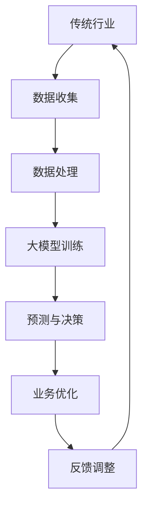

通过上述流程图，我们可以清晰地看到大模型在传统行业中的应用路径，以及各个环节之间的紧密联系。接下来，我们将深入探讨大模型的基本概念与架构，以更好地理解其技术原理和应用前景。

### 第2章：大模型的基本概念与架构

#### 2.1 大模型的基本概念

大模型（Large Models）是指在机器学习和人工智能领域中，拥有数亿至千亿参数的深度神经网络模型。这些模型通过学习大量数据，能够捕捉复杂的模式和规律，从而在各种任务中实现高性能。大模型的出现，标志着人工智能领域的一个重要里程碑，使得机器学习模型在处理复杂任务时，取得了显著的性能提升。

大模型的基本概念包括以下几个方面：

1. **参数规模**：大模型的参数规模通常是普通模型的数十倍甚至数千倍。例如，一个典型的语言模型，如GPT-3，拥有超过1750亿个参数。

2. **数据处理能力**：大模型拥有更强的数据处理能力，能够处理海量的数据和复杂的特征。这使得大模型在处理大规模数据集时，能够捕捉到更细微的模式和规律。

3. **泛化能力**：大模型通过学习大量数据，能够获得更好的泛化能力，即在不同领域和任务中都能表现出良好的性能。

4. **计算资源需求**：大模型的训练和推理需要大量的计算资源，包括高性能计算硬件和能源消耗。

#### 2.2 大模型的架构与发展历程

大模型的架构主要包括输入层、隐藏层和输出层。输入层接收外部数据，隐藏层通过神经网络进行数据处理，输出层生成预测结果。大模型的架构经历了多个阶段的发展，从最初的简单单层神经网络，到多层神经网络，再到如今复杂的深度神经网络。

1. **单层神经网络**：单层神经网络是最简单的神经网络结构，主要用于简单的数据处理任务，如逻辑回归。

2. **多层神经网络**：多层神经网络通过增加隐藏层，能够处理更复杂的数据和任务。1990年代初，多层感知器（MLP）的出现，标志着多层神经网络的发展。

3. **深度神经网络**：深度神经网络（DNN）是多层神经网络的进一步发展，通过增加隐藏层和神经元，能够处理更加复杂的数据和任务。2006年，Hinton等人提出的深度信念网络（DBN），标志着深度神经网络时代的到来。

4. **深度增强学习**：深度增强学习（Deep Reinforcement Learning）结合了深度神经网络和增强学习，通过试错学习，实现复杂环境的智能决策。

5. **生成对抗网络**（GAN）：生成对抗网络是深度神经网络的一个重要分支，通过生成器和判别器的对抗训练，实现数据生成和分布学习。

6. **变换器架构**（Transformer）：Transformer模型在自然语言处理领域取得了重大突破，其核心思想是自注意力机制（Self-Attention），通过计算输入序列中每个元素的相关性，实现更加灵活的特征表示。

#### 2.3 大模型的核心技术

大模型的核心技术包括深度学习、生成对抗网络（GAN）、转移学习、注意力机制等。以下是对这些核心技术的详细解释：

1. **深度学习**：深度学习是一种基于多层神经网络的学习方法，通过逐层学习数据特征，实现复杂的模式识别和预测任务。深度学习的核心技术包括反向传播算法、激活函数、优化算法等。

2. **生成对抗网络**（GAN）：生成对抗网络是一种无监督学习模型，由生成器和判别器组成。生成器生成数据，判别器判断数据是真实还是伪造。通过生成器和判别器的对抗训练，生成器能够生成高质量的数据。

3. **转移学习**：转移学习是一种通过在一个任务上训练好的模型，迁移知识到另一个相关任务上的方法。通过转移学习，可以大大减少训练数据的需求，提高模型的泛化能力。

4. **注意力机制**：注意力机制是一种通过学习权重，自动聚焦重要信息的方法。在自然语言处理、计算机视觉等领域，注意力机制能够显著提高模型的性能。

通过上述核心技术，大模型能够实现强大的数据处理和模式识别能力，为传统行业的转型升级提供了有力支持。以下是Mermaid流程图，展示了大模型的核心技术和应用场景。

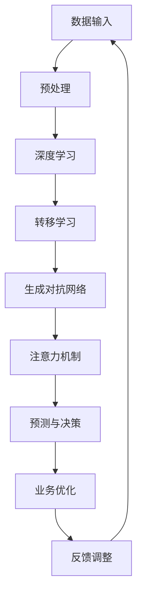

通过上述流程图，我们可以清晰地看到大模型的核心技术和应用路径，以及各个环节之间的紧密联系。接下来，我们将深入探讨AI在各传统行业中的应用，特别是零售、金融、制造、医疗和农业等行业，以了解大模型如何改变传统行业的运作模式。

### 第3章：零售行业的AI应用

#### 3.1 零售行业现状与问题

零售行业是AI技术的重要应用领域之一。随着消费者需求的多样化和市场竞争的加剧，零售行业面临着巨大的挑战和问题。

首先，零售行业需要处理海量商品数据和高频交易数据，传统的数据处理方法已经难以满足需求。例如，如何有效地管理和分析库存数据，以避免库存过剩或缺货现象，成为零售企业的一大难题。

其次，消费者行为分析成为零售行业关注的重点。传统的营销策略往往依赖于历史数据和假设，而AI技术可以实时分析消费者的购买行为、浏览历史和反馈，提供个性化的推荐和服务。

最后，零售行业的用户体验和服务质量也是重要的挑战。随着消费者对购物体验的要求越来越高，如何提供高效、便捷、个性化的服务，成为零售企业需要解决的关键问题。

#### 3.2 AI技术在零售行业的应用案例

AI技术在零售行业中的应用案例丰富，以下是一些典型的应用场景：

1. **库存管理**：AI技术可以通过大数据分析和机器学习算法，预测商品需求，优化库存管理。例如，沃尔玛利用AI技术优化其供应链管理，通过分析销售数据和天气等因素，预测商品需求，从而减少库存成本和缺货风险。

2. **个性化推荐**：AI技术可以根据消费者的购买历史、浏览行为和偏好，提供个性化的商品推荐。例如，亚马逊利用其推荐系统，为每个用户推荐最有可能感兴趣的商品，从而提高销售额和用户满意度。

3. **智能客服**：AI技术可以通过自然语言处理和机器学习算法，实现智能客服。例如，阿里巴巴的“阿里小蜜”利用AI技术，为用户提供24/7的智能客服服务，提高了客服效率和用户体验。

4. **供应链优化**：AI技术可以优化零售行业的供应链管理，提高物流效率和降低成本。例如，京东利用AI技术优化其物流配送，通过预测订单量、优化配送路线，提高配送效率和服务质量。

5. **智能定价**：AI技术可以通过大数据分析和预测模型，实现智能定价。例如，价格比较网站PriceRunner利用AI技术，实时分析市场数据和消费者行为，为用户提供最合理的商品价格推荐。

#### 3.3 AI技术在零售行业的解决方案

AI技术在零售行业的解决方案主要包括以下几个方面：

1. **数据整合与处理**：零售企业需要整合各种数据源，如销售数据、库存数据、客户反馈等，通过大数据技术和数据清洗，获得高质量的数据。

2. **机器学习算法**：利用机器学习算法，对海量数据进行挖掘和分析，预测商品需求、优化库存管理、提供个性化推荐等。

3. **自然语言处理**：通过自然语言处理技术，实现智能客服、语音识别、情感分析等应用，提高客户服务和用户体验。

4. **深度学习**：深度学习技术在图像识别、视频分析、语音识别等领域具有显著优势，可以应用于商品识别、智能监控等场景。

5. **智能供应链管理**：通过AI技术，实现供应链的智能化管理，优化物流配送、库存管理、订单处理等环节。

以下是Mermaid流程图，展示了AI技术在零售行业中的应用架构和核心环节。

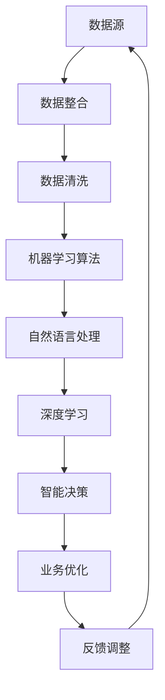

通过上述流程图，我们可以清晰地看到AI技术在零售行业中的应用路径和各个环节之间的紧密联系。接下来，我们将探讨AI技术在金融行业的应用，以及大模型如何推动金融行业的创新和变革。

### 第4章：金融行业的AI应用

#### 4.1 金融行业现状与问题

金融行业是一个高度依赖数据和技术的领域。随着金融市场的全球化、复杂化和多样化，金融行业面临着诸多挑战和问题。

首先，风险管理是金融行业的关键问题。金融机构需要准确评估和预测各种风险，包括信用风险、市场风险、操作风险等。然而，传统的方法往往依赖于历史数据和规则，难以应对快速变化的金融环境。

其次，金融欺诈和网络安全问题日益突出。随着金融业务的在线化和数字化，金融行业面临着日益增多的欺诈行为和网络安全威胁。如何有效识别和防范金融欺诈、保障用户资金安全，成为金融行业的重要挑战。

此外，金融服务的效率和用户体验也亟待提升。传统金融服务流程复杂、效率低下，客户体验不佳。如何通过技术创新，提高金融服务效率，提升客户满意度，是金融行业需要解决的重要问题。

#### 4.2 AI技术在金融行业的应用案例

AI技术在金融行业的应用案例丰富，以下是一些典型的应用场景：

1. **风险管理**：AI技术可以通过大数据分析和机器学习算法，实现精确的风险评估和预测。例如，金融机构可以使用AI技术对客户的信用评分进行动态调整，提高信用评估的准确性。

2. **反欺诈**：AI技术可以实时监测交易行为，识别异常交易和潜在欺诈行为。例如，银行可以利用AI技术建立反欺诈模型，自动识别和阻止欺诈交易，保障用户资金安全。

3. **智能投顾**：AI技术可以通过大数据分析和机器学习算法，为投资者提供个性化的投资建议和服务。例如，智能投顾平台利用AI技术分析市场数据、用户风险偏好，为用户提供最优的投资组合。

4. **智能客服**：AI技术可以通过自然语言处理和机器学习算法，实现智能客服和智能语音交互。例如，金融机构可以使用AI技术建立智能客服系统，提供24/7的在线服务，提高客户满意度和运营效率。

5. **交易执行**：AI技术可以通过算法交易和量化投资，提高交易效率和收益。例如，量化交易团队利用AI技术分析市场数据，制定交易策略，实现高效交易和收益最大化。

6. **智能风控**：AI技术可以通过大数据分析和机器学习算法，实现智能风控和风险预警。例如，金融机构可以使用AI技术建立风险监测系统，实时监控风险指标，提前预警潜在风险。

#### 4.3 AI技术在金融行业的解决方案

AI技术在金融行业的解决方案主要包括以下几个方面：

1. **数据整合与分析**：金融行业需要整合来自各个渠道的数据，如交易数据、客户数据、市场数据等，通过大数据技术和数据挖掘，获得有价值的信息。

2. **机器学习算法**：利用机器学习算法，对海量金融数据进行建模和分析，实现精准的风险评估、信用评分、投资决策等。

3. **自然语言处理**：通过自然语言处理技术，实现智能客服、智能语音交互、文本分析等应用，提高客户服务和用户体验。

4. **深度学习**：深度学习技术在图像识别、视频分析、语音识别等领域具有显著优势，可以应用于图像识别、文档审核、智能监控等场景。

5. **区块链技术**：结合区块链技术，实现金融交易的透明、安全和可追溯，提高金融行业的效率和信任度。

以下是Mermaid流程图，展示了AI技术在金融行业中的应用架构和核心环节。

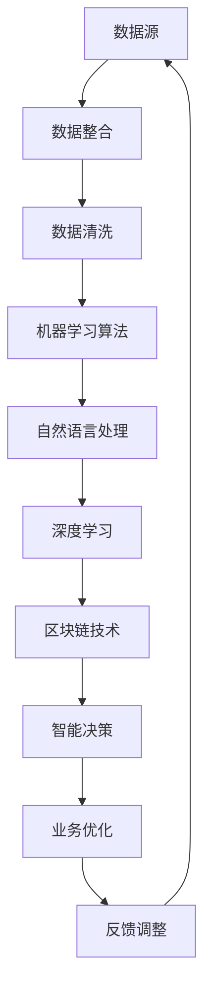

通过上述流程图，我们可以清晰地看到AI技术在金融行业中的应用路径和各个环节之间的紧密联系。接下来，我们将探讨AI技术在制造业中的应用，以及大模型如何推动制造业的数字化转型和智能化升级。

### 第5章：制造业的AI应用

#### 5.1 制造业现状与问题

制造业是国民经济的重要支柱，但在快速发展中，也面临着诸多挑战和问题。

首先，生产效率低下是一个突出的问题。传统制造业依赖大量的人工操作，生产效率较低，生产周期较长。如何通过自动化和智能化手段提高生产效率，成为制造业亟待解决的问题。

其次，质量控制问题也是制造业面临的一大挑战。产品质量的波动性和不确定性，不仅影响企业的声誉，还可能导致巨大的经济损失。如何通过AI技术实现高质量的生产控制，提高产品一致性，是制造业需要解决的关键问题。

此外，资源浪费和环境污染问题日益严重。传统制造业在生产过程中，往往存在资源利用率低、能耗大、污染严重的问题。如何通过AI技术实现绿色制造、节能减排，是制造业可持续发展的重要方向。

#### 5.2 AI技术在制造业的应用案例

AI技术在制造业中的应用案例丰富，以下是一些典型的应用场景：

1. **生产过程自动化**：AI技术可以通过机器视觉、机器人技术等，实现生产过程的自动化。例如，汽车制造过程中，AI技术可以用于自动化焊接、涂装和组装，提高生产效率和产品质量。

2. **质量控制**：AI技术可以通过机器学习算法，实现对产品质量的实时监测和预测。例如，富士康利用AI技术，通过摄像头和传感器，实时监测生产过程中的产品质量，实现全自动质量检测。

3. **智能物流管理**：AI技术可以通过大数据分析和机器学习算法，优化物流管理和配送流程。例如，亚马逊利用AI技术，优化仓储管理和配送路线，提高物流效率。

4. **预测性维护**：AI技术可以通过大数据分析和机器学习算法，实现设备的预测性维护，减少设备故障和停机时间。例如，西门子利用AI技术，通过分析设备运行数据，预测设备故障，提前进行维护。

5. **供应链管理**：AI技术可以通过大数据分析和机器学习算法，实现供应链的智能化管理。例如，宝洁利用AI技术，优化供应链管理，提高库存周转率和供应链效率。

6. **能源管理**：AI技术可以通过大数据分析和机器学习算法，实现能源的智能管理，降低能耗和环境污染。例如，国家电网利用AI技术，优化电网运行和管理，实现节能减排。

#### 5.3 AI技术在制造业的解决方案

AI技术在制造业的解决方案主要包括以下几个方面：

1. **自动化技术**：通过机器人、机器视觉等自动化技术，实现生产过程的自动化和智能化，提高生产效率和产品质量。

2. **大数据分析**：通过大数据技术，对生产过程中的各种数据进行收集、存储和分析，实现生产过程的数据化和智能化。

3. **机器学习算法**：利用机器学习算法，对生产数据进行分析和预测，实现生产过程的优化和质量控制。

4. **智能物流管理**：通过大数据分析和机器学习算法，优化物流管理和配送流程，提高物流效率。

5. **智能设备维护**：通过大数据分析和机器学习算法，实现设备的预测性维护，减少设备故障和停机时间。

6. **绿色制造**：通过大数据分析和机器学习算法，优化生产过程，降低能耗和环境污染，实现绿色制造。

以下是Mermaid流程图，展示了AI技术在制造业中的应用架构和核心环节。

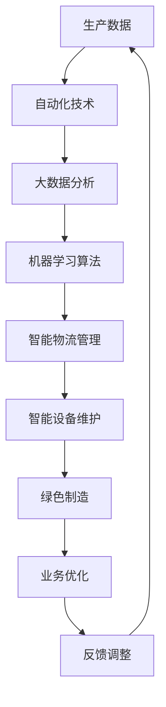

通过上述流程图，我们可以清晰地看到AI技术在制造业中的应用路径和各个环节之间的紧密联系。接下来，我们将探讨AI技术在医疗行业的应用，以及大模型如何助力医疗行业的发展和创新。

### 第6章：医疗行业的AI应用

#### 6.1 医疗行业现状与问题

医疗行业是一个高度专业化和信息化的领域，但在发展过程中，也面临着诸多挑战和问题。

首先，医疗资源的分布不均衡是一个突出的问题。城市与农村、发达地区与欠发达地区之间的医疗资源分配存在显著差异，导致医疗服务的可及性差异较大。如何通过AI技术优化医疗资源分配，提高医疗服务覆盖范围，是医疗行业需要解决的重要问题。

其次，诊断和治疗效率低下也是一个亟待解决的问题。传统医疗诊断和治疗过程复杂，耗时较长，患者体验不佳。如何通过AI技术实现医疗过程的自动化和智能化，提高诊断和治疗效率，是医疗行业面临的挑战。

此外，医疗数据的管理和分析也是一大难题。医疗数据种类繁多，数据量大，如何通过AI技术有效地管理和分析医疗数据，提取有价值的信息，为临床决策提供支持，是医疗行业需要解决的关键问题。

#### 6.2 AI技术在医疗行业的应用案例

AI技术在医疗行业的应用案例丰富，以下是一些典型的应用场景：

1. **疾病诊断**：AI技术可以通过深度学习和图像识别技术，实现疾病自动诊断。例如，AI系统可以通过分析CT、MRI等影像数据，自动识别疾病，提高诊断准确性和速度。

2. **辅助治疗**：AI技术可以通过大数据分析和机器学习算法，为患者提供个性化的治疗方案。例如，AI系统可以分析患者的病史、基因信息等数据，为医生提供最佳的治疗方案。

3. **药物研发**：AI技术可以通过大数据分析和深度学习技术，加速药物研发过程。例如，AI系统可以通过分析大量药物数据，预测药物的有效性和安全性，缩短药物研发周期。

4. **智能导诊**：AI技术可以通过自然语言处理和机器学习算法，实现智能导诊系统。例如，AI系统可以分析患者的症状和病史，自动推荐合适的科室和医生，提高就医效率。

5. **健康管理**：AI技术可以通过大数据分析和预测模型，实现个性化健康管理。例如，AI系统可以分析患者的健康数据，预测健康风险，提供个性化的健康建议。

6. **手术辅助**：AI技术可以通过机器学习和计算机视觉技术，实现手术辅助。例如，AI系统可以在手术过程中实时分析手术场景，提供精准的手术指导，提高手术成功率。

#### 6.3 AI技术在医疗行业的解决方案

AI技术在医疗行业的解决方案主要包括以下几个方面：

1. **医疗数据分析**：通过大数据技术和数据分析算法，实现对医疗数据的深度挖掘和分析，提取有价值的信息，为临床决策提供支持。

2. **智能诊断系统**：利用深度学习和图像识别技术，实现疾病的自动化诊断，提高诊断准确性和速度。

3. **个性化治疗**：通过大数据分析和机器学习算法，为患者提供个性化的治疗方案，提高治疗效果。

4. **智能导诊系统**：利用自然语言处理和机器学习算法，实现智能导诊，提高就医效率。

5. **药物研发加速**：通过大数据分析和深度学习技术，加速药物研发过程，提高药物研发的成功率。

6. **健康管理平台**：通过大数据分析和预测模型，实现个性化健康管理，提高患者的生活质量。

以下是Mermaid流程图，展示了AI技术在医疗行业中的应用架构和核心环节。

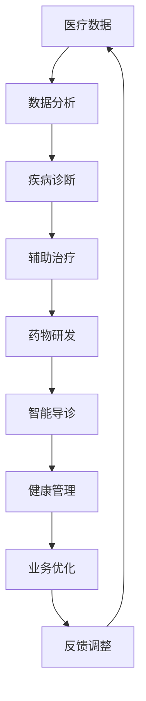

通过上述流程图，我们可以清晰地看到AI技术在医疗行业中的应用路径和各个环节之间的紧密联系。接下来，我们将探讨AI技术在农业行业的应用，以及大模型如何助力农业的智能化和可持续发展。

### 第7章：农业的AI应用

#### 7.1 农业行业现状与问题

农业是国家粮食安全和经济发展的基础，但在发展过程中，也面临着诸多挑战和问题。

首先，农业劳动力的老龄化问题日益严重。随着城市化进程的加快，年轻劳动力逐渐转向城市工作，导致农业劳动力短缺，农业生产效率低下。

其次，农业资源的利用效率不高。传统农业依赖人力和经验，资源利用效率较低，导致资源浪费和环境污染问题。

此外，气候变化和自然灾害对农业产生重大影响。如何通过技术手段提高农业的抗灾能力，保障粮食安全，是农业行业面临的重要挑战。

#### 7.2 AI技术在农业行业的应用案例

AI技术在农业行业的应用案例丰富，以下是一些典型的应用场景：

1. **精准农业**：AI技术可以通过大数据分析和机器学习算法，实现精准农业。例如，通过卫星遥感技术和传感器，实时监测土壤湿度、作物生长状态等数据，优化灌溉和施肥策略，提高作物产量。

2. **智能种植**：AI技术可以通过图像识别和深度学习技术，实现智能种植。例如，AI系统可以分析作物的生长状况，自动识别病虫害，提供种植建议，提高作物产量和品质。

3. **农机自动化**：AI技术可以通过机器学习和计算机视觉技术，实现农机自动化。例如，自动驾驶拖拉机、无人机植保等，提高农业生产效率，降低人力成本。

4. **农业大数据**：AI技术可以通过大数据技术，实现农业数据的整合和分析。例如，通过收集土壤、气候、作物生长等数据，进行大数据分析，优化农业生产和管理。

5. **农产品质量检测**：AI技术可以通过图像识别和深度学习技术，实现农产品质量检测。例如，AI系统可以分析农产品的外观、质地等特征，自动判断农产品质量，提高农产品安全性。

6. **农业供应链优化**：AI技术可以通过大数据分析和机器学习算法，优化农业供应链。例如，通过分析市场需求、物流成本等数据，优化农产品生产和配送流程，提高供应链效率。

#### 7.3 AI技术在农业行业的解决方案

AI技术在农业行业的解决方案主要包括以下几个方面：

1. **精准农业技术**：通过大数据分析和机器学习算法，实现精准农业，提高农业生产效率和作物产量。

2. **智能种植技术**：通过图像识别和深度学习技术，实现智能种植，提高农作物生长状态和产量。

3. **农机自动化技术**：通过机器学习和计算机视觉技术，实现农机自动化，提高农业生产效率。

4. **农业大数据平台**：通过大数据技术，实现农业数据的整合和分析，优化农业生产和管理。

5. **农产品质量检测技术**：通过图像识别和深度学习技术，实现农产品质量检测，提高农产品安全性。

6. **农业供应链优化技术**：通过大数据分析和机器学习算法，优化农业供应链，提高供应链效率。

以下是Mermaid流程图，展示了AI技术在农业行业中的应用架构和核心环节。

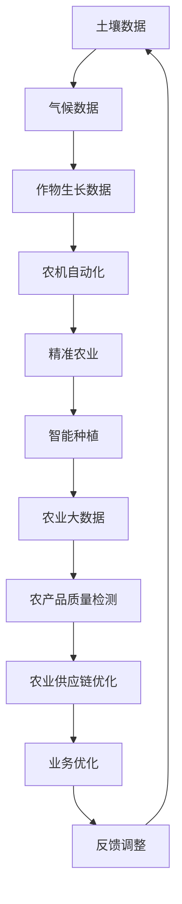

通过上述流程图，我们可以清晰地看到AI技术在农业行业中的应用路径和各个环节之间的紧密联系。接下来，我们将探讨大模型在商业决策中的应用，以及如何通过大模型实现商业决策的智能化和精准化。

### 第8章：大模型在商业决策中的应用

#### 8.1 大模型在商业决策中的优势

大模型在商业决策中的应用，带来了前所未有的优势和变革。首先，大模型具有强大的数据处理能力，能够快速处理和分析海量数据，提供实时决策支持。这意味着企业在面对复杂市场环境时，能够迅速做出反应，把握市场机会。

其次，大模型在模式识别和预测方面具有显著优势。通过深度学习和生成对抗网络等技术，大模型可以从历史数据中学习，捕捉市场规律和趋势，为未来的商业决策提供准确预测。这种预测能力可以帮助企业在产品开发、市场推广、风险管理等方面做出更为明智的决策。

此外，大模型在优化和自动化决策方面也有显著优势。通过优化算法和自动化流程，大模型可以自动化执行复杂的决策任务，减少人工干预，提高决策效率。这种自动化决策能力，不仅能够提高企业的运营效率，还能降低决策失误的风险。

#### 8.2 大模型在商业决策中的应用案例

以下是大模型在商业决策中的几个典型应用案例：

1. **精准营销**：大模型可以通过分析消费者的行为数据、社交数据等，预测消费者的购买偏好，提供个性化的营销策略。例如，阿里巴巴利用大模型技术，实现个性化推荐，提高了用户购物体验和销售额。

2. **需求预测**：大模型可以通过分析历史销售数据、市场趋势等，预测未来的市场需求，帮助企业制定生产计划和库存管理策略。例如，亚马逊利用大模型技术，优化其库存管理，减少了缺货风险，提高了供应链效率。

3. **风险管理**：大模型可以通过分析金融数据、市场波动等，预测金融风险，帮助企业制定风险控制策略。例如，摩根大通利用大模型技术，实现了精确的信用评分和风险预警，提高了金融业务的稳健性。

4. **供应链优化**：大模型可以通过分析供应链数据、物流信息等，优化供应链管理，提高供应链效率。例如，沃尔玛利用大模型技术，优化其物流配送路线，降低了物流成本，提高了客户满意度。

5. **投资决策**：大模型可以通过分析市场数据、财务报表等，预测股票走势，为投资者提供投资建议。例如，量化交易平台Trade Ideas利用大模型技术，实现了自动化的投资决策，提高了投资收益。

#### 8.3 大模型在商业决策中的实施策略

要充分发挥大模型在商业决策中的作用，企业需要采取以下实施策略：

1. **数据整合与清洗**：首先，企业需要整合来自不同渠道的数据，包括内部数据和外部数据，进行数据清洗和预处理，确保数据的质量和一致性。

2. **模型训练与优化**：利用深度学习和生成对抗网络等技术，对数据集进行训练，构建大模型。在模型训练过程中，需要不断优化模型参数，提高模型的预测准确性和效率。

3. **自动化决策流程**：将大模型集成到企业的业务流程中，实现自动化决策。通过自动化流程，减少人工干预，提高决策效率。

4. **实时监控与反馈**：建立实时监控系统，对决策过程进行监控和评估，收集反馈数据，用于模型优化和调整。

5. **人才培养与引进**：企业需要培养和引进具备AI技术和商业决策能力的人才，确保大模型在商业决策中的有效应用。

以下是Mermaid流程图，展示了大模型在商业决策中的应用路径和核心环节。

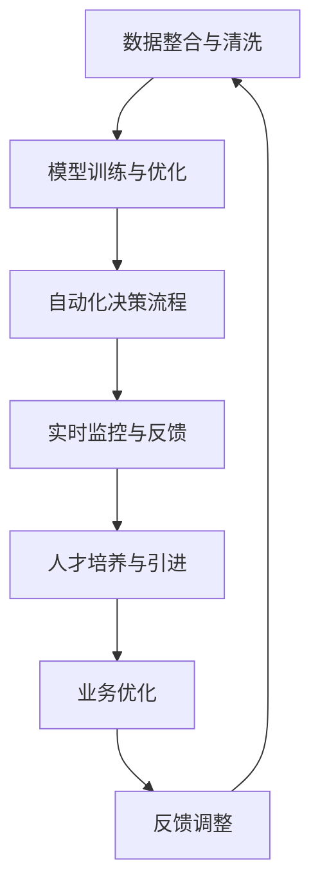

通过上述流程图，我们可以清晰地看到大模型在商业决策中的应用路径和各个环节之间的紧密联系。接下来，我们将探讨大模型与数字化转型的关系，以及大模型如何推动企业的数字化转型。

### 第9章：大模型与数字化转型

#### 9.1 数字化转型的趋势与挑战

数字化转型已经成为全球企业发展的关键趋势。随着互联网、大数据、云计算等新兴技术的快速发展，企业逐渐认识到数字化转型的重要性。数字化转型不仅能够提升企业的运营效率，还能为企业带来新的商业模式和增长机会。

然而，数字化转型过程中也面临着诸多挑战。首先，技术选型和投入是数字化转型的重要挑战。企业需要选择合适的技术和平台，进行大规模的技术投入，这对于许多传统企业来说，是一个巨大的考验。

其次，数据治理和隐私保护是数字化转型中的重要问题。数字化转型意味着企业需要处理和分析大量的数据，如何确保数据的安全性和隐私性，避免数据泄露和滥用，是企业需要解决的关键问题。

此外，组织文化和人才问题是数字化转型的重要挑战。数字化转型需要企业打破传统的组织结构和业务流程，建立新的数字化文化，吸引和培养具备数字化能力和创新精神的员工。

#### 9.2 大模型在数字化转型中的应用

大模型在数字化转型中发挥着重要作用，能够帮助企业克服数字化转型中的各种挑战。以下是大模型在数字化转型中的应用：

1. **业务流程优化**：大模型可以通过机器学习和深度学习技术，对业务流程进行优化。例如，通过分析业务数据，大模型可以识别业务流程中的瓶颈和问题，提出优化方案，提高业务效率。

2. **数据治理与隐私保护**：大模型可以通过加密和隐私保护技术，实现对数据的治理和保护。例如，大模型可以使用差分隐私技术，对敏感数据进行处理，确保数据隐私。

3. **智能决策支持**：大模型可以为企业提供智能决策支持，通过分析大量数据，提供预测和优化建议。例如，大模型可以预测市场需求、优化库存管理、优化营销策略等，帮助企业做出更明智的决策。

4. **用户体验提升**：大模型可以通过个性化推荐和智能客服等技术，提升用户体验。例如，大模型可以根据用户行为数据，提供个性化的产品推荐和服务，提高用户满意度和忠诚度。

5. **创新业务模式**：大模型可以推动企业的创新业务模式，通过大数据分析和人工智能技术，发现新的市场机会，为企业创造新的商业模式和价值。

#### 9.3 大模型推动数字化转型的策略

要充分发挥大模型在数字化转型中的作用，企业可以采取以下策略：

1. **顶层设计**：制定数字化转型战略和规划，明确数字化转型的目标、路径和关键环节，确保数字化转型工作的有序推进。

2. **技术选型和投入**：选择合适的大模型技术和平台，进行技术投入和研发，确保技术选型和投入的合理性。

3. **数据治理**：建立完善的数据治理体系，确保数据质量、安全和合规，为数字化转型提供数据支持。

4. **人才培养**：培养和引进具备数字化能力和创新精神的员工，建立数字化文化，推动数字化转型。

5. **试点应用**：选择合适的业务场景进行大模型试点应用，通过试点应用，积累经验，逐步推广大模型在业务中的应用。

6. **持续优化**：建立持续优化机制，对大模型应用效果进行评估和优化，确保大模型在数字化转型中的有效应用。

以下是Mermaid流程图，展示了大模型在数字化转型中的应用路径和核心环节。

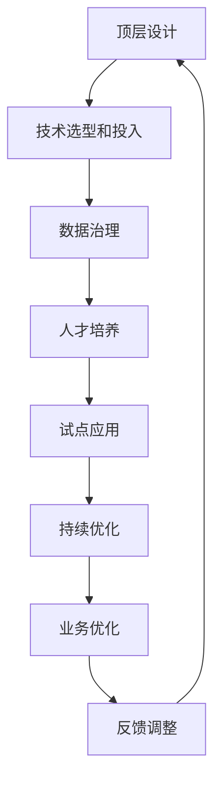

通过上述流程图，我们可以清晰地看到大模型在数字化转型中的应用路径和各个环节之间的紧密联系。接下来，我们将探讨大模型与产业链重构的关系，以及大模型如何推动产业链的升级和优化。

### 第10章：大模型与产业链重构

#### 10.1 产业链的现状与问题

产业链是现代经济体系中的重要组成部分，涉及多个环节，包括原材料采购、生产制造、物流配送、销售服务等。然而，在当前的经济环境下，产业链面临着诸多挑战和问题。

首先，产业链的复杂性和全球化程度不断提高，使得产业链管理和协调变得更加困难。企业需要在全球范围内进行资源配置和供应链管理，如何确保供应链的稳定性和效率，成为产业链管理的关键问题。

其次，传统产业链中存在信息不对称、资源分配不均等问题。信息不对称导致企业难以获取准确的市场信息和竞争对手动态，影响决策的准确性和效率。资源分配不均则导致产业链各环节之间的利益分配不平衡，影响产业链的整体效益。

此外，产业链的智能化和数字化转型进程相对缓慢，许多企业在技术和管理上仍存在滞后现象，难以适应快速变化的市场环境。

#### 10.2 大模型在产业链重构中的应用

大模型在产业链重构中具有重要作用，能够推动产业链的智能化、数字化和高效化发展。以下是大模型在产业链重构中的应用：

1. **智能供应链管理**：大模型可以通过机器学习和深度学习技术，实现对供应链数据的实时分析和预测，优化供应链管理。例如，大模型可以预测市场需求、优化库存管理、降低物流成本，提高供应链的效率和稳定性。

2. **产业链协同优化**：大模型可以通过数据分析和技术整合，实现产业链各环节的协同优化。例如，大模型可以分析产业链上下游企业的生产数据、物流信息等，提供优化建议，提高产业链的整体效益。

3. **智能决策支持**：大模型可以为企业提供智能决策支持，通过分析大量数据，提供预测和优化建议。例如，大模型可以预测市场趋势、优化生产计划、降低运营成本，提高企业的决策准确性和效率。

4. **产业链风险预警**：大模型可以通过大数据分析和预测模型，实现产业链风险预警。例如，大模型可以分析全球经济、政策变化、市场波动等数据，预测产业链风险，为企业提供风险管理建议。

5. **产业链创新与协作**：大模型可以推动产业链的创新和协作，通过数据共享和协同工作，提高产业链的整体竞争力。例如，大模型可以促进产业链上下游企业之间的信息共享和协作，推动产业链的协同创新。

#### 10.3 大模型促进产业链升级的策略

为了充分发挥大模型在产业链重构中的作用，企业可以采取以下策略：

1. **数据整合与治理**：首先，企业需要整合来自不同环节的数据，进行数据清洗和治理，确保数据的质量和一致性。

2. **大模型技术研发**：企业需要投入资源，进行大模型技术研发和应用，建立智能化、数字化的大模型应用体系。

3. **产业链协同平台**：企业可以建立产业链协同平台，促进上下游企业之间的信息共享和协同工作，提高产业链的整体效率。

4. **人才培养与引进**：企业需要培养和引进具备数字化能力和创新精神的员工，建立数字化文化和团队，推动大模型在产业链中的应用。

5. **政策支持与合作**：政府和企业可以加强政策支持和合作，推动大模型在产业链重构中的应用，促进产业链的升级和优化。

以下是Mermaid流程图，展示了大模型在产业链重构中的应用路径和核心环节。

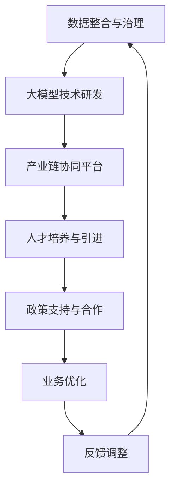

通过上述流程图，我们可以清晰地看到大模型在产业链重构中的应用路径和各个环节之间的紧密联系。接下来，我们将探讨大模型与未来商业生态的关系，以及大模型如何推动未来商业生态的创新和发展。

### 第11章：大模型与未来商业生态

#### 11.1 未来商业生态的展望

未来商业生态将随着人工智能技术的快速发展而不断演变，大模型作为其中的核心驱动力，将对商业生态产生深远影响。以下是未来商业生态的几个关键趋势：

1. **智能商业环境**：大模型将构建一个高度智能化、自动化的商业环境，企业可以通过实时数据分析、智能决策支持系统，实现业务的自动化和智能化运营。

2. **产业链协同**：大模型将促进产业链的深度协同，通过数据共享、协同工作，提高产业链的整体效率和竞争力。

3. **个性化服务**：大模型将推动个性化服务的发展，通过精准分析消费者行为和市场趋势，为企业提供个性化的产品推荐和服务。

4. **创新商业模式**：大模型将激发创新的商业模式，通过大数据分析和预测，发现新的市场机会，为企业创造新的商业价值。

5. **全球协作**：大模型将打破地域限制，促进全球范围内的商业协作，通过实时数据交流和智能决策，实现全球化运营。

#### 11.2 大模型在商业生态中的角色

大模型在商业生态中扮演着多重角色，既是创新引擎，也是基础设施。以下是具体角色：

1. **创新引擎**：大模型通过深度学习和生成对抗网络等技术，推动商业模式的创新和业务流程的优化，为商业生态注入新的活力。

2. **数据处理与分析**：大模型具备强大的数据处理和分析能力，能够处理海量数据，提取有价值的信息，为商业决策提供数据支持。

3. **智能决策支持**：大模型通过实时分析和预测，为企业提供智能决策支持，提高决策的准确性和效率。

4. **协同平台**：大模型作为协同平台，促进产业链上下游企业之间的信息共享和协同工作，提高产业链的整体效率。

5. **个性化服务提供者**：大模型通过分析消费者行为和市场趋势，为企业提供个性化的产品推荐和服务，提升用户体验。

#### 11.3 大模型推动商业生态创新的方向

为了充分发挥大模型在商业生态中的创新作用，以下是几个关键方向：

1. **智能化供应链管理**：通过大模型技术，实现供应链的智能化管理，提高供应链的效率和稳定性。

2. **个性化营销**：利用大模型分析消费者数据，实现精准营销，提高营销效果和客户满意度。

3. **智能金融服务**：通过大模型技术，实现智能化的金融产品推荐、风险评估和风险控制，提高金融服务的效率和质量。

4. **智能医疗健康**：利用大模型技术，实现智能化的疾病诊断、治疗方案推荐和健康管理，提高医疗服务的效率和质量。

5. **智能制造**：通过大模型技术，实现智能化的生产管理和质量控制，提高生产效率和产品质量。

以下是Mermaid流程图，展示了大模型在商业生态中的应用路径和核心环节。

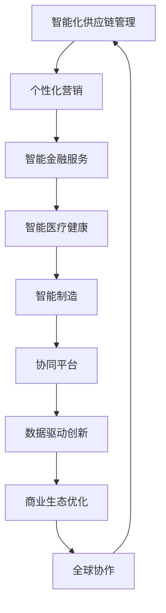

通过上述流程图，我们可以清晰地看到大模型在商业生态中的创新路径和各个环节之间的紧密联系。未来，随着大模型技术的不断发展和应用，商业生态将迎来更加智能化、个性化和全球化的新阶段。

### 附录A：AI大模型应用工具与资源

#### A.1 AI大模型应用工具

1. **TensorFlow**：TensorFlow是Google开发的开源机器学习框架，广泛用于构建和训练大模型。

2. **PyTorch**：PyTorch是Facebook开发的另一个流行的开源机器学习框架，以其灵活的动态计算图而著称。

3. **Keras**：Keras是一个高级神经网络API，可以方便地构建和训练深度学习模型，特别适合快速实验和原型开发。

4. **Hugging Face Transformers**：Hugging Face Transformers提供了一个全面的自然语言处理工具集，包括预训练模型和API。

5. **JAX**：JAX是Google开发的一个高性能计算库，适用于大规模深度学习模型的训练和优化。

#### A.2 AI大模型学习资源

1. **《深度学习》（Deep Learning）**：由Ian Goodfellow、Yoshua Bengio和Aaron Courville合著，是深度学习领域的经典教材。

2. **《AI黄埔军校》**：由AI天才研究院编写，深入讲解了深度学习和AI技术的原理与应用。

3. **Coursera上的深度学习课程**：由Andrew Ng教授主讲，提供系统的深度学习知识和实践。

4. **GitHub上的开源项目**：许多开源项目提供了丰富的AI大模型代码和教程，如TensorFlow、PyTorch等框架的官方GitHub页面。

5. **AI学术会议和期刊**：如NeurIPS、ICML、JMLR等，提供了最新的研究进展和论文资源。

### 附录B：常见问题与解答

#### B.1 AI在传统行业应用常见问题

1. **Q：AI技术是否适用于所有传统行业？**
   - **A**：AI技术具有广泛的适用性，但不同行业的特点和应用需求不同。例如，制造业适合自动化和预测性维护，而医疗行业则适合疾病诊断和个性化治疗。总的来说，AI技术可以适用于大多数传统行业，但需要根据行业特性进行定制化应用。

2. **Q：AI技术的应用是否会替代人类工作？**
   - **A**：AI技术确实会改变部分工作岗位，但它更多地是作为辅助工具，提高工作效率和生产力。同时，AI技术也会创造新的工作岗位，如AI系统开发、数据标注、AI运维等。因此，AI技术不会完全替代人类工作，而是与人类共同进步。

3. **Q：AI技术的应用是否需要大量的数据？**
   - **A**：虽然大量数据可以提升AI模型的性能，但不是所有应用都需要大量数据。对于一些简单的任务，如文本分类、情感分析等，小数据集也能取得较好的效果。关键在于如何有效地利用现有数据，进行特征工程和模型优化。

#### B.2 大模型应用常见问题

1. **Q：大模型训练是否需要大量的计算资源？**
   - **A**：是的，大模型训练通常需要大量的计算资源，包括GPU、TPU等高性能计算硬件。随着AI技术的发展，一些云计算平台（如Google Cloud、AWS等）提供了强大的计算资源，使得大模型训练更加便捷和高效。

2. **Q：大模型的应用是否受限于数据隐私和安全性？**
   - **A**：数据隐私和安全是AI应用的重要挑战。为了解决这些问题，可以采用差分隐私、联邦学习等技术，确保数据在传输和处理过程中的安全性和隐私性。此外，制定严格的数据使用政策和监管措施，也是保障数据安全和隐私的重要手段。

3. **Q：大模型的应用是否受限于数据质量和标注？**
   - **A**：是的，数据质量和标注对于大模型的应用至关重要。高质量的数据和准确的标注可以提高模型的性能和可靠性。因此，在进行大模型训练和应用之前，需要对数据进行严格的质量控制和标注。

### 附录C：参考文献

#### C.1 相关书籍

1. Goodfellow, I., Bengio, Y., & Courville, A. (2016). *Deep Learning*. MIT Press.
2. Russell, S., & Norvig, P. (2020). *Artificial Intelligence: A Modern Approach*. Prentice Hall.
3. Bосвeld, M. (2019). *AI First: How to leverage AI as a first-class business tool*. Penguin.

#### C.2 学术论文

1. LeCun, Y., Bengio, Y., & Hinton, G. (2015). *Deep learning*. Nature, 521(7553), 436-444.
2. Vinyals, O., & LeCun, Y. (2015). *From machine learning to machine reasoning*. Microsoft Research.
3. Devlin, J., Chang, M. W., Lee, K., & Toutanova, K. (2019). *Bert: Pre-training of deep bidirectional transformers for language understanding*. arXiv preprint arXiv:1810.04805.

#### C.3 行业报告

1. McKinsey & Company. (2020). *The Age of Humanity and Machine*. McKinsey Global Institute.
2. International Data Corporation (IDC). (2021). *IDC FutureScape: Worldwide AI Systems 2021 Predictions*. IDC.
3. PwC. (2021). *The AI Imperative: Why AI will power the next wave of business transformation*. PwC.

