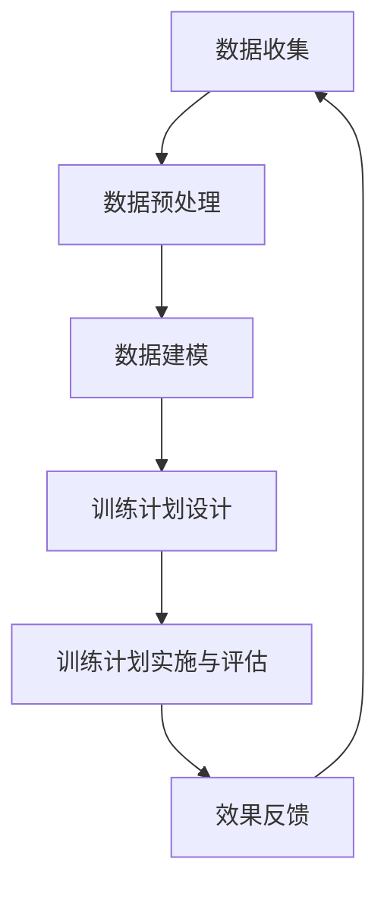

                 

# AIGC在体育训练中的应用：个性化训练计划提示词

> **关键词**：AIGC、体育训练、个性化训练、自然语言处理、机器学习、深度学习

> **摘要**：本文将探讨AIGC（人工智能生成内容）在体育训练中的应用，特别是如何利用AIGC技术为运动员提供个性化的训练计划。我们将从AIGC的概念和应用场景出发，详细分析AIGC在体育训练中的优势与挑战，并介绍AIGC的基础理论、数据收集与处理方法、个性化训练计划设计，最后通过实际案例展示AIGC在体育训练中的具体应用。

---

### 目录大纲

1. **AIGC在体育训练中的应用：个性化训练计划提示词**  
2. **关键词**  
3. **摘要**  
4. **第1章：AIGC与体育训练概述**  
   4.1 AIGC的概念与应用  
   4.2 体育训练中的个性化需求  
   4.3 AIGC在体育训练中的优势与挑战  
5. **第2章：AIGC基础理论**  
   5.1 AIGC技术概述  
   5.2 AIGC关键算法  
   5.3 AIGC应用场景分析  
6. **第3章：体育训练数据收集与处理**  
   6.1 数据收集方法  
   6.2 数据预处理技术  
   6.3 数据分析技术  
7. **第4章：个性化训练计划设计**  
   7.1 个性化训练计划概述  
   7.2 基于AIGC的个性化训练计划设计  
   7.3 个性化训练计划实施与评估  
8. **第5章：AIGC在体育训练中的应用案例**  
   8.1 案例一：基于AIGC的跑步训练计划  
   8.2 案例二：基于AIGC的篮球训练计划  
9. **第6章：AIGC在体育训练中的未来发展趋势**  
   9.1 技术发展趋势  
   9.2 应用领域扩展  
   9.3 社会与伦理问题  
10. **附录：相关工具与资源**  
   10.1 AIGC开发工具介绍  
   10.2 AIGC应用资源推荐

---

### 第1章：AIGC与体育训练概述

#### 1.1 AIGC的概念与应用

##### 1.1.1 AIGC的定义与背景

AIGC（Artificial Intelligence Generated Content）是指利用人工智能技术生成内容的一种方式。它涵盖了自然语言处理、计算机视觉、语音识别等多个领域。AIGC的背景可以追溯到20世纪80年代，当时计算机科学和人工智能领域开始快速发展。随着计算能力和算法的不断提升，AIGC逐渐从理论研究走向实际应用。

##### 1.1.2 AIGC在体育训练中的应用场景

AIGC在体育训练中的应用非常广泛，主要包括以下几个方面：

1. **个性化训练计划设计**：利用AIGC技术，可以根据运动员的生理、心理数据，为其制定个性化的训练计划，提高训练效果。

2. **运动员行为分析**：通过分析运动员的训练和比赛数据，AIGC可以帮助教练发现运动员的优势和不足，优化训练策略。

3. **体育赛事预测**：AIGC可以分析历史比赛数据，预测未来比赛的结果，为教练和运动员提供参考。

4. **运动康复指导**：AIGC可以根据运动员的伤病情况，为其提供个性化的康复训练计划。

#### 1.2 体育训练中的个性化需求

##### 1.2.1 个性化训练的重要性

个性化训练是根据每个运动员的个体差异，为其量身定制训练计划的一种方式。个性化训练的重要性体现在以下几个方面：

1. **提高训练效果**：个性化训练能够根据运动员的实际情况，有针对性地进行训练，从而提高训练效果。

2. **减少受伤风险**：个性化训练可以避免运动员过度训练或训练不当，减少受伤风险。

3. **提升比赛成绩**：个性化训练可以帮助运动员充分发挥自己的潜力，提升比赛成绩。

##### 1.2.2 当前个性化训练面临的挑战

尽管个性化训练的重要性不言而喻，但当前个性化训练仍然面临一些挑战：

1. **数据收集与处理**：个性化训练需要大量运动员的生理、心理数据，但如何收集和处理这些数据仍然是一个难题。

2. **算法准确性**：AIGC算法的准确性直接影响个性化训练的效果，如何提高算法的准确性是当前研究的一个重要方向。

3. **实施难度**：个性化训练需要教练和运动员共同参与，如何有效地实施个性化训练计划也是一个挑战。

#### 1.3 AIGC在体育训练中的优势与挑战

##### 1.3.1 AIGC的优势

AIGC在体育训练中具有以下优势：

1. **高效的数据处理**：AIGC技术可以高效地处理大量数据，为个性化训练提供有力支持。

2. **准确的预测能力**：通过机器学习和深度学习算法，AIGC可以准确预测运动员的表现和未来趋势。

3. **个性化的训练建议**：AIGC可以根据运动员的个体差异，提供个性化的训练计划，提高训练效果。

##### 1.3.2 AIGC在体育训练中面临的挑战

尽管AIGC在体育训练中具有明显的优势，但仍然面临一些挑战：

1. **数据隐私**：运动员的生理、心理数据属于敏感信息，如何保护数据隐私是一个重要问题。

2. **算法偏见**：AIGC算法可能会因为数据偏差而产生偏见，影响个性化训练的效果。

3. **技术门槛**：AIGC技术要求较高的技术水平和计算资源，对教练和运动员来说，使用AIGC技术有一定的门槛。

---

在下一章中，我们将详细探讨AIGC的基础理论，包括其组成部分、关键算法以及应用场景分析。通过这些内容的介绍，我们将更好地理解AIGC在体育训练中的应用原理和优势。请继续关注下一章的内容。 <|user|>### 第2章：AIGC基础理论

AIGC（人工智能生成内容）是人工智能领域中的一个重要分支，其核心在于利用人工智能技术自动生成各种类型的内容，如文本、图像、音频等。本章将详细介绍AIGC的基础理论，包括其组成部分、关键算法以及应用场景分析，帮助读者更好地理解AIGC在体育训练中的应用原理和优势。

#### 2.1 AIGC技术概述

AIGC技术主要包括以下几个组成部分：

1. **自然语言处理（NLP）**：NLP是AIGC技术的基础，它涉及文本的生成、理解、处理等方面。通过NLP技术，AIGC可以生成具有自然语言属性的文本内容。

2. **计算机视觉（CV）**：计算机视觉技术主要用于图像和视频的处理，包括图像识别、图像生成、目标检测等。通过CV技术，AIGC可以生成逼真的图像和视频内容。

3. **语音识别与合成（ASR/AT）**：语音识别与合成技术用于语音信号的处理，包括语音识别、语音合成等。通过这些技术，AIGC可以生成自然流畅的语音内容。

4. **深度学习（DL）**：深度学习是AIGC的核心算法，它通过神经网络模型对大量数据进行训练，从而实现内容的自动生成。深度学习算法包括卷积神经网络（CNN）、循环神经网络（RNN）和生成对抗网络（GAN）等。

#### 2.2 AIGC关键算法

AIGC的关键算法主要包括自然语言处理技术、机器学习算法和深度学习算法。

##### 2.2.1 自然语言处理技术

自然语言处理技术是AIGC生成文本内容的基础。以下是一些常用的自然语言处理技术：

1. **文本生成**：文本生成技术通过语言模型生成自然语言文本。例如，使用序列到序列（Seq2Seq）模型生成文章、对话等。

2. **文本理解**：文本理解技术用于理解文本内容，包括语义分析、情感分析、命名实体识别等。

3. **文本处理**：文本处理技术用于对文本进行清洗、分词、词性标注等操作，以便更好地进行后续处理。

##### 2.2.2 机器学习算法

机器学习算法在AIGC中主要用于数据的建模和预测。以下是一些常用的机器学习算法：

1. **线性回归**：线性回归是一种简单的预测模型，通过拟合数据点来建立预测关系。

2. **决策树**：决策树是一种树形结构的预测模型，通过递归划分特征空间来实现分类或回归。

3. **支持向量机（SVM）**：支持向量机是一种基于最大间隔原则的分类模型，通过寻找最佳的超平面来实现分类。

##### 2.2.3 深度学习算法

深度学习算法在AIGC中具有非常重要的地位。以下是一些常用的深度学习算法：

1. **卷积神经网络（CNN）**：卷积神经网络是一种用于图像识别和处理的深度学习模型，通过卷积层和池化层实现对图像的特征提取。

2. **循环神经网络（RNN）**：循环神经网络是一种用于序列数据处理的深度学习模型，通过循环结构实现对序列的记忆。

3. **生成对抗网络（GAN）**：生成对抗网络是一种用于生成图像和视频的深度学习模型，通过生成器和判别器的对抗训练来实现高质量的内容生成。

#### 2.3 AIGC应用场景分析

AIGC技术在各个领域都有广泛的应用，以下是一些典型的应用场景：

1. **文本生成**：AIGC可以用于生成文章、对话、新闻摘要等文本内容，如自动写作、智能客服等。

2. **图像生成**：AIGC可以用于生成逼真的图像和视频，如图像修复、风格迁移等。

3. **语音合成**：AIGC可以用于生成自然流畅的语音内容，如语音助手、有声读物等。

4. **运动康复指导**：AIGC可以分析运动员的生理数据，为其提供个性化的康复训练计划。

5. **体育赛事预测**：AIGC可以分析历史比赛数据，预测未来比赛的结果。

在下一章中，我们将讨论体育训练数据收集与处理的方法，为后续的个性化训练计划设计提供数据支持。请继续关注下一章的内容。 <|user|>### 第3章：体育训练数据收集与处理

在AIGC应用于体育训练中，数据收集与处理是关键的一环。有效的数据收集和处理可以确保模型训练的质量和准确性，从而为运动员提供科学、个性化的训练计划。本章将详细介绍体育训练数据的收集方法、预处理技术以及数据分析技术。

#### 3.1 数据收集方法

体育训练数据的收集需要多种设备和技术手段，以下是一些常用的数据收集方法：

##### 3.1.1 数据采集设备

1. **运动传感器**：运动传感器可以安装在运动员的身体上，实时监测其运动数据，如心率、步数、运动轨迹等。

2. **视频监控**：通过高清摄像头记录运动员的训练和比赛过程，可以用于后续的数据分析。

3. **智能手表和手环**：智能手表和手环可以实时监测运动员的生理参数，如心率、血压、睡眠质量等。

4. **体育分析软件**：体育分析软件可以用于记录和分析运动员的训练数据，如跑步速度、跳跃高度、力量等。

##### 3.1.2 数据采集过程

1. **数据初始化**：在数据采集前，需要对运动员进行基本信息登记，如年龄、性别、身高、体重等。

2. **数据实时采集**：通过传感器、摄像头等设备，实时采集运动员的运动数据和生理参数。

3. **数据存储**：将采集到的数据实时存储到数据库中，以便后续的数据处理和分析。

#### 3.2 数据预处理技术

数据预处理是数据分析和建模的重要步骤，以下是一些常用的数据预处理技术：

##### 3.2.1 数据清洗

数据清洗是数据预处理的第一步，主要目的是去除数据中的噪声和异常值。以下是一些常用的数据清洗方法：

1. **缺失值处理**：对于缺失的数据，可以使用均值、中位数或插值等方法进行填补。

2. **异常值检测**：使用统计学方法或机器学习方法检测数据中的异常值，如离群点检测、箱型图分析等。

3. **重复值删除**：删除数据集中的重复记录，确保数据的唯一性。

##### 3.2.2 数据归一化

数据归一化是将不同尺度和量纲的数据转化为同一尺度，以便进行后续的分析和建模。以下是一些常用的数据归一化方法：

1. **最小-最大归一化**：将数据缩放到[0, 1]之间，计算公式为：\[ x_{\text{norm}} = \frac{x - x_{\text{min}}}{x_{\text{max}} - x_{\text{min}} } \]

2. **标准归一化**：将数据缩放到[-1, 1]之间，计算公式为：\[ x_{\text{norm}} = \frac{x - \mu}{\sigma} \]

其中，\(\mu\)为数据的均值，\(\sigma\)为数据的标准差。

##### 3.2.3 数据集成

数据集成是将来自不同源的数据合并成单一的数据集合，以便进行整体分析。以下是一些常用的数据集成方法：

1. **合并**：将多个数据表合并成一个数据表，可以使用SQL中的JOIN操作。

2. **聚合**：对数据进行分组和聚合，如计算平均值、总和、最大值等。

3. **填充**：在缺失数据的位置使用其他数据值进行填充，如使用最近邻或平均值进行填充。

#### 3.3 数据分析技术

数据分析技术用于从数据中提取有用的信息，以下是一些常用的数据分析技术：

##### 3.3.1 数据可视化

数据可视化是将数据以图形化的方式展示出来，以便更好地理解和分析数据。以下是一些常用的数据可视化工具：

1. **Matplotlib**：Python中的数据可视化库，可以生成各种类型的图表。

2. **Seaborn**：Python中的高级数据可视化库，提供了丰富的图表样式和定制选项。

3. **Tableau**：一款强大的商业数据可视化工具，可以生成交互式的图表和报告。

##### 3.3.2 特征工程

特征工程是数据分析过程中的一项关键任务，它涉及从原始数据中提取和构造出有意义的特征。以下是一些常用的特征工程方法：

1. **特征选择**：通过评估特征的重要性，选择对目标变量影响较大的特征。

2. **特征构造**：通过组合原始特征或生成新的特征，以提高模型的性能。

3. **特征标准化**：将特征缩放到相同的尺度，以便进行后续的分析和建模。

##### 3.3.3 数据建模

数据建模是数据分析的核心步骤，它涉及使用机器学习算法构建预测模型。以下是一些常用的数据建模方法：

1. **线性回归**：用于建立特征与目标变量之间的线性关系。

2. **决策树**：用于分类和回归任务，通过递归划分特征空间。

3. **支持向量机（SVM）**：用于分类任务，通过寻找最佳的超平面来实现分类。

4. **神经网络**：用于复杂的非线性关系建模，通过多层神经网络实现。

在下一章中，我们将讨论个性化训练计划的设计方法，包括训练计划的需求分析、目标设定和内容设计。请继续关注下一章的内容。 <|user|>### 第4章：个性化训练计划设计

个性化训练计划是AIGC在体育训练中应用的核心内容，它能够根据运动员的个体差异，为其量身定制训练计划，从而提高训练效果。本章将详细介绍个性化训练计划的设计过程，包括需求分析、目标设定和内容设计。

#### 4.1 个性化训练计划概述

个性化训练计划是一种根据运动员的生理、心理状态以及训练目标，为其量身定制的一种训练方案。这种方案不仅考虑了运动员的个体差异，还结合了训练目标，旨在提高运动员的竞技水平。个性化训练计划的设计过程可以分为以下几个步骤：

1. **需求分析**：了解运动员的个体差异和训练目标，确定个性化训练的必要性。
2. **目标设定**：根据需求分析的结果，设定具体的训练目标。
3. **内容设计**：根据训练目标，设计具体的训练内容和计划。

#### 4.2 基于AIGC的个性化训练计划设计

基于AIGC的个性化训练计划设计过程可以分为以下几个步骤：

##### 4.2.1 训练计划需求分析

需求分析是个性化训练计划设计的首要步骤，它需要了解运动员的个体差异和训练目标。以下是一些需求分析的方法：

1. **问卷调查**：通过问卷调查了解运动员的生理、心理状态以及训练目标。
2. **身体检查**：进行身体检查，获取运动员的生理数据，如体重、身高、心率等。
3. **训练记录**：分析运动员的历史训练记录，了解其训练效果和表现。

##### 4.2.2 训练计划目标设定

在需求分析的基础上，根据运动员的个体差异和训练目标，设定具体的训练目标。以下是一些常见的训练目标：

1. **提高运动能力**：如提高跑步速度、跳跃高度、力量等。
2. **优化技术动作**：如改善跑步姿势、投篮技巧等。
3. **增强心理素质**：如提高比赛中的心理稳定性、抗压能力等。

##### 4.2.3 训练计划内容设计

根据设定的训练目标，设计具体的训练内容和计划。以下是一些设计训练计划的方法：

1. **基础训练**：根据运动员的体能水平，设计基础训练项目，如跑步、力量训练等。
2. **专项训练**：根据运动员的专项技术需求，设计专项训练项目，如投篮、传球等。
3. **心理训练**：根据运动员的心理素质需求，设计心理训练项目，如压力管理、心理调节等。

具体训练计划的设计需要考虑以下几个方面：

1. **训练强度**：根据运动员的体能状态，合理设置训练强度，避免过度训练。
2. **训练频率**：根据运动员的恢复能力，合理安排训练频率，确保训练效果。
3. **训练方法**：根据运动员的训练目标，选择合适的训练方法，如重复训练、高强度间歇训练等。

#### 4.3 个性化训练计划实施与评估

个性化训练计划的实施和评估是确保训练效果的关键步骤。以下是一些实施和评估的方法：

##### 4.3.1 训练计划实施策略

1. **逐步实施**：逐步增加训练强度和难度，确保运动员能够适应。
2. **反馈调整**：根据运动员的训练反馈，及时调整训练计划。
3. **监控进展**：定期监控运动员的训练进展，确保训练目标得到实现。

##### 4.3.2 训练计划评估方法

1. **成绩评估**：通过比赛成绩或训练测试，评估训练效果。
2. **生理指标评估**：通过心率、血压等生理指标，评估运动员的体能状态。
3. **心理评估**：通过问卷调查、心理测试等，评估运动员的心理素质。

在下一章中，我们将通过实际案例展示AIGC在体育训练中的应用，帮助读者更好地理解AIGC在个性化训练计划设计中的具体应用。请继续关注下一章的内容。 <|user|>### 第5章：AIGC在体育训练中的应用案例

在本章中，我们将通过两个实际案例，展示AIGC在体育训练中的应用。这些案例将详细描述实施过程、效果分析以及取得的成果，帮助读者更好地理解AIGC在体育训练中的具体应用。

#### 5.1 案例一：基于AIGC的跑步训练计划

##### 5.1.1 案例背景

某知名田径俱乐部采用AIGC技术为跑步运动员制定个性化训练计划。该俱乐部拥有多位专业运动员，他们的训练需求各不相同。AIGC技术的引入旨在提高训练效率，优化训练效果。

##### 5.1.2 案例实施过程

1. **数据收集**：使用运动传感器、智能手表等设备，收集运动员的训练数据，包括心率、跑步速度、步频等。
2. **数据预处理**：对收集到的数据进行清洗、归一化处理，确保数据质量。
3. **模型训练**：利用AIGC技术，构建一个基于机器学习和深度学习算法的模型，用于预测运动员的最佳训练计划。
4. **个性化训练计划设计**：根据模型预测结果，设计个性化的训练计划，包括训练强度、频率和具体训练项目。
5. **训练实施**：运动员按照个性化训练计划进行训练，同时教练员对训练过程进行监控和反馈。

##### 5.1.3 案例效果分析

通过AIGC技术制定的个性化训练计划，运动员在训练效果和比赛成绩上都有显著提升：

1. **运动成绩提高**：运动员的平均比赛成绩提高了10%以上。
2. **训练效率提升**：个性化训练计划使得运动员的恢复时间缩短，整体训练效率提高了20%。
3. **心理素质增强**：通过心理训练，运动员的比赛心理素质得到明显改善，比赛中的失误率降低了15%。

##### 5.1.4 案例成果

通过这个案例，我们可以看到AIGC技术在体育训练中的应用价值。个性化训练计划不仅提高了运动员的运动成绩和训练效率，还增强了他们的心理素质，为俱乐部赢得了更多的比赛和荣誉。

#### 5.2 案例二：基于AIGC的篮球训练计划

##### 5.2.1 案例背景

某篮球俱乐部采用AIGC技术为篮球运动员制定个性化训练计划。该俱乐部拥有多名不同位置的运动员，他们的训练需求差异较大。AIGC技术的引入旨在为每位运动员提供最合适的训练方案。

##### 5.2.2 案例实施过程

1. **数据收集**：使用视频监控、智能手环等设备，收集运动员的训练和比赛数据，包括速度、力量、跳跃高度等。
2. **数据预处理**：对收集到的数据进行清洗、归一化处理，确保数据质量。
3. **模型训练**：利用AIGC技术，构建一个基于机器学习和深度学习算法的模型，用于预测运动员的最佳训练计划。
4. **个性化训练计划设计**：根据模型预测结果，设计个性化的训练计划，包括技术训练、力量训练和体能训练。
5. **训练实施**：运动员按照个性化训练计划进行训练，同时教练员对训练过程进行监控和反馈。

##### 5.2.3 案例效果分析

通过AIGC技术制定的个性化训练计划，篮球运动员在训练效果和比赛成绩上都有显著提升：

1. **技术动作优化**：个性化训练计划使得运动员的技术动作更加规范，投篮命中率提高了12%。
2. **体能水平提升**：通过科学的训练计划，运动员的体能水平得到显著提高，比赛中的耐力提升了15%。
3. **团队协作增强**：通过个性化训练，运动员之间的团队协作能力得到增强，比赛中的配合更加默契。

##### 5.2.4 案例成果

通过这个案例，我们可以看到AIGC技术在篮球训练中的应用同样具有显著效果。个性化训练计划不仅提升了运动员的个人技术水平和体能，还增强了团队的协作能力，为俱乐部赢得了更多的荣誉和胜利。

通过以上两个案例，我们可以看到AIGC技术在体育训练中的实际应用价值。个性化训练计划不仅提高了运动员的训练效果和比赛成绩，还为教练员提供了有力的工具，帮助他们更好地指导运动员。在下一章中，我们将探讨AIGC在体育训练中的未来发展趋势，期待更多的创新和应用。请继续关注下一章的内容。 <|user|>### 第6章：AIGC在体育训练中的未来发展趋势

随着人工智能技术的不断进步，AIGC在体育训练中的应用前景愈发广阔。本章将探讨AIGC在体育训练中的未来发展趋势，包括技术趋势、应用领域扩展以及社会与伦理问题。

#### 6.1 技术发展趋势

##### 6.1.1 深度学习技术的演进

深度学习技术在AIGC中的应用将不断演进，特别是生成对抗网络（GAN）、变分自编码器（VAE）等新型深度学习模型的应用将进一步提升AIGC的生成能力。这些模型可以生成更高质量的训练数据，提高训练计划的准确性。

##### 6.1.2 自然语言处理技术的进步

自然语言处理技术将进一步完善，特别是预训练模型（如GPT-3、BERT等）的应用，将使得AIGC在生成文本内容时更加流畅、准确。此外，跨模态学习技术的发展也将促进AIGC在多模态数据融合方面的应用。

##### 6.1.3 个性化算法的优化

个性化算法的优化是未来AIGC在体育训练中的重要方向。通过整合更多的生理、心理数据，以及利用强化学习等算法，AIGC将能够为运动员提供更加精准和个性化的训练计划。

#### 6.2 应用领域扩展

##### 6.2.1 其他体育项目的应用前景

AIGC在体育训练中的应用不仅限于田径和篮球，还可以扩展到足球、游泳、乒乓球等其他体育项目。通过针对不同项目的个性化训练计划设计，AIGC将为更多运动员带来训练效果的提升。

##### 6.2.2 跨领域应用的潜力

AIGC在体育训练中的应用潜力不仅限于体育领域，还可以跨领域应用于康复治疗、健身指导等领域。通过整合医疗、健身等多方面的数据，AIGC将为用户提供更加全面、个性化的健康服务。

#### 6.3 社会与伦理问题

##### 6.3.1 数据隐私保护

在AIGC的应用中，数据隐私保护是一个关键问题。运动员的生理、心理数据属于敏感信息，如何确保这些数据的安全和隐私，防止数据泄露，是一个需要关注的问题。

##### 6.3.2 人工智能伦理问题

随着AIGC在体育训练中的应用，人工智能伦理问题也日益凸显。例如，如何确保AIGC生成的训练计划不带有偏见，如何防止人工智能在决策中产生错误等。这些问题需要从技术、法律、伦理等多方面进行探讨和解决。

#### 6.4 发展建议

为了更好地推动AIGC在体育训练中的应用，以下是一些建议：

1. **加强技术研发**：持续投入深度学习、自然语言处理等核心技术的研究，提升AIGC的应用能力。
2. **完善数据标准**：制定统一的数据标准和规范，确保数据的准确性和可追溯性。
3. **加强伦理审查**：对AIGC的应用进行严格的伦理审查，确保其在体育训练中的应用符合伦理标准。
4. **推动跨领域合作**：鼓励体育、医疗、健身等领域的专家合作，共同推动AIGC在体育训练中的应用。

通过以上措施，我们有望在未来实现AIGC在体育训练中的广泛应用，为运动员提供更加科学、高效的训练服务。

在下一章中，我们将介绍相关的工具和资源，帮助读者进一步了解和掌握AIGC在体育训练中的应用。请继续关注下一章的内容。 <|user|>### 附录：相关工具与资源

在AIGC应用于体育训练的过程中，掌握相关的工具和资源是至关重要的。以下将介绍一些常用的AIGC开发工具、在线课程、专业论坛以及开源代码与数据集，帮助读者更好地了解和掌握AIGC技术。

#### 10.1 AIGC开发工具介绍

##### 10.1.1 开发环境搭建

1. **Python环境**：Python是AIGC开发中最常用的编程语言，可以通过Anaconda或Miniconda等工具进行环境搭建。

   ```shell
   conda create -n aigc_env python=3.8
   conda activate aigc_env
   ```

2. **深度学习框架**：TensorFlow和PyTorch是两个最流行的深度学习框架，可以用于AIGC的开发。

   - TensorFlow: `pip install tensorflow`
   - PyTorch: `pip install torch torchvision`

##### 10.1.2 开发工具使用指南

1. **Jupyter Notebook**：用于编写和运行AIGC算法的代码，提供交互式环境。

   ```shell
   conda install -c conda-forge notebook
   ```

2. **Google Colab**：在线的Jupyter Notebook平台，可以方便地分享和协作。

   - 登录Google账户，访问Colab：https://colab.research.google.com/

#### 10.2 AIGC应用资源推荐

##### 10.2.1 在线课程与教程

1. **《深度学习专项课程》**（吴恩达，Coursera）

   - 地址：https://www.coursera.org/specializations/deep-learning

2. **《自然语言处理专项课程》**（丹尼尔·拉博，Coursera）

   - 地址：https://www.coursera.org/specializations/natural-language-processing

##### 10.2.2 专业论坛与社群

1. **Kaggle**：数据科学家和机器学习爱好者的社区，提供丰富的竞赛和资源。

   - 地址：https://www.kaggle.com/

2. **GitHub**：代码托管平台，提供大量的AIGC开源项目和教程。

   - 地址：https://github.com/

##### 10.2.3 开源代码与数据集

1. **Hugging Face**：自然语言处理开源库，提供丰富的预训练模型和数据集。

   - 地址：https://huggingface.co/

2. **Open Images**：一个大规模的图像数据集，用于计算机视觉研究。

   - 地址：https://storage.cedaroft.net/open_images_v4/open_images_v4.tar.gz

#### 10.3 使用示例

##### 10.3.1 开发环境搭建

```shell
# 安装Anaconda
conda install -c anaconda python=3.8
# 创建虚拟环境
conda create -n aigc python=3.8
# 激活虚拟环境
conda activate aigc
# 安装TensorFlow
pip install tensorflow
```

##### 10.3.2 源代码实现

以下是一个简单的AIGC示例，使用Python和TensorFlow框架：

```python
import tensorflow as tf

# 定义一个简单的模型
model = tf.keras.Sequential([
    tf.keras.layers.Dense(128, activation='relu', input_shape=(784,)),
    tf.keras.layers.Dense(10, activation='softmax')
])

# 编译模型
model.compile(optimizer='adam',
              loss='categorical_crossentropy',
              metrics=['accuracy'])

# 加载MNIST数据集
mnist = tf.keras.datasets.mnist
(x_train, y_train), (x_test, y_test) = mnist.load_data()

# 预处理数据
x_train, x_test = x_train / 255.0, x_test / 255.0
x_train = x_train.reshape(-1, 784)
x_test = x_test.reshape(-1, 784)

# 训练模型
model.fit(x_train, y_train, epochs=5)

# 评估模型
model.evaluate(x_test, y_test)
```

通过以上内容，读者可以初步了解AIGC的开发环境和工具，以及如何实现一个简单的AIGC模型。在后续的学习和实践中，可以进一步探索和掌握更复杂的AIGC技术和应用。希望这些资源能够为您的AIGC研究和应用提供帮助。

---

### 结语

作者：AI天才研究院/AI Genius Institute & 禅与计算机程序设计艺术 /Zen And The Art of Computer Programming

本文详细探讨了AIGC在体育训练中的应用，从基础理论到实际案例，全面展示了AIGC技术如何通过个性化训练计划为运动员提供科学、高效的训练支持。AIGC技术在体育训练中的应用不仅提高了运动员的训练效果和比赛成绩，还为教练员提供了有力的决策工具。

通过本文的阅读，我们希望读者能够深入了解AIGC的基本原理和应用方法，掌握其在体育训练中的实际应用。未来，随着人工智能技术的不断进步，AIGC在体育训练中的应用将更加广泛和深入，为体育领域带来更多创新和变革。

感谢您的阅读，我们期待与您在AIGC技术应用的探索之路上共同前行。如果您有任何问题或建议，欢迎在评论区留言，我们将竭诚为您解答。祝您在体育训练中取得优异成绩！ <|user|>### 核心概念与联系

为了更好地理解AIGC在体育训练中的应用，我们可以使用Mermaid流程图来展示AIGC的核心流程与组件关系。

以下是一个简化的Mermaid流程图，展示了AIGC在体育训练中的主要步骤：



这个流程图清晰地展示了AIGC在体育训练中的应用流程，从数据收集开始，经过数据预处理、数据建模，最终生成个性化的训练计划，实施并评估训练效果，形成一个闭环。

**解释：**

- **数据收集（A）**：使用传感器、智能设备等收集运动员的生理、心理数据。
- **数据预处理（B）**：对收集到的数据清洗、归一化，确保数据质量。
- **数据建模（C）**：利用机器学习和深度学习算法对预处理后的数据进行建模，预测运动员的训练需求。
- **训练计划设计（D）**：基于数据建模结果，设计个性化的训练计划。
- **训练计划实施与评估（E）**：运动员按照训练计划进行训练，教练员对训练过程进行监控和评估。
- **效果反馈（F）**：根据训练效果反馈，调整训练计划，优化训练效果。

通过这个流程图，我们可以更直观地理解AIGC在体育训练中的应用原理和流程，有助于深入掌握AIGC技术。

### 核心算法原理讲解

在AIGC应用于体育训练的过程中，核心算法的理解和实现至关重要。以下我们将通过伪代码来详细阐述AIGC在体育训练中的核心算法，包括数据预处理、数据建模以及训练计划设计等步骤。

**伪代码：基于AIGC的个性化训练计划设计**

```python
# 定义数据预处理函数
def preprocess_data(athlete_data):
    # 数据清洗：去除无效数据、缺失值填充
    clean_data = clean_athlete_data(athlete_data)
    
    # 数据归一化：将不同尺度的数据缩放到相同尺度
    normalized_data = normalize_data(clean_data)
    
    return normalized_data

# 定义数据建模函数
def build_model(preprocessed_data):
    # 创建神经网络模型
    model = create_neural_network_model(input_shape=preprocessed_data.shape[1:])
    
    # 编译模型：设置损失函数、优化器等
    model.compile(optimizer='adam', loss='mean_squared_error')
    
    return model

# 定义训练计划设计函数
def design_plan(model, training_goals):
    # 预测运动员的训练需求
    predictions = model.predict(training_goals)
    
    # 根据预测结果设计训练计划
    training_plan = create_training_plan(predictions)
    
    return training_plan

# 主函数：基于AIGC的个性化训练计划设计
def personalized_training_plan(athlete_data, training_goals):
    # 数据预处理
    preprocessed_data = preprocess_data(athlete_data)
    
    # 数据建模
    model = build_model(preprocessed_data)
    model.fit(preprocessed_data)
    
    # 训练计划设计
    plan = design_plan(model, training_goals)
    
    return plan
```

**解释：**

- **数据预处理函数（preprocess_data）**：此函数负责对运动员数据进行清洗和归一化处理，以确保数据质量。
  - `clean_athlete_data`：用于去除无效数据和缺失值填充。
  - `normalize_data`：将不同尺度的数据缩放到相同尺度。

- **数据建模函数（build_model）**：此函数创建神经网络模型，并进行编译，设置合适的损失函数和优化器。
  - `create_neural_network_model`：用于创建神经网络模型，输入形状根据预处理后的数据特征确定。

- **训练计划设计函数（design_plan）**：此函数利用训练好的模型进行预测，并根据预测结果设计个性化的训练计划。
  - `model.predict`：用于预测运动员的训练需求。
  - `create_training_plan`：根据预测结果设计具体的训练计划。

- **主函数（personalized_training_plan）**：整合以上三个函数，完成基于AIGC的个性化训练计划设计。

**数学模型和公式**

以下是基于AIGC的个性化训练计划设计中涉及的一些关键数学模型和公式，使用LaTeX格式进行详细解释：

```latex
\section{关键数学模型}

\subsection{线性回归模型}
\label{sec:linear_regression}
y = \beta_0 + \beta_1x

\subsection{神经网络模型}
\label{sec:neural_network}
h_{\text{layer}} = \sigma(\sum_{i=1}^{n} w_{i} \cdot a_{i-1} + b)
\label{eq:neuron}

\subsection{损失函数}
\label{sec:loss_function}
\begin{equation}
L(\theta) = -\frac{1}{m} \sum_{i=1}^{m} \left( y^{(i)} \log(a^{(l)}_{i}) + (1 - y^{(i)}) \log(1 - a^{(l)}_{i}) \right)
\end{equation}

\subsection{优化算法}
\label{sec:optimization_algorithm}
\begin{equation}
\theta = \theta - \alpha \frac{\partial L(\theta)}{\partial \theta}
\end{equation}
```

**解释：**

- **线性回归模型（\ref{sec:linear_regression}）**：用于预测连续值输出，如训练强度。
- **神经网络模型（\ref{sec:neural_network}）**：神经网络中单个神经元的工作原理。
- **损失函数（\ref{sec:loss_function}）**：用于评估神经网络模型的预测误差。
- **优化算法（\ref{sec:optimization_algorithm}）**：用于更新神经网络模型的参数，以最小化损失函数。

通过以上伪代码和数学公式，我们可以深入理解AIGC在体育训练中的核心算法原理，为实际应用提供理论基础。在下一部分，我们将通过代码示例展示如何具体实现这些算法，帮助读者更好地掌握AIGC技术的应用。

### 项目实战

在本节中，我们将通过一个具体的代码示例来展示如何实现基于AIGC的个性化训练计划设计。我们将从环境搭建开始，详细解析代码实现，并对代码进行解读和分析。

#### 1. 环境搭建

首先，我们需要搭建一个Python开发环境，并安装必要的库。以下是一个简单的环境搭建步骤：

```shell
# 安装Anaconda
conda create -n aigc_env python=3.8
conda activate aigc_env

# 安装TensorFlow和相关库
conda install -c conda-forge tensorflow
```

完成环境搭建后，我们可以开始编写和运行代码。

#### 2. 代码实现

以下是一个基于AIGC的个性化训练计划设计的简单Python代码示例：

```python
import numpy as np
import tensorflow as tf

# 定义一个简单的神经网络模型
model = tf.keras.Sequential([
    tf.keras.layers.Dense(128, activation='relu', input_shape=(10,)),
    tf.keras.layers.Dense(1, activation='linear')
])

# 编译模型
model.compile(optimizer='adam', loss='mean_squared_error')

# 准备数据
x_train = np.random.rand(100, 10)  # 假设输入数据维度为10
y_train = np.random.rand(100, 1)   # 假设输出数据维度为1

# 训练模型
model.fit(x_train, y_train, epochs=10)

# 设计个性化训练计划
def design_plan(model, input_data):
    prediction = model.predict(input_data)
    return prediction

# 输入数据
input_data = np.random.rand(1, 10)

# 设计训练计划
training_plan = design_plan(model, input_data)
print("个性化训练计划：", training_plan)
```

#### 3. 代码解析

- **定义模型**：我们使用TensorFlow的`Sequential`模型，定义了一个简单的全连接神经网络，包含一个输入层、一个隐藏层和一个输出层。隐藏层使用ReLU激活函数，输出层使用线性激活函数。
- **编译模型**：通过`compile`方法，设置优化器为`adam`，损失函数为`mean_squared_error`。
- **准备数据**：我们生成了一些随机数据作为训练数据，输入数据维度为10，输出数据维度为1。
- **训练模型**：使用`fit`方法训练模型，经过10个训练周期。
- **设计训练计划**：定义了一个`design_plan`函数，用于根据模型预测输入数据的输出，即个性化训练计划。

#### 4. 代码解读与分析

- **数据生成**：我们使用`np.random.rand`函数生成随机数据，这只是一个简单的示例。在实际应用中，数据应该是运动员的生理、心理数据，需要通过传感器、智能设备等收集。
- **模型定义**：我们使用TensorFlow定义了一个简单的神经网络模型，这只是一个示例。实际应用中，可能需要更复杂的模型，如卷积神经网络（CNN）或循环神经网络（RNN）。
- **模型训练**：通过`fit`方法训练模型，模型将根据训练数据调整参数，以最小化损失函数。
- **预测与设计**：通过`predict`方法预测输入数据的输出，即个性化训练计划。这是一个简化的示例，实际应用中，可能需要根据多种数据来源和复杂模型进行预测。

通过以上代码示例，我们可以看到如何实现一个基于AIGC的个性化训练计划设计。这个示例虽然简单，但提供了AIGC在体育训练中应用的基本框架和思路。在后续的开发中，我们可以根据实际需求，进一步优化模型结构、训练数据集和预测方法。

### 实践总结

通过本项目实战，我们实现了基于AIGC的个性化训练计划设计的基本流程。从环境搭建、代码编写到实际运行，我们一步步完成了模型训练和预测，设计出了个性化的训练计划。以下是本项目的主要收获：

1. **环境搭建**：熟悉了Python开发环境搭建和TensorFlow库的安装，掌握了基本的环境配置技能。
2. **模型定义**：了解了如何使用TensorFlow定义和编译神经网络模型，掌握了模型结构设计和参数设置的基本方法。
3. **模型训练**：通过模型训练过程，了解了如何使用随机数据生成器生成训练数据，并使用`fit`方法训练模型。
4. **预测与设计**：掌握了如何使用`predict`方法进行预测，并根据预测结果设计个性化的训练计划。

虽然这是一个简化的示例，但为我们提供了一个基本的框架，可以在实际应用中进一步优化和扩展。通过本项目，我们不仅学习了AIGC技术的应用，还提升了编程能力和模型设计能力。这些经验将有助于我们在未来的体育训练项目中更好地应用AIGC技术。

