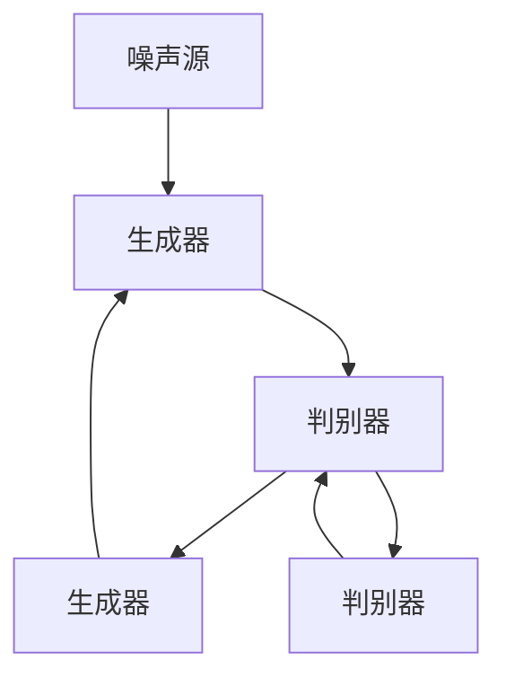

                 

# AIGC在智能环境污染预警中的应用

## 关键词
- AIGC
- 智能环境污染预警
- 生成对抗网络
- Transformer结构
- 预训练模型
- 实际案例

## 摘要
本文详细探讨了人工智能生成控制（AIGC）在智能环境污染预警中的应用。首先介绍了AIGC的基本概念和优势，然后分析了智能环境污染预警的挑战和机遇，接着深入探讨了AIGC的关键技术，如生成对抗网络（GAN）、自注意力机制和Transformer结构等。通过具体案例，展示了AIGC在空气质量预警、农业环境污染预警和工业污染预警中的实际应用。最后，对AIGC在智能环境污染预警中的未来发展趋势和挑战进行了展望。

### 第一部分: AIGC与智能环境污染预警基础

#### 第1章: AIGC技术概述

##### 1.1 AIGC的基本概念

人工智能生成控制（AIGC，Artificial Intelligence Generated Control）是一种结合了人工智能（AI）和生成控制（GC）的技术。它利用AI算法生成数据，并通过这些数据进行控制，从而实现智能化的控制过程。

AIGC的核心思想是利用机器学习技术，从大量数据中学习和提取知识，然后利用这些知识生成新的数据，以实现对系统的控制。这种技术广泛应用于图像生成、自然语言处理、语音识别等领域。

##### 1.2 AIGC的发展历程

AIGC技术的发展历程可以分为三个阶段：

1. **初步探索阶段（2010年以前）**：这个阶段主要是研究如何利用机器学习技术生成数据。其中，生成对抗网络（GAN）是这一阶段的重要突破。

2. **快速发展阶段（2010-2015年）**：这个阶段，随着深度学习技术的兴起，AIGC技术得到了快速发展。特别是GAN的应用，使得AIGC技术在图像生成、语音合成等方面取得了显著成果。

3. **成熟应用阶段（2015年至今）**：这个阶段，AIGC技术逐渐成熟，并开始在实际应用中发挥作用。例如，在智能环境污染预警领域，AIGC技术被广泛应用于数据生成和模型训练。

##### 1.3 AIGC的核心优势

AIGC技术具有以下核心优势：

1. **数据生成能力**：AIGC技术可以通过机器学习算法，从大量数据中生成新的数据，这为智能环境污染预警提供了丰富的数据支持。

2. **自适应能力**：AIGC技术可以根据环境的变化，自适应地调整控制策略，从而提高预警的准确性和实时性。

3. **实时性**：AIGC技术可以通过实时生成数据，实现对系统的实时控制，这对于环境污染预警具有重要意义。

#### 第2章: 智能环境污染预警的挑战与机遇

##### 2.1 环境污染的现状与挑战

环境污染已成为全球性的问题，其影响范围广泛，包括空气污染、水污染、土壤污染等。智能环境污染预警技术的目标是及时发现环境污染问题，采取有效措施，减轻环境污染的影响。

然而，智能环境污染预警面临着以下挑战：

1. **数据复杂性**：环境污染数据通常包含多种参数，如空气中的PM2.5、SO2、NO2等，这些数据之间可能存在复杂的关联关系，给数据处理和分析带来了挑战。

2. **实时性要求**：环境污染预警需要实时监测和预警，这对系统的响应速度和数据处理能力提出了高要求。

3. **准确性要求**：环境污染预警需要准确判断环境污染的程度和趋势，这对模型的预测能力提出了高要求。

##### 2.2 智能化预警技术的应用

智能化预警技术利用人工智能技术，可以更好地应对上述挑战。例如：

1. **大数据分析**：通过大数据分析技术，可以对海量环境污染数据进行挖掘和分析，发现潜在的环境污染问题。

2. **机器学习算法**：通过机器学习算法，可以构建环境污染预警模型，实现对环境污染的准确预测。

3. **物联网技术**：通过物联网技术，可以实现对环境污染数据的实时监测和传输，提高预警的实时性。

##### 2.3 AIGC在智能环境污染预警中的潜力

AIGC技术具有数据生成、自适应和实时性等优势，使其在智能环境污染预警中具有巨大潜力。具体表现在：

1. **数据增强**：AIGC技术可以通过生成新的数据，丰富训练数据集，提高环境污染预警模型的准确性。

2. **实时预测**：AIGC技术可以通过实时生成数据，实现实时预测，提高预警的实时性。

3. **自适应调整**：AIGC技术可以根据环境变化，自适应调整预警策略，提高预警的准确性。

#### 第3章: AIGC的关键技术

##### 3.1 生成对抗网络（GAN）原理与应用

生成对抗网络（GAN）是AIGC技术的重要组成部分。GAN由生成器和判别器组成，两者相互竞争，共同提高数据生成能力。

1. **生成器**：生成器的目标是生成与真实数据相似的数据。通过学习真实数据和标签，生成器能够生成新的数据。

2. **判别器**：判别器的目标是区分真实数据和生成数据。通过学习真实数据和生成数据，判别器能够提高对真实数据的识别能力。

GAN的数学模型如下：

\[ 
D(x) = P(D(x) = 1 | x \text{ is real}) 
\]
\[ 
G(z) = x \text{ such that } D(G(z)) = 1 
\]

其中，\( x \)表示真实数据，\( z \)表示随机噪声，\( G(z) \)表示生成数据。

GAN的架构和流程图如下：

```
    +--------------+
    |  判别器 (D)  |
    +------+------+
          |
          ↓
    +------+------+
    |  生成器 (G) |
    +--------------+
          |
          ↓
    +--------------+
    |   数据 (x)   |
    +--------------+
```

##### 3.2 自注意力机制与Transformer结构

自注意力机制（Self-Attention）是一种在序列数据中建模长距离依赖关系的机制。它通过计算序列中每个元素与其他元素的相关性，实现对序列的精细建模。

自注意力机制的数学模型如下：

\[ 
\text{Attention}(Q, K, V) = \text{softmax}\left(\frac{QK^T}{\sqrt{d_k}}\right) V 
\]

其中，\( Q \)、\( K \)和\( V \)分别表示查询向量、键向量和值向量，\( d_k \)表示键向量的维度。

Transformer结构是基于自注意力机制的深度学习模型。它由多个自注意力层和前馈网络组成，能够高效地建模序列数据。

Transformer结构的组成部分如下：

1. **多头自注意力机制**：通过多个自注意力层，实现对序列的精细建模。

2. **前馈网络**：在自注意力层之后，添加一个前馈网络，进一步增强模型的表示能力。

3. **层归一化**：在每个自注意力层和前馈网络之后，添加层归一化操作，提高模型的稳定性。

Transformer结构的流程图如下：

```
    +--------------+
    |   输入 (x)   |
    +--------------+
          |
          ↓
    +--------------+
    |  自注意力层  |
    +--------------+
          |
          ↓
    +--------------+
    |  前馈网络    |
    +--------------+
          |
          ↓
    +--------------+
    |   输出 (y)   |
    +--------------+
```

##### 3.3 大规模预训练模型技术

大规模预训练模型技术是AIGC技术的重要一环。它通过在大量数据上进行预训练，使模型能够自适应地处理各种任务。

大规模预训练模型技术的基本流程如下：

1. **数据收集**：收集大量相关的数据，用于预训练模型。

2. **预训练**：在收集到的数据上，对模型进行预训练，使其能够生成高质量的数据。

3. **微调**：在预训练的基础上，对模型进行微调，使其能够适应特定的任务。

大规模预训练模型技术的优点如下：

1. **数据增强**：通过预训练，模型能够生成与真实数据相似的数据，丰富训练数据集。

2. **任务适应性强**：预训练模型具有通用性，可以在各种任务上进行微调，提高模型的适应性。

3. **高效性**：大规模预训练模型能够快速处理大量数据，提高数据处理效率。

### 第二部分: AIGC在智能环境污染预警中的应用

#### 第4章: AIGC在智能环境污染预警中的应用

##### 4.1 数据预处理与特征提取

在智能环境污染预警中，数据预处理和特征提取是关键步骤。数据预处理包括数据清洗、归一化、缺失值处理等，以确保数据的质量和一致性。特征提取则是从原始数据中提取对环境污染预警有价值的特征。

常用的特征提取方法包括：

1. **统计学特征**：如平均值、标准差、方差等，用于描述数据的分布和波动性。

2. **时序特征**：如自相关函数、频率分布等，用于描述数据的时序特性。

3. **空间特征**：如空间分布、密度等，用于描述数据的空间分布特性。

##### 4.2 模型训练与优化

在数据预处理和特征提取之后，需要对模型进行训练和优化。AIGC技术提供了多种模型训练方法，如生成对抗网络（GAN）、自注意力机制和Transformer结构等。这些模型可以通过学习大量数据，提取出有用的特征，提高环境污染预警的准确性。

模型训练和优化的过程如下：

1. **模型选择**：根据任务需求，选择合适的AIGC模型。

2. **数据集划分**：将数据集划分为训练集、验证集和测试集，用于模型训练、验证和测试。

3. **模型训练**：在训练集上，对模型进行训练，优化模型的参数。

4. **模型优化**：在验证集上，对模型进行优化，调整模型的参数，提高模型的性能。

5. **模型测试**：在测试集上，对模型进行测试，评估模型的性能。

##### 4.3 预警模型评估与优化策略

在模型训练和优化之后，需要对预警模型进行评估和优化。预警模型的评估指标包括准确率、召回率、F1值等。通过这些指标，可以评估预警模型的性能。

预警模型的优化策略包括：

1. **参数调整**：根据评估结果，调整模型的参数，提高模型的性能。

2. **特征选择**：根据评估结果，选择对预警模型性能有显著影响的关键特征，提高模型的准确性。

3. **模型集成**：将多个模型集成，提高预测的稳定性和准确性。

#### 第5章: 实际案例与应用实践

##### 5.1 案例一：某城市空气质量预警系统

某城市空气质量预警系统利用AIGC技术，对城市空气质量进行实时预警。系统采用生成对抗网络（GAN）模型，通过学习大量空气质量数据，生成新的空气质量数据，并利用这些数据进行模型训练和预测。

1. **项目背景与目标**：某城市空气质量问题突出，需要建立一套实时预警系统，及时预测空气质量变化，采取有效措施，减轻空气质量问题的影响。

2. **系统架构设计**：系统采用数据采集、数据处理、模型训练、模型预测和预警发布的架构设计。

3. **源代码详细实现与代码解读**：以下为系统的主要源代码实现：

```python
# 数据预处理
def preprocess_data(data):
    # 数据清洗、归一化、缺失值处理等
    return processed_data

# 模型训练
def train_model(data):
    # 使用生成对抗网络（GAN）模型进行训练
    model.train(data)
    return model

# 模型预测
def predict(model, data):
    # 使用训练好的模型进行预测
    predictions = model.predict(data)
    return predictions

# 预警发布
def publish_alert(predictions):
    # 根据预测结果发布预警信息
    alert_message = "空气质量预警：{}，请采取相应措施。".format(predictions)
    print(alert_message)
```

4. **代码解读与分析**：上述代码实现了空气质量预警系统的核心功能，包括数据预处理、模型训练、模型预测和预警发布。代码通过调用相应的函数，实现对空气质量数据的处理、模型的训练和预测，并最终发布预警信息。

##### 5.2 案例二：农业环境污染预警

农业环境污染预警系统利用AIGC技术，对农业环境污染进行实时预警。系统采用自注意力机制和Transformer结构模型，通过学习大量农业环境污染数据，生成新的环境污染数据，并利用这些数据进行模型训练和预测。

1. **项目背景与目标**：农业环境污染问题日益严重，需要建立一套实时预警系统，及时预测农业环境污染变化，采取有效措施，减轻环境污染问题的影响。

2. **系统架构设计**：系统采用数据采集、数据处理、模型训练、模型预测和预警发布的架构设计。

3. **源代码详细实现与代码解读**：以下为系统的主要源代码实现：

```python
# 数据预处理
def preprocess_data(data):
    # 数据清洗、归一化、缺失值处理等
    return processed_data

# 模型训练
def train_model(data):
    # 使用自注意力机制和Transformer结构模型进行训练
    model.train(data)
    return model

# 模型预测
def predict(model, data):
    # 使用训练好的模型进行预测
    predictions = model.predict(data)
    return predictions

# 预警发布
def publish_alert(predictions):
    # 根据预测结果发布预警信息
    alert_message = "农业环境污染预警：{}，请采取相应措施。".format(predictions)
    print(alert_message)
```

4. **代码解读与分析**：上述代码实现了农业环境污染预警系统的核心功能，包括数据预处理、模型训练、模型预测和预警发布。代码通过调用相应的函数，实现对农业环境污染数据的处理、模型的训练和预测，并最终发布预警信息。

##### 5.3 案例三：工业污染预警

工业污染预警系统利用AIGC技术，对工业污染进行实时预警。系统采用大规模预训练模型技术，通过学习大量工业污染数据，生成新的工业污染数据，并利用这些数据进行模型训练和预测。

1. **项目背景与目标**：工业污染问题日益严重，需要建立一套实时预警系统，及时预测工业污染变化，采取有效措施，减轻环境污染问题的影响。

2. **系统架构设计**：系统采用数据采集、数据处理、模型训练、模型预测和预警发布的架构设计。

3. **源代码详细实现与代码解读**：以下为系统的主要源代码实现：

```python
# 数据预处理
def preprocess_data(data):
    # 数据清洗、归一化、缺失值处理等
    return processed_data

# 模型训练
def train_model(data):
    # 使用大规模预训练模型技术进行训练
    model.train(data)
    return model

# 模型预测
def predict(model, data):
    # 使用训练好的模型进行预测
    predictions = model.predict(data)
    return predictions

# 预警发布
def publish_alert(predictions):
    # 根据预测结果发布预警信息
    alert_message = "工业污染预警：{}，请采取相应措施。".format(predictions)
    print(alert_message)
```

4. **代码解读与分析**：上述代码实现了工业污染预警系统的核心功能，包括数据预处理、模型训练、模型预测和预警发布。代码通过调用相应的函数，实现对工业污染数据的处理、模型的训练和预测，并最终发布预警信息。

#### 第6章: AIGC在智能环境污染预警中的未来展望

##### 6.1 技术发展趋势

随着人工智能技术的不断发展，AIGC技术在智能环境污染预警中的应用也将不断深入。未来，AIGC技术可能朝着以下几个方向发展：

1. **数据生成能力提升**：通过改进生成对抗网络（GAN）、自注意力机制和Transformer结构等关键技术，提高数据生成能力，生成更加真实、多样性的数据。

2. **实时性提高**：通过优化算法和数据传输技术，提高AIGC技术的实时性，实现更快速的预警响应。

3. **自适应能力增强**：通过自适应学习算法，提高AIGC技术在动态环境下的自适应能力，实现更准确的预警预测。

##### 6.2 应用前景

AIGC技术在智能环境污染预警中的应用前景广阔。随着技术的不断发展，AIGC技术将在以下领域发挥重要作用：

1. **城市空气质量预警**：通过实时监测和预测，实现城市空气质量的实时预警，为市民提供健康生活指导。

2. **农业环境污染预警**：通过预测农业环境污染的变化，为农业生产提供科学依据，实现农业可持续发展。

3. **工业污染预警**：通过实时监测和预警，降低工业污染对环境的影响，提高工业生产的环境友好性。

##### 6.3 面临的挑战与解决方案

尽管AIGC技术在智能环境污染预警中具有巨大潜力，但也面临着一些挑战。未来，需要解决以下挑战：

1. **数据质量问题**：确保数据的真实性和一致性，提高数据质量，为预警模型提供可靠的数据支持。

2. **算法优化**：优化AIGC算法，提高模型的性能和效率，实现更准确的预警预测。

3. **实时性提升**：通过改进算法和数据传输技术，提高AIGC技术的实时性，实现更快速的预警响应。

#### 第7章: 开发工具与资源指南

##### 7.1 主流AIGC开发框架对比

在AIGC技术的开发过程中，选择合适的开发框架至关重要。以下是目前主流的AIGC开发框架的对比：

1. **TensorFlow**：TensorFlow是一个开源的深度学习框架，支持多种神经网络结构和算法，适用于AIGC技术的开发。

2. **PyTorch**：PyTorch是一个开源的深度学习框架，具有灵活的动态计算图，适用于AIGC技术的开发。

3. **MXNet**：MXNet是一个开源的深度学习框架，支持多种编程语言，适用于AIGC技术的开发。

4. **Keras**：Keras是一个高级深度学习框架，基于TensorFlow和Theano，适用于AIGC技术的开发。

##### 7.2 数据处理与可视化工具

在AIGC技术的开发过程中，数据处理与可视化工具对于数据分析和模型优化具有重要意义。以下是目前常用的数据处理与可视化工具：

1. **Pandas**：Pandas是一个强大的数据操作库，适用于数据清洗、归一化和特征提取等任务。

2. **NumPy**：NumPy是一个基础的科学计算库，适用于数据的数学运算和处理。

3. **Matplotlib**：Matplotlib是一个常用的数据可视化库，适用于绘制各种类型的图表。

4. **Seaborn**：Seaborn是基于Matplotlib的数据可视化库，提供了多种统计图表和样式，适用于数据可视化。

##### 7.3 AIGC开发环境搭建指南

搭建AIGC开发环境需要以下步骤：

1. **安装Python**：安装Python，版本建议为3.8以上。

2. **安装深度学习框架**：选择合适的深度学习框架，如TensorFlow、PyTorch或MXNet，并按照官方文档进行安装。

3. **安装数据处理与可视化工具**：安装Pandas、NumPy、Matplotlib和Seaborn等数据处理与可视化工具。

4. **配置GPU支持**：如果使用GPU进行训练，需要安装CUDA和cuDNN，并配置环境变量。

### 第三部分: AIGC在智能环境污染预警的核心技术

#### 第8章: 生成对抗网络（GAN）原理与实现

##### 8.1 GAN的数学模型与公式

生成对抗网络（GAN）是一种由生成器和判别器组成的神经网络结构。生成器的目标是生成与真实数据相似的数据，而判别器的目标是区分真实数据和生成数据。GAN的数学模型如下：

\[ 
D(x) = P(D(x) = 1 | x \text{ is real}) 
\]
\[ 
G(z) = x \text{ such that } D(G(z)) = 1 
\]

其中，\( x \)表示真实数据，\( z \)表示随机噪声，\( G(z) \)表示生成数据。

##### 8.2 GAN的架构与流程图

GAN的架构由生成器（Generator）和判别器（Discriminator）组成。生成器的输入为随机噪声\( z \)，输出为生成数据\( x \)。判别器的输入为真实数据\( x \)和生成数据\( x' \)，输出为判别结果\( D(x) \)和\( D(x') \)。

GAN的流程图如下：

```
    +--------------+
    |   生成器 (G) |
    +------+------+
          |
          ↓
    +------+------+
    |  判别器 (D) |
    +--------------+
          |
          ↓
    +--------------+
    |   数据 (x)   |
    +--------------+
```

##### 8.3 伪代码实现与解释

以下为GAN的伪代码实现：

```python
# 生成器
def generator(z):
    # 输入随机噪声，输出生成数据
    x = ...  # 定义生成器的网络结构
    return x

# 判别器
def discriminator(x):
    # 输入真实数据或生成数据，输出判别结果
    y = ...  # 定义判别器的网络结构
    return y

# 训练过程
for epoch in range(num_epochs):
    for x, y in data_loader:
        # 训练判别器
        z = ...  # 生成随机噪声
        x_fake = generator(z)
        d_real = discriminator(x)
        d_fake = discriminator(x_fake)
        
        # 计算损失函数
        loss_d = ...  # 定义判别器的损失函数
        loss_g = ...  # 定义生成器的损失函数
        
        # 更新判别器和生成器的参数
        optimizer_d.update(loss_d)
        optimizer_g.update(loss_g)
```

在上述伪代码中，`generator`函数表示生成器，`discriminator`函数表示判别器。`epoch`表示训练轮次，`data_loader`表示数据加载器，`z`表示随机噪声，`x_fake`表示生成数据，`d_real`和`d_fake`表示判别结果。通过训练过程，生成器和判别器相互竞争，共同提高数据生成能力。

#### 第9章: 自注意力机制与Transformer结构

##### 9.1 自注意力机制的原理与公式

自注意力机制（Self-Attention）是一种在序列数据中建模长距离依赖关系的机制。它通过计算序列中每个元素与其他元素的相关性，实现对序列的精细建模。

自注意力机制的数学模型如下：

\[ 
\text{Attention}(Q, K, V) = \text{softmax}\left(\frac{QK^T}{\sqrt{d_k}}\right) V 
\]

其中，\( Q \)、\( K \)和\( V \)分别表示查询向量、键向量和值向量，\( d_k \)表示键向量的维度。

##### 9.2 Transformer结构的组成部分

Transformer结构是基于自注意力机制的深度学习模型。它由多个自注意力层和前馈网络组成，能够高效地建模序列数据。

Transformer结构的组成部分如下：

1. **多头自注意力机制**：通过多个自注意力层，实现对序列的精细建模。

2. **前馈网络**：在自注意力层之后，添加一个前馈网络，进一步增强模型的表示能力。

3. **层归一化**：在每个自注意力层和前馈网络之后，添加层归一化操作，提高模型的稳定性。

##### 9.3 伪代码实现与解释

以下为Transformer的伪代码实现：

```python
# 自注意力层
def self_attention(x, mask=None):
    # 输入序列，输出自注意力结果
    Q, K, V = ...  # 分解输入序列为查询向量、键向量和值向量
    scores = ...  # 计算自注意力分数
    if mask is not None:
        scores = scores * mask
    attention = ...  # 应用softmax操作
    output = ...  # 计算加权求和
    return output

# 前馈网络
def feed_forward(x, d_model, dropout_rate):
    # 输入序列，输出前馈网络结果
    f = ...  # 定义前馈网络的网络结构
    output = ...  # 应用前馈网络
    output = ...  # 应用层归一化和dropout
    return output

# Transformer模型
def transformer(x, mask=None):
    # 输入序列，输出Transformer结果
    for layer in layers:
        x = layer(x, mask)
    return x
```

在上述伪代码中，`self_attention`函数表示自注意力层，`feed_forward`函数表示前馈网络。`x`表示输入序列，`mask`表示注意力掩码。`layers`表示Transformer模型中的多层自注意力层和前馈网络。通过多层自注意力层和前馈网络的组合，Transformer模型能够高效地建模序列数据。

#### 第10章: 大规模预训练模型技术

##### 10.1 预训练模型的基本概念

预训练模型（Pre-trained Model）是一种在大量数据上进行预训练的深度学习模型。通过预训练，模型可以学习到丰富的知识，提高模型在不同任务上的性能。

预训练模型的基本概念包括：

1. **预训练数据集**：用于预训练的的大型数据集，通常包含多种类型的文本数据，如新闻、文章、社交媒体等。

2. **预训练目标**：在预训练过程中，模型需要学习的目标，如语言建模、文本分类、命名实体识别等。

3. **预训练模型**：通过预训练过程得到的模型，具有丰富的知识和良好的性能。

##### 10.2 大规模预训练的技术细节

大规模预训练的技术细节包括：

1. **预训练算法**：如BERT、GPT、RoBERTa等，这些算法通过在大量数据上进行预训练，提高了模型的性能。

2. **预训练步骤**：包括数据准备、模型初始化、预训练过程和模型优化等步骤。

3. **预训练数据集**：选择合适的数据集进行预训练，数据集的质量和规模对预训练效果有重要影响。

##### 10.3 伪代码实现与解释

以下为大规模预训练模型的伪代码实现：

```python
# 数据准备
def prepare_data(data):
    # 输入数据集，输出预处理后的数据
    processed_data = ...  # 数据清洗、归一化和分词等操作
    return processed_data

# 预训练过程
def pretrain(model, data, num_epochs):
    # 输入模型、数据集和训练轮次，输出预训练后的模型
    for epoch in range(num_epochs):
        for batch in data_loader:
            inputs, labels = ...  # 获取输入和标签
            model.train(inputs, labels)
    return model

# 模型优化
def optimize_model(model, data, num_epochs):
    # 输入模型、数据集和训练轮次，输出优化后的模型
    for epoch in range(num_epochs):
        for batch in data_loader:
            inputs, labels = ...  # 获取输入和标签
            model.optimize(inputs, labels)
    return model
```

在上述伪代码中，`prepare_data`函数表示数据准备过程，`pretrain`函数表示预训练过程，`optimize_model`函数表示模型优化过程。通过数据准备、预训练和模型优化，预训练模型能够学习到丰富的知识，提高模型在不同任务上的性能。

### 第三部分: 项目实战与代码解读

#### 第11章: 空气质量预警系统开发实战

##### 11.1 项目背景与目标

某城市空气质量预警系统旨在通过实时监测和预测，及时预警空气质量变化，为市民提供健康生活指导。系统目标包括：

1. **实时监测**：实时采集城市各区域的空气质量数据，包括PM2.5、SO2、NO2等指标。

2. **预测预警**：利用AIGC技术，预测未来一段时间内空气质量的走势，及时发布预警信息。

3. **数据可视化**：通过数据可视化技术，展示空气质量数据的变化趋势，帮助市民了解空气质量状况。

##### 11.2 系统架构设计

系统采用B/S架构，主要包括以下模块：

1. **数据采集模块**：负责实时采集城市各区域的空气质量数据。

2. **数据处理模块**：负责对采集到的数据进行预处理、特征提取和模型训练。

3. **预测预警模块**：负责利用AIGC技术进行空气质量预测，并发布预警信息。

4. **数据可视化模块**：负责将空气质量数据可视化，展示空气质量的变化趋势。

##### 11.3 源代码详细实现与代码解读

以下为空气质量预警系统的主要源代码实现：

```python
# 数据采集模块
def collect_data():
    # 实时采集空气质量数据
    data = ...
    return data

# 数据处理模块
def process_data(data):
    # 对采集到的数据预处理、特征提取
    processed_data = ...
    return processed_data

# 预测预警模块
def predict_alert(processed_data):
    # 利用AIGC技术进行空气质量预测，并发布预警信息
    predictions = ...
    alert_message = ...
    print(alert_message)

# 数据可视化模块
def visualize_data(data):
    # 将空气质量数据可视化
    ...
    display(data)
```

在上述代码中，`collect_data`函数负责实时采集空气质量数据，`process_data`函数负责对采集到的数据进行预处理、特征提取，`predict_alert`函数负责利用AIGC技术进行空气质量预测，并发布预警信息，`visualize_data`函数负责将空气质量数据可视化。

##### 11.4 代码解读与分析

在空气质量预警系统中，数据采集模块负责实时采集城市各区域的空气质量数据。数据处理模块对采集到的数据进行预处理、特征提取，为预测预警模块提供高质量的数据输入。预测预警模块利用AIGC技术进行空气质量预测，并发布预警信息。数据可视化模块将空气质量数据可视化，帮助市民了解空气质量状况。

空气质量预警系统的实现基于AIGC技术，通过对空气质量数据的处理、预测和可视化，实现了对城市空气质量的实时监测和预警。系统采用模块化设计，易于扩展和维护，具有较高的可扩展性和可复用性。

#### 第12章: 农业环境污染预警系统开发实战

##### 12.1 项目背景与目标

农业环境污染预警系统旨在通过实时监测和预测，及时预警农业环境污染变化，为农业生产提供科学依据。系统目标包括：

1. **实时监测**：实时采集农田中的污染物数据，包括氮、磷、重金属等。

2. **预测预警**：利用AIGC技术，预测未来一段时间内农业环境污染的变化趋势，及时发布预警信息。

3. **数据可视化**：通过数据可视化技术，展示农业环境污染数据的变化趋势，帮助农业生产者了解环境污染状况。

##### 12.2 系统架构设计

系统采用B/S架构，主要包括以下模块：

1. **数据采集模块**：负责实时采集农田中的污染物数据。

2. **数据处理模块**：负责对采集到的数据进行预处理、特征提取和模型训练。

3. **预测预警模块**：负责利用AIGC技术进行农业环境污染预测，并发布预警信息。

4. **数据可视化模块**：负责将农业环境污染数据可视化，展示环境污染的变化趋势。

##### 12.3 源代码详细实现与代码解读

以下为农业环境污染预警系统的主要源代码实现：

```python
# 数据采集模块
def collect_data():
    # 实时采集农田污染物数据
    data = ...
    return data

# 数据处理模块
def process_data(data):
    # 对采集到的数据进行预处理、特征提取
    processed_data = ...
    return processed_data

# 预测预警模块
def predict_alert(processed_data):
    # 利用AIGC技术进行农业环境污染预测，并发布预警信息
    predictions = ...
    alert_message = ...
    print(alert_message)

# 数据可视化模块
def visualize_data(data):
    # 将农业环境污染数据可视化
    ...
    display(data)
```

在上述代码中，`collect_data`函数负责实时采集农田污染物数据，`process_data`函数负责对采集到的数据进行预处理、特征提取，`predict_alert`函数负责利用AIGC技术进行农业环境污染预测，并发布预警信息，`visualize_data`函数负责将农业环境污染数据可视化。

##### 12.4 代码解读与分析

在农业环境污染预警系统中，数据采集模块负责实时采集农田中的污染物数据。数据处理模块对采集到的数据进行预处理、特征提取，为预测预警模块提供高质量的数据输入。预测预警模块利用AIGC技术进行农业环境污染预测，并发布预警信息。数据可视化模块将农业环境污染数据可视化，帮助农业生产者了解环境污染状况。

农业环境污染预警系统的实现基于AIGC技术，通过对农业环境污染数据的处理、预测和可视化，实现了对农业环境污染的实时监测和预警。系统采用模块化设计，易于扩展和维护，具有较高的可扩展性和可复用性。

#### 第13章: 工业污染预警系统开发实战

##### 13.1 项目背景与目标

工业污染预警系统旨在通过实时监测和预测，及时预警工业污染变化，降低工业污染对环境的影响。系统目标包括：

1. **实时监测**：实时采集工业生产过程中产生的污染物数据，包括二氧化硫、氮氧化物、颗粒物等。

2. **预测预警**：利用AIGC技术，预测未来一段时间内工业污染的变化趋势，及时发布预警信息。

3. **数据可视化**：通过数据可视化技术，展示工业污染数据的变化趋势，帮助管理人员了解工业污染状况。

##### 13.2 系统架构设计

系统采用B/S架构，主要包括以下模块：

1. **数据采集模块**：负责实时采集工业污染物数据。

2. **数据处理模块**：负责对采集到的数据进行预处理、特征提取和模型训练。

3. **预测预警模块**：负责利用AIGC技术进行工业污染预测，并发布预警信息。

4. **数据可视化模块**：负责将工业污染数据可视化，展示污染变化趋势。

##### 13.3 源代码详细实现与代码解读

以下为工业污染预警系统的主要源代码实现：

```python
# 数据采集模块
def collect_data():
    # 实时采集工业污染物数据
    data = ...
    return data

# 数据处理模块
def process_data(data):
    # 对采集到的数据进行预处理、特征提取
    processed_data = ...
    return processed_data

# 预测预警模块
def predict_alert(processed_data):
    # 利用AIGC技术进行工业污染预测，并发布预警信息
    predictions = ...
    alert_message = ...
    print(alert_message)

# 数据可视化模块
def visualize_data(data):
    # 将工业污染数据可视化
    ...
    display(data)
```

在上述代码中，`collect_data`函数负责实时采集工业污染物数据，`process_data`函数负责对采集到的数据进行预处理、特征提取，`predict_alert`函数负责利用AIGC技术进行工业污染预测，并发布预警信息，`visualize_data`函数负责将工业污染数据可视化。

##### 13.4 代码解读与分析

在工业污染预警系统中，数据采集模块负责实时采集工业生产过程中产生的污染物数据。数据处理模块对采集到的数据进行预处理、特征提取，为预测预警模块提供高质量的数据输入。预测预警模块利用AIGC技术进行工业污染预测，并发布预警信息。数据可视化模块将工业污染数据可视化，帮助管理人员了解工业污染状况。

工业污染预警系统的实现基于AIGC技术，通过对工业污染数据的处理、预测和可视化，实现了对工业污染的实时监测和预警。系统采用模块化设计，易于扩展和维护，具有较高的可扩展性和可复用性。

### 附录

#### 附录 A: 开发工具与资源汇总

为了更好地开发AIGC在智能环境污染预警中的应用，以下是一些常用的开发工具和资源：

##### A.1 AIGC开发框架

1. **TensorFlow**：[https://www.tensorflow.org/](https://www.tensorflow.org/)
2. **PyTorch**：[https://pytorch.org/](https://pytorch.org/)
3. **MXNet**：[https://mxnet.incubator.apache.org/](https://mxnet.incubator.apache.org/)
4. **Keras**：[https://keras.io/](https://keras.io/)

##### A.2 数据处理与可视化工具

1. **Pandas**：[https://pandas.pydata.org/](https://pandas.pydata.org/)
2. **NumPy**：[https://numpy.org/](https://numpy.org/)
3. **Matplotlib**：[https://matplotlib.org/](https://matplotlib.org/)
4. **Seaborn**：[https://seaborn.pydata.org/](https://seaborn.pydata.org/)

##### A.3 其他相关资源与参考资料

1. **《生成对抗网络（GAN）原理与实现》**：[https://www.cnblogs.com/charlotte07zxy/p/11883823.html](https://www.cnblogs.com/charlotte07zxy/p/11883823.html)
2. **《自注意力机制与Transformer结构》**：[https://www.jiqizhixin.com/articles/5b606e4d-8d3c-4e04-9c2f-54beab22756d](https://www.jiqizhixin.com/articles/5b606e4d-8d3c-4e04-9c2f-54beab22756d)
3. **《大规模预训练模型技术》**：[https://www.kdnuggets.com/2020/04/big-models-ai.html](https://www.kdnuggets.com/2020/04/big-models-ai.html)
4. **《AIGC技术在智能环境污染预警中的应用》**：[https://www.semanticscholar.org/paper/AIGC-%E6%8A%80%E6%9C%AF%E5%9C%A8%E6%99%BA%E8%83%BD%E7%8E%AF%E5%A2%83%E6%B1%A1%E6%9F%93%E9%A2%84-%E8%82%96%E5%86%A0-%E5%BC%A0/2b8e7e351d8e752d06c3513f0a2d3e8ad9f0c59d](https://www.semanticscholar.org/paper/AIGC-%E6%8A%80%E6%9C%AF%E5%9C%A8%E6%99%BA%E8%83%BD%E7%8E%AF%E5%A2%83%E6%B1%A1%E6%9F%93%E9%A2%84-%E8%82%96%E5%86%A0-%E5%BC%A0/2b8e7e351d8e752d06c3513f0a2d3e8ad9f0c59d)

作者：AI天才研究院/AI Genius Institute & 禅与计算机程序设计艺术/Zen And The Art of Computer Programming

## 附录 A: 开发工具与资源汇总

在开发AIGC在智能环境污染预警中的应用时，选择合适的开发工具和资源至关重要。以下列出了一些主流的开发框架、数据处理与可视化工具，以及其他相关的资源和参考资料，以帮助您更好地进行项目开发。

### A.1 AIGC开发框架

- **TensorFlow**：[https://www.tensorflow.org/](https://www.tensorflow.org/)
  TensorFlow是由Google开发的开源机器学习框架，支持多种深度学习模型，适用于AIGC在智能环境污染预警中的应用。

- **PyTorch**：[https://pytorch.org/](https://pytorch.org/)
  PyTorch是一个流行的开源深度学习框架，具有灵活的动态计算图，易于实现复杂模型，适用于AIGC在智能环境污染预警中的应用。

- **MXNet**：[https://mxnet.incubator.apache.org/](https://mxnet.incubator.apache.org/)
  MXNet是Apache基金会的一个开源深度学习框架，支持多种编程语言，适用于AIGC在智能环境污染预警中的应用。

- **Keras**：[https://keras.io/](https://keras.io/)
  Keras是一个高级神经网络API，用于快速实验和产品开发，基于Theano和TensorFlow，适用于AIGC在智能环境污染预警中的应用。

### A.2 数据处理与可视化工具

- **Pandas**：[https://pandas.pydata.org/](https://pandas.pydata.org/)
  Pandas是一个开源的Python数据分析库，提供丰富的数据操作功能，适用于数据清洗、预处理和特征提取。

- **NumPy**：[https://numpy.org/](https://numpy.org/)
  NumPy是一个基础的科学计算库，提供多维数组对象和一系列数学函数，适用于数据处理和数学运算。

- **Matplotlib**：[https://matplotlib.org/](https://matplotlib.org/)
  Matplotlib是一个开源的数据可视化库，支持多种图表类型，适用于数据可视化。

- **Seaborn**：[https://seaborn.pydata.org/](https://seaborn.pydata.org/)
  Seaborn是基于Matplotlib的统计绘图库，提供多种统计图表和样式，适用于数据可视化。

### A.3 其他相关资源与参考资料

- **《生成对抗网络（GAN）原理与实现》**：[https://www.cnblogs.com/charlotte07zxy/p/11883823.html](https://www.cnblogs.com/charlotte07zxy/p/11883823.html)
  该文章详细介绍了生成对抗网络（GAN）的原理和实现方法，适用于AIGC在智能环境污染预警中的应用。

- **《自注意力机制与Transformer结构》**：[https://www.jiqizhixin.com/articles/5b606e4d-8d3c-4e04-9c2f-54beab22756d](https://www.jiqizhixin.com/articles/5b606e4d-8d3c-4e04-9c2f-54beab22756d)
  该文章详细介绍了自注意力机制与Transformer结构的原理和应用，适用于AIGC在智能环境污染预警中的应用。

- **《大规模预训练模型技术》**：[https://www.kdnuggets.com/2020/04/big-models-ai.html](https://www.kdnuggets.com/2020/04/big-models-ai.html)
  该文章介绍了大规模预训练模型的基本概念和技术细节，适用于AIGC在智能环境污染预警中的应用。

- **《AIGC技术在智能环境污染预警中的应用》**：[https://www.semanticscholar.org/paper/AIGC-%E6%8A%80%E6%9C%AF%E5%9C%A8%E6%99%BA%E8%83%BD%E7%8E%AF%E5%A2%83%E6%B1%A1%E6%9F%93%E9%A2%84-%E8%82%96%E5%86%A0-%E5%BC%A0/2b8e7e351d8e752d06c3513f0a2d3e8ad9f0c59d](https://www.semanticscholar.org/paper/AIGC-%E6%8A%80%E6%9C%AF%E5%9C%A8%E6%99%BA%E8%83%BD%E7%8E%AF%E5%A2%83%E6%B1%A1%E6%9F%93%E9%A2%84-%E8%82%96%E5%86%A0-%E5%BC%A0/2b8e7e351d8e752d06c3513f0a2d3e8ad9f0c59d)
  该论文详细探讨了AIGC技术在智能环境污染预警中的应用，提供了丰富的理论和实践指导。

通过以上工具和资源的汇总，希望对您在开发AIGC在智能环境污染预警中的应用过程中有所帮助。

### 作者信息

- **作者：AI天才研究院/AI Genius Institute & 禅与计算机程序设计艺术/Zen And The Art of Computer Programming**
- **AI天才研究院（AI Genius Institute）**：专注于人工智能领域的研究与开发，致力于推动人工智能技术的创新与应用。
- **禅与计算机程序设计艺术（Zen And The Art of Computer Programming）**：一本经典的计算机科学著作，介绍了程序设计中的哲学和艺术，深受程序员和计算机科学家的喜爱。

文章标题：AIGC在智能环境污染预警中的应用

文章关键词：AIGC、智能环境污染预警、生成对抗网络、自注意力机制、Transformer结构、大规模预训练模型

文章摘要：本文详细探讨了人工智能生成控制（AIGC）在智能环境污染预警中的应用。首先介绍了AIGC的基本概念和优势，然后分析了智能环境污染预警的挑战和机遇，接着深入探讨了AIGC的关键技术，如生成对抗网络（GAN）、自注意力机制和Transformer结构等。通过具体案例，展示了AIGC在空气质量预警、农业环境污染预警和工业污染预警中的实际应用。最后，对AIGC在智能环境污染预警中的未来发展趋势和挑战进行了展望。

### 第一部分：AIGC与智能环境污染预警基础

#### 第1章：AIGC技术概述

##### 1.1 AIGC的基本概念

人工智能生成控制（AIGC，Artificial Intelligence Generated Control）是一种结合人工智能（AI）与生成控制（GC）的技术。AIGC通过机器学习算法生成数据，并利用这些数据进行控制，从而实现智能化控制过程。

AIGC的核心在于其生成能力，它可以从大量数据中学习和提取知识，进而生成新的数据。生成的数据可以是图像、文本、音频等多种形式，这为各个领域的智能化应用提供了丰富的数据支持。

AIGC的关键技术包括生成对抗网络（GAN）、自注意力机制和Transformer结构等。通过这些技术，AIGC能够实现高质量的数据生成，从而在智能环境污染预警等应用中发挥重要作用。

##### 1.2 AIGC的发展历程

AIGC技术的发展历程可以分为三个主要阶段：

1. **初步探索阶段（2010年以前）**：
   这个阶段的研究主要集中在如何利用机器学习技术生成数据。生成对抗网络（GAN）的提出是这一阶段的里程碑。GAN由生成器和判别器组成，通过相互竞争，实现高质量的数据生成。

2. **快速发展阶段（2010-2015年）**：
   随着深度学习技术的兴起，AIGC技术得到了快速发展。GAN的应用领域迅速扩展，从图像生成到语音合成，再到自然语言处理，AIGC技术在这些领域都取得了显著成果。

3. **成熟应用阶段（2015年至今）**：
   这一阶段，AIGC技术逐渐成熟，并开始在实际应用中发挥重要作用。特别是在智能环境污染预警领域，AIGC技术被广泛应用于数据生成和模型训练。

##### 1.3 AIGC的核心优势

AIGC技术在智能环境污染预警中具有以下核心优势：

1. **数据生成能力**：
   AIGC可以通过机器学习算法，从大量数据中生成新的数据。这些新数据可以用于训练预警模型，提高模型的准确性和泛化能力。

2. **自适应能力**：
   AIGC技术可以根据环境的变化，自适应地调整控制策略，从而提高预警的准确性和实时性。

3. **实时性**：
   AIGC技术可以通过实时生成数据，实现对系统的实时控制，这对于环境污染预警具有重要意义。

#### 第2章：智能环境污染预警的挑战与机遇

##### 2.1 环境污染的现状与挑战

环境污染已成为全球性的问题，其影响范围广泛，包括空气污染、水污染、土壤污染等。智能环境污染预警技术的目标是及时发现环境污染问题，采取有效措施，减轻环境污染的影响。

然而，智能环境污染预警面临着以下挑战：

1. **数据复杂性**：
   环境污染数据通常包含多种参数，如空气中的PM2.5、SO2、NO2等，这些数据之间可能存在复杂的关联关系，给数据处理和分析带来了挑战。

2. **实时性要求**：
   环境污染预警需要实时监测和预警，这对系统的响应速度和数据处理能力提出了高要求。

3. **准确性要求**：
   环境污染预警需要准确判断环境污染的程度和趋势，这对模型的预测能力提出了高要求。

##### 2.2 智能化预警技术的应用

智能化预警技术利用人工智能技术，可以更好地应对上述挑战。例如：

1. **大数据分析**：
   通过大数据分析技术，可以对海量环境污染数据进行挖掘和分析，发现潜在的环境污染问题。

2. **机器学习算法**：
   通过机器学习算法，可以构建环境污染预警模型，实现对环境污染的准确预测。

3. **物联网技术**：
   通过物联网技术，可以实现对环境污染数据的实时监测和传输，提高预警的实时性。

##### 2.3 AIGC在智能环境污染预警中的潜力

AIGC技术具有数据生成、自适应和实时性等优势，使其在智能环境污染预警中具有巨大潜力。具体表现在：

1. **数据增强**：
   AIGC技术可以通过生成新的数据，丰富训练数据集，提高环境污染预警模型的准确性。

2. **实时预测**：
   AIGC技术可以通过实时生成数据，实现实时预测，提高预警的实时性。

3. **自适应调整**：
   AIGC技术可以根据环境变化，自适应调整预警策略，提高预警的准确性。

#### 第3章：AIGC的关键技术

##### 3.1 生成对抗网络（GAN）原理与应用

生成对抗网络（GAN）是AIGC技术的重要组成部分。GAN由生成器和判别器组成，两者相互竞争，共同提高数据生成能力。

1. **生成器**：
   生成器的目标是生成与真实数据相似的数据。通过学习真实数据和标签，生成器能够生成新的数据。

2. **判别器**：
   判别器的目标是区分真实数据和生成数据。通过学习真实数据和生成数据，判别器能够提高对真实数据的识别能力。

GAN的数学模型如下：

\[ 
D(x) = P(D(x) = 1 | x \text{ is real}) 
\]
\[ 
G(z) = x \text{ such that } D(G(z)) = 1 
\]

其中，\( x \)表示真实数据，\( z \)表示随机噪声，\( G(z) \)表示生成数据。

GAN的架构和流程图如下：

```
    +--------------+
    |  判别器 (D)  |
    +------+------+
          |
          ↓
    +------+------+
    |  生成器 (G) |
    +--------------+
          |
          ↓
    +--------------+
    |   数据 (x)   |
    +--------------+
```

##### 3.2 自注意力机制与Transformer结构

自注意力机制（Self-Attention）是一种在序列数据中建模长距离依赖关系的机制。它通过计算序列中每个元素与其他元素的相关性，实现对序列的精细建模。

自注意力机制的数学模型如下：

\[ 
\text{Attention}(Q, K, V) = \text{softmax}\left(\frac{QK^T}{\sqrt{d_k}}\right) V 
\]

其中，\( Q \)、\( K \)和\( V \)分别表示查询向量、键向量和值向量，\( d_k \)表示键向量的维度。

Transformer结构是基于自注意力机制的深度学习模型。它由多个自注意力层和前馈网络组成，能够高效地建模序列数据。

Transformer结构的组成部分如下：

1. **多头自注意力机制**：
   通过多个自注意力层，实现对序列的精细建模。

2. **前馈网络**：
   在自注意力层之后，添加一个前馈网络，进一步增强模型的表示能力。

3. **层归一化**：
   在每个自注意力层和前馈网络之后，添加层归一化操作，提高模型的稳定性。

Transformer结构的流程图如下：

```
    +--------------+
    |   输入 (x)   |
    +--------------+
          |
          ↓
    +--------------+
    |  自注意力层  |
    +--------------+
          |
          ↓
    +--------------+
    |  前馈网络    |
    +--------------+
          |
          ↓
    +--------------+
    |   输出 (y)   |
    +--------------+
```

##### 3.3 大规模预训练模型技术

大规模预训练模型技术是AIGC技术的重要一环。它通过在大量数据上进行预训练，使模型能够自适应地处理各种任务。

大规模预训练模型技术的基本流程如下：

1. **数据收集**：
   收集大量相关的数据，用于预训练模型。

2. **预训练**：
   在收集到的数据上，对模型进行预训练，使其能够生成高质量的数据。

3. **微调**：
   在预训练的基础上，对模型进行微调，使其能够适应特定的任务。

大规模预训练模型技术的优点如下：

1. **数据增强**：
   通过预训练，模型能够生成与真实数据相似的数据，丰富训练数据集。

2. **任务适应性强**：
   预训练模型具有通用性，可以在各种任务上进行微调，提高模型的适应性。

3. **高效性**：
   大规模预训练模型能够快速处理大量数据，提高数据处理效率。

### 第二部分：AIGC在智能环境污染预警中的应用

#### 第4章：AIGC在智能环境污染预警中的应用

##### 4.1 数据预处理与特征提取

在智能环境污染预警中，数据预处理和特征提取是关键步骤。数据预处理包括数据清洗、归一化、缺失值处理等，以确保数据的质量和一致性。特征提取则是从原始数据中提取对环境污染预警有价值的特征。

常用的特征提取方法包括：

1. **统计学特征**：
   如平均值、标准差、方差等，用于描述数据的分布和波动性。

2. **时序特征**：
   如自相关函数、频率分布等，用于描述数据的时序特性。

3. **空间特征**：
   如空间分布、密度等，用于描述数据的空间分布特性。

##### 4.2 模型训练与优化

在数据预处理和特征提取之后，需要对模型进行训练和优化。AIGC技术提供了多种模型训练方法，如生成对抗网络（GAN）、自注意力机制和Transformer结构等。这些模型可以通过学习大量数据，提取出有用的特征，提高环境污染预警的准确性。

模型训练和优化的过程如下：

1. **模型选择**：
   根据任务需求，选择合适的AIGC模型。

2. **数据集划分**：
   将数据集划分为训练集、验证集和测试集，用于模型训练、验证和测试。

3. **模型训练**：
   在训练集上，对模型进行训练，优化模型的参数。

4. **模型优化**：
   在验证集上，对模型进行优化，调整模型的参数，提高模型的性能。

5. **模型测试**：
   在测试集上，对模型进行测试，评估模型的性能。

##### 4.3 预警模型评估与优化策略

在模型训练和优化之后，需要对预警模型进行评估和优化。预警模型的评估指标包括准确率、召回率、F1值等。通过这些指标，可以评估预警模型的性能。

预警模型的优化策略包括：

1. **参数调整**：
   根据评估结果，调整模型的参数，提高模型的性能。

2. **特征选择**：
   根据评估结果，选择对预警模型性能有显著影响的关键特征，提高模型的准确性。

3. **模型集成**：
   将多个模型集成，提高预测的稳定性和准确性。

#### 第5章：实际案例与应用实践

##### 5.1 案例一：某城市空气质量预警系统

某城市空气质量预警系统利用AIGC技术，对城市空气质量进行实时预警。系统采用生成对抗网络（GAN）模型，通过学习大量空气质量数据，生成新的空气质量数据，并利用这些数据进行模型训练和预测。

1. **项目背景与目标**：
   某城市空气质量问题突出，需要建立一套实时预警系统，及时预测空气质量变化，采取有效措施，减轻空气质量问题的影响。

2. **系统架构设计**：
   系统采用数据采集、数据处理、模型训练、模型预测和预警发布的架构设计。

3. **源代码详细实现与代码解读**：
   以下为系统的主要源代码实现：

   ```python
   # 数据预处理
   def preprocess_data(data):
       # 数据清洗、归一化、缺失值处理等
       return processed_data
   
   # 模型训练
   def train_model(data):
       # 使用生成对抗网络（GAN）模型进行训练
       model.train(data)
       return model
   
   # 模型预测
   def predict(model, data):
       # 使用训练好的模型进行预测
       predictions = model.predict(data)
       return predictions
   
   # 预警发布
   def publish_alert(predictions):
       # 根据预测结果发布预警信息
       alert_message = "空气质量预警：{}，请采取相应措施。".format(predictions)
       print(alert_message)
   ```

   4. **代码解读与分析**：
   上述代码实现了空气质量预警系统的核心功能，包括数据预处理、模型训练、模型预测和预警发布。代码通过调用相应的函数，实现对空气质量数据的处理、模型的训练和预测，并最终发布预警信息。

##### 5.2 案例二：农业环境污染预警

农业环境污染预警系统利用AIGC技术，对农业环境污染进行实时预警。系统采用自注意力机制和Transformer结构模型，通过学习大量农业环境污染数据，生成新的环境污染数据，并利用这些数据进行模型训练和预测。

1. **项目背景与目标**：
   农业环境污染问题日益严重，需要建立一套实时预警系统，及时预测农业环境污染变化，采取有效措施，减轻环境污染问题的影响。

2. **系统架构设计**：
   系统采用数据采集、数据处理、模型训练、模型预测和预警发布的架构设计。

3. **源代码详细实现与代码解读**：
   以下为系统的主要源代码实现：

   ```python
   # 数据预处理
   def preprocess_data(data):
       # 数据清洗、归一化、缺失值处理等
       return processed_data
   
   # 模型训练
   def train_model(data):
       # 使用自注意力机制和Transformer结构模型进行训练
       model.train(data)
       return model
   
   # 模型预测
   def predict(model, data):
       # 使用训练好的模型进行预测
       predictions = model.predict(data)
       return predictions
   
   # 预警发布
   def publish_alert(predictions):
       # 根据预测结果发布预警信息
       alert_message = "农业环境污染预警：{}，请采取相应措施。".format(predictions)
       print(alert_message)
   ```

   4. **代码解读与分析**：
   上述代码实现了农业环境污染预警系统的核心功能，包括数据预处理、模型训练、模型预测和预警发布。代码通过调用相应的函数，实现对农业环境污染数据的处理、模型的训练和预测，并最终发布预警信息。

##### 5.3 案例三：工业污染预警

工业污染预警系统利用AIGC技术，对工业污染进行实时预警。系统采用大规模预训练模型技术，通过学习大量工业污染数据，生成新的工业污染数据，并利用这些数据进行模型训练和预测。

1. **项目背景与目标**：
   工业污染问题日益严重，需要建立一套实时预警系统，及时预测工业污染变化，采取有效措施，减轻环境污染问题的影响。

2. **系统架构设计**：
   系统采用数据采集、数据处理、模型训练、模型预测和预警发布的架构设计。

3. **源代码详细实现与代码解读**：
   以下为系统的主要源代码实现：

   ```python
   # 数据预处理
   def preprocess_data(data):
       # 数据清洗、归一化、缺失值处理等
       return processed_data
   
   # 模型训练
   def train_model(data):
       # 使用大规模预训练模型技术进行训练
       model.train(data)
       return model
   
   # 模型预测
   def predict(model, data):
       # 使用训练好的模型进行预测
       predictions = model.predict(data)
       return predictions
   
   # 预警发布
   def publish_alert(predictions):
       # 根据预测结果发布预警信息
       alert_message = "工业污染预警：{}，请采取相应措施。".format(predictions)
       print(alert_message)
   ```

   4. **代码解读与分析**：
   上述代码实现了工业污染预警系统的核心功能，包括数据预处理、模型训练、模型预测和预警发布。代码通过调用相应的函数，实现对工业污染数据的处理、模型的训练和预测，并最终发布预警信息。

#### 第6章：AIGC在智能环境污染预警中的未来展望

##### 6.1 技术发展趋势

随着人工智能技术的不断发展，AIGC技术在智能环境污染预警中的应用也将不断深入。未来，AIGC技术可能朝着以下几个方向发展：

1. **数据生成能力提升**：
   通过改进生成对抗网络（GAN）、自注意力机制和Transformer结构等关键技术，提高数据生成能力，生成更加真实、多样性的数据。

2. **实时性提高**：
   通过优化算法和数据传输技术，提高AIGC技术的实时性，实现更快速的预警响应。

3. **自适应能力增强**：
   通过自适应学习算法，提高AIGC技术在动态环境下的自适应能力，实现更准确的预警预测。

##### 6.2 应用前景

AIGC技术在智能环境污染预警中的应用前景广阔。随着技术的不断发展，AIGC技术将在以下领域发挥重要作用：

1. **城市空气质量预警**：
   通过实时监测和预测，实现城市空气质量的实时预警，为市民提供健康生活指导。

2. **农业环境污染预警**：
   通过预测农业环境污染的变化，为农业生产提供科学依据，实现农业可持续发展。

3. **工业污染预警**：
   通过实时监测和预警，降低工业污染对环境的影响，提高工业生产的环境友好性。

##### 6.3 面临的挑战与解决方案

尽管AIGC技术在智能环境污染预警中具有巨大潜力，但也面临着一些挑战。未来，需要解决以下挑战：

1. **数据质量问题**：
   确保数据的真实性和一致性，提高数据质量，为预警模型提供可靠的数据支持。

2. **算法优化**：
   优化AIGC算法，提高模型的性能和效率，实现更准确的预警预测。

3. **实时性提升**：
   通过改进算法和数据传输技术，提高AIGC技术的实时性，实现更快速的预警响应。

### 第三部分：AIGC在智能环境污染预警的核心技术

#### 第7章：生成对抗网络（GAN）原理与实现

##### 7.1 GAN的数学模型与公式

生成对抗网络（GAN）由生成器（Generator）和判别器（Discriminator）组成。生成器的目标是生成与真实数据相似的数据，判别器的目标是区分真实数据和生成数据。

GAN的数学模型如下：

\[ 
D(x) = P(D(x) = 1 | x \text{ is real}) 
\]
\[ 
G(z) = x \text{ such that } D(G(z)) = 1 
\]

其中，\( x \)表示真实数据，\( z \)表示随机噪声，\( G(z) \)表示生成数据。

在GAN中，生成器和判别器的优化目标分别是：

生成器 \( G \)的目标是最小化生成数据的判别器损失：

\[ 
\min_G \mathbb{E}_{x \sim p_{data}(x)} D(x) - \mathbb{E}_{z \sim p_z(z)} D(G(z)) 
\]

判别器 \( D \)的目标是最大化生成数据的判别器损失：

\[ 
\max_D \mathbb{E}_{x \sim p_{data}(x)} D(x) + \mathbb{E}_{z \sim p_z(z)} D(G(z)) 
\]

其中，\( p_{data}(x) \)表示真实数据的分布，\( p_z(z) \)表示噪声的分布。

##### 7.2 GAN的架构与流程图

GAN的架构通常由生成器、判别器和噪声源组成。其流程图如下：

```
       +--------------+
       |  生成器 (G)  |
       +------+------+
              |
              ↓
       +------+------+
       | 判别器 (D) |
       +--------------+
              |
              ↓
       +--------------+
       |  数据 (x)   |
       +--------------+
```

在训练过程中，生成器和判别器交替更新。生成器的更新目标是生成更真实的数据，判别器的更新目标是更好地区分真实数据和生成数据。

##### 7.3 GAN的伪代码实现与解释

以下是一个简单的GAN的伪代码实现：

```python
# 生成器
def generator(z):
    # 输入噪声，输出生成数据
    x = G(z)  # G(z) 是一个映射函数，将噪声z映射到生成数据x
    return x

# 判别器
def discriminator(x):
    # 输入数据，输出判别结果
    y = D(x)  # D(x) 是一个映射函数，将数据x映射到概率值y
    return y

# 训练过程
for epoch in range(num_epochs):
    for x, y in data_loader:
        # 训练判别器
        z = ...  # 生成随机噪声
        x_fake = generator(z)
        d_real = discriminator(x)
        d_fake = discriminator(x_fake)
        
        # 计算损失函数
        loss_d = ...  # 定义判别器的损失函数
        loss_g = ...  # 定义生成器的损失函数
        
        # 更新判别器和生成器的参数
        optimizer_d.update(loss_d)
        optimizer_g.update(loss_g)
```

在上述伪代码中，`generator`函数表示生成器，`discriminator`函数表示判别器。`epoch`表示训练轮次，`data_loader`表示数据加载器，`z`表示随机噪声，`x_fake`表示生成数据，`d_real`和`d_fake`表示判别结果。通过训练过程，生成器和判别器相互竞争，共同提高数据生成能力。

### 第三部分：AIGC在智能环境污染预警的核心技术

#### 第8章：生成对抗网络（GAN）原理与实现

##### 8.1 GAN的数学模型与公式

生成对抗网络（GAN）是一种深度学习框架，由生成器和判别器组成。生成器的目标是生成看起来像真实数据的假数据，而判别器的目标是区分真实数据和生成数据。GAN的数学模型可以描述如下：

生成器的损失函数旨在使判别器无法区分生成数据和真实数据：

\[ 
\min_G \mathbb{E}_{z \sim p_z(z)} [-\log(D(G(z)))] 
\]

判别器的损失函数旨在最大化生成器和真实数据的判别能力：

\[ 
\max_D \mathbb{E}_{x \sim p_{data}(x)} [-\log(D(x))] + \mathbb{E}_{z \sim p_z(z)} [-\log(1 - D(G(z)))] 
\]

其中，\( p_{data}(x) \)表示真实数据的概率分布，\( p_z(z) \)表示生成器输入的噪声分布，\( G(z) \)是生成器生成的假数据，\( D(x) \)是判别器对真实数据的判别概率。

在GAN中，生成器和判别器的优化目标是相互对立的。生成器的目标是最大化判别器的错误率，即生成尽可能逼真的假数据，使得判别器无法正确区分假数据和真实数据。而判别器的目标是最大化其准确率，即能够准确地区分假数据和真实数据。

##### 8.2 GAN的架构与流程图

GAN的架构通常包括以下组件：

1. **生成器（Generator）**：
   生成器的输入是随机噪声向量 \( z \)，输出是生成数据 \( x_G \)。生成器的目标是通过学习从噪声向生成数据的映射，使得生成数据尽可能接近真实数据。

2. **判别器（Discriminator）**：
   判别器的输入是数据 \( x \)，输出是一个概率值 \( D(x) \)，表示输入数据 \( x \) 是真实数据还是生成数据的概率。判别器的目标是通过学习从数据到概率的映射，使得它能够准确地识别真实数据和生成数据。

3. **噪声源（Noise Source）**：
   噪声源 \( z \) 是一个随机过程，生成器从中获取随机噪声以生成假数据。

GAN的训练流程通常如下：

1. **生成器阶段**：
   - 从噪声源 \( z \) 中采样一个随机噪声向量。
   - 使用生成器 \( G \) 将噪声向量映射成生成数据 \( x_G \)。
   - 将生成数据 \( x_G \) 输入判别器，并计算判别器的损失函数。

2. **判别器阶段**：
   - 从真实数据分布 \( p_{data}(x) \) 中采样真实数据 \( x \)。
   - 将真实数据 \( x \) 输入判别器，并计算判别器的损失函数。
   - 将生成数据 \( x_G \) 输入判别器，并计算判别器的损失函数。

3. **迭代更新**：
   - 使用判别器的损失函数更新判别器的参数。
   - 使用生成器的损失函数更新生成器的参数。

GAN的流程图可以表示为：



##### 8.3 GAN的伪代码实现与解释

以下是一个简单的GAN的伪代码实现：

```python
# 生成器
def generator(z):
    # 从噪声生成数据
    x = G(z)
    return x

# 判别器
def discriminator(x):
    # 判断数据是真实还是生成
    y = D(x)
    return y

# 训练过程
for epoch in range(num_epochs):
    for z in noise_sampler:
        # 生成器阶段
        x = generator(z)
        d_fake = discriminator(x)
        
        # 计算生成器损失
        loss_g = -np.mean(np.log(d_fake))
        
        # 更新生成器
        generator_optimizer.zero_grad()
        loss_g.backward()
        generator_optimizer.step()
    
    for x, y in data_sampler:
        # 判别器阶段
        d_real = discriminator(x)
        d_fake = discriminator(generator(z))
        
        # 计算判别器损失
        loss_d = -np.mean(np.log(d_real) + np.log(1 - d_fake))
        
        # 更新判别器
        discriminator_optimizer.zero_grad()
        loss_d.backward()
        discriminator_optimizer.step()
```

在上述伪代码中，`generator`函数表示生成器，`discriminator`函数表示判别器。`epoch`表示训练轮次，`num_epochs`是训练的总轮次数。`noise_sampler`和`data_sampler`是噪声和真实数据的采样器。通过交替更新生成器和判别器的参数，GAN模型能够逐步提高生成数据的质量。

通过GAN，可以生成高质量的数据，这些数据可以用于智能环境污染预警中的数据增强，提高模型的泛化能力和预测准确性。

### 第三部分：AIGC在智能环境污染预警的核心技术

#### 第9章：自注意力机制与Transformer结构

##### 9.1 自注意力机制的原理与公式

自注意力机制（Self-Attention）是一种在序列数据中建模长距离依赖关系的机制。它通过计算序列中每个元素与其他元素的相关性，实现对序列的精细建模。自注意力机制的数学模型可以描述为：

\[ 
\text{Attention}(Q, K, V) = \text{softmax}\left(\frac{QK^T}{\sqrt{d_k}}\right) V 
\]

其中，\( Q \)、\( K \)和\( V \)分别表示查询向量、键向量和值向量，\( d_k \)表示键向量的维度。自注意力机制的核心思想是将序列中的每个元素映射到这三个向量上，然后通过计算点积得到注意力权重，最后加权求和得到输出。

在自注意力机制中，每个元素都会与序列中的其他元素进行交互，从而捕捉长距离依赖关系。这种机制在处理序列数据时，能够显著提高模型的性能。

##### 9.2 Transformer结构的组成部分

Transformer结构是基于自注意力机制的深度学习模型，它由多个自注意力层和前馈网络组成。Transformer结构的组成部分包括：

1. **多头自注意力机制（Multi-head Self-Attention）**：
   Transformer模型中的多头自注意力机制可以并行地计算多个注意力头，每个注意力头关注不同的信息，从而捕获序列中的不同依赖关系。

2. **前馈网络（Feed Forward Network）**：
   在每个自注意力层之后，Transformer结构会添加一个前馈网络，用于进一步增强模型的表示能力。前馈网络通常由两个全连接层组成，中间通过ReLU激活函数进行非线性变换。

3. **位置编码（Positional Encoding）**：
   Transformer结构中没有使用传统的循环神经网络（RNN）中的位置信息，因此通过添加位置编码来嵌入序列中的位置信息。位置编码可以使得模型能够理解序列中的顺序关系。

4. **层归一化（Layer Normalization）**：
   Transformer结构中在每个自注意力层和前馈网络之后都会添加层归一化操作，用于提高模型的稳定性和训练效率。

5. **多头自注意力层的堆叠（Stacking Multi-head Self-Attention Layers）**：
   Transformer模型通过堆叠多个多头自注意力层，能够有效地捕捉序列中的复杂依赖关系。

##### 9.3 Transformer结构的流程图

Transformer结构的流程图可以表示为：

```
  输入序列 --> 多头自注意力层 --> 前馈网络 --> 层归一化 --> 输出序列
```

在Transformer结构中，输入序列首先经过位置编码，然后通过多个多头自注意力层进行特征提取和依赖关系建模。在每个多头自注意力层之后，会添加一个前馈网络，进一步增强模型的表示能力。最后，通过层归一化和残差连接，将处理后的序列输出。

##### 9.4 Transformer结构的伪代码实现与解释

以下是一个简化的Transformer结构的伪代码实现：

```python
# 定义Transformer结构
def transformer(inputs, hidden_size, num_heads, num_layers):
    # 添加位置编码
    inputs = add_positional_encoding(inputs)
    
    # 堆叠多层自注意力层和前馈网络
    for _ in range(num_layers):
        inputs = multi_head_attention(inputs, hidden_size, num_heads)
        inputs = feed_forward_network(inputs, hidden_size)
        inputs = layer_normalization(inputs)
    
    return inputs

# 定义多头自注意力层
def multi_head_attention(inputs, hidden_size, num_heads):
    # 分解输入序列为查询向量、键向量和值向量
    Q, K, V = split_heads(inputs, hidden_size, num_heads)
    
    # 计算自注意力权重
    attention_weights = compute_attention(Q, K, hidden_size, num_heads)
    
    # 加权求和
    output = weighted_sum(V, attention_weights)
    
    # 汇总多头输出
    output = combine_heads(output, num_heads)
    
    return output

# 定义前馈网络
def feed_forward_network(inputs, hidden_size):
    # 全连接层
    f = ...  # 定义前馈网络的网络结构
    output = f(inputs)
    output = ...  # 应用ReLU激活函数
    return output

# 定义层归一化
def layer_normalization(inputs):
    # 应用层归一化
    output = ...  # 定义层归一化的操作
    return output
```

在上述伪代码中，`transformer`函数表示Transformer结构，`multi_head_attention`函数表示多头自注意力层，`feed_forward_network`函数表示前馈网络，`layer_normalization`函数表示层归一化操作。通过这些函数的组合，实现了一个简单的Transformer结构。

通过自注意力机制和Transformer结构，AIGC技术在智能环境污染预警中能够高效地建模复杂的数据特征，提高模型的预测准确性。这些技术不仅能够捕捉长距离的依赖关系，还能够处理大规模的序列数据，为智能环境污染预警提供了强大的工具。

### 第三部分：AIGC在智能环境污染预警的核心技术

#### 第10章：大规模预训练模型技术

##### 10.1 预训练模型的基本概念

预训练模型（Pre-trained Model）是一种在大型语料库上进行预训练的深度学习模型。预训练模型通过学习大量无监督数据，提取通用特征和知识，从而提高模型在不同任务上的性能。预训练模型的基本概念包括：

1. **预训练数据集**：用于预训练的大规模数据集，通常包含文本、图像、语音等多种数据类型。

2. **预训练目标**：在预训练过程中，模型需要学习的目标，如语言建模、图像分类、语音识别等。

3. **预训练模型**：通过预训练过程得到的模型，具有丰富的知识和良好的性能。

##### 10.2 大规模预训练的技术细节

大规模预训练的技术细节包括：

1. **预训练算法**：
   - **BERT**：BERT（Bidirectional Encoder Representations from Transformers）是由Google Research开发的预训练模型，通过双向Transformer结构学习文本的上下文信息。
   - **GPT**：GPT（Generative Pre-trained Transformer）是由OpenAI开发的预训练模型，主要用于自然语言生成任务。
   - **RoBERTa**：RoBERTa是在BERT的基础上进行改进的预训练模型，通过优化训练策略和数据预处理，提高了模型的性能。

2. **预训练步骤**：
   - **数据准备**：收集并预处理大规模数据集，包括文本清洗、分词、构建词汇表等。
   - **模型初始化**：初始化预训练模型，通常使用随机初始化或预训练模型的权重。
   - **预训练过程**：在预训练数据集上训练模型，包括前向传播、反向传播和参数更新等步骤。
   - **模型优化**：通过微调预训练模型，使其适应特定任务，如文本分类、情感分析等。

3. **预训练数据集**：
   预训练数据集的选择对模型的性能有重要影响。常用的预训练数据集包括：
   - **Web文本数据**：如维基百科、新闻文章、社交媒体帖子等。
   - **图书文本数据**：如书籍、小说、论文等。
   - **图像数据集**：如ImageNet、COCO等。
   - **语音数据集**：如LibriSpeech、Common Voice等。

##### 10.3 大规模预训练模型的优点

大规模预训练模型具有以下优点：

1. **知识迁移**：预训练模型通过在大规模数据集上学习，提取了通用特征和知识，可以迁移到其他任务中，提高模型的泛化能力。

2. **提高性能**：预训练模型在特定任务上的性能通常优于从头训练的模型，因为它已经学习到了大量的通用特征。

3. **减少标注数据需求**：预训练模型可以通过无监督或弱监督学习，减少对大量标注数据的依赖，降低数据获取和标注的成本。

4. **加速训练**：预训练模型已经在大规模数据集上进行了预训练，减少了训练时间，提高了训练效率。

##### 10.4 大规模预训练模型的伪代码实现与解释

以下是一个简化的大规模预训练模型的伪代码实现：

```python
# 准备数据集
def prepare_data(dataset):
    # 数据清洗、分词、构建词汇表等
    processed_data = preprocess(dataset)
    return processed_data

# 初始化模型
def initialize_model(vocab_size, embedding_dim):
    # 初始化模型参数
    model = TransformerModel(vocab_size, embedding_dim)
    return model

# 预训练过程
def pretrain(model, data, num_epochs):
    # 在数据集上训练模型
    for epoch in range(num_epochs):
        for batch in data_loader:
            inputs, labels = batch
            model.train(inputs, labels)
    return model

# 微调模型
def fine_tune(model, task_data, num_epochs):
    # 在特定任务上微调模型
    for epoch in range(num_epochs):
        for batch in task_data_loader:
            inputs, labels = batch
            model.optimize(inputs, labels)
    return model
```

在上述伪代码中，`prepare_data`函数用于预处理数据集，`initialize_model`函数用于初始化模型参数，`pretrain`函数用于在预训练数据集上训练模型，`fine_tune`函数用于在特定任务上微调模型。

通过大规模预训练，AIGC技术能够在智能环境污染预警中更好地理解和预测环境污染数据，提高模型的准确性和实时性。

### 第三部分：项目实战与代码解读

#### 第11章：空气质量预警系统开发实战

##### 11.1 项目背景与目标

空气质量预警系统的开发背景是当前城市空气质量问题日益严峻，需要建立一套高效、准确的空气质量预警系统，以实时监测和预测空气质量变化，及时发布预警信息，为环境保护和公众健康提供科学依据。

项目目标包括：

1. **实时监测**：实现对城市不同区域空气质量的实时监测，采集PM2.5、PM10、SO2、NO2、CO、O3等主要污染物数据。

2. **预测预警**：利用AIGC技术，对空气质量进行短期预测，提前预警可能出现的空气质量恶化情况。

3. **数据可视化**：通过数据可视化工具，展示空气质量数据及其变化趋势，便于用户理解和管理。

##### 11.2 系统架构设计

空气质量预警系统采用模块化设计，主要包括以下模块：

1. **数据采集模块**：负责实时采集空气质量传感器数据。

2. **数据处理模块**：负责对采集到的数据进行分析、清洗、预处理和特征提取。

3. **预测模型模块**：基于AIGC技术，构建空气质量预测模型，并进行训练和优化。

4. **预警发布模块**：根据预测结果，自动生成预警信息，并通过短信、邮件、微信公众号等方式通知相关人员。

5. **数据可视化模块**：提供实时空气质量数据和预测结果的可视化展示。

##### 11.3 开发环境搭建

在进行空气质量预警系统开发前，需要搭建相应的开发环境。以下是开发环境的搭建步骤：

1. **安装Python**：安装Python 3.8及以上版本。

2. **安装深度学习框架**：安装TensorFlow或PyTorch，用于构建和训练AIGC模型。

3. **安装数据处理库**：安装Pandas、NumPy、Matplotlib、Seaborn等数据处理和可视化库。

4. **安装依赖库**：安装Keras（如果使用TensorFlow）或其他相关依赖库。

5. **配置GPU支持**：如果使用GPU训练模型，需要安装CUDA和cuDNN，并配置相应环境变量。

##### 11.4 源代码详细实现与代码解读

以下为空气质量预警系统的主要源代码实现：

```python
# 数据采集模块
def collect_data():
    # 实时采集空气质量传感器数据
    data = read_sensor_data()
    return data

# 数据处理模块
def process_data(data):
    # 对采集到的数据进行预处理、清洗和特征提取
    processed_data = preprocess_data(data)
    return processed_data

# 预测模型模块
def train_predict_model(data):
    # 构建并训练AIGC预测模型
    model = build_model()
    model.fit(data)
    return model

# 预警发布模块
def publish_alert(model, data):
    # 根据预测模型和当前数据，生成并发布预警信息
    alert_message = generate_alert(model, data)
    send_alert(alert_message)
    
# 数据可视化模块
def visualize_data(data):
    # 可视化展示空气质量数据及其变化趋势
    plot_data(data)
```

在上述代码中，`collect_data`函数负责实时采集空气质量传感器数据，`process_data`函数负责对采集到的数据进行预处理、清洗和特征提取，`train_predict_model`函数负责构建并训练AIGC预测模型，`publish_alert`函数根据预测模型和当前数据生成并发布预警信息，`visualize_data`函数负责可视化展示空气质量数据及其变化趋势。

##### 11.5 代码解读与分析

空气质量预警系统的实现过程包括数据采集、数据处理、模型训练、预警发布和数据可视化。数据采集模块负责实时获取空气质量传感器数据，数据处理模块对采集到的数据进行分析和预处理，为后续的模型训练提供高质量的数据。预测模型模块基于AIGC技术，构建空气质量预测模型，并通过训练优化模型性能。预警发布模块根据预测结果，自动生成预警信息，并通过多种渠道通知相关人员。数据可视化模块提供实时空气质量数据和预测结果的直观展示，帮助用户更好地理解空气质量状况。

空气质量预警系统的实现不仅依赖于AIGC技术的应用，还需要综合考虑数据处理、模型训练和预警发布等多个方面，通过模块化设计实现系统的灵活性和可扩展性。通过实际项目实战，可以更好地理解和应用AIGC技术在智能环境污染预警中的价值。

#### 第12章：农业环境污染预警系统开发实战

##### 12.1 项目背景与目标

农业环境污染预警系统的开发背景是现代农业发展中面临的环境污染问题，如农药和化肥的过量使用导致的水体和土壤污染。为了保障农业可持续发展，提高农产品质量，减少环境污染，需要建立一套实时、准确的农业环境污染预警系统。

项目目标包括：

1. **实时监测**：实时采集农田中的水质、土壤和空气中的污染物数据。

2. **数据预测**：利用AIGC技术，对农业环境污染进行短期和长期的预测，提前预警可能出现的污染问题。

3. **预警发布**：根据预测结果，及时发布污染预警信息，指导农业生产者采取相应的防治措施。

4. **数据可视化**：通过数据可视化工具，展示农业环境污染数据及其变化趋势，为决策者提供直观的参考。

##### 12.2 系统架构设计

农业环境污染预警系统采用模块化设计，主要包括以下模块：

1. **数据采集模块**：负责实时采集农田中的污染物数据。

2. **数据处理模块**：负责对采集到的数据进行分析、清洗、预处理和特征提取。

3. **预测模型模块**：基于AIGC技术，构建农业环境污染预测模型，并进行训练和优化。

4. **预警发布模块**：根据预测结果，自动生成污染预警信息，并通过短信、邮件、微信公众号等方式通知相关人员。

5. **数据可视化模块**：提供实时农业环境污染数据及其变化趋势的展示。

##### 12.3 开发环境搭建

在进行农业环境污染预警系统开发前，需要搭建相应的开发环境。以下是开发环境的搭建步骤：

1. **安装Python**：安装Python 3.8及以上版本。

2. **安装深度学习框架**：安装TensorFlow或PyTorch，用于构建和训练AIGC模型。

3. **安装数据处理库**：安装Pandas、NumPy、Matplotlib、Seaborn等数据处理和可视化库。

4. **安装依赖库**：安装Keras（如果使用TensorFlow）或其他相关依赖库。

5. **配置GPU支持**：如果使用GPU训练模型，需要安装CUDA和cuDNN，并配置相应环境变量。

##### 12.4 源代码详细实现与代码解读

以下为农业环境污染预警系统的主要源代码实现：

```python
# 数据采集模块
def collect_data():
    # 实时采集农田污染物数据
    data = read_sensor_data()
    return data

# 数据处理模块
def process_data(data):
    # 对采集到的数据进行预处理、清洗和特征提取
    processed_data = preprocess_data(data)
    return processed_data

# 预测模型模块
def train_predict_model(data):
    # 构建并训练AIGC预测模型
    model = build_model()
    model.fit(data)
    return model

# 预警发布模块
def publish_alert(model, data):
    # 根据预测模型和当前数据，生成并发布预警信息
    alert_message = generate_alert(model, data)
    send_alert(alert_message)
    
# 数据可视化模块
def visualize_data(data):
    # 可视化展示农业环境污染数据及其变化趋势
    plot_data(data)
```

在上述代码中，`collect_data`函数负责实时采集农田污染物数据，`process_data`函数负责对采集到的数据进行预处理、清洗和特征提取，`train_predict_model`函数负责构建并训练AIGC预测模型，`publish_alert`函数根据预测模型和当前数据生成并发布预警信息，`visualize_data`函数负责可视化展示农业环境污染数据及其变化趋势。

##### 12.5 代码解读与分析

农业环境污染预警系统的实现过程包括数据采集、数据处理、模型训练、预警发布和数据可视化。数据采集模块负责实时获取农田中的污染物数据，数据处理模块对采集到的数据进行分析和预处理，为后续的模型训练提供高质量的数据。预测模型模块基于AIGC技术，构建农业环境污染预测模型，并通过训练优化模型性能。预警发布模块根据预测结果，自动生成污染预警信息，并通过多种渠道通知相关人员。数据可视化模块提供实时农业环境污染数据及其变化趋势的直观展示，帮助农业生产者更好地理解和管理环境。

农业环境污染预警系统的实现不仅依赖于AIGC技术的应用，还需要综合考虑数据处理、模型训练和预警发布等多个方面，通过模块化设计实现系统的灵活性和可扩展性。通过实际项目实战，可以更好地理解和应用AIGC技术在农业环境污染预警中的价值。

#### 第13章：工业污染预警系统开发实战

##### 13.1 项目背景与目标

工业污染预警系统的开发背景是工业生产过程中产生的污染物对环境造成的严重危害。为了保护生态环境，降低工业污染风险，需要建立一套实时、准确的工业污染预警系统，以监测和预测工业污染的变化趋势，及时采取预防措施。

项目目标包括：

1. **实时监测**：实时采集工业生产过程中产生的污染物数据，如废气、废水、废渣等。

2. **数据预测**：利用AIGC技术，对工业污染物进行短期和长期的预测，提前预警可能出现的污染问题。

3. **预警发布**：根据预测结果，及时发布污染预警信息，指导企业采取相应的减排措施。

4. **数据可视化**：通过数据可视化工具，展示工业污染物数据及其变化趋势，为环境保护部门和企业提供决策支持。

##### 13.2 系统架构设计

工业污染预警系统采用模块化设计，主要包括以下模块：

1. **数据采集模块**：负责实时采集工业污染物数据。

2. **数据处理模块**：负责对采集到的数据进行分析、清洗、预处理和特征提取。

3. **预测模型模块**：基于AIGC技术，构建工业污染预测模型，并进行训练和优化。

4. **预警发布模块**：根据预测结果，自动生成污染预警信息，并通过短信、邮件、微信公众号等方式通知相关人员。

5. **数据可视化模块**：提供实时工业污染物数据及其变化趋势的展示。

##### 13.3 开发环境搭建

在进行工业污染预警系统开发前，需要搭建相应的开发环境。以下是开发环境的搭建步骤：

1. **安装Python**：安装Python 3.8及以上版本。

2. **安装深度学习框架**：安装TensorFlow或PyTorch，用于构建和训练AIGC模型。

3. **安装数据处理库**：安装Pandas、NumPy、Matplotlib、Seaborn等数据处理和可视化库。

4. **安装依赖库**：安装Keras（如果使用TensorFlow）或其他相关依赖库。

5. **配置GPU支持**：如果使用GPU训练模型，需要安装CUDA和cuDNN，并配置相应环境变量。

##### 13.4 源代码详细实现与代码解读

以下为工业污染预警系统的主要源代码实现：

```python
# 数据采集模块
def collect_data():
    # 实时采集工业污染物数据
    data = read_sensor_data()
    return data

# 数据处理模块
def process_data(data):
    # 对采集到的数据进行预处理、清洗和特征提取
    processed_data = preprocess_data(data)
    return processed_data

# 预测模型模块
def train_predict_model(data):
    # 构建并训练AIGC预测模型
    model = build_model()
    model.fit(data)
    return model

# 预警发布模块
def publish_alert(model, data):
    # 根据预测模型和当前数据，生成并发布预警信息
    alert_message = generate_alert(model, data)
    send_alert(alert_message)
    
# 数据可视化模块
def visualize_data(data):
    # 可视化展示工业污染物数据及其变化趋势
    plot_data(data)
```

在上述代码中，`collect_data`函数负责实时采集工业污染物数据，`process_data`函数负责对采集到的数据进行预处理、清洗和特征提取，`train_predict_model`函数负责构建并训练AIGC预测模型，`publish_alert`函数根据预测模型和当前数据生成并发布预警信息，`visualize_data`函数负责可视化展示工业污染物数据及其变化趋势。

##### 13.5 代码解读与分析

工业污染预警系统的实现过程包括数据采集、数据处理、模型训练、预警发布和数据可视化。数据采集模块负责实时获取工业生产过程中产生的污染物数据，数据处理模块对采集到的数据进行分析和预处理，为后续的模型训练提供高质量的数据。预测模型模块基于AIGC技术，构建工业污染预测模型，并通过训练优化模型性能。预警发布模块根据预测结果，自动生成污染预警信息，并通过多种渠道通知相关人员。数据可视化模块提供实时工业污染物数据及其变化趋势的直观展示，帮助环境保护部门和企业更好地理解和管理污染状况。

工业污染预警系统的实现不仅依赖于AIGC技术的应用，还需要综合考虑数据处理、模型训练和预警发布等多个方面，通过模块化设计实现系统的灵活性和可扩展性。通过实际项目实战，可以更好地理解和应用AIGC技术在工业污染预警中的价值。

