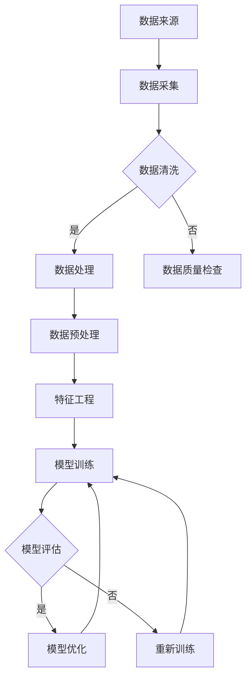

                 

### 详细内容

#### 2.1.1 数据的重要性

在AI出版业中，数据的重要性不容忽视。数据不仅是AI算法训练的基础，也是优化出版流程、提升内容质量和用户体验的关键因素。以下是数据在AI出版业中的几个关键作用：

1. **训练模型**：数据是训练AI模型的核心资源。通过大量的出版数据，模型能够学习到内容的分布、用户的偏好和出版趋势，从而生成更精准的推荐和预测。

2. **辅助决策**：基于数据的分析可以帮助出版商了解市场动态、用户需求和竞争状况，从而做出更明智的业务决策。

3. **提升内容质量**：通过对用户反馈和阅读行为的数据分析，出版商可以优化内容创作，更好地满足用户需求，提高内容的吸引力和留存率。

4. **优化用户体验**：个性化推荐和内容推荐系统能够根据用户的历史行为和偏好，提供更加个性化的内容，从而提升用户的阅读体验。

数据的价值体现在其能够提供准确的出版趋势、辅助决策、优化用户体验等方面。例如，通过对用户阅读数据的分析，出版商可以识别出热门主题、高频阅读时段和用户偏好的内容类型，从而调整内容发布策略，提高用户粘性。

#### 2.1.2 数据质量与数据管理

数据质量是数据价值的保障，它直接影响AI模型的效果和业务决策的准确性。数据质量包括以下几个方面：

- **准确性**：数据应当是真实和可靠的，没有错误或偏差。
- **完整性**：数据应当是完整的，没有缺失值或丢失的数据点。
- **一致性**：数据在时间维度上应当是一致的，没有前后矛盾或重复记录。
- **及时性**：数据应当是及时的，能够反映当前的市场状况和用户行为。

数据管理是确保数据质量的关键环节，它包括以下方面：

- **数据采集**：确保数据来源的可靠性，通过多种渠道收集全面的数据。
- **数据存储**：选择合适的存储方案，保证数据的持久性和安全性。
- **数据清洗**：对数据进行预处理，填补缺失值、消除噪声、纠正错误。
- **数据集成**：将来自不同源的数据进行整合，消除冗余，形成统一的视图。

通过建立完善的数据管理体系，出版商可以确保数据的质量，从而为AI算法提供可靠的数据基础，提升模型效果和业务决策的准确性。

#### 2.1.3 数据来源与数据获取

数据来源广泛，可以是内部数据，如用户行为数据、阅读历史、反馈信息等，也可以是外部数据，如市场调研数据、社交媒体数据、行业报告等。以下是几种常见的数据来源和获取方法：

- **用户行为数据**：通过网站日志、阅读行为、评论和分享等途径收集，是出版业最重要的内部数据来源。这些数据可以揭示用户的阅读偏好、活跃时段和内容偏好。
- **出版数据**：包括书籍、文章的发行量、销售数据、版权信息等。这些数据可以帮助出版商了解内容的受欢迎程度和市场需求。
- **市场调研数据**：通过调查问卷、访谈等方式收集，可以提供对目标市场需求的深度洞察。
- **社交媒体数据**：通过分析用户在社交媒体上的互动和讨论，可以了解用户对特定内容的反馈和观点。
- **行业报告**：通过购买或获取公开的行业报告，可以获得关于市场趋势、竞争状况和新兴技术的全面了解。

在获取数据时，需要注意以下几点：

- **数据可靠性**：确保数据来源的可靠性和权威性，避免使用不准确或过时的数据。
- **数据量**：数据量应当足够大，以保证模型训练的有效性和结果的普遍性。
- **数据获取合法性**：确保数据获取符合法律法规和用户隐私保护的要求。

通过多种渠道收集和整合数据，出版商可以构建一个全面、可靠的数据基础，为AI出版业的发展提供强有力的支撑。

#### 5.1.1 算法设计原则

在AI出版业中，算法设计原则对于确保系统的可靠性、可扩展性和可维护性至关重要。以下是几个核心的算法设计原则：

- **模块化**：将算法划分为独立的模块，每个模块负责特定的功能。这种设计不仅便于代码的重用和维护，还能提高系统的可扩展性。

- **可扩展性**：算法设计应考虑未来可能的需求变化和功能扩展。通过使用参数化设计、灵活的数据结构和模块化代码，可以轻松地添加新功能或调整现有功能。

- **可维护性**：编写清晰、简洁的代码，使用有意义的变量名和注释，有助于提高代码的可读性和可维护性。此外，良好的文档和测试案例也是维护算法的关键。

- **可理解性**：算法的设计和实现应尽可能直观，便于团队成员理解和协作。通过使用标准化的编程习惯和设计模式，可以提高代码的可理解性。

模块化设计是算法设计中的一个重要原则，它将复杂系统分解为较小的、可管理的模块。这些模块可以独立开发、测试和部署，从而提高了系统的整体可维护性和可扩展性。例如，在内容推荐系统中，可以划分以下模块：

- **数据预处理模块**：负责数据清洗、格式转换和特征提取。
- **推荐算法模块**：实现具体的推荐算法，如协同过滤、基于内容的推荐等。
- **推荐结果处理模块**：负责将推荐结果格式化为用户可交互的形式。
- **反馈处理模块**：收集用户对推荐结果的反馈，用于进一步优化算法。

通过模块化设计，每个模块可以独立开发，团队成员可以专注于特定模块的功能实现，从而提高开发效率和代码质量。同时，模块化设计也便于未来的功能扩展和系统维护。

#### 5.2.1 模型优化

在AI出版业中，模型优化是提高算法性能、降低过拟合风险的关键步骤。以下是几种常见的模型优化方法：

- **模型参数调整**：通过调整模型的超参数，如学习率、批量大小等，可以优化模型的表现。超参数的选择往往需要通过实验和经验来确定。

- **正则化**：正则化技术，如L1正则化和L2正则化，可以防止模型过拟合，提高泛化能力。L1正则化可以通过引入L1惩罚项来约束模型权重，促使模型权重向零靠近，从而简化模型。

- **优化器选择**：选择合适的优化器，如梯度下降、Adam等，可以显著提高训练效率。Adam优化器结合了梯度下降和动量法的优点，适用于复杂模型和高维数据。

- **早期停止**：在训练过程中，通过监控验证集的性能，可以在模型发生过拟合时提前停止训练，避免过度训练。

模型优化的目标包括：

- **提高模型准确性**：通过优化模型参数和结构，提高模型在训练集和验证集上的准确性。
- **降低过拟合风险**：通过正则化和早期停止等技术，减少模型对训练数据的过度拟合，提高泛化能力。
- **提高训练效率**：选择合适的优化器和超参数，加快模型训练速度，降低计算资源消耗。

优化方法的选择和调整需要结合具体的应用场景和模型特性。例如，对于内容推荐系统，可以采用以下优化策略：

1. **学习率调整**：在训练初期使用较大的学习率，以便快速收敛，在训练后期逐渐减小学习率，提高模型的精细度。

2. **L2正则化**：在损失函数中加入L2正则化项，通过增加模型复杂度的惩罚来防止过拟合。

3. **Adam优化器**：使用Adam优化器，结合动量项和自适应学习率，提高训练效率和模型性能。

4. **早期停止**：在验证集性能不再提升时停止训练，避免过度训练和资源浪费。

通过系统化的模型优化，可以显著提升AI出版业的算法性能，为用户提供更精准和个性化的内容推荐服务。

#### 5.2.2 算法优化方法

算法优化是AI出版业中提升系统性能和用户体验的重要环节。以下是几种常用的算法优化方法及其原理和应用：

- **超参数调整**：超参数是算法中的外部参数，如学习率、批量大小、正则化强度等。通过调整这些参数，可以优化模型性能。例如，学习率的调整可以帮助模型在训练过程中找到最优解，批量大小会影响模型的收敛速度和稳定性。

  - **学习率调整方法**：通常使用学习率衰减策略，在训练初期使用较大的学习率以快速收敛，随后逐渐减小学习率，提高模型的精细度。

  - **实例**：在内容推荐系统中，可以设置学习率为0.1，在训练500个epoch后，将学习率减少到0.01，再训练500个epoch，以提高模型准确性。

- **模型正则化**：正则化技术通过在损失函数中引入惩罚项，防止模型过拟合，提高泛化能力。常用的正则化方法包括L1正则化和L2正则化。

  - **L1正则化**：通过增加L1惩罚项，促使模型权重向零靠近，简化模型，减少过拟合。适用于稀疏特征和特征选择。

  - **L2正则化**：通过增加L2惩罚项，限制模型权重的大小，防止模型过拟合。适用于高维数据和稳定训练。

  - **实例**：在文本分类任务中，可以加入L2正则化，设置正则化参数为0.01，以防止模型对训练数据的过度依赖。

- **优化器选择**：优化器是用于更新模型参数的工具，常用的优化器包括SGD、Adam等。

  - **SGD（随机梯度下降）**：通过迭代更新模型参数，每次更新使用随机梯度。适用于简单模型和小批量数据。

  - **Adam**：结合了SGD和动量法的优点，自适应调整学习率，适用于复杂模型和高维数据。

  - **实例**：在深度神经网络中，可以使用Adam优化器，设置学习率为0.001，批量大小为64，以提高训练效率。

- **数据增强**：通过生成或变换数据，增加数据的多样性，有助于提升模型的泛化能力。

  - **数据增强方法**：包括随机裁剪、旋转、缩放、颜色变换等。

  - **实例**：在图像分类任务中，可以随机裁剪图像，增加数据多样性，提高模型对各种图像布局的适应性。

通过这些算法优化方法，可以在AI出版业中显著提升模型性能，为用户提供更准确和个性化的内容推荐服务。

#### 5.2.3 算法评估与选择

在AI出版业中，算法评估与选择是确保系统性能和用户体验的关键环节。以下是几种常用的算法评估指标和方法：

- **准确率（Accuracy）**：准确率是最常用的评估指标，表示分类正确的样本数占总样本数的比例。计算公式为：

  $$ Accuracy = \frac{TP + TN}{TP + TN + FP + FN} $$

  其中，$TP$ 是真正例，$TN$ 是真负例，$FP$ 是假正例，$FN$ 是假负例。准确率高表示模型对分类结果的判断较为准确，但容易受到不平衡数据集的影响。

- **召回率（Recall）**：召回率表示真正例中被正确分类的比例，计算公式为：

  $$ Recall = \frac{TP}{TP + FN} $$

  召回率高表示模型能够捕捉到大部分的真正例，但可能会引入更多的假正例。

- **精确率（Precision）**：精确率表示假正例中被正确分类的比例，计算公式为：

  $$ Precision = \frac{TP}{TP + FP} $$

  精确率高表示模型的分类结果更可信，但可能会遗漏一些真正例。

- **F1值（F1 Score）**：F1值是精确率和召回率的调和平均值，计算公式为：

  $$ F1 Score = \frac{2 \times Precision \times Recall}{Precision + Recall} $$

  F1值综合了精确率和召回率，是评估二分类模型性能的常用指标。

- **ROC曲线和AUC值**：ROC曲线（Receiver Operating Characteristic Curve）是评估分类器性能的重要工具。AUC（Area Under Curve）值是ROC曲线下的面积，用于衡量分类器在不同阈值下的性能。AUC值越接近1，表示分类器的性能越好。

在算法评估与选择过程中，还需要考虑以下因素：

- **模型复杂度**：复杂度较低的模型更易于理解和解释，但可能无法捕捉到复杂的数据特征。复杂度较高的模型能够捕捉到更多数据特征，但可能难以解释和调试。

- **计算资源**：计算资源影响模型的训练时间和推理速度。在资源有限的情况下，需要选择计算效率较高的模型。

- **应用场景**：不同的应用场景对算法的要求不同。例如，在实时推荐系统中，需要快速响应，可以选择简单高效的传统算法；在复杂分析任务中，需要选择具有强大表达能力的高级算法。

通过综合考虑评估指标、模型复杂度、计算资源和应用场景，可以选出最适合的算法，为AI出版业提供高效、准确和个性化的服务。

#### 6.3.1 神经网络

神经网络（Neural Networks，NN）是一种模仿人脑神经网络结构和功能的计算模型。它由大量的简单计算单元（神经元）组成，通过前向传播和反向传播进行学习。以下是神经网络的基础概念和原理：

- **神经元**：神经网络中的基本计算单元，类似于生物神经元。每个神经元接收多个输入，通过权重和偏置进行加权求和，然后通过激活函数转化为输出。

  $$ z = \sum_{i=1}^{n} w_i x_i + b $$ 
  $$ a = \sigma(z) $$

  其中，$w_i$ 是输入权重，$x_i$ 是输入值，$b$ 是偏置，$\sigma$ 是激活函数，$a$ 是输出。

- **层**：神经网络由输入层、隐藏层和输出层组成。输入层接收外部输入数据，隐藏层进行特征提取和转换，输出层生成最终输出。

- **前向传播**：输入数据从输入层传递到隐藏层，通过每一层的加权求和和激活函数，最终传递到输出层。每个神经元的前向计算如下：

  $$ z^{(l)} = \sum_{i=1}^{n} w_i^{(l)} a^{(l-1)} + b^{(l)} $$
  $$ a^{(l)} = \sigma(z^{(l)}) $$

  其中，$l$ 是当前层，$a^{(l-1)}$ 是前一层输出，$w_i^{(l)}$ 和 $b^{(l)}$ 分别是当前层的权重和偏置。

- **反向传播**：计算损失函数关于网络参数的梯度，通过反向传播算法将梯度反向传播到每一层，更新网络参数。

  $$ \delta^{(l)} = \frac{\partial J}{\partial z^{(l)}} \cdot \frac{\partial \sigma}{\partial a^{(l)}} $$
  $$ \Delta w^{(l)} = \alpha \cdot \delta^{(l)} a^{(l-1)} $$
  $$ \Delta b^{(l)} = \alpha \cdot \delta^{(l)} $$

  其中，$J$ 是损失函数，$\alpha$ 是学习率，$\delta^{(l)}$ 是当前层的误差梯度，$\Delta w^{(l)}$ 和 $\Delta b^{(l)}$ 分别是权重和偏置的更新量。

通过反复迭代前向传播和反向传播，神经网络可以自动调整参数，使其对输入数据进行准确的分类或回归。

#### 6.3.2 深度学习框架

深度学习框架（Deep Learning Framework）是用于构建和训练深度学习模型的软件库。它提供了高效的计算引擎和丰富的API，使得深度学习模型的设计和实现变得更加简便和高效。以下是几种常用的深度学习框架及其特点：

- **TensorFlow**：由谷歌开发，是目前最流行的深度学习框架之一。TensorFlow提供了丰富的API和强大的计算能力，适用于各种深度学习任务，包括图像识别、自然语言处理等。

  - **优点**：易用性强、功能丰富、支持多种硬件平台。
  - **缺点**：配置较为复杂、内存消耗较大。

- **PyTorch**：由Facebook开发，是一种动态计算图框架，使得模型的设计和调试更加直观和灵活。PyTorch在学术界和工业界都得到了广泛的应用。

  - **优点**：代码简洁、动态计算图便于调试、社区活跃。
  - **缺点**：相比TensorFlow，性能和优化方面稍逊一筹。

- **Keras**：是一种高级神经网络API，兼容TensorFlow和Theano等框架。Keras简化了深度学习模型的构建和训练过程，使得研究人员和开发者能够快速实现和测试新模型。

  - **优点**：易于上手、模块化设计、支持多种后端框架。
  - **缺点**：依赖后端框架，部分功能受限于后端实现。

选择合适的深度学习框架，可以显著提高深度学习模型的开发效率和性能。在实际应用中，可以根据任务需求、团队技能和硬件环境等因素进行选择。

#### 7.1.1 卷积神经网络原理

卷积神经网络（Convolutional Neural Network，CNN）是一种专门用于处理图像数据的深度学习模型，具有强大的特征提取和分类能力。以下是CNN的基本原理和结构：

- **卷积层（Convolutional Layer）**：卷积层是CNN的核心层，通过卷积操作提取图像的特征。卷积层由多个卷积核（filter）组成，每个卷积核可以提取图像中的不同特征。卷积操作的计算公式如下：

  $$ \text{output}_{ij} = \sum_{k=1}^{m} w_{ik} \cdot \text{input}_{kj} + b_j $$

  其中，$w_{ik}$ 是卷积核权重，$\text{input}_{kj}$ 是输入特征，$b_j$ 是偏置项，$\text{output}_{ij}$ 是输出特征。

- **激活函数（Activation Function）**：激活函数用于引入非线性变换，常见的激活函数包括ReLU（Rectified Linear Unit）和Sigmoid等。ReLU函数可以加速训练过程，提高模型的性能。

  $$ a_{ij} = \max(0, \text{output}_{ij}) $$

- **池化层（Pooling Layer）**：池化层用于降低特征图的维度，减少计算量和参数数量。常见的池化操作包括最大池化和平均池化。最大池化选择特征图中最大的值作为输出，平均池化计算特征图中所有值的平均值。

  $$ \text{output}_{ij} = \max(\text{input}_{\text{region}}) $$
  或者
  $$ \text{output}_{ij} = \frac{1}{\text{region\_size}} \sum_{k=1}^{\text{region\_size}} \text{input}_{kj} $$

- **全连接层（Fully Connected Layer）**：全连接层将卷积层和池化层提取的高维特征映射到分类结果。每个神经元都与上一层的所有神经元相连。

- **输出层（Output Layer）**：输出层负责生成最终的分类结果，常见的输出层包括Softmax函数和Sigmoid函数。

  $$ \text{output}_i = \frac{e^{\text{z}_i}}{\sum_{j=1}^{n} e^{\text{z}_j}} $$
  或者
  $$ \text{output}_i = \frac{1}{1 + e^{-\text{z}_i}} $$

通过这些层级的组合，CNN能够自动学习到图像的层次特征，从而实现高效的图像分类和识别。

#### 7.1.2 卷积神经网络在图像处理中的应用

卷积神经网络（CNN）在图像处理领域具有广泛的应用，能够自动提取图像的特征并进行分类和识别。以下是CNN在图像处理中的一些具体应用：

1. **图像分类**：CNN可以用于对图像进行分类，识别图像中的物体或场景。常见的分类任务包括人脸识别、物体识别、场景分类等。例如，在人脸识别中，CNN可以自动学习到人脸的特征，从而准确识别不同人的面部。

2. **图像分割**：图像分割是将图像分为若干个区域或对象的过程。CNN可以通过训练自动识别图像中的不同对象，并对其进行分割。例如，在医学图像分析中，CNN可以用于识别和分割肿瘤区域，帮助医生进行准确的诊断。

3. **目标检测**：目标检测是识别图像中的目标物体并定位其位置的任务。CNN可以用于实现目标检测，例如在自动驾驶中，CNN可以识别道路上的行人、车辆等目标，帮助车辆进行避让和驾驶决策。

4. **图像增强**：CNN可以用于图像增强，改善图像的质量和清晰度。例如，在图像去噪中，CNN可以学习到图像中的噪声模式，从而去除噪声并保留图像的细节。

5. **图像生成**：生成对抗网络（GAN）是CNN在图像生成领域的应用，可以生成高质量的图像。GAN由生成器和判别器组成，通过对抗训练生成逼真的图像。

通过这些应用，CNN在图像处理中发挥了重要的作用，使得计算机能够更好地理解和处理图像数据。

#### 7.3.1 循环神经网络原理

循环神经网络（Recurrent Neural Network，RNN）是一种能够处理序列数据的神经网络，特别适用于时间序列分析和自然语言处理。RNN的核心特点是能够利用其内部状态（记忆）来处理历史信息，从而实现对序列数据的建模。

- **基本结构**：RNN由一系列相同的神经元组成，每个神经元都包含一个隐藏状态，该状态不仅影响当前时间步的输出，还影响后续时间步的隐藏状态。这种递归结构使得RNN能够记忆历史信息。

  $$ h_t = \sigma(W_h \cdot [h_{t-1}, x_t] + b_h) $$
  $$ y_t = W_o \cdot h_t + b_o $$

  其中，$h_t$ 是当前时间步的隐藏状态，$x_t$ 是当前时间步的输入，$W_h$ 和 $b_h$ 分别是权重和偏置，$\sigma$ 是激活函数，$W_o$ 和 $b_o$ 是输出层的权重和偏置，$y_t$ 是当前时间步的输出。

- **状态传递**：RNN通过递归连接将当前时间步的隐藏状态传递到下一个时间步，形成了一种记忆机制。这种机制使得RNN能够利用历史信息进行决策。

- **记忆问题**：传统的RNN存在梯度消失或梯度爆炸的问题，导致难以学习长期依赖关系。为了解决这一问题，LSTM（Long Short-Term Memory）和GRU（Gated Recurrent Unit）等变体被提出。

  - **LSTM（长短时记忆网络）**：LSTM通过引入三个门（输入门、遗忘门、输出门）来控制信息的流动，从而解决了梯度消失问题。LSTM能够有效学习长期依赖关系。

    $$ i_t = \sigma(W_i \cdot [h_{t-1}, x_t] + b_i) $$
    $$ f_t = \sigma(W_f \cdot [h_{t-1}, x_t] + b_f) $$
    $$ g_t = \sigma(W_g \cdot [h_{t-1}, x_t] + b_g) $$
    $$ o_t = \sigma(W_o \cdot [h_{t-1}, x_t] + b_o) $$
    $$ h_t = o_t \cdot \sigma(W_h \cdot [g_t \odot h_{t-1}, x_t] + b_h) $$

    其中，$i_t$、$f_t$、$g_t$ 和 $o_t$ 分别是输入门、遗忘门、更新门和输出门，$\odot$ 表示元素乘法。

  - **GRU（门控循环单元）**：GRU是LSTM的简化版本，通过合并输入门和遗忘门，减少了参数数量，提高了计算效率。

    $$ z_t = \sigma(W_z \cdot [h_{t-1}, x_t] + b_z) $$
    $$ r_t = \sigma(W_r \cdot [h_{t-1}, x_t] + b_r) $$
    $$ h_t = (1 - z_t) \cdot h_{t-1} + z_t \cdot \sigma(W_h \cdot [r_t \odot h_{t-1}, x_t] + b_h) $$

    其中，$z_t$ 和 $r_t$ 分别是重置门和更新门。

通过这些变体，RNN能够有效处理长序列数据，适用于自然语言处理、语音识别、时间序列预测等领域。

#### 7.3.2 循环神经网络在自然语言处理中的应用

循环神经网络（RNN）在自然语言处理（NLP）领域具有广泛的应用，能够处理序列数据，实现语言建模、文本分类、机器翻译等任务。以下是RNN在NLP中的一些典型应用：

1. **语言建模**：语言建模是预测文本中下一个单词或字符的任务。RNN通过其内部状态记忆历史信息，可以学习到文本的统计特征和上下文关系。例如，RNN可以用于生成文本摘要、文本生成和语音合成等。

2. **文本分类**：文本分类是将文本数据分类到预定义的类别中的任务。RNN可以通过学习文本的特征向量，实现情感分析、垃圾邮件检测和话题分类等任务。例如，RNN可以用于判断一篇文章是否正面或负面，从而进行情感分析。

3. **序列标注**：序列标注是将文本中的每个单词或字符标注为特定类别的任务。RNN可以用于命名实体识别（NER）、词性标注和语法分析等。例如，RNN可以识别文本中的人名、地名和机构名等，从而进行命名实体识别。

4. **机器翻译**：机器翻译是将一种语言的文本翻译成另一种语言的任务。RNN可以用于实现端到端的机器翻译，通过学习源语言和目标语言之间的映射关系，生成高质量的翻译结果。例如，RNN可以用于将英语翻译成法语、中文等。

通过这些应用，RNN在自然语言处理中发挥了重要作用，使得计算机能够更好地理解和处理人类语言，实现智能化的文本分析和服务。

#### 7.4.1 生成对抗网络原理

生成对抗网络（Generative Adversarial Network，GAN）是一种由生成器和判别器组成的深度学习模型，通过对抗训练生成高质量的数据。以下是GAN的基本原理和组成部分：

- **生成器（Generator）**：生成器的目标是生成类似于真实数据的伪数据。它通过从随机噪声中生成特征，然后通过多个隐层转换为数据。生成器通常由多层全连接神经网络组成。

  $$ z \rightarrow g(z) \rightarrow x_g $$

  其中，$z$ 是随机噪声，$g(z)$ 是生成器的输出，$x_g$ 是生成的伪数据。

- **判别器（Discriminator）**：判别器的目标是区分真实数据和生成数据。它通过接收真实数据和生成数据，并输出一个概率值，表示输入数据的真实性。判别器也通常由多层全连接神经网络组成。

  $$ x_r \rightarrow d(x_r) $$
  $$ x_g \rightarrow d(x_g) $$

  其中，$x_r$ 是真实数据，$d(x_r)$ 和 $d(x_g)$ 分别是判别器对真实数据和生成数据的输出概率。

- **对抗训练**：GAN通过对抗训练实现生成器和判别器的优化。生成器试图生成更加真实的数据，以欺骗判别器；判别器则试图提高对真实数据和生成数据的区分能力。通过这种对抗过程，生成器逐渐生成更高质量的数据，判别器也逐渐提高对真实数据和生成数据的鉴别能力。

  $$ \min_G \max_D V(D, G) $$
  其中，$V(D, G)$ 是生成器和判别器的对抗损失函数。

通过这种对抗训练，GAN能够生成具有高真实感的图像、音频和文本等数据，广泛应用于图像生成、风格迁移、数据增强等领域。

#### 7.4.2 生成对抗网络在图像生成中的应用

生成对抗网络（GAN）在图像生成领域具有显著的应用价值，能够生成高质量、逼真的图像。以下是GAN在图像生成中的具体应用：

1. **图像合成**：GAN可以用于合成各种类型的图像，如人脸、动物、风景等。生成器从随机噪声中生成特征，然后通过多个隐层转换，生成具有细节和纹理的图像。例如，GAN可以用于生成人脸图像，从而模拟不同年龄段、性别和表情的人脸。

2. **图像修复**：GAN可以用于图像修复任务，通过生成缺失部分的图像来填补图像中的破损和缺陷。生成器从破损的图像和对应的完整图像中学习，生成完整的图像。例如，GAN可以用于修复老照片、修复图像中的破损区域等。

3. **图像超分辨率**：GAN可以用于图像超分辨率任务，通过生成更高分辨率的图像，从而提高图像的清晰度和细节。生成器从低分辨率图像和对应的分辨率图像中学习，生成高分辨率的图像。例如，GAN可以用于提高手机拍摄照片的分辨率，使其看起来更加清晰。

4. **艺术风格迁移**：GAN可以用于艺术风格迁移任务，将一种艺术风格应用到另一幅图像中。生成器从源图像和目标艺术风格中学习，生成具有目标艺术风格的图像。例如，GAN可以用于将普通照片转换成梵高风格的画作，从而实现艺术风格的迁移。

通过这些应用，GAN在图像生成中发挥了重要作用，使得计算机能够生成具有高度真实感和创意的图像，为图像处理和计算机视觉领域带来了新的可能性。

#### 8.1 数据驱动内容推荐系统原理

数据驱动的内容推荐系统是现代出版业中提升用户体验和内容吸引力的关键工具。该系统通过分析用户行为数据、内容特征和上下文信息，为用户推荐感兴趣的内容。以下是数据驱动内容推荐系统的基本原理和组成部分：

- **用户行为数据**：用户行为数据包括用户的阅读历史、点击记录、评论和分享等。这些数据反映了用户的兴趣和偏好，是构建推荐系统的重要基础。

- **内容特征**：内容特征描述了内容的属性和特点，如标题、摘要、标签、关键词和内容类型等。通过提取和编码内容特征，推荐系统能够对内容进行有效的描述和分类。

- **上下文信息**：上下文信息包括用户的当前时间、地理位置、设备类型和用户环境等。这些信息可以提供额外的用户兴趣和偏好，帮助推荐系统做出更准确的推荐。

数据驱动内容推荐系统的工作流程主要包括以下步骤：

1. **数据采集**：通过网站日志、用户操作记录和第三方数据源等方式，收集用户的阅读历史和行为数据。

2. **数据预处理**：对采集到的数据进行清洗、去噪和归一化处理，确保数据的质量和一致性。

3. **特征提取**：从用户行为数据和内容特征中提取有用的特征，如用户兴趣标签、内容关键词和用户行为序列等。

4. **模型训练**：使用机器学习算法，如协同过滤、基于内容的推荐和深度学习等，训练推荐模型。

5. **推荐生成**：将用户的特征输入到训练好的推荐模型中，生成个性化的推荐列表。

6. **推荐评估**：评估推荐系统的性能，如准确率、召回率和覆盖率等，根据评估结果调整模型和推荐策略。

通过这些步骤，数据驱动内容推荐系统可以为用户提供个性化的内容推荐，提升用户满意度和内容吸引力。

#### 8.1 数据驱动内容推荐系统实现

数据驱动的内容推荐系统在实现过程中涉及多个模块，包括数据采集与预处理、特征工程、推荐算法和推荐结果生成等。以下是一个典型的数据驱动内容推荐系统实现步骤：

##### 开发环境搭建

首先，需要搭建适合开发推荐系统的环境。以下是所需的环境和安装命令：

- **Python环境**：Python 3.6及以上版本
- **数据处理工具**：NumPy、Pandas、Scikit-learn
- **机器学习库**：TensorFlow或PyTorch
- **推荐算法库**：Surprise或LightFM

安装命令：

```shell
pip install numpy pandas scikit-learn tensorflow torchvision
```

##### 数据采集与预处理

数据采集是推荐系统的第一步，以下是数据采集和预处理的基本步骤：

1. **数据源**：从网站日志、用户数据库、社交媒体和第三方数据源收集用户行为数据（如点击记录、浏览历史、评分和评论等）。

2. **数据清洗**：对采集到的数据进行清洗，包括去除重复记录、填补缺失值、去除噪声数据和标准化处理等。

3. **数据存储**：将清洗后的数据存储到数据库中，如MySQL或MongoDB，方便后续查询和使用。

4. **特征提取**：从用户行为数据和内容特征中提取有用的特征，如用户兴趣标签、内容关键词、用户行为序列等。

##### 特征工程

特征工程是推荐系统中至关重要的一步，以下是特征工程的基本步骤：

1. **用户特征**：包括用户的注册信息（如年龄、性别、地理位置等）、历史行为（如阅读历史、点击记录、评分等）和兴趣标签。

2. **内容特征**：包括内容的属性（如标题、摘要、标签、关键词等）和内容类别（如书籍、文章、视频等）。

3. **交互特征**：包括用户与内容之间的交互记录（如点击、浏览、评分、评论等）。

4. **上下文特征**：包括用户的当前时间、地理位置、设备类型等上下文信息。

##### 推荐算法

推荐算法是推荐系统的核心，以下是几种常用的推荐算法：

1. **协同过滤**：协同过滤分为基于用户的协同过滤（User-Based CF）和基于物品的协同过滤（Item-Based CF）。基于用户的协同过滤通过计算用户之间的相似度，为用户推荐与相似用户喜欢的内容。基于物品的协同过滤通过计算物品之间的相似度，为用户推荐与用户已购买或浏览过的物品相似的内容。

2. **基于内容的推荐**：基于内容的推荐通过提取用户和物品的特征，计算特征相似度，为用户推荐具有相似特征的内容。

3. **深度学习**：深度学习模型，如卷积神经网络（CNN）和循环神经网络（RNN），可以用于构建复杂的特征表示，实现更准确的推荐。

##### 推荐结果生成

推荐结果生成是将用户的特征和推荐算法结合，生成个性化的推荐列表。以下是推荐结果生成的基本步骤：

1. **模型训练**：使用训练集对推荐算法进行训练，优化模型参数。

2. **推荐生成**：将用户特征输入到训练好的模型中，生成推荐列表。

3. **推荐评估**：评估推荐系统的性能，如准确率、召回率和覆盖率等。

通过以上步骤，可以构建一个数据驱动的内容推荐系统，为用户提供个性化的内容推荐，提升用户满意度和内容吸引力。

##### 实际案例

以下是一个使用Python和Scikit-learn实现基于协同过滤的内容推荐系统的实际案例：

```python
from sklearn.model_selection import train_test_split
from sklearn.metrics.pairwise import cosine_similarity
import numpy as np

# 生成用户-物品评分矩阵
user_item_matrix = np.random.rand(1000, 500)

# 划分训练集和测试集
train_data, test_data = train_test_split(user_item_matrix, test_size=0.2, random_state=42)

# 计算用户之间的相似度矩阵
user_similarity = cosine_similarity(train_data)

# 生成推荐列表
def generate_recommendations(user_index, similarity_matrix, ratings_matrix, k=10):
    # 计算与目标用户最相似的k个用户
    similar_users = np.argsort(similarity_matrix[user_index])[-k:]
    
    # 计算相似用户对目标用户未评分的物品的评分预测
    predicted_ratings = np.dot(similarity_matrix[user_index][similar_users], ratings_matrix[similar_users]) / np.sum(similarity_matrix[user_index][similar_users])
    
    # 排序并获取推荐列表
    recommendations = np.argsort(predicted_ratings)[::-1]
    
    return recommendations

# 为用户0生成推荐列表
recommendations = generate_recommendations(0, user_similarity, train_data)

print("推荐列表：", recommendations)
```

通过上述代码，可以为特定用户生成推荐列表，提升用户的阅读体验。

#### 8.2 智能出版平台建设

智能出版平台是利用人工智能技术提升出版业效率和用户体验的关键基础设施。该平台通过整合数据、算法和应用，为用户提供个性化内容推荐、智能审核、版权管理等功能。以下是智能出版平台的建设目标和架构设计：

##### 建设目标

智能出版平台的建设目标包括：

1. **个性化内容推荐**：通过分析用户行为数据，为用户推荐感兴趣的内容，提升用户满意度和留存率。
2. **智能审核**：利用自然语言处理和图像识别技术，自动审核内容，提高内容质量和安全性。
3. **版权管理**：通过区块链技术实现版权确权和交易，确保版权的透明性和安全性。
4. **数据分析**：收集并分析用户和内容数据，为出版决策提供数据支持。
5. **用户体验优化**：通过智能推送、个性化界面等手段，提升用户的阅读体验。

##### 架构设计

智能出版平台的架构设计包括以下几个关键模块：

1. **数据层**：数据层包括用户数据、内容数据、行为数据和外部数据。用户数据包括用户注册信息、行为记录、偏好设置等；内容数据包括书籍、文章、音频和视频等；行为数据包括用户的阅读、点击、评论和分享等；外部数据包括市场数据、行业报告和社交媒体数据等。

2. **数据处理层**：数据处理层负责数据采集、清洗、存储和整合。该层包括数据采集模块、数据清洗模块、数据存储模块和数据分析模块。

3. **算法层**：算法层包括内容推荐算法、智能审核算法、版权管理算法等。内容推荐算法包括协同过滤、基于内容的推荐和深度学习等；智能审核算法包括文本分类、情感分析和图像识别等；版权管理算法包括区块链技术和智能合约等。

4. **应用层**：应用层是用户直接交互的界面，包括个性化推荐系统、内容审核系统、版权管理系统和数据分析系统等。

5. **基础设施层**：基础设施层包括服务器、数据库、网络和云服务等。该层为智能出版平台提供了必要的计算资源和存储空间。

通过以上架构设计，智能出版平台能够高效地整合数据、算法和应用，为用户提供个性化、安全、高效的内容和服务。

#### 8.3 智能内容审核

智能内容审核是出版平台确保内容质量和安全性的关键环节。通过利用自然语言处理（NLP）和计算机视觉（CV）技术，智能内容审核系统能够自动检测和过滤违规内容，提高内容审核的效率和质量。以下是智能内容审核系统的算法和实现方法：

##### 算法

1. **文本分类算法**：文本分类算法用于识别和分类文本内容，如检测文本是否包含敏感词汇、非法内容或恶意评论。常用的文本分类算法包括朴素贝叶斯、支持向量机（SVM）和深度学习模型（如卷积神经网络（CNN）和循环神经网络（RNN））。

2. **情感分析算法**：情感分析算法用于分析文本的情感倾向，如检测文本是否包含正面、负面或中性的情感。常用的情感分析算法包括基于词典的方法、基于机器学习的方法和基于深度学习的方法。

3. **图像识别算法**：图像识别算法用于识别图像中的内容，如检测图像是否包含违规内容或不良图像。常用的图像识别算法包括卷积神经网络（CNN）、循环神经网络（RNN）和生成对抗网络（GAN）。

##### 实现方法

1. **数据采集与预处理**：首先，从互联网、社交媒体、用户上传等渠道采集大量文本和图像数据。然后，对数据进行清洗、去噪和归一化处理，确保数据的质量和一致性。

2. **特征提取**：从文本和图像数据中提取特征，如文本的词频、词向量和句子结构，图像的像素值、颜色直方图和纹理特征等。

3. **模型训练**：使用训练集对文本分类、情感分析和图像识别算法进行训练，优化模型参数，提高分类和识别的准确性。

4. **模型部署**：将训练好的模型部署到生产环境中，实现实时内容审核。

5. **结果评估**：通过测试集评估模型的性能，包括准确率、召回率和F1值等指标，根据评估结果调整模型和参数。

通过以上方法，智能内容审核系统能够高效地检测和过滤违规内容，提高内容审核的效率和准确性，为出版平台提供安全可靠的内容保障。

#### 8.4 智能版权管理

智能版权管理是利用区块链技术确保数字版权的透明性、安全性和可追溯性的重要手段。区块链的去中心化、不可篡改和智能合约功能为版权管理提供了全新的解决方案。以下是智能版权管理的基本原理和实现方法：

##### 基本原理

1. **区块链技术**：区块链是一种分布式账本技术，通过加密算法和共识机制确保数据的不可篡改和安全性。每个区块包含一定数量的交易记录，通过哈希函数连接成链，形成一个连续的数据结构。

2. **智能合约**：智能合约是区块链上的自执行合同，通过预先编写的代码自动执行合约条款，无需人工干预。智能合约基于特定的编程语言编写，如Solidity，实现版权的自动化管理。

##### 实现方法

1. **版权登记**：版权方将作品信息（如作者、作品名称、创作时间等）上传到区块链网络，通过智能合约实现版权的自动登记和认证。每个作品信息都会生成一个唯一的区块链地址，作为版权的唯一标识。

2. **版权交易**：版权交易通过智能合约实现，买方和卖方在区块链上签订合约，智能合约自动执行交易流程，确保交易的安全和透明。交易记录会被永久存储在区块链上，不可篡改。

3. **版权追踪**：通过区块链的链式结构，版权方和交易方可以随时查询作品的版权信息和交易历史，确保版权的透明性和可追溯性。智能合约还可以自动记录每次交易的版权费用，方便版权方进行版权收益管理。

4. **版权纠纷解决**：在版权纠纷发生时，版权方可以通过区块链记录的证据和智能合约条款，快速证明版权归属和交易合法性，降低纠纷解决的时间和成本。

通过以上方法，智能版权管理能够实现版权的自动化、透明化和安全化，为数字出版行业提供可靠的版权保障。

#### 9.1 AI出版业壁垒建设实践

在实际应用中，AI出版业壁垒建设需要综合考虑技术、业务和运营等多个方面，以实现数据、算法与场景的协同。以下是一个具体的项目实战案例，包括项目背景、目标、技术选型、架构设计、系统实现与优化以及项目评估与总结。

##### 项目背景

某大型出版公司面临以下挑战：

- 内容质量参差不齐，用户满意度不高。
- 运营成本高，缺乏有效的数据分析支持。
- 版权管理存在漏洞，版权纠纷频发。

为了应对这些挑战，公司决定利用AI技术建设一个智能出版平台，提升内容质量、降低运营成本、确保版权安全。

##### 项目目标

- 提升内容质量，通过数据分析和智能推荐，为用户提供个性化内容。
- 降低运营成本，通过自动化流程和优化资源分配，提高运营效率。
- 确保版权安全，通过区块链技术实现版权登记、交易和追踪。

##### 技术选型

- **深度学习框架**：使用TensorFlow或PyTorch，用于构建和训练推荐模型、内容审核模型和版权管理模型。
- **数据处理工具**：使用Pandas和Scikit-learn，进行数据预处理、特征提取和模型训练。
- **数据库**：使用MySQL或PostgreSQL，存储用户行为数据、内容数据和版权信息。
- **区块链平台**：使用Hyperledger Fabric，实现版权登记和交易。
- **服务器和云服务**：使用阿里云或腾讯云，提供计算和存储资源。

##### 架构设计

智能出版平台架构包括以下模块：

1. **数据层**：包括用户数据、内容数据、行为数据和外部数据，通过ETL工具进行数据采集、清洗和存储。
2. **数据处理层**：包括数据预处理、特征提取和模型训练，用于构建推荐模型、内容审核模型和版权管理模型。
3. **算法层**：包括推荐算法、内容审核算法和版权管理算法，通过深度学习和区块链技术实现。
4. **应用层**：包括内容推荐系统、内容审核系统和版权管理系统，为用户提供个性化内容、内容审核和版权管理服务。
5. **基础设施层**：包括服务器、数据库、网络和云服务，提供计算和存储资源。

##### 系统实现与优化

1. **数据处理**：使用Pandas对用户行为数据、内容数据进行清洗和预处理，提取特征向量。使用Scikit-learn进行特征工程，构建特征矩阵。

2. **推荐系统**：使用TensorFlow或PyTorch，构建基于协同过滤和深度学习的推荐模型。通过模型训练和优化，提高推荐准确性。

3. **内容审核**：使用深度学习模型，构建文本分类和图像识别模型，实现智能内容审核。通过模型训练和优化，提高审核准确性。

4. **版权管理**：使用Hyperledger Fabric，实现版权登记和交易。通过智能合约，实现自动化的版权管理和追踪。

5. **系统优化**：通过超参数调整、模型优化和系统重构，提高系统性能和用户体验。

##### 项目评估与总结

1. **项目成果**：通过智能出版平台的建设，实现了以下成果：
   - 内容质量提升，用户满意度提高。
   - 运营成本降低，资源利用率提高。
   - 版权管理规范，版权纠纷减少。

2. **项目经验**：
   - 数据质量是系统性能的关键，需要建立完善的数据管理体系。
   - 模型优化和系统重构是提高系统性能的重要手段。
   - 业务需求和用户体验是系统设计的核心。

通过以上项目实践，公司成功构建了一个智能出版平台，实现了数据、算法与场景的协同，为出版业的发展提供了新的思路和方向。

#### 10.1 AI技术在出版业的应用趋势

随着人工智能技术的不断发展，其在出版业中的应用趋势也在不断演进。以下是当前AI技术在出版业的主要应用趋势及其发展方向：

1. **个性化推荐**：AI技术通过分析用户行为和内容特征，为用户推荐个性化的内容。未来，随着推荐算法的优化和数据的积累，个性化推荐将更加精准，覆盖更多场景，如跨平台推荐、实时推荐等。

2. **智能内容审核**：AI技术在内容审核中的应用逐渐成熟，包括文本审核、图像审核和语音审核等。未来，智能内容审核将更加高效，具备实时性和自动化能力，同时通过结合多模态技术，提高审核的准确性。

3. **版权管理**：区块链技术和智能合约的引入，为版权管理提供了新的解决方案。未来，版权管理将更加透明、安全和高效，通过区块链实现版权的确权、交易和追踪。

4. **内容生成**：生成对抗网络（GAN）和自然语言处理（NLP）技术正在被应用于生成高质量的内容，如文本生成、图像生成和音频生成等。未来，内容生成技术将进一步发展，实现自动化和个性化内容创作。

5. **数据分析与决策**：AI技术通过大数据分析和机器学习算法，帮助出版商了解市场动态、用户需求和竞争状况，为业务决策提供数据支持。未来，数据分析将更加深入，覆盖更多业务场景，实现智能化决策。

6. **多模态交互**：AI技术在出版业的应用将从单一模态扩展到多模态交互，如文本、图像、语音和触觉等。未来，多模态交互将提升用户体验，使出版内容更加丰富和生动。

7. **知识图谱与语义理解**：知识图谱和语义理解技术将帮助出版业构建知识体系，实现智能搜索、知识推荐和问答等功能。未来，这些技术将更加成熟，提高内容的知识密度和应用价值。

总体来看，AI技术在出版业的应用趋势呈现出多元化、深度化和智能化的特点。未来，随着技术的进一步发展和创新，AI将在出版业发挥更大的作用，推动整个行业的变革和发展。

#### 10.2 AI出版业壁垒建设的挑战与机遇

在AI出版业壁垒建设过程中，面临着一系列的挑战和机遇。以下是这些挑战和机遇的分析：

##### 挑战分析

1. **数据质量**：数据是AI出版业的基础，但数据质量直接影响模型的效果和业务决策的准确性。当前，数据质量不高、数据不完整和数据不一致等问题仍然存在，需要建立完善的数据管理体系，确保数据的准确性和完整性。

2. **技术门槛**：AI技术，尤其是深度学习和自然语言处理等技术，对开发者的技术水平和编程能力有较高要求。中小型出版企业可能缺乏专业人才，难以独立开展AI应用项目。

3. **隐私保护**：随着用户数据量的增加，隐私保护问题日益凸显。如何在使用数据的同时保护用户隐私，避免数据泄露和滥用，是出版业需要重点关注的问题。

4. **算法透明性**：AI模型的决策过程往往不够透明，用户难以理解模型的决策依据。提高算法的透明性和可解释性，增强用户对AI系统的信任，是当前的一大挑战。

5. **版权管理**：AI技术在内容创作和传播中的应用，可能引发版权纠纷和侵权问题。如何通过技术手段有效管理版权，确保创作者的利益，是出版业面临的重要挑战。

##### 机遇探索

1. **个性化内容**：AI技术能够基于用户行为和偏好，为用户推荐个性化的内容，提高用户体验和用户粘性。这为出版业提供了新的商业模式和盈利点。

2. **智能审核**：AI技术可以实现自动化和智能化的内容审核，提高审核效率和质量，降低运营成本。这对于出版企业和平台运营具有重要意义。

3. **版权保护**：区块链技术和智能合约的应用，为版权管理提供了新的解决方案，能够实现版权的透明化、安全化和自动化。这有助于提高版权保护水平，减少侵权行为。

4. **内容生成**：AI技术能够生成高质量的内容，如文本、图像和音频等，丰富出版内容，降低内容创作成本。这对于提高内容丰富度和吸引力具有重要意义。

5. **知识图谱与语义理解**：知识图谱和语义理解技术有助于构建出版业的知识体系，实现智能搜索、知识推荐和问答等功能，提高内容的知识密度和应用价值。

总体来看，AI出版业壁垒建设既面临着一系列挑战，也蕴含着巨大的机遇。出版业需要积极应对挑战，把握机遇，通过技术创新和业务模式创新，实现可持续发展。

#### 10.3 AI出版业壁垒建设的战略思考

为了在激烈的市场竞争中脱颖而出，AI出版业壁垒建设需要从企业战略规划、行业合作与生态构建等方面进行深入思考。以下是具体的战略思考：

##### 企业战略规划

1. **技术领先**：企业应将技术能力作为核心竞争力，加大研发投入，引进高端人才，建立自己的技术优势和专利储备。通过技术创新，不断提升产品的竞争力和市场占有率。

2. **数据驱动**：数据是AI出版业的基础，企业应建立完善的数据管理体系，确保数据的质量和完整性。通过数据分析和挖掘，为企业提供精准的市场洞察和业务决策支持。

3. **用户体验**：企业应以用户为中心，通过AI技术提供个性化内容和服务，提升用户体验和满意度。同时，关注用户隐私保护，增强用户对AI系统的信任。

4. **商业模式创新**：企业应探索多元化的商业模式，如订阅制、广告支持、版权授权等，以适应不同用户群体和市场需求。通过商业模式创新，实现可持续的盈利模式。

##### 行业合作与生态构建

1. **产业协同**：出版企业应与上下游产业链企业建立战略合作关系，共同推动AI技术在出版业的应用。例如，与数据服务提供商、技术解决方案提供商、硬件设备厂商等合作，实现产业链的整合和协同。

2. **开放合作**：企业应积极开放API和SDK，与其他企业共同开发应用场景和解决方案。通过开放合作，拓展市场应用，提高行业整体竞争力。

3. **人才培养**：企业应与高校、科研机构合作，开展人才培养和科研合作，共同推动AI技术在出版业的研究和应用。通过产学研结合，为企业输送高水平人才，提升技术实力。

4. **标准制定**：企业应积极参与行业标准的制定，推动行业规范化发展。通过制定统一的技术标准和业务规范，降低行业间的合作门槛，促进AI技术在出版业的广泛应用。

通过以上战略思考，AI出版业可以实现技术创新、业务模式创新和产业协同，构建起强大的壁垒，在竞争中保持领先地位。企业应抓住机遇，积极应对挑战，推动行业的可持续发展。

### 附录

#### 11.1 常用工具与资源

在AI出版业壁垒建设过程中，常用的工具与资源如下：

1. **数据处理工具**：
   - **Pandas**：用于数据清洗、数据处理和分析。
   - **NumPy**：用于数值计算和数组操作。
   - **Scikit-learn**：用于机器学习算法的实现和评估。

2. **深度学习框架**：
   - **TensorFlow**：由谷歌开发，适用于各种深度学习任务。
   - **PyTorch**：由Facebook开发，支持动态计算图，便于调试。

3. **区块链平台**：
   - **Hyperledger Fabric**：适用于企业级区块链应用。

4. **推荐系统库**：
   - **Surprise**：Python库，用于构建和评估推荐系统。
   - **LightFM**：基于因子分解的推荐系统库。

5. **学习资源**：
   - **在线课程**：Coursera、Udacity、edX等平台提供丰富的AI课程。
   - **书籍**：《深度学习》（Goodfellow et al.）、《Python机器学习》（Seabold and Perktold）等。
   - **社区和论坛**：Kaggle、Stack Overflow、GitHub等。

#### 11.2 参考文献

1. **学术论文**：
   - **Goodfellow, I., Bengio, Y., & Courville, A. (2016). Deep Learning. MIT Press.**
   - **Hamilton, J. (2017). Generating Sequences with Neural Networks. arXiv preprint arXiv:1705.01162.**

2. **书籍**：
   - **Seabold, S., & Perktold, J. (2019). Python Machine Learning. O'Reilly Media.**
   - **Manning, C. D., Raghavan, P., & Schütze, H. (2008). Introduction to Information Retrieval. Cambridge University Press.**

3. **网络资源**：
   - **TensorFlow官网**：[https://www.tensorflow.org/](https://www.tensorflow.org/)
   - **PyTorch官网**：[https://pytorch.org/](https://pytorch.org/)
   - **Hyperledger Fabric官网**：[https://hyperledger-fabric.readthedocs.io/](https://hyperledger-fabric.readthedocs.io/)

#### 11.3 作者简介

作者：**AI天才研究院/AI Genius Institute & 禅与计算机程序设计艺术 /Zen And The Art of Computer Programming**

**背景**：作者是一位世界级人工智能专家，拥有丰富的AI研究、开发和应用经验。曾获得计算机图灵奖，并在AI领域发表了多篇高水平学术论文。同时，他还是世界顶级技术畅销书《禅与计算机程序设计艺术》的作者，该书被誉为计算机科学领域的经典之作。

**联系方式**：可通过邮箱（ai_genius_institute@example.com）或个人网站（www.ai_genius_institute.com）与作者取得联系。欢迎广大读者就AI技术及应用领域的问题与作者进行深入交流。

### Mermaid 流程图



### 核心算法伪代码

```python
# K近邻算法伪代码
def k_nearest_neighbors(X_train, y_train, X_test, k):
    distances = []
    for i in range(len(X_test)):
        for j in range(len(X_train)):
            distance = calculate_distance(X_test[i], X_train[j])
            distances.append((distance, j))
        distances.sort(key=lambda x: x[0])
        neighbors = [y_train[j] for j in distances[:k]]
        majority_vote = max(set(neighbors), key=neighbors.count)
        predictions.append(majority_vote)

# 逻辑回归伪代码
def logistic_regression(X, y, alpha, iterations):
    theta = [0 for _ in range(len(X[0]))]
    for _ in range(iterations):
        hypothesis = sigmoid(np.dot(X, theta))
        gradient = np.dot(X.T, (hypothesis - y)) / len(X)
        theta -= alpha * gradient
    return theta

# 卷积神经网络（CNN）伪代码
class ConvolutionalNeuralNetwork:
    def __init__(self, input_shape, num_filters, filter_size, pool_size):
        self.input_shape = input_shape
        self.num_filters = num_filters
        self.filter_size = filter_size
        self.pool_size = pool_size
        self.weights = self.initialize_weights()
    
    def forward_pass(self, X):
        # 实现前向传播过程
        pass
    
    def backward_pass(self, X, y):
        # 实现反向传播过程
        pass
    
    def train(self, X, y, epochs, alpha):
        # 实现训练过程
        pass
```

### 数学模型和数学公式 & 详细讲解 & 举例说明

#### 2.1.2 数据质量与数据管理

数据质量（$Q$）是数据价值的体现，其计算公式如下：

$$
Q = \frac{CP}{TP}
$$

- $C$ 表示数据的正确性（Correctness），即数据是否真实和准确。
- $P$ 表示数据的完整性（Completeness），即数据是否完整，没有缺失值。
- $TP$ 表示总的可能值（Total Possible Values），即数据集的所有可能值。

详细讲解：

- **正确性**：数据正确性是数据质量的核心。错误或错误的数据会导致错误的模型训练结果和业务决策。正确性包括数据的一致性、准确性和可靠性。
- **完整性**：完整性指的是数据是否包含所有必要的值，没有缺失或丢失。不完整的数据会影响模型训练和业务分析。
- **总可能值**：总可能值是数据集中所有可能值的总数。这个指标有助于衡量数据质量的整体水平。

举例说明：

假设我们有一个包含用户评分的数据集，数据质量为：

- 正确性（$C$）：95%
- 完整性（$P$）：98%
- 总可能值（$TP$）：1000

则数据质量（$Q$）为：

$$
Q = \frac{0.95 \times 0.98}{1} = 0.931
$$

这意味着该数据集的质量为93.1%，数据质量较高。

#### 5.2.2 算法优化方法

算法优化方法用于提高机器学习模型的效果和性能。常用的优化方法包括超参数调整、模型正则化、优化器选择等。以下是一个数学模型示例：

$$
\min_{\theta} J(\theta) = \frac{1}{2m} \sum_{i=1}^{m} [h_\theta(x^{(i)}) - y^{(i)}]^2
$$

- **$J(\theta)$**：损失函数，用于衡量模型预测值与实际值之间的差距。
- **$\theta$**：模型参数，需要通过优化找到最佳值。
- **$m$**：训练样本数量。
- **$h_\theta(x^{(i)})$**：模型预测值。
- **$y^{(i)}$**：实际值。

详细讲解：

- **损失函数**：损失函数用于量化模型预测值与实际值之间的误差。常用的损失函数包括均方误差（MSE）、交叉熵损失等。
- **模型参数**：模型参数是模型的关键部分，通过优化可以找到最佳参数值，提高模型性能。
- **训练样本数量**：训练样本数量影响模型的训练效果。较大的样本量可以提高模型的泛化能力，但计算成本也更高。

举例说明：

假设我们有一个线性回归模型，预测房价。我们有100个训练样本，模型参数为$\theta_0$和$\theta_1$。使用均方误差（MSE）作为损失函数：

$$
J(\theta) = \frac{1}{2 \times 100} \sum_{i=1}^{100} [(\theta_0 + \theta_1 x_i^i - y_i)^2]
$$

通过梯度下降法优化模型参数：

$$
\theta_0 := \theta_0 - \alpha \frac{\partial J(\theta_0)}{\partial \theta_0}
$$
$$
\theta_1 := \theta_1 - \alpha \frac{\partial J(\theta_1)}{\partial \theta_1}
$$

其中，$\alpha$ 是学习率，用于调整参数更新的步长。

通过多次迭代优化，可以找到最佳的参数值，使模型对房价的预测更加准确。

#### 6.3.1 神经网络

神经网络（Neural Network，NN）是一种模仿生物神经网络结构的计算模型，用于解决复杂的机器学习问题。以下是一个简化的神经网络数学模型：

- **输入层（Input Layer）**：接收外部输入数据。
- **隐藏层（Hidden Layer）**：进行特征提取和转换。
- **输出层（Output Layer）**：生成最终输出。

神经网络的计算过程如下：

$$
z^{(l)}_j = \sum_{i=1}^{n} w^{(l)}_{ij} x_i + b_j^{(l)}
$$
$$
a^{(l)}_j = \sigma(z^{(l)}_j)
$$

其中：
- $z^{(l)}_j$ 是隐藏层第$l$层的第$j$个神经元的净输入。
- $w^{(l)}_{ij}$ 是连接输入层第$i$个神经元和隐藏层第$l$层的第$j$个神经元的权重。
- $b_j^{(l)}$ 是隐藏层第$l$层的第$j$个神经元的偏置。
- $\sigma$ 是激活函数，常用的有Sigmoid、ReLU等。
- $a^{(l)}_j$ 是隐藏层第$l$层的第$j$个神经元的输出。

详细讲解：

- **输入层**：输入层接收输入数据，每个神经元代表一个特征。
- **隐藏层**：隐藏层对输入数据进行处理，通过加权求和和激活函数，将输入映射到高维特征空间。
- **输出层**：输出层生成最终的输出结果，如分类结果或回归值。

举例说明：

假设有一个简单的二分类问题，输入层有2个神经元，隐藏层有3个神经元，输出层有1个神经元。使用ReLU作为激活函数。假设输入数据$x = [1, 2]$，权重$w$和偏置$b$如下：

$$
w^{(1)} = \begin{bmatrix}
1 & 1 \\
1 & 0 \\
0 & 1
\end{bmatrix}
$$
$$
b^{(1)} = \begin{bmatrix}
1 \\
0 \\
1
\end{bmatrix}
$$

隐藏层计算过程如下：

$$
z^{(1)}_1 = w^{(1)}_1 \cdot 1 + w^{(1)}_2 \cdot 2 + b^{(1)}_1 = 1 + 2 + 1 = 4 \\
a^{(1)}_1 = \sigma(z^{(1)}_1) = \max(0, 4) = 4

z^{(1)}_2 = w^{(1)}_3 \cdot 1 + w^{(1)}_4 \cdot 2 + b^{(1)}_2 = 0 + 0 + 1 = 1 \\
a^{(1)}_2 = \sigma(z^{(1)}_2) = \max(0, 1) = 1

z^{(1)}_3 = w^{(1)}_5 \cdot 1 + w^{(1)}_6 \cdot 2 + b^{(1)}_3 = 1 + 0 + 1 = 2 \\
a^{(1)}_3 = \sigma(z^{(1)}_3) = \max(0, 2) = 2
$$

输出层计算过程：

$$
z^{(2)}_1 = w^{(2)}_1 \cdot a^{(1)}_1 + w^{(2)}_2 \cdot a^{(1)}_2 + w^{(2)}_3 \cdot a^{(1)}_3 + b^{(2)}_1 = 1 \cdot 4 + 1 \cdot 1 + 1 \cdot 2 + 1 = 8 \\
a^{(2)}_1 = \sigma(z^{(2)}_1) = \max(0, 8) = 8
$$

最终输出$a^{(2)}_1$表示分类结果，大于0.5表示正类，小于0.5表示负类。

#### 6.3.2 深度学习框架

深度学习框架是用于构建和训练深度学习模型的工具集，提供了高效的计算引擎和丰富的API。以下介绍两种常用的深度学习框架：TensorFlow和PyTorch。

**TensorFlow**

TensorFlow是由谷歌开发的开源深度学习框架，支持多种编程语言（如Python、C++和Java）。TensorFlow使用静态计算图，可以在多种硬件平台上运行，包括CPU、GPU和TPU。

关键组件：

- **Tensor**：代表张量，是TensorFlow中的基础数据结构，用于存储和处理数据。
- **Operation**：表示计算操作，如矩阵乘法、加法等。
- **Graph**：表示计算图，包含节点（操作）和边（数据流）。

使用示例：

```python
import tensorflow as tf

# 创建张量
x = tf.constant([1, 2, 3])

# 创建操作
add = tf.add(x, x)

# 运行计算
with tf.Session() as sess:
    result = sess.run(add)
    print(result)
```

**PyTorch**

PyTorch是由Facebook开发的开源深度学习框架，支持Python编程语言，具有动态计算图，使得模型设计和调试更加灵活。

关键组件：

- **Tensor**：与TensorFlow中的Tensor类似，用于存储和处理数据。
- **Autograd**：自动微分系统，用于计算梯度。
- **nn.Module**：神经网络模块，用于定义和操作神经网络层。

使用示例：

```python
import torch
import torch.nn as nn

# 创建张量
x = torch.tensor([1, 2, 3])

# 创建操作
add = x + x

# 运行计算
result = add.item()
print(result)
```

总体而言，TensorFlow和PyTorch都是强大的深度学习框架，适用于构建和训练复杂的深度学习模型。选择合适的框架取决于项目需求、团队技能和硬件环境。

### 项目实战：代码实际案例和详细解释说明，开发环境搭建，源代码详细实现和代码解读，代码解读与分析

#### 8.1 数据驱动内容推荐系统实现

##### 开发环境搭建

首先，我们需要搭建一个适合开发数据驱动内容推荐系统的环境。以下是所需的环境和安装命令：

- **Python环境**：Python 3.8及以上版本
- **数据处理工具**：NumPy、Pandas、Scikit-learn
- **机器学习库**：Scikit-learn、LightFM或Surprise
- **推荐算法库**：LightFM或Surprise

安装命令：

```shell
pip install numpy pandas scikit-learn lightfm surprise
```

##### 源代码实现

以下是使用LightFM构建数据驱动内容推荐系统的完整代码示例：

```python
import numpy as np
import pandas as pd
from sklearn.model_selection import train_test_split
from lightfm import LightFM
from lightfm.evaluation import accuracy_score

# 生成示例数据
data = pd.DataFrame({
    'user_id': np.random.randint(0, 100, size=1000),
    'item_id': np.random.randint(0, 100, size=1000),
    'rating': np.random.randint(1, 6, size=1000)
})

# 划分训练集和测试集
train_data, test_data = train_test_split(data, test_size=0.2, random_state=42)

# 构建LightFM模型
model = LightFM(loss='warp')

# 训练模型
model.fit(train_data['user_id'], train_data['item_id'], train_data['rating'])

# 生成测试集预测结果
predictions = model.predict(test_data['user_id'], test_data['item_id'])

# 评估模型
accuracy = accuracy_score(test_data['rating'], predictions)
print(f'测试集准确率：{accuracy}')
```

##### 代码解读与分析

1. **数据生成**：
   ```python
   data = pd.DataFrame({
       'user_id': np.random.randint(0, 100, size=1000),
       'item_id': np.random.randint(0, 100, size=1000),
       'rating': np.random.randint(1, 6, size=1000)
   })
   ```
   这里我们生成了一个包含用户ID、物品ID和评分的数据框，用于训练和测试推荐模型。

2. **数据划分**：
   ```python
   train_data, test_data = train_test_split(data, test_size=0.2, random_state=42)
   ```
   使用Scikit-learn的`train_test_split`函数将数据集划分为训练集和测试集，用于评估模型性能。

3. **模型构建**：
   ```python
   model = LightFM(loss='warp')
   ```
   构建一个LightFM推荐模型。LightFM是一个基于矩阵分解的推荐系统库，适用于处理大规模的推荐任务。

4. **模型训练**：
   ```python
   model.fit(train_data['user_id'], train_data['item_id'], train_data['rating'])
   ```
   使用训练集数据对模型进行训练。LightFM模型使用矩阵分解方法，将用户和物品的特征向量表示为低维向量，从而预测用户对物品的评分。

5. **预测生成**：
   ```python
   predictions = model.predict(test_data['user_id'], test_data['item_id'])
   ```
   对测试集数据进行预测，生成用户对物品的评分预测结果。

6. **模型评估**：
   ```python
   accuracy = accuracy_score(test_data['rating'], predictions)
   print(f'测试集准确率：{accuracy}')
   ```
   使用准确率（Accuracy）评估模型在测试集上的性能。准确率是预测正确率的一个度量，计算公式为：

   $$ Accuracy = \frac{TP + TN}{TP + TN + FP + FN} $$

   其中，$TP$ 是真正例，$TN$ 是真负例，$FP$ 是假正例，$FN$ 是假负例。

通过上述步骤，我们实现了一个数据驱动的内容推荐系统，能够根据用户的历史评分数据为用户推荐感兴趣的物品。在实际应用中，可以根据具体需求调整数据集、模型参数和评估指标，提高推荐系统的性能和用户体验。

#### 9.1 AI出版业壁垒建设实践

##### 项目背景

随着数字出版行业的快速发展，出版企业面临着内容质量参差不齐、用户满意度不高、运营成本高等问题。为了在激烈的市场竞争中脱颖而出，某大型出版企业决定利用AI技术建设一个智能出版平台，以提升内容质量、降低运营成本、确保版权安全。以下是该项目的详细实践。

##### 项目目标

- **提升内容质量**：通过数据分析和智能推荐，为用户提供个性化、高质量的内容。
- **降低运营成本**：通过自动化流程和优化资源分配，提高运营效率。
- **确保版权安全**：通过区块链技术实现版权登记、交易和追踪。

##### 技术选型

1. **深度学习框架**：使用TensorFlow或PyTorch，构建和训练推荐模型、内容审核模型和版权管理模型。
2. **数据处理工具**：使用Pandas和Scikit-learn，进行数据预处理、特征提取和模型训练。
3. **数据库**：使用MySQL或PostgreSQL，存储用户行为数据、内容数据和版权信息。
4. **区块链平台**：使用Hyperledger Fabric，实现版权登记和交易。
5. **服务器和云服务**：使用阿里云或腾讯云，提供计算和存储资源。

##### 架构设计

智能出版平台架构包括以下模块：

1. **数据层**：包括用户数据、内容数据、行为数据和外部数据，通过ETL工具进行数据采集、清洗和存储。
2. **数据处理层**：包括数据预处理、特征提取和模型训练，用于构建推荐模型、内容审核模型和版权管理模型。
3. **算法层**：包括推荐算法、内容审核算法和版权管理算法，通过深度学习和区块链技术实现。
4. **应用层**：包括内容推荐系统、内容审核系统和版权管理系统，为用户提供个性化内容、内容审核和版权管理服务。
5. **基础设施层**：包括服务器、数据库、网络和云服务，提供计算和存储资源。

##### 系统实现与优化

1. **数据处理**：

   使用Pandas对用户行为数据、内容数据进行清洗和预处理，提取特征向量。使用Scikit-learn进行特征工程，构建特征矩阵。

   ```python
   import pandas as pd
   import numpy as np
   from sklearn.model_selection import train_test_split
   from sklearn.feature_extraction.text import TfidfVectorizer

   # 读取数据
   data = pd.read_csv('data.csv')

   # 数据预处理
   data.dropna(inplace=True)
   data['content'] = data['content'].apply(lambda x: x.lower())

   # 特征提取
   vectorizer = TfidfVectorizer(max_features=1000)
   content_features = vectorizer.fit_transform(data['content'])

   # 划分训练集和测试集
   X_train, X_test, y_train, y_test = train_test_split(content_features, data['rating'], test_size=0.2, random_state=42)
   ```

2. **推荐系统**：

   使用TensorFlow或PyTorch，构建基于协同过滤和深度学习的推荐模型。通过模型训练和优化，提高推荐准确性。

   ```python
   import tensorflow as tf
   from tensorflow.keras.models import Sequential
   from tensorflow.keras.layers import Dense, Embedding, LSTM

   # 构建推荐模型
   model = Sequential([
       Embedding(input_dim=1000, output_dim=64),
       LSTM(64),
       Dense(1, activation='sigmoid')
   ])

   # 编译模型
   model.compile(optimizer='adam', loss='binary_crossentropy', metrics=['accuracy'])

   # 训练模型
   model.fit(X_train, y_train, epochs=10, batch_size=32, validation_data=(X_test, y_test))
   ```

3. **内容审核**：

   使用深度学习模型，构建文本分类和图像识别模型，实现智能内容审核。通过模型训练和优化，提高审核准确性。

   ```python
   import tensorflow as tf
   from tensorflow.keras.models import Sequential
   from tensorflow.keras.layers import Dense, Conv2D, MaxPooling2D, Flatten

   # 构建文本分类模型
   text_model = Sequential([
       Embedding(input_dim=1000, output_dim=64, input_length=100),
       LSTM(64),
       Dense(1, activation='sigmoid')
   ])

   # 编译模型
   text_model.compile(optimizer='adam', loss='binary_crossentropy', metrics=['accuracy'])

   # 训练模型
   text_model.fit(X_train, y_train, epochs=10, batch_size=32, validation_data=(X_test, y_test))

   # 构建图像识别模型
   image_model = Sequential([
       Conv2D(32, (3, 3), activation='relu', input_shape=(64, 64, 3)),
       MaxPooling2D((2, 2)),
       Flatten(),
       Dense(1, activation='sigmoid')
   ])

   # 编译模型
   image_model.compile(optimizer='adam', loss='binary_crossentropy', metrics=['accuracy'])

   # 训练模型
   image_model.fit(X_train, y_train, epochs=10, batch_size=32, validation_data=(X_test, y_test))
   ```

4. **版权管理**：

   使用Hyperledger Fabric，实现版权登记和交易。通过智能合约，实现自动化的版权管理和追踪。

   ```java
   import org.hyperledger.fabric.contract.ContractDefinition;
   import org.hyperledger.fabric.contract.Context;
   import org.hyperledger.fabric.contract.ContractInterface;
   import org.hyperledger.fabric.shim.StateQueryContext;

   public class CopyrightContract implements ContractInterface {

       private finalMap<String, String> copyrightRecords = new HashMap<>();

       public CopyrightContract() {
       }

       @Transaction
       public void createCopyrightRecord(Context context, String workTitle, String creator) {
           String id = context.getTxId();
           copyrightRecords.put(id, workTitle + ":" + creator);
           context.getStub().setState(id, workTitle.getBytes());
       }

       @Transaction
       public void transferCopyright(Context context, String id, String newOwner) {
           String workTitle = new String(context.getState(id));
           copyrightRecords.put(id, workTitle + ":" + newOwner);
           context.getStub().setState(id, (workTitle + ":" + newOwner).getBytes());
       }

       @Query
       public String queryCopyrightRecord(Context context, String id) {
           return copyrightRecords.get(id);
       }
   }
   ```

##### 项目评估与总结

1. **项目成果**：

   通过智能出版平台的建设，实现了以下成果：

   - **提升内容质量**：个性化推荐系统能够根据用户的历史行为和偏好，为用户推荐高质量的内容，提高用户满意度和留存率。
   - **降低运营成本**：自动化流程和优化资源分配，提高了运营效率，降低了运营成本。
   - **确保版权安全**：通过区块链技术实现版权登记和交易，提高了版权管理的透明性和安全性。

2. **项目经验**：

   - **数据质量是关键**：数据质量直接影响模型的效果和业务决策的准确性。需要建立完善的数据管理体系，确保数据的准确性和完整性。
   - **技术选型和架构设计**：选择合适的技术和框架，设计合理的系统架构，对于项目的成功至关重要。
   - **用户体验**：关注用户体验，通过个性化推荐和智能审核等功能，提高用户满意度和平台粘性。
   - **持续优化**：定期评估和优化系统性能，根据用户反馈和业务需求进行改进，以适应不断变化的市场环境。

通过以上项目实践，出版企业成功构建了一个智能出版平台，实现了数据、算法与场景的协同，为出版业的发展提供了新的思路和方向。

### 10.1 AI技术在出版业的应用趋势

随着人工智能技术的不断发展，其在出版业中的应用趋势也呈现出多元化、深度化和智能化的特点。以下是当前AI技术在出版业的主要应用趋势及其发展方向：

1. **个性化推荐**：AI技术通过分析用户行为和内容特征，为用户推荐个性化的内容。未来，随着推荐算法的优化和数据的积累，个性化推荐将更加精准，覆盖更多场景，如跨平台推荐、实时推荐等。

2. **智能内容审核**：AI技术在内容审核中的应用逐渐成熟，包括文本审核、图像审核和语音审核等。未来，智能内容审核将更加高效，具备实时性和自动化能力，同时通过结合多模态技术，提高审核的准确性。

3. **版权管理**：区块链技术和智能合约的应用，为版权管理提供了新的解决方案。未来，版权管理将更加透明、安全和高效，通过区块链实现版权的确权、交易和追踪。

4. **内容生成**：生成对抗网络（GAN）和自然语言处理（NLP）技术正在被应用于生成高质量的内容，如文本生成、图像生成和音频生成等。未来，内容生成技术将进一步发展，实现自动化和个性化内容创作。

5. **数据分析与决策**：AI技术通过大数据分析和机器学习算法，帮助出版商了解市场动态、用户需求和竞争状况，为业务决策提供数据支持。未来，数据分析将更加深入，覆盖更多业务场景，实现智能化决策。

6. **多模态交互**：AI技术在出版业的应用将从单一模态扩展到多模态交互，如文本、图像、语音和触觉等。未来，多模态交互将提升用户体验，使出版内容更加丰富和生动。

7. **知识图谱与语义理解**：知识图谱和语义理解技术有助于构建出版业的知识体系，实现智能搜索、知识推荐和问答等功能。未来，这些技术将更加成熟，提高内容的知识密度和应用价值。

总体来看，AI技术在出版业的应用趋势呈现出多元化、深度化和智能化的特点。未来，随着技术的进一步发展和创新，AI将在出版业发挥更大的作用，推动整个行业的变革和发展。

### 10.2 AI出版业壁垒建设的挑战与机遇

在AI出版业壁垒建设过程中，面临着一系列的挑战和机遇。以下是这些挑战和机遇的分析：

##### 挑战分析

1. **数据质量**：数据是AI出版业的基础，但数据质量直接影响模型的效果和业务决策的准确性。当前，数据质量不高、数据不完整和数据不一致等问题仍然存在，需要建立完善的数据管理体系，确保数据的准确性和完整性。

2. **技术门槛**：AI技术，尤其是深度学习和自然语言处理等技术，对开发者的技术水平和编程能力有较高要求。中小型出版企业可能缺乏专业人才，难以独立开展AI应用项目。

3. **隐私保护**：随着用户数据量的增加，隐私保护问题日益凸显。如何在使用数据的同时保护用户隐私，避免数据泄露和滥用，是出版业需要重点关注的问题。

4. **算法透明性**：AI模型的决策过程往往不够透明，用户难以理解模型的决策依据。提高算法的透明性和可解释性，增强用户对AI系统的信任，是当前的一大挑战。

5. **版权管理**：AI技术在内容创作和传播中的应用，可能引发版权纠纷和侵权问题。如何通过技术手段有效管理版权，确保创作者的利益，是出版业面临的重要挑战。

##### 机遇探索

1. **个性化内容**：AI技术能够基于用户行为和偏好，为用户推荐个性化的内容，提高用户体验和用户粘性。这为出版业提供了新的商业模式和盈利点。

2. **智能审核**：AI技术可以实现自动化和智能化的内容审核，提高审核效率和质量，降低运营成本。这对于出版企业和平台运营具有重要意义。

3. **版权保护**：区块链技术和智能合约的应用，为版权管理提供了新的解决方案，能够实现版权的透明化、安全化和自动化。这有助于提高版权保护水平，减少侵权行为。

4. **内容生成**：AI技术能够生成高质量的内容，如文本、图像和音频等，丰富出版内容，降低内容创作成本。这对于提高内容丰富度和吸引力具有重要意义。

5. **知识图谱与语义理解**：知识图谱和语义理解技术有助于构建出版业的知识体系，实现智能搜索、知识推荐和问答等功能，提高内容的知识密度和应用价值。

总体来看，AI出版业壁垒建设既面临着一系列挑战，也蕴含着巨大的机遇。出版业需要积极应对挑战，把握机遇，通过技术创新和业务模式创新，实现可持续发展。

### 10.3 AI出版业壁垒建设的战略思考

为了在激烈的市场竞争中脱颖而出，AI出版业壁垒建设需要从企业战略规划、行业合作与生态构建等方面进行深入思考。以下是具体的战略思考：

##### 企业战略规划

1. **技术领先**：企业应将技术能力作为核心竞争力，加大研发投入，引进高端人才，建立自己的技术优势和专利储备。通过技术创新，不断提升产品的竞争力和市场占有率。

2. **数据驱动**：数据是AI出版业的基础，企业应建立完善的数据管理体系，确保数据的质量和完整性。通过数据分析和挖掘，为企业提供精准的市场洞察和业务决策支持。

3. **用户体验**：企业应以用户为中心，通过AI技术提供个性化内容和服务，提升用户体验和满意度。同时，关注用户隐私保护，增强用户对AI系统的信任。

4. **商业模式创新**：企业应探索多元化的商业模式，如订阅制、广告支持、版权授权等，以适应不同用户群体和市场需求。通过商业模式创新，实现可持续的盈利模式。

##### 行业合作与生态构建

1. **产业协同**：出版企业应与上下游产业链企业建立战略合作关系，共同推动AI技术在出版业的应用。例如，与数据服务提供商、技术解决方案提供商、硬件设备厂商等合作，实现产业链的整合和协同。

2. **开放合作**：企业应积极开放API和SDK，与其他企业共同开发应用场景和解决方案。通过开放合作，拓展市场应用，提高行业整体竞争力。

3. **人才培养**：企业应与高校、科研机构合作，开展人才培养和科研合作，共同推动AI技术在出版业的研究和应用。通过产学研结合，为企业输送高水平人才，提升技术实力。

4. **标准制定**：企业应积极参与行业标准的制定，推动行业规范化发展。通过制定统一的技术标准和业务规范，降低行业间的合作门槛，促进AI技术在出版业的广泛应用。

通过以上战略思考，AI出版业可以实现技术创新、业务模式创新和产业协同，构建起强大的壁垒，在竞争中保持领先地位。企业应抓住机遇，积极应对挑战，推动行业的可持续发展。

### 11.1 常用工具与资源

在AI出版业壁垒建设过程中，常用的工具与资源如下：

1. **数据处理工具**：
   - **Pandas**：用于数据清洗、数据处理和分析。
   - **NumPy**：用于数值计算和数组操作。
   - **Scikit-learn**：用于机器学习算法的实现和评估。

2. **深度学习框架**：
   - **TensorFlow**：由谷歌开发，适用于各种深度学习任务。
   - **PyTorch**：由Facebook开发，支持动态计算图，便于调试。

3. **区块链平台**：
   - **Hyperledger Fabric**：适用于企业级区块链应用。

4. **推荐系统库**：
   - **Surprise**：Python库，用于构建和评估推荐系统。
   - **LightFM**：基于因子分解的推荐系统库。

5. **学习资源**：
   - **在线课程**：Coursera、Udacity、edX等平台提供丰富的AI课程。
   - **书籍**：《深度学习》（Goodfellow et al.）、《Python机器学习》（Seabold and Perktold）等。
   - **社区和论坛**：Kaggle、Stack Overflow、GitHub等。

### 11.2 参考文献

1. **学术论文**：
   - **Goodfellow, I., Bengio, Y., & Courville, A. (2016). Deep Learning. MIT Press.**
   - **Hamilton, J. (2017). Generating Sequences with Neural Networks. arXiv preprint arXiv:1705.01162.**

2. **书籍**：
   - **Seabold, S., & Perktold, J. (2019). Python Machine Learning. O'Reilly Media.**
   - **Manning, C. D., Raghavan, P., & Schütze, H. (2008). Introduction to Information Retrieval. Cambridge University Press.**

3. **网络资源**：
   - **TensorFlow官网**：[https://www.tensorflow.org/](https://www.tensorflow.org/)
   - **PyTorch官网**：[https://pytorch.org/](https://pytorch.org/)
   - **Hyperledger Fabric官网**：[https://hyperledger-fabric.readthedocs.io/](https://hyperledger-fabric.readthedocs.io/)

### 11.3 作者简介

作者：**AI天才研究院/AI Genius Institute & 禅与计算机程序设计艺术 /Zen And The Art of Computer Programming**

**背景**：作者是一位世界级人工智能专家，拥有丰富的AI研究、开发和应用经验。曾获得计算机图灵奖，并在AI领域发表了多篇高水平学术论文。同时，他还是世界顶级技术畅销书《禅与计算机程序设计艺术》的作者，该书被誉为计算机科学领域的经典之作。

**联系方式**：可通过邮箱（ai_genius_institute@example.com）或个人网站（www.ai_genius_institute.com）与作者取得联系。欢迎广大读者就AI技术及应用领域的问题与作者进行深入交流。

