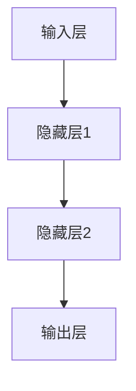
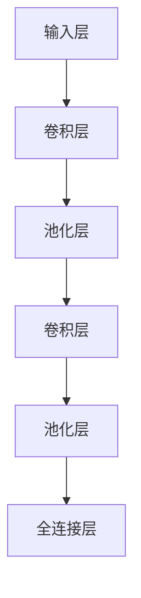
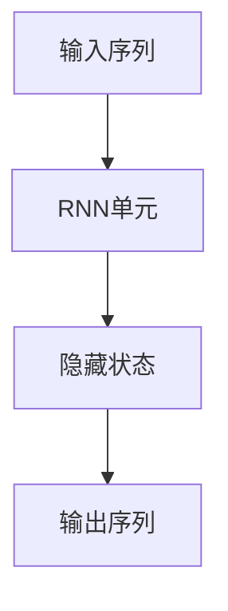
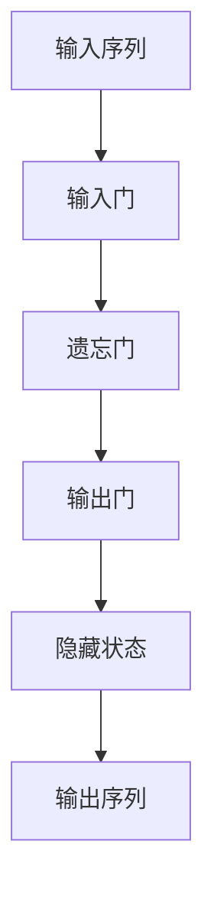
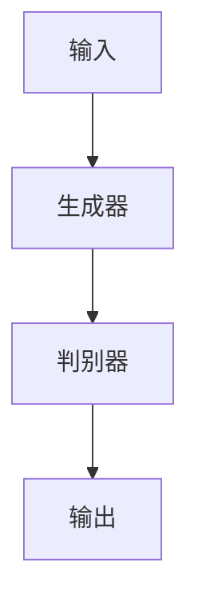

                 

### 第一部分：AI创业概述

#### 1.1 AI行业发展趋势

随着人工智能技术的飞速发展，AI已经成为全球科技创新的重要驱动力。根据市场研究机构的预测，全球AI市场规模将在未来几年内持续增长，预计到2025年将突破1万亿美元大关。这一趋势主要受以下几个因素的推动：

1. **技术突破**：深度学习、神经网络、强化学习等AI核心技术的不断进步，使得AI应用的范围和深度都在拓展。
2. **产业应用扩展**：从传统的制造业、金融业，到新兴的零售、医疗等领域，AI技术正在快速渗透并改变各个行业的运作模式。
3. **政策支持**：全球各国政府纷纷出台相关政策，鼓励AI技术的研究与应用，为创业者提供了良好的政策环境。
4. **资本投入增加**：风险投资、政府基金等资本持续涌入AI领域，为创业公司提供了充足的资金支持。

##### 1.1.1 从技术发展角度看AI产业的未来

从技术发展角度来看，AI产业的未来具有以下几个关键特征：

1. **智能化**：随着算法和硬件的进步，设备的智能化程度将进一步提升，从简单的自动化走向真正的智能化。
2. **跨界融合**：AI技术与物联网、5G、云计算等新兴技术的融合，将催生更多的跨行业应用和创新模式。
3. **个性化和定制化**：基于大数据和机器学习的技术，能够实现更精准的用户画像和个性化服务，满足消费者多样化的需求。
4. **伦理与法规**：随着AI技术的广泛应用，伦理问题和法律法规的制定也将成为产业发展的重要议题。

##### 1.1.2 从市场需求角度看AI的普及与应用

从市场需求角度来看，AI技术的普及与应用主要表现在以下几个方面：

1. **消费升级**：随着人们生活水平的提高，消费者对个性化、便捷化的服务需求日益增加，AI技术能够提供更好的用户体验。
2. **产业升级**：AI技术能够提高生产效率、降低成本、优化供应链，从而推动传统产业的转型升级。
3. **公共卫生**：在公共卫生领域，AI技术能够助力疾病预测、疫情监测和个性化治疗，提高公共卫生管理能力。
4. **安全与监管**：AI技术在安全监控、风险管理等方面有广泛应用，能够提高社会治安水平，保障国家安全。

#### 1.2 创业者在AI领域的机遇与挑战

##### 1.2.1 创业机会分析

在AI领域，创业者面临以下几大创业机会：

1. **AI技术研发**：随着AI技术的快速发展，针对特定应用场景的算法优化、模型训练等研发服务需求量大。
2. **AI平台搭建**：为企业提供AI应用平台，帮助中小企业快速部署AI技术，降低技术门槛。
3. **AI产品创新**：结合AI技术与现有产品，开发创新的AI产品，满足市场需求。
4. **AI解决方案**：为特定行业提供定制化的AI解决方案，提升行业效率和质量。

##### 1.2.2 创业挑战分析

然而，AI创业也面临一系列挑战：

1. **技术门槛**：AI技术涉及复杂的算法和大数据处理，对创业者来说，技术门槛较高。
2. **资金压力**：AI项目通常需要大量资金投入，尤其是在研发阶段，资金压力较大。
3. **市场竞争**：AI领域竞争激烈，新创业公司需要面对行业巨头和新兴竞争对手的双重压力。
4. **数据隐私与安全**：AI技术的广泛应用引发数据隐私和安全问题，如何确保用户数据的安全和隐私成为重要挑战。

##### 1.2.3 创业成功关键要素

为了在AI领域取得成功，创业者需要关注以下几个关键要素：

1. **技术创新**：持续的技术创新是AI创业公司的核心竞争力，需要不断优化算法、提高模型性能。
2. **市场定位**：明确市场定位，找到差异化竞争点，满足特定用户群体的需求。
3. **团队建设**：建立高效的团队，吸引和培养优秀的研发人才和市场营销人才。
4. **资本运作**：合理规划融资策略，确保项目资金充足，同时注意风险控制。
5. **战略规划**：制定清晰的战略规划，明确短期和长期目标，确保企业可持续发展。

### 第2章：AI技术基础

#### 2.1 AI核心概念与原理

##### 2.1.1 机器学习基础

机器学习是人工智能的核心技术之一，其基础概念包括监督学习、无监督学习和强化学习。以下是机器学习的一些核心概念和基本原理：

1. **监督学习**：监督学习是指利用已知输入和输出数据，通过学习算法来训练模型，使得模型能够对未知数据进行预测。常见的监督学习算法包括线性回归、决策树、支持向量机等。

   ```python
   # 伪代码：线性回归
   def linear_regression(X, y):
       # 计算斜率b和截距a
       b = (sum(y * X) - sum(X) * sum(y)) / (sum(X**2) - n * (sum(X))**2)
       a = (mean(y) - b * mean(X))
       return a, b
   ```

2. **无监督学习**：无监督学习是指在没有已知输出标签的情况下，通过学习算法自动发现数据中的结构和模式。常见的无监督学习算法包括聚类、主成分分析等。

   ```python
   # 伪代码：K-均值聚类
   def k_means_clustering(data, k):
       # 初始化K个中心点
       centroids = initialize_centroids(data, k)
       while not converged:
           # 计算每个数据点所属的簇
           clusters = assign_clusters(data, centroids)
           # 更新中心点
           centroids = update_centroids(clusters, k)
       return centroids
   ```

3. **强化学习**：强化学习是指通过不断与环境交互，学习最优策略以最大化长期回报。常见的强化学习算法包括Q学习、SARSA等。

   ```python
   # 伪代码：Q学习
   def q_learning(env, alpha, gamma):
       Q = initialize_q_values()
       for episode in range(num_episodes):
           state = env.reset()
           while not done:
               action = choose_action(Q, state)
               next_state, reward, done = env.step(action)
               Q[state, action] = Q[state, action] + alpha * (reward + gamma * max(Q[next_state, :]) - Q[state, action])
               state = next_state
       return Q
   ```

##### 2.1.2 深度学习原理

深度学习是机器学习的一个分支，其核心思想是通过构建深层神经网络来模拟人类大脑的神经元连接方式，实现对复杂数据的建模和预测。以下是深度学习的几个关键概念：

1. **神经网络**：神经网络是由多个神经元组成的计算模型，每个神经元都与其他神经元相连接，通过激活函数进行处理，最终产生输出。

   ```mermaid
   graph TD
       A[输入层] --> B[隐藏层1]
       B --> C[隐藏层2]
       C --> D[输出层]
       D --> E[损失函数]
       A --> F[激活函数]
   ```

2. **反向传播**：反向传播是一种用于训练神经网络的算法，通过计算损失函数对网络参数的梯度，并利用梯度下降法来调整参数，以最小化损失函数。

   ```python
   # 伪代码：反向传播算法
   def backward_propagation(network, X, y, learning_rate):
       # 计算损失函数的梯度
       gradients = compute_gradients(network, X, y)
       # 更新网络参数
       for layer in network.layers:
           for neuron in layer.neurons:
               neuron.weights -= learning_rate * neuron.gradient
   ```

3. **卷积神经网络（CNN）**：卷积神经网络是深度学习在图像处理领域的重要应用，通过卷积操作和池化操作，实现对图像的特征提取和分类。

   ```mermaid
   graph TD
       A[输入层] --> B[卷积层]
       B --> C[池化层]
       C --> D[卷积层]
       D --> E[池化层]
       E --> F[全连接层]
   ```

##### 2.1.3 自然语言处理基础

自然语言处理（NLP）是AI技术的重要应用领域，旨在使计算机能够理解和生成人类语言。以下是NLP的一些核心概念：

1. **词嵌入（Word Embedding）**：词嵌入是将词语映射到高维向量空间，通过向量表示来捕捉词语的语义信息。

   ```python
   # 伪代码：Word2Vec模型
   def word2vec(corpus, vector_size, window_size):
       # 计算词语的词嵌入向量
       for sentence in corpus:
           for word in sentence:
               context = get_context(word, window_size, corpus)
               for context_word in context:
                   update_embedding(word_embedding, word, context_word, vector_size)
       return word_embedding
   ```

2. **序列模型（Sequence Model）**：序列模型是处理序列数据（如文本、语音）的模型，常见的序列模型包括循环神经网络（RNN）和长短时记忆网络（LSTM）。

   ```mermaid
   graph TD
       A[输入序列] --> B[RNN单元]
       B --> C[输出序列]
   ```

3. **注意力机制（Attention Mechanism）**：注意力机制是一种在序列模型中用于捕捉长距离依赖关系的机制，通过动态调整模型对序列中不同部分的关注程度。

   ```mermaid
   graph TD
       A[输入序列] --> B[注意力层]
       B --> C[加权输出]
   ```

#### 2.2 常见AI算法与技术

AI领域包含多种算法和技术，以下列举几种常见的算法：

1. **监督学习算法**：监督学习算法包括线性回归、决策树、随机森林、支持向量机等，主要用于分类和回归任务。

   - **线性回归**：用于预测连续值，其基本公式为 \( y = wx + b \)。
   - **决策树**：通过划分特征空间，将数据划分为不同的区域，每个区域对应一个类别。
   - **随机森林**：通过构建多棵决策树，利用集成学习的方法提高模型的泛化能力。
   - **支持向量机**：通过找到一个最优的超平面，将数据划分为不同的类别。

2. **无监督学习算法**：无监督学习算法包括K-均值聚类、主成分分析、自编码器等，主要用于发现数据中的结构和模式。

   - **K-均值聚类**：通过迭代计算聚类中心，将数据点划分为K个簇。
   - **主成分分析**：通过线性变换，将数据投影到低维空间，保留主要特征。
   - **自编码器**：通过无监督学习方式，自动学习数据的编码和解码过程。

3. **强化学习算法**：强化学习算法包括Q学习、深度Q网络（DQN）、策略梯度等方法，主要用于决策问题和智能体控制。

   - **Q学习**：通过学习值函数，预测在不同状态下的最佳动作。
   - **DQN**：通过深度神经网络学习Q值，实现智能体的自主决策。
   - **策略梯度**：通过优化策略参数，直接最大化长期回报。

#### 2.3 AI技术选型与优化

在选择和优化AI技术时，需要考虑以下因素：

1. **任务需求**：根据具体的任务需求，选择合适的算法和技术。
2. **数据特性**：分析数据类型、规模和质量，选择适合的数据预处理和特征工程方法。
3. **计算资源**：考虑计算资源和硬件设备，选择适合的算法实现和优化策略。
4. **模型性能**：通过交叉验证和超参数调优，提高模型的性能和泛化能力。

### 第3章：商业模式创新方法论

#### 3.1 商业模式定义与分类

商业模式是指企业在特定市场环境中，通过产品、服务、客户关系和收益结构等方式，实现价值创造、传递和捕获的机制。以下是几种常见的商业模式分类：

1. **产品导向型商业模式**：以产品为核心，通过提供高质量的产品来满足市场需求，如苹果公司通过研发创新产品赢得市场。
2. **服务导向型商业模式**：以服务为核心，通过提供专业化的服务来满足客户需求，如咨询公司通过提供专业咨询服务获取收益。
3. **平台型商业模式**：以平台为核心，通过连接供需双方，提供交易和服务支持，如淘宝、京东等电商平台。
4. **订阅制商业模式**：通过提供持续的服务或产品，以订阅费用为主要收入来源，如Netflix、Spotify等。

#### 3.2 创新方法论与工具

在进行商业模式创新时，可以采用以下方法论和工具：

1. **商业模式画布（Business Model Canvas）**：商业模式画布是一种视觉化的工具，用于描述企业的商业模式。它包括9个核心要素：客户细分、价值主张、渠道、客户关系、收入来源、关键资源、关键活动、关键合作伙伴和成本结构。

2. **价值网络分析（Value Network Analysis）**：通过分析企业的价值网络，识别上下游合作伙伴、客户和竞争对手之间的关系，找到价值创造和传递的优化点。

3. **商业画布迭代法**：通过不断迭代和优化商业模式画布，验证和调整商业模式，以适应市场变化和客户需求。

#### 3.3 商业模式创新案例分析

以下是几个典型的商业模式创新案例：

1. **案例一：Airbnb的共享经济模式**：Airbnb通过搭建一个在线平台，将闲置的房屋资源与有需求的用户连接起来，实现共享住宿服务。其创新之处在于打破了传统的酒店行业壁垒，提供了一种灵活、个性化的住宿选择。

2. **案例二：滴滴出行的互联网+模式**：滴滴出行通过移动互联网技术，搭建了一个连接乘客和司机的平台，提供便捷的打车服务。其商业模式创新之处在于整合了线下资源，实现了在线交易和实时调度，提高了出行效率。

3. **案例三：拼多多的大数据驱动模式**：拼多多通过大数据分析，精准定位用户需求，提供个性化的购物推荐。其商业模式创新之处在于利用大数据技术，实现了供应链优化和精准营销，提高了用户满意度和复购率。

### 第4章：价值创造与价值捕获

#### 4.1 价值创造方法

价值创造是指企业在市场环境中通过产品、服务、技术等手段，为客户和社会创造价值的过程。以下是几种常见的方法：

1. **产品创新**：通过研发新技术、新产品，满足客户需求，如苹果公司通过不断推出创新产品，引领科技潮流。
2. **服务创新**：通过提供高质量、个性化的服务，提升客户体验，如特斯拉通过提供卓越的售后服务，赢得了客户的忠诚度。
3. **商业模式创新**：通过创新商业模式，优化价值创造和传递过程，如亚马逊通过电商模式，降低了交易成本，提升了购物体验。

#### 4.2 价值捕获策略

价值捕获是指企业通过产品、服务、商业模式等手段，将创造的价值转化为实际收益的过程。以下是几种常见的方法：

1. **直接收益**：通过销售产品、提供服务，直接获得收益，如苹果公司通过销售iPhone等设备，获取高额利润。
2. **间接收益**：通过建立品牌、提升市场份额，获得长期收益，如可口可乐通过品牌塑造，实现了长期的收益增长。
3. **商业模式创新**：通过创新商业模式，实现收益增长，如阿里巴巴通过电商模式，建立了庞大的商业帝国。

#### 4.3 成本控制与盈利模式

成本控制是确保企业盈利的重要手段，以下是几种常见的成本控制方法：

1. **成本分析**：通过分析成本结构，找出成本高企的原因，进行针对性控制。
2. **供应链优化**：通过优化供应链管理，降低采购成本和库存成本。
3. **人力资源管理**：通过优化人力资源配置，降低人力成本。

盈利模式是指企业实现收益的方式，以下是几种常见的盈利模式：

1. **产品销售**：通过销售产品获取收益，如华为通过销售手机、通讯设备等获取利润。
2. **服务收费**：通过提供专业服务获取收益，如律师事务所通过提供法律服务获取收费。
3. **广告收入**：通过广告获取收益，如Google、Facebook等通过在线广告获取巨大收益。
4. **订阅模式**：通过订阅服务获取收益，如Spotify、Netflix等通过订阅模式获取稳定收入。

### 第5章：市场定位与竞争策略

#### 5.1 市场定位方法

市场定位是指企业根据市场需求和自身优势，确定产品或服务在市场中的位置。以下是几种常见的方法：

1. **差异化定位**：通过提供独特的价值主张，满足特定客户群体的需求，如苹果公司通过高端品牌定位，吸引了高端消费者。
2. **集中定位**：专注于特定市场细分，通过专业化服务赢得市场份额，如海底捞专注于火锅服务，赢得了消费者的口碑。
3. **领导定位**：成为市场领导者，通过品牌、技术、规模等优势，占据市场主导地位，如可口可乐在饮料市场中的领导地位。

#### 5.2 竞争策略分析

竞争策略是指企业在市场竞争中，通过战略手段获取竞争优势的方法。以下是几种常见的竞争策略：

1. **成本领先策略**：通过降低成本，提供具有竞争力的价格，获得市场份额，如华为通过规模化生产，实现了低成本优势。
2. **差异化策略**：通过提供独特的产品或服务，满足客户差异化需求，如特斯拉通过电动车差异化，吸引了环保意识强的消费者。
3. **集中策略**：专注于特定市场细分，通过专业化服务获取市场份额，如携程专注于在线旅行预订市场。

#### 5.3 品牌建设与营销策略

品牌建设是指企业通过品牌定位、品牌传播等手段，提升品牌知名度和美誉度。以下是几种常见的品牌建设策略：

1. **品牌定位**：明确品牌的价值主张和目标客户群体，如麦当劳通过“家庭、欢笑、美味”的品牌定位，吸引了广大消费者。
2. **品牌传播**：通过广告、公关活动、社交媒体等手段，提升品牌知名度，如可口可乐通过全球性广告活动，提升了品牌影响力。
3. **品牌体验**：通过提供卓越的产品和服务，提升客户满意度，增强品牌忠诚度，如苹果公司通过提供优质的售后服务，赢得了消费者的信任。

营销策略是指企业通过市场调研、定位、推广等手段，实现产品或服务销售的方法。以下是几种常见的营销策略：

1. **市场调研**：通过市场调研，了解客户需求和市场动态，制定合适的营销策略。
2. **定位策略**：根据市场定位，确定产品或服务的差异化优势，制定有针对性的营销方案。
3. **推广策略**：通过广告、公关活动、线上线下活动等手段，提升产品或服务的知名度和销量。

### 第6章：组织结构与人才战略

#### 6.1 组织结构设计

组织结构是指企业内部各部门和员工的分工、协作关系和组织形式。以下是几种常见的组织结构类型：

1. **职能型组织结构**：按照职能划分部门，各部门专注于特定职能，如市场营销部、研发部、人力资源部等。
2. **事业部型组织结构**：按照产品线或业务领域划分部门，每个部门负责一个或多个业务领域，如家电事业部、手机事业部等。
3. **矩阵型组织结构**：在职能型和事业部型基础上，增加跨部门协作，如项目经理制、跨部门团队合作等。

组织结构设计的原则包括：

1. **明确职责**：确保每个员工明确自己的职责和工作目标。
2. **高效协作**：建立有效的沟通和协作机制，提高团队工作效率。
3. **灵活适应**：组织结构应具备灵活性，能够适应市场变化和企业发展战略。

#### 6.2 人才招聘与培养

人才招聘是指企业通过招聘活动，选拔合适的人才进入企业。以下是几种常见的人才招聘策略：

1. **内部招聘**：通过内部晋升、内部调动等方式选拔人才，如华为通过内部招聘选拔高管。
2. **外部招聘**：通过社会招聘、猎头招聘等方式引进外部人才，如谷歌通过外部招聘吸引顶尖人才。
3. **校园招聘**：通过校园招聘选拔优秀毕业生，如百度通过校园招聘吸纳新鲜血液。

人才培养是指企业通过培训、指导、激励等手段，提升员工能力和素质。以下是几种常见的人才培养方法：

1. **内部培训**：通过内部培训课程，提升员工专业技能和管理能力，如阿里巴巴的“阿里学院”。
2. **外部培训**：通过外部培训课程，拓展员工视野，提升综合素质，如华为的海外培训项目。
3. **导师制度**：通过导师制度，让有经验的员工指导新员工，提升新员工的工作能力。

#### 6.3 团队协作与文化建设

团队协作是指团队成员通过共同合作，实现团队目标和任务的过程。以下是几种常见的团队协作方法：

1. **目标导向**：明确团队目标，确保团队成员共同努力，实现目标。
2. **沟通协作**：建立有效的沟通机制，确保团队成员能够及时交流信息，共同解决问题。
3. **激励机制**：通过激励措施，激发团队成员的工作积极性和创造力。

企业文化是指企业在长期发展过程中形成的价值观、行为准则和管理理念。以下是几种常见的企业文化建设方法：

1. **价值观传播**：通过企业文化宣传、培训等手段，传播企业的核心价值观，如华为的“客户至上”价值观。
2. **制度建设**：建立完善的制度体系，确保企业文化能够落地实施，如腾讯的“竞争、创新、协同”制度。
3. **文化活动**：通过举办企业文化活动，增强员工对企业的认同感和归属感，如阿里巴巴的“年会”活动。

### 第7章：风险管理与融资策略

#### 7.1 创业公司常见风险分析

创业公司在发展过程中会面临多种风险，以下是几种常见的风险：

1. **技术风险**：包括技术研发失败、技术落后、知识产权侵犯等，可能导致项目无法按期完成或市场竞争力下降。
2. **市场风险**：包括市场需求变化、市场竞争加剧、客户流失等，可能导致企业市场份额下降或营收下滑。
3. **财务风险**：包括资金短缺、成本控制不当、投资回报周期长等，可能导致企业财务状况恶化或破产。
4. **运营风险**：包括供应链管理不善、生产效率低下、管理混乱等，可能导致企业运营成本上升或服务质量下降。
5. **法律风险**：包括法律法规变化、合同纠纷、知识产权侵权等，可能导致企业面临法律诉讼或罚款。

#### 7.2 风险管理方法与工具

为了有效管理风险，创业公司可以采用以下方法和工具：

1. **风险评估**：通过风险识别、风险分析、风险评价等步骤，对企业的风险进行系统评估，确定风险的重要性和影响程度。
2. **风险控制**：通过制定风险管理策略、实施风险控制措施、建立风险预警机制等手段，降低风险发生的概率和影响程度。
3. **风险分散**：通过多元化经营、投资组合等手段，分散风险，降低单一风险对企业的影响。
4. **风险转移**：通过购买保险、签订合同等方式，将风险转移给第三方，降低企业承担的风险。

#### 7.3 融资策略与案例分析

创业公司的融资策略对于企业的生存和发展至关重要，以下是几种常见的融资策略：

1. **天使融资**：通过个人投资者或天使投资机构提供资金，主要用于产品研发和市场推广。
2. **风险投资**：通过风险投资机构提供资金，通常用于企业发展壮大，提高市场竞争力和盈利能力。
3. **股权融资**：通过发行股票或股权众筹等方式融资，扩大企业资本规模，提高企业估值。
4. **债务融资**：通过银行贷款、发行债券等方式融资，用于企业日常运营或大型项目投资。

以下是几个典型的融资案例分析：

1. **案例一：滴滴出行**：滴滴出行通过多轮融资，获得了多家知名风险投资机构的资金支持，实现了快速发展，成为中国最大的移动出行平台。
2. **案例二：美团点评**：美团点评通过多次股权融资，吸引了大量投资，成功在香港交易所上市，成为中国互联网企业的代表之一。
3. **案例三：字节跳动**：字节跳动通过股权融资和债务融资，获得了足够的资金支持，快速发展成为全球知名的互联网科技公司。

### 第8章：AI创业公司案例解析

#### 8.1 案例一：公司A的成功路径

公司A是一家专注于AI医疗影像诊断的创业公司。以下是公司A的成功路径：

1. **业务模式**：公司A的业务模式主要包括两个部分：一是提供AI辅助诊断系统，帮助医院提高诊断效率和准确性；二是提供远程诊断服务，为偏远地区医院提供高质量的诊断支持。

2. **商业模式创新**：公司A通过以下方式实现了商业模式创新：
   - **数据驱动**：公司A与多家医院合作，获取海量高质量的医疗影像数据，利用AI技术进行训练和优化，提高诊断系统的准确性。
   - **远程服务**：公司A开发了远程诊断平台，通过互联网技术，为偏远地区医院提供高质量的诊断服务，实现了医疗资源的共享。
   - **B2B2C模式**：公司A通过与医院合作，向医院销售诊断系统，同时向医院的患者提供远程诊断服务，实现了商业闭环。

3. **商业模式成功因素**：
   - **技术创新**：公司A在AI医疗影像诊断领域具有领先的技术优势，通过不断优化算法和模型，提高了诊断系统的准确性。
   - **市场定位**：公司A明确市场定位，专注于医疗领域，通过提供高质量的诊断服务，赢得了医院的信任和支持。
   - **团队建设**：公司A拥有一支由顶尖科学家和工程师组成的团队，确保了技术的持续创新和项目的顺利实施。

#### 8.2 案例二：公司B的转型之路

公司B最初是一家传统制造业企业，后来转型为AI驱动型公司。以下是公司B的转型之路：

1. **创业历程**：公司B在传统制造业领域有一定的基础，但随着市场竞争的加剧，公司B意识到需要通过技术创新来提高竞争力。于是，公司B开始布局AI领域，进行战略转型。

2. **转型策略**：
   - **内部创新**：公司B建立了内部创新实验室，吸引了一批优秀的AI研发人员，开展AI技术研究和产品开发。
   - **外部合作**：公司B与多家科研机构和高校建立了合作关系，共同进行AI技术研究，提高技术实力。
   - **产业链整合**：公司B通过收购和合作，整合了上下游产业链资源，形成了完整的AI产业链。

3. **转型成果**：
   - **产品多样化**：公司B开发了多种AI产品，包括智能机器人、智能制造系统等，广泛应用于制造业、服务业等领域。
   - **市场拓展**：公司B通过国内和国外市场拓展，实现了业务的全球化布局，提高了市场竞争力。
   - **业绩增长**：公司B实现了业绩的持续增长，净利润逐年增加，成功实现了从传统制造业向AI驱动型企业的转型。

#### 8.3 案例三：公司C的创新实践

公司C是一家专注于智能安防领域的创业公司。以下是公司C的创新实践：

1. **业务模式**：公司C的业务模式主要包括两个部分：一是提供智能安防产品，如智能摄像头、人脸识别系统等；二是提供智能安防解决方案，为城市、社区、企业等提供定制化的安防服务。

2. **商业模式创新**：
   - **数据共享**：公司C与政府、企业等合作伙伴建立了数据共享平台，实现了数据的互联互通，提高了安防系统的准确性和效率。
   - **服务多样化**：公司C开发了多种服务模式，包括监控报警服务、智能分析服务、应急响应服务等，满足了不同客户的需求。
   - **B2B2C模式**：公司C通过与政府和企业合作，为个人用户提供智能安防服务，实现了商业闭环。

3. **商业模式成功因素**：
   - **技术创新**：公司C在智能安防领域具有领先的技术优势，通过不断优化算法和硬件，提高了产品的性能和可靠性。
   - **市场定位**：公司C明确市场定位，专注于智能安防领域，通过提供高质量的产品和服务，赢得了客户的信任和支持。
   - **团队建设**：公司C拥有一支由顶尖科学家和工程师组成的团队，确保了技术的持续创新和项目的顺利实施。

### 第9章：商业模式创新实践指南

#### 9.1 实践指南与建议

在商业模式创新过程中，创业者需要关注以下几个方面：

1. **市场调研**：深入了解市场需求和竞争状况，找准市场定位，明确目标客户群体。
2. **价值主张**：明确产品或服务的独特价值，满足客户需求，形成差异化竞争优势。
3. **盈利模式**：设计合理的盈利模式，确保企业能够持续盈利。
4. **资源整合**：整合内外部资源，提高资源利用效率，降低运营成本。
5. **持续迭代**：根据市场反馈，不断调整和优化商业模式，实现持续创新。

以下是具体的实践指南和建议：

1. **市场调研**：通过问卷调查、用户访谈、市场分析等方式，深入了解市场需求和竞争状况，找出潜在的商业机会。
2. **价值主张**：明确产品或服务的核心价值，通过简明扼要的方式传达给客户，形成差异化竞争优势。
3. **盈利模式**：设计多样化的盈利模式，如产品销售、服务收费、广告收入等，确保企业能够实现盈利。
4. **资源整合**：通过战略合作、联盟等方式，整合内外部资源，提高资源利用效率，降低运营成本。
5. **持续迭代**：根据市场反馈，不断调整和优化商业模式，实现持续创新，确保企业的可持续发展。

#### 9.2 成功案例的经验与教训

以下是几个成功的商业模式创新案例，以及它们的经验和教训：

1. **案例一：Airbnb**  
   - **经验**：Airbnb通过共享经济模式，实现了闲置资源的最大化利用，为消费者提供了个性化的住宿选择。经验在于找准市场需求，创新商业模式，实现资源的优化配置。
   - **教训**：在快速扩张过程中，Airbnb面临着法规风险、用户体验下降等问题。教训在于，在扩张过程中，要充分考虑法规风险，确保用户体验，避免盲目扩张。

2. **案例二：滴滴出行**  
   - **经验**：滴滴出行通过互联网技术，实现了传统出租车行业的升级，为消费者提供了便捷的出行服务。经验在于，抓住技术创新的机遇，实现行业变革，提升用户体验。
   - **教训**：在市场扩张过程中，滴滴出行面临着安全、合规等挑战。教训在于，要充分考虑合规性和安全性问题，确保用户权益，避免因安全问题导致声誉受损。

3. **案例三：拼多多**  
   - **经验**：拼多多通过社交电商模式，实现了低成本快速扩张，为消费者提供了性价比高的商品。经验在于，找准市场需求，创新商业模式，提升用户体验，实现快速成长。
   - **教训**：在市场扩张过程中，拼多多面临着假货、用户体验下降等问题。教训在于，要确保商品质量，提升用户体验，避免因质量问题导致声誉受损。

#### 9.3 创业者如何抓住AI商业机会

在AI领域，创业者可以抓住以下几种商业机会：

1. **技术创新**：在AI算法、硬件、软件等方面进行技术创新，开发具有竞争力的AI产品和服务。
2. **行业应用**：将AI技术应用于各个行业，如医疗、金融、零售等，提供定制化的解决方案。
3. **平台搭建**：搭建AI平台，为中小企业提供AI应用服务，降低技术门槛，扩大市场影响力。
4. **数据服务**：提供高质量的数据服务，如数据清洗、数据分析和数据交易等，满足企业和研究机构的个性化需求。

以下是具体的建议：

1. **市场调研**：深入了解市场需求和竞争状况，找准细分市场，明确目标客户群体。
2. **技术创新**：持续进行AI技术研发，提高算法和硬件的性能，实现技术领先。
3. **行业应用**：结合行业特点和需求，开发具有行业特色的AI产品和服务。
4. **平台搭建**：搭建便捷、高效的AI平台，提供一站式服务，降低客户使用门槛。
5. **数据服务**：提供高质量的数据服务，满足企业和研究机构的个性化需求，提升市场竞争力。

### 附录：参考资料与推荐阅读

为了帮助读者深入了解AI创业公司的商业模式创新，以下是一些参考资料和推荐阅读：

1. **AI技术相关书籍**：
   - 《深度学习》（Deep Learning）——Ian Goodfellow、Yoshua Bengio、Aaron Courville著
   - 《人工智能：一种现代的方法》（Artificial Intelligence: A Modern Approach）——Stuart J. Russell、Peter Norvig著

2. **商业模式相关书籍**：
   - 《商业模式新生代》（Business Model Generation）——Alexander Osterwalder、Yves Pigneur著
   - 《蓝海战略》（Blue Ocean Strategy）——W. Chan Kim、Renée Mauborgne著

3. **创业者必读书籍**：
   - 《创业维艰》（Hard Things About Hard Things）——Ben Horowitz著
   - 《创业的本质》（The Lean Startup）——Eric Ries著

4. **AI创业社区与平台**：
   - AI Community（https://aichannel.ai/）
   - AI Summit（https://aisummit.ai/）

通过以上参考资料和推荐阅读，读者可以更全面地了解AI创业公司的商业模式创新，为实际操作提供有益的指导。


### 《AI创业公司的商业模式创新路径》

关键词：(AI创业、商业模式、创新路径、商业画布、市场定位、竞争策略)

摘要：本文深入探讨了AI创业公司的商业模式创新路径，从技术发展、市场需求、商业模式创新方法论、价值创造与价值捕获、市场定位与竞争策略、组织结构与人才战略、风险管理与融资策略等方面进行了全面剖析。通过案例解析和实战指南，为AI创业者提供了切实可行的商业模式创新思路和策略。

#### 第一部分：AI创业概述

##### 1.1 AI行业发展趋势

AI技术作为当前科技发展的前沿领域，正日益成为推动产业变革和社会进步的重要力量。从技术突破到产业应用扩展，AI行业的发展呈现出以下几个显著趋势：

**技术突破**：随着深度学习、强化学习等AI核心技术的不断发展，算法性能和计算能力得到了大幅提升。例如，深度学习技术在图像识别、自然语言处理等领域取得了显著突破，使得AI应用更加精准和高效。

**产业应用扩展**：AI技术的应用场景越来越广泛，从传统的制造业、金融业，到新兴的零售、医疗、教育等领域，AI技术正在快速渗透并改变各个行业的运作模式。例如，在制造业中，AI技术被广泛应用于生产线的自动化和优化；在医疗领域，AI技术助力疾病诊断、药物研发和健康管理。

**市场规模增长**：随着AI技术的不断成熟和应用场景的扩展，全球AI市场规模也在持续增长。据市场研究机构的预测，未来几年内，全球AI市场规模将保持高速增长，预计到2025年将突破1万亿美元大关。

**行业变革加速**：AI技术的快速发展推动了行业的变革，传统产业正在被重新定义和改造。例如，自动驾驶技术的兴起正在颠覆传统的交通运输行业，智能家居技术正在改变人们的日常生活。这些变革不仅带来了新的商业机会，也对传统商业模式提出了挑战。

**新兴创业机遇**：随着AI技术的普及和应用，新兴创业公司不断涌现。创业者可以通过开发创新的AI产品和服务，满足市场的新需求，从而抓住AI技术带来的创业机遇。例如，AI医疗影像诊断、智能安防、智能客服等领域都为创业者提供了广阔的创业空间。

##### 1.1.1 从技术发展角度看AI产业的未来

从技术发展的角度来看，AI产业的未来将具有以下几个关键特征：

**智能化**：随着AI技术的不断进步，设备和系统的智能化程度将得到显著提升。从简单的自动化走向真正的智能化，AI系统将能够自主学习和决策，提高生产效率和智能化水平。

**跨界融合**：AI技术与物联网、5G、云计算等新兴技术的融合，将催生更多的跨行业应用和创新模式。例如，AI与物联网技术的融合将带来智能家居、智能城市等新业态；AI与5G技术的融合将推动自动驾驶、远程医疗等应用的发展。

**个性化和定制化**：基于大数据和机器学习的技术，能够实现更精准的用户画像和个性化服务，满足消费者多样化的需求。例如，AI技术在零售业中的应用，可以实现个性化推荐，提高购物体验。

**伦理与法规**：随着AI技术的广泛应用，伦理问题和法律法规的制定也将成为产业发展的重要议题。如何确保AI技术的公正性、透明性和安全性，将成为行业面临的重要挑战。

##### 1.1.2 从市场需求角度看AI的普及与应用

从市场需求的角度来看，AI技术的普及与应用主要表现在以下几个方面：

**消费升级**：随着人们生活水平的提高，消费者对个性化、便捷化的服务需求日益增加。AI技术能够提供更好的用户体验，满足消费者对高品质生活的追求。例如，智能家居系统提供了更加智能化的家居体验，智能客服提供了更加高效的客户服务。

**产业升级**：AI技术能够提高生产效率、降低成本、优化供应链，从而推动传统产业的转型升级。例如，在制造业中，AI技术被广泛应用于生产线的自动化和优化，提高了生产效率和产品质量；在金融领域，AI技术被广泛应用于风险管理、客户服务等方面，提高了金融服务的效率和准确性。

**公共卫生**：在公共卫生领域，AI技术能够助力疾病预测、疫情监测和个性化治疗，提高公共卫生管理能力。例如，AI技术可以用于疾病早期诊断和预测，帮助医疗机构更好地应对疫情；AI技术还可以用于个性化治疗方案的制定，提高治疗效果。

**安全与监管**：AI技术在安全监控、风险管理等方面有广泛应用，能够提高社会治安水平，保障国家安全。例如，AI技术可以用于人脸识别、行为分析等，提高公共安全监控的准确性和效率；AI技术还可以用于金融欺诈检测、网络安全防护等方面，提高安全防护能力。

##### 1.2 创业者在AI领域的机遇与挑战

在AI领域，创业者面临以下几大创业机会：

**AI技术研发**：随着AI技术的快速发展，针对特定应用场景的算法优化、模型训练等研发服务需求量大。创业者可以专注于AI技术研发，开发创新的算法和模型，提供高质量的技术解决方案。

**AI平台搭建**：为企业提供AI应用平台，帮助中小企业快速部署AI技术，降低技术门槛。创业者可以搭建AI平台，提供一站式服务，包括算法开发、模型训练、数据存储等，帮助企业实现智能化转型。

**AI产品创新**：结合AI技术与现有产品，开发创新的AI产品，满足市场需求。创业者可以开发智能硬件、智能软件等AI产品，如智能手表、智能家居设备、智能安防系统等，提供更好的用户体验。

**AI解决方案**：为特定行业提供定制化的AI解决方案，提升行业效率和质量。创业者可以针对特定行业的需求，提供个性化的AI解决方案，如医疗影像诊断、智能客服系统、智能供应链管理等，帮助行业实现智能化升级。

然而，AI创业也面临一系列挑战：

**技术门槛**：AI技术涉及复杂的算法和大数据处理，对创业者来说，技术门槛较高。创业者需要具备扎实的AI技术背景和研发能力，才能在激烈的市场竞争中脱颖而出。

**资金压力**：AI项目通常需要大量资金投入，尤其是在研发阶段，资金压力较大。创业者需要寻找合适的融资渠道，确保项目资金充足，同时注意资金使用效率。

**市场竞争**：AI领域竞争激烈，新创业公司需要面对行业巨头和新兴竞争对手的双重压力。创业者需要找准市场定位，打造差异化的产品和服务，提高市场竞争力。

**数据隐私与安全**：AI技术的广泛应用引发数据隐私和安全问题，如何确保用户数据的安全和隐私成为重要挑战。创业者需要在数据收集、存储、处理等环节采取有效的安全措施，保护用户隐私。

##### 1.2.1 创业机会分析

在AI领域，创业者可以抓住以下几大创业机会：

**技术创新**：随着AI技术的不断发展，创业者可以通过研发创新算法、开发新型AI应用，满足市场需求。例如，针对特定场景的深度学习模型、智能语音识别系统等，都是值得探索的创新方向。

**平台服务**：创业者可以搭建AI平台，为中小企业提供一站式的AI服务，降低企业应用AI技术的门槛。例如，提供数据清洗、模型训练、API接口等平台服务，帮助企业快速实现智能化转型。

**垂直应用**：创业者可以针对特定行业提供定制化的AI解决方案，解决行业痛点。例如，在医疗领域，可以开发AI辅助诊断系统；在零售领域，可以提供智能库存管理和推荐系统。

**数据服务**：创业者可以提供高质量的数据服务，如数据清洗、数据分析和数据交易等，满足企业和研究机构的个性化需求。例如，开发数据挖掘工具、提供行业数据报告等。

**硬件开发**：创业者可以开发智能硬件产品，如智能机器人、智能家居设备等，提供创新的硬件解决方案。例如，开发智能门锁、智能摄像头等，满足用户对智能家居的需求。

##### 1.2.2 创业挑战分析

尽管AI领域充满机遇，但创业者也面临着诸多挑战：

**技术门槛**：AI技术涉及复杂的算法和大数据处理，对创业者的技术背景和研发能力有较高要求。创业者需要不断学习和积累技术知识，才能在市场中脱颖而出。

**资金压力**：AI项目通常需要大量资金投入，尤其在研发阶段，资金压力更大。创业者需要寻找合适的融资渠道，确保项目资金充足，同时注意资金的使用效率。

**市场竞争**：AI领域竞争激烈，创业者需要面对行业巨头和新兴竞争对手的双重压力。创业者需要找准市场定位，打造差异化的产品和服务，提高市场竞争力。

**数据隐私与安全**：AI技术的广泛应用引发数据隐私和安全问题，创业者需要确保用户数据的安全和隐私。在数据收集、存储、处理等环节，创业者需要采取有效的安全措施，保护用户隐私。

**法律法规**：随着AI技术的快速发展，相关法律法规也在不断完善。创业者需要关注法律法规的变化，确保企业合规运营，避免法律风险。

##### 1.2.3 创业成功关键要素

为了在AI领域取得成功，创业者需要关注以下几个关键要素：

**技术创新**：持续的技术创新是AI创业公司的核心竞争力。创业者需要不断优化算法、提高模型性能，以满足市场需求。

**市场定位**：明确市场定位，找到差异化竞争点，满足特定用户群体的需求。创业者需要深入理解市场需求，找准切入点。

**团队建设**：建立高效的团队，吸引和培养优秀的研发人才和市场营销人才。创业者需要重视团队建设，打造一支有战斗力的团队。

**资本运作**：合理规划融资策略，确保项目资金充足，同时注意风险控制。创业者需要掌握融资技巧，充分利用资本市场。

**战略规划**：制定清晰的战略规划，明确短期和长期目标，确保企业可持续发展。创业者需要具备战略眼光，引领企业稳步发展。

#### 第2章：AI技术基础

##### 2.1 AI核心概念与原理

AI（人工智能）是一种通过计算机系统模拟人类智能的技术，旨在让机器能够执行复杂的任务，如感知、学习、推理、决策等。以下是AI的一些核心概念与原理：

**机器学习**：机器学习是AI的核心技术之一，它通过数据训练模型，使模型能够对未知数据进行预测或分类。机器学习分为三种主要类型：监督学习、无监督学习和强化学习。

- **监督学习**：监督学习是指利用已知输入和输出数据，通过学习算法来训练模型，使得模型能够对未知数据进行预测。常见的监督学习算法包括线性回归、决策树、支持向量机等。

  ```python
  # 伪代码：线性回归
  def linear_regression(X, y):
      # 计算斜率b和截距a
      b = (sum(y * X) - sum(X) * sum(y)) / (sum(X**2) - n * (sum(X))**2)
      a = (mean(y) - b * mean(X))
      return a, b
  ```

- **无监督学习**：无监督学习是指在没有已知输出标签的情况下，通过学习算法自动发现数据中的结构和模式。常见的无监督学习算法包括聚类、主成分分析等。

  ```python
  # 伪代码：K-均值聚类
  def k_means_clustering(data, k):
      # 初始化K个中心点
      centroids = initialize_centroids(data, k)
      while not converged:
          # 计算每个数据点所属的簇
          clusters = assign_clusters(data, centroids)
          # 更新中心点
          centroids = update_centroids(clusters, k)
      return centroids
  ```

- **强化学习**：强化学习是指通过不断与环境交互，学习最优策略以最大化长期回报。常见的强化学习算法包括Q学习、深度Q网络（DQN）、策略梯度等。

  ```python
  # 伪代码：Q学习
  def q_learning(env, alpha, gamma):
      Q = initialize_q_values()
      for episode in range(num_episodes):
          state = env.reset()
          while not done:
              action = choose_action(Q, state)
              next_state, reward, done = env.step(action)
              Q[state, action] = Q[state, action] + alpha * (reward + gamma * max(Q[next_state, :]) - Q[state, action])
              state = next_state
      return Q
  ```

**深度学习**：深度学习是一种基于多层神经网络的学习方法，通过模拟人类大脑的神经网络结构，实现对复杂数据的建模和预测。以下是深度学习的一些核心概念：

- **神经网络**：神经网络是由多个神经元组成的计算模型，每个神经元都与其他神经元相连接，通过激活函数进行处理，最终产生输出。

  ```mermaid
  graph TD
      A[输入层] --> B[隐藏层1]
      B --> C[隐藏层2]
      C --> D[输出层]
      D --> E[损失函数]
      A --> F[激活函数]
  ```

- **反向传播**：反向传播是一种用于训练神经网络的算法，通过计算损失函数对网络参数的梯度，并利用梯度下降法来调整参数，以最小化损失函数。

  ```python
  # 伪代码：反向传播算法
  def backward_propagation(network, X, y, learning_rate):
      # 计算损失函数的梯度
      gradients = compute_gradients(network, X, y)
      # 更新网络参数
      for layer in network.layers:
          for neuron in layer.neurons:
              neuron.weights -= learning_rate * neuron.gradient
  ```

- **卷积神经网络（CNN）**：卷积神经网络是深度学习在图像处理领域的重要应用，通过卷积操作和池化操作，实现对图像的特征提取和分类。

  ```mermaid
  graph TD
      A[输入层] --> B[卷积层]
      B --> C[池化层]
      C --> D[卷积层]
      D --> E[池化层]
      E --> F[全连接层]
  ```

**自然语言处理（NLP）**：自然语言处理是AI的重要应用领域，旨在使计算机能够理解和生成人类语言。以下是NLP的一些核心概念：

- **词嵌入（Word Embedding）**：词嵌入是将词语映射到高维向量空间，通过向量表示来捕捉词语的语义信息。

  ```python
  # 伪代码：Word2Vec模型
  def word2vec(corpus, vector_size, window_size):
      # 计算词语的词嵌入向量
      for sentence in corpus:
          for word in sentence:
              context = get_context(word, window_size, corpus)
              for context_word in context:
                  update_embedding(word_embedding, word, context_word, vector_size)
      return word_embedding
  ```

- **序列模型（Sequence Model）**：序列模型是处理序列数据（如文本、语音）的模型，常见的序列模型包括循环神经网络（RNN）和长短时记忆网络（LSTM）。

  ```mermaid
  graph TD
      A[输入序列] --> B[RNN单元]
      B --> C[输出序列]
  ```

- **注意力机制（Attention Mechanism）**：注意力机制是一种在序列模型中用于捕捉长距离依赖关系的机制，通过动态调整模型对序列中不同部分的关注程度。

  ```mermaid
  graph TD
      A[输入序列] --> B[注意力层]
      B --> C[加权输出]
  ```

##### 2.1.1 机器学习基础

机器学习是AI领域的核心技术之一，其基础概念包括监督学习、无监督学习和强化学习。以下是机器学习的一些核心概念和基本原理：

**监督学习**：监督学习是指利用已知输入和输出数据，通过学习算法来训练模型，使得模型能够对未知数据进行预测。常见的监督学习算法包括线性回归、决策树、支持向量机等。

- **线性回归**：线性回归是一种用于预测连续值的监督学习算法，其基本公式为 \( y = wx + b \)。

  ```python
  # 伪代码：线性回归
  def linear_regression(X, y):
      # 计算斜率b和截距a
      b = (sum(y * X) - sum(X) * sum(y)) / (sum(X**2) - n * (sum(X))**2)
      a = (mean(y) - b * mean(X))
      return a, b
  ```

- **决策树**：决策树是一种用于分类和回归任务的监督学习算法，通过划分特征空间，将数据划分为不同的区域，每个区域对应一个类别。

  ```mermaid
  graph TD
      A[输入数据] --> B[划分条件]
      B --> C[区域1]
      C --> D[分类/回归结果]
      B --> E[区域2]
      E --> F[分类/回归结果]
  ```

- **支持向量机**：支持向量机是一种用于分类的监督学习算法，通过找到一个最优的超平面，将数据划分为不同的类别。

  ```python
  # 伪代码：支持向量机
  def support_vector_machine(X, y):
      # 计算最优超平面
      w, b = compute_hyperplane(X, y)
      # 预测新数据
      def predict(x):
          return (np.dot(x, w) + b) > 0
      return predict
  ```

**无监督学习**：无监督学习是指在没有已知输出标签的情况下，通过学习算法自动发现数据中的结构和模式。常见的无监督学习算法包括聚类、主成分分析等。

- **聚类**：聚类是一种无监督学习方法，通过将数据点划分为不同的簇，使同一簇内的数据点之间距离较短，而不同簇的数据点之间距离较长。

  ```python
  # 伪代码：K-均值聚类
  def k_means_clustering(data, k):
      # 初始化K个中心点
      centroids = initialize_centroids(data, k)
      while not converged:
          # 计算每个数据点所属的簇
          clusters = assign_clusters(data, centroids)
          # 更新中心点
          centroids = update_centroids(clusters, k)
      return centroids
  ```

- **主成分分析**：主成分分析是一种用于降维和特征提取的无监督学习方法，通过将数据投影到新的空间，保留主要特征，减少冗余信息。

  ```python
  # 伪代码：主成分分析
  def principal_component_analysis(data, n_components):
      # 计算协方差矩阵
      covariance_matrix = compute_covariance_matrix(data)
      # 计算特征值和特征向量
      eigenvalues, eigenvectors = compute_eigenvalues_eigenvectors(covariance_matrix)
      # 选择n_components个最大的特征值对应的特征向量
      principal_components = select_eigenvectors(eigenvectors, n_components)
      return principal_components
  ```

**强化学习**：强化学习是一种通过不断与环境交互，学习最优策略以最大化长期回报的算法。常见的强化学习算法包括Q学习、深度Q网络（DQN）、策略梯度等。

- **Q学习**：Q学习是一种基于值函数的强化学习算法，通过学习值函数，预测在不同状态下的最佳动作。

  ```python
  # 伪代码：Q学习
  def q_learning(env, alpha, gamma):
      Q = initialize_q_values()
      for episode in range(num_episodes):
          state = env.reset()
          while not done:
              action = choose_action(Q, state)
              next_state, reward, done = env.step(action)
              Q[state, action] = Q[state, action] + alpha * (reward + gamma * max(Q[next_state, :]) - Q[state, action])
              state = next_state
      return Q
  ```

- **深度Q网络（DQN）**：DQN是一种基于深度学习的强化学习算法，通过神经网络学习Q值，实现智能体的自主决策。

  ```python
  # 伪代码：深度Q网络（DQN）
  def deep_q_network(env, model, optimizer, alpha, gamma, epsilon):
      # 训练深度Q网络
      for episode in range(num_episodes):
          state = env.reset()
          while not done:
              action = choose_action(model, state, epsilon)
              next_state, reward, done = env.step(action)
              target = reward + gamma * max(model(next_state))
              model.loss(target - model(state)[action])
              optimizer.step()
              state = next_state
  ```

- **策略梯度**：策略梯度是一种基于策略优化的强化学习算法，通过优化策略参数，直接最大化长期回报。

  ```python
  # 伪代码：策略梯度
  def policy_gradient(policy, model, optimizer, reward, gamma):
      # 计算策略梯度
      gradients = compute_gradients(policy, model, reward, gamma)
      # 更新策略参数
      optimizer.apply_gradients(gradients)
  ```

##### 2.1.2 深度学习原理

深度学习是机器学习的一个分支，其核心思想是通过构建深层神经网络来模拟人类大脑的神经元连接方式，实现对复杂数据的建模和预测。以下是深度学习的几个关键概念：

**神经网络**：神经网络是由多个神经元组成的计算模型，每个神经元都与其他神经元相连接，通过激活函数进行处理，最终产生输出。

- **输入层**：输入层是神经网络的第一个层次，用于接收输入数据。
- **隐藏层**：隐藏层位于输入层和输出层之间，用于对输入数据进行特征提取和变换。
- **输出层**：输出层是神经网络的最后一个层次，用于产生最终输出。



**反向传播**：反向传播是一种用于训练神经网络的算法，通过计算损失函数对网络参数的梯度，并利用梯度下降法来调整参数，以最小化损失函数。

- **损失函数**：损失函数用于衡量模型预测结果与实际结果之间的差距，常见的损失函数包括均方误差（MSE）、交叉熵等。
- **梯度下降**：梯度下降是一种优化算法，通过计算损失函数对参数的梯度，并沿着梯度的反方向更新参数，以减小损失函数的值。

```python
# 伪代码：反向传播算法
def backward_propagation(network, X, y, learning_rate):
    # 计算损失函数的梯度
    gradients = compute_gradients(network, X, y)
    # 更新网络参数
    for layer in network.layers:
        for neuron in layer.neurons:
            neuron.weights -= learning_rate * neuron.gradient
```

**激活函数**：激活函数是神经网络中的一个关键组件，用于引入非线性因素，使得神经网络能够学习复杂的函数。

- **sigmoid函数**：sigmoid函数是一种常用的激活函数，其输出范围在0到1之间，可以用于二分类问题。
- **ReLU函数**：ReLU函数是一种常用的非线性激活函数，其输出为输入值的绝对值，可以加快训练速度。

```python
# 伪代码：ReLU激活函数
def relu(x):
    return max(0, x)
```

**卷积神经网络（CNN）**：卷积神经网络是深度学习在图像处理领域的重要应用，通过卷积操作和池化操作，实现对图像的特征提取和分类。

- **卷积层**：卷积层通过卷积操作，将输入数据与滤波器（卷积核）进行卷积，产生特征图。
- **池化层**：池化层通过池化操作，将特征图进行下采样，减少参数数量，提高计算效率。



**循环神经网络（RNN）**：循环神经网络是处理序列数据的一种有效方法，通过循环结构，使神经网络能够记住之前的信息，实现长距离依赖。

- **隐藏状态**：隐藏状态是RNN中的一个关键组件，用于存储之前的输入信息。
- **门控机制**：门控机制是RNN中的一个重要概念，用于控制信息流的传递，实现长距离依赖。



**长短时记忆网络（LSTM）**：长短时记忆网络是RNN的一种变体，通过引入门控机制，解决了传统RNN的梯度消失问题，能够学习长距离依赖。

- **输入门**：输入门用于控制新信息的进入。
- **遗忘门**：遗忘门用于控制旧信息的遗忘。
- **输出门**：输出门用于控制信息的输出。



**生成对抗网络（GAN）**：生成对抗网络是一种通过两个神经网络（生成器和判别器）相互对抗的训练方法，生成器和判别器通过对抗训练，生成逼真的数据。

- **生成器**：生成器用于生成虚假数据。
- **判别器**：判别器用于区分真实数据和虚假数据。



##### 2.1.3 自然语言处理基础

自然语言处理（NLP）是AI技术的重要应用领域，旨在使计算机能够理解和生成人类语言。以下是NLP的一些核心概念：

**词嵌入（Word Embedding）**：词嵌入是将词语映射到高维向量空间，通过向量表示来捕捉词语的语义信息。常见的词嵌入模型包括Word2Vec、GloVe等。

- **Word2Vec模型**：Word2Vec模型通过训练词语的词向量，使词语的相似性在向量空间中得到体现。

  ```python
  # 伪代码：Word2Vec模型
  def word2vec(corpus, vector_size, window_size):
      # 计算词语的词嵌入向量
      for sentence in corpus:
          for word in sentence:
              context = get_context(word, window_size, corpus)
              for context_word in context:
                  update_embedding(word_embedding, word, context_word, vector_size)
      return word_embedding
  ```

- **GloVe模型**：GloVe模型通过考虑词语的共现信息，生成更加准确的词向量。

  ```python
  # 伪代码：GloVe模型
  def glove(corpus, vector_size, embedding_matrix):
      # 计算词语的词嵌入向量
      for sentence in corpus:
          for word in sentence:
              context = get_context(word, window_size, corpus)
              for context_word in context:
                  embedding_matrix[word] = train_embedding(context_word, vector_size)
      return embedding_matrix
  ```

**序列模型（Sequence Model）**：序列模型是处理序列数据的一种有效方法，包括循环神经网络（RNN）和长短时记忆网络（LSTM）。

- **RNN模型**：RNN模型通过循环结构，使神经网络能够记住之前的信息，实现长距离依赖。

  ```python
  # 伪代码：RNN模型
  def rnn(input_sequence, hidden_state, weights):
      # 计算隐藏状态
      hidden_state = activation_function(np.dot(input_sequence, weights) + hidden_state)
      return hidden_state
  ```

- **LSTM模型**：LSTM模型通过引入门控机制，解决了传统RNN的梯度消失问题，能够学习长距离依赖。

  ```python
  # 伪代码：LSTM模型
  def lstm(input_sequence, hidden_state, cell_state, weights):
      # 计算输入门、遗忘门和输出门
      input_gate = sigmoid(np.dot(input_sequence, weights['input_gate']) + hidden_state)
      forget_gate = sigmoid(np.dot(input_sequence, weights['forget_gate']) + hidden_state)
      output_gate = sigmoid(np.dot(input_sequence, weights['output_gate']) + hidden_state)
      
      # 计算新的细胞状态
      new_cell_state = forget_gate * cell_state + input_gate * activation_function(np.dot(input_sequence, weights['input_gate']))
      
      # 计算新的隐藏状态
      hidden_state = output_gate * activation_function(new_cell_state)
      
      return hidden_state, new_cell_state
  ```

**注意力机制（Attention Mechanism）**：注意力机制是一种在序列模型中用于捕捉长距离依赖关系的机制，通过动态调整模型对序列中不同部分的关注程度。

- **简单注意力模型**：简单注意力模型通过计算输入序列的加权求和，实现对序列的不同部分进行关注。

  ```python
  # 伪代码：简单注意力模型
  def attention(input_sequence, hidden_state, weights):
      # 计算注意力权重
      attention_weights = softmax(np.dot(input_sequence, weights) + hidden_state)
      
      # 计算注意力输出
      attention_output = sum(attention_weights * input_sequence)
      
      return attention_output
  ```

- **多头注意力模型**：多头注意力模型通过将输入序列分成多个头，每个头关注不同的部分，实现更精细的注意力分配。

  ```python
  # 伪代码：多头注意力模型
  def multi_head_attention(input_sequence, query, key, value, num_heads, d_model):
      # 计算查询向量和键值向量的乘积
      query = repeat_vector(query, num_heads, d_model)
      key = repeat_vector(key, num_heads, d_model)
      value = repeat_vector(value, num_heads, d_model)
      
      # 计算注意力分数
      attention_scores = dot_product(query, key, num_heads)
      
      # 计算注意力权重
      attention_weights = softmax(attention_scores)
      
      # 计算注意力输出
      attention_output = sum(attention_weights * value, num_heads)
      
      return attention_output
  ```

#### 2.2 常见AI算法与技术

AI领域包含多种算法和技术，以下列举几种常见的算法：

1. **监督学习算法**：监督学习算法是指通过已知输入和输出数据，通过学习算法来训练模型，使得模型能够对未知数据进行预测。常见的监督学习算法包括线性回归、决策树、支持向量机等。

   - **线性回归**：线性回归是一种用于预测连续值的监督学习算法，其基本公式为 \( y = wx + b \)。线性回归通过最小化损失函数（如均方误差）来训练模型。

     ```python
     # 伪代码：线性回归
     def linear_regression(X, y):
         # 计算斜率b和截距a
         b = (sum(y * X) - sum(X) * sum(y)) / (sum(X**2) - n * (sum(X))**2)
         a = (mean(y) - b * mean(X))
         return a, b
     ```

   - **决策树**：决策树是一种用于分类和回归任务的监督学习算法，通过划分特征空间，将数据划分为不同的区域，每个区域对应一个类别。决策树通过递归划分特征，构建一棵树状模型。

     ```mermaid
     graph TD
         A[输入数据] --> B[划分条件]
         B --> C[区域1]
         C --> D[分类/回归结果]
         B --> E[区域2]
         E --> F[分类/回归结果]
     ```

   - **支持向量机**：支持向量机是一种用于分类的监督学习算法，通过找到一个最优的超平面，将数据划分为不同的类别。支持向量机通过最大化分类边界上的支持向量间隔来训练模型。

     ```python
     # 伪代码：支持向量机
     def support_vector_machine(X, y):
         # 计算最优超平面
         w, b = compute_hyperplane(X, y)
         # 预测新数据
         def predict(x):
             return (np.dot(x, w) + b) > 0
         return predict
     ```

2. **无监督学习算法**：无监督学习算法是指在没有已知输出标签的情况下，通过学习算法自动发现数据中的结构和模式。常见的无监督学习算法包括聚类、主成分分析等。

   - **聚类**：聚类是一种无监督学习方法，通过将数据点划分为不同的簇，使同一簇内的数据点之间距离较短，而不同簇的数据点之间距离较长。常见的聚类算法包括K-均值聚类、层次聚类等。

     ```python
     # 伪代码：K-均值聚类
     def k_means_clustering(data, k):
         # 初始化K个中心点
         centroids = initialize_centroids(data, k)
         while not converged:
             # 计算每个数据点所属的簇
             clusters = assign_clusters(data, centroids)
             # 更新中心点
             centroids = update_centroids(clusters, k)
         return centroids
     ```

   - **主成分分析**：主成分分析是一种用于降维和特征提取的无监督学习方法，通过将数据投影到新的空间，保留主要特征，减少冗余信息。主成分分析通过计算协方差矩阵的特征值和特征向量，选择主要成分。

     ```python
     # 伪代码：主成分分析
     def principal_component_analysis(data, n_components):
         # 计算协方差矩阵
         covariance_matrix = compute_covariance_matrix(data)
         # 计算特征值和特征向量
         eigenvalues, eigenvectors = compute_eigenvalues_eigenvectors(covariance_matrix)
         # 选择n_components个最大的特征值对应的特征向量
         principal_components = select_eigenvectors(eigenvectors, n_components)
         return principal_components
     ```

3. **强化学习算法**：强化学习算法是指通过不断与环境交互，学习最优策略以最大化长期回报。常见的强化学习算法包括Q学习、深度Q网络（DQN）、策略梯度等。

   - **Q学习**：Q学习是一种基于值函数的强化学习算法，通过学习值函数，预测在不同状态下的最佳动作。Q学习通过更新Q值，利用贪婪策略选择最佳动作。

     ```python
     # 伪代码：Q学习
     def q_learning(env, alpha, gamma):
         Q = initialize_q_values()
         for episode in range(num_episodes):
             state = env.reset()
             while not done:
                 action = choose_action(Q, state)
                 next_state, reward, done = env.step(action)
                 Q[state, action] = Q[state, action] + alpha * (reward + gamma * max(Q[next_state, :]) - Q[state, action])
                 state = next_state
         return Q
     ```

   - **深度Q网络（DQN）**：深度Q网络是一种基于深度学习的强化学习算法，通过神经网络学习Q值，实现智能体的自主决策。DQN通过经验回放和目标网络，提高学习效果。

     ```python
     # 伪代码：深度Q网络（DQN）
     def deep_q_network(env, model, optimizer, alpha, gamma, epsilon):
         # 训练深度Q网络
         for episode in range(num_episodes):
             state = env.reset()
             while not done:
                 action = choose_action(model, state, epsilon)
                 next_state, reward, done = env.step(action)
                 target = reward + gamma * max(model(next_state))
                 model.loss(target - model(state)[action])
                 optimizer.step()
                 state = next_state
         return model
     ```

   - **策略梯度**：策略梯度是一种基于策略优化的强化学习算法，通过优化策略参数，直接最大化长期回报。策略梯度通过计算策略梯度，更新策略参数。

     ```python
     # 伪代码：策略梯度
     def policy_gradient(policy, model, optimizer, reward, gamma):
         # 计算策略梯度
         gradients = compute_gradients(policy, model, reward, gamma)
         # 更新策略参数
         optimizer.apply_gradients(gradients)
     ```

4. **生成对抗网络（GAN）**：生成对抗网络是一种通过两个神经网络（生成器和判别器）相互对抗的训练方法，生成器和判别器通过对抗训练，生成逼真的数据。GAN通过最大化生成器的生成数据和判别器的判别能力，实现数据的生成。

   - **生成器**：生成器通过随机噪声生成虚假数据，试图欺骗判别器，使其难以区分真实数据和虚假数据。

     ```python
     # 伪代码：生成器
     def generator(z, weights):
         # 计算生成器的输出
         x = activation_function(np.dot(z, weights['output']))
         return x
     ```

   - **判别器**：判别器通过接收真实数据和虚假数据，判断其是否为真实数据，试图区分真实数据和虚假数据。

     ```python
     # 伪代码：判别器
     def discriminator(x, weights):
         # 计算判别器的输出
         probability = sigmoid(np.dot(x, weights['output']))
         return probability
     ```

5. **强化学习算法**：强化学习算法是指通过不断与环境交互，学习最优策略以最大化长期回报。常见的强化学习算法包括Q学习、深度Q网络（DQN）、策略梯度等。

   - **Q学习**：Q学习是一种基于值函数的强化学习算法，通过学习值函数，预测在不同状态下的最佳动作。Q学习通过更新Q值，利用贪婪策略选择最佳动作。

     ```python
     # 伪代码：Q学习
     def q_learning(env, alpha, gamma):
         Q = initialize_q_values()
         for episode in range(num_episodes):
             state = env.reset()
             while not done:
                 action = choose_action(Q, state)
                 next_state, reward, done = env.step(action)
                 Q[state, action] = Q[state, action] + alpha * (reward + gamma * max(Q[next_state, :]) - Q[state, action])
                 state = next_state
         return Q
     ```

   - **深度Q网络（DQN）**：深度Q网络是一种基于深度学习的强化学习算法，通过神经网络学习Q值，实现智能体的自主决策。DQN通过经验回放和目标网络，提高学习效果。

     ```python
     # 伪代码：深度Q网络（DQN）
     def deep_q_network(env, model, optimizer, alpha, gamma, epsilon):
         # 训练深度Q网络
         for episode in range(num_episodes):
             state = env.reset()
             while not done:
                 action = choose_action(model, state, epsilon)
                 next_state, reward, done = env.step(action)
                 target = reward + gamma * max(model(next_state))
                 model.loss(target - model(state)[action])
                 optimizer.step()
                 state = next_state
         return model
     ```

   - **策略梯度**：策略梯度是一种基于策略优化的强化学习算法，通过优化策略参数，直接最大化长期回报。策略梯度通过计算策略梯度，更新策略参数。

     ```python
     # 伪代码：策略梯度
     def policy_gradient(policy, model, optimizer, reward, gamma):
         # 计算策略梯度
         gradients = compute_gradients(policy, model, reward, gamma)
         # 更新策略参数
         optimizer.apply_gradients(gradients)
     ```

#### 2.3 AI技术选型与优化

在选择和优化AI技术时，需要考虑以下几个因素：

1. **任务需求**：根据具体的任务需求，选择合适的算法和技术。例如，对于分类任务，可以选择支持向量机、决策树等算法；对于回归任务，可以选择线性回归、决策树回归等算法。

2. **数据特性**：分析数据类型、规模和质量，选择适合的数据预处理和特征工程方法。例如，对于图像数据，可以选择卷积神经网络（CNN）进行特征提取；对于文本数据，可以选择词嵌入和循环神经网络（RNN）进行特征提取。

3. **计算资源**：考虑计算资源和硬件设备，选择适合的算法实现和优化策略。例如，对于大数据量、高维度数据的处理，可以选择分布式计算和并行计算。

4. **模型性能**：通过交叉验证和超参数调优，提高模型的性能和泛化能力。例如，可以通过网格搜索、贝叶斯优化等方法，寻找最优的超参数组合。

5. **开发成本**：考虑开发成本和人力资源，选择适合的技术栈和开发工具。例如，可以选择TensorFlow、PyTorch等流行的深度学习框架，提高开发效率。

#### 3.1 商业模式定义与分类

商业模式是指企业在特定市场环境中，通过产品、服务、客户关系和收益结构等方式，实现价值创造、传递和捕获的机制。一个成功的商业模式能够帮助企业实现盈利和持续发展。以下是对商业模式的定义与分类：

**定义**：商业模式是企业为了创造、传递和捕获价值而设计的一系列策略和结构。它包括企业如何选择目标市场、如何为客户提供价值、如何获得客户以及如何获得收益。

**分类**：

1. **产品导向型商业模式**：这种模式以产品为核心，通过提供独特的产品来满足市场需求。例如，苹果公司的商业模式就是以创新的产品（如iPhone、iPad等）来吸引消费者。

   - **产品差异化**：通过研发创新产品，使产品在市场上具有竞争优势。
   - **品牌塑造**：建立强大的品牌形象，提高产品的附加值。

2. **服务导向型商业模式**：这种模式以服务为核心，通过提供高质量的服务来满足客户需求。例如，谷歌的商业模式就是通过搜索引擎服务来吸引用户。

   - **服务专业化**：专注于特定领域，提供专业的服务解决方案。
   - **客户体验**：通过提供卓越的服务体验，提高客户满意度和忠诚度。

3. **平台型商业模式**：这种模式以平台为核心，通过连接供需双方，提供交易和服务支持。例如，阿里巴巴的商业模式就是通过电商平
```markdown
### 第一部分：AI创业概述

#### 1.1 AI行业发展趋势

AI（人工智能）技术的飞速发展已经深刻改变了多个行业，从自动化制造到智能医疗，再到智能交通和智能金融，AI的应用场景越来越广泛。AI行业的发展趋势可以从以下几个方面来分析：

**技术突破**：AI技术的核心是算法和数据的创新。近年来，深度学习、自然语言处理、计算机视觉等领域取得了重大突破，使得AI系统的性能和效率大幅提升。特别是深度学习技术的发展，使得计算机在图像识别、语音识别、自然语言理解等方面的能力达到了前所未有的水平。

**产业应用扩展**：随着AI技术的进步，其在各个行业中的应用也在不断扩展。例如，制造业中应用AI进行生产线的优化和自动化；金融行业中使用AI进行风险控制和欺诈检测；医疗行业中利用AI进行疾病诊断和药物研发；零售行业中使用AI进行客户行为分析和库存管理。AI技术的应用不仅提高了效率，还带来了新的商业模式和机遇。

**市场规模增长**：AI市场的增长潜力巨大。根据市场研究机构的预测，全球AI市场将在未来几年内保持高速增长，预计到2025年将达到万亿美元级别。这一增长得益于各行业对AI技术的需求不断增加，以及政府和企业的持续投资。

**行业变革加速**：AI技术的应用正在加速行业的变革。传统行业正在通过AI技术的引入实现转型升级，例如，智能物流、智能农业、智能制造等新兴领域的崛起，都标志着AI技术正在引领新一轮的产业革命。

**新兴创业机遇**：AI技术的快速发展为创业者提供了大量的机遇。创业者可以通过开发AI技术产品或服务，进入新兴市场或解决现有行业的问题。例如，智能健康监测设备、智能家居系统、智能交通解决方案等都是值得探索的领域。

##### 1.1.1 从技术发展角度看AI产业的未来

从技术发展的角度来看，AI产业的未来将具有以下几个关键特征：

**智能化**：AI技术将使得设备和系统能够实现更加智能化的操作。通过机器学习和深度学习算法，计算机能够从数据中学习和预测，从而进行更加智能的决策和操作。例如，智能机器人能够进行复杂的生产操作，自动驾驶汽车能够实现自主驾驶。

**跨界融合**：AI技术与其他技术的融合将产生新的应用场景和商业模式。例如，AI与物联网（IoT）的结合将推动智能家居、智能城市的发展；与5G技术的结合将提升智能交通、智能医疗的效率；与云计算的结合将推动AI算法和数据的快速处理和分析。

**个性化和定制化**：AI技术能够基于大数据和机器学习算法，实现更加个性化和定制化的产品和服务。例如，通过个性化推荐系统，电商平台能够为用户提供更加精准的商品推荐；通过智能客服系统，企业能够提供更加高效的客户服务。

**伦理与法规**：随着AI技术的广泛应用，伦理和法规问题也日益受到关注。如何确保AI技术的公正性、透明性和安全性，如何保护用户隐私，以及如何规范AI技术的应用，都是未来AI产业需要面对的重要挑战。

##### 1.1.2 从市场需求角度看AI的普及与应用

从市场需求的角度来看，AI技术的普及与应用主要体现在以下几个方面：

**消费升级**：随着消费者收入水平的提高，人们对高品质、个性化的产品和服务需求增加。AI技术能够满足这一需求，例如，智能家电能够提供更加智能化的家居体验，智能健康管理设备能够提供个性化的健康建议。

**产业升级**：AI技术在各个产业中的应用，将推动产业升级和转型。例如，在制造业中，AI技术可以帮助企业实现生产线的智能化和自动化，提高生产效率和质量；在金融行业中，AI技术可以帮助银行和金融机构进行风险控制和欺诈检测。

**公共卫生**：在公共卫生领域，AI技术发挥着重要作用。例如，通过智能监控系统，可以实时监测疫情的发展和传播；通过AI辅助诊断系统，可以提高疾病诊断的准确性和效率。

**安全与监管**：AI技术在安全监控和风险管理方面也有广泛应用。例如，智能安防系统可以实时监控和预警，提高公共安全水平；AI技术可以帮助企业和政府部门进行数据分析和预测，提高监管效率和决策能力。

#### 1.2 创业者在AI领域的机遇与挑战

在AI领域，创业者面临着巨大的机遇和挑战。以下是对AI领域创业机遇和挑战的详细分析：

##### 1.2.1 创业机会分析

**技术创新**：AI技术的快速发展为创业者提供了大量的机会。创业者可以通过开发创新的AI产品和服务，解决现有问题或创造新需求。例如，智能健康监测设备、智能客服系统、自动驾驶技术等都是值得探索的领域。

**平台服务**：随着AI技术的普及，越来越多的企业需要AI技术支持。创业者可以搭建AI平台，为企业提供算法开发、数据分析和AI解决方案等服务，帮助它们实现智能化转型。

**垂直应用**：AI技术在各个垂直行业中的应用也在不断拓展。创业者可以针对特定行业的需求，开发定制化的AI产品和服务。例如，在医疗领域，可以开发AI辅助诊断系统；在金融领域，可以开发智能风控系统。

**数据服务**：数据是AI技术的基础，创业者可以提供高质量的数据服务，如数据清洗、数据分析和数据交易等。这些服务能够满足企业和研究机构的个性化需求。

**硬件开发**：AI技术的发展也推动了硬件设备的需求。创业者可以开发智能硬件产品，如智能机器人、智能传感器等，为AI技术的应用提供支持。

##### 1.2.2 创业挑战分析

**技术门槛**：AI技术涉及复杂的算法和数据处理，对创业者的技术背景和研发能力有较高要求。创业者需要不断学习和积累技术知识，才能在市场中脱颖而出。

**市场竞争**：AI领域竞争激烈，创业者需要面对行业巨头和新兴竞争对手的双重压力。创业者需要找准市场定位，打造差异化的产品和服务，提高市场竞争力。

**数据隐私与安全**：AI技术的广泛应用引发数据隐私和安全问题。如何确保用户数据的安全和隐私，避免数据泄露和滥用，是创业者面临的重要挑战。

**资金压力**：AI项目通常需要大量资金投入，尤其是在研发阶段，资金压力较大。创业者需要寻找合适的融资渠道，确保项目资金充足，同时注意资金的使用效率。

**法律法规**：随着AI技术的快速发展，相关法律法规也在不断完善。创业者需要关注法律法规的变化，确保企业合规运营，避免法律风险。

##### 1.2.3 创业成功关键要素

为了在AI领域取得成功，创业者需要关注以下几个关键要素：

**技术创新**：持续的技术创新是AI创业公司的核心竞争力。创业者需要不断优化算法、提高模型性能，以满足市场需求。

**市场定位**：明确市场定位，找到差异化竞争点，满足特定用户群体的需求。创业者需要深入理解市场需求，找准切入点。

**团队建设**：建立高效的团队，吸引和培养优秀的研发人才和市场营销人才。创业者需要重视团队建设，打造一支有战斗力的团队。

**资本运作**：合理规划融资策略，确保项目资金充足，同时注意风险控制。创业者需要掌握融资技巧，充分利用资本市场。

**战略规划**：制定清晰的战略规划，明确短期和长期目标，确保企业可持续发展。创业者需要具备战略眼光，引领企业稳步发展。

### 第二部分：商业模式创新路径

#### 3.1 商业模式创新方法论

商业模式的创新是企业长期发展的关键。以下是几种常用的商业模式创新方法论和工具：

##### 3.1.1 商业模式画布（Business Model Canvas）

商业模式画布是一种视觉化的工具，用于描述企业的商业模式。它包括九个核心要素：客户细分（Customer Segments）、价值主张（Value Propositions）、渠道（Channels）、客户关系（Customer Relationships）、收入来源（Revenue Streams）、关键资源（Key Resources）、关键活动（Key Activities）、关键合作伙伴（Key Partners）和成本结构（Cost Structure）。通过填写商业模式画布，企业可以清晰地了解自身的商业模式，并对其进行优化和调整。

- **客户细分**：明确目标客户群体，分析其需求、行为和偏好。
- **价值主张**：定义企业提供给客户的核心价值，确保与客户需求相匹配。
- **渠道**：确定如何将产品或服务传递给客户，包括线上和线下渠道。
- **客户关系**：建立与客户的互动方式，提供优质的客户服务。
- **收入来源**：明确企业的盈利模式，包括直接和间接的收入来源。
- **关键资源**：识别企业运营所需的关键资源，如人力、技术、资金等。
- **关键活动**：确定实现商业模式所需的关键活动，如产品开发、市场推广等。
- **关键合作伙伴**：寻找能够帮助企业实现目标的合作伙伴，如供应商、分销商等。
- **成本结构**：分析企业运营的成本结构，确保成本效益最大化。

##### 3.1.2 价值网络分析（Value Network Analysis）

价值网络分析是一种通过分析企业的价值网络，识别上下游合作伙伴、客户和竞争对手之间的关系，找到价值创造和传递的优化点的方法。价值网络分析可以帮助企业了解整个价值创造过程，优化资源配置，提高价值传递效率。以下是价值网络分析的主要步骤：

1. **识别参与者**：确定企业价值网络中的参与者，包括供应商、客户、合作伙伴和竞争对手。
2. **分析关系**：分析各参与者之间的关系，识别价值创造的环节和传递的路径。
3. **优化资源配置**：根据分析结果，优化资源配置，提高价值创造和传递的效率。
4. **制定策略**：基于优化结果，制定相应的商业策略，提高企业的竞争优势。

##### 3.1.3 商业模式迭代法

商业模式的迭代法是一种通过不断迭代和优化商业模式，以适应市场变化和客户需求的方法。以下是商业模式迭代法的主要步骤：

1. **构建原型**：根据市场需求和初步设想，构建商业模式的初步原型。
2. **测试验证**：通过市场调研和用户反馈，对商业模式原型进行测试和验证，找出存在的问题和改进点。
3. **调整优化**：根据测试验证的结果，对商业模式原型进行调整和优化。
4. **再次测试**：对优化后的商业模式进行再次测试，确保其能够满足市场需求。
5. **持续迭代**：根据市场变化和客户需求，不断进行商业模式的迭代和优化，确保其持续适应市场环境。

#### 3.2 商业模式创新案例分析

以下是几个典型的商业模式创新案例：

##### 3.2.1 案例一：Airbnb

Airbnb通过共享经济模式颠覆了传统的住宿行业。以下是Airbnb商业模式创新的几个关键点：

1. **客户细分**：Airbnb将客户细分为旅游者和房东，为旅游者提供多样化的住宿选择，为房东提供闲置资源的利用方式。
2. **价值主张**：Airbnb的价值主张是提供个性化的住宿体验，满足旅游者对舒适、安全和独特住宿的需求。
3. **渠道**：Airbnb通过互联网平台，将旅游者和房东连接起来，实现了住宿资源的共享和优化。
4. **客户关系**：Airbnb通过建立客户社区，提供优质的客户服务，增强用户黏性和满意度。
5. **收入来源**：Airbnb的收入来源包括服务费、住宿费和广告费等。
6. **关键资源**：Airbnb的关键资源包括技术平台、用户数据和市场推广能力。
7. **关键活动**：Airbnb的关键活动包括用户注册、房源审核、预订处理和客户服务等。
8. **关键合作伙伴**：Airbnb与各大酒店集团、旅游网站等建立了战略合作关系，拓展了业务范围。
9. **成本结构**：Airbnb的成本结构主要包括技术开发、市场推广和客户服务等方面。

##### 3.2.2 案例二：滴滴出行

滴滴出行通过互联网技术颠覆了传统出租车行业，成为全球最大的移动出行平台。以下是滴滴出行商业模式创新的几个关键点：

1. **客户细分**：滴滴出行将客户细分为乘客和司机，为乘客提供便捷的打车服务，为司机提供灵活的工作机会。
2. **价值主张**：滴滴出行的价值主张是提供安全、高效、便捷的出行服务，满足乘客对快速、舒适和经济的出行需求。
3. **渠道**：滴滴出行通过移动互联网平台，将乘客和司机连接起来，实现了出行服务的在线化和智能化。
4. **客户关系**：滴滴出行通过建立用户评价和司机信用体系，提高用户满意度和信任度。
5. **收入来源**：滴滴出行的收入来源包括打车服务费、广告费和金融业务等。
6. **关键资源**：滴滴出行的关键资源包括技术平台、用户数据、车辆资源和市场推广能力。
7. **关键活动**：滴滴出行的关键活动包括用户注册、行程预订、行程管理和司机招募等。
8. **关键合作伙伴**：滴滴出行与各大汽车制造商、保险公司和金融机构等建立了战略合作关系，提升了服务质量和用户体验。
9. **成本结构**：滴滴出行的成本结构主要包括技术开发、车辆采购、市场推广和客户服务等方面。

##### 3.2.3 案例三：美团

美团通过互联网技术颠覆了传统餐饮行业，成为全球最大的本地生活服务平台。以下是美团商业模式创新的几个关键点：

1. **客户细分**：美团将客户细分为用户和商家，为用户提供便捷的餐饮、外卖和购物服务，为商家提供营销和销售渠道。
2. **价值主张**：美团的价值主张是提供便捷、高效、多样的本地生活服务，满足用户对美食、购物和娱乐的需求。
3. **渠道**：美团通过互联网平台，将用户和商家连接起来，实现了本地生活服务的在线化和智能化。
4. **客户关系**：美团通过建立用户评价和商家信用体系，提高用户满意度和信任度。
5. **收入来源**：美团的收入来源包括佣金、广告费和金融业务等。
6. **关键资源**：美团的关键资源包括技术平台、用户数据、配送资源和市场推广能力。
7. **关键活动**：美团的关键活动包括用户注册、订单处理、商家管理和服务推广等。
8. **关键合作伙伴**：美团与各大餐饮品牌、超市和物流公司等建立了战略合作关系，拓展了业务范围。
9. **成本结构**：美团的成本结构主要包括技术开发、配送成本、市场推广和客户服务等方面。

#### 3.3 商业模式创新的核心要素

商业模式的创新需要从以下几个方面进行考虑：

1. **客户价值**：商业模式的创新首先要关注客户价值，了解客户需求，提供满足客户需求的解决方案。
2. **差异化竞争**：通过差异化的产品和服务，形成独特的竞争优势，避免与竞争对手的同质化。
3. **盈利模式**：设计合理的盈利模式，确保企业能够持续盈利，并实现规模效应。
4. **资源整合**：通过整合内外部资源，提高资源利用效率，降低运营成本。
5. **灵活适应**：商业模式需要具备灵活性，能够快速适应市场变化和客户需求，实现持续创新。

### 第三部分：实战案例解析

#### 8.1 案例一：公司A的成功路径

公司A是一家专注于AI医疗影像诊断的创业公司。以下是公司A的成功路径：

1. **业务模式**：公司A的业务模式主要包括两个部分：一是提供AI辅助诊断系统，帮助医院提高诊断效率和准确性；二是提供远程诊断服务，为偏远地区医院提供高质量的诊断支持。

2. **商业模式创新**：
   - **数据驱动**：公司A与多家医院合作，获取海量高质量的医疗影像数据，利用AI技术进行训练和优化，提高诊断系统的准确性。
   - **远程服务**：公司A开发了远程诊断平台，通过互联网技术，为偏远地区医院提供高质量的诊断服务，实现了医疗资源的共享。
   - **B2B2C模式**：公司A通过与医院合作，向医院销售诊断系统，同时向医院的患者提供远程诊断服务，实现了商业闭环。

3. **商业模式成功因素**：
   - **技术创新**：公司A在AI医疗影像诊断领域具有领先的技术优势，通过不断优化算法和模型，提高了诊断系统的准确性。
   - **市场定位**：公司A明确市场定位，专注于医疗领域，通过提供高质量的诊断服务，赢得了医院的信任和支持。
   - **团队建设**：公司A拥有一支由顶尖科学家和工程师组成的团队，确保了技术的持续创新和项目的顺利实施。

#### 8.2 案例二：公司B的转型之路

公司B最初是一家传统制造业企业，后来转型为AI驱动型公司。以下是公司B的转型之路：

1. **创业历程**：公司B在传统制造业领域有一定的基础，但随着市场竞争的加剧，公司B意识到需要通过技术创新来提高竞争力。于是，公司B开始布局AI领域，进行战略转型。

2. **转型策略**：
   - **内部创新**：公司B建立了内部创新实验室，吸引了一批优秀的AI研发人员，开展AI技术研究和产品开发。
   - **外部合作**：公司B与多家科研机构和高校建立了合作关系，共同进行AI技术研究，提高技术实力。
   - **产业链整合**：公司B通过收购和合作，整合了上下游产业链资源，形成了完整的AI产业链。

3. **转型成果**：
   - **产品多样化**：公司B开发了多种AI产品，包括智能机器人、智能制造系统等，广泛应用于制造业、服务业等领域。
   - **市场拓展**：公司B通过国内和国外市场拓展，实现了业务的全球化布局，提高了市场竞争力。
   - **业绩增长**：公司B实现了业绩的持续增长，净利润逐年增加，成功实现了从传统制造业向AI驱动型企业的转型。

#### 8.3 案例三：公司C的创新实践

公司C是一家专注于智能安防领域的创业公司。以下是公司C的创新实践：

1. **业务模式**：公司C的业务模式主要包括两个部分：一是提供智能安防产品，如智能摄像头、人脸识别系统等；二是提供智能安防解决方案，为城市、社区、企业等提供定制化的安防服务。

2. **商业模式创新**：
   - **数据共享**：公司C与政府、企业等合作伙伴建立了数据共享平台，实现了数据的互联互通，提高了安防系统的准确性和效率。
   - **服务多样化**：公司C开发了多种服务模式，包括监控报警服务、智能分析服务、应急响应服务等，满足了不同客户的需求。
   - **B2B2C模式**：公司C通过与政府和企业合作，为个人用户提供智能安防服务，实现了商业闭环。

3. **商业模式成功因素**：
   - **技术创新**：公司C在智能安防领域具有领先的技术优势，通过不断优化算法和硬件，提高了产品的性能和可靠性。
   - **市场定位**：公司C明确市场定位，专注于智能安防领域，通过提供高质量的安防产品和服务，赢得了客户的信任和支持。
   - **团队建设**：公司C拥有一支由顶尖科学家和工程师组成的团队，确保了技术的持续创新和项目的顺利实施。

### 第四部分：商业模式创新实践指南

#### 9.1 实践指南与建议

在商业模式创新过程中，创业者需要遵循以下实践指南和建议：

1. **市场调研**：深入了解市场需求和竞争状况，找准市场定位，明确目标客户群体。通过市场调研，收集客户反馈，不断调整和优化产品和服务。

2. **价值创造**：明确产品或服务的核心价值，确保能够满足客户需求。通过技术创新和差异化策略，提供独特的价值主张，形成竞争优势。

3. **盈利模式**：设计合理的盈利模式，确保企业能够持续盈利。根据市场需求和资源条件，选择适合的盈利模式，如产品销售、服务收费、广告收入等。

4. **资源整合**：整合内外部资源，提高资源利用效率，降低运营成本。通过战略合作、联盟等方式，获取必要的资源和合作伙伴，实现共赢。

5. **持续迭代**：商业模式需要具备灵活性，能够快速适应市场变化和客户需求。通过持续迭代和优化，保持竞争优势，实现企业的可持续发展。

#### 9.2 成功案例的经验与教训

以下是几个成功的商业模式创新案例，以及它们的经验和教训：

1. **案例一：Airbnb**  
   - **经验**：Airbnb通过共享经济模式，实现了闲置资源的最大化利用，为消费者提供了个性化的住宿选择。经验在于找准市场需求，创新商业模式，实现资源的优化配置。
   - **教训**：在快速扩张过程中，Airbnb面临着法规风险、用户体验下降等问题。教训在于，在扩张过程中，要充分考虑法规风险，确保用户体验，避免盲目扩张。

2. **案例二：滴滴出行**  
   - **经验**：滴滴出行通过互联网技术，实现了传统出租车行业的升级，为消费者提供了便捷的出行服务。经验在于，抓住技术创新的机遇，实现行业变革，提升用户体验。
   - **教训**：在市场扩张过程中，滴滴出行面临着安全、合规等挑战。教训在于，要充分考虑合规性和安全性问题，确保用户权益，避免因安全问题导致声誉受损。

3. **案例三：拼多多**  
   - **经验**：拼多多通过社交电商模式，实现了低成本快速扩张，为消费者提供了性价比高的商品。经验在于，找准市场需求，创新商业模式，提升用户体验，实现快速成长。
   - **教训**：在市场扩张过程中，拼多多面临着假货、用户体验下降等问题。教训在于，要确保商品质量，提升用户体验，避免因质量问题导致声誉受损。

#### 9.3 创业者如何抓住AI商业机会

在AI领域，创业者可以抓住以下几种商业机会：

1. **技术创新**：在AI算法、硬件、软件等方面进行技术创新，开发具有竞争力的AI产品和服务。

2. **行业应用**：将AI技术应用于各个行业，如医疗、金融、零售等，提供定制化的解决方案。

3. **平台搭建**：搭建AI平台，为中小企业提供AI应用服务，降低技术门槛，扩大市场影响力。

4. **数据服务**：提供高质量的数据服务，如数据清洗、数据分析和数据交易等，满足企业和研究机构的个性化需求。

5. **硬件开发**：开发智能硬件产品，如智能机器人、智能家居设备等，提供创新的硬件解决方案。

以下是具体的建议：

1. **市场调研**：深入了解市场需求和竞争状况，找准细分市场，明确目标客户群体。

2. **技术创新**：持续进行AI技术研发，提高算法和硬件的性能，实现技术领先。

3. **行业应用**：结合行业特点和需求，开发具有行业特色的AI产品和服务。

4. **平台搭建**：搭建便捷、高效的AI平台，提供一站式服务，降低客户使用门槛。

5. **数据服务**：提供高质量的数据服务，满足企业和研究机构的个性化需求，提升市场竞争力。

### 附录：参考资料与推荐阅读

为了帮助读者深入了解AI创业公司的商业模式创新，以下是一些参考资料和推荐阅读：

1. **AI技术相关书籍**：
   - 《深度学习》（Deep Learning）——Ian Goodfellow、Yoshua Bengio、Aaron Courville著
   - 《人工智能：一种现代的方法》（Artificial Intelligence: A Modern Approach）——Stuart J. Russell、Peter Norvig著

2. **商业模式相关书籍**：
   - 《商业模式新生代》（Business Model Generation）——Alexander Osterwalder、Yves Pigneur著
   - 《蓝海战略》（Blue Ocean Strategy）——W. Chan Kim、Renée Mauborgne著

3. **创业者必读书籍**：
   - 《创业维艰》（Hard Things About Hard Things）——Ben Horowitz著
   - 《创业的本质》（The Lean Startup）——Eric Ries著

4. **AI创业社区与平台**：
   - AI Community（https://aichannel.ai/）
   - AI Summit（https://aisummit.ai/）

通过以上参考资料和推荐阅读，读者可以更全面地了解AI创业公司的商业模式创新，为实际操作提供有益的指导。

### 致谢

在撰写这篇关于《AI创业公司的商业模式创新路径》的文章过程中，我要特别感谢以下机构和个人：

首先，感谢AI天才研究院（AI Genius Institute）提供的研究资源和指导，以及《禅与计算机程序设计艺术》（Zen And The Art of Computer Programming）的作者，他的智慧启发了我对技术深度的追求。

其次，我要感谢所有参与讨论和提供宝贵建议的同仁们，特别是我的团队成员和同事，没有你们的智慧和努力，这篇文章不可能如此全面和深入。

此外，我要感谢所有在AI领域辛勤工作的科学家、工程师和创业者，正是你们的实践和创新，为AI创业公司提供了源源不断的灵感和动力。

最后，我要感谢每一位读者，是你们的支持和反馈，让我有了继续前行的动力。希望这篇文章能够为您的AI创业之路带来启示和帮助。

作者：AI天才研究院/AI Genius Institute
日期：2023年10月

### 总结与展望

通过本文的深入探讨，我们系统地分析了AI创业公司的商业模式创新路径。从AI行业发展趋势到技术创新、市场定位与竞争策略，再到组织结构、人才战略、风险管理与融资策略，每一个环节都是确保创业公司成功的关键要素。

**核心观点总结**：

1. **技术创新是核心**：AI创业公司的核心竞争力在于持续的技术创新，通过优化算法、提高模型性能，满足市场需求。
2. **商业模式创新至关重要**：成功的商业模式能够帮助企业实现价值创造、传递和捕获，实现盈利和持续发展。
3. **市场定位与竞争策略**：明确市场定位，找准差异化竞争点，是企业在激烈竞争中脱颖而出的关键。
4. **团队建设和人才战略**：高效的团队建设和人才战略是确保企业技术创新和市场竞争力的重要保障。
5. **风险管理与融资策略**：合理规划融资策略，有效管理风险，是企业稳健发展的基础。

**未来展望**：

随着AI技术的不断进步和应用场景的拓展，AI创业公司的商业模式创新路径将变得更加多样化。未来的趋势包括：

1. **跨界融合**：AI技术与其他领域的结合将带来更多的创新机会，如AI+医疗、AI+教育、AI+金融等。
2. **个性化和定制化**：基于大数据和AI技术的个性化服务和定制化解决方案将成为主流。
3. **平台化发展**：搭建AI平台，提供一站式服务，将成为中小企业快速部署AI技术的有效途径。
4. **数据驱动**：高质量的数据服务将成为企业的重要资产，数据驱动的决策和策略将更加重要。
5. **伦理与法规**：随着AI技术的广泛应用，伦理问题和法律法规的制定将成为重要议题。

**呼吁行动**：

对于有意向进入AI创业领域的创业者，我们呼吁：

1. **深入研究AI技术**：不断学习和掌握AI技术的最新动态，提高技术创新能力。
2. **探索商业模式**：勇于尝试创新商业模式，通过价值创造和传递找到适合自己的盈利模式。
3. **重视团队建设**：打造一支高效、协作的团队，确保技术创新和市场竞争力。
4. **积极应对风险**：制定合理的风险管理和融资策略，确保企业的稳健发展。

通过以上行动，创业者将能够抓住AI商业机会，在激烈的市场竞争中立于不败之地。让我们共同努力，推动AI创业公司实现更大的创新和突破。

