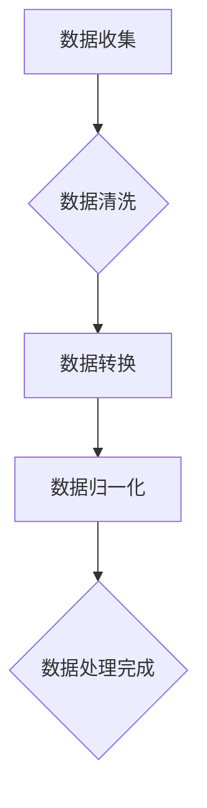

                 

# AI基础设施的成本优化：Lepton AI的经济学

> **关键词：** AI基础设施，成本优化，Lepton AI，经济学原理，计算资源利用率，存储成本优化，成本效益分析

> **摘要：** 本文深入探讨了AI基础设施的成本优化问题，以Lepton AI为例，分析了其经济学基础，详细阐述了成本优化的方法和策略。通过具体案例分析，本文展示了如何在实际项目中实施成本优化，并提供了一套完整的成本优化项目管理流程。最后，本文展望了AI基础设施成本优化的未来发展趋势和前景。

## 第一部分: AI基础设施的成本优化概述

### 第1章: AI基础设施的成本优化原理

#### 1.1.1 AI基础设施的成本组成与分类

AI基础设施的成本主要包括以下几个方面：

1. **硬件成本**：包括服务器、存储设备、网络设备等硬件的购买和维护费用。
2. **软件成本**：包括操作系统、数据库、中间件、开发工具、AI算法库等软件的购买和使用费用。
3. **人力成本**：包括研发人员、运维人员、管理人员等的工资和福利费用。
4. **能耗成本**：包括服务器和网络设备的能源消耗费用。
5. **运维成本**：包括系统维护、故障排除、数据备份等费用。

这些成本可以进一步分类为：

1. **直接成本**：直接与AI系统运行相关的费用，如硬件购买、软件使用费用。
2. **间接成本**：与AI系统运行相关，但不是直接必要的费用，如运维成本、能耗成本。

#### 1.1.2 成本优化在AI发展中的重要性

随着AI技术的快速发展，基础设施的成本也在不断上升。因此，如何优化AI基础设施的成本，已经成为一个重要的问题。成本优化的意义主要体现在以下几个方面：

1. **提高经济效益**：通过降低成本，提高企业的盈利能力。
2. **促进技术发展**：降低成本可以减少研发投入，从而加速技术进步。
3. **提升竞争力**：在相同成本下，实现更高的性能和效率，提升企业的竞争力。
4. **可持续发展**：降低能耗成本，有利于环境保护和可持续发展。

#### 1.1.3 成本优化的基本方法和策略

成本优化的基本方法和策略包括以下几个方面：

1. **需求分析**：明确AI系统的需求，确定基础设施的规模和配置。
2. **资源整合**：整合内部资源和外部资源，实现资源的高效利用。
3. **技术升级**：采用新技术和新工具，提高系统的性能和效率。
4. **自动化运维**：通过自动化工具，降低运维成本。
5. **能耗管理**：优化能耗管理，降低能耗成本。
6. **采购策略**：合理制定采购计划，降低采购成本。

### 第2章: Lepton AI经济学基础

#### 2.1 Lepton AI的经济学特点

Lepton AI作为一种先进的AI系统，其经济学特点主要体现在以下几个方面：

1. **高投入**：Lepton AI的开发和部署需要大量的资金和技术投入。
2. **高回报**：通过优化和高效利用资源，Lepton AI可以带来显著的经济效益。
3. **规模效应**：随着规模的扩大，Lepton AI的成本效益逐渐提高。
4. **动态调整**：Lepton AI可以根据市场需求和资源状况，动态调整成本结构。

#### 2.2 经济学原理在Lepton AI中的应用

经济学原理在Lepton AI中的应用主要体现在以下几个方面：

1. **成本效益分析**：通过成本效益分析，确定最佳的成本优化策略。
2. **供需平衡**：通过供需平衡，实现资源的最佳配置。
3. **博弈论**：在竞争环境中，通过博弈论分析，制定最优策略。
4. **风险管理**：通过风险管理，降低成本风险。

#### 2.3 Lepton AI的经济学模型构建

Lepton AI的经济学模型构建主要包括以下几个方面：

1. **成本函数**：建立成本函数，确定成本与各项因素之间的关系。
2. **收益函数**：建立收益函数，确定收益与各项因素之间的关系。
3. **优化模型**：通过优化模型，确定最优的成本优化策略。
4. **敏感性分析**：通过敏感性分析，评估各项因素对成本优化的影响。

## 第3章: Lepton AI成本优化案例分析

### 3.1 案例一：数据处理成本的优化

#### 3.1.1 数据预处理流程

数据预处理是数据处理的第一步，主要包括以下流程：

1. **数据收集**：从各种数据源收集数据。
2. **数据清洗**：去除重复数据、错误数据和无效数据。
3. **数据转换**：将数据转换为适合AI模型的形式。
4. **数据归一化**：将数据归一化，消除不同数据量级的影响。

#### 3.1.2 数据处理成本优化方案

为了优化数据处理成本，可以采取以下策略：

1. **并行处理**：采用并行处理技术，提高数据处理速度。
2. **分布式计算**：采用分布式计算架构，充分利用集群资源。
3. **云计算**：利用云计算平台，按需分配计算资源。
4. **数据压缩**：采用数据压缩技术，减少数据存储和传输的成本。

### 3.2 案例二：计算资源利用率的优化

#### 3.2.1 计算资源利用率的概念

计算资源利用率是指系统在一定时间内实际使用计算资源的能力与计算资源总能力的比值。

#### 3.2.2 优化策略与实现

为了提高计算资源利用率，可以采取以下策略：

1. **负载均衡**：通过负载均衡技术，合理分配计算任务，避免资源浪费。
2. **资源池化**：将计算资源整合为一个资源池，实现资源的动态分配。
3. **智能调度**：采用智能调度算法，根据任务特点和资源状况，动态调整计算资源分配。
4. **自动化运维**：通过自动化运维工具，实时监控和调整计算资源。

### 3.3 案例三：存储成本优化

#### 3.3.1 存储成本的组成

存储成本主要包括以下方面：

1. **存储设备成本**：包括硬盘、SSD等存储设备的购买和维护费用。
2. **存储空间成本**：包括存储空间的租赁和使用费用。
3. **数据备份成本**：包括数据备份和恢复的费用。

#### 3.3.2 存储成本优化方案

为了优化存储成本，可以采取以下策略：

1. **数据去重**：通过数据去重技术，减少存储空间的使用。
2. **分层存储**：将数据根据重要性和访问频率，分层存储在不同的存储设备上。
3. **存储压缩**：采用存储压缩技术，减少存储空间的需求。
4. **云存储**：采用云存储服务，降低存储成本。

## 第4章: Lepton AI成本优化工具与技术

### 4.1 通用成本优化工具介绍

#### 4.1.1 数据库优化工具

数据库优化工具主要包括以下几种：

1. **性能分析工具**：用于分析数据库性能，定位瓶颈。
2. **查询优化工具**：用于优化数据库查询，提高查询效率。
3. **存储优化工具**：用于优化数据库存储，减少存储空间需求。

#### 4.1.2 机器学习优化工具

机器学习优化工具主要包括以下几种：

1. **模型优化工具**：用于优化机器学习模型，提高模型性能。
2. **算法优化工具**：用于优化机器学习算法，提高算法效率。
3. **分布式训练工具**：用于分布式训练，提高训练速度。

### 4.2 Lepton AI专用成本优化技术

#### 4.2.1 能量效率优化

能量效率优化主要包括以下几种技术：

1. **能效管理**：通过能效管理技术，降低服务器和网络设备的能耗。
2. **动态电压调节**：通过动态电压调节技术，根据负载变化，调整服务器电压，降低能耗。
3. **硬件加速**：采用硬件加速技术，提高计算效率，降低能耗。

#### 4.2.2 资源分配优化

资源分配优化主要包括以下几种技术：

1. **动态资源分配**：通过动态资源分配技术，根据任务需求和资源状况，实时调整资源分配。
2. **负载均衡**：通过负载均衡技术，合理分配计算任务，避免资源浪费。
3. **容器化技术**：采用容器化技术，提高资源利用率和部署效率。

#### 4.2.3 模型压缩与量化

模型压缩与量化主要包括以下几种技术：

1. **模型压缩**：通过模型压缩技术，减少模型大小，降低存储和传输成本。
2. **模型量化**：通过模型量化技术，降低模型计算精度，减少计算资源需求。
3. **神经网络剪枝**：通过神经网络剪枝技术，去除模型中不必要的神经元，降低模型复杂度和计算成本。

## 第5章: Lepton AI成本优化项目管理

### 5.1 成本优化项目的规划与组织

#### 5.1.1 项目目标设定

项目目标设定主要包括以下几个方面：

1. **成本降低目标**：明确项目期望降低的成本。
2. **性能提升目标**：明确项目期望提高的性能指标。
3. **资源利用率目标**：明确项目期望提高的资源利用率。

#### 5.1.2 项目团队建设

项目团队建设主要包括以下几个方面：

1. **技术团队**：包括研发人员、运维人员、数据分析人员等。
2. **管理团队**：包括项目经理、技术经理、财务经理等。
3. **协作机制**：建立有效的协作机制，确保团队成员之间的沟通和协作。

### 5.2 成本优化项目的执行与监控

#### 5.2.1 成本监控指标

成本监控指标主要包括以下几个方面：

1. **成本总额**：项目总的成本支出。
2. **成本构成**：各项成本的构成情况。
3. **成本变动**：各项成本的变动情况。

#### 5.2.2 项目风险管理

项目风险管理主要包括以下几个方面：

1. **风险识别**：识别项目可能面临的风险。
2. **风险评估**：评估风险的可能性和影响。
3. **风险应对**：制定风险应对措施，降低风险。

### 5.3 成本优化项目的评估与改进

#### 5.3.1 成本效益分析

成本效益分析主要包括以下几个方面：

1. **成本计算**：计算项目实施前后的成本差异。
2. **效益计算**：计算项目实施后的效益。
3. **成本效益比**：计算成本效益比，评估项目的经济合理性。

#### 5.3.2 改进措施与建议

根据成本效益分析的结果，提出以下改进措施与建议：

1. **优化资源配置**：根据项目需求，优化资源配置，提高资源利用率。
2. **技术创新**：采用新技术和新工具，提高系统性能和效率。
3. **流程优化**：优化项目流程，减少不必要的成本支出。

## 第6章: 未来发展趋势与展望

### 6.1 AI基础设施成本的长期趋势

随着AI技术的不断发展，AI基础设施的成本呈现出以下长期趋势：

1. **成本降低**：随着技术的进步和规模化效应，AI基础设施的成本将逐渐降低。
2. **能耗降低**：随着能量效率优化技术的应用，AI基础设施的能耗将逐渐降低。
3. **资源利用率提高**：随着资源分配优化和自动化运维技术的应用，AI基础设施的资源利用率将不断提高。

### 6.2 成本优化技术的发展方向

成本优化技术的发展方向主要包括以下几个方面：

1. **智能化**：采用人工智能技术，实现自动化的成本优化。
2. **协同化**：实现跨部门、跨领域的协同优化，提高整体效益。
3. **定制化**：根据不同企业和项目的需求，提供定制化的成本优化方案。

### 6.3 Lepton AI在成本优化中的应用前景

Lepton AI在成本优化中的应用前景主要包括以下几个方面：

1. **高效计算**：通过Lepton AI的高效计算能力，实现成本优化的快速迭代和实时调整。
2. **智能决策**：通过Lepton AI的智能决策能力，实现成本优化的智能化和自动化。
3. **全面优化**：通过Lepton AI的综合能力，实现成本优化的全方位覆盖。

## 第7章: 附录

### 7.1 相关资源与参考资料

1. **《人工智能：一种现代的方法》**：Stuart J. Russell & Peter Norvig著
2. **《深度学习》**：Ian Goodfellow、Yoshua Bengio & Aaron Courville著
3. **《大数据技术导论》**：刘钢著
4. **《云计算技术与应用》**：周志华、王恩东著

### 7.2 Lepton AI成本优化工具使用指南

1. **Lepton AI成本优化工具概述**：介绍Lepton AI成本优化工具的功能和特点。
2. **工具安装与配置**：详细说明如何安装和配置Lepton AI成本优化工具。
3. **工具使用教程**：提供Lepton AI成本优化工具的使用教程和示例。

### 7.3 Lepton AI成本优化案例代码示例

1. **数据处理成本优化案例**：提供数据处理成本优化的代码示例和详细解释。
2. **计算资源利用率优化案例**：提供计算资源利用率优化的代码示例和详细解释。
3. **存储成本优化案例**：提供存储成本优化的代码示例和详细解释。

### 7.4 模型压缩与量化技术详细解释

1. **模型压缩技术原理**：介绍模型压缩技术的原理和实现方法。
2. **模型量化技术原理**：介绍模型量化技术的原理和实现方法。
3. **神经网络剪枝技术原理**：介绍神经网络剪枝技术的原理和实现方法。

### 7.5 Mermaid流程图



### 7.6 伪代码

```python
def cost_optimization():
    # 初始化成本
    cost = 0
    
    # 数据处理成本优化
    cost += data_processing_optimization()
    
    # 计算资源利用率优化
    cost += utilization_rate_optimization()
    
    # 存储成本优化
    cost += storage_cost_optimization()
    
    return cost
```

### 7.7 数学模型和公式

$$
\text{成本} = \text{硬件成本} + \text{软件成本} + \text{人力成本} + \text{能耗成本} + \text{运维成本}
$$

### 7.8 作者信息

**作者：** AI天才研究院/AI Genius Institute & 禅与计算机程序设计艺术/Zen And The Art of Computer Programming

---

通过以上章节的详细阐述，本文为读者提供了一个全面且深入的AI基础设施成本优化视角，以Lepton AI为例，展示了如何在实际项目中实现成本优化。同时，本文也为未来AI基础设施成本优化的发展提供了宝贵的思考方向。希望本文能为相关领域的研究者、工程师和管理者提供有益的参考。

