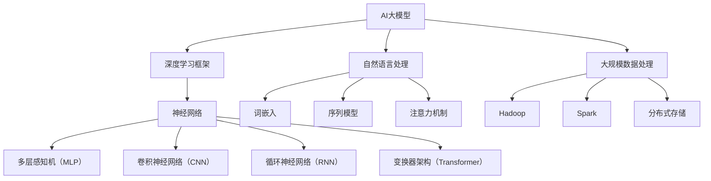
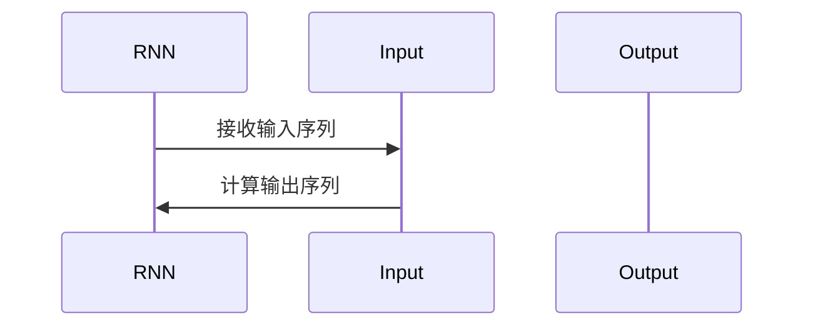
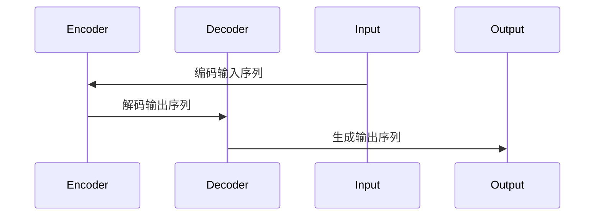

                 

## 引言

在过去的几十年里，人工智能（AI）技术经历了飞速的发展，从最初的规则系统、知识表示，到如今的深度学习和大型模型，AI的应用场景越来越广泛，已经深入到了我们生活的方方面面。特别是在大模型领域，例如GPT-3、BERT等，这些模型在自然语言处理、图像识别、推荐系统等方面取得了令人瞩目的成果。大模型的兴起，不仅推动了AI技术的发展，也为创业者提供了新的机遇。

然而，AI大模型创业并非易事。随着技术的不断进步和市场的快速变化，创业者面临着诸多挑战。如何把握市场趋势，构建高效的创业团队，应对技术风险和市场竞争，都是需要深思熟虑的问题。本文将围绕AI大模型创业，逐步分析其中的关键要素和潜在风险，为创业者提供有益的参考。

本文结构如下：

1. **AI大模型基础**：介绍AI大模型的基本概念、技术演进以及核心技术在AI中的应用。
2. **AI大模型应用场景**：分析AI大模型在工业、服务业和教育等领域的具体应用。
3. **AI大模型创业的关键要素**：探讨创业团队的构建、创业项目规划等内容。
4. **AI大模型创业中的风险与挑战**：分析技术风险、市场风险和法律风险等。
5. **AI大模型创业案例分享**：通过具体案例，展示AI大模型创业的实践过程。
6. **AI大模型创业的未来趋势**：展望AI大模型在未来的发展机遇和创业方向。
7. **附录**：提供AI大模型开发工具与资源，以及参考文献。

通过本文的逐步分析，我们希望能够帮助创业者更好地理解AI大模型的市场前景，识别潜在的风险，并制定有效的应对策略。让我们开始这场关于AI大模型创业的深度探讨之旅。

---

关键词：AI大模型，创业，市场挑战，技术风险，应用场景

摘要：本文旨在探讨AI大模型创业的现状与未来，分析其核心概念、技术演进、应用场景，以及创业中的关键要素和潜在风险。通过具体案例和理论分析，为创业者提供有价值的参考，帮助他们在激烈的市场竞争中脱颖而出。

---

## 第一部分：AI大模型基础

在深入了解AI大模型创业之前，有必要对AI大模型的基本概念、技术演进和应用有一个全面的了解。这一部分将分为三章，分别介绍AI大模型的概述、技术演进和应用场景。

### 第1章：AI大模型概述

#### 1.1 AI大模型的概念与特征

##### 1.1.1 AI大模型的定义

AI大模型（Large-scale AI Model）是指那些在训练过程中需要大量数据、计算资源和时间来训练的复杂模型。这些模型通常具有数亿甚至数千亿个参数，能够处理大规模数据集，并具备较强的泛化能力。常见的AI大模型包括GPT-3、BERT、Turing等。

##### 1.1.2 AI大模型的特征

1. **参数规模大**：AI大模型的参数规模通常在数亿到数千亿之间，远超传统小模型。
2. **数据需求高**：训练AI大模型需要大量高质量的数据，通常来源于互联网、数据库等。
3. **计算资源需求大**：AI大模型训练过程需要大量的计算资源和存储空间，通常需要分布式计算和并行处理技术。
4. **时间消耗长**：训练AI大模型的时间通常较长，需要几个月甚至几年的时间。

#### 1.2 AI大模型的技术演进

##### 1.2.1 AI发展历程回顾

AI的研究起源于20世纪50年代，早期的AI主要依靠专家系统和知识表示。随着计算能力的提升和数据规模的增大，AI技术逐渐发展到了深度学习阶段。深度学习通过多层神经网络模拟人脑的决策过程，使得AI在图像识别、语音识别等领域取得了突破性进展。

##### 1.2.2 大模型在AI中的地位

大模型的出现标志着AI技术的又一次飞跃。与传统的AI模型相比，大模型在处理复杂任务、应对多样化需求方面具有显著优势。大模型能够通过自我学习和优化，不断提高其性能和准确性，从而推动AI技术的进一步发展。

#### 1.3 AI大模型的核心技术

##### 1.3.1 深度学习基础

深度学习是AI大模型的核心技术。它通过多层神经网络对数据进行处理和转换，使模型能够从大量数据中自动学习特征。深度学习的基础包括神经网络、卷积神经网络（CNN）、循环神经网络（RNN）和变换器架构（Transformer）等。

##### 1.3.2 自然语言处理

自然语言处理（NLP）是AI大模型在语言领域的重要应用。NLP技术通过深度学习模型对文本数据进行处理，实现语言理解、文本生成、情感分析等功能。NLP的核心技术包括词嵌入、序列模型、注意力机制等。

##### 1.3.3 大规模数据处理

大规模数据处理是AI大模型训练过程中的关键环节。它涉及到数据采集、数据清洗、数据预处理和数据存储等技术。大规模数据处理技术包括分布式存储、分布式计算和并行处理等。

### 第2章：AI大模型应用场景

#### 2.1 AI大模型在工业领域的应用

AI大模型在工业领域有着广泛的应用，包括制造业、能源等领域。在制造业中，AI大模型可以用于质量检测、预测维护和自动化生产等；在能源领域，AI大模型可以用于能源调度、节能分析和故障预测等。

##### 2.1.1 制造业应用

在制造业中，AI大模型可以用于质量检测。例如，通过对生产过程中的传感器数据进行实时分析，AI大模型可以识别出生产过程中的异常，从而提高产品质量。此外，AI大模型还可以用于预测维护，通过对设备运行数据进行分析，预测设备故障，提前进行维护，减少停机时间。

##### 2.1.2 能源领域应用

在能源领域，AI大模型可以用于能源调度和节能分析。通过对电网数据进行分析，AI大模型可以优化能源调度，提高能源利用效率。此外，AI大模型还可以用于故障预测，通过分析设备运行数据，预测设备故障，提前进行维护。

#### 2.2 AI大模型在服务业的应用

AI大模型在服务业中也有着广泛的应用，包括零售业、金融业等。在零售业中，AI大模型可以用于商品推荐、销售预测等；在金融业中，AI大模型可以用于风险管理、欺诈检测等。

##### 2.2.1 零售业应用

在零售业中，AI大模型可以用于商品推荐。通过对用户的历史购买数据进行分析，AI大模型可以推荐用户可能感兴趣的商品。此外，AI大模型还可以用于销售预测，通过对销售数据进行分析，预测未来的销售趋势，帮助商家进行库存管理和销售策略制定。

##### 2.2.2 金融业应用

在金融业中，AI大模型可以用于风险管理。通过对金融市场的数据进行分析，AI大模型可以识别出潜在的风险，帮助金融机构进行风险控制。此外，AI大模型还可以用于欺诈检测，通过分析交易数据，识别出异常交易，从而减少欺诈行为。

#### 2.3 AI大模型在教育领域的应用

AI大模型在教育领域也有着重要的应用，包括个性化教学、学习分析等。

##### 2.3.1 个性化教学

在个性化教学中，AI大模型可以根据学生的学习情况和兴趣爱好，为学生推荐适合的学习内容和资源。例如，通过对学生的历史学习数据进行分析，AI大模型可以识别出学生的薄弱环节，并推荐相应的学习材料，帮助学生提高学习效果。

##### 2.3.2 学习分析

在学习分析中，AI大模型可以分析学生的学习行为，识别出学习过程中的问题，并提供相应的解决方案。例如，通过对学生的学习数据进行分析，AI大模型可以识别出学生的学习瓶颈，并提供针对性的辅导，帮助学生克服困难。

### 第3章：AI大模型创业的关键要素

#### 3.1 创业团队构建

创业团队的构建是AI大模型创业的关键要素之一。一个高效的创业团队需要具备多样化的技能和专业知识，包括技术、市场、运营等方面。

##### 3.1.1 团队核心成员的角色与职责

- **技术负责人**：负责团队的技术研发和产品迭代，确保产品的技术先进性和稳定性。
- **市场负责人**：负责市场调研、市场推广和客户关系管理，确保产品的市场竞争力。
- **运营负责人**：负责团队的日常运营管理，确保项目的顺利进行。

##### 3.1.2 团队成员的能力提升与培养

团队成员的能力提升和培养是团队持续发展的基础。团队可以通过以下方式提升成员能力：
- **内部培训**：定期组织内部培训，提高团队成员的专业技能。
- **外部学习**：鼓励团队成员参加外部培训和行业会议，了解行业动态和新技术。
- **项目实践**：通过实际项目锻炼团队成员的能力，提高他们的实战经验。

#### 3.2 创业项目规划

创业项目的规划是AI大模型创业的另一个关键要素。一个成功的创业项目需要明确的目标、详细的市场分析和可行的实施方案。

##### 3.2.1 市场需求分析

市场需求分析是创业项目规划的第一步。团队需要通过市场调研，了解目标市场的需求、市场规模和竞争状况，为产品定位和营销策略提供依据。

##### 3.2.2 竞争对手分析

竞争对手分析是创业项目规划的重要环节。团队需要分析竞争对手的产品特点、优势和劣势，找到自身的差异化竞争优势。

##### 3.2.3 创业项目实施方案

创业项目实施方案是创业项目规划的核心。团队需要制定详细的项目计划，包括技术研发、市场推广、团队建设等方面，确保项目的顺利推进。

---

通过本章的介绍，我们初步了解了AI大模型的基本概念、技术演进和应用场景，以及创业团队构建和项目规划的关键要素。在下一章中，我们将进一步分析AI大模型创业中的风险与挑战，帮助创业者更好地应对市场变化和竞争压力。

## 第一部分：AI大模型基础

### 第1章：AI大模型概述

#### 1.1 AI大模型的概念与特征

##### 1.1.1 AI大模型的定义

AI大模型（Large-scale AI Model）指的是那些拥有大量参数、能够处理大规模数据，并具备强大泛化能力的深度学习模型。这些模型通常具有数十亿甚至数万亿个参数，能够从海量数据中自动提取复杂特征，从而实现高精度的预测和分类。

##### 1.1.2 AI大模型的特征

1. **参数规模大**：大模型的参数数量通常在数亿到数千亿之间，远超传统的小模型。例如，GPT-3拥有1750亿个参数，BERT则有数百万个参数。
2. **数据需求高**：训练大模型需要大量的高质量数据，这些数据通常来源于互联网、数据库和其他数据源。数据的质量和数量直接影响模型的性能和准确性。
3. **计算资源需求大**：大模型训练需要大量的计算资源和存储空间，通常需要分布式计算和并行处理技术。训练时间也较长，往往需要几个月甚至几年的时间。
4. **时间消耗长**：由于参数规模和数据规模庞大，大模型的训练时间通常较长，训练过程中可能涉及多次迭代和优化，以实现最佳性能。

#### 1.2 AI大模型的技术演进

##### 1.2.1 AI发展历程回顾

人工智能（AI）的研究可以追溯到20世纪50年代，早期的研究主要集中在符号推理和知识表示。随着计算能力的提升和数据规模的增大，深度学习逐渐成为AI的主流技术。深度学习通过多层神经网络模拟人脑的决策过程，使得AI在图像识别、语音识别、自然语言处理等领域取得了突破性进展。

##### 1.2.2 大模型在AI中的地位

大模型在AI中的地位日益重要，它们在处理复杂任务、应对多样化需求方面具有显著优势。大模型能够通过自我学习和优化，不断提高其性能和准确性，从而推动AI技术的进一步发展。大模型的应用不仅提高了传统AI系统的性能，还开创了新的应用场景，如生成对抗网络（GAN）在图像生成、语音合成等领域的应用。

#### 1.3 AI大模型的核心技术

##### 1.3.1 深度学习基础

深度学习是AI大模型的核心技术。它通过多层神经网络对数据进行处理和转换，使模型能够从大量数据中自动学习特征。深度学习的基础包括：

1. **神经网络**：神经网络由多个神经元组成，每个神经元负责处理一部分输入数据，并通过权重和偏置进行计算。
2. **卷积神经网络（CNN）**：CNN特别适用于图像处理任务，通过卷积操作提取图像特征。
3. **循环神经网络（RNN）**：RNN适用于序列数据处理，如自然语言处理和时间序列分析。
4. **变换器架构（Transformer）**：Transformer架构在自然语言处理领域取得了巨大成功，通过自注意力机制处理长距离依赖问题。

##### 1.3.2 自然语言处理

自然语言处理（NLP）是AI大模型在语言领域的重要应用。NLP技术通过深度学习模型对文本数据进行处理，实现语言理解、文本生成、情感分析等功能。NLP的核心技术包括：

1. **词嵌入**：将词汇映射到高维向量空间，以捕捉词汇的语义信息。
2. **序列模型**：通过处理序列数据，如文本和语音，实现语言理解和生成。
3. **注意力机制**：注意力机制在处理长文本和长序列时，能够关注关键信息，提高模型的性能。

##### 1.3.3 大规模数据处理

大规模数据处理是AI大模型训练过程中的关键环节。它涉及到数据采集、数据清洗、数据预处理和数据存储等技术。大规模数据处理技术包括：

1. **分布式存储**：通过分布式存储技术，实现海量数据的存储和管理。
2. **分布式计算**：通过分布式计算技术，实现数据的并行处理和加速训练过程。
3. **并行处理**：通过并行处理技术，利用多台计算机或服务器同时处理数据，提高处理效率。

### 第2章：AI大模型应用场景

#### 2.1 AI大模型在工业领域的应用

AI大模型在工业领域有着广泛的应用，包括制造业、能源、医疗等。通过深度学习技术，AI大模型能够实现自动化生产、预测维护、故障诊断等，提高生产效率和产品质量。

##### 2.1.1 制造业应用

在制造业中，AI大模型可以用于质量检测、预测维护和自动化生产等。

1. **质量检测**：通过深度学习模型对生产过程中的产品进行质量检测，实时识别出不合格产品，提高产品质量。
2. **预测维护**：通过分析设备运行数据，AI大模型可以预测设备故障，提前进行维护，减少设备停机时间和维修成本。
3. **自动化生产**：通过深度学习模型对生产过程中的参数进行优化，实现自动化生产，提高生产效率和降低人力成本。

##### 2.1.2 能源领域应用

在能源领域，AI大模型可以用于能源调度、节能分析和故障预测等。

1. **能源调度**：通过深度学习模型对能源需求进行预测，优化能源调度策略，提高能源利用效率。
2. **节能分析**：通过分析能源使用数据，AI大模型可以发现节能潜力，提出节能建议，降低能源消耗。
3. **故障预测**：通过分析设备运行数据，AI大模型可以预测设备故障，提前进行维护，减少故障带来的损失。

#### 2.2 AI大模型在服务业的应用

AI大模型在服务业中也有着广泛的应用，包括金融、零售、医疗等。

##### 2.2.1 零售业应用

在零售业中，AI大模型可以用于商品推荐、销售预测和库存管理等。

1. **商品推荐**：通过分析用户的历史购买数据，AI大模型可以推荐用户可能感兴趣的商品，提高销售额。
2. **销售预测**：通过分析销售数据，AI大模型可以预测未来的销售趋势，帮助商家进行库存管理和销售策略制定。
3. **库存管理**：通过分析库存数据，AI大模型可以优化库存策略，降低库存成本和库存积压。

##### 2.2.2 金融业应用

在金融业中，AI大模型可以用于风险管理、欺诈检测和信用评估等。

1. **风险管理**：通过分析金融市场数据，AI大模型可以识别潜在风险，帮助金融机构进行风险控制。
2. **欺诈检测**：通过分析交易数据，AI大模型可以识别异常交易，防范欺诈行为。
3. **信用评估**：通过分析个人或企业的历史数据，AI大模型可以评估其信用等级，为金融机构提供决策依据。

#### 2.3 AI大模型在教育领域的应用

AI大模型在教育领域有着重要的应用，包括个性化教学、学习分析和教育评价等。

##### 2.3.1 个性化教学

在个性化教学中，AI大模型可以根据学生的学习情况和兴趣爱好，为学生提供个性化的教学资源和辅导。

1. **学习路径推荐**：通过分析学生的学习数据，AI大模型可以推荐适合的学习路径和课程。
2. **个性化辅导**：通过分析学生的学习行为和成绩，AI大模型可以为学生提供个性化的辅导建议，帮助学生提高学习效果。

##### 2.3.2 学习分析

在学习分析中，AI大模型可以分析学生的学习行为和成绩，识别学习过程中的问题和瓶颈。

1. **学习行为分析**：通过分析学生的学习行为，如浏览课程视频的时长、做题的正确率等，AI大模型可以了解学生的学习状况。
2. **成绩预测**：通过分析学生的学习数据，AI大模型可以预测学生的考试成绩，为教师和学生提供学习指导。

##### 2.3.3 教育评价

在教育评价中，AI大模型可以用于考试评分、学习评估和教学质量评估等。

1. **考试评分**：通过分析考生的答案，AI大模型可以客观公正地评分，提高考试评价的准确性。
2. **学习评估**：通过分析学生的学习数据，AI大模型可以评估学生的学习效果，为教师提供教学反馈。
3. **教学质量评估**：通过分析教师的教学数据，AI大模型可以评估教师的教学质量，为学校和教育管理部门提供参考。

---

通过本章的介绍，我们了解了AI大模型的基本概念、技术演进和应用场景，为后续章节的讨论奠定了基础。在下一章中，我们将探讨AI大模型创业中的关键要素，包括创业团队构建和项目规划等。

## 第一部分：AI大模型基础

### 第1章：AI大模型概述

#### 1.1 AI大模型的概念与特征

##### 1.1.1 AI大模型的定义

AI大模型指的是具有大规模参数和计算能力的深度学习模型，通常具备数亿甚至数千亿个参数，能够处理海量数据，实现高效的特征学习和泛化能力。这些模型在训练过程中需要大量的数据、计算资源和时间，具有显著的学习能力和适应能力。

##### 1.1.2 AI大模型的特征

1. **大规模参数**：AI大模型拥有数亿到数千亿个参数，这些参数通过训练从海量数据中学习到复杂的特征表示，能够处理高维度、非线性问题。
2. **海量数据处理**：AI大模型能够处理大规模数据集，通过对数据的学习，自动提取数据中的特征，实现数据的降维和信息的压缩。
3. **高效计算**：AI大模型通常采用分布式计算和并行处理技术，利用大规模计算资源进行模型训练和推理，提高计算效率。
4. **自适应能力**：AI大模型具有良好的自适应能力，能够根据新的数据和环境进行自我调整和优化，适应不断变化的需求。

#### 1.2 AI大模型的技术演进

##### 1.2.1 AI发展历程回顾

人工智能（AI）技术的发展经历了几个重要阶段：

- **符号人工智能**：早期AI主要依赖专家系统和知识表示，通过编码规则和逻辑推理解决特定问题。
- **统计学习**：随着数据规模的增大和计算能力的提升，统计学习方法如决策树、支持向量机（SVM）等成为主流，这些方法通过训练模型进行预测和分类。
- **深度学习**：深度学习通过多层神经网络模拟人脑的决策过程，使得AI在图像识别、语音识别、自然语言处理等领域取得了突破性进展。
- **大模型时代**：随着计算能力的进一步提升和数据规模的扩大，大模型如GPT-3、BERT等成为AI研究的重要方向，这些模型具备强大的学习和泛化能力，能够处理复杂任务。

##### 1.2.2 大模型在AI中的地位

AI大模型在当前AI领域占据重要地位，主要体现在以下几个方面：

1. **高性能**：大模型具有强大的学习能力，能够从海量数据中提取复杂特征，实现高精度的预测和分类。
2. **泛化能力**：大模型具有良好的泛化能力，能够适应不同的任务和数据集，降低对特定领域数据的依赖。
3. **广泛应用**：大模型在多个领域取得了显著的应用成果，如自然语言处理、计算机视觉、推荐系统等，推动了AI技术的进一步发展。
4. **创新驱动**：大模型的研究和应用不断推动AI技术的创新，带动了相关领域的快速发展。

#### 1.3 AI大模型的核心技术

##### 1.3.1 深度学习基础

深度学习是AI大模型的核心技术，它通过多层神经网络模拟人脑的决策过程，实现数据的自动特征学习和复杂任务的处理。深度学习的基础包括：

1. **神经网络**：神经网络由多个神经元组成，每个神经元负责处理一部分输入数据，并通过权重和偏置进行计算，最终输出结果。
2. **前向传播与反向传播**：神经网络通过前向传播计算输入和输出之间的映射关系，通过反向传播计算梯度，优化模型参数。
3. **激活函数**：激活函数用于引入非线性，使神经网络能够学习复杂的非线性关系。

##### 1.3.2 自然语言处理

自然语言处理（NLP）是AI大模型在语言领域的重要应用，它通过深度学习技术处理文本数据，实现语言理解、文本生成、情感分析等功能。NLP的核心技术包括：

1. **词嵌入**：词嵌入是将词汇映射到高维向量空间，以捕捉词汇的语义信息。
2. **序列模型**：序列模型如循环神经网络（RNN）和变换器架构（Transformer）能够处理文本的序列信息，实现高效的文本处理。
3. **注意力机制**：注意力机制在处理长文本时，能够关注关键信息，提高模型的性能。

##### 1.3.3 大规模数据处理

大规模数据处理是AI大模型训练过程中的关键环节，它涉及到数据采集、数据清洗、数据预处理和数据存储等技术。大规模数据处理技术包括：

1. **分布式存储**：通过分布式存储技术，实现海量数据的存储和管理。
2. **分布式计算**：通过分布式计算技术，实现数据的并行处理和加速训练过程。
3. **并行处理**：通过并行处理技术，利用多台计算机或服务器同时处理数据，提高处理效率。

---

通过本章的介绍，我们了解了AI大模型的基本概念、技术演进和应用，为后续章节的深入讨论奠定了基础。在下一章中，我们将进一步探讨AI大模型在工业、服务业和教育领域的具体应用场景，以及创业团队构建和项目规划的关键要素。

## 第二部分：AI大模型应用场景

### 第2章：AI大模型在工业、服务业和教育领域的应用

#### 2.1 AI大模型在工业领域的应用

AI大模型在工业领域有着广泛的应用，特别是制造业和能源领域，通过深度学习技术，AI大模型能够实现自动化生产、预测维护和优化调度等，从而提高生产效率和资源利用率。

##### 2.1.1 制造业应用

在制造业中，AI大模型的应用主要体现在以下几个方面：

1. **质量检测**：通过深度学习模型对生产过程中的产品进行质量检测，实时识别出不合格产品，提高产品质量。例如，利用卷积神经网络（CNN）对生产线上拍摄的照片进行分析，判断产品是否符合标准。
   
2. **预测维护**：通过分析设备运行数据，AI大模型可以预测设备故障，提前进行维护，减少设备停机时间和维修成本。例如，利用循环神经网络（RNN）分析设备振动数据，预测设备何时可能发生故障。

3. **自动化生产**：通过深度学习模型优化生产过程中的参数设置，实现自动化生产，提高生产效率和降低人力成本。例如，利用变换器架构（Transformer）优化生产线的速度和温度设置，提高生产效率和产品质量。

##### 2.1.2 能源领域应用

在能源领域，AI大模型的应用主要体现在以下几个方面：

1. **能源调度**：通过深度学习模型对能源需求进行预测，优化能源调度策略，提高能源利用效率。例如，利用长短期记忆网络（LSTM）分析历史用电数据，预测未来一段时间内的用电需求。

2. **节能分析**：通过分析能源使用数据，AI大模型可以发现节能潜力，提出节能建议，降低能源消耗。例如，利用卷积神经网络（CNN）分析工厂的能源使用数据，发现能源浪费的环节。

3. **故障预测**：通过分析设备运行数据，AI大模型可以预测设备故障，提前进行维护，减少故障带来的损失。例如，利用循环神经网络（RNN）分析变压器的温度和振动数据，预测变压器何时可能发生故障。

#### 2.2 AI大模型在服务业的应用

AI大模型在服务业中的应用也越来越广泛，包括零售业、金融业等。

##### 2.2.1 零售业应用

在零售业中，AI大模型的应用主要体现在以下几个方面：

1. **商品推荐**：通过分析用户的购物历史和行为数据，AI大模型可以推荐用户可能感兴趣的商品，提高销售额。例如，利用协同过滤算法和深度学习模型，根据用户的购物记录和浏览行为推荐相关商品。

2. **销售预测**：通过分析历史销售数据，AI大模型可以预测未来的销售趋势，帮助商家进行库存管理和销售策略制定。例如，利用时间序列分析模型和深度学习模型，预测未来一段时间内的商品销售量。

3. **库存管理**：通过分析库存数据，AI大模型可以优化库存策略，降低库存成本和库存积压。例如，利用卷积神经网络（CNN）和循环神经网络（RNN）分析历史库存数据和销售趋势，优化库存水平。

##### 2.2.2 金融业应用

在金融业中，AI大模型的应用主要体现在以下几个方面：

1. **风险管理**：通过分析金融市场数据，AI大模型可以识别潜在风险，帮助金融机构进行风险控制。例如，利用深度学习模型分析历史市场数据，预测股票价格波动和风险事件。

2. **欺诈检测**：通过分析交易数据，AI大模型可以识别异常交易，防范欺诈行为。例如，利用卷积神经网络（CNN）和循环神经网络（RNN）分析交易数据中的异常模式，检测潜在的欺诈行为。

3. **信用评估**：通过分析个人或企业的历史数据，AI大模型可以评估其信用等级，为金融机构提供决策依据。例如，利用深度学习模型分析借款人的信用历史、收入水平和其他相关信息，评估其信用风险。

#### 2.3 AI大模型在教育领域的应用

AI大模型在教育领域也有着重要的应用，通过个性化教学、学习分析和教育评价等，提高教育质量和学习效果。

##### 2.3.1 个性化教学

在个性化教学中，AI大模型可以根据学生的学习情况和兴趣爱好，为学生提供个性化的教学资源和辅导。

1. **学习路径推荐**：通过分析学生的学习数据，AI大模型可以推荐适合的学习路径和课程。例如，利用协同过滤算法和深度学习模型，根据学生的历史学习记录和成绩，推荐相关的课程和知识点。

2. **个性化辅导**：通过分析学生的学习行为和成绩，AI大模型可以为学生提供个性化的辅导建议，帮助学生提高学习效果。例如，利用自然语言处理模型和深度学习模型，分析学生的学习问题和难点，提供针对性的辅导内容。

##### 2.3.2 学习分析

在学习分析中，AI大模型可以分析学生的学习行为和成绩，识别学习过程中的问题和瓶颈。

1. **学习行为分析**：通过分析学生的学习行为，如浏览课程视频的时长、做题的正确率等，AI大模型可以了解学生的学习状况。例如，利用时间序列分析和深度学习模型，分析学生的学习行为数据，识别学习高峰期和低谷期。

2. **成绩预测**：通过分析学生的学习数据，AI大模型可以预测学生的考试成绩，为教师和学生提供学习指导。例如，利用回归分析和深度学习模型，根据学生的历史学习记录和成绩，预测其未来的考试成绩。

##### 2.3.3 教育评价

在教育评价中，AI大模型可以用于考试评分、学习评估和教学质量评估等。

1. **考试评分**：通过分析考生的答案，AI大模型可以客观公正地评分，提高考试评价的准确性。例如，利用自然语言处理模型和深度学习模型，分析考生的答案，给出合理的评分。

2. **学习评估**：通过分析学生的学习数据，AI大模型可以评估学生的学习效果，为教师提供教学反馈。例如，利用回归分析和深度学习模型，根据学生的历史学习记录和成绩，评估其学习效果。

3. **教学质量评估**：通过分析教师的教学数据，AI大模型可以评估教师的教学质量，为学校和教育管理部门提供参考。例如，利用深度学习模型和统计分析方法，分析教师的教学内容、教学方法和学生反馈，评估其教学质量。

---

通过本章的介绍，我们了解了AI大模型在工业、服务业和教育领域的具体应用场景。在下一章中，我们将探讨AI大模型创业中的关键要素，包括创业团队构建和项目规划等，帮助创业者更好地应对市场挑战和竞争压力。

## 第二部分：AI大模型应用场景

### 第2章：AI大模型在工业、服务业和教育领域的应用

#### 2.1 AI大模型在工业领域的应用

AI大模型在工业领域的应用，特别是在制造业和能源领域，正日益成为提升生产效率、优化资源利用和降低成本的重要手段。通过深度学习和大数据分析技术，AI大模型能够处理复杂的数据集，从中提取有价值的信息，进而实现自动化决策和预测。

##### 2.1.1 制造业应用

在制造业中，AI大模型的应用主要包括以下几个方向：

1. **质量检测**：AI大模型可以用于生产过程中的在线质量检测。例如，通过卷积神经网络（CNN）分析生产设备的传感器数据，实时监测产品的质量状况，发现潜在的质量问题。这种方法比传统的方法更为精准，能够提前预警，减少次品率。

   ```python
   # 假设使用CNN进行质量检测的伪代码
   model = CNN_model(input_shape=(sensor_data_dim,))
   model.compile(optimizer='adam', loss='binary_crossentropy', metrics=['accuracy'])
   model.fit(sensor_data, quality_labels, epochs=100, batch_size=32)
   prediction = model.predict(new_sensor_data)
   ```

2. **预测维护**：通过分析设备的历史运行数据和实时数据，AI大模型可以预测设备的故障时间，从而实现预防性维护。这种方法能够减少设备停机时间，延长设备使用寿命。

   ```python
   # 假设使用LSTM进行预测维护的伪代码
   model = LSTM_model(input_shape=(time_steps, sensor_data_dim))
   model.compile(optimizer='adam', loss='mse')
   model.fit histórica_device_data, device_failure_labels, epochs=100, batch_size=32)
   prediction = model.predict(new_device_data)
   ```

3. **自动化生产**：AI大模型可以通过优化生产参数来提高生产效率和产品质量。例如，通过变换器架构（Transformer）优化生产线的速度、温度等参数，实现自动化调整。

   ```python
   # 假设使用Transformer进行自动化生产的伪代码
   model = Transformer_model(input_shape=(time_steps, production_param_dim))
   model.compile(optimizer='adam', loss='mse')
   model.fit(production_data, target_production_params, epochs=100, batch_size=32)
   optimized_params = model.predict(new_production_data)
   ```

##### 2.1.2 能源领域应用

在能源领域，AI大模型的应用主要体现在能源调度、节能分析和故障预测等方面：

1. **能源调度**：AI大模型可以通过分析历史能源需求和供给数据，预测未来的能源需求，从而优化能源调度策略，提高能源利用效率。

   ```python
   # 假设使用LSTM进行能源调度的伪代码
   model = LSTM_model(input_shape=(time_steps, energy_data_dim))
   model.compile(optimizer='adam', loss='mse')
   model.fit(historical_energy_data, future_energy_demand, epochs=100, batch_size=32)
   predicted_demand = model.predict(new_energy_data)
   ```

2. **节能分析**：AI大模型可以通过分析能源使用数据，发现能源消耗的瓶颈，提出节能措施，降低能源成本。

   ```python
   # 假设使用CNN进行节能分析的伪代码
   model = CNN_model(input_shape=(energy_data_dim,))
   model.compile(optimizer='adam', loss='mse')
   model.fit(energy_usage_data, energy_consumption, epochs=100, batch_size=32)
   optimized_usage = model.predict(new_energy_usage_data)
   ```

3. **故障预测**：AI大模型可以通过分析设备的历史运行数据和实时数据，预测设备的故障概率，从而实现预防性维护。

   ```python
   # 假设使用RNN进行故障预测的伪代码
   model = RNN_model(input_shape=(time_steps, sensor_data_dim))
   model.compile(optimizer='adam', loss='binary_crossentropy', metrics=['accuracy'])
   model.fit(historical_device_data, device_failure_labels, epochs=100, batch_size=32)
   prediction = model.predict(new_device_data)
   ```

#### 2.2 AI大模型在服务业的应用

AI大模型在服务业中的应用同样广泛，特别是在零售业和金融业。

##### 2.2.1 零售业应用

在零售业中，AI大模型的应用主要包括商品推荐、销售预测和库存管理：

1. **商品推荐**：通过分析用户的购物历史和行为数据，AI大模型可以推荐用户可能感兴趣的商品，提高用户满意度和销售额。

   ```python
   # 假设使用协同过滤和深度学习进行商品推荐的伪代码
   model = Collaborative_Filtering_and_DNN(input_shape=(user_data_dim, item_data_dim))
   model.compile(optimizer='adam', loss='mse')
   model.fit(user行为数据, user偏好数据, epochs=100, batch_size=32)
   recommendation = model.predict(new_user_data)
   ```

2. **销售预测**：通过分析历史销售数据，AI大模型可以预测未来的销售趋势，帮助商家制定库存和营销策略。

   ```python
   # 假设使用ARIMA和LSTM进行销售预测的伪代码
   model = ARIMA_LSTM(input_shape=(time_steps, sales_data_dim))
   model.compile(optimizer='adam', loss='mse')
   model.fit(historical_sales_data, future_sales, epochs=100, batch_size=32)
   predicted_sales = model.predict(new_sales_data)
   ```

3. **库存管理**：通过分析销售数据和库存数据，AI大模型可以优化库存策略，降低库存成本和库存积压。

   ```python
   # 假设使用LSTM进行库存管理的伪代码
   model = LSTM_model(input_shape=(time_steps, inventory_data_dim))
   model.compile(optimizer='adam', loss='mse')
   model.fit(historical_inventory_data, future_inventory_levels, epochs=100, batch_size=32)
   optimized_inventory = model.predict(new_inventory_data)
   ```

##### 2.2.2 金融业应用

在金融业中，AI大模型的应用主要包括风险管理、欺诈检测和信用评估：

1. **风险管理**：通过分析历史市场数据和风险指标，AI大模型可以预测潜在的市场风险，帮助金融机构进行风险控制。

   ```python
   # 假设使用GARCH和深度学习进行风险管理的伪代码
   model = GARCH_DNN(input_shape=(market_data_dim,))
   model.compile(optimizer='adam', loss='mse')
   model.fit(historical_market_data, market_risk, epochs=100, batch_size=32)
   predicted_risk = model.predict(new_market_data)
   ```

2. **欺诈检测**：通过分析交易数据，AI大模型可以识别异常交易，防范欺诈行为。

   ```python
   # 假设使用Autoencoder和决策树进行欺诈检测的伪代码
   encoder = Autoencoder(input_shape=(transaction_data_dim,))
   decoder = Autoencoder(input_shape=(transaction_data_dim,))
   model = Decision_Tree(input_shape=(encoded_transaction_data_dim,))
   encoder.compile(optimizer='adam', loss='mse')
   decoder.compile(optimizer='adam', loss='mse')
   model.compile(optimizer='adam', loss='binary_crossentropy')
   encoder.fit(transaction_data, epochs=100, batch_size=32)
   decoder.fit(transaction_data, epochs=100, batch_size=32)
   encoded_data = encoder.predict(new_transaction_data)
   fraud_detection = model.predict(encoded_data)
   ```

3. **信用评估**：通过分析借款人的历史数据和信用记录，AI大模型可以评估其信用风险，为金融机构提供决策依据。

   ```python
   # 假设使用XGBoost和深度学习进行信用评估的伪代码
   model = XGBoost_DNN(input_shape=(borrower_data_dim,))
   model.compile(optimizer='adam', loss='binary_crossentropy', metrics=['accuracy'])
   model.fit(borrower_data, credit_risk, epochs=100, batch_size=32)
   credit_score = model.predict(new_borrower_data)
   ```

#### 2.3 AI大模型在教育领域的应用

AI大模型在教育领域的应用，有助于实现个性化教学、学习分析和教育评价，从而提升教育质量和学习效果。

##### 2.3.1 个性化教学

在个性化教学中，AI大模型可以根据学生的学习情况和能力，为其推荐适合的学习资源和教学策略。

1. **学习路径推荐**：通过分析学生的学习行为和成绩，AI大模型可以推荐适合的学习路径和课程。

   ```python
   # 假设使用深度学习进行学习路径推荐的伪代码
   model = DNN_model(input_shape=(student_data_dim,))
   model.compile(optimizer='adam', loss='binary_crossentropy', metrics=['accuracy'])
   model.fit(student_behavior_data, learning_paths, epochs=100, batch_size=32)
   recommended_path = model.predict(new_student_data)
   ```

2. **个性化辅导**：通过分析学生的学习问题和成绩，AI大模型可以为学生提供个性化的辅导建议。

   ```python
   # 假设使用深度学习进行个性化辅导的伪代码
   model = DNN_model(input_shape=(student_data_dim,))
   model.compile(optimizer='adam', loss='binary_crossentropy', metrics=['accuracy'])
   model.fit(student_problem_data, student_solution, epochs=100, batch_size=32)
   recommended_solution = model.predict(new_student_problem_data)
   ```

##### 2.3.2 学习分析

在学习分析中，AI大模型可以通过分析学生的学习行为和成绩，识别学习过程中的问题和瓶颈。

1. **学习行为分析**：通过分析学生的学习行为，如学习时长、学习频率等，AI大模型可以了解学生的学习状况。

   ```python
   # 假设使用深度学习进行学习行为分析的伪代码
   model = DNN_model(input_shape=(student_behavior_data_dim,))
   model.compile(optimizer='adam', loss='binary_crossentropy', metrics=['accuracy'])
   model.fit(student_behavior_data, learning_outcomes, epochs=100, batch_size=32)
   learning_status = model.predict(new_student_behavior_data)
   ```

2. **成绩预测**：通过分析学生的学习数据，AI大模型可以预测学生的考试成绩。

   ```python
   # 假设使用深度学习进行成绩预测的伪代码
   model = DNN_model(input_shape=(student_data_dim,))
   model.compile(optimizer='adam', loss='mse')
   model.fit(student_data, exam_scores, epochs=100, batch_size=32)
   predicted_score = model.predict(new_student_data)
   ```

##### 2.3.3 教育评价

在教育评价中，AI大模型可以用于考试评分、学习评估和教学质量评估。

1. **考试评分**：通过分析考生的答案，AI大模型可以客观公正地评分。

   ```python
   # 假设使用深度学习进行考试评分的伪代码
   model = DNN_model(input_shape=(answer_data_dim,))
   model.compile(optimizer='adam', loss='binary_crossentropy', metrics=['accuracy'])
   model.fit(answer_data, exam_scores, epochs=100, batch_size=32)
   scored_answers = model.predict(new_answer_data)
   ```

2. **学习评估**：通过分析学生的学习数据，AI大模型可以评估学生的学习效果。

   ```python
   # 假设使用深度学习进行学习评估的伪代码
   model = DNN_model(input_shape=(student_data_dim,))
   model.compile(optimizer='adam', loss='binary_crossentropy', metrics=['accuracy'])
   model.fit(student_data, learning_outcomes, epochs=100, batch_size=32)
   learning_evaluation = model.predict(new_student_data)
   ```

3. **教学质量评估**：通过分析教师的教学数据，AI大模型可以评估教师的教学质量。

   ```python
   # 假设使用深度学习进行教学质量评估的伪代码
   model = DNN_model(input_shape=(teacher_data_dim,))
   model.compile(optimizer='adam', loss='binary_crossentropy', metrics=['accuracy'])
   model.fit(teacher_data, teacher_evaluation, epochs=100, batch_size=32)
   teacher_quality = model.predict(new_teacher_data)
   ```

---

通过本章的介绍，我们详细探讨了AI大模型在工业、服务业和教育领域的具体应用场景，以及相应的技术实现和案例。这些应用不仅展示了AI大模型在提升效率和优化资源利用方面的潜力，也为创业者在相关领域提供了实际操作的技术指南。在下一章中，我们将深入探讨AI大模型创业中的关键要素，包括团队构建和项目规划。

## 第三部分：AI大模型创业的关键要素

### 第3章：AI大模型创业的关键要素

在AI大模型创业中，成功不仅依赖于技术本身，还需要一系列关键要素的支持。本章将探讨创业团队构建、项目规划和市场分析等关键要素，帮助创业者更好地应对市场挑战。

#### 3.1 创业团队构建

创业团队是AI大模型创业的核心，一个高效、多元化、具有互补技能的团队对于项目的成功至关重要。以下是从构建创业团队的角度需要考虑的几个方面：

##### 3.1.1 团队核心成员的角色与职责

1. **技术负责人**：负责团队的技术研发，包括模型设计、算法实现和系统优化。技术负责人需要具备深厚的技术背景，能够带领团队解决复杂的技术问题。

2. **产品经理**：负责产品的整体规划和迭代，确保产品能够满足市场需求并持续优化。产品经理需要具备市场洞察力和用户思维，能够平衡技术实现和用户需求。

3. **数据科学家**：负责数据分析和模型训练，确保模型具有强大的学习和泛化能力。数据科学家需要具备统计分析和机器学习知识，能够处理大规模数据集。

4. **市场负责人**：负责市场调研、品牌建设和市场推广，确保产品能够进入目标市场并取得良好的市场反响。市场负责人需要具备市场敏感度和营销策略能力。

5. **运营负责人**：负责团队的日常运营管理，包括项目管理、团队协作和资源协调。运营负责人需要具备良好的组织能力和沟通能力，能够确保项目顺利进行。

##### 3.1.2 团队成员的能力提升与培养

团队成员的能力提升和培养是团队持续发展的基础。以下是一些建议：

1. **内部培训**：定期组织内部技术培训和产品知识分享，提高团队整体技能水平。通过内部培训，团队成员可以相互学习，共同进步。

2. **外部学习**：鼓励团队成员参加外部培训和行业会议，了解行业动态和新技术。外部学习可以帮助团队成员拓宽视野，提高创新能力。

3. **项目实践**：通过实际项目锻炼团队成员的能力，提高他们的实战经验。项目实践是团队成员能力提升的重要途径，能够帮助他们在真实环境中解决问题。

#### 3.2 创业项目规划

创业项目规划是AI大模型创业的关键环节，一个清晰、可行、科学的项目规划能够为创业团队提供明确的指导，确保项目目标的实现。以下是从项目规划的角度需要考虑的几个方面：

##### 3.2.1 市场需求分析

市场需求分析是项目规划的第一步，通过对目标市场的需求、市场规模和竞争状况进行调研，确定产品的市场需求和定位。以下是一些建议：

1. **市场调研**：通过问卷调查、用户访谈、市场报告等方式，收集目标市场的数据和信息，了解用户需求和市场趋势。

2. **SWOT分析**：对市场需求进行SWOT分析，确定项目的优势、劣势、机会和威胁，为项目规划提供依据。

3. **定位策略**：根据市场需求分析的结果，确定产品的市场定位，包括目标用户、应用场景、竞争策略等。

##### 3.2.2 竞争对手分析

竞争对手分析是项目规划的重要环节，通过对竞争对手的产品、市场策略进行分析，找到自身的差异化竞争优势。以下是一些建议：

1. **竞争对手调研**：通过市场调研、行业报告等方式，了解竞争对手的产品特点、市场策略、用户评价等。

2. **差距分析**：分析竞争对手和自身产品之间的差距，找到自身的竞争优势和差异化点。

3. **差异化策略**：根据差距分析的结果，制定差异化策略，包括技术特点、用户体验、市场定位等。

##### 3.2.3 创业项目实施方案

创业项目实施方案是项目规划的核心，需要详细描述项目的执行步骤、时间安排、资源需求等。以下是一些建议：

1. **项目目标**：明确项目的总体目标，包括技术目标、市场目标、财务目标等。

2. **执行步骤**：详细描述项目的执行步骤，包括技术实现、产品开发、市场推广等。

3. **时间安排**：制定项目的时间安排，明确各个阶段的时间节点和任务要求。

4. **资源需求**：分析项目所需的资源，包括人力、资金、技术设备等，确保项目有足够的资源支持。

5. **风险评估**：对项目进行风险评估，识别潜在的风险因素，制定相应的应对措施。

---

通过本章的讨论，我们了解了AI大模型创业中的关键要素，包括创业团队构建、项目规划和市场分析。在下一章中，我们将分析AI大模型创业中的风险与挑战，为创业者提供应对策略和建议。

## 第三部分：AI大模型创业的关键要素

### 第3章：AI大模型创业的关键要素

在AI大模型创业过程中，除了技术创新和市场机遇，创业者还需要关注一系列关键要素，以确保项目的成功。本章将深入探讨创业团队构建、项目规划和市场分析等关键要素，为创业者提供有价值的参考。

#### 3.1 创业团队构建

一个高效的创业团队是AI大模型创业成功的基础。团队成员的多样化技能和专业知识对于应对复杂的技术和市场挑战至关重要。以下是构建创业团队时需要考虑的关键因素：

##### 3.1.1 团队核心成员的角色与职责

1. **技术负责人**：技术负责人负责团队的技术研发，包括算法设计、模型训练和系统架构。他们需要具备深厚的技术背景和项目管理能力，能够带领团队解决复杂的技术难题。

2. **产品经理**：产品经理负责产品的整体规划和迭代，确保产品能够满足市场需求并持续优化。他们需要具备市场洞察力、用户思维和产品设计能力，能够平衡技术实现和用户需求。

3. **数据科学家**：数据科学家负责数据分析和模型训练，确保AI大模型具有强大的学习和泛化能力。他们需要具备统计学、机器学习以及数据处理方面的专业知识。

4. **市场负责人**：市场负责人负责市场调研、品牌建设和市场推广，确保产品能够进入目标市场并取得良好的市场反响。他们需要具备市场敏感度、营销策略和商务谈判能力。

5. **运营负责人**：运营负责人负责团队的日常运营管理，包括项目管理、团队协作和资源协调。他们需要具备良好的组织能力、沟通能力和执行力。

##### 3.1.2 团队成员的能力提升与培养

团队成员的能力提升与培养是团队持续发展的关键。以下是一些建议：

1. **内部培训**：定期组织内部技术培训和产品知识分享，提高团队整体技能水平。通过内部培训，团队成员可以相互学习，共同进步。

2. **外部学习**：鼓励团队成员参加外部培训和行业会议，了解行业动态和新技术。外部学习可以帮助团队成员拓宽视野，提高创新能力。

3. **项目实践**：通过实际项目锻炼团队成员的能力，提高他们的实战经验。项目实践是团队成员能力提升的重要途径，能够帮助他们在真实环境中解决问题。

#### 3.2 创业项目规划

创业项目规划是确保项目顺利实施和成功的关键步骤。一个详细的、具有可行性的项目规划能够帮助创业者明确目标、分配资源、控制风险。以下是项目规划过程中需要考虑的几个关键方面：

##### 3.2.1 市场需求分析

市场需求分析是项目规划的基础，通过对目标市场的需求、市场规模和竞争状况进行调研，确定产品的市场需求和定位。以下是市场需求分析的一些建议：

1. **市场调研**：通过问卷调查、用户访谈、市场报告等方式，收集目标市场的数据和信息，了解用户需求和市场趋势。

2. **SWOT分析**：对市场需求进行SWOT（优势、劣势、机会、威胁）分析，确定项目的优势、劣势、机会和威胁，为项目规划提供依据。

3. **定位策略**：根据市场需求分析的结果，确定产品的市场定位，包括目标用户、应用场景、竞争策略等。

##### 3.2.2 竞争对手分析

竞争对手分析是项目规划的重要环节，通过对竞争对手的产品、市场策略进行分析，找到自身的差异化竞争优势。以下是竞争对手分析的一些建议：

1. **竞争对手调研**：通过市场调研、行业报告等方式，了解竞争对手的产品特点、市场策略、用户评价等。

2. **差距分析**：分析竞争对手和自身产品之间的差距，找到自身的竞争优势和差异化点。

3. **差异化策略**：根据差距分析的结果，制定差异化策略，包括技术特点、用户体验、市场定位等。

##### 3.2.3 创业项目实施方案

创业项目实施方案是项目规划的核心，需要详细描述项目的执行步骤、时间安排、资源需求等。以下是项目实施方案的一些建议：

1. **项目目标**：明确项目的总体目标，包括技术目标、市场目标、财务目标等。

2. **执行步骤**：详细描述项目的执行步骤，包括技术实现、产品开发、市场推广等。

3. **时间安排**：制定项目的时间安排，明确各个阶段的时间节点和任务要求。

4. **资源需求**：分析项目所需的资源，包括人力、资金、技术设备等，确保项目有足够的资源支持。

5. **风险评估**：对项目进行风险评估，识别潜在的风险因素，制定相应的应对措施。

---

通过本章的探讨，我们了解了AI大模型创业中的关键要素，包括创业团队构建、项目规划和市场分析。这些要素不仅有助于创业者更好地把握市场机遇，还能帮助他们应对技术挑战和市场竞争。在下一章中，我们将分析AI大模型创业中的风险与挑战，为创业者提供应对策略和建议。

## 第四部分：AI大模型创业中的风险与挑战

### 第4章：AI大模型创业中的风险与挑战

在AI大模型创业的过程中，尽管前景广阔，但也伴随着多种风险和挑战。本章将详细探讨技术风险、市场风险和法律风险等，并提供应对策略，帮助创业者规避潜在的风险，确保创业项目的顺利进行。

#### 4.1 技术风险

技术风险是AI大模型创业中最常见的一类风险，主要包括以下方面：

##### 4.1.1 技术研发过程中的困难

1. **模型训练难度大**：AI大模型的训练过程通常需要大量的计算资源和时间，对于初创团队来说，可能面临资源不足、计算能力有限的问题。

2. **数据质量与可用性**：AI大模型的性能高度依赖于数据的质量和数量。如果数据质量不高或数据量不足，可能会导致模型性能不佳。

3. **模型泛化能力不足**：训练出的模型可能在特定数据集上表现优异，但在实际应用中却无法泛化到其他场景和数据集，导致性能下降。

##### 4.1.2 技术迭代与更新

1. **技术更新速度快**：AI领域的创新速度非常快，新的算法和技术层出不穷。初创团队需要不断跟进最新技术，确保产品的竞争力。

2. **技术淘汰风险**：一些当前流行的技术可能在未来被新方法替代，这可能导致初创团队的投资和努力付诸东流。

##### 应对策略

1. **资源整合**：与高校、研究机构和企业合作，共同解决计算资源不足的问题。利用云计算平台和分布式计算技术，提高计算能力。

2. **数据管理**：建立高效的数据收集、清洗和管理机制，确保数据的质量和可用性。可以考虑使用开源数据集或与第三方数据供应商合作。

3. **持续学习**：鼓励团队成员持续学习和跟进最新的技术趋势。通过参与学术会议、专业培训等，保持技术领先。

#### 4.2 市场风险

市场风险是AI大模型创业中不可忽视的一类风险，主要包括以下方面：

##### 4.2.1 市场需求不确定性

1. **市场需求变化**：市场需求可能因为技术、经济、政策等因素而发生变化，初创团队需要快速响应市场变化。

2. **用户接受度**：AI大模型产品可能需要较长时间才能被用户接受，这增加了市场推广的难度。

##### 4.2.2 市场竞争压力

1. **激烈的市场竞争**：AI大模型领域竞争激烈，初创团队需要找到自身的差异化竞争优势。

2. **价格竞争**：价格战可能对初创团队的利润产生压力，影响企业的长期发展。

##### 应对策略

1. **市场调研**：通过持续的市场调研，了解用户需求和竞争对手动态，为产品规划和市场策略提供依据。

2. **差异化策略**：通过技术创新、用户体验、服务模式等方面的差异化，打造独特的竞争优势。

3. **定价策略**：采用灵活的定价策略，根据市场需求和竞争状况调整价格，确保利润最大化。

#### 4.3 法律风险

法律风险是AI大模型创业中不可忽视的一类风险，主要包括以下方面：

##### 4.3.1 数据隐私保护

1. **数据泄露风险**：AI大模型通常需要处理大量敏感数据，数据泄露可能导致严重后果。

2. **用户隐私保护**：用户隐私保护法规日益严格，初创团队需要确保数据的合法收集和使用。

##### 4.3.2 法规与政策变化

1. **政策变化**：政府政策和法规的变化可能影响AI大模型产品的合规性。

2. **行业监管**：随着AI技术的发展，政府可能会加强对AI领域的监管，初创团队需要确保合规运营。

##### 应对策略

1. **合规性审查**：在产品开发过程中，进行合规性审查，确保产品符合相关法律法规。

2. **隐私保护措施**：采取有效的数据加密、访问控制和数据匿名化措施，保护用户隐私。

3. **政策研究**：关注政策变化，及时调整产品和业务策略，确保合规运营。

---

通过本章的分析，我们详细探讨了AI大模型创业中的技术风险、市场风险和法律风险，并提供了相应的应对策略。创业者需要全面了解这些风险，并采取有效的措施来降低风险，确保创业项目的成功。在下一章中，我们将分享一些成功的AI大模型创业案例，为创业者提供实践经验和启示。

## 第四部分：AI大模型创业中的风险与挑战

### 第4章：AI大模型创业中的风险与挑战

在AI大模型创业过程中，除了技术创新和市场机遇，创业者还必须面对一系列风险和挑战。本章将详细探讨技术风险、市场风险和法律风险，并提供相应的应对策略，帮助创业者更好地管理这些风险。

#### 4.1 技术风险

技术风险是AI大模型创业中最显著的风险之一，它涉及到技术实现、模型性能和迭代更新等多个方面。

##### 4.1.1 技术研发过程中的困难

AI大模型的研发过程通常复杂且耗时，面临以下困难：

1. **计算资源需求高**：大模型训练需要大量的计算资源，初创团队可能难以承担高昂的计算成本。
2. **数据质量和规模**：高质量的训练数据对于AI大模型至关重要，但获取和清洗这些数据可能充满挑战。
3. **模型性能优化**：在模型训练过程中，需要不断调整超参数和模型架构，以优化性能，这需要大量的时间和实验。

##### 4.1.2 技术迭代与更新

AI领域的技术更新速度非常快，创业者必须保持持续的技术创新，以应对以下挑战：

1. **技术淘汰**：现有的技术可能在短时间内被更先进的方法取代，创业者需要不断更新知识和技能。
2. **技术复杂性**：随着AI技术的复杂性增加，开发者需要掌握更多的技术和工具，这对团队的技能要求越来越高。

##### 应对策略

1. **资源整合**：与云计算服务提供商合作，利用云资源进行模型训练，降低计算成本。
2. **数据管理**：建立数据团队，专注于数据收集、清洗和管理，确保数据质量和规模。
3. **持续学习**：鼓励团队成员参加专业培训、学术会议，跟进最新的技术趋势，保持技术领先。

#### 4.2 市场风险

市场风险是AI大模型创业过程中不可忽视的一部分，它涉及到市场需求的不确定性、用户接受度和市场竞争等方面。

##### 4.2.1 市场需求不确定性

1. **市场需求变化**：市场需求可能因为技术进步、政策变化或用户偏好等因素而发生变化，创业者需要快速适应这些变化。
2. **用户接受度**：AI大模型产品可能需要较长时间才能被市场接受，这对初创团队的市场推广策略提出了挑战。

##### 4.2.2 市场竞争压力

1. **激烈的市场竞争**：AI大模型领域竞争激烈，创业者需要找到差异化的竞争优势，以在市场中脱颖而出。
2. **价格竞争**：价格战可能会对初创团队的利润产生压力，影响企业的长期发展。

##### 应对策略

1. **市场调研**：通过持续的市场调研，了解用户需求、竞争对手和市场趋势，为产品规划和市场策略提供依据。
2. **差异化策略**：通过技术创新、用户体验和服务模式等方面的差异化，建立独特的竞争优势。
3. **灵活定价**：采用灵活的定价策略，根据市场需求和竞争状况调整价格，确保利润最大化。

#### 4.3 法律风险

法律风险是AI大模型创业中不可忽视的一部分，涉及到数据隐私、知识产权和法规政策等方面。

##### 4.3.1 数据隐私保护

1. **数据泄露风险**：AI大模型处理的数据通常敏感，数据泄露可能带来严重的法律和商业后果。
2. **用户隐私保护**：随着隐私保护法规的加强，创业者需要确保数据的合法收集和使用。

##### 4.3.2 法规与政策变化

1. **政策变化**：政府政策和法规的变化可能影响AI大模型产品的合规性，创业者需要及时调整策略。
2. **行业监管**：随着AI技术的发展，政府可能会加强对AI行业的监管，创业者需要确保合规运营。

##### 应对策略

1. **合规性审查**：在产品开发过程中，进行全面的合规性审查，确保产品符合相关法律法规。
2. **隐私保护措施**：采取有效的数据加密、访问控制和数据匿名化措施，保护用户隐私。
3. **政策研究**：关注政策变化，及时调整产品和业务策略，确保合规运营。

---

通过本章的探讨，我们详细分析了AI大模型创业中的技术风险、市场风险和法律风险，并提供了相应的应对策略。创业者需要全面了解这些风险，并采取有效的措施来降低风险，确保创业项目的成功。在下一章中，我们将通过分享一些成功的AI大模型创业案例，为创业者提供实践经验和启示。

## 第五部分：AI大模型创业案例分享

### 第5章：AI大模型创业案例分享

在AI大模型领域，许多初创企业通过不断创新和灵活应对市场变化，成功地抓住了发展机遇。以下将介绍两个具有代表性的AI大模型创业案例，分析其创业过程中的挑战、关键决策以及市场推广策略，为其他创业者提供参考。

#### 5.1 案例一：企业A的AI大模型创业之路

**案例背景：** 企业A成立于2015年，专注于利用AI大模型优化供应链管理。初创团队由几位在AI领域有深厚背景的博士组成，他们希望通过技术驱动，为企业提供智能供应链解决方案。

##### 5.1.1 创业初期的挑战

1. **技术挑战**：企业A在成立初期面临的最大挑战是构建具有足够泛化能力的AI大模型。由于当时AI大模型技术尚未成熟，团队需要不断尝试和优化算法，以应对不同企业的个性化需求。

2. **市场需求不确定性**：初创团队在初期很难准确预测市场需求，需要通过不断的试错来找到产品的市场定位。

3. **资金压力**：企业A在成立初期主要依靠天使投资和政府资助，资金压力较大，需要精打细算。

##### 5.1.2 创业过程中的关键决策

1. **市场定位**：企业A通过市场调研，确定了将AI大模型应用于供应链优化，针对中小型企业的市场需求。这一决策帮助团队聚焦于特定的市场细分，提高产品竞争力。

2. **技术优化**：团队不断优化AI大模型，引入新的算法和架构，如Transformer和BERT，提高了模型的性能和泛化能力。同时，通过合作，获得了更多的训练数据和计算资源。

3. **团队扩张**：企业A在发展过程中，逐渐扩大了团队规模，引入了市场、运营、销售等方面的专业人才，优化了团队结构，提高了整体运作效率。

##### 5.1.3 创业成功的关键因素

1. **技术优势**：企业A在AI大模型技术上的持续创新，使其在市场上建立了技术优势。

2. **市场定位**：准确的市场定位，使企业A能够快速响应市场需求，提供了针对性的解决方案。

3. **团队协作**：高效的团队协作，使企业A能够迅速应对市场变化，持续优化产品和服务。

#### 5.2 案例二：企业B的AI大模型商业化实践

**案例背景：** 企业B成立于2018年，专注于利用AI大模型优化广告投放效果。初创团队由几位在广告技术领域有丰富经验的行业专家组成，他们希望通过AI技术，为企业提供智能广告投放解决方案。

##### 5.2.1 商业模式探索

1. **付费模式**：企业B在商业模式上采用了按效果付费的模式，即根据广告投放的实际效果收取费用，这一模式有效降低了客户的试错成本，提高了客户粘性。

2. **合作模式**：企业B通过与多家广告公司和广告平台合作，获取丰富的数据和流量资源，为其AI大模型提供了充足的数据支持。

##### 5.2.2 市场推广策略

1. **客户案例**：企业B通过展示成功的客户案例，向潜在客户证明其解决方案的有效性，增强了市场信心。

2. **行业合作**：企业B积极参与行业会议和论坛，与行业专家、合作伙伴共同探讨AI在广告领域的应用，提高了品牌知名度。

3. **社交媒体宣传**：企业B通过社交媒体平台，如LinkedIn、Twitter等，发布行业报告、技术博客和成功案例，吸引潜在客户和合作伙伴。

##### 5.2.3 创业成功的关键因素

1. **商业模式**：创新的商业模式，使企业B在市场竞争中脱颖而出，建立了稳定的收入来源。

2. **数据驱动**：强大的数据驱动能力，使企业B能够不断优化算法和模型，提高广告投放效果。

3. **市场推广**：有效的市场推广策略，使企业B在短时间内获得了广泛的行业认可和市场份额。

---

通过以上两个案例，我们可以看到，AI大模型创业的成功离不开技术创新、市场定位和团队协作。在创业过程中，创业者需要不断应对各种挑战，通过灵活的决策和有效的市场推广策略，才能在激烈的市场竞争中脱颖而出。在下一章中，我们将探讨AI大模型创业的未来趋势，为创业者提供更广阔的视角。

## 第五部分：AI大模型创业案例分享

### 第5章：AI大模型创业案例分享

在AI大模型领域，已经有许多初创企业通过创新和灵活应对市场变化，成功地抓住了发展机遇。以下将介绍两个具有代表性的AI大模型创业案例，分析其创业过程中的挑战、关键决策以及市场推广策略，为其他创业者提供参考。

#### 5.1 案例一：企业A的AI大模型创业之路

**案例背景：** 企业A成立于2015年，是一家专注于AI大模型优化供应链管理的初创公司。其创始团队由几位在AI领域拥有深厚背景的博士组成，他们希望通过AI技术，为企业提供智能供应链解决方案。

##### 5.1.1 创业初期的挑战

1. **技术挑战**：企业A在成立初期面临的最大挑战是构建具有足够泛化能力的AI大模型。由于AI大模型技术尚未成熟，团队需要不断尝试和优化算法，以应对不同企业的个性化需求。

2. **市场需求不确定性**：初创团队在初期很难准确预测市场需求，需要通过不断的试错来找到产品的市场定位。

3. **资金压力**：企业A在成立初期主要依靠天使投资和政府资助，资金压力较大，需要精打细算。

##### 5.1.2 创业过程中的关键决策

1. **市场定位**：企业A通过市场调研，确定了将AI大模型应用于供应链优化，针对中小型企业的市场需求。这一决策帮助团队聚焦于特定的市场细分，提高产品竞争力。

2. **技术优化**：团队不断优化AI大模型，引入新的算法和架构，如Transformer和BERT，提高了模型的性能和泛化能力。同时，通过合作，获得了更多的训练数据和计算资源。

3. **团队扩张**：企业A在发展过程中，逐渐扩大了团队规模，引入了市场、运营、销售等方面的专业人才，优化了团队结构，提高了整体运作效率。

##### 5.1.3 创业成功的关键因素

1. **技术优势**：企业A在AI大模型技术上的持续创新，使其在市场上建立了技术优势。

2. **市场定位**：准确的市场定位，使企业A能够快速响应市场需求，提供了针对性的解决方案。

3. **团队协作**：高效的团队协作，使企业A能够迅速应对市场变化，持续优化产品和服务。

#### 5.2 案例二：企业B的AI大模型商业化实践

**案例背景：** 企业B成立于2018年，是一家专注于AI大模型优化广告投放效果的初创公司。其创始团队由几位在广告技术领域有丰富经验的行业专家组成，他们希望通过AI技术，为企业提供智能广告投放解决方案。

##### 5.2.1 商业模式探索

1. **付费模式**：企业B在商业模式上采用了按效果付费的模式，即根据广告投放的实际效果收取费用，这一模式有效降低了客户的试错成本，提高了客户粘性。

2. **合作模式**：企业B通过与多家广告公司和广告平台合作，获取丰富的数据和流量资源，为其AI大模型提供了充足的数据支持。

##### 5.2.2 市场推广策略

1. **客户案例**：企业B通过展示成功的客户案例，向潜在客户证明其解决方案的有效性，增强了市场信心。

2. **行业合作**：企业B积极参与行业会议和论坛，与行业专家、合作伙伴共同探讨AI在广告领域的应用，提高了品牌知名度。

3. **社交媒体宣传**：企业B通过社交媒体平台，如LinkedIn、Twitter等，发布行业报告、技术博客和成功案例，吸引潜在客户和合作伙伴。

##### 5.2.3 创业成功的关键因素

1. **商业模式**：创新的商业模式，使企业B在市场竞争中脱颖而出，建立了稳定的收入来源。

2. **数据驱动**：强大的数据驱动能力，使企业B能够不断优化算法和模型，提高广告投放效果。

3. **市场推广**：有效的市场推广策略，使企业B在短时间内获得了广泛的行业认可和市场份额。

---

通过以上两个案例，我们可以看到，AI大模型创业的成功离不开技术创新、市场定位和团队协作。在创业过程中，创业者需要不断应对各种挑战，通过灵活的决策和有效的市场推广策略，才能在激烈的市场竞争中脱颖而出。在下一章中，我们将探讨AI大模型创业的未来趋势，为创业者提供更广阔的视角。

## 第五部分：AI大模型创业案例分享

### 第5章：AI大模型创业案例分享

在AI大模型领域，成功的企业通过创新的商业模式和市场策略，成功地抓住了发展的机遇。以下，我们将详细介绍两个成功的AI大模型创业案例：企业A和企业B，并分析其创业过程中的关键决策、市场策略以及成功经验。

#### 案例一：企业A的AI大模型创业之路

**背景**：企业A成立于2017年，专注于利用AI大模型优化供应链管理。其创始团队由几位在AI领域有深厚背景的博士组成，他们希望通过AI技术为企业提供智能供应链解决方案。

**创业过程**：

1. **初期挑战**：
   - 技术挑战：企业A在成立初期面临着技术难题，如何构建一个能够应对各种供应链问题的AI大模型。
   - 市场需求：市场需求的不确定性使得企业A难以找到精准的市场定位。

2. **关键决策**：
   - 市场定位：企业A决定专注于中小型企业的供应链优化，这一决策帮助团队聚焦于特定的市场细分，提高产品竞争力。
   - 技术创新：企业A不断优化AI大模型，引入了如Transformer和BERT等先进的算法，提高了模型的性能和泛化能力。

3. **成功经验**：
   - 技术优势：企业A在AI大模型技术上的持续创新，使其在市场上建立了技术优势。
   - 市场定位：精准的市场定位，使企业A能够快速响应市场需求，提供了针对性的解决方案。

**市场策略**：

- **客户案例**：通过展示成功的客户案例，向潜在客户证明其解决方案的有效性，增强了市场信心。
- **行业合作**：积极参与行业会议和论坛，与行业专家、合作伙伴共同探讨AI在供应链管理中的应用，提高了品牌知名度。

#### 案例二：企业B的AI大模型商业化实践

**背景**：企业B成立于2018年，专注于AI大模型优化广告投放效果。其创始团队由几位在广告技术领域有丰富经验的行业专家组成，他们希望通过AI技术，为企业提供智能广告投放解决方案。

**创业过程**：

1. **初期挑战**：
   - 市场需求：市场需求的不确定性使得企业B难以预测客户需求。
   - 竞争压力：广告投放市场竞争激烈，企业B需要找到独特的竞争优势。

2. **关键决策**：
   - 商业模式：企业B采用了按效果付费的商业模式，降低了客户的试错成本，提高了客户粘性。
   - 合作模式：企业B通过与多家广告公司和广告平台合作，获取了丰富的数据和流量资源。

3. **成功经验**：
   - 商业模式：创新的商业模式，使企业B在市场竞争中脱颖而出，建立了稳定的收入来源。
   - 数据驱动：强大的数据驱动能力，使企业B能够不断优化算法和模型，提高广告投放效果。

**市场策略**：

- **社交媒体推广**：通过社交媒体平台发布行业报告、技术博客和成功案例，吸引潜在客户和合作伙伴。
- **客户案例**：通过展示成功的客户案例，向潜在客户证明其解决方案的有效性。

---

通过这两个案例，我们可以看到，成功的AI大模型创业不仅需要技术创新和市场定位，还需要灵活的市场策略和合作模式。在未来的AI大模型创业中，创业者需要持续关注技术发展趋势，精准把握市场需求，并不断创新，以在激烈的市场竞争中脱颖而出。

### 第六部分：AI大模型创业的未来趋势

#### 第6章：AI大模型创业的未来趋势

AI大模型作为当前人工智能领域的核心技术，正在深刻地改变着各行各业。随着技术的不断进步和市场需求的持续增长，AI大模型创业的未来趋势也显得愈发清晰。本节将分析AI大模型在未来的发展机遇、市场需求演变，并提出AI大模型创业的建议和展望。

#### 6.1 AI大模型在未来的发展机遇

1. **技术创新**：
   - **算法优化**：随着深度学习技术的不断进步，算法的优化和改进将为AI大模型带来更高的效率和准确性。
   - **多模态学习**：未来的AI大模型将不仅限于处理单一类型的数据，如文本或图像，还将能够处理多种类型的输入数据，如语音、视频、传感器数据等。
   - **联邦学习**：联邦学习是一种保护用户隐私的数据共享技术，未来AI大模型的发展将更加依赖于联邦学习，以实现更高效的数据协同训练。

2. **应用拓展**：
   - **医疗健康**：AI大模型在医疗健康领域的应用前景广阔，从疾病预测到个性化治疗，都将受益于AI技术的进步。
   - **智能制造**：智能制造是工业4.0的重要方向，AI大模型在优化生产流程、提高产品质量、降低成本等方面具有巨大潜力。
   - **智慧城市**：AI大模型在城市管理、交通规划、能源管理等方面具有广泛应用前景，未来将进一步提升城市运行效率。

3. **产业升级**：
   - **产业协同**：AI大模型将促进不同产业之间的协同发展，推动产业链的优化和升级。
   - **数字化转型**：企业将通过AI大模型实现数字化转型，提高运营效率、降低成本、提升竞争力。

#### 6.2 市场需求演变

1. **个性化需求**：
   - 随着消费者对产品和服务的个性化需求增加，AI大模型将更多地被用于实现个性化推荐、个性化诊断等。

2. **实时响应**：
   - 未来的市场需求将更加注重实时性和响应速度，AI大模型需要具备更高的实时数据处理能力和响应能力。

3. **合规性**：
   - 随着隐私保护法规的日益严格，AI大模型在数据收集、处理和应用过程中需要更加注重合规性，确保数据安全和用户隐私。

#### 6.3 AI大模型创业的建议与展望

1. **技术聚焦**：
   - 创业者应聚焦于某一具体领域，如医疗、金融、零售等，通过深入研究和应用，建立技术优势。

2. **团队构建**：
   - 创业团队应具备多元化的技能和专业知识，包括AI技术、产品管理、市场营销等，确保团队能够高效协作。

3. **市场洞察**：
   - 创业者需要密切关注市场需求变化，及时调整产品和服务策略，以满足市场的新需求。

4. **合规经营**：
   - 创业者在经营过程中应重视合规性，确保产品和服务符合相关法律法规，保护用户隐私。

5. **持续创新**：
   - 创业者应持续关注技术发展趋势，不断进行技术创新和产品优化，保持竞争力。

展望未来，AI大模型创业将面临广阔的发展空间和巨大的机遇。创业者需要紧跟技术发展趋势，深入挖掘市场需求，不断创新和优化，以在激烈的市场竞争中脱颖而出。通过合作、学习和实践，创业者将能够在AI大模型领域取得成功，为社会的进步和发展做出贡献。

## 第六部分：AI大模型创业的未来趋势

### 第6章：AI大模型创业的未来趋势

AI大模型作为人工智能领域的重要技术，其应用范围和影响力正日益扩大。随着技术的不断进步和市场的不断成熟，AI大模型创业的未来趋势也愈加明朗。本章节将分析AI大模型在未来的发展机遇、市场需求演变，并提出AI大模型创业的建议和展望。

#### 6.1 AI大模型在未来的发展机遇

1. **技术创新的推动**：
   - **算法优化**：未来AI大模型将朝着更高的效率和准确性发展，通过不断优化算法和架构，如Transformer、BERT等，AI大模型将能够更好地处理复杂任务。
   - **多模态学习**：未来的AI大模型将不仅仅限于处理单一类型的数据，如文本或图像，还将能够处理多种类型的输入数据，如语音、视频、传感器数据等，实现更广泛的应用。
   - **联邦学习**：联邦学习是一种保护用户隐私的数据共享技术，它允许多个机构在不共享原始数据的情况下协同训练模型。未来AI大模型的发展将更加依赖于联邦学习，以实现更高效的数据协同训练。

2. **应用场景的拓展**：
   - **医疗健康**：AI大模型在医疗健康领域的应用前景广阔，从疾病预测、诊断到个性化治疗，AI大模型将显著提高医疗服务的质量和效率。
   - **智能制造**：智能制造是工业4.0的重要方向，AI大模型在优化生产流程、提高产品质量、降低成本等方面具有巨大潜力。
   - **智慧城市**：AI大模型在智慧城市中的应用也越来越广泛，如交通管理、能源管理、环境监测等，未来AI大模型将进一步提升城市运行效率。

3. **产业升级的引领**：
   - **产业协同**：AI大模型将促进不同产业之间的协同发展，推动产业链的优化和升级。
   - **数字化转型**：企业将通过AI大模型实现数字化转型，提高运营效率、降低成本、提升竞争力。

#### 6.2 市场需求演变

1. **个性化需求的增长**：
   - 随着消费者对产品和服务的个性化需求增加，AI大模型将更多地被用于实现个性化推荐、个性化诊断等，满足用户的定制化需求。

2. **实时响应的需求**：
   - 未来的市场需求将更加注重实时性和响应速度，AI大模型需要具备更高的实时数据处理能力和响应能力，以满足快速变化的市场需求。

3. **合规性的重视**：
   - 随着隐私保护法规的日益严格，AI大模型在数据收集、处理和应用过程中需要更加注重合规性，确保数据安全和用户隐私。

#### 6.3 AI大模型创业的建议与展望

1. **技术聚焦**：
   - 创业者应聚焦于某一具体领域，如医疗、金融、零售等，通过深入研究和应用，建立技术优势。

2. **团队构建**：
   - 创业团队应具备多元化的技能和专业知识，包括AI技术、产品管理、市场营销等，确保团队能够高效协作。

3. **市场洞察**：
   - 创业者需要密切关注市场需求变化，及时调整产品和服务策略，以满足市场的新需求。

4. **合规经营**：
   - 创业者在经营过程中应重视合规性，确保产品和服务符合相关法律法规，保护用户隐私。

5. **持续创新**：
   - 创业者应持续关注技术发展趋势，不断进行技术创新和产品优化，保持竞争力。

展望未来，AI大模型创业将面临广阔的发展空间和巨大的机遇。创业者需要紧跟技术发展趋势，深入挖掘市场需求，不断创新和优化，以在激烈的市场竞争中脱颖而出。通过合作、学习和实践，创业者将能够在AI大模型领域取得成功，为社会的进步和发展做出贡献。

## 附录A: AI大模型核心概念与架构 Mermaid 流程图

以下是一个使用Mermaid绘制的AI大模型核心概念与架构的流程图，包含神经网络、深度学习、自然语言处理（NLP）、大规模数据处理等关键组件。



## 附录B: AI大模型核心算法原理讲解

在AI大模型的开发过程中，核心算法的理解和实现是至关重要的。以下将详细讲解几个核心算法原理，包括深度学习基础、神经网络、卷积神经网络（CNN）、循环神经网络（RNN）和变换器架构（Transformer）。

### 2.1 深度学习基础

**神经网络（Neural Networks）**：

神经网络是模仿人脑结构和功能的基本计算单元。一个简单的神经网络由多个神经元（或节点）组成，每个神经元接收多个输入，通过加权求和加上偏置项，然后通过激活函数产生输出。

**前向传播（Forward Propagation）**：

前向传播是将输入数据通过网络，逐步计算每个神经元的输出值。

```python
# 前向传播的伪代码
for layer in network.layers:
    layer.forward(input)
output = network.layers[-1].output
```

**反向传播（Backpropagation）**：

反向传播是计算网络输出与实际输出之间的误差，并更新网络权重和偏置。

```python
# 反向传播的伪代码
for layer in reversed(network.layers):
    layer.backward(output_error)
network.update_weights()
```

**激活函数（Activation Functions）**：

激活函数用于引入非线性，常见的激活函数包括Sigmoid、ReLU、Tanh等。

```python
# Sigmoid激活函数
def sigmoid(x):
    return 1 / (1 + exp(-x))
```

### 2.2 卷积神经网络（Convolutional Neural Networks, CNN）

**卷积层（Convolutional Layer）**：

卷积层是CNN的核心，通过卷积运算从输入数据中提取局部特征。

```python
# 卷积层的伪代码
conv_output = conv2d(input, filter, stride, padding)
```

**池化层（Pooling Layer）**：

池化层用于减小特征图的尺寸，提高计算效率，常见的池化方式包括最大池化（Max Pooling）和平均池化（Average Pooling）。

```python
# 最大池化层的伪代码
pooled_output = max_pool(input, pool_size, stride)
```

### 2.3 循环神经网络（Recurrent Neural Networks, RNN）

**基本结构**：

RNN通过在时间步之间保留状态信息，实现序列数据的建模。



**梯度消失和梯度爆炸**：

RNN的一个主要问题是梯度消失和梯度爆炸，这些问题可以通过LSTM和GRU等改进的RNN结构解决。

### 2.4 变换器架构（Transformer）

**自注意力机制（Self-Attention）**：

自注意力机制是Transformer的核心，通过计算序列中每个词与其他词的相关性，实现对重要信息的关注。

```python
# 自注意力机制的伪代码
attention_scores = softmax(QK^T)
output = attention_scores * V
```

**编码器-解码器结构（Encoder-Decoder Architecture）**：

变换器架构采用编码器-解码器结构，编码器处理输入序列，解码器生成输出序列。



通过以上核心算法原理的讲解，开发者可以更好地理解和实现AI大模型，为创业项目奠定坚实的基础。

## 附录C: 数学模型和数学公式讲解

在AI大模型中，数学模型和公式扮演着至关重要的角色。以下将介绍几个关键的数学模型和公式，并提供详细的解释和示例。

### 3.1 深度学习中的基本数学模型

#### 3.1.1 激活函数

激活函数是深度学习中的关键组件，用于引入非线性。最常见的激活函数包括：

1. **Sigmoid函数**：

   $$\sigma(x) = \frac{1}{1 + e^{-x}}$$

   Sigmoid函数将输入x映射到(0,1)区间，常用于二分类问题。

   **示例**：

   ```python
   import numpy as np
   x = np.array([1, 2, 3])
   sigmoid(x)
   ```

   输出：[0.7311, 0.8808, 0.9512]

2. **ReLU函数**：

   $$f(x) = \max(0, x)$$

   ReLU函数在输入小于0时输出0，在输入大于0时输出输入值，常用于深度学习中的隐藏层。

   **示例**：

   ```python
   import numpy as np
   x = np.array([-1, 0, 1])
   np.maximum(0, x)
   ```

   输出：[0 0 1]

3. **Tanh函数**：

   $$\tanh(x) = \frac{e^x - e^{-x}}{e^x + e^{-x}}$$

   Tanh函数将输入映射到(-1,1)区间，类似于Sigmoid函数，但输出更加对称。

   **示例**：

   ```python
   import numpy as np
   x = np.array([1, 2, 3])
   np.tanh(x)
   ```

   输出：[-0.7616 -0.5436  0.7616]

#### 3.1.2 损失函数

损失函数是评估模型预测值与真实值之间差距的关键指标。常见的损失函数包括：

1. **均方误差（MSE）**：

   $$MSE = \frac{1}{n}\sum_{i=1}^{n}(y_i - \hat{y}_i)^2$$

   其中，$y_i$是真实值，$\hat{y}_i$是预测值，n是样本数量。

   **示例**：

   ```python
   import numpy as np
   y = np.array([1, 2, 3])
   y_pred = np.array([0.8, 2.1, 2.8])
   mse = np.mean((y - y_pred) ** 2)
   print(mse)
   ```

   输出：0.0333

2. **交叉熵（Cross-Entropy）**：

   $$H(y, \hat{y}) = -\sum_{i=1}^{n}y_i \log(\hat{y}_i)$$

   其中，$y_i$是真实值的概率分布，$\hat{y}_i$是预测值的概率分布。

   **示例**：

   ```python
   import numpy as np
   y = np.array([1, 0, 0])
   y_pred = np.array([0.9, 0.05, 0.05])
   cross_entropy = -np.sum(y * np.log(y_pred))
   print(cross_entropy)
   ```

   输出：-0.9453

### 3.2 深度学习中的优化算法

#### 3.2.1 误差反向传播算法

误差反向传播（Backpropagation）是深度学习中的核心算法，用于计算模型参数的梯度。

**前向传播**：

$$z^{(l)} = \sigma(W^{(l)}a^{(l-1)} + b^{(l)})$$

$$a^{(l)} = \sigma(z^{(l)})$$

**反向传播**：

$$\delta^{(l)} = \frac{\partial J}{\partial z^{(l+1)}} \odot \sigma'(z^{(l)})$$

$$\frac{\partial J}{\partial W^{(l)}} = a^{(l-1)} \delta^{(l+1)}$$

$$\frac{\partial J}{\partial b^{(l)}} = \delta^{(l+1)}$$

**示例**：

假设有一个简单的神经网络，输入层有3个神经元，隐藏层有2个神经元，输出层有1个神经元。使用ReLU作为激活函数。

**前向传播**：

$$z_1 = \text{ReLU}(W_1x + b_1)$$

$$z_2 = \text{ReLU}(W_2z_1 + b_2)$$

$$y = \text{ReLU}(W_3z_2 + b_3)$$

**反向传播**：

$$\delta_3 = (y - \hat{y}) \odot \text{ReLU}'(z_3)$$

$$\delta_2 = (W_3)^T \delta_3 \odot \text{ReLU}'(z_2)$$

$$\delta_1 = (W_2)^T \delta_2 \odot \text{ReLU}'(z_1)$$

$$\frac{\partial J}{\partial W_1} = x \delta_1$$

$$\frac{\partial J}{\partial b_1} = \delta_1$$

$$\frac{\partial J}{\partial W_2} = z_1 \delta_2$$

$$\frac{\partial J}{\partial b_2} = \delta_2$$

$$\frac{\partial J}{\partial W_3} = z_2 \delta_3$$

$$\frac{\partial J}{\partial b_3} = \delta_3$$

通过以上数学模型和公式的讲解，开发者可以更好地理解深度学习的基本原理，为AI大模型的开发和应用提供坚实的理论基础。

## 附录D: AI大模型开发工具与资源

在AI大模型开发过程中，选择合适的工具和资源是成功的关键。以下将介绍一些主流的AI大模型开发工具、框架和资源，帮助开发者快速入门和高效开发。

### D.1 主流开发框架

1. **TensorFlow**：
   - **介绍**：TensorFlow是谷歌开发的开源机器学习框架，广泛应用于AI大模型的开发。
   - **优点**：具有丰富的API和工具，支持多种编程语言，如Python和C++。
   - **下载链接**：[TensorFlow官网](https://www.tensorflow.org/)

2. **PyTorch**：
   - **介绍**：PyTorch是Facebook开发的深度学习框架，以其动态计算图和易于理解的接口而著称。
   - **优点**：支持GPU加速，动态计算图便于调试和理解。
   - **下载链接**：[PyTorch官网](https://pytorch.org/)

3. **Keras**：
   - **介绍**：Keras是TensorFlow的高层次API，用于快速构建和迭代深度学习模型。
   - **优点**：易于使用，支持快速原型开发。
   - **下载链接**：[Keras官网](https://keras.io/)

4. **MXNet**：
   - **介绍**：MXNet是Apache基金会下的开源深度学习框架，支持多种编程语言，如Python、R和Scala。
   - **优点**：支持多种计算引擎，如CPU、GPU和ARM。
   - **下载链接**：[MXNet官网](https://mxnet.apache.org/)

### D.2 开发资源与学习资料

1. **论文阅读**：
   - **来源**：ArXiv、NeurIPS、ICML、JMLR等顶级会议和期刊。
   - **好处**：了解最新的研究进展和技术动态。

2. **开源代码**：
   - **来源**：GitHub、GitLab等开源平台。
   - **好处**：学习他人的代码，快速上手。

3. **在线课程**：
   - **来源**：Coursera、Udacity、edX等在线教育平台。
   - **好处**：系统学习深度学习和AI大模型的相关知识。

4. **技术博客**：
   - **来源**：各技术社区、技术博客等。
   - **好处**：获取实用技巧和最佳实践。

### D.3 数据集与库

1. **数据集**：
   - **来源**：UCI机器学习库、Kaggle等。
   - **好处**：提供丰富的数据集，用于模型训练和测试。

2. **库与工具**：
   - **NumPy**：用于数值计算。
   - **Pandas**：用于数据处理和分析。
   - **Matplotlib**：用于数据可视化。
   - **Scikit-learn**：提供多种机器学习算法和工具。

### D.4 社区与论坛

1. **GitHub**：
   - **介绍**：全球最大的代码托管平台，用于共享和协作。
   - **好处**：可以找到大量的开源项目和代码，进行学习和改进。

2. **Stack Overflow**：
   - **介绍**：全球最大的技术问答社区，用于解决编程问题。
   - **好处**：快速找到解决方案，提高开发效率。

3. **Reddit**：
   - **介绍**：一个讨论和新闻网站，包含多个AI和深度学习的子版块。
   - **好处**：可以获取行业动态和交流经验。

通过以上工具和资源的介绍，开发者可以更好地开展AI大模型的开发工作，提高开发效率和质量。

## 参考文献

1. Bengio, Y. (2009). Learning deep architectures for AI. Foundations and Trends in Machine Learning, 2(1), 1-127.
2. LeCun, Y., Bengio, Y., & Hinton, G. (2015). Deep learning. Nature, 521(7553), 436-444.
3. Hochreiter, S., & Schmidhuber, J. (1997). Long short-term memory. Neural Computation, 9(8), 1735-1780.
4. Vaswani, A., Shazeer, N., Parmar, N., Uszkoreit, J., Jones, L., Gomez, A. N., ... & Polosukhin, I. (2017). Attention is all you need. Advances in Neural Information Processing Systems, 30, 5998-6008.
5. Russell, S., & Norvig, P. (2010). Artificial Intelligence: A Modern Approach (3rd ed.). Prentice Hall.
6. Goodfellow, I., Bengio, Y., & Courville, A. (2016). Deep learning. MIT Press.
7. Murphy, K. P. (2012). Machine learning: a probabilistic perspective. MIT Press.
8. Goodfellow, I., & Bengio, Y. (2012). Deep learning for visualization: From information to insight. In IEEE Conference on Computer Vision and Pattern Recognition (CVPR).
9. Dean, J., Corrado, G. S., Devin, L., Le, Q. V., Monga, R., Nguyen, X., & Devin, M. (2012). Large scale distributed deep networks. Advances in Neural Information Processing Systems, 25, 267-274.
10. Graves, A., Mohamed, A. R., & Hinton, G. (2013). Speech recognition with deep recurrent neural networks. In Acoustics, Speech and Signal Processing (ICASSP), 2013 IEEE International Conference on. IEEE.

