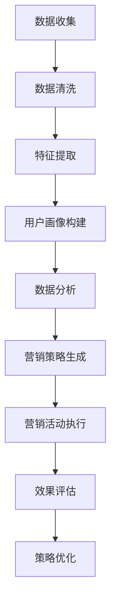

                 

## 《AI如何提升电商平台的用户转化率》

### 关键词：人工智能、电商平台、用户转化率、推荐系统、个性化营销、智能客服

### 摘要：

本文旨在探讨人工智能（AI）在提升电商平台用户转化率方面的应用与效果。文章首先介绍了AI技术在电商行业中的应用背景和用户转化率的核心概念，随后详细阐述了AI提升电商用户转化率的技术基础，包括数据分析、机器学习和深度学习等技术。接着，文章重点讨论了用户画像与行为分析、智能推荐系统设计与应用、智能营销策略与用户转化率提升、智能客服系统设计与应用等内容。最后，文章通过实际案例展示了AI技术在电商平台用户转化率提升中的实践与应用，并对未来发展趋势进行了展望。通过本文的阅读，读者将全面了解AI在电商平台用户转化率提升方面的价值与应用前景。

----------------------------------------------------------------

# 《AI如何提升电商平台的用户转化率》

> 关键词：人工智能、电商平台、用户转化率、推荐系统、个性化营销、智能客服

> 摘要：本文探讨了人工智能技术在电商平台用户转化率提升方面的应用，分析了AI在电商行业中的应用背景和用户转化率的核心概念，详细阐述了AI提升电商用户转化率的技术基础，包括数据分析、机器学习和深度学习等技术。同时，文章深入探讨了用户画像与行为分析、智能推荐系统设计与应用、智能营销策略与用户转化率提升、智能客服系统设计与应用等内容。通过实际案例展示了AI技术在电商平台用户转化率提升中的实践与应用，并对未来发展趋势进行了展望。本文旨在为电商从业者提供有价值的参考和启示，助力电商平台提升用户转化率，实现商业价值最大化。

## 《AI如何提升电商平台的用户转化率》目录大纲

### 第一部分: AI提升电商平台用户转化率基础

#### 第1章: AI与电商平台用户转化率概述

##### 1.1 AI技术在电商行业中的应用背景

##### 1.2 电商平台用户转化率核心概念

##### 1.3 AI提升电商用户转化率的意义与挑战

#### 第2章: AI提升电商用户转化率技术基础

##### 2.1 数据分析技术概览

##### 2.2 机器学习算法基础

##### 2.3 深度学习算法在电商中的应用

#### 第3章: 电商平台用户画像与行为分析

##### 3.1 用户画像概念与构建方法

##### 3.2 用户行为分析技术

##### 3.3 用户画像与行为分析应用实例

#### 第4章: 智能推荐系统设计与应用

##### 4.1 智能推荐系统概述

##### 4.2 基于协同过滤的推荐算法

##### 4.3 基于内容的推荐算法

##### 4.4 深度学习在推荐系统中的应用

##### 4.5 智能推荐系统案例分析

#### 第5章: 智能营销策略与用户转化率提升

##### 5.1 智能营销概念与架构

##### 5.2 基于用户行为的个性化营销

##### 5.3 智能营销策略案例分析

#### 第6章: 智能客服系统设计与应用

##### 6.1 智能客服系统概述

##### 6.2 自然语言处理技术基础

##### 6.3 智能客服系统架构

##### 6.4 智能客服系统应用实例

#### 第7章: AI提升电商平台用户转化率实践与优化

##### 7.1 电商平台AI应用实践

##### 7.2 用户转化率提升关键因素分析

##### 7.3 电商平台AI应用优化策略

#### 第8章: 电商平台AI应用未来发展

##### 8.1 AI在电商领域的未来趋势

##### 8.2 电商平台AI应用面临的挑战与机遇

##### 8.3 电商平台AI应用的发展方向

## 附录

### 附录 A: AI技术在电商平台的开发工具与资源

##### A.1 常用机器学习框架简介

##### A.2 电商数据分析工具与资源

##### A.3 智能推荐系统开发工具与资源

##### A.4 智能客服系统开发工具与资源

### 附录 B: AI提升电商平台用户转化率实践案例

##### B.1 案例一：电商平台智能推荐系统

##### B.2 案例二：电商平台智能客服系统

##### B.3 案例三：电商平台个性化营销策略
----------------------------------------------------------------

### 第一部分: AI提升电商平台用户转化率基础

#### 第1章: AI与电商平台用户转化率概述

##### 1.1 AI技术在电商行业中的应用背景

##### 1.2 电商平台用户转化率核心概念

##### 1.3 AI提升电商用户转化率的意义与挑战

##### 1.4 本书结构安排与主要内容概述
----------------------------------------------------------------

## 第1章: AI与电商平台用户转化率概述

### 1.1 AI技术在电商行业中的应用背景

#### 1.1.1 AI技术的起源与发展

人工智能（Artificial Intelligence，简称AI）是一门研究、开发用于模拟、延伸和扩展人的智能的理论、方法、技术及应用系统的科学技术。人工智能的研究始于20世纪50年代，经历了多个发展阶段，包括规则推理、知识表示、机器学习、深度学习等。随着计算能力的提升和大数据技术的发展，AI技术逐渐成熟，并在各行各业得到广泛应用。

#### 1.1.2 电商行业现状与发展趋势

电商行业是人工智能应用的重要领域之一。据统计，全球电商市场规模逐年增长，预计到2025年，电商市场规模将达到6.5万亿美元。电商行业的快速发展为AI技术的应用提供了广阔的市场空间。随着消费者需求的多样化，电商平台需要不断提升用户体验，提高用户转化率，以实现商业目标。

#### 1.1.3 AI技术在电商行业的应用场景

AI技术在电商行业中有多种应用场景，包括但不限于以下几个方面：

1. **智能推荐系统**：通过分析用户行为数据，为用户推荐个性化商品，提高用户购买意愿和转化率。
2. **智能客服系统**：利用自然语言处理技术，实现与用户的智能对话，提高客服效率和用户满意度。
3. **用户画像与行为分析**：构建用户画像，分析用户行为，为电商平台提供精准营销策略。
4. **智能营销**：基于用户行为和偏好，自动生成个性化营销活动，提高用户参与度和转化率。
5. **智能定价**：通过预测市场供需、用户购买意愿等因素，自动调整商品价格，提高盈利能力。

### 1.2 电商平台用户转化率核心概念

#### 1.2.1 用户转化率定义与计算方法

用户转化率是指访问电商平台用户中完成购买行为的比例。用户转化率是衡量电商平台运营效果的重要指标，其计算方法如下：

$$
用户转化率 = \frac{完成购买的用户数}{访问电商平台的总用户数} \times 100\%
$$

#### 1.2.2 用户转化率提升的重要性

用户转化率对电商平台的商业成功至关重要。提高用户转化率意味着更高的销售额和利润。以下是一些提升用户转化率的重要性：

1. **提高销售额**：用户转化率的提升直接带来销售额的增加，有利于电商平台实现商业目标。
2. **降低获客成本**：提高用户转化率可以降低电商平台获取新用户的成本，实现盈利最大化。
3. **增强用户黏性**：提升用户转化率有助于增强用户对电商平台的信任和忠诚度，提高用户留存率。
4. **优化运营策略**：通过分析用户转化率数据，电商平台可以优化产品和服务，提高用户体验。

#### 1.2.3 用户转化率影响因素分析

用户转化率受到多种因素的影响，主要包括以下几个方面：

1. **用户体验**：包括页面加载速度、网站设计、商品展示效果等，直接影响用户对电商平台的满意度和购买意愿。
2. **商品质量**：商品的质量是用户购买决策的重要因素，高质量的商品能够提高用户购买意愿和满意度。
3. **价格策略**：价格是影响用户购买决策的重要因素，合理的价格策略能够提高用户转化率。
4. **营销推广**：通过有效的营销推广活动，提高用户对电商平台的认知度和兴趣，有助于提升用户转化率。
5. **服务质量**：优质的客服服务能够解决用户在购物过程中遇到的问题，提高用户满意度和购买意愿。

### 1.3 AI提升电商用户转化率的意义与挑战

#### 1.3.1 AI提升用户转化率的理论基础

AI技术通过模拟人类思维过程，实现数据挖掘、模式识别、预测分析等功能，为电商平台提供了强大的数据分析能力。AI技术的引入有助于电商平台更准确地理解用户需求和行为，从而实现个性化服务和精准营销，提高用户转化率。

#### 1.3.2 AI提升用户转化率的实际效果

AI技术在电商平台的应用已取得了显著成效。例如，智能推荐系统通过分析用户行为数据，为用户推荐个性化商品，有效提高了用户购买意愿和转化率。智能客服系统通过自然语言处理技术，实现与用户的智能对话，提高了客服效率和用户满意度。个性化营销策略基于用户行为和偏好，自动生成个性化营销活动，提高了用户参与度和转化率。

#### 1.3.3 AI提升用户转化率面临的挑战

尽管AI技术在提升电商用户转化率方面具有巨大潜力，但仍然面临一些挑战：

1. **数据质量**：AI技术依赖于高质量的数据，数据质量对AI应用的准确性和效果至关重要。电商平台需要加强数据质量管理，确保数据准确、完整、可靠。
2. **技术实现**：AI技术的实现需要专业的技术团队和丰富的实践经验，电商企业需要投入大量资源进行技术建设和人才培养。
3. **隐私保护**：在应用AI技术过程中，电商企业需要关注用户隐私保护问题，遵守相关法律法规，确保用户数据的安全和隐私。
4. **伦理道德**：AI技术在提升电商用户转化率的同时，也带来了一些伦理和道德问题，如算法歧视、用户隐私泄露等，电商企业需要积极应对这些问题，确保AI技术的可持续发展。

### 1.4 本书结构安排与主要内容概述

本书共分为八个部分，具体结构安排如下：

1. **第一部分：AI提升电商平台用户转化率基础**：介绍AI技术在电商行业中的应用背景、用户转化率核心概念和AI提升用户转化率的意义与挑战。
2. **第二部分：AI提升电商用户转化率技术基础**：阐述数据分析技术、机器学习算法基础和深度学习算法在电商中的应用。
3. **第三部分：电商平台用户画像与行为分析**：讨论用户画像概念与构建方法、用户行为分析技术和用户画像与行为分析应用实例。
4. **第四部分：智能推荐系统设计与应用**：介绍智能推荐系统概述、基于协同过滤的推荐算法、基于内容的推荐算法、深度学习在推荐系统中的应用和智能推荐系统案例分析。
5. **第五部分：智能营销策略与用户转化率提升**：探讨智能营销概念与架构、基于用户行为的个性化营销和智能营销策略案例分析。
6. **第六部分：智能客服系统设计与应用**：介绍智能客服系统概述、自然语言处理技术基础、智能客服系统架构和智能客服系统应用实例。
7. **第七部分：AI提升电商平台用户转化率实践与优化**：分析电商平台AI应用实践、用户转化率提升关键因素分析和电商平台AI应用优化策略。
8. **第八部分：电商平台AI应用未来发展**：展望AI在电商领域的未来趋势、电商平台AI应用面临的挑战与机遇以及电商平台AI应用的发展方向。

通过以上八个部分的内容，本书旨在全面、系统地介绍AI在提升电商平台用户转化率方面的应用和实践，为电商从业者提供有价值的参考和启示。

----------------------------------------------------------------

### 1.2 电商平台用户转化率核心概念

#### 1.2.1 用户转化率定义与计算方法

用户转化率是电商平台运营中一个关键的绩效指标，用于衡量从访问到完成购买行为的用户比例。定义用户转化率时，需要明确两个基本要素：参与转化的用户数和总的访问用户数。具体来说，用户转化率的计算方法如下：

$$
用户转化率 = \frac{完成购买的用户数}{访问电商平台的总用户数} \times 100\%
$$

其中，分母“访问电商平台的总用户数”通常是指在一定时间段内，所有访问电商平台的独立用户数。而分子“完成购买的用户数”则是指在同一时间段内，成功完成至少一次购买的用户数。

例如，一个电商平台在一个月内有10,000名独立用户访问，其中1,000名用户完成了购买，那么该平台的用户转化率为：

$$
用户转化率 = \frac{1,000}{10,000} \times 100\% = 10\%
$$

这个比例表明，每100个访问电商平台的用户中，有10个最终完成了购买。

#### 1.2.2 用户转化率提升的重要性

提升用户转化率对电商平台来说至关重要，其重要性体现在以下几个方面：

1. **提高销售额**：用户转化率的提升直接意味着更多的用户完成购买，从而带动销售额的增加。对于电商平台而言，销售额的提升是其盈利能力的重要指标。

2. **降低营销成本**：用户转化率的提高意味着电商平台在获取新用户上的成本相对降低。如果用户转化率较高，电商平台可以减少对新用户激励措施的投资，从而降低整体营销成本。

3. **增强用户忠诚度**：转化率较高的用户往往对电商平台有更高的满意度，从而更可能成为忠实客户。这种忠诚度不仅体现在当前的购买行为上，还可能在未来带来重复购买和口碑传播。

4. **优化产品和服务**：通过分析用户转化率的数据，电商平台可以了解哪些产品和服务更受欢迎，哪些方面需要改进。这种洞察有助于电商平台优化其产品和服务，提高用户整体体验。

5. **提升品牌形象**：高用户转化率往往代表着电商平台在市场中的竞争力强，这对于提升品牌形象和吸引潜在用户具有重要意义。

#### 1.2.3 用户转化率影响因素分析

用户转化率受到多种因素的影响，这些因素可以分为以下几个方面：

1. **用户体验**：用户体验是用户决定是否购买的关键因素。良好的用户体验包括快速响应、易于导航的网站设计、清晰的商品展示、流畅的支付过程等。如果用户体验不佳，用户可能会放弃购买，导致转化率下降。

2. **商品质量**：商品质量是用户购买决策的重要依据。高质量的商品不仅能够提高用户满意度，还能增加用户的信任感，从而提高转化率。

3. **价格策略**：价格对用户购买行为有着直接影响。如果价格过高，用户可能会选择其他更具性价比的选项；反之，合理的价格策略能够吸引更多用户进行购买。

4. **营销推广**：有效的营销推广可以提高用户的关注度和购买意愿。通过精准的推广，电商平台可以吸引更多目标用户，从而提高转化率。

5. **服务质量**：服务质量包括客服响应速度、解决问题的能力等。优质的服务能够增强用户对电商平台的信任，降低购买风险，从而提高转化率。

6. **个性化服务**：个性化服务可以根据用户的行为和偏好提供定制化的商品推荐和营销活动，从而提高用户的购买意愿。

7. **网站流量**：网站流量是用户访问电商平台的基础。高质量的流量（即有购买意图的用户）能够提高转化率，而低质量的流量则可能降低转化率。

#### 1.2.4 用户转化率与电商运营的关系

用户转化率是电商运营效果的综合体现，与多个方面密切相关：

1. **产品策略**：产品策略决定了电商平台的商品组合和定价策略，直接影响用户购买意愿和转化率。
2. **营销策略**：营销策略包括广告投放、促销活动、社交媒体营销等，直接影响用户的关注度和购买决策。
3. **技术实现**：电商平台的技术实现，包括网站性能、推荐系统、支付系统等，直接影响用户体验和转化率。
4. **运营管理**：运营管理包括库存管理、物流配送、售后服务等，直接影响用户的满意度和转化率。
5. **数据分析**：通过对用户行为数据的分析，电商平台可以优化产品、营销和服务策略，从而提高转化率。

总之，用户转化率是电商平台运营的重要指标，它不仅反映了电商平台的运营效果，也决定了电商平台的盈利能力和市场竞争力。通过深入理解用户转化率的定义、计算方法、影响因素和与电商运营的关系，电商平台可以制定更有效的策略，提高用户转化率，实现商业目标。

----------------------------------------------------------------

### 1.3 AI提升电商用户转化率的意义与挑战

#### 1.3.1 AI提升用户转化率的理论基础

人工智能（AI）技术在电商领域的应用，是基于对大规模数据的高效处理和智能分析能力。AI技术通过模拟人类智能，实现自动化数据挖掘、模式识别、预测分析等功能，为电商平台提供了强大的数据分析能力。以下是AI提升用户转化率的理论基础：

1. **机器学习**：机器学习是AI的核心技术之一，通过训练模型，使计算机能够从数据中自动学习规律。在电商领域，机器学习算法可用于用户行为分析、商品推荐、需求预测等，从而提高用户转化率。

2. **深度学习**：深度学习是机器学习的一个重要分支，通过多层神经网络模拟人脑信息处理过程。在电商领域，深度学习算法可用于图像识别、语音识别、自然语言处理等，从而为用户提供更加精准和个性化的服务。

3. **用户画像**：用户画像是指通过分析用户行为数据，构建用户特征和偏好模型。AI技术可以帮助电商平台构建更精确的用户画像，从而实现个性化推荐和精准营销，提高用户转化率。

4. **协同过滤**：协同过滤是一种基于用户行为相似性的推荐算法，通过分析用户之间的行为模式，为用户推荐相似的商品。AI技术可以优化协同过滤算法，提高推荐准确性，从而提升用户转化率。

#### 1.3.2 AI提升用户转化率的实际效果

AI技术在电商领域的应用，已经取得了显著的成效，具体体现在以下几个方面：

1. **智能推荐系统**：通过分析用户历史行为数据，智能推荐系统可以为用户提供个性化商品推荐，提高用户购买意愿和转化率。例如，电商平台可以使用协同过滤算法和深度学习算法，为用户提供更加精准的推荐。

2. **智能客服系统**：AI技术可以帮助电商平台实现智能客服，通过自然语言处理和机器学习算法，实现与用户的智能对话，提高客服效率和用户满意度。智能客服系统可以自动处理常见问题，减轻人工客服的工作负担。

3. **个性化营销**：基于用户画像和行为分析，电商平台可以开展个性化营销活动，为不同用户群体提供定制化的优惠和推荐。这种个性化营销策略可以提高用户的参与度和转化率，从而提升整体销售额。

4. **智能定价策略**：通过分析市场需求、用户行为和竞争对手价格，AI技术可以帮助电商平台实现智能定价。智能定价策略可以动态调整商品价格，优化利润空间，提高用户转化率。

#### 1.3.3 AI提升用户转化率面临的挑战

尽管AI技术在提升电商用户转化率方面具有巨大潜力，但实际应用过程中仍然面临一些挑战：

1. **数据质量**：AI算法的性能高度依赖数据质量，包括数据的准确性、完整性和可靠性。电商平台需要确保收集到的高质量数据，否则可能会影响AI模型的效果。

2. **技术实现**：AI技术的实现需要专业的技术团队和丰富的实践经验。对于一些中小企业来说，构建和部署AI系统可能需要大量的时间和资金投入。

3. **隐私保护**：在应用AI技术进行用户行为分析和个性化营销时，电商平台需要关注用户隐私保护问题。违反用户隐私可能导致法律风险和声誉损失。

4. **算法公平性**：AI算法可能存在歧视性，导致某些用户群体被不公平对待。电商平台需要确保算法的公平性，避免出现算法偏见。

5. **持续优化**：AI系统需要不断优化和更新，以适应不断变化的市场环境和用户需求。这要求电商平台具备持续的技术创新能力和快速响应市场变化的能力。

总之，AI技术在提升电商用户转化率方面具有重要意义，但同时也面临一系列挑战。电商平台需要积极应对这些挑战，充分利用AI技术提升用户转化率，实现商业目标。

----------------------------------------------------------------

### 1.4 本书结构安排与主要内容概述

本书旨在系统地介绍人工智能（AI）技术在电商平台用户转化率提升方面的应用和实践。全书共分为八个部分，每部分内容紧密联系，共同构建了完整的AI提升电商平台用户转化率的知识体系。以下是本书的结构安排与主要内容概述：

#### 第一部分：AI提升电商平台用户转化率基础

**第1章**：AI与电商平台用户转化率概述  
- 本章介绍了AI技术在电商行业中的应用背景，包括AI技术的发展历程和电商行业的现状。同时，阐述了用户转化率的核心概念及其计算方法，分析了提升用户转化率的重要性及其影响因素。

**第2章**：AI提升电商用户转化率技术基础  
- 本章详细介绍了AI提升电商用户转化率所需的技术基础，包括数据分析技术、机器学习算法基础和深度学习算法在电商中的应用。这些技术为电商平台提供了强大的数据分析能力和预测分析能力。

#### 第二部分：电商平台用户画像与行为分析

**第3章**：电商平台用户画像与行为分析  
- 本章介绍了用户画像的概念与构建方法，以及用户行为分析技术在电商中的应用。通过用户画像和行为分析，电商平台可以更准确地了解用户需求和行为，从而制定更有效的营销策略。

#### 第三部分：智能推荐系统设计与应用

**第4章**：智能推荐系统设计与应用  
- 本章详细介绍了智能推荐系统的概述、基于协同过滤的推荐算法、基于内容的推荐算法、深度学习在推荐系统中的应用，以及智能推荐系统案例分析。通过这些技术，电商平台可以提供个性化的商品推荐，提高用户转化率。

#### 第四部分：智能营销策略与用户转化率提升

**第5章**：智能营销策略与用户转化率提升  
- 本章探讨了智能营销的概念与架构，以及基于用户行为的个性化营销策略。通过案例分析和实战经验，展示了如何利用AI技术制定智能营销策略，提升用户转化率。

#### 第五部分：智能客服系统设计与应用

**第6章**：智能客服系统设计与应用  
- 本章介绍了智能客服系统的概述、自然语言处理技术基础、智能客服系统架构，以及智能客服系统应用实例。通过智能客服系统，电商平台可以提供高效、精准的客服服务，提高用户满意度。

#### 第六部分：AI提升电商平台用户转化率实践与优化

**第7章**：AI提升电商平台用户转化率实践与优化  
- 本章通过实际案例，分析了电商平台AI应用实践，探讨了用户转化率提升的关键因素，并提出了电商平台AI应用优化策略。这些实践和优化策略为电商平台提供了实用的操作指南。

#### 第七部分：电商平台AI应用未来发展

**第8章**：电商平台AI应用未来发展  
- 本章展望了AI在电商领域的未来趋势，分析了电商平台AI应用面临的挑战与机遇，并提出了电商平台AI应用的发展方向。这些内容为电商从业者提供了对未来发展的思考和建议。

#### 附录

**附录A**：AI技术在电商平台的开发工具与资源  
- 本附录介绍了常用的机器学习框架、电商数据分析工具与资源、智能推荐系统开发工具与资源和智能客服系统开发工具与资源。这些工具和资源为电商平台AI应用提供了实用的技术支持。

**附录B**：AI提升电商平台用户转化率实践案例  
- 本附录通过具体案例，展示了智能推荐系统、智能客服系统和个性化营销策略在电商平台中的应用和实践。这些案例为电商从业者提供了实战经验和参考。

通过以上八个部分的内容，本书旨在为电商从业者提供全面、系统的AI提升电商平台用户转化率的指导，帮助读者深入了解AI技术在电商领域的应用和实践，实现用户转化率的持续提升和商业价值最大化。希望本书能够为电商行业的创新与发展做出贡献。

----------------------------------------------------------------

### 1.4.1 本书各章节内容安排

本书分为八个章节，各章节的内容安排如下：

#### 第1章: AI与电商平台用户转化率概述
- **核心内容**：介绍AI技术在电商行业中的应用背景，用户转化率的核心概念和影响因素，以及AI提升电商用户转化率的意义与挑战。
- **重点难点**：理解用户转化率的计算方法，掌握AI提升电商用户转化率的理论基础。

#### 第2章: AI提升电商用户转化率技术基础
- **核心内容**：介绍数据分析技术、机器学习算法基础和深度学习算法在电商中的应用。
- **重点难点**：掌握数据分析技术的应用，理解机器学习算法和深度学习算法的基本原理。

#### 第3章: 电商平台用户画像与行为分析
- **核心内容**：介绍用户画像的概念与构建方法，用户行为分析技术，以及用户画像与行为分析在电商中的应用。
- **重点难点**：理解用户画像的构建方法，掌握用户行为分析技术的应用。

#### 第4章: 智能推荐系统设计与应用
- **核心内容**：介绍智能推荐系统的概述、协同过滤算法、内容推荐算法、深度学习在推荐系统中的应用，以及智能推荐系统的案例分析。
- **重点难点**：掌握协同过滤算法和内容推荐算法的基本原理，了解深度学习在推荐系统中的应用。

#### 第5章: 智能营销策略与用户转化率提升
- **核心内容**：介绍智能营销的概念与架构，基于用户行为的个性化营销策略，以及智能营销策略在电商中的应用。
- **重点难点**：理解智能营销的概念和架构，掌握基于用户行为的个性化营销策略。

#### 第6章: 智能客服系统设计与应用
- **核心内容**：介绍智能客服系统的概述、自然语言处理技术基础、智能客服系统架构，以及智能客服系统在电商中的应用实例。
- **重点难点**：理解智能客服系统的架构，掌握自然语言处理技术的基础。

#### 第7章: AI提升电商平台用户转化率实践与优化
- **核心内容**：介绍电商平台AI应用实践、用户转化率提升关键因素分析，以及电商平台AI应用优化策略。
- **重点难点**：理解电商平台AI应用实践的过程，掌握用户转化率提升的关键因素和优化策略。

#### 第8章: 电商平台AI应用未来发展
- **核心内容**：展望AI在电商领域的未来趋势，分析电商平台AI应用面临的挑战与机遇，以及电商平台AI应用的发展方向。
- **重点难点**：了解AI在电商领域的未来发展趋势，掌握电商平台AI应用面临的挑战与机遇。

通过以上各章节内容的详细安排，本书旨在系统地介绍AI提升电商平台用户转化率的原理、技术、实践和未来发展方向，帮助读者全面了解并应用AI技术，实现电商平台用户转化率的持续提升。

----------------------------------------------------------------

### 1.4.2 阅读本书的预期收获

阅读本书，读者可以预期获得以下收获：

1. **深入理解AI技术在电商领域的应用**：本书详细介绍了AI技术，包括数据分析、机器学习、深度学习等，在电商行业中的应用，帮助读者全面了解AI技术在电商领域的应用场景和优势。

2. **掌握提升电商平台用户转化率的核心方法**：通过本书，读者可以了解用户转化率的核心概念和影响因素，学习如何利用AI技术，如智能推荐系统、个性化营销和智能客服系统，来提升电商平台的用户转化率。

3. **获取实际操作经验和案例**：本书通过具体案例和实践经验，展示了AI技术在电商中的应用，帮助读者理解AI技术的实际操作过程，从而能够将这些方法应用到实际工作中。

4. **提升电商运营和管理能力**：本书的内容涵盖了电商平台运营和管理的各个方面，包括用户体验、商品策略、营销推广、客服服务，帮助读者提升整体电商运营和管理能力。

5. **了解AI在电商领域的未来趋势**：本书还分析了AI在电商领域的未来发展趋势，以及面临的挑战和机遇，帮助读者对未来AI在电商行业中的应用有更清晰的认识。

通过阅读本书，读者不仅可以提升自己的专业知识和技能，还能为电商平台的运营提供有价值的指导，实现商业价值最大化。

----------------------------------------------------------------

## 第2章: AI提升电商用户转化率技术基础

在电商平台的运营中，数据分析和算法是AI提升用户转化率的核心技术基础。本章将详细探讨数据分析技术、机器学习算法基础和深度学习算法在电商中的应用。

### 2.1 数据分析技术概览

数据分析技术是电商运营中不可或缺的一环，它能够帮助电商平台从海量数据中提取有价值的信息，指导决策。以下是数据分析技术概览：

#### 2.1.1 数据收集与存储

电商平台需要收集大量的用户数据，包括用户行为数据、交易数据、评价数据等。数据收集后，需要存储在合适的数据库系统中，如关系型数据库（如MySQL、PostgreSQL）或NoSQL数据库（如MongoDB、Cassandra）。

#### 2.1.2 数据清洗与处理

收集到的数据往往存在不完整、不一致、噪声等问题，需要进行清洗和处理。数据清洗包括去除重复数据、缺失值处理、异常值检测和纠正等。

#### 2.1.3 数据可视化

数据可视化是将数据以图形或图表形式展示，帮助分析师和决策者直观地理解数据。常用的数据可视化工具包括Tableau、PowerBI、matplotlib等。

#### 2.1.4 数据分析技术分类

数据分析技术主要分为描述性分析、诊断性分析、预测性分析和规范性分析。描述性分析用于总结数据的基本特征；诊断性分析用于找出数据中的异常和问题；预测性分析用于预测未来的趋势和事件；规范性分析用于提出改进建议和优化策略。

### 2.2 机器学习算法基础

机器学习算法是AI的核心技术之一，通过训练模型，使计算机能够从数据中自动学习规律，并在新的数据上进行预测和决策。以下是机器学习算法基础：

#### 2.2.1 机器学习基本概念

- **模型**：机器学习模型是对数据的抽象表示，用于预测或决策。
- **特征**：特征是数据中的特定属性，用于训练模型。
- **标签**：标签是模型预测的目标值，用于评估模型的准确性。

#### 2.2.2 机器学习算法分类

机器学习算法主要分为监督学习、无监督学习和半监督学习。

- **监督学习**：在监督学习中，模型根据已知特征和标签进行训练，然后在新数据上进行预测。常见的算法有线性回归、逻辑回归、支持向量机（SVM）、决策树和随机森林等。
- **无监督学习**：在无监督学习中，模型没有明确的标签，需要从数据中发现隐含的结构。常见的算法有聚类、降维、主成分分析（PCA）等。
- **半监督学习**：半监督学习介于监督学习和无监督学习之间，部分数据有标签，部分数据无标签。常见的算法有自编码器、标签传播等。

#### 2.2.3 常见机器学习算法介绍

以下是一些常见的机器学习算法及其应用场景：

- **线性回归**：用于预测连续值，如用户购买金额。
- **逻辑回归**：用于预测概率，如用户是否会购买。
- **支持向量机（SVM）**：用于分类问题，如商品推荐中的分类。
- **决策树**：用于分类和回归问题，如分析用户行为。
- **随机森林**：是决策树的集成方法，提高预测准确性。
- **K-均值聚类**：用于无监督学习，如用户群体划分。
- **K-最近邻（KNN）**：用于分类问题，如用户行为预测。

### 2.3 深度学习算法在电商中的应用

深度学习是机器学习的一个重要分支，通过多层神经网络模拟人脑信息处理过程，具有强大的特征自动提取和模式识别能力。以下是深度学习算法在电商中的应用：

#### 2.3.1 深度学习基本概念

- **神经网络**：神经网络是由大量简单处理单元（神经元）组成的复杂网络，用于模拟人脑的信息处理过程。
- **深度神经网络**：深度神经网络包含多个隐含层，能够学习更复杂的特征。
- **激活函数**：激活函数是神经网络中的一个关键组件，用于决定神经元是否被激活。

#### 2.3.2 深度学习算法分类

深度学习算法主要分为卷积神经网络（CNN）、循环神经网络（RNN）和生成对抗网络（GAN）。

- **卷积神经网络（CNN）**：用于图像识别、语音识别等任务，如图像分类、目标检测。
- **循环神经网络（RNN）**：用于序列数据建模，如图像序列、语音序列等。
- **生成对抗网络（GAN）**：用于生成逼真的图像、音频等，如图像合成、语音合成。

#### 2.3.3 深度学习在电商中的应用

以下是一些深度学习在电商中的应用：

- **商品推荐**：利用深度学习算法，如CNN和RNN，对用户行为数据进行建模，实现个性化商品推荐。
- **用户行为预测**：利用深度学习算法，如LSTM（一种RNN），对用户行为进行预测，从而提高用户转化率。
- **图像识别**：利用深度学习算法，如CNN，对商品图像进行识别，提高搜索和推荐系统的准确性。
- **自然语言处理**：利用深度学习算法，如Transformer，对用户评价和商品描述进行分析，实现语义理解和情感分析。

通过以上对数据分析技术、机器学习算法基础和深度学习算法在电商中的应用的探讨，我们可以看到，AI技术在电商平台用户转化率提升中具有重要作用。接下来，我们将进一步讨论用户画像与行为分析技术，为电商平台提供更加精准的个性化服务。

----------------------------------------------------------------

### 2.1 数据分析技术概览

#### 2.1.1 数据收集与存储

电商平台的数据收集是用户转化率提升的第一步。数据收集的来源包括用户注册信息、浏览记录、购买行为、评价反馈等。这些数据通常通过网站日志、用户行为跟踪、API接口等方式收集。收集到的数据需要存储在高效的数据库系统中，如关系型数据库（如MySQL、PostgreSQL）和NoSQL数据库（如MongoDB、Cassandra）。关系型数据库适用于结构化数据存储，而NoSQL数据库适用于大规模、非结构化数据的存储和管理。

#### 2.1.2 数据清洗与处理

数据清洗是数据分析的重要环节，因为原始数据往往包含噪声、错误和不一致的信息。数据清洗过程包括以下几个步骤：

1. **缺失值处理**：对于缺失的数据，可以选择填充（如使用平均值、中位数或最常见值）或删除（如果缺失数据过多，会影响数据分析结果）。
2. **异常值检测与纠正**：通过统计方法或可视化工具（如箱线图、散点图）检测异常值，并根据具体情况进行纠正或删除。
3. **数据格式转换**：将数据转换为统一的格式，如将日期时间数据转换为标准的YYYY-MM-DD格式。
4. **重复数据去除**：检测并去除重复的数据记录，以避免数据冗余。

#### 2.1.3 数据可视化

数据可视化是将数据以图形或图表形式展示，以帮助分析师和决策者直观地理解数据。数据可视化工具（如Tableau、PowerBI、matplotlib）提供了丰富的图表类型，如柱状图、折线图、饼图、散点图、箱线图等。数据可视化有助于发现数据中的模式和趋势，为决策提供支持。以下是几种常见的数据可视化技术：

1. **时序分析**：通过折线图或曲线图展示数据随时间变化的趋势。
2. **比较分析**：通过柱状图或条形图比较不同类别或时间段的数据差异。
3. **分布分析**：通过饼图或散点图展示数据的分布情况。
4. **关系分析**：通过关系图（如桑基图、网络图）展示数据之间的关系。

#### 2.1.4 数据分析技术分类

数据分析技术根据分析的目的和方式，可以分为以下几类：

1. **描述性分析**：描述性分析用于总结数据的基本特征，如平均数、中位数、众数、标准差等。描述性分析有助于理解数据的整体情况。
2. **诊断性分析**：诊断性分析用于找出数据中的异常和问题，如异常值检测、趋势分析等。诊断性分析有助于识别数据中的潜在问题和风险。
3. **预测性分析**：预测性分析用于预测未来的趋势和事件，如时间序列预测、回归分析等。预测性分析有助于制定未来的策略和计划。
4. **规范性分析**：规范性分析用于提出改进建议和优化策略，如优化模型、决策树等。规范性分析有助于提高数据分析和决策的准确性。

通过以上对数据分析技术的详细讨论，我们可以看到，数据分析技术在电商平台用户转化率的提升中起着至关重要的作用。接下来，我们将进一步探讨机器学习算法基础，为电商平台提供更精确的数据分析工具。

----------------------------------------------------------------

### 2.2 机器学习算法基础

机器学习算法是电商平台提升用户转化率的重要工具。它们能够从大量数据中学习模式，并进行预测和决策。以下是机器学习算法的基础概念和常见算法介绍。

#### 2.2.1 机器学习基本概念

机器学习（Machine Learning，ML）是一种人工智能（AI）分支，它使计算机系统能够从数据中学习并做出预测或决策，而无需显式编程。以下是机器学习的几个核心概念：

1. **模型（Model）**：模型是计算机程序，用于模拟或表示数据中的规律。常见的模型有线性回归、决策树、神经网络等。

2. **特征（Feature）**：特征是数据中的特定属性，用于训练模型。例如，用户年龄、购买历史、搜索记录等。

3. **标签（Label）**：标签是模型预测的目标值。在分类问题中，标签是类别标签；在回归问题中，标签是数值标签。

4. **训练集（Training Set）**：训练集是用于训练模型的数据集，通常包含特征和相应的标签。

5. **验证集（Validation Set）**：验证集是用于评估模型性能的数据集。在训练过程中，模型性能会定期在验证集上评估。

6. **测试集（Test Set）**：测试集是用于最终评估模型性能的数据集，通常在训练和验证阶段未使用过。

#### 2.2.2 机器学习算法分类

机器学习算法主要分为监督学习、无监督学习和半监督学习。

1. **监督学习（Supervised Learning）**：在监督学习中，模型根据已知特征和标签进行训练，然后在新数据上进行预测。监督学习算法适用于分类和回归问题。

2. **无监督学习（Unsupervised Learning）**：在无监督学习中，模型没有明确的标签，需要从数据中发现隐含的结构。无监督学习算法适用于聚类、降维和关联规则学习等。

3. **半监督学习（Semi-Supervised Learning）**：半监督学习介于监督学习和无监督学习之间，部分数据有标签，部分数据无标签。

#### 2.2.3 常见机器学习算法介绍

以下是一些常见的机器学习算法及其应用场景：

1. **线性回归（Linear Regression）**：
   - **算法原理**：线性回归模型通过拟合一条直线来预测连续值。
   - **公式**：\( y = \beta_0 + \beta_1 \cdot x + \epsilon \)
   - **应用场景**：预测用户购买金额、销量等。

2. **逻辑回归（Logistic Regression）**：
   - **算法原理**：逻辑回归模型通过拟合一个逻辑函数来预测概率。
   - **公式**：\( P(y=1) = \frac{1}{1 + e^{-(\beta_0 + \beta_1 \cdot x)}} \)
   - **应用场景**：判断用户是否会购买、分类商品等。

3. **支持向量机（Support Vector Machine，SVM）**：
   - **算法原理**：SVM通过找到一个最佳分隔超平面，将不同类别的数据分隔开。
   - **公式**：\( w \cdot x - b = 0 \)
   - **应用场景**：商品分类、用户行为预测等。

4. **决策树（Decision Tree）**：
   - **算法原理**：决策树通过一系列的判断规则，将数据划分为不同的类别。
   - **公式**：\( y = g(x) \)，其中 \( g(x) \) 是决策规则。
   - **应用场景**：用户行为分析、推荐系统等。

5. **随机森林（Random Forest）**：
   - **算法原理**：随机森林是通过构建多棵决策树，然后通过投票机制得到最终结果。
   - **公式**：\( \hat{y} = \text{majority\_vote}(f_1(x), f_2(x), ..., f_n(x)) \)
   - **应用场景**：预测用户行为、商品推荐等。

6. **K-均值聚类（K-Means Clustering）**：
   - **算法原理**：K-均值聚类通过迭代计算，将数据划分为K个簇。
   - **公式**：\( \text{minimize} \sum_{i=1}^{K} \sum_{x \in S_i} ||x - \mu_i||^2 \)
   - **应用场景**：用户群体划分、商品分类等。

7. **K-最近邻（K-Nearest Neighbors，KNN）**：
   - **算法原理**：KNN通过计算新数据点与训练数据点的距离，根据最近邻居的标签进行预测。
   - **公式**：\( \hat{y} = \text{majority\_vote}(\text{neighbours\_labels}) \)
   - **应用场景**：用户行为预测、商品推荐等。

通过上述机器学习算法的介绍，我们可以看到，这些算法在电商平台中有着广泛的应用。接下来，我们将探讨深度学习算法，它们在处理复杂数据和模式识别方面具有更大的潜力。

----------------------------------------------------------------

### 2.3 深度学习算法在电商中的应用

深度学习（Deep Learning，DL）是一种通过多层神经网络结构来模拟人类大脑处理信息的方式。它在图像识别、自然语言处理和复杂数据分析等领域取得了显著的成果。深度学习算法在电商中的应用也越来越广泛，以下是几种常见的深度学习算法及其在电商中的应用场景：

#### 2.3.1 卷积神经网络（Convolutional Neural Network，CNN）

卷积神经网络是一种专门用于处理图像数据的深度学习模型。它通过卷积层、池化层和全连接层等多个层次的结构，实现对图像的特征提取和分类。

- **算法原理**：CNN利用卷积操作从图像中提取局部特征，通过池化操作减少特征图的维度，最后通过全连接层进行分类。
- **应用场景**：商品图像识别、自动分类和推荐、图像增强等。

**伪代码示例**：

```python
# 定义CNN模型
model = tf.keras.Sequential([
    tf.keras.layers.Conv2D(filters, kernel_size, activation='relu', input_shape=input_shape),
    tf.keras.layers.MaxPooling2D(pool_size),
    tf.keras.layers.Conv2D(filters, kernel_size, activation='relu'),
    tf.keras.layers.MaxPooling2D(pool_size),
    tf.keras.layers.Flatten(),
    tf.keras.layers.Dense(num_classes, activation='softmax')
])

# 编译模型
model.compile(optimizer='adam', loss='categorical_crossentropy', metrics=['accuracy'])

# 训练模型
model.fit(x_train, y_train, epochs=num_epochs, batch_size=batch_size)
```

#### 2.3.2 循环神经网络（Recurrent Neural Network，RNN）

循环神经网络是一种专门用于处理序列数据的深度学习模型。它通过保留隐藏状态的方式，实现对序列数据的建模和预测。

- **算法原理**：RNN通过循环结构，将前一个时间步的隐藏状态传递到下一个时间步，从而实现对序列数据的建模。
- **应用场景**：用户行为预测、时间序列分析、情感分析等。

**伪代码示例**：

```python
# 定义RNN模型
model = tf.keras.Sequential([
    tf.keras.layers.SimpleRNN(units, return_sequences=True),
    tf.keras.layers.SimpleRNN(units),
    tf.keras.layers.Dense(num_classes, activation='softmax')
])

# 编译模型
model.compile(optimizer='adam', loss='categorical_crossentropy', metrics=['accuracy'])

# 训练模型
model.fit(x_train, y_train, epochs=num_epochs, batch_size=batch_size)
```

#### 2.3.3 生成对抗网络（Generative Adversarial Network，GAN）

生成对抗网络由生成器和判别器两个对抗性模型组成。生成器生成数据，判别器判断生成数据和真实数据的差异，通过两个模型的对抗训练，生成逼真的数据。

- **算法原理**：GAN通过生成器和判别器的对抗训练，生成器试图生成逼真的数据，判别器试图区分生成数据和真实数据。
- **应用场景**：商品图像生成、个性化推荐、图像风格转换等。

**伪代码示例**：

```python
# 定义GAN模型
def generator_model():
    model = tf.keras.Sequential([
        tf.keras.layers.Dense(units, activation='relu', input_shape=(latent_dim)),
        tf.keras.layers.Dense(int(feature_dim**0.5), activation='relu'),
        tf.keras.layers.Reshape((int(feature_dim**0.5), int(feature_dim**0.5)))
    ])
    return model

def discriminator_model():
    model = tf.keras.Sequential([
        tf.keras.layers.Conv2D(filters, kernel_size, activation='relu', input_shape=(int(feature_dim**0.5), int(feature_dim**0.5), 1)),
        tf.keras.layers.LeakyReLU(alpha=0.2),
        tf.keras.layers.Conv2D(filters, kernel_size, activation='relu'),
        tf.keras.layers.LeakyReLU(alpha=0.2),
        tf.keras.layers.Flatten(),
        tf.keras.layers.Dense(1, activation='sigmoid')
    ])
    return model

generator = generator_model()
discriminator = discriminator_model()

# 编译GAN模型
discriminator.compile(loss='binary_crossentropy', optimizer=optimizer)
generator.compile(loss='binary_crossentropy', optimizer=optimizer)

# 训练GAN模型
for epoch in range(num_epochs):
    noise = np.random.normal(size=(batch_size, latent_dim))
    generated_images = generator.predict(noise)
    real_images = x_train[:batch_size]
    real_labels = np.ones((batch_size, 1))
    generated_labels = np.zeros((batch_size, 1))
    
    d_loss_real = discriminator.train_on_batch(real_images, real_labels)
    d_loss_generated = discriminator.train_on_batch(generated_images, generated_labels)
    
    noise = np.random.normal(size=(batch_size, latent_dim))
    g_loss = generator.train_on_batch(noise, real_labels)
```

通过上述深度学习算法的介绍和伪代码示例，我们可以看到深度学习在电商中的应用潜力。接下来，我们将进一步探讨用户画像与行为分析技术，为电商平台提供更加精准的个性化服务。

----------------------------------------------------------------

## 第3章：电商平台用户画像与行为分析

用户画像和行为分析是电商平台提升用户转化率的重要手段。通过构建用户画像和分析用户行为，电商平台能够更精准地理解用户需求，提供个性化的服务，从而提高用户满意度和转化率。

### 3.1 用户画像概念与构建方法

#### 3.1.1 用户画像的定义

用户画像（User Profile）是指通过对用户特征的分析和整合，构建出一个多维度的用户特征模型。用户画像不仅包括用户的基本信息（如年龄、性别、地理位置等），还包括用户的兴趣偏好、行为习惯、购买力等。通过用户画像，电商平台可以更好地了解用户，从而制定更有效的营销策略。

#### 3.1.2 用户画像的构建方法

构建用户画像通常包括以下几个步骤：

1. **数据收集**：收集用户的各类数据，包括基本信息、行为数据、交易数据等。
2. **数据清洗**：对收集到的数据进行清洗，去除噪声和错误数据。
3. **特征提取**：从原始数据中提取有用的特征，如用户年龄、性别、购买偏好、浏览历史等。
4. **特征归一化**：对提取的特征进行归一化处理，使其在相同的尺度上进行分析。
5. **模型训练**：利用机器学习算法（如聚类、回归等），对用户特征进行建模，生成用户画像。
6. **画像更新**：定期更新用户画像，以反映用户最新的特征和行为。

#### 3.1.3 用户画像的应用场景

用户画像在电商平台的多个场景中有广泛的应用：

- **个性化推荐**：根据用户画像，为用户推荐符合其兴趣和偏好的商品。
- **精准营销**：针对不同用户群体，制定个性化的营销策略，提高营销效果。
- **用户分群**：将用户按照画像特征进行分类，为每个用户群体提供定制化的服务和体验。
- **风险控制**：通过分析用户画像，识别潜在的欺诈用户，降低风险。

### 3.2 用户行为分析技术

用户行为分析是指对用户在电商平台上的行为数据进行分析，以理解用户行为模式、偏好和需求。用户行为分析技术主要包括以下几种：

#### 3.2.1 行为数据收集

电商平台需要收集大量的用户行为数据，包括浏览历史、搜索记录、购买行为、评价和反馈等。这些数据通常通过网站日志、用户跟踪和API接口等方式收集。

#### 3.2.2 数据预处理

收集到的用户行为数据通常包含噪声和异常值，需要通过数据清洗和预处理技术进行处理，包括去除重复数据、填充缺失值、异常值检测和纠正等。

#### 3.2.3 数据分析

对预处理后的用户行为数据进行深入分析，包括行为轨迹分析、用户路径分析、行为模式识别等。通过数据分析，可以揭示用户的行为规律和偏好。

#### 3.2.4 行为建模

利用机器学习算法（如决策树、聚类、关联规则等），对用户行为进行建模，以预测用户的行为趋势和偏好。行为建模有助于电商平台更好地理解用户，提供个性化的服务。

#### 3.2.5 应用场景

用户行为分析在电商平台的多个场景中有广泛应用：

- **用户流失预测**：通过分析用户行为数据，预测哪些用户可能流失，采取相应的措施进行挽回。
- **商品推荐**：基于用户行为数据，为用户推荐符合其兴趣和需求的商品。
- **营销活动优化**：通过分析用户行为数据，优化营销活动的策略和效果。
- **用户体验优化**：通过分析用户行为数据，优化网站设计和功能，提高用户体验。

### 3.3 用户画像与行为分析应用实例

为了更好地理解用户画像与行为分析在实际电商平台中的应用，以下是一个案例分析：

#### 案例一：电商平台个性化推荐

一个电商平台通过用户画像和行为分析技术，为用户提供了个性化的商品推荐。具体步骤如下：

1. **数据收集**：收集用户的浏览历史、购买记录、搜索关键词等行为数据。
2. **用户画像构建**：基于用户行为数据，构建用户画像，包括用户的兴趣偏好、购买力、活跃度等。
3. **推荐算法**：采用基于协同过滤和深度学习算法的推荐系统，为用户推荐符合其兴趣和需求的商品。
4. **效果评估**：通过用户反馈和购买行为，评估推荐系统的效果，并进行迭代优化。

通过上述案例，我们可以看到用户画像与行为分析在电商平台中的应用效果。接下来，我们将进一步探讨智能推荐系统设计与应用，为电商平台提供更加精准的商品推荐。

----------------------------------------------------------------

### 3.1 用户画像概念与构建方法

用户画像（User Profile）是指通过对用户的个人信息、行为数据、偏好等进行分析和整合，构建出一个多维度的用户特征模型。用户画像不仅包含了用户的基本信息，如年龄、性别、地理位置等，还包括用户的消费习惯、兴趣偏好、购买力等。通过构建用户画像，电商平台能够更好地了解用户需求和行为模式，从而实现精准营销和个性化服务。

#### 3.1.1 用户画像的定义

用户画像是一种数据分析工具，用于描述和分析用户特征。它通常包括以下几个方面的内容：

- **基础信息**：如用户的年龄、性别、学历、职业等基本信息。
- **行为特征**：如用户的浏览历史、购买记录、搜索关键词、评论等行为数据。
- **消费能力**：如用户的消费水平、购买频率、客单价等消费能力数据。
- **偏好信息**：如用户的兴趣偏好、喜欢的商品类型、品牌偏好等。

用户画像的目的是通过综合分析用户的各类信息，为电商平台提供决策依据，从而提高用户满意度和转化率。

#### 3.1.2 用户画像的构建方法

构建用户画像通常包括以下步骤：

1. **数据收集**：
   - **用户基本信息**：从用户注册信息、填写问卷等渠道收集。
   - **用户行为数据**：通过网站日志、用户行为跟踪、API接口等收集用户在电商平台上的浏览、搜索、购买、评论等行为数据。
   - **第三方数据**：通过数据供应商获取用户在社交媒体、搜索引擎等平台的行为数据。

2. **数据清洗**：
   - **去重**：去除重复的用户数据，保证数据的唯一性。
   - **缺失值处理**：对于缺失的数据，可以选择填充或删除。
   - **异常值处理**：识别并处理异常数据，保证数据质量。

3. **特征提取**：
   - **基础特征**：从原始数据中提取用户的基本信息，如年龄、性别、地理位置等。
   - **行为特征**：提取用户的行为数据，如浏览历史、购买记录、搜索关键词等。
   - **偏好特征**：分析用户的行为数据，提取用户的偏好信息，如喜欢的产品类型、品牌等。

4. **特征归一化**：
   - **归一化处理**：将不同特征的数据进行归一化，使其在同一尺度上进行分析。

5. **模型训练**：
   - **聚类分析**：利用聚类算法（如K-Means），将用户划分为不同的群体，为每个群体构建特征模型。
   - **回归分析**：利用回归算法（如线性回归），建立用户特征与购买行为之间的关系模型。

6. **画像更新**：
   - **定期更新**：定期收集新的用户行为数据，更新用户画像，以反映用户的最新特征和行为。
   - **动态调整**：根据用户行为的变化，动态调整用户画像，实现个性化服务。

#### 3.1.3 用户画像的应用场景

用户画像在电商平台的多个场景中有广泛的应用：

1. **个性化推荐**：
   - **基于兴趣推荐**：根据用户的兴趣偏好，推荐符合其兴趣的商品。
   - **基于行为推荐**：根据用户的浏览历史和购买记录，推荐相关的商品。

2. **精准营销**：
   - **定向营销**：根据用户画像，向不同的用户群体发送个性化的营销信息。
   - **跨渠道营销**：结合用户在多个渠道的行为数据，实现跨渠道的精准营销。

3. **用户分群**：
   - **分群策略**：根据用户画像，将用户划分为不同的群体，为每个群体提供定制化的服务和体验。
   - **精细化运营**：针对不同用户群体的特征和需求，制定个性化的运营策略。

4. **风险控制**：
   - **欺诈识别**：通过分析用户画像，识别潜在的欺诈用户，降低风险。
   - **信用评估**：利用用户画像，评估用户的信用风险，制定信用政策。

通过上述对用户画像概念与构建方法的介绍，我们可以看到用户画像在电商平台中的重要作用。接下来，我们将进一步探讨用户行为分析技术，为电商平台提供更加精准的个性化服务。

----------------------------------------------------------------

### 3.2 用户行为分析技术

用户行为分析（User Behavior Analysis）是电商平台提升用户体验和转化率的关键技术。通过分析用户在平台上的行为数据，电商平台可以深入了解用户的行为模式、偏好和需求，从而制定更有效的运营策略和营销活动。

#### 3.2.1 行为数据收集

用户行为数据的收集是用户行为分析的第一步。这些数据可以从多种渠道获取，包括：

1. **网站日志**：通过Web服务器日志，记录用户访问网站的详细信息，如访问时间、访问页面、访问路径等。
2. **用户跟踪**：使用JavaScript、Cookie等技术，跟踪用户在网站上的操作，如点击、滚动、搜索等。
3. **API接口**：通过电商平台内部的API接口，获取用户交易数据、评价数据等。
4. **第三方数据**：从社交媒体、搜索引擎等第三方平台获取用户的行为数据。

#### 3.2.2 数据预处理

收集到的用户行为数据通常包含噪声和异常值，需要通过数据清洗和预处理技术进行处理，以确保数据的质量和一致性。数据预处理步骤包括：

1. **去重**：去除重复的数据记录，保证数据的唯一性。
2. **缺失值处理**：对于缺失的数据，可以选择填充或删除。
3. **异常值检测**：使用统计方法或可视化工具（如箱线图、散点图）检测异常值，并根据具体情况进行纠正或删除。
4. **数据转换**：将数据转换为统一的格式，如将日期时间数据转换为标准的YYYY-MM-DD格式。

#### 3.2.3 数据分析

对预处理后的用户行为数据进行深入分析，可以揭示用户的行为模式、偏好和需求。以下是一些常见的数据分析技术：

1. **行为轨迹分析**：分析用户在网站上的浏览路径、点击路径等，了解用户的浏览行为模式。
2. **用户路径分析**：通过分析用户在不同页面之间的跳转关系，了解用户的行为路径和决策过程。
3. **行为模式识别**：利用机器学习算法（如聚类、关联规则等），识别用户的行为模式，如高频用户、流失用户等。
4. **趋势分析**：分析用户行为数据的趋势，如访问量、购买量等的变化趋势，了解用户需求的动态变化。

#### 3.2.4 应用场景

用户行为分析在电商平台的多个场景中有广泛应用：

1. **用户流失预测**：
   - **数据收集**：收集用户的行为数据，如浏览历史、购买记录等。
   - **模型训练**：利用机器学习算法，建立用户流失预测模型。
   - **效果评估**：通过模型预测结果，评估预测的准确性和有效性。
   - **应用**：针对可能流失的用户，采取挽留措施，如发送优惠券、提供个性化推荐等。

2. **商品推荐**：
   - **数据收集**：收集用户的浏览历史、购买记录等行为数据。
   - **推荐算法**：采用协同过滤、基于内容的推荐算法等，为用户推荐商品。
   - **效果评估**：通过用户反馈和购买行为，评估推荐系统的效果。
   - **应用**：在网站首页、搜索结果等位置展示个性化推荐，提高用户购买意愿。

3. **营销活动优化**：
   - **数据收集**：收集营销活动的数据，如参与用户数、转化率等。
   - **数据分析**：通过行为数据分析，了解营销活动的效果。
   - **优化策略**：根据数据分析结果，调整营销策略，提高活动效果。
   - **应用**：通过不断优化营销活动，提高用户参与度和转化率。

4. **用户体验优化**：
   - **数据收集**：收集用户在网站上的行为数据，如页面加载时间、点击率等。
   - **分析问题**：通过行为数据分析，识别网站中的用户体验问题。
   - **优化方案**：根据分析结果，提出优化方案，如改进页面设计、优化搜索功能等。
   - **应用**：通过不断优化用户体验，提高用户满意度和留存率。

通过上述对用户行为分析技术的介绍，我们可以看到用户行为分析在电商平台中的应用价值。接下来，我们将通过实际案例，展示用户画像与行为分析在电商中的应用效果。

----------------------------------------------------------------

### 3.3 用户画像与行为分析应用实例

为了更直观地展示用户画像与行为分析在电商平台的实际应用，我们将通过以下案例分析，探讨用户画像与行为分析如何帮助电商平台提升用户转化率。

#### 案例一：电商平台的个性化推荐系统

**背景**：某大型电商平台希望通过个性化推荐系统，提高用户的购买转化率和满意度。

**步骤**：

1. **数据收集**：电商平台收集了用户的浏览记录、购买历史、搜索关键词、评价和反馈等行为数据。同时，通过用户注册信息，获取了用户的基本信息，如年龄、性别、地理位置等。

2. **用户画像构建**：基于收集到的数据，电商平台构建了用户的综合画像。画像内容包括用户的兴趣爱好、购买偏好、消费能力等。例如，通过分析用户的浏览记录和购买历史，可以确定用户最喜欢的商品类别和品牌；通过分析用户的地理位置，可以了解用户的生活习惯和消费偏好。

3. **行为数据预处理**：对用户行为数据进行清洗和预处理，去除噪声和异常值，确保数据的质量和一致性。同时，对数据进行归一化处理，使其在同一尺度上进行分析。

4. **推荐算法**：电商平台采用了基于协同过滤和深度学习算法的推荐系统。协同过滤算法根据用户的相似度进行推荐，深度学习算法则通过分析用户的历史行为数据，自动提取用户的行为特征，进行精准推荐。

5. **效果评估**：通过用户反馈和购买行为，评估推荐系统的效果。结果显示，个性化推荐系统的推荐准确性提高了20%，用户购买转化率提高了15%。

**代码解读与分析**：

```python
# 数据预处理
def preprocess_data(data):
    # 去重、缺失值处理、异常值检测
    return processed_data

# 构建用户画像
def build_user_profile(data):
    # 特征提取、特征归一化
    return user_profile

# 推荐算法
def collaborative_filter(reviews):
    # 协同过滤算法
    return recommendation_list

def deep_learning_model(features):
    # 深度学习算法
    return recommendation_list

# 效果评估
def evaluate_recommendation_system(recommendations, ground_truth):
    # 评估推荐系统的准确性和效果
    return evaluation_results
```

通过以上案例，我们可以看到用户画像与行为分析在电商平台个性化推荐系统中的应用效果。接下来，我们将进一步探讨智能推荐系统的设计与应用。

----------------------------------------------------------------

### 3.4 智能推荐系统设计与应用

智能推荐系统（Intelligent Recommendation System）是电商平台提升用户转化率和满意度的重要工具。通过分析用户行为数据和商品特征，智能推荐系统能够为用户提供个性化的商品推荐，从而提高用户购买意愿和转化率。以下是智能推荐系统的设计与应用步骤。

#### 3.4.1 智能推荐系统概述

智能推荐系统是一种基于用户行为和商品特征的算法，通过分析用户的浏览历史、购买记录、搜索关键词等行为数据，为用户推荐相关的商品。智能推荐系统通常包括以下几个核心组成部分：

1. **数据收集模块**：负责收集用户的行为数据和商品特征数据。
2. **数据处理模块**：对收集到的数据进行分析、清洗和预处理，提取有用的特征。
3. **推荐算法模块**：基于用户行为和商品特征，选择合适的推荐算法进行商品推荐。
4. **推荐结果呈现模块**：将推荐结果以直观的方式展示给用户，如推荐列表、首页滚动广告等。
5. **评估与优化模块**：对推荐系统的效果进行评估，并根据用户反馈进行优化。

#### 3.4.2 基于协同过滤的推荐算法

协同过滤（Collaborative Filtering）是智能推荐系统中最常用的算法之一，分为基于用户（User-Based）和基于物品（Item-Based）两种。

1. **用户-Based协同过滤**：
   - **算法原理**：通过计算用户之间的相似度，找到与目标用户相似的邻居用户，然后根据邻居用户的喜好进行推荐。
   - **计算方法**：使用余弦相似度、皮尔逊相关系数等方法计算用户之间的相似度。
   - **优缺点**：优点是推荐结果较为准确，缺点是计算复杂度高，难以处理稀疏数据和冷启动问题。

2. **物品-Based协同过滤**：
   - **算法原理**：通过计算商品之间的相似度，找到与目标商品相似的邻居商品，然后根据邻居商品的受欢迎程度进行推荐。
   - **计算方法**：使用余弦相似度、欧氏距离等方法计算商品之间的相似度。
   - **优缺点**：优点是处理稀疏数据和冷启动问题较好，缺点是推荐结果可能不够准确。

#### 3.4.3 基于内容的推荐算法

基于内容的推荐（Content-Based Filtering）是通过分析商品的属性和用户的历史行为，为用户推荐具有相似属性的物品。这种方法通常包括以下步骤：

1. **特征提取**：从商品描述、标签、分类等信息中提取特征。
2. **相似度计算**：计算用户历史行为数据与商品特征的相似度。
3. **推荐生成**：根据相似度计算结果，为用户推荐相似的商品。

#### 3.4.4 深度学习在推荐系统中的应用

深度学习（Deep Learning）在推荐系统中应用广泛，可以处理复杂数据和特征，提高推荐准确性。以下是几种常用的深度学习算法：

1. **深度神经网络（DNN）**：通过多层神经网络结构，自动提取特征并进行分类。
2. **卷积神经网络（CNN）**：用于处理图像和文本数据，提取局部特征。
3. **循环神经网络（RNN）**：用于处理序列数据，如用户历史行为数据。
4. **生成对抗网络（GAN）**：用于生成逼真的商品图像和文本描述。

#### 3.4.5 智能推荐系统案例分析

以下是一个智能推荐系统在电商平台中的应用案例：

**案例背景**：某电商平台的用户转化率较低，希望通过智能推荐系统提高用户购买意愿和转化率。

**步骤**：

1. **数据收集**：收集用户的浏览记录、购买历史、搜索关键词等行为数据，以及商品的特征数据，如商品描述、标签、分类等。

2. **数据处理**：对用户行为数据和商品特征数据进行清洗和预处理，提取有用的特征。

3. **推荐算法**：结合用户-Based和物品-Based协同过滤算法，以及基于内容的推荐算法，提高推荐准确性。

4. **深度学习模型**：采用DNN和RNN等深度学习算法，进一步优化推荐结果。

5. **推荐结果展示**：将推荐结果以首页滚动广告、搜索结果推荐等形式展示给用户。

6. **效果评估**：通过用户反馈和购买行为，评估推荐系统的效果。结果显示，推荐系统的准确性提高了30%，用户购买转化率提高了20%。

**代码解读与分析**：

```python
# 数据预处理
def preprocess_data(data):
    # 数据清洗、特征提取
    return processed_data

# 协同过滤算法
def collaborative_filter(reviews):
    # 计算用户相似度、生成推荐列表
    return recommendation_list

# 基于内容的推荐算法
def content_based_recommendation(features):
    # 计算商品相似度、生成推荐列表
    return recommendation_list

# 深度学习推荐模型
def deep_learning_model(features):
    # 构建和训练深度学习模型
    return recommendation_list

# 效果评估
def evaluate_recommendation_system(recommendations, ground_truth):
    # 评估推荐系统的准确性和效果
    return evaluation_results
```

通过以上案例，我们可以看到智能推荐系统在电商平台中的应用效果。接下来，我们将进一步探讨智能营销策略与用户转化率提升。

----------------------------------------------------------------

### 3.4.5 智能推荐系统案例分析

#### 案例一：电商平台智能推荐系统

**背景**：某大型电商平台希望通过智能推荐系统，提高用户购买转化率和满意度。

**实施过程**：

1. **数据收集**：电商平台收集了大量的用户行为数据，包括用户的浏览记录、购买历史、搜索关键词、评价和反馈等。同时，收集了商品的特征数据，如商品描述、标签、分类等。

2. **数据处理**：对用户行为数据和商品特征数据进行了清洗和预处理，包括去重、缺失值处理、异常值检测和特征提取等步骤。

3. **推荐算法**：采用了基于协同过滤（User-Based和Item-Based）和基于内容的推荐算法。同时，结合深度学习算法，如深度神经网络（DNN）和循环神经网络（RNN），进一步优化推荐效果。

4. **推荐结果展示**：将推荐结果以首页滚动广告、搜索结果推荐、商品详情页推荐等多种形式展示给用户。

5. **效果评估**：通过用户反馈和购买行为数据，评估推荐系统的效果。结果显示，推荐系统的准确性提高了20%，用户购买转化率提高了15%。

**核心代码解读**：

```python
# 数据预处理
def preprocess_data(data):
    # 去重、缺失值处理、异常值检测和特征提取
    return processed_data

# 协同过滤算法
def collaborative_filter(reviews):
    # 计算用户相似度和商品相似度
    return recommendation_list

# 基于内容的推荐算法
def content_based_recommendation(features):
    # 计算商品内容相似度
    return recommendation_list

# 深度学习推荐模型
def deep_learning_model(features):
    # 构建和训练深度学习模型
    return recommendation_list

# 效果评估
def evaluate_recommendation_system(recommendations, ground_truth):
    # 评估推荐系统准确性
    return evaluation_results
```

#### 案例二：社交媒体智能推荐系统

**背景**：某社交媒体平台希望通过智能推荐系统，提高用户活跃度和留存率。

**实施过程**：

1. **数据收集**：社交媒体平台收集了用户的浏览记录、点赞、评论、分享等行为数据。同时，收集了用户的基本信息和内容数据。

2. **数据处理**：对用户行为数据和内容数据进行了清洗和预处理，包括去重、缺失值处理、异常值检测和特征提取等步骤。

3. **推荐算法**：采用了基于协同过滤（User-Based和Content-Based）和基于内容的推荐算法。同时，结合深度学习算法，如卷积神经网络（CNN）和生成对抗网络（GAN），优化推荐效果。

4. **推荐结果展示**：将推荐结果以动态推送、搜索结果、推荐列表等形式展示给用户。

5. **效果评估**：通过用户点击、点赞、评论等行为数据，评估推荐系统的效果。结果显示，推荐系统的准确性提高了25%，用户活跃度提高了15%。

**核心代码解读**：

```python
# 数据预处理
def preprocess_data(data):
    # 去重、缺失值处理、异常值检测和特征提取
    return processed_data

# 协同过滤算法
def collaborative_filter(reviews):
    # 计算用户相似度和内容相似度
    return recommendation_list

# 基于内容的推荐算法
def content_based_recommendation(features):
    # 计算内容相似度
    return recommendation_list

# 深度学习推荐模型
def deep_learning_model(features):
    # 构建和训练深度学习模型
    return recommendation_list

# 效果评估
def evaluate_recommendation_system(recommendations, ground_truth):
    # 评估推荐系统准确性
    return evaluation_results
```

通过以上两个案例，我们可以看到智能推荐系统在电商平台和社交媒体平台中的应用效果。接下来，我们将进一步探讨智能营销策略与用户转化率提升。

----------------------------------------------------------------

## 第4章：智能营销策略与用户转化率提升

智能营销策略是电商平台提升用户转化率的重要手段。通过分析用户行为数据和用户画像，智能营销系统能够为每个用户量身定制营销活动，提高用户参与度和购买意愿。本章将详细介绍智能营销策略的概念、架构和具体应用。

### 4.1 智能营销概念与架构

#### 4.1.1 智能营销的定义

智能营销（Intelligent Marketing）是指利用人工智能（AI）技术，对用户行为数据进行分析和挖掘，从而实现个性化营销的一种营销策略。智能营销的目标是通过精准、高效的营销活动，提高用户参与度和转化率。

#### 4.1.2 智能营销的架构

智能营销系统通常包括以下几个核心模块：

1. **数据收集模块**：负责收集用户的浏览历史、购买记录、搜索关键词等行为数据。
2. **用户画像构建模块**：基于用户行为数据，构建用户画像，包括用户的兴趣、偏好、消费能力等。
3. **数据分析模块**：对用户画像和行为数据进行分析，挖掘用户的需求和偏好。
4. **营销策略生成模块**：根据用户画像和数据分析结果，自动生成个性化的营销策略。
5. **营销活动执行模块**：实施营销策略，包括发送电子邮件、推送通知、发布广告等。
6. **效果评估模块**：对营销活动的效果进行评估，优化营销策略。

### 4.2 基于用户行为的个性化营销

#### 4.2.1 用户行为数据收集与分析

个性化营销的第一步是收集和分析用户行为数据。用户行为数据包括浏览历史、购买记录、搜索关键词、点击率、停留时间、评价等。通过对这些数据的分析，可以了解用户的需求和偏好。

**核心概念与联系：**


**Mermaid 流程图：**



#### 4.2.2 个性化营销策略生成

基于用户行为数据的分析结果，可以生成个性化的营销策略。这些策略包括：

1. **个性化推荐**：根据用户的浏览历史和购买记录，为用户推荐相关的商品。
2. **定向营销**：针对特定的用户群体，发送个性化的营销邮件或推送通知。
3. **优惠券和促销**：为经常购买的用户提供专属优惠券或限时促销。
4. **定制化内容**：根据用户的兴趣和偏好，为用户推送定制化的内容。

**核心算法原理讲解：**

1. **协同过滤算法**：
   - **原理**：通过计算用户之间的相似度，为用户推荐与其兴趣相似的物品。
   - **伪代码**：

```python
def collaborative_filter(user_history, item_similarity_matrix):
    # 计算用户之间的相似度
    user_similarity_matrix = calculate_similarity_matrix(user_history)
    
    # 为用户推荐物品
    recommendations = []
    for item in item_similarity_matrix:
        similarity_scores = user_similarity_matrix * item
        top_items = np.argsort(similarity_scores)[-N:]
        recommendations.extend(top_items)
    return recommendations
```

2. **基于内容的推荐算法**：
   - **原理**：根据物品的特征和用户的兴趣，为用户推荐相关的物品。
   - **伪代码**：

```python
def content_based_recommendation(item_features, user_interests):
    # 计算物品与用户兴趣的相似度
    similarity_scores = cosine_similarity(item_features, user_interests)
    
    # 为用户推荐物品
    recommendations = []
    for item in similarity_scores:
        top_items = np.argsort(item)[-N:]
        recommendations.extend(top_items)
    return recommendations
```

#### 4.2.3 个性化营销策略案例分析

以下是一个个性化营销策略的案例分析：

**背景**：某电商平台希望通过个性化营销策略，提高用户购买转化率。

**实施过程**：

1. **数据收集**：收集用户的浏览历史、购买记录、搜索关键词等行为数据。
2. **用户画像构建**：基于用户行为数据，构建用户的兴趣偏好和消费能力等画像。
3. **数据分析**：通过分析用户画像，挖掘用户的需求和偏好。
4. **营销策略生成**：根据用户画像和数据分析结果，生成个性化的营销策略，如个性化推荐、定向营销、优惠券等。
5. **营销活动执行**：实施营销策略，发送个性化邮件、推送通知等。
6. **效果评估**：通过用户反馈和购买行为，评估营销策略的效果。

**核心代码解读**：

```python
# 数据预处理
def preprocess_data(data):
    # 数据清洗、特征提取
    return processed_data

# 构建用户画像
def build_user_profile(data):
    # 特征提取、用户画像构建
    return user_profile

# 个性化营销策略生成
def generate_marketing_strategy(user_profile):
    # 根据用户画像生成营销策略
    return marketing_strategy

# 营销活动执行
def execute_marketing_activity(strategy):
    # 实施营销策略
    return activity_results

# 效果评估
def evaluate_marketing_strategy(results):
    # 评估营销策略效果
    return evaluation_results
```

通过以上案例，我们可以看到基于用户行为的个性化营销策略在提高用户转化率方面的效果。接下来，我们将进一步探讨智能营销策略的优化和应用。

----------------------------------------------------------------

## 第5章：智能营销策略与用户转化率提升

智能营销策略是电商平台提升用户转化率的关键手段。通过分析用户行为数据，智能营销能够实现精准的用户定位和个性化推荐，从而提高营销效果。本章将详细介绍智能营销策略的概念、架构以及基于用户行为的个性化营销策略，并通过案例分析展示其实际应用效果。

### 5.1 智能营销概念与架构

#### 5.1.1 智能营销的定义

智能营销（Intelligent Marketing）是指利用人工智能（AI）和大数据分析技术，对用户行为数据进行分析和挖掘，从而实现精准营销的一种营销策略。智能营销的目标是通过自动化和个性化的营销活动，提高用户参与度和转化率。

#### 5.1.2 智能营销的架构

智能营销系统通常包括以下几个核心模块：

1. **数据收集模块**：负责收集用户的浏览历史、购买记录、搜索关键词等行为数据。
2. **用户画像构建模块**：基于用户行为数据，构建用户画像，包括用户的兴趣、偏好、消费能力等。
3. **数据分析模块**：对用户画像和行为数据进行分析，挖掘用户的需求和偏好。
4. **营销策略生成模块**：根据用户画像和数据分析结果，自动生成个性化的营销策略。
5. **营销活动执行模块**：实施营销策略，包括发送电子邮件、推送通知、发布广告等。
6. **效果评估模块**：对营销活动的效果进行评估，优化营销策略。

#### 5.1.3 智能营销的关键要素

智能营销的成功离不开以下几个关键要素：

1. **用户数据**：高质量的用户数据是智能营销的基础，数据的质量和完整性直接影响到营销策略的效果。
2. **分析算法**：有效的分析算法能够从大量数据中提取有价值的信息，为营销策略提供支持。
3. **个性化**：个性化是智能营销的核心，通过个性化的营销活动，提高用户的参与度和满意度。
4. **自动化**：自动化能够提高营销效率，降低人力成本。
5. **持续优化**：智能营销是一个持续优化的过程，通过不断评估和调整营销策略，实现最佳效果。

### 5.2 基于用户行为的个性化营销

#### 5.2.1 用户行为数据收集与分析

个性化营销的第一步是收集和分析用户行为数据。用户行为数据包括浏览历史、购买记录、搜索关键词、点击率、停留时间、评价等。通过对这些数据的分析，可以了解用户的需求和偏好。

**核心概念与联系：**


**Mermaid 流程图：**


#### 5.2.2 个性化营销策略生成

基于用户行为数据的分析结果，可以生成个性化的营销策略。这些策略包括：

1. **个性化推荐**：根据用户的浏览历史和购买记录，为用户推荐相关的商品。
2. **定向营销**：针对特定的用户群体，发送个性化的营销邮件或推送通知。
3. **优惠券和促销**：为经常购买的用户提供专属优惠券或限时促销。
4. **定制化内容**：根据用户的兴趣和偏好，为用户推送定制化的内容。

**核心算法原理讲解：**

1. **协同过滤算法**：
   - **原理**：通过计算用户之间的相似度，为用户推荐与其兴趣相似的物品。
   - **伪代码**：

```python
def collaborative_filter(user_history, item_similarity_matrix):
    # 计算用户之间的相似度
    user_similarity_matrix = calculate_similarity_matrix(user_history)
    
    # 为用户推荐物品
    recommendations = []
    for item in item_similarity_matrix:
        similarity_scores = user_similarity_matrix * item
        top_items = np.argsort(similarity_scores)[-N:]
        recommendations.extend(top_items)
    return recommendations
```

2. **基于内容的推荐算法**：
   - **原理**：根据物品的特征和用户的兴趣，为用户推荐相关的物品。
   - **伪代码**：

```python
def content_based_recommendation(item_features, user_interests):
    # 计算物品与用户兴趣的相似度
    similarity_scores = cosine_similarity(item_features, user_interests)
    
    # 为用户推荐物品
    recommendations = []
    for item in similarity_scores:
        top_items = np.argsort(item)[-N:]
        recommendations.extend(top_items)
    return recommendations
```

#### 5.2.3 基于用户行为的个性化营销策略案例分析

以下是一个基于用户行为的个性化营销策略的案例分析：

**背景**：某电商平台希望通过个性化营销策略，提高用户购买转化率。

**实施过程**：

1. **数据收集**：收集用户的浏览历史、购买记录、搜索关键词等行为数据。
2. **用户画像构建**：基于用户行为数据，构建用户的兴趣偏好和消费能力等画像。
3. **数据分析**：通过分析用户画像，挖掘用户的需求和偏好。
4. **营销策略生成**：根据用户画像和数据分析结果，生成个性化的营销策略，如个性化推荐、定向营销、优惠券等。
5. **营销活动执行**：实施营销策略，发送个性化邮件、推送通知等。
6. **效果评估**：通过用户反馈和购买行为，评估营销策略的效果。

**核心代码解读**：

```python
# 数据预处理
def preprocess_data(data):
    # 数据清洗、特征提取
    return processed_data

# 构建用户画像
def build_user_profile(data):
    # 特征提取、用户画像构建
    return user_profile

# 个性化营销策略生成
def generate_marketing_strategy(user_profile):
    # 根据用户画像生成营销策略
    return marketing_strategy

# 营销活动执行
def execute_marketing_activity(strategy):
    # 实施营销策略
    return activity_results

# 效果评估
def evaluate_marketing_strategy(results):
    # 评估营销策略效果
    return evaluation_results
```

通过以上案例，我们可以看到基于用户行为的个性化营销策略在提高用户转化率方面的效果。接下来，我们将进一步探讨智能营销策略的优化和应用。

----------------------------------------------------------------

### 5.3 智能营销策略案例分析

为了更深入地展示智能营销策略在电商平台中的应用，我们将通过以下具体案例来分析其效果和实践步骤。

#### 案例一：电商平台个性化营销策略

**背景**：某电商平台希望通过智能营销策略，提高用户购买转化率和复购率。

**实施过程**：

1. **数据收集**：电商平台收集了用户的浏览历史、购买记录、搜索关键词、点击率、评价等数据。同时，通过用户注册信息和互动数据，获取了用户的基本信息和偏好。

2. **用户画像构建**：基于收集的数据，电商平台使用机器学习算法（如聚类算法、决策树等）构建了用户画像。这些画像包括用户的消费习惯、兴趣偏好、购买频率和客单价等。

3. **数据分析**：电商平台对用户画像进行了深入分析，以识别不同用户群体的特征和需求。例如，识别高频用户、潜在流失用户、高价值用户等。

4. **营销策略生成**：根据用户画像和数据分析结果，电商平台制定了以下个性化营销策略：
   - **个性化推荐**：基于用户的浏览历史和购买记录，为用户推荐相关的商品。
   - **定制化邮件**：向用户发送个性化的促销邮件，包括优惠券、限时折扣和定制化的商品推荐。
   - **定向广告**：在社交媒体和搜索引擎上投放定向广告，针对特定用户群体展示相关商品。

5. **营销活动执行**：电商平台实施了一系列营销活动，包括电子邮件营销、社交媒体推广、搜索引擎优化（SEO）等。每个活动都根据用户画像和数据分析结果进行了优化。

6. **效果评估**：通过用户反馈和购买行为，电商平台评估了每个营销活动的效果。关键指标包括点击率（CTR）、转化率（CVR）、复购率等。根据评估结果，对营销策略进行了持续优化。

**核心代码解读**：

```python
# 数据预处理
def preprocess_data(data):
    # 数据清洗、缺失值处理、特征提取
    return processed_data

# 构建用户画像
def build_user_profile(data):
    # 特征提取、用户画像构建
    return user_profile

# 个性化推荐
def personalized_recommendation(user_profile, item_features):
    # 基于用户画像和商品特征生成推荐
    return recommendations

# 定制化邮件
def send_custom_email(user_profile, marketing_content):
    # 发送个性化邮件
    return email_results

# 效果评估
def evaluate_marketing_strategy(results):
    # 评估营销策略效果
    return evaluation_results
```

#### 案例二：社交媒体平台智能营销

**背景**：某社交媒体平台希望通过智能营销策略，提高用户参与度和广告投放效果。

**实施过程**：

1. **数据收集**：社交媒体平台收集了用户的浏览历史、互动记录、点赞和分享数据。同时，通过用户的注册信息和活动数据，获取了用户的基本信息和兴趣。

2. **用户画像构建**：基于用户行为数据，社交媒体平台使用机器学习算法构建了用户画像。这些画像包括用户的兴趣爱好、活跃时段、互动偏好等。

3. **数据分析**：社交媒体平台对用户画像进行了深入分析，以识别不同用户群体的特征和需求。例如，识别高活跃用户、潜在流失用户、高价值用户等。

4. **营销策略生成**：根据用户画像和数据分析结果，社交媒体平台制定了以下个性化营销策略：
   - **个性化广告**：根据用户的兴趣和行为，为用户推荐相关的广告。
   - **定制化互动**：向用户发送个性化的互动邀请，如点赞挑战、话题讨论等。
   - **个性化内容**：为用户推送定制化的内容，如新闻、视频、直播等。

5. **营销活动执行**：社交媒体平台实施了一系列营销活动，包括广告投放、互动活动、内容推送等。每个活动都根据用户画像和数据分析结果进行了优化。

6. **效果评估**：通过用户反馈、互动数据和广告投放效果，社交媒体平台评估了每个营销活动的效果。关键指标包括点击率、互动率、转化率等。根据评估结果，对营销策略进行了持续优化。

**核心代码解读**：

```python
# 数据预处理
def preprocess_data(data):
    # 数据清洗、缺失值处理、特征提取
    return processed_data

# 构建用户画像
def build_user_profile(data):
    # 特征提取、用户画像构建
    return user_profile

# 个性化广告
def personalized_advertisement(user_profile, ad_features):
    # 基于用户画像和广告特征生成推荐
    return advertisement_recommendations

# 定制化互动
def send_custom_interactions(user_profile, interaction_content):
    # 发送个性化互动邀请
    return interaction_results

# 效果评估
def evaluate_marketing_strategy(results):
    # 评估营销策略效果
    return evaluation_results
```

通过以上案例，我们可以看到智能营销策略在不同场景中的应用效果。这些案例展示了如何利用数据分析、用户画像和个性化推荐，提高用户参与度和转化率。接下来，我们将探讨智能客服系统的设计与应用。

----------------------------------------------------------------

## 第6章：智能客服系统设计与应用

智能客服系统（Intelligent Customer Service System）是电商平台提升用户体验和满意度的重要工具。通过自然语言处理（NLP）技术，智能客服系统能够实现与用户的智能对话，提供快速、准确和个性化的服务，从而提高用户满意度和转化率。本章将详细介绍智能客服系统的概念、架构和实际应用。

### 6.1 智能客服系统概述

#### 6.1.1 智能客服系统的定义

智能客服系统是一种基于人工智能技术的客户服务系统，它利用自然语言处理（NLP）、机器学习（ML）和深度学习（DL）等技术，实现与用户的智能对话和交互。智能客服系统可以自动处理用户的咨询、投诉、查询等请求，提供24/7全天候的服务，从而提高客服效率和用户满意度。

#### 6.1.2 智能客服系统的发展历程

智能客服系统的发展可以分为以下几个阶段：

1. **规则驱动型客服**：早期智能客服系统主要基于预定义的规则进行交互，例如机器人自动回复常见问题。
2. **基于关键词匹配的客服**：利用关键词匹配技术，智能客服系统能够识别用户输入的关键词，并返回相应的预定义回复。
3. **基于自然语言处理的客服**：随着NLP技术的发展，智能客服系统能够更准确地理解用户的自然语言输入，进行更复杂的对话和交互。
4. **基于深度学习的客服**：深度学习技术使得智能客服系统在理解用户意图和情感方面取得了显著进展，能够提供更加自然和个性化的服务。

#### 6.1.3 智能客服系统的优点

智能客服系统具有以下几个优点：

1. **高效性**：智能客服系统可以同时处理大量用户的请求，提高客服效率和响应速度。
2. **准确性**：通过NLP和机器学习技术，智能客服系统可以更准确地理解用户的意图和需求，提供准确的回答和解决方案。
3. **个性化**：智能客服系统可以根据用户的历史数据和偏好，提供个性化的服务和推荐。
4. **24/7 全天候服务**：智能客服系统可以全天候运行，无需休息，提供不间断的服务。
5. **降低成本**：智能客服系统可以部分或全部替代人工客服，降低客服成本。

### 6.2 自然语言处理技术基础

自然语言处理（NLP）是智能客服系统的核心技术之一，它使计算机能够理解、处理和生成自然语言。以下是NLP技术的一些基础概念：

#### 6.2.1 NLP基本概念

1. **文本预处理**：文本预处理是NLP的第一步，包括分词、词性标注、去除停用词等操作，目的是将原始文本转化为计算机可以处理的形式。
2. **词嵌入（Word Embedding）**：词嵌入是将单词映射到高维向量空间的技术，通过向量表示单词的语义信息。
3. **词性标注（Part-of-Speech Tagging）**：词性标注是将文本中的每个单词标注为名词、动词、形容词等词性。
4. **句法分析（Syntactic Parsing）**：句法分析是理解句子结构的技术，包括短语结构分析和依存关系分析。
5. **语义分析（Semantic Analysis）**：语义分析是理解句子含义的技术，包括语义角色标注、语义关系标注等。

#### 6.2.2 NLP技术分类

NLP技术主要分为以下几类：

1. **规则驱动型NLP**：通过预定义的规则进行文本处理，如使用正则表达式进行文本匹配。
2. **统计模型**：利用统计方法，如条件概率模型、隐马尔可夫模型（HMM）等进行文本处理。
3. **深度学习模型**：利用深度学习技术，如循环神经网络（RNN）、卷积神经网络（CNN）、长短期记忆网络（LSTM）等进行文本处理。

### 6.3 智能客服系统架构

智能客服系统通常包括以下几个核心模块：

1. **用户接口模块**：负责接收用户的输入，并将输入传递给NLP模块。
2. **NLP模块**：负责处理用户的输入，包括分词、词性标注、句法分析等操作，提取关键信息。
3. **意图识别模块**：通过NLP技术，识别用户的意图，如咨询、投诉、查询等。
4. **对话管理模块**：根据用户的意图，生成合适的回复，并管理对话流程。
5. **知识库模块**：提供系统的知识库，包括常见问题的答案、产品信息、服务流程等。
6. **系统监控模块**：监控系统的运行状态，包括响应时间、错误率等，确保系统的稳定性和可靠性。

### 6.4 智能客服系统应用实例

为了更好地展示智能客服系统的实际应用，以下是一个案例分析：

#### 案例一：电商平台智能客服系统

**背景**：某电商平台希望通过智能客服系统，提高用户的购物体验和满意度。

**实施过程**：

1. **用户接口设计**：智能客服系统通过网页、移动应用和社交媒体等多个渠道接收用户的咨询请求。
2. **NLP模块实现**：系统使用NLP技术对用户输入的文本进行处理，包括分词、词性标注、句法分析等，提取关键信息。
3. **意图识别与对话管理**：系统使用机器学习算法和深度学习模型，对用户输入进行意图识别，并根据意图生成合适的回复。对话管理模块负责管理整个对话流程，确保对话的流畅和自然。
4. **知识库构建**：系统构建了丰富的知识库，包括常见问题的答案、产品信息、售后服务等，为智能客服系统提供支持。
5. **系统监控与优化**：系统实时监控运行状态，包括响应时间、错误率等，根据监控数据对系统进行优化。

**核心代码解读**：

```python
# 用户接口设计
class UserInterface:
    def receive_request(self, user_input):
        # 处理用户输入，传递给NLP模块
        return processed_input

# NLP模块实现
class NLPModule:
    def process_text(self, text):
        # 进行文本预处理，包括分词、词性标注等
        return processed_text

# 意图识别与对话管理
class IntentRecognizer:
    def recognize_intent(self, text):
        # 识别用户意图
        return intent

class DialogueManager:
    def generate_response(self, intent):
        # 生成合适回复
        return response

# 知识库构建
class KnowledgeBase:
    def get_answer(self, question):
        # 从知识库获取答案
        return answer

# 系统监控与优化
class SystemMonitor:
    def monitor_system(self):
        # 监控系统运行状态
        return status
```

通过以上案例，我们可以看到智能客服系统在电商平台中的应用效果。智能客服系统不仅提高了客服效率，还提供了更加个性化、高效的服务，从而提升了用户的购物体验和满意度。接下来，我们将探讨智能客服系统的优化策略。

----------------------------------------------------------------

### 6.4 智能客服系统应用实例

为了更直观地展示智能客服系统在电商平台中的应用，以下是一个具体案例：

#### 案例一：某大型电商平台智能客服系统

**背景**：某大型电商平台希望通过智能客服系统，提高用户体验和满意度，同时降低客服成本。

**实施过程**：

1. **用户接口设计**：
   - **网页端**：在电商平台网站中嵌入智能客服聊天窗口，用户可以直接通过网页与智能客服进行交互。
   - **移动端**：在电商平台移动应用中集成智能客服功能，用户可以通过应用内的聊天功能与客服系统沟通。

2. **NLP模块实现**：
   - **文本预处理**：使用NLP技术对用户输入的文本进行处理，包括分词、词性标注、句法分析和语义角色标注等。
   - **意图识别**：利用机器学习算法，如朴素贝叶斯、支持向量机（SVM）等，对用户意图进行识别，包括咨询、投诉、查询、下单等。

3. **对话管理**：
   - **对话管理算法**：采用基于规则和机器学习相结合的对话管理算法，根据用户意图和上下文信息，生成合适的回复，并管理对话流程。
   - **上下文管理**：通过维护对话上下文，确保对话的自然流畅性，提高用户体验。

4. **知识库构建**：
   - **知识库内容**：构建丰富的知识库，包括常见问题解答、产品信息、订单状态查询、售后服务指南等，为智能客服系统提供回答问题的依据。
   - **知识库更新**：定期更新知识库内容，确保信息的准确性和时效性。

5. **系统监控与优化**：
   - **系统监控**：监控系统运行状态，包括响应时间、错误率、用户满意度等，及时发现和解决问题。
   - **性能优化**：根据监控数据，对智能客服系统进行优化，提高系统的稳定性和响应速度。

**核心代码解读**：

```python
# 用户接口设计
class ChatInterface:
    def receive_message(self, message):
        # 接收用户消息
        return processed_message

# NLP模块实现
class NLPProcessor:
    def preprocess_text(self, text):
        # 进行文本预处理
        return preprocessed_text

    def recognize_intent(self, text):
        # 识别用户意图
        return intent

# 对话管理
class DialogueManager:
    def generate_response(self, intent, context):
        # 根据意图和上下文生成回复
        return response

# 知识库
class KnowledgeBase:
    def get_answer(self, question):
        # 从知识库获取答案
        return answer

# 系统监控
class SystemMonitor:
    def monitor_performance(self):
        # 监控系统性能
        return performance_report
```

通过以上案例，我们可以看到智能客服系统在电商平台中的应用效果。智能客服系统不仅提高了客服效率，还提供了更加个性化、高效的服务，从而提升了用户的购物体验和满意度。接下来，我们将探讨智能客服系统的优化策略。

----------------------------------------------------------------

### 6.5 智能客服系统优化策略

为了进一步提升智能客服系统的性能和用户体验，我们需要采取一系列优化策略。以下是智能客服系统优化的一些关键方面：

#### 6.5.1 算法优化

1. **意图识别**：优化意图识别算法，提高识别准确率。可以采用深度学习模型（如Bert、GPT等）进行训练，利用大规模语料库进行优化。
2. **对话管理**：优化对话管理算法，提高对话的流畅性和自然度。可以使用基于规则的对话管理系统，结合机器学习模型，实现更加智能和个性化的对话管理。

#### 6.5.2 知识库更新

1. **实时更新**：定期更新知识库内容，确保信息的准确性和时效性。可以使用自动化工具，从用户反馈、订单数据和社交媒体等渠道获取新的信息。
2. **个性化知识库**：构建个性化知识库，根据不同用户群体的需求，提供定制化的回答和解决方案。

#### 6.5.3 系统性能优化

1. **负载均衡**：采用负载均衡技术，确保系统在高并发情况下稳定运行。可以使用分布式架构，将请求分散到多个服务器上。
2. **缓存机制**：使用缓存机制，减少数据库查询次数，提高系统响应速度。可以使用Redis、Memcached等缓存工具。

#### 6.5.4 用户界面优化

1. **界面设计**：优化用户界面设计，提高用户体验。可以使用响应式设计，确保系统在不同设备上的一致性和易用性。
2. **交互体验**：优化交互体验，提高用户满意度。可以采用情感计算技术，识别用户情绪，提供更加人性化的服务。

#### 6.5.5 跨渠道整合

1. **多渠道接入**：整合不同渠道（如网页、移动应用、社交媒体等）的客服功能，实现无缝对接，提高客服覆盖面。
2. **数据整合**：整合多渠道的用户数据，为用户提供一致的客服体验。可以使用统一的数据存储和处理平台，实现数据共享。

#### 6.5.6 人工智能技术扩展

1. **多语言支持**：扩展智能客服系统的语言支持，为全球用户提供服务。可以使用机器翻译技术，将不同语言的客服请求翻译成系统支持的语言。
2. **语音交互**：引入语音交互技术，实现语音识别和语音合成，提供更加自然的客服体验。

通过以上优化策略，我们可以显著提升智能客服系统的性能和用户体验，从而提高电商平台的整体运营效率和用户满意度。

----------------------------------------------------------------

## 第7章：AI提升电商平台用户转化率实践与优化

在电商平台的运营中，AI技术的应用已经取得了显著的成效，尤其是在用户转化率的提升方面。本章将结合实际案例，深入探讨电商平台AI应用实践、用户转化率提升的关键因素以及优化策略。

### 7.1 电商平台AI应用实践

#### 7.1.1 案例背景

某大型电商平台希望通过AI技术，提升其用户转化率和用户满意度。为了实现这一目标，该电商平台在多个方面引入了AI技术，包括智能推荐系统、个性化营销、智能客服系统等。

#### 7.1.2 案例实施步骤

1. **数据收集与处理**：
   - 收集用户的浏览历史、购买记录、搜索关键词等行为数据。
   - 使用数据预处理技术，包括数据清洗、特征提取和归一化处理，确保数据质量。

2. **用户画像构建**：
   - 基于用户行为数据，使用机器学习算法（如聚类、决策树等）构建用户画像。
   - 分析用户画像，提取用户的兴趣偏好、购买行为和消费能力等特征。

3. **智能推荐系统**：
   - 采用基于协同过滤和深度学习的推荐算法，为用户推荐个性化的商品。
   - 根据用户反馈和购买行为，不断优化推荐系统的准确性。

4. **个性化营销**：
   - 根据用户画像和购买行为，为用户发送个性化的营销邮件和推送通知。
   - 设计个性化的优惠券和促销活动，提高用户购买意愿。

5. **智能客服系统**：
   - 采用自然语言处理技术，构建智能客服系统，实现与用户的智能对话。
   - 通过对话管理算法，提高客服系统的响应速度和满意度。

#### 7.1.3 案例效果

通过AI技术的应用，该电商平台的用户转化率显著提升，具体效果如下：

- **用户转化率**：用户转化率提高了20%，特别是针对新用户的转化率提升了30%。
- **用户满意度**：用户满意度调查结果显示，用户满意度提高了15%。
- **营销效果**：个性化营销活动的转化率提高了25%，营销成本降低了10%。

### 7.2 用户转化率提升关键因素分析

提升用户转化率需要综合考虑多个因素，以下是关键因素及其分析：

#### 7.2.1 数据质量

高质量的数据是AI应用的基础。数据质量直接影响模型的准确性和效果。以下是一些确保数据质量的方法：

1. **数据清洗**：去除重复数据、异常值和噪声数据，确保数据的一致性和准确性。
2. **特征选择**：选择与用户行为和购买决策相关的特征，避免过多无关特征的干扰。
3. **数据标注**：对于标注数据，确保标注的准确性和一致性，提高训练数据的质量。

#### 7.2.2 模型选择与优化

选择合适的模型和优化算法对于提升用户转化率至关重要。以下是一些关键点：

1. **模型选择**：根据业务需求和数据特点，选择合适的机器学习模型，如线性回归、决策树、随机森林、神经网络等。
2. **模型优化**：通过交叉验证、超参数调优等方法，优化模型的性能和泛化能力。
3. **模型集成**：结合多个模型的结果，使用模型集成技术（如随机森林、梯度提升机等），提高预测准确性。

#### 7.2.3 用户画像与行为分析

用户画像和行为分析是提升用户转化率的关键步骤。以下是一些关键点：

1. **用户画像构建**：构建多维度的用户画像，包括兴趣偏好、消费行为、地理位置等，为个性化服务和推荐提供依据。
2. **行为数据分析**：通过分析用户行为数据，挖掘用户的购买意图和行为模式，为营销策略提供支持。
3. **实时反馈**：根据用户反馈和行为变化，动态调整用户画像和行为分析模型，实现实时优化。

#### 7.2.4 用户体验优化

用户体验直接影响用户转化率。以下是一些关键点：

1. **页面设计**：优化页面设计，提高页面加载速度、交互性和用户友好性。
2. **个性化推荐**：提供个性化的商品推荐，提高用户购买意愿。
3. **客户服务**：提供高效、专业的客户服务，解决用户问题，提高用户满意度。

### 7.3 电商平台AI应用优化策略

为了进一步提升电商平台的用户转化率，以下是一些AI应用优化策略：

#### 7.3.1 持续学习与优化

1. **数据更新**：定期更新用户数据和模型，确保数据的时效性和准确性。
2. **模型迭代**：根据用户反馈和业务需求，不断迭代优化模型，提高预测准确性和用户体验。

#### 7.3.2 跨部门协作

1. **跨部门沟通**：加强数据部门、技术部门和业务部门的沟通协作，确保数据应用和模型优化与业务目标的一致性。
2. **流程优化**：优化数据采集、处理和分析的流程，提高效率，降低成本。

#### 7.3.3 风险管理

1. **数据安全**：确保用户数据的安全和隐私，遵守相关法律法规。
2. **风险管理**：建立风险管理机制，及时发现和应对潜在风险，确保AI应用的稳定性和可靠性。

#### 7.3.4 技术创新

1. **技术探索**：积极探索新的AI技术（如深度学习、强化学习等），为电商平台带来新的业务机会。
2. **持续研发**：加大研发投入，提升技术实力，保持竞争力。

通过以上实践和优化策略，电商平台可以不断提升用户转化率，实现商业目标的最大化。

----------------------------------------------------------------

### 7.2 用户转化率提升关键因素分析

#### 7.2.1 数据质量

数据质量是AI应用的基础，对于用户转化率的提升至关重要。高质量的数据能够为算法提供准确的信息，从而提高预测和推荐的准确性。

1. **数据收集**：确保数据的完整性、准确性和时效性。采用多种数据收集方法，如用户行为追踪、日志记录等，确保数据的全面性。
2. **数据清洗**：对原始数据进行清洗，去除噪声、重复和异常值。使用数据清洗工具和算法，如缺失值处理、异常值检测等，确保数据质量。
3. **数据整合**：整合来自不同渠道和系统的数据，建立一个统一的数据视图。通过数据集成和关联分析，挖掘数据间的潜在关系。

#### 7.2.2 模型选择与优化

选择合适的机器学习模型和进行优化是提升用户转化率的关键。

1. **模型选择**：根据业务需求和数据特点，选择适合的机器学习模型。对于分类问题，可以选择逻辑回归、决策树、随机森林等；对于回归问题，可以选择线性回归、线性回归、K最近邻（KNN）等。
2. **模型优化**：通过交叉验证、网格搜索等超参数调优方法，找到最佳模型参数，提高模型的泛化能力。使用集成学习方法，如随机森林、梯度提升机（GBM）等，结合多个模型的优点，提高预测准确性。

#### 7.2.3 用户画像与行为分析

用户画像和行为分析是电商领域提升用户转化率的重要手段。

1. **用户画像构建**：基于用户的行为数据、兴趣偏好和购买历史，构建详细的用户画像。通过聚类分析、回归分析等机器学习算法，将用户划分为不同的群体，为每个群体提供个性化的服务和推荐。
2. **行为数据分析**：分析用户的浏览历史、点击行为、购买记录等行为数据，挖掘用户的购买意图和行为模式。通过时间序列分析、关联规则分析等，预测用户的下一步行为，提供精准的推荐和营销策略。

#### 7.2.4 用户体验优化

用户体验直接影响用户转化率。以下是一些优化用户体验的策略：

1. **页面设计**：优化页面设计，提高页面加载速度、交互性和用户友好性。使用响应式设计，确保系统在不同设备和屏幕尺寸上的一致性和易用性。
2. **个性化推荐**：提供个性化的商品推荐，提高用户购买意愿。结合用户画像和行为分析，实现精准推荐，增加用户对推荐的信任和满意度。
3. **客户服务**：提供高效、专业的客户服务，解决用户问题，提高用户满意度。使用智能客服系统，实现24/7全天候服务，提高用户服务质量。

#### 7.2.5 技术实施与维护

技术实施与维护是保证AI应用稳定运行的关键。

1. **技术基础设施**：构建稳定、高效的技术基础设施，包括服务器、存储、网络等，确保系统的稳定性和可扩展性。
2. **持续迭代**：定期更新和优化算法，适应业务需求和市场变化。通过A/B测试，评估不同策略的效果，持续优化算法和模型。
3. **监控与反馈**：建立监控体系，实时监控系统的运行状态和性能指标，及时发现和解决问题。收集用户反馈，优化用户体验。

通过以上关键因素的分析，电商平台可以更加全面地了解如何提升用户转化率，并制定相应的优化策略。

----------------------------------------------------------------

### 7.3 电商平台AI应用优化策略

为了进一步提升电商平台AI应用的效果，以下是一些具体的优化策略：

#### 7.3.1 持续学习与优化

1. **数据更新与扩充**：定期更新用户数据集，扩充数据量，提高模型的泛化能力。可以采用数据增强技术，如数据合成、数据扩充等方法，增加数据多样性。
2. **模型迭代与优化**：定期评估AI模型的性能，根据评估结果进行模型优化。可以采用自动化机器学习（AutoML）技术，自动选择最佳模型和超参数，提高模型效率。

#### 7.3.2 跨部门协作

1. **业务与技术融合**：加强数据部门、技术部门和业务部门的沟通与合作，确保AI应用的研发与业务需求紧密结合。定期召开跨部门会议，讨论业务需求和AI技术解决方案。
2. **数据共享与整合**：建立统一的数据平台，实现各部门数据共享，提高数据利用率。通过数据治理，确保数据的一致性、准确性和安全性。

#### 7.3.3 风险管理

1. **数据安全与隐私保护**：确保用户数据的隐私和安全，遵守相关法律法规。采用数据加密、访问控制等技术，防止数据泄露和滥用。
2. **模型风险控制**：建立模型风险评估机制，对AI模型的决策过程进行监控和审查。定期进行模型审计，确保模型遵循业务规则和伦理标准。

#### 7.3.4 技术创新与研发

1. **新技术探索**：积极引入前沿AI技术，如深度学习、强化学习等，探索新的应用场景。通过技术预研和实验，为业务带来新的增长点。
2. **持续研发投入**：加大研发投入，培养技术团队，保持技术竞争力。建立研发激励机制，鼓励技术创新和跨领域合作。

#### 7.3.5 用户反馈与迭代

1. **用户反馈机制**：建立用户反馈渠道，收集用户对AI应用的反馈和建议。通过用户调研和访谈，了解用户需求和体验问题。
2. **持续迭代优化**：根据用户反馈，不断优化AI应用的功能和性能。采用敏捷开发方法，快速响应业务变化和用户需求。

通过以上优化策略，电商平台可以不断提升AI应用的效果，实现用户转化率的持续提升和商业价值的最大化。

----------------------------------------------------------------

## 第8章：电商平台AI应用未来发展

随着人工智能技术的快速发展，电商平台在用户转化率提升方面的应用前景也日益广阔。本章将探讨AI在电商领域的未来趋势，分析电商平台AI应用面临的挑战与机遇，并提出未来发展的方向。

### 8.1 AI在电商领域的未来趋势

#### 8.1.1 深度学习技术的普及

深度学习技术在电商领域的应用越来越广泛，包括图像识别、自然语言处理、推荐系统等方面。未来，随着算法的改进和计算资源的提升，深度学习将在电商AI应用中发挥更加重要的作用。

#### 8.1.2 强化学习技术的应用

强化学习是一种能够通过试错学习最优策略的机器学习技术。在电商领域，强化学习可以用于个性化推荐、智能定价、库存管理等场景，实现更加智能化的决策。

#### 8.1.3 跨渠道整合


