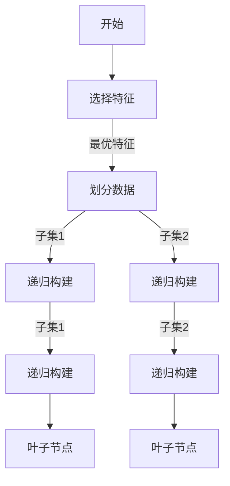
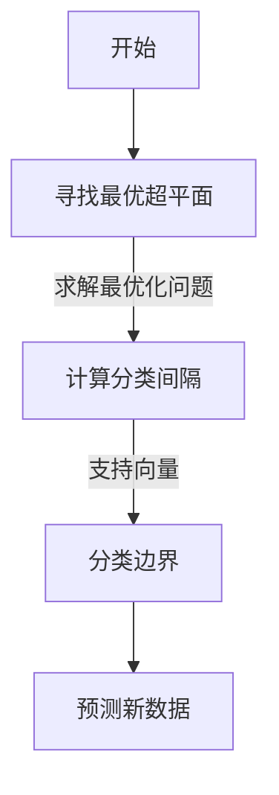
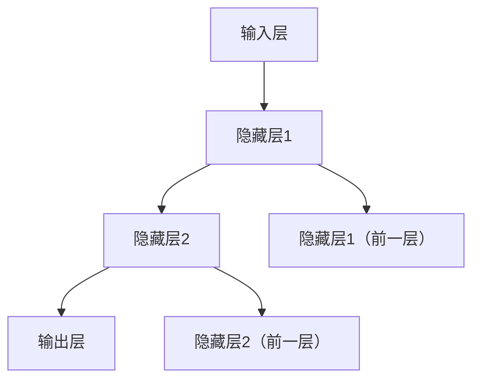
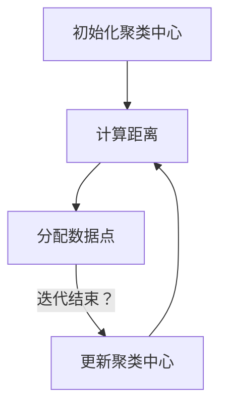
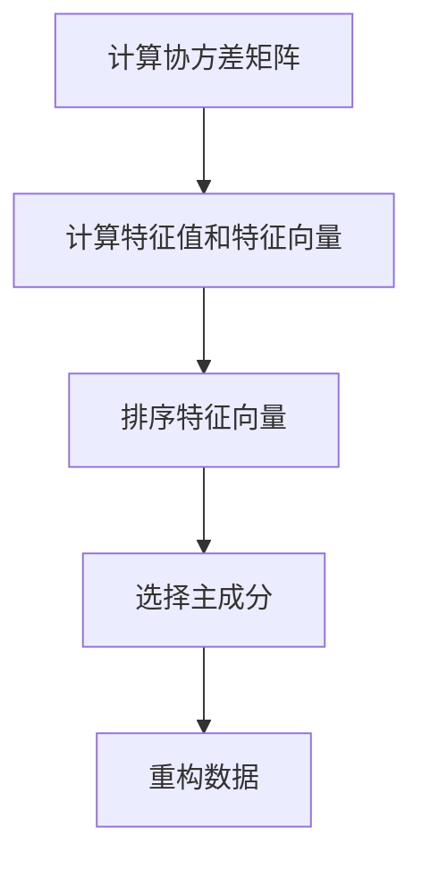
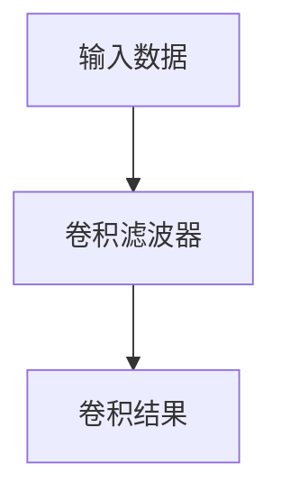
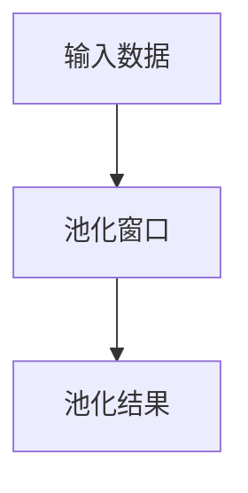
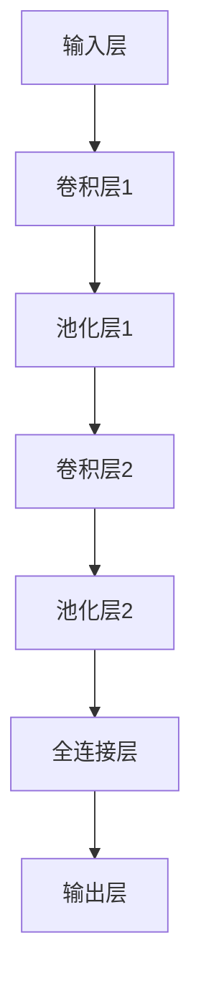
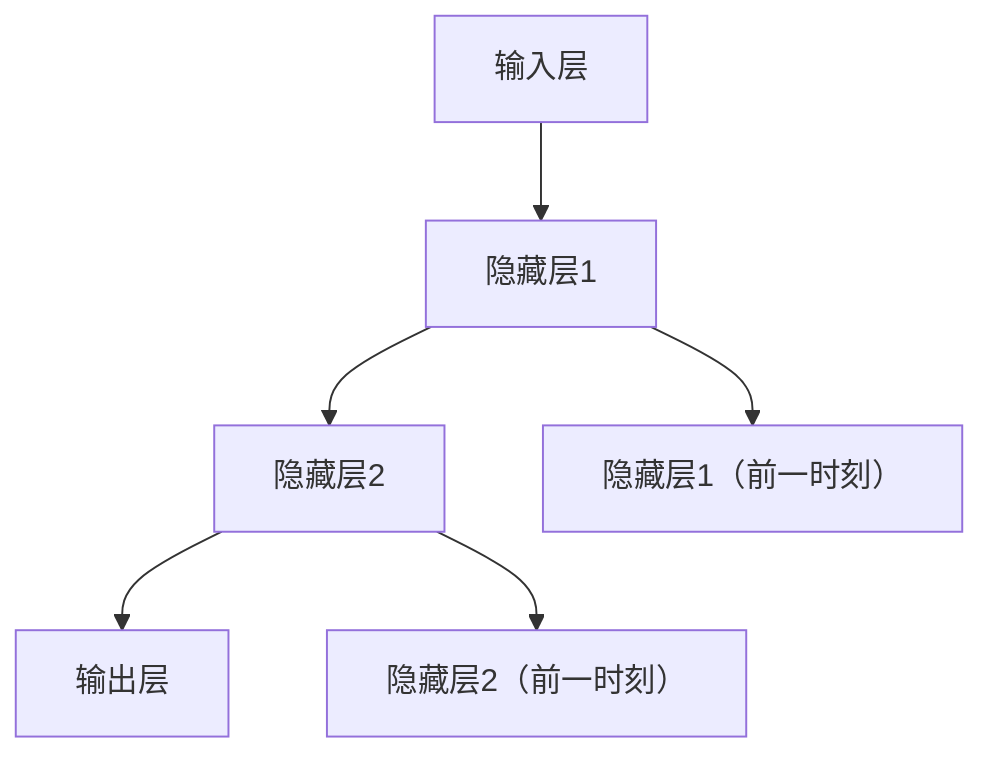

                 

# AI如何改变我们获取和处理信息的方式

> **关键词：**人工智能，机器学习，深度学习，自然语言处理，信息检索，推荐系统，搜索引擎，知识图谱，信息安全。

> **摘要：**本文将探讨人工智能如何通过机器学习、深度学习等技术改变我们获取和处理信息的方式。从搜索、推荐系统、信息提取到知识图谱，再到信息安全，AI正在以不可逆转的方式重塑我们的信息时代。

## 目录大纲

### 第一部分：AI基础与原理

1. **第1章：AI概述**
   1.1 AI的定义与历史发展
   1.2 人工智能的核心概念
   1.3 人工智能的分类

2. **第2章：机器学习基础**
   2.1 监督学习
   2.2 无监督学习
   2.3 强化学习

3. **第3章：深度学习原理**
   3.1 深度学习基础
   3.2 卷积神经网络
   3.3 循环神经网络

4. **第4章：自然语言处理**
   4.1 语言模型
   4.2 词嵌入
   4.3 语义分析
   4.4 文本生成

### 第二部分：AI在信息获取与处理中的应用

5. **第5章：AI在搜索中的应用**
   5.1 搜索引擎概述
   5.2 搜索算法
   5.3 排名算法

6. **第6章：AI在推荐系统中的应用**
   6.1 推荐系统概述
   6.2 协同过滤
   6.3 内容推荐
   6.4 混合推荐系统

7. **第7章：AI在信息提取与理解中的应用**
   7.1 信息提取
   7.2 信息理解
   7.3 问答系统

8. **第8章：AI在知识图谱中的应用**
   8.1 知识图谱概述
   8.2 知识图谱构建
   8.3 知识图谱应用

9. **第9章：AI在信息安全性中的应用**
   9.1 AI在网络安全中的应用
   9.2 AI在隐私保护中的应用

### 第三部分：AI在信息获取与处理的未来展望

10. **第10章：AI发展趋势与挑战**
    10.1 AI技术发展趋势
    10.2 AI面临的挑战

11. **第11章：AI在信息获取与处理的未来应用**
    11.1 AI在医疗健康中的应用
    11.2 AI在教育与培训中的应用
    11.3 AI在智慧城市中的应用

12. **第12章：案例研究**
    12.1 搜索引擎案例
    12.2 推荐系统案例
    12.3 知识图谱案例
    12.4 信息安全案例

## 附录
### A.1 术语表
### A.2 参考文献

## 引言

在信息技术飞速发展的今天，人工智能（AI）已经成为一个颠覆性的力量，正在深刻地改变我们的生活方式和社会结构。从智能手机的智能助手，到自动驾驶汽车，再到智能医疗系统，AI正在以多种形式融入我们的日常生活。其中，AI在信息获取和处理领域的影响尤为显著。通过机器学习、深度学习等先进技术，AI正在重新定义我们获取信息的方式，提高信息处理的效率和质量。

本文旨在深入探讨人工智能如何改变我们获取和处理信息的方式。首先，我们将从AI的基础知识入手，介绍AI的定义、历史发展、核心概念和分类。接着，我们将详细讲解机器学习、深度学习以及自然语言处理的基本原理。随后，本文将探讨AI在搜索、推荐系统、信息提取与理解以及知识图谱等方面的具体应用。此外，我们还将讨论AI在信息安全性中的重要作用，并展望AI未来的发展趋势和面临的挑战。最后，通过实际案例研究，我们将展示AI在不同领域的具体应用和实践效果。

通过本文的阅读，读者将全面了解AI如何改变我们的信息获取和处理方式，以及这一变革对我们社会的深远影响。

## 第一部分：AI基础与原理

### 第1章：AI概述

#### 1.1 AI的定义与历史发展

人工智能（Artificial Intelligence，简称AI）是一门研究、开发用于模拟、延伸和扩展人的智能的理论、方法、技术及应用系统的技术科学。它的目标是使机器能够胜任一些通常需要人类智能才能完成的复杂任务，如视觉感知、语言理解、决策制定等。人工智能的定义可以从多个角度进行理解，包括智能代理、机器学习、知识表示和推理等核心概念。

AI的概念可以追溯到古希腊神话中的机械人，但真正意义上的AI研究始于20世纪50年代。当时，科学家们开始探讨如何使计算机具备智能。1956年，在达特茅斯会议上，约翰·麦卡锡（John McCarthy）等人首次提出了人工智能这一术语，并确定了其研究目标。这是人工智能历史上的一个重要里程碑。

自1956年以来，人工智能经历了多个发展阶段：

- **早期阶段（1956-1974）**：这个阶段主要关注符号推理和逻辑推理，其中符号主义（Symbolic AI）是主导思想。在这一时期，产生了许多早期的人工智能系统，如逻辑推理程序、专家系统等。

- **繁荣阶段（1980-1987）**：专家系统在这一时期取得了显著的进展。专家系统是一种模拟人类专家解决特定领域问题的计算机程序。这一阶段标志着人工智能在实际应用中的初步成功。

- **低谷阶段（1987-1993）**：由于计算能力和算法的局限，人工智能在20世纪80年代后期遇到了瓶颈。这一时期的失败案例和资源减少导致了人工智能的“第一次寒冬”。

- **复兴阶段（1993-2000）**：随着计算能力的提升和新的算法（如机器学习和神经网络）的发展，人工智能重新获得了关注。这一时期，机器学习开始成为人工智能研究的主流方向。

- **深度学习阶段（2006年至今）**：2006年，深度学习的复兴标志着人工智能进入了一个新的时代。深度学习通过多层神经网络结构，能够在图像识别、语音识别等领域取得突破性进展。

#### 1.2 人工智能的核心概念

人工智能的核心概念包括智能代理、机器学习、知识表示和推理等。

- **智能代理**：智能代理（Intelligent Agent）是指能够感知环境并采取行动以达到目标的计算实体。智能代理是人工智能研究的核心对象，它可以是软件程序、机器人或网络系统。

- **机器学习**：机器学习（Machine Learning）是一种使计算机从数据中学习并做出预测或决策的方法。通过训练模型，机器学习算法可以从数据中提取特征，并用于解决实际问题。

- **知识表示**：知识表示（Knowledge Representation）是将人类知识用计算机可以理解的形式表示出来的过程。知识表示是人工智能的基础，它涉及到如何有效地组织和存储知识。

- **推理**：推理（Reasoning）是基于已有知识进行逻辑推导的过程。推理可以是演绎推理（从一般到特殊）或归纳推理（从特殊到一般），它在人工智能系统中用于解决复杂问题。

#### 1.3 人工智能的分类

人工智能可以根据其智能水平和技术实现方式分为多种类型：

- **通用人工智能（AGI）**：通用人工智能（Artificial General Intelligence，简称AGI）是指具有与人类相似的智能水平，能够在各种任务上表现出智慧的人工智能系统。AGI是目前人工智能研究的一个长期目标。

- **专用人工智能（Narrow AI）**：专用人工智能（Artificial Narrow Intelligence，简称ANI）是指在特定领域内表现出高度智能的人工智能系统。目前的多数人工智能系统都属于这一类别，如语音识别系统、自动驾驶汽车等。

- **弱人工智能（Artificial Narrow Intelligence，简称ANI）**：弱人工智能（Weak AI）是专门用于特定任务的人工智能系统，它只能在其设计范围内表现出智能。例如，一个只用于图像识别的弱人工智能系统不能应用于其他领域。

- **强人工智能（Artificial General Intelligence，简称AGI）**：强人工智能（Strong AI）是指具有广泛通用智能的人工智能系统，它能在各种复杂任务上表现出人类水平的智慧。目前的AI系统尚未达到这一水平。

通过了解人工智能的定义、历史发展和核心概念，读者可以更好地理解人工智能如何改变我们的信息获取和处理方式。在接下来的章节中，我们将深入探讨机器学习、深度学习和自然语言处理等关键技术，以及它们在实际应用中的具体实现。

### 第2章：机器学习基础

#### 2.1 监督学习

监督学习（Supervised Learning）是机器学习中最基本且应用最广泛的一种学习方式。它的核心思想是通过已标记的训练数据，学习出一个能够对未知数据进行预测或分类的模型。监督学习通常分为两类：回归（Regression）和分类（Classification）。

##### **2.1.1 决策树**

决策树（Decision Tree）是一种树形结构，通过一系列规则对数据进行分类或回归。每个内部节点表示一个特征，每个分支代表一个可能的值，每个叶子节点表示一个预测结果。

**核心概念与联系：**

- **决策树构建过程**：
  - **特征选择**：选择一个最优特征进行划分，常用的特征选择方法有信息增益（Information Gain）、基尼不纯度（Gini Impurity）等。
  - **划分数据**：根据最优特征的不同值，将数据集划分成多个子集。
  - **递归构建**：对每个子集继续进行特征选择和划分，直到满足停止条件（如最大深度、最小样本量等）。

**Mermaid流程图：**



**核心算法原理讲解：**

```python
# 伪代码
def decision_tree_classification(data, target_variable):
    if data is empty:
        return majority_class(data[target_variable])
    else:
        # 找到最优划分特征
        best_feature, best_value = find_best_split(data, target_variable)
        # 创建内部节点
        node = Node(best_feature, best_value)
        # 划分数据
        for value in unique_values(data[best_feature]):
            subset = data[data[best_feature] == value]
            node.children[value] = decision_tree_classification(subset, target_variable)
        return node
```

##### **2.1.2 支持向量机**

支持向量机（Support Vector Machine，简称SVM）是一种强大的分类和回归模型，通过找到一个最优的超平面，将数据点分成不同的类别。SVM的核心思想是最大化分类边界上的间隔。

**核心概念与联系：**

- **SVM模型构建过程**：
  - **寻找最优超平面**：通过求解最优化问题，找到能够最大化分类间隔的超平面。
  - **支持向量**：那些位于超平面上的数据点，它们对分类边界有显著影响。
  - **核函数**：通过核函数将低维数据映射到高维空间，实现线性不可分数据的分类。

**Mermaid流程图：**



**核心算法原理讲解：**

```python
# 伪代码
def svm_train(data, labels):
    # 省略代码，实现SVM训练过程
    return model

def svm_predict(model, data):
    # 预测
    predictions = [model.predict(x) for x in data]
    return predictions
```

##### **2.1.3 神经网络**

神经网络（Neural Network）是一种模拟人脑结构和功能的计算模型，通过层层变换来提取数据特征。神经网络由多个层组成，包括输入层、隐藏层和输出层。

**核心概念与联系：**

- **神经网络结构**：
  - **输入层**：接收输入数据。
  - **隐藏层**：对输入数据进行处理，提取特征。
  - **输出层**：生成预测结果。

- **激活函数**：激活函数用于引入非线性，常见的激活函数有ReLU、Sigmoid、Tanh等。

- **损失函数与优化算法**：损失函数用于衡量预测值与真实值之间的差距，优化算法用于更新模型参数。

**Mermaid流程图：**



**核心算法原理讲解：**

```python
import tensorflow as tf

# 创建神经网络模型
model = tf.keras.Sequential([
    tf.keras.layers.Dense(128, activation='relu', input_shape=(input_shape,)),
    tf.keras.layers.Dense(10, activation='softmax')
])

# 编译模型
model.compile(optimizer='adam',
              loss='categorical_crossentropy',
              metrics=['accuracy'])

# 训练模型
model.fit(x_train, y_train, epochs=10, batch_size=32, validation_split=0.2)
```

通过了解监督学习中的决策树、支持向量机和神经网络，我们可以更好地理解机器学习的基础，为后续章节的深入学习打下坚实的基础。

#### 2.2 无监督学习

无监督学习（Unsupervised Learning）是机器学习的一种形式，它通过从未标记的数据中学习，发现数据中的结构和模式。无监督学习的主要任务是探索数据，而不是预测或分类。无监督学习分为两大类：聚类（Clustering）和降维（Dimensionality Reduction）。

##### **2.2.1 聚类算法**

聚类算法是一种将相似的数据点归为一类的算法，目的是发现数据中的自然分组。聚类算法可以分为基于距离的聚类、基于密度的聚类和基于模型的聚类等。

**核心概念与联系：**

- **K-Means聚类**：K-Means是最常用的聚类算法之一，它通过迭代的方式找到K个簇中心，使得每个簇内的数据点距离簇中心最近。

**Mermaid流程图：**



**核心算法原理讲解：**

```python
from sklearn.cluster import KMeans

# 创建KMeans模型
kmeans = KMeans(n_clusters=3)

# 训练模型
kmeans.fit(data)

# 预测
predictions = kmeans.predict(data)
```

- **层次聚类**：层次聚类是一种自下而上或自上而下地构建聚类层次结构的算法。它通过合并或分裂已有的簇来逐步优化聚类结果。

**核心算法原理讲解：**

```python
from sklearn.cluster import AgglomerativeClustering

# 创建层次聚类模型
hierarchical_clustering = AgglomerativeClustering(n_clusters=3)

# 训练模型
hierarchical_clustering.fit(data)

# 预测
predictions = hierarchical_clustering.predict(data)
```

##### **2.2.2 维度缩减**

维度缩减（Dimensionality Reduction）是一种减少数据维度以简化数据处理和分析的方法。它通过保留数据的主要特征，去除冗余信息，从而提高计算效率和数据分析质量。

**核心概念与联系：**

- **主成分分析（PCA）**：PCA是一种常用的降维方法，它通过线性变换将高维数据映射到低维空间，同时保留数据的最大方差。

**Mermaid流程图：**



**核心算法原理讲解：**

```python
from sklearn.decomposition import PCA

# 创建PCA模型
pca = PCA(n_components=2)

# 训练模型
pca.fit(data)

# 变换数据
transformed_data = pca.transform(data)
```

- **线性判别分析（LDA）**：LDA是一种在保持数据类内方差的同时减少维度的方法，它通过最大化类间方差来优化分类效果。

**核心算法原理讲解：**

```python
from sklearn.discriminant_analysis import LinearDiscriminantAnalysis as LDA

# 创建LDA模型
lda = LDA(n_components=2)

# 训练模型
lda.fit(data, labels)

# 变换数据
transformed_data = lda.transform(data)
```

通过聚类算法和维度缩减方法，无监督学习可以帮助我们更好地理解和分析数据，为后续的信息提取和处理提供有力支持。

#### 2.3 强化学习

强化学习（Reinforcement Learning，简称RL）是一种通过试错来学习最优策略的机器学习方法。在强化学习中，智能体（Agent）通过与环境（Environment）互动，根据奖励（Reward）和惩罚（Penalty）来调整其行为，以达到某种目标。

##### **2.3.1 强化学习基本概念**

- **智能体（Agent）**：智能体是执行任务的实体，它通过感知环境状态，选择动作并更新策略。
- **环境（Environment）**：环境是智能体执行动作的场所，它根据智能体的动作产生新的状态。
- **状态（State）**：状态是智能体在某一时刻所处的环境和自身状态的组合。
- **动作（Action）**：动作是智能体在某一状态下可以选择的行为。
- **奖励（Reward）**：奖励是智能体执行动作后，环境对智能体的反馈，用于指导智能体的学习过程。
- **策略（Policy）**：策略是智能体在给定状态下选择动作的方法，它可以通过学习得到。

##### **2.3.2 强化学习算法**

强化学习算法可以分为值函数方法（Value-Based）和政策函数方法（Policy-Based）。

- **值函数方法**：值函数方法通过学习状态值函数（State-Value Function）或动作值函数（Action-Value Function）来指导智能体的决策。常用的值函数方法有Q-learning和SARSA。

**Q-learning算法原理讲解：**

```python
import numpy as np
import random

# 创建强化学习环境
env = gym.make('CartPole-v0')

# 初始化Q值表
Q = np.zeros([env.observation_space.n, env.action_space.n])

# 设置参数
alpha = 0.1  # 学习率
gamma = 0.99 # 折扣因子
epochs = 1000

# 强化学习训练
for episode in range(epochs):
    state = env.reset()
    done = False
    total_reward = 0
    while not done:
        # 选择动作
        action = np.argmax(Q[state])
        # 执行动作
        next_state, reward, done, _ = env.step(action)
        # 更新Q值
        Q[state, action] = Q[state, action] + alpha * (reward + gamma * np.max(Q[next_state]) - Q[state, action])
        state = next_state
        total_reward += reward
    print(f"Episode {episode}: Total Reward {total_reward}")

env.close()
```

- **SARSA算法原理讲解：**

```python
import numpy as np
import random

# 创建强化学习环境
env = gym.make('CartPole-v0')

# 初始化Q值表
Q = np.zeros([env.observation_space.n, env.action_space.n])

# 设置参数
alpha = 0.1  # 学习率
gamma = 0.99 # 折扣因子
epochs = 1000

# 强化学习训练
for episode in range(epochs):
    state = env.reset()
    done = False
    total_reward = 0
    while not done:
        # 选择动作
        action = np.argmax(Q[state])
        # 执行动作
        next_state, reward, done, _ = env.step(action)
        # 更新Q值
        Q[state, action] = Q[state, action] + alpha * (reward + gamma * np.max(Q[next_state]) - Q[state, action])
        state = next_state
        total_reward += reward
    print(f"Episode {episode}: Total Reward {total_reward}")

env.close()
```

- **政策函数方法**：政策函数方法直接通过学习最优动作策略，指导智能体的行为。常用的政策函数方法有策略梯度方法。

**策略梯度算法原理讲解：**

```python
import numpy as np
import random
import gym

# 创建强化学习环境
env = gym.make('CartPole-v0')

# 初始化参数
learning_rate = 0.1
epochs = 1000

# 强化学习训练
for episode in range(epochs):
    state = env.reset()
    done = False
    total_reward = 0
    while not done:
        # 执行动作
        action = policy(state)
        next_state, reward, done, _ = env.step(action)
        # 更新政策函数
        policy.state_action_value[state, action] += learning_rate * (reward + gamma * np.max(policy.state_action_value[next_state]) - policy.state_action_value[state, action])
        state = next_state
        total_reward += reward
    print(f"Episode {episode}: Total Reward {total_reward}")

env.close()
```

强化学习通过试错和反馈机制，使智能体能够在复杂环境中学习和优化其行为，为解决动态决策问题提供了有效的方法。

### 第3章：深度学习原理

深度学习（Deep Learning）是机器学习的一个分支，它通过多层神经网络结构，从大量数据中自动提取特征并进行预测。深度学习在图像识别、语音识别、自然语言处理等领域取得了显著的成果。

#### 3.1 深度学习基础

深度学习的基础是神经网络，特别是多层感知机（MLP）。多层感知机是一种前馈神经网络，它通过多个隐藏层将输入数据映射到输出数据。

##### **3.1.1 神经网络结构**

神经网络由多个层组成，包括输入层、隐藏层和输出层。每层由多个神经元组成，神经元之间通过权重和偏置进行连接。

**Mermaid流程图：**


##### **3.1.2 损失函数与优化算法**

损失函数用于衡量预测值与真实值之间的差距，优化算法用于更新模型参数，以最小化损失函数。常用的损失函数有均方误差（MSE）、交叉熵（Cross-Entropy）等。优化算法有梯度下降（Gradient Descent）、随机梯度下降（SGD）等。

**核心算法原理讲解：**

```python
import tensorflow as tf

# 创建神经网络模型
model = tf.keras.Sequential([
    tf.keras.layers.Dense(128, activation='relu', input_shape=(input_shape,)),
    tf.keras.layers.Dense(10, activation='softmax')
])

# 编译模型
model.compile(optimizer='adam',
              loss='categorical_crossentropy',
              metrics=['accuracy'])

# 训练模型
model.fit(x_train, y_train, epochs=10, batch_size=32, validation_split=0.2)
```

##### **3.1.3 前向传播与反向传播**

深度学习中的前向传播（Forward Propagation）和反向传播（Back Propagation）是训练神经网络的两个核心步骤。

- **前向传播**：输入数据通过网络传递到输出层，得到预测结果。每个神经元都会计算其输入的加权和，并通过激活函数得到输出。
- **反向传播**：计算预测结果与真实值之间的误差，通过梯度下降更新模型参数。反向传播通过链式法则计算每个参数的梯度。

**核心算法原理讲解：**

```python
# 伪代码
function forward_propagation(model, data):
    # 计算前向传播
    activations = []
    Z = []
    A = data
    for layer in model.layers:
        Z.append(np.dot(W, A) + b)
        A = activation(Z)
        activations.append(A)

    return activations

function backward_propagation(model, data, labels):
    # 计算反向传播
    dZ = compute_loss_derivative(activations[-1], labels)
    dW = np.dot(dZ, activations[-2].T)
    db = np.sum(dZ, axis=1, keepdims=True)
    
    # 更新参数
    model.W -= learning_rate * dW
    model.b -= learning_rate * db
```

#### 3.2 卷积神经网络

卷积神经网络（Convolutional Neural Network，简称CNN）是专门用于处理图像数据的一种深度学习模型。CNN通过卷积操作和池化操作，自动提取图像中的特征。

##### **3.2.1 卷积操作**

卷积操作是一种将输入数据与滤波器进行点积的过程，用于提取特征。

**Mermaid流程图：**



**核心算法原理讲解：**

```python
import numpy as np

# 创建卷积滤波器
filter = np.random.rand(3, 3)

# 执行卷积操作
output = np.zeros((3, 3))
for i in range(3):
    for j in range(3):
        output[i, j] = np.sum(filter * input[i:i+3, j:j+3])
```

##### **3.2.2 池化操作**

池化操作是一种将局部区域进行下采样，以减少数据维度。

**Mermaid流程图：**



**核心算法原理讲解：**

```python
import numpy as np

# 创建输入数据
input = np.random.rand(4, 4)

# 执行最大池化操作
output = np.zeros((2, 2))
for i in range(0, 4, 2):
    for j in range(0, 4, 2):
        output[i//2, j//2] = np.max(input[i:i+2, j:j+2])
```

##### **3.2.3 卷积神经网络结构**

卷积神经网络由多个卷积层和池化层组成，通过逐层提取图像特征，最终得到预测结果。

**Mermaid流程图：**



**核心算法原理讲解：**

```python
import tensorflow as tf

# 创建卷积神经网络模型
model = tf.keras.Sequential([
    tf.keras.layers.Conv2D(32, (3, 3), activation='relu', input_shape=(28, 28, 1)),
    tf.keras.layers.MaxPooling2D((2, 2)),
    tf.keras.layers.Conv2D(64, (3, 3), activation='relu'),
    tf.keras.layers.MaxPooling2D((2, 2)),
    tf.keras.layers.Flatten(),
    tf.keras.layers.Dense(128, activation='relu'),
    tf.keras.layers.Dense(10, activation='softmax')
])

# 编译模型
model.compile(optimizer='adam',
              loss='categorical_crossentropy',
              metrics=['accuracy'])

# 训练模型
model.fit(x_train, y_train, epochs=10, batch_size=32, validation_split=0.2)
```

通过了解卷积神经网络的结构和工作原理，我们可以更好地应用深度学习技术进行图像识别和处理。

#### 3.3 循环神经网络

循环神经网络（Recurrent Neural Network，简称RNN）是一种用于处理序列数据的深度学习模型。RNN通过循环结构，能够记住之前的输入，从而适用于时间序列数据、文本处理等任务。

##### **3.3.1 RNN基本结构**

RNN的基本结构包括输入层、隐藏层和输出层。每个隐藏层都包含上一个时间步的隐藏状态和当前时间步的输入，通过权重和偏置进行连接。

**Mermaid流程图：**



##### **3.3.2 LSTM与GRU**

LSTM（Long Short-Term Memory）和GRU（Gated Recurrent Unit）是RNN的变体，用于解决长期依赖问题。LSTM通过引入门机制，能够更好地记忆长期信息；GRU通过简化LSTM的结构，提高了计算效率。

**LSTM原理讲解：**

```python
import tensorflow as tf

# 创建LSTM模型
model = tf.keras.Sequential([
    tf.keras.layers.LSTM(128, activation='tanh', return_sequences=True),
    tf.keras.layers.LSTM(128, activation='tanh'),
    tf.keras.layers.Dense(10, activation='softmax')
])

# 编译模型
model.compile(optimizer='adam',
              loss='categorical_crossentropy',
              metrics=['accuracy'])

# 训练模型
model.fit(x_train, y_train, epochs=10, batch_size=32, validation_split=0.2)
```

**GRU原理讲解：**

```python
import tensorflow as tf

# 创建GRU模型
model = tf.keras.Sequential([
    tf.keras.layers.GRU(128, activation='tanh', return_sequences=True),
    tf.keras.layers.GRU(128, activation='tanh'),
    tf.keras.layers.Dense(10, activation='softmax')
])

# 编译模型
model.compile(optimizer='adam',
              loss='categorical_crossentropy',
              metrics=['accuracy'])

# 训练模型
model.fit(x_train, y_train, epochs=10, batch_size=32, validation_split=0.2)
```

通过了解RNN、LSTM和GRU的基本原理和结构，我们可以更好地应用深度学习技术处理序列数据。

### 第4章：自然语言处理

自然语言处理（Natural Language Processing，简称NLP）是人工智能的一个分支，它旨在使计算机能够理解和处理人类语言。NLP广泛应用于文本分类、情感分析、机器翻译、文本生成等领域。本章将介绍NLP的基础知识，包括语言模型、词嵌入、语义分析和文本生成。

#### 4.1 语言模型

语言模型（Language Model）是NLP的核心组件之一，它用于预测下一个单词或字符的概率。语言模型可以分为统计语言模型和神经网络语言模型。

##### **4.1.1 n-gram模型**

n-gram模型是一种基于历史n个单词预测下一个单词的统计模型。它的核心思想是假设一个单词的概率仅与其前n个单词相关。

**n-gram模型原理讲解：**

```python
from collections import defaultdict

# 创建n-gram模型
n_gram_model = defaultdict(list)
for sentence in sentences:
    for i in range(len(sentence) - n):
        n_gram_model[tuple(sentence[i:i+n])].append(sentence[i+n])

# 预测下一个单词
def predict_next_word(n_gram_model, n, context):
    n_gram = tuple(context)
    probabilities = {}
    for word in n_gram_model[n_gram]:
        probabilities[word] = len(n_gram_model[n_gram]) / len(sentences)
    return max(probabilities, key=probabilities.get)
```

##### **4.1.2 神经网络语言模型**

神经网络语言模型通过学习大量的文本数据，自动提取语言特征，用于预测下一个单词。常见的神经网络语言模型包括基于RNN的LSTM和基于Transformer的BERT。

**神经网络语言模型原理讲解：**

```python
import tensorflow as tf

# 创建神经网络语言模型
model = tf.keras.Sequential([
    tf.keras.layers.Embedding(vocabulary_size, embedding_dim),
    tf.keras.layers.LSTM(128, activation='tanh', return_sequences=True),
    tf.keras.layers.Dense(vocabulary_size, activation='softmax')
])

# 编译模型
model.compile(optimizer='adam',
              loss='categorical_crossentropy',
              metrics=['accuracy'])

# 训练模型
model.fit(x_train, y_train, epochs=10, batch_size=32, validation_split=0.2)
```

#### 4.2 词嵌入

词嵌入（Word Embedding）是将单词转换为向量的方法，用于表示单词的语义信息。词嵌入通过将单词映射到高维空间，使得相似单词在空间中彼此靠近。

##### **4.2.1 词向量表示**

词向量表示是将单词映射到固定维度的向量。词向量可以通过统计方法（如TF-IDF）或神经网络方法（如Word2Vec和GloVe）训练。

**词向量表示原理讲解：**

```python
from gensim.models import Word2Vec

# 训练词向量模型
model = Word2Vec(sentences, vector_size=100, window=5, min_count=1, workers=4)

# 获取词向量
def get_word_vector(model, word):
    return model[word]
```

##### **4.2.2 词嵌入算法**

词嵌入算法通过学习单词之间的相似性来训练词向量。常见的词嵌入算法包括Word2Vec、GloVe和FastText。

**Word2Vec算法原理讲解：**

```python
import tensorflow as tf

# 创建词嵌入模型
model = tf.keras.Sequential([
    tf.keras.layers.Embedding(vocabulary_size, embedding_dim),
    tf.keras.layers.Dense(vocabulary_size, activation='softmax')
])

# 编译模型
model.compile(optimizer='adam',
              loss='categorical_crossentropy',
              metrics=['accuracy'])

# 训练模型
model.fit(x_train, y_train, epochs=10, batch_size=32, validation_split=0.2)
```

#### 4.3 语义分析

语义分析（Semantic Analysis）是从文本中提取更深层次信息的方法，包括词性标注、命名实体识别和情感分析等。

##### **4.3.1 词性标注**

词性标注（Part-of-Speech Tagging）是将文本中的每个单词标注为不同词性的任务，如名词、动词、形容词等。

**词性标注原理讲解：**

```python
from spacy.lang.en import English

# 创建词性标注模型
nlp = English()

# 进行词性标注
def pos_tagging(text):
    doc = nlp(text)
    return [(token.text, token.pos_) for token in doc]
```

##### **4.3.2 命名实体识别**

命名实体识别（Named Entity Recognition）是识别文本中的特定实体，如人名、地名、组织名等。

**命名实体识别原理讲解：**

```python
from spacy.lang.en import English

# 创建命名实体识别模型
nlp = English()

# 进行命名实体识别
def named_entity_recognition(text):
    doc = nlp(text)
    return [(ent.text, ent.label_) for ent in doc.ents]
```

##### **4.3.3 文本生成**

文本生成（Text Generation）是利用语言模型生成文本的方法，可以用于自动写作、对话系统等。

**文本生成原理讲解：**

```python
import tensorflow as tf

# 创建文本生成模型
model = tf.keras.Sequential([
    tf.keras.layers.Embedding(vocabulary_size, embedding_dim),
    tf.keras.layers.LSTM(128, activation='tanh', return_sequences=True),
    tf.keras.layers.Dense(vocabulary_size, activation='softmax')
])

# 编译模型
model.compile(optimizer='adam',
              loss='categorical_crossentropy',
              metrics=['accuracy'])

# 训练模型
model.fit(x_train, y_train, epochs=10, batch_size=32, validation_split=0.2)

# 文本生成
def generate_text(model, start_string, num_words):
    for _ in range(num_words):
        token_list = model.predict(np.array([start_string]), verbose=0)[0]
        token = np.argmax(token_list)
        if token == vocab_to_index['\n']:
            break
        start_string += ' ' + index_to_vocab[token]
    return start_string
```

通过了解自然语言处理的基础知识，我们可以更好地应用NLP技术解决实际问题。

#### 4.4 文本生成

文本生成（Text Generation）是自然语言处理（NLP）的一个重要分支，旨在生成人类可读的文本。文本生成技术可以用于自动写作、对话系统、机器翻译等领域。文本生成模型主要分为生成式模型和对抗生成网络（GAN）。

##### **4.4.1 生成式模型**

生成式模型通过生成样本的分布来生成文本。常见的生成式模型包括马尔可夫模型、变分自编码器（VAE）和生成式对抗网络（GAN）。

**生成式模型原理讲解：**

```python
import tensorflow as tf
import numpy as np

# 创建生成式模型
model = tf.keras.Sequential([
    tf.keras.layers.Embedding(vocabulary_size, embedding_dim),
    tf.keras.layers.LSTM(128, activation='tanh', return_sequences=True),
    tf.keras.layers.Dense(vocabulary_size, activation='softmax')
])

# 编译模型
model.compile(optimizer='adam',
              loss='categorical_crossentropy',
              metrics=['accuracy'])

# 训练模型
model.fit(x_train, y_train, epochs=10, batch_size=32, validation_split=0.2)

# 文本生成
def generate_text(model, start_string, num_words):
    for _ in range(num_words):
        token_list = model.predict(np.array([start_string]), verbose=0)[0]
        token = np.argmax(token_list)
        if token == vocab_to_index['\n']:
            break
        start_string += ' ' + index_to_vocab[token]
    return start_string
```

##### **4.4.2 对抗生成网络**

对抗生成网络（GAN）是一种基于生成对抗的模型，通过生成器和判别器的相互对抗来生成高质量的数据。GAN包括生成器和判别器两个模型。

**GAN原理讲解：**

```python
import tensorflow as tf
from tensorflow.keras.models import Model
from tensorflow.keras.layers import Input, Dense, Reshape, Flatten, Conv2D, Conv2DTranspose

# 创建生成器和判别器模型
generator = Model(inputs=z, outputs=generated_images)
discriminator = Model(inputs=real_images + generated_images, outputs=discriminator_output)

# 编译模型
discriminator.compile(optimizer=adam_optimizer, loss=discriminator_loss)
generator.compile(optimizer=adam_optimizer, loss=generator_loss)

# 训练模型
for epoch in range(num_epochs):
    for batch in data_loader:
        real_images, _ = batch
        noise = tf.random.normal([batch_size, z_dim])
        generated_images = generator.predict(noise)
        discriminator.train_on_batch([real_images, generated_images], fake)
        generator.train_on_batch(noise, real)
```

通过理解文本生成的基础知识，我们可以更好地应用这些技术生成高质量的文本。

## 第二部分：AI在信息获取与处理中的应用

### 第5章：AI在搜索中的应用

搜索是信息获取的一个重要环节，AI技术通过改进搜索算法和优化搜索结果排名，大大提升了信息检索的效率和准确性。本章将探讨AI在搜索中的应用，包括搜索引擎的概述、搜索算法以及排名算法。

#### 5.1 搜索引擎概述

搜索引擎（Search Engine）是一种通过索引和检索技术帮助用户快速找到所需信息的系统。它通常包含三个主要部分：爬虫（Crawler）、索引器（Indexer）和检索器（Searcher）。

- **爬虫**：爬虫是搜索引擎的核心组件，负责从互联网上抓取网页内容。爬虫通常采用随机游走或深度优先搜索等方法，遍历网页链接，以获取尽可能多的网页信息。
- **索引器**：索引器将爬虫获取的网页内容进行处理和存储，建立索引。索引是搜索引擎的核心，它使得搜索查询能够快速定位到相关的网页。
- **检索器**：检索器根据用户的查询请求，从索引中检索出相关的网页，并按照一定的排名算法对结果进行排序，最后呈现给用户。

搜索引擎的基本工作流程如下：

1. 爬虫从种子URL开始，遍历网页链接，获取网页内容。
2. 索引器对获取的网页内容进行处理，提取关键词、元数据等，并建立倒排索引。
3. 检索器根据用户的查询请求，从倒排索引中检索出相关的网页，并按照排名算法对结果进行排序。
4. 最终搜索结果通过网页链接呈现给用户。

#### 5.2 搜索算法

搜索算法是搜索引擎的核心，用于在大量数据中快速找到相关信息。常见的搜索算法包括暴力搜索、随机游走、深度优先搜索和广度优先搜索。

- **暴力搜索**：暴力搜索是一种简单的搜索算法，它遍历所有可能的路径来找到目标。虽然这种方法简单直观，但效率较低，不适用于大规模数据检索。
- **随机游走**：随机游走是一种基于概率的搜索算法，它通过随机选择路径来找到目标。随机游走能够较好地探索网络结构，

