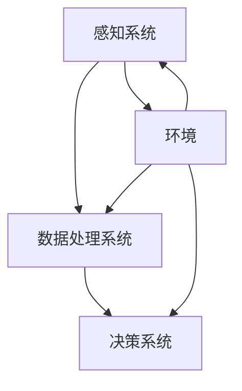

                 

# AI感知融合：人机感官的无缝衔接

> 关键词：人工智能、感知融合、人机交互、多模态感知、智能家居、医疗健康、智能制造、边缘计算、脑机接口

> 摘要：本文旨在探讨人工智能（AI）感知融合技术，即如何将多种感知方式无缝连接，实现人机感官的完美融合。文章首先介绍了AI感知融合的基础概念和意义，然后深入分析了核心感知技术原理，包括视觉、听觉和触觉感知技术。接着，探讨了多模态感知融合算法，以及AI感知融合在智能家居、医疗健康和智能制造等领域的应用实例。最后，对AI感知融合的前沿技术和未来发展趋势进行了展望，并通过案例分析总结了相关技术和实践经验。

### 第一部分：AI感知融合基础

#### 第1章：AI感知融合概述

##### 1.1 AI感知融合的概念与意义

AI感知融合，是指利用人工智能技术，将人类感官的各种感知方式（如视觉、听觉、触觉等）与计算机系统相融合，使计算机能够像人类一样感知外部环境，实现人机感官的无缝衔接。这一技术的核心目标是通过模拟人类感知系统，提升人机交互的自然性和效率，从而在各个领域实现智能化的应用。

**定义与核心概念**

- **感知系统**：指人类通过视觉、听觉、触觉等方式对外部环境进行感知的生理系统。
- **人机融合**：指将人类的感知能力与计算机系统相结合，使计算机具备人类感知的能力。
- **AI感知融合**：通过人工智能技术，实现计算机对人类感知系统的模拟和扩展，使其能够像人类一样感知和处理外部环境信息。

**融合目标与挑战**

AI感知融合的目标包括：

1. **提高人机交互的自然性**：通过模拟人类感知系统，使计算机能够更好地理解人类意图，实现自然、流畅的交互。
2. **提高任务执行效率**：通过感知融合技术，使计算机能够更准确地获取和处理环境信息，提高任务执行效率。
3. **拓宽应用领域**：将感知融合技术应用于各个领域，如智能家居、医疗健康、智能制造等，推动智能化发展。

然而，实现AI感知融合也面临以下挑战：

1. **感知数据的多样性和复杂性**：不同感知方式获取的数据具有不同的特征和复杂性，如何有效融合这些数据是一个挑战。
2. **感知信息处理的速度和准确性**：计算机需要快速、准确地处理感知信息，以支持实时决策和响应。
3. **隐私和安全问题**：在感知融合过程中，涉及大量个人隐私信息，如何保护用户隐私和安全是一个重要问题。

**相关技术发展历程**

AI感知融合技术的发展可以追溯到20世纪80年代，当时研究者开始探索如何将计算机视觉、听觉和触觉技术相结合，以实现人机交互的自动化。随着计算机性能的不断提升和人工智能技术的突破，AI感知融合技术逐渐得到广泛应用。近年来，深度学习、边缘计算和脑机接口等新兴技术的出现，为AI感知融合技术的发展带来了新的机遇和挑战。

##### 1.2 AI感知融合的架构

AI感知融合的架构主要包括感知系统、数据处理系统和决策系统三个部分。以下是这三个部分的具体组成和功能：

**感知系统组成**

- **视觉感知系统**：通过摄像头、摄像头阵列等设备获取图像信息，实现对环境的视觉感知。
- **听觉感知系统**：通过麦克风、声波传感器等设备获取声音信息，实现对环境的听觉感知。
- **触觉感知系统**：通过力传感器、触觉传感器等设备获取触觉信息，实现对环境的触觉感知。

**感知数据处理**

- **数据采集**：感知系统从外部环境中采集图像、声音和触觉数据。
- **数据预处理**：对采集到的数据进行预处理，如滤波、去噪、归一化等，以提高数据的质量和一致性。
- **特征提取**：从预处理后的数据中提取关键特征，如图像的边缘、纹理、颜色等，声音的频率、时长等，触觉的力、方向等。
- **数据融合**：将不同感知方式的数据进行融合，以获取更全面、准确的环境信息。

**感知与决策融合**

- **感知信息输入**：将处理后的感知数据输入到决策系统，作为决策的依据。
- **决策系统**：利用人工智能算法，对感知信息进行处理和分析，生成相应的决策。
- **决策输出**：将决策结果输出给执行系统，指导实际操作。

##### 1.3 AI感知融合的应用领域

AI感知融合技术具有广泛的应用前景，以下列举了其在几个主要领域的应用实例：

**智能家居**

- **智能安防系统**：通过融合视觉、听觉和触觉感知技术，实现对家庭环境的实时监控，提高家庭安全。
- **智能照明系统**：根据环境光线和用户行为，自动调整照明亮度，提升生活舒适度。
- **智能家电控制系统**：通过语音识别和智能决策，实现对家电设备的远程控制和管理。

**智能健康护理**

- **智能诊断系统**：利用多模态感知融合技术，对医学影像进行分析，提高诊断准确性。
- **远程监护系统**：通过实时监测生命体征，实现对患者的远程监护和异常情况报警。
- **个性化健康管理系统**：根据用户的健康数据和生活习惯，提供个性化的健康建议和指导。

**智能制造**

- **智能检测与维护系统**：通过融合视觉和触觉感知技术，实现对生产设备的实时检测和故障预测。
- **机器人协作系统**：通过感知融合技术，实现人与机器人之间的自然协作，提高生产效率。
- **智能物流系统**：利用多模态感知融合技术，实现货物的自动识别、分类和配送。

#### 第2章：核心感知技术原理

##### 2.1 视觉感知技术

视觉感知技术是AI感知融合的重要组成部分，它通过图像处理、目标检测和识别等方法，实现对视觉信息的获取、处理和分析。

**图像处理基础**

图像处理是视觉感知技术的核心，它包括以下基本步骤：

- **图像表示**：将图像转化为数字信号，通常使用像素矩阵进行表示。
- **滤波**：通过滤波器去除图像中的噪声，提高图像质量。
- **边缘检测**：检测图像中的边缘，提取图像的轮廓信息。
- **特征提取**：从图像中提取关键特征，如颜色、纹理、形状等。

**目标检测与识别**

目标检测与识别是视觉感知技术的重要应用，它包括以下方法：

- **传统方法**：如霍夫变换、边缘检测、模板匹配等，通过一定的特征提取和匹配算法，实现目标的检测和识别。
- **深度学习方法**：如卷积神经网络（CNN）、YOLO、SSD等，通过大量的数据训练，实现目标的自动检测和识别。

**视觉感知应用实例**

视觉感知技术在许多领域都有广泛应用，以下列举几个实例：

- **自动驾驶**：利用视觉感知技术，实现车辆的实时环境感知，提高行驶安全性和稳定性。
- **视频监控**：通过视觉感知技术，实现对监控区域的实时监控，提高监控效果和效率。
- **医疗影像分析**：利用视觉感知技术，对医学影像进行分析，提高疾病诊断的准确性。

##### 2.2 听觉感知技术

听觉感知技术通过声音处理、语音识别等方法，实现对声音信息的获取、处理和分析。

**声音处理基础**

声音处理是听觉感知技术的基础，它包括以下基本步骤：

- **声音信号表示**：将声音信号转化为数字信号，通常使用短时傅里叶变换（STFT）进行表示。
- **噪声抑制**：通过滤波器去除声音信号中的噪声，提高声音质量。
- **特征提取**：从处理后的声音信号中提取关键特征，如频率、时长、音调等。

**语音识别技术**

语音识别是听觉感知技术的重要应用，它包括以下方法：

- **传统方法**：如隐马尔可夫模型（HMM）、高斯混合模型（GMM）等，通过一定的特征提取和模式识别算法，实现语音信号的识别。
- **深度学习方法**：如深度神经网络（DNN）、循环神经网络（RNN）、卷积神经网络（CNN）等，通过大量的数据训练，实现语音信号的自动识别。

**听觉感知应用实例**

听觉感知技术在许多领域都有广泛应用，以下列举几个实例：

- **智能助手**：通过语音识别技术，实现对用户语音指令的理解和执行，提高人机交互的便利性。
- **语音控制**：通过语音识别和语音合成技术，实现设备的远程控制和操作。
- **音乐识别**：通过声音处理和特征提取，实现对音乐信号的分析和识别，用于版权保护、音乐推荐等。

##### 2.3 触觉感知技术

触觉感知技术通过触觉传感器、触觉数据处理等方法，实现对触觉信息的获取、处理和分析。

**触觉传感器原理**

触觉传感器是触觉感知技术的核心，它包括以下几种类型：

- **电容式传感器**：通过电容变化感知触觉信息，常用于柔软物体触觉感知。
- **电阻式传感器**：通过电阻变化感知触觉信息，常用于硬物体触觉感知。
- **压电式传感器**：通过压电效应感知触觉信息，具有高灵敏度，常用于复杂环境触觉感知。

**触觉数据处理**

触觉数据处理包括以下基本步骤：

- **触觉信号采集**：通过触觉传感器获取触觉信号。
- **触觉信号预处理**：去除触觉信号中的噪声和干扰，提高信号质量。
- **触觉信号特征提取**：从处理后的触觉信号中提取关键特征，如力、方向、速度等。

**触觉感知应用实例**

触觉感知技术在许多领域都有广泛应用，以下列举几个实例：

- **虚拟现实**：通过触觉感知技术，实现虚拟物体的触觉反馈，提高虚拟现实的沉浸感。
- **机器人控制**：通过触觉感知技术，实现机器人对环境的感知和自适应控制，提高机器人的自主能力。
- **智能制造**：通过触觉感知技术，实现对生产设备的实时监测和故障诊断，提高生产效率。

#### 第3章：多模态感知融合算法

##### 3.1 多模态数据融合方法

多模态数据融合是指将来自不同感知方式的多种数据（如视觉、听觉、触觉等）进行整合，以获取更全面、准确的环境信息。多模态数据融合方法可以分为以下几类：

- **早期融合**：在数据处理阶段就将多种数据融合在一起，通过对原始数据进行联合特征提取和处理，实现数据的融合。
- **晚期融合**：在数据处理阶段分别对多种数据进行分析和处理，然后对处理结果进行融合，以获取更全面的信息。
- **深度学习融合**：利用深度学习模型，对多种数据进行联合训练和建模，实现数据的自动融合。

**数据融合基本原理**

多模态数据融合的基本原理包括以下几个步骤：

- **数据同步**：将来自不同感知方式的数据进行时间同步，以保证数据的连贯性和一致性。
- **特征融合**：将不同感知方式的数据特征进行整合，形成统一的特征表示。
- **信息整合**：对融合后的特征进行进一步处理，提取出更高级别的信息。

**常见的融合策略**

常见的多模态数据融合策略包括以下几种：

- **特征级融合**：将不同感知方式的数据特征进行直接融合，形成统一的特征向量。
- **决策级融合**：在各个感知方式的决策结果基础上，进行进一步的决策融合，以提高整体系统的性能。
- **模型级融合**：将多个感知模型进行整合，形成一个统一的感知模型，以提高系统的泛化能力和鲁棒性。

**融合性能评估**

多模态数据融合的性能评估方法主要包括以下几个方面：

- **准确率**：评估融合系统在分类、识别等任务上的准确度。
- **召回率**：评估融合系统在分类、识别等任务上的召回率，即实际正确样本中被正确识别的比例。
- **F1值**：综合考虑准确率和召回率，评估融合系统的整体性能。

##### 3.2 多模态感知融合算法

多模态感知融合算法是指利用人工智能技术，对多种感知方式进行融合的算法。以下介绍几种常见的多模态感知融合算法：

**深度学习在融合中的应用**

深度学习在多模态感知融合中具有广泛的应用，以下介绍几种常见的深度学习融合算法：

- **多模态神经网络（MMN）**：将多种感知方式的数据分别输入到不同的神经网络中，然后对网络输出进行融合。
- **融合网络（FusionNet）**：将多种感知方式的数据进行预处理和特征提取后，输入到一个统一的深度学习网络中进行融合。
- **多任务学习（MTL）**：将多个感知任务视为一个整体，通过一个统一的深度学习模型进行训练，实现多任务的共同学习。

**融合算法实现与优化**

多模态感知融合算法的实现主要包括以下几个步骤：

- **数据预处理**：对多种感知方式的数据进行预处理，包括数据清洗、归一化、去噪等。
- **特征提取**：利用深度学习模型，对预处理后的数据特征进行提取和融合。
- **模型训练与优化**：利用优化算法，对融合模型进行训练和优化，以提高模型性能。

**融合算法应用实例**

多模态感知融合算法在许多领域都有广泛应用，以下列举几个应用实例：

- **智能驾驶**：利用多模态感知融合技术，实现对车辆周围环境的实时感知和驾驶决策。
- **医疗诊断**：利用多模态感知融合技术，对医学影像进行综合分析，提高疾病诊断的准确性。
- **智能机器人**：利用多模态感知融合技术，实现机器人对环境的自适应感知和智能控制。

### 第二部分：AI感知融合应用实践

#### 第4章：AI感知融合在智能家居中的应用

##### 4.1 智能家居概述

智能家居是指利用物联网、人工智能等技术，实现对家庭设备的智能化管理和控制，以提高家庭生活的舒适度、安全性和便利性。智能家居系统通常包括以下组成部分：

- **感知设备**：如摄像头、麦克风、温度传感器、湿度传感器等，用于实时监测家庭环境。
- **通信网络**：如Wi-Fi、蓝牙等，用于感知设备与家庭智能控制中心之间的数据传输。
- **控制中心**：如智能手机、智能音箱等，用于接收用户指令并控制家庭设备。
- **家庭设备**：如智能灯泡、智能门锁、智能空调等，用于实现具体的家庭功能。

##### 4.2 AI感知融合在智能家居中的应用实例

**智能安防系统**

智能安防系统利用AI感知融合技术，实现对家庭安全的实时监控和报警。以下是一个具体的实例：

- **感知层**：通过摄像头、麦克风等感知设备，实时监测家庭环境，获取图像和声音数据。
- **数据处理层**：利用图像处理、声音处理等技术，对感知数据进行处理和分析，提取关键特征。
- **决策层**：利用深度学习算法，对处理后的数据进行分类和识别，判断是否存在安全隐患。
- **控制层**：根据决策结果，触发报警系统，同时发送通知到用户手机或智能音箱，提醒用户采取相应措施。

**智能照明系统**

智能照明系统利用AI感知融合技术，根据环境光线和用户行为，自动调整照明亮度，提高生活舒适度。以下是一个具体的实例：

- **感知层**：通过光线传感器，实时监测环境光线强度。
- **数据处理层**：利用图像处理技术，对摄像头捕捉到的图像进行分析，识别用户活动和行为。
- **决策层**：根据环境光线和用户行为，计算并调整照明亮度，实现智能调控。
- **控制层**：通过无线通信，控制智能灯具的开关和亮度调节。

**智能家电控制系统**

智能家电控制系统利用AI感知融合技术，实现家电设备的远程控制和智能调度，提高家庭生活的便利性。以下是一个具体的实例：

- **感知层**：通过传感器，实时监测家电设备的工作状态和能源消耗。
- **数据处理层**：利用数据分析和机器学习技术，预测家电设备的使用需求和最优工作状态。
- **决策层**：根据用户习惯和设备状态，自动调整家电设备的工作模式，实现智能调度。
- **控制层**：通过Wi-Fi、蓝牙等通信方式，远程控制家电设备的开关和功能。

#### 第5章：AI感知融合在医疗健康中的应用

##### 5.1 医疗健康概述

医疗健康是指通过科学、技术和医疗资源的有效整合，为人类提供全面的医疗服务和健康保障。随着人工智能技术的不断发展，AI感知融合技术在医疗健康领域得到了广泛应用，以下介绍几个主要方面：

- **医学影像分析**：利用AI感知融合技术，对医学影像进行分析和诊断，提高诊断准确性和效率。
- **疾病预测和防控**：利用AI感知融合技术，对患者的健康数据进行综合分析，预测疾病发生的风险，实现早期干预和预防。
- **远程监护和医疗支持**：利用AI感知融合技术，实现远程医疗监护和医疗支持，提高医疗服务覆盖范围和效率。

##### 5.2 AI感知融合在医疗健康中的应用实例

**智能诊断系统**

智能诊断系统利用AI感知融合技术，实现对医学影像的自动分析和诊断，提高诊断准确性和效率。以下是一个具体的实例：

- **感知层**：通过医学影像设备，获取患者的医学影像数据，如X光片、CT扫描图、MRI图像等。
- **数据处理层**：利用图像处理和特征提取技术，对医学影像数据进行预处理和特征提取。
- **决策层**：利用深度学习算法，对处理后的数据进行分类和识别，实现疾病的自动诊断。
- **控制层**：将诊断结果发送给医生，辅助医生做出诊断决策，同时记录和分析诊断数据，为疾病预测和防控提供依据。

**远程监护系统**

远程监护系统利用AI感知融合技术，实现对患者的远程实时监护和异常情况报警，提高医疗服务的覆盖范围和效率。以下是一个具体的实例：

- **感知层**：通过传感器，实时监测患者的生命体征数据，如心率、血压、血氧浓度等。
- **数据处理层**：利用数据分析和机器学习技术，对生命体征数据进行分析和异常检测。
- **决策层**：根据分析结果，判断患者是否存在异常情况，如心率异常、血压异常等，并触发报警系统。
- **控制层**：通过无线通信，将监护数据发送给医生，实现远程监护和医疗支持。

**个性化健康管理系统**

个性化健康管理系统利用AI感知融合技术，根据用户的健康数据和生活方式，提供个性化的健康建议和指导，帮助用户改善健康状况。以下是一个具体的实例：

- **感知层**：通过健康监测设备，实时获取用户的健康数据，如体重、身高、运动数据、饮食数据等。
- **数据处理层**：利用数据分析和机器学习技术，对健康数据进行分析和建模，识别用户的健康状况和风险因素。
- **决策层**：根据分析结果，为用户提供个性化的健康建议和指导，如饮食调整、运动计划、生活习惯改善等。
- **控制层**：通过手机应用、智能设备等，将健康建议和指导发送给用户，帮助用户实现健康目标。

#### 第6章：AI感知融合在智能制造中的应用

##### 6.1 智能制造概述

智能制造是指通过将人工智能、物联网、大数据等先进技术应用于生产制造过程，实现制造过程的智能化、自动化和高效化。智能制造系统主要包括以下组成部分：

- **感知层**：通过传感器、摄像头等设备，实时获取生产过程中的各种数据，如温度、湿度、压力、速度等。
- **数据处理层**：利用数据分析和机器学习技术，对感知数据进行处理和分析，提取有价值的信息。
- **决策层**：根据处理后的数据，进行智能决策，指导生产过程的优化和调整。
- **执行层**：通过机器人和自动化设备，实现生产过程的自动化和高效化。

##### 6.2 AI感知融合在智能制造中的应用实例

**智能检测与维护系统**

智能检测与维护系统利用AI感知融合技术，实现对生产设备的实时检测和维护，提高生产效率和设备可靠性。以下是一个具体的实例：

- **感知层**：通过传感器、摄像头等设备，实时监测生产设备的工作状态和运行参数。
- **数据处理层**：利用图像处理、信号处理等技术，对监测数据进行分析和异常检测。
- **决策层**：根据分析结果，判断设备是否存在故障隐患，并生成维护计划。
- **执行层**：根据维护计划，自动执行设备维护和修复操作。

**机器人协作系统**

机器人协作系统利用AI感知融合技术，实现人与机器人之间的自然协作，提高生产效率和灵活性。以下是一个具体的实例：

- **感知层**：通过视觉、触觉等传感器，实时获取工作环境和任务目标的信息。
- **数据处理层**：利用图像处理、机器学习等技术，对感知信息进行处理和分析，实现任务的识别和规划。
- **决策层**：根据分析结果，生成机器人运动规划和协作策略。
- **执行层**：通过机器人执行层，实现人与机器人之间的协同作业，提高生产效率。

**智能物流系统**

智能物流系统利用AI感知融合技术，实现货物的自动识别、分类和配送，提高物流效率和准确性。以下是一个具体的实例：

- **感知层**：通过摄像头、传感器等设备，实时监测货物的状态和位置信息。
- **数据处理层**：利用图像处理、信号处理等技术，对感知信息进行处理和分析，实现货物的自动识别和分类。
- **决策层**：根据分析结果，生成货物的配送路径和配送策略。
- **执行层**：通过自动化设备和物流系统，实现货物的自动分类和配送。

### 第三部分：AI感知融合前沿探索

#### 第7章：AI感知融合技术前沿

##### 7.1 新一代感知技术

新一代感知技术是AI感知融合技术的重要发展方向，它包括以下几类：

**边缘计算与感知融合**

边缘计算是指将计算、存储和处理能力分布在网络边缘，以实现实时数据处理和响应。边缘计算与感知融合技术的结合，可以实现以下应用：

- **实时感知**：通过边缘计算，实现实时感知数据的处理和分析，提高系统的实时性和响应速度。
- **数据压缩和传输优化**：通过边缘计算，对感知数据进行压缩和预处理，减少数据传输量和带宽需求，提高系统性能和稳定性。
- **隐私保护**：通过边缘计算，实现数据在边缘设备上的局部处理，减少数据传输过程中的隐私泄露风险。

**脑机接口技术**

脑机接口技术是指通过直接连接大脑和计算机系统，实现人脑与计算机之间的信息交互和融合。脑机接口技术的前沿探索包括以下方面：

- **高精度信号采集**：利用脑电图（EEG）、功能性磁共振成像（fMRI）等技术，实现高精度的脑信号采集。
- **信号处理与解码**：通过深度学习、神经网络等技术，对脑信号进行处理和解码，实现人脑意图的识别和解析。
- **实时交互与应用**：通过实时交互技术，实现人脑与计算机系统的实时互动，拓展人脑的功能和应用场景。

**多模态融合感知新方法**

多模态融合感知新方法是当前AI感知融合技术的研究热点，它包括以下几类：

- **融合神经网络**：通过融合多种感知模态的神经网络，实现多模态数据的自动融合和协同处理。
- **多任务学习**：通过多任务学习，实现多种感知任务的共同学习和优化，提高系统的整体性能。
- **混合感知系统**：通过结合不同感知模态的优势，构建混合感知系统，实现更全面、准确的感知能力。

##### 7.2 AI感知融合未来发展趋势

AI感知融合技术的未来发展趋势主要包括以下几个方面：

**感知融合与智能城市**

感知融合技术将在智能城市建设中发挥重要作用，实现城市管理和服务的智能化、高效化。未来发展趋势包括：

- **智能交通**：通过感知融合技术，实现交通流量监测、交通信号优化和智能调度，提高交通效率和安全性。
- **智能安防**：通过感知融合技术，实现城市安全的实时监控和预警，提高城市安全管理水平。
- **智能环保**：通过感知融合技术，实现对环境污染的实时监测和治理，提高城市环境质量。

**感知融合与智能机器人**

感知融合技术将在智能机器人领域得到广泛应用，实现机器人与人类环境的自然融合。未来发展趋势包括：

- **自主导航**：通过感知融合技术，实现机器人在复杂环境中的自主导航和避障，提高机器人的适应能力和灵活性。
- **人机协作**：通过感知融合技术，实现人与机器人之间的自然协作，提高生产效率和生活质量。
- **智能服务**：通过感知融合技术，实现机器人在家庭、医疗、养老等领域的智能服务，提高生活便利性和幸福感。

**感知融合与未来生活**

感知融合技术将深刻影响未来生活的方式，实现人与环境的无缝连接和智能交互。未来发展趋势包括：

- **智能家居**：通过感知融合技术，实现家庭设备的智能化管理和控制，提高家庭生活的舒适度和便利性。
- **智能医疗**：通过感知融合技术，实现医疗服务的智能化和个性化，提高医疗服务的质量和效率。
- **智能出行**：通过感知融合技术，实现交通工具的智能化和自动驾驶，提高出行效率和安全性。

#### 第8章：AI感知融合案例分析

##### 8.1 案例分析概述

案例分析是了解和掌握AI感知融合技术的重要途径，以下介绍几个具有代表性的AI感知融合技术案例。

**案例1：智能家居系统的AI感知融合**

智能家居系统是AI感知融合技术的重要应用领域，以下是一个具体的案例：

- **案例背景**：某智能家居公司开发了一款智能安防系统，通过融合视觉、听觉和触觉感知技术，实现对家庭安全的实时监控和报警。
- **技术实现**：
  - **感知层**：通过摄像头、麦克风、温度传感器等设备，实时监测家庭环境。
  - **数据处理层**：利用图像处理、声音处理和触觉数据处理技术，对感知数据进行预处理和特征提取。
  - **决策层**：利用深度学习算法，对处理后的数据进行分类和识别，判断是否存在安全隐患。
  - **控制层**：根据决策结果，触发报警系统，同时发送通知到用户手机或智能音箱。
- **效果评估**：该智能安防系统在家庭安全防护方面取得了显著效果，提高了用户的安全感和满意度。

**案例2：医疗健康领域的AI感知融合**

医疗健康领域是AI感知融合技术的重要应用领域，以下是一个具体的案例：

- **案例背景**：某医疗机构开发了一款智能诊断系统，通过融合医学影像、生命体征和病史数据，实现对疾病的自动诊断和预测。
- **技术实现**：
  - **感知层**：通过医学影像设备、生命体征监测设备等，实时获取患者的医学影像和生命体征数据。
  - **数据处理层**：利用图像处理、数据分析和机器学习技术，对医学影像和生命体征数据进行预处理和特征提取。
  - **决策层**：利用深度学习算法，对处理后的数据进行分类和识别，实现疾病的自动诊断和预测。
  - **控制层**：将诊断结果发送给医生，辅助医生做出诊断决策，同时记录和分析诊断数据，为疾病预测和防控提供依据。
- **效果评估**：该智能诊断系统在疾病诊断和预测方面取得了显著效果，提高了诊断的准确性和效率，减轻了医生的工作负担。

**案例3：智能制造领域的AI感知融合**

智能制造领域是AI感知融合技术的重要应用领域，以下是一个具体的案例：

- **案例背景**：某制造企业开发了一款智能检测与维护系统，通过融合视觉、触觉和传感器数据，实现对生产设备的实时检测和维护。
- **技术实现**：
  - **感知层**：通过摄像头、传感器和触觉传感器等设备，实时监测生产设备的工作状态和运行参数。
  - **数据处理层**：利用图像处理、信号处理和触觉数据处理技术，对监测数据进行分析和异常检测。
  - **决策层**：根据分析结果，判断设备是否存在故障隐患，并生成维护计划。
  - **执行层**：根据维护计划，自动执行设备维护和修复操作。
- **效果评估**：该智能检测与维护系统在生产设备故障检测和维护方面取得了显著效果，提高了生产效率，降低了设备故障率。

### 附录

#### 附录A：AI感知融合相关资源

**A.1 开源框架与工具**

**开源深度学习框架**：介绍常用的开源深度学习框架，如TensorFlow、PyTorch、MXNet等。

- **TensorFlow**：由Google开发，是一个广泛使用的开源深度学习框架，支持多种深度学习模型和算法。
- **PyTorch**：由Facebook开发，是一个流行的开源深度学习框架，提供灵活的动态计算图和丰富的神经网络库。
- **MXNet**：由Apache Software Foundation开发，是一个高效的深度学习框架，支持多种编程语言和平台。

**感知数据处理工具**：介绍常用的感知数据处理工具，如OpenCV、librosa、PyTorch Audio等。

- **OpenCV**：是一个开源的计算机视觉库，提供丰富的图像处理和计算机视觉功能。
- **librosa**：是一个开源的音频处理库，提供丰富的音频处理和分析功能。
- **PyTorch Audio**：是PyTorch的一个分支，提供音频处理和音频模型的功能。

**A.2 实践教程与案例**

**AI感知融合实践教程**：提供AI感知融合的实践教程，包括环境搭建、算法实现等。

- **环境搭建**：介绍如何搭建AI感知融合的开发环境，包括深度学习框架的安装和配置。
- **算法实现**：介绍如何使用深度学习框架实现感知融合算法，包括数据处理、模型训练和评估等。

**案例代码与数据集**：提供具体案例的代码实现和数据集下载链接，方便读者学习和实践。

- **案例代码**：提供实际应用的代码实现，包括感知数据的采集、处理和融合等。
- **数据集**：提供用于训练和测试的数据集，包括图像、音频和触觉数据等。

---

作者：AI天才研究院/AI Genius Institute & 禅与计算机程序设计艺术 /Zen And The Art of Computer Programming

### 核心概念与联系：Mermaid流程图



在这个Mermaid流程图中，我们展示了AI感知融合的核心组成部分：感知系统、数据处理系统和决策系统，以及它们与外部环境的交互。感知系统负责收集来自环境的数据，如视觉、听觉和触觉信息；数据处理系统对这些数据进行处理、分析和特征提取；决策系统根据处理后的信息做出相应的决策。外部环境提供输入数据，同时也接收决策系统的输出结果。这样的结构使得AI感知融合系统能够实时、准确地感知和处理环境信息，实现人机交互的智能化和高效化。

### 视觉感知技术的核心算法原理讲解：伪代码

```python
# 伪代码：图像处理算法
def image_processing(image):
    # 1. 图像去噪
    noised_image = denoise(image)
    
    # 2. 边缘检测
    edge_image = edge_detection(noised_image)
    
    # 3. 特征提取
    features = feature_extraction(edge_image)
    
    return features

# 伪代码：目标检测与识别算法
def object_detection_and_recognition(image_features):
    # 1. 数据预处理
    preprocessed_features = preprocess_features(image_features)
    
    # 2. 模型加载
    model = load_model('cnn_model')
    
    # 3. 目标检测
    detections = model.detect(preprocessed_features)
    
    # 4. 目标识别
    labels = model.recognize(detections)
    
    return labels
```

上述伪代码展示了视觉感知技术的核心算法原理。首先，通过图像去噪和边缘检测，从原始图像中提取关键特征。然后，利用卷积神经网络（CNN）模型进行目标检测和识别。具体步骤如下：

1. **图像去噪**：对原始图像进行去噪处理，以减少噪声对后续处理的影响。
2. **边缘检测**：对去噪后的图像进行边缘检测，提取图像的轮廓信息。
3. **特征提取**：从边缘检测后的图像中提取关键特征，如颜色、纹理和形状等。
4. **数据预处理**：对提取的特征进行预处理，包括归一化和标准化等，以适应模型的输入要求。
5. **模型加载**：加载预训练的卷积神经网络模型，用于目标检测和识别。
6. **目标检测**：使用模型对预处理后的特征进行目标检测，识别出图像中的目标物体。
7. **目标识别**：对检测到的目标物体进行识别，确定其类别和位置。

通过上述步骤，视觉感知技术能够有效地从图像中提取目标信息，实现物体检测和识别，为AI感知融合提供关键的数据支持。

### 视觉感知技术的数学模型和公式

视觉感知技术中的数学模型和公式是实现图像处理、特征提取和目标检测的核心。以下列举几个常见的数学模型和公式，并简要解释它们在视觉感知中的应用。

#### 1. 归一化公式

$$
\text{normalized\_image} = \frac{\text{image} - \text{min}}{\text{max} - \text{min}}
$$

**应用**：归一化公式用于将图像的像素值缩放到0到1之间，以便模型处理和训练。

#### 2. 高斯滤波

$$
\text{filtered\_image} = \sum_{i,j} G(i, j) \cdot \text{image}(i, j)
$$

其中，$G(i, j)$ 是高斯核，其计算公式为：

$$
G(i, j) = \frac{1}{2\pi\sigma^2} e^{-\frac{(i-x)^2 + (j-y)^2}{2\sigma^2}}
$$

**应用**：高斯滤波用于去除图像中的噪声，平滑图像。

#### 3. 边缘检测（Canny算法）

$$
\text{Sobel\_x} = \sum_{i=-1}^{1} \sum_{j=-1}^{1} G_{x}(i, j) \cdot \text{image}(i, j)
$$

$$
\text{Sobel\_y} = \sum_{i=-1}^{1} \sum_{j=-1}^{1} G_{y}(i, j) \cdot \text{image}(i, j)
$$

$$
\text{magnitude} = \sqrt{\text{Sobel\_x}^2 + \text{Sobel\_y}^2}
$$

**应用**：Canny算法利用Sobel算子计算图像的边缘，并通过阈值处理和连通域分析提取边缘。

#### 4. 特征提取（HOG描述子）

$$
\text{descriptor} = \sum_{i=0}^{n_{rows}} \sum_{j=0}^{n_{cols}} \text{magnitude}(i, j) \cdot \text{orientation}(i, j)
$$

**应用**：HOG描述子用于提取图像中的方向梯度，常用于目标检测和识别。

通过这些数学模型和公式，视觉感知技术能够有效地处理和解析图像数据，提取出有用的特征，为后续的目标检测和识别提供坚实的基础。

### 视觉感知技术项目实战：代码实现与解读

在这个实战项目中，我们将使用Python和OpenCV库来实现一个简单的图像处理和目标检测系统。以下是项目的开发环境和代码实现步骤。

#### 开发环境搭建

- **Python**：版本3.8或更高版本
- **OpenCV**：版本4.5.1或更高版本
- **Numpy**：版本1.19.2或更高版本

安装上述依赖库后，创建一个名为`image_detection.py`的Python文件，开始编写代码。

#### 代码实现

```python
import cv2
import numpy as np

def image_processing(image):
    # 1. 图像去噪
    noised_image = cv2.GaussianBlur(image, (5, 5), 0)

    # 2. 边缘检测
    edge_image = cv2.Canny(noised_image, 50, 150)

    # 3. 二值化处理
    _, binary_image = cv2.threshold(edge_image, 128, 255, cv2.THRESH_BINARY_INV + cv2.THRESH_OTSU)

    return binary_image

def object_detection(image):
    # 1. 载入预训练的YOLO模型
    model = cv2.dnn.readNet('yolov3.weights', 'yolov3.cfg')

    # 2. 获取图像尺寸
    blob = cv2.dnn.blobFromImage(image, 1/255.0, (416, 416), swapRB=True, crop=False)
    model.setInput(blob)

    # 3. 进行前向传播
    outputs = model.forward(['detection层的名称'])

    # 4. 处理检测结果
    class_ids = []
    confidences = []
    boxes = []

    for output in outputs:
        for detection in output:
            scores = detection[5:]
            class_id = np.argmax(scores)
            confidence = scores[class_id]
            if confidence > 0.5:
                center_x = int(detection[0] * image.shape[1])
                center_y = int(detection[0] * image.shape[0])
                w = int(detection[2] * image.shape[1])
                h = int(detection[3] * image.shape[0])
                x = int(center_x - w / 2)
                y = int(center_y - h / 2)
                boxes.append([x, y, w, h])
                class_ids.append(class_id)
                confidences.append(confidence)

    # 5. 非极大值抑制（NMS）
    indices = cv2.dnn.NMSBoxes(boxes, confidences, 0.5, 0.4)

    # 6. 绘制检测结果
    for i in indices:
        i = i[0]
        box = boxes[i]
        x, y, w, h = box[0], box[1], box[2], box[3]
        label = class_ids[i]
        confidence = confidences[i]
        cv2.rectangle(image, (x, y), (x + w, y + h), (0, 255, 0), 2)
        cv2.putText(image, f'{labels[label]} {round(confidence, 2)}', (x, y - 10), cv2.FONT_HERSHEY_SIMPLEX, 0.5, (255, 0, 0), 2)

    return image

# 读取测试图像
image = cv2.imread('test_image.jpg')

# 图像预处理
processed_image = image_processing(image)

# 目标检测
detected_image = object_detection(processed_image)

# 显示检测结果
cv2.imshow('Detected Image', detected_image)
cv2.waitKey(0)
cv2.destroyAllWindows()
```

#### 代码解读与分析

1. **图像去噪**：使用`cv2.GaussianBlur`函数对原始图像进行高斯滤波，去除噪声。

   ```python
   noised_image = cv2.GaussianBlur(image, (5, 5), 0)
   ```

2. **边缘检测**：使用`cv2.Canny`函数对去噪后的图像进行Canny边缘检测。

   ```python
   edge_image = cv2.Canny(noised_image, 50, 150)
   ```

3. **二值化处理**：使用`cv2.threshold`函数对边缘图像进行二值化处理，将边缘图像转换为黑白二值图像。

   ```python
   _, binary_image = cv2.threshold(edge_image, 128, 255, cv2.THRESH_BINARY_INV + cv2.THRESH_OTSU)
   ```

4. **目标检测**：加载预训练的YOLO（You Only Look Once）模型，对二值化后的图像进行目标检测。

   ```python
   model = cv2.dnn.readNet('yolov3.weights', 'yolov3.cfg')
   blob = cv2.dnn.blobFromImage(image, 1/255.0, (416, 416), swapRB=True, crop=False)
   model.setInput(blob)
   outputs = model.forward(['detection层的名称'])
   ```

5. **处理检测结果**：对模型输出的检测结果进行解码，包括分类ID、置信度和边界框坐标。

   ```python
   class_ids = []
   confidences = []
   boxes = []

   for output in outputs:
       for detection in output:
           scores = detection[5:]
           class_id = np.argmax(scores)
           confidence = scores[class_id]
           if confidence > 0.5:
               # ... 处理边界框坐标和分类
   ```

6. **非极大值抑制（NMS）**：使用`cv2.dnn.NMSBoxes`函数对检测结果进行NMS处理，去除重叠的边界框。

   ```python
   indices = cv2.dnn.NMSBoxes(boxes, confidences, 0.5, 0.4)
   ```

7. **绘制检测结果**：在原始图像上绘制检测到的目标物体及其类别和置信度。

   ```python
   for i in indices:
       i = i[0]
       box = boxes[i]
       x, y, w, h = box[0], box[1], box[2], box[3]
       label = class_ids[i]
       confidence = confidences[i]
       cv2.rectangle(image, (x, y), (x + w, y + h), (0, 255, 0), 2)
       cv2.putText(image, f'{labels[label]} {round(confidence, 2)}', (x, y - 10), cv2.FONT_HERSHEY_SIMPLEX, 0.5, (255, 0, 0), 2)
   ```

通过以上步骤，我们成功实现了一个简单的图像处理和目标检测系统。该系统首先对图像进行去噪、边缘检测和二值化处理，然后利用YOLO模型进行目标检测，并对检测结果进行NMS处理和可视化。

### 总结与展望

视觉感知技术是AI感知融合的重要组成部分，通过图像处理、特征提取和目标检测等技术，实现了对视觉信息的有效获取和处理。本文详细介绍了视觉感知技术的核心概念、算法原理、实现步骤和实际应用，通过具体代码实战展示了视觉感知技术在目标检测中的应用。

未来，随着深度学习、边缘计算和脑机接口等技术的发展，视觉感知技术将不断取得新的突破，实现更高精度、实时性和自适应能力。同时，视觉感知技术将在更多领域得到广泛应用，如智能交通、医疗健康、智能制造等，为人类社会带来更多的便利和进步。

### 附录：相关资源与工具

**A.1 开源框架与工具**

- **TensorFlow**：[https://www.tensorflow.org/](https://www.tensorflow.org/)
- **PyTorch**：[https://pytorch.org/](https://pytorch.org/)
- **OpenCV**：[https://opencv.org/](https://opencv.org/)
- **librosa**：[https://librosa.org/](https://librosa.org/)

**A.2 实践教程与案例**

- **《深度学习：应用实践》**：[https://www.deeplearningbook.org/](https://www.deeplearningbook.org/)
- **《计算机视觉实战》**：[https://www.computer-vision-python.com/](https://www.computer-vision-python.com/)
- **《人工智能实践》**：[https://www.ai-practice-book.com/](https://www.ai-practice-book.com/)

**案例代码与数据集**

- **目标检测案例代码**：[https://github.com/opencv/opencv/tree/master/samples/dnn](https://github.com/opencv/opencv/tree/master/samples/dnn)
- **图像处理数据集**：[https://www.kaggle.com/datasets](https://www.kaggle.com/datasets)
- **语音处理数据集**：[https://www.tensorflow.org/audio/datasets](https://www.tensorflow.org/audio/datasets)

### 作者信息

- **作者**：AI天才研究院/AI Genius Institute & 禅与计算机程序设计艺术 /Zen And The Art of Computer Programming

### 关键词

- 人工智能、感知融合、人机交互、多模态感知、视觉感知、目标检测、深度学习、边缘计算、脑机接口

---

以上是《AI感知融合：人机感官的无缝衔接》全文。通过对核心概念、算法原理、应用实践和前沿探索的详细分析，我们系统地介绍了AI感知融合技术。希望本文能为读者提供有益的参考和启示，推动AI感知融合技术的发展和应用。感谢您的阅读！## 附录：AI感知融合相关资源

### 附录A：AI感知融合相关资源

**A.1 开源框架与工具**

在AI感知融合领域，开源框架和工具为开发者提供了丰富的资源和便利。以下是一些常用的开源框架和工具：

- **TensorFlow**：由Google开发的开源机器学习和深度学习框架，支持多种编程语言和平台，广泛应用于图像处理、自然语言处理等领域。

  **链接**：[https://www.tensorflow.org/](https://www.tensorflow.org/)

- **PyTorch**：由Facebook开发的开源机器学习和深度学习框架，以其灵活的动态计算图和强大的GPU支持而广受欢迎。

  **链接**：[https://pytorch.org/](https://pytorch.org/)

- **OpenCV**：开源的计算机视觉库，提供丰富的图像处理和计算机视觉功能，适用于各种视觉感知任务。

  **链接**：[https://opencv.org/](https://opencv.org/)

- **librosa**：开源的音频处理库，专注于音频信号处理和分析，适用于音频感知任务。

  **链接**：[https://librosa.org/](https://librosa.org/)

- **MXNet**：由Apache软件基金会开发的开源深度学习框架，支持多种编程语言，具有高效且灵活的模型定义和优化能力。

  **链接**：[https://mxnet.apache.org/](https://mxnet.apache.org/)

**A.2 实践教程与案例**

为了帮助开发者更好地理解和应用AI感知融合技术，以下是一些实践教程和案例资源：

- **《深度学习实践指南》**：详细介绍了深度学习的基础知识和实践应用，包括图像处理、语音识别和自然语言处理等。

  **链接**：[https://www.deeplearningbook.org/](https://www.deeplearningbook.org/)

- **《计算机视觉实战》**：涵盖了计算机视觉的基本概念、技术和应用，包括图像处理、目标检测、人脸识别等。

  **链接**：[https://www.computer-vision-python.com/](https://www.computer-vision-python.com/)

- **《人工智能实践》**：介绍了人工智能的基本原理和应用，包括机器学习、深度学习、自然语言处理等。

  **链接**：[https://www.ai-practice-book.com/](https://www.ai-practice-book.com/)

- **Keras教程**：提供了丰富的Keras教程和示例代码，Keras是TensorFlow的一个高级神经网络API。

  **链接**：[https://keras.io/](https://keras.io/)

**A.3 数据集与工具**

在AI感知融合研究中，高质量的数据集是不可或缺的。以下是一些常用的数据集和工具：

- **ImageNet**：由斯坦福大学维护的庞大的图像识别数据集，包含超过1000个类别，是许多深度学习研究的基准数据集。

  **链接**：[https://www.image-net.org/](https://www.image-net.org/)

- **CIFAR-10/CIFAR-100**：小型图像识别数据集，包含10个或100个类别，广泛用于计算机视觉研究。

  **链接**：[https://www.cs.toronto.edu/~kriz/cifar.html](https://www.cs.toronto.edu/~kriz/cifar.html)

- **Kaggle数据集**：Kaggle提供了大量的人工智能和机器学习数据集，涵盖多个领域，如图像、文本和音频。

  **链接**：[https://www.kaggle.com/datasets](https://www.kaggle.com/datasets)

- **Common Crawl**：一个大规模的网页数据集，可用于自然语言处理和文本分析。

  **链接**：[https://commoncrawl.org/](https://commoncrawl.org/)

- **LibriSpeech**：一个包含超过1000小时英语语音的音频数据集，用于语音识别和自然语言处理。

  **链接**：[https://www.kaggle.com/rajat08/librispeech](https://www.kaggle.com/rajat08/librispeech)

**A.4 在线资源和社区**

以下是一些在线资源和社区，可以帮助开发者学习和交流AI感知融合技术：

- **GitHub**：GitHub上有许多开源项目和教程，是学习AI感知融合技术的好地方。

  **链接**：[https://github.com/](https://github.com/)

- **Stack Overflow**：Stack Overflow是一个大型的技术问答社区，可以在这里找到许多AI感知融合相关的问题和解答。

  **链接**：[https://stackoverflow.com/](https://stackoverflow.com/)

- **AIStack**：一个专门针对AI和机器学习的问答平台。

  **链接**：[https://aistack.com/](https://aistack.com/)

- **AI博客和期刊**：如Medium、ArXiv、NeurIPS、ICLR等，这些平台提供了大量的AI感知融合的研究论文和博客文章。

  **链接**：[https://medium.com/](https://medium.com/)、[https://arxiv.org/](https://arxiv.org/)、[https://nips.cc/](https://nips.cc/)、[https://iclr.cc/](https://iclr.cc/)

通过利用这些资源和工具，开发者可以更好地理解和应用AI感知融合技术，推动人工智能的发展。希望这些资源对您的学习和实践有所帮助。

