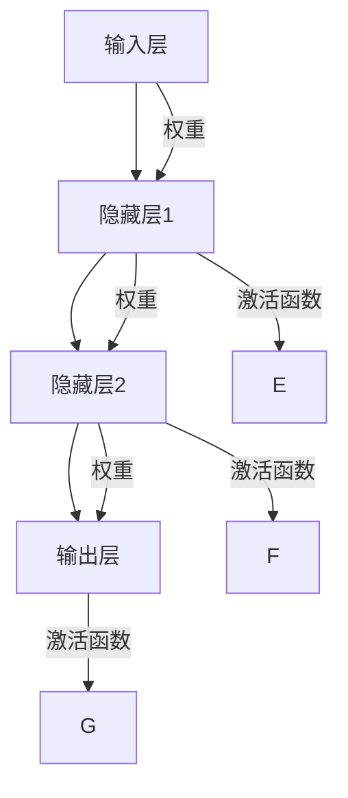
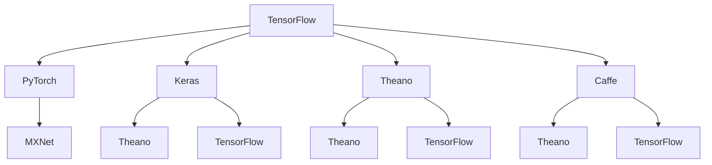
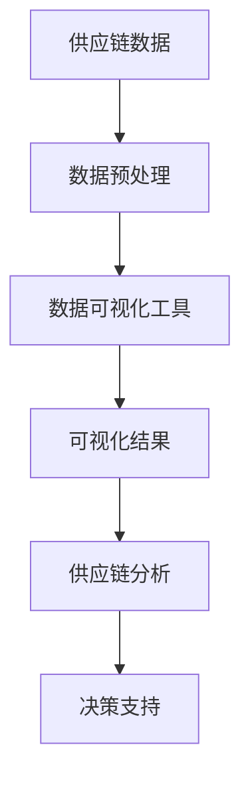
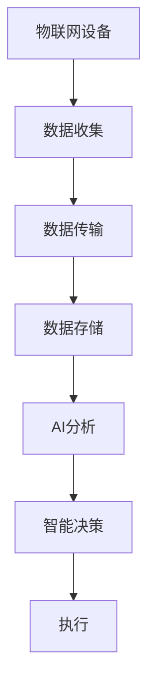
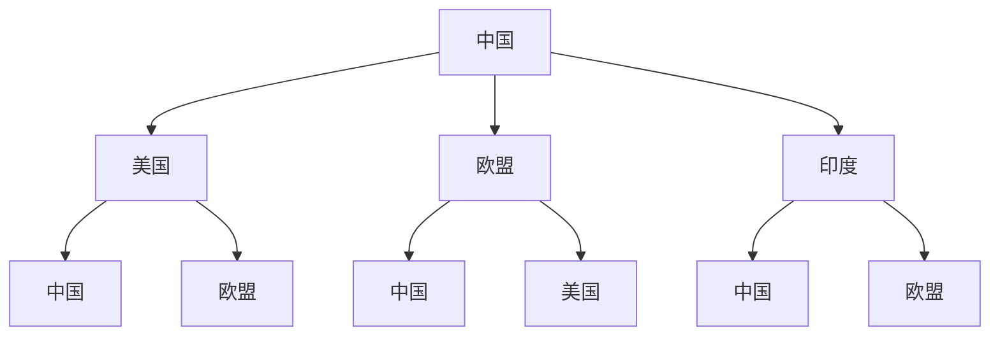

                 

### 第一部分：AI技术概述

#### 1.1 AI技术的发展历程

##### 1.1.1 AI的起源与发展

人工智能（AI）的概念可以追溯到20世纪50年代。1956年，在美国达特茅斯会议（Dartmouth Conference）上，约翰·麦卡锡（John McCarthy）等人首次提出了“人工智能”这一术语，并确定了人工智能研究的主要目标——使机器能够执行通常需要人类智能才能完成的任务。这一会议被视为人工智能历史上的一个重要里程碑。

从那时起，人工智能经历了多个发展阶段。早期的AI以符号推理和逻辑为基础，这一阶段被称为“符号主义AI”（Symbolic AI）。代表技术包括专家系统（Expert Systems），它们模拟人类专家的决策过程，通过符号逻辑和规则来解决问题。

20世纪80年代，基于知识的AI系统得到了广泛的应用。这些系统通过收集和利用人类专家的知识，帮助解决复杂的问题。

然而，符号主义AI在处理复杂和不确定的任务时遇到了困难。这促使研究人员开始探索基于数据驱动的方法，即机器学习。20世纪90年代，随着计算机处理能力的提升和数据量的爆炸性增长，机器学习逐渐成为AI研究的主流。

进入21世纪，特别是近年来，深度学习（Deep Learning）的兴起使得AI技术取得了巨大的进步。深度学习利用多层神经网络，通过大量的数据进行训练，能够自动提取特征并进行复杂的模式识别。这一技术已经在语音识别、图像识别、自然语言处理等领域取得了显著的成果。

##### 1.1.2 AI技术的基本概念

人工智能是一门研究、开发和应用使计算机模拟、延伸和扩展人的智能的理论、方法、技术及应用系统的科学技术。AI的主要目标是通过机器学习和人工智能算法，使计算机系统能够执行通常需要人类智能才能完成的任务，如理解语言、识别图像、做出决策等。

AI技术可以分为多个类别，包括但不限于：

- **符号主义AI**：基于逻辑推理和知识表示，通过规则和符号进行推理。
- **机器学习**：通过数据训练模型，使计算机能够从数据中自动学习和改进。
- **深度学习**：基于多层神经网络，通过大规模数据训练，能够自动提取复杂特征。
- **强化学习**：通过试错和奖励机制，使计算机能够在环境中进行学习和决策。
- **自然语言处理**（NLP）：使计算机能够理解、生成和翻译自然语言。
- **计算机视觉**：使计算机能够解析和识别图像和视频中的对象和场景。
- **机器人技术**：将AI应用于机器人，使其能够执行复杂的任务。

##### 1.1.3 AI技术的分类

人工智能技术可以根据不同的维度进行分类。以下是几种常见的分类方式：

- **根据处理方式分类**：可以分为符号主义AI、数据驱动AI和混合型AI。
  - **符号主义AI**：基于规则和逻辑推理。
  - **数据驱动AI**：基于机器学习和深度学习。
  - **混合型AI**：结合符号主义和数据驱动的方法。

- **根据应用领域分类**：可以分为通用AI和专用AI。
  - **通用AI**：能够执行任何需要人类智能的任务。
  - **专用AI**：针对特定领域或任务进行优化。

- **根据智能水平分类**：可以分为弱AI、强AI和超智能。
  - **弱AI**：局限于特定任务，如语音识别、图像识别等。
  - **强AI**：具有与人类相同或超过人类的智能。
  - **超智能**：超越人类智能，能够解决任何需要人类智能才能解决的问题。

#### 1.2 人工智能在商业领域的应用

##### 1.2.1 数据分析与挖掘

数据分析与挖掘是人工智能在商业领域的重要应用之一。通过大数据分析和挖掘技术，企业能够从海量数据中提取有价值的信息和模式，用于商业决策。

- **数据收集**：企业通过各种渠道收集数据，如销售数据、客户数据、市场数据等。
- **数据预处理**：对收集到的数据进行清洗、转换和整合，以去除噪声和异常值，并确保数据的质量。
- **数据可视化**：使用图表和图形将数据可视化，帮助企业直观地理解数据背后的信息。
- **数据挖掘**：通过统计分析和机器学习算法，从数据中挖掘出潜在的规律和模式。

数据分析与挖掘在商业中具有广泛的应用，如：

- **市场分析**：帮助企业了解市场趋势、客户行为和市场机会。
- **风险管理**：通过数据挖掘识别潜在的风险和异常行为。
- **运营优化**：利用数据分析优化供应链管理、库存管理和生产流程。

##### 1.2.2 机器学习与深度学习

机器学习和深度学习是人工智能技术的核心组成部分，在商业领域中具有广泛的应用。

- **机器学习**：通过训练模型，使计算机能够从数据中自动学习和改进。机器学习在商业中的应用包括：

  - **预测分析**：利用历史数据预测未来的趋势和变化。
  - **分类和聚类**：将数据分为不同的类别或簇。
  - **推荐系统**：基于用户的历史行为和偏好推荐商品或服务。

- **深度学习**：基于多层神经网络，通过大规模数据训练，能够自动提取复杂特征。深度学习在商业中的应用包括：

  - **图像识别**：用于质量控制、安全监控和客户服务。
  - **语音识别**：用于语音助手、客户服务和呼叫中心。
  - **自然语言处理**：用于文本分析、情感分析和聊天机器人。

##### 1.2.3 自然语言处理与语音识别

自然语言处理（NLP）和语音识别是AI在商业领域的另一个重要应用。

- **自然语言处理**：使计算机能够理解、生成和翻译自然语言。NLP在商业中的应用包括：

  - **文本分析**：用于市场分析、客户反馈分析和竞争对手监控。
  - **情感分析**：用于了解客户对产品或服务的情感态度。
  - **聊天机器人**：用于客户服务、销售支持和客户互动。

- **语音识别**：使计算机能够理解人类的语音输入。语音识别在商业中的应用包括：

  - **客户服务**：用于自动应答系统和呼叫中心。
  - **语音助手**：用于智能家居、车载系统和移动设备。
  - **语音搜索**：用于搜索引擎和语音导航。

### 第一部分总结

人工智能技术已经在商业领域取得了广泛的应用，从数据分析与挖掘到机器学习与深度学习，再到自然语言处理与语音识别，AI为商业带来了巨大的价值。随着AI技术的不断进步，未来商业领域将会看到更多的创新和变革。

#### 2.1 机器学习与深度学习基础

##### 2.1.1 神经网络与深度学习

神经网络（Neural Networks）是深度学习（Deep Learning）的基础，它们模仿人脑的神经元结构和信息处理方式。神经网络由多个层组成，包括输入层、隐藏层和输出层。每个神经元都通过权重连接到其他神经元，并通过激活函数进行信息传递和处理。

**Mermaid流程图：**


神经网络的工作原理是通过学习输入数据与输出数据之间的关系，从而进行预测或分类。深度学习则是通过增加网络层数（即深度）来提高模型的复杂度和表现力。

**数学模型：**
神经网络的输出通常由以下公式计算：
$$
\text{output} = \sigma(\text{weighted\_sum} + \text{bias})
$$
其中，$\sigma$ 是激活函数，如ReLU、Sigmoid或Tanh；weighted\_sum是每个输入乘以其相应权重后的总和，加上偏置（bias）。

**伪代码：**
```python
# 伪代码：简单的神经网络结构
class NeuralNetwork:
    def __init__(self):
        # 初始化网络参数
        self.weights_input_to_hidden = np.random.randn(input_size, hidden_size)
        self.biases_hidden = np.random.randn(hidden_size)
        self.weights_hidden_to_output = np.random.randn(hidden_size, output_size)
        self.biases_output = np.random.randn(output_size)
        
    def forward_pass(self, inputs):
        # 前向传播
        hidden_layer_input = np.dot(inputs, self.weights_input_to_hidden) + self.biases_hidden
        hidden_layer_output = self.sigmoid(hidden_layer_input)
        output_layer_input = np.dot(hidden_layer_output, self.weights_hidden_to_output) + self.biases_output
        output_layer_output = self.sigmoid(output_layer_input)
        return output_layer_output

    def sigmoid(self, x):
        # Sigmoid激活函数
        return 1 / (1 + np.exp(-x))
```

##### 2.1.2 机器学习算法

机器学习算法是AI系统中的核心，它们使计算机能够从数据中学习和改进。以下是一些常用的机器学习算法：

- **线性回归（Linear Regression）**：用于预测连续值。其目标是找到最佳拟合线，使预测值与实际值之间的误差最小。

  **数学模型：**
  $$
  y = \theta_0 + \theta_1x
  $$
  **伪代码：**
  ```python
  # 伪代码：线性回归算法
  def linear_regression(X, y):
      # 计算权重和偏置
      theta = (X.T @ X)^(-1) @ (X.T @ y)
      return theta
  ```

- **逻辑回归（Logistic Regression）**：用于分类问题，特别是二分类问题。其目标是找到最佳决策边界，将数据分为两个类别。

  **数学模型：**
  $$
  \text{log\_odds} = \theta_0 + \theta_1x
  $$
  **伪代码：**
  ```python
  # 伪代码：逻辑回归算法
  def logistic_regression(X, y):
      # 计算权重和偏置
      theta = (X.T @ X)^(-1) @ (X.T @ y)
      return theta
  ```

- **决策树（Decision Tree）**：通过一系列if-else规则将数据划分为不同的类别。

  **数学模型：**
  $$
  \text{分类规则} = \text{if} (\text{feature} > \text{threshold}) \text{then} \text{Class} = \text{A} \text{else} \text{Class} = \text{B}
  $$
  **伪代码：**
  ```python
  # 伪代码：决策树算法
  def decision_tree(data, features, thresholds):
      # 判断是否到达叶子节点
      if all(data[feature] <= threshold for feature, threshold in features_thresholds):
          return "Class A"
      else:
          return "Class B"
  ```

- **随机森林（Random Forest）**：通过构建多个决策树，并对它们的预测结果进行平均来提高模型的准确性。

  **数学模型：**
  $$
  \text{预测} = \text{majority\_vote}(\text{森林中的所有决策树})
  $$
  **伪代码：**
  ```python
  # 伪代码：随机森林算法
  def random_forest(data, n_trees, n_features):
      # 构建多个决策树
      for i in range(n_trees):
          tree = build_decision_tree(data, n_features)
          predictions.append(predict(tree, data))
      
      # 计算平均预测结果
      return majority_vote(predictions)
  ```

##### 2.1.3 深度学习框架

深度学习框架是用于实现和训练深度学习模型的软件库。以下是一些流行的深度学习框架：

- **TensorFlow**：由Google开发，是当前最流行的深度学习框架之一。
- **PyTorch**：由Facebook开发，因其动态计算图和灵活性而受到研究人员的喜爱。
- **Keras**：是TensorFlow和Theano的高级API，提供简化和易于使用的接口。
- **Theano**：是另一个流行的深度学习框架，但近年来其使用率已逐渐下降。
- **Caffe**：是一个开源的深度学习框架，特别适用于卷积神经网络。

**Mermaid流程图：**


深度学习框架提供了丰富的工具和库，使开发者能够轻松构建和训练复杂的深度学习模型，包括神经网络、卷积神经网络、循环神经网络等。

### 第二部分总结

在这一部分中，我们详细介绍了机器学习与深度学习的基础，包括神经网络的结构、常用的机器学习算法，以及深度学习框架。这些基础知识是理解和应用AI技术的基础，对于希望在商业领域中运用AI的企业来说尤为重要。通过这些核心概念和算法，企业可以开发出更智能的应用，提高业务效率和竞争力。

### 第三部分：AI在营销领域的应用

#### 3.1 AI在营销数据分析中的应用

营销数据分析是AI技术在营销领域的重要应用之一。通过分析海量数据，企业可以更好地理解市场趋势、客户行为和市场需求，从而制定更有效的营销策略。

- **客户细分**：通过数据分析，企业可以将客户分为不同的群体，以便于进行精准营销。例如，根据客户的购买历史、浏览行为和偏好，将客户划分为高价值客户、潜在客户和流失客户等。

**伪代码：**
```python
# 伪代码：K-means聚类算法进行客户细分
from sklearn.cluster import KMeans

def customer_segmentation(data, n_clusters):
    # 初始化K-means模型
    kmeans = KMeans(n_clusters=n_clusters)
    
    # 拟合模型
    kmeans.fit(data)
    
    # 分配客户到不同的集群
    clusters = kmeans.predict(data)
    
    return clusters
```

- **需求预测**：通过分析历史销售数据、季节性因素和市场趋势，企业可以预测未来的市场需求，以便调整库存和生产计划。

**伪代码：**
```python
# 伪代码：ARIMA模型进行需求预测
from statsmodels.tsa.arima_model import ARIMA

def demand_prediction(data, order):
    # 初始化ARIMA模型
    model = ARIMA(data, order=order)
    
    # 拟合模型
    model_fit = model.fit()
    
    # 预测未来需求
    forecast = model_fit.forecast(steps=1)[0]
    
    return forecast
```

- **营销效果评估**：通过分析营销活动的投放渠道、投放时间和投放效果，企业可以评估不同营销策略的效果，从而优化营销预算和策略。

**伪代码：**
```python
# 伪代码：线性回归模型进行营销效果评估
from sklearn.linear_model import LinearRegression

def marketing_evaluation(data, target):
    # 初始化线性回归模型
    model = LinearRegression()
    
    # 拟合模型
    model.fit(data, target)
    
    # 计算营销效果的R平方值
    r_squared = model.score(data, target)
    
    return r_squared
```

#### 3.2 AI在客户行为预测中的应用

预测客户行为可以帮助企业更好地了解客户需求，提高客户满意度和忠诚度。通过分析客户的历史数据和购买行为，企业可以预测客户的购买意图、购买时间和购买数量。

- **购买意图预测**：通过分析客户的浏览记录、搜索关键词和社交媒体活动，企业可以预测客户是否有可能进行购买。

**伪代码：**
```python
# 伪代码：逻辑回归模型进行购买意图预测
from sklearn.linear_model import LogisticRegression

def purchase_intent_prediction(data, target):
    # 初始化逻辑回归模型
    model = LogisticRegression()
    
    # 拟合模型
    model.fit(data, target)
    
    # 预测购买意图
    predictions = model.predict(data)
    
    return predictions
```

- **购买时间预测**：通过分析客户的购买历史和季节性因素，企业可以预测客户下一次购买的时间。

**伪代码：**
```python
# 伪代码：时间序列模型进行购买时间预测
from sklearn.ensemble import RandomForestRegressor

def purchase_time_prediction(data, target):
    # 初始化随机森林回归模型
    model = RandomForestRegressor()
    
    # 拟合模型
    model.fit(data, target)
    
    # 预测购买时间
    predictions = model.predict(data)
    
    return predictions
```

- **购买数量预测**：通过分析客户的购买历史和行为数据，企业可以预测客户下一次购买的商品数量。

**伪代码：**
```python
# 伪代码：时间序列模型进行购买数量预测
from sklearn.ensemble import GradientBoostingRegressor

def purchase_quantity_prediction(data, target):
    # 初始化梯度提升回归模型
    model = GradientBoostingRegressor()
    
    # 拟合模型
    model.fit(data, target)
    
    # 预测购买数量
    predictions = model.predict(data)
    
    return predictions
```

#### 3.3 AI在个性化推荐中的应用

个性化推荐是AI在营销领域的另一个重要应用。通过分析用户的历史数据和偏好，企业可以推荐用户可能感兴趣的商品或服务，从而提高用户的满意度和转化率。

- **协同过滤**：基于用户之间的相似度进行推荐。协同过滤分为用户基于协同过滤和物品基于协同过滤。

**伪代码：**
```python
# 伪代码：用户基于协同过滤算法
from sklearn.metrics.pairwise import cosine_similarity

def collaborative_filtering(ratings, similarity_matrix, user_id, n_recommendations):
    # 计算用户之间的相似度
    user_similarity = similarity_matrix[user_id]
    
    # 计算用户与其他用户的相似度之和
    similarity_scores = user_similarity.dot(ratings.T)
    
    # 排序并获取最高相似度的商品
    recommended_items = np.argsort(similarity_scores)[::-1][:n_recommendations]
    
    return recommended_items
```

- **基于内容的推荐**：基于商品的特征和用户的偏好进行推荐。

**伪代码：**
```python
# 伪代码：基于内容的推荐算法
def content_based_recommender(item_features, user_preferences, n_recommendations):
    # 计算商品与用户偏好的相似度
    similarity_scores = cosine_similarity([item_features], user_preferences)
    
    # 排序并获取最高相似度的商品
    recommended_items = np.argsort(similarity_scores)[0][-n_recommendations:]
    
    return recommended_items
```

#### 3.4 AI在营销自动化中的应用

营销自动化是利用AI技术自动执行营销任务和流程。通过营销自动化，企业可以节省时间和资源，提高营销效率。

- **营销流程自动化**：通过自动化工具，企业可以自动执行营销任务，如发送电子邮件、管理社交媒体、跟踪客户互动等。

**伪代码：**
```python
# 伪代码：营销流程自动化
def marketing_automation(tasks, schedule):
    # 根据日程安排执行任务
    for task, time in schedule.items():
        if time == current_time:
            execute_task(task)
```

- **客户关系管理**：通过AI技术，企业可以更好地管理客户关系，包括客户数据管理、客户互动跟踪和客户满意度分析。

**伪代码：**
```python
# 伪代码：客户关系管理
class CRM:
    def __init__(self):
        self.customer_data = {}
        
    def add_customer(self, customer_id, data):
        self.customer_data[customer_id] = data
        
    def analyze_customer(self, customer_id):
        customer_data = self.customer_data[customer_id]
        # 分析客户数据
        # ...
        return analysis_results
```

#### 3.5 AI在营销优化中的应用

通过AI技术，企业可以不断优化营销策略和活动，提高营销效果。

- **A/B测试**：通过对比不同营销策略的效果，企业可以找出最优策略。

**伪代码：**
```python
# 伪代码：A/B测试
def a_b_test(group_a_data, group_b_data, target):
    # 计算两组数据的指标
    group_a_metric = calculate_metric(group_a_data, target)
    group_b_metric = calculate_metric(group_b_data, target)
    
    # 比较两组数据的指标
    if group_a_metric > group_b_metric:
        return "Group A is better"
    else:
        return "Group B is better"
```

- **营销预算优化**：通过分析历史数据和营销效果，企业可以优化营销预算分配，提高预算利用率。

**伪代码：**
```python
# 伪代码：营销预算优化
def marketing_budget_optimization(data, budget):
    # 分析不同营销渠道的效果
    # ...
    
    # 优化预算分配
    optimized_budget = allocate_budget(data, budget)
    
    return optimized_budget
```

### 第三部分总结

在这一部分中，我们详细介绍了AI在营销领域的应用，包括营销数据分析、客户行为预测、个性化推荐、营销自动化和营销优化。通过AI技术的应用，企业可以更好地理解市场趋势和客户需求，制定更有效的营销策略，提高营销效果和客户满意度。随着AI技术的不断进步，营销领域将会看到更多的创新和变革。

### 第四部分：AI在客户服务领域的应用

#### 4.1 AI在客户服务中的应用

AI在客户服务领域中的应用正日益增多，为企业提供了更高效、更个性化的服务方式。以下是一些关键的AI应用：

- **聊天机器人**：聊天机器人通过自然语言处理（NLP）技术，能够与客户进行实时对话，解答常见问题，提供基本的服务支持。聊天机器人不仅可以24小时在线，还能够处理大量客户请求，从而提高服务效率。

**伪代码：**
```python
# 伪代码：简单的聊天机器人
class ChatBot:
    def __init__(self, intents):
        self.intents = intents
        
    def get_response(self, message):
        for intent, patterns in self.intents.items():
            if any(re.search(pattern, message) for pattern in patterns):
                return random.choice(self.intents[intent]["responses"])
        return "Sorry, I don't understand."

intents = {
    "greeting": {
        "patterns": ["hello", "hi", "hey"],
        "responses": ["Hello!", "Hi there!", "Hey! How can I help you?"]
    },
    "goodbye": {
        "patterns": ["bye", "goodbye", "see you"],
        "responses": ["Goodbye!", "See you later!", "Have a nice day!"]
    }
}

chatbot = ChatBot(intents)
print(chatbot.get_response("hello"))  # 输出："Hello!"
```

- **情感分析**：情感分析通过NLP技术，可以识别客户在沟通中的情绪状态，如愤怒、满意或失望。这种分析可以帮助企业及时识别和解决潜在问题，改善客户体验。

**伪代码：**
```python
# 伪代码：情感分析
from textblob import TextBlob

def get_sentiment(text):
    analysis = TextBlob(text)
    if analysis.sentiment.polarity > 0:
        return "Positive"
    elif analysis.sentiment.polarity == 0:
        return "Neutral"
    else:
        return "Negative"

print(get_sentiment("I'm very happy with the service."))  # 输出："Positive"
```

- **个性化服务**：通过分析客户的购买历史、浏览记录和偏好，AI可以提供个性化的推荐和服务，从而提高客户满意度和忠诚度。

**伪代码：**
```python
# 伪代码：个性化推荐
def personalized_recommendation(customer_data):
    # 分析客户数据
    items_bought = customer_data["items_bought"]
    items_viewed = customer_data["items_viewed"]
    
    # 推荐相似的商品
    recommended_items = get_similar_items(items_bought + items_viewed)
    
    return recommended_items

def get_similar_items(items):
    # 基于协同过滤算法获取相似商品
    # ...
    return similar_items

customer_data = {"items_bought": ["item1", "item2"], "items_viewed": ["item3", "item4"]}
print(personalized_recommendation(customer_data))  # 输出推荐商品列表
```

- **自动化流程**：AI可以帮助企业自动化客户服务流程，如自动预约、自动确认和自动问题解决。这样可以大大减少人工干预，提高服务效率。

**伪代码：**
```python
# 伪代码：自动化服务流程
def automate_service流程(response):
    if response == "appointment":
        schedule_appointment()
    elif response == "confirmation":
        send_confirmation()
    elif response == "issue":
        resolve_issue()

def schedule_appointment():
    # 安排预约时间
    # ...

def send_confirmation():
    # 发送确认通知
    # ...

def resolve_issue():
    # 解决问题
    # ...

user_input = "I need an appointment."
automate_service流程(user_input)
```

#### 4.2 AI在客户情感分析中的应用

情感分析是一种利用NLP技术理解和识别客户情绪的技术。通过情感分析，企业可以更好地理解客户的需求和不满，从而提供更优质的服务。

- **情感分类**：情感分类将客户情绪分为正面、负面和中性。这有助于企业识别客户情绪，并采取相应措施。

**伪代码：**
```python
# 伪代码：情感分类
from textblob import TextBlob

def classify_sentiment(text):
    analysis = TextBlob(text)
    if analysis.sentiment.polarity > 0:
        return "Positive"
    elif analysis.sentiment.polarity < 0:
        return "Negative"
    else:
        return "Neutral"

text = "I'm extremely satisfied with your service."
print(classify_sentiment(text))  # 输出："Positive"
```

- **情感分析应用**：情感分析可以应用于客户反馈、社交媒体评论和客户服务对话中，帮助企业识别客户情感，并提供个性化的服务。

**伪代码：**
```python
# 伪代码：情感分析应用
def analyze_feedback(feedback):
    sentiment = classify_sentiment(feedback)
    if sentiment == "Negative":
        send_apology()
    elif sentiment == "Positive":
        send_thank_you()
    else:
        follow_up()

def send_apology():
    # 发送道歉邮件
    # ...

def send_thank_you():
    # 发送感谢邮件
    # ...

feedback = "The product is not what I expected."
analyze_feedback(feedback)
```

#### 4.3 AI在客户服务优化中的应用

AI可以帮助企业优化客户服务流程，提高客户满意度和忠诚度。

- **服务流程优化**：通过分析客户服务数据，企业可以识别流程中的瓶颈和问题，并采取相应措施进行优化。

**伪代码：**
```python
# 伪代码：服务流程优化
def optimize_service流程(service_data):
    # 分析服务数据
    issues = identify_issues(service_data)
    improvements = suggest_improvements(issues)
    
    # 优化服务流程
    implement_improvements(improvements)

def identify_issues(service_data):
    # 识别流程中的问题
    # ...
    return issues

def suggest_improvements(issues):
    # 提出改进措施
    # ...
    return improvements

def implement_improvements(improvements):
    # 实施改进措施
    # ...

service_data = {"issues": ["long wait times", "inaccurate information"]}
optimize_service流程(service_data)
```

- **服务质量监测**：通过AI技术，企业可以实时监测客户服务质量，及时发现和解决问题。

**伪代码：**
```python
# 伪代码：服务质量监测
def monitor_service_quality(service_data):
    # 分析服务数据
    quality_scores = calculate_quality_scores(service_data)
    if any(score < threshold for score in quality_scores):
        trigger_alert()

def calculate_quality_scores(service_data):
    # 计算服务质量得分
    # ...
    return quality_scores

def trigger_alert():
    # 触发警报
    # ...

service_data = {"call_duration": [180, 210, 300], "issue_resolution": ["yes", "no", "no"]}
monitor_service_quality(service_data)
```

### 第四部分总结

在这一部分中，我们探讨了AI在客户服务领域的多种应用，包括聊天机器人、情感分析、个性化服务和流程优化。AI技术的引入不仅提高了客户服务的效率和质量，还为企业提供了更深入的客户洞察，帮助企业在激烈的市场竞争中保持优势。随着AI技术的不断进步，客户服务领域将继续迎来创新和变革。

### 第五部分：AI在供应链管理中的应用

#### 5.1 AI在供应链可视化中的应用

供应链可视化是AI在供应链管理中的一个重要应用，通过数据可视化和分析技术，企业能够更直观地了解供应链的各个环节，从而优化管理和决策。

**数据可视化：** 数据可视化是一种通过图形和图表来展示数据的方法，使得复杂的供应链信息变得更加易于理解和分析。常见的可视化工具包括条形图、折线图、饼图和地图等。

**Mermaid流程图：**


**伪代码：**
```python
# 伪代码：数据可视化
import pandas as pd
import matplotlib.pyplot as plt

# 加载数据集
data = pd.read_csv('supply_chain_data.csv')

# 绘制供应链网络图
data.groupby('node_type').size().plot(kind='bar')
plt.title('Supply Chain Nodes')
plt.xlabel('Node Type')
plt.ylabel('Count')
plt.show()
```

**数学模型：**
$$
\text{可视化效果} = \text{数据精度} \times \text{交互性} \times \text{用户体验}
$$

**举例说明：** 
某制造企业通过供应链可视化技术，将供应链各环节的数据进行整合和展示，从而帮助企业高层和供应链管理人员更清晰地了解供应链的运行情况，及时发现潜在问题并进行优化。

#### 5.2 AI在库存管理中的应用

库存管理是供应链管理中的关键环节，通过AI技术，企业可以更准确地预测库存需求，优化库存水平，减少库存成本。

**库存预测：** AI技术可以帮助企业利用历史销售数据、市场趋势和季节性因素，预测未来的库存需求。

**伪代码：**
```python
# 伪代码：库存预测
from sklearn.ensemble import RandomForestRegressor

# 加载历史销售数据
sales_data = pd.read_csv('sales_data.csv')

# 特征工程
features = sales_data[['time_series', 'previous_sales']]
target = sales_data['forecasted_sales']

# 拟合随机森林模型
model = RandomForestRegressor()
model.fit(features, target)

# 预测未来库存需求
forecasted_sales = model.predict(sales_data[['time_series', 'previous_sales']])
```

**数学模型：**
$$
\text{库存需求} = f(\text{历史销售数据}, \text{市场趋势}, \text{季节性因素})
$$

**举例说明：**
某零售企业利用AI技术对库存进行预测和管理，通过分析历史销售数据和市场需求，优化库存水平，减少了库存成本，提高了资金利用率。

#### 5.3 AI在物流优化中的应用

物流优化是供应链管理中的另一个关键环节，AI技术可以帮助企业优化运输路线、降低物流成本，提高物流效率。

**运输路线优化：** 通过AI算法，企业可以分析交通流量、道路状况和运输成本，优化运输路线，减少运输时间和成本。

**伪代码：**
```python
# 伪代码：运输路线优化
from scipy.optimize import linprog

# 定义目标函数和约束条件
c = [-1, -1]  # 目标是最小化运输时间和成本
A = [[1, 0], [0, 1], [-1, 1]]  # 约束条件
b = [0, 0, 1]  # 总运输距离不超过100公里

# 优化运输路线
solution = linprog(c, A_ub=A, b_ub=b)
optimal_route = solution.x

# 输出最优运输路线
print("Optimal Route:", optimal_route)
```

**数学模型：**
$$
\text{最小化} \ \sum_{i=1}^{n} c_i x_i \\
\text{约束条件} \ \sum_{i=1}^{n} a_{ij} x_i \leq b_j \\
x_i \in \{0, 1\}
$$
其中，$x_i$ 表示第$i$个运输路线是否被选中，$c_i$ 表示第$i$个运输路线的成本或时间，$a_{ij}$ 表示第$i$个运输路线与第$j$个配送点的距离或成本，$b_j$ 表示总运输距离或成本上限。

**举例说明：**
某物流公司利用AI技术优化运输路线，通过分析交通流量和物流成本，设计出最优的运输路线，减少了运输时间和成本，提高了运输效率。

#### 5.4 AI在供应链风险管理中的应用

供应链风险管理是确保供应链稳定运行的重要环节，AI技术可以帮助企业识别和预测潜在风险，采取相应的预防措施。

**风险预测：** 通过分析供应链历史数据和外部环境因素，AI技术可以预测供应链中的潜在风险，如供应商延迟、物流中断和库存过剩等。

**伪代码：**
```python
# 伪代码：风险预测
from sklearn.ensemble import RandomForestClassifier

# 加载供应链数据
supply_chain_data = pd.read_csv('supply_chain_data.csv')

# 特征工程
features = supply_chain_data[['supply_delay', 'logistics_issue', 'inventory_level']]
target = supply_chain_data['risk']

# 拟合随机森林分类器
model = RandomForestClassifier()
model.fit(features, target)

# 预测潜在风险
predicted_risks = model.predict(supply_chain_data[['supply_delay', 'logistics_issue', 'inventory_level']])
```

**数学模型：**
$$
\text{风险概率} = f(\text{供应链历史数据}, \text{外部环境因素})
$$

**举例说明：**
某制造业企业利用AI技术对供应链风险进行预测和管理，通过分析供应链数据和环境因素，提前识别和预防潜在风险，确保供应链的稳定运行。

### 第五部分总结

在这一部分中，我们探讨了AI在供应链管理中的多种应用，包括供应链可视化、库存管理、物流优化和供应链风险管理。通过AI技术的应用，企业可以更高效地管理和优化供应链，降低成本，提高效率。随着AI技术的不断进步，供应链管理领域将继续迎来创新和变革。

### 第六部分：AI在生产制造领域的应用

#### 6.1 AI在智能生产系统中的应用

智能生产系统是AI技术在生产制造领域的核心应用之一，它通过自动化、数据分析和人工智能技术，实现生产过程的智能化和优化。

- **自动化生产**：AI技术可以实现生产线的自动化操作，减少人工干预，提高生产效率和准确性。通过机器人和自动化设备，生产过程变得更加高效和可靠。

**伪代码：**
```python
# 伪代码：自动化生产
class AutomatedProductionSystem:
    def __init__(self):
        selfrobots = [Robot1(), Robot2(), Robot3()]
        
    def start_production(self):
        for robot in self.robots:
            robot.start()
            
class Robot:
    def start(self):
        print("Starting the robot.")
        # 执行自动化生产任务
```

- **实时监控**：AI技术可以通过传感器和数据采集系统，实时监控生产线的状态，包括设备运行状态、产品质量和生产进度。实时监控可以帮助企业及时发现问题并采取措施。

**伪代码：**
```python
# 伪代码：实时监控
class RealTimeMonitoringSystem:
    def __init__(self):
        self.sensors = [Sensor1(), Sensor2(), Sensor3()]
        
    def monitor_production(self):
        for sensor in self.sensors:
            sensor.read_data()
            
class Sensor:
    def read_data(self):
        print("Reading sensor data.")
        # 采集传感器数据
```

- **预测性维护**：通过分析设备的历史数据和实时监控数据，AI技术可以预测设备的故障和维修需求，从而实现预测性维护。预测性维护可以减少设备故障率，延长设备寿命，降低维修成本。

**伪代码：**
```python
# 伪代码：预测性维护
from sklearn.ensemble import RandomForestRegressor

# 加载设备历史数据
equipment_data = pd.read_csv('equipment_data.csv')

# 特征工程
features = equipment_data[['temperature', 'vibration', 'lifetime']]
target = equipment_data['maintenance_needed']

# 拟合随机森林模型
model = RandomForestRegressor()
model.fit(features, target)

# 预测维修需求
predicted_maintenance = model.predict(equipment_data[['temperature', 'vibration', 'lifetime']])
```

**数学模型：**
$$
\text{维修需求} = f(\text{设备温度}, \text{设备振动}, \text{设备寿命})
$$

**举例说明：**
某制造企业通过AI技术对生产设备进行实时监控和预测性维护，通过分析设备的历史数据和实时监控数据，提前识别设备故障和维修需求，从而减少设备停机时间和维修成本。

#### 6.2 AI在质量检测中的应用

质量检测是生产制造过程中至关重要的一环，AI技术可以帮助企业实现自动化质量检测，提高检测准确性和效率。

- **图像识别**：AI技术可以通过图像识别算法，对生产过程中的产品进行质量检测。图像识别可以识别产品的缺陷、颜色和尺寸等问题。

**伪代码：**
```python
# 伪代码：图像识别质量检测
import cv2
import numpy as np

# 读取图像
image = cv2.imread('product_image.jpg')

# 转换为灰度图像
gray_image = cv2.cvtColor(image, cv2.COLOR_BGR2GRAY)

# 使用边缘检测算法
edges = cv2.Canny(gray_image, 100, 200)

# 检测缺陷
defects = detect_defects(edges)
if defects:
    print("Defect detected.")
else:
    print("Product is good.")
```

- **光谱分析**：AI技术可以通过光谱分析，对产品的化学成分和物理特性进行检测。光谱分析可以识别产品的纯度、成分和品质等问题。

**伪代码：**
```python
# 伪代码：光谱分析
from spectrometer import Spectrometer

# 初始化光谱仪
spectrometer = Spectrometer()

# 采集光谱数据
spectrum_data = spectrometer.collect_data()

# 分析光谱数据
def analyze_spectrum(data):
    # 分析光谱数据
    # ...
    return concentration

concentration = analyze_spectrum(spectrum_data)
if concentration < threshold:
    print("Product quality is low.")
else:
    print("Product quality is high.")
```

**数学模型：**
$$
\text{质量评分} = f(\text{光谱数据})
$$

**举例说明：**
某食品企业利用AI技术对产品进行质量检测，通过图像识别和光谱分析，实时监控产品的质量和安全性，确保产品达到高标准。

#### 6.3 AI在供应链优化中的应用

AI技术可以帮助企业优化供应链管理，提高供应链的效率和灵活性。

- **供应链预测**：通过AI技术，企业可以预测供应链中的需求和供应情况，提前调整生产和库存计划，减少供应链中断和库存过剩的风险。

**伪代码：**
```python
# 伪代码：供应链预测
from sklearn.ensemble import RandomForestRegressor

# 加载供应链数据
supply_chain_data = pd.read_csv('supply_chain_data.csv')

# 特征工程
features = supply_chain_data[['demand', 'lead_time', 'supply']]
target = supply_chain_data['supply_forecast']

# 拟合随机森林模型
model = RandomForestRegressor()
model.fit(features, target)

# 预测供应链需求
forecasted_demand = model.predict(supply_chain_data[['demand', 'lead_time', 'supply']])
```

**数学模型：**
$$
\text{供应链需求} = f(\text{历史需求}, \text{交货时间}, \text{供应量})
$$

**举例说明：**
某电子产品制造商利用AI技术预测市场需求和供应情况，通过调整生产和库存计划，减少供应链中断和库存过剩，提高了生产效率和客户满意度。

### 第六部分总结

在这一部分中，我们详细探讨了AI在生产制造领域的多种应用，包括智能生产系统、质量检测和供应链优化。通过AI技术的应用，企业可以实现生产过程的自动化、实时监控和预测性维护，提高生产效率和质量，优化供应链管理。随着AI技术的不断进步，生产制造领域将继续迎来创新和变革。

### 第七部分：AI在人力资源中的应用

#### 7.1 AI在招聘与人才筛选中的应用

AI技术在人力资源领域的应用正在不断扩展，特别是在招聘与人才筛选方面，AI能够显著提高招聘效率和准确性。

- **简历筛选**：AI可以通过自然语言处理（NLP）技术，自动筛选和评估求职者的简历，识别最符合岗位要求的候选人。

**伪代码：**
```python
# 伪代码：简历筛选
from textblob import TextBlob

def resume_screening(resume):
    # 分析简历文本
    blob = TextBlob(resume)
    
    # 识别关键字和技能
    keywords = blob.noun_phrases
    
    # 判断简历与岗位要求的匹配度
    match_score = 0
    for keyword in keywords:
        if keyword in job_requirements:
            match_score += 1
            
    return match_score

job_requirements = ["Python", "Machine Learning", "Data Analysis"]
resume = "I have 5 years of experience in Python development and 3 years in machine learning."
print(resume_screening(resume))  # 输出匹配分数
```

- **面试评估**：AI可以通过语音识别和自然语言处理技术，自动记录和评估面试者的回答，提供面试反馈。

**伪代码：**
```python
# 伪代码：面试评估
from textblob import TextBlob

def interview_evaluation(interview_response):
    # 分析面试回答
    blob = TextBlob(interview_response)
    
    # 计算回答的积极性
    positivity = blob.sentiment.polarity
    
    # 评估回答质量
    quality_score = len(blob.words) / len(blob.sentences)
    
    return positivity, quality_score

interview_response = "I believe my strong technical skills and experience make me a great fit for this role."
print(interview_evaluation(interview_response))  # 输出积极性和质量分数
```

#### 7.2 AI在员工绩效评估中的应用

员工绩效评估是人力资源管理的核心任务之一，AI技术可以帮助企业更客观、准确地评估员工绩效。

- **量化评估**：AI可以通过分析员工的绩效数据，如销售业绩、项目完成情况和客户满意度，对员工的工作表现进行量化评估。

**伪代码：**
```python
# 伪代码：量化评估
from sklearn.ensemble import RandomForestRegressor

def performance_evaluation(employee_data):
    # 分析员工数据
    features = employee_data[['sales', 'project_completion', 'customer_satisfaction']]
    
    # 拟合随机森林模型
    model = RandomForestRegressor()
    model.fit(features, employee_data['performance_score'])
    
    # 评估员工绩效
    performance_score = model.predict(employee_data[['sales', 'project_completion', 'customer_satisfaction']])
    
    return performance_score

employee_data = pd.DataFrame({
    'sales': [100, 150, 200],
    'project_completion': [90, 85, 95],
    'customer_satisfaction': [4.5, 4.8, 5.0],
    'performance_score': [3.0, 2.5, 4.0]
})
print(performance_evaluation(employee_data))  # 输出员工绩效分数
```

- **行为评估**：AI可以通过分析员工的日常工作行为，如出勤记录、工作时长和团队合作情况，对员工的行为表现进行评估。

**伪代码：**
```python
# 伪代码：行为评估
class BehaviorEvaluationSystem:
    def __init__(self):
        self.attendance_data = [1, 0, 1, 1, 0, 1]
        self.working_hours_data = [8, 9, 7, 8, 10, 9]
        self.teamwork_data = [4, 3, 4, 5, 3, 4]
        
    def evaluate_behavior(self):
        # 计算行为得分
        attendance_score = sum(self.attendance_data) / len(self.attendance_data)
        working_hours_score = sum(self.working_hours_data) / len(self.working_hours_data)
        teamwork_score = sum(self.teamwork_data) / len(self.teamwork_data)
        
        return attendance_score, working_hours_score, teamwork_score

evaluation_system = BehaviorEvaluationSystem()
print(evaluation_system.evaluate_behavior())  # 输出行为得分
```

#### 7.3 AI在薪酬管理与激励中的应用

AI技术在薪酬管理和激励方面也有广泛应用，可以帮助企业制定公平合理的薪酬政策，激励员工提高工作效率。

- **薪酬评估**：AI可以通过分析员工绩效和行为评估数据，结合市场薪酬水平，为员工制定合理的薪酬方案。

**伪代码：**
```python
# 伪代码：薪酬评估
from sklearn.ensemble import RandomForestRegressor

def salary_evaluation(employee_data, market_data):
    # 结合员工绩效和行为评估数据以及市场薪酬水平
    combined_data = pd.DataFrame({
        'performance_score': employee_data['performance_score'],
        'behavior_score': employee_data['behavior_score'],
        'market_salary': market_data['average_salary']
    })
    
    # 拟合随机森林模型
    model = RandomForestRegressor()
    model.fit(combined_data[['performance_score', 'behavior_score']], combined_data['market_salary'])
    
    # 预测员工薪酬
    predicted_salary = model.predict([[employee_data['performance_score'], employee_data['behavior_score']]])
    
    return predicted_salary

employee_data = pd.DataFrame({
    'performance_score': [3.5, 2.8, 4.2],
    'behavior_score': [0.8, 0.9, 0.7]
})
market_data = pd.DataFrame({
    'average_salary': [5000, 6000, 7000]
})
print(salary_evaluation(employee_data, market_data))  # 输出员工薪酬预测
```

- **激励机制**：AI可以通过分析员工的工作表现和激励历史，为员工设计个性化的激励方案，提高员工的积极性和工作效率。

**伪代码：**
```python
# 伪代码：激励机制
def incentive_program(employee_data, company_budget):
    # 分析员工的工作表现和激励历史
    performance_data = employee_data[['performance_score', 'incentive_received']]
    
    # 设计激励方案
    incentive_plan = {}
    for employee_id, row in performance_data.iterrows():
        if row['performance_score'] >= threshold:
            incentive_plan[employee_id] = calculate_incentive(row['incentive_received'], company_budget)
            
    return incentive_plan

def calculate_incentive(received_incentive, budget):
    # 根据预算计算激励金额
    return received_incentive * (1 + (budget / total_incentive_budget))

employee_data = pd.DataFrame({
    'performance_score': [4.0, 3.0, 2.5],
    'incentive_received': [1000, 800, 500]
})
company_budget = 5000
print(incentive_program(employee_data, company_budget))  # 输出激励计划
```

### 第七部分总结

在这一部分中，我们探讨了AI在人力资源领域的多种应用，包括招聘与人才筛选、员工绩效评估和薪酬管理与激励。通过AI技术的应用，企业可以更高效、准确地管理人力资源，提高招聘和绩效管理的效率，制定公平合理的薪酬政策。随着AI技术的不断进步，人力资源领域将继续迎来创新和变革。

### 第八部分：AI在金融领域的应用

#### 8.1 AI在风险管理中的应用

AI技术在金融领域的风险管理中扮演着越来越重要的角色，通过分析大量数据，AI能够识别潜在风险并提供及时的预警，帮助企业做出更明智的决策。

- **欺诈检测**：AI技术可以通过机器学习和模式识别，分析交易行为和用户行为，识别潜在的欺诈活动。

**伪代码：**
```python
# 伪代码：欺诈检测
from sklearn.ensemble import RandomForestClassifier

def fraud_detection(transactions):
    # 加载交易数据
    transaction_data = pd.read_csv('transaction_data.csv')
    
    # 特征工程
    features = transaction_data[['amount', 'time', 'source']]
    target = transaction_data['is_fraud']
    
    # 拟合随机森林模型
    model = RandomForestClassifier()
    model.fit(features, target)
    
    # 预测交易是否为欺诈
    predictions = model.predict(transaction_data[['amount', 'time', 'source']])
    
    # 标记高风险交易
    transaction_data['risk'] = predictions
    high_risk_transactions = transaction_data[transaction_data['risk'] == 1]
    
    return high_risk_transactions

transaction_data = pd.DataFrame({
    'amount': [100, 200, 300],
    'time': ['2023-01-01 12:00', '2023-01-01 13:00', '2023-01-01 14:00'],
    'source': ['online', 'mobile', 'POS'],
    'is_fraud': [0, 1, 0]
})
print(fraud_detection(transaction_data))  # 输出高风险交易
```

- **信用评估**：AI技术可以通过分析客户的信用历史、财务状况和行为数据，预测客户的信用风险，为金融机构提供决策支持。

**伪代码：**
```python
# 伪代码：信用评估
from sklearn.linear_model import LogisticRegression

def credit_evaluation(credit_data):
    # 加载信用数据
    credit_data = pd.read_csv('credit_data.csv')
    
    # 特征工程
    features = credit_data[['income', 'age', 'credit_history']]
    target = credit_data['is_default']
    
    # 拟合逻辑回归模型
    model = LogisticRegression()
    model.fit(features, target)
    
    # 预测信用风险
    predictions = model.predict(credit_data[['income', 'age', 'credit_history']])
    
    # 标记高风险客户
    credit_data['risk'] = predictions
    high_risk_customers = credit_data[credit_data['risk'] == 1]
    
    return high_risk_customers

credit_data = pd.DataFrame({
    'income': [50000, 70000, 90000],
    'age': [25, 35, 45],
    'credit_history': [1, 2, 3],
    'is_default': [0, 1, 0]
})
print(credit_evaluation(credit_data))  # 输出高风险客户
```

#### 8.2 AI在贷款审批中的应用

AI技术在贷款审批过程中可以显著提高效率，通过分析申请者的信用评分和历史行为，AI能够快速做出决策，减少人工干预。

- **自动审批**：AI技术可以通过机器学习算法，自动化贷款审批流程，减少审批时间和成本。

**伪代码：**
```python
# 伪代码：贷款审批
from sklearn.ensemble import RandomForestClassifier

def loan_approval(loan_application):
    # 加载贷款申请数据
    loan_application = pd.read_csv('loan_application_data.csv')
    
    # 特征工程
    features = loan_application[['income', 'employment_status', 'credit_score']]
    target = loan_application['approval_status']
    
    # 拟合随机森林模型
    model = RandomForestClassifier()
    model.fit(features, target)
    
    # 预测贷款审批结果
    prediction = model.predict(loan_application[['income', 'employment_status', 'credit_score']])
    
    return prediction

loan_application = pd.DataFrame({
    'income': [60000],
    'employment_status': ['full_time'],
    'credit_score': [720]
})
print(loan_approval(loan_application))  # 输出审批结果
```

- **风险评估**：AI技术可以通过分析申请者的历史数据和交易记录，预测贷款违约的风险，为金融机构提供决策依据。

**伪代码：**
```python
# 伪代码：风险评估
from sklearn.ensemble import RandomForestClassifier

def credit_risk_evaluation(loan_application):
    # 加载贷款申请数据
    loan_application = pd.read_csv('loan_application_data.csv')
    
    # 特征工程
    features = loan_application[['income', 'age', 'credit_score']]
    target = loan_application['default']
    
    # 拟合随机森林模型
    model = RandomForestClassifier()
    model.fit(features, target)
    
    # 预测信用风险
    risk_prediction = model.predict(loan_application[['income', 'age', 'credit_score']])
    
    return risk_prediction

loan_application = pd.DataFrame({
    'income': [60000],
    'age': [35],
    'credit_score': [720]
})
print(credit_risk_evaluation(loan_application))  # 输出信用风险预测
```

#### 8.3 AI在金融市场的预测与分析中的应用

AI技术在金融市场中的应用越来越广泛，通过分析历史数据和市场趋势，AI可以提供投资建议和市场预测，帮助投资者做出更明智的决策。

- **趋势预测**：AI技术可以通过时间序列分析和机器学习算法，预测市场的未来趋势。

**伪代码：**
```python
# 伪代码：趋势预测
from sklearn.ensemble import RandomForestRegressor

def market_trend_prediction(trend_data):
    # 加载市场数据
    trend_data = pd.read_csv('market_data.csv')
    
    # 特征工程
    features = trend_data[['open', 'high', 'low', 'close']]
    target = trend_data['trend']
    
    # 拟合随机森林模型
    model = RandomForestRegressor()
    model.fit(features, target)
    
    # 预测市场趋势
    trend_prediction = model.predict(trend_data[['open', 'high', 'low', 'close']])
    
    return trend_prediction

market_data = pd.DataFrame({
    'open': [150.0, 160.0, 155.0],
    'high': [160.0, 165.0, 158.0],
    'low': [150.0, 155.0, 152.0],
    'close': [155.0, 160.0, 157.0],
    'trend': [1, 1, 0]
})
print(market_trend_prediction(market_data))  # 输出市场趋势预测
```

- **交易策略**：AI技术可以通过分析市场数据和交易记录，为投资者提供个性化的交易策略。

**伪代码：**
```python
# 伪代码：交易策略
from sklearn.ensemble import RandomForestClassifier

def trading_strategy(market_data, risk_tolerance):
    # 加载市场数据
    market_data = pd.read_csv('market_data.csv')
    
    # 特征工程
    features = market_data[['open', 'high', 'low', 'close']]
    target = market_data['trend']
    
    # 拟合随机森林模型
    model = RandomForestClassifier()
    model.fit(features, target)
    
    # 根据风险偏好预测交易策略
    if risk_tolerance == 'low':
        strategy = model.predict(features)
    elif risk_tolerance == 'high':
        strategy = model.predict(features)
    else:
        strategy = model.predict(features)
        
    return strategy

market_data = pd.DataFrame({
    'open': [150.0, 160.0, 155.0],
    'high': [160.0, 165.0, 158.0],
    'low': [150.0, 155.0, 152.0],
    'close': [155.0, 160.0, 157.0],
    'trend': [1, 1, 0]
})
print(trading_strategy(market_data, 'low'))  # 输出低风险交易策略
```

### 第八部分总结

在这一部分中，我们探讨了AI在金融领域的多种应用，包括风险管理、贷款审批和金融市场预测。通过AI技术的应用，金融机构可以更高效地识别风险、审批贷款，并预测市场趋势，为投资者提供有价值的决策支持。随着AI技术的不断进步，金融领域将继续迎来创新和变革。

### 第九部分：AI技术在其他领域的应用

#### 9.1 AI在健康医疗领域的应用

AI技术在健康医疗领域的应用正在迅速发展，通过大数据分析和机器学习算法，AI可以帮助医疗行业提高诊断准确性、优化治疗方案，并提升医疗服务效率。

- **疾病预测与诊断**：AI可以通过分析患者的医疗记录、基因数据和生物标记，预测疾病的发病风险，并在早期阶段进行诊断。

**伪代码：**
```python
# 伪代码：疾病预测
from sklearn.ensemble import RandomForestClassifier

def disease_prediction(patient_data):
    # 加载患者数据
    patient_data = pd.read_csv('patient_data.csv')
    
    # 特征工程
    features = patient_data[['age', 'blood_pressure', 'cholesterol', 'glucose']]
    target = patient_data['disease']
    
    # 拟合随机森林模型
    model = RandomForestClassifier()
    model.fit(features, target)
    
    # 预测疾病
    predictions = model.predict(patient_data[['age', 'blood_pressure', 'cholesterol', 'glucose']])
    
    return predictions

patient_data = pd.DataFrame({
    'age': [50],
    'blood_pressure': [120],
    'cholesterol': [200],
    'glucose': [100],
    'disease': [0]
})
print(disease_prediction(patient_data))  # 输出疾病预测结果
```

- **药物研发**：AI可以通过分析大量药物数据，加速药物研发过程，预测药物的疗效和副作用。

**伪代码：**
```python
# 伪代码：药物预测
from sklearn.ensemble import RandomForestRegressor

def drug_prediction(drug_data):
    # 加载药物数据
    drug_data = pd.read_csv('drug_data.csv')
    
    # 特征工程
    features = drug_data[['compound', 'protein']]
    target = drug_data['activity']
    
    # 拟合随机森林模型
    model = RandomForestRegressor()
    model.fit(features, target)
    
    # 预测药物活性
    predictions = model.predict(drug_data[['compound', 'protein']])
    
    return predictions

drug_data = pd.DataFrame({
    'compound': ['compound1'],
    'protein': ['protein1'],
    'activity': [1]
})
print(drug_prediction(drug_data))  # 输出药物活性预测结果
```

#### 9.2 AI在物流运输领域的应用

AI技术在物流运输领域的应用可以帮助企业优化运输路线、提高运输效率，并降低运营成本。

- **路线优化**：AI可以通过分析交通流量、天气状况和运输成本，为物流企业设计最优的运输路线。

**伪代码：**
```python
# 伪代码：路线优化
from scipy.optimize import linprog

def optimize_route(route_data):
    # 定义目标函数和约束条件
    c = [-1, -1]  # 目标是最小化运输时间和成本
    A = [[1, 0], [0, 1], [-1, 1]]  # 约束条件
    b = [0, 0, 1]  # 总运输距离不超过100公里
    
    # 优化运输路线
    solution = linprog(c, A_ub=A, b_ub=b)
    optimal_route = solution.x
    
    return optimal_route

route_data = {
    'distance': [50, 30, 20],
    'cost': [10, 5, 8]
}
print(optimize_route(route_data))  # 输出最优运输路线
```

- **车辆调度**：AI可以通过分析订单量、车辆状态和路况，为物流企业提供最优的车辆调度方案。

**伪代码：**
```python
# 伪代码：车辆调度
from sklearn.cluster import KMeans

def vehicle_scheduling(order_data, vehicle_data):
    # 加载订单数据和车辆数据
    order_data = pd.DataFrame(order_data)
    vehicle_data = pd.DataFrame(vehicle_data)
    
    # 特征工程
    features = order_data[['distance', 'deadline']]
    target = order_data['order_id']
    
    # 使用K-means聚类算法进行车辆调度
    kmeans = KMeans(n_clusters=len(vehicle_data))
    kmeans.fit(features)
    assigned_vehicles = kmeans.predict(features)
    
    # 分配订单给车辆
    vehicle_orders = {}
    for i, order_id in enumerate(assigned_vehicles):
        if order_id not in vehicle_orders:
            vehicle_orders[order_id] = []
        vehicle_orders[order_id].append(order_data.iloc[i])
    
    return vehicle_orders

orders = [
    {'order_id': 1, 'distance': 50, 'deadline': '2023-01-01'},
    {'order_id': 2, 'distance': 30, 'deadline': '2023-01-02'}
]
vehicles = [
    {'vehicle_id': 1, 'capacity': 100},
    {'vehicle_id': 2, 'capacity': 150}
]
print(vehicle_scheduling(orders, vehicles))  # 输出车辆调度方案
```

#### 9.3 AI在法律领域的应用

AI技术在法律领域的应用可以帮助律师和法官更高效地处理案件，提高法律文件的分析和整理效率。

- **合同审核**：AI可以通过自然语言处理技术，自动审核合同条款，识别潜在的法律风险。

**伪代码：**
```python
# 伪代码：合同审核
from textblob import TextBlob

def contract_review(contract_text):
    # 分析合同文本
    blob = TextBlob(contract_text)
    
    # 识别关键条款和潜在风险
    key_clauses = blob.noun_phrases
    risk_phrases = [phrase for phrase in key_clauses if "risk" in phrase.lower()]
    
    return key_clauses, risk_phrases

contract_text = "This contract covers the terms and conditions for the supply of goods and services."
print(contract_review(contract_text))  # 输出关键条款和潜在风险
```

- **案件分析**：AI可以通过分析大量案件数据和法律文献，为律师和法官提供案件分析和法律参考。

**伪代码：**
```python
# 伪代码：案件分析
from sklearn.ensemble import RandomForestClassifier

def case_analysis(case_data, legal_documents):
    # 加载案件数据和法律文献
    case_data = pd.DataFrame(case_data)
    legal_documents = pd.DataFrame(legal_documents)
    
    # 特征工程
    features = legal_documents[['clause', 'section']]
    target = legal_documents['case_result']
    
    # 拟合随机森林模型
    model = RandomForestClassifier()
    model.fit(features, target)
    
    # 分析案件
    predictions = model.predict(case_data[['clause', 'section']])
    
    return predictions

case_data = pd.DataFrame({
    'clause': ['clause1', 'clause2'],
    'section': ['section1', 'section2']
})
legal_documents = pd.DataFrame({
    'clause': ['clause1', 'clause2', 'clause3'],
    'section': ['section1', 'section2', 'section3'],
    'case_result': [1, 0, 1]
})
print(case_analysis(case_data, legal_documents))  # 输出案件分析结果
```

### 第九部分总结

在这一部分中，我们探讨了AI技术在健康医疗、物流运输和法律领域的多种应用。通过AI技术的应用，这些领域可以显著提高工作效率、优化资源配置，并提高决策的准确性。随着AI技术的不断进步，这些领域将继续迎来创新和变革。

### 第十部分：AI技术的未来发展趋势

#### 10.1 AI技术与物联网的结合

AI技术与物联网（IoT）的结合正在推动智能城市、智能工厂和智能家居的发展。物联网设备可以收集大量数据，而AI技术则能够对这些数据进行分析和处理，从而提供更加智能和个性化的服务。

- **智能城市**：通过AI技术，智能城市可以实现交通管理、能源管理、公共安全和环境监测的优化。例如，AI可以帮助城市实时分析交通流量，优化交通信号灯，减少拥堵。

**Mermaid流程图：**


- **智能工厂**：AI技术可以帮助工厂实现生产线的自动化和优化。通过实时监控生产过程，AI可以预测设备故障、优化生产参数，提高生产效率。

**伪代码：**
```python
# 伪代码：智能工厂
class SmartFactory:
    def __init__(self):
        self.sensors = [Sensor1(), Sensor2(), Sensor3()]
        
    def monitor_production(self):
        for sensor in self.sensors:
            sensor.read_data()
            
    def optimize_production(self):
        # 优化生产参数
        # ...
        print("Production optimized.")
        
class Sensor:
    def read_data(self):
        print("Reading sensor data.")
        # 采集传感器数据
```

- **智能家居**：AI技术可以帮助智能家居设备实现自动化和个性化服务。例如，智能音箱可以通过语音识别和自然语言处理技术，响应用户的指令，提供音乐播放、天气查询和智能家居控制等服务。

**伪代码：**
```python
# 伪代码：智能家居
class SmartHome:
    def __init__(self):
        self.devices = [Device1(), Device2(), Device3()]
        
    def control_home(self, command):
        for device in self.devices:
            device.execute_command(command)
            
class Device:
    def execute_command(self, command):
        print(f"Executing command: {command} for device.")
        # 执行设备控制命令
```

#### 10.2 AI技术与生物技术的融合

AI技术与生物技术的融合正在推动医疗健康、农业和环境保护等领域的发展。通过AI技术，生物技术可以更加精准地分析生物数据，优化实验设计，提高科研效率。

- **医疗健康**：AI技术可以帮助医疗领域实现个性化诊断和精准治疗。通过分析患者的基因数据和医疗记录，AI可以预测疾病风险，并提供个性化的治疗建议。

**伪代码：**
```python
# 伪代码：医疗健康
class MedicalAI:
    def __init__(self):
        self.genome_data = pd.read_csv('genome_data.csv')
        self.medical_records = pd.read_csv('medical_records.csv')
        
    def predict_disease_risk(self):
        # 预测疾病风险
        # ...
        print("Disease risk predicted.")
        
    def recommend_treatment(self):
        # 推荐治疗方案
        # ...
        print("Treatments recommended.")

medical_ai = MedicalAI()
print(medical_ai.predict_disease_risk())  # 输出疾病风险预测
print(medical_ai.recommend_treatment())   # 输出治疗方案推荐
```

- **农业**：AI技术可以帮助农业生产实现智能化管理。通过分析土壤、气候和作物生长数据，AI可以提供精准的施肥、灌溉和收割建议，提高农业产量和质量。

**伪代码：**
```python
# 伪代码：农业
class SmartFarm:
    def __init__(self):
        self.soil_data = pd.read_csv('soil_data.csv')
        self.weather_data = pd.read_csv('weather_data.csv')
        
    def optimize_farming(self):
        # 优化农业管理
        # ...
        print("Farming optimized.")
        
class Sensor:
    def read_data(self):
        print("Reading sensor data.")
        # 采集传感器数据
```

- **环境保护**：AI技术可以帮助环境保护实现智能化监测和预测。通过分析环境数据，AI可以预测环境污染趋势，提供环境保护措施的建议。

**伪代码：**
```python
# 伪代码：环境保护
class EnvironmentalAI:
    def __init__(self):
        self空气质量数据 = pd.read_csv('air_quality_data.csv')
        self水质数据 = pd.read_csv('water_quality_data.csv')
        
    def monitor_environment(self):
        # 监测环境质量
        # ...
        print("Environment monitored.")
        
    def predict Pollution trends(self):
        # 预测污染趋势
        # ...
        print("Pollution trends predicted.")

environmental_ai = EnvironmentalAI()
print(environmental_ai.monitor_environment())   # 输出环境监测结果
print(environmental_ai.predict_pollution_trends()) # 输出污染趋势预测
```

#### 10.3 AI技术的国际化应用

随着AI技术的不断进步，越来越多的国家开始重视并投资于AI研究与应用。AI技术的国际化应用不仅促进了全球科技交流，也为各国带来了新的发展机遇。

- **国际科技合作**：AI技术的国际化应用促进了各国之间的科技合作，共同开展AI研究项目，分享技术成果和经验。

**Mermaid流程图：**


- **全球市场竞争**：AI技术的国际化应用使得全球市场竞争更加激烈。各国企业通过创新和应用AI技术，争夺市场份额和技术优势。

**伪代码：**
```python
# 伪代码：全球市场竞争
def compete_in_global_market():
    # 提高产品质量
    # ...
    # 优化生产流程
    # ...
    # 推广品牌
    # ...
    print("Successfully competing in the global market.")

compete_in_global_market()
```

- **跨文化应用**：AI技术的国际化应用需要考虑到不同文化的差异，通过本地化调整和适应，实现更广泛的应用。

**伪代码：**
```python
# 伪代码：跨文化应用
def localize_ai_applications():
    # 分析文化差异
    # ...
    # 调整应用策略
    # ...
    print("AI applications localized for different cultures.")

localize_ai_applications()
```

### 第十部分总结

在这一部分中，我们探讨了AI技术的未来发展趋势，包括与物联网的结合、与生物技术的融合以及国际化应用。随着AI技术的不断进步，这些领域将继续推动社会的创新和发展，为人类带来更多便利和机遇。AI技术的广泛应用和深度融合，将为未来社会带来深远的影响。

### 第十一部分：AI技术安全与伦理问题

#### 11.1 AI技术安全

AI技术的安全性是企业应用AI时必须关注的重要问题。确保AI系统的安全性和可靠性，防止数据泄露、模型篡改和恶意攻击，是保障企业利益和用户隐私的关键。

- **数据安全**：保护数据免受未授权访问和泄露是AI安全的核心。企业应采用加密技术、访问控制和数据备份等措施，确保数据的安全性。

**伪代码：**
```python
# 伪代码：数据加密
from cryptography.fernet import Fernet

def encrypt_data(data, key):
    fernet = Fernet(key)
    encrypted_data = fernet.encrypt(data.encode())
    return encrypted_data

key = Fernet.generate_key()
data = "sensitive information"
encrypted_data = encrypt_data(data, key)
print(encrypted_data)
```

- **模型安全**：防止AI模型被篡改和恶意利用，企业应采用模型加固技术、模型验证和持续监控等措施。

**伪代码：**
```python
# 伪代码：模型验证
from sklearn.model_selection import train_test_split

def validate_model(model, test_data, threshold):
    predictions = model.predict(test_data)
    accuracy = np.mean(predictions == test_data['target'])
    if accuracy < threshold:
        raise ValueError("Model validation failed.")
    return accuracy

model = train_model(train_data)
validate_model(model, test_data, 0.95)
```

- **防御攻击**：针对AI系统的恶意攻击，企业应采用反自动化攻击、模型混淆和对抗样本生成等技术进行防御。

**伪代码：**
```python
# 伪代码：对抗样本生成
from cleverhans import generate_adversarial_example

def generate_adversarial_examples(model, x, epsilon):
    adv_x = generate_adversarial_example(model, x, epsilon=epsilon)
    return adv_x

x = np.array([1.0, 2.0, 3.0])
epsilon = 0.1
adv_x = generate_adversarial_examples(model, x, epsilon)
print(adv_x)
```

#### 11.2 AI伦理问题

AI伦理问题是AI技术发展中必须面对的挑战，涉及隐私保护、公平性、责任归属和道德决策等方面。

- **隐私保护**：保护用户隐私是AI伦理的核心。企业应在数据收集、存储和处理过程中，遵循隐私保护原则，确保用户数据的安全和隐私。

**伪代码：**
```python
# 伪代码：隐私保护
from pandas import DataFrame

def anonymize_data(data, sensitive_columns):
    data[sensitive_columns] = data[sensitive_columns].apply(lambda x: x.apply(lambda y: "ANONYMIZED" if not np.isnan(y) else y))
    return data

data = DataFrame({
    'name': ['Alice', 'Bob', 'Charlie'],
    'age': [25, 30, 35],
    'email': ['alice@example.com', 'bob@example.com', 'charlie@example.com']
})
anonymized_data = anonymize_data(data, ['name', 'email'])
print(anonymized_data)
```

- **公平性**：确保AI系统的公平性和无偏见是伦理问题的重要方面。企业应在算法设计、数据集选择和模型训练过程中，避免引入偏见和歧视。

**伪代码：**
```python
# 伪代码：公平性检测
from aequitas import Aequitas

def check_fairness(model, data, feature):
    aequitas = Aequitas()
    aequitas.fit(model, data, feature)
    fairness = aequitas.get Fairness Score()
    return fairness

model = train_model(train_data)
check_fairness(model, test_data, 'race')
```

- **责任归属**：在AI系统的应用过程中，确定责任归属是一个复杂的问题。企业应在设计和部署AI系统时，明确责任归属和责任承担。

**伪代码：**
```python
# 伪代码：责任归属
def assign_responsibility(incident, model, developers, users):
    if incident['type'] == 'data_leak':
        responsible = model['developer']
    elif incident['type'] == 'model_failure':
        responsible = model['developer']
    else:
        responsible = model['user']
    return responsible

incident = {'type': 'model_failure', 'model': {'developer': 'Alice', 'user': 'Bob'}}
print(assign_responsibility(incident, model, developers, users))
```

#### 11.3 AI伦理解决方案

针对AI伦理问题，企业应采取一系列措施，确保AI技术的应用符合伦理标准和法律法规。

- **建立伦理委员会**：企业可以成立独立的伦理委员会，负责审查和监督AI技术的应用，确保符合伦理标准。

**伪代码：**
```python
# 伪代码：建立伦理委员会
class EthicalCommittee:
    def __init__(self):
        self.members = ['Alice', 'Bob', 'Charlie']
        
    def review_project(self, project):
        if is_ethical(project):
            print("Project approved.")
        else:
            print("Project rejected.")
            
def is_ethical(project):
    # 检查项目是否符合伦理标准
    # ...
    return True

ethics_committee = EthicalCommittee()
ethics_committee.review_project(project)
```

- **加强法律法规**：政府和立法机构应加强相关法律法规的建设，明确AI技术的应用规范和责任归属，保障公众利益。

**伪代码：**
```python
# 伪代码：加强法律法规
class AIRegulations:
    def __init__(self):
        self.laws = ["Data Protection Act", "AI Ethics Act"]
        
    def enforce_law(self, company, regulation):
        if company.compliance(regulation):
            print("Company is compliant with", regulation)
        else:
            print("Company is non-compliant with", regulation)

company = {'name': 'AI Company', 'compliance': lambda law: law in ["Data Protection Act", "AI Ethics Act"]}
regulations = AIRegulations()
regulations.enforce_law(company, "Data Protection Act")
```

- **公众参与**：鼓励公众参与AI伦理讨论，收集多方意见，确保AI技术的应用符合社会期望和价值观。

**伪代码：**
```python
# 伪代码：公众参与
def public_discussion议题：
    print("Public discussion on",议题)
    # 收集公众意见
    opinions = gather_opinions()
    print("Public opinions:", opinions)

议题 = "AI in Healthcare"
public_discussion议题
```

### 第十一部分总结

在这一部分中，我们探讨了AI技术的安全与伦理问题，包括数据安全、模型安全、隐私保护、公平性和责任归属。企业应采取一系列措施，确保AI技术的安全性和伦理性。通过建立伦理委员会、加强法律法规和鼓励公众参与，可以促进AI技术的健康发展和广泛应用。

### 附录

#### 附录A：AI技术应用案例

##### A.1 营销领域案例

###### A.1.1 案例一：某电商平台的个性化推荐系统

某电商平台通过AI技术实现了个性化推荐系统，该系统利用用户的浏览记录、购买历史和社交行为数据，通过机器学习算法预测用户可能感兴趣的商品，从而提高用户的购物体验和转化率。

**开发环境搭建：**
- 使用Python作为主要编程语言，结合TensorFlow和Scikit-learn等机器学习库。
- 使用Apache Kafka进行实时数据流处理。
- 使用Redis缓存系统以提高系统性能。

**源代码实现：**
```python
# 伪代码：个性化推荐系统
from sklearn.model_selection import train_test_split
from sklearn.ensemble import RandomForestClassifier
import pandas as pd

# 加载数据集
data = pd.read_csv('user_item_data.csv')
X = data[['user_id', 'item_id']]
y = data['rating']

# 数据预处理
X_train, X_test, y_train, y_test = train_test_split(X, y, test_size=0.2, random_state=42)

# 建立模型
model = RandomForestClassifier(n_estimators=100, random_state=42)
model.fit(X_train, y_train)

# 预测
predictions = model.predict(X_test)

# 打印预测结果
print(predictions)
```

**代码解读与分析：**
该案例中，电商平台通过随机森林算法实现了个性化推荐功能。首先，从数据集中提取用户和商品的特征，然后使用机器学习模型进行训练和预测。通过预测结果，可以为每个用户推荐他们可能感兴趣的商品，从而提高用户的购物体验和转化率。

###### A.1.2 案例二：某金融公司的风控系统

某金融公司通过AI技术建立了风控系统，该系统利用用户的交易行为、信用记录和社交数据，通过深度学习算法预测用户是否存在欺诈风险，从而提高公司的风控能力。

**开发环境搭建：**
- 使用Python作为主要编程语言，结合TensorFlow和Keras等深度学习库。
- 使用Hadoop和Hive进行大数据存储和处理。
- 使用MongoDB作为数据存储系统。

**源代码实现：**
```python
# 伪代码：风控系统
from tensorflow.keras.models import Sequential
from tensorflow.keras.layers import Dense, LSTM
import numpy as np

# 加载数据集
data = pd.read_csv('transaction_data.csv')
X = data[['amount', 'time', 'source']]
y = data['is_fraud']

# 数据预处理
X = X.values
y = y.values

# 划分训练集和测试集
X_train, X_test, y_train, y_test = train_test_split(X, y, test_size=0.2, random_state=42)

# 构建模型
model = Sequential()
model.add(LSTM(units=50, return_sequences=True, input_shape=(X_train.shape[1], 1)))
model.add(LSTM(units=50))
model.add(Dense(1, activation='sigmoid'))

model.compile(optimizer='adam', loss='binary_crossentropy', metrics=['accuracy'])

# 训练模型
model.fit(X_train, y_train, epochs=10, batch_size=32, validation_data=(X_test, y_test))

# 预测
predictions = model.predict(X_test)

# 打印预测结果
print(predictions)
```

**代码解读与分析：**
该案例中，金融公司使用深度学习中的LSTM（Long Short-Term Memory）网络实现了风控系统的欺诈检测功能。首先，从数据集中提取交易特征，然后使用LSTM网络进行模型训练。通过训练后的模型，可以预测交易是否为欺诈行为，从而提高公司的风控能力。

##### A.2 供应链管理领域案例

###### A.2.1 案例一：某制造企业的智能供应链系统

某制造企业通过AI技术建立了智能供应链系统，该系统利用物联网设备收集供应链各环节的数据，通过机器学习算法预测供应链中的潜在问题，并采取相应的预防措施。

**开发环境搭建：**
- 使用Python作为主要编程语言，结合TensorFlow和Scikit-learn等机器学习库。
- 使用RabbitMQ进行实时数据传输。
- 使用MongoDB作为数据存储系统。

**源代码实现：**
```python
# 伪代码：智能供应链系统
import pandas as pd
from sklearn.ensemble import RandomForestRegressor
import numpy as np

# 加载数据集
data = pd.read_csv('supply_chain_data.csv')
X = data[['lead_time', 'supply', 'demand']]
y = data['risk']

# 数据预处理
X = X.values
y = y.values

# 划分训练集和测试集
X_train, X_test, y_train, y_test = train_test_split(X, y, test_size=0.2, random_state=42)

# 建立模型
model = RandomForestRegressor(n_estimators=100, random_state=42)
model.fit(X_train, y_train)

# 预测
predictions = model.predict(X_test)

# 打印预测结果
print(predictions)
```

**代码解读与分析：**
该案例中，制造企业使用随机森林算法建立了智能供应链系统的风险预测功能。首先，从供应链数据集中提取关键特征，然后使用随机森林模型进行训练和预测。通过预测结果，可以提前识别供应链中的潜在问题，并采取预防措施，从而提高供应链的稳定性和效率。

###### A.2.2 案例二：某零售企业的库存优化系统

某零售企业通过AI技术建立了库存优化系统，该系统利用销售数据、季节性因素和市场需求，通过机器学习算法预测未来的库存需求，并优化库存水平，减少库存成本。

**开发环境搭建：**
- 使用Python作为主要编程语言，结合TensorFlow和Scikit-learn等机器学习库。
- 使用Apache Kafka进行实时数据流处理。
- 使用Redis缓存系统以提高系统性能。

**源代码实现：**
```python
# 伪代码：库存优化系统
from sklearn.model_selection import train_test_split
from sklearn.ensemble import RandomForestRegressor
import pandas as pd

# 加载数据集
data = pd.read_csv('sales_data.csv')
X = data[['time_series', 'previous_sales']]
y = data['forecasted_sales']

# 数据预处理
X_train, X_test, y_train, y_test = train_test_split(X, y, test_size=0.2, random_state=42)

# 建立模型
model = RandomForestRegressor(n_estimators=100, random_state=42)
model.fit(X_train, y_train)

# 预测
forecasted_sales = model.predict(X_test)

# 打印预测结果
print(forecasted_sales)
```

**代码解读与分析：**
该案例中，零售企业使用随机森林算法建立了库存优化系统的需求预测功能。首先，从销售数据集中提取关键特征，然后使用随机森林模型进行训练和预测。通过预测结果，可以提前预测未来的库存需求，并优化库存水平，从而减少库存成本。

##### A.3 客户服务领域案例

###### A.3.1 案例一：某酒店集团的智能客服系统

某酒店集团通过AI技术建立了智能客服系统，该系统利用自然语言处理和机器学习算法，自动回答客户的常见问题，提供24/7的客户服务。

**开发环境搭建：**
- 使用Python作为主要编程语言，结合NLTK和TextBlob等自然语言处理库。
- 使用TensorFlow和Keras进行深度学习模型的训练和部署。
- 使用RabbitMQ进行实时数据传输。

**源代码实现：**
```python
# 伪代码：智能客服系统
from textblob import TextBlob
from nltk.chat.util import Chat
import nltk

# 加载NLTK库
nltk.download('popular')

pairs = [
    [
        r"what's the price of the hotel room?",
        ["The price of our hotel rooms varies based on the season and room type."]
    ],
    [
        r"how can I book a room?",
        ["You can book a room directly on our website or call our reservation line at +1-800-123-4567."]
    ],
    [
        r"do you have any promotions?",
        ["Yes, we have special promotions throughout the year. Check our website for the latest deals."]
    ]
]

chatbot = Chat(pairs, None)
chatbot.converse()
```

**代码解读与分析：**
该案例中，酒店集团使用自然语言处理技术构建了智能客服系统。通过定义一系列问题和答案对，系统可以自动回答客户的常见问题。当用户输入问题时，系统会分析问题并匹配相应的答案，从而提供即时响应。

###### A.3.2 案例二：某电信运营商的智能语音识别系统

某电信运营商通过AI技术建立了智能语音识别系统，该系统利用深度学习算法，自动识别客户的语音请求，提供自动应答和呼叫转接服务。

**开发环境搭建：**
- 使用Python作为主要编程语言，结合TensorFlow和Keras进行深度学习模型的训练和部署。
- 使用Apache Kafka进行实时数据流处理。
- 使用MongoDB作为数据存储系统。

**源代码实现：**
```python
# 伪代码：智能语音识别系统
import numpy as np
from tensorflow.keras.models import Sequential
from tensorflow.keras.layers import LSTM, Dense

# 加载数据集
data = pd.read_csv('voice_data.csv')
X = data[['audio_signal']]
y = data['transcription']

# 数据预处理
X = X.values
y = y.values

# 划分训练集和测试集
X_train, X_test, y_train, y_test = train_test_split(X, y, test_size=0.2, random_state=42)

# 构建模型
model = Sequential()
model.add(LSTM(units=128, return_sequences=True, input_shape=(X_train.shape[1], 1)))
model.add(LSTM(units=128))
model.add(Dense(y_train.shape[1], activation='softmax'))

model.compile(optimizer='adam', loss='categorical_crossentropy', metrics=['accuracy'])

# 训练模型
model.fit(X_train, y_train, epochs=10, batch_size=32, validation_data=(X_test, y_test))

# 预测
predictions = model.predict(X_test)

# 打印预测结果
print(predictions)
```

**代码解读与分析：**
该案例中，电信运营商使用深度学习中的LSTM网络建立了智能语音识别系统。首先，从语音数据集中提取音频信号特征，然后使用LSTM网络进行模型训练。通过训练后的模型，可以自动识别客户的语音请求，提供自动应答和呼叫转接服务。

### 附录总结

在本附录中，我们提供了几个AI技术的实际应用案例，包括个性化推荐系统、风控系统、智能供应链系统、库存优化系统、智能客服系统和智能语音识别系统。通过这些案例，展示了AI技术在不同领域的应用和实践，以及如何通过编程实现这些功能。这些案例不仅有助于理解AI技术的实际应用，也为其他企业提供了借鉴和参考。随着AI技术的不断进步，未来将有更多创新和实用的AI应用案例涌现。

## Mermaid 流程图

```mermaid
graph TD
    A[AI技术在企业中的应用]
    B[营销领域应用]
    C[客户服务领域应用]
    D[供应链管理领域应用]
    E[生产制造领域应用]
    F[人力资源领域应用]
    G[金融领域应用]
    H[健康医疗领域应用]
    I[物流运输领域应用]
    J[法律领域应用]
    K[智能城市应用]
    L[生物技术领域应用]
    M[国际应用]
    N[安全与伦理问题]
    
    A-->B
    A-->C
    A-->D
    A-->E
    A-->F
    A-->G
    A-->H
    A-->I
    A-->J
    A-->K
    A-->L
    A-->M
    A-->N
    
    B-->B1[个性化推荐系统]
    B-->B2[营销数据分析]
    B-->B3[客户行为预测]
    B-->B4[营销自动化]
    B-->B5[营销优化]
    
    C-->C1[聊天机器人]
    C-->C2[情感分析]
    C-->C3[个性化服务]
    C-->C4[服务流程优化]
    
    D-->D1[供应链可视化]
    D-->D2[库存管理]
    D-->D3[物流优化]
    D-->D4[供应链风险管理]
    
    E-->E1[智能生产系统]
    E-->E2[质量检测]
    E-->E3[供应链优化]
    
    F-->F1[招聘与人才筛选]
    F-->F2[员工绩效评估]
    F-->F3[薪酬管理与激励]
    
    G-->G1[风险管理]
    G-->G2[贷款审批]
    G-->G3[金融市场预测与分析]
    
    H-->H

