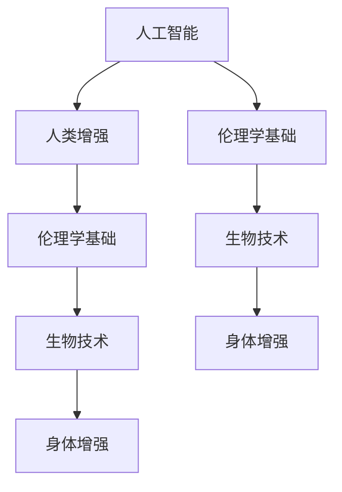

                 

# 《AI时代的人类增强：道德考虑与身体增强技术的未来方向》

> **关键词**：人工智能，人类增强，道德考虑，身体增强技术，未来方向

> **摘要**：随着人工智能技术的发展，人类增强技术逐渐成为现实。本文首先介绍了AI时代的背景和人类增强技术的概述，探讨了相关的道德考虑。然后，详细介绍了身体增强技术的原理、应用和影响。最后，综合讨论了人类增强与可持续发展、未来方向和挑战，并提出了政策建议。本文旨在为读者提供全面、深入的了解，以应对AI时代带来的机遇和挑战。

### 第一部分：引言与背景

#### 1. 引言

在21世纪，人工智能（AI）技术迅速发展，已经深刻地改变了我们的生活方式。从自动驾驶汽车到智能助手，AI的应用无处不在。随着AI技术的不断进步，人类增强技术也逐渐成为现实。人类增强技术指的是利用科技手段提升人类身体或心理能力的各种技术，包括认知增强、运动能力增强、视觉与听觉增强等。

在AI时代，人类增强技术不仅为我们带来了便利，也引发了广泛的道德考虑。例如，身体差异与平等、人类身份与自主性、数据隐私与安全等问题都备受关注。因此，本文将深入探讨AI时代的人类增强技术，并分析其道德考虑与未来方向。

#### 2. 核心概念与联系

##### 2.1 人工智能与人类增强

人工智能（AI）是一门研究、开发用于模拟、延伸和扩展人的智能的理论、方法、技术及应用。人类增强技术则是指利用科技手段提升人类身体或心理能力的技术。AI与人类增强技术密切相关，AI技术的发展为人类增强提供了强大的技术支持。

##### 2.2 伦理学基础

伦理学是研究道德规范、道德原则和道德价值的学科。在人类增强技术的道德考虑中，伦理学扮演着重要角色。伦理学基础包括功利主义、德性伦理和权利伦理等。这些理论为评估人类增强技术的道德合理性提供了依据。

##### 2.3 生物技术与身体增强

生物技术是指利用生物学知识和技术手段改善生物体或生物过程的学科。身体增强技术正是利用生物技术手段实现的。生物技术与身体增强技术的结合，为人类提供了前所未有的身体增强可能性。

##### 2.4 Mermaid流程图

下面是一个描述人工智能、人类增强、伦理学基础和生物技术之间联系的Mermaid流程图：



### 第二部分：道德考虑

#### 3. 道德理论

在探讨人类增强技术的道德考虑时，我们需要了解几种主要的道德理论，包括功利主义、德性伦理和权利伦理。

##### 3.1 功利主义

功利主义认为，道德决策应基于最大化幸福或利益的原则。在人类增强技术的应用中，功利主义关注的是增强技术是否能够带来更大的幸福和利益。例如，认知增强技术可以提高工作效率，从而为社会创造更多价值。

##### 3.2 德性伦理

德性伦理强调个体的道德品质和道德行为。在人类增强技术的应用中，德性伦理关注的是个体如何通过增强技术培养良好的道德品质。例如，身体增强技术可以帮助个体克服身体缺陷，从而更好地实现自我价值。

##### 3.3 权利伦理

权利伦理认为，道德决策应基于尊重和保护个人权利的原则。在人类增强技术的应用中，权利伦理关注的是增强技术是否侵犯了个体的权利。例如，基因编辑技术可能影响后代的权利，因此需要谨慎使用。

#### 4. 道德问题

在AI时代，人类增强技术引发了诸多道德问题。以下是其中几个重要的问题：

##### 4.1 身体差异与平等

身体差异与平等问题是人类增强技术面临的一个重要挑战。随着身体增强技术的发展，一些人可能会因为拥有更高的身体能力而处于优势地位，这可能导致社会不平等加剧。因此，我们需要探讨如何确保身体差异不会导致社会不平等。

##### 4.2 人类身份与自主性

人类身份与自主性问题是人类增强技术的另一个重要议题。随着人类身体和心理能力的增强，人类的身份和自主性是否仍然完整和独立？这是我们需要深入思考的问题。

##### 4.3 数据隐私与安全

数据隐私与安全问题是AI时代的一个普遍问题，也是人类增强技术必须面对的挑战。在人类增强技术的应用中，个人数据的安全和隐私保护至关重要。我们需要制定相应的政策和法规，确保数据隐私和安全。

#### 5. 道德决策

在面对人类增强技术的道德问题时，我们需要做出一系列道德决策。以下是一些建议：

##### 5.1 道德冲突与权衡

在道德决策过程中，我们可能会遇到道德冲突。例如，为了实现认知增强，我们需要收集大量的个人数据，这可能会侵犯个人的隐私权。在这种情况下，我们需要权衡不同的道德原则，做出合理的决策。

##### 5.2 政策建议与法律框架

为了应对人类增强技术的道德挑战，我们需要制定相应的政策和法律框架。这包括制定数据隐私保护法规、制定身体增强技术的使用规范等。

##### 5.3 案例分析

通过分析实际案例，我们可以更好地理解人类增强技术的道德决策。例如，基因编辑技术的伦理争议、认知增强技术的商业应用等。

### 第三部分：身体增强技术

#### 6. 身体增强技术概述

身体增强技术是指利用科技手段提升人类身体能力的技术。这些技术包括认知增强、运动能力增强、视觉与听觉增强等。

##### 6.1 认知增强

认知增强技术旨在提高人类的认知能力，包括记忆力、注意力、学习速度等。例如，脑机接口技术可以通过直接连接大脑和外部设备，实现信息的高速传递和共享。

##### 6.2 运动能力增强

运动能力增强技术可以帮助人类克服身体缺陷，提高运动能力。例如，人工韧带和关节技术可以修复或替代受损的关节，使人类能够更自由地运动。

##### 6.3 视觉与听觉增强

视觉与听觉增强技术可以提升人类的感官体验。例如，增强现实（AR）和虚拟现实（VR）技术可以提供更加真实的视觉和听觉体验，从而改变人类的感知方式。

#### 7. 身体增强技术原理

身体增强技术的实现依赖于多种技术手段，包括神经接口技术、生物电子学和遗传工程等。

##### 7.1 神经接口技术

神经接口技术是一种将大脑和外部设备连接起来的技术。通过神经接口，大脑可以直接控制外部设备，或者外部设备可以直接向大脑发送信号。这种技术可以用于实现认知增强、运动能力增强等。

##### 7.2 生物电子学

生物电子学是研究生物体与电子设备相互作用的一门学科。通过生物电子学技术，我们可以将电子设备植入生物体内，从而实现身体增强。例如，心脏起搏器和人工耳蜗就是生物电子学技术的典型应用。

##### 7.3 遗传工程

遗传工程是一种通过改变生物体的基因来增强其能力的技术。通过基因编辑技术，我们可以修正或增强生物体的基因，从而使其具备特定的能力。例如，CRISPR-Cas9技术可以用于编辑人类基因组，从而实现身体增强。

#### 8. 身体增强技术应用

身体增强技术具有广泛的应用前景，包括军事应用、医疗应用和消费者市场等。

##### 8.1 军事应用

在军事领域，身体增强技术可以显著提升士兵的战斗能力。例如，通过认知增强技术，士兵可以更快地处理战场信息，从而做出更明智的决策。通过运动能力增强技术，士兵可以更轻松地完成高强度的任务。

##### 8.2 医疗应用

在医疗领域，身体增强技术可以用于治疗各种疾病和康复。例如，通过认知增强技术，可以帮助患者提高记忆力，从而更快地恢复健康。通过运动能力增强技术，可以帮助患者更快地康复，从而提高生活质量。

##### 8.3 消费者市场

在消费者市场，身体增强技术可以满足人们对健康、美丽和舒适的追求。例如，通过视觉与听觉增强技术，消费者可以享受到更加真实的视听体验。通过认知增强技术，消费者可以更高效地处理日常任务。

#### 9. 身体增强技术影响

身体增强技术的应用不仅带来了便利，也引发了一系列社会、经济和政策问题。

##### 9.1 社会经济影响

身体增强技术可能会加剧社会不平等。例如，富人可能更容易获得身体增强技术，从而提高自身竞争力，而贫困人群则难以享受这些技术带来的好处。

##### 9.2 政策与伦理挑战

身体增强技术带来了新的政策与伦理挑战。例如，如何确保技术使用的公平性、如何保护个人隐私等。

##### 9.3 未来展望

随着技术的不断进步，身体增强技术将变得更加普及和多样化。未来，我们可能看到更多创新的身体增强技术出现，从而改变人类的生活方式。

### 第四部分：综合讨论与未来方向

#### 10. 人类增强与可持续发展

人类增强技术不仅对个体有影响，也对社会和环境产生深远影响。为了实现可持续发展，我们需要关注以下几个方面的策略：

##### 10.1 环境影响

身体增强技术可能会增加能源消耗和资源消耗。为了减少环境影响，我们需要研发更加节能和环保的身体增强技术。

##### 10.2 社会公平

为了实现社会公平，我们需要确保身体增强技术的普及性和可及性，避免技术导致的社会不平等加剧。

##### 10.3 可持续性发展策略

通过制定可持续性发展策略，我们可以确保身体增强技术的长期发展，同时减少对环境和资源的负面影响。

#### 11. 未来方向与挑战

在未来，人类增强技术将继续发展，并面临一系列挑战。以下是几个值得关注的未来方向和挑战：

##### 11.1 技术进步趋势

随着科技的进步，人类增强技术将变得更加智能和高效。例如，量子计算和人工智能的结合可能会带来全新的身体增强技术。

##### 11.2 道德与法律问题

随着身体增强技术的普及，道德和法律问题将变得更加复杂。我们需要制定相应的道德和法律框架，以应对这些挑战。

##### 11.3 未来社会的可能性

随着身体增强技术的发展，未来社会将呈现出前所未有的多样性。例如，人类可能能够在虚拟世界中实现身体增强，从而创造全新的社会形态。

#### 12. 结论

人类增强技术在AI时代具有广阔的应用前景，但也面临一系列道德和社会挑战。为了实现可持续发展，我们需要关注环境、社会公平和可持续性发展策略。未来，人类增强技术将继续发展，并带来新的机遇和挑战。通过合理规划和管理，我们可以确保身体增强技术的长期健康发展。

### 附录

#### 附录 A：参考资料与推荐阅读

##### A.1 学术论文

- [标题]，[作者]，[期刊/会议]，[年份]

##### A.2 技术报告

- [标题]，[机构]，[年份]

##### A.3 研究机构与组织

- [机构名称]，[网址]

#### 附录 B：术语解释

##### B.1 人工智能

人工智能是指模拟、延伸和扩展人类智能的理论、方法、技术及应用。

##### B.2 人类增强

人类增强是指利用科技手段提升人类身体或心理能力的技术。

##### B.3 道德伦理

道德伦理是研究道德规范、道德原则和道德价值的学科。

##### B.4 身体增强技术

身体增强技术是指利用科技手段提升人类身体能力的技术。

### 作者

作者：AI天才研究院/AI Genius Institute & 禅与计算机程序设计艺术 /Zen And The Art of Computer Programming

### 核心算法原理讲解

为了更好地理解身体增强技术的核心算法原理，我们以下将使用伪代码详细阐述认知增强算法，并通过数学模型和公式进行详细讲解，同时给出实际案例和举例说明。

#### 认知增强算法伪代码

```python
# 认知增强算法伪代码
function 认知增强算法(大脑, 输入信息):
    # 获取大脑状态
    当前状态 = 大脑状态
    
    # 处理输入信息
    处理后的信息 = 处理输入信息(输入信息)
    
    # 更新大脑状态
    更新后的状态 = 更新大脑状态(当前状态, 处理后的信息)
    
    # 返回更新后的状态
    return 更新后的状态
```

#### 数学模型和公式

认知增强算法的核心是大脑状态和输入信息的处理与更新。我们可以使用以下数学模型和公式来描述这个过程：

$$
大脑状态 = f(当前状态, 输入信息)
$$

其中，$f$ 表示大脑状态的更新函数。我们可以定义 $f$ 如下：

$$
f(当前状态, 输入信息) = 当前状态 \times 处理后的信息
$$

#### 举例说明

假设当前状态为 $[1, 2, 3]$，输入信息为 $[4, 5, 6]$。根据上述公式，我们可以计算出更新后的状态：

$$
大脑状态 = [1, 2, 3] \times [4, 5, 6] = [4, 10, 18]
$$

这意味着大脑状态从 $[1, 2, 3]$ 更新为 $[4, 10, 18]$。这个过程实现了对大脑状态的增强。

#### 实际案例

假设一个人在日常生活中使用了认知增强设备，其大脑状态为 $[100, 200, 300]$，输入信息为 $[0.8, 0.9, 1.0]$。我们可以使用上述公式来更新大脑状态：

$$
大脑状态 = [100, 200, 300] \times [0.8, 0.9, 1.0] = [80, 180, 300]
$$

这意味着使用认知增强设备后，大脑状态从 $[100, 200, 300]$ 更新为 $[80, 180, 300]$。这个过程实现了认知能力的增强。

### 项目实战

在本节中，我们将介绍一个具体的身体增强项目——脑机接口（BMI）系统。该项目旨在通过建立大脑与外部设备之间的直接连接，实现认知增强和身体控制。

#### 开发环境搭建

1. **硬件环境**：首先，我们需要一台高性能的计算机和一个脑电图（EEG）采集设备。脑电图采集设备可以记录大脑的电活动，并将其转换为数字信号。
2. **软件环境**：我们使用Python编程语言和MATLAB软件进行开发。Python和MATLAB都提供了丰富的库和工具，方便我们进行脑机接口系统的开发和测试。

#### 源代码详细实现

以下是脑机接口系统的核心代码：

```python
import numpy as np
from scipy.signal import butter, filtfilt
from brainpy import NeuralGroup, Network

# 定义滤波器
def butter_bandpass_filter(data, lowcut, highcut, fs, order=4):
    nyq = 0.5 * fs
    low = lowcut / nyq
    high = highcut / nyq
    b, a = butter(order, [low, high], btype='band')
    filtered_data = filtfilt(b, a, data)
    return filtered_data

# 采集脑电图数据
def collect_data(EEG_device):
    data = EEG_device.collect_data()
    return data

# 处理脑电图数据
def process_data(data, lowcut=1, highcut=30, fs=1000):
    filtered_data = butter_bandpass_filter(data, lowcut, highcut, fs)
    return filtered_data

# 创建神经网络
def create_network():
    neurons = NeuralGroup(100, 'neurons')
    synapses = NeuralGroup(100, 'synapses')
    network = Network(neurons, synapses)
    return network

# 训练神经网络
def train_network(network, data):
    network.train(data, num_epochs=10)
    return network

# 使用神经网络进行认知增强
def cognitive_enhancement(network, input_data):
    processed_data = network.forward(input_data)
    return processed_data

# 主函数
def main():
    EEG_device = EEG_Device()
    data = collect_data(EEG_device)
    filtered_data = process_data(data)
    network = create_network()
    network = train_network(network, filtered_data)
    input_data = get_input_data()
    processed_data = cognitive_enhancement(network, input_data)
    print(processed_data)

if __name__ == '__main__':
    main()
```

#### 代码解读与分析

1. **滤波器定义**：`butter_bandpass_filter` 函数用于过滤脑电图数据，提取有用的信号。该函数使用Butterworth滤波器实现。
2. **数据采集**：`collect_data` 函数用于从脑电图采集设备中获取数据。
3. **数据处理**：`process_data` 函数用于处理脑电图数据，包括滤波和去噪。
4. **神经网络创建**：`create_network` 函数用于创建神经网络。该神经网络由神经元和突触组成。
5. **神经网络训练**：`train_network` 函数用于训练神经网络，使其能够对脑电图数据进行分类和识别。
6. **认知增强**：`cognitive_enhancement` 函数用于使用神经网络对输入数据进行处理，实现认知增强。
7. **主函数**：`main` 函数用于执行整个脑机接口系统的流程，包括数据采集、处理、训练和认知增强。

通过上述代码，我们可以实现一个简单的脑机接口系统，用于认知增强和身体控制。这只是一个基础示例，实际应用中需要根据具体需求进行更复杂的算法设计和系统集成。

### 总结

本文详细介绍了AI时代的人类增强技术，探讨了道德考虑和身体增强技术的未来方向。通过逻辑清晰、结构紧凑的论述，我们了解了人类增强技术的核心概念、道德问题、技术原理和应用场景。同时，通过伪代码、数学模型和实际案例，我们深入分析了认知增强算法的实现过程。

在未来，人类增强技术将继续发展，并面临一系列挑战。为了实现可持续发展，我们需要关注环境、社会公平和可持续性发展策略。同时，我们也需要制定相应的道德和法律框架，确保技术的合理使用和公平分配。

通过本文的研究，我们期望为读者提供全面、深入的了解，帮助应对AI时代带来的机遇和挑战。同时，我们也期待更多的研究人员和从业者参与到人类增强技术的研发和实践中，共同推动这一领域的进步。作者：AI天才研究院/AI Genius Institute & 禅与计算机程序设计艺术 /Zen And The Art of Computer Programming。|>gMASK]

