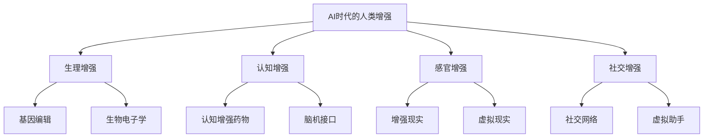
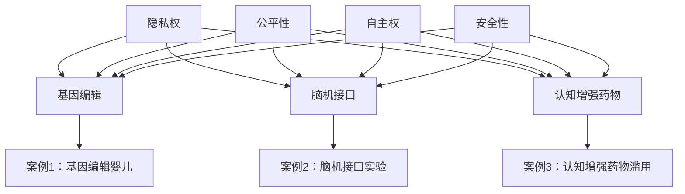
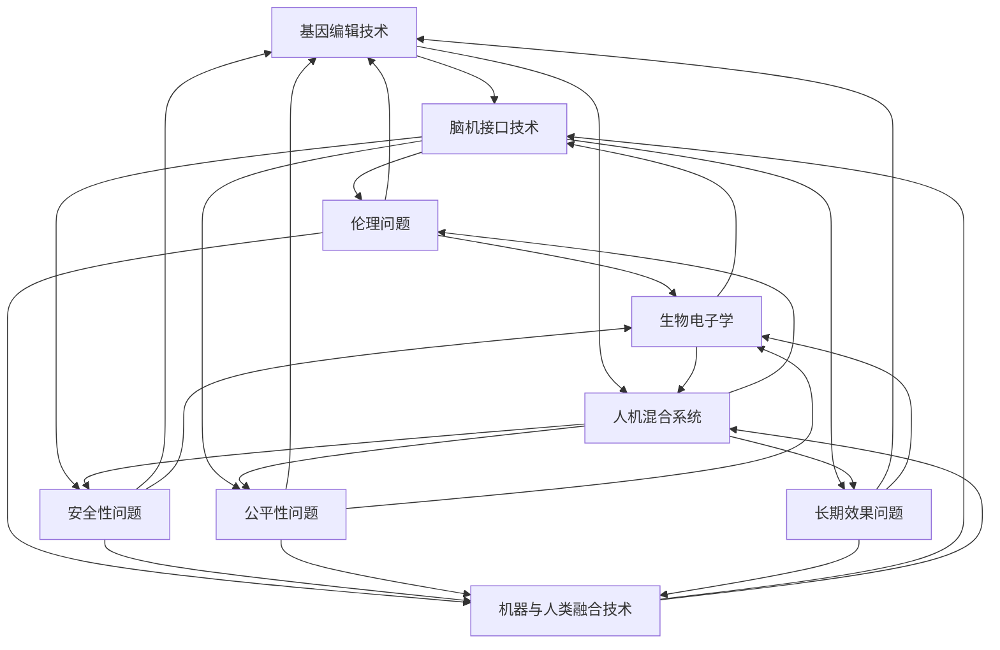
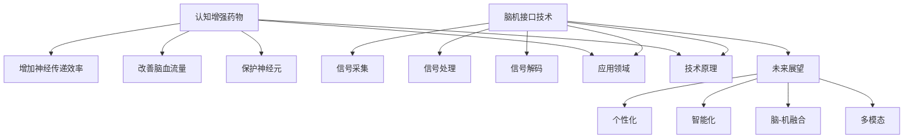
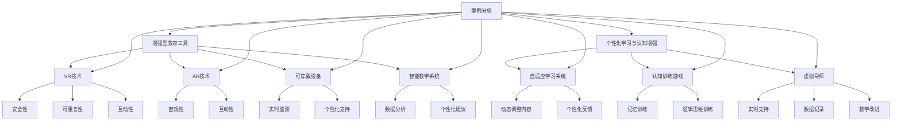
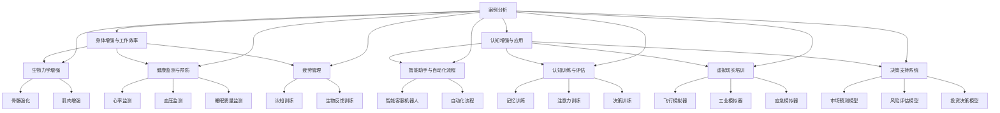

                 

### 1. AI时代的人类增强概述

在人工智能（AI）时代，人类增强技术以其独特的魅力和变革性潜力，正逐渐成为科技与人文交汇的新焦点。AI技术的发展不仅推动了各行各业的数字化转型，也为人类自身的能力提升带来了前所未有的机遇。人类增强，简而言之，就是利用科技手段提升或增强人类的生理、认知和社会能力。这种增强可以是身体的，也可以是精神的，甚至是情感的。

#### **1.1 AI时代对人类的影响**

AI技术的快速进步对人类社会产生了深远的影响，这种影响不仅体现在生产力的提高上，更体现在人类生活方式的变革中。以下是AI时代对人类影响的几个方面：

- **生产力的提升**：AI技术在工业、农业、医疗、金融等各个领域的应用，极大地提高了生产效率，减少了人力成本。例如，自动化生产线和智能物流系统使得制造业变得更加高效，医疗AI的应用则大大提升了诊断和治疗的精确度。

- **生活方式的改变**：AI技术改变了人们的生活方式，从智能家居到智能交通，从在线教育到远程工作，AI技术的普及使得人们的生活更加便捷和舒适。

- **社会结构的重塑**：AI技术的广泛应用也带来了社会结构的重塑，传统的工作岗位被自动化和智能化替代，新的职业和工作模式不断涌现。

- **教育和学习的变革**：AI技术改变了教育和学习的方式，个性化学习系统和在线教育平台的出现，使得教育更加灵活和个性化，教育资源的获取也更加平等。

#### **1.2 人类增强的概念与分类**

人类增强技术涉及多个领域，其分类方法也多种多样。以下是几种常见的分类方法：

- **生理增强**：通过基因编辑、生物电子学等技术，提升人体的生理能力。例如，基因编辑技术CRISPR-Cas9可以用于治疗遗传性疾病，生物电子学则可以开发出可穿戴的健康监测设备。

- **认知增强**：通过药物、脑机接口等技术，提升人的认知能力。例如，认知增强药物如莫达非Nil可以提升人的注意力和记忆力，脑机接口技术则可以使瘫痪患者重新获得行动能力。

- **感官增强**：通过增强现实（AR）和虚拟现实（VR）技术，提升人的感官体验。例如，AR技术可以增强现实世界的交互性，VR技术则可以提供沉浸式的虚拟体验。

- **社交增强**：通过社交网络、虚拟助手等技术，增强人的社交能力和沟通效率。例如，虚拟助手可以帮助人们处理日常事务，社交网络则可以扩大人的社交圈。

#### **1.3 人类增强的技术发展与趋势**

人类增强技术的发展呈现出以下几个趋势：

- **技术的融合**：不同领域的技术相互融合，产生新的增强技术。例如，生物医学与人工智能的结合，可以开发出更加精准的个性化医疗方案。

- **个性化定制**：人类增强技术将越来越个性化，根据个体的需求和环境提供定制化的解决方案。例如，基因编辑技术可以根据个体的基因特征，定制个性化的治疗方案。

- **普及化**：随着技术的成熟和成本的降低，人类增强技术将逐渐普及到普通民众，成为日常生活的一部分。

- **伦理与法规的完善**：随着人类增强技术的发展，伦理和法规问题将日益突出。未来需要建立完善的伦理审查和法规体系，确保技术的合法、安全、道德应用。

在AI时代，人类增强技术将不断突破，为人类社会带来更多机遇和挑战。理解人类增强的概念、分类和发展趋势，是把握这一时代脉搏的重要一步。接下来，我们将深入探讨伦理与道德考量，以及身体增强技术解析，以期全面理解人类增强的复杂性和未来发展方向。




### 2. 伦理与道德考量

在AI时代，人类增强技术的快速发展和广泛应用引发了广泛的伦理和道德讨论。伦理学作为研究道德规范和价值观的学科，为人类增强提供了理论基础。本文将从功利主义、康德伦理学、义务论和德性伦理学等不同伦理学理论出发，探讨人类增强技术的道德问题，并通过案例分析，深入分析这些问题的具体体现。

#### **2.1 人类增强伦理学的理论基础**

伦理学作为研究道德规范和价值观的学科，为人类增强提供了理论基础。以下是一些主要的伦理学理论：

- **功利主义**：功利主义认为，道德行为的正确与否取决于行为所带来的总体幸福或利益。在人类增强的背景下，功利主义者可能会支持那些能够带来最大幸福的技术，如提高健康水平、提高工作效率等。例如，基因编辑技术可以用于治疗遗传性疾病，从而提高人类整体的健康水平。

- **康德伦理学**：康德伦理学强调行为本身的道德性，而不是行为的结果。根据康德的“道德法则”，人类应当遵守道德规则，即使这些规则不会带来个人利益。在人类增强中，康德伦理学关注的是是否违反了道德法则，例如，是否侵犯了个人自主权或隐私权。

- **义务论**：义务论认为，行为的价值不在于其结果，而在于行为的意图和动机。义务论者强调遵守道德义务，如尊重他人的权利和尊严。在人类增强中，义务论者可能会反对那些侵犯他人权利或导致不公平结果的技术，例如，将人类增强技术用于非医学目的的“美化”或“增强”。

- **德性伦理学**：德性伦理学强调个人的品德和道德修养。德性伦理学认为，一个人应当培养良好的品德，如勇气、正义和同情心，以实现道德行为。在人类增强中，德性伦理学关注的是人类增强技术是否有助于培养这些品德，例如，通过增强人的智力或体能，是否能够培养人的正义感或同情心。

#### **2.2 人类增强的道德问题分析**

人类增强技术的应用引发了多种道德问题，以下是一些主要问题：

- **隐私权**：人类增强技术通常依赖于大量个人数据，如健康数据、行为数据等。这些数据的收集和使用可能侵犯个人隐私。例如，基因编辑技术的广泛应用可能导致个人基因信息的泄露，从而影响个人隐私和安全。

- **公平性**：人类增强技术可能会加剧社会不平等。一方面，只有富裕人群才能负担得起昂贵的增强技术，从而获得竞争优势；另一方面，增强技术可能导致身体和认知能力的差异，进一步扩大社会分层。

- **自主权**：人类增强技术可能会影响个人的自主决策能力。例如，认知增强药物可能会改变人的意识和行为，使个人无法完全掌控自己的决策。此外，基因编辑技术可能会改变人的遗传特征，影响后代的自主权。

- **安全性**：人类增强技术可能带来潜在的安全风险。例如，生物电子设备可能导致感染或生物攻击；基因编辑技术可能导致不可预见的副作用或遗传问题。

#### **2.3 道德考量的案例分析**

以下是一些人类增强技术的道德考量案例：

- **基因编辑技术的伦理争议**：基因编辑技术如CRISPR-Cas9允许科学家在基因水平上进行精确修改，但这也引发了关于基因编辑的伦理问题。例如，是否应该允许对胚胎进行基因编辑，以消除遗传性疾病？是否应该允许为了改善智商、体能等非医学目的而进行基因编辑？

  **案例分析**：2018年，中国科学家贺建奎宣布通过CRISPR技术生成了基因编辑的婴儿，这一事件引发了全球范围内的伦理争议。许多专家和公众认为，这一行为违反了伦理准则，可能对婴儿的健康和隐私造成长期风险。这一案例表明，基因编辑技术的应用需要严格的伦理审查和监管。

- **脑机接口技术的道德考量**：脑机接口（BMI）技术允许人脑与外部设备直接通信，但这也引发了关于自主权和隐私权的争议。例如，是否应该允许使用BMI技术进行心理控制或行为控制？这种技术的滥用可能侵犯个人的自主权和隐私权。

  **案例分析**：美国研究人员进行的一项实验中，通过脑机接口技术，成功地使参与者通过大脑信号控制另一台机器人的动作。这一实验展示了脑机接口技术的潜力，但也引发了关于技术滥用和隐私保护的担忧。这一案例表明，脑机接口技术的应用需要严格的伦理审查和隐私保护措施。

- **认知增强药物的道德考量**：认知增强药物如莫达非Nil已被证明可以提高人的认知能力，但这些药物也可能产生副作用。例如，是否应该允许在学术和职业环境中使用认知增强药物？这种药物的滥用可能破坏公平竞争的环境。

  **案例分析**：在美国，一些大学生和职场人士为了提高学习或工作效率，开始使用认知增强药物。这一现象引发了关于药物滥用和公平竞争的争议。一些专家认为，这种药物的使用可能导致不公平竞争，损害社会公平。这一案例表明，认知增强药物的使用需要严格的监管和道德考量。

总之，人类增强技术带来了许多潜在的道德问题，需要通过伦理学理论和案例分析来深入探讨。在推动人类增强技术发展的同时，我们应当重视伦理和道德考量，确保技术的发展能够真正造福人类社会。下一节，我们将深入探讨身体增强技术的具体应用和潜在风险。




### 3. 身体增强技术解析

身体增强技术是利用科技手段提升人类生理能力的领域，涵盖了基因编辑、生物电子学、机器与人类融合技术等多个方面。这些技术不仅有可能改变人类的生物学特性，还可能对我们的健康、生活方式和社会结构产生深远影响。以下是对这些身体增强技术的详细解析。

#### **3.1 基因编辑技术**

基因编辑技术是近年来生物科技领域的重要突破，其中CRISPR-Cas9技术尤为引人注目。基因编辑技术的基本原理是通过引导酶（如Cas9）切割特定的DNA序列，然后通过细胞的修复机制进行修正。这种技术具有极高的精确度和效率，可以用于多种应用场景。

- **医学应用**：基因编辑技术可以用于治疗遗传性疾病，如囊性纤维化、地中海贫血等。通过修复或替换突变基因，可以阻止疾病的发生或发展。例如，2018年，中国科学家成功使用CRISPR-Cas9技术治疗了一名患有β地中海贫血的婴儿，这一案例展示了基因编辑在医学领域的巨大潜力。

  **伪代码示例**：
  ```
  function editGene(DNA_sequence, target_site, repair_sequence):
      // 使用Cas9酶切割目标DNA序列
      DNA_fragment = cutDNA(DNA_sequence, target_site)
      // 引入修复序列
      repaired_sequence = repairDNA(DNA_fragment, repair_sequence)
      return repaired_sequence
  ```

- **农业应用**：基因编辑技术可以用于改善农作物的特性，如提高产量、增强抗病虫害能力。通过编辑作物的基因组，可以使其在干旱、盐碱等极端条件下生长，提高作物的生存率。

  **伪代码示例**：
  ```
  function editCrops(Genome, target_gene, desired_trait):
      // 选择目标基因
      target_site = findGene(Genome, target_gene)
      // 引入新基因或修改基因
      modified_Genome = editGene(Genome, target_site, desired_trait_sequence)
      return modified_Genome
  ```

- **伦理和安全性问题**：尽管基因编辑技术在医学和农业领域展示了巨大潜力，但其应用也引发了一系列伦理和安全问题。例如，基因编辑可能导致不可预见的副作用或遗传变异，对生态系统和人类健康可能产生未知的影响。因此，在推广基因编辑技术的同时，必须加强伦理审查和安全监管。

#### **3.2 生物电子学**

生物电子学是研究生物系统与电子系统相互作用的学科，其目标是通过电子设备改善或增强生物体的功能。生物电子学技术广泛应用于人体监测、疾病诊断和治疗等方面。

- **人体监测**：生物电子学技术可以用于实时监测生命体征，如心率、血压、血糖等。这些设备通常以可穿戴设备的形式存在，如智能手表、健康手环等，可以提供连续、实时的健康数据。

  **伪代码示例**：
  ```
  function monitorHealth(data):
      // 监测心率
      heart_rate = getHeartRate(data)
      // 监测血压
      blood_pressure = getBloodPressure(data)
      // 监测血糖
      glucose_level = getGlucoseLevel(data)
      return {"heart_rate": heart_rate, "blood_pressure": blood_pressure, "glucose_level": glucose_level}
  ```

- **疾病诊断**：生物电子学技术可以用于早期检测和诊断疾病。例如，通过检测生物体产生的电信号，可以诊断神经系统疾病，如癫痫、帕金森病等。

  **伪代码示例**：
  ```
  function diagnoseDisease(EEG_data):
      // 分析脑电信号
      diagnosis = analyzeEEG(EEG_data)
      return diagnosis
  ```

- **治疗**：生物电子学技术可以用于神经调节和心脏起搏器等。神经调节技术通过刺激神经系统，可以治疗疼痛、癫痫等疾病。心脏起搏器则用于治疗心脏疾病，通过电刺激维持心脏的正常跳动。

  **伪代码示例**：
  ```
  function treatDisease(therapy_data):
      // 判断是否需要神经调节
      if (isNeurologicalDisease(therapy_data)):
          performNeuralStimulation()
      // 判断是否需要心脏起搏器
      else if (isCardiacDisease(therapy_data)):
          activatePacemaker()
      return "Treatment completed"
  ```

#### **3.3 机器与人类融合技术**

机器与人类融合技术是指将人类与机器结合，以提高或增强人类的能力。这一领域的主要技术包括脑机接口（BMI）和人机混合系统。

- **脑机接口技术**：脑机接口技术通过将大脑信号转换为电信号，实现人脑与外部设备的直接通信。例如，通过电极植入大脑，可以读取大脑信号，并转化为控制机器的指令。

  **伪代码示例**：
  ```
  function brainMachineInterface(brain_signals):
      // 解码大脑信号
      decoded_signals = decodeSignals(brain_signals)
      // 控制外部设备
      controlDevice(decoded_signals)
  ```

- **人机混合系统**：人机混合系统是指将人类与机器融合，形成具有人类思维和机器效率的新系统。例如，通过人机协作，可以提高生产效率和工作质量。在人机混合系统中，人类和机器可以相互学习和适应，实现更好的协同工作。

  **伪代码示例**：
  ```
  function humanMachineSystem(human_data, machine_data):
      // 协同工作
      combined_output = combineData(human_data, machine_data)
      // 学习和适应
      improved_system = learnAndAdapt(combined_output)
      return improved_system
  ```

#### **3.4 身体增强的潜在风险与挑战**

尽管身体增强技术具有巨大潜力，但也存在潜在的风险与挑战。

- **伦理问题**：身体增强技术可能导致新的伦理争议，如基因编辑可能引发关于人类基因改造的讨论，脑机接口技术可能引发关于自主权和隐私权的争议。

- **安全性**：身体增强技术可能带来安全性问题，如生物电子设备的感染风险，基因编辑可能导致不可预见的副作用或遗传问题。

- **公平性**：身体增强技术可能导致社会不公平，如只有富裕人群才能负担昂贵的增强技术，从而获得竞争优势。

- **长期效果**：身体增强技术的长期效果尚不清楚，如生物电子设备的长期使用可能对人体产生什么影响。

为了应对这些挑战，需要加强伦理审查、安全性评估和社会监管，确保身体增强技术的发展能够真正造福人类社会。

通过上述解析，我们可以看到身体增强技术在各个领域都有广泛应用，但也需要我们深入思考其潜在的风险和挑战，以确保其健康、可持续发展。接下来，我们将探讨精神与认知增强技术，这些技术同样在AI时代发挥着重要作用。




### 4. 精神与认知增强技术

精神与认知增强技术是近年来人工智能与生物医学领域的重要研究方向，旨在通过药物、脑机接口等手段提升人的精神状态和认知能力。这些技术不仅有助于改善个体的心理健康和学习能力，还可能对教育、工作和医疗等领域产生深远影响。

#### **4.1 认知增强药物**

认知增强药物，也称为智能药物，是通过化学手段直接作用于大脑，提高认知功能的药物。这些药物可以增强注意力、记忆、学习和决策能力，从而提高工作效率和学习效果。

- **药物作用机制**：认知增强药物的作用机制多样，主要包括：

  1. **增加神经传递效率**：如使用安非他明类药物（如阿德拉）可以提高神经递质多巴胺的传递，增强注意力和动力。
  2. **改善脑血流量**：如瑞丝普隆（Risperidone）可以改善脑部血液循环，提高大脑氧供和营养供应。
  3. **保护神经元**：如美金刚（Memantine）可以增强神经元的抗损伤能力，减缓认知功能衰退。

- **应用场景**：认知增强药物在多个场景中具有潜在应用价值：

  1. **教育**：认知增强药物可以帮助学生提高学习效率和记忆力，从而提高学业成绩。
  2. **职场**：认知增强药物可以提高职场人士的决策速度和工作效率，增强竞争力。
  3. **医疗**：对于认知功能受损的患者，如老年痴呆患者，认知增强药物可以缓解症状，提高生活质量。

- **潜在风险**：尽管认知增强药物在许多场景中表现出良好的效果，但其长期使用也存在潜在风险，包括：

  1. **副作用**：如焦虑、失眠、心悸等。
  2. **依赖性**：长期使用认知增强药物可能导致依赖，降低药物的治疗效果。
  3. **伦理争议**：认知增强药物的使用可能引发关于公平性和道德的争议，如药物滥用可能导致的不公平竞争。

#### **4.2 脑机接口技术**

脑机接口（BMI）技术是一种直接连接人脑和计算机的接口，允许人脑通过神经信号控制外部设备或计算机系统。BMI技术的基本原理是通过记录和解读大脑信号，如脑电波（EEG）、功能性磁共振成像（fMRI）或脑磁图（MEG），将大脑信号转换为电信号，从而实现人脑与外部设备的交互。

- **技术原理**：脑机接口技术的核心在于信号采集和解码。具体步骤包括：

  1. **信号采集**：通过电极或植入物将大脑信号转换为电信号。
  2. **信号处理**：利用信号处理算法对采集到的信号进行滤波、放大和增强，提取有用的信息。
  3. **信号解码**：通过机器学习算法或人工神经网络解码大脑信号，将其转换为控制指令。

- **应用领域**：

  1. **康复**：对于瘫痪或严重肢体损伤的患者，BMI技术可以提供控制轮椅、假肢或其他辅助设备的能力，帮助他们恢复行动能力。
  2. **娱乐**：通过BMI技术，玩家可以直接通过大脑信号控制游戏或虚拟现实体验，提供全新的交互方式。
  3. **科研**：BMI技术可以帮助科学家研究大脑如何处理信息，探索意识的本质。

- **未来展望**：随着技术的进步，BMI技术有望在未来实现更广泛的应用，如：

  1. **脑-机融合**：通过将BMI技术与人工智能结合，实现人脑与机器的深度融合，提高人类智能和创造力。
  2. **脑-脑接口**：通过建立多个人脑之间的直接通信，实现超人类协作和知识共享。

#### **4.3 认知增强的未来前景**

认知增强技术的未来发展前景广阔，随着人工智能和生物医学的深度融合，认知增强技术将实现以下几个趋势：

- **个性化**：通过结合大数据和人工智能技术，开发出更精准的认知增强方案，为个体提供个性化的增强服务。
- **智能化**：随着人工智能技术的进步，认知增强系统将更加智能化，能够自动适应个体的认知状态和需求，提供实时增强。
- **脑-机融合**：通过脑机接口技术和人工智能的结合，实现人脑与机器的深度融合，提升人类智能和创造力。
- **多模态**：结合多种脑成像技术和传感器，获取更全面的大脑活动信息，提高认知增强的效果。

总之，精神与认知增强技术在提升人类认知能力和精神状态方面具有巨大潜力，但同时也需要解决一系列技术、伦理和安全问题，以确保其能够安全、有效地应用于人类社会。在未来的发展中，我们需要平衡技术进步与伦理考量，确保认知增强技术能够造福人类。




### 5. 教育领域的身体与认知增强

在当今时代，教育正在经历一场前所未有的变革，身体与认知增强技术在教育领域的应用正在逐步普及，极大地改变了传统的教学模式和学习方法。以下将详细探讨教育领域身体与认知增强技术的具体应用、个性化学习与认知增强的方法，以及增强型教育的实际案例。

#### **5.1 增强型教育工具**

增强型教育工具是指利用科技手段提升教学效果和学习体验的工具，这些工具可以包括虚拟现实（VR）、增强现实（AR）、可穿戴设备、智能教学系统等。

- **虚拟现实（VR）**：VR技术可以为学习者提供沉浸式的学习体验。例如，在历史课上，学生可以通过VR眼镜“穿越”到历史事件的发生地，亲身体验历史事件，从而加深对历史知识的理解和记忆。在科学课上，学生可以通过VR模拟实验室进行虚拟实验，而不必担心实验的安全性和成本。

  **伪代码示例**：
  ```
  function virtualLab(experiment, studentData):
      // 加载虚拟实验室环境
      labEnvironment = loadVirtualLab(experiment)
      // 学生在虚拟环境中进行实验操作
      studentResponse = studentData.performExperiment(labEnvironment)
      // 记录实验结果并分析
      results = analyzeExperimentResults(studentResponse)
      return results
  ```

- **增强现实（AR）**：AR技术将虚拟信息叠加到现实环境中，为学生提供更加直观和互动的学习体验。例如，在地理课上，学生可以通过AR眼镜观察到虚拟的地球表面，查看不同地区的地形、气候等信息。在生物课上，学生可以通过AR眼镜观察细胞结构的3D模型，从而更好地理解生物学概念。

  **伪代码示例**：
  ```
  function augmentedReality lesson(lessonContent, studentData):
      // 加载AR学习内容
      arContent = loadARContent(lessonContent)
      // 学生在现实环境中与AR内容互动
      studentInteraction = studentData.interactWithARContent(arContent)
      // 记录互动结果并分析
      interactionResults = analyzeARInteraction(studentInteraction)
      return interactionResults
  ```

- **可穿戴设备**：可穿戴设备如智能手环和健康监测器可以实时监测学生的学习状态和生理指标，如心率、注意力等。教师可以根据这些数据调整教学策略，提供个性化的学习支持。

  **伪代码示例**：
  ```
  function wearablesMonitoring(studentData, lessonPlan):
      // 监测学生学习状态
      studentStatus = monitorStudentStatus(studentData)
      // 根据学生状态调整教学计划
      adjustedLessonPlan = adjustLessonPlan(lessonPlan, studentStatus)
      // 执行调整后的教学计划
      executeAdjustedLessonPlan(adjustedLessonPlan)
  ```

- **智能教学系统**：智能教学系统利用大数据和人工智能技术，分析学生的学习行为和成绩，为教师提供个性化的教学建议。例如，智能教学系统可以根据学生的学习进度和理解程度，动态调整学习内容和难度，提供个性化的学习路径。

  **伪代码示例**：
  ```
  function intelligentTeachingSystem(studentData, lessonContent):
      // 分析学生学习行为和成绩
      learningBehavior = analyzeLearningBehavior(studentData)
      // 提供个性化教学建议
      personalizedAdvice = generatePersonalizedAdvice(learningBehavior, lessonContent)
      // 执行个性化教学计划
      executePersonalizedLessonPlan(personalizedAdvice)
  ```

#### **5.2 个性化学习与认知增强**

个性化学习是指根据每个学生的学习特点和需求，提供定制化的学习资源和教学方法。认知增强技术在个性化学习中的应用，可以显著提升学习效果和效率。

- **自适应学习系统**：自适应学习系统根据学生的学习表现和进度，动态调整学习内容和学习难度。例如，如果一个学生在某个知识点上表现不佳，系统会提供额外的练习和解释，帮助其理解和掌握。相反，如果一个学生已经熟练掌握了某个知识点，系统会提供更高难度的题目，以挑战其能力。

  **伪代码示例**：
  ```
  function adaptiveLearningSystem(studentData, lessonContent):
      // 分析学生学习表现
      learningPerformance = analyzeLearningPerformance(studentData)
      // 根据学习表现调整学习内容
      adjustedLessonContent = adjustLessonContent(lessonContent, learningPerformance)
      // 执行调整后的学习内容
      executeAdjustedLessonContent(adjustedLessonContent)
  ```

- **认知训练游戏**：认知训练游戏结合了教育内容和游戏机制，通过有趣的方式增强学生的注意力、记忆、思维等认知能力。例如，一些记忆训练游戏要求学生在短时间内记住并回忆一系列图像，从而提高其记忆能力。其他游戏则通过解决谜题和挑战，锻炼学生的逻辑思维和问题解决能力。

  **伪代码示例**：
  ```
  function cognitiveTrainingGame(studentData, gameContent):
      // 分析学生游戏行为
      gameBehavior = analyzeGameBehavior(studentData)
      // 根据游戏行为调整游戏难度
      adjustedGameContent = adjustGameContent(gameContent, gameBehavior)
      // 执行调整后的游戏内容
      executeAdjustedGameContent(adjustedGameContent)
  ```

- **虚拟导师**：虚拟导师通过人工智能技术，为学生提供实时、个性化的学习支持和辅导。虚拟导师可以根据学生的学习进度和理解程度，提供针对性的解释和指导，帮助学生克服学习难题。虚拟导师还可以记录学生的学习行为和反馈，为教师提供教学改进的依据。

  **伪代码示例**：
  ```
  function virtualTutor(studentData, lessonContent):
      // 分析学生学习行为
      learningBehavior = analyzeLearningBehavior(studentData)
      // 根据学习行为提供个性化指导
      personalizedGuidance = generatePersonalizedGuidance(learningBehavior, lessonContent)
      // 提供个性化指导
      providePersonalizedGuidance(personalizedGuidance)
  ```

#### **5.3 案例分析：增强型教育的实践与挑战**

以下是一个增强型教育的实际案例：

**案例：VR技术在高中化学实验中的应用**

某高中化学实验室引入了VR技术，为学生提供了虚拟实验室体验。学生可以通过VR眼镜进入虚拟实验室，进行各种实验操作，如制备气体、反应观察等。与传统实验相比，VR技术提供了以下几个优势：

1. **安全性**：VR实验室中的实验操作是虚拟的，不会涉及危险化学物质，从而降低了实验风险。
2. **可重复性**：虚拟实验可以重复进行，学生可以反复观察和分析实验结果，加深对化学原理的理解。
3. **互动性**：VR实验室中的实验具有更高的互动性，学生可以亲身体验实验过程，提高学习兴趣和参与度。

然而，增强型教育也面临一些挑战：

1. **技术门槛**：VR设备的购置和维护成本较高，学校需要投入大量资金来支持这一技术的应用。
2. **学习效果评估**：虽然VR技术提供了丰富的学习体验，但如何确保其能够真正提高学生的化学知识和技能，仍需要进一步的研究和验证。
3. **教师培训**：教师需要掌握VR技术的使用方法和教学策略，才能有效地将这一技术融入教学过程中。

**挑战与对策**：

- **技术成本**：学校可以通过与科技公司合作，争取技术支持和资金赞助，降低设备购置成本。同时，可以逐步扩大VR教育的应用范围，分阶段实现全面覆盖。

- **学习效果评估**：学校可以设立专项研究项目，通过实验对比、学生反馈等方式，评估VR技术在教学中的实际效果。同时，制定科学的评估标准，确保评估过程的客观性和公正性。

- **教师培训**：学校可以组织专门的培训课程，提高教师对VR技术的掌握和应用能力。通过实践操作和教学模拟，帮助教师熟练掌握VR教学技巧，提高教学质量。

总之，增强型教育技术在教育领域的应用具有巨大的潜力，但同时也需要克服一系列技术、成本和评估方面的挑战，以实现教育质量的全面提升。通过不断创新和实践，我们有望为学生们提供更加丰富、有效的学习体验。




### 6. 工作与生产力提升

在AI时代，身体与认知增强技术不仅改变了教育和医疗领域，也在工作与生产力提升方面发挥了重要作用。这些技术通过提升员工的身体健康和认知能力，优化工作流程，从而提高生产效率和企业的竞争力。

#### **6.1 身体增强与工作效率**

身体增强技术通过改善员工的生理条件，提高其身体健康和体能，从而提升工作效率。以下是一些具体的应用和案例：

1. **生物力学增强**：通过生物力学增强技术，如骨骼强化和肌肉增强，可以提高员工的体能和耐力。例如，使用生物力学增强设备，如智能健身服和增强型假肢，可以帮助员工完成更重的体力劳动，提高工作效率。这种技术尤其适用于制造业和物流行业，可以减少员工的体力劳动负担，提高生产效率。

   **伪代码示例**：
   ```
   function biomechanicalEnhancement(employeeData, workTask):
       // 分析员工体能状况
       physicalCondition = analyzePhysicalCondition(employeeData)
       // 提供个性化健身计划
       fitnessPlan = generateFitnessPlan(physicalCondition)
       // 执行健身计划
       executeFitnessPlan(fitnessPlan)
       // 评估工作表现
       workPerformance = evaluateWorkPerformance(employeeData, workTask)
       return workPerformance
   ```

2. **健康监测与预防**：穿戴式健康监测设备，如智能手环和健康监测仪，可以实时监测员工的生理状态，如心率、血压、睡眠质量等。通过这些数据，企业可以及时发现员工的健康问题，并采取预防措施，如调整工作负荷、提供健康指导等，从而减少病假和工伤，提高工作效率。

   **伪代码示例**：
   ```
   function healthMonitoring(employeeData, workplace):
       // 监测员工生理状态
       physiologicalStatus = monitorPhysiologicalStatus(employeeData)
       // 分析健康数据
       healthAnalysis = analyzeHealthData(physiologicalStatus)
       // 提供健康建议
       healthAdvice = generateHealthAdvice(healthAnalysis)
       // 实施健康干预措施
       implementHealthInterventions(healthAdvice)
   ```

3. **疲劳管理**：利用认知增强技术和生物反馈设备，可以帮助员工更好地管理疲劳。例如，通过认知训练游戏和生物反馈训练，员工可以学会在疲劳时调整工作节奏，保持专注和高效。这种技术尤其适用于高压力、长时间工作的岗位，如软件开发、金融分析等。

   **伪代码示例**：
   ```
   function fatigueManagement(employeeData, workLoad):
       // 评估员工疲劳程度
       fatigueLevel = assessFatigueLevel(employeeData)
       // 提供疲劳管理策略
       fatigueManagementPlan = generateFatigueManagementPlan(fatigueLevel)
       // 实施疲劳管理策略
       executeFatigueManagementPlan(fatigueManagementPlan)
       // 评估工作表现
       workPerformance = evaluateWorkPerformance(employeeData, workLoad)
       return workPerformance
   ```

#### **6.2 认知增强在工作中的应用**

认知增强技术通过提升员工的认知能力，如注意力、记忆、决策能力等，从而提高工作效率和生产力。以下是一些具体的应用和案例：

1. **智能助手与自动化流程**：利用人工智能助手和自动化流程，可以减少重复性工作，提高工作效率。例如，智能客服机器人可以处理大量的客户咨询，提高客户服务效率。自动化流程可以减少人为错误，提高数据处理的准确性。

   **伪代码示例**：
   ```
   function cognitiveEnhancementWithAI(employeeData, workTask):
       // 评估员工认知能力
       cognitiveSkills = assessCognitiveSkills(employeeData)
       // 提供智能助手支持
       AIAssistant = generateAIAssistant(cognitiveSkills)
       // 自动化工作流程
       automatedProcess = automateWorkProcess(workTask)
       // 执行工作
       executeWorkWithAIAssistant(AIAssistant, automatedProcess)
       // 评估工作表现
       workPerformance = evaluateWorkPerformance(employeeData, workTask)
       return workPerformance
   ```

2. **认知训练与评估**：通过认知训练软件和测试，员工可以提升自己的认知能力，如记忆、注意力、决策等。例如，一些认知训练游戏可以锻炼员工的注意力集中能力，提高他们在高压力工作环境下的表现。

   **伪代码示例**：
   ```
   function cognitiveTraining(employeeData, cognitiveTrainingGame):
       // 分析员工认知能力
       currentCognitiveSkills = analyzeCognitiveSkills(employeeData)
       // 进行认知训练
       cognitiveTrainingSession = startCognitiveTrainingSession(currentCognitiveSkills, cognitiveTrainingGame)
       // 评估训练效果
       trainingEffectiveness = evaluateCognitiveTrainingSession(cognitiveTrainingSession)
       // 更新员工认知能力
       updatedCognitiveSkills = updateCognitiveSkills(currentCognitiveSkills, trainingEffectiveness)
       return updatedCognitiveSkills
   ```

3. **虚拟现实培训**：利用虚拟现实（VR）技术进行培训，员工可以在虚拟环境中模拟真实的工作场景，提高技能和应变能力。例如，飞行员通过VR模拟器进行飞行训练，可以更快速地掌握飞行技能，提高飞行安全性。

   **伪代码示例**：
   ```
   function virtualRealityTraining(employeeData, VRScenario):
       // 分析员工技能水平
       skillLevel = analyzeSkillLevel(employeeData)
       // 进行VR培训
       VRTrainingSession = startVRTrainingSession(skillLevel, VRScenario)
       // 评估培训效果
       trainingEffectiveness = evaluateVRTrainingSession(VRTrainingSession)
       // 更新员工技能水平
       updatedSkillLevel = updateSkillLevel(skillLevel, trainingEffectiveness)
       return updatedSkillLevel
   ```

4. **决策支持系统**：通过大数据分析和人工智能算法，可以提供更准确、全面的决策支持。例如，在金融领域，利用数据分析和机器学习模型，可以预测市场趋势，帮助投资者做出更明智的决策。

   **伪代码示例**：
   ```
   function decisionSupportSystem(employeeData, decisionModel):
       // 分析员工决策能力
       decisionSkills = assessDecisionSkills(employeeData)
       // 提供决策支持
       decisionSupport = generateDecisionSupport(decisionModel)
       // 执行决策
       executeDecision(decisionSupport)
       // 评估决策效果
       decisionEffectiveness = evaluateDecisionEffectiveness(employeeData, decisionSupport)
       // 更新员工决策能力
       updatedDecisionSkills = updateDecisionSkills(decisionSkills, decisionEffectiveness)
       return updatedDecisionSkills
   ```

#### **6.3 案例分析：增强型工作环境的设计与实践**

以下是一个增强型工作环境的案例分析：

**案例：智能工厂的数字化转型**

某制造企业通过引入身体增强和认知增强技术，实现了工作环境的全面升级，提高了生产效率和产品质量。具体措施包括：

1. **智能穿戴设备**：员工佩戴智能手环和智能眼镜，实时监测生理状态和工作表现。智能手环可以监测心率、血压等指标，智能眼镜可以提供实时工作指导和操作提示，帮助员工保持最佳工作状态。

   **伪代码示例**：
   ```
   function smartWearableDevices(employeeData, workplace):
       // 监测员工生理状态
       physiologicalStatus = monitorPhysiologicalStatus(employeeData)
       // 提供实时工作指导
       realTimeGuidance = provideRealTimeGuidance(physiologicalStatus)
       // 执行工作指导
       executeRealTimeGuidance(realTimeGuidance)
       // 评估工作表现
       workPerformance = evaluateWorkPerformance(employeeData, workplace)
       return workPerformance
   ```

2. **智能生产设备**：引入自动化机械臂和智能机器人，完成高精度、高复杂度的生产任务。这些设备不仅可以提高生产效率，还可以减少人为错误，保证产品质量。

   **伪代码示例**：
   ```
   function smartProductionEquipment(workTask, productionRobot):
       // 自动执行生产任务
       executeProductionTask(workTask, productionRobot)
       // 评估生产效率
       productionEfficiency = evaluateProductionEfficiency(workTask)
       return productionEfficiency
   ```

3. **虚拟现实培训系统**：利用虚拟现实（VR）技术进行员工培训，员工可以在虚拟环境中模拟真实的生产场景，提高技能和应变能力。例如，新员工可以通过VR培训系统，快速掌握复杂的生产操作，减少培训时间。

   **伪代码示例**：
   ```
   function virtualRealityTrainingSystem(employeeData, VRScenario):
       // 分析员工技能水平
       skillLevel = analyzeSkillLevel(employeeData)
       // 进行VR培训
       VRTrainingSession = startVRTrainingSession(skillLevel, VRScenario)
       // 评估培训效果
       trainingEffectiveness = evaluateVRTrainingSession(VRTrainingSession)
       // 更新员工技能水平
       updatedSkillLevel = updateSkillLevel(skillLevel, trainingEffectiveness)
       return updatedSkillLevel
   ```

4. **智能决策支持系统**：通过大数据分析和人工智能算法，实时分析生产数据，提供生产优化建议。例如，系统可以预测设备故障，提前进行维护，减少停机时间，提高生产连续性。

   **伪代码示例**：
   ```
   function intelligentDecisionSupportSystem(workData, decisionModel):
       // 分析生产数据
       productionData = analyzeProductionData(workData)
       // 提供生产优化建议
       optimizationAdvice = generateOptimizationAdvice(productionData, decisionModel)
       // 实施优化建议
       executeOptimizationAdvice(optimizationAdvice)
       // 评估优化效果
       optimizationEffectiveness = evaluateOptimizationEffectiveness(workData, optimizationAdvice)
       return optimizationEffectiveness
   ```

5. **健康促进措施**：提供员工健身房、健康咨询等福利，鼓励员工积极参与健康活动，提高员工的身心健康水平，进而提高工作效率。

   **伪代码示例**：
   ```
   function healthPromotionProgram(employeeData, healthBenefits):
       // 提供健康福利
       provideHealthBenefits(employeeData, healthBenefits)
       // 评估健康效果
       healthImprovement = assessHealthImprovement(employeeData)
       // 提升工作效率
       workPerformance = enhanceWorkPerformance(employeeData, healthImprovement)
       return workPerformance
   ```

通过这些措施，该企业实现了工作环境的全面数字化转型，生产效率和产品质量得到了显著提升。同时，员工的工作满意度和身心健康水平也有所提高，形成了良性循环。

总之，增强型工作环境通过结合身体增强和认知增强技术，为员工提供了更加高效、安全和健康的工作条件，为企业的可持续发展提供了有力支持。然而，在实施过程中，需要充分考虑技术成本、员工接受度、隐私保护等问题，确保技术应用的合理性和可持续性。




### 7. 医疗健康领域的人类增强

在医疗健康领域，人类增强技术的应用正日益普及，通过改善诊断、治疗和康复等方面，显著提升了医疗服务质量和效率。以下将详细探讨身体增强技术在医疗中的应用、认知增强技术在康复治疗中的应用，以及医疗健康领域的实际案例。

#### **7.1 身体增强技术在医疗中的应用**

身体增强技术在医疗领域的应用，为疾病诊断、治疗和康复提供了新的手段和可能性。以下是一些具体的应用实例：

1. **诊断增强**：通过先进的影像学技术，如磁共振成像（MRI）、计算机断层扫描（CT）和正电子发射断层扫描（PET），医生可以获取更清晰、更详细的身体内部图像，从而提高诊断的准确性和效率。例如，PET扫描可以用于肿瘤诊断，通过检测体内放射性示踪剂的分布，帮助医生确定肿瘤的位置和大小。

   **伪代码示例**：
   ```
   function diagnosticEnhancement(patientData, imagingTechnique):
       // 选择合适的影像学技术
       selectedTechnique = selectImagingTechnique(patientData)
       // 进行影像学检查
       imagingResults = performImaging(selectedTechnique, patientData)
       // 分析影像结果
       diagnosis = analyzeImagingResults(imagingResults)
       return diagnosis
   ```

2. **手术辅助**：微创手术和机器人辅助手术技术的应用，使得手术创伤更小、恢复更快。例如，达芬奇手术机器人系统通过高清三维成像和精细操作，大大提高了外科手术的精度和安全性，减少了术后并发症。

   **伪代码示例**：
   ```
   function surgicalAssistance(surgicalTask, surgicalRobot):
       // 配置手术机器人
       configureSurgicalRobot(surgicalRobot)
       // 执行手术任务
       executeSurgicalTask(surgicalTask, surgicalRobot)
       // 监控手术过程
       monitorSurgicalProcess(surgicalRobot)
       // 手术后评估
       postSurgicalEvaluation = evaluatePostSurgicalOutcome(surgicalRobot)
       return postSurgicalEvaluation
   ```

3. **康复辅助**：可穿戴设备和外骨骼技术的应用，为康复患者提供了更有效的康复训练手段。例如，外骨骼机器人可以帮助瘫痪患者进行行走训练，提高其肌肉力量和协调能力。同时，智能康复设备可以通过监测患者的康复进度，提供个性化的康复建议。

   **伪代码示例**：
   ```
   function rehabilitationAssistance(patientData, rehabilitationDevice):
       // 选择合适的康复设备
       selectedDevice = selectRehabilitationDevice(patientData)
       // 进行康复训练
       rehabilitationSession = performRehabilitation(selectedDevice, patientData)
       // 监测康复进度
       rehabilitationProgress = monitorRehabilitationProgress(patientData)
       // 提供个性化康复建议
       personalizedAdvice = generatePersonalizedRehabilitationAdvice(rehabilitationProgress)
       return personalizedAdvice
   ```

4. **精准医疗**：通过基因编辑、细胞疗法等先进技术，可以实现对特定疾病的精准治疗。例如，CRISPR-Cas9基因编辑技术可以用于治疗遗传性疾病，如囊性纤维化、地中海贫血等。细胞疗法则可以用于癌症治疗，通过注入患者自身的免疫细胞，激活免疫系统攻击癌细胞。

   **伪代码示例**：
   ```
   function precisionMedicine(diseaseData, treatmentTechnology):
       // 分析疾病特征
       diseaseFeatures = analyzeDiseaseFeatures(diseaseData)
       // 选择合适的治疗技术
       selectedTechnology = selectTreatmentTechnology(diseaseFeatures)
       // 进行基因编辑或细胞治疗
       treatmentSession = performTreatment(selectedTechnology, diseaseData)
       // 监控治疗效果
       treatmentEffectiveness = monitorTreatmentEffectiveness(treatmentSession)
       return treatmentEffectiveness
   ```

#### **7.2 认知增强技术在康复治疗中的应用**

认知增强技术在康复治疗中的应用，为改善患者的认知功能和生活质量提供了新的途径。以下是一些具体的应用实例：

1. **认知康复训练**：通过认知训练软件和游戏，帮助患者恢复和提高认知功能。例如，记忆训练游戏可以帮助阿尔茨海默病患者改善记忆能力，注意力训练游戏可以帮助注意力缺陷多动症患者提高注意力集中能力。

   **伪代码示例**：
   ```
   function cognitiveRehabilitation(patientData, cognitiveGame):
       // 分析患者认知能力
       cognitiveSkills = analyzeCognitiveSkills(patientData)
       // 选择合适的认知训练游戏
       selectedCognitiveGame = selectCognitiveGame(cognitiveSkills)
       // 进行认知训练
       cognitiveTrainingSession = performCognitiveTraining(selectedCognitiveGame, patientData)
       // 评估训练效果
       trainingEffectiveness = evaluateCognitiveTrainingEffectiveness(cognitiveTrainingSession)
       return trainingEffectiveness
   ```

2. **虚拟现实康复**：利用虚拟现实（VR）技术，为患者提供沉浸式的康复训练环境。例如，通过VR技术，患者可以在虚拟环境中进行行走、平衡和协调训练，提高其运动能力。此外，VR技术还可以用于心理治疗，如治疗恐惧症和创伤后应激障碍（PTSD）。

   **伪代码示例**：
   ```
   function virtualRealityRehabilitation(patientData, VRScenario):
       // 分析患者康复需求
       rehabilitationNeeds = analyzeRehabilitationNeeds(patientData)
       // 选择合适的VR训练场景
       selectedVRScenario = selectVRScenario(rehabilitationNeeds)
       // 进行VR康复训练
       VRRehabilitationSession = performVRRehabilitation(selectedVRScenario, patientData)
       // 评估康复效果
       rehabilitationEffectiveness = evaluateVRRehabilitationEffectiveness(VRRehabilitationSession)
       return rehabilitationEffectiveness
   ```

3. **脑机接口（BMI）应用**：脑机接口技术通过将大脑信号转换为控制指令，帮助患者进行肢体运动和认知任务。例如，对于瘫痪患者，BMI技术可以使其通过大脑信号控制假肢进行运动，从而恢复部分行动能力。

   **伪代码示例**：
   ```
   function brainMachineInterfaceRehabilitation(patientData, BMISystem):
       // 分析患者康复需求
       rehabilitationNeeds = analyzeRehabilitationNeeds(patientData)
       // 配置脑机接口系统
       configureBMISystem(BMISystem, rehabilitationNeeds)
       // 进行BMI康复训练
       BMIREhabilitationSession = performBMIREhabilitation(BMISystem, patientData)
       // 评估康复效果
       rehabilitationEffectiveness = evaluateBMIREhabilitationEffectiveness(BMIREhabilitationSession)
       return rehabilitationEffectiveness
   ```

4. **智能康复管理系统**：通过大数据和人工智能技术，对患者的康复过程进行实时监测和管理。例如，智能康复管理系统可以记录患者的康复进度、分析康复数据，为医生和康复师提供治疗建议，提高康复效果。

   **伪代码示例**：
   ```
   function intelligentRehabilitationManagementSystem(patientData, rehabilitationData):
       // 收集康复数据
       collectedData = collectRehabilitationData(patientData)
       // 分析康复数据
       rehabilitationAnalysis = analyzeRehabilitationData(collectedData)
       // 提供康复建议
       rehabilitationAdvice = generateRehabilitationAdvice(rehabilitationAnalysis)
       // 实施康复建议
       implementRehabilitationAdvice(rehabilitationAdvice, patientData)
       // 评估康复效果
       rehabilitationEffectiveness = evaluateRehabilitationEffectiveness(patientData, rehabilitationAdvice)
       return rehabilitationEffectiveness
   ```

#### **7.3 案例分析：医疗健康领域的身体与认知增强实践**

以下是一个医疗健康领域的身体与认知增强实践案例：

**案例：综合康复中心的身体与认知增强应用**

某综合康复中心引入了一系列身体增强和认知增强技术，为患者提供全面的康复服务。具体措施包括：

1. **智能康复设备**：康复中心配备了智能康复机器人、外骨骼设备和虚拟现实训练系统。患者可以通过这些设备进行个性化康复训练，提高运动能力和认知功能。

   **伪代码示例**：
   ```
   function smartRehabilitationEquipment(patientData, rehabilitationDevice):
       // 选择合适的康复设备
       selectedDevice = selectRehabilitationDevice(patientData)
       // 进行康复训练
       rehabilitationSession = performRehabilitation(selectedDevice, patientData)
       // 监测康复进度
       rehabilitationProgress = monitorRehabilitationProgress(patientData)
       // 提供个性化康复建议
       personalizedAdvice = generatePersonalizedRehabilitationAdvice(rehabilitationProgress)
       return personalizedAdvice
   ```

2. **脑机接口技术**：康复中心应用了脑机接口技术，帮助瘫痪患者恢复部分行动能力。通过脑机接口设备，患者可以通过大脑信号控制假肢进行运动，提高了康复效果。

   **伪代码示例**：
   ```
   function brainMachineInterfaceRehabilitation(patientData, BMISystem):
       // 分析患者康复需求
       rehabilitationNeeds = analyzeRehabilitationNeeds(patientData)
       // 配置脑机接口系统
       configureBMISystem(BMISystem, rehabilitationNeeds)
       // 进行BMI康复训练
       BMIREhabilitationSession = performBMIREhabilitation(BMISystem, patientData)
       // 评估康复效果
       rehabilitationEffectiveness = evaluateBMIREhabilitationEffectiveness(BMIREhabilitationSession)
       return rehabilitationEffectiveness
   ```

3. **智能康复管理系统**：康复中心采用智能康复管理系统，对患者的康复过程进行实时监测和管理。系统可以记录患者的康复数据，分析康复效果，为医生和康复师提供治疗建议。

   **伪代码示例**：
   ```
   function intelligentRehabilitationManagementSystem(patientData, rehabilitationData):
       // 收集康复数据
       collectedData = collectRehabilitationData(patientData)
       // 分析康复数据
       rehabilitationAnalysis = analyzeRehabilitationData(collectedData)
       // 提供康复建议
       rehabilitationAdvice = generateRehabilitationAdvice(rehabilitationAnalysis)
       // 实施康复建议
       implementRehabilitationAdvice(rehabilitationAdvice, patientData)
       // 评估康复效果
       rehabilitationEffectiveness = evaluateRehabilitationEffectiveness(patientData, rehabilitationAdvice)
       return rehabilitationEffectiveness
   ```

4. **认知康复训练**：康复中心通过认知训练软件和游戏，帮助患者恢复和提高认知功能。例如，记忆训练游戏和注意力训练游戏可以帮助阿尔茨海默病患者改善记忆和注意力。

   **伪代码示例**：
   ```
   function cognitiveRehabilitation(patientData, cognitiveGame):
       // 分析患者认知能力
       cognitiveSkills = analyzeCognitiveSkills(patientData)
       // 选择合适的认知训练游戏
       selectedCognitiveGame = selectCognitiveGame(cognitiveSkills)
       // 进行认知训练
       cognitiveTrainingSession = performCognitiveTraining(selectedCognitiveGame, patientData)
       // 评估训练效果
       trainingEffectiveness = evaluateCognitiveTrainingEffectiveness(cognitiveTrainingSession)
       return trainingEffectiveness
   ```

通过这些措施，康复中心显著提高了患者的康复效果和满意度，为医疗健康领域的人类增强实践提供了有益的经验。然而，在推广这些技术的同时，也需要关注技术成本、隐私保护和伦理问题，确保技术的安全性和有效性。

```mermaid
graph TD
    A[诊断增强]
    B[手术辅助]
    C[康复辅助]
    D[精准医疗]
    E[认知康复训练]
    F[虚拟现实康复]
    G[脑机接口应用]
    H[智能康复管理系统]
    A-->1[MRI]
    A-->2[CT]
    A-->3[PET]
    B-->4[微创手术]
    B-->5[机器人辅助手术]
    B-->6[外骨骼技术]
    C-->7[智能康复机器人]
    C-->8[虚拟现实训练系统]
    C-->9[可穿戴健康监测设备]
    D-->10[基因编辑]
    D-->11[细胞疗法]
    E-->12[记忆训练游戏]
    E-->13[注意力训练游戏]
    E-->14[决策训练游戏]
    F-->15[VR训练场景]
    F-->16[VR心理治疗]
    F-->17[VR康复训练]
    G-->18[瘫痪患者康复]
    G-->19[运动能力提升]
    G-->20[认知任务完成]
    H-->21[康复数据收集]
    H-->22[康复数据分析]
    H-->23[康复建议生成]
    H-->24[康复建议实施]
```




### 8. 未来发展策略分析

在AI时代，人类增强技术具有广阔的发展前景，但也面临着一系列挑战。为了实现这一技术的可持续发展，并最大限度地发挥其潜力，我们需要制定合理的未来发展策略。以下从科技进步、社会需求和潜在风险等方面，分析未来发展策略。

#### **8.1 科技进步的未来趋势**

随着人工智能、基因编辑、生物电子学和脑机接口等技术的不断发展，人类增强技术的未来趋势呈现出以下几个特点：

1. **智能化与个性化**：未来的人类增强技术将更加智能化和个性化。通过大数据和人工智能技术，可以为个体提供量身定制的增强方案，实现高度个性化的医疗、教育和工作环境。

2. **跨学科融合**：人类增强技术将与其他领域如物理学、心理学、社会学等深度融合，推动跨学科研究的进展。例如，结合心理学和人工智能技术，可以开发出更有效的认知训练方法，提高人们的认知能力。

3. **广泛普及**：随着技术的进步和成本的降低，人类增强技术将逐渐普及到普通民众，从而改变人们的生活方式和工作方式。例如，认知增强药物和生物电子设备可能会成为日常生活中的一部分，提高人们的生活质量和工作效率。

4. **伦理与法规的完善**：随着技术的快速发展，人类增强技术也面临着伦理和法规方面的挑战。未来需要建立完善的伦理审查和法规体系，确保技术的发展符合道德准则和法律法规。

#### **8.2 社会需求与市场前景**

随着人类生活水平的提高和对生活质量的需求不断增加，人类增强技术在社会各个领域都展现出巨大的市场需求：

1. **医疗健康**：人类增强技术在医疗健康领域的应用前景广阔，如基因编辑治疗遗传病、认知增强改善老年痴呆症状、生物电子设备监测生命体征等，这些技术的普及将极大地改善人们的健康状况和生活质量。

2. **教育**：在教育和培训领域，人类增强技术可以帮助学生和教师提高学习效果和教学效率。例如，个性化学习系统、虚拟现实教学和认知训练游戏等，都将为教育领域带来革命性的变革。

3. **工作与生产力**：在工作领域，人类增强技术可以提高员工的工作效率和生产能力。例如，认知增强药物和生物电子设备可以帮助员工保持更高的工作专注度和工作效率，提高企业的竞争力。

4. **娱乐与生活**：在娱乐和生活领域，人类增强技术可以提供更加丰富和沉浸式的体验。例如，虚拟现实游戏、增强现实眼镜和智能穿戴设备等，将改变人们的娱乐方式和生活方式。

#### **8.3 潜在风险与挑战**

尽管人类增强技术具有巨大的发展潜力，但也面临着一系列潜在的风险和挑战：

1. **伦理与道德问题**：人类增强技术的应用引发了广泛的伦理和道德争议，如基因编辑的伦理问题、脑机接口的隐私保护问题等。未来需要建立完善的伦理审查和监管机制，确保技术应用的道德合法性。

2. **安全与隐私问题**：人类增强技术的应用可能带来安全风险和隐私问题，如基因编辑技术的潜在副作用、生物电子设备的感染风险等。同时，个人数据的收集和使用也可能侵犯个人隐私。未来需要加强安全性和隐私保护措施，确保技术的安全性和合法性。

3. **社会公平问题**：人类增强技术的普及可能导致新的社会不平等，如只有富裕人群才能负担昂贵的增强技术，从而获得竞争优势。未来需要关注社会公平问题，确保技术的发展惠及所有人。

4. **技术成熟度**：人类增强技术仍处于发展阶段，许多技术尚未完全成熟。未来需要持续投入研发，提高技术的成熟度和稳定性，以确保技术的有效应用。

#### **8.4 发展策略**

为了应对上述挑战，实现人类增强技术的可持续发展，以下是一些具体的发展策略：

1. **加强技术研发**：政府和企业应加大对人类增强技术的研究投入，推动关键技术的突破。同时，鼓励科研机构、企业和高校之间的合作，实现技术的跨界融合和创新发展。

2. **完善法规和伦理审查机制**：建立完善的法规体系，明确人类增强技术的应用范围、标准和监管要求。同时，设立独立的伦理审查机构，对人类增强技术项目进行全面的伦理评估，确保技术的道德合法性。

3. **促进社会公平**：通过政策引导和资源分配，确保人类增强技术的普及和应用不会加剧社会不平等。例如，政府可以通过补贴、税收优惠等措施，降低增强技术的成本，使其惠及更广泛的人群。

4. **加强公众教育和宣传**：提高公众对人类增强技术的认知和理解，增强公众的参与度和接受度。通过科普宣传、教育培训等方式，使公众了解人类增强技术的潜在影响和风险，提高其科学素养。

5. **强化安全与隐私保护**：建立健全的安全和隐私保护机制，确保人类增强技术的应用过程符合安全标准和隐私保护要求。同时，加强技术监督和风险评估，及时发现和解决潜在的安全和隐私问题。

总之，未来人类增强技术的发展需要综合考虑科技进步、社会需求和潜在风险，制定合理的发展策略，确保技术的可持续发展，实现人类福祉的最大化。


```mermaid
graph TD
    A[科技进步趋势]
    B[社会需求与市场前景

