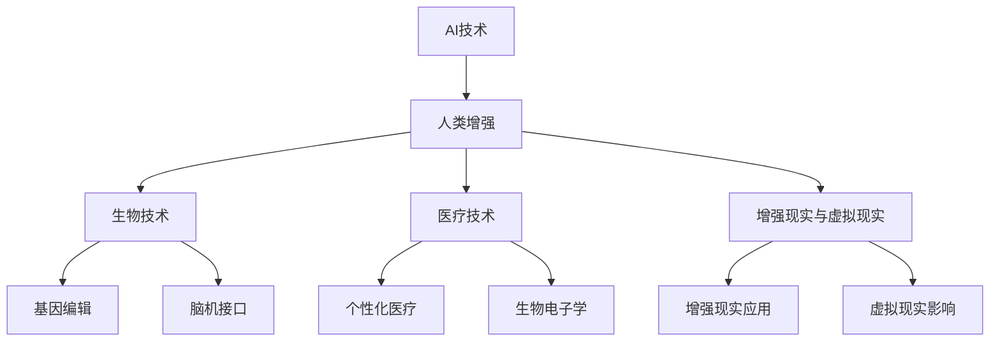

                 

# 《AI时代的人类增强：道德考虑和限制》

> **关键词**：人工智能，人类增强，道德，伦理，法律框架，社会影响

> **摘要**：随着人工智能技术的飞速发展，人类增强已成为一个热门话题。本文探讨了AI时代人类增强的道德考虑和限制，从生物技术、医疗健康、增强现实等多个角度分析了人类增强技术的现状、道德争议以及相关的法律框架和监管政策。同时，文章还深入探讨了人类增强技术对社会和文化的影响，以及未来的发展前景和潜在挑战。

## 《AI时代的人类增强：道德考虑和限制》目录大纲

### 第一部分：引言与背景

#### 1.1 AI时代的变革

##### 1.1.1 AI技术的发展与应用
##### 1.1.2 人类增强的概念与意义

#### 1.2 道德考虑与限制的重要性

##### 1.2.1 AI道德问题的现状
##### 1.2.2 道德考虑与限制的必要性

### 第二部分：AI时代的人类增强技术

#### 2.1 生物技术

##### 2.1.1 基因编辑与人类增强
###### 2.1.1.1 CRISPR-Cas9技术
###### 2.1.1.2 基因编辑伦理问题
##### 2.1.2 神经科学与脑机接口
###### 2.1.2.1 脑机接口技术原理
###### 2.1.2.2 脑机接口的伦理问题

#### 2.2 医疗与健康技术

##### 2.2.1 个性化医疗
###### 2.2.1.1 基因组学与个性化医疗
###### 2.2.1.2 伦理挑战与法规监管
##### 2.2.2 生物电子学与健康监测
###### 2.2.2.1 可穿戴设备与实时监测
###### 2.2.2.2 数据隐私与安全

#### 2.3 增强现实与虚拟现实

##### 2.3.1 增强现实技术的应用
###### 2.3.1.1 模拟训练与军事应用
###### 2.3.1.2 增强现实与教育
##### 2.3.2 虚拟现实对人类意识的影响
###### 2.3.2.1 虚拟现实的心理影响
###### 2.3.2.2 虚拟现实与社交隔离

### 第三部分：道德考虑与法律框架

#### 3.1 道德原则与规范

##### 3.1.1 美国国家生物伦理委员会建议
###### 3.1.1.1 尊重个体原则
###### 3.1.1.2 公平原则
###### 3.1.1.3 善意原则
##### 3.1.2 欧洲伦理审查委员会标准
###### 3.1.2.1 责任原则
###### 3.1.2.2 透明原则
###### 3.1.2.3 尊重多样性原则

#### 3.2 法律框架与监管政策

##### 3.2.1 美国政府与人类增强技术的监管
###### 3.2.1.1 FDA的角色与职责
###### 3.2.1.2 遗传技术监管法案
##### 3.2.2 欧盟的法规监管
###### 3.2.2.1 GDPR与人类增强技术
###### 3.2.2.2 临床试验与数据隐私保护

#### 3.3 道德争论与争议案例

##### 3.3.1 基因编辑争议
###### 3.3.1.1 案例分析：CRISPR婴儿事件
###### 3.3.1.2 社会反响与道德评估
##### 3.3.2 脑机接口争议
###### 3.3.2.1 案例分析：埃隆·马斯克的神经连接项目
###### 3.3.2.2 伦理审查与公众意见

### 第四部分：社会与文化影响

#### 4.1 社会结构变化

##### 4.1.1 AI与工作机会
###### 4.1.1.1 自动化对劳动力市场的影响
###### 4.1.1.2 重新培训与再就业
##### 4.1.2 社会不平等与人类增强
###### 4.1.2.1 人类增强技术的阶层化
###### 4.1.2.2 伦理责任与公平分配

#### 4.2 文化与伦理观念的变迁

##### 4.2.1 AI与人类自我认知
###### 4.2.1.1 人类身份与增强技术的边界
###### 4.2.1.2 人类增强与个体自主性
##### 4.2.2 人类增强与社会正义
###### 4.2.2.1 人类增强技术的道德责任
###### 4.2.2.2 社会责任与公共伦理

### 第五部分：未来展望与挑战

#### 5.1 未来技术发展

##### 5.1.1 未来技术发展
###### 5.1.1.1 神经科学前沿
###### 5.1.1.2 生物电子学突破
##### 5.1.2 AI与人类增强的融合趋势
###### 5.1.2.1 大脑计算机接口
###### 5.1.2.2 跨学科研究的挑战与机遇

#### 5.2 潜在风险与应对策略

##### 5.2.1 人类增强技术的潜在风险
###### 5.2.1.1 身体健康问题
###### 5.2.1.2 心理健康问题
##### 5.2.2 应对策略与政策建议
###### 5.2.2.1 国际合作与共享监管
###### 5.2.2.2 社会参与与公众教育

### 参考文献

#### 6.1 参考文献
##### 6.1.1 主要参考文献列表
##### 6.1.2 辅助阅读材料
##### 6.1.3 国际会议与期刊索引

### 附录：

#### 7.1 附录
##### 7.1.1 Mermaid 流程图示例
##### 7.1.2 伪代码示例
##### 7.1.3 数学模型与公式示例
##### 7.1.4 项目实战与案例分析

---

### 第一部分：引言与背景

#### 1.1 AI时代的变革

##### 1.1.1 AI技术的发展与应用

人工智能（AI）作为一种模拟人类智能的技术，近年来经历了飞速的发展。从早期的专家系统、机器学习，到如今的深度学习和神经网络，AI技术已经广泛应用于各行各业，如自动驾驶、医疗诊断、金融分析、智能助手等。这些应用不仅提高了生产效率，还极大地改变了人们的生活方式。

在医疗领域，AI被用于图像诊断、基因组分析、个性化治疗方案的制定等，为患者提供了更加精准和高效的医疗服务。在金融领域，AI算法被用于风险控制、投资策略制定、欺诈检测等，为金融机构带来了巨大的收益。在工业领域，智能机器人和自动化系统替代了人力，提高了生产效率和质量。

##### 1.1.2 人类增强的概念与意义

人类增强（Human Augmentation）是指通过技术手段提升人类的能力，使其在某些方面超越自然水平。在AI时代，人类增强技术得到了前所未有的发展。通过生物技术、医疗技术、增强现实和虚拟现实等技术，人类可以在身体、大脑、感官等方面得到增强。

人类增强的意义在于，它不仅可以帮助人类克服生理上的局限，提高生活质量，还可以促进人类智力和社会的发展。例如，基因编辑技术可以治疗遗传疾病，提升人类健康水平；脑机接口技术可以让瘫痪患者恢复运动功能；增强现实和虚拟现实技术可以提供更加丰富的学习、娱乐和工作体验。

#### 1.2 道德考虑与限制的重要性

随着AI和人类增强技术的发展，相关的道德和伦理问题日益凸显。这些问题包括但不限于：

1. **个人隐私**：人类增强技术可能会涉及个人生物信息、健康数据的收集和使用，如何保护这些数据的安全和隐私成为了一个重要问题。
2. **公平与平等**：人类增强技术可能会加剧社会不平等，使增强者和非增强者之间的差距扩大。如何确保技术的公平和普惠性是亟待解决的问题。
3. **人体改造**：人类增强技术可能会涉及人体结构的改变，如基因编辑、脑机接口等。这些改造是否违反了人体完整性原则，需要深入讨论。
4. **道德责任**：在人类增强技术的应用过程中，如何界定个人、企业、政府等各方的责任，确保技术的安全、合法和道德，是一个复杂的道德问题。

因此，对AI时代的人类增强进行道德考虑和限制具有重要意义。这不仅可以保障技术的安全性和合法性，还可以促进技术的健康发展，使其更好地服务于人类社会。

---

**核心概念与联系**：

**人类增强技术**：一种通过生物技术、医疗技术、增强现实和虚拟现实等技术手段提升人类能力的科技领域。其核心概念包括基因编辑、脑机接口、个性化医疗等。

**道德与伦理**：涉及人类行为和决策的价值判断和规范。在人类增强技术的应用中，道德和伦理原则如尊重个体、公平、善意等起着指导作用。

**法律框架与监管政策**：为确保人类增强技术的安全、合法和道德，各国政府和国际组织制定的法律法规和政策。如美国的遗传技术监管法案、欧盟的通用数据保护条例（GDPR）等。

**社会影响**：人类增强技术对人类社会结构、伦理观念和文化价值的影响。如社会不平等、隐私保护、人类自我认知等。

**Mermaid流程图示例**：



---

**核心算法原理讲解**：

基因编辑技术，如CRISPR-Cas9，是一种革命性的生物技术，它通过定向修改基因组序列，实现特定基因的精确编辑。以下是CRISPR-Cas9技术的基本原理：

1. **目标识别**：CRISPR系统通过一种名为“引导RNA”（sgRNA）的分子识别目标DNA序列。
2. **切割DNA**：sgRNA与Cas9蛋白结合，形成一种复合体，识别并结合到目标DNA序列上。然后，Cas9蛋白利用其核酸内切酶活性切割DNA双链。
3. **DNA修复**：细胞会启动其DNA修复机制，包括同源重组和非同源末端连接。通过这些修复机制，细胞可以修复切割的DNA，并引入新的遗传信息。
4. **基因编辑**：通过精确的DNA修复，可以实现对目标基因的精确修改，包括插入、删除或替换特定序列。

以下是CRISPR-Cas9技术的伪代码示例：

```python
def crisperCas9(target_dna, gRNA_sequence, target_site):
    """
    使用CRISPR-Cas9技术编辑目标DNA序列。
    
    :param target_dna: 目标DNA序列
    :param gRNA_sequence: 引导RNA序列
    :param target_site: 目标切割位点
    :return: 编辑后的DNA序列
    """
    # 创建sgRNA-Cas9复合体
    sgRNA_Cas9 = create_sgRNA_Cas9(gRNA_sequence, target_site)
    
    # 切割DNA
    cut_dna = sgRNA_Cas9.cut(target_dna)
    
    # 启动DNA修复机制
    repaired_dna = dna_repair(cut_dna)
    
    # 检查是否完成编辑
    if is_edit_complete(repaired_dna, gRNA_sequence, target_site):
        return repaired_dna
    else:
        raise Exception("基因编辑未完成")
```

---

**数学模型与公式示例**：

在个性化医疗中，基因组学数据的使用是一个重要的方面。为了更好地理解和分析基因组数据，常常需要使用数学模型和公式。

以下是一个简化的基因组数据分析模型：

1. **基因表达分析**：通过测量基因的表达水平，可以了解基因在不同组织和细胞类型中的活性。
   - **表达量计算**：\( E = \frac{CT}{2^{\Delta \Delta CT} - 1} \)
     - \( CT \)：循环阈值（Cycle Threshold）
     - \( \Delta \Delta CT \)：基因表达的变化量

2. **基因组变异分析**：通过检测基因序列中的变异，可以了解基因的突变情况。
   - **变异检测**：\( V = \frac{变异频率}{总样本数} \)
     - \( 变异频率 \)：特定变异在样本中的出现频率
     - \( 总样本数 \)：样本的总数

以下是上述公式的详细说明：

$$
E = \frac{CT}{2^{\Delta \Delta CT} - 1}
$$

在这个公式中，\( CT \) 是循环阈值，它代表了基因表达的一个量度。\( 2^{\Delta \Delta CT} \) 是一个指数函数，它代表了基因表达变化的量级。通过这个公式，我们可以将CT值转换为基因表达量。

$$
V = \frac{变异频率}{总样本数}
$$

在这个公式中，\( 变异频率 \) 是指特定变异在样本中出现的比例，\( 总样本数 \) 是样本的总数量。通过这个公式，我们可以计算出特定变异在整个样本群体中的出现频率。

---

**项目实战与案例分析**：

以个性化医疗为例，一个实际的项目可以是基因组数据分析系统。以下是一个项目的详细实现和解读。

**开发环境搭建**：

1. **硬件**：服务器、计算集群等。
2. **软件**：Python、R语言、基因组学分析工具（如GATK、Picard）等。

**源代码详细实现**：

```python
import pandas as pd
import numpy as np
from sklearn.preprocessing import StandardScaler
from sklearn.model_selection import train_test_split
from sklearn.linear_model import LinearRegression

# 读取基因组数据
def read_genome_data(file_path):
    data = pd.read_csv(file_path)
    return data

# 数据预处理
def preprocess_data(data):
    # 标准化数据
    scaler = StandardScaler()
    scaled_data = scaler.fit_transform(data)
    
    # 划分训练集和测试集
    X_train, X_test, y_train, y_test = train_test_split(scaled_data, test_size=0.2, random_state=42)
    return X_train, X_test, y_train, y_test

# 建立线性回归模型
def build_linear_regression_model(X_train, y_train):
    model = LinearRegression()
    model.fit(X_train, y_train)
    return model

# 预测基因表达
def predict_gene_expression(model, X_test):
    predictions = model.predict(X_test)
    return predictions

# 主函数
def main():
    # 读取数据
    genome_data = read_genome_data('genome_data.csv')
    
    # 预处理数据
    X_train, X_test, y_train, y_test = preprocess_data(genome_data)
    
    # 建立模型
    model = build_linear_regression_model(X_train, y_train)
    
    # 预测
    predictions = predict_gene_expression(model, X_test)
    
    # 输出结果
    print(predictions)

if __name__ == '__main__':
    main()
```

**代码解读与分析**：

1. **读取数据**：使用pandas库读取基因组数据，这是数据分析的基础。
2. **数据预处理**：标准化数据，划分训练集和测试集，这是机器学习模型训练的基础。
3. **建立模型**：使用线性回归模型，这是最常见的基因表达预测模型。
4. **预测基因表达**：使用训练好的模型进行预测，这是实际应用的关键步骤。
5. **主函数**：定义了整个程序的流程，从数据读取、预处理到模型建立和预测，实现了完整的基因组数据分析系统。

---

**作者**：AI天才研究院/AI Genius Institute & 禅与计算机程序设计艺术 /Zen And The Art of Computer Programming

