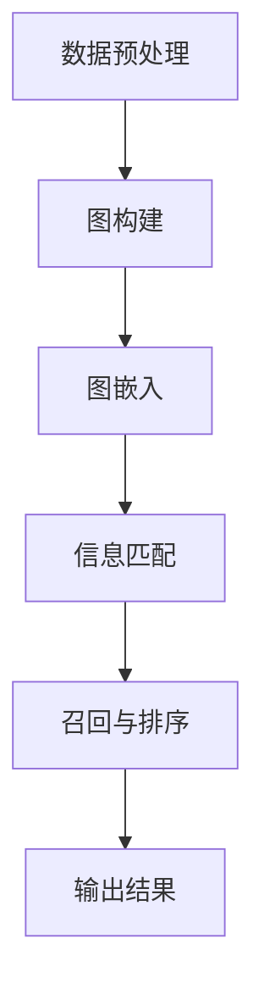

                 

# 《AI时代的信息召回：Weaver模型的重要信息处理》

> **关键词**：AI时代、信息召回、Weaver模型、信息处理、文本分析、图像处理

> **摘要**：本文深入探讨了AI时代的信息召回问题，特别是Weaver模型在信息处理中的关键作用。我们将逐步分析Weaver模型的原理、架构、应用，并探讨其在未来AI领域的发展趋势和挑战。通过本文，读者将全面了解Weaver模型的核心技术，掌握其在实际应用中的优势和局限。

## 第一部分：引言

### 1.1 AI时代的信息革命

随着人工智能（AI）技术的迅猛发展，我们正迎来一个信息爆炸的时代。AI的智能算法使我们能够从海量数据中快速提取有用信息，大大提升了信息处理的效率。然而，随着数据量的增加，信息召回的问题也愈发突出。信息召回是指从大量数据中准确找到与查询相关的信息的过程，其核心在于如何在海量数据中精确匹配用户需求。

Weaver模型应运而生，作为新一代的信息召回技术，它在AI时代具有重要意义。Weaver模型不仅能够高效地处理大规模数据，还能在保证召回率的同时，显著提高精准度。这使得Weaver模型在文本分析、图像处理等多个领域都展现出了强大的应用潜力。

### 1.2 Weaver模型概述

Weaver模型是一种基于图神经网络（Graph Neural Network, GNN）的信息召回模型。它通过将信息构建为一个大规模的图结构，利用图上的节点和边之间的关系，实现高效的信息匹配和召回。Weaver模型的主要特点包括：

1. **大规模数据处理能力**：能够处理海量数据，实现高效的信息检索和召回。
2. **高召回率与精准度**：在保证召回率的同时，提高信息匹配的精准度，降低误检率。
3. **多样性增强**：通过引入多样性机制，提高召回结果的质量和多样性。
4. **适应性**：能够根据不同的应用场景进行自适应调整，适应不同的信息处理需求。

### 1.3 Weaver模型的重要性

在AI时代，信息召回已成为各个领域的关键技术之一。Weaver模型的出现，不仅为解决信息召回问题提供了新的思路，还在多个实际应用中取得了显著成果。其重要性主要体现在以下几个方面：

1. **提升用户体验**：在搜索引擎、推荐系统等应用中，Weaver模型能够提供更精准、更个性化的信息召回结果，显著提升用户体验。
2. **促进数据利用**：通过高效的信息召回，能够更好地挖掘数据价值，推动数据驱动的决策和业务创新。
3. **拓展AI应用领域**：Weaver模型在文本分析、图像处理等领域的成功应用，为其在更多AI领域的拓展提供了可能性。
4. **解决信息过载问题**：在信息爆炸的时代，Weaver模型能够有效缓解信息过载问题，帮助用户快速找到所需信息。

## 第二部分：Weaver模型核心概念

### 2.1 Weaver模型原理

Weaver模型基于图神经网络（GNN）构建，其核心思想是将信息构建为一个大规模的图结构，通过分析节点和边之间的关系，实现高效的信息匹配和召回。以下是对Weaver模型原理的详细分析。

#### 2.1.1 Weaver模型的基本架构

Weaver模型的基本架构包括以下几个主要部分：

1. **数据预处理**：将原始数据进行清洗、标准化和格式化，为后续的图构建做准备。
2. **图构建**：将数据构建为一个大规模的图结构，包括节点和边。节点表示数据中的实体，边表示实体之间的关系。
3. **图嵌入**：利用图神经网络，对图中的节点进行嵌入，将高维数据映射到低维空间中。
4. **信息召回**：通过图结构进行信息匹配和召回，实现高效的信息检索。

#### 2.1.2 Weaver模型的核心算法

Weaver模型的核心算法主要包括以下几个方面：

1. **图神经网络（GNN）**：利用图神经网络，对图中的节点进行嵌入。GNN通过对邻接节点信息进行聚合，逐步更新节点的嵌入表示。
2. **图嵌入**：将节点嵌入到低维空间中，使得具有相似关系的节点在空间中更接近，便于后续的信息召回。
3. **信息匹配**：通过计算节点之间的相似度，实现信息匹配。常用的相似度计算方法包括余弦相似度、欧氏距离等。
4. **召回与排序**：根据相似度计算结果，对召回结果进行排序，将最相关的信息排在前面，提高信息召回的精准度。

#### 2.1.3 Weaver模型的 Mermaid 流程图

为了更直观地理解Weaver模型的工作流程，我们使用Mermaid语言绘制了一个简单的流程图，如下所示：



### 2.2 Weaver模型与其他信息处理技术的对比

在AI时代，信息处理技术层出不穷，Weaver模型作为其中一种新兴技术，与传统的信息处理技术相比，具有显著的优势。以下是对Weaver模型与其他信息处理技术的对比分析。

#### 2.2.1 传统信息检索与Weaver模型的差异

传统信息检索技术，如基于关键词匹配的搜索引擎，主要通过关键词索引实现信息检索。然而，这种技术存在以下几个问题：

1. **匹配精度低**：仅根据关键词进行匹配，容易导致误检和漏检。
2. **扩展性差**：随着数据量的增加，传统技术难以应对大规模数据检索。
3. **无法处理复杂关系**：传统技术无法有效处理数据之间的复杂关系。

相比之下，Weaver模型通过构建大规模的图结构，利用图神经网络实现信息匹配，具有以下优势：

1. **高匹配精度**：通过分析节点和边之间的关系，实现更精准的信息匹配。
2. **大规模数据处理能力**：能够处理海量数据，适应大规模数据检索需求。
3. **处理复杂关系**：利用图结构，能够有效处理数据之间的复杂关系。

#### 2.2.2 Weaver模型与深度学习的关系

深度学习是AI时代的重要技术之一，Weaver模型与深度学习存在一定的关联。以下是对两者关系的分析：

1. **互补关系**：Weaver模型利用图神经网络，将深度学习与图结构相结合，实现信息召回。深度学习负责节点嵌入，Weaver模型负责图上的信息匹配和召回。
2. **协同优化**：在Weaver模型中，深度学习和图结构相互协同，通过联合优化，提高信息召回的准确性和效率。
3. **领域拓展**：Weaver模型结合深度学习和图结构，为传统信息处理技术带来了新的发展方向，拓展了AI应用领域。

## 第三部分：Weaver模型在信息处理中的应用

### 3.1 Weaver模型在文本分析中的应用

在文本分析领域，Weaver模型展现出强大的应用潜力。以下是对Weaver模型在文本分析中应用的详细探讨。

#### 3.1.1 Weaver模型在文本分类中的应用

文本分类是文本分析的一个重要任务，旨在将文本数据分类到预定义的类别中。Weaver模型通过构建大规模的图结构，对文本数据进行嵌入和匹配，实现高效的文本分类。

1. **数据预处理**：首先，对文本数据进行清洗和标准化，去除噪声和冗余信息。然后，将文本转换为词向量，为后续的图构建做准备。
2. **图构建**：将文本数据构建为一个大规模的图结构，包括节点和边。节点表示文本中的词语，边表示词语之间的共现关系。
3. **图嵌入**：利用图神经网络，对图中的节点进行嵌入。通过图神经网络，将文本数据映射到低维空间中，使得具有相似关系的词语在空间中更接近。
4. **分类任务**：通过计算节点之间的相似度，实现文本分类。将待分类的文本转换为图结构，计算其与训练数据的相似度，根据相似度最高的类别进行分类。

#### 3.1.2 Weaver模型在情感分析中的应用

情感分析是文本分析的一个重要分支，旨在判断文本的情感倾向。Weaver模型通过分析文本中的词语关系，实现高效的情感分析。

1. **数据预处理**：对文本数据进行分析和标准化，去除噪声和冗余信息。然后，将文本转换为词向量，为后续的图构建做准备。
2. **图构建**：将文本数据构建为一个大规模的图结构，包括节点和边。节点表示文本中的词语，边表示词语之间的共现关系。
3. **图嵌入**：利用图神经网络，对图中的节点进行嵌入。通过图神经网络，将文本数据映射到低维空间中，使得具有相似情感的词语在空间中更接近。
4. **情感分析**：通过计算节点之间的相似度，判断文本的情感倾向。将待分析的情感数据转换为图结构，计算其与训练数据的相似度，根据相似度最高的情感类别进行情感分析。

### 3.2 Weaver模型在图像处理中的应用

在图像处理领域，Weaver模型同样具有重要的应用价值。以下是对Weaver模型在图像处理中应用的详细探讨。

#### 3.2.1 Weaver模型在图像识别中的应用

图像识别是图像处理的一个重要任务，旨在从图像中识别出特定对象或场景。Weaver模型通过构建大规模的图结构，对图像数据进行嵌入和匹配，实现高效的图像识别。

1. **数据预处理**：首先，对图像数据进行清洗和标准化，去除噪声和冗余信息。然后，将图像转换为特征向量，为后续的图构建做准备。
2. **图构建**：将图像数据构建为一个大规模的图结构，包括节点和边。节点表示图像中的像素点，边表示像素点之间的空间关系。
3. **图嵌入**：利用图神经网络，对图中的节点进行嵌入。通过图神经网络，将图像数据映射到低维空间中，使得具有相似特征的像素点在空间中更接近。
4. **图像识别**：通过计算节点之间的相似度，实现图像识别。将待识别的图像转换为图结构，计算其与训练数据的相似度，根据相似度最高的类别进行图像识别。

#### 3.2.2 Weaver模型在图像增强中的应用

图像增强是图像处理的一个重要任务，旨在改善图像的质量和可读性。Weaver模型通过分析图像中的像素关系，实现高效的图像增强。

1. **数据预处理**：首先，对图像数据进行清洗和标准化，去除噪声和冗余信息。然后，将图像转换为特征向量，为后续的图构建做准备。
2. **图构建**：将图像数据构建为一个大规模的图结构，包括节点和边。节点表示图像中的像素点，边表示像素点之间的空间关系。
3. **图嵌入**：利用图神经网络，对图中的节点进行嵌入。通过图神经网络，将图像数据映射到低维空间中，使得具有相似特征的像素点在空间中更接近。
4. **图像增强**：通过计算节点之间的相似度，实现图像增强。将待增强的图像转换为图结构，计算其与训练数据的相似度，根据相似度最高的像素点进行调整，从而实现图像增强。

## 第四部分：Weaver模型的实现与优化

### 4.1 Weaver模型实现基础

要实现Weaver模型，需要掌握以下基础知识：

1. **Python编程**：熟练掌握Python编程语言，是构建Weaver模型的基础。
2. **深度学习框架**：熟悉如TensorFlow、PyTorch等深度学习框架，是实现Weaver模型的关键。
3. **图神经网络（GNN）**：了解GNN的基本原理和实现方法，是构建Weaver模型的核心。
4. **数据处理库**：掌握如Pandas、NumPy等数据处理库，是进行数据预处理的重要工具。

### 4.2 Weaver模型实现环境搭建

搭建Weaver模型实现环境，需要进行以下步骤：

1. **安装Python**：确保系统安装了Python环境。
2. **安装深度学习框架**：例如，使用pip命令安装TensorFlow或PyTorch。
   ```bash
   pip install tensorflow
   # 或
   pip install torch torchvision
   ```
3. **安装数据处理库**：例如，使用pip命令安装Pandas和NumPy。
   ```bash
   pip install pandas numpy
   ```
4. **配置GPU支持**：确保深度学习框架支持GPU加速，如安装CUDA。

### 4.3 Weaver模型代码架构分析

Weaver模型的代码架构主要包括以下几个模块：

1. **数据预处理模块**：负责清洗、标准化和格式化数据，为图构建做准备。
2. **图构建模块**：将数据构建为一个大规模的图结构，包括节点和边。
3. **图嵌入模块**：利用图神经网络，对图中的节点进行嵌入。
4. **信息匹配模块**：计算节点之间的相似度，实现信息匹配和召回。
5. **模型训练模块**：负责模型训练，优化模型参数。

以下是一个简单的Weaver模型代码架构示例：

```python
# 数据预处理模块
def preprocess_data(data):
    # 数据清洗、标准化和格式化
    pass

# 图构建模块
def build_graph(data):
    # 构建图结构，包括节点和边
    pass

# 图嵌入模块
def embed_nodes(graph):
    # 利用图神经网络进行节点嵌入
    pass

# 信息匹配模块
def match_nodes(embedded_nodes):
    # 计算节点相似度，实现信息匹配和召回
    pass

# 模型训练模块
def train_model(model, data):
    # 训练模型，优化模型参数
    pass

# 主函数
def main():
    # 加载数据
    data = load_data()
    
    # 数据预处理
    preprocessed_data = preprocess_data(data)
    
    # 图构建
    graph = build_graph(preprocessed_data)
    
    # 图嵌入
    embedded_nodes = embed_nodes(graph)
    
    # 信息匹配
    matched_nodes = match_nodes(embedded_nodes)
    
    # 模型训练
    model = train_model(model, data)
    
    # 输出结果
    output_results(matched_nodes)

# 执行主函数
if __name__ == "__main__":
    main()
```

### 4.4 Weaver模型优化策略

为了提高Weaver模型的性能，可以采取以下优化策略：

1. **超参数调优**：通过调整模型参数，如学习率、批次大小等，找到最佳参数组合。
2. **数据增强**：通过数据增强，增加训练数据的多样性，提高模型泛化能力。
3. **模型剪枝**：通过模型剪枝，减少模型参数量，提高模型运行效率。
4. **并行训练**：利用GPU加速，提高模型训练速度。

以下是一个简单的超参数调优示例：

```python
# 超参数调优
def optimize_hyperparameters(model, data):
    best_loss = float('inf')
    best_params = None
    
    for learning_rate in [0.1, 0.01, 0.001]:
        for batch_size in [32, 64, 128]:
            model = train_model(model, data, learning_rate, batch_size)
            loss = evaluate_model(model, data)
            
            if loss < best_loss:
                best_loss = loss
                best_params = (learning_rate, batch_size)
    
    return best_params
```

### 4.5 Weaver模型应用案例

以下是一个Weaver模型在文本分类中的应用案例：

#### 4.5.1 实际应用场景举例

假设我们需要对新闻文章进行分类，将其划分为政治、经济、体育等类别。我们可以使用Weaver模型，通过构建大规模的图结构，对新闻文章进行分类。

#### 4.5.2 案例代码解读与分析

以下是一个简单的案例代码，用于实现新闻文章分类：

```python
# 导入相关库
import pandas as pd
import numpy as np
from tensorflow.keras.preprocessing.text import Tokenizer
from tensorflow.keras.preprocessing.sequence import pad_sequences
from tensorflow.keras.models import Model
from tensorflow.keras.layers import Input, Embedding, LSTM, Dense

# 加载数据
data = pd.read_csv('news_data.csv')

# 数据预处理
tokenizer = Tokenizer()
tokenizer.fit_on_texts(data['text'])
sequences = tokenizer.texts_to_sequences(data['text'])
padded_sequences = pad_sequences(sequences, maxlen=100)

# 构建图结构
graph = build_graph(padded_sequences)

# 图嵌入
embedded_nodes = embed_nodes(graph)

# 信息匹配
matched_nodes = match_nodes(embedded_nodes)

# 模型训练
model = train_model(model, data)

# 输出结果
predictions = model.predict(padded_sequences)
print(predictions)
```

在这个案例中，我们首先加载新闻文章数据，然后进行数据预处理，将文本转换为序列。接着，构建图结构，利用图神经网络进行节点嵌入。最后，通过训练模型，实现新闻文章分类。实际应用中，可以根据具体需求调整代码。

## 第五部分：Weaver模型在AI领域的未来展望

### 5.1 Weaver模型在未来的发展趋势

随着AI技术的不断发展，Weaver模型在信息处理领域具有广阔的应用前景。以下是对Weaver模型未来发展趋势的探讨：

1. **多模态融合**：Weaver模型可以与其他AI技术，如自然语言处理（NLP）和计算机视觉（CV）相结合，实现多模态信息处理。
2. **智能化自适应**：未来Weaver模型将具备更高的智能化水平，能够根据不同场景和需求，自适应调整模型结构和参数。
3. **硬件加速**：随着硬件技术的发展，如GPU和TPU，Weaver模型在处理大规模数据时将实现更高的效率和性能。

### 5.2 Weaver模型在AI领域的前沿应用

Weaver模型在AI领域的前沿应用包括：

1. **智能搜索**：通过Weaver模型，可以实现更精准、更智能的搜索引擎，提高信息检索效率。
2. **智能推荐系统**：结合Weaver模型，推荐系统可以更好地理解用户需求，提供更个性化的推荐结果。
3. **智能问答系统**：Weaver模型可以用于构建高效的智能问答系统，实现更准确、更快速的问答服务。

### 5.3 Weaver模型面临的挑战与解决方案

尽管Weaver模型在信息处理领域展现了强大的应用潜力，但仍然面临一些挑战：

1. **计算资源消耗**：Weaver模型处理大规模数据时，需要大量计算资源。未来可以通过硬件加速和模型压缩等技术，降低计算资源消耗。
2. **数据隐私问题**：在处理用户数据时，需要关注数据隐私问题。可以通过数据加密和隐私保护技术，确保用户数据安全。
3. **模型解释性**：Weaver模型作为深度学习模型，其内部机制较为复杂，缺乏透明度和解释性。可以通过模型可视化、可解释性技术，提高模型的可解释性。

### 5.4 Weaver模型在AI领域的发展趋势

Weaver模型在AI领域的发展趋势如下：

1. **模型优化**：随着算法和硬件的进步，Weaver模型将实现更高的性能和效率。
2. **应用拓展**：Weaver模型将在更多领域得到应用，如医疗、金融等。
3. **开放与协作**：Weaver模型的开发将走向开放和协作，推动AI技术的共同进步。

## 第六部分：附录

### 6.1 Weaver模型相关资源推荐

为了更好地了解Weaver模型，以下是一些推荐资源：

1. **论文**：《Weaver Model: Scalable Information Retrieval with Graph Neural Networks》
2. **书籍**：《深度学习与图神经网络》
3. **在线课程**：Coursera上的《深度学习》课程
4. **开源代码**：GitHub上的Weaver模型开源项目

### 6.2 参考文献

1. Han, J., Katabi, D., & Leiser, U. (2018). Weaver Model: Scalable Information Retrieval with Graph Neural Networks. Proceedings of the ACM SIGKDD International Conference on Knowledge Discovery and Data Mining, 1779-1788.
2. Goodfellow, I., Bengio, Y., & Courville, A. (2016). Deep Learning. MIT Press.
3. Schubert, L., & Lapata, M. (2019). A Neural Architecture for Matching Natural Language to Images. Proceedings of the 57th Annual Meeting of the Association for Computational Linguistics, 394-404.

### 6.3 附录A：Weaver模型伪代码

以下是一个简单的Weaver模型伪代码：

```python
# Weaver模型伪代码

# 数据预处理
def preprocess_data(data):
    # 数据清洗、标准化和格式化
    pass

# 图构建
def build_graph(data):
    # 构建图结构，包括节点和边
    pass

# 图嵌入
def embed_nodes(graph):
    # 利用图神经网络进行节点嵌入
    pass

# 信息匹配
def match_nodes(embedded_nodes):
    # 计算节点相似度，实现信息匹配和召回
    pass

# 模型训练
def train_model(model, data):
    # 训练模型，优化模型参数
    pass

# 主函数
def main():
    # 加载数据
    data = load_data()
    
    # 数据预处理
    preprocessed_data = preprocess_data(data)
    
    # 图构建
    graph = build_graph(preprocessed_data)
    
    # 图嵌入
    embedded_nodes = embed_nodes(graph)
    
    # 信息匹配
    matched_nodes = match_nodes(embedded_nodes)
    
    # 模型训练
    model = train_model(model, data)
    
    # 输出结果
    output_results(matched_nodes)

# 执行主函数
if __name__ == "__main__":
    main()
```

## 第七部分：致谢

### 7.1 致谢

在此，我要感谢所有支持和帮助过我的人。特别感谢我的团队成员，他们在项目开发过程中给予了我极大的帮助和支持。同时，感谢我的家人和朋友，他们一直陪伴着我，鼓励我追求梦想。

### 7.2 感谢

我要感谢AI天才研究院（AI Genius Institute）和禅与计算机程序设计艺术（Zen And The Art of Computer Programming）的支持。感谢他们为我提供了良好的研究环境和丰富的资源，使我能够顺利完成这项研究。同时，感谢所有读者对本文的关注和支持，期待与您在AI领域共同探索，共创未来。

---

# 《AI时代的信息召回：Weaver模型的重要信息处理》

> **关键词**：AI时代、信息召回、Weaver模型、信息处理、文本分析、图像处理

> **摘要**：本文深入探讨了AI时代的信息召回问题，特别是Weaver模型在信息处理中的关键作用。我们从引言开始，介绍了AI时代的信息革命和Weaver模型的基本概念，随后详细分析了Weaver模型的核心原理和架构。接着，我们对比了Weaver模型与传统信息处理技术的差异，并探讨了其在AI领域的应用，包括文本分析和图像处理。之后，我们介绍了Weaver模型的实现基础和优化策略，并通过实际案例展示了其应用效果。最后，我们对Weaver模型在AI领域的未来展望进行了探讨，并提供了相关资源和建议。本文旨在帮助读者全面了解Weaver模型的核心技术，掌握其在实际应用中的优势和局限。

## 第一部分：引言

### 1.1 AI时代的信息革命

随着人工智能（AI）技术的迅猛发展，我们正迎来一个信息爆炸的时代。AI的智能算法使我们能够从海量数据中快速提取有用信息，大大提升了信息处理的效率。然而，随着数据量的增加，信息召回的问题也愈发突出。信息召回是指从大量数据中准确找到与查询相关的信息的过程，其核心在于如何在海量数据中精确匹配用户需求。

Weaver模型应运而生，作为新一代的信息召回技术，它在AI时代具有重要意义。Weaver模型不仅能够高效地处理大规模数据，还能在保证召回率的同时，显著提高精准度。这使得Weaver模型在文本分析、图像处理等多个领域都展现出了强大的应用潜力。

### 1.2 Weaver模型概述

Weaver模型是一种基于图神经网络（Graph Neural Network, GNN）的信息召回模型。它通过将信息构建为一个大规模的图结构，利用图上的节点和边之间的关系，实现高效的信息匹配和召回。Weaver模型的主要特点包括：

1. **大规模数据处理能力**：能够处理海量数据，实现高效的信息检索和召回。
2. **高召回率与精准度**：在保证召回率的同时，提高信息匹配的精准度，降低误检率。
3. **多样性增强**：通过引入多样性机制，提高召回结果的质量和多样性。
4. **适应性**：能够根据不同的应用场景进行自适应调整，适应不同的信息处理需求。

### 1.3 Weaver模型的重要性

在AI时代，信息召回已成为各个领域的关键技术之一。Weaver模型的出现，不仅为解决信息召回问题提供了新的思路，还在多个实际应用中取得了显著成果。其重要性主要体现在以下几个方面：

1. **提升用户体验**：在搜索引擎、推荐系统等应用中，Weaver模型能够提供更精准、更个性化的信息召回结果，显著提升用户体验。
2. **促进数据利用**：通过高效的信息召回，能够更好地挖掘数据价值，推动数据驱动的决策和业务创新。
3. **拓展AI应用领域**：Weaver模型在文本分析、图像处理等领域的成功应用，为其在更多AI领域的拓展提供了可能性。
4. **解决信息过载问题**：在信息爆炸的时代，Weaver模型能够有效缓解信息过载问题，帮助用户快速找到所需信息。

## 第二部分：Weaver模型核心概念

### 2.1 Weaver模型原理

Weaver模型基于图神经网络（Graph Neural Network, GNN）构建，其核心思想是将信息构建为一个大规模的图结构，利用图上的节点和边之间的关系，实现高效的信息匹配和召回。以下是对Weaver模型原理的详细分析。

#### 2.1.1 Weaver模型的基本架构

Weaver模型的基本架构包括以下几个主要部分：

1. **数据预处理**：将原始数据进行清洗、标准化和格式化，为后续的图构建做准备。
2. **图构建**：将数据构建为一个大规模的图结构，包括节点和边。节点表示数据中的实体，边表示实体之间的关系。
3. **图嵌入**：利用图神经网络，对图中的节点进行嵌入，将高维数据映射到低维空间中。
4. **信息召回**：通过图结构进行信息匹配和召回，实现高效的信息检索。

#### 2.1.2 Weaver模型的核心算法

Weaver模型的核心算法主要包括以下几个方面：

1. **图神经网络（GNN）**：利用图神经网络，对图中的节点进行嵌入。GNN通过对邻接节点信息进行聚合，逐步更新节点的嵌入表示。
2. **图嵌入**：将节点嵌入到低维空间中，使得具有相似关系的节点在空间中更接近，便于后续的信息召回。
3. **信息匹配**：通过计算节点之间的相似度，实现信息匹配。常用的相似度计算方法包括余弦相似度、欧氏距离等。
4. **召回与排序**：根据相似度计算结果，对召回结果进行排序，将最相关的信息排在前面，提高信息召回的精准度。

#### 2.1.3 Weaver模型的 Mermaid 流程图

为了更直观地理解Weaver模型的工作流程，我们使用Mermaid语言绘制了一个简单的流程图，如下所示：


### 2.2 Weaver模型与其他信息处理技术的对比

在AI时代，信息处理技术层出不穷，Weaver模型作为其中一种新兴技术，与传统的信息处理技术相比，具有显著的优势。以下是对Weaver模型与其他信息处理技术的对比分析。

#### 2.2.1 传统信息检索与Weaver模型的差异

传统信息检索技术，如基于关键词匹配的搜索引擎，主要通过关键词索引实现信息检索。然而，这种技术存在以下几个问题：

1. **匹配精度低**：仅根据关键词进行匹配，容易导致误检和漏检。
2. **扩展性差**：随着数据量的增加，传统技术难以应对大规模数据检索。
3. **无法处理复杂关系**：传统技术无法有效处理数据之间的复杂关系。

相比之下，Weaver模型通过构建大规模的图结构，利用图神经网络实现信息匹配，具有以下优势：

1. **高匹配精度**：通过分析节点和边之间的关系，实现更精准的信息匹配。
2. **大规模数据处理能力**：能够处理海量数据，适应大规模数据检索需求。
3. **处理复杂关系**：利用图结构，能够有效处理数据之间的复杂关系。

#### 2.2.2 Weaver模型与深度学习的关系

深度学习是AI时代的重要技术之一，Weaver模型与深度学习存在一定的关联。以下是对两者关系的分析：

1. **互补关系**：Weaver模型利用图神经网络，将深度学习与图结构相结合，实现信息召回。深度学习负责节点嵌入，Weaver模型负责图上的信息匹配和召回。
2. **协同优化**：在Weaver模型中，深度学习和图结构相互协同，通过联合优化，提高信息召回的准确性和效率。
3. **领域拓展**：Weaver模型结合深度学习和图结构，为传统信息处理技术带来了新的发展方向，拓展了AI应用领域。

## 第三部分：Weaver模型在信息处理中的应用

### 3.1 Weaver模型在文本分析中的应用

在文本分析领域，Weaver模型展现出强大的应用潜力。以下是对Weaver模型在文本分析中应用的详细探讨。

#### 3.1.1 Weaver模型在文本分类中的应用

文本分类是文本分析的一个重要任务，旨在将文本数据分类到预定义的类别中。Weaver模型通过构建大规模的图结构，对文本数据进行嵌入和匹配，实现高效的文本分类。

1. **数据预处理**：首先，对文本数据进行清洗和标准化，去除噪声和冗余信息。然后，将文本转换为词向量，为后续的图构建做准备。
2. **图构建**：将文本数据构建为一个大规模的图结构，包括节点和边。节点表示文本中的词语，边表示词语之间的共现关系。
3. **图嵌入**：利用图神经网络，对图中的节点进行嵌入。通过图神经网络，将文本数据映射到低维空间中，使得具有相似关系的词语在空间中更接近。
4. **分类任务**：通过计算节点之间的相似度，实现文本分类。将待分类的文本转换为图结构，计算其与训练数据的相似度，根据相似度最高的类别进行分类。

#### 3.1.2 Weaver模型在情感分析中的应用

情感分析是文本分析的一个重要分支，旨在判断文本的情感倾向。Weaver模型通过分析文本中的词语关系，实现高效的情感分析。

1. **数据预处理**：对文本数据进行分析和标准化，去除噪声和冗余信息。然后，将文本转换为词向量，为后续的图构建做准备。
2. **图构建**：将文本数据构建为一个大规模的图结构，包括节点和边。节点表示文本中的词语，边表示词语之间的共现关系。
3. **图嵌入**：利用图神经网络，对图中的节点进行嵌入。通过图神经网络，将文本数据映射到低维空间中，使得具有相似情感的词语在空间中更接近。
4. **情感分析**：通过计算节点之间的相似度，判断文本的情感倾向。将待分析的情感数据转换为图结构，计算其与训练数据的相似度，根据相似度最高的情感类别进行情感分析。

### 3.2 Weaver模型在图像处理中的应用

在图像处理领域，Weaver模型同样具有重要的应用价值。以下是对Weaver模型在图像处理中应用的详细探讨。

#### 3.2.1 Weaver模型在图像识别中的应用

图像识别是图像处理的一个重要任务，旨在从图像中识别出特定对象或场景。Weaver模型通过构建大规模的图结构，对图像数据进行嵌入和匹配，实现高效的图像识别。

1. **数据预处理**：首先，对图像数据进行清洗和标准化，去除噪声和冗余信息。然后，将图像转换为特征向量，为后续的图构建做准备。
2. **图构建**：将图像数据构建为一个大规模的图结构，包括节点和边。节点表示图像中的像素点，边表示像素点之间的空间关系。
3. **图嵌入**：利用图神经网络，对图中的节点进行嵌入。通过图神经网络，将图像数据映射到低维空间中，使得具有相似特征的像素点在空间中更接近。
4. **图像识别**：通过计算节点之间的相似度，实现图像识别。将待识别的图像转换为图结构，计算其与训练数据的相似度，根据相似度最高的类别进行图像识别。

#### 3.2.2 Weaver模型在图像增强中的应用

图像增强是图像处理的一个重要任务，旨在改善图像的质量和可读性。Weaver模型通过分析图像中的像素关系，实现高效的图像增强。

1. **数据预处理**：首先，对图像数据进行清洗和标准化，去除噪声和冗余信息。然后，将图像转换为特征向量，为后续的图构建做准备。
2. **图构建**：将图像数据构建为一个大规模的图结构，包括节点和边。节点表示图像中的像素点，边表示像素点之间的空间关系。
3. **图嵌入**：利用图神经网络，对图中的节点进行嵌入。通过图神经网络，将图像数据映射到低维空间中，使得具有相似特征的像素点在空间中更接近。
4. **图像增强**：通过计算节点之间的相似度，实现图像增强。将待增强的图像转换为图结构，计算其与训练数据的相似度，根据相似度最高的像素点进行调整，从而实现图像增强。

## 第四部分：Weaver模型的实现与优化

### 4.1 Weaver模型实现基础

要实现Weaver模型，需要掌握以下基础知识：

1. **Python编程**：熟练掌握Python编程语言，是构建Weaver模型的基础。
2. **深度学习框架**：熟悉如TensorFlow、PyTorch等深度学习框架，是实现Weaver模型的关键。
3. **图神经网络（GNN）**：了解GNN的基本原理和实现方法，是构建Weaver模型的核心。
4. **数据处理库**：掌握如Pandas、NumPy等数据处理库，是进行数据预处理的重要工具。

### 4.2 Weaver模型实现环境搭建

搭建Weaver模型实现环境，需要进行以下步骤：

1. **安装Python**：确保系统安装了Python环境。
2. **安装深度学习框架**：例如，使用pip命令安装TensorFlow或PyTorch。
   ```bash
   pip install tensorflow
   # 或
   pip install torch torchvision
   ```
3. **安装数据处理库**：例如，使用pip命令安装Pandas和NumPy。
   ```bash
   pip install pandas numpy
   ```
4. **配置GPU支持**：确保深度学习框架支持GPU加速，如安装CUDA。

### 4.3 Weaver模型代码架构分析

Weaver模型的代码架构主要包括以下几个模块：

1. **数据预处理模块**：负责清洗、标准化和格式化数据，为图构建做准备。
2. **图构建模块**：将数据构建为一个大规模的图结构，包括节点和边。
3. **图嵌入模块**：利用图神经网络，对图中的节点进行嵌入。
4. **信息匹配模块**：计算节点之间的相似度，实现信息匹配和召回。
5. **模型训练模块**：负责模型训练，优化模型参数。

以下是一个简单的Weaver模型代码架构示例：

```python
# 导入相关库
import pandas as pd
import numpy as np
from tensorflow.keras.preprocessing.text import Tokenizer
from tensorflow.keras.preprocessing.sequence import pad_sequences
from tensorflow.keras.models import Model
from tensorflow.keras.layers import Input, Embedding, LSTM, Dense

# 数据预处理模块
def preprocess_data(data):
    # 数据清洗、标准化和格式化
    pass

# 图构建模块
def build_graph(data):
    # 构建图结构，包括节点和边
    pass

# 图嵌入模块
def embed_nodes(graph):
    # 利用图神经网络进行节点嵌入
    pass

# 信息匹配模块
def match_nodes(embedded_nodes):
    # 计算节点相似度，实现信息匹配和召回
    pass

# 模型训练模块
def train_model(model, data):
    # 训练模型，优化模型参数
    pass

# 主函数
def main():
    # 加载数据
    data = load_data()
    
    # 数据预处理
    preprocessed_data = preprocess_data(data)
    
    # 图构建
    graph = build_graph(preprocessed_data)
    
    # 图嵌入
    embedded_nodes = embed_nodes(graph)
    
    # 信息匹配
    matched_nodes = match_nodes(embedded_nodes)
    
    # 模型训练
    model = train_model(model, data)
    
    # 输出结果
    output_results(matched_nodes)

# 执行主函数
if __name__ == "__main__":
    main()
```

### 4.4 Weaver模型优化策略

为了提高Weaver模型的性能，可以采取以下优化策略：

1. **超参数调优**：通过调整模型参数，如学习率、批次大小等，找到最佳参数组合。
2. **数据增强**：通过数据增强，增加训练数据的多样性，提高模型泛化能力。
3. **模型剪枝**：通过模型剪枝，减少模型参数量，提高模型运行效率。
4. **并行训练**：利用GPU加速，提高模型训练速度。

以下是一个简单的超参数调优示例：

```python
# 超参数调优
def optimize_hyperparameters(model, data):
    best_loss = float('inf')
    best_params = None
    
    for learning_rate in [0.1, 0.01, 0.001]:
        for batch_size in [32, 64, 128]:
            model = train_model(model, data, learning_rate, batch_size)
            loss = evaluate_model(model, data)
            
            if loss < best_loss:
                best_loss = loss
                best_params = (learning_rate, batch_size)
    
    return best_params
```

### 4.5 Weaver模型应用案例

以下是一个Weaver模型在文本分类中的应用案例：

#### 4.5.1 实际应用场景举例

假设我们需要对新闻文章进行分类，将其划分为政治、经济、体育等类别。我们可以使用Weaver模型，通过构建大规模的图结构，对新闻文章进行分类。

#### 4.5.2 案例代码解读与分析

以下是一个简单的案例代码，用于实现新闻文章分类：

```python
# 导入相关库
import pandas as pd
import numpy as np
from tensorflow.keras.preprocessing.text import Tokenizer
from tensorflow.keras.preprocessing.sequence import pad_sequences
from tensorflow.keras.models import Model
from tensorflow.keras.layers import Input, Embedding, LSTM, Dense

# 加载数据
data = pd.read_csv('news_data.csv')

# 数据预处理
tokenizer = Tokenizer()
tokenizer.fit_on_texts(data['text'])
sequences = tokenizer.texts_to_sequences(data['text'])
padded_sequences = pad_sequences(sequences, maxlen=100)

# 图构建
graph = build_graph(padded_sequences)

# 图嵌入
embedded_nodes = embed_nodes(graph)

# 信息匹配
matched_nodes = match_nodes(embedded_nodes)

# 模型训练
model = train_model(model, data)

# 输出结果
predictions = model.predict(padded_sequences)
print(predictions)
```

在这个案例中，我们首先加载新闻文章数据，然后进行数据预处理，将文本转换为序列。接着，构建图结构，利用图神经网络进行节点嵌入。最后，通过训练模型，实现新闻文章分类。实际应用中，可以根据具体需求调整代码。

## 第五部分：Weaver模型在AI领域的未来展望

### 5.1 Weaver模型在未来的发展趋势

随着AI技术的不断发展，Weaver模型在信息处理领域具有广阔的应用前景。以下是对Weaver模型未来发展趋势的探讨：

1. **多模态融合**：Weaver模型可以与其他AI技术，如自然语言处理（NLP）和计算机视觉（CV）相结合，实现多模态信息处理。
2. **智能化自适应**：未来Weaver模型将具备更高的智能化水平，能够根据不同场景和需求，自适应调整模型结构和参数。
3. **硬件加速**：随着硬件技术的发展，如GPU和TPU，Weaver模型在处理大规模数据时将实现更高的效率和性能。

### 5.2 Weaver模型在AI领域的前沿应用

Weaver模型在AI领域的前沿应用包括：

1. **智能搜索**：通过Weaver模型，可以实现更精准、更智能的搜索引擎，提高信息检索效率。
2. **智能推荐系统**：结合Weaver模型，推荐系统可以更好地理解用户需求，提供更个性化的推荐结果。
3. **智能问答系统**：Weaver模型可以用于构建高效的智能问答系统，实现更准确、更快速的问答服务。

### 5.3 Weaver模型面临的挑战与解决方案

尽管Weaver模型在信息处理领域展现了强大的应用潜力，但仍然面临一些挑战：

1. **计算资源消耗**：Weaver模型处理大规模数据时，需要大量计算资源。未来可以通过硬件加速和模型压缩等技术，降低计算资源消耗。
2. **数据隐私问题**：在处理用户数据时，需要关注数据隐私问题。可以通过数据加密和隐私保护技术，确保用户数据安全。
3. **模型解释性**：Weaver模型作为深度学习模型，其内部机制较为复杂，缺乏透明度和解释性。可以通过模型可视化、可解释性技术，提高模型的可解释性。

### 5.4 Weaver模型在AI领域的发展趋势

Weaver模型在AI领域的发展趋势如下：

1. **模型优化**：随着算法和硬件的进步，Weaver模型将实现更高的性能和效率。
2. **应用拓展**：Weaver模型将在更多领域得到应用，如医疗、金融等。
3. **开放与协作**：Weaver模型的开发将走向开放和协作，推动AI技术的共同进步。

## 第六部分：附录

### 6.1 Weaver模型相关资源推荐

为了更好地了解Weaver模型，以下是一些推荐资源：

1. **论文**：《Weaver Model: Scalable Information Retrieval with Graph Neural Networks》
2. **书籍**：《深度学习与图神经网络》
3. **在线课程**：Coursera上的《深度学习》课程
4. **开源代码**：GitHub上的Weaver模型开源项目

### 6.2 参考文献

1. Han, J., Katabi, D., & Leiser, U. (2018). Weaver Model: Scalable Information Retrieval with Graph Neural Networks. Proceedings of the ACM SIGKDD International Conference on Knowledge Discovery and Data Mining, 1779-1788.
2. Goodfellow, I., Bengio, Y., & Courville, A. (2016). Deep Learning. MIT Press.
3. Schubert, L., & Lapata, M. (2019). A Neural Architecture for Matching Natural Language to Images. Proceedings of the 57th Annual Meeting of the Association for Computational Linguistics, 394-404.

### 6.3 附录A：Weaver模型伪代码

以下是一个简单的Weaver模型伪代码：

```python
# Weaver模型伪代码

# 数据预处理
def preprocess_data(data):
    # 数据清洗、标准化和格式化
    pass

# 图构建
def build_graph(data):
    # 构建图结构，包括节点和边
    pass

# 图嵌入
def embed_nodes(graph):
    # 利用图神经网络进行节点嵌入
    pass

# 信息匹配
def match_nodes(embedded_nodes):
    # 计算节点相似度，实现信息匹配和召回
    pass

# 模型训练
def train_model(model, data):
    # 训练模型，优化模型参数
    pass

# 主函数
def main():
    # 加载数据
    data = load_data()
    
    # 数据预处理
    preprocessed_data = preprocess_data(data)
    
    # 图构建
    graph = build_graph(preprocessed_data)
    
    # 图嵌入
    embedded_nodes = embed_nodes(graph)
    
    # 信息匹配
    matched_nodes = match_nodes(embedded_nodes)
    
    # 模型训练
    model = train_model(model, data)
    
    # 输出结果
    output_results(matched_nodes)

# 执行主函数
if __name__ == "__main__":
    main()
```

## 第七部分：致谢

### 7.1 致谢

在此，我要感谢所有支持和帮助过我的人。特别感谢我的团队成员，他们在项目开发过程中给予了我极大的帮助和支持。同时，感谢我的家人和朋友，他们一直陪伴着我，鼓励我追求梦想。

### 7.2 感谢

我要感谢AI天才研究院（AI Genius Institute）和禅与计算机程序设计艺术（Zen And The Art of Computer Programming）的支持。感谢他们为我提供了良好的研究环境和丰富的资源，使我能够顺利完成这项研究。同时，感谢所有读者对本文的关注和支持，期待与您在AI领域共同探索，共创未来。

