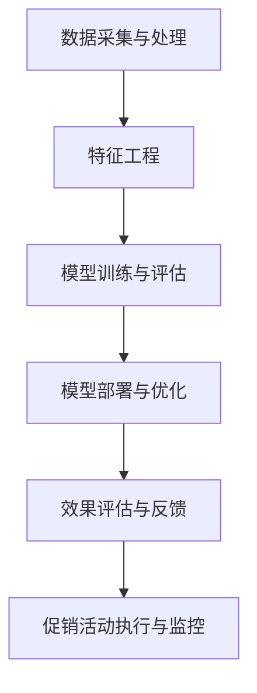

                 

### 《AI赋能的电商平台促销活动个性化》

> **关键词：** 电商平台、AI技术、个性化推荐、促销活动、用户画像、数据挖掘

> **摘要：** 本文深入探讨了AI技术在电商平台促销活动个性化中的应用。通过分析用户画像、行为分析和个性化推荐系统等核心技术，本文详细介绍了AI赋能电商平台促销活动的架构和实现方法。同时，通过实际案例和代码解读，展示了AI在电商促销活动中的实战应用效果，为电商企业提升用户满意度和促销效果提供了有力支持。

### 《AI赋能的电商平台促销活动个性化》

在当今数字化时代，电商平台已经成为消费者购物的主要渠道。随着市场竞争的日益激烈，电商平台迫切需要通过个性化的促销活动来提升用户满意度和转化率。而AI技术的迅速发展，为电商平台促销活动的个性化提供了强有力的技术支持。本文将从背景与概述、核心技术、实战与案例、展望与趋势四个部分，详细探讨AI赋能电商平台促销活动的个性化。

## 第一部分：背景与概述

### 第1章：电商平台促销活动概述

#### 1.1 电商平台的发展历程

电商平台起源于20世纪90年代，随着互联网的兴起，电子商务逐渐成为人们生活中不可或缺的一部分。早期的电商平台主要集中在C2C模式，如eBay和Amazon等。随后，随着B2C模式的兴起，淘宝、京东等大型电商平台崛起，为消费者提供了丰富的商品选择和便捷的购物体验。如今，电商平台已经渗透到各个行业，成为企业拓展市场的重要手段。

#### 1.2 促销活动在电商平台中的地位与作用

促销活动是电商平台吸引消费者、提高销售的重要手段。通过优惠券、满减、限时折扣等促销手段，电商平台能够有效地刺激消费者的购买欲望，提高转化率。此外，促销活动还能提升平台的知名度，增强用户粘性。随着AI技术的应用，促销活动个性化程度越来越高，能够更好地满足消费者的需求，提升用户体验。

#### 1.3 AI技术在电商促销中的应用趋势

随着AI技术的不断发展，其在电商促销活动中的应用也越来越广泛。目前，AI技术在电商促销中的应用主要包括用户画像、行为分析、个性化推荐、促销活动策略优化等方面。未来，随着技术的不断进步，AI在电商促销活动中的应用将更加深入和广泛，为电商平台提供更加精准和高效的促销方案。

### 第2章：AI赋能电商平台促销的核心概念

#### 2.1 人工智能与电商促销

人工智能（AI）是一门研究、开发用于模拟、延伸和扩展人的智能的理论、方法、技术及应用系统的技术科学。在电商促销活动中，AI技术主要通过对用户行为数据的分析，为平台提供个性化的促销策略，从而提高用户满意度和转化率。

#### 2.2 个性化推荐系统原理

个性化推荐系统是一种基于用户历史行为、兴趣偏好和社交网络等信息，为用户提供个性化推荐服务的系统。在电商平台中，个性化推荐系统能够根据用户的浏览记录、购买历史等信息，为用户推荐可能感兴趣的商品，从而提高用户的购物体验。

#### 2.3 数据挖掘与用户行为分析

数据挖掘是一种从大量数据中发现规律、模式和知识的方法。在电商促销活动中，数据挖掘技术主要用于分析用户行为数据，提取有价值的信息，为个性化推荐和促销策略提供支持。用户行为分析则是对用户在平台上的行为进行深入挖掘和分析，以了解用户需求、兴趣和购买习惯等。

### 第3章：AI在电商平台促销活动中的应用架构

#### 3.1 AI在电商平台促销中的应用架构

AI在电商平台促销中的应用架构主要包括数据采集与处理、特征工程、模型训练、模型评估和部署等环节。各环节相互关联，共同构成了一个完整的AI促销应用体系。

#### 3.2 AI应用架构的核心组件

AI应用架构的核心组件包括数据采集模块、数据存储模块、数据处理模块、特征工程模块、模型训练模块、模型评估模块和模型部署模块等。这些组件共同协作，为电商平台提供个性化的促销策略。

#### 3.3 AI应用架构的设计原则

AI应用架构的设计原则主要包括可靠性、可扩展性、高可用性和安全性等。在设计过程中，需要充分考虑这些原则，以确保AI促销系统的稳定运行和高效性能。

## 第二部分：AI赋能电商平台促销的关键技术

### 第4章：用户画像与行为分析

#### 4.1 用户画像概述

用户画像是一种基于用户历史行为、兴趣偏好、社交网络等信息，对用户进行全面描述的方法。在电商平台中，用户画像有助于了解用户需求、兴趣和购买习惯，为个性化推荐和促销策略提供支持。

#### 4.2 用户行为分析技术

用户行为分析技术主要包括用户行为数据采集、数据预处理、行为模式识别和行为预测等。通过这些技术，可以深入了解用户在平台上的行为特征，为个性化推荐和促销策略提供依据。

#### 4.3 画像构建与数据治理

画像构建是用户画像技术的核心环节。通过数据采集、数据预处理、特征工程和模型训练等步骤，可以构建出完整的用户画像。同时，数据治理也是用户画像构建的重要环节，需要确保数据的准确性、完整性和安全性。

### 第5章：个性化推荐系统

#### 5.1 个性化推荐系统概述

个性化推荐系统是一种根据用户历史行为、兴趣偏好和社交网络等信息，为用户提供个性化推荐服务的系统。在电商平台中，个性化推荐系统能够提高用户满意度、降低流失率，从而提升销售额。

#### 5.2 协同过滤算法

协同过滤算法是个性化推荐系统中的一种常用算法，主要包括基于用户的协同过滤和基于项目的协同过滤。通过计算用户之间的相似度或物品之间的相似度，为用户推荐相似或感兴趣的物品。

#### 5.3 内容推荐算法

内容推荐算法是一种基于物品特征或内容相似性进行推荐的方法。在电商平台中，内容推荐算法能够根据商品的分类、标签、描述等信息，为用户推荐相关商品。

### 第6章：促销活动策略优化

#### 6.1 促销活动策略概述

促销活动策略是电商平台吸引消费者、提高销售的重要手段。通过优惠券、满减、限时折扣等促销手段，能够有效刺激消费者的购买欲望，提高转化率。

#### 6.2 价格优化算法

价格优化算法是一种通过调整商品价格，提高销售量和利润的算法。在电商平台中，价格优化算法可以根据用户需求、竞争情况、库存水平等因素，动态调整商品价格，以实现销售和利润的最大化。

#### 6.3 折扣策略与库存管理

折扣策略和库存管理是促销活动策略的重要组成部分。通过合理的折扣策略和库存管理，可以最大限度地提高销售额和用户满意度。

### 第7章：AI促销活动的效果评估

#### 7.1 促销活动效果评估指标

促销活动效果评估指标是衡量促销活动效果的重要手段。常见的评估指标包括销售额、订单量、用户转化率、用户留存率等。

#### 7.2 促销活动效果分析工具

促销活动效果分析工具包括数据分析平台、报表系统、可视化工具等。通过这些工具，可以对促销活动的效果进行全方位分析，为优化促销策略提供数据支持。

#### 7.3 促销活动效果优化策略

根据促销活动效果评估结果，可以制定相应的优化策略，如调整促销手段、优化活动流程、提高用户体验等。通过不断优化，实现促销活动的最大效益。

## 第三部分：实战与案例

### 第8章：电商平台AI促销活动实战

#### 8.1 实战环境搭建

在进行电商平台AI促销活动实战之前，需要搭建一个合适的环境。环境搭建主要包括服务器配置、开发工具安装和数据库部署等。

#### 8.2 实际案例一：个性化推荐系统搭建

个性化推荐系统是AI促销活动的重要环节。在实际案例一中，我们将介绍如何搭建一个基于协同过滤算法的个性化推荐系统。

#### 8.3 实际案例二：促销活动策略优化实战

在促销活动策略优化实战中，我们将通过实际案例介绍如何使用价格优化算法和折扣策略来提高销售额和用户满意度。

### 第9章：AI促销活动案例分析

#### 9.1 案例一：某电商平台的AI个性化促销活动

在案例一中，我们将分析某电商平台如何通过AI技术实现个性化促销活动，以及该活动的效果。

#### 9.2 案例二：某电商平台的AI促销活动效果分析

在案例二中，我们将通过数据分析和实际效果，评估某电商平台AI促销活动的效果，并提出优化建议。

#### 9.3 案例总结与启示

通过对以上案例的分析，我们可以总结出一些AI促销活动的成功经验和启示，为其他电商平台提供参考。

## 第四部分：展望与趋势

### 第10章：AI赋能电商平台促销的发展趋势

#### 10.1 AI技术在电商平台促销中的应用前景

随着AI技术的不断发展，其在电商平台促销中的应用前景十分广阔。未来，AI技术将进一步深入电商平台促销活动的各个环节，为电商平台提供更加智能、高效的促销方案。

#### 10.2 电商平台AI促销的挑战与机遇

电商平台AI促销面临许多挑战，如数据质量、算法性能、用户隐私等。同时，AI技术也为电商平台促销带来了巨大的机遇。如何充分发挥AI技术的优势，应对挑战，实现电商平台促销的可持续发展，是未来需要重点关注的问题。

#### 10.3 未来AI赋能电商平台促销的发展趋势

未来，AI赋能电商平台促销的发展趋势主要包括：个性化推荐技术的不断优化、促销活动策略的智能化、促销效果评估的精细化等。通过不断探索和创新，AI技术将为电商平台促销活动带来更多的可能性。

### 第11章：AI促销活动的伦理与社会影响

#### 11.1 AI促销活动的伦理问题

AI促销活动在带来便利和效益的同时，也引发了一系列伦理问题，如用户隐私保护、数据滥用等。如何在追求商业利益的同时，确保用户权益，是AI促销活动亟需解决的问题。

#### 11.2 AI促销活动的社会影响

AI促销活动对消费者行为、市场竞争和社会经济等方面产生了深远影响。如何发挥AI促销活动的积极作用，减少负面影响，是实现可持续发展的关键。

#### 11.3 AI促销活动的可持续发展策略

为应对AI促销活动带来的挑战，需要采取一系列可持续发展策略，如加强用户隐私保护、提升数据治理水平、推动算法公正和透明等。通过这些策略，可以确保AI促销活动在可持续发展道路上稳步前行。

## 附录

### 附录A：相关资源与工具推荐

#### A.1 电商平台AI促销活动相关书籍

1. 《深度学习》(Deep Learning) 作者：Ian Goodfellow、Yoshua Bengio、Aaron Courville
2. 《机器学习》(Machine Learning) 作者：Tom M. Mitchell
3. 《推荐系统实践》(Recommender Systems: The Textbook) 作者：Hi everybody

#### A.2 电商平台AI促销活动研究论文

1. "A Survey on Recommender Systems" 作者：Huaibo Chen、Yuhua Xu、Ying Liu
2. "Price Optimization in E-Commerce" 作者：Xiaohui Yin、Hui Xiong
3. "User Behavior Analysis in E-Commerce" 作者：Zhiyun Qian、Shenghuo Zhu

#### A.3 电商平台AI促销活动开发工具与平台

1. TensorFlow：一款开源的机器学习框架，适用于电商平台AI促销活动的开发。
2. PyTorch：一款流行的深度学习框架，适用于电商平台AI促销活动的开发。
3. Hadoop：一款分布式数据存储和处理框架，适用于电商平台大数据处理。
4. Apache Spark：一款大数据处理框架，适用于电商平台实时数据处理。

## Mermaid 流程图



### 核心算法原理讲解

#### 个性化推荐算法

个性化推荐算法是一种根据用户历史行为、兴趣偏好和社交网络等信息，为用户推荐可能感兴趣的商品的算法。在电商平台中，个性化推荐算法能够提高用户满意度、降低流失率，从而提升销售额。

**协同过滤算法**

协同过滤算法是一种基于用户历史行为进行推荐的算法。它通过计算用户之间的相似度，找到与目标用户相似的其他用户，然后根据这些相似用户的喜好推荐商品。

**伪代码：**

```python
def collaborative_filtering(user_data, item_data):
    # 计算用户相似度矩阵
    similarity_matrix = compute_similarity(user_data)

    # 计算每个用户的推荐列表
    recommendation_list = []
    for user in user_data:
        # 计算用户与物品的相似度得分
        score_matrix = []
        for item in item_data:
            score = calculate_similarity(similarity_matrix[user], item)
            score_matrix.append(score)
        
        # 根据相似度得分生成推荐列表
        recommendation_list.append(generate_recommendation_list(score_matrix))
    
    return recommendation_list
```

**数学模型和公式**

假设用户 \( u \) 对商品 \( i \) 的评分为 \( r_{ui} \)，用户之间的相似度为 \( s_{uv} \)，则用户 \( u \) 对商品 \( i \) 的推荐分数可以表示为：

$$
r_{ui}^{pred} = \sum_{v \in N(u)} s_{uv} \cdot r_{vi}
$$

其中，\( N(u) \) 表示与用户 \( u \) 相似的其他用户集合，\( r_{vi} \) 表示用户 \( v \) 对商品 \( i \) 的评分。

**举例说明**

假设有5个用户和10个商品，用户之间的相似度矩阵和用户对商品的评分矩阵如下：

| 用户 | 商品1 | 商品2 | 商品3 | 商品4 | 商品5 | 商品6 | 商品7 | 商品8 | 商品9 | 商品10 |
| --- | --- | --- | --- | --- | --- | --- | --- | --- | --- | --- |
| 1 | 1 | 0 | 1 | 0 | 1 | 0 | 1 | 0 | 0 | 0 |
| 2 | 0 | 1 | 0 | 1 | 0 | 1 | 0 | 1 | 0 | 0 |
| 3 | 1 | 0 | 1 | 1 | 0 | 1 | 0 | 1 | 0 | 0 |
| 4 | 0 | 1 | 1 | 0 | 1 | 0 | 1 | 0 | 1 | 0 |
| 5 | 0 | 0 | 1 | 1 | 0 | 1 | 1 | 0 | 1 | 0 |

用户1对商品10的推荐分数为：

$$
r_{10}^{pred} = s_{11} \cdot r_{1

