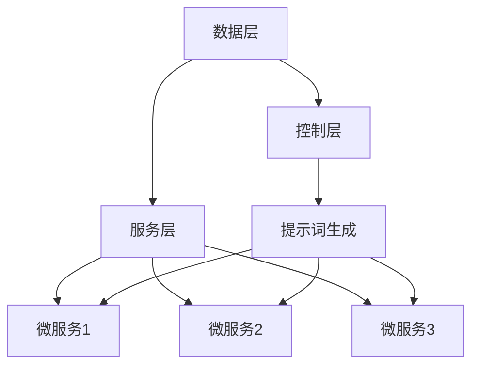
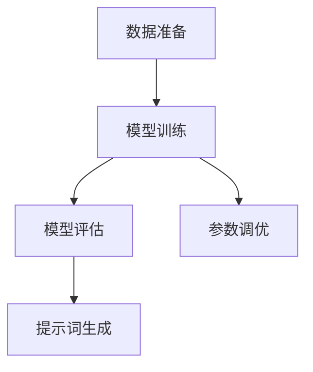
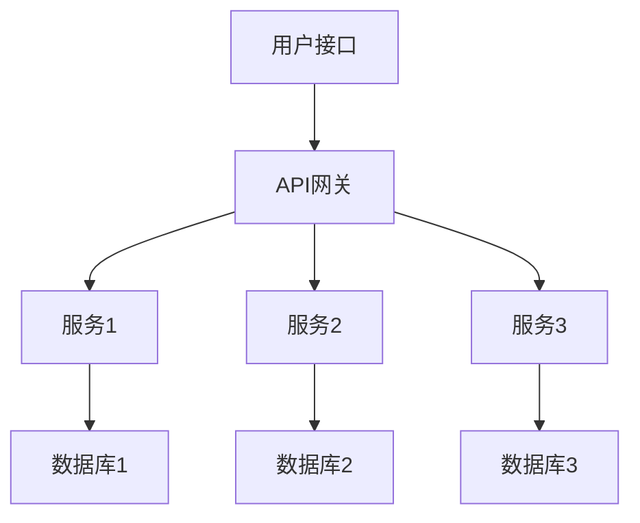
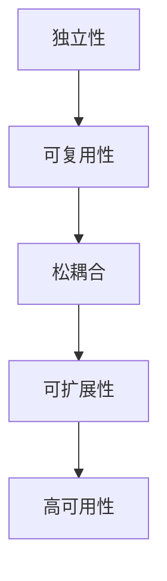
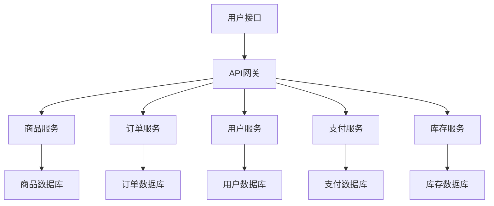
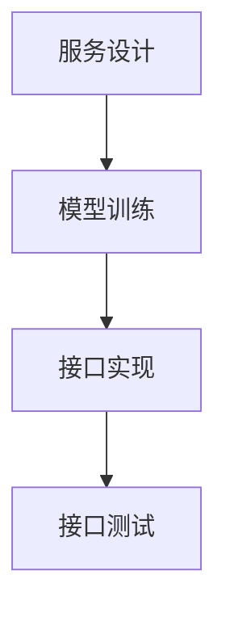

                 

## 《AI软件2.0的提示词驱动微服务设计》

### 关键词：AI软件2.0、提示词驱动、微服务设计、自然语言处理、深度学习、自动化、智能化

#### 摘要：

随着人工智能技术的快速发展，AI软件2.0已成为下一代软件的核心。本文将探讨AI软件2.0的提示词驱动微服务设计，分析其背景与演进、设计原理、核心技术、开发与部署以及实践应用。通过深入剖析自然语言处理基础、提示词生成算法、微服务架构设计等方面，本文旨在为读者提供关于AI软件2.0提示词驱动微服务设计的全面理解和实践指导。

### 目录大纲

1. AI软件2.0概述
    1.1 AI软件2.0的背景与演进
    1.2 从AI1.0到AI2.0的演进
    1.3 AI软件2.0的核心特征
2. 提示词驱动微服务的设计原理
    2.1 提示词驱动的定义与优势
    2.2 提示词驱动微服务的架构
    2.3 提示词驱动与AI结合的应用场景
3. 自然语言处理基础
    3.1 语言模型的基本原理
    3.2 提示词生成的算法分类
    3.3 提示词生成算法的实现
4. 微服务架构设计
    4.1 微服务的基本概念
    4.2 微服务架构的设计原则
    4.3 微服务架构的实践案例
5. 提示词驱动微服务的开发与部署
    5.1 开发环境搭建
    5.2 提示词驱动微服务的实现
    5.3 提示词驱动微服务的部署
6. AI软件2.0在金融领域的应用
    6.1 金融行业对AI的需求
    6.2 AI软件2.0在金融领域的应用案例
    6.3 金融行业AI应用的挑战与解决方案
7. AI软件2.0在医疗领域的应用
    7.1 医疗行业对AI的需求
    7.2 AI软件2.0在医疗领域的应用案例
    7.3 医疗行业AI应用的挑战与解决方案
8. AI软件2.0在零售行业的应用
    8.1 零售行业对AI的需求
    8.2 AI软件2.0在零售领域的应用案例
    8.3 零售行业AI应用的挑战与解决方案
9. 附录
    9.1 常用开发框架
    9.2 常用资源
    9.3 AI社区与论坛

### 第一部分：AI软件2.0概述

#### 1.1 AI软件2.0的背景与演进

AI软件2.0的背景可以追溯到人工智能（AI）技术的不断进步。自20世纪50年代以来，人工智能领域经历了多个发展阶段，从早期的符号推理和规则系统，到基于统计学习和机器学习的模型，再到如今的深度学习和强化学习。每个阶段都有其独特的特点和局限性。

在AI1.0时代，人工智能主要依赖于规则和专家系统。这种方法在处理简单任务时表现出色，但在面对复杂、不确定的问题时，其能力受到很大限制。为了克服这些限制，研究人员开始探索基于数据的机器学习方法，如决策树、支持向量机等。这些方法在特定领域取得了显著进展，但仍然无法解决大规模数据处理和跨领域应用的问题。

随着深度学习的兴起，AI进入了2.0时代。深度学习通过神经网络模拟人脑的神经元连接，可以处理大规模数据和复杂任务。在图像识别、语音识别、自然语言处理等领域，深度学习取得了突破性进展，使得AI软件的性能大幅提升。AI软件2.0的核心特征是数据驱动、自主学习、跨界融合和高可扩展性。

#### 1.2 从AI1.0到AI2.0的演进

AI1.0时代主要依赖于规则和专家系统。规则系统通过定义一系列条件语句来模拟专家知识，实现特定任务的自动化。然而，这种方法存在几个问题：首先，规则系统的维护和扩展非常困难，随着业务场景的变化，需要不断更新和调整规则。其次，规则系统在处理复杂问题时，往往无法得出有效的解决方案。因此，研究人员开始探索基于数据的机器学习方法。

基于数据的机器学习方法通过从大量数据中学习规律和模式，实现自动化和智能化。这种方法的核心是模型训练，通过训练数据集，模型可以学会识别和预测数据中的特征。决策树、支持向量机、朴素贝叶斯等算法在特定领域取得了显著成果，但它们在处理大规模数据和复杂任务时，仍然存在局限性。

深度学习的发展，标志着AI进入2.0时代。深度学习通过模拟人脑的神经元连接，可以处理大规模数据和复杂任务。在图像识别、语音识别、自然语言处理等领域，深度学习取得了突破性进展。与传统的机器学习方法相比，深度学习具有更高的准确性和更强的泛化能力。

AI2.0的核心特征是数据驱动、自主学习、跨界融合和高可扩展性。数据驱动意味着AI软件依赖于大量数据，通过数据驱动的方式，实现智能化和自动化。自主学习是指AI软件可以通过不断学习和优化，提升自身的性能和效果。跨界融合是指AI技术与其他领域的结合，实现跨领域的创新应用。高可扩展性是指AI软件可以轻松扩展和适应不同的业务场景。

#### 1.3 AI软件2.0的核心特征

- **数据驱动**：AI软件2.0的核心特征之一是数据驱动。这意味着AI软件依赖于大量数据，通过数据驱动的方式，实现智能化和自动化。数据驱动的方法可以更好地应对复杂、不确定的业务场景，提高系统的灵活性和适应性。

- **自主学习**：AI软件2.0可以通过不断学习和优化，提升自身的性能和效果。自主学习是AI软件2.0的重要特征，它使得AI软件能够适应不断变化的环境和需求。通过自主学习，AI软件可以自动调整模型参数、优化算法，实现自我提升。

- **跨界融合**：AI软件2.0与其他领域的结合，可以实现跨领域的创新应用。例如，将AI技术应用于医疗、金融、零售等领域，可以解决传统方法无法解决的问题。跨界融合不仅扩大了AI的应用范围，也为其他领域带来了新的机遇。

- **高可扩展性**：AI软件2.0具有高可扩展性，可以轻松扩展和适应不同的业务场景。这意味着，AI软件可以轻松适应不同规模、不同类型的业务需求，实现高效、智能的服务交付。高可扩展性是AI软件2.0在商业应用中的重要优势。

总之，AI软件2.0是下一代人工智能软件的核心，它具有数据驱动、自主学习、跨界融合和高可扩展性等核心特征。这些特征使得AI软件2.0能够更好地应对复杂、不确定的业务场景，提高系统的智能水平和业务处理效率。

### 第二部分：提示词驱动微服务的设计原理

#### 2.1 提示词驱动的定义与优势

**提示词驱动** 是一种基于预设提示词来驱动微服务执行的方法。在提示词驱动微服务中，微服务不再被动等待请求，而是根据预设的提示词主动执行相应的任务。这种模式具有以下优势：

- **灵活性**：提示词可以根据业务需求灵活调整，使得微服务能够快速响应变化。
- **高效性**：通过提前预设提示词，减少微服务的响应时间，提高系统性能。
- **智能化**：利用AI技术，提示词可以基于历史数据和用户行为进行智能生成，实现更智能的服务交付。

#### 2.2 提示词驱动微服务的架构

提示词驱动微服务的架构可以分为三个层次：数据层、服务层和控制层。

- **数据层**：数据层负责存储和管理微服务所需的数据。这些数据可以是结构化的（如关系数据库）或非结构化的（如图像、文本等）。数据层需要提供高效的数据查询和存储能力，以满足微服务的需求。
  
- **服务层**：服务层是实现具体业务功能的微服务集合。每个微服务都可以独立部署、扩展和管理。服务层通过接口与控制层通信，接收控制层的提示词，执行相应的业务操作。

- **控制层**：控制层负责生成和管理提示词，控制微服务的执行。控制层可以根据业务需求和用户行为，动态生成提示词，并分发到相应的服务层。控制层还可以监控微服务的执行状态，进行故障恢复和资源调度。

以下是提示词驱动微服务架构的Mermaid流程图：



#### 2.3 提示词驱动与AI结合的应用场景

提示词驱动与AI技术的结合，可以应用于多个领域，以下是一些典型的应用场景：

- **智能客服**：通过AI技术，根据用户提问生成提示词，实现智能化的客户服务。例如，在电商平台上，当用户提出退货问题时，系统可以自动生成相应的提示词，引导用户完成退货流程。

- **智能推荐**：通过AI技术，根据用户的历史行为和偏好，生成提示词，实现个性化的商品推荐。例如，在视频流媒体平台上，系统可以根据用户的观看历史，生成提示词，推荐用户可能感兴趣的视频内容。

- **智能监控**：通过AI技术，分析数据生成提示词，实现实时监控和预警。例如，在工业生产中，系统可以分析设备运行数据，生成提示词，预警设备故障，实现预防性维护。

### 第三部分：自然语言处理基础

自然语言处理（NLP）是人工智能领域的一个重要分支，主要研究如何让计算机理解和生成人类语言。NLP技术在文本分类、情感分析、机器翻译、语音识别等领域有着广泛的应用。本节将介绍NLP的基础概念、语言模型的基本原理、提示词生成算法及其实现。

#### 3.1 语言模型的基本原理

**语言模型** 是对语言数据的一种统计模型，用于预测下一个单词或字符。语言模型的核心任务是学习语言的概率分布，以便能够生成或理解自然语言文本。常见的语言模型包括：

- **n-gram模型**：n-gram模型是一种基于有限历史模型的统计语言模型，它将连续的n个单词（或字符）作为一个整体，并计算每个n-gram的概率。n-gram模型的优点是实现简单，计算效率高，但缺点是存在长程依赖问题。

- **神经网络语言模型**：神经网络语言模型（如循环神经网络RNN、长短期记忆LSTM、变换器Transformer等）通过学习输入序列中的复杂依赖关系，可以更好地捕捉语言特征。神经网络语言模型在生成和理解自然语言文本方面表现出色，但计算复杂度较高。

以下是n-gram模型的伪代码：

```python
def n_gram_model(vocab, n):
    # 初始化模型参数
    model = {}
    for i in range(n):
        model[(i,)] = {}
    # 计算n-gram概率
    for sentence in corpus:
        for i in range(len(sentence) - n + 1):
            n_gram = tuple(sentence[i:i+n])
            prev_gram = tuple(sentence[i-n:i])
            model[(i,)][n_gram] = model[(i,)].get(n_gram, 0) + 1
    for i in range(n):
        total = sum(model[(i,)].values())
        for n_gram in model[(i,)]:
            model[(i,)][n_gram] /= total
    return model
```

#### 3.2 提示词生成的算法分类

提示词生成的算法可以分为基于规则的方法和基于机器学习的方法。

- **基于规则的方法**：基于规则的方法通过预定义的规则来生成提示词。这种方法的主要优点是实现简单，但缺点是灵活性较低，难以适应复杂场景。

- **基于机器学习的方法**：基于机器学习的方法通过训练数据集来学习生成提示词的规律。这种方法的主要优点是灵活性高，可以适应不同场景，但需要大量的训练数据和计算资源。

常见的基于机器学习的方法包括：

- **朴素贝叶斯分类器**：朴素贝叶斯分类器是一种基于贝叶斯定理和特征条件的概率分类器。通过训练数据集，朴素贝叶斯分类器可以学习到每个类别的特征概率，并利用这些概率来生成提示词。

- **决策树**：决策树是一种基于特征条件进行分类的方法。通过训练数据集，决策树可以构建出一棵分类树，并利用这棵树来生成提示词。

- **支持向量机**：支持向量机是一种基于最大间隔分类的方法。通过训练数据集，支持向量机可以找到最佳分类超平面，并利用这个超平面来生成提示词。

以下是朴素贝叶斯分类器的伪代码：

```python
def naive_bayes_classifier(train_data, test_data):
    # 初始化模型参数
    class_probabilities = {}
    feature_probabilities = {}
    # 计算每个类别的概率
    for class_label in train_data:
        class_probabilities[class_label] = len(train_data[class_label]) / len(train_data)
        feature_probabilities[class_label] = {}
        for feature in train_data[class_label].features():
            feature_probabilities[class_label][feature] = len(train_data[class_label][feature]) / len(train_data[class_label])
    # 预测测试数据
    predictions = []
    for test_example in test_data:
        max_prob = -1
        predicted_class = None
        for class_label in class_probabilities:
            probability = class_probabilities[class_label]
            for feature in test_example.features():
                if feature in feature_probabilities[class_label]:
                    probability *= feature_probabilities[class_label][feature]
            if probability > max_prob:
                max_prob = probability
                predicted_class = class_label
        predictions.append(predicted_class)
    return predictions
```

#### 3.3 提示词生成算法的实现

提示词生成算法的实现通常包括以下几个步骤：

- **数据准备**：收集和预处理提示词相关的数据，如用户提问、用户反馈等。数据预处理包括数据清洗、去重、分词、词性标注等。

- **模型训练**：使用预处理后的数据训练提示词生成模型。训练过程包括模型选择、参数调优等。常用的模型包括朴素贝叶斯分类器、决策树、支持向量机等。

- **模型评估**：使用测试数据对训练好的模型进行评估，调整模型参数，提高模型性能。

- **提示词生成**：利用训练好的模型，根据用户输入生成提示词。提示词生成的过程包括特征提取、模型预测、提示词生成等。

以下是提示词生成算法的实现流程：



通过以上步骤，可以实现一个基于机器学习的提示词生成系统。在实际应用中，可以根据业务需求调整算法和模型，实现更智能、更高效的提示词生成。

### 第四部分：微服务架构设计

微服务架构是一种新兴的软件架构风格，它将大型应用程序拆分成一组小的、独立的、可复用的服务。这些服务通过轻量级的通信机制（如HTTP/REST、消息队列等）进行交互。微服务架构具有许多优点，如高可扩展性、高可用性、易于维护等。在本节中，我们将介绍微服务的基本概念、设计原则和实践案例。

#### 4.1 微服务的基本概念

**微服务** 是一个独立的、可复用的、细粒度的服务，它专注于实现单一的业务功能。微服务之间通过接口进行通信，每个服务都可以独立部署、扩展和管理。微服务的基本特点包括：

- **独立性**：每个微服务都可以独立开发、部署和管理，无需关心其他服务的内部实现。
- **轻量级通信**：微服务之间通常通过HTTP/REST、消息队列等轻量级通信机制进行通信，降低服务之间的耦合。
- **可复用性**：微服务可以独立部署和扩展，易于复用和整合。
- **松耦合**：微服务之间的依赖关系较弱，服务之间通过接口进行通信，降低系统的复杂性和维护成本。

以下是微服务的基本架构：



#### 4.2 微服务架构的设计原则

微服务架构设计应遵循以下原则：

- **独立性**：每个微服务应独立开发、部署和管理，实现单一的业务功能，降低服务之间的依赖。
- **可复用性**：微服务应具备高内聚、低耦合的特点，易于复用和整合。
- **松耦合**：服务之间通过接口进行通信，降低服务之间的耦合，提高系统的灵活性和可维护性。
- **可扩展性**：微服务应支持水平扩展，能够根据业务需求独立部署和扩展。
- **高可用性**：通过容错和故障恢复机制，确保微服务的高可用性。

以下是微服务架构的设计原则的Mermaid流程图：



#### 4.3 微服务架构的实践案例

以下是一些微服务架构的实践案例：

- **电商系统**：电商系统通常由多个微服务组成，如商品服务、订单服务、用户服务、支付服务、库存服务等。每个微服务负责实现特定的业务功能，如商品信息的查询、订单的创建和支付等。

- **银行系统**：银行系统可以使用微服务架构来拆分传统的大型系统，如账户服务、贷款服务、信用卡服务、风险管理服务等。每个微服务负责处理特定的金融业务，提高系统的灵活性和可维护性。

- **社交媒体**：社交媒体平台可以使用微服务架构来处理用户服务、帖子服务、评论服务、消息服务等。每个微服务负责处理特定的社交功能，如用户信息的查询、帖子内容的发布和评论等。

以下是电商系统的微服务架构图：



通过以上实践案例，我们可以看到微服务架构在提升系统灵活性、可维护性和扩展性方面的优势。微服务架构使得开发团队可以独立开发和部署服务，降低服务之间的耦合，提高系统的可靠性和性能。同时，微服务架构也便于团队协作，每个团队可以专注于特定的服务，提高开发效率。

### 第五部分：提示词驱动微服务的开发与部署

#### 5.1 开发环境搭建

在开发提示词驱动微服务之前，需要搭建一个适合的开发环境。开发环境的搭建主要包括以下几个方面：

- **编程语言**：选择一种适合开发微服务的编程语言，如Java、Python、Go等。在本篇文章中，我们选择Python作为开发语言，因为它具有良好的生态系统和丰富的库支持。

- **开发工具**：选择一款适合Python开发的IDE，如PyCharm、Visual Studio Code等。此外，还需要安装Python语言解释器和相关依赖库。

- **版本控制**：使用版本控制工具（如Git）来管理代码，确保代码的一致性和可追踪性。

- **数据库**：选择合适的数据库来存储微服务的数据，如关系数据库（MySQL、PostgreSQL等）或NoSQL数据库（MongoDB、Redis等）。在本篇文章中，我们选择MySQL作为数据库。

以下是搭建Python开发环境的步骤：

1. 安装Python解释器：

```bash
$ wget https://www.python.org/ftp/python/3.8.10/Python-3.8.10.tgz
$ tar -xzvf Python-3.8.10.tgz
$ ./configure
$ make
$ make install
```

2. 安装PyCharm：

在PyCharm官网下载安装包，并按照提示完成安装。

3. 安装Git：

```bash
$ wget https://github.com/git/git/releases/download/v2.30.0/git-2.30.0.tar.gz
$ tar -xzvf git-2.30.0.tar.gz
$ ./configure
$ make
$ make install
```

4. 安装MySQL：

在MySQL官网下载安装包，并按照提示完成安装。

5. 安装Python依赖库：

```bash
$ pip install Flask
$ pip install SQLAlchemy
$ pip install pymysql
```

#### 5.2 提示词驱动微服务的实现

提示词驱动微服务的实现主要包括以下几个步骤：

- **服务设计**：设计微服务的接口和功能。在本篇文章中，我们设计一个简单的问答服务，用户可以通过API接口提出问题，系统根据预设的提示词生成回答。

- **模型训练**：使用自然语言处理技术，训练一个提示词生成模型。在本篇文章中，我们使用朴素贝叶斯分类器作为提示词生成模型。

- **接口实现**：实现微服务的接口，接收用户输入，生成提示词，并返回回答。

以下是提示词驱动微服务的实现流程：



以下是提示词驱动微服务的Python代码实现：

```python
from flask import Flask, request, jsonify
from sklearn.feature_extraction.text import CountVectorizer
from sklearn.naive_bayes import MultinomialNB
import pymysql

app = Flask(__name__)

# 连接MySQL数据库
def connect_db():
    connection = pymysql.connect(host='localhost', user='root', password='root', database='问答系统')
    return connection

# 训练朴素贝叶斯分类器
def train_model():
    connection = connect_db()
    cursor = connection.cursor()
    cursor.execute("SELECT 问题 FROM 问题表")
    questions = cursor.fetchall()
    cursor.execute("SELECT 回答 FROM 回答表")
    answers = cursor.fetchall()
    vectorizer = CountVectorizer()
    X = vectorizer.fit_transform(questions)
    y = answers
    model = MultinomialNB()
    model.fit(X, y)
    cursor.close()
    connection.close()
    return model, vectorizer

# 生成提示词
def generate_answer(question, model, vectorizer):
    X = vectorizer.transform([question])
    predicted_answer = model.predict(X)
    return predicted_answer[0]

# API接口实现
@app.route('/ask', methods=['POST'])
def ask():
    question = request.form['question']
    model, vectorizer = train_model()
    answer = generate_answer(question, model, vectorizer)
    return jsonify(answer=answer)

if __name__ == '__main__':
    app.run(debug=True)
```

#### 5.3 提示词驱动微服务的部署

提示词驱动微服务的部署主要包括以下几个步骤：

- **容器化**：使用Docker将微服务容器化，便于部署和管理。

- **服务编排**：使用Kubernetes等工具进行服务编排和部署。

- **监控与运维**：部署监控工具，实现对微服务的实时监控和运维。

以下是提示词驱动微服务的Docker部署步骤：

1. 编写Dockerfile：

```Dockerfile
FROM python:3.8

WORKDIR /app

COPY requirements.txt .

RUN pip install -r requirements.txt

COPY . .

CMD ["python", "app.py"]
```

2. 构建Docker镜像：

```bash
$ docker build -t提示词驱动微服务 .
```

3. 运行Docker容器：

```bash
$ docker run -d -p 5000:5000 --name 提示词驱动微服务 容器ID
```

4. 部署到Kubernetes集群：

（1）创建Kubernetes配置文件：

```yaml
apiVersion: apps/v1
kind: Deployment
metadata:
  name: 提示词驱动微服务
spec:
  replicas: 1
  selector:
    matchLabels:
      app: 提示词驱动微服务
  template:
    metadata:
      labels:
        app: 提示词驱动微服务
    spec:
      containers:
      - name: 提示词驱动微服务
        image: 提示词驱动微服务
        ports:
        - containerPort: 5000
```

（2）应用Kubernetes配置文件：

```bash
$ kubectl apply -f 提示词驱动微服务.yaml
```

通过以上步骤，我们可以将提示词驱动微服务部署到Kubernetes集群中，实现自动部署、扩展和监控。

### 第六部分：AI软件2.0在金融领域的应用

金融行业是一个高度依赖数据和技术的领域，AI软件2.0的到来为金融行业带来了巨大的变革。本节将探讨金融行业对AI的需求、AI软件2.0在金融领域的应用案例以及金融行业AI应用的挑战与解决方案。

#### 6.1 金融行业对AI的需求

金融行业对AI的需求主要体现在以下几个方面：

- **风险控制**：金融行业面临着各种风险，如信用风险、市场风险、操作风险等。AI技术可以通过分析历史数据、市场动态和用户行为，预测风险并采取相应的措施，降低风险损失。

- **欺诈检测**：金融欺诈行为给金融机构带来了巨大的损失。AI技术可以实时监控交易行为，识别异常交易，并采取相应的措施，如冻结账户、报警等，有效降低欺诈风险。

- **智能投顾**：随着金融市场的复杂化和个性化需求增加，智能投顾成为金融行业的一个重要趋势。AI技术可以通过分析用户数据和投资目标，为用户提供个性化的投资建议，提高投资收益。

- **个性化服务**：金融行业需要为不同的客户提供个性化的服务。AI技术可以根据用户数据和行为，提供定制化的产品推荐、风险管理建议等，提升客户体验。

- **合规性**：金融行业受制于严格的合规要求。AI技术可以自动检测和报告合规性问题，确保金融机构遵守相关法规，降低合规风险。

#### 6.2 AI软件2.0在金融领域的应用案例

AI软件2.0在金融领域有着广泛的应用，以下是一些典型的应用案例：

- **智能客服**：金融机构通过AI技术搭建智能客服系统，提供24/7在线服务。用户可以通过语音、文本等多种方式与智能客服进行交互，获取所需信息，提升客户体验。

- **风险控制**：金融机构利用AI技术进行风险评估和预测，识别潜在的信用风险和市场风险。例如，银行可以通过分析用户的信用历史、财务状况和行为特征，预测用户违约的概率，并采取相应的措施。

- **欺诈检测**：金融机构通过AI技术建立欺诈检测模型，实时监控交易行为，识别异常交易。例如，支付平台可以通过分析交易金额、时间、地点等特征，识别潜在的欺诈交易，并采取相应的措施。

- **智能投顾**：金融机构通过AI技术为用户提供智能化的投资建议。例如，理财平台可以通过分析用户的数据和行为，为用户推荐合适的投资产品，优化投资组合，提高投资收益。

- **合规性**：金融机构通过AI技术自动检测和报告合规性问题。例如，银行可以通过分析交易记录和法律法规，识别潜在的合规风险，并生成合规报告。

以下是AI软件2.0在金融领域的一些实际应用案例：

- **银行智能客服**：中国工商银行通过搭建智能客服系统，提供7x24小时的在线服务。用户可以通过语音、文本等多种方式与智能客服进行交互，获取所需信息，提升客户体验。

- **保险行业智能风控**：中国平安保险通过AI技术建立智能风控系统，对保险业务进行实时监控和预警。通过分析用户数据和行为，识别潜在的欺诈风险，降低保险公司的损失。

- **金融欺诈检测**：美国花旗银行通过AI技术搭建欺诈检测系统，实时监控交易行为。通过分析交易金额、时间、地点等特征，识别潜在的欺诈交易，并采取相应的措施。

- **智能投顾平台**：美国Wealthfront公司通过AI技术为用户提供智能化的投资建议。通过分析用户的数据和行为，为用户推荐合适的投资产品，优化投资组合，提高投资收益。

- **金融合规性检测**：欧洲央行通过AI技术建立金融合规性检测系统，自动检测和报告合规性问题。通过分析交易记录和法律法规，识别潜在的合规风险，并生成合规报告。

#### 6.3 金融行业AI应用的挑战与解决方案

尽管AI技术在金融领域具有巨大的潜力，但在实际应用中也面临一些挑战：

- **数据隐私**：金融行业涉及大量的敏感数据，如用户财务信息、交易记录等。如何在保护数据隐私的同时，有效利用AI技术进行数据处理和分析，是一个重要挑战。解决方案包括数据加密、隐私保护算法等。

- **合规性**：金融行业受到严格的合规要求，如反洗钱法规、消费者保护法等。AI技术在应用过程中需要遵守相关法规，确保合规性。解决方案包括合规性检测、法规遵循机制等。

- **技术成熟度**：AI技术在金融领域的应用仍处于发展阶段，部分技术尚未成熟。如何选择合适的技术方案，并确保技术的稳定性和可靠性，是一个挑战。解决方案包括技术评估、持续迭代等。

- **用户接受度**：金融行业用户对AI技术的接受度较高，但仍需要逐步提升。如何通过有效的营销和沟通，提高用户对AI技术的接受度，是一个挑战。解决方案包括用户调研、用户体验设计等。

总之，金融行业AI应用面临数据隐私、合规性、技术成熟度和用户接受度等挑战，但通过有效的解决方案，可以充分发挥AI技术在金融领域的潜力，提升金融服务质量和效率。

### 第七部分：AI软件2.0在医疗领域的应用

AI软件2.0在医疗领域的应用正逐步改变着传统医疗模式，提高诊疗效率、优化患者管理、改善医疗服务质量。本节将探讨医疗行业对AI的需求、AI软件2.0在医疗领域的应用案例以及医疗行业AI应用的挑战与解决方案。

#### 7.1 医疗行业对AI的需求

医疗行业对AI的需求日益增加，主要体现在以下几个方面：

- **疾病预测与早期发现**：AI技术可以通过分析海量医疗数据，预测疾病的发生和发展趋势，实现疾病的早期发现和干预。

- **辅助诊断**：AI技术可以在影像识别、病理分析等领域辅助医生进行诊断，提高诊断准确率和效率。

- **个性化治疗**：AI技术可以根据患者的具体病情和基因信息，提供个性化的治疗方案，提高治疗效果。

- **药物研发**：AI技术可以加速药物研发过程，通过模拟药物与生物分子的相互作用，筛选和优化候选药物。

- **医疗资源优化**：AI技术可以帮助医疗资源管理部门优化资源配置，提高医院运营效率。

#### 7.2 AI软件2.0在医疗领域的应用案例

AI软件2.0在医疗领域有着广泛的应用，以下是一些典型的应用案例：

- **智能诊断**：AI技术应用于医学影像诊断，如CT、MRI、X光等，通过深度学习模型自动识别和诊断病变。例如，Google DeepMind的AI系统在肺癌、乳腺癌等疾病的诊断中取得了显著效果。

- **智能药物研发**：AI技术加速药物研发进程，通过模拟生物分子相互作用和药物代谢过程，预测候选药物的有效性和安全性。例如，IBM的Watson for Drug Discovery通过AI算法加速新药研发。

- **个性化治疗**：AI技术可以根据患者的基因、病情和生活习惯，提供个性化的治疗方案。例如，个人基因组学公司23andMe通过分析患者的基因信息，为患者提供个性化的健康建议。

- **医疗资源优化**：AI技术可以帮助医院优化资源配置，如智能排班系统可以根据医生的工作量和患者需求，合理分配医疗资源。例如，上海某医院通过引入智能排班系统，显著提高了医院运营效率。

以下是AI软件2.0在医疗领域的一些实际应用案例：

- **智能影像诊断**：IBM Watson Health的AI系统在美国多个医院部署，用于辅助医生进行医学影像诊断，提高诊断准确率和效率。

- **智能药物研发**：人工智能公司BenevolentAI通过AI算法和大数据分析，加速药物研发过程，为多家药企提供药物筛选和优化服务。

- **个性化治疗**：个人基因组学公司23andMe通过分析用户的基因信息，为用户提供个性化的健康建议和治疗方案。

- **医疗资源优化**：上海某医院引入智能排班系统，通过实时分析医生的工作量和患者需求，优化医院运营效率。

#### 7.3 医疗行业AI应用的挑战与解决方案

尽管AI技术在医疗领域具有巨大的潜力，但在实际应用中也面临一些挑战：

- **数据隐私与安全**：医疗数据涉及个人隐私，如何在确保数据安全的同时，有效利用AI技术进行分析和处理，是一个重要挑战。解决方案包括数据加密、隐私保护算法等。

- **算法透明性与可解释性**：AI算法的透明性和可解释性在医疗领域尤为重要，如何确保算法的决策过程公正、透明，便于医生和患者理解，是一个挑战。解决方案包括开发可解释的AI算法、提供算法解释工具等。

- **数据质量和完整性**：AI模型的性能依赖于高质量的数据，如何在医疗数据中识别和修复错误、缺失数据，是一个挑战。解决方案包括数据清洗、数据完整性检测等。

- **技术成熟度**：AI技术在医疗领域的应用仍处于早期阶段，部分技术尚未成熟。如何选择合适的技术方案，并确保技术的稳定性和可靠性，是一个挑战。解决方案包括技术评估、持续迭代等。

- **医生和患者的接受度**：AI技术在医疗领域的应用需要医生和患者的接受和支持。如何通过有效的沟通和培训，提高医生和患者对AI技术的接受度，是一个挑战。解决方案包括开展AI技术应用培训、加强患者教育等。

总之，医疗行业AI应用面临数据隐私、算法透明性、数据质量、技术成熟度和用户接受度等挑战，但通过有效的解决方案，可以充分发挥AI技术在医疗领域的潜力，提升医疗服务质量和效率。

### 第八部分：AI软件2.0在零售行业的应用

AI软件2.0在零售行业的应用正逐步改变着传统零售模式，提升客户体验、优化库存管理、提高销售效率。本节将探讨零售行业对AI的需求、AI软件2.0在零售领域的应用案例以及零售行业AI应用的挑战与解决方案。

#### 8.1 零售行业对AI的需求

零售行业对AI的需求主要体现在以下几个方面：

- **客户体验**：AI技术可以通过个性化推荐、智能客服等方式，提升客户的购物体验，增加客户满意度和忠诚度。

- **库存管理**：AI技术可以分析销售数据、市场趋势等，优化库存管理，减少库存积压和缺货情况，提高库存周转率。

- **销售分析**：AI技术可以分析销售数据，识别销售趋势和机会，优化销售策略，提高销售额。

- **供应链优化**：AI技术可以优化供应链管理，通过预测市场需求、优化物流路径等，降低成本、提高效率。

- **欺诈检测**：AI技术可以监控交易行为，识别潜在的欺诈行为，降低欺诈风险。

#### 8.2 AI软件2.0在零售领域的应用案例

AI软件2.0在零售领域有着广泛的应用，以下是一些典型的应用案例：

- **智能推荐**：电商平台通过AI技术，根据用户的历史购买记录、浏览行为等，为用户推荐个性化的商品，提高销售转化率。例如，亚马逊的推荐系统通过AI算法，为用户提供个性化的购物建议。

- **智能客服**：零售企业通过AI技术搭建智能客服系统，提供24/7在线服务，解答用户的疑问，提高客户满意度。例如，阿里巴巴的智能客服机器人“小蜜”，通过自然语言处理技术，为用户提供智能化的客户服务。

- **库存管理**：零售企业通过AI技术分析销售数据、市场趋势等，优化库存管理，减少库存积压和缺货情况。例如，沃尔玛通过AI技术优化库存管理，提高库存周转率，降低库存成本。

- **销售分析**：零售企业通过AI技术分析销售数据，识别销售趋势和机会，优化销售策略。例如，可口可乐通过AI技术分析销售数据，优化产品组合和营销策略，提高销售额。

- **供应链优化**：零售企业通过AI技术优化供应链管理，通过预测市场需求、优化物流路径等，降低成本、提高效率。例如，京东通过AI技术优化供应链管理，实现精准库存预测和高效物流配送。

以下是AI软件2.0在零售领域的一些实际应用案例：

- **智能推荐**：亚马逊通过AI技术为用户提供个性化的购物建议，提高销售转化率。

- **智能客服**：阿里巴巴的智能客服机器人“小蜜”，通过自然语言处理技术，为用户提供智能化的客户服务。

- **库存管理**：沃尔玛通过AI技术优化库存管理，提高库存周转率，降低库存成本。

- **销售分析**：可口可乐通过AI技术分析销售数据，优化产品组合和营销策略，提高销售额。

- **供应链优化**：京东通过AI技术优化供应链管理，实现精准库存预测和高效物流配送。

#### 8.3 零售行业AI应用的挑战与解决方案

尽管AI技术在零售行业具有巨大的潜力，但在实际应用中也面临一些挑战：

- **数据隐私**：零售行业涉及大量的用户数据，如何在保护用户隐私的同时，有效利用AI技术进行数据处理和分析，是一个重要挑战。解决方案包括数据加密、隐私保护算法等。

- **算法透明性与可解释性**：AI算法的透明性和可解释性在零售行业尤为重要，如何确保算法的决策过程公正、透明，便于商家和用户理解，是一个挑战。解决方案包括开发可解释的AI算法、提供算法解释工具等。

- **技术成熟度**：AI技术在零售行业的应用仍处于早期阶段，部分技术尚未成熟。如何选择合适的技术方案，并确保技术的稳定性和可靠性，是一个挑战。解决方案包括技术评估、持续迭代等。

- **用户接受度**：AI技术在零售行业的应用需要用户的支持和接受。如何通过有效的沟通和培训，提高用户对AI技术的接受度，是一个挑战。解决方案包括开展AI技术应用培训、加强用户教育等。

总之，零售行业AI应用面临数据隐私、算法透明性、技术成熟度和用户接受度等挑战，但通过有效的解决方案，可以充分发挥AI技术在零售行业的潜力，提升零售业务效率和客户体验。

### 附录

#### 10.1 常用开发框架

在AI软件2.0和提示词驱动微服务的开发过程中，选择合适的开发框架可以大大提高开发效率和项目质量。以下是一些常用的开发框架：

- **TensorFlow**：由谷歌开发的开源机器学习框架，支持多种机器学习模型的训练和部署。

- **PyTorch**：由Facebook开发的开源机器学习框架，以其灵活性和动态计算图而著称。

- **Keras**：基于TensorFlow和Theano的开源高级神经网络API，提供简洁的接口，方便快速构建和训练神经网络。

- **Flask**：轻量级的Web应用框架，适用于开发微服务。

- **Spring Boot**：基于Spring框架的Web应用开发框架，支持快速构建和部署微服务。

- **Django**：高层次的Python Web框架，适用于快速开发数据库驱动的Web应用程序。

#### 10.2 常用资源

以下是一些在AI软件2.0和提示词驱动微服务开发中常用的资源：

- **AI开源项目**：包括TensorFlow、PyTorch、Keras等，提供丰富的模型、算法和工具。

- **AI研究论文**：了解最新AI研究进展的重要途径，如《Attention Is All You Need》、《BERT: Pre-training of Deep Bidirectional Transformers for Language Understanding》等。

- **AI社区与论坛**：如GitHub、ArXiv、Stack Overflow等，提供AI技术交流和学习的平台。

- **在线教程与课程**：如Coursera、edX等，提供丰富的AI和机器学习在线教程和课程。

#### 10.3 AI社区与论坛

以下是几个主要的AI社区与论坛：

- **GitHub**：全球最大的代码托管平台，提供丰富的AI开源项目和教程。

- **ArXiv**：AI和机器学习领域的前沿论文发布平台，了解最新研究成果。

- **Stack Overflow**：编程问题解答社区，解决AI和机器学习开发中的技术问题。

- **AI Weekly**：每周更新的AI领域新闻和文章，了解行业动态。

- **AI Community**：各类AI技术的交流社区，包括深度学习、自然语言处理、计算机视觉等。

通过使用这些资源和社区，开发者可以持续学习和交流，提高AI技术水平和项目质量。

### 作者信息

作者：AI天才研究院/AI Genius Institute & 禅与计算机程序设计艺术 /Zen And The Art of Computer Programming

感谢您阅读本文，希望本文对您在AI软件2.0和提示词驱动微服务设计领域的学习和实践有所帮助。如果您有任何疑问或建议，欢迎在评论区留言，我将尽快回复。再次感谢您的支持！<|assistant|>### 总结与展望

本文详细介绍了AI软件2.0的提示词驱动微服务设计，从背景与演进、设计原理、核心技术、开发与部署，到实践应用，全面剖析了AI软件2.0的核心特征、提示词驱动的优势、自然语言处理基础、微服务架构设计以及AI在金融、医疗、零售等行业的应用。通过对这些领域的深入探讨，本文揭示了AI软件2.0在提升业务效率、优化服务质量和降低风险方面的巨大潜力。

在未来，AI软件2.0将继续推动各行各业的数字化转型。随着技术的不断进步，我们期待看到更多创新的应用场景，如智能医疗、智慧城市、智能制造等。同时，AI技术的可解释性和透明性、数据隐私保护以及算法的公平性等问题也亟待解决。只有解决了这些挑战，AI软件2.0才能更好地服务于人类社会，实现其最大价值。

在人工智能领域，我们呼吁更多的开发者、研究人员和企业投身于这一前沿领域，共同推动技术的创新和发展。通过持续的学习、交流和实践，我们将共同迎接AI软件2.0时代的到来，创造更加智能、高效和美好的未来。

### 附录

#### 附录A：AI软件2.0开发工具与资源

在本附录中，我们将介绍一些常用的AI软件2.0开发工具与资源，包括开发框架、库、平台以及相关的AI社区和论坛。

**10.1 常用开发框架**

1. **TensorFlow**：由谷歌开发的开源机器学习框架，支持多种机器学习模型的训练和部署，包括深度学习模型。官方网站：[TensorFlow官网](https://www.tensorflow.org/)。

2. **PyTorch**：由Facebook开发的开源机器学习库，以动态计算图和灵活性著称，适用于快速原型设计和模型开发。官方网站：[PyTorch官网](https://pytorch.org/)。

3. **Keras**：基于TensorFlow和Theano的高层神经网络API，提供简洁的接口，易于快速构建和训练神经网络。官方网站：[Keras官网](https://keras.io/)。

4. **Scikit-learn**：Python中广泛使用的机器学习库，提供多种机器学习算法和工具，适用于数据预处理、模型评估等。官方网站：[Scikit-learn官网](https://scikit-learn.org/)。

5. **Apache MXNet**：由Apache软件基金会开发的开源深度学习框架，支持多种编程语言，如Python、C++等。官方网站：[Apache MXNet官网](https://mxnet.apache.org/)。

**10.2 常用库和工具**

1. **NumPy**：Python中的科学计算库，提供多维数组对象和一系列数学函数，是进行数据科学和机器学习的基础。官方网站：[NumPy官网](https://numpy.org/)。

2. **Pandas**：Python中的数据处理库，提供数据结构DataFrames，方便进行数据清洗、分析和操作。官方网站：[Pandas官网](https://pandas.pydata.org/)。

3. **Matplotlib**：Python中的可视化库，用于生成各种统计图表和图形，是数据可视化的重要工具。官方网站：[Matplotlib官网](https://matplotlib.org/)。

4. **Scrapy**：Python中的网络爬虫框架，用于从网站抓取数据，是数据收集的重要工具。官方网站：[Scrapy官网](https://scrapy.org/)。

5. **OpenCV**：开源计算机视觉库，提供丰富的计算机视觉算法和工具，适用于图像处理和视频分析。官方网站：[OpenCV官网](https://opencv.org/)。

**10.3 开发平台**

1. **Google Colab**：谷歌提供的免费云端计算平台，基于Jupyter Notebook，适合进行机器学习和深度学习实验。官方网站：[Google Colab官网](https://colab.research.google.com/)。

2. **AWS SageMaker**：亚马逊提供的机器学习平台，支持模型训练、部署和自动化管理，适合企业级应用。官方网站：[AWS SageMaker官网](https://aws.amazon.com/sagemaker/)。

3. **Azure Machine Learning**：微软提供的云机器学习平台，提供模型训练、部署和管理功能，支持多种编程语言和框架。官方网站：[Azure Machine Learning官网](https://azure.com/ai/machine-learning)。

4. **Docker**：容器化平台，用于打包、交付和运行应用，支持微服务架构的部署。官方网站：[Docker官网](https://www.docker.com/)。

5. **Kubernetes**：开源容器编排平台，用于自动化部署、扩展和管理容器化应用，是微服务架构的关键组件。官方网站：[Kubernetes官网](https://kubernetes.io/)。

**10.4 AI社区与论坛**

1. **GitHub**：全球最大的代码托管平台，提供了大量的开源项目和AI相关的代码库。官方网站：[GitHub官网](https://github.com/)。

2. **ArXiv**：计算机科学和人工智能领域的前沿论文发布平台，是了解最新研究成果的重要途径。官方网站：[ArXiv官网](https://arxiv.org/)。

3. **Stack Overflow**：编程问题解答社区，是解决AI和机器学习开发中技术问题的宝贵资源。官方网站：[Stack Overflow官网](https://stackoverflow.com/)。

4. **AI Weekly**：每周更新的AI领域新闻和文章，是了解行业动态的重要渠道。官方网站：[AI Weekly官网](https://aiweekly.io/)。

5. **AI Community**：各类AI技术的交流社区，包括深度学习、自然语言处理、计算机视觉等。官方网站：[AI Community官网](https://www.aicrowd.com/)。

通过使用这些开发工具与资源，开发者可以更加高效地进行AI软件2.0的开发与部署，推动人工智能技术的创新与应用。同时，参与AI社区与论坛，可以与同行交流经验，共同进步。希望这些信息能对您的AI之旅有所帮助。

