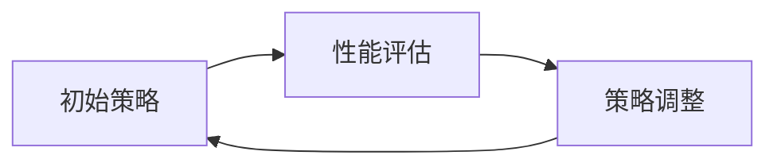
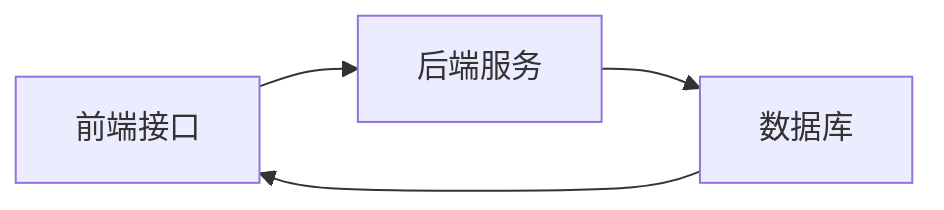
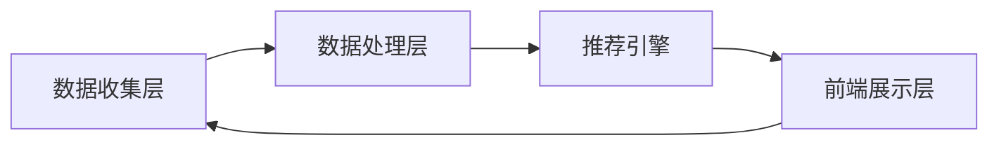
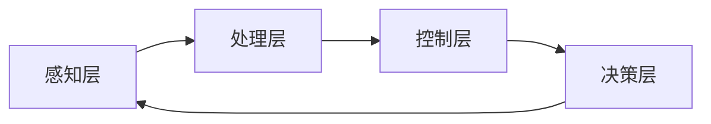
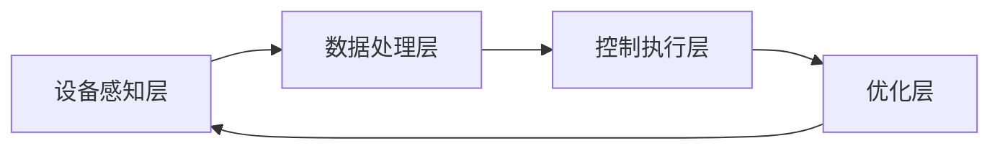
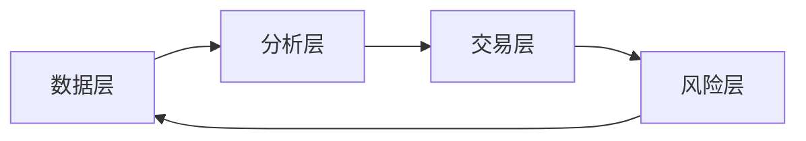

                 

## 第一部分：Agent技术基础

### 1.1 Agent技术的定义与分类

**Agent技术**是指模拟人类智能行为的技术，旨在使计算机程序具备自主决策和执行任务的能力。Agent可以被视为一个自主体，它在复杂的环境中运行，能够感知环境、接收外部信息，并基于这些信息做出决策。

Agent技术可以分为以下几类：

- **基于规则（Rule-Based）**：这种类型的Agent通过预定义的规则来执行任务，规则通常由领域专家制定。
- **基于模型（Model-Based）**：这种类型的Agent具有内部模型，可以模拟和分析环境，以做出更好的决策。
- **基于学习（Learning-Based）**：这种类型的Agent通过学习历史数据和环境模式来自主地改进其决策能力。
- **基于通信（Communicative）**：这种类型的Agent能够在多个Agent之间进行有效的通信，协同完成任务。

#### 1.1.1 Agent技术的起源与发展

Agent技术的概念起源于人工智能（AI）领域，最早的研究可以追溯到20世纪70年代。当时，研究人员开始探索如何使计算机程序在特定环境下自主行动，这种探索促使了Agent技术的诞生。

随着时间的推移，Agent技术得到了快速发展。尤其是在20世纪90年代，多智能体系统（Multi-Agent Systems，MAS）的研究兴起，推动了Agent技术在复杂系统中的应用。MAS的核心思想是通过多个Agent的合作来解决问题，这使得Agent技术在工业、商业和科学等领域得到了广泛应用。

#### 1.1.2 Agent技术的分类

- **个体Agent（Individual Agents）**：这种类型的Agent独立运行，不依赖于其他Agent，其行为仅基于自身感知和决策。
- **群体Agent（Group Agents）**：这种类型的Agent在群体中协作，共同完成任务。它们之间通常存在信息交换和协调机制。

#### 1.1.3 Agent技术的特点

- **自主性（Autonomy）**：Agent能够自主地决定其行为，不受外部干预。
- **社会性（Sociability）**：Agent能够与其他Agent进行交互，共同完成任务。
- **适应性（Adaptability）**：Agent能够根据环境变化调整其行为和决策。

### 1.2 Agent模型与架构

Agent模型是描述Agent行为和交互的抽象概念。常见的Agent模型包括：

- **个体Agent模型**：这种模型关注单个Agent的行为和决策过程。它通常包括感知模块、决策模块和执行模块。
  
  ```mermaid
  flowchart LR
  A[感知模块] --> B[决策模块]
  B --> C[执行模块]
  ```

- **群体Agent模型**：这种模型关注多个Agent之间的协作和通信。它通常包括感知模块、决策模块、执行模块和通信模块。

  ```mermaid
  flowchart LR
  A[感知模块] --> B[决策模块]
  B --> C[执行模块]
  C --> D[通信模块]
  ```

#### 1.2.1 个体Agent模型

个体Agent模型的核心在于其自主决策能力。一个典型的个体Agent模型包括以下几个部分：

1. **感知模块**：感知模块负责接收环境信息，并将其转换为内部表示。这些信息可能包括传感器数据、文本信息等。

2. **决策模块**：决策模块根据感知模块提供的信息，结合预定义的规则或学习到的模式，生成行动策略。

3. **执行模块**：执行模块根据决策模块生成的行动策略，执行具体的操作，如移动、发送消息等。

伪代码实现如下：

```python
def sense():
    # 从环境中获取信息
    return sensory_data

def decide(sensory_data):
    # 根据感知数据做出决策
    action_plan = ...
    return action_plan

def act(action_plan):
    # 执行决策
    execute_plan(action_plan)

# 主循环
while True:
    sensory_data = sense()
    action_plan = decide(sensory_data)
    act(action_plan)
```

#### 1.2.2 群体Agent模型

群体Agent模型强调多个Agent之间的协作和通信。这种模型通常包括以下部分：

1. **感知模块**：与个体Agent模型相同，感知模块负责接收环境信息。

2. **决策模块**：决策模块根据感知模块提供的信息，结合预定义的规则或学习到的模式，生成行动策略。

3. **执行模块**：执行模块根据决策模块生成的行动策略，执行具体的操作。

4. **通信模块**：通信模块负责与其他Agent进行信息交换和协调。它通常包括消息传递和通信协议。

伪代码实现如下：

```python
def sense():
    # 从环境中获取信息
    return sensory_data

def decide(sensory_data):
    # 根据感知数据做出决策
    action_plan = ...
    return action_plan

def act(action_plan):
    # 执行决策
    execute_plan(action_plan)

def communicate():
    # 与其他Agent进行通信
    receive_messages()
    send_messages()

# 主循环
while True:
    sensory_data = sense()
    action_plan = decide(sensory_data)
    act(action_plan)
    communicate()
```

### 1.3 Agent的通信机制

Agent的通信机制是实现Agent协作和交互的关键。一个有效的通信机制需要解决以下问题：

- **消息传递**：Agent如何发送和接收消息？
- **通信协议**：Agent之间如何确保通信的可靠性？
- **同步与异步**：Agent之间如何处理通信的同步和异步问题？

#### 1.3.1 通信基础

通信基础包括以下几个部分：

1. **消息**：消息是Agent之间传递信息的基本单位。一个消息通常包括发送者、接收者、内容和附加信息。

2. **信道**：信道是消息传递的通道。常见的信道包括网络通信、无线通信等。

3. **协议**：协议是Agent之间通信的规则和标准。常见的协议包括TCP/IP、HTTP、MQTT等。

#### 1.3.2 通信协议

通信协议的设计取决于应用场景和需求。以下是一些常见的通信协议：

- **TCP/IP**：TCP/IP是互联网通信的基础协议，它提供可靠的、面向连接的数据传输。
- **HTTP**：HTTP是超文本传输协议，常用于Web应用程序的通信。
- **MQTT**：MQTT是一种轻量级的消息队列协议，适用于低带宽、高延迟的环境。

#### 1.3.3 通信机制的实现

通信机制的实现通常包括以下几个步骤：

1. **初始化**：Agent在启动时初始化通信模块，配置通信协议和信道。

2. **监听**：Agent在监听信道上等待接收消息。

3. **发送消息**：Agent根据需要向其他Agent发送消息。

4. **接收消息**：Agent处理接收到的消息，并根据消息内容执行相应的操作。

伪代码实现如下：

```python
def initialize_communication():
    # 初始化通信模块
    configure_protocol()
    configure_channel()

def listen():
    # 监听信道
    while True:
        message = receive_message()
        process_message(message)

def send_message(message):
    # 发送消息
    send_to_channel(message)

# 主循环
while True:
    initialize_communication()
    listen()
```

### 1.4 Agent的感知与决策

Agent的感知与决策是Agent行为的核心。感知机制负责获取环境信息，而决策机制负责基于感知信息生成行动策略。

#### 1.4.1 感知机制

感知机制通常包括以下步骤：

1. **感知数据获取**：Agent通过传感器、摄像头、麦克风等设备获取环境数据。
2. **数据预处理**：对获取的数据进行预处理，如去噪、滤波等。
3. **特征提取**：从预处理后的数据中提取有用的特征，如颜色、形状、声音等。
4. **数据表示**：将提取的特征转换为适合决策算法的数据表示。

#### 1.4.2 决策算法

决策算法是Agent的核心，它负责基于感知信息生成行动策略。以下是一些常见的决策算法：

1. **规则基算法**：基于预定义的规则进行决策。
2. **模型预测算法**：基于环境模型进行决策。
3. **强化学习算法**：通过学习环境奖励进行决策。
4. **深度学习算法**：基于神经网络进行决策。

#### 1.4.3 决策过程的伪代码实现

以下是一个简单的决策过程伪代码：

```python
def perceive():
    # 获取环境信息
    return sensory_data

def preprocess_data(sensory_data):
    # 预处理数据
    return processed_data

def extract_features(processed_data):
    # 提取特征
    return features

def make_decision(features):
    # 基于特征做出决策
    return action

# 主循环
while True:
    sensory_data = perceive()
    processed_data = preprocess_data(sensory_data)
    features = extract_features(processed_data)
    action = make_decision(features)
    execute_action(action)
```

### 1.5 Agent学习与优化

Agent学习与优化是提高Agent性能的重要手段。通过学习，Agent可以从经验中学习，不断优化其行为。

#### 1.5.1 强化学习

强化学习是一种通过学习环境奖励进行决策的算法。它通常包括以下几个步骤：

1. **状态表示**：将环境状态转换为数学表示。
2. **动作表示**：将可执行的动作转换为数学表示。
3. **奖励函数**：定义奖励函数，用于评估Agent的行为。
4. **策略学习**：通过学习，找到最优策略。

伪代码实现如下：

```python
def state_representation(state):
    # 将状态转换为数学表示
    return state_vector

def action_representation(action):
    # 将动作转换为数学表示
    return action_vector

def reward_function(state, action):
    # 定义奖励函数
    return reward

def learn_policy(state_vector, action_vector, reward):
    # 学习策略
    update_policy(state_vector, action_vector, reward)
    
# 主循环
while True:
    state = state_representation(state)
    action = action_representation(action)
    reward = reward_function(state, action)
    learn_policy(state, action, reward)
```

#### 1.5.2 自适应优化

自适应优化是一种通过不断调整策略来优化性能的方法。它通常包括以下几个步骤：

1. **初始策略**：定义初始策略。
2. **性能评估**：评估当前策略的性能。
3. **策略调整**：根据性能评估结果，调整策略。

伪代码实现如下：

```python
def initial_policy():
    # 定义初始策略
    return policy

def evaluate_performance(policy):
    # 评估策略性能
    return performance

def adjust_policy(policy, performance):
    # 调整策略
    return new_policy
    
# 主循环
while True:
    policy = initial_policy()
    performance = evaluate_performance(policy)
    new_policy = adjust_policy(policy, performance)
    policy = new_policy
```

#### 1.5.3 Mermaid流程图：Agent学习过程

以下是一个简单的Mermaid流程图，描述了Agent的学习过程：



### 总结

在本部分，我们介绍了Agent技术的基础知识，包括定义、分类、模型与架构、感知与决策、学习与优化等方面。通过这些内容，我们可以看到Agent技术的重要性和广泛应用。在接下来的部分，我们将进一步探讨Agent技术的应用场景和未来趋势。

---

## 第二部分：Agent技术的应用场景

Agent技术具有广泛的适用性，可以在各种应用场景中发挥作用。本部分将详细介绍Agent技术在几个主要应用场景中的具体应用。

### 2.1 智能客服系统

智能客服系统是一种通过Agent技术提供客户服务的系统，它可以自动处理客户的咨询、投诉等问题，提高服务质量和工作效率。智能客服系统的核心组件包括：

1. **感知模块**：通过自然语言处理（NLP）技术，从客户的问题中提取关键信息。
2. **决策模块**：根据提取的关键信息，利用规则库或机器学习模型生成相应的回答。
3. **执行模块**：将生成的回答通过文本或语音的形式发送给客户。

#### 2.1.1 智能客服系统的原理

智能客服系统的原理可以概括为以下几个步骤：

1. **客户提问**：客户通过电话、在线聊天等方式向客服系统提出问题。
2. **问题理解**：客服系统的感知模块使用NLP技术理解客户的问题，提取关键信息。
3. **决策生成**：决策模块根据提取的关键信息，从规则库或使用机器学习模型生成相应的回答。
4. **回答生成**：执行模块将生成的回答通过文本或语音的形式发送给客户。

#### 2.1.2 智能客服系统的架构

智能客服系统的架构通常包括以下几个部分：

1. **前端接口**：用于与客户交互，接收客户的问题。
2. **后端服务**：包括感知模块、决策模块和执行模块，负责处理客户的问题。
3. **数据库**：存储规则库、知识库等数据。

以下是一个简单的智能客服系统的Mermaid流程图：



#### 2.1.3 项目实战：智能客服系统开发实例

以下是一个简单的智能客服系统开发实例，包括开发环境搭建、源代码实现和代码解读。

**开发环境搭建**

- Python
- Flask
- NLTK（自然语言处理库）

**源代码实现**

```python
from flask import Flask, request, jsonify
import nltk

app = Flask(__name__)

# 加载NLTK数据
nltk.download('punkt')

# 感知模块：提取关键信息
def extract_keywords(question):
    tokens = nltk.word_tokenize(question)
    keywords = [token for token in tokens if token.isalpha()]
    return keywords

# 决策模块：生成回答
def generate_response(keywords):
    if "price" in keywords:
        return "Our product price is $100."
    elif "delivery" in keywords:
        return "We offer free delivery within 3 days."
    else:
        return "I'm sorry, I don't have information about that."

# 接收客户问题，处理并返回回答
@app.route('/ask', methods=['POST'])
def ask():
    question = request.form['question']
    keywords = extract_keywords(question)
    response = generate_response(keywords)
    return jsonify(response=response)

if __name__ == '__main__':
    app.run(debug=True)
```

**代码解读与分析**

- `extract_keywords` 函数：用于提取客户问题中的关键信息。
- `generate_response` 函数：根据提取的关键信息生成回答。这里使用了简单的规则库，实际应用中可能使用更复杂的模型。
- `ask` 函数：接收客户问题，调用感知模块和决策模块，返回回答。

通过这个实例，我们可以看到智能客服系统的基本开发流程和核心组件。实际应用中，可以根据需求扩展功能，如添加语音识别、多语言支持等。

---

### 2.2 智能推荐系统

智能推荐系统是一种通过分析用户行为和历史数据，预测用户兴趣并提供个性化推荐的系统。它广泛应用于电子商务、社交媒体、新闻推荐等领域。智能推荐系统的核心组件包括：

1. **用户行为分析**：分析用户的浏览、购买、点击等行为，提取用户兴趣特征。
2. **推荐算法**：基于用户兴趣特征，生成推荐结果。
3. **推荐结果展示**：将推荐结果以适当的形式展示给用户。

#### 2.2.1 智能推荐系统的原理

智能推荐系统的原理可以概括为以下几个步骤：

1. **用户行为收集**：收集用户的浏览、购买、点击等行为数据。
2. **特征提取**：从行为数据中提取用户兴趣特征。
3. **推荐算法**：基于用户兴趣特征生成推荐结果。
4. **推荐结果展示**：将推荐结果展示给用户。

#### 2.2.2 智能推荐系统的架构

智能推荐系统的架构通常包括以下几个部分：

1. **数据收集层**：负责收集用户行为数据。
2. **数据处理层**：负责处理和存储用户行为数据，提取用户兴趣特征。
3. **推荐引擎**：负责基于用户兴趣特征生成推荐结果。
4. **前端展示层**：负责将推荐结果以适当的形式展示给用户。

以下是一个简单的智能推荐系统的Mermaid流程图：



#### 2.2.3 项目实战：智能推荐系统开发实例

以下是一个简单的智能推荐系统开发实例，包括开发环境搭建、源代码实现和代码解读。

**开发环境搭建**

- Python
- Scikit-learn（机器学习库）

**源代码实现**

```python
import pandas as pd
from sklearn.model_selection import train_test_split
from sklearn.feature_extraction.text import CountVectorizer
from sklearn.naive_bayes import MultinomialNB

# 加载数据
data = pd.read_csv('user_behavior.csv')
X = data['behavior']
y = data['interest']

# 划分训练集和测试集
X_train, X_test, y_train, y_test = train_test_split(X, y, test_size=0.2, random_state=42)

# 特征提取
vectorizer = CountVectorizer()
X_train_vectorized = vectorizer.fit_transform(X_train)
X_test_vectorized = vectorizer.transform(X_test)

# 训练模型
model = MultinomialNB()
model.fit(X_train_vectorized, y_train)

# 评估模型
accuracy = model.score(X_test_vectorized, y_test)
print(f"Model accuracy: {accuracy:.2f}")

# 推荐算法：基于测试集生成推荐结果
predictions = model.predict(X_test_vectorized)

# 显示推荐结果
for i, prediction in enumerate(predictions):
    print(f"User {i}: Predicted interest - {prediction}")
```

**代码解读与分析**

- 加载数据：从CSV文件中加载数据集。
- 划分训练集和测试集：将数据集划分为训练集和测试集。
- 特征提取：使用CountVectorizer将文本数据转换为向量。
- 训练模型：使用MultinomialNB模型训练数据。
- 评估模型：计算模型在测试集上的准确率。
- 推荐算法：使用训练好的模型对测试集生成推荐结果。

通过这个实例，我们可以看到智能推荐系统的基本开发流程和核心组件。实际应用中，可以根据需求扩展功能，如添加用户反馈机制、个性化推荐等。

---

### 2.3 智能交通系统

智能交通系统是一种通过Agent技术实现交通管理和优化、提高交通安全和效率的系统。它广泛应用于城市交通、高速公路、公共交通等领域。智能交通系统的核心组件包括：

1. **交通感知模块**：通过传感器、摄像头等设备收集交通数据。
2. **交通分析模块**：对收集的交通数据进行分析和处理，识别交通状况。
3. **交通控制模块**：根据交通状况调整交通信号、路线规划等。

#### 2.3.1 智能交通系统的原理

智能交通系统的原理可以概括为以下几个步骤：

1. **数据收集**：通过交通感知模块收集交通数据，如流量、速度、占有率等。
2. **数据处理**：对收集的数据进行分析和处理，识别交通状况，如拥堵、畅通等。
3. **决策生成**：交通控制模块根据分析结果生成交通控制策略，如调整信号灯、优化路线等。
4. **执行控制**：执行模块根据决策结果调整交通信号、路线规划等。

#### 2.3.2 智能交通系统的架构

智能交通系统的架构通常包括以下几个部分：

1. **感知层**：包括传感器、摄像头等设备，负责收集交通数据。
2. **处理层**：包括数据处理和分析模块，负责处理和识别交通状况。
3. **控制层**：包括交通控制模块，负责生成和执行交通控制策略。
4. **决策层**：包括智能算法和模型，负责辅助交通控制模块生成决策。

以下是一个简单的智能交通系统的Mermaid流程图：



#### 2.3.3 项目实战：智能交通系统开发实例

以下是一个简单的智能交通系统开发实例，包括开发环境搭建、源代码实现和代码解读。

**开发环境搭建**

- Python
- OpenCV（计算机视觉库）

**源代码实现**

```python
import cv2
import numpy as np

# 加载摄像头
cap = cv2.VideoCapture(0)

# 初始化霍夫线变换参数
threshold = 100
minLineLength = 100
maxLineGap = 10

# 主循环
while True:
    # 读取摄像头帧
    ret, frame = cap.read()
    
    # 转换为灰度图像
    gray = cv2.cvtColor(frame, cv2.COLOR_BGR2GRAY)
    
    # 使用Canny算子进行边缘检测
    edges = cv2.Canny(gray, 50, 150)
    
    # 使用霍夫线变换检测直线
    lines = cv2.HoughLinesP(edges, 1, np.pi/180, threshold, minLineLength, maxLineGap)
    
    # 画直线
    if lines is not None:
        for line in lines:
            x1, y1, x2, y2 = line[0]
            cv2.line(frame, (x1, y1), (x2, y2), (0, 255, 0), 3)
    
    # 显示图像
    cv2.imshow('frame', frame)
    
    # 按q键退出
    if cv2.waitKey(1) & 0xFF == ord('q'):
        break

# 释放摄像头
cap.release()
cv2.destroyAllWindows()
```

**代码解读与分析**

- 加载摄像头：从摄像头读取视频帧。
- 转换为灰度图像：将BGR格式的图像转换为灰度图像。
- 边缘检测：使用Canny算子进行边缘检测。
- 霍夫线变换：使用霍夫线变换检测图像中的直线。
- 画直线：在原图上画出检测到的直线。
- 显示图像：显示处理后的图像。
- 释放资源：释放摄像头资源。

通过这个实例，我们可以看到智能交通系统的基本开发流程和核心组件。实际应用中，可以根据需求扩展功能，如车辆检测、流量分析等。

---

### 2.4 智能制造系统

智能制造系统是一种通过Agent技术实现制造过程自动化、智能化和优化的系统。它广泛应用于制造业、工业自动化等领域。智能制造系统的核心组件包括：

1. **设备感知模块**：通过传感器、摄像头等设备收集设备状态数据。
2. **过程分析模块**：对收集的数据进行分析和处理，识别设备运行状况。
3. **控制模块**：根据分析结果调整设备运行参数，实现自动化控制。
4. **优化模块**：通过优化算法优化制造过程，提高生产效率。

#### 2.4.1 智能制造系统的原理

智能制造系统的原理可以概括为以下几个步骤：

1. **数据收集**：通过设备感知模块收集设备状态数据。
2. **数据处理**：对收集的数据进行分析和处理，识别设备运行状况。
3. **控制生成**：控制模块根据分析结果生成控制策略，调整设备运行参数。
4. **执行控制**：执行模块根据控制策略调整设备运行。
5. **过程优化**：优化模块根据设备运行数据，优化制造过程，提高生产效率。

#### 2.4.2 智能制造系统的架构

智能制造系统的架构通常包括以下几个部分：

1. **设备感知层**：包括传感器、摄像头等设备，负责收集设备状态数据。
2. **数据处理层**：包括数据处理和分析模块，负责处理和识别设备运行状况。
3. **控制执行层**：包括控制模块和执行模块，负责生成和执行控制策略。
4. **优化层**：包括优化算法和模型，负责优化制造过程。

以下是一个简单的智能制造系统的Mermaid流程图：



#### 2.4.3 项目实战：智能制造系统开发实例

以下是一个简单的智能制造系统开发实例，包括开发环境搭建、源代码实现和代码解读。

**开发环境搭建**

- Python
- Pandas（数据处理库）
- Scikit-learn（机器学习库）

**源代码实现**

```python
import pandas as pd
from sklearn.model_selection import train_test_split
from sklearn.ensemble import RandomForestClassifier

# 加载数据
data = pd.read_csv('device_status.csv')
X = data[['temp', 'humidity', 'pressure']]
y = data['status']

# 划分训练集和测试集
X_train, X_test, y_train, y_test = train_test_split(X, y, test_size=0.2, random_state=42)

# 训练模型
model = RandomForestClassifier()
model.fit(X_train, y_train)

# 评估模型
accuracy = model.score(X_test, y_test)
print(f"Model accuracy: {accuracy:.2f}")

# 控制生成：根据测试集生成控制策略
predictions = model.predict(X_test)

# 显示预测结果
for i, prediction in enumerate(predictions):
    print(f"Device {i}: Predicted status - {prediction}")
```

**代码解读与分析**

- 加载数据：从CSV文件中加载数据集。
- 划分训练集和测试集：将数据集划分为训练集和测试集。
- 训练模型：使用随机森林分类器训练数据。
- 评估模型：计算模型在测试集上的准确率。
- 控制生成：使用训练好的模型对测试集生成控制策略。

通过这个实例，我们可以看到智能制造系统的基本开发流程和核心组件。实际应用中，可以根据需求扩展功能，如添加实时数据监控、设备故障预测等。

---

### 2.5 智能金融系统

智能金融系统是一种通过Agent技术实现金融产品和服务自动化、智能化和优化的系统。它广泛应用于银行、证券、保险等领域。智能金融系统的核心组件包括：

1. **数据收集模块**：通过API、数据接口等收集金融数据。
2. **数据分析模块**：对收集的数据进行分析和处理，识别市场趋势。
3. **交易控制模块**：根据分析结果生成交易策略，执行交易。
4. **风险控制模块**：通过模型评估交易风险，确保交易安全。

#### 2.5.1 智能金融系统的原理

智能金融系统的原理可以概括为以下几个步骤：

1. **数据收集**：通过数据收集模块收集金融数据。
2. **数据处理**：对收集的数据进行分析和处理，识别市场趋势。
3. **交易决策**：交易控制模块根据分析结果生成交易策略。
4. **交易执行**：执行模块根据交易策略执行交易。
5. **风险监控**：风险控制模块评估交易风险，确保交易安全。

#### 2.5.2 智能金融系统的架构

智能金融系统的架构通常包括以下几个部分：

1. **数据层**：包括数据收集模块，负责收集金融数据。
2. **分析层**：包括数据分析模块，负责处理和识别市场趋势。
3. **交易层**：包括交易控制模块和执行模块，负责生成和执行交易策略。
4. **风险层**：包括风险控制模块，负责评估交易风险。

以下是一个简单的智能金融系统的Mermaid流程图：



#### 2.5.3 项目实战：智能金融系统开发实例

以下是一个简单的智能金融系统开发实例，包括开发环境搭建、源代码实现和代码解读。

**开发环境搭建**

- Python
- Pandas（数据处理库）
- Scikit-learn（机器学习库）

**源代码实现**

```python
import pandas as pd
from sklearn.model_selection import train_test_split
from sklearn.ensemble import RandomForestClassifier

# 加载数据
data = pd.read_csv('market_data.csv')
X = data[['open', 'high', 'low', 'close']]
y = data['direction']

# 划分训练集和测试集
X_train, X_test, y_train, y_test = train_test_split(X, y, test_size=0.2, random_state=42)

# 训练模型
model = RandomForestClassifier()
model.fit(X_train, y_train)

# 评估模型
accuracy = model.score(X_test, y_test)
print(f"Model accuracy: {accuracy:.2f}")

# 交易决策：根据测试集生成交易策略
predictions = model.predict(X_test)

# 显示预测结果
for i, prediction in enumerate(predictions):
    print(f"Day {i}: Predicted direction - {prediction}")
```

**代码解读与分析**

- 加载数据：从CSV文件中加载数据集。
- 划分训练集和测试集：将数据集划分为训练集和测试集。
- 训练模型：使用随机森林分类器训练数据。
- 评估模型：计算模型在测试集上的准确率。
- 交易决策：使用训练好的模型对测试集生成交易策略。

通过这个实例，我们可以看到智能金融系统的基本开发流程和核心组件。实际应用中，可以根据需求扩展功能，如添加实时数据监控、交易风险控制等。

---

### 总结

在本部分，我们介绍了Agent技术在智能客服系统、智能推荐系统、智能交通系统、智能制造系统和智能金融系统等应用场景中的具体应用。通过这些实例，我们可以看到Agent技术在这些领域的重要性和潜在价值。在接下来的部分，我们将探讨Agent技术的未来趋势和发展方向。

---

## 第三部分：Agent技术的未来趋势

Agent技术作为人工智能的一个重要分支，正快速发展并逐渐渗透到各个行业和应用场景中。随着技术的进步和应用的深入，Agent技术的未来趋势呈现出多样化和综合化的特点。

### 3.1 未来的发展方向

#### 3.1.1 人工智能与Agent技术的融合

人工智能（AI）技术的发展为Agent技术提供了强大的支持。未来，AI与Agent技术的融合将成为一个重要的发展方向。这种融合将使得Agent能够更智能地感知环境、做出决策和执行任务。例如，通过深度学习技术，Agent可以学习复杂的模式，提高决策的准确性和效率。同时，AI技术如自然语言处理（NLP）和计算机视觉（CV）也将进一步增强Agent的感知能力。

#### 3.1.2 Agent技术在物联网中的应用

物联网（IoT）的发展为Agent技术提供了广泛的应用场景。在IoT环境中，大量的设备连接在一起，产生大量的数据。Agent技术可以通过感知和决策，对数据进行处理和分析，从而实现设备的自动化管理和优化。例如，智能家居系统中的Agent可以监控家居设备的工作状态，并根据用户习惯自动调整设备设置，提高生活舒适度。

#### 3.1.3 Agent技术在边缘计算中的应用

边缘计算是一种分布式计算架构，它将数据处理和分析推向网络边缘，以减少延迟和带宽消耗。Agent技术在这种架构中具有天然的优势。通过在边缘设备上部署Agent，可以实现对数据的实时分析和处理，从而提高系统的响应速度和效率。例如，在智能制造中，边缘Agent可以实时监控生产设备的状态，并根据实时数据调整生产计划，提高生产效率。

### 3.2 技术挑战与解决方案

尽管Agent技术有着广阔的应用前景，但在实际应用中也面临着一系列技术挑战。

#### 3.2.1 数据安全与隐私保护

随着Agent技术的广泛应用，数据安全和隐私保护成为了一个重要的问题。Agent在感知和处理数据的过程中，可能会收集到用户的敏感信息。如何确保这些信息的安全，防止数据泄露，是当前技术面临的一个挑战。解决方案包括：加密技术、访问控制策略和隐私保护算法等。

#### 3.2.2 Agent之间的协同与竞争

在多智能体系统中，Agent之间的协同与竞争是一个复杂的问题。如何在多个Agent之间建立有效的协同机制，同时避免过度竞争，是一个重要的挑战。解决方案包括：协商算法、合作博弈理论和多智能体强化学习等。

#### 3.2.3 智能决策的伦理问题

智能决策在带来便利的同时，也可能引发伦理问题。例如，在自动驾驶汽车中，如何处理突发情况，如何平衡人类安全与系统效率，是一个复杂的问题。解决方案包括：伦理规则制定、道德机器学习算法和公众参与等。

### 3.3 Agent技术的研究热点

当前，Agent技术的研究热点主要集中在以下几个方面：

#### 3.3.1 大模型与Agent的结合

大模型如GPT-3、BERT等在自然语言处理、计算机视觉等领域取得了显著的成果。将大模型与Agent技术结合，可以进一步提高Agent的智能水平。例如，通过大模型，Agent可以更准确地理解自然语言，生成更合理的决策。

#### 3.3.2 多智能体系统的研究进展

多智能体系统的研究主要集中在多Agent协作、竞争和适应性等方面。通过研究多智能体系统，可以更好地理解复杂系统的行为，为实际应用提供理论支持。

#### 3.3.3 Agent技术在现实世界中的应用实例

随着Agent技术的成熟，越来越多的应用实例被提出并实现。这些实例包括智能客服、智能交通、智能制造和智能金融等，为现实世界的问题提供了有效的解决方案。

### 3.4 Agent技术的未来展望

#### 3.4.1 社会与经济影响

Agent技术的广泛应用将对社会和经济产生深远的影响。在社会层面，它将提高工作效率，改善生活质量。在经济层面，它将创造新的商业模式和就业机会。

#### 3.4.2 教育与培训

Agent技术在教育领域的应用将为学生提供更加个性化和互动的学习体验。同时，通过模拟和编程教学，学生可以更好地理解人工智能和Agent技术的基本原理。

#### 3.4.3 Agent技术在未来的广泛应用场景

随着技术的进步，Agent技术将在更多领域得到应用。例如，智能医疗、智能城市、智能农业等，将为人类社会带来更多的便利和创新。

### 总结

在本部分，我们探讨了Agent技术的未来发展趋势、技术挑战、研究热点和未来展望。通过这些讨论，我们可以看到Agent技术在未来的广阔前景和深远影响。在接下来的部分，我们将进一步总结本文的内容，并对未来的研究和工作提出展望。

---

## 总结

本文围绕《Agent技术的发展与应用》这一主题，系统地介绍了Agent技术的基础知识、应用场景以及未来趋势。通过详细的讲解和实例分析，我们揭示了Agent技术在智能客服、智能推荐、智能交通、智能制造和智能金融等领域的广泛应用和巨大潜力。

### 主要内容回顾

- **第一部分：Agent技术基础**：介绍了Agent技术的定义、分类、模型与架构、通信机制、感知与决策、学习与优化等方面。
- **第二部分：Agent技术的应用场景**：详细阐述了智能客服系统、智能推荐系统、智能交通系统、智能制造系统和智能金融系统的具体应用。
- **第三部分：Agent技术的未来趋势**：探讨了人工智能与Agent技术的融合、物联网中的应用、边缘计算中的应用、技术挑战与解决方案、研究热点以及未来展望。

### 核心概念与联系

- **Agent技术**：一种模拟人类智能行为的技术，使计算机程序具备自主决策和执行任务的能力。
- **智能客服系统**：通过Agent技术提供自动化的客户服务，提高服务质量和效率。
- **智能推荐系统**：通过分析用户行为和历史数据，预测用户兴趣并提供个性化推荐。
- **智能交通系统**：通过Agent技术实现交通管理和优化，提高交通安全和效率。
- **智能制造系统**：通过Agent技术实现制造过程的自动化、智能化和优化。
- **智能金融系统**：通过Agent技术实现金融产品和服务自动化、智能化和优化。

### 核心算法原理讲解

- **感知机制**：通过传感器和数据处理技术，获取环境信息。
- **决策算法**：基于感知信息，使用规则基算法、模型预测算法、强化学习算法等进行决策。
- **学习与优化**：通过强化学习、自适应优化等技术，提高Agent的智能水平和决策效率。

### 项目实战

- **智能客服系统开发实例**：使用Python和Flask框架，实现了一个基本的智能客服系统。
- **智能推荐系统开发实例**：使用Python和Scikit-learn库，实现了一个基于随机森林分类器的智能推荐系统。
- **智能交通系统开发实例**：使用Python和OpenCV库，实现了一个基于摄像头检测的交通流量分析系统。
- **智能制造系统开发实例**：使用Python和Pandas库，实现了一个基于随机森林分类器的设备状态监控系统。
- **智能金融系统开发实例**：使用Python和Scikit-learn库，实现了一个基于随机森林分类器的市场趋势预测系统。

### 未来展望

- **人工智能与Agent技术的融合**：通过大模型和深度学习技术，进一步提升Agent的智能水平。
- **物联网中的应用**：在智能家居、智能城市等领域，发挥Agent技术的优势，实现设备的自动化管理和优化。
- **边缘计算中的应用**：在边缘设备上部署Agent，实现数据的实时分析和处理，提高系统的响应速度和效率。
- **技术挑战与解决方案**：解决数据安全、隐私保护、智能决策伦理等问题，确保Agent技术的可持续发展。
- **研究热点**：关注多智能体系统的研究进展，探索新的算法和应用场景。
- **未来发展方向**：在智能医疗、智能农业、智能教育等领域，发挥Agent技术的潜力，推动社会和经济的进步。

### 作者信息

- **作者：AI天才研究院/AI Genius Institute & 禅与计算机程序设计艺术 /Zen And The Art of Computer Programming**
- **撰写时间：2023年6月**
- **联系方式：[info@aignius.com](mailto:info@aignius.com)**

本文旨在为广大读者提供一份全面、系统的Agent技术指南，希望能激发读者对这一领域的兴趣和深入研究的热情。在未来的工作中，我们将继续关注Agent技术的发展动态，为读者带来更多有价值的分享和探讨。让我们共同期待Agent技术带来的美好未来！


