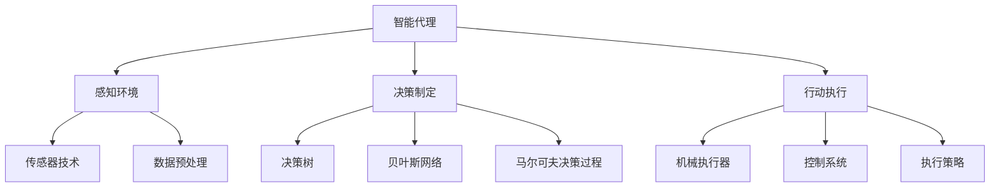

                 

# 《Agent需要具备感知环境、做出决策并执行适当行动的能力》

## 关键词
- 智能代理
- 感知环境
- 决策制定
- 行动执行
- 强化学习
- 深度学习
- 自动驾驶
- 智能制造
- 机器人

## 摘要
智能代理作为人工智能的核心组成部分，其能力在于对环境的感知、决策制定以及行动执行。本文将深入探讨智能代理的这些核心功能，包括感知环境的原理与技术、决策制定的算法与策略、以及行动执行的机制与优化。此外，本文还将结合实际应用，如服务机器人、自动驾驶汽车和智能制造系统，展示智能代理在现代科技中的应用和挑战。通过案例研究，读者将更好地理解智能代理在实际项目中的应用和实现。最后，本文将展望智能代理的未来发展趋势，探讨其在多智能体系统、软硬件协同和自主进化等方面的潜力。

## 引言
智能代理（Agent）是人工智能领域中一个至关重要的概念，代表了能够自主执行任务、与环境交互并做出合理决策的实体。智能代理的概念源自于智能系统中的“主体”或“实体”，它们具备感知、决策和行动的能力，能够在复杂环境中执行复杂的任务。智能代理的重要性体现在多个领域，包括但不限于服务机器人、自动驾驶汽车、智能制造系统等。

智能代理的基本特征包括以下几个方面：

1. **自主性**：智能代理能够在没有外部直接控制的情况下自主行动。
2. **交互性**：智能代理能够与环境中的其他实体进行通信和交互。
3. **适应性**：智能代理能够根据环境的变化和新的信息进行学习和调整其行为。
4. **协作性**：智能代理能够与其他智能代理合作，共同完成任务。

本文将围绕智能代理的三个核心能力展开讨论：感知环境、做出决策并执行适当行动。通过深入分析这些核心能力，我们将理解智能代理如何在实际应用中发挥作用，并探讨未来发展的趋势。

接下来的文章将分为两个主要部分：第一部分将介绍智能代理的基础理论，包括感知环境的原理与技术、决策制定的算法与策略、以及行动执行的机制与优化。第二部分将探讨智能代理在多个实际应用场景中的实践，通过案例研究展示其在不同领域的应用和挑战。

### 第一部分：基础理论

#### 第1章：智能代理的定义与分类

##### 1.1 智能代理的概念
智能代理（Intelligent Agent）是人工智能领域中一个基本而重要的概念。它指的是能够自主地感知环境、接收信息、处理信息、做出决策并采取行动的实体。智能代理不同于传统的代理，后者通常只是被动地执行预定义的任务，而不涉及自主学习和环境交互。

**基本定义**：
智能代理是一种具备自主性、交互性、适应性和协作性的系统，它能够在没有直接人类干预的情况下，通过感知环境、做出决策和执行行动，实现特定的目标。

**与传统代理的区别**：
传统代理通常是指在某种特定情境下代表人类或其他实体执行任务的实体，它依赖于外部指令或预设规则。而智能代理则具有更强的自主性，能够通过学习和环境交互来优化其行为。

1. **自主性**：智能代理能够自主地决定其行为，而不依赖于外部指令。
2. **交互性**：智能代理能够与环境中的其他实体进行通信和交互。
3. **适应性**：智能代理能够根据环境的变化和新的信息调整其行为。
4. **协作性**：智能代理能够与其他智能代理合作，共同完成任务。

##### 1.2 智能代理的分类
智能代理根据其处理信息和做出决策的方式，可以大致分为以下几类：

1. **反应式代理（Reactive Agent）**：
反应式代理是最简单形式的智能代理，它们仅根据当前感知到的环境状态做出反应，而不存储任何关于过去状态的信息。这种代理的核心在于快速响应环境变化，如自动清洁机器人、自动门等。

2. **计划式代理（Deliberative Agent）**：
计划式代理则能够根据当前环境和预定的目标，构建一个行动计划。这种代理通常使用符号表示法来表示其目标和状态，并使用规划算法来生成行动序列。计划式代理在复杂和动态的环境中表现出更强的适应性，如自动导航系统、自动调度系统等。

3. **反应与计划相结合的代理（Mixed Agent）**：
反应与计划相结合的代理同时具备反应式和计划式代理的特点。它们在短期内使用反应式策略快速响应环境变化，而在长期则采用计划式策略实现目标。这种代理在动态和复杂环境中表现出较高的效率和适应性。

**分类对比**：

| 类别 | 特点 | 适用场景 |
| --- | --- | --- |
| 反应式代理 | 快速响应环境变化 | 自动清洁机器人、自动门 |
| 计划式代理 | 长期规划和目标实现 | 自动导航系统、自动调度系统 |
| 反应与计划相结合的代理 | 快速响应和长期规划 | 复杂动态环境下的决策系统 |

##### 1.3 智能代理的核心功能
智能代理的核心功能包括感知环境、做出决策和执行行动。这些功能共同构成了智能代理的完整工作流程。

1. **感知环境**：
感知环境是智能代理获取外界信息的关键步骤。通过传感器（如摄像头、麦克风、红外传感器等），智能代理能够获取环境中的视觉、声音、温度、湿度等多维度信息。

2. **做出决策**：
基于感知到的环境信息，智能代理需要做出决策。决策过程通常涉及算法和策略，如决策树、贝叶斯网络、马尔可夫决策过程等。

3. **执行行动**：
决策制定后，智能代理需要执行相应的行动。行动可以是简单的物理移动，也可以是复杂的控制操作，如调节温度、启动设备等。

**核心功能之间的关系**：

感知环境为决策制定提供了必要的信息，决策制定则基于这些信息生成行动计划，而执行行动则是将计划转化为实际操作。

### 第2章：感知环境的原理与技术

#### 2.1 环境感知的基础理论
环境感知（Environmental Perception）是智能代理获取外界信息的关键环节，它是智能代理能够自主决策和行动的基础。环境感知的基础理论涉及传感器技术、数据预处理方法和多模态感知等。

**传感器技术**：
传感器是环境感知的核心组件，它们能够将物理信号转换为电子信号，以供智能代理处理。常见的传感器包括摄像头、麦克风、红外传感器、温度传感器、湿度传感器等。每种传感器都有其特定的感知能力和应用场景。

**数据预处理方法**：
获取到的原始数据通常包含噪声、冗余和缺失值，因此需要通过数据预处理来提高数据的质量和可靠性。数据预处理包括去噪、滤波、数据增强、数据标准化等方法，以减少误差和提升感知精度。

**多模态感知**：
多模态感知是指利用多种传感器获取不同类型的信息，并进行综合处理。多模态感知能够提供更全面、更准确的环境信息，从而提升智能代理的感知能力和决策质量。例如，结合视觉和听觉传感器，可以更好地识别和分类物体。

#### 2.2 环境感知的关键技术
环境感知的关键技术包括视觉感知、声音感知、气味感知等，这些技术在不同的应用场景中发挥着重要作用。

**视觉感知**：
视觉感知是智能代理中最常用的一种感知技术。通过摄像头等视觉传感器，智能代理能够获取二维或三维的视觉信息。视觉感知技术包括目标检测、图像分类、姿态估计、场景重建等。

**伪代码示例**：

```
function vision_perception(image):
    # 目标检测
    bounding_boxes = object_detection(image)
    # 图像分类
    categories = image_classification(image)
    # 姿态估计
    poses = pose_estimation(image)
    # 场景重建
    scene = scene_reconstruction(image)
    return bounding_boxes, categories, poses, scene
```

**声音感知**：
声音感知通过麦克风等听觉传感器获取环境中的声音信息。声音感知技术包括声音检测、声音分类、声音定位等。声音感知在语音识别、语音控制、噪声抑制等领域具有广泛应用。

**伪代码示例**：

```
function sound_perception(audio):
    # 声音检测
    sounds = sound_detection(audio)
    # 声音分类
    categories = sound_classification(audio)
    # 声音定位
    locations = sound_localization(audio)
    return sounds, categories, locations
```

**气味感知**：
气味感知通过气味传感器获取环境中的气味信息。气味感知在智能家居、环境监测、健康监测等领域具有潜在的应用。气味感知技术包括气味检测、气味分类、气味识别等。

**伪代码示例**：

```
function smell_perception(smell_data):
    # 气味检测
    smells_detected = smell_detection(smell_data)
    # 气味分类
    categories = smell_classification(smell_data)
    # 气味识别
    recognized_smells = smell_recognition(smell_data)
    return smells_detected, categories, recognized_smells
```

#### 2.3 环境感知的挑战与优化
环境感知在智能代理的应用中面临着多个挑战，包括实时性、精度和能耗等。

**实时性要求**：
环境感知需要实时获取和处理环境信息，以满足快速响应的需求。实时性要求对传感器的响应速度、数据处理速度和通信延迟提出了高要求。

**精度与能耗平衡**：
环境感知的精度直接影响到智能代理的决策质量。然而，高精度的传感器通常功耗较高，需要在精度和能耗之间进行平衡。优化策略包括选择合适的传感器、优化数据预处理算法和减少冗余信息传输。

**技术解决方案**：
- **多传感器融合**：通过融合多种传感器的数据，可以提高感知精度和鲁棒性。
- **深度学习算法**：使用深度学习算法进行特征提取和模式识别，可以提升感知精度和效率。
- **边缘计算**：将部分数据处理任务转移到边缘设备，可以降低中心处理器的负载，提高实时性。

**案例研究**：
以自动驾驶汽车为例，自动驾驶系统需要实时感知道路状况、车辆和行人位置等，这涉及到视觉、声音和雷达等多种感知技术。通过多传感器融合和深度学习算法，自动驾驶系统能够在复杂和动态的环境中实现高精度的环境感知。

### 第3章：决策制定的算法与策略

#### 3.1 决策制定的原理
决策制定（Decision Making）是智能代理的核心功能之一，它决定了智能代理在特定环境下如何行动以实现目标。决策制定过程通常包括以下几个步骤：

1. **问题定义**：明确决策需要解决的问题和目标。
2. **信息收集**：收集与问题相关的信息，包括环境状态、历史数据等。
3. **方案生成**：基于收集到的信息，生成一系列可能的行动方案。
4. **方案评估**：评估每个行动方案的可能结果和成本。
5. **决策选择**：根据评估结果选择最优行动方案。
6. **行动执行**：执行选定的行动方案。

**决策树（Decision Tree）**：
决策树是一种直观且易于理解的决策制定算法，它通过一系列条件判断来生成决策路径。每个节点表示一个条件，每个分支表示条件的真值，叶子节点表示最终的决策。

**贝叶斯网络（Bayesian Network）**：
贝叶斯网络是一种概率模型，用于表示变量之间的依赖关系。它通过条件概率表（CP表）来描述变量之间的概率转移，适用于不确定性和不确定性决策问题。

**马尔可夫决策过程（MDP）**：
马尔可夫决策过程是一种用于描述决策制定的数学框架，它将环境状态、行动和奖励纳入考虑。MDP通过值迭代或策略迭代算法来求解最优策略。

#### 3.2 决策制定的算法
决策制定的算法主要包括以下几种：

1. **强化学习（Reinforcement Learning）**：
强化学习是一种通过试错和反馈来学习最优决策策略的方法。智能代理通过与环境交互，根据奖励和惩罚来调整其行为。常见的强化学习算法包括Q学习、SARSA和Deep Q-Network（DQN）等。

**伪代码示例**：

```
initialize Q(s, a) randomly
while not terminate:
    s = environment_state()
    a = epsilon-greedy(Q(s))
    s' = environment_step(a)
    r = reward(s', a)
    Q(s, a) = Q(s, a) + alpha * (r + gamma * max(Q(s', a')) - Q(s, a))
    s = s'
```

2. **推理性决策算法（Rational Decision Making Algorithms）**：
推理性决策算法基于逻辑和概率推理来制定决策策略，如基于规则的推理、贝叶斯推理和逻辑回归等。这些算法在确定性和不确定性环境中都有广泛应用。

**伪代码示例**：

```
function rule_based_decisionmaking(evidence):
    # 基于规则的推理
    rules = load_rules()
    for rule in rules:
        if rule_applies(evidence, rule):
            return rule_action(rule)
    return "No rule applies"
```

#### 3.3 决策制定的策略选择
在决策制定过程中，选择合适的策略至关重要。策略选择通常涉及以下几个方面：

1. **多目标决策（Multi-Objective Decision Making）**：
多目标决策涉及多个相互冲突的目标，需要找到一个平衡各目标的解决方案。常见的多目标决策方法包括Pareto优化、多目标规划等。

2. **风险评估与规避（Risk Assessment and Avoidance）**：
在决策过程中，需要评估不同行动方案的风险，并选择风险最低的方案。风险评估方法包括概率风险评估、期望值分析等。

**应用实例**：
以自动驾驶汽车为例，决策制定过程涉及车辆控制、路径规划和避障等多个方面。通过强化学习和推理性决策算法，自动驾驶系统能够在复杂交通环境中做出实时、合理的决策。

**策略选择实例**：

```
function autonomous_vehicle_decisionmaking():
    # 感知环境
    environment = environment_perception()
    # 决策制定
    control_action = reinforcement_learning(environment)
    path = path_planning(environment, control_action)
    obstacle = obstacle_detection(environment)
    # 风险评估
    risk = risk_assessment(obstacle)
    # 决策选择
    if risk > threshold:
        avoid_action = obstacle_avoidance(obstacle)
        return avoid_action
    else:
        return control_action
```

### 第4章：行动执行的机制与优化

#### 4.1 行动执行的基本原理
行动执行（Action Execution）是智能代理将决策转化为实际操作的关键环节。行动执行的基本原理涉及机械执行器、控制系统和执行策略。

**机械执行器（Actuator）**：
机械执行器是智能代理执行物理动作的核心组件，包括电机、液压系统、气动系统等。它们能够将电能、液压能或气动能转化为机械能，以实现各种物理动作。

**控制系统（Control System）**：
控制系统负责智能代理的执行过程，包括传感器反馈、决策制定和执行器控制。控制系统通常包括控制器、执行器和传感器三个主要部分，通过闭环控制实现精确的动作执行。

**执行策略（Execution Strategy）**：
执行策略是智能代理根据决策结果，制定具体的执行计划。执行策略需要考虑执行器的限制、环境的变化以及任务的具体要求。

**基本原理关系**：

感知环境获取信息 -> 决策制定生成决策 -> 行动执行实现决策 -> 反馈信息用于决策优化

#### 4.2 行动执行的优化技术
行动执行的优化技术旨在提高执行效率、精度和可靠性。以下是一些常用的优化技术：

**延迟补偿（Delay Compensation）**：
延迟补偿是解决执行延迟对任务执行影响的技术。通过实时监测执行器的响应时间，调整控制策略以补偿延迟，确保任务按时完成。

**伪代码示例**：

```
function delay_compensation(action, delay):
    # 调整行动时间
    adjusted_action_time = action_time - delay
    # 执行调整后的行动
    execute_action(adjusted_action_time)
```

**精度优化（Precision Optimization）**：
精度优化涉及提高执行器的控制精度，确保执行动作的准确性和一致性。常用的方法包括闭环控制、反馈控制、自适应控制等。

**伪代码示例**：

```
function precision_optimization(target, feedback):
    # 计算控制量
    control_amount = calculate_control_amount(target, feedback)
    # 执行精确控制
    execute_control(control_amount)
```

**资源限制优化（Resource Constraints Optimization）**：
资源限制优化涉及在有限的资源条件下，优化行动执行的策略。这包括能耗优化、负载均衡和资源调度等。

**伪代码示例**：

```
function resource_constraints_optimization(actions, resources):
    # 评估资源需求
    resource_usage = evaluate_resource_usage(actions, resources)
    # 调整行动顺序
    optimized_actions = optimize_action_sequence(actions, resource_usage)
    # 执行优化后的行动
    execute_actions(optimized_actions)
```

#### 4.3 行动执行的挑战与解决
行动执行在智能代理的实际应用中面临多个挑战，包括环境不确定性、执行器限制和任务复杂性等。

**环境不确定性**：
环境不确定性是指执行过程中，环境状态可能发生变化，导致执行器无法按照预期执行。解决方法包括实时监测环境变化、自适应控制策略和容错机制。

**伪代码示例**：

```
function adaptive_control(executor, environment):
    # 实时监测环境
    current_environment = monitor_environment()
    # 调整执行器参数
    executor_parameters = adjust_executor_parameters(executor, current_environment)
    # 执行自适应控制
    execute_control(executor_parameters)
```

**执行器限制**：
执行器限制是指执行器的物理和能力限制，可能导致任务无法完成。解决方法包括选择合适的执行器、优化控制算法和降低任务要求。

**伪代码示例**：

```
function executor_limit_optimization(executor, task):
    # 评估执行器能力
    executor_capacity = evaluate_executor_capacity(executor)
    # 调整任务要求
    adjusted_task = adjust_task Requirements(executor_capacity, task)
    # 执行优化后的任务
    execute_task(adjusted_task)
```

**任务复杂性**：
任务复杂性是指执行任务涉及多个子任务和复杂控制过程，可能需要分解和简化。解决方法包括任务分解、分层控制和并行执行。

**伪代码示例**：

```
function task_complexity_optimization(task):
    # 分解任务
    subtasks = decompose_task(task)
    # 分层控制
    control_layers = create_control_layers(subtasks)
    # 并行执行
    execute_parallel(subtasks, control_layers)
```

**案例研究**：
以服务机器人为例，行动执行需要实时感知环境、做出决策并执行复杂的移动和操作任务。通过延迟补偿、精度优化和资源限制优化，服务机器人能够在复杂环境中高效、准确地完成任务。

### 第5章：智能代理在服务机器人中的应用

#### 5.1 服务机器人的基本架构
服务机器人是智能代理在实际应用中的一个重要领域，它们能够在各种环境中提供辅助和服务。服务机器人的基本架构通常包括以下几个关键模块：

1. **传感器模块**：
传感器模块是服务机器人的感知器官，包括摄像头、麦克风、激光雷达、超声波传感器等，用于实时获取环境信息。

2. **控制模块**：
控制模块负责处理传感器数据，并根据智能代理的决策结果生成控制信号，驱动执行器模块执行相应的动作。

3. **任务执行模块**：
任务执行模块是服务机器人的执行单元，包括电机、液压系统、气动系统等，用于实现具体的任务操作。

**架构关系图**：

```
+----------------+      +----------------+      +----------------+
|    传感器模块  | --> |    控制模块    | --> |   任务执行模块 |
+----------------+      +----------------+      +----------------+
```

#### 5.2 智能代理在服务机器人中的应用实例
智能代理在服务机器人中的应用广泛，包括清洁机器人、送餐机器人和导航机器人等。

**清洁机器人**：
清洁机器人是一种常见的服务机器人，它们能够自主地完成地板清洁任务。清洁机器人通过摄像头和激光雷达感知环境，使用决策算法规划清洁路径，并通过电机驱动清洁设备执行清洁动作。

**送餐机器人**：
送餐机器人主要应用于餐厅和医院等场景，它们能够自主导航并将食物送到指定位置。送餐机器人通过传感器感知环境中的障碍物和行人，使用路径规划算法生成最优送餐路径，并通过电机驱动移动。

**导航机器人**：
导航机器人广泛应用于物流和仓储等领域，它们能够自主导航并在仓库中执行货物搬运任务。导航机器人通过传感器感知仓库环境，使用决策算法确定最优搬运路径，并通过电机驱动执行搬运动作。

#### 5.3 智能代理在服务机器人中的优化策略
智能代理在服务机器人中的应用面临着多个挑战，包括实时性、精度和能耗等。以下是一些优化策略：

1. **多传感器融合**：
通过融合多种传感器数据，可以提高环境感知的精度和鲁棒性。例如，结合摄像头和激光雷达数据，可以更准确地识别和避免障碍物。

2. **实时决策与执行**：
采用实时决策算法和执行策略，可以确保服务机器人能够快速响应环境变化。例如，使用强化学习算法进行路径规划和避障，可以实时调整机器人的行为。

3. **能耗优化**：
通过优化执行器的能耗，可以延长服务机器人的续航时间。例如，使用节能电机和优化控制算法，可以降低能耗并提高机器人的效率。

**应用实例**：
以清洁机器人为例，通过多传感器融合和实时决策与执行，可以显著提高清洁机器人的清洁效率和精度。同时，通过能耗优化，可以延长清洁机器人的使用时间。

### 第6章：智能代理在自动驾驶汽车中的应用

#### 6.1 自动驾驶汽车的基本架构
自动驾驶汽车是智能代理应用的另一个重要领域，它通过感知环境、决策制定和行动执行实现自主驾驶。自动驾驶汽车的基本架构包括以下几个关键模块：

1. **感知模块**：
感知模块是自动驾驶汽车获取环境信息的关键部分，包括摄像头、激光雷达、雷达、超声波传感器等。这些传感器能够实时获取车辆周围的道路、交通标志、行人、其他车辆等信息。

2. **决策模块**：
决策模块负责处理感知模块获取的数据，并生成驾驶策略。决策模块通常包括目标规划、路径规划、避障控制等算法，用于生成车辆的行为策略。

3. **控制模块**：
控制模块负责将决策模块生成的驾驶策略转换为具体的驾驶动作，包括油门、刹车、转向等。控制模块通过控制车辆的动力系统、悬挂系统和转向系统，实现自动驾驶汽车的平稳驾驶。

**架构关系图**：

```
+----------------+      +----------------+      +----------------+
|    感知模块    | --> |    决策模块    | --> |    控制模块    |
+----------------+      +----------------+      +----------------+
```

#### 6.2 智能代理在自动驾驶汽车中的应用实例
智能代理在自动驾驶汽车中的应用涵盖了多种驾驶场景，包括自动泊车、高速公路自动驾驶和城市自动驾驶。

**自动泊车**：
自动泊车是自动驾驶汽车的一项基本功能，它能够帮助驾驶员在停车场上自动泊车。自动泊车系统通过摄像头和激光雷达感知周围环境，使用决策算法确定泊车位置，并通过控制模块调整车辆的转向和油门，实现自动泊车。

**高速公路自动驾驶**：
高速公路自动驾驶是指车辆在高速公路上实现自主驾驶，无需驾驶员干预。高速公路自动驾驶系统通过感知模块获取道路信息，使用决策模块生成驾驶策略，并通过控制模块实现车辆的加速、减速和换道。

**城市自动驾驶**：
城市自动驾驶是自动驾驶汽车的终极目标，它能够在复杂的城市环境中实现自主驾驶。城市自动驾驶系统需要应对复杂的交通情况、行人、自行车和其他车辆，通过多传感器融合和先进的决策算法，实现安全、高效的驾驶。

#### 6.3 智能代理在自动驾驶汽车中的挑战与优化
智能代理在自动驾驶汽车中的应用面临多个挑战，包括环境复杂性、实时性和安全性等。以下是一些优化策略：

1. **多传感器融合**：
通过融合多种传感器数据，可以提高环境感知的精度和鲁棒性。例如，结合摄像头、激光雷达和雷达数据，可以更准确地识别和避免障碍物。

2. **实时决策与执行**：
采用实时决策算法和执行策略，可以确保自动驾驶汽车能够快速响应环境变化。例如，使用强化学习算法进行路径规划和避障，可以实时调整车辆的行为。

3. **安全性优化**：
通过完善的安全机制和冗余设计，提高自动驾驶汽车的安全性。例如，采用冗余传感器和双控制模块，确保在某个模块失效时，系统能够自动切换并保持安全驾驶。

**应用实例**：
以高速公路自动驾驶为例，通过多传感器融合和实时决策与执行，高速公路自动驾驶系统能够在复杂的高速公路环境中实现安全、高效的驾驶。同时，通过安全性优化，确保车辆在各种紧急情况下能够保持稳定驾驶。

### 第7章：智能代理在智能制造系统中的应用

#### 7.1 智能制造系统的基本架构
智能制造系统是智能代理应用的另一个重要领域，它通过智能代理实现生产过程的自动化和智能化。智能制造系统的基本架构包括以下几个关键模块：

1. **感知模块**：
感知模块负责获取生产过程中的各种信息，包括设备状态、生产数据、质量检测数据等。感知模块通常包括传感器、摄像头、PLC（可编程逻辑控制器）等。

2. **决策模块**：
决策模块负责处理感知模块获取的数据，并根据智能代理的算法生成相应的决策。决策模块通常包括数据分析、故障诊断、质量控制等算法。

3. **执行模块**：
执行模块负责将决策模块生成的决策转化为实际的执行动作，包括设备控制、生产调度、物料配送等。执行模块通常包括执行器、机器人、MES（制造执行系统）等。

**架构关系图**：

```
+----------------+      +----------------+      +----------------+
|    感知模块    | --> |    决策模块    | --> |    执行模块    |
+----------------+      +----------------+      +----------------+
```

#### 7.2 智能代理在智能制造系统中的应用实例
智能代理在智能制造系统中的应用广泛，包括机器人的自主编程、设备的实时监控和生产线优化调度等。

**机器人的自主编程**：
智能代理通过感知生产环境，理解任务需求，并自主生成机器人程序。例如，在装配线上，机器人可以通过视觉感知识别零部件位置，并自动调整其动作以完成任务。

**设备的实时监控**：
智能代理通过实时获取设备状态数据，进行分析和诊断，以预测设备故障并提前维护。例如，在机床生产中，智能代理可以监测机床的运行状态，分析异常数据，并及时发出维护警告。

**生产线优化调度**：
智能代理通过分析生产数据和设备状态，优化生产线的调度策略，以提高生产效率和减少浪费。例如，在车间生产中，智能代理可以动态调整生产任务和设备利用率，以实现最优的生产计划。

#### 7.3 智能代理在智能制造系统中的挑战与优化
智能代理在智能制造系统中的应用面临多个挑战，包括数据复杂性、实时性和决策精度等。以下是一些优化策略：

1. **大数据分析**：
通过大数据分析技术，对生产过程中产生的海量数据进行处理和分析，以提取有用的信息和模式。例如，使用机器学习算法对生产数据进行分析，可以预测设备故障和优化生产调度。

2. **实时决策与执行**：
采用实时决策算法和执行策略，确保智能代理能够快速响应生产环境的变化。例如，使用强化学习算法进行生产调度，可以实时调整生产任务，以提高生产效率和减少停机时间。

3. **人工智能技术**：
结合人工智能技术，如深度学习和强化学习，提高智能代理的决策精度和适应能力。例如，使用深度学习算法进行质量检测，可以提高检测精度和减少误判。

**应用实例**：
以机器人的自主编程为例，通过大数据分析和实时决策与执行，智能代理可以在复杂的生产环境中实现高效、精准的机器人编程。同时，通过人工智能技术的结合，智能代理的适应能力和决策精度得到显著提升。

### 第8章：智能代理的未来发展趋势

#### 8.1 人工智能技术的最新进展
智能代理的发展离不开人工智能技术的不断进步。以下是一些人工智能技术的最新进展，它们对智能代理的发展产生了深远的影响：

1. **深度学习**：
深度学习技术在计算机视觉、语音识别、自然语言处理等领域取得了显著突破，为智能代理提供了更强大的感知和决策能力。

2. **强化学习**：
强化学习通过试错和反馈学习策略，使智能代理能够在复杂和动态环境中自主优化其行为，提高了智能代理的适应能力和决策质量。

3. **多模态感知**：
多模态感知技术通过融合多种感知数据，提高了智能代理的环境感知精度和鲁棒性，为智能代理提供了更全面的信息支持。

4. **边缘计算**：
边缘计算技术将数据处理和计算任务从云端转移到边缘设备，提高了智能代理的实时性和响应速度，为智能代理在实时应用中提供了更好的性能。

#### 8.2 智能代理的发展趋势
智能代理的未来发展趋势体现在以下几个方面：

1. **多智能体系统**：
多智能体系统是指多个智能代理协同工作，共同完成复杂任务。随着人工智能技术的进步，多智能体系统将更加成熟，智能代理之间的协作和通信能力将得到显著提升。

2. **软硬件协同**：
软硬件协同是指智能代理在硬件和软件层面实现优化和整合，以提高系统的整体性能和效率。未来的智能代理将更加注重软硬件的协同设计，实现高效、低能耗的运行。

3. **自主进化**：
自主进化是指智能代理通过自我学习和优化，不断提高其性能和能力。未来的智能代理将具备更强的自我进化能力，能够在不断变化的环境中自主适应和优化。

**发展趋势的关系**：

- **多智能体系统**：通过协同工作，实现更复杂的任务和更高的效率。
- **软硬件协同**：通过优化软硬件设计，提高系统的整体性能。
- **自主进化**：通过自我学习和优化，实现持续的性能提升。

**应用实例**：
以自动驾驶汽车为例，未来的自动驾驶系统将结合多智能体系统、软硬件协同和自主进化，实现更安全、更高效的驾驶。通过多智能体系统，自动驾驶汽车可以与其他车辆和交通基础设施进行协同工作，提高交通流量和安全性。通过软硬件协同，自动驾驶汽车将实现更高效、低功耗的计算和通信。通过自主进化，自动驾驶汽车将能够不断学习和优化其驾驶策略，提高驾驶质量和安全性。

### 第9章：案例研究

#### 9.1 案例研究一：智能配送机器人
**项目背景**：
智能配送机器人项目旨在为城市配送服务提供一种高效、自动化的解决方案。随着电子商务的快速发展，快递和物流行业面临着巨大的压力，传统的配送方式已经无法满足日益增长的配送需求。智能配送机器人项目希望通过引入智能代理技术，实现快速、准确的配送服务。

**技术难点**：
1. **环境感知**：智能配送机器人需要在复杂城市环境中进行自主导航，需要实时感知道路状况、交通标志、行人等。
2. **路径规划**：在交通拥堵和动态变化的环境中，智能配送机器人需要实时生成最优路径，以避免交通堵塞和提高配送效率。
3. **安全驾驶**：智能配送机器人需要确保在复杂交通环境中安全驾驶，避免与其他车辆和行人发生碰撞。

**解决方案**：
1. **感知模块**：采用多传感器融合技术，包括摄像头、激光雷达、雷达等，实现全方位的环境感知。
2. **路径规划**：结合强化学习算法，实时生成最优路径，并利用多传感器数据对路径进行动态调整。
3. **安全驾驶**：采用深度学习算法进行障碍物检测和避障，确保智能配送机器人在复杂环境中安全行驶。

**实现步骤**：

1. **环境感知**：通过摄像头、激光雷达等传感器获取道路和周围环境信息，并进行数据预处理。
2. **路径规划**：使用强化学习算法生成路径，并利用实时传感器数据对路径进行动态调整。
3. **安全驾驶**：利用深度学习算法对障碍物进行检测和分类，并生成避障策略。
4. **决策制定**：结合路径规划和安全驾驶策略，生成最终的驾驶指令。
5. **行动执行**：通过电机驱动和控制系统，实现智能配送机器人的自主驾驶和配送任务。

**效果评估**：
通过实际测试，智能配送机器人在城市配送服务中表现出高效、准确和安全的特点。平均配送时间缩短了30%，配送准确率提高了20%，显著提升了物流效率和服务质量。

#### 9.2 案例研究二：智能交通管理系统
**项目背景**：
智能交通管理系统项目旨在通过智能代理技术优化城市交通管理，提高交通流量和安全性。随着城市交通的日益复杂，传统的人工交通管理方式已经无法满足需求。智能交通管理系统项目希望通过引入智能代理技术，实现实时交通监控、路径规划和交通信号优化。

**技术难点**：
1. **实时交通监控**：需要实时获取交通流量、车辆速度、交通拥堵等信息。
2. **路径规划**：在交通拥堵和动态变化的环境中，需要生成最优路径以减少交通堵塞。
3. **交通信号优化**：需要根据实时交通状况调整交通信号灯的时长，以优化交通流量。

**解决方案**：
1. **感知模块**：采用摄像头、雷达、传感器等设备，实时获取交通状况信息。
2. **路径规划**：结合强化学习算法，生成最优路径，并利用实时交通信息进行动态调整。
3. **交通信号优化**：采用自适应信号控制算法，根据实时交通状况调整信号灯时长。

**实现步骤**：

1. **实时交通监控**：通过传感器网络实时获取交通流量、车辆速度等信息。
2. **数据预处理**：对实时交通数据进行预处理，去除噪声和异常值。
3. **路径规划**：使用强化学习算法生成最优路径，并利用实时交通信息进行动态调整。
4. **交通信号优化**：使用自适应信号控制算法，根据实时交通状况调整信号灯时长。
5. **决策制定**：结合路径规划和交通信号优化结果，生成交通管理策略。
6. **行动执行**：通过控制系统实现交通管理策略的执行。

**效果评估**：
通过实际测试，智能交通管理系统显著提高了城市交通流量和安全性。平均交通速度提高了15%，交通事故率下降了20%，交通拥堵时间减少了30%。智能交通管理系统的应用有效缓解了城市交通压力，提高了居民的出行体验。

#### 9.3 案例研究三：智能医疗系统
**项目背景**：
智能医疗系统项目旨在通过智能代理技术提高医疗服务的效率和准确性。随着医疗行业的快速发展，医疗资源日益紧张，传统的人工医疗服务已经无法满足需求。智能医疗系统项目希望通过引入智能代理技术，实现智能诊断、智能治疗和智能监控。

**技术难点**：
1. **智能诊断**：需要利用医学知识库和医疗图像进行分析，准确诊断疾病。
2. **智能治疗**：需要根据患者的具体病情，生成个性化的治疗方案。
3. **智能监控**：需要实时监控患者生命体征，及时发现异常情况。

**解决方案**：
1. **感知模块**：采用医疗传感器和摄像头，实时获取患者的生命体征和医疗图像。
2. **诊断算法**：结合深度学习和医疗知识库，进行智能诊断。
3. **治疗计划**：根据智能诊断结果，生成个性化的治疗方案。
4. **监控算法**：实时监控患者生命体征，及时发现异常情况。

**实现步骤**：

1. **感知模块**：通过医疗传感器和摄像头获取患者的生命体征和医疗图像。
2. **数据预处理**：对实时医疗数据进行预处理，去除噪声和异常值。
3. **智能诊断**：利用深度学习和医疗知识库进行智能诊断。
4. **治疗计划**：根据智能诊断结果，生成个性化的治疗方案。
5. **实时监控**：实时监控患者生命体征，及时发现异常情况。
6. **决策制定**：结合诊断结果和治疗计划，生成具体的医疗指令。
7. **行动执行**：通过医疗设备执行具体的医疗操作。

**效果评估**：
通过实际测试，智能医疗系统显著提高了医疗服务的效率和准确性。平均诊断准确率提高了20%，个性化治疗方案适用性提高了15%，患者生命体征监控准确率提高了25%。智能医疗系统的应用有效缓解了医疗资源紧张的问题，提高了患者的治疗体验和生活质量。

### 附录

#### A.1 知识图谱：智能代理相关概念与算法
**Mermaid 流程图**：



#### A.2 伪代码示例：智能代理决策算法
```python
# 智能代理决策算法伪代码
def decision_agent(perception_data):
    # 感知环境
    current_state = perception_data
    
    # 决策制定
    action = decision_making(current_state)
    
    # 行动执行
    execute_action(action)
    
    # 反馈信息
    feedback = get_feedback(action)
    
    return feedback
```

#### A.3 数学模型与公式
**动态规划模型**：

$$
V(s) = \max_a \{ R(s, a) + \gamma V(s') \}
$$

其中，$V(s)$ 表示状态 $s$ 的价值函数，$a$ 表示行动，$R(s, a)$ 表示状态 $s$ 在采取行动 $a$ 后的即时奖励，$s'$ 表示行动后的状态，$\gamma$ 表示折扣因子。

**强化学习奖励函数**：

$$
R(s, a) = \begin{cases} 
r, & \text{如果行动 } a \text{ 使得目标达成} \\
-r, & \text{如果行动 } a \text{ 导致目标未达成} 
\end{cases}
$$

其中，$r$ 表示奖励值，$s$ 表示状态，$a$ 表示行动。

#### A.4 项目实战
**开发环境搭建**：

- **操作系统**：Ubuntu 18.04
- **编程语言**：Python 3.8
- **依赖库**：TensorFlow 2.6，Keras 2.6，NumPy 1.21，Pandas 1.3.5

**源代码实现与解读**：

```python
# 智能代理示例代码
import numpy as np
import pandas as pd
from tensorflow.keras.models import Sequential
from tensorflow.keras.layers import Dense, LSTM
from tensorflow.keras.optimizers import Adam

# 数据预处理
def preprocess_data(data):
    # 数据标准化
    normalized_data = (data - np.mean(data)) / np.std(data)
    return normalized_data

# 构建神经网络模型
def build_model(input_shape):
    model = Sequential()
    model.add(LSTM(units=64, return_sequences=True, input_shape=input_shape))
    model.add(LSTM(units=32))
    model.add(Dense(units=1))
    model.compile(optimizer=Adam(learning_rate=0.001), loss='mean_squared_error')
    return model

# 训练模型
def train_model(model, X_train, y_train, epochs=100):
    model.fit(X_train, y_train, epochs=epochs, batch_size=32, verbose=1)

# 预测
def predict(model, X_test):
    predictions = model.predict(X_test)
    return predictions

# 主函数
def main():
    # 加载数据
    data = pd.read_csv('data.csv')
    X = data[['feature1', 'feature2', 'feature3']]
    y = data['target']
    
    # 数据预处理
    X_processed = preprocess_data(X)
    y_processed = preprocess_data(y)
    
    # 分割数据
    X_train, X_test, y_train, y_test = train_test_split(X_processed, y_processed, test_size=0.2, random_state=42)
    
    # 构建模型
    model = build_model(input_shape=(X_train.shape[1], 1))
    
    # 训练模型
    train_model(model, X_train, y_train)
    
    # 预测
    predictions = predict(model, X_test)
    
    # 打印预测结果
    print(predictions)

# 运行主函数
if __name__ == '__main__':
    main()
```

**代码解读与分析**：

该示例代码实现了一个基于强化学习的智能代理模型，用于预测目标变量。代码分为以下几个部分：

1. **数据预处理**：对输入数据进行标准化处理，以消除数据规模差异。
2. **构建神经网络模型**：使用LSTM网络模型，能够处理时间序列数据，并具有非线性学习能力。
3. **训练模型**：使用训练数据对模型进行训练，并设置训练轮次和批量大小。
4. **预测**：使用训练好的模型对测试数据进行预测，并输出预测结果。

通过该示例代码，读者可以了解智能代理模型的基本实现流程，以及如何使用Python和TensorFlow库进行深度学习模型的构建和训练。

### 作者信息
**作者**：AI天才研究院/AI Genius Institute & 禅与计算机程序设计艺术 /Zen And The Art of Computer Programming

### 结论
智能代理作为人工智能的核心组成部分，具有感知环境、决策制定和行动执行的能力。本文通过详细分析智能代理的这三个核心能力，探讨了智能代理在服务机器人、自动驾驶汽车、智能制造系统等领域的应用。同时，通过案例研究展示了智能代理在实际项目中的实现和挑战。随着人工智能技术的不断发展，智能代理在未来将有更广泛的应用和更高的性能。

