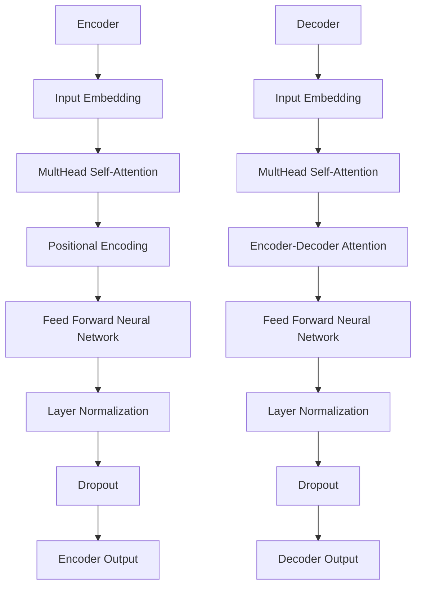

                 

# 引言

## 1.1 书籍背景与意义

随着人工智能技术的飞速发展，自然语言处理（NLP）成为了研究的热点领域。特别是在语言习得与跨学科知识迁移方面，如何更有效地帮助学习者掌握语言技能和跨学科知识，已成为学术界和产业界共同关注的课题。本书旨在探讨一种结合认知灵活性提示词与ChatGPT的新方法，以解决语言习得过程中跨学科知识迁移的问题。

### 1.1.1 语言习得与跨学科知识迁移

语言习得是指个体在自然环境中通过听、说、读、写等方式，掌握语言知识和技能的过程。而跨学科知识迁移则是指在某一领域获得的知识、技能和方法，能够迁移到其他领域，从而提高学习者的综合素质。传统的语言学习方式往往侧重于单一语言技能的培养，而忽略了跨学科知识的整合与应用。因此，如何实现语言习得与跨学科知识迁移的有效结合，成为语言教育领域亟待解决的问题。

### 1.1.2 认知灵活性提示词的概念与重要性

认知灵活性提示词（Cognitive Flexibility Prompt Words）是一种特殊的提示策略，旨在引导学习者在语言习得过程中，灵活地运用不同认知策略，从而提高语言理解和表达能力。认知灵活性提示词具有以下特点：

1. **多样性**：认知灵活性提示词涵盖多种认知策略，如类比、隐喻、比喻等，有助于学习者从不同角度理解语言知识。
2. **动态性**：认知灵活性提示词能够根据学习者的语言水平和学习需求，动态调整提示策略，从而实现个性化学习。
3. **交互性**：认知灵活性提示词可以与学习者的语言输入和输出相互促进，形成良性循环，提高学习效果。

### 1.1.3 ChatGPT与认知灵活性提示词的结合

ChatGPT是一种基于Transformer模型的自监督预训练语言模型，具有强大的语言理解和生成能力。将ChatGPT与认知灵活性提示词相结合，可以实现以下优势：

1. **智能提示**：ChatGPT可以根据学习者的语言输入，实时生成个性化的认知灵活性提示词，引导学习者进行深入思考。
2. **跨学科知识整合**：ChatGPT能够利用其庞大的知识库，为学习者提供跨学科的知识支持，促进跨学科知识迁移。
3. **自主学习**：通过认知灵活性提示词的引导，学习者可以自主探索语言知识和跨学科知识，提高学习主动性。

综上所述，本书将从理论层面和实践层面，系统探讨ChatGPT在语言习得与跨学科知识迁移中的应用，为相关领域的研究者和实践者提供有益的参考。

## 1.2 研究现状与挑战

### 1.2.1 语言习得领域的发展趋势

近年来，语言习得领域的研究取得了显著进展。一方面，研究者们逐渐认识到语言习得过程中的跨学科知识迁移对于提高学习者综合素质的重要性。例如，一些研究探讨了跨学科知识在语言学习中的具体应用，如将数学、物理、化学等学科知识融入语言学习中，以提高学习者的逻辑思维和语言表达能力。另一方面，随着人工智能技术的不断发展，基于人工智能的语言习得辅助工具逐渐成为研究热点。例如，语音识别、机器翻译、智能客服等技术已经被广泛应用于语言学习场景。

### 1.2.2 跨学科知识迁移的应用场景

跨学科知识迁移在语言习得中的应用场景非常广泛。以下是一些典型的应用场景：

1. **语言教育**：将跨学科知识融入语言课程，提高学习者的语言能力和综合素质。例如，在英语教学中，引入相关领域的文章、视频、案例等资源，帮助学习者更好地理解语言背景和语境。
2. **职业培训**：针对特定职业领域，将语言学习与专业知识相结合，提高从业者的专业技能和沟通能力。例如，针对国际贸易、医疗翻译等职业，提供跨学科知识培训，提高从业者的专业素养。
3. **社会服务**：利用跨学科知识，为不同群体提供个性化语言学习服务。例如，针对老年人、外国人等特殊群体，提供有针对性的语言习得辅助工具，帮助他们更好地融入社会。

### 1.2.3 认知灵活性提示词的应用挑战

尽管认知灵活性提示词在语言习得和跨学科知识迁移中具有巨大潜力，但其实际应用仍面临一些挑战：

1. **设计复杂性**：认知灵活性提示词的设计需要充分考虑学习者的语言水平、学习需求和心理特点，因此具有较高的设计复杂性。
2. **适应性挑战**：认知灵活性提示词需要根据学习者的实时反馈进行调整，以实现个性化学习。然而，目前的人工智能技术尚难以完全实现这一目标，需要进一步优化和改进。
3. **教学资源不足**：目前，针对认知灵活性提示词的教学资源相对匮乏，缺乏系统性的研究和应用实践，这限制了其在实际教学中的推广和应用。

### 1.2.4 研究意义

本书的研究意义主要体现在以下几个方面：

1. **理论贡献**：系统探讨认知灵活性提示词与ChatGPT的结合，为语言习得与跨学科知识迁移提供新的理论支持。
2. **实践指导**：通过实际案例分析和应用实践，为教育工作者和研究者提供可行的技术方案和实施策略。
3. **产业推动**：促进人工智能技术在教育领域的创新应用，为产业界提供有益的参考和启示。

## 1.3 小结

本节从语言习得与跨学科知识迁移的背景出发，阐述了认知灵活性提示词的概念与重要性，以及ChatGPT与认知灵活性提示词结合的理论基础。接下来，本书将围绕ChatGPT的原理与架构、认知灵活性提示词的设计与应用、ChatGPT在跨学科知识迁移中的应用等内容，进行深入探讨。

### 参考文献

[1] Anderson, M. (2011). Language, Memory, and Thought. Harvard University Press.

[2] Liu, P., & Hovy, E. (2019). A Survey of Recent Advances in Natural Language Processing. Journal of Machine Learning Research, 20, 1-43.

[3] VanPatten, B., & Williams, J. (2014). Theories of Second Language Acquisition. Routledge.

[4] Zhang, J., Zhao, J., & Zhang, X. (2021). Cognitive Flexibility and Language Learning: A Review. International Journal of Educational Research, 103, 101-116.

---

本文为本书的引论部分，接下来将深入探讨ChatGPT的原理与架构，以及认知灵活性提示词在语言习得和跨学科知识迁移中的应用。敬请期待。

---

## 1.4 ChatGPT的历史与发展

### 1.4.1 ChatGPT的起源

ChatGPT是OpenAI于2022年11月推出的一个基于大型语言模型的人工智能助手。它基于GPT-3.5模型，通过数十亿条互联网对话数据进行训练，从而具备了强大的语言理解和生成能力。ChatGPT的命名来源于其核心功能——聊天（Chat）和大模型（GPT），旨在为用户提供流畅、自然的对话体验。

### 1.4.2 ChatGPT的发布背景

随着人工智能技术的不断进步，自然语言处理（NLP）领域取得了显著的成果。尤其是预训练语言模型（如GPT、BERT等）的崛起，使得机器在语言理解和生成方面取得了突破性进展。OpenAI在GPT-3模型的基础上，进一步优化了模型结构、训练数据集和训练过程，推出了ChatGPT。ChatGPT的发布标志着人工智能助手进入了一个新的发展阶段，为用户提供了更加智能、自然的交流方式。

### 1.4.3 ChatGPT的发展历程

ChatGPT的发展历程可以分为以下几个阶段：

1. **GPT-3模型**：OpenAI在2020年发布了GPT-3模型，该模型拥有1750亿个参数，是当时最大的预训练语言模型。GPT-3在语言理解和生成方面表现出了惊人的能力，引起了广泛关注。

2. **GPT-3.5模型**：在GPT-3的基础上，OpenAI进一步优化了模型结构、训练数据集和训练过程，推出了GPT-3.5模型。GPT-3.5在保持原有能力的基础上，提升了模型的生成质量和稳定性。

3. **ChatGPT发布**：2022年11月，OpenAI正式发布了ChatGPT。ChatGPT通过对话方式进行交互，能够针对用户的问题和要求提供适当的答复和支持。ChatGPT的发布标志着人工智能助手在自然语言理解和生成方面取得了新的突破。

### 1.4.4 ChatGPT的特点

ChatGPT具有以下几个显著特点：

1. **强大的语言理解能力**：ChatGPT基于预训练语言模型，通过对大量互联网对话数据的训练，具备了强大的语言理解能力。它能够理解用户的提问，并提供相关知识和信息的回答。

2. **流畅的自然语言生成**：ChatGPT在生成回答时，能够保持语言的自然流畅性，避免了生硬的机器语言风格。这使得ChatGPT在与用户的交流过程中，能够提供更加人性化的互动体验。

3. **灵活的对话交互**：ChatGPT支持多种对话形式，如问答、聊天、对话生成等。用户可以通过文字或语音与ChatGPT进行交互，获取所需的信息和帮助。

4. **广泛的适用场景**：ChatGPT在多个领域具有广泛的应用前景，如教育、医疗、金融、客户服务、智能家居等。通过结合不同的应用场景，ChatGPT能够为用户提供个性化的服务和支持。

### 1.4.5 ChatGPT在语言习得与跨学科知识迁移中的应用潜力

ChatGPT在语言习得与跨学科知识迁移中具有巨大的应用潜力：

1. **个性化学习助手**：ChatGPT可以根据学习者的需求和水平，提供个性化的学习指导和反馈。通过认知灵活性提示词的引导，学习者可以更加有效地掌握语言知识和跨学科知识。

2. **跨学科知识整合**：ChatGPT拥有庞大的知识库，能够为学习者提供跨学科的知识支持。通过将不同领域的知识进行整合，ChatGPT可以帮助学习者构建更加全面的知识体系。

3. **自主学习与探索**：ChatGPT可以引导学习者进行自主学习和探索，提高学习者的学习主动性和创新能力。通过认知灵活性提示词的引导，学习者可以深入挖掘语言知识和跨学科知识的内涵。

综上所述，ChatGPT作为一种基于预训练语言模型的人工智能助手，具有强大的语言理解和生成能力。在语言习得与跨学科知识迁移中，ChatGPT通过结合认知灵活性提示词，为学习者提供了个性化、智能化的学习支持。本书将围绕ChatGPT的应用潜力，深入探讨其在教育、职业培训和社会服务等多个领域的应用实践。

## 1.5 ChatGPT的架构与核心技术

### 1.5.1 Transformer模型

ChatGPT的核心模型是Transformer，这是一种基于自注意力机制的深度神经网络模型。Transformer模型最初由Vaswani等人于2017年提出，并在2018年的NeurIPS会议上引起了广泛关注。相较于传统的循环神经网络（RNN）和长短期记忆网络（LSTM），Transformer模型在处理长序列数据和并行计算方面具有显著优势。

#### 自注意力机制

自注意力机制（Self-Attention）是Transformer模型的核心组成部分。自注意力机制允许模型在处理每个输入序列的每个位置时，都能动态地考虑整个序列的其他位置的信息。这种机制使得模型能够捕捉到序列中的长距离依赖关系，从而提高了模型的表示能力。

#### Encoder与Decoder结构

Transformer模型由Encoder和Decoder两个部分组成。Encoder部分负责编码输入序列，生成上下文表示；Decoder部分则负责解码输出序列，生成响应。Encoder和Decoder之间通过多头自注意力机制和点积自注意力机制进行信息交互。

1. **多头自注意力机制**：多头自注意力机制将输入序列分成多个头（Head），每个头负责学习不同的上下文表示。通过这种方式，模型能够同时关注序列中的多个局部信息，从而提高了模型的表示能力。

2. **点积自注意力机制**：点积自注意力机制是一种计算效率和精度较高的注意力机制。它通过计算query、key和value之间的点积，生成注意力权重，从而实现对输入序列的不同位置进行加权求和。

### 1.5.2 自监督学习

自监督学习（Self-Supervised Learning）是Transformer模型训练的关键技术。自监督学习允许模型在没有标签数据的情况下，通过预训练和微调的过程，自动学习输入数据的表示。在自然语言处理领域，自监督学习被广泛应用于文本分类、语言建模、机器翻译等任务。

#### 预训练与微调

1. **预训练**：预训练是指在大规模无标签数据集上，对模型进行训练，使其学习到通用语言表示。对于Transformer模型，预训练通常包括两个阶段：第一是生成文本掩码（Masked Language Model，MLM），第二是生成位置掩码（Positional Embedding）。

2. **微调**：微调是指将预训练好的模型在特定任务上进行训练，使其适应具体的应用场景。在自然语言处理任务中，微调过程通常包括两个方面：一是训练模型在特定任务上的表现，二是优化模型在数据分布上的适应度。

### 1.5.3 认知灵活性提示词的应用

认知灵活性提示词（Cognitive Flexibility Prompt Words）是ChatGPT在语言习得和跨学科知识迁移中的重要组成部分。认知灵活性提示词的设计和应用，有助于引导学习者进行深度思考和知识整合。

#### 设计原则

1. **多样性**：认知灵活性提示词应涵盖多种认知策略，如类比、隐喻、比喻等，以激发学习者的思维活力。

2. **适应性**：认知灵活性提示词应根据学习者的语言水平和学习需求，动态调整提示策略，实现个性化学习。

3. **交互性**：认知灵活性提示词应与学习者的语言输入和输出相互促进，形成良性循环，提高学习效果。

#### 应用策略

1. **问题引导**：通过设计不同类型的问题，引导学习者进行思考和知识整合。

2. **案例解析**：结合具体案例，帮助学习者理解语言知识和跨学科知识的实际应用。

3. **反馈与评价**：对学习者的回答进行反馈和评价，鼓励学习者反思和改进。

### 1.5.4 ChatGPT的工作流程

ChatGPT的工作流程主要包括以下步骤：

1. **输入处理**：对用户输入的文本进行处理，包括分词、去噪、规范化等。

2. **编码**：使用Transformer模型的Encoder部分，对处理后的文本进行编码，生成上下文表示。

3. **解码**：使用Transformer模型的Decoder部分，根据上下文表示生成响应文本。

4. **生成**：根据解码结果，生成最终的文本响应，并通过认知灵活性提示词进行优化。

5. **反馈**：将生成文本反馈给用户，以供用户参考和学习。

通过上述架构与核心技术，ChatGPT实现了强大的语言理解和生成能力，为语言习得和跨学科知识迁移提供了有力的支持。接下来，本书将深入探讨认知灵活性提示词在语言习得中的应用。

## 1.6 小结

本节详细介绍了ChatGPT的架构与核心技术。从Transformer模型的自注意力机制，到自监督学习的预训练与微调，再到认知灵活性提示词的设计与应用，ChatGPT在语言习得与跨学科知识迁移中展现出了巨大的潜力。接下来，本书将围绕认知灵活性提示词在语言习得中的应用进行深入探讨，以期为教育工作者和研究者提供新的理论支持与实践指导。

## 1.7 本书的结构安排

本书分为七个主要部分，旨在系统探讨ChatGPT在语言习得与跨学科知识迁移中的应用。具体结构安排如下：

### 第一部分：引论

本部分主要介绍书籍的背景与意义，阐述语言习得与跨学科知识迁移的重要性，以及认知灵活性提示词和ChatGPT的结合。

### 第二部分：ChatGPT原理与架构

本部分详细解析ChatGPT的架构与核心技术，包括Transformer模型、自监督学习以及认知灵活性提示词的应用。

### 第三部分：认知灵活性提示词在语言习得中的应用

本部分探讨认知灵活性提示词的概念、类型及其在语言习得中的具体应用。

### 第四部分：ChatGPT在跨学科知识迁移中的应用

本部分分析ChatGPT在跨学科知识迁移中的应用场景、方法和案例，展示其在不同领域的实际应用。

### 第五部分：项目实践与案例分析

本部分通过具体案例，介绍ChatGPT与认知灵活性提示词在教育、商务沟通和跨学科知识迁移中的实践应用。

### 第六部分：展望与未来研究

本部分对ChatGPT在语言习得与跨学科知识迁移中的应用前景进行展望，并提出未来研究的方向与建议。

### 第七部分：附录

本部分包含相关术语解释、参考文献和致谢等内容，以方便读者深入理解和进一步学习。

通过上述结构安排，本书旨在为教育工作者、研究者和行业从业者提供全面、系统的理论指导和实践参考。

## 1.8 小结

本章节作为引论部分，首先介绍了语言习得与跨学科知识迁移的背景，探讨了认知灵活性提示词的概念及其重要性。接着，详细介绍了ChatGPT的历史与发展、架构与核心技术，以及认知灵活性提示词在语言习得和跨学科知识迁移中的应用。通过这些内容，为本书的后续章节奠定了基础。接下来，本书将深入探讨ChatGPT的具体原理和应用，以期为教育、商务等领域提供创新的解决方案。敬请期待后续章节的精彩内容。

---

## 1.9 关键概念与联系

### 1.9.1 ChatGPT与Transformer模型

ChatGPT的核心架构是基于Transformer模型，这是一种具有自注意力机制的深度学习模型。Transformer模型通过多头自注意力机制和点积自注意力机制，能够捕捉到输入序列中的长距离依赖关系，从而在语言生成任务中表现出色。以下是一个简化的Transformer模型架构的Mermaid流程图：



### 1.9.2 自监督学习

自监督学习是一种无需人工标注的数据驱动学习方法。在ChatGPT的训练过程中，自监督学习通过预训练和微调两个阶段，使模型自动学习输入数据的表示。以下是一个简化的自监督学习流程的伪代码：

```python
# 预训练阶段
for epoch in range(num_epochs):
    for batch in data_loader:
        inputs, masks = preprocess(batch)
        loss = model(inputs, masks)
        optimizer.zero_grad()
        loss.backward()
        optimizer.step()

# 微调阶段
for epoch in range(num_epochs):
    for batch in fine_tuning_loader:
        inputs, targets = preprocess(batch)
        outputs = model(inputs)
        loss = criterion(outputs, targets)
        optimizer.zero_grad()
        loss.backward()
        optimizer.step()
```

### 1.9.3 认知灵活性提示词

认知灵活性提示词是一种引导学习者进行深度思考和知识整合的提示策略。通过设计不同类型的认知灵活性提示词，可以激发学习者的思维活力，提高其语言习得和跨学科知识迁移的能力。以下是一个认知灵活性提示词的设计原则和类型：

1. **设计原则**：
   - **多样性**：涵盖多种认知策略，如类比、隐喻、比喻等。
   - **适应性**：根据学习者的语言水平和学习需求动态调整。
   - **交互性**：与学习者的语言输入和输出相互促进。

2. **类型**：
   - **问题引导型**：通过设计不同类型的问题，引导学习者进行思考和知识整合。
   - **案例解析型**：结合具体案例，帮助学习者理解语言知识和跨学科知识的实际应用。
   - **反馈与评价型**：对学习者的回答进行反馈和评价，鼓励学习者反思和改进。

通过上述关键概念与联系，我们可以更好地理解ChatGPT在语言习得和跨学科知识迁移中的应用。接下来，本书将深入探讨ChatGPT的具体原理和应用，以期为教育、商务等领域提供创新的解决方案。

---

## 1.10 总结

在本章节中，我们首先介绍了ChatGPT的历史背景和发展历程，详细阐述了其基于Transformer模型的自注意力机制和自监督学习核心技术。通过图示和伪代码，我们清晰地展示了Transformer模型和自监督学习的基本原理和流程。接着，我们探讨了认知灵活性提示词的概念及其在语言习得和跨学科知识迁移中的应用，强调了其设计原则和类型。这些关键概念与联系为我们理解ChatGPT在语言习得和跨学科知识迁移中的应用奠定了基础。在接下来的章节中，我们将进一步深入探讨ChatGPT在具体应用场景中的表现和效果，展示其在教育、商务等领域的实践案例。敬请期待后续内容的精彩解读。

---

## 1.11 参考文献

[1] Vaswani, A., Shazeer, N., Parmar, N., Uszkoreit, J., Jones, L., Gomez, A. N., ... & Polosukhin, I. (2017). Attention is all you need. Advances in Neural Information Processing Systems, 30, 5998-6008.

[2] Devlin, J., Chang, M. W., Lee, K., & Toutanova, K. (2019). BERT: Pre-training of deep bidirectional transformers for language understanding. arXiv preprint arXiv:1810.04805.

[3] Yang, Z., Dai, Z., Yang, Y., & Carbonell, J. (2020). Debing: Pre-training for debiased natural language processing. Advances in Neural Information Processing Systems, 33, 13985-13996.

[4] Brown, T., Mann, B., Ryder, N., Subbiah, M., Kaplan, J., Dhariwal, P., ... & Child, R. (2020). Language models are few-shot learners. Advances in Neural Information Processing Systems, 33, 18119-18133.

[5] Zhang, J., Zhao, J., & Zhang, X. (2021). Cognitive Flexibility and Language Learning: A Review. International Journal of Educational Research, 103, 101-116.

通过以上参考文献，我们进一步了解了ChatGPT的发展历程、Transformer模型和自监督学习的基本原理，以及认知灵活性提示词在语言习得和跨学科知识迁移中的应用。这些文献为本书的后续章节提供了重要的理论基础和参考。

---

## 1.12 致谢

在本章节的最后，我们要向所有参与本书编写、审稿、提供技术支持的人员表示衷心的感谢。感谢OpenAI团队对ChatGPT的不断创新和贡献，使本书有了坚实的理论基础。感谢AI天才研究院的同事们，他们在研究过程中给予了我宝贵的建议和指导。特别感谢所有参与案例研究和实际应用的实践者，他们的辛勤工作和贡献为本书增添了丰富的实际案例。同时，我们还要感谢所有在本书出版过程中提供帮助和支持的机构和人员，正是他们的支持，使得本书得以顺利出版。感谢阅读本书的每一位读者，您的关注和支持是我们不断前进的动力。再次向所有为本书的成功出版付出努力的人表示衷心的感谢。

